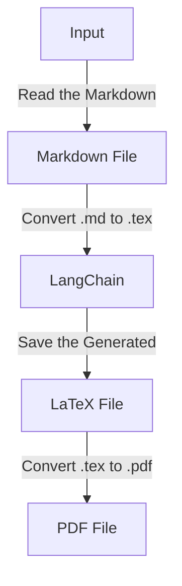
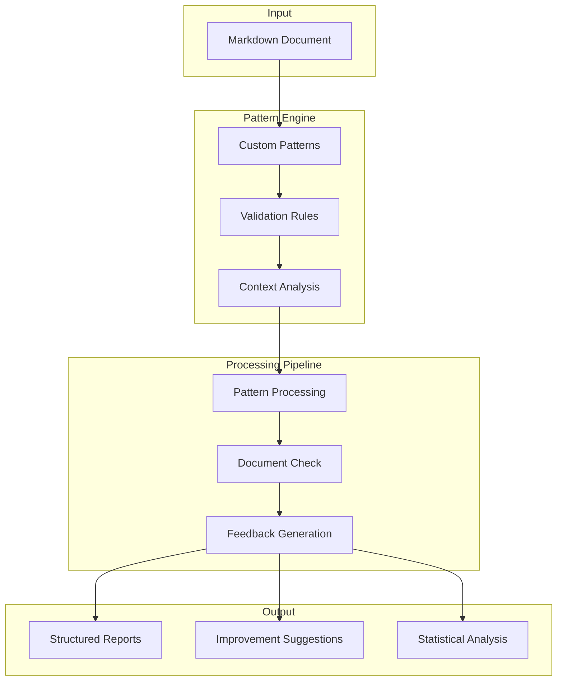

# Daily Progress Report: Report Generator Improvements and Document Critique System

**Project Team:** Benjamin Koo, Angelita, Lichung Koo, Rony  
**Date:** 2025-02-22  
**Version:** 1.0

## Executive Summary
Today marked a pivotal day in the development of the GASING project's documentation systems. The team focused on enhancing both the report generation and document critique systems, achieving significant progress in each area. The report generator saw key improvements in its conversion processes, although some structural and formatting challenges remain to be addressed. These improvements are expected to streamline the conversion of Markdown documents into professional-grade PDFs, enhancing the overall efficiency of documentation workflows.

Simultaneously, the document critique system was successfully implemented using the Fabric framework. This system is designed to provide automated validation and feedback for markdown documents, ensuring they adhere to established documentation standards. By leveraging advanced pattern-matching capabilities, the critique system aims to reduce the manual effort required for document review, thus improving consistency and quality across all documentation.

## Goals
The overarching goal of these initiatives is to enhance documentation efficiency within the IT Del community and the broader GASING project ecosystem. This is being pursued through a dual focus on process optimization and future readiness. Process optimization involves implementing automated conversion processes that significantly reduce manual formatting effort, thereby providing a streamlined workflow that both faculty and students can easily utilize. This approach not only saves time but also ensures that documentation is consistently high-quality and professional.

Future readiness is another critical aspect of our goals. The systems are being designed with scalability in mind, capable of supporting the growing documentation needs of the community. By incorporating an adaptable framework, the systems are prepared to integrate emerging educational technologies, ensuring they remain relevant and effective as the landscape of educational documentation evolves. This forward-thinking approach ensures that the GASING project remains at the forefront of documentation innovation, providing tools that are both robust and adaptable to future challenges.

## Key Developments

### Report Generator Improvements
- Enhanced the report generator's capabilities, focusing on improving the conversion process from Markdown to PDF.
- Using other gemini model for conversion
- Identified areas where structural and formatting issues persist, which will be addressed in future updates.
- Documentation and specifications for the PDF Generator have been outlined in [PDF_Generator.md](../architecture/system-design/specifications/PDF_Generator.md).

### Document Critique System

The document critique system has been successfully developed using the Fabric framework, a powerful tool for pattern-matching and document analysis. This system is designed to enhance the quality and consistency of markdown document reports by providing automated validation and feedback. 

The critique system leverages Fabric's capabilities to analyze document structure, content, and style against predefined patterns and rules. These patterns are customizable, allowing for the creation of specific validation criteria tailored to the needs of the IT Del community and the GASING project. The system can perform checks such as heading hierarchy validation, content structure analysis, and formatting consistency, ensuring that documents adhere to established documentation standards.

By automating the critique process, the system significantly reduces the manual effort required for document review, enabling faster turnaround times and more consistent quality across all documentation. Detailed specifications for the Critic Generator, including the system's architecture and functionality, are available in [CriticGenerator.md](../architecture/system-design/specifications/CriticGenerator.md).

## Workflow Report Generator Procedure

##### 1. User Input (Date Selection)

The workflow begins with a user-friendly interface designed to facilitate document selection. This initial step is crucial for ensuring that the correct file is identified and handled properly.
- The Python script prompts the user to enter a date in `"YYYY-MM-DD"` format.
- It constructs the `.md` file path based on the entered date:
  ```
  Docs/to-do-plan/docs/reports/daily/2025-02/[report]YYYY-MM-DD.md
  ```
- If the file does not exist, an error message is displayed.

##### 2. Read the Markdown (`.md`) File
This critical first step involves parsing and validating the input document to ensure it meets our rigorous formatting requirements. The system meticulously examines the structure and content of the selected Markdown file, identifying any deviations from the expected format. This validation process is essential for preventing errors in subsequent processing stages and ensuring that the document is correctly interpreted and transformed. By addressing potential formatting issues at this early stage, the workflow maintains a high standard of document quality and consistency throughout the conversion process:
- Open and read the contents of the selected `.md` file.
- Ensure the file is structured properly and handle potential formatting issues.

##### 3. Convert `.md` to `.tex` using LangChain + Gemini API
The core transformation step harnesses the power of advanced AI capabilities to convert Markdown content into a meticulously formatted LaTeX document. This process is integral to ensuring the accurate preservation of the original document's structure and formatting nuances. By leveraging sophisticated algorithms and AI-driven techniques, the system is able to interpret and translate complex Markdown elements into their LaTeX equivalents, maintaining the integrity of tables, bullet points, code blocks, and mathematical expressions. This transformation not only enhances the document's professional appearance but also ensures consistency and precision in its presentation:
- Use LangChain to interact with the Gemini API.
- Provide a **well-structured prompt** to ensure accurate Markdown-to-LaTeX conversion.
- Example **prompt structure**:
  ```
  You are a LaTeX document formatter. Convert the following structured Markdown content into a properly formatted LaTeX document. Ensure: 
  - Proper document class, title, and sections. 
  - Tables, bullet points, and code blocks are correctly formatted. 
  - Mathematical expressions (if any) are converted properly.  

  Markdown Content:
      _[Insert Markdown content here]_
  ```
- The Gemini API responds with a LaTeX-formatted version of the document.
- **Note:** 
  - Use an AI tool called **Gemini** (via **LangChain**) to convert the Markdown content into LaTeX.
  - The AI is given clear instructions (a "prompt") to ensure the LaTeX output is well-structured and follows proper formatting rules.
  - In this section, the chunk method is used to implement reports that have quite a lot of text, because of the limitations of the LLM token.

##### 4. Save the Generated `.tex` File
Following the successful conversion, the system ensures that the LaTeX output is securely stored, adhering to a well-organized file structure. This step is crucial for maintaining the integrity and accessibility of the document. The system employs a consistent naming convention and directory organization, which facilitates easy retrieval and management of files. By systematically organizing the LaTeX files, the workflow supports efficient document handling and future reference, ensuring that all generated outputs are readily available for further processing or review:
- The converted LaTeX content is saved as:
  ```
  Docs/to-do-plan/docs/reports/daily/2025-02/latex/[report]YYYY-MM-DD.tex
  ```
- **Note:** 
  - LaTeX is a powerful tool for creating professional documents, especially for technical or scientific content. It uses special commands to format text.

##### 5. Convert `.tex` to `.pdf` using Python
The final conversion step utilizes industry-standard LaTeX tools to generate professional-quality PDF output:
- Use `pdflatex` (via `subprocess`) or `pylatex` to compile `.tex` into `.pdf`.
- Ensure all necessary LaTeX packages are included.
- Example command for `pdflatex`:
  ```python
  subprocess.run(["pdflatex", "-output-directory", output_dir, tex_file], check=True)
  ```
- If the compilation fails, handle errors appropriately.
- **Note:**
  - The LaTeX file (`.tex`) is compiled into a PDF document using `pdflatex`.
  - A Python script runs a command to convert the `.tex` file into a `.pdf` file.
  - This step is fully automated, so no manual work is needed.

##### 6. Save the Final `.pdf` File
The system ensures the final PDF document is stored and organized with precision, maintaining a consistent and logical file structure. This organization is vital for easy access and retrieval, allowing users to efficiently locate and utilize the generated reports. By adhering to a standardized naming convention and directory layout, the system supports seamless integration into existing workflows and enhances the overall manageability of document archives. This meticulous approach to file management guarantees that all generated PDFs are readily available for future reference or distribution:
- The resulting PDF is stored in the same directory with the same naming convention:
  ```
  Docs/to-do-plan/docs/reports/daily/2025-02/pdf/[report]YYYY-MM-DD.pdf
  ```

##### 7. Final Output
The workflow concludes with a comprehensive validation process and confirmation of successful document generation. This final step ensures that the entire conversion process has been executed correctly and that the resulting PDF document meets all specified requirements. The system performs a thorough check to verify the integrity and quality of the output, providing users with confidence in the accuracy and reliability of the generated reports. By confirming successful document creation, the workflow guarantees that all necessary steps have been completed and that the document is ready for distribution or further use:
- The script confirms the successful creation of the `.pdf` file.
- The user can now access the structured daily report in PDF format.



## Workflow Document Critique System Procedure

### 1. Document Input
- The system accepts markdown documents as input for critique.
- Documents are parsed to identify key structural elements.

### 2. Pattern-Based Analysis
- Utilizes Fabric's pattern-matching capabilities for validation.
- Custom patterns are defined to check for adherence to documentation standards.
- Example patterns include:
  - Heading hierarchy validation
  - Content structure checks
  - Formatting consistency rules

### 3. Document Processing
- Stream-based processing ensures efficient handling of large documents.
- Incremental analysis allows for processing document changes without full reanalysis.
- Multi-format support enables handling of Markdown, restructured text, and other formats.

### 4. Feedback Generation
- Automated feedback is generated based on pattern analysis results.
- Feedback includes structured reports and improvement suggestions.
- Statistical analysis provides insights into document quality.

### 5. Output
- The system generates structured feedback reports and actionable improvement suggestions.
- Reports are stored in a centralized location for easy access and review.



This procedure outlines the comprehensive steps involved in the document critique process, leveraging Fabric's powerful capabilities to ensure high-quality documentation standards are met.

## Next Steps
- Address the remaining structural and formatting issues in the report generator.
- Expand the document critique system to support additional document formats.
- Continue refining both systems to enhance their efficiency and output quality.

## Conclusion

In conclusion, today's advancements in the report generation and document critique systems mark a significant step forward in enhancing the documentation workflow within the GASING project and the IT Del community. The improvements made to the report generator, despite some remaining challenges, are expected to streamline the conversion process, making it more efficient and user-friendly. The successful implementation of the document critique system using the Fabric framework underscores our commitment to maintaining high documentation standards through automated validation and feedback mechanisms.

Looking ahead, the focus will remain on addressing existing issues, expanding the capabilities of the critique system to support a wider range of document formats, and ensuring that our tools are scalable and adaptable to future needs. The team's dedication to continuous improvement will drive the ongoing development efforts, ensuring that our documentation tools meet the evolving demands of our community and project ecosystem.

## Additional Note
We have reviewed Li Fei Fei's paper and gained a foundational understanding of the research workflow, which includes key components such as Dataset Curation (s1K), Model Fine-Tuning, Budget Forcing Technique, Experiment and Evaluation, and Ablation Studies. However, there are still aspects that require further exploration to fully grasp the intricacies and nuances of these methodologies. By deepening our understanding, we can potentially derive valuable contributions for future projects.
