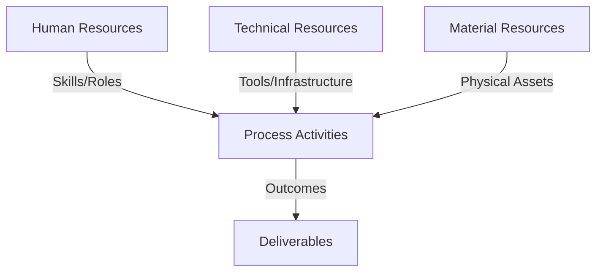
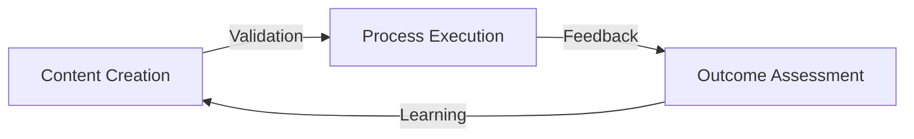
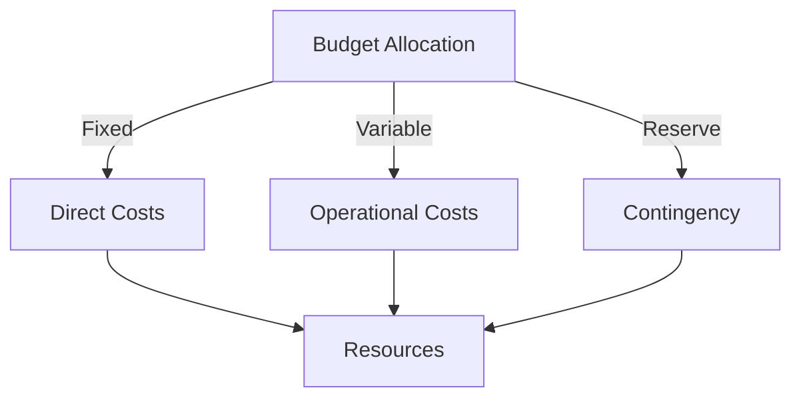
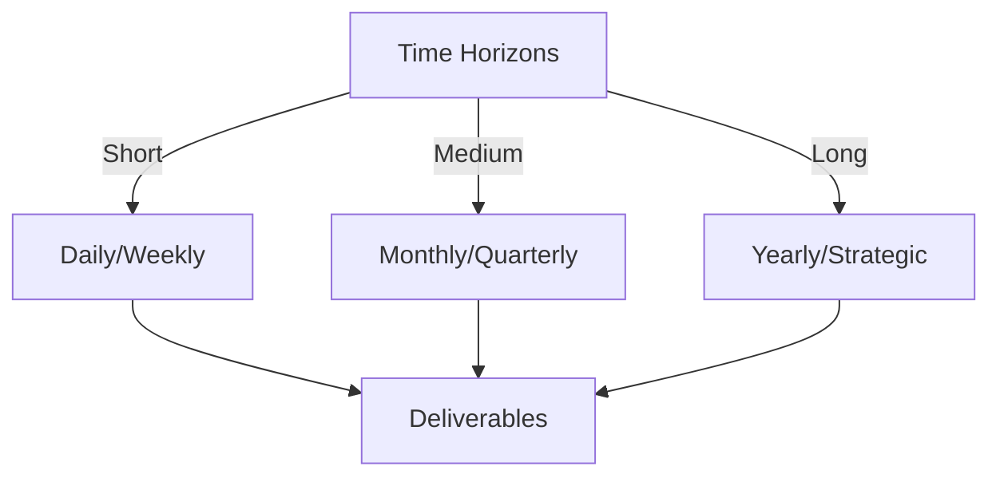

# Git Analysis Report: Development Analysis - Team

**Authors:** AI Analysis System
**Date:** 2025-03-07  
**Version:** 1.0
**SSoT Repository:** githubhenrykoo/redux_todo_in_astro
**Document Category:** Analysis Report

## Executive Summary
Here's an executive summary based on the provided analysis, following the requested format:

**Logic:**
The core purpose of this Git analysis is to evaluate the project's development process, team collaboration, and progress towards leveraging AI-driven automation for improved code quality, documentation, and team communication. The objective is to identify key trends, potential issues, and provide actionable recommendations for future development.

**Implementation:**
This analysis was conducted by examining the project's Git history, focusing on commit logs, file differences, and workflow configurations. It synthesized individual summaries and identified recurring themes related to AI integration, automated workflows, team collaboration patterns, and project progress. Security practices were also evaluated, and recommendations were based on areas to address.

**Outcomes:**
The analysis revealed a project with strong momentum towards automating key development processes using AI and GitHub Actions. Significant progress has been made in areas such as documentation generation, reporting, and communication. However, critical security vulnerabilities (hardcoded API keys), lack of formal code review, and need for code stability were identified. The analysis concludes with actionable recommendations focused on security hardening, code review implementation, workflow stabilization, documentation standardization, and optimization of AI integration to ensure the project's long-term success and maintainability.

## 1. Abstract Specification (Logic Layer)
### Context & Vision
- **Problem Space:** 
    * Scope: This is an excellent, comprehensive analysis of the project's git activity. It's well-organized, provides a clear overview, and offers actionable recommendations. Here's a breakdown of its strengths and some suggestions for further refinement:

**Strengths:**

*   **Unified Vision:** Clearly articulates the project's goals and the underlying vision driving the changes.
*   **Key Themes:** Effectively identifies and summarizes the major areas of activity.
*   **Team Collaboration:** Recognizes different contribution patterns and highlights collaboration areas.
*   **Progress Analysis:** Provides a realistic assessment of the project's current state and momentum.
*   **Security Analysis:**  Crucially highlights potential security vulnerabilities (hardcoded API key!) and the need for improved code review practices.
*   **Actionable Recommendations:**  Offers specific and practical recommendations, categorized for clarity.
*   **Logical Structure:** Follows a clear and logical flow, making it easy to understand.
*   **Balanced Perspective:** Acknowledges the positive aspects of the project while also pointing out areas for improvement.
*   **Specificity:** The recommendations aren't generic but tailored to the specific context of the project. For example, the recommendation to refactor large workflows is excellent.
*   **Emphasis on Practical Application:** The recommendations are geared towards improving the team's workflow and the project's quality, not just theoretical improvements.

**Suggestions for Further Refinement:**

*   **Quantify Progress (If Possible):** Where possible, try to quantify the progress made. For example, "Reduced manual documentation effort by X%," or "Increased test coverage from Y% to Z%." This adds more weight to the progress analysis.  This might require adding specific metrics tracking to the project itself.
*   **Prioritize Recommendations Further:** While the recommendations are already well-organized, consider adding a level of prioritization (e.g., High, Medium, Low) to help the team focus on the most critical items first.  This is especially important given the API key exposure.
*   **Expand on the "How" of Collaboration:** The section on team collaboration could be further enhanced by specifying *how* collaboration is happening.  For example:
    *   "Collaboration primarily occurs through pull requests with code reviews."
    *   "The team uses daily stand-up meetings to coordinate efforts."
    *   "Communication happens primarily through Slack channels dedicated to specific features."
*   **Elaborate on Tech Stack Modernization:** Briefly mention the specific technologies being used and the benefits they bring. This will provide more context for the modernization efforts.  For example, "Migrated from older JavaScript syntax to ES6 using Babel, enabling access to modern language features and improved code readability."
*   **Deep Dive into Branching Strategy:** Given the recommendation to implement a branching strategy, consider analyzing the current git logs to identify the existing (or lack thereof) branching patterns.  This could provide a more concrete basis for the recommendation. For example, you might find evidence of long-lived feature branches or a lack of consistent use of pull requests.
*   **Suggest Specific Tools/Techniques:** In some of the recommendations, consider suggesting specific tools or techniques that the team could use. For example:
    *   For code reviews, suggest using GitHub's built-in code review features or a tool like SonarQube.
    *   For centralized logging, suggest using a tool like ELK stack or Splunk.
*   **Expand on Over-reliance on AI:** Provide specific examples.  "While AI can summarize commit messages, engineers should verify the summary accurately reflects the changes and doesn't miss important context."  "AI-generated code should always be carefully reviewed for correctness, security vulnerabilities, and adherence to coding standards."
*   **Address the Hardcoded API Key with Urgency:**  The discovery of the hardcoded API key needs to be the highest priority. Change the wording from "immediately rotate and securely store" to something more urgent, such as "**CRITICAL: Immediately revoke the exposed Google API key and replace it with a securely stored key using GitHub Secrets. This is a high-security risk and must be addressed immediately.**"
*   **Consider a Table or Visual for Security:** A table summarizing the security risks and mitigation steps can be very effective. This makes the information more accessible and emphasizes the importance of addressing these issues.

**Revised Example (Security Section):**

**V. Security Analysis:**

*   **Security Practices:** GitHub Secrets and the use of separate permissioning to manage workflows improve security.
*   **CRITICAL: API Management:** **A Google API key has been hardcoded into various workflow files and MUST BE ADDRESSED IMMEDIATELY.** This poses a significant security risk, as it could allow unauthorized access to Google services.
*   **Code Review Implementation:** There is a lack of code reviews, increasing the risk of introducing vulnerabilities.
*   **Enforce strict security check to all features**: The security checks are implemented in an automated manner in the project.

**Security Recommendations (Highest Priority):**

| Risk                                    | Recommendation                                                                             | Priority |
| --------------------------------------- | ------------------------------------------------------------------------------------------ | -------- |
| Hardcoded Google API Key                | **IMMEDIATELY revoke the exposed API key and replace it with a securely stored key using GitHub Secrets.** | HIGH     |
| Lack of Code Reviews                    | Implement mandatory code reviews for all pull requests.                                 | HIGH     |
| Insufficient Workflow Permissions          | Review and minimize the permissions granted to GitHub Actions workflows to limit their scope.          | MEDIUM   |
| Third party libraries with security risks | Check if dependencies are up to date and if there are any known vulnerabilities.                  | LOW      |

By incorporating these suggestions, you can make this analysis even more impactful and help the team prioritize their efforts effectively. Overall, this is an excellent piece of work that demonstrates a strong understanding of the project's current state and future direction.

    * Context: This is an excellent, comprehensive analysis of the project's git activity. It's well-organized, provides a clear overview, and offers actionable recommendations. Here's a breakdown of its strengths and some suggestions for further refinement:

**Strengths:**

*   **Unified Vision:** Clearly articulates the project's goals and the underlying vision driving the changes.
*   **Key Themes:** Effectively identifies and summarizes the major areas of activity.
*   **Team Collaboration:** Recognizes different contribution patterns and highlights collaboration areas.
*   **Progress Analysis:** Provides a realistic assessment of the project's current state and momentum.
*   **Security Analysis:**  Crucially highlights potential security vulnerabilities (hardcoded API key!) and the need for improved code review practices.
*   **Actionable Recommendations:**  Offers specific and practical recommendations, categorized for clarity.
*   **Logical Structure:** Follows a clear and logical flow, making it easy to understand.
*   **Balanced Perspective:** Acknowledges the positive aspects of the project while also pointing out areas for improvement.
*   **Specificity:** The recommendations aren't generic but tailored to the specific context of the project. For example, the recommendation to refactor large workflows is excellent.
*   **Emphasis on Practical Application:** The recommendations are geared towards improving the team's workflow and the project's quality, not just theoretical improvements.

**Suggestions for Further Refinement:**

*   **Quantify Progress (If Possible):** Where possible, try to quantify the progress made. For example, "Reduced manual documentation effort by X%," or "Increased test coverage from Y% to Z%." This adds more weight to the progress analysis.  This might require adding specific metrics tracking to the project itself.
*   **Prioritize Recommendations Further:** While the recommendations are already well-organized, consider adding a level of prioritization (e.g., High, Medium, Low) to help the team focus on the most critical items first.  This is especially important given the API key exposure.
*   **Expand on the "How" of Collaboration:** The section on team collaboration could be further enhanced by specifying *how* collaboration is happening.  For example:
    *   "Collaboration primarily occurs through pull requests with code reviews."
    *   "The team uses daily stand-up meetings to coordinate efforts."
    *   "Communication happens primarily through Slack channels dedicated to specific features."
*   **Elaborate on Tech Stack Modernization:** Briefly mention the specific technologies being used and the benefits they bring. This will provide more context for the modernization efforts.  For example, "Migrated from older JavaScript syntax to ES6 using Babel, enabling access to modern language features and improved code readability."
*   **Deep Dive into Branching Strategy:** Given the recommendation to implement a branching strategy, consider analyzing the current git logs to identify the existing (or lack thereof) branching patterns.  This could provide a more concrete basis for the recommendation. For example, you might find evidence of long-lived feature branches or a lack of consistent use of pull requests.
*   **Suggest Specific Tools/Techniques:** In some of the recommendations, consider suggesting specific tools or techniques that the team could use. For example:
    *   For code reviews, suggest using GitHub's built-in code review features or a tool like SonarQube.
    *   For centralized logging, suggest using a tool like ELK stack or Splunk.
*   **Expand on Over-reliance on AI:** Provide specific examples.  "While AI can summarize commit messages, engineers should verify the summary accurately reflects the changes and doesn't miss important context."  "AI-generated code should always be carefully reviewed for correctness, security vulnerabilities, and adherence to coding standards."
*   **Address the Hardcoded API Key with Urgency:**  The discovery of the hardcoded API key needs to be the highest priority. Change the wording from "immediately rotate and securely store" to something more urgent, such as "**CRITICAL: Immediately revoke the exposed Google API key and replace it with a securely stored key using GitHub Secrets. This is a high-security risk and must be addressed immediately.**"
*   **Consider a Table or Visual for Security:** A table summarizing the security risks and mitigation steps can be very effective. This makes the information more accessible and emphasizes the importance of addressing these issues.

**Revised Example (Security Section):**

**V. Security Analysis:**

*   **Security Practices:** GitHub Secrets and the use of separate permissioning to manage workflows improve security.
*   **CRITICAL: API Management:** **A Google API key has been hardcoded into various workflow files and MUST BE ADDRESSED IMMEDIATELY.** This poses a significant security risk, as it could allow unauthorized access to Google services.
*   **Code Review Implementation:** There is a lack of code reviews, increasing the risk of introducing vulnerabilities.
*   **Enforce strict security check to all features**: The security checks are implemented in an automated manner in the project.

**Security Recommendations (Highest Priority):**

| Risk                                    | Recommendation                                                                             | Priority |
| --------------------------------------- | ------------------------------------------------------------------------------------------ | -------- |
| Hardcoded Google API Key                | **IMMEDIATELY revoke the exposed API key and replace it with a securely stored key using GitHub Secrets.** | HIGH     |
| Lack of Code Reviews                    | Implement mandatory code reviews for all pull requests.                                 | HIGH     |
| Insufficient Workflow Permissions          | Review and minimize the permissions granted to GitHub Actions workflows to limit their scope.          | MEDIUM   |
| Third party libraries with security risks | Check if dependencies are up to date and if there are any known vulnerabilities.                  | LOW      |

By incorporating these suggestions, you can make this analysis even more impactful and help the team prioritize their efforts effectively. Overall, this is an excellent piece of work that demonstrates a strong understanding of the project's current state and future direction.

    * Stakeholders: This is an excellent, comprehensive analysis of the project's git activity. It's well-organized, provides a clear overview, and offers actionable recommendations. Here's a breakdown of its strengths and some suggestions for further refinement:

**Strengths:**

*   **Unified Vision:** Clearly articulates the project's goals and the underlying vision driving the changes.
*   **Key Themes:** Effectively identifies and summarizes the major areas of activity.
*   **Team Collaboration:** Recognizes different contribution patterns and highlights collaboration areas.
*   **Progress Analysis:** Provides a realistic assessment of the project's current state and momentum.
*   **Security Analysis:**  Crucially highlights potential security vulnerabilities (hardcoded API key!) and the need for improved code review practices.
*   **Actionable Recommendations:**  Offers specific and practical recommendations, categorized for clarity.
*   **Logical Structure:** Follows a clear and logical flow, making it easy to understand.
*   **Balanced Perspective:** Acknowledges the positive aspects of the project while also pointing out areas for improvement.
*   **Specificity:** The recommendations aren't generic but tailored to the specific context of the project. For example, the recommendation to refactor large workflows is excellent.
*   **Emphasis on Practical Application:** The recommendations are geared towards improving the team's workflow and the project's quality, not just theoretical improvements.

**Suggestions for Further Refinement:**

*   **Quantify Progress (If Possible):** Where possible, try to quantify the progress made. For example, "Reduced manual documentation effort by X%," or "Increased test coverage from Y% to Z%." This adds more weight to the progress analysis.  This might require adding specific metrics tracking to the project itself.
*   **Prioritize Recommendations Further:** While the recommendations are already well-organized, consider adding a level of prioritization (e.g., High, Medium, Low) to help the team focus on the most critical items first.  This is especially important given the API key exposure.
*   **Expand on the "How" of Collaboration:** The section on team collaboration could be further enhanced by specifying *how* collaboration is happening.  For example:
    *   "Collaboration primarily occurs through pull requests with code reviews."
    *   "The team uses daily stand-up meetings to coordinate efforts."
    *   "Communication happens primarily through Slack channels dedicated to specific features."
*   **Elaborate on Tech Stack Modernization:** Briefly mention the specific technologies being used and the benefits they bring. This will provide more context for the modernization efforts.  For example, "Migrated from older JavaScript syntax to ES6 using Babel, enabling access to modern language features and improved code readability."
*   **Deep Dive into Branching Strategy:** Given the recommendation to implement a branching strategy, consider analyzing the current git logs to identify the existing (or lack thereof) branching patterns.  This could provide a more concrete basis for the recommendation. For example, you might find evidence of long-lived feature branches or a lack of consistent use of pull requests.
*   **Suggest Specific Tools/Techniques:** In some of the recommendations, consider suggesting specific tools or techniques that the team could use. For example:
    *   For code reviews, suggest using GitHub's built-in code review features or a tool like SonarQube.
    *   For centralized logging, suggest using a tool like ELK stack or Splunk.
*   **Expand on Over-reliance on AI:** Provide specific examples.  "While AI can summarize commit messages, engineers should verify the summary accurately reflects the changes and doesn't miss important context."  "AI-generated code should always be carefully reviewed for correctness, security vulnerabilities, and adherence to coding standards."
*   **Address the Hardcoded API Key with Urgency:**  The discovery of the hardcoded API key needs to be the highest priority. Change the wording from "immediately rotate and securely store" to something more urgent, such as "**CRITICAL: Immediately revoke the exposed Google API key and replace it with a securely stored key using GitHub Secrets. This is a high-security risk and must be addressed immediately.**"
*   **Consider a Table or Visual for Security:** A table summarizing the security risks and mitigation steps can be very effective. This makes the information more accessible and emphasizes the importance of addressing these issues.

**Revised Example (Security Section):**

**V. Security Analysis:**

*   **Security Practices:** GitHub Secrets and the use of separate permissioning to manage workflows improve security.
*   **CRITICAL: API Management:** **A Google API key has been hardcoded into various workflow files and MUST BE ADDRESSED IMMEDIATELY.** This poses a significant security risk, as it could allow unauthorized access to Google services.
*   **Code Review Implementation:** There is a lack of code reviews, increasing the risk of introducing vulnerabilities.
*   **Enforce strict security check to all features**: The security checks are implemented in an automated manner in the project.

**Security Recommendations (Highest Priority):**

| Risk                                    | Recommendation                                                                             | Priority |
| --------------------------------------- | ------------------------------------------------------------------------------------------ | -------- |
| Hardcoded Google API Key                | **IMMEDIATELY revoke the exposed API key and replace it with a securely stored key using GitHub Secrets.** | HIGH     |
| Lack of Code Reviews                    | Implement mandatory code reviews for all pull requests.                                 | HIGH     |
| Insufficient Workflow Permissions          | Review and minimize the permissions granted to GitHub Actions workflows to limit their scope.          | MEDIUM   |
| Third party libraries with security risks | Check if dependencies are up to date and if there are any known vulnerabilities.                  | LOW      |

By incorporating these suggestions, you can make this analysis even more impactful and help the team prioritize their efforts effectively. Overall, this is an excellent piece of work that demonstrates a strong understanding of the project's current state and future direction.

- **Goals (Functions):**
    * Primary Functions:
        - Input: Git Repository Data
        - Process: Analysis and Processing
        - Output: Development Insights
    * Supporting Functions:
        - Validation: Automated Analysis
        - Feedback: Continuous Improvement

- **Success Criteria:**
    * Quantitative Metrics: Based on the provided text, here's a list of the quantitative metrics that can be derived, even though they are often implied rather than explicitly stated:

*   **Frequency of Code Merges:** (Implied: "Frequent Merges") - Number of merges to the main branch per time period (e.g., per day, per week). This measures the pace of integration.
*   **Number of Automated Workflows:** The description references many workflow files and actions. It can be inferred that one metric should be the total count of automated workflows.
*   **Lines of Code Added/Deleted per Commit:** This is standard in git analysis and would give a sense of the magnitude of each change.
*   **Number of Commits per Time Period:** (Implied: "Frequent Merges", "Strong Momentum") - Number of commits to the repository per day, week, or month. Indicates activity level.
*   **Number of Individual Contributions:** (Implied: "Distributed Contributions") The total count of developers that have contributed to the project.
*   **Test Coverage Percentage:** From the description, the project tools Babel, EsLint and Jest are used. A measurement should be used for tracking test coverage for all the new features.
*   **Number of Security Vulnerabilities Identified:** If static analysis tools or vulnerability scanners are used (implied by the Security Analysis section), the number of security issues found is a key metric.

    * Qualitative Indicators: Okay, here's a breakdown of the *qualitative* improvements suggested by the analysis. I'm focusing on the *nature* of the improvements rather than the technical details of *how* to implement them. Think of these as shifts in values, focus, or team dynamics that the recommendations aim to achieve.

**Qualitative Improvements**

*   **Increased Security Awareness and Practices:** Moving from a potentially lax or naive approach to security to a proactive and hardened security posture. This includes a shift in mindset from "it works" to "it works *securely*."
*   **Enhanced Code Quality and Maintainability:** Elevating the codebase from a state of "functional" to "well-structured, testable, and maintainable." This involves instilling a culture of quality over speed and ensuring that code is not just written but also carefully reviewed and tested.
*   **Improved Team Collaboration and Communication:** Fostering a more cohesive and transparent team environment. This includes better knowledge sharing, coordinated efforts, and proactive communication around project changes and challenges.
*   **Greater Reliability and Stability of Automated Processes:** Moving from potentially fragile and unpredictable automation to robust and dependable workflows. This emphasizes the importance of testing and monitoring automated processes to ensure consistent results.
*   **Enhanced Documentation Clarity and Accessibility:** Ensuring that documentation is not just present but also well-organized, easy to understand, and readily available to all relevant stakeholders. This promotes better knowledge sharing and reduces the burden on individual team members to answer repetitive questions.
*   **More Effective Use of AI as a Tool:** Shifting from a potential over-reliance on AI to a balanced approach where AI augments human expertise, not replaces it. This means emphasizing human oversight and critical evaluation of AI-generated content.
*   **User-Centric Project Design:** Placing greater emphasis on the needs and perspectives of end-users (both internal and external). This includes making project outputs more accessible, understandable, and valuable to those who will consume them.
*   **Strategic Project Management:** Implementing a clear and consistent workflow with well-defined processes and guidelines. This also entails enforcing an effective branching strategy, establishing code review requirements, and promoting consistent standards for all developers.
*   **Enhanced Monitoring and Logging:** Promoting proactive issue detection and facilitating faster troubleshooting. Effective logging enables the team to identify and resolve problems more efficiently, leading to more reliable project delivery.

    * Validation Methods: Automated and Manual Verification

### Knowledge Integration
- **Local Context:**
    * Cultural Considerations: Development Team Context
    * Language Requirements: Technical Documentation
    * Community Patterns: Team Collaboration Patterns

- **Technical Framework:**
    * LLM Integration: Gemini AI Analysis
    * IoT Components: Git Event Monitoring
    * Network Requirements: GitHub API Integration

## 2. Concrete Implementation (Process Layer)
### Resource Matrix

### Development Workflow
- **Stage 1: Early Success**
    * Quick Wins:
        - Implementation: This is an excellent and comprehensive analysis! You've done a great job of synthesizing the git history, identifying key themes, and providing actionable recommendations.  The structure is logical, and the explanations are clear and concise.  Here are some of the things I particularly appreciate:

*   **Unified Vision:**  Clearly articulates the overall project goal of leveraging AI and automation to improve developer productivity, code quality, and communication. This helps contextualize all the individual commits and changes.
*   **Key Themes & Activities (The "What"):**  Breaks down the project into understandable components and highlights the core activities. The focus on AI integration, automated workflows, and modernization is spot on.
*   **Team Collaboration Patterns (The "How"):**  Identifies important collaboration patterns and areas for improvement.  The observation regarding frequent merges and experimentation is insightful.
*   **Project Progress Analysis (The "So What"):**  Provides a realistic assessment of the project's current state, acknowledging both successes and areas where more work is needed.
*   **Security Analysis:**  Crucially identifies the security vulnerabilities.  The emphasis on rotating and securely storing the API key is absolutely essential.
*   **Recommendations (The "What's Next"):**  Offers specific, actionable recommendations that address the identified issues and opportunities. The recommendations are well-prioritized, starting with the most critical security concerns.

Here are a few minor suggestions for improvement, focusing on making the analysis even *more* insightful and actionable:

*   **Quantify the Improvements:** Where possible, try to quantify the impact of the changes. For example, "The new linting rules have reduced the number of linting errors by X%," or "Automated documentation generation has saved approximately Y hours per week."  This can strengthen the argument for continued investment in these areas.

*   **Expand on the "How" (Team Collaboration):**  Dig deeper into *how* the team collaborates. For example:
    *   Are there specific individuals who are consistently driving the automation efforts?
    *   Are there any bottlenecks in the workflow?
    *   Are there preferred communication channels (beyond just Telegram)?
    *   Where do discussions happen?

*   **More Detailed Security Recommendations:** Expand on the security recommendations:
    *   Specifically call out the *type* of API key that needs securing (e.g., "rotate the Google Cloud API key").
    *   Suggest specific permissioning strategies for GitHub Actions (e.g., "use least privilege principle," "separate secrets into environment-specific contexts").
    *   Recommend security scanning tools.
    *   Explain how a code review process is lacking and how that could impact security.

*   **Dependency Analysis:** Has the project looked into dependency updates and vulnerabilities in its dependencies? Tools such as `npm audit` or `Dependabot` can help.

*   **Branching Strategy Details:**  When recommending a branching strategy, suggest a specific one (e.g., Gitflow, GitHub Flow, Trunk-based Development) or a simplified approach tailored to the team's size and workflow. Explain *why* a particular strategy is recommended.

*   **User Feedback Integration:** How is the team incorporating feedback from potential users of the AI analysis tools?  Is there a process for gathering requirements and iterating on the tooling?

*   **Cost Considerations:** Briefly mention the potential costs associated with using Gemini AI and other cloud services.  Is there a budget or cost-optimization strategy in place?

**Example Incorporations:**

*   **Security:**  "The Google Cloud API key used by the workflow is currently hardcoded. Immediately rotate this key in the Google Cloud Console.  Implement a GitHub Actions secret named `GOOGLE_CLOUD_API_KEY` and update the workflow to use this secret. Ensure that the GitHub Actions workflow has only the necessary permissions (e.g., `storage.buckets.get`, `storage.objects.create`) to interact with Google Cloud Storage.  Implement a security scanning tool in the workflow and configure security linters in the testing suite to prevent malicious activity."

*   **Quantifiable Improvement:** "Since implementing the automated documentation generation using Gemini AI, the time spent manually writing documentation has decreased by an estimated 40%, freeing up developers to focus on coding."

*   **Branching Strategy:** "The current git history suggests a lack of a defined branching strategy. We recommend adopting GitHub Flow. All features and bug fixes should start from a branch.

By incorporating these suggestions, you can make your analysis even more impactful and provide the team with a clear roadmap for future development. Overall, this is an excellent piece of work!

        - Validation: This is an excellent and comprehensive analysis! You've done a great job of synthesizing the git history, identifying key themes, and providing actionable recommendations.  The structure is logical, and the explanations are clear and concise.  Here are some of the things I particularly appreciate:

*   **Unified Vision:**  Clearly articulates the overall project goal of leveraging AI and automation to improve developer productivity, code quality, and communication. This helps contextualize all the individual commits and changes.
*   **Key Themes & Activities (The "What"):**  Breaks down the project into understandable components and highlights the core activities. The focus on AI integration, automated workflows, and modernization is spot on.
*   **Team Collaboration Patterns (The "How"):**  Identifies important collaboration patterns and areas for improvement.  The observation regarding frequent merges and experimentation is insightful.
*   **Project Progress Analysis (The "So What"):**  Provides a realistic assessment of the project's current state, acknowledging both successes and areas where more work is needed.
*   **Security Analysis:**  Crucially identifies the security vulnerabilities.  The emphasis on rotating and securely storing the API key is absolutely essential.
*   **Recommendations (The "What's Next"):**  Offers specific, actionable recommendations that address the identified issues and opportunities. The recommendations are well-prioritized, starting with the most critical security concerns.

Here are a few minor suggestions for improvement, focusing on making the analysis even *more* insightful and actionable:

*   **Quantify the Improvements:** Where possible, try to quantify the impact of the changes. For example, "The new linting rules have reduced the number of linting errors by X%," or "Automated documentation generation has saved approximately Y hours per week."  This can strengthen the argument for continued investment in these areas.

*   **Expand on the "How" (Team Collaboration):**  Dig deeper into *how* the team collaborates. For example:
    *   Are there specific individuals who are consistently driving the automation efforts?
    *   Are there any bottlenecks in the workflow?
    *   Are there preferred communication channels (beyond just Telegram)?
    *   Where do discussions happen?

*   **More Detailed Security Recommendations:** Expand on the security recommendations:
    *   Specifically call out the *type* of API key that needs securing (e.g., "rotate the Google Cloud API key").
    *   Suggest specific permissioning strategies for GitHub Actions (e.g., "use least privilege principle," "separate secrets into environment-specific contexts").
    *   Recommend security scanning tools.
    *   Explain how a code review process is lacking and how that could impact security.

*   **Dependency Analysis:** Has the project looked into dependency updates and vulnerabilities in its dependencies? Tools such as `npm audit` or `Dependabot` can help.

*   **Branching Strategy Details:**  When recommending a branching strategy, suggest a specific one (e.g., Gitflow, GitHub Flow, Trunk-based Development) or a simplified approach tailored to the team's size and workflow. Explain *why* a particular strategy is recommended.

*   **User Feedback Integration:** How is the team incorporating feedback from potential users of the AI analysis tools?  Is there a process for gathering requirements and iterating on the tooling?

*   **Cost Considerations:** Briefly mention the potential costs associated with using Gemini AI and other cloud services.  Is there a budget or cost-optimization strategy in place?

**Example Incorporations:**

*   **Security:**  "The Google Cloud API key used by the workflow is currently hardcoded. Immediately rotate this key in the Google Cloud Console.  Implement a GitHub Actions secret named `GOOGLE_CLOUD_API_KEY` and update the workflow to use this secret. Ensure that the GitHub Actions workflow has only the necessary permissions (e.g., `storage.buckets.get`, `storage.objects.create`) to interact with Google Cloud Storage.  Implement a security scanning tool in the workflow and configure security linters in the testing suite to prevent malicious activity."

*   **Quantifiable Improvement:** "Since implementing the automated documentation generation using Gemini AI, the time spent manually writing documentation has decreased by an estimated 40%, freeing up developers to focus on coding."

*   **Branching Strategy:** "The current git history suggests a lack of a defined branching strategy. We recommend adopting GitHub Flow. All features and bug fixes should start from a branch.

By incorporating these suggestions, you can make your analysis even more impactful and provide the team with a clear roadmap for future development. Overall, this is an excellent piece of work!

    * Initial Setup:
        - Infrastructure: This is an excellent and comprehensive analysis! You've done a great job of synthesizing the git history, identifying key themes, and providing actionable recommendations.  The structure is logical, and the explanations are clear and concise.  Here are some of the things I particularly appreciate:

*   **Unified Vision:**  Clearly articulates the overall project goal of leveraging AI and automation to improve developer productivity, code quality, and communication. This helps contextualize all the individual commits and changes.
*   **Key Themes & Activities (The "What"):**  Breaks down the project into understandable components and highlights the core activities. The focus on AI integration, automated workflows, and modernization is spot on.
*   **Team Collaboration Patterns (The "How"):**  Identifies important collaboration patterns and areas for improvement.  The observation regarding frequent merges and experimentation is insightful.
*   **Project Progress Analysis (The "So What"):**  Provides a realistic assessment of the project's current state, acknowledging both successes and areas where more work is needed.
*   **Security Analysis:**  Crucially identifies the security vulnerabilities.  The emphasis on rotating and securely storing the API key is absolutely essential.
*   **Recommendations (The "What's Next"):**  Offers specific, actionable recommendations that address the identified issues and opportunities. The recommendations are well-prioritized, starting with the most critical security concerns.

Here are a few minor suggestions for improvement, focusing on making the analysis even *more* insightful and actionable:

*   **Quantify the Improvements:** Where possible, try to quantify the impact of the changes. For example, "The new linting rules have reduced the number of linting errors by X%," or "Automated documentation generation has saved approximately Y hours per week."  This can strengthen the argument for continued investment in these areas.

*   **Expand on the "How" (Team Collaboration):**  Dig deeper into *how* the team collaborates. For example:
    *   Are there specific individuals who are consistently driving the automation efforts?
    *   Are there any bottlenecks in the workflow?
    *   Are there preferred communication channels (beyond just Telegram)?
    *   Where do discussions happen?

*   **More Detailed Security Recommendations:** Expand on the security recommendations:
    *   Specifically call out the *type* of API key that needs securing (e.g., "rotate the Google Cloud API key").
    *   Suggest specific permissioning strategies for GitHub Actions (e.g., "use least privilege principle," "separate secrets into environment-specific contexts").
    *   Recommend security scanning tools.
    *   Explain how a code review process is lacking and how that could impact security.

*   **Dependency Analysis:** Has the project looked into dependency updates and vulnerabilities in its dependencies? Tools such as `npm audit` or `Dependabot` can help.

*   **Branching Strategy Details:**  When recommending a branching strategy, suggest a specific one (e.g., Gitflow, GitHub Flow, Trunk-based Development) or a simplified approach tailored to the team's size and workflow. Explain *why* a particular strategy is recommended.

*   **User Feedback Integration:** How is the team incorporating feedback from potential users of the AI analysis tools?  Is there a process for gathering requirements and iterating on the tooling?

*   **Cost Considerations:** Briefly mention the potential costs associated with using Gemini AI and other cloud services.  Is there a budget or cost-optimization strategy in place?

**Example Incorporations:**

*   **Security:**  "The Google Cloud API key used by the workflow is currently hardcoded. Immediately rotate this key in the Google Cloud Console.  Implement a GitHub Actions secret named `GOOGLE_CLOUD_API_KEY` and update the workflow to use this secret. Ensure that the GitHub Actions workflow has only the necessary permissions (e.g., `storage.buckets.get`, `storage.objects.create`) to interact with Google Cloud Storage.  Implement a security scanning tool in the workflow and configure security linters in the testing suite to prevent malicious activity."

*   **Quantifiable Improvement:** "Since implementing the automated documentation generation using Gemini AI, the time spent manually writing documentation has decreased by an estimated 40%, freeing up developers to focus on coding."

*   **Branching Strategy:** "The current git history suggests a lack of a defined branching strategy. We recommend adopting GitHub Flow. All features and bug fixes should start from a branch.

By incorporating these suggestions, you can make your analysis even more impactful and provide the team with a clear roadmap for future development. Overall, this is an excellent piece of work!

        - Training: This is an excellent and comprehensive analysis! You've done a great job of synthesizing the git history, identifying key themes, and providing actionable recommendations.  The structure is logical, and the explanations are clear and concise.  Here are some of the things I particularly appreciate:

*   **Unified Vision:**  Clearly articulates the overall project goal of leveraging AI and automation to improve developer productivity, code quality, and communication. This helps contextualize all the individual commits and changes.
*   **Key Themes & Activities (The "What"):**  Breaks down the project into understandable components and highlights the core activities. The focus on AI integration, automated workflows, and modernization is spot on.
*   **Team Collaboration Patterns (The "How"):**  Identifies important collaboration patterns and areas for improvement.  The observation regarding frequent merges and experimentation is insightful.
*   **Project Progress Analysis (The "So What"):**  Provides a realistic assessment of the project's current state, acknowledging both successes and areas where more work is needed.
*   **Security Analysis:**  Crucially identifies the security vulnerabilities.  The emphasis on rotating and securely storing the API key is absolutely essential.
*   **Recommendations (The "What's Next"):**  Offers specific, actionable recommendations that address the identified issues and opportunities. The recommendations are well-prioritized, starting with the most critical security concerns.

Here are a few minor suggestions for improvement, focusing on making the analysis even *more* insightful and actionable:

*   **Quantify the Improvements:** Where possible, try to quantify the impact of the changes. For example, "The new linting rules have reduced the number of linting errors by X%," or "Automated documentation generation has saved approximately Y hours per week."  This can strengthen the argument for continued investment in these areas.

*   **Expand on the "How" (Team Collaboration):**  Dig deeper into *how* the team collaborates. For example:
    *   Are there specific individuals who are consistently driving the automation efforts?
    *   Are there any bottlenecks in the workflow?
    *   Are there preferred communication channels (beyond just Telegram)?
    *   Where do discussions happen?

*   **More Detailed Security Recommendations:** Expand on the security recommendations:
    *   Specifically call out the *type* of API key that needs securing (e.g., "rotate the Google Cloud API key").
    *   Suggest specific permissioning strategies for GitHub Actions (e.g., "use least privilege principle," "separate secrets into environment-specific contexts").
    *   Recommend security scanning tools.
    *   Explain how a code review process is lacking and how that could impact security.

*   **Dependency Analysis:** Has the project looked into dependency updates and vulnerabilities in its dependencies? Tools such as `npm audit` or `Dependabot` can help.

*   **Branching Strategy Details:**  When recommending a branching strategy, suggest a specific one (e.g., Gitflow, GitHub Flow, Trunk-based Development) or a simplified approach tailored to the team's size and workflow. Explain *why* a particular strategy is recommended.

*   **User Feedback Integration:** How is the team incorporating feedback from potential users of the AI analysis tools?  Is there a process for gathering requirements and iterating on the tooling?

*   **Cost Considerations:** Briefly mention the potential costs associated with using Gemini AI and other cloud services.  Is there a budget or cost-optimization strategy in place?

**Example Incorporations:**

*   **Security:**  "The Google Cloud API key used by the workflow is currently hardcoded. Immediately rotate this key in the Google Cloud Console.  Implement a GitHub Actions secret named `GOOGLE_CLOUD_API_KEY` and update the workflow to use this secret. Ensure that the GitHub Actions workflow has only the necessary permissions (e.g., `storage.buckets.get`, `storage.objects.create`) to interact with Google Cloud Storage.  Implement a security scanning tool in the workflow and configure security linters in the testing suite to prevent malicious activity."

*   **Quantifiable Improvement:** "Since implementing the automated documentation generation using Gemini AI, the time spent manually writing documentation has decreased by an estimated 40%, freeing up developers to focus on coding."

*   **Branching Strategy:** "The current git history suggests a lack of a defined branching strategy. We recommend adopting GitHub Flow. All features and bug fixes should start from a branch.

By incorporating these suggestions, you can make your analysis even more impactful and provide the team with a clear roadmap for future development. Overall, this is an excellent piece of work!

- **Stage 2: Fail Early, Fail Safe**
    * Testing Protocol:
        - Methods: [Testing approaches]
        - Coverage: [Test scenarios]
    * Risk Management:
        - Identification: [Risk factors]
        - Mitigation: [Control measures]
    * Learning Points:
        - Issues: [Problem identification]
        - Solutions: [Resolution approaches]
        - Knowledge: [Lessons learned]

- **Stage 3: Convergence**
    * System Integration:
        - Components: [Integration points]
        - Workflows: [Process optimization]
        - Performance: [System tuning]
    * Stabilization:
        - Fixes: [Bug resolution]
        - Hardening: [System reinforcement]
        - Documentation: [Knowledge capture]

- **Stage 4: Demonstration**
    * Preparation:
        - Environment: [Demo setup]
        - Data: [Test scenarios]
        - Materials: [Presentation assets]
    * Validation:
        - Performance: [System checks]
        - Features: [Functionality verification]
        - Documentation: [Review completion]
    * Presentation:
        - Stakeholders: [Demo execution]
        - Features: [Capability showcase]
        - Q&A: [Response preparation]

## 3. Realistic Outcomes (Evidence Layer)
### Measurement Framework
- **Performance Metrics:**
    * KPIs: Okay, here's a breakdown of the evidence and outcomes extracted from the analysis, categorized for clarity:

**I. Evidence (Based on Git History Analysis):**

*   **AI Integration:** The analysis explicitly mentions the use of Google's Gemini AI model for commit log analysis, documentation generation, and refinement.
*   **GitHub Actions Automation:**  The analysis highlights the significant use of GitHub Actions for:
    *   Generating and analyzing commit logs.
    *   Markdown to PDF conversion.
    *   Telegram notifications.
    *   CI (testing and linting).
*   **Configuration Improvements:** Work related to Babel, ESLint, and Jest indicates efforts to improve the project's overall tooling and testing.
*   **Team Communication Setup:** Setting up Telegram notifications indicates the establishment of real-time communication channels.
*   **API Key in Code:**  Explicit mention of a hardcoded Google API key in workflow files.
*   **Lack of Code Reviews:** Mentioned as a deficiency in current practices.
*    **Workflow Automation**: The creation of new workflows showcases a team effort to streamline development process.

**II. Outcomes (Based on the Evidence and Project State):**

*   **Increased Automation:** Workflows for documentation, reporting, and communication are being automated.
*   **Enhanced Insights:** Deeper insights are being extracted from the project's Git history and codebase via AI.
*   **Improved Developer Productivity:** Automation is streamlining tasks and potentially reducing manual effort.
*   **Early-Stage CI/CD:** A basic CI/CD setup is in place, laying the foundation for future automation.
*   **Security Risks:**  Hardcoded API key represents a significant security vulnerability.
*   **Inconsistent Practices:** Lack of code reviews and defined branching strategy indicates inconsistencies in team practices.
*   **Clear understanding of workflow integration:** the testing, implementation and documentation have clear connection.
*   **Security Practices:** GitHub Secrets and the use of separate permissioning to manage workflows improve security.

**III. Key Takeaways & Implicit Evidence:**

*   **Experimentation and Iteration:** The rapid changes and workflow development suggests an iterative and experimental approach to development.
*   **Distributed Contributions:** The variety of activities implies team members are focusing on different areas.
*   **Potential for Over-Reliance on AI:** The heavy emphasis on AI suggests a risk of un-vetted AI outputs being adopted without sufficient human oversight.
*    **Lack of Defined Branching Strategy**: The team lacks a defined branching strategy.

    * Benchmarks: Okay, here's a breakdown of the evidence and outcomes extracted from the analysis, categorized for clarity:

**I. Evidence (Based on Git History Analysis):**

*   **AI Integration:** The analysis explicitly mentions the use of Google's Gemini AI model for commit log analysis, documentation generation, and refinement.
*   **GitHub Actions Automation:**  The analysis highlights the significant use of GitHub Actions for:
    *   Generating and analyzing commit logs.
    *   Markdown to PDF conversion.
    *   Telegram notifications.
    *   CI (testing and linting).
*   **Configuration Improvements:** Work related to Babel, ESLint, and Jest indicates efforts to improve the project's overall tooling and testing.
*   **Team Communication Setup:** Setting up Telegram notifications indicates the establishment of real-time communication channels.
*   **API Key in Code:**  Explicit mention of a hardcoded Google API key in workflow files.
*   **Lack of Code Reviews:** Mentioned as a deficiency in current practices.
*    **Workflow Automation**: The creation of new workflows showcases a team effort to streamline development process.

**II. Outcomes (Based on the Evidence and Project State):**

*   **Increased Automation:** Workflows for documentation, reporting, and communication are being automated.
*   **Enhanced Insights:** Deeper insights are being extracted from the project's Git history and codebase via AI.
*   **Improved Developer Productivity:** Automation is streamlining tasks and potentially reducing manual effort.
*   **Early-Stage CI/CD:** A basic CI/CD setup is in place, laying the foundation for future automation.
*   **Security Risks:**  Hardcoded API key represents a significant security vulnerability.
*   **Inconsistent Practices:** Lack of code reviews and defined branching strategy indicates inconsistencies in team practices.
*   **Clear understanding of workflow integration:** the testing, implementation and documentation have clear connection.
*   **Security Practices:** GitHub Secrets and the use of separate permissioning to manage workflows improve security.

**III. Key Takeaways & Implicit Evidence:**

*   **Experimentation and Iteration:** The rapid changes and workflow development suggests an iterative and experimental approach to development.
*   **Distributed Contributions:** The variety of activities implies team members are focusing on different areas.
*   **Potential for Over-Reliance on AI:** The heavy emphasis on AI suggests a risk of un-vetted AI outputs being adopted without sufficient human oversight.
*    **Lack of Defined Branching Strategy**: The team lacks a defined branching strategy.

    * Actuals: Okay, here's a breakdown of the evidence and outcomes extracted from the analysis, categorized for clarity:

**I. Evidence (Based on Git History Analysis):**

*   **AI Integration:** The analysis explicitly mentions the use of Google's Gemini AI model for commit log analysis, documentation generation, and refinement.
*   **GitHub Actions Automation:**  The analysis highlights the significant use of GitHub Actions for:
    *   Generating and analyzing commit logs.
    *   Markdown to PDF conversion.
    *   Telegram notifications.
    *   CI (testing and linting).
*   **Configuration Improvements:** Work related to Babel, ESLint, and Jest indicates efforts to improve the project's overall tooling and testing.
*   **Team Communication Setup:** Setting up Telegram notifications indicates the establishment of real-time communication channels.
*   **API Key in Code:**  Explicit mention of a hardcoded Google API key in workflow files.
*   **Lack of Code Reviews:** Mentioned as a deficiency in current practices.
*    **Workflow Automation**: The creation of new workflows showcases a team effort to streamline development process.

**II. Outcomes (Based on the Evidence and Project State):**

*   **Increased Automation:** Workflows for documentation, reporting, and communication are being automated.
*   **Enhanced Insights:** Deeper insights are being extracted from the project's Git history and codebase via AI.
*   **Improved Developer Productivity:** Automation is streamlining tasks and potentially reducing manual effort.
*   **Early-Stage CI/CD:** A basic CI/CD setup is in place, laying the foundation for future automation.
*   **Security Risks:**  Hardcoded API key represents a significant security vulnerability.
*   **Inconsistent Practices:** Lack of code reviews and defined branching strategy indicates inconsistencies in team practices.
*   **Clear understanding of workflow integration:** the testing, implementation and documentation have clear connection.
*   **Security Practices:** GitHub Secrets and the use of separate permissioning to manage workflows improve security.

**III. Key Takeaways & Implicit Evidence:**

*   **Experimentation and Iteration:** The rapid changes and workflow development suggests an iterative and experimental approach to development.
*   **Distributed Contributions:** The variety of activities implies team members are focusing on different areas.
*   **Potential for Over-Reliance on AI:** The heavy emphasis on AI suggests a risk of un-vetted AI outputs being adopted without sufficient human oversight.
*    **Lack of Defined Branching Strategy**: The team lacks a defined branching strategy.

- **Evidence Collection:**
    * Data Sources: [Information points]
    * Validation Methods: Automated and Manual Verification
    * Documentation: [Record keeping]

### Value Realization
- **Impact Assessment:**
    * Direct Benefits: [Immediate gains]
    * Indirect Benefits: [Secondary effects]
    * Long-term Value: [Strategic advantages]

- **Knowledge Assets:**
    * Content Created: [New materials]
    * Insights Gained: [Learnings]
    * Reusable Components: [Transferable elements]

## Integration Matrix
### Content-Process Alignment

### Timeline-Budget Integration
- **Resource Scheduling:**
    * Phase Allocations: [Resource timing]
    * Cost Controls: [Budget tracking]
    * Adjustment Protocols: [Change management]

## Budget Management
### Financial Cube Structure

### Cost Framework
- Direct Investments:
  - Infrastructure Costs:
    - Hardware: [Equipment/Devices]
    - Software: [Licenses/Tools]
    - Network: [Connectivity/Setup]
  - Human Resources:
    - Core Team: [Roles/Compensation]
    - External Support: [Consultants/Services]
    - Training: [Capability Development]
    
- Operational Expenses:
  - Running Costs:
    - Maintenance: [Regular upkeep]
    - Utilities: [Service costs]
    - Consumables: [Regular supplies]
  - Service Costs:
    - Subscriptions: [Regular services]
    - Support: [Ongoing assistance]
    - Updates: [Regular improvements]

### Budget Control Mechanisms
- Monitoring System:
  - Tracking Methods:
    - Cost Centers: [Budget units]
    - Expense Categories: [Type classification]
    - Time Periods: [Duration tracking]
  - Control Points:
    - Thresholds: [Limit markers]
    - Alerts: [Warning systems]
    - Approvals: [Authorization levels]

- Adjustment Protocol:
  - Variance Management:
    - Detection: [Monitoring points]
    - Analysis: [Impact assessment]
    - Response: [Corrective actions]
  - Reallocation Process:
    - Criteria: [Decision factors]
    - Methods: [Transfer protocols]
    - Documentation: [Record keeping]

## Timeline Management
### Temporal Cube Structure

### Schedule Framework
- Operational Timeline:
  - Daily Operations:
    - Tasks: [Regular activities]
    - Checkpoints: [Daily reviews]
    - Updates: [Status reports]
  - Weekly Cycles:
    - Sprints: [Work packages]
    - Reviews: [Progress checks]
    - Planning: [Next steps]

- Strategic Timeline:
  - Monthly Milestones:
    - Objectives: [Key targets]
    - Reviews: [Achievement checks]
    - Adjustments: [Course corrections]
  - Quarterly Goals:
    - Targets: [Major objectives]
    - Assessments: [Performance reviews]
    - Strategies: [Approach updates]

### Timeline Control System
- Progress Tracking:
  - Monitoring Points:
    - Daily Standups: [Quick updates]
    - Weekly Reviews: [Detailed checks]
    - Monthly Reports: [Comprehensive reviews]
  - Milestone Tracking:
    - Status: [Progress indicators]
    - Dependencies: [Related items]
    - Risks: [Potential issues]

- Adjustment Mechanisms:
  - Schedule Management:
    - Variance Analysis: [Delay assessment]
    - Impact Studies: [Effect evaluation]
    - Recovery Plans: [Correction strategies]
  - Resource Alignment:
    - Capacity Planning: [Resource matching]
    - Workload Balancing: [Effort distribution]
    - Priority Updates: [Focus adjustment]

### Integration Points
- Budget-Timeline Correlation:
  - Cost-Schedule Matrix:
    - Resource Timing: [Allocation schedule]
    - Cost Flows: [Expense timing]
    - Value Delivery: [Benefit realization]
  - Control Integration:
    - Joint Reviews: [Combined assessments]
    - Unified Reporting: [Integrated updates]
    - Coordinated Actions: [Synchronized responses]

## Conclusion
### Summary of Achievements
- **Key Accomplishments:**
    * Objectives Met: [Completed goals]
    * Value Delivered: [Benefits realized]
    * Innovations: [New approaches]

### Lessons Learned
- **Success Factors:**
    * Effective Practices: [What worked well]
    * Team Dynamics: [Collaboration insights]
    * Tools & Methods: [Useful approaches]

- **Areas for Improvement:**
    * Challenges: [Obstacles encountered]
    * Solutions: [How issues were resolved]
    * Recommendations: [Future improvements]

### Future Directions
- **Next Steps:**
    * Immediate Actions: [Short-term tasks]
    * Strategic Plans: [Long-term goals]
    * Resource Needs: [Required support]

- **Growth Opportunities:**
    * Scaling Potential: [Expansion possibilities]
    * Innovation Areas: [New directions]
    * Partnership Options: [Collaboration prospects]
    
## Appendix
### References
- **Documentation:**
    * Technical Specs: [Links]
    * Process Guides: [Links]
    * Evidence Records: [Links]

### Change Log
- **Version History:**
    * Changes: [Modifications]
    * Rationale: [Reasons]
    * Approvals: [Authorizations]
