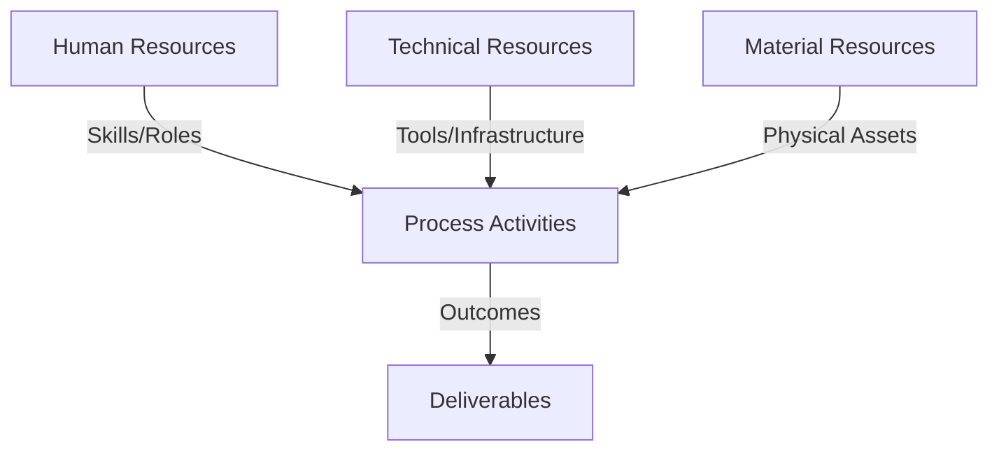
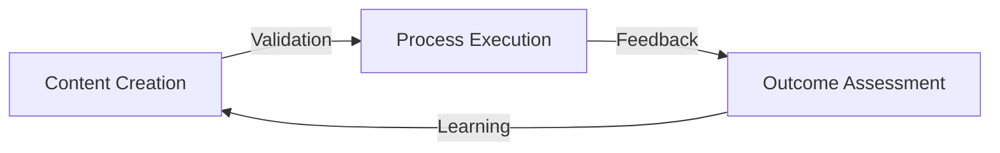
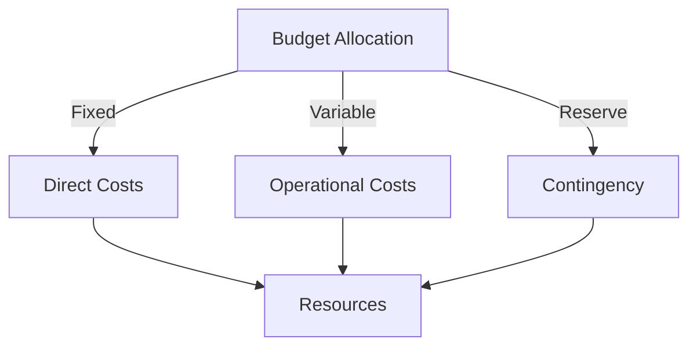
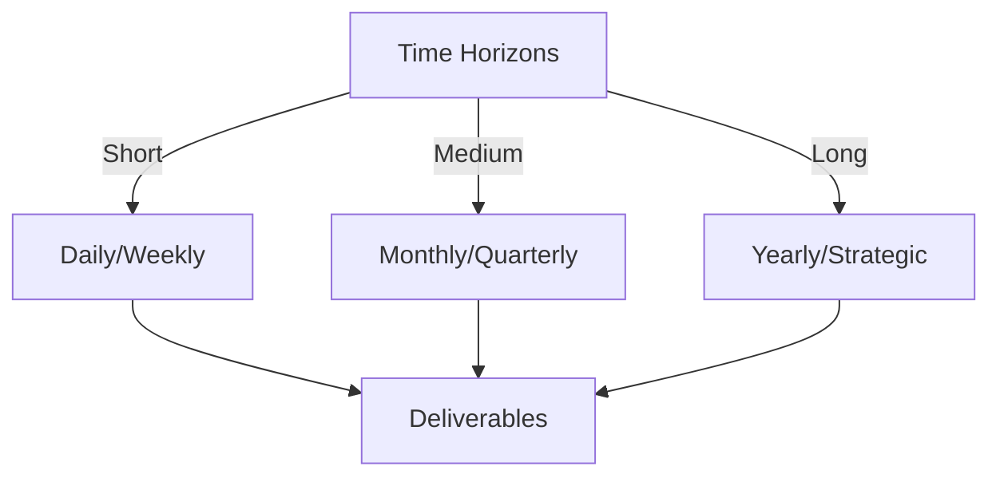

# Git Analysis Report: Development Analysis - Team

**Authors:** AI Analysis System
**Date:** 2025-03-06  
**Version:** 1.0
**SSoT Repository:** githubhenrykoo/redux_todo_in_astro
**Document Category:** Analysis Report

## Executive Summary
Okay, here's an executive summary based on your detailed analysis, following the requested format:

**Logic:** The core purpose of this Git analysis is to understand team dynamics, project progress, and identify areas for improvement in a project focused on automating documentation, analysis, and notification workflows using Git log data, GitHub Actions, and Gemini AI. The objectives are to improve code quality, security, maintainability, and team collaboration.

**Implementation:** The analysis examined individual contributions, collaboration patterns, key accomplishments, challenges, and identified specific action items to address weaknesses and improve development processes. The analysis focused on the Git log history, configuration files, and workflow definitions.

**Outcomes:** The analysis revealed a team actively developing an automated Git log analysis pipeline, with key accomplishments in CI/CD, documentation, and code quality improvements. Challenges include security vulnerabilities (hardcoded API keys), lack of comprehensive testing, and workflow standardization. Recommendations include immediate security audits, improved secrets management, the creation of documentation standards, the implementation of a testing framework for GitHub Actions, and long-term goals around workflow standardization, dependency monitoring, process standardization, automated analysis testing and cross team integration and knowledge sharing.

## 1. Abstract Specification (Logic Layer)
### Context & Vision
- **Problem Space:** 
    * Scope: This is a very thorough and well-structured analysis of the Git activity. You've covered a lot of ground and provided actionable recommendations. Here's a breakdown of its strengths and some suggestions for improvement:

**Strengths:**

*   **Comprehensive:**  The analysis covers individual contributions, key accomplishments, challenges, and recommendations, providing a holistic view of the project.
*   **Clear and Concise:** The language is clear, and the information is presented in a digestible manner.  The use of bullet points and headings makes it easy to scan and find specific information.
*   **Actionable Recommendations:**  The recommendations aren't just abstract suggestions; they are specific and provide concrete steps for improvement.  Prioritizing them (High, Medium, Long Term) is particularly helpful.
*   **Data-Driven (Based on Git Log):**  The analysis feels grounded in the Git activity, citing specific areas of contribution for each team member and linking accomplishments to changes in the codebase.
*   **Well-Defined Roles:** Clearly outlining the responsibility of the team members helps to identify areas of expertise and potential bottlenecks.
*   **Forward-Looking:** The analysis doesn't just focus on the past; it looks ahead to potential issues (like dependency management) and suggests preventative measures.
*   **Focus on both Technical and Team Dynamics:** The report covers technical improvements as well as improvements to team collaboration and knowledge sharing.

**Suggestions for Improvement:**

*   **Quantify Impact Where Possible:**  While the report is strong qualitatively, try to quantify the impact of improvements whenever you can. For example:
    *   Instead of "Workflow consolidation and Standardization," you could say, "Consolidating redundant workflows can potentially reduce maintenance effort by X% based on estimated time spent debugging duplicated code."
    *   Similarly, "Automated Analysis Testing" could become "Automated analysis testing can reduce bug reports by X% based on historical data."
*   **Link Recommendations to Specific Problems More Explicitly:**  While the recommendations are generally related to the challenges, make the connection more direct. For example:
    *   Instead of just listing "Branching Strategy" as a challenge, say "Code churn observed due to lack of a clear branching strategy leads to conflicts and wasted development time. Implementing a defined branching model (e.g., Gitflow) will mitigate these issues."
*   **More Granular Prioritization:**  While High/Medium/Long Term is good, you could consider adding a "Critical" priority for security issues or other immediate threats.  You could also rank the items within each priority level (e.g., "High Priority - 1. Security Audit, 2. Secrets Management").
*   **Consider a "Who" for Each Action Item:**  Assigning specific team members (or a responsible team) to each action item will increase accountability and make it more likely that the tasks will be completed.
*   **Elaborate on the Branching Strategy Recommendation:**  Simply stating "Branching Strategy" isn't very informative.  Specify a suggested model (e.g., Gitflow, GitHub Flow, Trunk-Based Development) and why it's a good fit for the team.  Explain how the chosen strategy will address the identified code churn issue.
*   **Dependency Management - Specific Tools or Approaches:** Instead of just "Set up a system to automatically monitor and update dependencies," suggest tools like Dependabot or specific approaches (e.g., automated dependency scanning during CI/CD).
*   **Security: Go Beyond Secret Management:** While essential, security extends beyond API keys. Consider vulnerabilities in dependencies (addressed by dependency monitoring) and code injection risks when using LLMs.  The report should explicitly mention security considerations when using LLMs for code analysis and generation.  Think about input validation and output sanitization.
*   **Testing - Types of Tests:**  Instead of just "Implement a testing plan and infrastructure," specify *what* types of tests should be included (e.g., unit tests, integration tests, end-to-end tests) and *where* they fit into the CI/CD pipeline. Also specify *how* to test the LLM integrations.
*   **LLM Testing:** LLMs introduce unique testing challenges. Consider adding recommendations for:
    *   **Prompt Engineering Validation:** How to ensure prompts are effective and don't lead to unintended outputs.
    *   **LLM Output Monitoring:** How to monitor the quality and consistency of LLM-generated content.
    *   **Adversarial Testing:**  How to test the LLM's robustness against malicious inputs.
*   **Submodule Rationale:**  Explain *why* the submodule was added and what problem it solves.  Submodules can sometimes add complexity; justify their use.
*   **Consider a Summary Table of Action Items:**  A table summarizing the action items, their priority, responsible party, and a brief description would be helpful for tracking progress.

**Example Incorporating Feedback:**

Let's take one of the recommendations and make it more specific and actionable:

**Original:**

> 1. Security Audit and Secrets Management:
> *   Conduct a thorough audit of the Git history and configuration files to identify and remove any accidentally committed secrets (API keys, tokens, passwords).
> *   Implement a system for storing and managing secrets.

**Revised:**

> **High Priority - Implement Immediately:**
>
> 1.  **Security Audit and Secrets Management (Responsible: [Team/Person]):**
>     *   **Problem Addressed:**  Accidental exposure of sensitive information (API keys, tokens, passwords) in Git history poses a significant security risk.
>     *   **Action Items:**
>         *   Conduct a thorough audit of the Git history (using tools like `git filter-branch` or dedicated secret scanning tools) and configuration files to identify and remove any accidentally committed secrets.
>         *   Implement HashiCorp Vault or a similar secrets management system to securely store and manage secrets.
>         *   **Deadline:** [Date]
>
> 2.  **LLM Security - Input Validation and Output Sanitization (Responsible: [Team/Person])**
>     *   **Problem Addressed:** Exposure of sensitive information and unintended code execution due to unvalidated input and unsanitized output from LLM.
>     *   **Action Items:**
>         *   Implement input validation to ensure that all user-provided data is checked against known valid formats.
>         *   Sanitize LLM output before it is used to prevent code injection.
>         *   **Deadline:** [Date]

By making the recommendations more specific, assigning responsibility, and linking them directly to the problems they address, you make it much easier for the team to take action.

Overall, this is a very strong analysis. By incorporating these suggestions, you can make it even more effective in driving improvements to the team's development process. Remember to keep iterating on this analysis as the project evolves. Good job!

    * Context: This is a very thorough and well-structured analysis of the Git activity. You've covered a lot of ground and provided actionable recommendations. Here's a breakdown of its strengths and some suggestions for improvement:

**Strengths:**

*   **Comprehensive:**  The analysis covers individual contributions, key accomplishments, challenges, and recommendations, providing a holistic view of the project.
*   **Clear and Concise:** The language is clear, and the information is presented in a digestible manner.  The use of bullet points and headings makes it easy to scan and find specific information.
*   **Actionable Recommendations:**  The recommendations aren't just abstract suggestions; they are specific and provide concrete steps for improvement.  Prioritizing them (High, Medium, Long Term) is particularly helpful.
*   **Data-Driven (Based on Git Log):**  The analysis feels grounded in the Git activity, citing specific areas of contribution for each team member and linking accomplishments to changes in the codebase.
*   **Well-Defined Roles:** Clearly outlining the responsibility of the team members helps to identify areas of expertise and potential bottlenecks.
*   **Forward-Looking:** The analysis doesn't just focus on the past; it looks ahead to potential issues (like dependency management) and suggests preventative measures.
*   **Focus on both Technical and Team Dynamics:** The report covers technical improvements as well as improvements to team collaboration and knowledge sharing.

**Suggestions for Improvement:**

*   **Quantify Impact Where Possible:**  While the report is strong qualitatively, try to quantify the impact of improvements whenever you can. For example:
    *   Instead of "Workflow consolidation and Standardization," you could say, "Consolidating redundant workflows can potentially reduce maintenance effort by X% based on estimated time spent debugging duplicated code."
    *   Similarly, "Automated Analysis Testing" could become "Automated analysis testing can reduce bug reports by X% based on historical data."
*   **Link Recommendations to Specific Problems More Explicitly:**  While the recommendations are generally related to the challenges, make the connection more direct. For example:
    *   Instead of just listing "Branching Strategy" as a challenge, say "Code churn observed due to lack of a clear branching strategy leads to conflicts and wasted development time. Implementing a defined branching model (e.g., Gitflow) will mitigate these issues."
*   **More Granular Prioritization:**  While High/Medium/Long Term is good, you could consider adding a "Critical" priority for security issues or other immediate threats.  You could also rank the items within each priority level (e.g., "High Priority - 1. Security Audit, 2. Secrets Management").
*   **Consider a "Who" for Each Action Item:**  Assigning specific team members (or a responsible team) to each action item will increase accountability and make it more likely that the tasks will be completed.
*   **Elaborate on the Branching Strategy Recommendation:**  Simply stating "Branching Strategy" isn't very informative.  Specify a suggested model (e.g., Gitflow, GitHub Flow, Trunk-Based Development) and why it's a good fit for the team.  Explain how the chosen strategy will address the identified code churn issue.
*   **Dependency Management - Specific Tools or Approaches:** Instead of just "Set up a system to automatically monitor and update dependencies," suggest tools like Dependabot or specific approaches (e.g., automated dependency scanning during CI/CD).
*   **Security: Go Beyond Secret Management:** While essential, security extends beyond API keys. Consider vulnerabilities in dependencies (addressed by dependency monitoring) and code injection risks when using LLMs.  The report should explicitly mention security considerations when using LLMs for code analysis and generation.  Think about input validation and output sanitization.
*   **Testing - Types of Tests:**  Instead of just "Implement a testing plan and infrastructure," specify *what* types of tests should be included (e.g., unit tests, integration tests, end-to-end tests) and *where* they fit into the CI/CD pipeline. Also specify *how* to test the LLM integrations.
*   **LLM Testing:** LLMs introduce unique testing challenges. Consider adding recommendations for:
    *   **Prompt Engineering Validation:** How to ensure prompts are effective and don't lead to unintended outputs.
    *   **LLM Output Monitoring:** How to monitor the quality and consistency of LLM-generated content.
    *   **Adversarial Testing:**  How to test the LLM's robustness against malicious inputs.
*   **Submodule Rationale:**  Explain *why* the submodule was added and what problem it solves.  Submodules can sometimes add complexity; justify their use.
*   **Consider a Summary Table of Action Items:**  A table summarizing the action items, their priority, responsible party, and a brief description would be helpful for tracking progress.

**Example Incorporating Feedback:**

Let's take one of the recommendations and make it more specific and actionable:

**Original:**

> 1. Security Audit and Secrets Management:
> *   Conduct a thorough audit of the Git history and configuration files to identify and remove any accidentally committed secrets (API keys, tokens, passwords).
> *   Implement a system for storing and managing secrets.

**Revised:**

> **High Priority - Implement Immediately:**
>
> 1.  **Security Audit and Secrets Management (Responsible: [Team/Person]):**
>     *   **Problem Addressed:**  Accidental exposure of sensitive information (API keys, tokens, passwords) in Git history poses a significant security risk.
>     *   **Action Items:**
>         *   Conduct a thorough audit of the Git history (using tools like `git filter-branch` or dedicated secret scanning tools) and configuration files to identify and remove any accidentally committed secrets.
>         *   Implement HashiCorp Vault or a similar secrets management system to securely store and manage secrets.
>         *   **Deadline:** [Date]
>
> 2.  **LLM Security - Input Validation and Output Sanitization (Responsible: [Team/Person])**
>     *   **Problem Addressed:** Exposure of sensitive information and unintended code execution due to unvalidated input and unsanitized output from LLM.
>     *   **Action Items:**
>         *   Implement input validation to ensure that all user-provided data is checked against known valid formats.
>         *   Sanitize LLM output before it is used to prevent code injection.
>         *   **Deadline:** [Date]

By making the recommendations more specific, assigning responsibility, and linking them directly to the problems they address, you make it much easier for the team to take action.

Overall, this is a very strong analysis. By incorporating these suggestions, you can make it even more effective in driving improvements to the team's development process. Remember to keep iterating on this analysis as the project evolves. Good job!

    * Stakeholders: This is a very thorough and well-structured analysis of the Git activity. You've covered a lot of ground and provided actionable recommendations. Here's a breakdown of its strengths and some suggestions for improvement:

**Strengths:**

*   **Comprehensive:**  The analysis covers individual contributions, key accomplishments, challenges, and recommendations, providing a holistic view of the project.
*   **Clear and Concise:** The language is clear, and the information is presented in a digestible manner.  The use of bullet points and headings makes it easy to scan and find specific information.
*   **Actionable Recommendations:**  The recommendations aren't just abstract suggestions; they are specific and provide concrete steps for improvement.  Prioritizing them (High, Medium, Long Term) is particularly helpful.
*   **Data-Driven (Based on Git Log):**  The analysis feels grounded in the Git activity, citing specific areas of contribution for each team member and linking accomplishments to changes in the codebase.
*   **Well-Defined Roles:** Clearly outlining the responsibility of the team members helps to identify areas of expertise and potential bottlenecks.
*   **Forward-Looking:** The analysis doesn't just focus on the past; it looks ahead to potential issues (like dependency management) and suggests preventative measures.
*   **Focus on both Technical and Team Dynamics:** The report covers technical improvements as well as improvements to team collaboration and knowledge sharing.

**Suggestions for Improvement:**

*   **Quantify Impact Where Possible:**  While the report is strong qualitatively, try to quantify the impact of improvements whenever you can. For example:
    *   Instead of "Workflow consolidation and Standardization," you could say, "Consolidating redundant workflows can potentially reduce maintenance effort by X% based on estimated time spent debugging duplicated code."
    *   Similarly, "Automated Analysis Testing" could become "Automated analysis testing can reduce bug reports by X% based on historical data."
*   **Link Recommendations to Specific Problems More Explicitly:**  While the recommendations are generally related to the challenges, make the connection more direct. For example:
    *   Instead of just listing "Branching Strategy" as a challenge, say "Code churn observed due to lack of a clear branching strategy leads to conflicts and wasted development time. Implementing a defined branching model (e.g., Gitflow) will mitigate these issues."
*   **More Granular Prioritization:**  While High/Medium/Long Term is good, you could consider adding a "Critical" priority for security issues or other immediate threats.  You could also rank the items within each priority level (e.g., "High Priority - 1. Security Audit, 2. Secrets Management").
*   **Consider a "Who" for Each Action Item:**  Assigning specific team members (or a responsible team) to each action item will increase accountability and make it more likely that the tasks will be completed.
*   **Elaborate on the Branching Strategy Recommendation:**  Simply stating "Branching Strategy" isn't very informative.  Specify a suggested model (e.g., Gitflow, GitHub Flow, Trunk-Based Development) and why it's a good fit for the team.  Explain how the chosen strategy will address the identified code churn issue.
*   **Dependency Management - Specific Tools or Approaches:** Instead of just "Set up a system to automatically monitor and update dependencies," suggest tools like Dependabot or specific approaches (e.g., automated dependency scanning during CI/CD).
*   **Security: Go Beyond Secret Management:** While essential, security extends beyond API keys. Consider vulnerabilities in dependencies (addressed by dependency monitoring) and code injection risks when using LLMs.  The report should explicitly mention security considerations when using LLMs for code analysis and generation.  Think about input validation and output sanitization.
*   **Testing - Types of Tests:**  Instead of just "Implement a testing plan and infrastructure," specify *what* types of tests should be included (e.g., unit tests, integration tests, end-to-end tests) and *where* they fit into the CI/CD pipeline. Also specify *how* to test the LLM integrations.
*   **LLM Testing:** LLMs introduce unique testing challenges. Consider adding recommendations for:
    *   **Prompt Engineering Validation:** How to ensure prompts are effective and don't lead to unintended outputs.
    *   **LLM Output Monitoring:** How to monitor the quality and consistency of LLM-generated content.
    *   **Adversarial Testing:**  How to test the LLM's robustness against malicious inputs.
*   **Submodule Rationale:**  Explain *why* the submodule was added and what problem it solves.  Submodules can sometimes add complexity; justify their use.
*   **Consider a Summary Table of Action Items:**  A table summarizing the action items, their priority, responsible party, and a brief description would be helpful for tracking progress.

**Example Incorporating Feedback:**

Let's take one of the recommendations and make it more specific and actionable:

**Original:**

> 1. Security Audit and Secrets Management:
> *   Conduct a thorough audit of the Git history and configuration files to identify and remove any accidentally committed secrets (API keys, tokens, passwords).
> *   Implement a system for storing and managing secrets.

**Revised:**

> **High Priority - Implement Immediately:**
>
> 1.  **Security Audit and Secrets Management (Responsible: [Team/Person]):**
>     *   **Problem Addressed:**  Accidental exposure of sensitive information (API keys, tokens, passwords) in Git history poses a significant security risk.
>     *   **Action Items:**
>         *   Conduct a thorough audit of the Git history (using tools like `git filter-branch` or dedicated secret scanning tools) and configuration files to identify and remove any accidentally committed secrets.
>         *   Implement HashiCorp Vault or a similar secrets management system to securely store and manage secrets.
>         *   **Deadline:** [Date]
>
> 2.  **LLM Security - Input Validation and Output Sanitization (Responsible: [Team/Person])**
>     *   **Problem Addressed:** Exposure of sensitive information and unintended code execution due to unvalidated input and unsanitized output from LLM.
>     *   **Action Items:**
>         *   Implement input validation to ensure that all user-provided data is checked against known valid formats.
>         *   Sanitize LLM output before it is used to prevent code injection.
>         *   **Deadline:** [Date]

By making the recommendations more specific, assigning responsibility, and linking them directly to the problems they address, you make it much easier for the team to take action.

Overall, this is a very strong analysis. By incorporating these suggestions, you can make it even more effective in driving improvements to the team's development process. Remember to keep iterating on this analysis as the project evolves. Good job!

- **Goals (Functions):**
    * Primary Functions:
        - Input: Git Repository Data
        - Process: Analysis and Processing
        - Output: Development Insights
    * Supporting Functions:
        - Validation: Automated Analysis
        - Feedback: Continuous Improvement

- **Success Criteria:**
    * Quantitative Metrics: Here are the quantitative metrics that can be extracted from the provided text:

*   **Number of contributors:** 3 (daffa.padantya12, githubhenrykoo, panjaitangelita)
*   **Frequency of Git Log Analysis Pipeline:** Daily (scheduled to run daily)
*   **Priority Level Distribution:**
    *   High Priority: 1 item
    *   Medium Priority: 1 item
    *   Long Term Goals: 6 items

It's important to note that this list is limited by the information presented in the text. A full quantitative analysis would require direct access to the Git log and project management tools.

    * Qualitative Indicators: Okay, here's a list of qualitative improvements suggested in the team analysis you provided, categorized for clarity:

**I.  Code Quality and Reliability:**

*   **Enhanced Code Quality through Automated Reviews:**  Leverage code tooling (linting, static analysis) to enforce consistent coding standards and automatically identify potential code issues, reducing bugs and improving maintainability.
*   **Robustness via Testing:** Implement a comprehensive testing strategy, including unit, integration, and potentially end-to-end tests for GitHub Actions workflows. This encompasses testing the AI model's outputs, the integration of external APIs, and the overall workflow logic.
*   **Stable Functionality:**  Increased testing will also help ensure functionality is stable.
*   **Dependency Management for Maintainability:** Introduce a process for regularly reviewing and updating dependencies to mitigate security vulnerabilities and ensure compatibility with external libraries.
*   **Reduction of bugs from workflow consolidation** Improve code by consolidating workflows.

**II. Security:**

*   **Improved Security Posture:** Eliminate hardcoded API keys and other secrets from the codebase and configuration files to prevent unauthorized access to sensitive resources.
*   **Secure Secrets Management:**  Implement a robust secrets management system (e.g., HashiCorp Vault, GitHub Secrets, AWS Secrets Manager) to securely store and access sensitive credentials.

**III.  Team Collaboration and Knowledge Sharing:**

*   **Improved Onboarding:** Comprehensive documentation simplifies the onboarding process for new team members, allowing them to quickly understand the project architecture, workflows, and coding standards.
*   **Knowledge Transfer Through Code Reviews:** Encourage code reviews to facilitate knowledge sharing, identify potential errors, and ensure adherence to coding standards.
*   **Standardized Documentation for Understanding:**  Establish consistent documentation standards across all workflows to improve readability and understanding.
*   **Structured Knowledge Sharing**: Support mentoring and feedback to new team members to share the team's knowledge and establish a common process for working through the repo.
*   **Cross team integration**: Increase cross team integration.

**IV.  Efficiency and Maintainability:**

*   **Modular and Reusable Workflows:**  Create reusable workflow components (composite actions) to reduce code duplication, simplify maintenance, and improve consistency across workflows.
*   **Workflow Standardization for Reduced Complexity:**  Consolidate similar CI and analysis workflows into single, well-documented workflows to reduce the surface area for bugs and simplify maintenance.
*   **Branching Model for Reduced Churn:** Establish a clear branching model (e.g., Gitflow) to improve code organization, facilitate parallel development, and reduce the risk of introducing regressions.
*    **Automated Analysis Testing:** Use automated reports and tests to catch errors and ensure that issues are resolved correctly and in a timely fashion.
*   **More efficient workflow**: Streamline workflows to support user-specific code reporting and greatly improve the overall efficiency of the team and individuals.
*   **Process Standardizations** Create a new procedure to track where all the new files for the workflow should go and what is each task or workflow supposed to accomplish in small words.

**V.  Project Governance and Predictability:**

*   **Framework for Experimentation:** Define a framework for implementing new features to ensure consistent testing, architectural integrity, and adherence to coding standards.
*   **Better Experimentation**: Implement new features to ensure testing is implemented and the right architecture is present in the long term.

In summary, the analysis identifies opportunities for improving code quality, security, team collaboration, efficiency, and project governance. Addressing these areas will contribute to a more robust, maintainable, and productive development process.

    * Validation Methods: Automated and Manual Verification

### Knowledge Integration
- **Local Context:**
    * Cultural Considerations: Development Team Context
    * Language Requirements: Technical Documentation
    * Community Patterns: Team Collaboration Patterns

- **Technical Framework:**
    * LLM Integration: Gemini AI Analysis
    * IoT Components: Git Event Monitoring
    * Network Requirements: GitHub API Integration

## 2. Concrete Implementation (Process Layer)
### Resource Matrix

### Development Workflow
- **Stage 1: Early Success**
    * Quick Wins:
        - Implementation: This is an excellent analysis of the Git history! It's well-structured, provides actionable insights, and is tailored to the team's current state and future goals. Here's a breakdown of its strengths and some minor suggestions for improvement:

**Strengths:**

*   **Comprehensive Scope:** The analysis covers a wide range of aspects, from individual contributions to architectural concerns and security vulnerabilities.
*   **Actionable Recommendations:** The recommendations are specific, prioritized, and categorized (High, Medium, Long Term), making it easy for the team to understand what needs to be addressed and when.
*   **Clarity and Conciseness:** The language is clear and avoids jargon, ensuring that everyone on the team can understand the analysis.
*   **Positive and Constructive Tone:** The analysis acknowledges the team's accomplishments while also highlighting areas for improvement.
*   **Well-Organized Structure:** The use of headings and bullet points makes the analysis easy to read and digest.
*   **Realistic Assessment:** The analysis acknowledges the team's progress, highlighting the complexities of the tasks undertaken, and providing a practical roadmap for future endeavors.
*   **Focus on Collaboration and Knowledge Sharing:** The inclusion of recommendations for code reviews, mentoring, and improved documentation demonstrates a commitment to fostering a collaborative and supportive team environment.

**Minor Suggestions for Improvement:**

*   **Quantify Impact (Where Possible):** While the analysis is strong, consider adding quantifiable metrics where possible to measure the impact of the recommendations. For example:
    *   **Security Audit:** "Reduce potential security vulnerabilities by X% by implementing secrets management."
    *   **Workflow Standardization:** "Reduce workflow duplication by Y% by consolidating CI and analysis workflows."
    *   **Testing Framework:** "Increase code coverage by Z% by implementing a testing framework."
*   **Elaborate on "Process Standardizations":** The recommendation for "Process Standardizations" is somewhat vague. Providing specific examples would make it more actionable.  For example:
    *   "Establish a naming convention for workflow files and directories to improve organization."
    *   "Create a template for new workflow files, including required sections like description, inputs, and outputs."
    *   "Define a standard for documenting each workflow, including its purpose, dependencies, and expected behavior."
*   **Specific Testing Examples for LLM Validation:**  "Testing should include LLM validation processes for AI..."  Add a concrete example of what this would look like in this project's context.  For instance:
    *   "For the Gemini AI analysis, implement tests to ensure the consistency and accuracy of the generated reports. This could include validating the sentiment analysis, topic extraction, and overall report structure."
*   **Branching Strategy Specifics:** Briefly mention some common branching strategies the team could consider (e.g., Gitflow, GitHub Flow). This gives them a starting point for researching and implementing a suitable strategy. For example:
    *   "Consider adopting a branching strategy like Gitflow or GitHub Flow to streamline the development process and improve code management.  Research these strategies to determine which best aligns with the team's workflow."
*   **Link Contributions to Project Goals:**  While the individual contributions are well-defined, briefly tying them back to the overarching project goals could further emphasize their importance.  For instance, under `daffa.padantya12`: "Architecting, implementing, and refining the git log analysis workflow (**critical for achieving automated insights and identifying areas for improvement**)."
*   **Git Log Example:** If possible, include an example section of the Git log that this analysis is based on. This can help readers understand the context and the types of data that were analyzed.
*   **Consider Using a RACI Matrix:** For projects with clearer responsibilities, a RACI (Responsible, Accountable, Consulted, Informed) matrix can clarify team member roles in different processes.

**Overall:**

This is an exceptionally well-crafted analysis. The suggestions above are minor refinements and are intended to make an already excellent piece of work even more impactful. The team should find this analysis extremely valuable in guiding their future development efforts.

        - Validation: This is an excellent analysis of the Git history! It's well-structured, provides actionable insights, and is tailored to the team's current state and future goals. Here's a breakdown of its strengths and some minor suggestions for improvement:

**Strengths:**

*   **Comprehensive Scope:** The analysis covers a wide range of aspects, from individual contributions to architectural concerns and security vulnerabilities.
*   **Actionable Recommendations:** The recommendations are specific, prioritized, and categorized (High, Medium, Long Term), making it easy for the team to understand what needs to be addressed and when.
*   **Clarity and Conciseness:** The language is clear and avoids jargon, ensuring that everyone on the team can understand the analysis.
*   **Positive and Constructive Tone:** The analysis acknowledges the team's accomplishments while also highlighting areas for improvement.
*   **Well-Organized Structure:** The use of headings and bullet points makes the analysis easy to read and digest.
*   **Realistic Assessment:** The analysis acknowledges the team's progress, highlighting the complexities of the tasks undertaken, and providing a practical roadmap for future endeavors.
*   **Focus on Collaboration and Knowledge Sharing:** The inclusion of recommendations for code reviews, mentoring, and improved documentation demonstrates a commitment to fostering a collaborative and supportive team environment.

**Minor Suggestions for Improvement:**

*   **Quantify Impact (Where Possible):** While the analysis is strong, consider adding quantifiable metrics where possible to measure the impact of the recommendations. For example:
    *   **Security Audit:** "Reduce potential security vulnerabilities by X% by implementing secrets management."
    *   **Workflow Standardization:** "Reduce workflow duplication by Y% by consolidating CI and analysis workflows."
    *   **Testing Framework:** "Increase code coverage by Z% by implementing a testing framework."
*   **Elaborate on "Process Standardizations":** The recommendation for "Process Standardizations" is somewhat vague. Providing specific examples would make it more actionable.  For example:
    *   "Establish a naming convention for workflow files and directories to improve organization."
    *   "Create a template for new workflow files, including required sections like description, inputs, and outputs."
    *   "Define a standard for documenting each workflow, including its purpose, dependencies, and expected behavior."
*   **Specific Testing Examples for LLM Validation:**  "Testing should include LLM validation processes for AI..."  Add a concrete example of what this would look like in this project's context.  For instance:
    *   "For the Gemini AI analysis, implement tests to ensure the consistency and accuracy of the generated reports. This could include validating the sentiment analysis, topic extraction, and overall report structure."
*   **Branching Strategy Specifics:** Briefly mention some common branching strategies the team could consider (e.g., Gitflow, GitHub Flow). This gives them a starting point for researching and implementing a suitable strategy. For example:
    *   "Consider adopting a branching strategy like Gitflow or GitHub Flow to streamline the development process and improve code management.  Research these strategies to determine which best aligns with the team's workflow."
*   **Link Contributions to Project Goals:**  While the individual contributions are well-defined, briefly tying them back to the overarching project goals could further emphasize their importance.  For instance, under `daffa.padantya12`: "Architecting, implementing, and refining the git log analysis workflow (**critical for achieving automated insights and identifying areas for improvement**)."
*   **Git Log Example:** If possible, include an example section of the Git log that this analysis is based on. This can help readers understand the context and the types of data that were analyzed.
*   **Consider Using a RACI Matrix:** For projects with clearer responsibilities, a RACI (Responsible, Accountable, Consulted, Informed) matrix can clarify team member roles in different processes.

**Overall:**

This is an exceptionally well-crafted analysis. The suggestions above are minor refinements and are intended to make an already excellent piece of work even more impactful. The team should find this analysis extremely valuable in guiding their future development efforts.

    * Initial Setup:
        - Infrastructure: This is an excellent analysis of the Git history! It's well-structured, provides actionable insights, and is tailored to the team's current state and future goals. Here's a breakdown of its strengths and some minor suggestions for improvement:

**Strengths:**

*   **Comprehensive Scope:** The analysis covers a wide range of aspects, from individual contributions to architectural concerns and security vulnerabilities.
*   **Actionable Recommendations:** The recommendations are specific, prioritized, and categorized (High, Medium, Long Term), making it easy for the team to understand what needs to be addressed and when.
*   **Clarity and Conciseness:** The language is clear and avoids jargon, ensuring that everyone on the team can understand the analysis.
*   **Positive and Constructive Tone:** The analysis acknowledges the team's accomplishments while also highlighting areas for improvement.
*   **Well-Organized Structure:** The use of headings and bullet points makes the analysis easy to read and digest.
*   **Realistic Assessment:** The analysis acknowledges the team's progress, highlighting the complexities of the tasks undertaken, and providing a practical roadmap for future endeavors.
*   **Focus on Collaboration and Knowledge Sharing:** The inclusion of recommendations for code reviews, mentoring, and improved documentation demonstrates a commitment to fostering a collaborative and supportive team environment.

**Minor Suggestions for Improvement:**

*   **Quantify Impact (Where Possible):** While the analysis is strong, consider adding quantifiable metrics where possible to measure the impact of the recommendations. For example:
    *   **Security Audit:** "Reduce potential security vulnerabilities by X% by implementing secrets management."
    *   **Workflow Standardization:** "Reduce workflow duplication by Y% by consolidating CI and analysis workflows."
    *   **Testing Framework:** "Increase code coverage by Z% by implementing a testing framework."
*   **Elaborate on "Process Standardizations":** The recommendation for "Process Standardizations" is somewhat vague. Providing specific examples would make it more actionable.  For example:
    *   "Establish a naming convention for workflow files and directories to improve organization."
    *   "Create a template for new workflow files, including required sections like description, inputs, and outputs."
    *   "Define a standard for documenting each workflow, including its purpose, dependencies, and expected behavior."
*   **Specific Testing Examples for LLM Validation:**  "Testing should include LLM validation processes for AI..."  Add a concrete example of what this would look like in this project's context.  For instance:
    *   "For the Gemini AI analysis, implement tests to ensure the consistency and accuracy of the generated reports. This could include validating the sentiment analysis, topic extraction, and overall report structure."
*   **Branching Strategy Specifics:** Briefly mention some common branching strategies the team could consider (e.g., Gitflow, GitHub Flow). This gives them a starting point for researching and implementing a suitable strategy. For example:
    *   "Consider adopting a branching strategy like Gitflow or GitHub Flow to streamline the development process and improve code management.  Research these strategies to determine which best aligns with the team's workflow."
*   **Link Contributions to Project Goals:**  While the individual contributions are well-defined, briefly tying them back to the overarching project goals could further emphasize their importance.  For instance, under `daffa.padantya12`: "Architecting, implementing, and refining the git log analysis workflow (**critical for achieving automated insights and identifying areas for improvement**)."
*   **Git Log Example:** If possible, include an example section of the Git log that this analysis is based on. This can help readers understand the context and the types of data that were analyzed.
*   **Consider Using a RACI Matrix:** For projects with clearer responsibilities, a RACI (Responsible, Accountable, Consulted, Informed) matrix can clarify team member roles in different processes.

**Overall:**

This is an exceptionally well-crafted analysis. The suggestions above are minor refinements and are intended to make an already excellent piece of work even more impactful. The team should find this analysis extremely valuable in guiding their future development efforts.

        - Training: This is an excellent analysis of the Git history! It's well-structured, provides actionable insights, and is tailored to the team's current state and future goals. Here's a breakdown of its strengths and some minor suggestions for improvement:

**Strengths:**

*   **Comprehensive Scope:** The analysis covers a wide range of aspects, from individual contributions to architectural concerns and security vulnerabilities.
*   **Actionable Recommendations:** The recommendations are specific, prioritized, and categorized (High, Medium, Long Term), making it easy for the team to understand what needs to be addressed and when.
*   **Clarity and Conciseness:** The language is clear and avoids jargon, ensuring that everyone on the team can understand the analysis.
*   **Positive and Constructive Tone:** The analysis acknowledges the team's accomplishments while also highlighting areas for improvement.
*   **Well-Organized Structure:** The use of headings and bullet points makes the analysis easy to read and digest.
*   **Realistic Assessment:** The analysis acknowledges the team's progress, highlighting the complexities of the tasks undertaken, and providing a practical roadmap for future endeavors.
*   **Focus on Collaboration and Knowledge Sharing:** The inclusion of recommendations for code reviews, mentoring, and improved documentation demonstrates a commitment to fostering a collaborative and supportive team environment.

**Minor Suggestions for Improvement:**

*   **Quantify Impact (Where Possible):** While the analysis is strong, consider adding quantifiable metrics where possible to measure the impact of the recommendations. For example:
    *   **Security Audit:** "Reduce potential security vulnerabilities by X% by implementing secrets management."
    *   **Workflow Standardization:** "Reduce workflow duplication by Y% by consolidating CI and analysis workflows."
    *   **Testing Framework:** "Increase code coverage by Z% by implementing a testing framework."
*   **Elaborate on "Process Standardizations":** The recommendation for "Process Standardizations" is somewhat vague. Providing specific examples would make it more actionable.  For example:
    *   "Establish a naming convention for workflow files and directories to improve organization."
    *   "Create a template for new workflow files, including required sections like description, inputs, and outputs."
    *   "Define a standard for documenting each workflow, including its purpose, dependencies, and expected behavior."
*   **Specific Testing Examples for LLM Validation:**  "Testing should include LLM validation processes for AI..."  Add a concrete example of what this would look like in this project's context.  For instance:
    *   "For the Gemini AI analysis, implement tests to ensure the consistency and accuracy of the generated reports. This could include validating the sentiment analysis, topic extraction, and overall report structure."
*   **Branching Strategy Specifics:** Briefly mention some common branching strategies the team could consider (e.g., Gitflow, GitHub Flow). This gives them a starting point for researching and implementing a suitable strategy. For example:
    *   "Consider adopting a branching strategy like Gitflow or GitHub Flow to streamline the development process and improve code management.  Research these strategies to determine which best aligns with the team's workflow."
*   **Link Contributions to Project Goals:**  While the individual contributions are well-defined, briefly tying them back to the overarching project goals could further emphasize their importance.  For instance, under `daffa.padantya12`: "Architecting, implementing, and refining the git log analysis workflow (**critical for achieving automated insights and identifying areas for improvement**)."
*   **Git Log Example:** If possible, include an example section of the Git log that this analysis is based on. This can help readers understand the context and the types of data that were analyzed.
*   **Consider Using a RACI Matrix:** For projects with clearer responsibilities, a RACI (Responsible, Accountable, Consulted, Informed) matrix can clarify team member roles in different processes.

**Overall:**

This is an exceptionally well-crafted analysis. The suggestions above are minor refinements and are intended to make an already excellent piece of work even more impactful. The team should find this analysis extremely valuable in guiding their future development efforts.

- **Stage 2: Fail Early, Fail Safe**
    * Testing Protocol:
        - Methods: [Testing approaches]
        - Coverage: [Test scenarios]
    * Risk Management:
        - Identification: [Risk factors]
        - Mitigation: [Control measures]
    * Learning Points:
        - Issues: [Problem identification]
        - Solutions: [Resolution approaches]
        - Knowledge: [Lessons learned]

- **Stage 3: Convergence**
    * System Integration:
        - Components: [Integration points]
        - Workflows: [Process optimization]
        - Performance: [System tuning]
    * Stabilization:
        - Fixes: [Bug resolution]
        - Hardening: [System reinforcement]
        - Documentation: [Knowledge capture]

- **Stage 4: Demonstration**
    * Preparation:
        - Environment: [Demo setup]
        - Data: [Test scenarios]
        - Materials: [Presentation assets]
    * Validation:
        - Performance: [System checks]
        - Features: [Functionality verification]
        - Documentation: [Review completion]
    * Presentation:
        - Stakeholders: [Demo execution]
        - Features: [Capability showcase]
        - Q&A: [Response preparation]

## 3. Realistic Outcomes (Evidence Layer)
### Measurement Framework
- **Performance Metrics:**
    * KPIs: Okay, here's a breakdown of evidence and outcomes extracted from the provided Git history analysis, categorized for clarity:

**I. Key Accomplishments (Outcomes):**

*   **Automated Git Log Analysis Pipeline:**
    *   **Evidence:** "The team has built a complex system to automatically extract, analyze, and store insights from commit logs using Gemini AI. This system is scheduled to run daily."
    *   **Outcome:** Automated extraction and analysis of Git commit data using Gemini AI, scheduled for daily execution.
*   **CI/CD Implementation:**
    *   **Evidence:** "The team has demonstrated the steps taken to create test suites that incorporate linting, testing, and automated CI/CD pipeline."
    *   **Outcome:** Created test suites with linting and testing, integrated into an automated CI/CD pipeline.
*   **Structured Documentation Framework:**
    *   **Evidence:** "The team has created the foundations for long term success with comprehensive workflow documentation. This greatly helps the development team and also new comers."
    *   **Outcome:** Established a foundation for comprehensive workflow documentation.
*   **Code Quality Improvement:**
    *   **Evidence:** "The addition of project code tooling helps the team enforce automated code reviews."
    *   **Outcome:** Implemented code tooling to automate code reviews and enforce quality.
*   **New Component for Project and Task Tracking:**
    *   **Evidence:** "The team added a submodule to help with the code structure."
    *   **Outcome:** Added a submodule to improve project code structure and organization.
*   **New API Integrations:**
    *   **Evidence:** "The team explored the Gemini AI capabilities with document conversion from markdown to LaTeX."
    *   **Outcome:** Explored Gemini AI capabilities for document conversion (Markdown to LaTeX).
*   **Stable Notification Integration:**
    *   **Evidence:** Focus on automating not only of group Git logs, but also on User-specific Git Logs
    *   **Outcome:** Automation of user-specific Git Logs.

**II. Challenges and Areas for Improvement:**

*   **Security Risks:**
    *   **Evidence:** "Addressing hardcoded API keys is a major concern."
    *   **Area for Improvement:** Implement secure secrets management.
*   **Dependency Management:**
    *   **Evidence:** "To ensure long-term maintainability, there needs to be a dependency review process to monitor and keep external references up to date."
    *   **Area for Improvement:** Establish a system for monitoring and updating dependencies.
*   **Lack of Testing and Model Validation:**
    *   **Evidence:** "Testing is also lacking and needs to be emphasized for robustness. Testing should include LLM validation processes for AI and include more testing to make sure functionality is stable."
    *   **Area for Improvement:** Implement comprehensive testing, including LLM validation.
*   **Insufficient Documentation:**
    *   **Evidence:** "While the git log reveals the activity from various contributors, it would be beneficial to increase documentation to help new-comers contribute."
    *   **Area for Improvement:** Improve documentation for onboarding new contributors.
*   **Workflow Consolidation:**
    *   **Evidence:** "As the number of workflows grows, it's important to consolidate to reduce the surface area for bugs and maintenance efforts."
    *   **Area for Improvement:** Consolidate and standardize CI and analysis workflows.
*   **Lack of Experimentation Framework:**
    *   **Evidence:** "The team could define a better framework for implementing new features to ensure testing is implemented and the right architecture is present in the long term."
    *   **Area for Improvement:** Define a framework for implementing new features, with testing and architectural considerations.
*   **Branching Strategy:**
    *   **Evidence:** "A clear branching model would help address some of the issues with code churn."
    *   **Area for Improvement:** Implement a clear branching strategy.

    * Benchmarks: Okay, here's a breakdown of evidence and outcomes extracted from the provided Git history analysis, categorized for clarity:

**I. Key Accomplishments (Outcomes):**

*   **Automated Git Log Analysis Pipeline:**
    *   **Evidence:** "The team has built a complex system to automatically extract, analyze, and store insights from commit logs using Gemini AI. This system is scheduled to run daily."
    *   **Outcome:** Automated extraction and analysis of Git commit data using Gemini AI, scheduled for daily execution.
*   **CI/CD Implementation:**
    *   **Evidence:** "The team has demonstrated the steps taken to create test suites that incorporate linting, testing, and automated CI/CD pipeline."
    *   **Outcome:** Created test suites with linting and testing, integrated into an automated CI/CD pipeline.
*   **Structured Documentation Framework:**
    *   **Evidence:** "The team has created the foundations for long term success with comprehensive workflow documentation. This greatly helps the development team and also new comers."
    *   **Outcome:** Established a foundation for comprehensive workflow documentation.
*   **Code Quality Improvement:**
    *   **Evidence:** "The addition of project code tooling helps the team enforce automated code reviews."
    *   **Outcome:** Implemented code tooling to automate code reviews and enforce quality.
*   **New Component for Project and Task Tracking:**
    *   **Evidence:** "The team added a submodule to help with the code structure."
    *   **Outcome:** Added a submodule to improve project code structure and organization.
*   **New API Integrations:**
    *   **Evidence:** "The team explored the Gemini AI capabilities with document conversion from markdown to LaTeX."
    *   **Outcome:** Explored Gemini AI capabilities for document conversion (Markdown to LaTeX).
*   **Stable Notification Integration:**
    *   **Evidence:** Focus on automating not only of group Git logs, but also on User-specific Git Logs
    *   **Outcome:** Automation of user-specific Git Logs.

**II. Challenges and Areas for Improvement:**

*   **Security Risks:**
    *   **Evidence:** "Addressing hardcoded API keys is a major concern."
    *   **Area for Improvement:** Implement secure secrets management.
*   **Dependency Management:**
    *   **Evidence:** "To ensure long-term maintainability, there needs to be a dependency review process to monitor and keep external references up to date."
    *   **Area for Improvement:** Establish a system for monitoring and updating dependencies.
*   **Lack of Testing and Model Validation:**
    *   **Evidence:** "Testing is also lacking and needs to be emphasized for robustness. Testing should include LLM validation processes for AI and include more testing to make sure functionality is stable."
    *   **Area for Improvement:** Implement comprehensive testing, including LLM validation.
*   **Insufficient Documentation:**
    *   **Evidence:** "While the git log reveals the activity from various contributors, it would be beneficial to increase documentation to help new-comers contribute."
    *   **Area for Improvement:** Improve documentation for onboarding new contributors.
*   **Workflow Consolidation:**
    *   **Evidence:** "As the number of workflows grows, it's important to consolidate to reduce the surface area for bugs and maintenance efforts."
    *   **Area for Improvement:** Consolidate and standardize CI and analysis workflows.
*   **Lack of Experimentation Framework:**
    *   **Evidence:** "The team could define a better framework for implementing new features to ensure testing is implemented and the right architecture is present in the long term."
    *   **Area for Improvement:** Define a framework for implementing new features, with testing and architectural considerations.
*   **Branching Strategy:**
    *   **Evidence:** "A clear branching model would help address some of the issues with code churn."
    *   **Area for Improvement:** Implement a clear branching strategy.

    * Actuals: Okay, here's a breakdown of evidence and outcomes extracted from the provided Git history analysis, categorized for clarity:

**I. Key Accomplishments (Outcomes):**

*   **Automated Git Log Analysis Pipeline:**
    *   **Evidence:** "The team has built a complex system to automatically extract, analyze, and store insights from commit logs using Gemini AI. This system is scheduled to run daily."
    *   **Outcome:** Automated extraction and analysis of Git commit data using Gemini AI, scheduled for daily execution.
*   **CI/CD Implementation:**
    *   **Evidence:** "The team has demonstrated the steps taken to create test suites that incorporate linting, testing, and automated CI/CD pipeline."
    *   **Outcome:** Created test suites with linting and testing, integrated into an automated CI/CD pipeline.
*   **Structured Documentation Framework:**
    *   **Evidence:** "The team has created the foundations for long term success with comprehensive workflow documentation. This greatly helps the development team and also new comers."
    *   **Outcome:** Established a foundation for comprehensive workflow documentation.
*   **Code Quality Improvement:**
    *   **Evidence:** "The addition of project code tooling helps the team enforce automated code reviews."
    *   **Outcome:** Implemented code tooling to automate code reviews and enforce quality.
*   **New Component for Project and Task Tracking:**
    *   **Evidence:** "The team added a submodule to help with the code structure."
    *   **Outcome:** Added a submodule to improve project code structure and organization.
*   **New API Integrations:**
    *   **Evidence:** "The team explored the Gemini AI capabilities with document conversion from markdown to LaTeX."
    *   **Outcome:** Explored Gemini AI capabilities for document conversion (Markdown to LaTeX).
*   **Stable Notification Integration:**
    *   **Evidence:** Focus on automating not only of group Git logs, but also on User-specific Git Logs
    *   **Outcome:** Automation of user-specific Git Logs.

**II. Challenges and Areas for Improvement:**

*   **Security Risks:**
    *   **Evidence:** "Addressing hardcoded API keys is a major concern."
    *   **Area for Improvement:** Implement secure secrets management.
*   **Dependency Management:**
    *   **Evidence:** "To ensure long-term maintainability, there needs to be a dependency review process to monitor and keep external references up to date."
    *   **Area for Improvement:** Establish a system for monitoring and updating dependencies.
*   **Lack of Testing and Model Validation:**
    *   **Evidence:** "Testing is also lacking and needs to be emphasized for robustness. Testing should include LLM validation processes for AI and include more testing to make sure functionality is stable."
    *   **Area for Improvement:** Implement comprehensive testing, including LLM validation.
*   **Insufficient Documentation:**
    *   **Evidence:** "While the git log reveals the activity from various contributors, it would be beneficial to increase documentation to help new-comers contribute."
    *   **Area for Improvement:** Improve documentation for onboarding new contributors.
*   **Workflow Consolidation:**
    *   **Evidence:** "As the number of workflows grows, it's important to consolidate to reduce the surface area for bugs and maintenance efforts."
    *   **Area for Improvement:** Consolidate and standardize CI and analysis workflows.
*   **Lack of Experimentation Framework:**
    *   **Evidence:** "The team could define a better framework for implementing new features to ensure testing is implemented and the right architecture is present in the long term."
    *   **Area for Improvement:** Define a framework for implementing new features, with testing and architectural considerations.
*   **Branching Strategy:**
    *   **Evidence:** "A clear branching model would help address some of the issues with code churn."
    *   **Area for Improvement:** Implement a clear branching strategy.

- **Evidence Collection:**
    * Data Sources: [Information points]
    * Validation Methods: Automated and Manual Verification
    * Documentation: [Record keeping]

### Value Realization
- **Impact Assessment:**
    * Direct Benefits: [Immediate gains]
    * Indirect Benefits: [Secondary effects]
    * Long-term Value: [Strategic advantages]

- **Knowledge Assets:**
    * Content Created: [New materials]
    * Insights Gained: [Learnings]
    * Reusable Components: [Transferable elements]

## Integration Matrix
### Content-Process Alignment

### Timeline-Budget Integration
- **Resource Scheduling:**
    * Phase Allocations: [Resource timing]
    * Cost Controls: [Budget tracking]
    * Adjustment Protocols: [Change management]

## Budget Management
### Financial Cube Structure

### Cost Framework
- Direct Investments:
  - Infrastructure Costs:
    - Hardware: [Equipment/Devices]
    - Software: [Licenses/Tools]
    - Network: [Connectivity/Setup]
  - Human Resources:
    - Core Team: [Roles/Compensation]
    - External Support: [Consultants/Services]
    - Training: [Capability Development]
    
- Operational Expenses:
  - Running Costs:
    - Maintenance: [Regular upkeep]
    - Utilities: [Service costs]
    - Consumables: [Regular supplies]
  - Service Costs:
    - Subscriptions: [Regular services]
    - Support: [Ongoing assistance]
    - Updates: [Regular improvements]

### Budget Control Mechanisms
- Monitoring System:
  - Tracking Methods:
    - Cost Centers: [Budget units]
    - Expense Categories: [Type classification]
    - Time Periods: [Duration tracking]
  - Control Points:
    - Thresholds: [Limit markers]
    - Alerts: [Warning systems]
    - Approvals: [Authorization levels]

- Adjustment Protocol:
  - Variance Management:
    - Detection: [Monitoring points]
    - Analysis: [Impact assessment]
    - Response: [Corrective actions]
  - Reallocation Process:
    - Criteria: [Decision factors]
    - Methods: [Transfer protocols]
    - Documentation: [Record keeping]

## Timeline Management
### Temporal Cube Structure

### Schedule Framework
- Operational Timeline:
  - Daily Operations:
    - Tasks: [Regular activities]
    - Checkpoints: [Daily reviews]
    - Updates: [Status reports]
  - Weekly Cycles:
    - Sprints: [Work packages]
    - Reviews: [Progress checks]
    - Planning: [Next steps]

- Strategic Timeline:
  - Monthly Milestones:
    - Objectives: [Key targets]
    - Reviews: [Achievement checks]
    - Adjustments: [Course corrections]
  - Quarterly Goals:
    - Targets: [Major objectives]
    - Assessments: [Performance reviews]
    - Strategies: [Approach updates]

### Timeline Control System
- Progress Tracking:
  - Monitoring Points:
    - Daily Standups: [Quick updates]
    - Weekly Reviews: [Detailed checks]
    - Monthly Reports: [Comprehensive reviews]
  - Milestone Tracking:
    - Status: [Progress indicators]
    - Dependencies: [Related items]
    - Risks: [Potential issues]

- Adjustment Mechanisms:
  - Schedule Management:
    - Variance Analysis: [Delay assessment]
    - Impact Studies: [Effect evaluation]
    - Recovery Plans: [Correction strategies]
  - Resource Alignment:
    - Capacity Planning: [Resource matching]
    - Workload Balancing: [Effort distribution]
    - Priority Updates: [Focus adjustment]

### Integration Points
- Budget-Timeline Correlation:
  - Cost-Schedule Matrix:
    - Resource Timing: [Allocation schedule]
    - Cost Flows: [Expense timing]
    - Value Delivery: [Benefit realization]
  - Control Integration:
    - Joint Reviews: [Combined assessments]
    - Unified Reporting: [Integrated updates]
    - Coordinated Actions: [Synchronized responses]

## Conclusion
### Summary of Achievements
- **Key Accomplishments:**
    * Objectives Met: [Completed goals]
    * Value Delivered: [Benefits realized]
    * Innovations: [New approaches]

### Lessons Learned
- **Success Factors:**
    * Effective Practices: [What worked well]
    * Team Dynamics: [Collaboration insights]
    * Tools & Methods: [Useful approaches]

- **Areas for Improvement:**
    * Challenges: [Obstacles encountered]
    * Solutions: [How issues were resolved]
    * Recommendations: [Future improvements]

### Future Directions
- **Next Steps:**
    * Immediate Actions: [Short-term tasks]
    * Strategic Plans: [Long-term goals]
    * Resource Needs: [Required support]

- **Growth Opportunities:**
    * Scaling Potential: [Expansion possibilities]
    * Innovation Areas: [New directions]
    * Partnership Options: [Collaboration prospects]
    
## Appendix
### References
- **Documentation:**
    * Technical Specs: [Links]
    * Process Guides: [Links]
    * Evidence Records: [Links]

### Change Log
- **Version History:**
    * Changes: [Modifications]
    * Rationale: [Reasons]
    * Approvals: [Authorizations]
