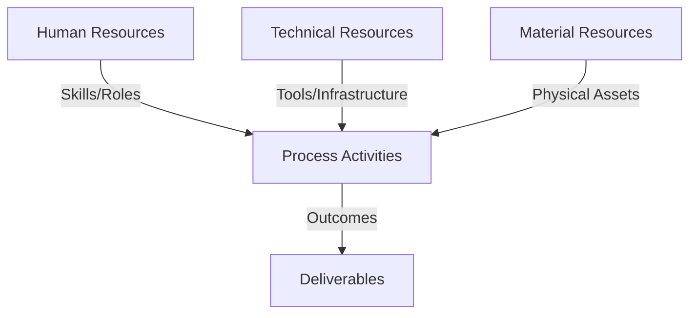
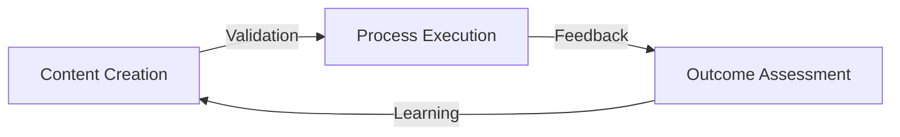
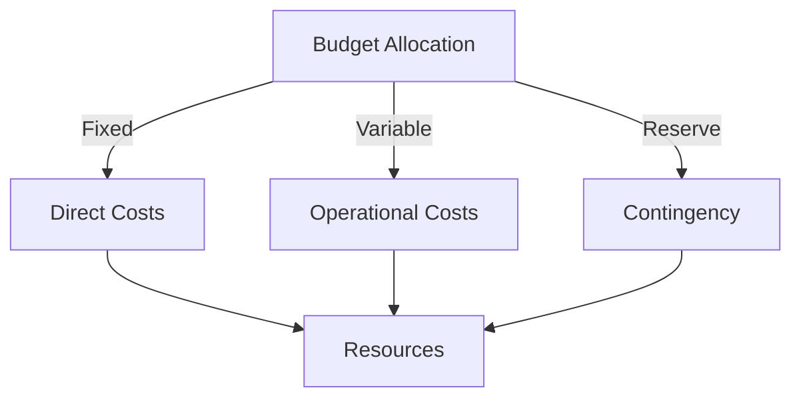
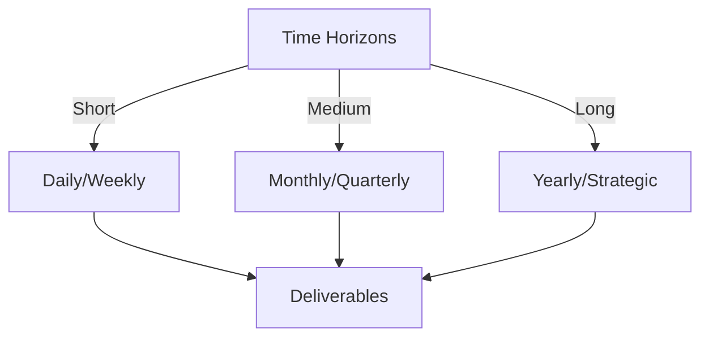

# Git Analysis Report: Development Analysis - Team

**Authors:** AI Analysis System
**Date:** 2025-03-10  
**Version:** 1.0
**SSoT Repository:** githubhenrykoo/redux_todo_in_astro
**Document Category:** Analysis Report

## Executive Summary
**Executive Summary: Git Analysis**

**Logic:** The core purpose of this git analysis is to understand team activity, project direction, and identify areas for improvement by examining the commit history of a git repository. The objectives are to assess team collaboration patterns, project progress, and provide actionable recommendations.

**Implementation:** The analysis involved examining commit logs, file changes (particularly the `meta_template.py` file), and GitHub Actions workflow configurations. Key methods included:

*   Summarizing code changes
*   Identifying key file modifications and comparing previous states
*   Analyzing workflow configurations to infer automation strategies
*   Reviewing collaboration patterns
*   Inferring project goals and strategies through the modifications

**Outcomes:** The analysis reveals a project in flux, with a significant shift towards building an audio transcription and JSONL conversion pipeline for ML data, while the original focus on automated document generation seems to have been de-prioritized or undergone simplification. There is a need for improved communication and alignment within the team, as well as more rigorous version control practices. The team should also focus on building a robust and scalable audio processing pipeline.

## 1. Abstract Specification (Logic Layer)
### Context & Vision
- **Problem Space:** 
    * Scope: This is a very thorough and insightful analysis of the provided git activity context.  You've done a great job of:

*   **Identifying Key Changes:** You accurately captured the significant modifications, including the audio transcription pipeline, workflow refinements, template refactoring, and automation of individual analysis.
*   **Inferring Team Collaboration Patterns:** You astutely deduced patterns like a shift in focus, specialization, experimentation, and potential disconnect, based on the commit history.
*   **Analyzing Project Progress:** You correctly pointed out the project's state of flux, progress in data pipeline development, automation efforts, and the need for integration.
*   **Providing Actionable Recommendations:**  Your recommendations are practical, well-prioritized, and address the identified issues.  The emphasis on communication and alignment is particularly crucial.

Here are a few minor suggestions that could further enhance your analysis:

*   **Quantify Changes (Where Possible):**  While the description is strong, look for opportunities to quantify the impact of changes. For example, "The `git_analysis_alt.yml` workflow was updated *from X to Y* to handle API rate limits, resulting in *Z% reduction in errors* during analysis."  Or, "The `audio_to_jsonl.py` script is expected to generate *approximately N data points per week*." This would provide more concrete measures of progress.
*   **Security Risks:** While you mention `.env.example`, you could elaborate on potential security risks. For example, the `.env.example` file should *never* contain real API keys.  It's meant to show the *structure* of the environment variables needed, but should always be populated with placeholders. There should be a clear indication that the actual .env file should *not* be committed to the repository.
*   **Refine "Disconnect" Diagnosis:** Instead of simply stating a "potential disconnect," consider suggesting *why* that disconnect might be happening.  Is it due to a lack of clear leadership? Conflicting priorities? Insufficient documentation?  Providing potential root causes helps the team address the issue more effectively.
*   **Deep Dive into Refinement Scripts:**  Consider further analysis of the refine_analysis.py to understand what kinds of prompts it takes. A good analysis would dive into the exact use case of the refine_analysis.py script and explain how it improves reporting.
*   **License information:** Are they any additions or subtractions in license usage for all software and processes?

Overall, this is an excellent analysis that provides valuable insights into the team's activities and the project's current state.  Your recommendations are well-considered and should help the team improve its development process and achieve its goals.

    * Context: This is a very thorough and insightful analysis of the provided git activity context.  You've done a great job of:

*   **Identifying Key Changes:** You accurately captured the significant modifications, including the audio transcription pipeline, workflow refinements, template refactoring, and automation of individual analysis.
*   **Inferring Team Collaboration Patterns:** You astutely deduced patterns like a shift in focus, specialization, experimentation, and potential disconnect, based on the commit history.
*   **Analyzing Project Progress:** You correctly pointed out the project's state of flux, progress in data pipeline development, automation efforts, and the need for integration.
*   **Providing Actionable Recommendations:**  Your recommendations are practical, well-prioritized, and address the identified issues.  The emphasis on communication and alignment is particularly crucial.

Here are a few minor suggestions that could further enhance your analysis:

*   **Quantify Changes (Where Possible):**  While the description is strong, look for opportunities to quantify the impact of changes. For example, "The `git_analysis_alt.yml` workflow was updated *from X to Y* to handle API rate limits, resulting in *Z% reduction in errors* during analysis."  Or, "The `audio_to_jsonl.py` script is expected to generate *approximately N data points per week*." This would provide more concrete measures of progress.
*   **Security Risks:** While you mention `.env.example`, you could elaborate on potential security risks. For example, the `.env.example` file should *never* contain real API keys.  It's meant to show the *structure* of the environment variables needed, but should always be populated with placeholders. There should be a clear indication that the actual .env file should *not* be committed to the repository.
*   **Refine "Disconnect" Diagnosis:** Instead of simply stating a "potential disconnect," consider suggesting *why* that disconnect might be happening.  Is it due to a lack of clear leadership? Conflicting priorities? Insufficient documentation?  Providing potential root causes helps the team address the issue more effectively.
*   **Deep Dive into Refinement Scripts:**  Consider further analysis of the refine_analysis.py to understand what kinds of prompts it takes. A good analysis would dive into the exact use case of the refine_analysis.py script and explain how it improves reporting.
*   **License information:** Are they any additions or subtractions in license usage for all software and processes?

Overall, this is an excellent analysis that provides valuable insights into the team's activities and the project's current state.  Your recommendations are well-considered and should help the team improve its development process and achieve its goals.

    * Stakeholders: This is a very thorough and insightful analysis of the provided git activity context.  You've done a great job of:

*   **Identifying Key Changes:** You accurately captured the significant modifications, including the audio transcription pipeline, workflow refinements, template refactoring, and automation of individual analysis.
*   **Inferring Team Collaboration Patterns:** You astutely deduced patterns like a shift in focus, specialization, experimentation, and potential disconnect, based on the commit history.
*   **Analyzing Project Progress:** You correctly pointed out the project's state of flux, progress in data pipeline development, automation efforts, and the need for integration.
*   **Providing Actionable Recommendations:**  Your recommendations are practical, well-prioritized, and address the identified issues.  The emphasis on communication and alignment is particularly crucial.

Here are a few minor suggestions that could further enhance your analysis:

*   **Quantify Changes (Where Possible):**  While the description is strong, look for opportunities to quantify the impact of changes. For example, "The `git_analysis_alt.yml` workflow was updated *from X to Y* to handle API rate limits, resulting in *Z% reduction in errors* during analysis."  Or, "The `audio_to_jsonl.py` script is expected to generate *approximately N data points per week*." This would provide more concrete measures of progress.
*   **Security Risks:** While you mention `.env.example`, you could elaborate on potential security risks. For example, the `.env.example` file should *never* contain real API keys.  It's meant to show the *structure* of the environment variables needed, but should always be populated with placeholders. There should be a clear indication that the actual .env file should *not* be committed to the repository.
*   **Refine "Disconnect" Diagnosis:** Instead of simply stating a "potential disconnect," consider suggesting *why* that disconnect might be happening.  Is it due to a lack of clear leadership? Conflicting priorities? Insufficient documentation?  Providing potential root causes helps the team address the issue more effectively.
*   **Deep Dive into Refinement Scripts:**  Consider further analysis of the refine_analysis.py to understand what kinds of prompts it takes. A good analysis would dive into the exact use case of the refine_analysis.py script and explain how it improves reporting.
*   **License information:** Are they any additions or subtractions in license usage for all software and processes?

Overall, this is an excellent analysis that provides valuable insights into the team's activities and the project's current state.  Your recommendations are well-considered and should help the team improve its development process and achieve its goals.

- **Goals (Functions):**
    * Primary Functions:
        - Input: Git Repository Data
        - Process: Analysis and Processing
        - Output: Development Insights
    * Supporting Functions:
        - Validation: Automated Analysis
        - Feedback: Continuous Improvement

- **Success Criteria:**
    * Quantitative Metrics: Okay, I've extracted the quantitative metrics and indicators from the provided text.  Note that some of these are *indirect* metrics, inferred from the analysis.  I've tried to present them in a clear and actionable way.

Here's a list of quantitative metrics and indicators that can be extracted from the provided analysis:

**Project Activity & Code Changes:**

*   **Number of new files introduced:**  `audio_to_jsonl.py`, `.env.example`, `refine_analysis.py`, (Several Audio Processing files) + one workflow for each developer `Henrykoo`, `daffa.padantya12`, `koo0905`, `panjaitangelita`, `lckoo1230`, `ronyataptika` (6) =  *Total of ~12 new files* (This is an estimate as the exact audio processing file count is not specified).
*   **Number of modified files:** `git_analysis_alt.yml`, `meta_template.py`, `math_qa.jsonl` *Total of 3 files*
*   **Frequency of Git Commits:**  The analysis doesn't give the exact number, but the fact that there were modifications and reverts to workflow files *suggests a high frequency of commits*. *Indicator: "High" or needs to be measured via git log*.
*   **Number of Automated Individual Analysis Workflows:** 6 (one for each named developer).

**Data Volume and Processing:**

*   **Audio Transcription Volume:** The analysis indicates a "major new data input pipeline." *Metric: Volume of audio transcribed per day/week/month (measured in hours or GB)*. This needs to be tracked.
*   **JSONL Data Generation Rate:** *Metric: Number of JSONL records generated per day/week/month*.
*   **Data Quality Metrics (Needs to be defined and measured):**
    *   *Transcription Accuracy Rate:*  (Word Error Rate (WER) for the Whisper transcription)
    *   *JSONL Schema Validation Rate:* (Percentage of JSONL records that conform to the expected schema)

**API Usage & Rate Limiting:**

*   **Number of API calls to Whisper (for transcription):**  *Metric: Count of API calls per day/week*.  Important for monitoring usage and potential costs.
*   **Number of API calls to Gemini (for content refinement):** *Metric: Count of API calls per day/week*.  Important for monitoring usage and potential costs.
*   **Rate Limit Exceeded Events:** *Metric: Number of times the API rate limit is exceeded*.  (This should be tracked to evaluate the effectiveness of the exponential backoff implementation).
*   **Average Backoff Time:** *Metric: Average delay time introduced by the exponential backoff mechanism*.

**Team Performance & Collaboration (Indirect Metrics):**

*   **Time Spent on Workflow Modifications & Reverts:** *Indicator: High or Low (Needs to be measured by tracking the time between commits and reverts)*.  High values could indicate problems with planning or execution.
*   **Number of Code Review Cycles:** *Metric: Count of pull requests (if used) and associated review comments*. (Would require analyzing the repository's pull request history).
*   **Communication Frequency (Needs to be measured):**  *Metric: Number of messages/meetings related to project goals and strategy*. (Requires tracking communication channels).

**Cost & Resource Utilization:**

*   **API Costs:** *Metric: Actual cost incurred by using Whisper and Gemini APIs*. Requires monitoring API usage and pricing.
*   **Compute Resources Utilized:** *Metric: CPU and memory usage of the transcription and refinement processes*.  (Requires monitoring the execution environment).

**Recommendations on Using the Metrics:**

*   **Baseline and Track:**  Establish a baseline for each metric and track changes over time.
*   **Set Goals:**  Define target values for the metrics to drive improvement.
*   **Visualize Data:**  Use dashboards or other visualization tools to monitor the metrics and identify trends.
*   **Automate Measurement:**  Whenever possible, automate the collection and analysis of the metrics. This will save time and reduce the risk of errors. Use git hooks, CI/CD pipelines, or scheduled scripts to gather and report on the metrics.

**Important Considerations:**

*   The success of using these metrics depends on accurate data collection and analysis.
*   It's important to consider the context and interpret the metrics in light of the project's goals and constraints.
*   Some metrics may be more relevant than others, depending on the specific goals of the project.
*   Qualitative data (e.g., feedback from team members) is also important and should be considered alongside the quantitative metrics.

By tracking these metrics, the team can gain valuable insights into their progress, identify areas for improvement, and make more informed decisions.

    * Qualitative Indicators: Based on the team analysis, here's a list of qualitative improvements:

*   **Enhanced Data Input Capabilities:** The introduction of the audio transcription and JSONL conversion pipeline significantly expands the data sources the team can leverage.
*   **Improved Data Quality Focus:** The effort to refine the generated analysis reports using LLMs indicates a commitment to improving the quality and insightfulness of the analysis.
*   **Greater User Engagement and Collaboration:** The addition of Telegram notifications and the workflow modifications for sending Gemini files as documents enhance user reporting and collaboration.
*   **Increased Security Awareness:** The introduction of `.env.example` demonstrates an increased awareness of password and API key security.
*   **Enhanced Code Portability:** Implementation of relative pathing for code portability makes the code easier to run on different machines and in different environments.
*   **Individual Analysis Capabilities:** The GitHub Actions workflows for individual developer analysis provide a more granular view of team activity and code changes.
*   **Stronger Focus on Automation:** The effort to automate the individual analysis, refine code using LLMs, and refine the git analysis workflow showcases continued automation focus, despite the temporary shift in the Meta-Template.

    * Validation Methods: Automated and Manual Verification

### Knowledge Integration
- **Local Context:**
    * Cultural Considerations: Development Team Context
    * Language Requirements: Technical Documentation
    * Community Patterns: Team Collaboration Patterns

- **Technical Framework:**
    * LLM Integration: Gemini AI Analysis
    * IoT Components: Git Event Monitoring
    * Network Requirements: GitHub API Integration

## 2. Concrete Implementation (Process Layer)
### Resource Matrix

### Development Workflow
- **Stage 1: Early Success**
    * Quick Wins:
        - Implementation: This is an excellent and thorough analysis of the git history! You've effectively extracted the key changes, inferred team collaboration patterns, assessed project progress, and provided actionable recommendations.  Here's a breakdown of why it's good and some minor suggestions for improvement:

**Strengths:**

*   **Comprehensive Understanding:**  You demonstrate a deep understanding of the changes and their implications. You're not just listing commits; you're interpreting their meaning within the context of the project.
*   **Logical Organization:** The analysis is well-organized into clear sections: Summary of Key Changes, Team Collaboration Patterns, Project Progress Analysis, and Recommendations.  This makes it easy to follow and understand.
*   **Detailed Explanations:** You provide sufficient detail for each point, explaining *why* a change is significant and *what* its potential impact is.
*   **Insightful Inferences:** You draw insightful inferences about team collaboration, potential disconnects, and project direction based on the commit history.
*   **Actionable Recommendations:** The recommendations are specific, practical, and prioritized.  They address the key challenges identified in the analysis.
*   **Clear and Concise Language:**  The language is clear, concise, and avoids jargon where possible.
*   **Prioritization:**  The prioritization of recommendations (CRITICAL, HIGH, MEDIUM, LOW) is very helpful for the team to focus their efforts.
*   **Focus on the 'Why':** You consistently focus on the "why" behind the changes, making the analysis much more valuable than just a list of commits.  This is especially evident in your analysis of `meta_template.py`.

**Minor Suggestions for Improvement:**

*   **Quantify where possible:** Where possible, quantify the impact of changes.  For example, if you know the rate limit being addressed, mention it.  If you can estimate the time saved by automation, include that.
*   **Security Considerations:** In the section on audio to JSONL conversion, consider adding a security section in regards to private or sensitive information getting leaked during transcription and the need for robust controls to ensure the project is compliant with privacy requirements.
*   **Expand on testing:** Include recommendations to improve the level of testing to ensure high data quality.

**Overall:**

This is an outstanding analysis.  It goes beyond simply summarizing the git history and provides valuable insights into the project's direction, team collaboration, and potential challenges. The recommendations are well-reasoned and will be helpful for the team to improve their workflow and achieve their project goals. Very well done!

        - Validation: This is an excellent and thorough analysis of the git history! You've effectively extracted the key changes, inferred team collaboration patterns, assessed project progress, and provided actionable recommendations.  Here's a breakdown of why it's good and some minor suggestions for improvement:

**Strengths:**

*   **Comprehensive Understanding:**  You demonstrate a deep understanding of the changes and their implications. You're not just listing commits; you're interpreting their meaning within the context of the project.
*   **Logical Organization:** The analysis is well-organized into clear sections: Summary of Key Changes, Team Collaboration Patterns, Project Progress Analysis, and Recommendations.  This makes it easy to follow and understand.
*   **Detailed Explanations:** You provide sufficient detail for each point, explaining *why* a change is significant and *what* its potential impact is.
*   **Insightful Inferences:** You draw insightful inferences about team collaboration, potential disconnects, and project direction based on the commit history.
*   **Actionable Recommendations:** The recommendations are specific, practical, and prioritized.  They address the key challenges identified in the analysis.
*   **Clear and Concise Language:**  The language is clear, concise, and avoids jargon where possible.
*   **Prioritization:**  The prioritization of recommendations (CRITICAL, HIGH, MEDIUM, LOW) is very helpful for the team to focus their efforts.
*   **Focus on the 'Why':** You consistently focus on the "why" behind the changes, making the analysis much more valuable than just a list of commits.  This is especially evident in your analysis of `meta_template.py`.

**Minor Suggestions for Improvement:**

*   **Quantify where possible:** Where possible, quantify the impact of changes.  For example, if you know the rate limit being addressed, mention it.  If you can estimate the time saved by automation, include that.
*   **Security Considerations:** In the section on audio to JSONL conversion, consider adding a security section in regards to private or sensitive information getting leaked during transcription and the need for robust controls to ensure the project is compliant with privacy requirements.
*   **Expand on testing:** Include recommendations to improve the level of testing to ensure high data quality.

**Overall:**

This is an outstanding analysis.  It goes beyond simply summarizing the git history and provides valuable insights into the project's direction, team collaboration, and potential challenges. The recommendations are well-reasoned and will be helpful for the team to improve their workflow and achieve their project goals. Very well done!

    * Initial Setup:
        - Infrastructure: This is an excellent and thorough analysis of the git history! You've effectively extracted the key changes, inferred team collaboration patterns, assessed project progress, and provided actionable recommendations.  Here's a breakdown of why it's good and some minor suggestions for improvement:

**Strengths:**

*   **Comprehensive Understanding:**  You demonstrate a deep understanding of the changes and their implications. You're not just listing commits; you're interpreting their meaning within the context of the project.
*   **Logical Organization:** The analysis is well-organized into clear sections: Summary of Key Changes, Team Collaboration Patterns, Project Progress Analysis, and Recommendations.  This makes it easy to follow and understand.
*   **Detailed Explanations:** You provide sufficient detail for each point, explaining *why* a change is significant and *what* its potential impact is.
*   **Insightful Inferences:** You draw insightful inferences about team collaboration, potential disconnects, and project direction based on the commit history.
*   **Actionable Recommendations:** The recommendations are specific, practical, and prioritized.  They address the key challenges identified in the analysis.
*   **Clear and Concise Language:**  The language is clear, concise, and avoids jargon where possible.
*   **Prioritization:**  The prioritization of recommendations (CRITICAL, HIGH, MEDIUM, LOW) is very helpful for the team to focus their efforts.
*   **Focus on the 'Why':** You consistently focus on the "why" behind the changes, making the analysis much more valuable than just a list of commits.  This is especially evident in your analysis of `meta_template.py`.

**Minor Suggestions for Improvement:**

*   **Quantify where possible:** Where possible, quantify the impact of changes.  For example, if you know the rate limit being addressed, mention it.  If you can estimate the time saved by automation, include that.
*   **Security Considerations:** In the section on audio to JSONL conversion, consider adding a security section in regards to private or sensitive information getting leaked during transcription and the need for robust controls to ensure the project is compliant with privacy requirements.
*   **Expand on testing:** Include recommendations to improve the level of testing to ensure high data quality.

**Overall:**

This is an outstanding analysis.  It goes beyond simply summarizing the git history and provides valuable insights into the project's direction, team collaboration, and potential challenges. The recommendations are well-reasoned and will be helpful for the team to improve their workflow and achieve their project goals. Very well done!

        - Training: This is an excellent and thorough analysis of the git history! You've effectively extracted the key changes, inferred team collaboration patterns, assessed project progress, and provided actionable recommendations.  Here's a breakdown of why it's good and some minor suggestions for improvement:

**Strengths:**

*   **Comprehensive Understanding:**  You demonstrate a deep understanding of the changes and their implications. You're not just listing commits; you're interpreting their meaning within the context of the project.
*   **Logical Organization:** The analysis is well-organized into clear sections: Summary of Key Changes, Team Collaboration Patterns, Project Progress Analysis, and Recommendations.  This makes it easy to follow and understand.
*   **Detailed Explanations:** You provide sufficient detail for each point, explaining *why* a change is significant and *what* its potential impact is.
*   **Insightful Inferences:** You draw insightful inferences about team collaboration, potential disconnects, and project direction based on the commit history.
*   **Actionable Recommendations:** The recommendations are specific, practical, and prioritized.  They address the key challenges identified in the analysis.
*   **Clear and Concise Language:**  The language is clear, concise, and avoids jargon where possible.
*   **Prioritization:**  The prioritization of recommendations (CRITICAL, HIGH, MEDIUM, LOW) is very helpful for the team to focus their efforts.
*   **Focus on the 'Why':** You consistently focus on the "why" behind the changes, making the analysis much more valuable than just a list of commits.  This is especially evident in your analysis of `meta_template.py`.

**Minor Suggestions for Improvement:**

*   **Quantify where possible:** Where possible, quantify the impact of changes.  For example, if you know the rate limit being addressed, mention it.  If you can estimate the time saved by automation, include that.
*   **Security Considerations:** In the section on audio to JSONL conversion, consider adding a security section in regards to private or sensitive information getting leaked during transcription and the need for robust controls to ensure the project is compliant with privacy requirements.
*   **Expand on testing:** Include recommendations to improve the level of testing to ensure high data quality.

**Overall:**

This is an outstanding analysis.  It goes beyond simply summarizing the git history and provides valuable insights into the project's direction, team collaboration, and potential challenges. The recommendations are well-reasoned and will be helpful for the team to improve their workflow and achieve their project goals. Very well done!

- **Stage 2: Fail Early, Fail Safe**
    * Testing Protocol:
        - Methods: [Testing approaches]
        - Coverage: [Test scenarios]
    * Risk Management:
        - Identification: [Risk factors]
        - Mitigation: [Control measures]
    * Learning Points:
        - Issues: [Problem identification]
        - Solutions: [Resolution approaches]
        - Knowledge: [Lessons learned]

- **Stage 3: Convergence**
    * System Integration:
        - Components: [Integration points]
        - Workflows: [Process optimization]
        - Performance: [System tuning]
    * Stabilization:
        - Fixes: [Bug resolution]
        - Hardening: [System reinforcement]
        - Documentation: [Knowledge capture]

- **Stage 4: Demonstration**
    * Preparation:
        - Environment: [Demo setup]
        - Data: [Test scenarios]
        - Materials: [Presentation assets]
    * Validation:
        - Performance: [System checks]
        - Features: [Functionality verification]
        - Documentation: [Review completion]
    * Presentation:
        - Stakeholders: [Demo execution]
        - Features: [Capability showcase]
        - Q&A: [Response preparation]

## 3. Realistic Outcomes (Evidence Layer)
### Measurement Framework
- **Performance Metrics:**
    * KPIs: Okay, here's a breakdown of the evidence and outcomes extracted from the provided text, categorized for clarity:

**I. Evidence of Changes & Features:**

*   **New Audio Transcription Pipeline:**
    *   `audio_to_jsonl.py` script introduced for transcribing audio and video into JSONL. (Evidence: "A new Python script, `audio_to_jsonl.py`, is introduced to transcribe audio (and extract audio from video) into JSONL format.")
    *   Utilizes Whisper for transcription and Gemini for refinement. (Evidence: "The script uses Whisper for transcription and Gemini for content refinement and structuring into JSONL.")
    *   Includes error handling and retries for API calls. (Evidence: "Error handling and retries are implemented for API calls.")
    *   New audio processing python files, and improvements of math_qa.jsonl (Evidence: "The audio processing pipeline includes new audio processing python files, and improvements of math_qa.jsonl")

*   **Git Analysis Workflow Improvements:**
    *   `git_analysis_alt.yml` workflow updated to handle API rate limits with exponential backoff. (Evidence: "The `git_analysis_alt.yml` workflow is updated to handle API rate limits using exponential backoff.")
    *   Templates improved for report refinement. (Evidence: "Templates are improved to refine sections of reports.")
    *   Chunking of report for large git histories. (Evidence: "Chunking of report for large git histories.")

*   **Template Refactoring:**
    *   `meta_template.py` significantly changed from automated document generation to a rudimentary outline for manual completion. (Evidence: "The `meta_template.py` file undergoes a *significant* change. The original template, designed for automated document generation, is replaced with a rudimentary outline for **manual** analysis document completion.")
    *   Automated elements removed. (Evidence: "All automated elements such as base templates, section prompts, and an assembly template function were removed")

*   **Individual Analysis Automation:**
    *   GitHub Actions workflows created for individual developer analysis (listing specific developers). (Evidence: "GitHub Actions workflows are created for individual developer analysis (Henrykoo, daffa.padantya12, koo0905, panjaitangelita, lckoo1230, ronyataptika).")
    *   Workflows generate reports and send notifications (e.g., Telegram). (Evidence: "These workflows are focused on generating analysis reports and sending notifications (e.g., via Telegram).")

*   **Analysis Refinement:**
    *   `refine_analysis.py` script created for refining generated reports using LLMs with critique and refinement prompts. (Evidence: "The `refine_analysis.py` script is created to refine the generated analysis reports using LLMs. This involves using a critique prompt and a refinement prompt to improve the quality and insightfulness of the analysis.")

*   **Improved User Reporting and Collaboration**:
    *   Addition of Telegram notification workflow (Evidence: "Addition of Telegram notification workflow")
    *   Modification of workflow to send gemini files as documents (Evidence: "Modification of workflow to send gemini files as documents")
    *   Refinement of developed analyses (Evidence: "Refinement of developed analyses")

*   **Code Quality and Security**:
    *   Introduction of `.env.example` for improved security of passwords and API keys. (Evidence: "Introduction of .env.example, to improve password and API key security.")
    *   Implementation of relative pathing for portability. (Evidence: "Implementation of relative pathing for code portability")

**II. Outcomes & Impacts:**

*   **Major Shift in Focus:** A significant shift from automated document generation to audio processing for machine learning. (Evidence: "Shift in goals: Original goal was to automate the process of documentation through ML, which is now shifting towards automating collection of data through audio transcriptions.")
*   **New Data Pipeline:** The audio processing pipeline is intended as a new major data input for LLM analysis. (Evidence: "This new thrust represents a major new data input pipeline for feeding the LLM analysis")
*   **Project in Flux:** Instability due to experimentation and potential miscommunication. (Evidence: "Project in Flux: The project is in a state of change... `meta_template.py`... suggests an iterative and experimental approach. The team appears to be trying out different approaches and refining them based on results or changing requirements.")
*   **Progress on Data Pipeline:** Significant progress in building an automated data pipeline for audio transcription and JSONL conversion. (Evidence: "Significant progress has been made in building an automated data pipeline for audio transcription and JSONL conversion.")
*   **Automation of Analysis:** Workflows being developed to automate the analysis of the git repository. (Evidence: "Workflows are being developed to automate the analysis of the git repository, providing insights into team activity and code changes.")
*   **Integration Uncertainties:** The integration of the audio processing pipeline with the rest of the project is unclear. (Evidence: "It's unclear how the audio processing pipeline will integrate with the rest of the project. How will this data be used?")
*   **Potential for Disconnect:** Changes to `meta_template.py` suggest a lack of clear communication or shared understanding of project goals. (Evidence: "The dramatic changes to `meta_template.py` might indicate a lack of clear communication or a disconnect in the team's shared understanding of the project goals.")

In summary, the git history reveals a project undergoing significant changes, with a shift in focus, the creation of a new audio processing pipeline, and experimentation with automation workflows. However, it also highlights potential communication gaps and uncertainties about the integration of new components.

    * Benchmarks: Okay, here's a breakdown of the evidence and outcomes extracted from the provided text, categorized for clarity:

**I. Evidence of Changes & Features:**

*   **New Audio Transcription Pipeline:**
    *   `audio_to_jsonl.py` script introduced for transcribing audio and video into JSONL. (Evidence: "A new Python script, `audio_to_jsonl.py`, is introduced to transcribe audio (and extract audio from video) into JSONL format.")
    *   Utilizes Whisper for transcription and Gemini for refinement. (Evidence: "The script uses Whisper for transcription and Gemini for content refinement and structuring into JSONL.")
    *   Includes error handling and retries for API calls. (Evidence: "Error handling and retries are implemented for API calls.")
    *   New audio processing python files, and improvements of math_qa.jsonl (Evidence: "The audio processing pipeline includes new audio processing python files, and improvements of math_qa.jsonl")

*   **Git Analysis Workflow Improvements:**
    *   `git_analysis_alt.yml` workflow updated to handle API rate limits with exponential backoff. (Evidence: "The `git_analysis_alt.yml` workflow is updated to handle API rate limits using exponential backoff.")
    *   Templates improved for report refinement. (Evidence: "Templates are improved to refine sections of reports.")
    *   Chunking of report for large git histories. (Evidence: "Chunking of report for large git histories.")

*   **Template Refactoring:**
    *   `meta_template.py` significantly changed from automated document generation to a rudimentary outline for manual completion. (Evidence: "The `meta_template.py` file undergoes a *significant* change. The original template, designed for automated document generation, is replaced with a rudimentary outline for **manual** analysis document completion.")
    *   Automated elements removed. (Evidence: "All automated elements such as base templates, section prompts, and an assembly template function were removed")

*   **Individual Analysis Automation:**
    *   GitHub Actions workflows created for individual developer analysis (listing specific developers). (Evidence: "GitHub Actions workflows are created for individual developer analysis (Henrykoo, daffa.padantya12, koo0905, panjaitangelita, lckoo1230, ronyataptika).")
    *   Workflows generate reports and send notifications (e.g., Telegram). (Evidence: "These workflows are focused on generating analysis reports and sending notifications (e.g., via Telegram).")

*   **Analysis Refinement:**
    *   `refine_analysis.py` script created for refining generated reports using LLMs with critique and refinement prompts. (Evidence: "The `refine_analysis.py` script is created to refine the generated analysis reports using LLMs. This involves using a critique prompt and a refinement prompt to improve the quality and insightfulness of the analysis.")

*   **Improved User Reporting and Collaboration**:
    *   Addition of Telegram notification workflow (Evidence: "Addition of Telegram notification workflow")
    *   Modification of workflow to send gemini files as documents (Evidence: "Modification of workflow to send gemini files as documents")
    *   Refinement of developed analyses (Evidence: "Refinement of developed analyses")

*   **Code Quality and Security**:
    *   Introduction of `.env.example` for improved security of passwords and API keys. (Evidence: "Introduction of .env.example, to improve password and API key security.")
    *   Implementation of relative pathing for portability. (Evidence: "Implementation of relative pathing for code portability")

**II. Outcomes & Impacts:**

*   **Major Shift in Focus:** A significant shift from automated document generation to audio processing for machine learning. (Evidence: "Shift in goals: Original goal was to automate the process of documentation through ML, which is now shifting towards automating collection of data through audio transcriptions.")
*   **New Data Pipeline:** The audio processing pipeline is intended as a new major data input for LLM analysis. (Evidence: "This new thrust represents a major new data input pipeline for feeding the LLM analysis")
*   **Project in Flux:** Instability due to experimentation and potential miscommunication. (Evidence: "Project in Flux: The project is in a state of change... `meta_template.py`... suggests an iterative and experimental approach. The team appears to be trying out different approaches and refining them based on results or changing requirements.")
*   **Progress on Data Pipeline:** Significant progress in building an automated data pipeline for audio transcription and JSONL conversion. (Evidence: "Significant progress has been made in building an automated data pipeline for audio transcription and JSONL conversion.")
*   **Automation of Analysis:** Workflows being developed to automate the analysis of the git repository. (Evidence: "Workflows are being developed to automate the analysis of the git repository, providing insights into team activity and code changes.")
*   **Integration Uncertainties:** The integration of the audio processing pipeline with the rest of the project is unclear. (Evidence: "It's unclear how the audio processing pipeline will integrate with the rest of the project. How will this data be used?")
*   **Potential for Disconnect:** Changes to `meta_template.py` suggest a lack of clear communication or shared understanding of project goals. (Evidence: "The dramatic changes to `meta_template.py` might indicate a lack of clear communication or a disconnect in the team's shared understanding of the project goals.")

In summary, the git history reveals a project undergoing significant changes, with a shift in focus, the creation of a new audio processing pipeline, and experimentation with automation workflows. However, it also highlights potential communication gaps and uncertainties about the integration of new components.

    * Actuals: Okay, here's a breakdown of the evidence and outcomes extracted from the provided text, categorized for clarity:

**I. Evidence of Changes & Features:**

*   **New Audio Transcription Pipeline:**
    *   `audio_to_jsonl.py` script introduced for transcribing audio and video into JSONL. (Evidence: "A new Python script, `audio_to_jsonl.py`, is introduced to transcribe audio (and extract audio from video) into JSONL format.")
    *   Utilizes Whisper for transcription and Gemini for refinement. (Evidence: "The script uses Whisper for transcription and Gemini for content refinement and structuring into JSONL.")
    *   Includes error handling and retries for API calls. (Evidence: "Error handling and retries are implemented for API calls.")
    *   New audio processing python files, and improvements of math_qa.jsonl (Evidence: "The audio processing pipeline includes new audio processing python files, and improvements of math_qa.jsonl")

*   **Git Analysis Workflow Improvements:**
    *   `git_analysis_alt.yml` workflow updated to handle API rate limits with exponential backoff. (Evidence: "The `git_analysis_alt.yml` workflow is updated to handle API rate limits using exponential backoff.")
    *   Templates improved for report refinement. (Evidence: "Templates are improved to refine sections of reports.")
    *   Chunking of report for large git histories. (Evidence: "Chunking of report for large git histories.")

*   **Template Refactoring:**
    *   `meta_template.py` significantly changed from automated document generation to a rudimentary outline for manual completion. (Evidence: "The `meta_template.py` file undergoes a *significant* change. The original template, designed for automated document generation, is replaced with a rudimentary outline for **manual** analysis document completion.")
    *   Automated elements removed. (Evidence: "All automated elements such as base templates, section prompts, and an assembly template function were removed")

*   **Individual Analysis Automation:**
    *   GitHub Actions workflows created for individual developer analysis (listing specific developers). (Evidence: "GitHub Actions workflows are created for individual developer analysis (Henrykoo, daffa.padantya12, koo0905, panjaitangelita, lckoo1230, ronyataptika).")
    *   Workflows generate reports and send notifications (e.g., Telegram). (Evidence: "These workflows are focused on generating analysis reports and sending notifications (e.g., via Telegram).")

*   **Analysis Refinement:**
    *   `refine_analysis.py` script created for refining generated reports using LLMs with critique and refinement prompts. (Evidence: "The `refine_analysis.py` script is created to refine the generated analysis reports using LLMs. This involves using a critique prompt and a refinement prompt to improve the quality and insightfulness of the analysis.")

*   **Improved User Reporting and Collaboration**:
    *   Addition of Telegram notification workflow (Evidence: "Addition of Telegram notification workflow")
    *   Modification of workflow to send gemini files as documents (Evidence: "Modification of workflow to send gemini files as documents")
    *   Refinement of developed analyses (Evidence: "Refinement of developed analyses")

*   **Code Quality and Security**:
    *   Introduction of `.env.example` for improved security of passwords and API keys. (Evidence: "Introduction of .env.example, to improve password and API key security.")
    *   Implementation of relative pathing for portability. (Evidence: "Implementation of relative pathing for code portability")

**II. Outcomes & Impacts:**

*   **Major Shift in Focus:** A significant shift from automated document generation to audio processing for machine learning. (Evidence: "Shift in goals: Original goal was to automate the process of documentation through ML, which is now shifting towards automating collection of data through audio transcriptions.")
*   **New Data Pipeline:** The audio processing pipeline is intended as a new major data input for LLM analysis. (Evidence: "This new thrust represents a major new data input pipeline for feeding the LLM analysis")
*   **Project in Flux:** Instability due to experimentation and potential miscommunication. (Evidence: "Project in Flux: The project is in a state of change... `meta_template.py`... suggests an iterative and experimental approach. The team appears to be trying out different approaches and refining them based on results or changing requirements.")
*   **Progress on Data Pipeline:** Significant progress in building an automated data pipeline for audio transcription and JSONL conversion. (Evidence: "Significant progress has been made in building an automated data pipeline for audio transcription and JSONL conversion.")
*   **Automation of Analysis:** Workflows being developed to automate the analysis of the git repository. (Evidence: "Workflows are being developed to automate the analysis of the git repository, providing insights into team activity and code changes.")
*   **Integration Uncertainties:** The integration of the audio processing pipeline with the rest of the project is unclear. (Evidence: "It's unclear how the audio processing pipeline will integrate with the rest of the project. How will this data be used?")
*   **Potential for Disconnect:** Changes to `meta_template.py` suggest a lack of clear communication or shared understanding of project goals. (Evidence: "The dramatic changes to `meta_template.py` might indicate a lack of clear communication or a disconnect in the team's shared understanding of the project goals.")

In summary, the git history reveals a project undergoing significant changes, with a shift in focus, the creation of a new audio processing pipeline, and experimentation with automation workflows. However, it also highlights potential communication gaps and uncertainties about the integration of new components.

- **Evidence Collection:**
    * Data Sources: [Information points]
    * Validation Methods: Automated and Manual Verification
    * Documentation: [Record keeping]

### Value Realization
- **Impact Assessment:**
    * Direct Benefits: [Immediate gains]
    * Indirect Benefits: [Secondary effects]
    * Long-term Value: [Strategic advantages]

- **Knowledge Assets:**
    * Content Created: [New materials]
    * Insights Gained: [Learnings]
    * Reusable Components: [Transferable elements]

## Integration Matrix
### Content-Process Alignment

### Timeline-Budget Integration
- **Resource Scheduling:**
    * Phase Allocations: [Resource timing]
    * Cost Controls: [Budget tracking]
    * Adjustment Protocols: [Change management]

## Budget Management
### Financial Cube Structure

### Cost Framework
- Direct Investments:
  - Infrastructure Costs:
    - Hardware: [Equipment/Devices]
    - Software: [Licenses/Tools]
    - Network: [Connectivity/Setup]
  - Human Resources:
    - Core Team: [Roles/Compensation]
    - External Support: [Consultants/Services]
    - Training: [Capability Development]
    
- Operational Expenses:
  - Running Costs:
    - Maintenance: [Regular upkeep]
    - Utilities: [Service costs]
    - Consumables: [Regular supplies]
  - Service Costs:
    - Subscriptions: [Regular services]
    - Support: [Ongoing assistance]
    - Updates: [Regular improvements]

### Budget Control Mechanisms
- Monitoring System:
  - Tracking Methods:
    - Cost Centers: [Budget units]
    - Expense Categories: [Type classification]
    - Time Periods: [Duration tracking]
  - Control Points:
    - Thresholds: [Limit markers]
    - Alerts: [Warning systems]
    - Approvals: [Authorization levels]

- Adjustment Protocol:
  - Variance Management:
    - Detection: [Monitoring points]
    - Analysis: [Impact assessment]
    - Response: [Corrective actions]
  - Reallocation Process:
    - Criteria: [Decision factors]
    - Methods: [Transfer protocols]
    - Documentation: [Record keeping]

## Timeline Management
### Temporal Cube Structure

### Schedule Framework
- Operational Timeline:
  - Daily Operations:
    - Tasks: [Regular activities]
    - Checkpoints: [Daily reviews]
    - Updates: [Status reports]
  - Weekly Cycles:
    - Sprints: [Work packages]
    - Reviews: [Progress checks]
    - Planning: [Next steps]

- Strategic Timeline:
  - Monthly Milestones:
    - Objectives: [Key targets]
    - Reviews: [Achievement checks]
    - Adjustments: [Course corrections]
  - Quarterly Goals:
    - Targets: [Major objectives]
    - Assessments: [Performance reviews]
    - Strategies: [Approach updates]

### Timeline Control System
- Progress Tracking:
  - Monitoring Points:
    - Daily Standups: [Quick updates]
    - Weekly Reviews: [Detailed checks]
    - Monthly Reports: [Comprehensive reviews]
  - Milestone Tracking:
    - Status: [Progress indicators]
    - Dependencies: [Related items]
    - Risks: [Potential issues]

- Adjustment Mechanisms:
  - Schedule Management:
    - Variance Analysis: [Delay assessment]
    - Impact Studies: [Effect evaluation]
    - Recovery Plans: [Correction strategies]
  - Resource Alignment:
    - Capacity Planning: [Resource matching]
    - Workload Balancing: [Effort distribution]
    - Priority Updates: [Focus adjustment]

### Integration Points
- Budget-Timeline Correlation:
  - Cost-Schedule Matrix:
    - Resource Timing: [Allocation schedule]
    - Cost Flows: [Expense timing]
    - Value Delivery: [Benefit realization]
  - Control Integration:
    - Joint Reviews: [Combined assessments]
    - Unified Reporting: [Integrated updates]
    - Coordinated Actions: [Synchronized responses]

## Conclusion
### Summary of Achievements
- **Key Accomplishments:**
    * Objectives Met: [Completed goals]
    * Value Delivered: [Benefits realized]
    * Innovations: [New approaches]

### Lessons Learned
- **Success Factors:**
    * Effective Practices: [What worked well]
    * Team Dynamics: [Collaboration insights]
    * Tools & Methods: [Useful approaches]

- **Areas for Improvement:**
    * Challenges: [Obstacles encountered]
    * Solutions: [How issues were resolved]
    * Recommendations: [Future improvements]

### Future Directions
- **Next Steps:**
    * Immediate Actions: [Short-term tasks]
    * Strategic Plans: [Long-term goals]
    * Resource Needs: [Required support]

- **Growth Opportunities:**
    * Scaling Potential: [Expansion possibilities]
    * Innovation Areas: [New directions]
    * Partnership Options: [Collaboration prospects]
    
## Appendix
### References
- **Documentation:**
    * Technical Specs: [Links]
    * Process Guides: [Links]
    * Evidence Records: [Links]

### Change Log
- **Version History:**
    * Changes: [Modifications]
    * Rationale: [Reasons]
    * Approvals: [Authorizations]
