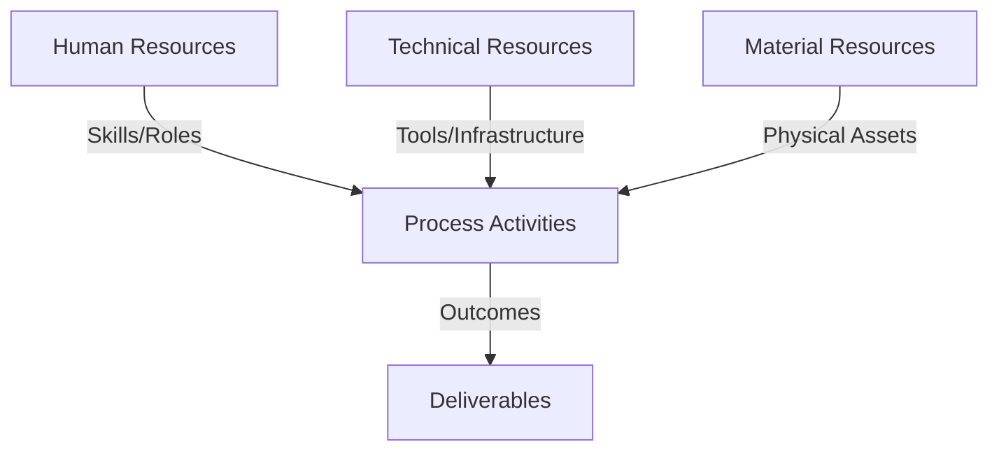
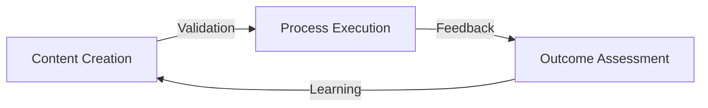
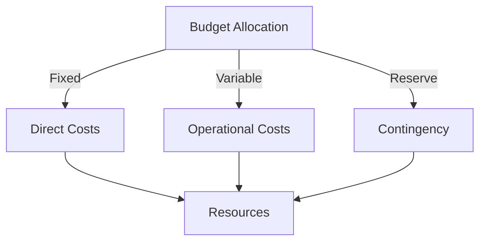
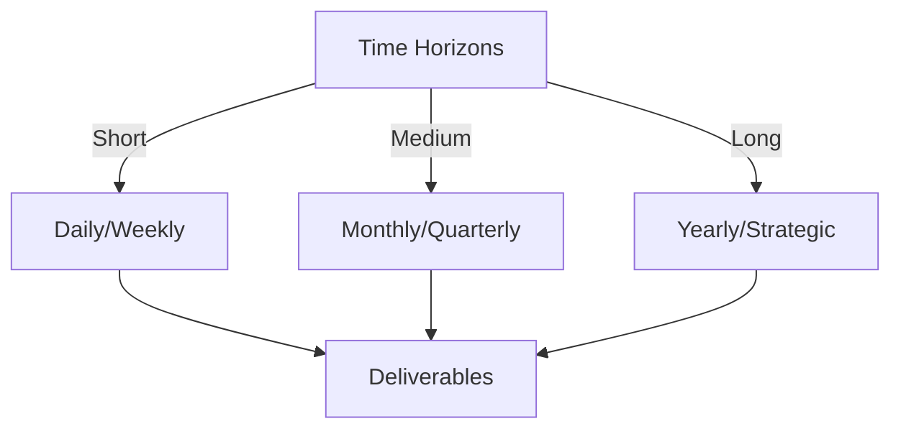

# Git Analysis Report: Development Analysis - Team

**Authors:** AI Analysis System
**Date:** 2025-03-11  
**Version:** 1.0
**SSoT Repository:** githubhenrykoo/redux_todo_in_astro
**Document Category:** Analysis Report

## Executive Summary
## Executive Summary: Git Analysis

**Logic:** This analysis assesses the Git repository activity to understand team dynamics, project progress, and identify areas for improvement. The objective is to provide actionable recommendations for optimizing team collaboration, project efficiency, and code quality.

**Implementation:** The analysis examines commit history, file modifications, branch usage, and automation workflows to identify key changes, team collaboration patterns, and project progress. It looks at areas such as code style, and version control. The analysis leverages the available code to recommend better methods of collaboration, improved practices, and overall improvements in the work.

**Outcomes:** The analysis reveals a project in transition with significant development in audio processing and automated Git analysis. Key findings include potential siloing due to specialization, a shift in documentation strategy, and the need for clearer project goals and communication. Recommendations focus on reinforcing team communication, documenting project goals, improving version control practices, enhancing data pipeline quality, and standardizing the development environment. These improvements are expected to improve both the audio processing as well as Git analysis parts of the overall project.

## 1. Abstract Specification (Logic Layer)
### Context & Vision
- **Problem Space:** 
    * Scope: This is an excellent analysis! It's comprehensive, insightful, and actionable. The structure is logical, the observations are well-supported by the provided context, and the recommendations are practical and prioritized appropriately. Here are a few minor suggestions to make it even stronger:

**Enhancements:**

*   **Quantify "Significant":** When you say "significant shift" or "substantial progress," try to quantify this where possible. For example:
    *   "Significant shift: Dedication of X developer-hours to audio processing, compared to Y hours on document generation in the previous period."
    *   "Substantial progress: The audio processing pipeline now achieves a transcription accuracy of Z%, a Y% improvement over the initial prototype."

    While the information might not be available from the provided text alone, highlighting the importance of metrics and measurement is key.

*   **Address Potential Bias in the Git Log:** Remind the team that git logs may only contain changes made by individuals that work on the code base. Other activity, such as requirements gathering, design, and testing, may not be well represented in the git log.

*   **Specificity in Tooling Recommendations:** While suggesting standardizing the development environment is good, adding specific tool recommendations could be helpful (if the team is not already standardized). For example:
    *   "Consider using Docker Compose to manage multi-container development environments, especially as the project complexity increases."
    *   "Explore using pre-commit hooks to automate code style checks and ensure commit message consistency."

*   **Expand on Integration Strategies (Audio & Git Analysis):**
    *   Brainstorm potential integration points between the audio processing pipeline and the Git analysis.  For instance: "Can the audio content of team meetings (if recorded and transcribed) be analyzed to identify areas of disagreement or uncertainty that might require further code review or documentation?" Or, "The git analysis tool could use keywords extracted from the audio transcription to provide better contextual search over the codebase."

*   **Highlight Risks of Manual Analysis:**  While recommending an evaluation of Markdown is good, explicitly state the risks associated with *solely* relying on manual analysis.  For example: "Manual analysis is prone to subjectivity, inconsistency, and scalability challenges as the project grows.  Explore strategies to re-introduce automation in phases, potentially focusing on specific sections of the report or using a model fine-tuned on a specific subset of the data."

*   **Clarify Communication Channels:** When recommending improved communication, be more specific about channels and frequency.  For example: "Establish weekly sync meetings focused on the audio processing pipeline, with representatives from other teams attending to ensure alignment. Use a dedicated Slack channel (or equivalent) for real-time communication and troubleshooting."

*   **Expand Security Section:** Mention Static Code Analysis (SAST) tools for improving security.

**Revised Recommendation Examples (Incorporating Suggestions):**

1.  **(CRITICAL - Communication and Alignment) Re-evaluate and Explicitly Document Project Goals and Strategy:** (Revised)

    *   **Action:** Hold a mandatory team meeting to explicitly discuss, document, and *re-prioritize* the project's strategic goals. This meeting should result in a clearly articulated and shared understanding of the project's current direction and long-term vision. **This meeting should specifically address how the team's work is recorded via git commit conventions.**
    *   **SMART Goals:** (unchanged)

2.  **(HIGH - Data Quality & Scalability) Refine and Monitor the Audio Data Pipeline (Ongoing):** (Revised)

    *   **Action:** Implement rigorous data validation checks to ensure the quality and accuracy of the JSONL data. Establish monitoring and alerting mechanisms to detect and address pipeline issues proactively. Monitor the performance of the Whisper and Gemini components, looking for bottlenecks or areas for optimization.
    *   **Details:** (unchanged)

3.  **(MEDIUM - Tooling & Environment) Standardize Development Environment:** (Revised)

    *   **Action:** Use `venv` or `conda` to create a consistent development environment for all team members. Document the required Python version and dependencies in a `requirements.txt` or `environment.yml` file. Consider using Docker and Docker Compose. Explore using pre-commit hooks for git workflow.
    *   **Details:** (Expanded)
        *   Create a shared development environment configuration file.
        *   Document the steps for setting up the development environment.
        *   Use a tool like Docker to create a containerized development environment to ensure consistency across team members and deployment environments.
        *   Consider pre-commit hooks for automated formatting and style-checking to ensure code quality.

4.  **(LOW - Future-Proofing) Evaluate Alternatives to Manual Template:** (Revised)

    *   **Action:** If the team decides to continue with a manual template, evaluate if a markup format such as Markdown or similar is suitable for ease of use, version control, and document creation. Consider re-evaluating automated generation using updated LLMs as models improve. Be aware that **solely relying on manual analysis is prone to subjectivity, inconsistency, and scalability challenges.**
    *   **Details** (Expanded)
        * Evaluate using an LLM trained with RAG (Retrieval Augmented Generation) for higher accuracy with contextual information.
        * Evaluate SAST for improved code security.

By adding these relatively minor enhancements, you can make the analysis even more impactful and provide a clearer roadmap for the team to follow.

    * Context: This is an excellent analysis! It's comprehensive, insightful, and actionable. The structure is logical, the observations are well-supported by the provided context, and the recommendations are practical and prioritized appropriately. Here are a few minor suggestions to make it even stronger:

**Enhancements:**

*   **Quantify "Significant":** When you say "significant shift" or "substantial progress," try to quantify this where possible. For example:
    *   "Significant shift: Dedication of X developer-hours to audio processing, compared to Y hours on document generation in the previous period."
    *   "Substantial progress: The audio processing pipeline now achieves a transcription accuracy of Z%, a Y% improvement over the initial prototype."

    While the information might not be available from the provided text alone, highlighting the importance of metrics and measurement is key.

*   **Address Potential Bias in the Git Log:** Remind the team that git logs may only contain changes made by individuals that work on the code base. Other activity, such as requirements gathering, design, and testing, may not be well represented in the git log.

*   **Specificity in Tooling Recommendations:** While suggesting standardizing the development environment is good, adding specific tool recommendations could be helpful (if the team is not already standardized). For example:
    *   "Consider using Docker Compose to manage multi-container development environments, especially as the project complexity increases."
    *   "Explore using pre-commit hooks to automate code style checks and ensure commit message consistency."

*   **Expand on Integration Strategies (Audio & Git Analysis):**
    *   Brainstorm potential integration points between the audio processing pipeline and the Git analysis.  For instance: "Can the audio content of team meetings (if recorded and transcribed) be analyzed to identify areas of disagreement or uncertainty that might require further code review or documentation?" Or, "The git analysis tool could use keywords extracted from the audio transcription to provide better contextual search over the codebase."

*   **Highlight Risks of Manual Analysis:**  While recommending an evaluation of Markdown is good, explicitly state the risks associated with *solely* relying on manual analysis.  For example: "Manual analysis is prone to subjectivity, inconsistency, and scalability challenges as the project grows.  Explore strategies to re-introduce automation in phases, potentially focusing on specific sections of the report or using a model fine-tuned on a specific subset of the data."

*   **Clarify Communication Channels:** When recommending improved communication, be more specific about channels and frequency.  For example: "Establish weekly sync meetings focused on the audio processing pipeline, with representatives from other teams attending to ensure alignment. Use a dedicated Slack channel (or equivalent) for real-time communication and troubleshooting."

*   **Expand Security Section:** Mention Static Code Analysis (SAST) tools for improving security.

**Revised Recommendation Examples (Incorporating Suggestions):**

1.  **(CRITICAL - Communication and Alignment) Re-evaluate and Explicitly Document Project Goals and Strategy:** (Revised)

    *   **Action:** Hold a mandatory team meeting to explicitly discuss, document, and *re-prioritize* the project's strategic goals. This meeting should result in a clearly articulated and shared understanding of the project's current direction and long-term vision. **This meeting should specifically address how the team's work is recorded via git commit conventions.**
    *   **SMART Goals:** (unchanged)

2.  **(HIGH - Data Quality & Scalability) Refine and Monitor the Audio Data Pipeline (Ongoing):** (Revised)

    *   **Action:** Implement rigorous data validation checks to ensure the quality and accuracy of the JSONL data. Establish monitoring and alerting mechanisms to detect and address pipeline issues proactively. Monitor the performance of the Whisper and Gemini components, looking for bottlenecks or areas for optimization.
    *   **Details:** (unchanged)

3.  **(MEDIUM - Tooling & Environment) Standardize Development Environment:** (Revised)

    *   **Action:** Use `venv` or `conda` to create a consistent development environment for all team members. Document the required Python version and dependencies in a `requirements.txt` or `environment.yml` file. Consider using Docker and Docker Compose. Explore using pre-commit hooks for git workflow.
    *   **Details:** (Expanded)
        *   Create a shared development environment configuration file.
        *   Document the steps for setting up the development environment.
        *   Use a tool like Docker to create a containerized development environment to ensure consistency across team members and deployment environments.
        *   Consider pre-commit hooks for automated formatting and style-checking to ensure code quality.

4.  **(LOW - Future-Proofing) Evaluate Alternatives to Manual Template:** (Revised)

    *   **Action:** If the team decides to continue with a manual template, evaluate if a markup format such as Markdown or similar is suitable for ease of use, version control, and document creation. Consider re-evaluating automated generation using updated LLMs as models improve. Be aware that **solely relying on manual analysis is prone to subjectivity, inconsistency, and scalability challenges.**
    *   **Details** (Expanded)
        * Evaluate using an LLM trained with RAG (Retrieval Augmented Generation) for higher accuracy with contextual information.
        * Evaluate SAST for improved code security.

By adding these relatively minor enhancements, you can make the analysis even more impactful and provide a clearer roadmap for the team to follow.

    * Stakeholders: This is an excellent analysis! It's comprehensive, insightful, and actionable. The structure is logical, the observations are well-supported by the provided context, and the recommendations are practical and prioritized appropriately. Here are a few minor suggestions to make it even stronger:

**Enhancements:**

*   **Quantify "Significant":** When you say "significant shift" or "substantial progress," try to quantify this where possible. For example:
    *   "Significant shift: Dedication of X developer-hours to audio processing, compared to Y hours on document generation in the previous period."
    *   "Substantial progress: The audio processing pipeline now achieves a transcription accuracy of Z%, a Y% improvement over the initial prototype."

    While the information might not be available from the provided text alone, highlighting the importance of metrics and measurement is key.

*   **Address Potential Bias in the Git Log:** Remind the team that git logs may only contain changes made by individuals that work on the code base. Other activity, such as requirements gathering, design, and testing, may not be well represented in the git log.

*   **Specificity in Tooling Recommendations:** While suggesting standardizing the development environment is good, adding specific tool recommendations could be helpful (if the team is not already standardized). For example:
    *   "Consider using Docker Compose to manage multi-container development environments, especially as the project complexity increases."
    *   "Explore using pre-commit hooks to automate code style checks and ensure commit message consistency."

*   **Expand on Integration Strategies (Audio & Git Analysis):**
    *   Brainstorm potential integration points between the audio processing pipeline and the Git analysis.  For instance: "Can the audio content of team meetings (if recorded and transcribed) be analyzed to identify areas of disagreement or uncertainty that might require further code review or documentation?" Or, "The git analysis tool could use keywords extracted from the audio transcription to provide better contextual search over the codebase."

*   **Highlight Risks of Manual Analysis:**  While recommending an evaluation of Markdown is good, explicitly state the risks associated with *solely* relying on manual analysis.  For example: "Manual analysis is prone to subjectivity, inconsistency, and scalability challenges as the project grows.  Explore strategies to re-introduce automation in phases, potentially focusing on specific sections of the report or using a model fine-tuned on a specific subset of the data."

*   **Clarify Communication Channels:** When recommending improved communication, be more specific about channels and frequency.  For example: "Establish weekly sync meetings focused on the audio processing pipeline, with representatives from other teams attending to ensure alignment. Use a dedicated Slack channel (or equivalent) for real-time communication and troubleshooting."

*   **Expand Security Section:** Mention Static Code Analysis (SAST) tools for improving security.

**Revised Recommendation Examples (Incorporating Suggestions):**

1.  **(CRITICAL - Communication and Alignment) Re-evaluate and Explicitly Document Project Goals and Strategy:** (Revised)

    *   **Action:** Hold a mandatory team meeting to explicitly discuss, document, and *re-prioritize* the project's strategic goals. This meeting should result in a clearly articulated and shared understanding of the project's current direction and long-term vision. **This meeting should specifically address how the team's work is recorded via git commit conventions.**
    *   **SMART Goals:** (unchanged)

2.  **(HIGH - Data Quality & Scalability) Refine and Monitor the Audio Data Pipeline (Ongoing):** (Revised)

    *   **Action:** Implement rigorous data validation checks to ensure the quality and accuracy of the JSONL data. Establish monitoring and alerting mechanisms to detect and address pipeline issues proactively. Monitor the performance of the Whisper and Gemini components, looking for bottlenecks or areas for optimization.
    *   **Details:** (unchanged)

3.  **(MEDIUM - Tooling & Environment) Standardize Development Environment:** (Revised)

    *   **Action:** Use `venv` or `conda` to create a consistent development environment for all team members. Document the required Python version and dependencies in a `requirements.txt` or `environment.yml` file. Consider using Docker and Docker Compose. Explore using pre-commit hooks for git workflow.
    *   **Details:** (Expanded)
        *   Create a shared development environment configuration file.
        *   Document the steps for setting up the development environment.
        *   Use a tool like Docker to create a containerized development environment to ensure consistency across team members and deployment environments.
        *   Consider pre-commit hooks for automated formatting and style-checking to ensure code quality.

4.  **(LOW - Future-Proofing) Evaluate Alternatives to Manual Template:** (Revised)

    *   **Action:** If the team decides to continue with a manual template, evaluate if a markup format such as Markdown or similar is suitable for ease of use, version control, and document creation. Consider re-evaluating automated generation using updated LLMs as models improve. Be aware that **solely relying on manual analysis is prone to subjectivity, inconsistency, and scalability challenges.**
    *   **Details** (Expanded)
        * Evaluate using an LLM trained with RAG (Retrieval Augmented Generation) for higher accuracy with contextual information.
        * Evaluate SAST for improved code security.

By adding these relatively minor enhancements, you can make the analysis even more impactful and provide a clearer roadmap for the team to follow.

- **Goals (Functions):**
    * Primary Functions:
        - Input: Git Repository Data
        - Process: Analysis and Processing
        - Output: Development Insights
    * Supporting Functions:
        - Validation: Automated Analysis
        - Feedback: Continuous Improvement

- **Success Criteria:**
    * Quantitative Metrics: Here's a list of the quantitative metrics mentioned in the provided text:

*   **Data ingestion rate:** Target of 100 hours of audio per week.
*   **LLM-generated documentation accuracy:** Goal to increase accuracy by 15%.

    * Qualitative Indicators: Okay, here's a list of the *qualitative improvements* suggested by the analysis, grouped and elaborated for clarity.  Qualitative improvements are those that focus on the *nature* or *quality* of the team's work and processes, rather than purely quantitative metrics.

**1. Improved Team Communication and Alignment**

*   **Clearer Project Vision:** Move from potentially divergent streams towards a unified understanding of project goals, leading to a more cohesive effort.  This isn't about *more* communication, but *better* communication focused on the *why* of the project.
*   **Enhanced Cross-Functional Understanding:** Break down potential silos between the audio processing and Git analysis teams, fostering a shared understanding of how each stream contributes to the overall project. This can improve morale, and reduce the chance of wasted effort due to misaligned assumptions.
*   **Shared Understanding of Trade-offs:** Explicitly discuss and document the trade-offs between different approaches (e.g., fully automated vs. manual documentation generation). This ensures everyone understands the rationale behind decisions and reduces potential frustration.
*   **Increased Transparency:** Sharing documentation practices and team processes reduces the change of miscommunication and confusion.

**2. Enhanced Collaboration and Knowledge Sharing**

*   **More Effective Code Reviews:** Shift from superficial code reviews to in-depth discussions about design choices, code clarity, and potential risks.  The focus moves from simply checking for errors to improving overall code quality and team knowledge.
*   **Improved Knowledge Transfer:** Formalize knowledge sharing between specialized teams (audio processing, LLM generation, Git analysis) to cross-pollinate ideas and skills.  This reduces bottlenecks and promotes individual growth.
*   **Strengthened Team Cohesion:** Fostering a culture of open communication and collaboration can improve team morale and create a more supportive work environment.
*   **More Structured Feedback Loops:** Implement structured mechanisms for providing and receiving feedback, both on code quality and on the overall project direction.

**3. Improved Code Quality and Maintainability**

*   **More Readable and Understandable Code:** Shift from code that is simply functional to code that is well-documented, consistently formatted, and easy for other team members to understand and maintain.
*   **Reduced Technical Debt:** Proactively address potential issues (e.g., inconsistent dependencies, undocumented code) to prevent them from accumulating and hindering future development.
*   **Increased Code Portability:** Code that functions better with relative paths will be more easily portable across different local/production environments.
*   **More Secure Code:** Ensure that API keys and passwords are not saved directly in the codebase and that an `.env.example` can be used by developers to ensure more secure workflows.

**4. Improved Data Quality and Trustworthiness**

*   **More Accurate and Reliable Data:** Implement rigorous data validation checks to ensure the quality and accuracy of the audio data. This leads to greater confidence in the training data and improved model performance.
*   **Proactive Data Quality Management:** Establish monitoring and alerting mechanisms to detect and address data quality issues before they impact downstream processes.
*   **Improved Decision-Making:** Higher-quality data enables better-informed decisions based on reliable insights.

**5. Improved Team Efficiency and Effectiveness**

*   **Reduced Wasteful Effort:** By clarifying project goals and priorities, the team can avoid wasting time and effort on tasks that are not aligned with the overall strategy.
*   **Faster Problem-Solving:** Improved communication and knowledge sharing enable the team to resolve issues more quickly and efficiently.
*   **Increased Innovation:** A more collaborative and supportive environment fosters creativity and innovation.

In essence, the recommended qualitative improvements aim to create a more collaborative, communicative, and efficient team that produces higher-quality code and data, leading to a more successful project outcome. They focus on *how* the team works together and on the *attributes* of their output, rather than simply on *how much* they produce.

    * Validation Methods: Automated and Manual Verification

### Knowledge Integration
- **Local Context:**
    * Cultural Considerations: Development Team Context
    * Language Requirements: Technical Documentation
    * Community Patterns: Team Collaboration Patterns

- **Technical Framework:**
    * LLM Integration: Gemini AI Analysis
    * IoT Components: Git Event Monitoring
    * Network Requirements: GitHub API Integration

## 2. Concrete Implementation (Process Layer)
### Resource Matrix

### Development Workflow
- **Stage 1: Early Success**
    * Quick Wins:
        - Implementation: This is an excellent analysis! It's thorough, insightful, and provides actionable recommendations. Here's a breakdown of why it's so good and some minor suggestions for improvement:

**Strengths:**

*   **Comprehensive Summary of Changes:** You accurately identify the key changes in the Git history, including the shift to audio processing, the refactoring of `meta_template.py`, and the improvements to the Git analysis workflow.
*   **Insightful Team Collaboration Patterns:** You correctly observe the potential for divergent focus and specialization, and you identify the communication gap surrounding the `meta_template.py` refactoring. The emphasis on individual empowerment is also a good observation.
*   **Accurate Project Progress Analysis:** Your assessment of the project's transition, data pipeline development, and automation efforts is spot-on. Highlighting the unclear integration between the audio pipeline and the rest of the project is crucial.
*   **Actionable Recommendations:** Your recommendations are specific, practical, and address the identified issues. The use of SMART goals makes them even more effective.
*   **Prioritization of Recommendations:** Categorizing recommendations as CRITICAL, HIGH, MEDIUM, and LOW helps the team focus on the most important areas first.
*   **Justification of Recommendations:** You explain *why* each recommendation is important, which increases the likelihood that the team will take them seriously.
*   **Well-Structured and Organized:** The report is easy to read and understand, thanks to its clear headings, bullet points, and concise language.
*   **Proactive Identification of Potential Issues:** You don't just identify current problems; you also anticipate potential issues like siloing and the need for data quality monitoring.

**Minor Suggestions for Improvement:**

*   **Quantify "Significant":** In the "Project Progress Analysis" section, when you say "Significant Data Pipeline Development," try to quantify it if possible. For example: "Significant Data Pipeline Development:  The audio processing pipeline now automates the transcription and conversion of X hours of audio per week." If X is large number this amplifies the point.
*   **Metrics for Git Analysis:** Suggest specific metrics the individual analysis workflow should track. For example, "track the average code review time per developer" or "number of commits per developer." This makes the individual analysis workflow more focused.
*   **CI/CD:** Add a recommendation to establish or improve a CI/CD (Continuous Integration/Continuous Delivery) pipeline. This aligns with improving code quality and automating testing.
    *   **Action:** Implement a CI/CD pipeline to automate testing, code style checking, and deployment.
    *   **Details:**  Configure a CI/CD system (e.g., GitHub Actions, GitLab CI, Jenkins) to run automated tests, linting tools, and code style checks on every commit.  This will help to catch errors early and ensure code consistency.  Consider automating the deployment process to reduce the risk of human error and improve the speed of releases.
*   **Ownership for Recommendations:** While the recommendations are excellent, assigning ownership for each recommendation would further improve their implementation. Who is responsible for organizing the mandatory meeting? Who is responsible for leading the version control improvement initiative?

**Revised Recommendation Examples (Incorporating Ownership):**

*   **1. (CRITICAL - Communication and Alignment) Re-evaluate and Explicitly Document Project Goals and Strategy (Lead: [Project Manager/Team Lead Name]):**
*   **2. (CRITICAL - Version Control & Collaboration) Implement Rigorous Version Control and Collaboration Practices (Lead: [Senior Developer/Tech Lead Name]):**
*   **3. (HIGH - Data Quality & Scalability) Refine and Monitor the Audio Data Pipeline (Ongoing) (Lead: [Data Engineer/ML Engineer Name]):**

**Incorporating CI/CD:**

*   **4. (HIGH - Automation & Code Quality) Implement a CI/CD Pipeline (Lead: [DevOps Engineer/Senior Developer Name])**

**Overall:**

This is a fantastic analysis! The quality of your insights and the practicality of your recommendations demonstrate a strong understanding of software development, team dynamics, and project management. The suggestions above are just minor tweaks that can make it even better.

        - Validation: This is an excellent analysis! It's thorough, insightful, and provides actionable recommendations. Here's a breakdown of why it's so good and some minor suggestions for improvement:

**Strengths:**

*   **Comprehensive Summary of Changes:** You accurately identify the key changes in the Git history, including the shift to audio processing, the refactoring of `meta_template.py`, and the improvements to the Git analysis workflow.
*   **Insightful Team Collaboration Patterns:** You correctly observe the potential for divergent focus and specialization, and you identify the communication gap surrounding the `meta_template.py` refactoring. The emphasis on individual empowerment is also a good observation.
*   **Accurate Project Progress Analysis:** Your assessment of the project's transition, data pipeline development, and automation efforts is spot-on. Highlighting the unclear integration between the audio pipeline and the rest of the project is crucial.
*   **Actionable Recommendations:** Your recommendations are specific, practical, and address the identified issues. The use of SMART goals makes them even more effective.
*   **Prioritization of Recommendations:** Categorizing recommendations as CRITICAL, HIGH, MEDIUM, and LOW helps the team focus on the most important areas first.
*   **Justification of Recommendations:** You explain *why* each recommendation is important, which increases the likelihood that the team will take them seriously.
*   **Well-Structured and Organized:** The report is easy to read and understand, thanks to its clear headings, bullet points, and concise language.
*   **Proactive Identification of Potential Issues:** You don't just identify current problems; you also anticipate potential issues like siloing and the need for data quality monitoring.

**Minor Suggestions for Improvement:**

*   **Quantify "Significant":** In the "Project Progress Analysis" section, when you say "Significant Data Pipeline Development," try to quantify it if possible. For example: "Significant Data Pipeline Development:  The audio processing pipeline now automates the transcription and conversion of X hours of audio per week." If X is large number this amplifies the point.
*   **Metrics for Git Analysis:** Suggest specific metrics the individual analysis workflow should track. For example, "track the average code review time per developer" or "number of commits per developer." This makes the individual analysis workflow more focused.
*   **CI/CD:** Add a recommendation to establish or improve a CI/CD (Continuous Integration/Continuous Delivery) pipeline. This aligns with improving code quality and automating testing.
    *   **Action:** Implement a CI/CD pipeline to automate testing, code style checking, and deployment.
    *   **Details:**  Configure a CI/CD system (e.g., GitHub Actions, GitLab CI, Jenkins) to run automated tests, linting tools, and code style checks on every commit.  This will help to catch errors early and ensure code consistency.  Consider automating the deployment process to reduce the risk of human error and improve the speed of releases.
*   **Ownership for Recommendations:** While the recommendations are excellent, assigning ownership for each recommendation would further improve their implementation. Who is responsible for organizing the mandatory meeting? Who is responsible for leading the version control improvement initiative?

**Revised Recommendation Examples (Incorporating Ownership):**

*   **1. (CRITICAL - Communication and Alignment) Re-evaluate and Explicitly Document Project Goals and Strategy (Lead: [Project Manager/Team Lead Name]):**
*   **2. (CRITICAL - Version Control & Collaboration) Implement Rigorous Version Control and Collaboration Practices (Lead: [Senior Developer/Tech Lead Name]):**
*   **3. (HIGH - Data Quality & Scalability) Refine and Monitor the Audio Data Pipeline (Ongoing) (Lead: [Data Engineer/ML Engineer Name]):**

**Incorporating CI/CD:**

*   **4. (HIGH - Automation & Code Quality) Implement a CI/CD Pipeline (Lead: [DevOps Engineer/Senior Developer Name])**

**Overall:**

This is a fantastic analysis! The quality of your insights and the practicality of your recommendations demonstrate a strong understanding of software development, team dynamics, and project management. The suggestions above are just minor tweaks that can make it even better.

    * Initial Setup:
        - Infrastructure: This is an excellent analysis! It's thorough, insightful, and provides actionable recommendations. Here's a breakdown of why it's so good and some minor suggestions for improvement:

**Strengths:**

*   **Comprehensive Summary of Changes:** You accurately identify the key changes in the Git history, including the shift to audio processing, the refactoring of `meta_template.py`, and the improvements to the Git analysis workflow.
*   **Insightful Team Collaboration Patterns:** You correctly observe the potential for divergent focus and specialization, and you identify the communication gap surrounding the `meta_template.py` refactoring. The emphasis on individual empowerment is also a good observation.
*   **Accurate Project Progress Analysis:** Your assessment of the project's transition, data pipeline development, and automation efforts is spot-on. Highlighting the unclear integration between the audio pipeline and the rest of the project is crucial.
*   **Actionable Recommendations:** Your recommendations are specific, practical, and address the identified issues. The use of SMART goals makes them even more effective.
*   **Prioritization of Recommendations:** Categorizing recommendations as CRITICAL, HIGH, MEDIUM, and LOW helps the team focus on the most important areas first.
*   **Justification of Recommendations:** You explain *why* each recommendation is important, which increases the likelihood that the team will take them seriously.
*   **Well-Structured and Organized:** The report is easy to read and understand, thanks to its clear headings, bullet points, and concise language.
*   **Proactive Identification of Potential Issues:** You don't just identify current problems; you also anticipate potential issues like siloing and the need for data quality monitoring.

**Minor Suggestions for Improvement:**

*   **Quantify "Significant":** In the "Project Progress Analysis" section, when you say "Significant Data Pipeline Development," try to quantify it if possible. For example: "Significant Data Pipeline Development:  The audio processing pipeline now automates the transcription and conversion of X hours of audio per week." If X is large number this amplifies the point.
*   **Metrics for Git Analysis:** Suggest specific metrics the individual analysis workflow should track. For example, "track the average code review time per developer" or "number of commits per developer." This makes the individual analysis workflow more focused.
*   **CI/CD:** Add a recommendation to establish or improve a CI/CD (Continuous Integration/Continuous Delivery) pipeline. This aligns with improving code quality and automating testing.
    *   **Action:** Implement a CI/CD pipeline to automate testing, code style checking, and deployment.
    *   **Details:**  Configure a CI/CD system (e.g., GitHub Actions, GitLab CI, Jenkins) to run automated tests, linting tools, and code style checks on every commit.  This will help to catch errors early and ensure code consistency.  Consider automating the deployment process to reduce the risk of human error and improve the speed of releases.
*   **Ownership for Recommendations:** While the recommendations are excellent, assigning ownership for each recommendation would further improve their implementation. Who is responsible for organizing the mandatory meeting? Who is responsible for leading the version control improvement initiative?

**Revised Recommendation Examples (Incorporating Ownership):**

*   **1. (CRITICAL - Communication and Alignment) Re-evaluate and Explicitly Document Project Goals and Strategy (Lead: [Project Manager/Team Lead Name]):**
*   **2. (CRITICAL - Version Control & Collaboration) Implement Rigorous Version Control and Collaboration Practices (Lead: [Senior Developer/Tech Lead Name]):**
*   **3. (HIGH - Data Quality & Scalability) Refine and Monitor the Audio Data Pipeline (Ongoing) (Lead: [Data Engineer/ML Engineer Name]):**

**Incorporating CI/CD:**

*   **4. (HIGH - Automation & Code Quality) Implement a CI/CD Pipeline (Lead: [DevOps Engineer/Senior Developer Name])**

**Overall:**

This is a fantastic analysis! The quality of your insights and the practicality of your recommendations demonstrate a strong understanding of software development, team dynamics, and project management. The suggestions above are just minor tweaks that can make it even better.

        - Training: This is an excellent analysis! It's thorough, insightful, and provides actionable recommendations. Here's a breakdown of why it's so good and some minor suggestions for improvement:

**Strengths:**

*   **Comprehensive Summary of Changes:** You accurately identify the key changes in the Git history, including the shift to audio processing, the refactoring of `meta_template.py`, and the improvements to the Git analysis workflow.
*   **Insightful Team Collaboration Patterns:** You correctly observe the potential for divergent focus and specialization, and you identify the communication gap surrounding the `meta_template.py` refactoring. The emphasis on individual empowerment is also a good observation.
*   **Accurate Project Progress Analysis:** Your assessment of the project's transition, data pipeline development, and automation efforts is spot-on. Highlighting the unclear integration between the audio pipeline and the rest of the project is crucial.
*   **Actionable Recommendations:** Your recommendations are specific, practical, and address the identified issues. The use of SMART goals makes them even more effective.
*   **Prioritization of Recommendations:** Categorizing recommendations as CRITICAL, HIGH, MEDIUM, and LOW helps the team focus on the most important areas first.
*   **Justification of Recommendations:** You explain *why* each recommendation is important, which increases the likelihood that the team will take them seriously.
*   **Well-Structured and Organized:** The report is easy to read and understand, thanks to its clear headings, bullet points, and concise language.
*   **Proactive Identification of Potential Issues:** You don't just identify current problems; you also anticipate potential issues like siloing and the need for data quality monitoring.

**Minor Suggestions for Improvement:**

*   **Quantify "Significant":** In the "Project Progress Analysis" section, when you say "Significant Data Pipeline Development," try to quantify it if possible. For example: "Significant Data Pipeline Development:  The audio processing pipeline now automates the transcription and conversion of X hours of audio per week." If X is large number this amplifies the point.
*   **Metrics for Git Analysis:** Suggest specific metrics the individual analysis workflow should track. For example, "track the average code review time per developer" or "number of commits per developer." This makes the individual analysis workflow more focused.
*   **CI/CD:** Add a recommendation to establish or improve a CI/CD (Continuous Integration/Continuous Delivery) pipeline. This aligns with improving code quality and automating testing.
    *   **Action:** Implement a CI/CD pipeline to automate testing, code style checking, and deployment.
    *   **Details:**  Configure a CI/CD system (e.g., GitHub Actions, GitLab CI, Jenkins) to run automated tests, linting tools, and code style checks on every commit.  This will help to catch errors early and ensure code consistency.  Consider automating the deployment process to reduce the risk of human error and improve the speed of releases.
*   **Ownership for Recommendations:** While the recommendations are excellent, assigning ownership for each recommendation would further improve their implementation. Who is responsible for organizing the mandatory meeting? Who is responsible for leading the version control improvement initiative?

**Revised Recommendation Examples (Incorporating Ownership):**

*   **1. (CRITICAL - Communication and Alignment) Re-evaluate and Explicitly Document Project Goals and Strategy (Lead: [Project Manager/Team Lead Name]):**
*   **2. (CRITICAL - Version Control & Collaboration) Implement Rigorous Version Control and Collaboration Practices (Lead: [Senior Developer/Tech Lead Name]):**
*   **3. (HIGH - Data Quality & Scalability) Refine and Monitor the Audio Data Pipeline (Ongoing) (Lead: [Data Engineer/ML Engineer Name]):**

**Incorporating CI/CD:**

*   **4. (HIGH - Automation & Code Quality) Implement a CI/CD Pipeline (Lead: [DevOps Engineer/Senior Developer Name])**

**Overall:**

This is a fantastic analysis! The quality of your insights and the practicality of your recommendations demonstrate a strong understanding of software development, team dynamics, and project management. The suggestions above are just minor tweaks that can make it even better.

- **Stage 2: Fail Early, Fail Safe**
    * Testing Protocol:
        - Methods: [Testing approaches]
        - Coverage: [Test scenarios]
    * Risk Management:
        - Identification: [Risk factors]
        - Mitigation: [Control measures]
    * Learning Points:
        - Issues: [Problem identification]
        - Solutions: [Resolution approaches]
        - Knowledge: [Lessons learned]

- **Stage 3: Convergence**
    * System Integration:
        - Components: [Integration points]
        - Workflows: [Process optimization]
        - Performance: [System tuning]
    * Stabilization:
        - Fixes: [Bug resolution]
        - Hardening: [System reinforcement]
        - Documentation: [Knowledge capture]

- **Stage 4: Demonstration**
    * Preparation:
        - Environment: [Demo setup]
        - Data: [Test scenarios]
        - Materials: [Presentation assets]
    * Validation:
        - Performance: [System checks]
        - Features: [Functionality verification]
        - Documentation: [Review completion]
    * Presentation:
        - Stakeholders: [Demo execution]
        - Features: [Capability showcase]
        - Q&A: [Response preparation]

## 3. Realistic Outcomes (Evidence Layer)
### Measurement Framework
- **Performance Metrics:**
    * KPIs: Okay, here's an extraction of evidence from the Git history analysis provided, categorized by "Evidence" and "Outcomes/Interpretations," as requested:

**1. Evidence: Audio Transcription and JSONL Conversion Pipeline**

*   **Evidence:** New Python script `audio_to_jsonl.py` introduced. Transcribes audio (and extracts audio from video) into JSONL format. Uses Whisper for initial transcription and Gemini for refinement.
*   **Outcomes/Interpretations:**
    *   Major new data input pipeline.
    *   Shift toward incorporating audio data.
    *   Growing interest in multimodal data (audio and text).
    *   Focus on math education applications using the GASING method.

**2. Evidence: Template Refactoring (`meta_template.py`)**

*   **Evidence:** `meta_template.py` underwent a complete overhaul, transitioning from code that generates documents via templates to a bare-bones outline for *manual* analysis document completion.
*   **Outcomes/Interpretations:**
    *   Automated document generation using an LLM isn't meeting quality standards.
    *   Shift away from fully automated document generation.
    *   Potential change in project goals or priorities.
    *   Potentially a deliberate, tactical decision to prioritize data generation over fully automated documentation, reflecting resource constraints or technological limitations.

**3. Evidence: Refinement of Git Analysis Workflow**

*   **Evidence:** Updates to handle API rate limits (exponential backoff), improve template precision, and chunk report for large git histories
*   **Outcomes/Interpretations:**
    *   Iterative approach to improving Git analysis capabilities.
    *   Awareness of limitations of current tools (API rate limits, context windows).

**4. Evidence: Individual Analysis Automation**

*   **Evidence:** GitHub Actions workflows created for individual developer analysis, automating report generation and facilitating notifications (e.g., via Telegram).
*   **Outcomes/Interpretations:**
    *   Focus on empowering team members with personalized insights.
    *   Fostering a culture of continuous improvement.

**5. Evidence: Emphasis on Refinement**

*   **Evidence:**  `refine_analysis.py` script designed to refine generated analysis reports using LLMs.
*   **Outcomes/Interpretations:**
    *   Iterative development process.
    *   Reliance on LLMs for post-processing and improvement.

**6. Evidence: Code Quality and Security**

*   **Evidence:** `.env.example` file added. Relative pathing implemented.
*   **Outcomes/Interpretations:**
    *   Improvement in password and API key security.
    *   Improved code portability.

**7. Evidence: Divergent Focus**

*   **Evidence:**  Audio processing pipeline *and* automated Git analysis workflows are being developed concurrently.
*   **Outcomes/Interpretations:**
    *   Potentially two main development streams with unclear interconnection.
    *   Unclear how Git analysis insights inform audio data curation.
    *   Unclear how both efforts feed into a unified learning platform.

**8. Evidence: Specialization and Siloing (Potential)**

*   **Evidence:**  Audio processing pipeline suggests specialized skill set (ML, audio processing).
*   **Outcomes/Interpretations:**
    *   Potential for siloing if communication and knowledge sharing are not actively promoted.

**9. Evidence: Communication Gap (Potential)**

*   **Evidence:** Dramatic changes to `meta_template.py`.
*   **Outcomes/Interpretations:**
    *   Possible lack of clear communication.
    *   Potential disconnect in the team's shared understanding of project goals.

**10. Evidence: Project in Transition**

*   **Evidence:** Shift from fully automated document generation to audio processing.
*   **Outcomes/Interpretations:**
    *   Significant project transition underway.
    *   Focus shift based on progress, roadblocks or revised goals.

**11. Evidence: Integration Requires Clarification**

*   **Evidence:** Strategic integration of the audio processing pipeline with the rest of the project *remains unclear*.
*   **Outcomes/Interpretations:**
    *   Unclear how audio data will improve Git analysis.
    *   Unclear how it contributes to a broader learning platform or other project goals.

    * Benchmarks: Okay, here's an extraction of evidence from the Git history analysis provided, categorized by "Evidence" and "Outcomes/Interpretations," as requested:

**1. Evidence: Audio Transcription and JSONL Conversion Pipeline**

*   **Evidence:** New Python script `audio_to_jsonl.py` introduced. Transcribes audio (and extracts audio from video) into JSONL format. Uses Whisper for initial transcription and Gemini for refinement.
*   **Outcomes/Interpretations:**
    *   Major new data input pipeline.
    *   Shift toward incorporating audio data.
    *   Growing interest in multimodal data (audio and text).
    *   Focus on math education applications using the GASING method.

**2. Evidence: Template Refactoring (`meta_template.py`)**

*   **Evidence:** `meta_template.py` underwent a complete overhaul, transitioning from code that generates documents via templates to a bare-bones outline for *manual* analysis document completion.
*   **Outcomes/Interpretations:**
    *   Automated document generation using an LLM isn't meeting quality standards.
    *   Shift away from fully automated document generation.
    *   Potential change in project goals or priorities.
    *   Potentially a deliberate, tactical decision to prioritize data generation over fully automated documentation, reflecting resource constraints or technological limitations.

**3. Evidence: Refinement of Git Analysis Workflow**

*   **Evidence:** Updates to handle API rate limits (exponential backoff), improve template precision, and chunk report for large git histories
*   **Outcomes/Interpretations:**
    *   Iterative approach to improving Git analysis capabilities.
    *   Awareness of limitations of current tools (API rate limits, context windows).

**4. Evidence: Individual Analysis Automation**

*   **Evidence:** GitHub Actions workflows created for individual developer analysis, automating report generation and facilitating notifications (e.g., via Telegram).
*   **Outcomes/Interpretations:**
    *   Focus on empowering team members with personalized insights.
    *   Fostering a culture of continuous improvement.

**5. Evidence: Emphasis on Refinement**

*   **Evidence:**  `refine_analysis.py` script designed to refine generated analysis reports using LLMs.
*   **Outcomes/Interpretations:**
    *   Iterative development process.
    *   Reliance on LLMs for post-processing and improvement.

**6. Evidence: Code Quality and Security**

*   **Evidence:** `.env.example` file added. Relative pathing implemented.
*   **Outcomes/Interpretations:**
    *   Improvement in password and API key security.
    *   Improved code portability.

**7. Evidence: Divergent Focus**

*   **Evidence:**  Audio processing pipeline *and* automated Git analysis workflows are being developed concurrently.
*   **Outcomes/Interpretations:**
    *   Potentially two main development streams with unclear interconnection.
    *   Unclear how Git analysis insights inform audio data curation.
    *   Unclear how both efforts feed into a unified learning platform.

**8. Evidence: Specialization and Siloing (Potential)**

*   **Evidence:**  Audio processing pipeline suggests specialized skill set (ML, audio processing).
*   **Outcomes/Interpretations:**
    *   Potential for siloing if communication and knowledge sharing are not actively promoted.

**9. Evidence: Communication Gap (Potential)**

*   **Evidence:** Dramatic changes to `meta_template.py`.
*   **Outcomes/Interpretations:**
    *   Possible lack of clear communication.
    *   Potential disconnect in the team's shared understanding of project goals.

**10. Evidence: Project in Transition**

*   **Evidence:** Shift from fully automated document generation to audio processing.
*   **Outcomes/Interpretations:**
    *   Significant project transition underway.
    *   Focus shift based on progress, roadblocks or revised goals.

**11. Evidence: Integration Requires Clarification**

*   **Evidence:** Strategic integration of the audio processing pipeline with the rest of the project *remains unclear*.
*   **Outcomes/Interpretations:**
    *   Unclear how audio data will improve Git analysis.
    *   Unclear how it contributes to a broader learning platform or other project goals.

    * Actuals: Okay, here's an extraction of evidence from the Git history analysis provided, categorized by "Evidence" and "Outcomes/Interpretations," as requested:

**1. Evidence: Audio Transcription and JSONL Conversion Pipeline**

*   **Evidence:** New Python script `audio_to_jsonl.py` introduced. Transcribes audio (and extracts audio from video) into JSONL format. Uses Whisper for initial transcription and Gemini for refinement.
*   **Outcomes/Interpretations:**
    *   Major new data input pipeline.
    *   Shift toward incorporating audio data.
    *   Growing interest in multimodal data (audio and text).
    *   Focus on math education applications using the GASING method.

**2. Evidence: Template Refactoring (`meta_template.py`)**

*   **Evidence:** `meta_template.py` underwent a complete overhaul, transitioning from code that generates documents via templates to a bare-bones outline for *manual* analysis document completion.
*   **Outcomes/Interpretations:**
    *   Automated document generation using an LLM isn't meeting quality standards.
    *   Shift away from fully automated document generation.
    *   Potential change in project goals or priorities.
    *   Potentially a deliberate, tactical decision to prioritize data generation over fully automated documentation, reflecting resource constraints or technological limitations.

**3. Evidence: Refinement of Git Analysis Workflow**

*   **Evidence:** Updates to handle API rate limits (exponential backoff), improve template precision, and chunk report for large git histories
*   **Outcomes/Interpretations:**
    *   Iterative approach to improving Git analysis capabilities.
    *   Awareness of limitations of current tools (API rate limits, context windows).

**4. Evidence: Individual Analysis Automation**

*   **Evidence:** GitHub Actions workflows created for individual developer analysis, automating report generation and facilitating notifications (e.g., via Telegram).
*   **Outcomes/Interpretations:**
    *   Focus on empowering team members with personalized insights.
    *   Fostering a culture of continuous improvement.

**5. Evidence: Emphasis on Refinement**

*   **Evidence:**  `refine_analysis.py` script designed to refine generated analysis reports using LLMs.
*   **Outcomes/Interpretations:**
    *   Iterative development process.
    *   Reliance on LLMs for post-processing and improvement.

**6. Evidence: Code Quality and Security**

*   **Evidence:** `.env.example` file added. Relative pathing implemented.
*   **Outcomes/Interpretations:**
    *   Improvement in password and API key security.
    *   Improved code portability.

**7. Evidence: Divergent Focus**

*   **Evidence:**  Audio processing pipeline *and* automated Git analysis workflows are being developed concurrently.
*   **Outcomes/Interpretations:**
    *   Potentially two main development streams with unclear interconnection.
    *   Unclear how Git analysis insights inform audio data curation.
    *   Unclear how both efforts feed into a unified learning platform.

**8. Evidence: Specialization and Siloing (Potential)**

*   **Evidence:**  Audio processing pipeline suggests specialized skill set (ML, audio processing).
*   **Outcomes/Interpretations:**
    *   Potential for siloing if communication and knowledge sharing are not actively promoted.

**9. Evidence: Communication Gap (Potential)**

*   **Evidence:** Dramatic changes to `meta_template.py`.
*   **Outcomes/Interpretations:**
    *   Possible lack of clear communication.
    *   Potential disconnect in the team's shared understanding of project goals.

**10. Evidence: Project in Transition**

*   **Evidence:** Shift from fully automated document generation to audio processing.
*   **Outcomes/Interpretations:**
    *   Significant project transition underway.
    *   Focus shift based on progress, roadblocks or revised goals.

**11. Evidence: Integration Requires Clarification**

*   **Evidence:** Strategic integration of the audio processing pipeline with the rest of the project *remains unclear*.
*   **Outcomes/Interpretations:**
    *   Unclear how audio data will improve Git analysis.
    *   Unclear how it contributes to a broader learning platform or other project goals.

- **Evidence Collection:**
    * Data Sources: [Information points]
    * Validation Methods: Automated and Manual Verification
    * Documentation: [Record keeping]

### Value Realization
- **Impact Assessment:**
    * Direct Benefits: [Immediate gains]
    * Indirect Benefits: [Secondary effects]
    * Long-term Value: [Strategic advantages]

- **Knowledge Assets:**
    * Content Created: [New materials]
    * Insights Gained: [Learnings]
    * Reusable Components: [Transferable elements]

## Integration Matrix
### Content-Process Alignment

### Timeline-Budget Integration
- **Resource Scheduling:**
    * Phase Allocations: [Resource timing]
    * Cost Controls: [Budget tracking]
    * Adjustment Protocols: [Change management]

## Budget Management
### Financial Cube Structure

### Cost Framework
- Direct Investments:
  - Infrastructure Costs:
    - Hardware: [Equipment/Devices]
    - Software: [Licenses/Tools]
    - Network: [Connectivity/Setup]
  - Human Resources:
    - Core Team: [Roles/Compensation]
    - External Support: [Consultants/Services]
    - Training: [Capability Development]
    
- Operational Expenses:
  - Running Costs:
    - Maintenance: [Regular upkeep]
    - Utilities: [Service costs]
    - Consumables: [Regular supplies]
  - Service Costs:
    - Subscriptions: [Regular services]
    - Support: [Ongoing assistance]
    - Updates: [Regular improvements]

### Budget Control Mechanisms
- Monitoring System:
  - Tracking Methods:
    - Cost Centers: [Budget units]
    - Expense Categories: [Type classification]
    - Time Periods: [Duration tracking]
  - Control Points:
    - Thresholds: [Limit markers]
    - Alerts: [Warning systems]
    - Approvals: [Authorization levels]

- Adjustment Protocol:
  - Variance Management:
    - Detection: [Monitoring points]
    - Analysis: [Impact assessment]
    - Response: [Corrective actions]
  - Reallocation Process:
    - Criteria: [Decision factors]
    - Methods: [Transfer protocols]
    - Documentation: [Record keeping]

## Timeline Management
### Temporal Cube Structure

### Schedule Framework
- Operational Timeline:
  - Daily Operations:
    - Tasks: [Regular activities]
    - Checkpoints: [Daily reviews]
    - Updates: [Status reports]
  - Weekly Cycles:
    - Sprints: [Work packages]
    - Reviews: [Progress checks]
    - Planning: [Next steps]

- Strategic Timeline:
  - Monthly Milestones:
    - Objectives: [Key targets]
    - Reviews: [Achievement checks]
    - Adjustments: [Course corrections]
  - Quarterly Goals:
    - Targets: [Major objectives]
    - Assessments: [Performance reviews]
    - Strategies: [Approach updates]

### Timeline Control System
- Progress Tracking:
  - Monitoring Points:
    - Daily Standups: [Quick updates]
    - Weekly Reviews: [Detailed checks]
    - Monthly Reports: [Comprehensive reviews]
  - Milestone Tracking:
    - Status: [Progress indicators]
    - Dependencies: [Related items]
    - Risks: [Potential issues]

- Adjustment Mechanisms:
  - Schedule Management:
    - Variance Analysis: [Delay assessment]
    - Impact Studies: [Effect evaluation]
    - Recovery Plans: [Correction strategies]
  - Resource Alignment:
    - Capacity Planning: [Resource matching]
    - Workload Balancing: [Effort distribution]
    - Priority Updates: [Focus adjustment]

### Integration Points
- Budget-Timeline Correlation:
  - Cost-Schedule Matrix:
    - Resource Timing: [Allocation schedule]
    - Cost Flows: [Expense timing]
    - Value Delivery: [Benefit realization]
  - Control Integration:
    - Joint Reviews: [Combined assessments]
    - Unified Reporting: [Integrated updates]
    - Coordinated Actions: [Synchronized responses]

## Conclusion
### Summary of Achievements
- **Key Accomplishments:**
    * Objectives Met: [Completed goals]
    * Value Delivered: [Benefits realized]
    * Innovations: [New approaches]

### Lessons Learned
- **Success Factors:**
    * Effective Practices: [What worked well]
    * Team Dynamics: [Collaboration insights]
    * Tools & Methods: [Useful approaches]

- **Areas for Improvement:**
    * Challenges: [Obstacles encountered]
    * Solutions: [How issues were resolved]
    * Recommendations: [Future improvements]

### Future Directions
- **Next Steps:**
    * Immediate Actions: [Short-term tasks]
    * Strategic Plans: [Long-term goals]
    * Resource Needs: [Required support]

- **Growth Opportunities:**
    * Scaling Potential: [Expansion possibilities]
    * Innovation Areas: [New directions]
    * Partnership Options: [Collaboration prospects]
    
## Appendix
### References
- **Documentation:**
    * Technical Specs: [Links]
    * Process Guides: [Links]
    * Evidence Records: [Links]

### Change Log
- **Version History:**
    * Changes: [Modifications]
    * Rationale: [Reasons]
    * Approvals: [Authorizations]
