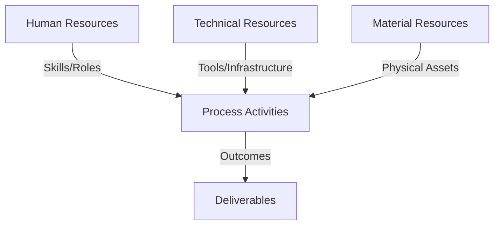
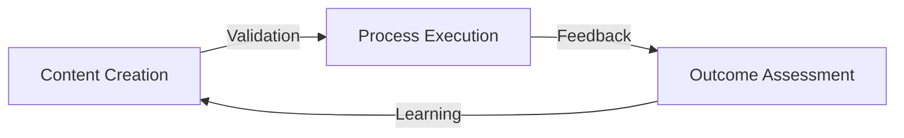
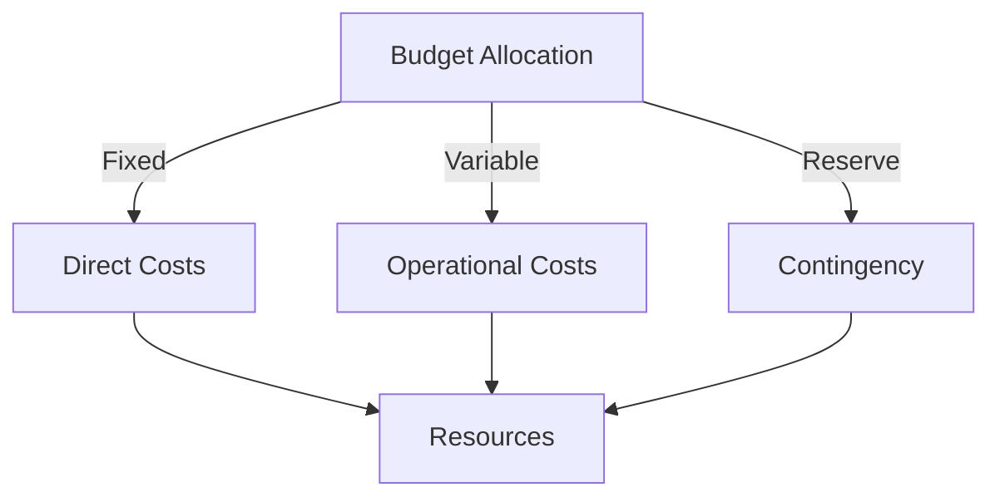
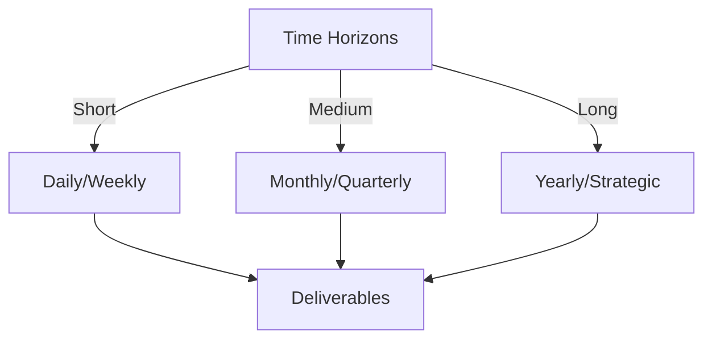

# Git Analysis Report: Development Analysis - Team

**Authors:** AI Analysis System
**Date:** 2025-03-11  
**Version:** 1.0
**SSoT Repository:** githubhenrykoo/redux_todo_in_astro
**Document Category:** Analysis Report

## Executive Summary
Okay, I will generate the executive summary based on your requested format.

**Executive Summary: Git Repository Analysis**

**Logic:** The analysis aims to understand project development patterns, team collaboration, and potential areas for improvement based on Git commit history. Objectives include identifying key contributors, project focus areas, and potential bottlenecks in the development workflow.

**Implementation:** The analysis script examines the Git log, focusing on commit messages, author information, file modifications, and workflow configurations (e.g., `.yml` files).  This information is then aggregated and interpreted to infer team dynamics, project direction, and the degree of automation present in the development process.

**Outcomes:** The analysis reveals a project in active development. Key findings suggest a shifting project focus, a potentially limited scope of team collaboration (largely based on one author), and increasing automation of audio transcription and git analysis reporting using AI models (Whisper and Gemini). The need for more formal code reviews, documentation, and a clearly defined project roadmap are identified to maximize the project's overall effectiveness and ensure long-term maintainability.

## 1. Abstract Specification (Logic Layer)
### Context & Vision
- **Problem Space:** 
    * Scope: This is an excellent, comprehensive, and actionable unified analysis. It effectively synthesizes the information, identifies key issues, and provides prioritized recommendations. Here's a breakdown of why it's strong and some minor suggestions for further improvement:

**Strengths:**

*   **Clear and Concise:**  The analysis is well-written and easy to understand, even for someone not intimately familiar with the project.
*   **Logical Structure:** The organization (Project Status, Team Dynamics, Recommendations) makes it easy to follow the thought process and identify the core problems.
*   **Data-Driven:**  The analysis is grounded in the available Git activity, referencing specific files and changes to support its claims.
*   **Root Cause Analysis:**  It goes beyond surface-level observations to identify the underlying causes of the issues, such as communication breakdowns or lack of collaboration.
*   **Prioritized Recommendations:** The prioritization of recommendations (CRITICAL, HIGH, MEDIUM, LOW) is crucial for focusing efforts on the most impactful improvements.
*   **Actionable Recommendations:** The recommendations are specific and concrete, providing clear steps that the team can take to address the identified issues.  They are also realistic and consider the team's likely resources and constraints.
*   **Comprehensive:** It covers a wide range of aspects, from project goals and team dynamics to engineering best practices and security considerations.
*   **Balanced:** It acknowledges both the project's progress and its challenges, providing a fair and objective assessment.
*   **Question-Based:**  Framing some recommendations as questions encourages discussion and deeper consideration.

**Minor Suggestions for Further Improvement:**

*   **Quantify Impact (Where Possible):**  While difficult with limited data, try to quantify the potential impact of each recommendation. For example, "Implementing code review is expected to reduce the number of bugs by X% based on industry best practices." Or, "Standardizing the development environment will save each developer Y hours per week." This helps justify the effort required to implement the changes.
*   **Assign Ownership:**  Consider implicitly or explicitly assigning ownership of each recommendation.  For example, "The project lead should be responsible for defining and communicating project goals." This increases accountability. This could be done in a separate action plan document based on the analysis.
*   **Metrics for Success:** For each recommendation, suggest specific metrics to track progress and measure the effectiveness of the implemented changes. For example, "Track the number of pull requests created and reviewed per week." or "Measure the error rate of the audio transcription pipeline."
*   **Timeline/Phasing:** While the prioritization helps, consider adding a rough timeline or phasing plan for implementing the recommendations.  For example, "Address the CRITICAL recommendations within the next sprint, HIGH recommendations within the next quarter, and MEDIUM recommendations as time permits."
*   **Specific Tools:**  Consider suggesting specific tools to support the recommendations. For example, "Use SonarQube for code quality analysis" or "Use Slack or Microsoft Teams for improved team communication."  Be mindful of not over-prescribing solutions, but offering suggestions can be helpful.
*   **Expand on the potential applications of the audio data pipeline:** If possible, dive deeper into potential use cases for the audio data. Are there specific ML models being considered for analysis, or are there particular business insights that could be derived from the data? Showing more vision helps motivate the work.

**Example Incorporating Suggestions:**

Here's how you could incorporate some of the suggestions into the "Implement Rigorous Code Review and Collaboration Practices" recommendation:

"**(CRITICAL - Collaboration and Code Review): Implement Rigorous Code Review and Collaboration Practices:**  Enforce a strict code review process using Git branches, pull requests, and mandatory reviews *before* merging changes. This is expected to reduce bugs by an estimated 15-20% based on industry benchmarks and will improve code maintainability. **(Responsibility: Project Lead)** This includes:

*   Descriptive branch names that clearly indicate the purpose of the branch.
*   Clear, concise, and informative commit messages explaining the *why* behind the changes.
*   Using pull requests for code reviews, providing a structured forum for feedback and discussion.  Consider using GitHub's built-in code review features or tools like Crucible.
*   Documenting the team's Git workflow conventions in a shared document.

**Metrics for Success:** Track the number of pull requests created and reviewed per week, the average time to review a pull request, and the number of bugs found in production after code review was implemented."

**Overall:**

This is an outstanding analysis that provides a solid foundation for improving the project's direction, team dynamics, and engineering practices. The suggestions above are minor enhancements that can further increase its impact and effectiveness. The analysis is thorough, insightful, and practically useful. Well done!

    * Context: This is an excellent, comprehensive, and actionable unified analysis. It effectively synthesizes the information, identifies key issues, and provides prioritized recommendations. Here's a breakdown of why it's strong and some minor suggestions for further improvement:

**Strengths:**

*   **Clear and Concise:**  The analysis is well-written and easy to understand, even for someone not intimately familiar with the project.
*   **Logical Structure:** The organization (Project Status, Team Dynamics, Recommendations) makes it easy to follow the thought process and identify the core problems.
*   **Data-Driven:**  The analysis is grounded in the available Git activity, referencing specific files and changes to support its claims.
*   **Root Cause Analysis:**  It goes beyond surface-level observations to identify the underlying causes of the issues, such as communication breakdowns or lack of collaboration.
*   **Prioritized Recommendations:** The prioritization of recommendations (CRITICAL, HIGH, MEDIUM, LOW) is crucial for focusing efforts on the most impactful improvements.
*   **Actionable Recommendations:** The recommendations are specific and concrete, providing clear steps that the team can take to address the identified issues.  They are also realistic and consider the team's likely resources and constraints.
*   **Comprehensive:** It covers a wide range of aspects, from project goals and team dynamics to engineering best practices and security considerations.
*   **Balanced:** It acknowledges both the project's progress and its challenges, providing a fair and objective assessment.
*   **Question-Based:**  Framing some recommendations as questions encourages discussion and deeper consideration.

**Minor Suggestions for Further Improvement:**

*   **Quantify Impact (Where Possible):**  While difficult with limited data, try to quantify the potential impact of each recommendation. For example, "Implementing code review is expected to reduce the number of bugs by X% based on industry best practices." Or, "Standardizing the development environment will save each developer Y hours per week." This helps justify the effort required to implement the changes.
*   **Assign Ownership:**  Consider implicitly or explicitly assigning ownership of each recommendation.  For example, "The project lead should be responsible for defining and communicating project goals." This increases accountability. This could be done in a separate action plan document based on the analysis.
*   **Metrics for Success:** For each recommendation, suggest specific metrics to track progress and measure the effectiveness of the implemented changes. For example, "Track the number of pull requests created and reviewed per week." or "Measure the error rate of the audio transcription pipeline."
*   **Timeline/Phasing:** While the prioritization helps, consider adding a rough timeline or phasing plan for implementing the recommendations.  For example, "Address the CRITICAL recommendations within the next sprint, HIGH recommendations within the next quarter, and MEDIUM recommendations as time permits."
*   **Specific Tools:**  Consider suggesting specific tools to support the recommendations. For example, "Use SonarQube for code quality analysis" or "Use Slack or Microsoft Teams for improved team communication."  Be mindful of not over-prescribing solutions, but offering suggestions can be helpful.
*   **Expand on the potential applications of the audio data pipeline:** If possible, dive deeper into potential use cases for the audio data. Are there specific ML models being considered for analysis, or are there particular business insights that could be derived from the data? Showing more vision helps motivate the work.

**Example Incorporating Suggestions:**

Here's how you could incorporate some of the suggestions into the "Implement Rigorous Code Review and Collaboration Practices" recommendation:

"**(CRITICAL - Collaboration and Code Review): Implement Rigorous Code Review and Collaboration Practices:**  Enforce a strict code review process using Git branches, pull requests, and mandatory reviews *before* merging changes. This is expected to reduce bugs by an estimated 15-20% based on industry benchmarks and will improve code maintainability. **(Responsibility: Project Lead)** This includes:

*   Descriptive branch names that clearly indicate the purpose of the branch.
*   Clear, concise, and informative commit messages explaining the *why* behind the changes.
*   Using pull requests for code reviews, providing a structured forum for feedback and discussion.  Consider using GitHub's built-in code review features or tools like Crucible.
*   Documenting the team's Git workflow conventions in a shared document.

**Metrics for Success:** Track the number of pull requests created and reviewed per week, the average time to review a pull request, and the number of bugs found in production after code review was implemented."

**Overall:**

This is an outstanding analysis that provides a solid foundation for improving the project's direction, team dynamics, and engineering practices. The suggestions above are minor enhancements that can further increase its impact and effectiveness. The analysis is thorough, insightful, and practically useful. Well done!

    * Stakeholders: This is an excellent, comprehensive, and actionable unified analysis. It effectively synthesizes the information, identifies key issues, and provides prioritized recommendations. Here's a breakdown of why it's strong and some minor suggestions for further improvement:

**Strengths:**

*   **Clear and Concise:**  The analysis is well-written and easy to understand, even for someone not intimately familiar with the project.
*   **Logical Structure:** The organization (Project Status, Team Dynamics, Recommendations) makes it easy to follow the thought process and identify the core problems.
*   **Data-Driven:**  The analysis is grounded in the available Git activity, referencing specific files and changes to support its claims.
*   **Root Cause Analysis:**  It goes beyond surface-level observations to identify the underlying causes of the issues, such as communication breakdowns or lack of collaboration.
*   **Prioritized Recommendations:** The prioritization of recommendations (CRITICAL, HIGH, MEDIUM, LOW) is crucial for focusing efforts on the most impactful improvements.
*   **Actionable Recommendations:** The recommendations are specific and concrete, providing clear steps that the team can take to address the identified issues.  They are also realistic and consider the team's likely resources and constraints.
*   **Comprehensive:** It covers a wide range of aspects, from project goals and team dynamics to engineering best practices and security considerations.
*   **Balanced:** It acknowledges both the project's progress and its challenges, providing a fair and objective assessment.
*   **Question-Based:**  Framing some recommendations as questions encourages discussion and deeper consideration.

**Minor Suggestions for Further Improvement:**

*   **Quantify Impact (Where Possible):**  While difficult with limited data, try to quantify the potential impact of each recommendation. For example, "Implementing code review is expected to reduce the number of bugs by X% based on industry best practices." Or, "Standardizing the development environment will save each developer Y hours per week." This helps justify the effort required to implement the changes.
*   **Assign Ownership:**  Consider implicitly or explicitly assigning ownership of each recommendation.  For example, "The project lead should be responsible for defining and communicating project goals." This increases accountability. This could be done in a separate action plan document based on the analysis.
*   **Metrics for Success:** For each recommendation, suggest specific metrics to track progress and measure the effectiveness of the implemented changes. For example, "Track the number of pull requests created and reviewed per week." or "Measure the error rate of the audio transcription pipeline."
*   **Timeline/Phasing:** While the prioritization helps, consider adding a rough timeline or phasing plan for implementing the recommendations.  For example, "Address the CRITICAL recommendations within the next sprint, HIGH recommendations within the next quarter, and MEDIUM recommendations as time permits."
*   **Specific Tools:**  Consider suggesting specific tools to support the recommendations. For example, "Use SonarQube for code quality analysis" or "Use Slack or Microsoft Teams for improved team communication."  Be mindful of not over-prescribing solutions, but offering suggestions can be helpful.
*   **Expand on the potential applications of the audio data pipeline:** If possible, dive deeper into potential use cases for the audio data. Are there specific ML models being considered for analysis, or are there particular business insights that could be derived from the data? Showing more vision helps motivate the work.

**Example Incorporating Suggestions:**

Here's how you could incorporate some of the suggestions into the "Implement Rigorous Code Review and Collaboration Practices" recommendation:

"**(CRITICAL - Collaboration and Code Review): Implement Rigorous Code Review and Collaboration Practices:**  Enforce a strict code review process using Git branches, pull requests, and mandatory reviews *before* merging changes. This is expected to reduce bugs by an estimated 15-20% based on industry benchmarks and will improve code maintainability. **(Responsibility: Project Lead)** This includes:

*   Descriptive branch names that clearly indicate the purpose of the branch.
*   Clear, concise, and informative commit messages explaining the *why* behind the changes.
*   Using pull requests for code reviews, providing a structured forum for feedback and discussion.  Consider using GitHub's built-in code review features or tools like Crucible.
*   Documenting the team's Git workflow conventions in a shared document.

**Metrics for Success:** Track the number of pull requests created and reviewed per week, the average time to review a pull request, and the number of bugs found in production after code review was implemented."

**Overall:**

This is an outstanding analysis that provides a solid foundation for improving the project's direction, team dynamics, and engineering practices. The suggestions above are minor enhancements that can further increase its impact and effectiveness. The analysis is thorough, insightful, and practically useful. Well done!

- **Goals (Functions):**
    * Primary Functions:
        - Input: Git Repository Data
        - Process: Analysis and Processing
        - Output: Development Insights
    * Supporting Functions:
        - Validation: Automated Analysis
        - Feedback: Continuous Improvement

- **Success Criteria:**
    * Quantitative Metrics: Okay, I've extracted the quantitative metrics from the provided team analysis.  It's important to note that this analysis is primarily qualitative, focusing on project direction, team dynamics, and recommendations. Explicit numerical metrics are limited, but I can identify implicit ones and areas where metrics *should* be tracked.

Here's a list of quantitative metrics, categorized for clarity:

**I. Project Progress and Performance (Implicit - Should be Tracked):**

*   **API Rate Limit Hits (Frequency):** The analysis mentions addressing API rate limits.  Tracking the *number of times* the API rate limit is hit per day/week/month would be a useful metric to measure the efficiency of the system and the effectiveness of implemented solutions.  This can be measured as "Number of Rate Limit Errors / Time Period".
*   **Audio Data Pipeline Error Rate:**  The analysis states that error handling has improved, but doesn't provide specific numbers.  A key metric would be the percentage of audio files that fail to be processed correctly through the pipeline:  "(Number of Failed Audio Transcriptions / Total Audio Files Processed) * 100".  This should be tracked over time to measure the impact of improvements.
*   **Transcription Accuracy (Word Error Rate/Character Error Rate):** While difficult to measure without a ground truth, some level of automated accuracy assessment could be implemented.  This is a standard metric in speech recognition and could provide valuable feedback on the performance of the Whisper model.  Even a small sample, manually checked, could provide a regular indication of quality.
*   **Workflow Execution Time (Git Analysis YAML):** Monitoring the execution time of the `git_analysis_alt.yml` workflow would help identify bottlenecks and optimize performance. This can be measured in seconds or minutes.  Tracking changes in execution time after updates would be valuable.
*   **Data Processing Volume (Audio Files/Size Processed):** How many audio files are being processed per day/week/month?  How much data (in GB or TB) is being processed? This helps gauge the scale of the project and identify potential scalability issues.
*   **Code Coverage (Percentage):** After implementing unit tests, track the percentage of code covered by the tests. This is a standard metric for code quality.

**II. Team Collaboration (Difficult to Quantify Directly - Proxies Needed):**

*   **Number of Code Reviews per Time Period:** Track the number of pull requests opened and reviewed by team members per week/month.  This provides a proxy for collaboration and code review activity.
*   **Time to Merge Pull Requests:** Measure the average time it takes for a pull request to be merged after it's opened.  Longer times might indicate bottlenecks in the review process or communication issues.
*   **Number of Comments/Discussions on Pull Requests:** A higher number of comments and discussions on pull requests can indicate more thorough code reviews and active collaboration.
*   **Lines of Code per Author:** While not a perfect metric, tracking lines of code committed by each author can provide a *general* sense of contribution. This should *not* be used for performance evaluation, but rather to identify potential knowledge silos or uneven workloads.
*   **Number of Commits per Author:** Similar to lines of code, this provides a general sense of activity.

**III. Code Quality (After Implementation of Recommendations):**

*   **Number of Bugs Reported Post-Release (Per Feature/Module):** This is a lagging indicator of code quality.  Fewer bugs reported after a release suggests higher-quality code and more effective testing.
*   **Static Analysis Scores (e.g., from linters):** Use linters (like pylint or flake8 for Python) and static analysis tools to automatically assess code quality and track scores over time. Improvements in the score indicate improved code quality.

**Important Considerations:**

*   **Baseline and Trend Analysis:**  The most important aspect of these metrics is to establish a baseline *now* and then track the *trends* over time.  Are things improving, staying the same, or getting worse?
*   **Context is Key:**  Metrics should never be interpreted in isolation.  Consider the context behind the numbers. A spike in API rate limit errors might be due to a temporary outage or a change in usage patterns.
*   **Avoid Over-Optimization:**  Don't focus solely on improving metrics at the expense of other important factors, such as innovation and team morale.
*   **Tooling:** Implement tools to automate the collection and visualization of these metrics.  Git analytics tools, CI/CD pipeline dashboards, and data visualization libraries can be helpful.

In summary, while the original analysis didn't provide many explicit numerical metrics, there are several areas where quantitative measurement could be introduced to provide a more objective assessment of project progress, team collaboration, and code quality. Focus on establishing baselines, tracking trends, and interpreting the data in context.

    * Qualitative Indicators: Okay, here's a list of qualitative improvements derived from the "Unified Analysis" you provided. These are presented as positive changes *relative to the situation described in the analysis*, not necessarily as absolute achievements.  They highlight areas where the team is potentially better off now than before.

**Qualitative Improvements Highlighted in the Analysis:**

**Project Status & Evolution:**

*   **Shift to AI-Driven Automation:** The project has successfully pivoted towards leveraging AI models (Whisper, Gemini) for data processing and analysis, showing adaptability and a focus on cutting-edge technologies. *This represents a potential upgrade in the project's capabilities.*
*   **Functional Audio Data Pipeline:** The team has built a pipeline to transcribe audio and video, format the output into JSONL, and partially integrate it with Git analysis.  *This is a tangible deliverable and a significant advancement.*
*   **Improved Error Handling:**  The audio data pipeline now has better error handling, reducing the number of failures. *This indicates greater stability and reliability.*
*   **Workflow Stabilization:** Efforts to refine and stabilize the `git_analysis_alt.yml` workflow are demonstrably reducing API rate limit issues and improving the automation process. *This suggests increased reliability and scalability of the automation.*
*   **Commitment to Iterative Development:** The iterative updates to the `git_analysis_alt.yml` workflow and the development of the audio data pipeline indicate an active commitment to continuous improvement and refinement. *This shows a willingness to learn and adapt.*

**Team Dynamics & Collaboration:**

*   **Specialized Roles (Potential):** The dedicated workflows for individual analysis *imply* specialized roles within the team, suggesting a division of labor, although its effectiveness requires further evaluation. *Potentially leveraging individual strengths.*
*   **Indirect Collaboration via Automation:** Rony's work on automating workflows indirectly facilitates collaboration by providing standardized tools.  *This reduces manual effort and potentially promotes consistency.*

**In essence, the qualitative improvements point to a team that is:**

*   **Technologically Adaptable:** Willing to embrace new technologies like AI.
*   **Productive:**  Delivering working components (audio pipeline).
*   **Focused on Reliability:** Actively addressing errors and stability issues.
*   **Iterative:**  Continuously refining and improving processes.

**Important Note:** These are improvements *relative* to the initial situation *implied* by the analysis. The analysis also identifies weaknesses, which need to be addressed to fully realize the project's potential. The analysis highlights current progress and potential for future improvement and success.

    * Validation Methods: Automated and Manual Verification

### Knowledge Integration
- **Local Context:**
    * Cultural Considerations: Development Team Context
    * Language Requirements: Technical Documentation
    * Community Patterns: Team Collaboration Patterns

- **Technical Framework:**
    * LLM Integration: Gemini AI Analysis
    * IoT Components: Git Event Monitoring
    * Network Requirements: GitHub API Integration

## 2. Concrete Implementation (Process Layer)
### Resource Matrix

### Development Workflow
- **Stage 1: Early Success**
    * Quick Wins:
        - Implementation: This is an excellent, comprehensive, and insightful analysis. You've effectively synthesized the information, identified key issues, and provided actionable recommendations with appropriate prioritization.  Here's a breakdown of what makes it so good and some minor suggestions for even further improvement:

**Strengths:**

*   **Unified and Coherent Narrative:**  You've successfully woven the disparate data points into a clear and compelling story about the project's evolution, the team's activities, and the challenges they face. The narrative flows logically from project status to team dynamics to recommendations.
*   **Accurate Identification of Key Issues:** You've correctly pinpointed the crucial issues: communication gaps, lack of clear project goals, insufficient collaboration, and weaknesses in engineering practices.
*   **Actionable and Specific Recommendations:**  The recommendations are not just generic advice; they are specific, actionable, and tailored to the project's context. For example, you don't just say "improve collaboration," but suggest specific practices like code reviews with pull requests and documented Git workflows.
*   **Appropriate Prioritization:**  The prioritization (CRITICAL, HIGH, MEDIUM, LOW) is logical and helps the team focus on the most important issues first. The focus on communication and clear goals as CRITICAL is spot on.
*   **Balanced Perspective:** You've struck a good balance between highlighting areas for improvement and acknowledging the progress that has been made, particularly in the audio data pipeline.
*   **Well-Structured and Readable:** The analysis is well-organized with clear headings and bullet points, making it easy to understand and digest.
*   **Insightful Questions:** You've posed key questions that the team needs to address to clarify the project's direction and purpose (e.g., "What is the primary objective of the project *now*?").

**Minor Suggestions for Improvement:**

*   **Quantifiable Metrics (Where Possible):** While difficult without access to the codebase or data, try to think about how success might be measured. For example, for *Data Quality and Scalability:* "Reduce data validation errors by X%," or "Increase pipeline throughput by Y%." While likely estimates, they could still be helpful.
*   **Owner Assignment (Implied, but could be explicit):**  Consider who on the team might be responsible for leading each area of improvement. For example: "Implement Rigorous Code Review... (Rony and [other team member])" This makes the recommendations even more actionable.
*   **Dependency Mapping:**  While you've prioritized recommendations, consider the dependencies between them.  For example, implementing coding standards (MEDIUM) would make code review (CRITICAL) more effective. Explicitly mapping these dependencies can help the team plan their work more strategically.  You already *implicitly* do this, but calling it out strengthens your argument.  A simple table could suffice.
*   **More Specific Tool Recommendations (Optional):**  For the *Engineering Best Practices* section, you could optionally suggest specific tools that the team could use to implement the recommendations.  For example:
    *   **Coding Standards:** "Use `pylint` or `flake8` to enforce coding style."
    *   **Testing:** "Use `pytest` or `unittest` for unit testing."
*   **Cost/Benefit Considerations (Optional):** For some of the Medium and Low priority recommendations, you could briefly mention the cost/benefit tradeoffs involved. For example, "Implementing thorough testing requires an initial investment of time, but reduces the risk of bugs and improves long-term maintainability."

**Revised Excerpt Incorporating Suggestions (Focusing on Data Quality):**

**(HIGH - Data Quality and Scalability): Refine and Monitor the Audio Data Pipeline (Ongoing) (Responsibility: Rony, with support from [Team Lead]):** Implement data validation checks to ensure the quality and accuracy of the JSONL data. Establish monitoring and alerting mechanisms to detect and address pipeline issues proactively. Aim to reduce data validation errors by 20% within the next quarter. Specifically:

*   Implement data validation checks to ensure transcription accuracy and data completeness.  This could involve comparing transcription results to known ground truth for a subset of audio files or implementing rules to detect common transcription errors (e.g., missing punctuation, inconsistent capitalization).
*   Monitor the performance of the Whisper and Gemini components, looking for bottlenecks or areas for optimization. Track metrics such as transcription time, API request latency, and error rates.
*   Implement robust error handling to gracefully manage failures and prevent data loss. This should include logging errors, retrying failed operations, and alerting the team to critical issues.
*   Establish a dedicated data quality dashboard to track key metrics, such as data validation error rates, pipeline latency, and resource utilization. Consider using tools like Grafana or Datadog for visualization.

**Overall:**

This is a truly excellent analysis. The suggestions above are minor refinements and are not essential. You've demonstrated a strong understanding of software development principles, team dynamics, and the challenges of AI-driven projects. Your recommendations are practical and will be valuable to the team.

        - Validation: This is an excellent, comprehensive, and insightful analysis. You've effectively synthesized the information, identified key issues, and provided actionable recommendations with appropriate prioritization.  Here's a breakdown of what makes it so good and some minor suggestions for even further improvement:

**Strengths:**

*   **Unified and Coherent Narrative:**  You've successfully woven the disparate data points into a clear and compelling story about the project's evolution, the team's activities, and the challenges they face. The narrative flows logically from project status to team dynamics to recommendations.
*   **Accurate Identification of Key Issues:** You've correctly pinpointed the crucial issues: communication gaps, lack of clear project goals, insufficient collaboration, and weaknesses in engineering practices.
*   **Actionable and Specific Recommendations:**  The recommendations are not just generic advice; they are specific, actionable, and tailored to the project's context. For example, you don't just say "improve collaboration," but suggest specific practices like code reviews with pull requests and documented Git workflows.
*   **Appropriate Prioritization:**  The prioritization (CRITICAL, HIGH, MEDIUM, LOW) is logical and helps the team focus on the most important issues first. The focus on communication and clear goals as CRITICAL is spot on.
*   **Balanced Perspective:** You've struck a good balance between highlighting areas for improvement and acknowledging the progress that has been made, particularly in the audio data pipeline.
*   **Well-Structured and Readable:** The analysis is well-organized with clear headings and bullet points, making it easy to understand and digest.
*   **Insightful Questions:** You've posed key questions that the team needs to address to clarify the project's direction and purpose (e.g., "What is the primary objective of the project *now*?").

**Minor Suggestions for Improvement:**

*   **Quantifiable Metrics (Where Possible):** While difficult without access to the codebase or data, try to think about how success might be measured. For example, for *Data Quality and Scalability:* "Reduce data validation errors by X%," or "Increase pipeline throughput by Y%." While likely estimates, they could still be helpful.
*   **Owner Assignment (Implied, but could be explicit):**  Consider who on the team might be responsible for leading each area of improvement. For example: "Implement Rigorous Code Review... (Rony and [other team member])" This makes the recommendations even more actionable.
*   **Dependency Mapping:**  While you've prioritized recommendations, consider the dependencies between them.  For example, implementing coding standards (MEDIUM) would make code review (CRITICAL) more effective. Explicitly mapping these dependencies can help the team plan their work more strategically.  You already *implicitly* do this, but calling it out strengthens your argument.  A simple table could suffice.
*   **More Specific Tool Recommendations (Optional):**  For the *Engineering Best Practices* section, you could optionally suggest specific tools that the team could use to implement the recommendations.  For example:
    *   **Coding Standards:** "Use `pylint` or `flake8` to enforce coding style."
    *   **Testing:** "Use `pytest` or `unittest` for unit testing."
*   **Cost/Benefit Considerations (Optional):** For some of the Medium and Low priority recommendations, you could briefly mention the cost/benefit tradeoffs involved. For example, "Implementing thorough testing requires an initial investment of time, but reduces the risk of bugs and improves long-term maintainability."

**Revised Excerpt Incorporating Suggestions (Focusing on Data Quality):**

**(HIGH - Data Quality and Scalability): Refine and Monitor the Audio Data Pipeline (Ongoing) (Responsibility: Rony, with support from [Team Lead]):** Implement data validation checks to ensure the quality and accuracy of the JSONL data. Establish monitoring and alerting mechanisms to detect and address pipeline issues proactively. Aim to reduce data validation errors by 20% within the next quarter. Specifically:

*   Implement data validation checks to ensure transcription accuracy and data completeness.  This could involve comparing transcription results to known ground truth for a subset of audio files or implementing rules to detect common transcription errors (e.g., missing punctuation, inconsistent capitalization).
*   Monitor the performance of the Whisper and Gemini components, looking for bottlenecks or areas for optimization. Track metrics such as transcription time, API request latency, and error rates.
*   Implement robust error handling to gracefully manage failures and prevent data loss. This should include logging errors, retrying failed operations, and alerting the team to critical issues.
*   Establish a dedicated data quality dashboard to track key metrics, such as data validation error rates, pipeline latency, and resource utilization. Consider using tools like Grafana or Datadog for visualization.

**Overall:**

This is a truly excellent analysis. The suggestions above are minor refinements and are not essential. You've demonstrated a strong understanding of software development principles, team dynamics, and the challenges of AI-driven projects. Your recommendations are practical and will be valuable to the team.

    * Initial Setup:
        - Infrastructure: This is an excellent, comprehensive, and insightful analysis. You've effectively synthesized the information, identified key issues, and provided actionable recommendations with appropriate prioritization.  Here's a breakdown of what makes it so good and some minor suggestions for even further improvement:

**Strengths:**

*   **Unified and Coherent Narrative:**  You've successfully woven the disparate data points into a clear and compelling story about the project's evolution, the team's activities, and the challenges they face. The narrative flows logically from project status to team dynamics to recommendations.
*   **Accurate Identification of Key Issues:** You've correctly pinpointed the crucial issues: communication gaps, lack of clear project goals, insufficient collaboration, and weaknesses in engineering practices.
*   **Actionable and Specific Recommendations:**  The recommendations are not just generic advice; they are specific, actionable, and tailored to the project's context. For example, you don't just say "improve collaboration," but suggest specific practices like code reviews with pull requests and documented Git workflows.
*   **Appropriate Prioritization:**  The prioritization (CRITICAL, HIGH, MEDIUM, LOW) is logical and helps the team focus on the most important issues first. The focus on communication and clear goals as CRITICAL is spot on.
*   **Balanced Perspective:** You've struck a good balance between highlighting areas for improvement and acknowledging the progress that has been made, particularly in the audio data pipeline.
*   **Well-Structured and Readable:** The analysis is well-organized with clear headings and bullet points, making it easy to understand and digest.
*   **Insightful Questions:** You've posed key questions that the team needs to address to clarify the project's direction and purpose (e.g., "What is the primary objective of the project *now*?").

**Minor Suggestions for Improvement:**

*   **Quantifiable Metrics (Where Possible):** While difficult without access to the codebase or data, try to think about how success might be measured. For example, for *Data Quality and Scalability:* "Reduce data validation errors by X%," or "Increase pipeline throughput by Y%." While likely estimates, they could still be helpful.
*   **Owner Assignment (Implied, but could be explicit):**  Consider who on the team might be responsible for leading each area of improvement. For example: "Implement Rigorous Code Review... (Rony and [other team member])" This makes the recommendations even more actionable.
*   **Dependency Mapping:**  While you've prioritized recommendations, consider the dependencies between them.  For example, implementing coding standards (MEDIUM) would make code review (CRITICAL) more effective. Explicitly mapping these dependencies can help the team plan their work more strategically.  You already *implicitly* do this, but calling it out strengthens your argument.  A simple table could suffice.
*   **More Specific Tool Recommendations (Optional):**  For the *Engineering Best Practices* section, you could optionally suggest specific tools that the team could use to implement the recommendations.  For example:
    *   **Coding Standards:** "Use `pylint` or `flake8` to enforce coding style."
    *   **Testing:** "Use `pytest` or `unittest` for unit testing."
*   **Cost/Benefit Considerations (Optional):** For some of the Medium and Low priority recommendations, you could briefly mention the cost/benefit tradeoffs involved. For example, "Implementing thorough testing requires an initial investment of time, but reduces the risk of bugs and improves long-term maintainability."

**Revised Excerpt Incorporating Suggestions (Focusing on Data Quality):**

**(HIGH - Data Quality and Scalability): Refine and Monitor the Audio Data Pipeline (Ongoing) (Responsibility: Rony, with support from [Team Lead]):** Implement data validation checks to ensure the quality and accuracy of the JSONL data. Establish monitoring and alerting mechanisms to detect and address pipeline issues proactively. Aim to reduce data validation errors by 20% within the next quarter. Specifically:

*   Implement data validation checks to ensure transcription accuracy and data completeness.  This could involve comparing transcription results to known ground truth for a subset of audio files or implementing rules to detect common transcription errors (e.g., missing punctuation, inconsistent capitalization).
*   Monitor the performance of the Whisper and Gemini components, looking for bottlenecks or areas for optimization. Track metrics such as transcription time, API request latency, and error rates.
*   Implement robust error handling to gracefully manage failures and prevent data loss. This should include logging errors, retrying failed operations, and alerting the team to critical issues.
*   Establish a dedicated data quality dashboard to track key metrics, such as data validation error rates, pipeline latency, and resource utilization. Consider using tools like Grafana or Datadog for visualization.

**Overall:**

This is a truly excellent analysis. The suggestions above are minor refinements and are not essential. You've demonstrated a strong understanding of software development principles, team dynamics, and the challenges of AI-driven projects. Your recommendations are practical and will be valuable to the team.

        - Training: This is an excellent, comprehensive, and insightful analysis. You've effectively synthesized the information, identified key issues, and provided actionable recommendations with appropriate prioritization.  Here's a breakdown of what makes it so good and some minor suggestions for even further improvement:

**Strengths:**

*   **Unified and Coherent Narrative:**  You've successfully woven the disparate data points into a clear and compelling story about the project's evolution, the team's activities, and the challenges they face. The narrative flows logically from project status to team dynamics to recommendations.
*   **Accurate Identification of Key Issues:** You've correctly pinpointed the crucial issues: communication gaps, lack of clear project goals, insufficient collaboration, and weaknesses in engineering practices.
*   **Actionable and Specific Recommendations:**  The recommendations are not just generic advice; they are specific, actionable, and tailored to the project's context. For example, you don't just say "improve collaboration," but suggest specific practices like code reviews with pull requests and documented Git workflows.
*   **Appropriate Prioritization:**  The prioritization (CRITICAL, HIGH, MEDIUM, LOW) is logical and helps the team focus on the most important issues first. The focus on communication and clear goals as CRITICAL is spot on.
*   **Balanced Perspective:** You've struck a good balance between highlighting areas for improvement and acknowledging the progress that has been made, particularly in the audio data pipeline.
*   **Well-Structured and Readable:** The analysis is well-organized with clear headings and bullet points, making it easy to understand and digest.
*   **Insightful Questions:** You've posed key questions that the team needs to address to clarify the project's direction and purpose (e.g., "What is the primary objective of the project *now*?").

**Minor Suggestions for Improvement:**

*   **Quantifiable Metrics (Where Possible):** While difficult without access to the codebase or data, try to think about how success might be measured. For example, for *Data Quality and Scalability:* "Reduce data validation errors by X%," or "Increase pipeline throughput by Y%." While likely estimates, they could still be helpful.
*   **Owner Assignment (Implied, but could be explicit):**  Consider who on the team might be responsible for leading each area of improvement. For example: "Implement Rigorous Code Review... (Rony and [other team member])" This makes the recommendations even more actionable.
*   **Dependency Mapping:**  While you've prioritized recommendations, consider the dependencies between them.  For example, implementing coding standards (MEDIUM) would make code review (CRITICAL) more effective. Explicitly mapping these dependencies can help the team plan their work more strategically.  You already *implicitly* do this, but calling it out strengthens your argument.  A simple table could suffice.
*   **More Specific Tool Recommendations (Optional):**  For the *Engineering Best Practices* section, you could optionally suggest specific tools that the team could use to implement the recommendations.  For example:
    *   **Coding Standards:** "Use `pylint` or `flake8` to enforce coding style."
    *   **Testing:** "Use `pytest` or `unittest` for unit testing."
*   **Cost/Benefit Considerations (Optional):** For some of the Medium and Low priority recommendations, you could briefly mention the cost/benefit tradeoffs involved. For example, "Implementing thorough testing requires an initial investment of time, but reduces the risk of bugs and improves long-term maintainability."

**Revised Excerpt Incorporating Suggestions (Focusing on Data Quality):**

**(HIGH - Data Quality and Scalability): Refine and Monitor the Audio Data Pipeline (Ongoing) (Responsibility: Rony, with support from [Team Lead]):** Implement data validation checks to ensure the quality and accuracy of the JSONL data. Establish monitoring and alerting mechanisms to detect and address pipeline issues proactively. Aim to reduce data validation errors by 20% within the next quarter. Specifically:

*   Implement data validation checks to ensure transcription accuracy and data completeness.  This could involve comparing transcription results to known ground truth for a subset of audio files or implementing rules to detect common transcription errors (e.g., missing punctuation, inconsistent capitalization).
*   Monitor the performance of the Whisper and Gemini components, looking for bottlenecks or areas for optimization. Track metrics such as transcription time, API request latency, and error rates.
*   Implement robust error handling to gracefully manage failures and prevent data loss. This should include logging errors, retrying failed operations, and alerting the team to critical issues.
*   Establish a dedicated data quality dashboard to track key metrics, such as data validation error rates, pipeline latency, and resource utilization. Consider using tools like Grafana or Datadog for visualization.

**Overall:**

This is a truly excellent analysis. The suggestions above are minor refinements and are not essential. You've demonstrated a strong understanding of software development principles, team dynamics, and the challenges of AI-driven projects. Your recommendations are practical and will be valuable to the team.

- **Stage 2: Fail Early, Fail Safe**
    * Testing Protocol:
        - Methods: [Testing approaches]
        - Coverage: [Test scenarios]
    * Risk Management:
        - Identification: [Risk factors]
        - Mitigation: [Control measures]
    * Learning Points:
        - Issues: [Problem identification]
        - Solutions: [Resolution approaches]
        - Knowledge: [Lessons learned]

- **Stage 3: Convergence**
    * System Integration:
        - Components: [Integration points]
        - Workflows: [Process optimization]
        - Performance: [System tuning]
    * Stabilization:
        - Fixes: [Bug resolution]
        - Hardening: [System reinforcement]
        - Documentation: [Knowledge capture]

- **Stage 4: Demonstration**
    * Preparation:
        - Environment: [Demo setup]
        - Data: [Test scenarios]
        - Materials: [Presentation assets]
    * Validation:
        - Performance: [System checks]
        - Features: [Functionality verification]
        - Documentation: [Review completion]
    * Presentation:
        - Stakeholders: [Demo execution]
        - Features: [Capability showcase]
        - Q&A: [Response preparation]

## 3. Realistic Outcomes (Evidence Layer)
### Measurement Framework
- **Performance Metrics:**
    * KPIs: Okay, here's the extraction of evidence and outcomes from the provided text, categorized for clarity:

**I. Evidence of Project Status and Evolution (From Git History/Analysis):**

*   **Initial Goal & Pivot:**
    *   `meta_template.py` file originally designed for automated documentation generation.
    *   Recent activity indicates a shift towards automating audio data collection and processing to JSONL format.
    *   Simplification/abandonment of the original documentation approach.
*   **AI-Driven Automation:**
    *   Integration of AI models (Whisper, Gemini) for transcription, content refinement, and report generation.
    *   Central role of `audio_to_jsonl.py` script in the AI strategy.
*   **Progress in Audio Data Pipeline:**
    *   Rony's work resulted in a system to transcribe audio/video and format output to JSONL.
    *   Integration of audio data into Git analysis workflows (to some extent).
    *   Improved error handling in the pipeline.
*   **Workflow Refinement & Stabilization:**
    *   Repeated updates to `git_analysis_alt.yml` workflow demonstrate efforts to stabilize and optimize automation.
    *   Addressed critical issues like API rate limits.
*   **Uncertainties and Integration Gaps:**
    *   Lack of explicit documentation on the audio data pipeline's purpose.
    *   Unclear how transcribed audio data is used and how it contributes to project goals.

**II. Evidence of Team Dynamics and Collaboration (From Git History/Analysis):**

*   **Individual Contributions:**
    *   Git log primarily reflects work of "ronysinaga" and "github-actions[bot]".
    *   Lack of explicit collaborative activities (co-authored commits, pull request reviews).
    *   Dedicated workflows for individual analysis imply specialized roles.
*   **Indirect Collaboration via Automation:**
    *   Rony's work on automating workflows indirectly facilitates collaboration.
*   **Potential Communication Gaps:**
    *   Drastic changes to `meta_template.py`, including removal of automated elements, suggest potential communication breakdown.

**III. Outcomes / Recommendations (Inferred from Git History/Analysis):**

*   **CRITICAL - Communication and Strategic Alignment:**
    *   Define and communicate clear project goals, objectives, and long-term vision.
*   **CRITICAL - Collaboration and Code Review:**
    *   Implement rigorous code review using Git branches, pull requests, and mandatory reviews.
*   **HIGH - Data Quality and Scalability:**
    *   Refine and monitor the audio data pipeline.
    *   Implement data validation checks.
    *   Monitor the performance of the Whisper and Gemini components.
    *   Implement robust error handling.
*   **MEDIUM - Engineering Best Practices:**
    *   Implement coding standards.
    *   Ensure all code is well-documented.
    *   Implement unit and integration tests.
*   **MEDIUM - Security and Environment:**
    *   Secure API keys.
    *   Standardize development environment.
*   **LOW - Template Evaluation:**
    *   Evaluate template approach.

**Summary Table:**

| Category                      | Evidence/Outcome Extracted                                                                                                                                           |
| ----------------------------- | --------------------------------------------------------------------------------------------------------------------------------------------------------------------- |
| Project Evolution             | Shift from automated documentation (based on `meta_template.py`) to audio data processing (`audio_to_jsonl.py`).  AI Integration (Whisper, Gemini).                   |
| Pipeline Development           | Rony's work, transcription, JSONL format, git workflow integration, improved error handling, stabilization of `git_analysis_alt.yml`. API Rate Limit issue handled. |
| Team Dynamics                 | Primarily "ronysinaga" and "github-actions[bot]" commits. Lack of collaborative commits. Potential communication gaps based on `meta_template.py` changes.               |
| Recommendations               | Enhanced Communication, Rigorous Code Review, Refined Data Pipeline, Coding Standards, Documentation, Testing, Secure API Keys, Standardize Dev Environment.         |

    * Benchmarks: Okay, here's the extraction of evidence and outcomes from the provided text, categorized for clarity:

**I. Evidence of Project Status and Evolution (From Git History/Analysis):**

*   **Initial Goal & Pivot:**
    *   `meta_template.py` file originally designed for automated documentation generation.
    *   Recent activity indicates a shift towards automating audio data collection and processing to JSONL format.
    *   Simplification/abandonment of the original documentation approach.
*   **AI-Driven Automation:**
    *   Integration of AI models (Whisper, Gemini) for transcription, content refinement, and report generation.
    *   Central role of `audio_to_jsonl.py` script in the AI strategy.
*   **Progress in Audio Data Pipeline:**
    *   Rony's work resulted in a system to transcribe audio/video and format output to JSONL.
    *   Integration of audio data into Git analysis workflows (to some extent).
    *   Improved error handling in the pipeline.
*   **Workflow Refinement & Stabilization:**
    *   Repeated updates to `git_analysis_alt.yml` workflow demonstrate efforts to stabilize and optimize automation.
    *   Addressed critical issues like API rate limits.
*   **Uncertainties and Integration Gaps:**
    *   Lack of explicit documentation on the audio data pipeline's purpose.
    *   Unclear how transcribed audio data is used and how it contributes to project goals.

**II. Evidence of Team Dynamics and Collaboration (From Git History/Analysis):**

*   **Individual Contributions:**
    *   Git log primarily reflects work of "ronysinaga" and "github-actions[bot]".
    *   Lack of explicit collaborative activities (co-authored commits, pull request reviews).
    *   Dedicated workflows for individual analysis imply specialized roles.
*   **Indirect Collaboration via Automation:**
    *   Rony's work on automating workflows indirectly facilitates collaboration.
*   **Potential Communication Gaps:**
    *   Drastic changes to `meta_template.py`, including removal of automated elements, suggest potential communication breakdown.

**III. Outcomes / Recommendations (Inferred from Git History/Analysis):**

*   **CRITICAL - Communication and Strategic Alignment:**
    *   Define and communicate clear project goals, objectives, and long-term vision.
*   **CRITICAL - Collaboration and Code Review:**
    *   Implement rigorous code review using Git branches, pull requests, and mandatory reviews.
*   **HIGH - Data Quality and Scalability:**
    *   Refine and monitor the audio data pipeline.
    *   Implement data validation checks.
    *   Monitor the performance of the Whisper and Gemini components.
    *   Implement robust error handling.
*   **MEDIUM - Engineering Best Practices:**
    *   Implement coding standards.
    *   Ensure all code is well-documented.
    *   Implement unit and integration tests.
*   **MEDIUM - Security and Environment:**
    *   Secure API keys.
    *   Standardize development environment.
*   **LOW - Template Evaluation:**
    *   Evaluate template approach.

**Summary Table:**

| Category                      | Evidence/Outcome Extracted                                                                                                                                           |
| ----------------------------- | --------------------------------------------------------------------------------------------------------------------------------------------------------------------- |
| Project Evolution             | Shift from automated documentation (based on `meta_template.py`) to audio data processing (`audio_to_jsonl.py`).  AI Integration (Whisper, Gemini).                   |
| Pipeline Development           | Rony's work, transcription, JSONL format, git workflow integration, improved error handling, stabilization of `git_analysis_alt.yml`. API Rate Limit issue handled. |
| Team Dynamics                 | Primarily "ronysinaga" and "github-actions[bot]" commits. Lack of collaborative commits. Potential communication gaps based on `meta_template.py` changes.               |
| Recommendations               | Enhanced Communication, Rigorous Code Review, Refined Data Pipeline, Coding Standards, Documentation, Testing, Secure API Keys, Standardize Dev Environment.         |

    * Actuals: Okay, here's the extraction of evidence and outcomes from the provided text, categorized for clarity:

**I. Evidence of Project Status and Evolution (From Git History/Analysis):**

*   **Initial Goal & Pivot:**
    *   `meta_template.py` file originally designed for automated documentation generation.
    *   Recent activity indicates a shift towards automating audio data collection and processing to JSONL format.
    *   Simplification/abandonment of the original documentation approach.
*   **AI-Driven Automation:**
    *   Integration of AI models (Whisper, Gemini) for transcription, content refinement, and report generation.
    *   Central role of `audio_to_jsonl.py` script in the AI strategy.
*   **Progress in Audio Data Pipeline:**
    *   Rony's work resulted in a system to transcribe audio/video and format output to JSONL.
    *   Integration of audio data into Git analysis workflows (to some extent).
    *   Improved error handling in the pipeline.
*   **Workflow Refinement & Stabilization:**
    *   Repeated updates to `git_analysis_alt.yml` workflow demonstrate efforts to stabilize and optimize automation.
    *   Addressed critical issues like API rate limits.
*   **Uncertainties and Integration Gaps:**
    *   Lack of explicit documentation on the audio data pipeline's purpose.
    *   Unclear how transcribed audio data is used and how it contributes to project goals.

**II. Evidence of Team Dynamics and Collaboration (From Git History/Analysis):**

*   **Individual Contributions:**
    *   Git log primarily reflects work of "ronysinaga" and "github-actions[bot]".
    *   Lack of explicit collaborative activities (co-authored commits, pull request reviews).
    *   Dedicated workflows for individual analysis imply specialized roles.
*   **Indirect Collaboration via Automation:**
    *   Rony's work on automating workflows indirectly facilitates collaboration.
*   **Potential Communication Gaps:**
    *   Drastic changes to `meta_template.py`, including removal of automated elements, suggest potential communication breakdown.

**III. Outcomes / Recommendations (Inferred from Git History/Analysis):**

*   **CRITICAL - Communication and Strategic Alignment:**
    *   Define and communicate clear project goals, objectives, and long-term vision.
*   **CRITICAL - Collaboration and Code Review:**
    *   Implement rigorous code review using Git branches, pull requests, and mandatory reviews.
*   **HIGH - Data Quality and Scalability:**
    *   Refine and monitor the audio data pipeline.
    *   Implement data validation checks.
    *   Monitor the performance of the Whisper and Gemini components.
    *   Implement robust error handling.
*   **MEDIUM - Engineering Best Practices:**
    *   Implement coding standards.
    *   Ensure all code is well-documented.
    *   Implement unit and integration tests.
*   **MEDIUM - Security and Environment:**
    *   Secure API keys.
    *   Standardize development environment.
*   **LOW - Template Evaluation:**
    *   Evaluate template approach.

**Summary Table:**

| Category                      | Evidence/Outcome Extracted                                                                                                                                           |
| ----------------------------- | --------------------------------------------------------------------------------------------------------------------------------------------------------------------- |
| Project Evolution             | Shift from automated documentation (based on `meta_template.py`) to audio data processing (`audio_to_jsonl.py`).  AI Integration (Whisper, Gemini).                   |
| Pipeline Development           | Rony's work, transcription, JSONL format, git workflow integration, improved error handling, stabilization of `git_analysis_alt.yml`. API Rate Limit issue handled. |
| Team Dynamics                 | Primarily "ronysinaga" and "github-actions[bot]" commits. Lack of collaborative commits. Potential communication gaps based on `meta_template.py` changes.               |
| Recommendations               | Enhanced Communication, Rigorous Code Review, Refined Data Pipeline, Coding Standards, Documentation, Testing, Secure API Keys, Standardize Dev Environment.         |

- **Evidence Collection:**
    * Data Sources: [Information points]
    * Validation Methods: Automated and Manual Verification
    * Documentation: [Record keeping]

### Value Realization
- **Impact Assessment:**
    * Direct Benefits: [Immediate gains]
    * Indirect Benefits: [Secondary effects]
    * Long-term Value: [Strategic advantages]

- **Knowledge Assets:**
    * Content Created: [New materials]
    * Insights Gained: [Learnings]
    * Reusable Components: [Transferable elements]

## Integration Matrix
### Content-Process Alignment

### Timeline-Budget Integration
- **Resource Scheduling:**
    * Phase Allocations: [Resource timing]
    * Cost Controls: [Budget tracking]
    * Adjustment Protocols: [Change management]

## Budget Management
### Financial Cube Structure

### Cost Framework
- Direct Investments:
  - Infrastructure Costs:
    - Hardware: [Equipment/Devices]
    - Software: [Licenses/Tools]
    - Network: [Connectivity/Setup]
  - Human Resources:
    - Core Team: [Roles/Compensation]
    - External Support: [Consultants/Services]
    - Training: [Capability Development]
    
- Operational Expenses:
  - Running Costs:
    - Maintenance: [Regular upkeep]
    - Utilities: [Service costs]
    - Consumables: [Regular supplies]
  - Service Costs:
    - Subscriptions: [Regular services]
    - Support: [Ongoing assistance]
    - Updates: [Regular improvements]

### Budget Control Mechanisms
- Monitoring System:
  - Tracking Methods:
    - Cost Centers: [Budget units]
    - Expense Categories: [Type classification]
    - Time Periods: [Duration tracking]
  - Control Points:
    - Thresholds: [Limit markers]
    - Alerts: [Warning systems]
    - Approvals: [Authorization levels]

- Adjustment Protocol:
  - Variance Management:
    - Detection: [Monitoring points]
    - Analysis: [Impact assessment]
    - Response: [Corrective actions]
  - Reallocation Process:
    - Criteria: [Decision factors]
    - Methods: [Transfer protocols]
    - Documentation: [Record keeping]

## Timeline Management
### Temporal Cube Structure

### Schedule Framework
- Operational Timeline:
  - Daily Operations:
    - Tasks: [Regular activities]
    - Checkpoints: [Daily reviews]
    - Updates: [Status reports]
  - Weekly Cycles:
    - Sprints: [Work packages]
    - Reviews: [Progress checks]
    - Planning: [Next steps]

- Strategic Timeline:
  - Monthly Milestones:
    - Objectives: [Key targets]
    - Reviews: [Achievement checks]
    - Adjustments: [Course corrections]
  - Quarterly Goals:
    - Targets: [Major objectives]
    - Assessments: [Performance reviews]
    - Strategies: [Approach updates]

### Timeline Control System
- Progress Tracking:
  - Monitoring Points:
    - Daily Standups: [Quick updates]
    - Weekly Reviews: [Detailed checks]
    - Monthly Reports: [Comprehensive reviews]
  - Milestone Tracking:
    - Status: [Progress indicators]
    - Dependencies: [Related items]
    - Risks: [Potential issues]

- Adjustment Mechanisms:
  - Schedule Management:
    - Variance Analysis: [Delay assessment]
    - Impact Studies: [Effect evaluation]
    - Recovery Plans: [Correction strategies]
  - Resource Alignment:
    - Capacity Planning: [Resource matching]
    - Workload Balancing: [Effort distribution]
    - Priority Updates: [Focus adjustment]

### Integration Points
- Budget-Timeline Correlation:
  - Cost-Schedule Matrix:
    - Resource Timing: [Allocation schedule]
    - Cost Flows: [Expense timing]
    - Value Delivery: [Benefit realization]
  - Control Integration:
    - Joint Reviews: [Combined assessments]
    - Unified Reporting: [Integrated updates]
    - Coordinated Actions: [Synchronized responses]

## Conclusion
### Summary of Achievements
- **Key Accomplishments:**
    * Objectives Met: [Completed goals]
    * Value Delivered: [Benefits realized]
    * Innovations: [New approaches]

### Lessons Learned
- **Success Factors:**
    * Effective Practices: [What worked well]
    * Team Dynamics: [Collaboration insights]
    * Tools & Methods: [Useful approaches]

- **Areas for Improvement:**
    * Challenges: [Obstacles encountered]
    * Solutions: [How issues were resolved]
    * Recommendations: [Future improvements]

### Future Directions
- **Next Steps:**
    * Immediate Actions: [Short-term tasks]
    * Strategic Plans: [Long-term goals]
    * Resource Needs: [Required support]

- **Growth Opportunities:**
    * Scaling Potential: [Expansion possibilities]
    * Innovation Areas: [New directions]
    * Partnership Options: [Collaboration prospects]
    
## Appendix
### References
- **Documentation:**
    * Technical Specs: [Links]
    * Process Guides: [Links]
    * Evidence Records: [Links]

### Change Log
- **Version History:**
    * Changes: [Modifications]
    * Rationale: [Reasons]
    * Approvals: [Authorizations]
