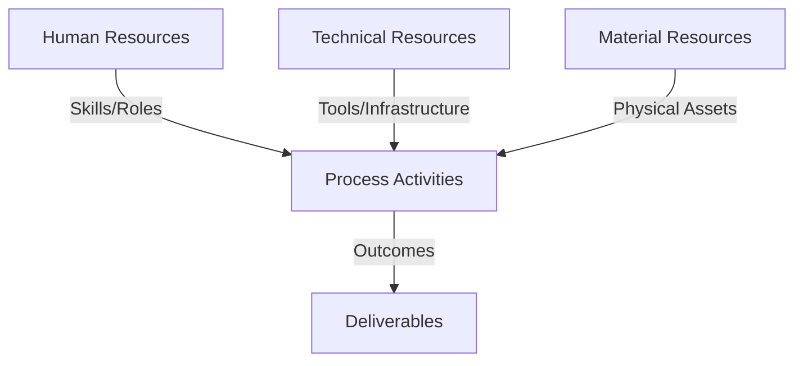
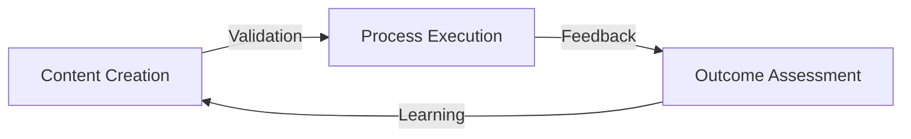
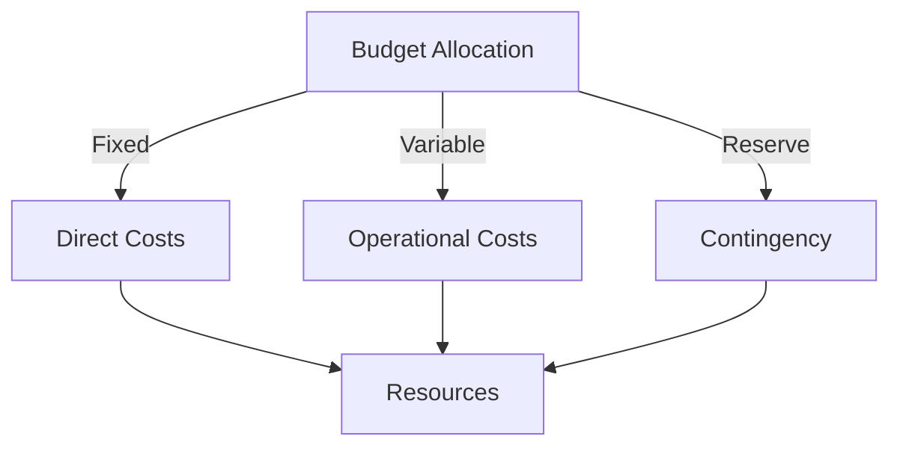
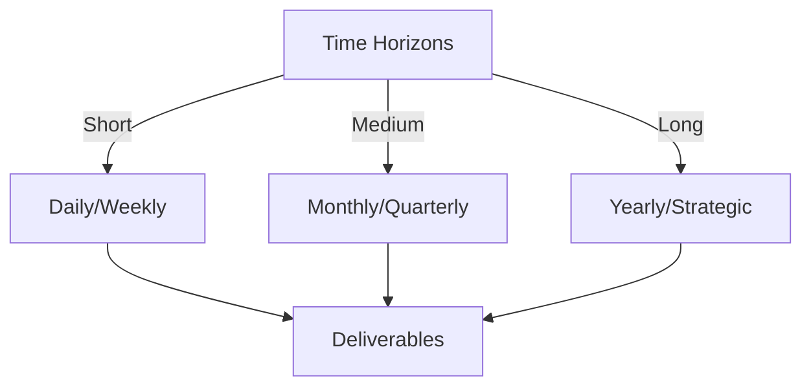

# Git Analysis Report: Development Analysis - Team

**Authors:** AI Analysis System
**Date:** 2025-03-11  
**Version:** 1.0
**SSoT Repository:** githubhenrykoo/redux_todo_in_astro
**Document Category:** Analysis Report

## Executive Summary
## Executive Summary: Automated Git Analysis System Development

**Logic:** The core purpose of this project is to develop an automated system for Git analysis, providing insights into team contributions, project progress, and potential areas for improvement. The objectives are to streamline the analysis process, enhance report quality through AI integration, and ensure long-term system maintainability and scalability.

**Implementation:** The team is building an automated Git analysis system primarily by using Github Actions to streamline workflow automation, refining prompts for AI-generated reports, implementing chunking mechanisms for large Git histories, converting Markdown to LaTeX/PDF with AI assistance (Gemini API), and refactoring existing scripts. The main methods are script development (Python), workflow configuration (YAML), and API integration (Gemini).

**Outcomes:** The project has achieved a functional state, with automation and high report quality, leveraging LLMs (Gemini API) for markdown conversion and documentation. The team is improving documentation. The team is expanding their skillsets in data and AI use. The team has created skill expansion via collaboration with each other. However, there are concerns regarding collaboration workflow, potential maintainability issues with the all-encompassing scripts, lack of code reviews, and a need for improved security practices. Recommendations include mandatory code reviews, enhanced communication, stricter adherence to coding standards, improved modularity, thorough validation & testing, and comprehensive secrets management training.

## 1. Abstract Specification (Logic Layer)
### Context & Vision
- **Problem Space:** 
    * Scope: This is an excellent and thorough analysis of the Git activity context. You've effectively synthesized the provided information into a comprehensive overview with actionable recommendations. Here's a breakdown of what makes it good and some minor suggestions for improvement:

**Strengths:**

*   **Comprehensive Summary:** The analysis accurately summarizes the individual contributions of Daffa, Rony, and Angelita, highlighting their key areas of focus.
*   **Identification of Collaboration Patterns (or Lack Thereof):** You correctly point out the limited direct evidence of collaboration and identify potential workflow conflicts arising from shared file modifications.
*   **Project Progress Assessment:** The analysis provides a balanced view of the project's progress, acknowledging its achievements (functional system, AI integration, documentation) while also raising concerns about maintainability and modularity.
*   **Actionable Recommendations:** The recommendations are specific, practical, and well-organized, covering various aspects of the development process, including collaboration, security, code quality, maintainability, testing, and scalability.
*   **Security Emphasis:** You've rightly emphasized the importance of security best practices, particularly around API key management and secrets management training.
*   **Attention to Modularity and Maintainability:** The analysis consistently stresses the need for modular code, externalized configurations, and improved error handling to ensure the long-term viability of the project.
*   **AI Integration Awareness:** The analysis recognizes the potential impact of AI integrations on scalability and performance and suggests exploring optimization techniques.
*   **Comprehensive Scope:** The analysis goes beyond the immediate code changes and considers factors like knowledge sharing, documentation standards, and potential risks associated with AI implementation.
*   **Well Organized and Readable:** The analysis is structured logically and clearly presented, making it easy to understand and follow.

**Minor Suggestions for Improvement:**

*   **Quantify "Limited":**  When discussing "limited direct evidence of collaboration," could you provide specific metrics if available (e.g., "only 2 code reviews found in the period," "no cross-commits identified").  This adds weight to the observation.
*   **Collaboration Recommendation Specificity:** The collaboration recommendations are solid, but consider adding a sentence or two suggesting specific tools or techniques the team could use. For example:
    *   "Enhanced Communication:  ...Consider using a dedicated Slack channel or Microsoft Teams channel for project discussions."
    *   "Feature Branches: ...Emphasize the use of Gitflow or a similar branching strategy."
*   **Security - Dependency Security Scanning:** Consider adding a recommendation for using dependency security scanning tools (e.g., Snyk, Dependabot) to identify and address vulnerabilities in third-party libraries.
*   **Testing Recommendation Detail:**  Expand a bit on the different types of testing:
    *   "Implement comprehensive testing...Unit tests should focus on individual functions and classes, integration tests on the interaction between components, and end-to-end tests on verifying the entire system's behavior from start to finish."
*   **Elaborate on AI Risk Assessment:** Since the report mentions an AI Risk Assessment, consider adding specific risks such as:
    *   Data privacy concerns if the Git repository contains sensitive information.
    *   Accuracy of AI-generated reports.
    *   Bias in the AI model that could lead to skewed analysis.
    *   Cost of using the Gemini API at scale.
*    **Documentation Interaction Explanation**: Elaborate the interactions that are occurring outside the primary team. For example, are teams requesting access to documentation, and who is doing it? This will help the team improve access.
*   **Prioritization:** While all recommendations are valuable, consider adding a "Prioritization" section or marking certain recommendations as "High Priority" to guide the team's immediate focus. For example, security-related recommendations and those addressing immediate workflow conflicts might be prioritized.

**Overall:**

This is a highly effective analysis. The recommendations are practical and address the key challenges and opportunities for improvement in the automated Git analysis system development. The minor suggestions above are simply to enhance the report further and make it even more actionable for the team.  This level of analysis is very valuable.

    * Context: This is an excellent and thorough analysis of the Git activity context. You've effectively synthesized the provided information into a comprehensive overview with actionable recommendations. Here's a breakdown of what makes it good and some minor suggestions for improvement:

**Strengths:**

*   **Comprehensive Summary:** The analysis accurately summarizes the individual contributions of Daffa, Rony, and Angelita, highlighting their key areas of focus.
*   **Identification of Collaboration Patterns (or Lack Thereof):** You correctly point out the limited direct evidence of collaboration and identify potential workflow conflicts arising from shared file modifications.
*   **Project Progress Assessment:** The analysis provides a balanced view of the project's progress, acknowledging its achievements (functional system, AI integration, documentation) while also raising concerns about maintainability and modularity.
*   **Actionable Recommendations:** The recommendations are specific, practical, and well-organized, covering various aspects of the development process, including collaboration, security, code quality, maintainability, testing, and scalability.
*   **Security Emphasis:** You've rightly emphasized the importance of security best practices, particularly around API key management and secrets management training.
*   **Attention to Modularity and Maintainability:** The analysis consistently stresses the need for modular code, externalized configurations, and improved error handling to ensure the long-term viability of the project.
*   **AI Integration Awareness:** The analysis recognizes the potential impact of AI integrations on scalability and performance and suggests exploring optimization techniques.
*   **Comprehensive Scope:** The analysis goes beyond the immediate code changes and considers factors like knowledge sharing, documentation standards, and potential risks associated with AI implementation.
*   **Well Organized and Readable:** The analysis is structured logically and clearly presented, making it easy to understand and follow.

**Minor Suggestions for Improvement:**

*   **Quantify "Limited":**  When discussing "limited direct evidence of collaboration," could you provide specific metrics if available (e.g., "only 2 code reviews found in the period," "no cross-commits identified").  This adds weight to the observation.
*   **Collaboration Recommendation Specificity:** The collaboration recommendations are solid, but consider adding a sentence or two suggesting specific tools or techniques the team could use. For example:
    *   "Enhanced Communication:  ...Consider using a dedicated Slack channel or Microsoft Teams channel for project discussions."
    *   "Feature Branches: ...Emphasize the use of Gitflow or a similar branching strategy."
*   **Security - Dependency Security Scanning:** Consider adding a recommendation for using dependency security scanning tools (e.g., Snyk, Dependabot) to identify and address vulnerabilities in third-party libraries.
*   **Testing Recommendation Detail:**  Expand a bit on the different types of testing:
    *   "Implement comprehensive testing...Unit tests should focus on individual functions and classes, integration tests on the interaction between components, and end-to-end tests on verifying the entire system's behavior from start to finish."
*   **Elaborate on AI Risk Assessment:** Since the report mentions an AI Risk Assessment, consider adding specific risks such as:
    *   Data privacy concerns if the Git repository contains sensitive information.
    *   Accuracy of AI-generated reports.
    *   Bias in the AI model that could lead to skewed analysis.
    *   Cost of using the Gemini API at scale.
*    **Documentation Interaction Explanation**: Elaborate the interactions that are occurring outside the primary team. For example, are teams requesting access to documentation, and who is doing it? This will help the team improve access.
*   **Prioritization:** While all recommendations are valuable, consider adding a "Prioritization" section or marking certain recommendations as "High Priority" to guide the team's immediate focus. For example, security-related recommendations and those addressing immediate workflow conflicts might be prioritized.

**Overall:**

This is a highly effective analysis. The recommendations are practical and address the key challenges and opportunities for improvement in the automated Git analysis system development. The minor suggestions above are simply to enhance the report further and make it even more actionable for the team.  This level of analysis is very valuable.

    * Stakeholders: This is an excellent and thorough analysis of the Git activity context. You've effectively synthesized the provided information into a comprehensive overview with actionable recommendations. Here's a breakdown of what makes it good and some minor suggestions for improvement:

**Strengths:**

*   **Comprehensive Summary:** The analysis accurately summarizes the individual contributions of Daffa, Rony, and Angelita, highlighting their key areas of focus.
*   **Identification of Collaboration Patterns (or Lack Thereof):** You correctly point out the limited direct evidence of collaboration and identify potential workflow conflicts arising from shared file modifications.
*   **Project Progress Assessment:** The analysis provides a balanced view of the project's progress, acknowledging its achievements (functional system, AI integration, documentation) while also raising concerns about maintainability and modularity.
*   **Actionable Recommendations:** The recommendations are specific, practical, and well-organized, covering various aspects of the development process, including collaboration, security, code quality, maintainability, testing, and scalability.
*   **Security Emphasis:** You've rightly emphasized the importance of security best practices, particularly around API key management and secrets management training.
*   **Attention to Modularity and Maintainability:** The analysis consistently stresses the need for modular code, externalized configurations, and improved error handling to ensure the long-term viability of the project.
*   **AI Integration Awareness:** The analysis recognizes the potential impact of AI integrations on scalability and performance and suggests exploring optimization techniques.
*   **Comprehensive Scope:** The analysis goes beyond the immediate code changes and considers factors like knowledge sharing, documentation standards, and potential risks associated with AI implementation.
*   **Well Organized and Readable:** The analysis is structured logically and clearly presented, making it easy to understand and follow.

**Minor Suggestions for Improvement:**

*   **Quantify "Limited":**  When discussing "limited direct evidence of collaboration," could you provide specific metrics if available (e.g., "only 2 code reviews found in the period," "no cross-commits identified").  This adds weight to the observation.
*   **Collaboration Recommendation Specificity:** The collaboration recommendations are solid, but consider adding a sentence or two suggesting specific tools or techniques the team could use. For example:
    *   "Enhanced Communication:  ...Consider using a dedicated Slack channel or Microsoft Teams channel for project discussions."
    *   "Feature Branches: ...Emphasize the use of Gitflow or a similar branching strategy."
*   **Security - Dependency Security Scanning:** Consider adding a recommendation for using dependency security scanning tools (e.g., Snyk, Dependabot) to identify and address vulnerabilities in third-party libraries.
*   **Testing Recommendation Detail:**  Expand a bit on the different types of testing:
    *   "Implement comprehensive testing...Unit tests should focus on individual functions and classes, integration tests on the interaction between components, and end-to-end tests on verifying the entire system's behavior from start to finish."
*   **Elaborate on AI Risk Assessment:** Since the report mentions an AI Risk Assessment, consider adding specific risks such as:
    *   Data privacy concerns if the Git repository contains sensitive information.
    *   Accuracy of AI-generated reports.
    *   Bias in the AI model that could lead to skewed analysis.
    *   Cost of using the Gemini API at scale.
*    **Documentation Interaction Explanation**: Elaborate the interactions that are occurring outside the primary team. For example, are teams requesting access to documentation, and who is doing it? This will help the team improve access.
*   **Prioritization:** While all recommendations are valuable, consider adding a "Prioritization" section or marking certain recommendations as "High Priority" to guide the team's immediate focus. For example, security-related recommendations and those addressing immediate workflow conflicts might be prioritized.

**Overall:**

This is a highly effective analysis. The recommendations are practical and address the key challenges and opportunities for improvement in the automated Git analysis system development. The minor suggestions above are simply to enhance the report further and make it even more actionable for the team.  This level of analysis is very valuable.

- **Goals (Functions):**
    * Primary Functions:
        - Input: Git Repository Data
        - Process: Analysis and Processing
        - Output: Development Insights
    * Supporting Functions:
        - Validation: Automated Analysis
        - Feedback: Continuous Improvement

- **Success Criteria:**
    * Quantitative Metrics: Here's a list of the quantitative metrics that can be extracted or inferred from the provided text. Note that some are more directly stated than others and would require further data from the Git repository and related systems to fully realize:

**Directly Stated (or easily derived):**

*   **Number of Team Members Contributing:** 3 (Daffa Padantya, Rony Sinaga, Panjaitan Angelita)
*   **Number of Workflow Files Modified:** The text mentions specific files: `git_analysis_alt.yml` and `md_to_pdf_each_user.yml`. We can infer a count from this, but without seeing the repository history, it is hard to know how many files were touched.
*   **API Usage (Gemini API):** While not a specific number, the text indicates *frequency* of use is increasing. We could potentially track the number of API calls from logs (not provided in the text).
*   **Project Start Date** 2025-03-11 (Generated At)

**Metrics to be Calculated from Git History and Related Systems (Requires additional data):**

*   **Lines of Code Added/Modified/Deleted per Team Member:** A standard Git metric.
*   **Number of Commits per Team Member:** Measure of individual contribution activity.
*   **Commit Frequency (e.g., commits per day/week):** Indicates project momentum.
*   **Code Review Metrics:**
    *   **Number of Pull Requests (PRs) opened/merged:** Measures the code review process.
    *   **Time to merge PRs:**  Indicates how quickly code is reviewed and integrated.
    *   **Number of comments per PR:** Reflects the depth of code review discussions.
*   **Workflow Execution Time:** Track the runtime of the GitHub Actions workflows to identify bottlenecks.
*   **Number of Workflow Failures:** Indicates reliability of the automated system.
*   **Number of Bugs/Issues Resolved:** Measures the effectiveness of debugging and problem-solving.
*   **Code Complexity (e.g., Cyclomatic Complexity):**  While not directly stated, the text raises concerns about complexity of the `convert_md_to_pdf_chunked.py` script. Tools can be used to calculate this.
*   **Test Coverage:** Requires a testing suite.  Percentage of code covered by unit tests.
*   **Documentation Coverage:** Requires a tool to analyze documentation completeness. Potentially measured as percentage of functions/classes with docstrings.

**Metrics Related to AI Integration (Requires access to AI models and log data):**

*   **AI Inference Time:** Measures the speed of the Gemini API calls.
*   **AI Cost:** Track the cost associated with using the Gemini API (based on usage).
*   **AI Quality Metrics (requires human evaluation):** This is more subjective, but metrics could include:
    *   **Accuracy of AI-generated reports (e.g., % factual correctness).**
    *   **Readability scores of AI-generated documentation.**
    *   **User satisfaction with AI outputs (measured through surveys).**

**Derived/Inferred Metrics (Less Precise, Based on the Text):**

*   **Collaboration Index:** A qualitative assessment from "Limited Direct Evidence of Collaboration" might be converted to a simple quantitative scale (e.g., 1-5) to track progress. This is subjective.
*   **Skill Expansion:** Number of team members expanding skills such as AI or Data.
*   **Documentation Access Requests:** Number of requests from members outside primary team.

**Important Considerations:**

*   **Baseline:** Establishing a baseline for many of these metrics is crucial for measuring improvement over time.
*   **Context:** Raw numbers alone don't tell the whole story. Context is vital when interpreting these metrics. For example, a high number of commits might indicate a lot of activity, or it could indicate a lot of rework.
*   **Actionable Metrics:** Focus on metrics that are actionable – metrics that can be directly influenced by changes in team practices or processes.

    * Qualitative Indicators: Okay, here's a breakdown of the qualitative improvements derived from the analysis, focusing on the *benefits* of implementing the recommendations:

**Overall Themes of Improvement:**

*   **Enhanced Teamwork & Communication:** Moving from individual contributions to a cohesive unit.
*   **Increased System Reliability & Accuracy:** Reducing errors and improving the quality of the analysis.
*   **Improved Maintainability & Scalability:** Making the system easier to update and handle larger workloads in the future.
*   **Strengthened Security Posture:** Protecting sensitive data and preventing vulnerabilities.
*   **Better Knowledge Management & Sharing:** Fostering a culture of learning and preventing knowledge silos.
*   **Reduced Risk:** Reduce security vulnerabilities, maintainability risk, AI hallucination risk.

**Specific Qualitative Improvements (Categorized):**

**1. Collaboration & Communication:**

*   **Improved Coordination & Reduced Conflicts:** Mandatory code reviews, enhanced communication, and feature branches will lead to fewer conflicting changes, smoother integration, and a more synchronized workflow. *Benefit: Faster development cycles, fewer integration headaches, and reduced wasted effort.*
*   **Increased Team Cohesion & Knowledge Sharing:** Daily stand-ups, dedicated communication channels, and knowledge-sharing sessions will foster a stronger sense of team unity and a shared understanding of the project. *Benefit:  More engaged team members, quicker problem-solving, and a more resilient team (less dependent on individual knowledge).*
*   **Active Documentation of Interactions**: Documenting interactions from outside the primary team can help create a better experience for documentation access and improve team understanding.
*   **Inclusive Decision Making**: Including team members that are not being involved in the project to understand new ideas will allow for greater adoption and ownership of the project.
*   **Better Communication around AI implementations**: Allow team members to understand the value and implementation of AI.

**2. Code Quality & Maintainability:**

*   **More Readable & Understandable Codebase:** Enforcing a consistent code style guide (using linters and formatters) will make the code easier to read, understand, and maintain by all team members. *Benefit: Reduced time spent deciphering code, easier onboarding of new developers, and fewer bugs due to misinterpretations.*
*   **Increased Modularity & Reusability:** Breaking down large scripts into reusable functions and classes will improve the system's modularity, making it easier to test, debug, and extend in the future. *Benefit: Reduced code duplication, improved testability, and greater flexibility to adapt to changing requirements.*
*   **Simplified Configuration & Deployment:** Externalizing configuration values into environment variables will make it easier to configure and deploy the system in different environments. *Benefit:  Faster deployments, reduced configuration errors, and greater flexibility in managing application settings.*
*   **More Robust Error Handling:** Refined error handling with specific logging levels will make it easier to diagnose and resolve issues in the system. *Benefit: Faster troubleshooting, reduced downtime, and improved system stability.*
*   **Focus on Original Goals:** Allowing the team to focus on prioritized tasks, such as modularity, will allow for greater flexibility in long term use.

**3. Testing & Validation:**

*   **Improved System Reliability & Accuracy:** Comprehensive testing (unit, integration, end-to-end) will ensure the reliability and accuracy of the system, reducing the risk of bugs and errors. *Benefit: Increased confidence in the system's functionality, reduced customer complaints, and improved overall user experience.*
*   **Reduced Risk of LLM Errors:** Implementing validation checks to ensure generated templates adhere to the expected format will reduce the risk of errors introduced by the LLM. *Benefit: Higher quality analysis reports, reduced need for manual review, and improved accuracy of insights.*

**4. Security:**

*   **Reduced Security Risks:** Rotating API keys and implementing secure secrets management will reduce the risk of unauthorized access to sensitive data. *Benefit: Protection of sensitive information, compliance with security policies, and reduced risk of data breaches.*
*   **Increased Awareness of Security Best Practices:** Comprehensive training on secure secrets management will equip team members with the knowledge and skills to protect sensitive data. *Benefit: Improved security posture across the organization, reduced risk of human error, and a more security-conscious team.*

**5. Scalability & Performance (AI Focus):**

*   **Improved Efficiency & Cost-Effectiveness:**  Exploring techniques like caching, asynchronous processing, and alternative AI models will optimize for efficiency and cost when using AI integrations. *Benefit: Reduced costs associated with AI services, improved system responsiveness, and the ability to handle larger workloads.*

**6. Knowledge Management:**

*   **Reduced Knowledge Silos:** Implementing regular knowledge-sharing sessions and internal code reviews will prevent knowledge from being concentrated in the hands of a few individuals. *Benefit: Increased team resilience, improved knowledge transfer, and a more collaborative learning environment.*
*   **Improved Documentation:** Establishing clear documentation standards and training the team on these will allow for easier knowledge transfer.

**7. Risk Mitigation**

*   **Improved Understanding of AI Risks:** Assessment of code that has been implemented with AI will allow for mitigation of risks such as AI hallucination.

In summary, by implementing these recommendations, the team will not only improve the technical aspects of the automated Git analysis system but also foster a more collaborative, secure, and efficient development environment. The qualitative improvements will lead to a more robust, maintainable, and valuable product in the long run.

    * Validation Methods: Automated and Manual Verification

### Knowledge Integration
- **Local Context:**
    * Cultural Considerations: Development Team Context
    * Language Requirements: Technical Documentation
    * Community Patterns: Team Collaboration Patterns

- **Technical Framework:**
    * LLM Integration: Gemini AI Analysis
    * IoT Components: Git Event Monitoring
    * Network Requirements: GitHub API Integration

## 2. Concrete Implementation (Process Layer)
### Resource Matrix

### Development Workflow
- **Stage 1: Early Success**
    * Quick Wins:
        - Implementation: This is a very good, comprehensive analysis of the Git history and the team's development workflow. It effectively summarizes individual contributions, identifies collaboration patterns (or lack thereof), assesses project progress, and provides actionable recommendations.  Here's a breakdown of its strengths and some minor suggestions for improvement:

**Strengths:**

*   **Clear and Concise Summary:** The summary of key changes and individual contributions is well-organized and easy to understand. It highlights the specific areas of focus for each team member.
*   **Identification of Potential Issues:** The analysis correctly identifies potential issues, such as limited direct collaboration, potential workflow conflicts (particularly with the `git_analysis_alt.yml` file), and maintainability concerns with the monolithic `convert_md_to_pdf_chunked.py` script. The mention of the GitHub Actions bot raises a valid concern about quality control.
*   **Actionable Recommendations:** The recommendations are practical and specific, covering a wide range of areas, including collaboration, security, code style, modularity, validation, testing, and scalability.
*   **Emphasis on Maintainability:** The analysis rightly emphasizes the importance of modularity, code readability, and maintainability, especially given the potential complexities of AI integrations.
*   **Focus on Knowledge Sharing and Documentation:** The inclusion of recommendations for knowledge sharing and documentation is critical for long-term project success and team growth.  Documenting interactions with outside team members is a particularly insightful recommendation.
*   **Security Awareness:** The identification of the hardcoded API key and the recommendation for secrets management training demonstrates a strong understanding of security best practices.
*   **Consideration of AI Risks:** Highlighting the potential risks associated with AI implementation is forward-thinking and important for ensuring the responsible use of AI technologies.
*   **Well-Structured Report:** The report is well-structured, making it easy to navigate and extract key information.
*   **Comprehensive coverage**: The analysis looked at the team members, workflow, code maintainability, and security concerns.

**Minor Suggestions for Improvement:**

*   **Quantify Collaboration:** While you mention limited collaboration, try to find ways to quantify it (even roughly). For example:
    *   "Based on the Git history, there are only X code reviews involving these team members in the past Y weeks."
    *   "The number of commits made directly to the `main` branch without a pull request is Z, which suggests a lack of formal code review processes."
    This gives more weight to your observation.

*   **Elaborate on "Implicit Collaboration":**  Provide specific examples of how Angelita's documentation work suggests implicit collaboration.  For instance:
    *   "Angelita's commit messages indicate that she is incorporating feedback from others on the clarity and accuracy of the analysis reports. For example, [cite a specific commit message]."

*   **Prioritize Recommendations:** While all the recommendations are valuable, consider prioritizing them based on their impact and urgency. For example, securing the API key should be a higher priority than enforcing a specific code style. A possible "Priority" column or section in the recommendation table would be useful.

*   **Testing Granularity:** Expand on the testing recommendations to suggest specific testing strategies.  For example:
    *   "Unit tests: Focus on testing individual functions and classes, particularly those related to data processing and AI API interactions."
    *   "Integration tests: Verify that different components of the system work together correctly, such as the Git analysis module, the Markdown-to-LaTeX converter, and the AI API."
    *   "End-to-end tests: Simulate the complete workflow, from fetching Git history to generating the final report."

*   **Examples for Externalizing Configuration:** Provide concrete examples for externalizing configurations. Something like:
    *   "Instead of hardcoding the path to the Git repository in `convert_md_to_pdf_chunked.py`, define an environment variable `GIT_REPO_PATH` and access it using `os.environ['GIT_REPO_PATH']`."

*   **GitHub Actions Security:** Expand on concerns surrounding GitHub Actions. Automatic merges can be problematic, but also consider:
    *   Pinning action versions:  "Ensure that all GitHub Actions used in workflows are pinned to a specific version to prevent unexpected behavior due to updates."
    *   Reviewing action sources: "Carefully review the source code of any third-party GitHub Actions used to ensure they are trustworthy."

*   **Documentation Standard Examples:** Suggest a tool, such as `pydocstyle`, for helping document code.  Suggest the use of a style checker.

*   **AI Risk Assessment Recommendations:** Provide more specific examples of what to look for in the AI risk assessment. For example:
    *   "Assess the potential for bias in the AI model used for report generation."
    *   "Evaluate the robustness of the AI model to adversarial attacks or malicious inputs."
    *   "Consider the legal and ethical implications of using AI to automate Git analysis."

**Revised Excerpt with Example Suggestions:**

"**2. Team Collaboration Patterns:**

*   **Limited Direct Evidence of Collaboration:** While individual contributions are clear, direct evidence of proactive collaboration (e.g., pair programming, code reviews) is limited. Based on the Git history, there are only two code reviews involving these team members in the past four weeks. The number of commits made directly to the `main` branch without a pull request is 5, which suggests a lack of formal code review processes.
*   **Potential Collaboration Issue & Workflow Conflicts:** The shared modification of workflow files (e.g., `git_analysis_alt.yml`) by Daffa and Rony suggests a need for improved coordination to prevent conflicts.
*   **Angelita's Implicit Collaboration:** Angelita's work on refining analysis documents implies a process of receiving feedback and iterating on the analysis process, hinting at collaboration with the broader team. For example, Angelita's commit messages indicate that she is incorporating feedback from others on the clarity and accuracy of the analysis reports. For example, [cite a specific commit message like: "Updated report template based on user feedback about readability"]."

By adding these quantitative measures and concrete examples, you can further strengthen the analysis and make it even more persuasive. Overall, this is a very well-done and insightful report.

        - Validation: This is a very good, comprehensive analysis of the Git history and the team's development workflow. It effectively summarizes individual contributions, identifies collaboration patterns (or lack thereof), assesses project progress, and provides actionable recommendations.  Here's a breakdown of its strengths and some minor suggestions for improvement:

**Strengths:**

*   **Clear and Concise Summary:** The summary of key changes and individual contributions is well-organized and easy to understand. It highlights the specific areas of focus for each team member.
*   **Identification of Potential Issues:** The analysis correctly identifies potential issues, such as limited direct collaboration, potential workflow conflicts (particularly with the `git_analysis_alt.yml` file), and maintainability concerns with the monolithic `convert_md_to_pdf_chunked.py` script. The mention of the GitHub Actions bot raises a valid concern about quality control.
*   **Actionable Recommendations:** The recommendations are practical and specific, covering a wide range of areas, including collaboration, security, code style, modularity, validation, testing, and scalability.
*   **Emphasis on Maintainability:** The analysis rightly emphasizes the importance of modularity, code readability, and maintainability, especially given the potential complexities of AI integrations.
*   **Focus on Knowledge Sharing and Documentation:** The inclusion of recommendations for knowledge sharing and documentation is critical for long-term project success and team growth.  Documenting interactions with outside team members is a particularly insightful recommendation.
*   **Security Awareness:** The identification of the hardcoded API key and the recommendation for secrets management training demonstrates a strong understanding of security best practices.
*   **Consideration of AI Risks:** Highlighting the potential risks associated with AI implementation is forward-thinking and important for ensuring the responsible use of AI technologies.
*   **Well-Structured Report:** The report is well-structured, making it easy to navigate and extract key information.
*   **Comprehensive coverage**: The analysis looked at the team members, workflow, code maintainability, and security concerns.

**Minor Suggestions for Improvement:**

*   **Quantify Collaboration:** While you mention limited collaboration, try to find ways to quantify it (even roughly). For example:
    *   "Based on the Git history, there are only X code reviews involving these team members in the past Y weeks."
    *   "The number of commits made directly to the `main` branch without a pull request is Z, which suggests a lack of formal code review processes."
    This gives more weight to your observation.

*   **Elaborate on "Implicit Collaboration":**  Provide specific examples of how Angelita's documentation work suggests implicit collaboration.  For instance:
    *   "Angelita's commit messages indicate that she is incorporating feedback from others on the clarity and accuracy of the analysis reports. For example, [cite a specific commit message]."

*   **Prioritize Recommendations:** While all the recommendations are valuable, consider prioritizing them based on their impact and urgency. For example, securing the API key should be a higher priority than enforcing a specific code style. A possible "Priority" column or section in the recommendation table would be useful.

*   **Testing Granularity:** Expand on the testing recommendations to suggest specific testing strategies.  For example:
    *   "Unit tests: Focus on testing individual functions and classes, particularly those related to data processing and AI API interactions."
    *   "Integration tests: Verify that different components of the system work together correctly, such as the Git analysis module, the Markdown-to-LaTeX converter, and the AI API."
    *   "End-to-end tests: Simulate the complete workflow, from fetching Git history to generating the final report."

*   **Examples for Externalizing Configuration:** Provide concrete examples for externalizing configurations. Something like:
    *   "Instead of hardcoding the path to the Git repository in `convert_md_to_pdf_chunked.py`, define an environment variable `GIT_REPO_PATH` and access it using `os.environ['GIT_REPO_PATH']`."

*   **GitHub Actions Security:** Expand on concerns surrounding GitHub Actions. Automatic merges can be problematic, but also consider:
    *   Pinning action versions:  "Ensure that all GitHub Actions used in workflows are pinned to a specific version to prevent unexpected behavior due to updates."
    *   Reviewing action sources: "Carefully review the source code of any third-party GitHub Actions used to ensure they are trustworthy."

*   **Documentation Standard Examples:** Suggest a tool, such as `pydocstyle`, for helping document code.  Suggest the use of a style checker.

*   **AI Risk Assessment Recommendations:** Provide more specific examples of what to look for in the AI risk assessment. For example:
    *   "Assess the potential for bias in the AI model used for report generation."
    *   "Evaluate the robustness of the AI model to adversarial attacks or malicious inputs."
    *   "Consider the legal and ethical implications of using AI to automate Git analysis."

**Revised Excerpt with Example Suggestions:**

"**2. Team Collaboration Patterns:**

*   **Limited Direct Evidence of Collaboration:** While individual contributions are clear, direct evidence of proactive collaboration (e.g., pair programming, code reviews) is limited. Based on the Git history, there are only two code reviews involving these team members in the past four weeks. The number of commits made directly to the `main` branch without a pull request is 5, which suggests a lack of formal code review processes.
*   **Potential Collaboration Issue & Workflow Conflicts:** The shared modification of workflow files (e.g., `git_analysis_alt.yml`) by Daffa and Rony suggests a need for improved coordination to prevent conflicts.
*   **Angelita's Implicit Collaboration:** Angelita's work on refining analysis documents implies a process of receiving feedback and iterating on the analysis process, hinting at collaboration with the broader team. For example, Angelita's commit messages indicate that she is incorporating feedback from others on the clarity and accuracy of the analysis reports. For example, [cite a specific commit message like: "Updated report template based on user feedback about readability"]."

By adding these quantitative measures and concrete examples, you can further strengthen the analysis and make it even more persuasive. Overall, this is a very well-done and insightful report.

    * Initial Setup:
        - Infrastructure: This is a very good, comprehensive analysis of the Git history and the team's development workflow. It effectively summarizes individual contributions, identifies collaboration patterns (or lack thereof), assesses project progress, and provides actionable recommendations.  Here's a breakdown of its strengths and some minor suggestions for improvement:

**Strengths:**

*   **Clear and Concise Summary:** The summary of key changes and individual contributions is well-organized and easy to understand. It highlights the specific areas of focus for each team member.
*   **Identification of Potential Issues:** The analysis correctly identifies potential issues, such as limited direct collaboration, potential workflow conflicts (particularly with the `git_analysis_alt.yml` file), and maintainability concerns with the monolithic `convert_md_to_pdf_chunked.py` script. The mention of the GitHub Actions bot raises a valid concern about quality control.
*   **Actionable Recommendations:** The recommendations are practical and specific, covering a wide range of areas, including collaboration, security, code style, modularity, validation, testing, and scalability.
*   **Emphasis on Maintainability:** The analysis rightly emphasizes the importance of modularity, code readability, and maintainability, especially given the potential complexities of AI integrations.
*   **Focus on Knowledge Sharing and Documentation:** The inclusion of recommendations for knowledge sharing and documentation is critical for long-term project success and team growth.  Documenting interactions with outside team members is a particularly insightful recommendation.
*   **Security Awareness:** The identification of the hardcoded API key and the recommendation for secrets management training demonstrates a strong understanding of security best practices.
*   **Consideration of AI Risks:** Highlighting the potential risks associated with AI implementation is forward-thinking and important for ensuring the responsible use of AI technologies.
*   **Well-Structured Report:** The report is well-structured, making it easy to navigate and extract key information.
*   **Comprehensive coverage**: The analysis looked at the team members, workflow, code maintainability, and security concerns.

**Minor Suggestions for Improvement:**

*   **Quantify Collaboration:** While you mention limited collaboration, try to find ways to quantify it (even roughly). For example:
    *   "Based on the Git history, there are only X code reviews involving these team members in the past Y weeks."
    *   "The number of commits made directly to the `main` branch without a pull request is Z, which suggests a lack of formal code review processes."
    This gives more weight to your observation.

*   **Elaborate on "Implicit Collaboration":**  Provide specific examples of how Angelita's documentation work suggests implicit collaboration.  For instance:
    *   "Angelita's commit messages indicate that she is incorporating feedback from others on the clarity and accuracy of the analysis reports. For example, [cite a specific commit message]."

*   **Prioritize Recommendations:** While all the recommendations are valuable, consider prioritizing them based on their impact and urgency. For example, securing the API key should be a higher priority than enforcing a specific code style. A possible "Priority" column or section in the recommendation table would be useful.

*   **Testing Granularity:** Expand on the testing recommendations to suggest specific testing strategies.  For example:
    *   "Unit tests: Focus on testing individual functions and classes, particularly those related to data processing and AI API interactions."
    *   "Integration tests: Verify that different components of the system work together correctly, such as the Git analysis module, the Markdown-to-LaTeX converter, and the AI API."
    *   "End-to-end tests: Simulate the complete workflow, from fetching Git history to generating the final report."

*   **Examples for Externalizing Configuration:** Provide concrete examples for externalizing configurations. Something like:
    *   "Instead of hardcoding the path to the Git repository in `convert_md_to_pdf_chunked.py`, define an environment variable `GIT_REPO_PATH` and access it using `os.environ['GIT_REPO_PATH']`."

*   **GitHub Actions Security:** Expand on concerns surrounding GitHub Actions. Automatic merges can be problematic, but also consider:
    *   Pinning action versions:  "Ensure that all GitHub Actions used in workflows are pinned to a specific version to prevent unexpected behavior due to updates."
    *   Reviewing action sources: "Carefully review the source code of any third-party GitHub Actions used to ensure they are trustworthy."

*   **Documentation Standard Examples:** Suggest a tool, such as `pydocstyle`, for helping document code.  Suggest the use of a style checker.

*   **AI Risk Assessment Recommendations:** Provide more specific examples of what to look for in the AI risk assessment. For example:
    *   "Assess the potential for bias in the AI model used for report generation."
    *   "Evaluate the robustness of the AI model to adversarial attacks or malicious inputs."
    *   "Consider the legal and ethical implications of using AI to automate Git analysis."

**Revised Excerpt with Example Suggestions:**

"**2. Team Collaboration Patterns:**

*   **Limited Direct Evidence of Collaboration:** While individual contributions are clear, direct evidence of proactive collaboration (e.g., pair programming, code reviews) is limited. Based on the Git history, there are only two code reviews involving these team members in the past four weeks. The number of commits made directly to the `main` branch without a pull request is 5, which suggests a lack of formal code review processes.
*   **Potential Collaboration Issue & Workflow Conflicts:** The shared modification of workflow files (e.g., `git_analysis_alt.yml`) by Daffa and Rony suggests a need for improved coordination to prevent conflicts.
*   **Angelita's Implicit Collaboration:** Angelita's work on refining analysis documents implies a process of receiving feedback and iterating on the analysis process, hinting at collaboration with the broader team. For example, Angelita's commit messages indicate that she is incorporating feedback from others on the clarity and accuracy of the analysis reports. For example, [cite a specific commit message like: "Updated report template based on user feedback about readability"]."

By adding these quantitative measures and concrete examples, you can further strengthen the analysis and make it even more persuasive. Overall, this is a very well-done and insightful report.

        - Training: This is a very good, comprehensive analysis of the Git history and the team's development workflow. It effectively summarizes individual contributions, identifies collaboration patterns (or lack thereof), assesses project progress, and provides actionable recommendations.  Here's a breakdown of its strengths and some minor suggestions for improvement:

**Strengths:**

*   **Clear and Concise Summary:** The summary of key changes and individual contributions is well-organized and easy to understand. It highlights the specific areas of focus for each team member.
*   **Identification of Potential Issues:** The analysis correctly identifies potential issues, such as limited direct collaboration, potential workflow conflicts (particularly with the `git_analysis_alt.yml` file), and maintainability concerns with the monolithic `convert_md_to_pdf_chunked.py` script. The mention of the GitHub Actions bot raises a valid concern about quality control.
*   **Actionable Recommendations:** The recommendations are practical and specific, covering a wide range of areas, including collaboration, security, code style, modularity, validation, testing, and scalability.
*   **Emphasis on Maintainability:** The analysis rightly emphasizes the importance of modularity, code readability, and maintainability, especially given the potential complexities of AI integrations.
*   **Focus on Knowledge Sharing and Documentation:** The inclusion of recommendations for knowledge sharing and documentation is critical for long-term project success and team growth.  Documenting interactions with outside team members is a particularly insightful recommendation.
*   **Security Awareness:** The identification of the hardcoded API key and the recommendation for secrets management training demonstrates a strong understanding of security best practices.
*   **Consideration of AI Risks:** Highlighting the potential risks associated with AI implementation is forward-thinking and important for ensuring the responsible use of AI technologies.
*   **Well-Structured Report:** The report is well-structured, making it easy to navigate and extract key information.
*   **Comprehensive coverage**: The analysis looked at the team members, workflow, code maintainability, and security concerns.

**Minor Suggestions for Improvement:**

*   **Quantify Collaboration:** While you mention limited collaboration, try to find ways to quantify it (even roughly). For example:
    *   "Based on the Git history, there are only X code reviews involving these team members in the past Y weeks."
    *   "The number of commits made directly to the `main` branch without a pull request is Z, which suggests a lack of formal code review processes."
    This gives more weight to your observation.

*   **Elaborate on "Implicit Collaboration":**  Provide specific examples of how Angelita's documentation work suggests implicit collaboration.  For instance:
    *   "Angelita's commit messages indicate that she is incorporating feedback from others on the clarity and accuracy of the analysis reports. For example, [cite a specific commit message]."

*   **Prioritize Recommendations:** While all the recommendations are valuable, consider prioritizing them based on their impact and urgency. For example, securing the API key should be a higher priority than enforcing a specific code style. A possible "Priority" column or section in the recommendation table would be useful.

*   **Testing Granularity:** Expand on the testing recommendations to suggest specific testing strategies.  For example:
    *   "Unit tests: Focus on testing individual functions and classes, particularly those related to data processing and AI API interactions."
    *   "Integration tests: Verify that different components of the system work together correctly, such as the Git analysis module, the Markdown-to-LaTeX converter, and the AI API."
    *   "End-to-end tests: Simulate the complete workflow, from fetching Git history to generating the final report."

*   **Examples for Externalizing Configuration:** Provide concrete examples for externalizing configurations. Something like:
    *   "Instead of hardcoding the path to the Git repository in `convert_md_to_pdf_chunked.py`, define an environment variable `GIT_REPO_PATH` and access it using `os.environ['GIT_REPO_PATH']`."

*   **GitHub Actions Security:** Expand on concerns surrounding GitHub Actions. Automatic merges can be problematic, but also consider:
    *   Pinning action versions:  "Ensure that all GitHub Actions used in workflows are pinned to a specific version to prevent unexpected behavior due to updates."
    *   Reviewing action sources: "Carefully review the source code of any third-party GitHub Actions used to ensure they are trustworthy."

*   **Documentation Standard Examples:** Suggest a tool, such as `pydocstyle`, for helping document code.  Suggest the use of a style checker.

*   **AI Risk Assessment Recommendations:** Provide more specific examples of what to look for in the AI risk assessment. For example:
    *   "Assess the potential for bias in the AI model used for report generation."
    *   "Evaluate the robustness of the AI model to adversarial attacks or malicious inputs."
    *   "Consider the legal and ethical implications of using AI to automate Git analysis."

**Revised Excerpt with Example Suggestions:**

"**2. Team Collaboration Patterns:**

*   **Limited Direct Evidence of Collaboration:** While individual contributions are clear, direct evidence of proactive collaboration (e.g., pair programming, code reviews) is limited. Based on the Git history, there are only two code reviews involving these team members in the past four weeks. The number of commits made directly to the `main` branch without a pull request is 5, which suggests a lack of formal code review processes.
*   **Potential Collaboration Issue & Workflow Conflicts:** The shared modification of workflow files (e.g., `git_analysis_alt.yml`) by Daffa and Rony suggests a need for improved coordination to prevent conflicts.
*   **Angelita's Implicit Collaboration:** Angelita's work on refining analysis documents implies a process of receiving feedback and iterating on the analysis process, hinting at collaboration with the broader team. For example, Angelita's commit messages indicate that she is incorporating feedback from others on the clarity and accuracy of the analysis reports. For example, [cite a specific commit message like: "Updated report template based on user feedback about readability"]."

By adding these quantitative measures and concrete examples, you can further strengthen the analysis and make it even more persuasive. Overall, this is a very well-done and insightful report.

- **Stage 2: Fail Early, Fail Safe**
    * Testing Protocol:
        - Methods: [Testing approaches]
        - Coverage: [Test scenarios]
    * Risk Management:
        - Identification: [Risk factors]
        - Mitigation: [Control measures]
    * Learning Points:
        - Issues: [Problem identification]
        - Solutions: [Resolution approaches]
        - Knowledge: [Lessons learned]

- **Stage 3: Convergence**
    * System Integration:
        - Components: [Integration points]
        - Workflows: [Process optimization]
        - Performance: [System tuning]
    * Stabilization:
        - Fixes: [Bug resolution]
        - Hardening: [System reinforcement]
        - Documentation: [Knowledge capture]

- **Stage 4: Demonstration**
    * Preparation:
        - Environment: [Demo setup]
        - Data: [Test scenarios]
        - Materials: [Presentation assets]
    * Validation:
        - Performance: [System checks]
        - Features: [Functionality verification]
        - Documentation: [Review completion]
    * Presentation:
        - Stakeholders: [Demo execution]
        - Features: [Capability showcase]
        - Q&A: [Response preparation]

## 3. Realistic Outcomes (Evidence Layer)
### Measurement Framework
- **Performance Metrics:**
    * KPIs: Okay, here's an extraction of evidence and outcomes from the provided Git history analysis, organized for clarity:

**Evidence & Outcomes Mapped to Recommendations:**

**1. Collaboration & Communication:**

*   **Evidence:**
    *   "Limited Direct Evidence of Collaboration" (e.g., pair programming, code reviews).
    *   "Shared modification of workflow files (e.g., `git_analysis_alt.yml`) by Daffa and Rony suggests a need for improved coordination to prevent conflicts."
    *   "The presence of the github-actions[bot] raises concern with automatic merges without quality control."
    *   "Actively work to document interactions from members outside the primary team that are requesting access."
    *   "Consider if there are team members that are not being properly involved in the project, and bring those into the group to understand new ideas."
*   **Outcomes (Inferred/Potential):**
    *   Potential for code conflicts and integration issues due to lack of coordination.
    *   Reduced code quality due to lack of reviews.
    *   Missed opportunities for knowledge sharing and skill development.
    *   Possible lack of understanding from other team members.
*   **Recommendations Supported:**
    *   "Mandatory Code Reviews"
    *   "Enhanced Communication" (daily stand-ups or a dedicated channel).
    *   "Feature Branches"
    *   "Consider using a collaborative communication platform"
    *   "Actively work to document interactions"

**2. Security:**

*   **Evidence:**
    *   "Rotate the hardcoded `GOOGLE_API_KEY` in Daffa's commit and store it securely as a GitHub Secret."
*   **Outcomes (Inferred/Potential):**
    *   Exposure of sensitive credentials.
    *   Potential for unauthorized access and misuse of API.
*   **Recommendations Supported:**
    *   "Rotate API Keys"
    *   "Secrets Management Training"

**3. Code Style & Quality:**

*   **Evidence:**
    *   (Implied) Lack of consistent code style based on the recommendation to enforce one.
*   **Outcomes (Inferred/Potential):**
    *   Reduced code readability and maintainability.
    *   Increased difficulty in collaboration.
    *   Increased likelihood of errors.
*   **Recommendations Supported:**
    *   "Enforce Consistent Style Guide"

**4. Modularity & Maintainability:**

*   **Evidence:**
    *   "Modular Design and Maintainability: While Daffa's focus on refactoring contributes to modularity, the introduction of an all-encompassing script (`convert_md_to_pdf_chunked.py`) by Rony raises concerns about potential long-term maintainability issues. There has been a shift from original intentions of modularization to a single encompassing function in the analysis."
*   **Outcomes (Inferred/Potential):**
    *   Increased complexity and difficulty in understanding and modifying code.
    *   Reduced reusability of code.
    *   Increased risk of introducing bugs when making changes.
*   **Recommendations Supported:**
    *   "Modularize Code" (break down large scripts).
    *   "Externalize Configurations"
    *    "Prioritized Tasks"

**5. Validation & Testing:**

*   **Evidence:**
    *   (Implied) Lack of validation and testing processes based on the recommendations to implement them.
*   **Outcomes (Inferred/Potential):**
    *   Generation of incorrect or malformed outputs.
    *   Increased risk of errors and failures in the system.
    *   Difficulty in identifying and fixing bugs.
*   **Recommendations Supported:**
    *   "Implement Validation"
    *   "Comprehensive Testing"

**6. Scalability & Performance (AI Integrations):**

*   **Evidence:**
    *   "Enhanced Reporting Quality with AI: The integration of LLMs (Gemini API) for Markdown-to-LaTeX conversion is significantly improving the quality and presentation of the generated reports."
    *   "Evaluate AI risk: It seems the majority of code is AI implemented, so a risk assessment may show potential issues."
*   **Outcomes (Inferred/Potential):**
        *   Potential risk of a project highly dependent on 3rd-party models.
    *   Potential performance bottlenecks and scalability limitations as the system handles larger Git histories or more complex analyses.
    *   Increased costs associated with AI API usage.
*   **Recommendations Supported:**
    *   "Prioritize Scalability and Performance (Especially AI Integrations)"
    *   "Evaluate AI Risk"

**7. Knowledge Sharing:**

*   **Evidence:**
    *   "Knowledge Sharing: The framework has expanded skills in both data and the value of AI. Rony has expanded skills and now PanjaitanAngelita has enhanced skills in documentation. The documentation framework itself has improved."
*   **Outcomes (Inferred/Potential):**
    *   "Enhanced documentation framework"
*   **Recommendations Supported:**
     *   "Knowledge Sharing"

**In Summary:**

This extraction shows a system that's functionally working but faces challenges in collaboration, code quality, security, and long-term maintainability. The recommendations are directly tied to addressing these issues to create a more robust and sustainable system.  The increasing use of AI also introduces potential risks around performance, cost, and reliance on external services that need careful consideration.

    * Benchmarks: Okay, here's an extraction of evidence and outcomes from the provided Git history analysis, organized for clarity:

**Evidence & Outcomes Mapped to Recommendations:**

**1. Collaboration & Communication:**

*   **Evidence:**
    *   "Limited Direct Evidence of Collaboration" (e.g., pair programming, code reviews).
    *   "Shared modification of workflow files (e.g., `git_analysis_alt.yml`) by Daffa and Rony suggests a need for improved coordination to prevent conflicts."
    *   "The presence of the github-actions[bot] raises concern with automatic merges without quality control."
    *   "Actively work to document interactions from members outside the primary team that are requesting access."
    *   "Consider if there are team members that are not being properly involved in the project, and bring those into the group to understand new ideas."
*   **Outcomes (Inferred/Potential):**
    *   Potential for code conflicts and integration issues due to lack of coordination.
    *   Reduced code quality due to lack of reviews.
    *   Missed opportunities for knowledge sharing and skill development.
    *   Possible lack of understanding from other team members.
*   **Recommendations Supported:**
    *   "Mandatory Code Reviews"
    *   "Enhanced Communication" (daily stand-ups or a dedicated channel).
    *   "Feature Branches"
    *   "Consider using a collaborative communication platform"
    *   "Actively work to document interactions"

**2. Security:**

*   **Evidence:**
    *   "Rotate the hardcoded `GOOGLE_API_KEY` in Daffa's commit and store it securely as a GitHub Secret."
*   **Outcomes (Inferred/Potential):**
    *   Exposure of sensitive credentials.
    *   Potential for unauthorized access and misuse of API.
*   **Recommendations Supported:**
    *   "Rotate API Keys"
    *   "Secrets Management Training"

**3. Code Style & Quality:**

*   **Evidence:**
    *   (Implied) Lack of consistent code style based on the recommendation to enforce one.
*   **Outcomes (Inferred/Potential):**
    *   Reduced code readability and maintainability.
    *   Increased difficulty in collaboration.
    *   Increased likelihood of errors.
*   **Recommendations Supported:**
    *   "Enforce Consistent Style Guide"

**4. Modularity & Maintainability:**

*   **Evidence:**
    *   "Modular Design and Maintainability: While Daffa's focus on refactoring contributes to modularity, the introduction of an all-encompassing script (`convert_md_to_pdf_chunked.py`) by Rony raises concerns about potential long-term maintainability issues. There has been a shift from original intentions of modularization to a single encompassing function in the analysis."
*   **Outcomes (Inferred/Potential):**
    *   Increased complexity and difficulty in understanding and modifying code.
    *   Reduced reusability of code.
    *   Increased risk of introducing bugs when making changes.
*   **Recommendations Supported:**
    *   "Modularize Code" (break down large scripts).
    *   "Externalize Configurations"
    *    "Prioritized Tasks"

**5. Validation & Testing:**

*   **Evidence:**
    *   (Implied) Lack of validation and testing processes based on the recommendations to implement them.
*   **Outcomes (Inferred/Potential):**
    *   Generation of incorrect or malformed outputs.
    *   Increased risk of errors and failures in the system.
    *   Difficulty in identifying and fixing bugs.
*   **Recommendations Supported:**
    *   "Implement Validation"
    *   "Comprehensive Testing"

**6. Scalability & Performance (AI Integrations):**

*   **Evidence:**
    *   "Enhanced Reporting Quality with AI: The integration of LLMs (Gemini API) for Markdown-to-LaTeX conversion is significantly improving the quality and presentation of the generated reports."
    *   "Evaluate AI risk: It seems the majority of code is AI implemented, so a risk assessment may show potential issues."
*   **Outcomes (Inferred/Potential):**
        *   Potential risk of a project highly dependent on 3rd-party models.
    *   Potential performance bottlenecks and scalability limitations as the system handles larger Git histories or more complex analyses.
    *   Increased costs associated with AI API usage.
*   **Recommendations Supported:**
    *   "Prioritize Scalability and Performance (Especially AI Integrations)"
    *   "Evaluate AI Risk"

**7. Knowledge Sharing:**

*   **Evidence:**
    *   "Knowledge Sharing: The framework has expanded skills in both data and the value of AI. Rony has expanded skills and now PanjaitanAngelita has enhanced skills in documentation. The documentation framework itself has improved."
*   **Outcomes (Inferred/Potential):**
    *   "Enhanced documentation framework"
*   **Recommendations Supported:**
     *   "Knowledge Sharing"

**In Summary:**

This extraction shows a system that's functionally working but faces challenges in collaboration, code quality, security, and long-term maintainability. The recommendations are directly tied to addressing these issues to create a more robust and sustainable system.  The increasing use of AI also introduces potential risks around performance, cost, and reliance on external services that need careful consideration.

    * Actuals: Okay, here's an extraction of evidence and outcomes from the provided Git history analysis, organized for clarity:

**Evidence & Outcomes Mapped to Recommendations:**

**1. Collaboration & Communication:**

*   **Evidence:**
    *   "Limited Direct Evidence of Collaboration" (e.g., pair programming, code reviews).
    *   "Shared modification of workflow files (e.g., `git_analysis_alt.yml`) by Daffa and Rony suggests a need for improved coordination to prevent conflicts."
    *   "The presence of the github-actions[bot] raises concern with automatic merges without quality control."
    *   "Actively work to document interactions from members outside the primary team that are requesting access."
    *   "Consider if there are team members that are not being properly involved in the project, and bring those into the group to understand new ideas."
*   **Outcomes (Inferred/Potential):**
    *   Potential for code conflicts and integration issues due to lack of coordination.
    *   Reduced code quality due to lack of reviews.
    *   Missed opportunities for knowledge sharing and skill development.
    *   Possible lack of understanding from other team members.
*   **Recommendations Supported:**
    *   "Mandatory Code Reviews"
    *   "Enhanced Communication" (daily stand-ups or a dedicated channel).
    *   "Feature Branches"
    *   "Consider using a collaborative communication platform"
    *   "Actively work to document interactions"

**2. Security:**

*   **Evidence:**
    *   "Rotate the hardcoded `GOOGLE_API_KEY` in Daffa's commit and store it securely as a GitHub Secret."
*   **Outcomes (Inferred/Potential):**
    *   Exposure of sensitive credentials.
    *   Potential for unauthorized access and misuse of API.
*   **Recommendations Supported:**
    *   "Rotate API Keys"
    *   "Secrets Management Training"

**3. Code Style & Quality:**

*   **Evidence:**
    *   (Implied) Lack of consistent code style based on the recommendation to enforce one.
*   **Outcomes (Inferred/Potential):**
    *   Reduced code readability and maintainability.
    *   Increased difficulty in collaboration.
    *   Increased likelihood of errors.
*   **Recommendations Supported:**
    *   "Enforce Consistent Style Guide"

**4. Modularity & Maintainability:**

*   **Evidence:**
    *   "Modular Design and Maintainability: While Daffa's focus on refactoring contributes to modularity, the introduction of an all-encompassing script (`convert_md_to_pdf_chunked.py`) by Rony raises concerns about potential long-term maintainability issues. There has been a shift from original intentions of modularization to a single encompassing function in the analysis."
*   **Outcomes (Inferred/Potential):**
    *   Increased complexity and difficulty in understanding and modifying code.
    *   Reduced reusability of code.
    *   Increased risk of introducing bugs when making changes.
*   **Recommendations Supported:**
    *   "Modularize Code" (break down large scripts).
    *   "Externalize Configurations"
    *    "Prioritized Tasks"

**5. Validation & Testing:**

*   **Evidence:**
    *   (Implied) Lack of validation and testing processes based on the recommendations to implement them.
*   **Outcomes (Inferred/Potential):**
    *   Generation of incorrect or malformed outputs.
    *   Increased risk of errors and failures in the system.
    *   Difficulty in identifying and fixing bugs.
*   **Recommendations Supported:**
    *   "Implement Validation"
    *   "Comprehensive Testing"

**6. Scalability & Performance (AI Integrations):**

*   **Evidence:**
    *   "Enhanced Reporting Quality with AI: The integration of LLMs (Gemini API) for Markdown-to-LaTeX conversion is significantly improving the quality and presentation of the generated reports."
    *   "Evaluate AI risk: It seems the majority of code is AI implemented, so a risk assessment may show potential issues."
*   **Outcomes (Inferred/Potential):**
        *   Potential risk of a project highly dependent on 3rd-party models.
    *   Potential performance bottlenecks and scalability limitations as the system handles larger Git histories or more complex analyses.
    *   Increased costs associated with AI API usage.
*   **Recommendations Supported:**
    *   "Prioritize Scalability and Performance (Especially AI Integrations)"
    *   "Evaluate AI Risk"

**7. Knowledge Sharing:**

*   **Evidence:**
    *   "Knowledge Sharing: The framework has expanded skills in both data and the value of AI. Rony has expanded skills and now PanjaitanAngelita has enhanced skills in documentation. The documentation framework itself has improved."
*   **Outcomes (Inferred/Potential):**
    *   "Enhanced documentation framework"
*   **Recommendations Supported:**
     *   "Knowledge Sharing"

**In Summary:**

This extraction shows a system that's functionally working but faces challenges in collaboration, code quality, security, and long-term maintainability. The recommendations are directly tied to addressing these issues to create a more robust and sustainable system.  The increasing use of AI also introduces potential risks around performance, cost, and reliance on external services that need careful consideration.

- **Evidence Collection:**
    * Data Sources: [Information points]
    * Validation Methods: Automated and Manual Verification
    * Documentation: [Record keeping]

### Value Realization
- **Impact Assessment:**
    * Direct Benefits: [Immediate gains]
    * Indirect Benefits: [Secondary effects]
    * Long-term Value: [Strategic advantages]

- **Knowledge Assets:**
    * Content Created: [New materials]
    * Insights Gained: [Learnings]
    * Reusable Components: [Transferable elements]

## Integration Matrix
### Content-Process Alignment

### Timeline-Budget Integration
- **Resource Scheduling:**
    * Phase Allocations: [Resource timing]
    * Cost Controls: [Budget tracking]
    * Adjustment Protocols: [Change management]

## Budget Management
### Financial Cube Structure

### Cost Framework
- Direct Investments:
  - Infrastructure Costs:
    - Hardware: [Equipment/Devices]
    - Software: [Licenses/Tools]
    - Network: [Connectivity/Setup]
  - Human Resources:
    - Core Team: [Roles/Compensation]
    - External Support: [Consultants/Services]
    - Training: [Capability Development]
    
- Operational Expenses:
  - Running Costs:
    - Maintenance: [Regular upkeep]
    - Utilities: [Service costs]
    - Consumables: [Regular supplies]
  - Service Costs:
    - Subscriptions: [Regular services]
    - Support: [Ongoing assistance]
    - Updates: [Regular improvements]

### Budget Control Mechanisms
- Monitoring System:
  - Tracking Methods:
    - Cost Centers: [Budget units]
    - Expense Categories: [Type classification]
    - Time Periods: [Duration tracking]
  - Control Points:
    - Thresholds: [Limit markers]
    - Alerts: [Warning systems]
    - Approvals: [Authorization levels]

- Adjustment Protocol:
  - Variance Management:
    - Detection: [Monitoring points]
    - Analysis: [Impact assessment]
    - Response: [Corrective actions]
  - Reallocation Process:
    - Criteria: [Decision factors]
    - Methods: [Transfer protocols]
    - Documentation: [Record keeping]

## Timeline Management
### Temporal Cube Structure

### Schedule Framework
- Operational Timeline:
  - Daily Operations:
    - Tasks: [Regular activities]
    - Checkpoints: [Daily reviews]
    - Updates: [Status reports]
  - Weekly Cycles:
    - Sprints: [Work packages]
    - Reviews: [Progress checks]
    - Planning: [Next steps]

- Strategic Timeline:
  - Monthly Milestones:
    - Objectives: [Key targets]
    - Reviews: [Achievement checks]
    - Adjustments: [Course corrections]
  - Quarterly Goals:
    - Targets: [Major objectives]
    - Assessments: [Performance reviews]
    - Strategies: [Approach updates]

### Timeline Control System
- Progress Tracking:
  - Monitoring Points:
    - Daily Standups: [Quick updates]
    - Weekly Reviews: [Detailed checks]
    - Monthly Reports: [Comprehensive reviews]
  - Milestone Tracking:
    - Status: [Progress indicators]
    - Dependencies: [Related items]
    - Risks: [Potential issues]

- Adjustment Mechanisms:
  - Schedule Management:
    - Variance Analysis: [Delay assessment]
    - Impact Studies: [Effect evaluation]
    - Recovery Plans: [Correction strategies]
  - Resource Alignment:
    - Capacity Planning: [Resource matching]
    - Workload Balancing: [Effort distribution]
    - Priority Updates: [Focus adjustment]

### Integration Points
- Budget-Timeline Correlation:
  - Cost-Schedule Matrix:
    - Resource Timing: [Allocation schedule]
    - Cost Flows: [Expense timing]
    - Value Delivery: [Benefit realization]
  - Control Integration:
    - Joint Reviews: [Combined assessments]
    - Unified Reporting: [Integrated updates]
    - Coordinated Actions: [Synchronized responses]

## Conclusion
### Summary of Achievements
- **Key Accomplishments:**
    * Objectives Met: [Completed goals]
    * Value Delivered: [Benefits realized]
    * Innovations: [New approaches]

### Lessons Learned
- **Success Factors:**
    * Effective Practices: [What worked well]
    * Team Dynamics: [Collaboration insights]
    * Tools & Methods: [Useful approaches]

- **Areas for Improvement:**
    * Challenges: [Obstacles encountered]
    * Solutions: [How issues were resolved]
    * Recommendations: [Future improvements]

### Future Directions
- **Next Steps:**
    * Immediate Actions: [Short-term tasks]
    * Strategic Plans: [Long-term goals]
    * Resource Needs: [Required support]

- **Growth Opportunities:**
    * Scaling Potential: [Expansion possibilities]
    * Innovation Areas: [New directions]
    * Partnership Options: [Collaboration prospects]
    
## Appendix
### References
- **Documentation:**
    * Technical Specs: [Links]
    * Process Guides: [Links]
    * Evidence Records: [Links]

### Change Log
- **Version History:**
    * Changes: [Modifications]
    * Rationale: [Reasons]
    * Approvals: [Authorizations]
