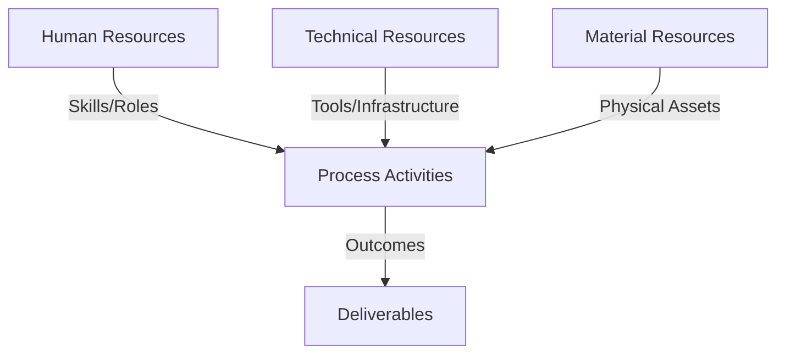
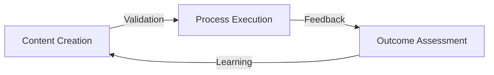
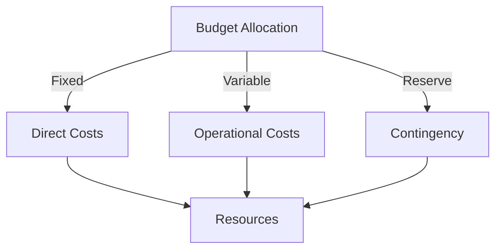
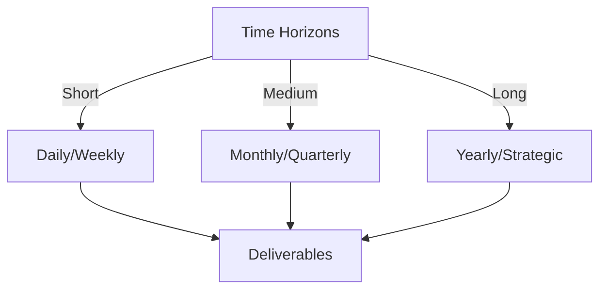

# Git Analysis Report: Development Analysis - Team

**Authors:** AI Analysis System
**Date:** 2025-03-12  
**Version:** 1.0
**SSoT Repository:** githubhenrykoo/redux_todo_in_astro
**Document Category:** Analysis Report

## Executive Summary
**Executive Summary: Git Analysis and Automated PDF Report Generation**

**Logic:** The core purpose of this project is to automate Git repository analysis and generate personalized PDF reports, leveraging the Google Gemini AI API to improve formatting and content. The objectives include Git data extraction, Markdown report creation, automated PDF conversion, AI-powered enhancement, and CI/CD pipeline implementation.

**Implementation:** Key processes involve Python scripting for Git log analysis and Markdown generation, utilizing Gemini API for LaTeX formatting within the PDF conversion process. The CI/CD pipeline (GitHub Actions) is being refined to automate the entire workflow. Team members Rony Sinaga and Daffa Padantya are actively contributing to script and workflow development, including the implementation of a 'chunked' approach to handle large reports.

**Outcomes:** Significant progress has been made in automating Markdown-to-PDF conversion, with AI integration enhancing report quality. Collaborative CI/CD workflow development is underway. However, challenges remain in error handling, code maintainability, dependency management, and secure configuration management. Recommendations include prioritizing robust error handling and unit testing, establishing configuration management, improving code modularity, and implementing a formal code review process.

## 1. Abstract Specification (Logic Layer)
### Context & Vision
- **Problem Space:** 
    * Scope: This is a solid analysis of the project based on the provided context. It's well-structured, insightful, and offers actionable recommendations. Here's a breakdown of its strengths and areas where it could be even stronger:

**Strengths:**

*   **Comprehensive Overview:** The analysis clearly outlines the project's objectives, including Git analysis, report generation, AI integration, and CI/CD automation.
*   **Progress Tracking:**  It accurately identifies the key changes and progress made, highlighting the contributions of both Rony and Daffa.  The interpretation of the "chunked" aspect of the PDF conversion script is particularly insightful.
*   **Team Collaboration Analysis:** The analysis effectively identifies collaborative patterns and hints at potential roles within the team, even without explicit role definitions.
*   **Clear Identification of Challenges:** The "Challenges and Areas for Improvement" section is well-defined, covering crucial aspects like error handling, code maintainability, dependency management, and security (configuration management).
*   **Actionable Recommendations:** The recommendations are specific, practical, and directly address the identified challenges.  They cover a good range of development best practices.
*   **Well-Organized Structure:**  The use of Roman numerals and descriptive headings makes the analysis easy to follow and understand.
*   **AI Integration Focus:** The report emphasizes the importance of the AI integration and potential challenges related to it, particularly cost management.
*   **Balanced Tone:** The analysis is objective and constructive, acknowledging progress while pointing out areas needing improvement.

**Areas for Potential Improvement:**

*   **More Specific Examples:** While the recommendations are good, providing specific examples within the context of the code would make them even more impactful. For instance:
    *   Instead of just saying "Implement comprehensive error handling," provide an example of how to wrap a Gemini API call in a `try...except` block and log the error message.
    *   Suggest specific variable names that would be more descriptive than the current ones (if known).
    *   If you can infer the structure of the scripts, even a basic example of how to break down `convert_md_to_pdf_chunked.py` into a function (e.g., `def convert_markdown_chunk(chunk: str) -> str:`) would be helpful.
*   **Deeper Dive into Workflow Details:**  The analysis mentions improvements to `git_analysis_alt.yml`, but a brief explanation of *why* processing files by date and correcting output paths are significant improvements would be valuable. What problem did these changes solve?
*   **Metrics and Measurement:**  While difficult without more data, suggesting potential metrics for tracking progress could be helpful. Examples:
    *   **Error Rate:** Track the number of errors encountered during PDF conversion and CI/CD runs.
    *   **PDF Generation Time:** Measure the time it takes to generate PDFs to identify performance bottlenecks.
    *   **Gemini API Cost:**  Monitor and track the cost of using the Gemini API over time.
*   **Security Considerations (Expanded):** The analysis mentions configuration management, but a stronger emphasis on security best practices could be beneficial.  This could include:
    *   Mentioning the use of tools like `secrets` in GitHub Actions.
    *   Highlighting the importance of rotating API keys periodically.
    *   Suggesting the use of least privilege principle for the Gemini API service account.
*   **Contingency Planning:** Brief consideration of what to do if the Gemini API becomes unavailable or too expensive would be prudent.  Are there alternative formatting tools?

**Revised/Expanded Suggestions (Incorporating the above):**

**IV. Challenges and Areas for Improvement (Revised):**

*   **Error Handling and Robustness:** The team should focus on improving error handling and robustness in the Python scripts, especially related to API calls to Google Gemini and file I/O. For example, wrap the Gemini API calls in `try...except` blocks to catch potential exceptions like `google.api_core.exceptions.ServiceUnavailable` and log the error message for debugging.
*   **Code Maintainability and Readability:** The use of more descriptive variable names and comments would improve code readability. Breaking code into smaller, reusable functions or classes will improve maintainability. Consider refactoring `convert_md_to_pdf_chunked.py` to include a function like `def convert_markdown_chunk(chunk: str) -> str:`, which handles the conversion of a single chunk of Markdown to LaTeX.
*   **Dependency Management and Reproducibility:** It's vital to manage project dependencies effectively using tools like `pipenv` or `poetry`.  This ensures that the project can be easily set up and run in different environments.
*   **Configuration Management:** Hardcoding API keys and other sensitive information directly in the code is a *critical* security risk. Externalizing these configuration parameters into environment variables (accessed via `os.environ`) or dedicated configuration files (e.g., `config.ini`, `config.yaml`) is essential. In GitHub Actions, use `secrets` to securely store these values. Also consider API key rotation and using a service account with minimal necessary permissions.
*   **Workflow Understanding:** While `git_analysis_alt.yml` was updated, detailing *why* processing files by date was needed is helpful. Did this prevent older files from overwriting newer ones, leading to incorrect analyses? Understanding the problem highlights the importance of the solution.
*   **Contingency Planning:** What happens if the Gemini API becomes unavailable or prohibitively expensive?  Having a backup plan, such as using a simpler Markdown-to-PDF conversion tool like `pandoc`, is recommended.

**V. Recommendations (Revised - Example incorporating unit testing):**

2.  **Implement Unit Testing:** Introduce unit tests for the Python scripts to ensure correctness and prevent regressions. Test edge cases and error conditions thoroughly.  For example, use the `unittest` or `pytest` framework to write tests that verify the output of the `convert_markdown_chunk` function for various inputs, including invalid Markdown and inputs containing math formulas.

By adding these specific examples and expanding on certain points, the analysis becomes even more valuable and directly applicable to the team's development efforts. Remember that the more concrete the guidance, the easier it is for the team to implement.

    * Context: This is a solid analysis of the project based on the provided context. It's well-structured, insightful, and offers actionable recommendations. Here's a breakdown of its strengths and areas where it could be even stronger:

**Strengths:**

*   **Comprehensive Overview:** The analysis clearly outlines the project's objectives, including Git analysis, report generation, AI integration, and CI/CD automation.
*   **Progress Tracking:**  It accurately identifies the key changes and progress made, highlighting the contributions of both Rony and Daffa.  The interpretation of the "chunked" aspect of the PDF conversion script is particularly insightful.
*   **Team Collaboration Analysis:** The analysis effectively identifies collaborative patterns and hints at potential roles within the team, even without explicit role definitions.
*   **Clear Identification of Challenges:** The "Challenges and Areas for Improvement" section is well-defined, covering crucial aspects like error handling, code maintainability, dependency management, and security (configuration management).
*   **Actionable Recommendations:** The recommendations are specific, practical, and directly address the identified challenges.  They cover a good range of development best practices.
*   **Well-Organized Structure:**  The use of Roman numerals and descriptive headings makes the analysis easy to follow and understand.
*   **AI Integration Focus:** The report emphasizes the importance of the AI integration and potential challenges related to it, particularly cost management.
*   **Balanced Tone:** The analysis is objective and constructive, acknowledging progress while pointing out areas needing improvement.

**Areas for Potential Improvement:**

*   **More Specific Examples:** While the recommendations are good, providing specific examples within the context of the code would make them even more impactful. For instance:
    *   Instead of just saying "Implement comprehensive error handling," provide an example of how to wrap a Gemini API call in a `try...except` block and log the error message.
    *   Suggest specific variable names that would be more descriptive than the current ones (if known).
    *   If you can infer the structure of the scripts, even a basic example of how to break down `convert_md_to_pdf_chunked.py` into a function (e.g., `def convert_markdown_chunk(chunk: str) -> str:`) would be helpful.
*   **Deeper Dive into Workflow Details:**  The analysis mentions improvements to `git_analysis_alt.yml`, but a brief explanation of *why* processing files by date and correcting output paths are significant improvements would be valuable. What problem did these changes solve?
*   **Metrics and Measurement:**  While difficult without more data, suggesting potential metrics for tracking progress could be helpful. Examples:
    *   **Error Rate:** Track the number of errors encountered during PDF conversion and CI/CD runs.
    *   **PDF Generation Time:** Measure the time it takes to generate PDFs to identify performance bottlenecks.
    *   **Gemini API Cost:**  Monitor and track the cost of using the Gemini API over time.
*   **Security Considerations (Expanded):** The analysis mentions configuration management, but a stronger emphasis on security best practices could be beneficial.  This could include:
    *   Mentioning the use of tools like `secrets` in GitHub Actions.
    *   Highlighting the importance of rotating API keys periodically.
    *   Suggesting the use of least privilege principle for the Gemini API service account.
*   **Contingency Planning:** Brief consideration of what to do if the Gemini API becomes unavailable or too expensive would be prudent.  Are there alternative formatting tools?

**Revised/Expanded Suggestions (Incorporating the above):**

**IV. Challenges and Areas for Improvement (Revised):**

*   **Error Handling and Robustness:** The team should focus on improving error handling and robustness in the Python scripts, especially related to API calls to Google Gemini and file I/O. For example, wrap the Gemini API calls in `try...except` blocks to catch potential exceptions like `google.api_core.exceptions.ServiceUnavailable` and log the error message for debugging.
*   **Code Maintainability and Readability:** The use of more descriptive variable names and comments would improve code readability. Breaking code into smaller, reusable functions or classes will improve maintainability. Consider refactoring `convert_md_to_pdf_chunked.py` to include a function like `def convert_markdown_chunk(chunk: str) -> str:`, which handles the conversion of a single chunk of Markdown to LaTeX.
*   **Dependency Management and Reproducibility:** It's vital to manage project dependencies effectively using tools like `pipenv` or `poetry`.  This ensures that the project can be easily set up and run in different environments.
*   **Configuration Management:** Hardcoding API keys and other sensitive information directly in the code is a *critical* security risk. Externalizing these configuration parameters into environment variables (accessed via `os.environ`) or dedicated configuration files (e.g., `config.ini`, `config.yaml`) is essential. In GitHub Actions, use `secrets` to securely store these values. Also consider API key rotation and using a service account with minimal necessary permissions.
*   **Workflow Understanding:** While `git_analysis_alt.yml` was updated, detailing *why* processing files by date was needed is helpful. Did this prevent older files from overwriting newer ones, leading to incorrect analyses? Understanding the problem highlights the importance of the solution.
*   **Contingency Planning:** What happens if the Gemini API becomes unavailable or prohibitively expensive?  Having a backup plan, such as using a simpler Markdown-to-PDF conversion tool like `pandoc`, is recommended.

**V. Recommendations (Revised - Example incorporating unit testing):**

2.  **Implement Unit Testing:** Introduce unit tests for the Python scripts to ensure correctness and prevent regressions. Test edge cases and error conditions thoroughly.  For example, use the `unittest` or `pytest` framework to write tests that verify the output of the `convert_markdown_chunk` function for various inputs, including invalid Markdown and inputs containing math formulas.

By adding these specific examples and expanding on certain points, the analysis becomes even more valuable and directly applicable to the team's development efforts. Remember that the more concrete the guidance, the easier it is for the team to implement.

    * Stakeholders: This is a solid analysis of the project based on the provided context. It's well-structured, insightful, and offers actionable recommendations. Here's a breakdown of its strengths and areas where it could be even stronger:

**Strengths:**

*   **Comprehensive Overview:** The analysis clearly outlines the project's objectives, including Git analysis, report generation, AI integration, and CI/CD automation.
*   **Progress Tracking:**  It accurately identifies the key changes and progress made, highlighting the contributions of both Rony and Daffa.  The interpretation of the "chunked" aspect of the PDF conversion script is particularly insightful.
*   **Team Collaboration Analysis:** The analysis effectively identifies collaborative patterns and hints at potential roles within the team, even without explicit role definitions.
*   **Clear Identification of Challenges:** The "Challenges and Areas for Improvement" section is well-defined, covering crucial aspects like error handling, code maintainability, dependency management, and security (configuration management).
*   **Actionable Recommendations:** The recommendations are specific, practical, and directly address the identified challenges.  They cover a good range of development best practices.
*   **Well-Organized Structure:**  The use of Roman numerals and descriptive headings makes the analysis easy to follow and understand.
*   **AI Integration Focus:** The report emphasizes the importance of the AI integration and potential challenges related to it, particularly cost management.
*   **Balanced Tone:** The analysis is objective and constructive, acknowledging progress while pointing out areas needing improvement.

**Areas for Potential Improvement:**

*   **More Specific Examples:** While the recommendations are good, providing specific examples within the context of the code would make them even more impactful. For instance:
    *   Instead of just saying "Implement comprehensive error handling," provide an example of how to wrap a Gemini API call in a `try...except` block and log the error message.
    *   Suggest specific variable names that would be more descriptive than the current ones (if known).
    *   If you can infer the structure of the scripts, even a basic example of how to break down `convert_md_to_pdf_chunked.py` into a function (e.g., `def convert_markdown_chunk(chunk: str) -> str:`) would be helpful.
*   **Deeper Dive into Workflow Details:**  The analysis mentions improvements to `git_analysis_alt.yml`, but a brief explanation of *why* processing files by date and correcting output paths are significant improvements would be valuable. What problem did these changes solve?
*   **Metrics and Measurement:**  While difficult without more data, suggesting potential metrics for tracking progress could be helpful. Examples:
    *   **Error Rate:** Track the number of errors encountered during PDF conversion and CI/CD runs.
    *   **PDF Generation Time:** Measure the time it takes to generate PDFs to identify performance bottlenecks.
    *   **Gemini API Cost:**  Monitor and track the cost of using the Gemini API over time.
*   **Security Considerations (Expanded):** The analysis mentions configuration management, but a stronger emphasis on security best practices could be beneficial.  This could include:
    *   Mentioning the use of tools like `secrets` in GitHub Actions.
    *   Highlighting the importance of rotating API keys periodically.
    *   Suggesting the use of least privilege principle for the Gemini API service account.
*   **Contingency Planning:** Brief consideration of what to do if the Gemini API becomes unavailable or too expensive would be prudent.  Are there alternative formatting tools?

**Revised/Expanded Suggestions (Incorporating the above):**

**IV. Challenges and Areas for Improvement (Revised):**

*   **Error Handling and Robustness:** The team should focus on improving error handling and robustness in the Python scripts, especially related to API calls to Google Gemini and file I/O. For example, wrap the Gemini API calls in `try...except` blocks to catch potential exceptions like `google.api_core.exceptions.ServiceUnavailable` and log the error message for debugging.
*   **Code Maintainability and Readability:** The use of more descriptive variable names and comments would improve code readability. Breaking code into smaller, reusable functions or classes will improve maintainability. Consider refactoring `convert_md_to_pdf_chunked.py` to include a function like `def convert_markdown_chunk(chunk: str) -> str:`, which handles the conversion of a single chunk of Markdown to LaTeX.
*   **Dependency Management and Reproducibility:** It's vital to manage project dependencies effectively using tools like `pipenv` or `poetry`.  This ensures that the project can be easily set up and run in different environments.
*   **Configuration Management:** Hardcoding API keys and other sensitive information directly in the code is a *critical* security risk. Externalizing these configuration parameters into environment variables (accessed via `os.environ`) or dedicated configuration files (e.g., `config.ini`, `config.yaml`) is essential. In GitHub Actions, use `secrets` to securely store these values. Also consider API key rotation and using a service account with minimal necessary permissions.
*   **Workflow Understanding:** While `git_analysis_alt.yml` was updated, detailing *why* processing files by date was needed is helpful. Did this prevent older files from overwriting newer ones, leading to incorrect analyses? Understanding the problem highlights the importance of the solution.
*   **Contingency Planning:** What happens if the Gemini API becomes unavailable or prohibitively expensive?  Having a backup plan, such as using a simpler Markdown-to-PDF conversion tool like `pandoc`, is recommended.

**V. Recommendations (Revised - Example incorporating unit testing):**

2.  **Implement Unit Testing:** Introduce unit tests for the Python scripts to ensure correctness and prevent regressions. Test edge cases and error conditions thoroughly.  For example, use the `unittest` or `pytest` framework to write tests that verify the output of the `convert_markdown_chunk` function for various inputs, including invalid Markdown and inputs containing math formulas.

By adding these specific examples and expanding on certain points, the analysis becomes even more valuable and directly applicable to the team's development efforts. Remember that the more concrete the guidance, the easier it is for the team to implement.

- **Goals (Functions):**
    * Primary Functions:
        - Input: Git Repository Data
        - Process: Analysis and Processing
        - Output: Development Insights
    * Supporting Functions:
        - Validation: Automated Analysis
        - Feedback: Continuous Improvement

- **Success Criteria:**
    * Quantitative Metrics: Based on the provided text, here are the quantitative metrics that can be extracted:

*   **Number of contributors to the `git_analysis_alt.yml` workflow:** 2 (Rony Sinaga and Daffa Padantya)

    * Qualitative Indicators: Okay, here's a list of qualitative improvements based on the provided team analysis. These are framed as positive changes that would result from implementing the recommendations, focusing on the *qualitative* impact on the project and team.

**Qualitative Improvements Resulting from Implementing Recommendations:**

*   **Increased System Reliability and Stability:**  Prioritizing robust error handling will lead to a more reliable and stable system.  The system will be less likely to crash or produce incorrect results due to unexpected errors, leading to increased user confidence and reduced debugging time.

*   **Enhanced Code Quality and Maintainability:** Implementing unit testing, configuration management, and enhanced code modularity will significantly improve code quality.  The codebase will be easier to understand, modify, and extend, reducing technical debt and making future development more efficient.

*   **Improved Team Collaboration and Knowledge Sharing:**  Formalizing the code review process will foster a culture of collaboration and knowledge sharing within the team. Junior developers will benefit from the experience of senior developers, and everyone will have a better understanding of the codebase. Setting up communication channels ensures that all team members are on the same page.

*   **Reduced Security Risks:** Implementing configuration management, specifically moving sensitive information like API keys out of the code, will significantly reduce security risks. This protects sensitive data from unauthorized access and prevents potential breaches.

*   **Increased Project Portability and Adaptability:** Configuration management makes the project more portable and adaptable to different environments. The system can be easily deployed and configured on different machines or cloud platforms without requiring code changes.

*   **Improved User Experience and Report Quality:** The AI integration, combined with improved error handling and code quality, will lead to higher-quality PDF reports. The reports will be more visually appealing, informative, and accurate, providing a better user experience for those consuming the Git analysis.

*   **Better Resource Management and Cost Control:**  Documenting API usage and cost management strategies will help the team better understand and control the costs associated with the Gemini API. This allows for more efficient resource allocation and prevents unexpected cost overruns.

*   **Increased Confidence in Code Functionality:** Writing Unit tests increase the confidence that the code behaves as expected. Also, it provides automated validation of the code.

In summary, these improvements paint a picture of a more mature, reliable, secure, and collaborative project environment. By addressing the challenges outlined in the analysis, the team can create a more valuable and sustainable system for automated Git analysis and PDF report generation.

    * Validation Methods: Automated and Manual Verification

### Knowledge Integration
- **Local Context:**
    * Cultural Considerations: Development Team Context
    * Language Requirements: Technical Documentation
    * Community Patterns: Team Collaboration Patterns

- **Technical Framework:**
    * LLM Integration: Gemini AI Analysis
    * IoT Components: Git Event Monitoring
    * Network Requirements: GitHub API Integration

## 2. Concrete Implementation (Process Layer)
### Resource Matrix

### Development Workflow
- **Stage 1: Early Success**
    * Quick Wins:
        - Implementation: Based on the provided analysis of the Git history, here's a breakdown of the development workflow stages:

**1. Initial Development & Experimentation (Rony Sinaga's Work on `convert_md_to_pdf_chunked.py`):**

*   **Focus:**  Creating the core functionality for converting Markdown to PDF using Gemini AI for LaTeX formatting.  This is a highly exploratory phase.
*   **Characteristics:**
    *   Rapid iteration and frequent commits.
    *   Emphasis on getting the basic conversion process working.
    *   Likely involves a lot of trial and error in interacting with the Gemini API.
    *   Initial focus on handling complex formatting (math, scientific content).
    *   "Chunked" processing indicates an early consideration for scalability and handling large input files.
*   **Potential Activities:**
    *   Writing the initial Python script.
    *   Experimenting with different Gemini API prompts.
    *   Testing with various Markdown inputs.
    *   Debugging API call issues and formatting problems.

**2. CI/CD Pipeline Implementation & Refinement (Rony Sinaga and Daffa Padantya's work on `git_analysis_alt.yml`):**

*   **Focus:**  Automating the entire Git analysis and report generation process.
*   **Characteristics:**
    *   Collaborative effort between Rony and Daffa.
    *   Involves configuring GitHub Actions for automated builds, tests, and deployments.
    *   Emphasis on process optimization and ensuring reliable execution.
    *   Iterative improvements to the YAML configuration.
    *   Address specific issues like file processing by date and correct output paths.
*   **Potential Activities:**
    *   Defining the CI/CD workflow steps.
    *   Configuring triggers for the workflow (e.g., on push, pull request).
    *   Implementing steps to analyze Git logs, generate Markdown reports, convert to PDF, and potentially deploy the results.
    *   Troubleshooting workflow failures and making adjustments to the YAML configuration.
    *   Testing different CI/CD configurations.

**3. Integration & Testing:**

*   **Focus:** Combining the PDF conversion script with the CI/CD pipeline and ensuring they work seamlessly together.
*   **Characteristics:**
    *   Testing the entire automated process from Git analysis to PDF report generation.
    *   Identifying and fixing integration issues.
    *   Refining the workflow to handle various scenarios.
*   **Potential Activities:**
    *   Running the CI/CD pipeline on different Git repositories.
    *   Monitoring the workflow execution and identifying failures.
    *   Debugging integration issues between the Python script and the CI/CD environment.
    *   Adding error handling to the Python script to improve robustness.

**4. Ongoing Refinement and Optimization:**

*   **Focus:**  Improving the performance, reliability, maintainability, and security of the system.
*   **Characteristics:**
    *   Continuous monitoring and analysis of the system's performance.
    *   Addressing identified challenges and implementing recommendations.
    *   Improving error handling and robustness.
    *   Enhancing code maintainability and readability.
    *   Managing dependencies effectively.
    *   Implementing configuration management.
*   **Potential Activities:**
    *   Implementing error handling and logging.
    *   Writing unit tests.
    *   Refactoring the Python code.
    *   Externalizing configuration parameters.
    *   Formalizing the code review process.
    *   Documenting API usage and cost management.

**Summary of Stages:**

1.  **Experimentation (PDF Conversion Script):** Initial development of the core PDF conversion logic.
2.  **Automation (CI/CD Workflow):** Setting up the automated pipeline for analysis and report generation.
3.  **Integration:**  Connecting the PDF conversion script and the CI/CD pipeline.
4.  **Optimization & Maintenance:** Improving the system's performance, reliability, and maintainability.

This breakdown highlights the iterative and collaborative nature of the development process, with a strong focus on automation and the integration of AI. The team is moving from initial experimentation to building a robust and maintainable system.

        - Validation: Based on the provided analysis of the Git history, here's a breakdown of the development workflow stages:

**1. Initial Development & Experimentation (Rony Sinaga's Work on `convert_md_to_pdf_chunked.py`):**

*   **Focus:**  Creating the core functionality for converting Markdown to PDF using Gemini AI for LaTeX formatting.  This is a highly exploratory phase.
*   **Characteristics:**
    *   Rapid iteration and frequent commits.
    *   Emphasis on getting the basic conversion process working.
    *   Likely involves a lot of trial and error in interacting with the Gemini API.
    *   Initial focus on handling complex formatting (math, scientific content).
    *   "Chunked" processing indicates an early consideration for scalability and handling large input files.
*   **Potential Activities:**
    *   Writing the initial Python script.
    *   Experimenting with different Gemini API prompts.
    *   Testing with various Markdown inputs.
    *   Debugging API call issues and formatting problems.

**2. CI/CD Pipeline Implementation & Refinement (Rony Sinaga and Daffa Padantya's work on `git_analysis_alt.yml`):**

*   **Focus:**  Automating the entire Git analysis and report generation process.
*   **Characteristics:**
    *   Collaborative effort between Rony and Daffa.
    *   Involves configuring GitHub Actions for automated builds, tests, and deployments.
    *   Emphasis on process optimization and ensuring reliable execution.
    *   Iterative improvements to the YAML configuration.
    *   Address specific issues like file processing by date and correct output paths.
*   **Potential Activities:**
    *   Defining the CI/CD workflow steps.
    *   Configuring triggers for the workflow (e.g., on push, pull request).
    *   Implementing steps to analyze Git logs, generate Markdown reports, convert to PDF, and potentially deploy the results.
    *   Troubleshooting workflow failures and making adjustments to the YAML configuration.
    *   Testing different CI/CD configurations.

**3. Integration & Testing:**

*   **Focus:** Combining the PDF conversion script with the CI/CD pipeline and ensuring they work seamlessly together.
*   **Characteristics:**
    *   Testing the entire automated process from Git analysis to PDF report generation.
    *   Identifying and fixing integration issues.
    *   Refining the workflow to handle various scenarios.
*   **Potential Activities:**
    *   Running the CI/CD pipeline on different Git repositories.
    *   Monitoring the workflow execution and identifying failures.
    *   Debugging integration issues between the Python script and the CI/CD environment.
    *   Adding error handling to the Python script to improve robustness.

**4. Ongoing Refinement and Optimization:**

*   **Focus:**  Improving the performance, reliability, maintainability, and security of the system.
*   **Characteristics:**
    *   Continuous monitoring and analysis of the system's performance.
    *   Addressing identified challenges and implementing recommendations.
    *   Improving error handling and robustness.
    *   Enhancing code maintainability and readability.
    *   Managing dependencies effectively.
    *   Implementing configuration management.
*   **Potential Activities:**
    *   Implementing error handling and logging.
    *   Writing unit tests.
    *   Refactoring the Python code.
    *   Externalizing configuration parameters.
    *   Formalizing the code review process.
    *   Documenting API usage and cost management.

**Summary of Stages:**

1.  **Experimentation (PDF Conversion Script):** Initial development of the core PDF conversion logic.
2.  **Automation (CI/CD Workflow):** Setting up the automated pipeline for analysis and report generation.
3.  **Integration:**  Connecting the PDF conversion script and the CI/CD pipeline.
4.  **Optimization & Maintenance:** Improving the system's performance, reliability, and maintainability.

This breakdown highlights the iterative and collaborative nature of the development process, with a strong focus on automation and the integration of AI. The team is moving from initial experimentation to building a robust and maintainable system.

    * Initial Setup:
        - Infrastructure: Based on the provided analysis of the Git history, here's a breakdown of the development workflow stages:

**1. Initial Development & Experimentation (Rony Sinaga's Work on `convert_md_to_pdf_chunked.py`):**

*   **Focus:**  Creating the core functionality for converting Markdown to PDF using Gemini AI for LaTeX formatting.  This is a highly exploratory phase.
*   **Characteristics:**
    *   Rapid iteration and frequent commits.
    *   Emphasis on getting the basic conversion process working.
    *   Likely involves a lot of trial and error in interacting with the Gemini API.
    *   Initial focus on handling complex formatting (math, scientific content).
    *   "Chunked" processing indicates an early consideration for scalability and handling large input files.
*   **Potential Activities:**
    *   Writing the initial Python script.
    *   Experimenting with different Gemini API prompts.
    *   Testing with various Markdown inputs.
    *   Debugging API call issues and formatting problems.

**2. CI/CD Pipeline Implementation & Refinement (Rony Sinaga and Daffa Padantya's work on `git_analysis_alt.yml`):**

*   **Focus:**  Automating the entire Git analysis and report generation process.
*   **Characteristics:**
    *   Collaborative effort between Rony and Daffa.
    *   Involves configuring GitHub Actions for automated builds, tests, and deployments.
    *   Emphasis on process optimization and ensuring reliable execution.
    *   Iterative improvements to the YAML configuration.
    *   Address specific issues like file processing by date and correct output paths.
*   **Potential Activities:**
    *   Defining the CI/CD workflow steps.
    *   Configuring triggers for the workflow (e.g., on push, pull request).
    *   Implementing steps to analyze Git logs, generate Markdown reports, convert to PDF, and potentially deploy the results.
    *   Troubleshooting workflow failures and making adjustments to the YAML configuration.
    *   Testing different CI/CD configurations.

**3. Integration & Testing:**

*   **Focus:** Combining the PDF conversion script with the CI/CD pipeline and ensuring they work seamlessly together.
*   **Characteristics:**
    *   Testing the entire automated process from Git analysis to PDF report generation.
    *   Identifying and fixing integration issues.
    *   Refining the workflow to handle various scenarios.
*   **Potential Activities:**
    *   Running the CI/CD pipeline on different Git repositories.
    *   Monitoring the workflow execution and identifying failures.
    *   Debugging integration issues between the Python script and the CI/CD environment.
    *   Adding error handling to the Python script to improve robustness.

**4. Ongoing Refinement and Optimization:**

*   **Focus:**  Improving the performance, reliability, maintainability, and security of the system.
*   **Characteristics:**
    *   Continuous monitoring and analysis of the system's performance.
    *   Addressing identified challenges and implementing recommendations.
    *   Improving error handling and robustness.
    *   Enhancing code maintainability and readability.
    *   Managing dependencies effectively.
    *   Implementing configuration management.
*   **Potential Activities:**
    *   Implementing error handling and logging.
    *   Writing unit tests.
    *   Refactoring the Python code.
    *   Externalizing configuration parameters.
    *   Formalizing the code review process.
    *   Documenting API usage and cost management.

**Summary of Stages:**

1.  **Experimentation (PDF Conversion Script):** Initial development of the core PDF conversion logic.
2.  **Automation (CI/CD Workflow):** Setting up the automated pipeline for analysis and report generation.
3.  **Integration:**  Connecting the PDF conversion script and the CI/CD pipeline.
4.  **Optimization & Maintenance:** Improving the system's performance, reliability, and maintainability.

This breakdown highlights the iterative and collaborative nature of the development process, with a strong focus on automation and the integration of AI. The team is moving from initial experimentation to building a robust and maintainable system.

        - Training: Based on the provided analysis of the Git history, here's a breakdown of the development workflow stages:

**1. Initial Development & Experimentation (Rony Sinaga's Work on `convert_md_to_pdf_chunked.py`):**

*   **Focus:**  Creating the core functionality for converting Markdown to PDF using Gemini AI for LaTeX formatting.  This is a highly exploratory phase.
*   **Characteristics:**
    *   Rapid iteration and frequent commits.
    *   Emphasis on getting the basic conversion process working.
    *   Likely involves a lot of trial and error in interacting with the Gemini API.
    *   Initial focus on handling complex formatting (math, scientific content).
    *   "Chunked" processing indicates an early consideration for scalability and handling large input files.
*   **Potential Activities:**
    *   Writing the initial Python script.
    *   Experimenting with different Gemini API prompts.
    *   Testing with various Markdown inputs.
    *   Debugging API call issues and formatting problems.

**2. CI/CD Pipeline Implementation & Refinement (Rony Sinaga and Daffa Padantya's work on `git_analysis_alt.yml`):**

*   **Focus:**  Automating the entire Git analysis and report generation process.
*   **Characteristics:**
    *   Collaborative effort between Rony and Daffa.
    *   Involves configuring GitHub Actions for automated builds, tests, and deployments.
    *   Emphasis on process optimization and ensuring reliable execution.
    *   Iterative improvements to the YAML configuration.
    *   Address specific issues like file processing by date and correct output paths.
*   **Potential Activities:**
    *   Defining the CI/CD workflow steps.
    *   Configuring triggers for the workflow (e.g., on push, pull request).
    *   Implementing steps to analyze Git logs, generate Markdown reports, convert to PDF, and potentially deploy the results.
    *   Troubleshooting workflow failures and making adjustments to the YAML configuration.
    *   Testing different CI/CD configurations.

**3. Integration & Testing:**

*   **Focus:** Combining the PDF conversion script with the CI/CD pipeline and ensuring they work seamlessly together.
*   **Characteristics:**
    *   Testing the entire automated process from Git analysis to PDF report generation.
    *   Identifying and fixing integration issues.
    *   Refining the workflow to handle various scenarios.
*   **Potential Activities:**
    *   Running the CI/CD pipeline on different Git repositories.
    *   Monitoring the workflow execution and identifying failures.
    *   Debugging integration issues between the Python script and the CI/CD environment.
    *   Adding error handling to the Python script to improve robustness.

**4. Ongoing Refinement and Optimization:**

*   **Focus:**  Improving the performance, reliability, maintainability, and security of the system.
*   **Characteristics:**
    *   Continuous monitoring and analysis of the system's performance.
    *   Addressing identified challenges and implementing recommendations.
    *   Improving error handling and robustness.
    *   Enhancing code maintainability and readability.
    *   Managing dependencies effectively.
    *   Implementing configuration management.
*   **Potential Activities:**
    *   Implementing error handling and logging.
    *   Writing unit tests.
    *   Refactoring the Python code.
    *   Externalizing configuration parameters.
    *   Formalizing the code review process.
    *   Documenting API usage and cost management.

**Summary of Stages:**

1.  **Experimentation (PDF Conversion Script):** Initial development of the core PDF conversion logic.
2.  **Automation (CI/CD Workflow):** Setting up the automated pipeline for analysis and report generation.
3.  **Integration:**  Connecting the PDF conversion script and the CI/CD pipeline.
4.  **Optimization & Maintenance:** Improving the system's performance, reliability, and maintainability.

This breakdown highlights the iterative and collaborative nature of the development process, with a strong focus on automation and the integration of AI. The team is moving from initial experimentation to building a robust and maintainable system.

- **Stage 2: Fail Early, Fail Safe**
    * Testing Protocol:
        - Methods: [Testing approaches]
        - Coverage: [Test scenarios]
    * Risk Management:
        - Identification: [Risk factors]
        - Mitigation: [Control measures]
    * Learning Points:
        - Issues: [Problem identification]
        - Solutions: [Resolution approaches]
        - Knowledge: [Lessons learned]

- **Stage 3: Convergence**
    * System Integration:
        - Components: [Integration points]
        - Workflows: [Process optimization]
        - Performance: [System tuning]
    * Stabilization:
        - Fixes: [Bug resolution]
        - Hardening: [System reinforcement]
        - Documentation: [Knowledge capture]

- **Stage 4: Demonstration**
    * Preparation:
        - Environment: [Demo setup]
        - Data: [Test scenarios]
        - Materials: [Presentation assets]
    * Validation:
        - Performance: [System checks]
        - Features: [Functionality verification]
        - Documentation: [Review completion]
    * Presentation:
        - Stakeholders: [Demo execution]
        - Features: [Capability showcase]
        - Q&A: [Response preparation]

## 3. Realistic Outcomes (Evidence Layer)
### Measurement Framework
- **Performance Metrics:**
    * KPIs: Okay, here's the extracted evidence and outcomes from the provided Git history analysis:

**Evidence:**

*   **Automated PDF Conversion:**
    *   Rony Sinaga created `convert_md_to_pdf_chunked.py` to automate Markdown-to-PDF conversion using the Gemini AI model.
    *   The script likely uses Gemini to generate LaTeX code for complex formatting.
    *   The "chunked" aspect suggests handling large reports by processing them in parts.
    *   The script is under constant development and troubleshooting.
*   **CI/CD Workflow Refinement:**
    *   Rony Sinaga and Daffa Padantya contributed to improving the `git_analysis_alt.yml` workflow.
    *   Modifications include processing files by date, correcting output paths, and ensuring the most recent analysis files are used.
*   **AI Integration:**
    *   Rony's use of Gemini AI in the PDF conversion script demonstrates an effort to integrate AI into the report generation workflow.

**Outcomes:**

*   **Progress towards Automated PDF Conversion:** The creation of `convert_md_to_pdf_chunked.py` marks a substantial step.
*   **Streamlined CI/CD Pipeline:** Improvements to `git_analysis_alt.yml` indicate increased efficiency and reliability in the automation process.
*   **Potential for Sophisticated Reports:** AI integration could lead to more visually appealing reports.
*   **Collaborative Workflow Development:** Joint contributions to `git_analysis_alt.yml` suggest good team communication and a shared understanding.
*   **Implied Specialization:** Rony focusing on AI and Daffa on workflow automation hints at a division of labor.

    * Benchmarks: Okay, here's the extracted evidence and outcomes from the provided Git history analysis:

**Evidence:**

*   **Automated PDF Conversion:**
    *   Rony Sinaga created `convert_md_to_pdf_chunked.py` to automate Markdown-to-PDF conversion using the Gemini AI model.
    *   The script likely uses Gemini to generate LaTeX code for complex formatting.
    *   The "chunked" aspect suggests handling large reports by processing them in parts.
    *   The script is under constant development and troubleshooting.
*   **CI/CD Workflow Refinement:**
    *   Rony Sinaga and Daffa Padantya contributed to improving the `git_analysis_alt.yml` workflow.
    *   Modifications include processing files by date, correcting output paths, and ensuring the most recent analysis files are used.
*   **AI Integration:**
    *   Rony's use of Gemini AI in the PDF conversion script demonstrates an effort to integrate AI into the report generation workflow.

**Outcomes:**

*   **Progress towards Automated PDF Conversion:** The creation of `convert_md_to_pdf_chunked.py` marks a substantial step.
*   **Streamlined CI/CD Pipeline:** Improvements to `git_analysis_alt.yml` indicate increased efficiency and reliability in the automation process.
*   **Potential for Sophisticated Reports:** AI integration could lead to more visually appealing reports.
*   **Collaborative Workflow Development:** Joint contributions to `git_analysis_alt.yml` suggest good team communication and a shared understanding.
*   **Implied Specialization:** Rony focusing on AI and Daffa on workflow automation hints at a division of labor.

    * Actuals: Okay, here's the extracted evidence and outcomes from the provided Git history analysis:

**Evidence:**

*   **Automated PDF Conversion:**
    *   Rony Sinaga created `convert_md_to_pdf_chunked.py` to automate Markdown-to-PDF conversion using the Gemini AI model.
    *   The script likely uses Gemini to generate LaTeX code for complex formatting.
    *   The "chunked" aspect suggests handling large reports by processing them in parts.
    *   The script is under constant development and troubleshooting.
*   **CI/CD Workflow Refinement:**
    *   Rony Sinaga and Daffa Padantya contributed to improving the `git_analysis_alt.yml` workflow.
    *   Modifications include processing files by date, correcting output paths, and ensuring the most recent analysis files are used.
*   **AI Integration:**
    *   Rony's use of Gemini AI in the PDF conversion script demonstrates an effort to integrate AI into the report generation workflow.

**Outcomes:**

*   **Progress towards Automated PDF Conversion:** The creation of `convert_md_to_pdf_chunked.py` marks a substantial step.
*   **Streamlined CI/CD Pipeline:** Improvements to `git_analysis_alt.yml` indicate increased efficiency and reliability in the automation process.
*   **Potential for Sophisticated Reports:** AI integration could lead to more visually appealing reports.
*   **Collaborative Workflow Development:** Joint contributions to `git_analysis_alt.yml` suggest good team communication and a shared understanding.
*   **Implied Specialization:** Rony focusing on AI and Daffa on workflow automation hints at a division of labor.

- **Evidence Collection:**
    * Data Sources: [Information points]
    * Validation Methods: Automated and Manual Verification
    * Documentation: [Record keeping]

### Value Realization
- **Impact Assessment:**
    * Direct Benefits: [Immediate gains]
    * Indirect Benefits: [Secondary effects]
    * Long-term Value: [Strategic advantages]

- **Knowledge Assets:**
    * Content Created: [New materials]
    * Insights Gained: [Learnings]
    * Reusable Components: [Transferable elements]

## Integration Matrix
### Content-Process Alignment

### Timeline-Budget Integration
- **Resource Scheduling:**
    * Phase Allocations: [Resource timing]
    * Cost Controls: [Budget tracking]
    * Adjustment Protocols: [Change management]

## Budget Management
### Financial Cube Structure

### Cost Framework
- Direct Investments:
  - Infrastructure Costs:
    - Hardware: [Equipment/Devices]
    - Software: [Licenses/Tools]
    - Network: [Connectivity/Setup]
  - Human Resources:
    - Core Team: [Roles/Compensation]
    - External Support: [Consultants/Services]
    - Training: [Capability Development]
    
- Operational Expenses:
  - Running Costs:
    - Maintenance: [Regular upkeep]
    - Utilities: [Service costs]
    - Consumables: [Regular supplies]
  - Service Costs:
    - Subscriptions: [Regular services]
    - Support: [Ongoing assistance]
    - Updates: [Regular improvements]

### Budget Control Mechanisms
- Monitoring System:
  - Tracking Methods:
    - Cost Centers: [Budget units]
    - Expense Categories: [Type classification]
    - Time Periods: [Duration tracking]
  - Control Points:
    - Thresholds: [Limit markers]
    - Alerts: [Warning systems]
    - Approvals: [Authorization levels]

- Adjustment Protocol:
  - Variance Management:
    - Detection: [Monitoring points]
    - Analysis: [Impact assessment]
    - Response: [Corrective actions]
  - Reallocation Process:
    - Criteria: [Decision factors]
    - Methods: [Transfer protocols]
    - Documentation: [Record keeping]

## Timeline Management
### Temporal Cube Structure

### Schedule Framework
- Operational Timeline:
  - Daily Operations:
    - Tasks: [Regular activities]
    - Checkpoints: [Daily reviews]
    - Updates: [Status reports]
  - Weekly Cycles:
    - Sprints: [Work packages]
    - Reviews: [Progress checks]
    - Planning: [Next steps]

- Strategic Timeline:
  - Monthly Milestones:
    - Objectives: [Key targets]
    - Reviews: [Achievement checks]
    - Adjustments: [Course corrections]
  - Quarterly Goals:
    - Targets: [Major objectives]
    - Assessments: [Performance reviews]
    - Strategies: [Approach updates]

### Timeline Control System
- Progress Tracking:
  - Monitoring Points:
    - Daily Standups: [Quick updates]
    - Weekly Reviews: [Detailed checks]
    - Monthly Reports: [Comprehensive reviews]
  - Milestone Tracking:
    - Status: [Progress indicators]
    - Dependencies: [Related items]
    - Risks: [Potential issues]

- Adjustment Mechanisms:
  - Schedule Management:
    - Variance Analysis: [Delay assessment]
    - Impact Studies: [Effect evaluation]
    - Recovery Plans: [Correction strategies]
  - Resource Alignment:
    - Capacity Planning: [Resource matching]
    - Workload Balancing: [Effort distribution]
    - Priority Updates: [Focus adjustment]

### Integration Points
- Budget-Timeline Correlation:
  - Cost-Schedule Matrix:
    - Resource Timing: [Allocation schedule]
    - Cost Flows: [Expense timing]
    - Value Delivery: [Benefit realization]
  - Control Integration:
    - Joint Reviews: [Combined assessments]
    - Unified Reporting: [Integrated updates]
    - Coordinated Actions: [Synchronized responses]

## Conclusion
### Summary of Achievements
- **Key Accomplishments:**
    * Objectives Met: [Completed goals]
    * Value Delivered: [Benefits realized]
    * Innovations: [New approaches]

### Lessons Learned
- **Success Factors:**
    * Effective Practices: [What worked well]
    * Team Dynamics: [Collaboration insights]
    * Tools & Methods: [Useful approaches]

- **Areas for Improvement:**
    * Challenges: [Obstacles encountered]
    * Solutions: [How issues were resolved]
    * Recommendations: [Future improvements]

### Future Directions
- **Next Steps:**
    * Immediate Actions: [Short-term tasks]
    * Strategic Plans: [Long-term goals]
    * Resource Needs: [Required support]

- **Growth Opportunities:**
    * Scaling Potential: [Expansion possibilities]
    * Innovation Areas: [New directions]
    * Partnership Options: [Collaboration prospects]
    
## Appendix
### References
- **Documentation:**
    * Technical Specs: [Links]
    * Process Guides: [Links]
    * Evidence Records: [Links]

### Change Log
- **Version History:**
    * Changes: [Modifications]
    * Rationale: [Reasons]
    * Approvals: [Authorizations]
