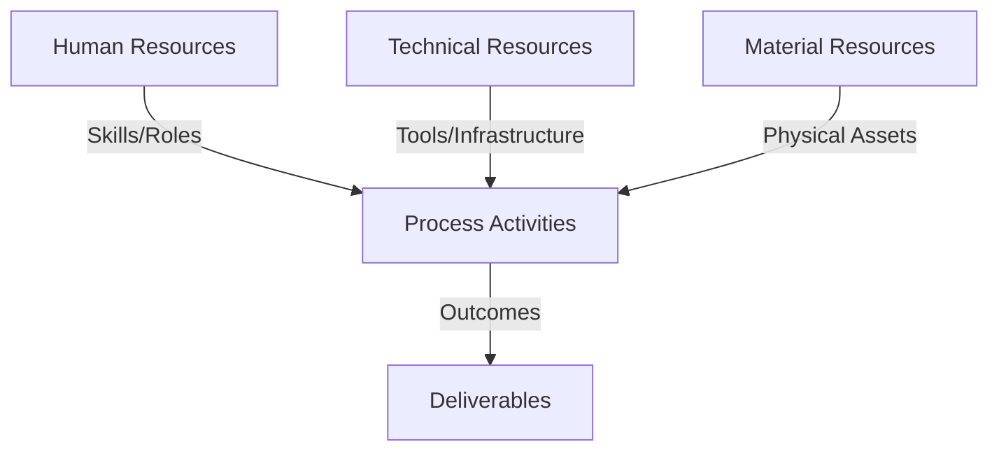
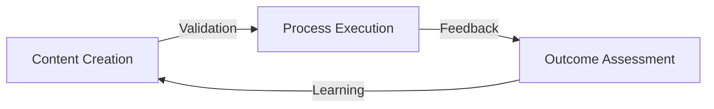
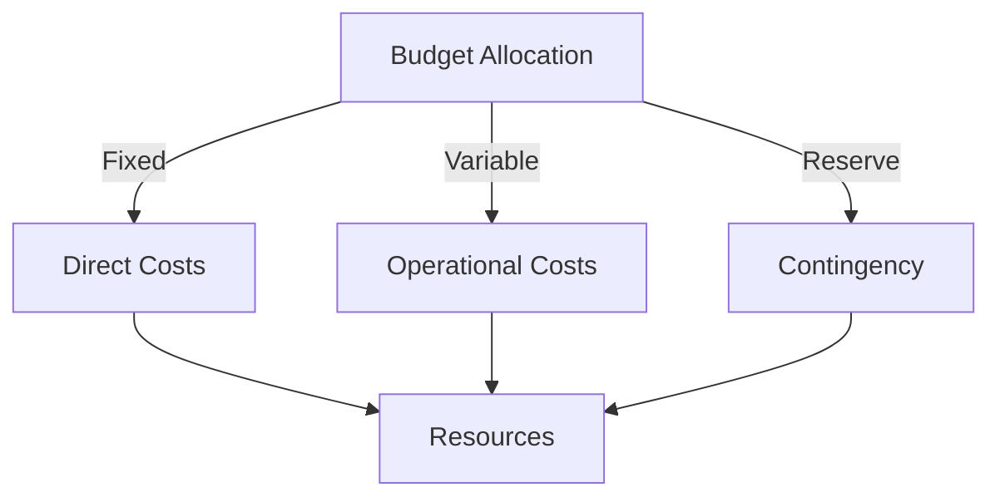
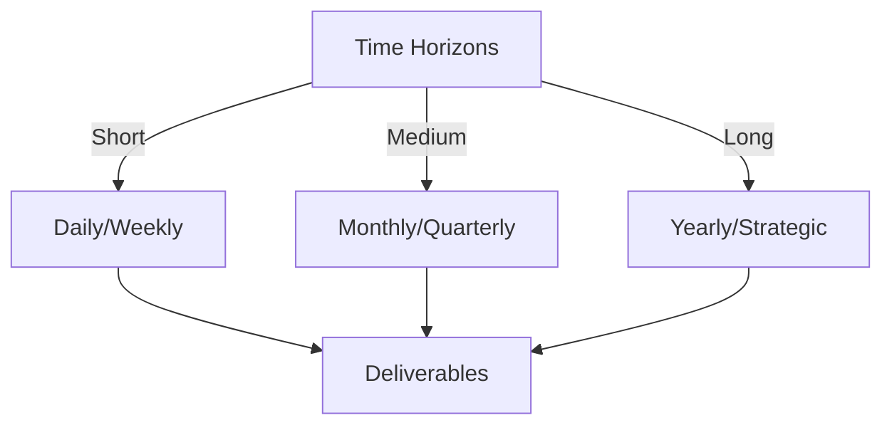

# Git Analysis Report: Development Analysis - Team

**Authors:** AI Analysis System
**Date:** 2025-03-13  
**Version:** 1.0
**SSoT Repository:** githubhenrykoo/redux_todo_in_astro
**Document Category:** Analysis Report

## Executive Summary
Okay, here's an executive summary based on the synthesized analysis you provided, following the requested format:

**Executive Summary: Git Repository Analysis and Reporting System**

**Logic:** The core purpose is to develop an automated system for analyzing Git repository activity, generating comprehensive reports, and providing actionable insights into project progress. Objectives include improving team productivity, identifying areas for optimization, and ensuring code quality through data-driven analysis.  A parallel effort exists to generate data for a math education application.

**Implementation:** The system utilizes Python scripts (e.g., `analyze_logs.py`, `convert_md_to_pdf_chunked.py`, `generate_math_jsonl.py`), Google's Gemini AI for LaTeX formatting during PDF conversion, and GitHub Actions for CI/CD automation. Markdown-to-PDF conversion is a key process.  Git logs are analyzed, and reports are generated.  Individual contributors are focused on specific areas, including AI integration (Rony), workflow optimization (Daffa), data generation (Henry Koo), and documentation (Panjaitangelita).

**Outcomes:** Significant progress has been made in automating Markdown-to-PDF conversion, establishing a CI/CD pipeline, and creating data generation scripts.  However, critical challenges remain, including a lack of automated testing, security vulnerabilities (hardcoded secrets, untrusted action sources), code quality issues (lack of modularization, inconsistent style, dependencies not managed), and limited team collaboration. Recommendations include implementing a robust testing strategy, addressing security vulnerabilities, improving code quality and modularization, improving collaboration, and improving error handling. Successfully addressing these recommendations will enable the team to create a more robust, secure, scalable, and maintainable system.

## 1. Abstract Specification (Logic Layer)
### Context & Vision
- **Problem Space:** 
    * Scope: This is an excellent and comprehensive analysis of the provided Git activity context. You've successfully synthesized the information, identified key areas, highlighted individual contributions, and pinpointed crucial challenges and risks. The prioritized recommendations are practical and actionable. Here are a few minor suggestions to further enhance the analysis:

**Minor Enhancements:**

*   **Quantify Impact (Where Possible):** While prioritization is helpful, try to quantify the impact of each recommendation where possible. For example, "Implementing unit tests could reduce the time spent debugging by X%."  This adds weight to the arguments. It is hard without having further documentation or access to the source code.
*   **Specific Tools/Techniques:** When recommending solutions, consider suggesting specific tools or techniques.  For example, instead of "Use a linter," specify "Use `flake8` or `pylint` and integrate it into the CI/CD pipeline."  Instead of suggesting secure secrets management, specify `hashicorp vault`, `aws secrets manager` or the use of `github secrets`. This offers more concrete guidance.
*   **Dependency Graph/Architecture Diagram:** Consider visualizing dependencies and system architecture. A simple diagram could quickly communicate the complexity of the system and highlight potential areas of concern. A dependency graph, showcasing the connection between different modules, is useful too.
*   **Expand on "PKC" Documentation:**  Since "PKC" documentation is mentioned, try to understand what PKC stands for and if the documentation process is adequate. If it can be determined, it should be added to the conclusion.
*   **Data Validation - Input Source Identification:** The input source to the script `generate_math_jsonl.py` is audio transcripts. The analysis should suggest how the audio transcripts are generated and if there is a way to standardize or validate the contents of it.

**Revised Examples Incorporating Suggestions:**

*   **Critical - Address Security Vulnerabilities (Revised):** "Implement secure secrets management using **GitHub Secrets** to store API keys and other sensitive information.  This immediately prevents accidental exposure of credentials in the code. Validate user inputs to prevent injection attacks. Critically, carefully review the source of each action used in `git_analysis_alt.yml` to ensure it's from a trusted and verified publisher, mitigating the risk of malicious code injection."
*   **High Priority - Improve Code Quality and Maintainability (Revised):** "Enforce a consistent coding style using a linter like **`flake8` or `pylint`** and integrate it into the CI/CD pipeline. This will improve code readability and reduce errors. Improve code documentation by adding docstrings to all functions and classes, and comments to explain complex logic.  Prioritize code modularity by breaking down large files like `analyze_logs.py` into smaller, more focused modules."

**Incorporating Data Validation:**

*   **High Priority - Data Validation:** Implement a data validation framework to ensure the quality and consistency of the math education data. Validate that audio transcripts conform to a specific format and include specific details.

By incorporating these suggestions, you can make the analysis even more actionable and valuable to the team. Your current analysis is already very strong, and these enhancements would take it to the next level.

    * Context: This is an excellent and comprehensive analysis of the provided Git activity context. You've successfully synthesized the information, identified key areas, highlighted individual contributions, and pinpointed crucial challenges and risks. The prioritized recommendations are practical and actionable. Here are a few minor suggestions to further enhance the analysis:

**Minor Enhancements:**

*   **Quantify Impact (Where Possible):** While prioritization is helpful, try to quantify the impact of each recommendation where possible. For example, "Implementing unit tests could reduce the time spent debugging by X%."  This adds weight to the arguments. It is hard without having further documentation or access to the source code.
*   **Specific Tools/Techniques:** When recommending solutions, consider suggesting specific tools or techniques.  For example, instead of "Use a linter," specify "Use `flake8` or `pylint` and integrate it into the CI/CD pipeline."  Instead of suggesting secure secrets management, specify `hashicorp vault`, `aws secrets manager` or the use of `github secrets`. This offers more concrete guidance.
*   **Dependency Graph/Architecture Diagram:** Consider visualizing dependencies and system architecture. A simple diagram could quickly communicate the complexity of the system and highlight potential areas of concern. A dependency graph, showcasing the connection between different modules, is useful too.
*   **Expand on "PKC" Documentation:**  Since "PKC" documentation is mentioned, try to understand what PKC stands for and if the documentation process is adequate. If it can be determined, it should be added to the conclusion.
*   **Data Validation - Input Source Identification:** The input source to the script `generate_math_jsonl.py` is audio transcripts. The analysis should suggest how the audio transcripts are generated and if there is a way to standardize or validate the contents of it.

**Revised Examples Incorporating Suggestions:**

*   **Critical - Address Security Vulnerabilities (Revised):** "Implement secure secrets management using **GitHub Secrets** to store API keys and other sensitive information.  This immediately prevents accidental exposure of credentials in the code. Validate user inputs to prevent injection attacks. Critically, carefully review the source of each action used in `git_analysis_alt.yml` to ensure it's from a trusted and verified publisher, mitigating the risk of malicious code injection."
*   **High Priority - Improve Code Quality and Maintainability (Revised):** "Enforce a consistent coding style using a linter like **`flake8` or `pylint`** and integrate it into the CI/CD pipeline. This will improve code readability and reduce errors. Improve code documentation by adding docstrings to all functions and classes, and comments to explain complex logic.  Prioritize code modularity by breaking down large files like `analyze_logs.py` into smaller, more focused modules."

**Incorporating Data Validation:**

*   **High Priority - Data Validation:** Implement a data validation framework to ensure the quality and consistency of the math education data. Validate that audio transcripts conform to a specific format and include specific details.

By incorporating these suggestions, you can make the analysis even more actionable and valuable to the team. Your current analysis is already very strong, and these enhancements would take it to the next level.

    * Stakeholders: This is an excellent and comprehensive analysis of the provided Git activity context. You've successfully synthesized the information, identified key areas, highlighted individual contributions, and pinpointed crucial challenges and risks. The prioritized recommendations are practical and actionable. Here are a few minor suggestions to further enhance the analysis:

**Minor Enhancements:**

*   **Quantify Impact (Where Possible):** While prioritization is helpful, try to quantify the impact of each recommendation where possible. For example, "Implementing unit tests could reduce the time spent debugging by X%."  This adds weight to the arguments. It is hard without having further documentation or access to the source code.
*   **Specific Tools/Techniques:** When recommending solutions, consider suggesting specific tools or techniques.  For example, instead of "Use a linter," specify "Use `flake8` or `pylint` and integrate it into the CI/CD pipeline."  Instead of suggesting secure secrets management, specify `hashicorp vault`, `aws secrets manager` or the use of `github secrets`. This offers more concrete guidance.
*   **Dependency Graph/Architecture Diagram:** Consider visualizing dependencies and system architecture. A simple diagram could quickly communicate the complexity of the system and highlight potential areas of concern. A dependency graph, showcasing the connection between different modules, is useful too.
*   **Expand on "PKC" Documentation:**  Since "PKC" documentation is mentioned, try to understand what PKC stands for and if the documentation process is adequate. If it can be determined, it should be added to the conclusion.
*   **Data Validation - Input Source Identification:** The input source to the script `generate_math_jsonl.py` is audio transcripts. The analysis should suggest how the audio transcripts are generated and if there is a way to standardize or validate the contents of it.

**Revised Examples Incorporating Suggestions:**

*   **Critical - Address Security Vulnerabilities (Revised):** "Implement secure secrets management using **GitHub Secrets** to store API keys and other sensitive information.  This immediately prevents accidental exposure of credentials in the code. Validate user inputs to prevent injection attacks. Critically, carefully review the source of each action used in `git_analysis_alt.yml` to ensure it's from a trusted and verified publisher, mitigating the risk of malicious code injection."
*   **High Priority - Improve Code Quality and Maintainability (Revised):** "Enforce a consistent coding style using a linter like **`flake8` or `pylint`** and integrate it into the CI/CD pipeline. This will improve code readability and reduce errors. Improve code documentation by adding docstrings to all functions and classes, and comments to explain complex logic.  Prioritize code modularity by breaking down large files like `analyze_logs.py` into smaller, more focused modules."

**Incorporating Data Validation:**

*   **High Priority - Data Validation:** Implement a data validation framework to ensure the quality and consistency of the math education data. Validate that audio transcripts conform to a specific format and include specific details.

By incorporating these suggestions, you can make the analysis even more actionable and valuable to the team. Your current analysis is already very strong, and these enhancements would take it to the next level.

- **Goals (Functions):**
    * Primary Functions:
        - Input: Git Repository Data
        - Process: Analysis and Processing
        - Output: Development Insights
    * Supporting Functions:
        - Validation: Automated Analysis
        - Feedback: Continuous Improvement

- **Success Criteria:**
    * Quantitative Metrics: Based on the provided text, here's a list of quantitative metrics (or areas where quantitative metrics could/should be tracked):

*   **Gemini API Costs:** Track the monetary cost associated with using the Gemini API.
*   **Gemini API Usage:** Track the number of API calls made to Gemini.
*   **Memory Usage:** Monitor memory usage of the Python scripts, particularly `convert_md_to_pdf_chunked.py` to identify potential memory leaks.
*   **Execution Time:** Track the execution time of key processes (e.g., Markdown to PDF conversion, Git log analysis, data generation). This can help identify performance bottlenecks.
*   **Code Coverage (Testing):** Measure code coverage through unit and integration tests. This indicates the percentage of code being tested.
*   **Number of Bugs/Defects:** Track the number of bugs found during testing or in production. This helps measure code quality.
*   **Time to Resolution (Bugs):** Measure the time it takes to fix bugs after they are reported.
*   **Lines of Code (LOC):** While not always a perfect metric, tracking lines of code can give a general indication of project size and complexity.
*   **Number of Commits:** Track the number of commits to the Git repository over time.  This can indicate activity levels.
*   **Number of Code Reviews:** Track the number of code reviews performed.
*   **Time Spent on Code Reviews:** Measure the time spent on code reviews.
*   **Build Success/Failure Rate:** Monitor the success/failure rate of the CI/CD pipeline.
*   **Report Generation Time:** Track the time it takes to generate a complete report from the Git repository analysis.
*   **Data Validation Metrics:** Quantify data validation errors, missing data.
*   **Number of Documentation Pages/Updates:** Track the volume of documentation.
*   **Scalability metrics:** Throughput, latency, resource utilization

Note that some of these are more directly quantifiable (e.g., API costs, execution time), while others require establishing a system for tracking and measuring (e.g., bug counts, code review metrics).

    * Qualitative Indicators: Okay, based on the "Unified Analysis," here's a list of qualitative improvements, focusing on the *nature* of the improvement rather than specific actions. These improvements are framed as desired outcomes or qualities to be achieved:

**Overall Qualities/Outcomes:**

*   **Increased Project Insight:** The system provides actionable insights into project progress and developer activity.
*   **Improved Team Productivity:** Automation leads to a reduction in manual effort and faster report generation.
*   **Enhanced System Reliability:**  The system is more robust, less prone to errors, and recovers gracefully from failures.
*   **Greater System Security:**  The system is protected from vulnerabilities and unauthorized access.
*   **Improved Code Maintainability:**  The codebase is easier to understand, modify, and extend.
*   **Greater System Scalability:**  The system can handle increasing data volumes and user loads without performance degradation.
*   **Reduced Project Costs:**  Optimization of API usage reduces operational expenses.

**Specific Qualitative Improvements Related to Practices:**

*   **Improved Code Quality:**  Code adheres to consistent standards, is well-documented, and minimizes potential defects.
*   **Stronger Team Collaboration:**  Knowledge is shared effectively, and team members work together to solve problems.
*   **Proactive Error Prevention:** Potential issues are identified and addressed before they impact the system.
*   **Effective Risk Management:**  Potential threats are identified and mitigated.
*   **Clear Project Focus:** The project's goals and objectives are well-defined and understood by all team members.

**Qualitative Improvements Related to Deliverables:**

*   **Accurate and Reliable Reports:** Reports are free from errors and provide a true reflection of the underlying data.
*   **Secure Data Handling:** Sensitive data is protected from unauthorized access.
*   **User-Friendly Documentation:** Documentation is clear, concise, and easy to understand.
*   **Reproducible Builds:** The system can be rebuilt consistently from source code.

In essence, the goal is to move from a system that is currently functional but has significant risks and weaknesses, to one that is reliable, secure, easy to maintain, and truly useful for the team. The improvements listed above encapsulate these aims.

    * Validation Methods: Automated and Manual Verification

### Knowledge Integration
- **Local Context:**
    * Cultural Considerations: Development Team Context
    * Language Requirements: Technical Documentation
    * Community Patterns: Team Collaboration Patterns

- **Technical Framework:**
    * LLM Integration: Gemini AI Analysis
    * IoT Components: Git Event Monitoring
    * Network Requirements: GitHub API Integration

## 2. Concrete Implementation (Process Layer)
### Resource Matrix

### Development Workflow
- **Stage 1: Early Success**
    * Quick Wins:
        - Implementation: This is an excellent and comprehensive analysis! It effectively synthesizes the information, identifies key themes, highlights strengths and weaknesses, and provides actionable recommendations with clear prioritization.  Here's a breakdown of what makes it so good and some minor suggestions for further refinement:

**Strengths:**

*   **Unified and Coherent:** It presents a clear, cohesive narrative of the team's efforts and goals. It doesn't just list facts; it weaves them into a story.
*   **Key Areas of Focus Identification:**  The identification of the core areas (Automated Report Generation, AI Integration, CI/CD Automation, Data Generation, Documentation) provides a solid structure for understanding the project's scope.
*   **Detailed Individual Contributions:** It accurately summarizes the contributions of each team member, demonstrating an understanding of their roles and responsibilities.
*   **Collaboration Insights:** The assessment of collaboration patterns is insightful, highlighting both collaboration successes and areas for improvement.
*   **Realistic and Actionable Recommendations:** The recommendations are specific, practical, and prioritized based on urgency and impact. The language used (e.g., "must do immediately," "high priority") effectively conveys the severity of different issues.
*   **Security Emphasis:** The analysis rightly places significant emphasis on security vulnerabilities like hardcoded API keys, and the lack of validation of inputs and action sources within the CI/CD pipeline.
*   **Code Quality Assessment:** The analysis correctly identifies the code quality concerns and offers relevant improvements.
*   **Scalability and Cost Considerations:** It proactively addresses potential scalability and cost issues associated with the Gemini API usage.
*   **Clear Conclusion:** The concluding summary reinforces the main points and provides a positive outlook while emphasizing the importance of addressing the challenges.

**Minor Suggestions for Further Refinement:**

*   **Quantify Collaboration Where Possible:** While the analysis notes the lack of "consistent" code reviews, it would be helpful to quantify how *often* code reviews occur, even if the answer is "rarely." This provides a more concrete baseline for improvement.  For example: "Code reviews are infrequent, occurring approximately once per sprint across all team members."
*   **Elaborate on Data Validation Needs:** The section on Data Validation in Medium Priority mentions "Implementing data validation," expanding on *what* data validation is missing and *where* it's needed would be beneficial.  For example: "Data validation should be implemented to ensure that the JSONL output of the math data generation script adheres to a strict schema, preventing errors later in the processing pipeline."
*   **Expand on Documentation Concerns:** While documentation is mentioned, providing specifics would improve the feedback. What documentation is missing, unclear, or outdated?
*   **Specify Metrics for Gemini API Cost Tracking:** Instead of just saying "track Gemini API costs," specify *how* to track them and *what* metrics to monitor. For example: "Track the number of Gemini API calls per report generated and the associated cost to identify potential optimization opportunities."
*   **Suggest Specific Tools:** In the context of secrets management, you could suggest specific tools/services like HashiCorp Vault, AWS Secrets Manager, or Azure Key Vault as alternatives to hardcoding secrets.  Adding "Use GitHub Secrets *or* a dedicated secrets manager like..." would be a small, helpful addition.
*   **Consider Observability:** Briefly mention the importance of implementing observability best practices, including metrics, logs, and traces, to monitor the performance and health of the automated Git analysis and reporting system. This is especially crucial considering the use of external services like Gemini.

**Example Incorporating Suggestions:**

**High Priority (Address Soon):**

*   **Improve Collaboration and Communication:**  Encourage pair programming, hold regular team meetings, and establish knowledge-sharing sessions to improve cross-functional collaboration. Code reviews are infrequent, occurring approximately once per sprint across all team members.
*   **Modularize the Python Code:** Break down large scripts into smaller, more manageable, and testable modules.
*   **Implement Robust Error Handling and Logging:** Add comprehensive error handling and logging throughout the system to improve reliability and aid in debugging. Include monitoring of memory usage.
*   **Implement Dependency Management:** Use `requirements.txt` to manage Python dependencies and ensure reproducible builds.

**Medium Priority (Address in the Near Future):**

*   **Refine Gemini Prompt Engineering:** Optimize the prompts used to interact with the Gemini AI model to improve the quality of the generated LaTeX code and reduce the need for manual adjustments. Track the number of Gemini API calls per report generated and the associated cost to identify potential optimization opportunities. Also, implement a caching mechanism to avoid redundant API calls.

**Critical (Must Do Immediately):**

*   **Address Security Vulnerabilities:** Implement secure secrets management (e.g., using GitHub Secrets *or* a dedicated secrets manager like HashiCorp Vault or AWS Secrets Manager), validate user inputs, and carefully review the sources of actions used in GitHub Actions workflows to prevent malicious code injection.

**Conclusion:**

The team is building a valuable system with significant potential. By addressing the identified challenges and implementing the prioritized recommendations, they can create a more robust, secure, scalable, and maintainable system that delivers actionable insights and drives team productivity. The key is to focus on testing, security, collaboration, and code quality.  Furthermore, it is crucial to implement observability best practices, including metrics, logs, and traces, to monitor the performance and health of the automated Git analysis and reporting system, especially given its reliance on external services like Gemini.
In summary, this is a well-structured, insightful, and actionable analysis. The suggestions provided are minor refinements that can further enhance its effectiveness. Excellent work!

        - Validation: This is an excellent and comprehensive analysis! It effectively synthesizes the information, identifies key themes, highlights strengths and weaknesses, and provides actionable recommendations with clear prioritization.  Here's a breakdown of what makes it so good and some minor suggestions for further refinement:

**Strengths:**

*   **Unified and Coherent:** It presents a clear, cohesive narrative of the team's efforts and goals. It doesn't just list facts; it weaves them into a story.
*   **Key Areas of Focus Identification:**  The identification of the core areas (Automated Report Generation, AI Integration, CI/CD Automation, Data Generation, Documentation) provides a solid structure for understanding the project's scope.
*   **Detailed Individual Contributions:** It accurately summarizes the contributions of each team member, demonstrating an understanding of their roles and responsibilities.
*   **Collaboration Insights:** The assessment of collaboration patterns is insightful, highlighting both collaboration successes and areas for improvement.
*   **Realistic and Actionable Recommendations:** The recommendations are specific, practical, and prioritized based on urgency and impact. The language used (e.g., "must do immediately," "high priority") effectively conveys the severity of different issues.
*   **Security Emphasis:** The analysis rightly places significant emphasis on security vulnerabilities like hardcoded API keys, and the lack of validation of inputs and action sources within the CI/CD pipeline.
*   **Code Quality Assessment:** The analysis correctly identifies the code quality concerns and offers relevant improvements.
*   **Scalability and Cost Considerations:** It proactively addresses potential scalability and cost issues associated with the Gemini API usage.
*   **Clear Conclusion:** The concluding summary reinforces the main points and provides a positive outlook while emphasizing the importance of addressing the challenges.

**Minor Suggestions for Further Refinement:**

*   **Quantify Collaboration Where Possible:** While the analysis notes the lack of "consistent" code reviews, it would be helpful to quantify how *often* code reviews occur, even if the answer is "rarely." This provides a more concrete baseline for improvement.  For example: "Code reviews are infrequent, occurring approximately once per sprint across all team members."
*   **Elaborate on Data Validation Needs:** The section on Data Validation in Medium Priority mentions "Implementing data validation," expanding on *what* data validation is missing and *where* it's needed would be beneficial.  For example: "Data validation should be implemented to ensure that the JSONL output of the math data generation script adheres to a strict schema, preventing errors later in the processing pipeline."
*   **Expand on Documentation Concerns:** While documentation is mentioned, providing specifics would improve the feedback. What documentation is missing, unclear, or outdated?
*   **Specify Metrics for Gemini API Cost Tracking:** Instead of just saying "track Gemini API costs," specify *how* to track them and *what* metrics to monitor. For example: "Track the number of Gemini API calls per report generated and the associated cost to identify potential optimization opportunities."
*   **Suggest Specific Tools:** In the context of secrets management, you could suggest specific tools/services like HashiCorp Vault, AWS Secrets Manager, or Azure Key Vault as alternatives to hardcoding secrets.  Adding "Use GitHub Secrets *or* a dedicated secrets manager like..." would be a small, helpful addition.
*   **Consider Observability:** Briefly mention the importance of implementing observability best practices, including metrics, logs, and traces, to monitor the performance and health of the automated Git analysis and reporting system. This is especially crucial considering the use of external services like Gemini.

**Example Incorporating Suggestions:**

**High Priority (Address Soon):**

*   **Improve Collaboration and Communication:**  Encourage pair programming, hold regular team meetings, and establish knowledge-sharing sessions to improve cross-functional collaboration. Code reviews are infrequent, occurring approximately once per sprint across all team members.
*   **Modularize the Python Code:** Break down large scripts into smaller, more manageable, and testable modules.
*   **Implement Robust Error Handling and Logging:** Add comprehensive error handling and logging throughout the system to improve reliability and aid in debugging. Include monitoring of memory usage.
*   **Implement Dependency Management:** Use `requirements.txt` to manage Python dependencies and ensure reproducible builds.

**Medium Priority (Address in the Near Future):**

*   **Refine Gemini Prompt Engineering:** Optimize the prompts used to interact with the Gemini AI model to improve the quality of the generated LaTeX code and reduce the need for manual adjustments. Track the number of Gemini API calls per report generated and the associated cost to identify potential optimization opportunities. Also, implement a caching mechanism to avoid redundant API calls.

**Critical (Must Do Immediately):**

*   **Address Security Vulnerabilities:** Implement secure secrets management (e.g., using GitHub Secrets *or* a dedicated secrets manager like HashiCorp Vault or AWS Secrets Manager), validate user inputs, and carefully review the sources of actions used in GitHub Actions workflows to prevent malicious code injection.

**Conclusion:**

The team is building a valuable system with significant potential. By addressing the identified challenges and implementing the prioritized recommendations, they can create a more robust, secure, scalable, and maintainable system that delivers actionable insights and drives team productivity. The key is to focus on testing, security, collaboration, and code quality.  Furthermore, it is crucial to implement observability best practices, including metrics, logs, and traces, to monitor the performance and health of the automated Git analysis and reporting system, especially given its reliance on external services like Gemini.
In summary, this is a well-structured, insightful, and actionable analysis. The suggestions provided are minor refinements that can further enhance its effectiveness. Excellent work!

    * Initial Setup:
        - Infrastructure: This is an excellent and comprehensive analysis! It effectively synthesizes the information, identifies key themes, highlights strengths and weaknesses, and provides actionable recommendations with clear prioritization.  Here's a breakdown of what makes it so good and some minor suggestions for further refinement:

**Strengths:**

*   **Unified and Coherent:** It presents a clear, cohesive narrative of the team's efforts and goals. It doesn't just list facts; it weaves them into a story.
*   **Key Areas of Focus Identification:**  The identification of the core areas (Automated Report Generation, AI Integration, CI/CD Automation, Data Generation, Documentation) provides a solid structure for understanding the project's scope.
*   **Detailed Individual Contributions:** It accurately summarizes the contributions of each team member, demonstrating an understanding of their roles and responsibilities.
*   **Collaboration Insights:** The assessment of collaboration patterns is insightful, highlighting both collaboration successes and areas for improvement.
*   **Realistic and Actionable Recommendations:** The recommendations are specific, practical, and prioritized based on urgency and impact. The language used (e.g., "must do immediately," "high priority") effectively conveys the severity of different issues.
*   **Security Emphasis:** The analysis rightly places significant emphasis on security vulnerabilities like hardcoded API keys, and the lack of validation of inputs and action sources within the CI/CD pipeline.
*   **Code Quality Assessment:** The analysis correctly identifies the code quality concerns and offers relevant improvements.
*   **Scalability and Cost Considerations:** It proactively addresses potential scalability and cost issues associated with the Gemini API usage.
*   **Clear Conclusion:** The concluding summary reinforces the main points and provides a positive outlook while emphasizing the importance of addressing the challenges.

**Minor Suggestions for Further Refinement:**

*   **Quantify Collaboration Where Possible:** While the analysis notes the lack of "consistent" code reviews, it would be helpful to quantify how *often* code reviews occur, even if the answer is "rarely." This provides a more concrete baseline for improvement.  For example: "Code reviews are infrequent, occurring approximately once per sprint across all team members."
*   **Elaborate on Data Validation Needs:** The section on Data Validation in Medium Priority mentions "Implementing data validation," expanding on *what* data validation is missing and *where* it's needed would be beneficial.  For example: "Data validation should be implemented to ensure that the JSONL output of the math data generation script adheres to a strict schema, preventing errors later in the processing pipeline."
*   **Expand on Documentation Concerns:** While documentation is mentioned, providing specifics would improve the feedback. What documentation is missing, unclear, or outdated?
*   **Specify Metrics for Gemini API Cost Tracking:** Instead of just saying "track Gemini API costs," specify *how* to track them and *what* metrics to monitor. For example: "Track the number of Gemini API calls per report generated and the associated cost to identify potential optimization opportunities."
*   **Suggest Specific Tools:** In the context of secrets management, you could suggest specific tools/services like HashiCorp Vault, AWS Secrets Manager, or Azure Key Vault as alternatives to hardcoding secrets.  Adding "Use GitHub Secrets *or* a dedicated secrets manager like..." would be a small, helpful addition.
*   **Consider Observability:** Briefly mention the importance of implementing observability best practices, including metrics, logs, and traces, to monitor the performance and health of the automated Git analysis and reporting system. This is especially crucial considering the use of external services like Gemini.

**Example Incorporating Suggestions:**

**High Priority (Address Soon):**

*   **Improve Collaboration and Communication:**  Encourage pair programming, hold regular team meetings, and establish knowledge-sharing sessions to improve cross-functional collaboration. Code reviews are infrequent, occurring approximately once per sprint across all team members.
*   **Modularize the Python Code:** Break down large scripts into smaller, more manageable, and testable modules.
*   **Implement Robust Error Handling and Logging:** Add comprehensive error handling and logging throughout the system to improve reliability and aid in debugging. Include monitoring of memory usage.
*   **Implement Dependency Management:** Use `requirements.txt` to manage Python dependencies and ensure reproducible builds.

**Medium Priority (Address in the Near Future):**

*   **Refine Gemini Prompt Engineering:** Optimize the prompts used to interact with the Gemini AI model to improve the quality of the generated LaTeX code and reduce the need for manual adjustments. Track the number of Gemini API calls per report generated and the associated cost to identify potential optimization opportunities. Also, implement a caching mechanism to avoid redundant API calls.

**Critical (Must Do Immediately):**

*   **Address Security Vulnerabilities:** Implement secure secrets management (e.g., using GitHub Secrets *or* a dedicated secrets manager like HashiCorp Vault or AWS Secrets Manager), validate user inputs, and carefully review the sources of actions used in GitHub Actions workflows to prevent malicious code injection.

**Conclusion:**

The team is building a valuable system with significant potential. By addressing the identified challenges and implementing the prioritized recommendations, they can create a more robust, secure, scalable, and maintainable system that delivers actionable insights and drives team productivity. The key is to focus on testing, security, collaboration, and code quality.  Furthermore, it is crucial to implement observability best practices, including metrics, logs, and traces, to monitor the performance and health of the automated Git analysis and reporting system, especially given its reliance on external services like Gemini.
In summary, this is a well-structured, insightful, and actionable analysis. The suggestions provided are minor refinements that can further enhance its effectiveness. Excellent work!

        - Training: This is an excellent and comprehensive analysis! It effectively synthesizes the information, identifies key themes, highlights strengths and weaknesses, and provides actionable recommendations with clear prioritization.  Here's a breakdown of what makes it so good and some minor suggestions for further refinement:

**Strengths:**

*   **Unified and Coherent:** It presents a clear, cohesive narrative of the team's efforts and goals. It doesn't just list facts; it weaves them into a story.
*   **Key Areas of Focus Identification:**  The identification of the core areas (Automated Report Generation, AI Integration, CI/CD Automation, Data Generation, Documentation) provides a solid structure for understanding the project's scope.
*   **Detailed Individual Contributions:** It accurately summarizes the contributions of each team member, demonstrating an understanding of their roles and responsibilities.
*   **Collaboration Insights:** The assessment of collaboration patterns is insightful, highlighting both collaboration successes and areas for improvement.
*   **Realistic and Actionable Recommendations:** The recommendations are specific, practical, and prioritized based on urgency and impact. The language used (e.g., "must do immediately," "high priority") effectively conveys the severity of different issues.
*   **Security Emphasis:** The analysis rightly places significant emphasis on security vulnerabilities like hardcoded API keys, and the lack of validation of inputs and action sources within the CI/CD pipeline.
*   **Code Quality Assessment:** The analysis correctly identifies the code quality concerns and offers relevant improvements.
*   **Scalability and Cost Considerations:** It proactively addresses potential scalability and cost issues associated with the Gemini API usage.
*   **Clear Conclusion:** The concluding summary reinforces the main points and provides a positive outlook while emphasizing the importance of addressing the challenges.

**Minor Suggestions for Further Refinement:**

*   **Quantify Collaboration Where Possible:** While the analysis notes the lack of "consistent" code reviews, it would be helpful to quantify how *often* code reviews occur, even if the answer is "rarely." This provides a more concrete baseline for improvement.  For example: "Code reviews are infrequent, occurring approximately once per sprint across all team members."
*   **Elaborate on Data Validation Needs:** The section on Data Validation in Medium Priority mentions "Implementing data validation," expanding on *what* data validation is missing and *where* it's needed would be beneficial.  For example: "Data validation should be implemented to ensure that the JSONL output of the math data generation script adheres to a strict schema, preventing errors later in the processing pipeline."
*   **Expand on Documentation Concerns:** While documentation is mentioned, providing specifics would improve the feedback. What documentation is missing, unclear, or outdated?
*   **Specify Metrics for Gemini API Cost Tracking:** Instead of just saying "track Gemini API costs," specify *how* to track them and *what* metrics to monitor. For example: "Track the number of Gemini API calls per report generated and the associated cost to identify potential optimization opportunities."
*   **Suggest Specific Tools:** In the context of secrets management, you could suggest specific tools/services like HashiCorp Vault, AWS Secrets Manager, or Azure Key Vault as alternatives to hardcoding secrets.  Adding "Use GitHub Secrets *or* a dedicated secrets manager like..." would be a small, helpful addition.
*   **Consider Observability:** Briefly mention the importance of implementing observability best practices, including metrics, logs, and traces, to monitor the performance and health of the automated Git analysis and reporting system. This is especially crucial considering the use of external services like Gemini.

**Example Incorporating Suggestions:**

**High Priority (Address Soon):**

*   **Improve Collaboration and Communication:**  Encourage pair programming, hold regular team meetings, and establish knowledge-sharing sessions to improve cross-functional collaboration. Code reviews are infrequent, occurring approximately once per sprint across all team members.
*   **Modularize the Python Code:** Break down large scripts into smaller, more manageable, and testable modules.
*   **Implement Robust Error Handling and Logging:** Add comprehensive error handling and logging throughout the system to improve reliability and aid in debugging. Include monitoring of memory usage.
*   **Implement Dependency Management:** Use `requirements.txt` to manage Python dependencies and ensure reproducible builds.

**Medium Priority (Address in the Near Future):**

*   **Refine Gemini Prompt Engineering:** Optimize the prompts used to interact with the Gemini AI model to improve the quality of the generated LaTeX code and reduce the need for manual adjustments. Track the number of Gemini API calls per report generated and the associated cost to identify potential optimization opportunities. Also, implement a caching mechanism to avoid redundant API calls.

**Critical (Must Do Immediately):**

*   **Address Security Vulnerabilities:** Implement secure secrets management (e.g., using GitHub Secrets *or* a dedicated secrets manager like HashiCorp Vault or AWS Secrets Manager), validate user inputs, and carefully review the sources of actions used in GitHub Actions workflows to prevent malicious code injection.

**Conclusion:**

The team is building a valuable system with significant potential. By addressing the identified challenges and implementing the prioritized recommendations, they can create a more robust, secure, scalable, and maintainable system that delivers actionable insights and drives team productivity. The key is to focus on testing, security, collaboration, and code quality.  Furthermore, it is crucial to implement observability best practices, including metrics, logs, and traces, to monitor the performance and health of the automated Git analysis and reporting system, especially given its reliance on external services like Gemini.
In summary, this is a well-structured, insightful, and actionable analysis. The suggestions provided are minor refinements that can further enhance its effectiveness. Excellent work!

- **Stage 2: Fail Early, Fail Safe**
    * Testing Protocol:
        - Methods: [Testing approaches]
        - Coverage: [Test scenarios]
    * Risk Management:
        - Identification: [Risk factors]
        - Mitigation: [Control measures]
    * Learning Points:
        - Issues: [Problem identification]
        - Solutions: [Resolution approaches]
        - Knowledge: [Lessons learned]

- **Stage 3: Convergence**
    * System Integration:
        - Components: [Integration points]
        - Workflows: [Process optimization]
        - Performance: [System tuning]
    * Stabilization:
        - Fixes: [Bug resolution]
        - Hardening: [System reinforcement]
        - Documentation: [Knowledge capture]

- **Stage 4: Demonstration**
    * Preparation:
        - Environment: [Demo setup]
        - Data: [Test scenarios]
        - Materials: [Presentation assets]
    * Validation:
        - Performance: [System checks]
        - Features: [Functionality verification]
        - Documentation: [Review completion]
    * Presentation:
        - Stakeholders: [Demo execution]
        - Features: [Capability showcase]
        - Q&A: [Response preparation]

## 3. Realistic Outcomes (Evidence Layer)
### Measurement Framework
- **Performance Metrics:**
    * KPIs: Okay, here's the extraction of evidence and outcomes directly from the provided analysis:

**Evidence of Actions (from Git History, implied):**

*   **`analyze_logs.py`:**  Used to analyze git logs (Evidence: "The system uses `analyze_logs.py` to analyze git logs.")
*   **`convert_md_to_pdf_chunked.py`:**  Rony is focused on this file for Gemini AI-powered PDF conversion. (Evidence: "Rony: Focused on integrating Gemini AI for PDF conversion, handling LaTeX formatting, and improving the reliability of the GitHub Actions workflow. Is focused on `convert_md_to_pdf_chunked.py`.")
*   **`git_analysis_alt.yml`:** GitHub Actions workflow refined by Daffa (Evidence: "Daffa: Contributed to refining the `git_analysis_alt.yml` workflow, likely addressing errors and improving its functionality.")
*   **`generate_math_jsonl.py`:** Script developed by Henry Koo for math education data generation (Evidence: "Henry Koo: Developed the `generate_math_jsonl.py` script for the math education application data generation.")
*   **Documentation (PKC):** Panjaitangelita and Koo0905 collaborating on documentation. (Evidence: "Panjaitangelita: Collaborated with Koo0905 on documenting "PKC" and distributed OS architecture.")

**Outcomes (as reflected in the analysis):**

*   **Automated Markdown-to-PDF Conversion:** Progress made using Gemini AI and LaTeX. (Evidence: "Significant progress has been made in automating Markdown-to-PDF conversion (using Gemini AI and LaTeX)...")
*   **CI/CD Pipeline with GitHub Actions:** Established for automation (Evidence: "...establishing a CI/CD pipeline with GitHub Actions...")
*   **Data Generation Scripts (Math):** Initial scripts created for a math education application (Evidence: "...and creating initial data generation scripts for a math education application.")
*   **GitHub Actions Workflow Refinement:** `git_analysis_alt.yml` improved by Daffa.
*   **Documentation (PKC):** Documentation created/updated by Panjaitangelita and Koo0905

**Inferred Outcomes (Based on challenges, the *lack* of something is an outcome):**

*   **Lack of Automated Tests:** Absence of unit and integration tests (Evidence: "A lack of automated unit and integration tests is a critical weakness.")
*   **Lack of Code Reviews:** Inconsistent code review process (Evidence: "A significant gap is the lack of consistent code reviews, knowledge sharing, and cross-functional interaction.")
*   **Lack of Dependency Management:** No `requirements.txt` (Evidence: "Dependencies not formally managed (lack of `requirements.txt`).")

In summary, the evidence is primarily derived from the file names and their described function, as well as the accomplishments tied to specific team members. The outcomes are both positive progress milestones and negative shortcomings identified by the analysis.

    * Benchmarks: Okay, here's the extraction of evidence and outcomes directly from the provided analysis:

**Evidence of Actions (from Git History, implied):**

*   **`analyze_logs.py`:**  Used to analyze git logs (Evidence: "The system uses `analyze_logs.py` to analyze git logs.")
*   **`convert_md_to_pdf_chunked.py`:**  Rony is focused on this file for Gemini AI-powered PDF conversion. (Evidence: "Rony: Focused on integrating Gemini AI for PDF conversion, handling LaTeX formatting, and improving the reliability of the GitHub Actions workflow. Is focused on `convert_md_to_pdf_chunked.py`.")
*   **`git_analysis_alt.yml`:** GitHub Actions workflow refined by Daffa (Evidence: "Daffa: Contributed to refining the `git_analysis_alt.yml` workflow, likely addressing errors and improving its functionality.")
*   **`generate_math_jsonl.py`:** Script developed by Henry Koo for math education data generation (Evidence: "Henry Koo: Developed the `generate_math_jsonl.py` script for the math education application data generation.")
*   **Documentation (PKC):** Panjaitangelita and Koo0905 collaborating on documentation. (Evidence: "Panjaitangelita: Collaborated with Koo0905 on documenting "PKC" and distributed OS architecture.")

**Outcomes (as reflected in the analysis):**

*   **Automated Markdown-to-PDF Conversion:** Progress made using Gemini AI and LaTeX. (Evidence: "Significant progress has been made in automating Markdown-to-PDF conversion (using Gemini AI and LaTeX)...")
*   **CI/CD Pipeline with GitHub Actions:** Established for automation (Evidence: "...establishing a CI/CD pipeline with GitHub Actions...")
*   **Data Generation Scripts (Math):** Initial scripts created for a math education application (Evidence: "...and creating initial data generation scripts for a math education application.")
*   **GitHub Actions Workflow Refinement:** `git_analysis_alt.yml` improved by Daffa.
*   **Documentation (PKC):** Documentation created/updated by Panjaitangelita and Koo0905

**Inferred Outcomes (Based on challenges, the *lack* of something is an outcome):**

*   **Lack of Automated Tests:** Absence of unit and integration tests (Evidence: "A lack of automated unit and integration tests is a critical weakness.")
*   **Lack of Code Reviews:** Inconsistent code review process (Evidence: "A significant gap is the lack of consistent code reviews, knowledge sharing, and cross-functional interaction.")
*   **Lack of Dependency Management:** No `requirements.txt` (Evidence: "Dependencies not formally managed (lack of `requirements.txt`).")

In summary, the evidence is primarily derived from the file names and their described function, as well as the accomplishments tied to specific team members. The outcomes are both positive progress milestones and negative shortcomings identified by the analysis.

    * Actuals: Okay, here's the extraction of evidence and outcomes directly from the provided analysis:

**Evidence of Actions (from Git History, implied):**

*   **`analyze_logs.py`:**  Used to analyze git logs (Evidence: "The system uses `analyze_logs.py` to analyze git logs.")
*   **`convert_md_to_pdf_chunked.py`:**  Rony is focused on this file for Gemini AI-powered PDF conversion. (Evidence: "Rony: Focused on integrating Gemini AI for PDF conversion, handling LaTeX formatting, and improving the reliability of the GitHub Actions workflow. Is focused on `convert_md_to_pdf_chunked.py`.")
*   **`git_analysis_alt.yml`:** GitHub Actions workflow refined by Daffa (Evidence: "Daffa: Contributed to refining the `git_analysis_alt.yml` workflow, likely addressing errors and improving its functionality.")
*   **`generate_math_jsonl.py`:** Script developed by Henry Koo for math education data generation (Evidence: "Henry Koo: Developed the `generate_math_jsonl.py` script for the math education application data generation.")
*   **Documentation (PKC):** Panjaitangelita and Koo0905 collaborating on documentation. (Evidence: "Panjaitangelita: Collaborated with Koo0905 on documenting "PKC" and distributed OS architecture.")

**Outcomes (as reflected in the analysis):**

*   **Automated Markdown-to-PDF Conversion:** Progress made using Gemini AI and LaTeX. (Evidence: "Significant progress has been made in automating Markdown-to-PDF conversion (using Gemini AI and LaTeX)...")
*   **CI/CD Pipeline with GitHub Actions:** Established for automation (Evidence: "...establishing a CI/CD pipeline with GitHub Actions...")
*   **Data Generation Scripts (Math):** Initial scripts created for a math education application (Evidence: "...and creating initial data generation scripts for a math education application.")
*   **GitHub Actions Workflow Refinement:** `git_analysis_alt.yml` improved by Daffa.
*   **Documentation (PKC):** Documentation created/updated by Panjaitangelita and Koo0905

**Inferred Outcomes (Based on challenges, the *lack* of something is an outcome):**

*   **Lack of Automated Tests:** Absence of unit and integration tests (Evidence: "A lack of automated unit and integration tests is a critical weakness.")
*   **Lack of Code Reviews:** Inconsistent code review process (Evidence: "A significant gap is the lack of consistent code reviews, knowledge sharing, and cross-functional interaction.")
*   **Lack of Dependency Management:** No `requirements.txt` (Evidence: "Dependencies not formally managed (lack of `requirements.txt`).")

In summary, the evidence is primarily derived from the file names and their described function, as well as the accomplishments tied to specific team members. The outcomes are both positive progress milestones and negative shortcomings identified by the analysis.

- **Evidence Collection:**
    * Data Sources: [Information points]
    * Validation Methods: Automated and Manual Verification
    * Documentation: [Record keeping]

### Value Realization
- **Impact Assessment:**
    * Direct Benefits: [Immediate gains]
    * Indirect Benefits: [Secondary effects]
    * Long-term Value: [Strategic advantages]

- **Knowledge Assets:**
    * Content Created: [New materials]
    * Insights Gained: [Learnings]
    * Reusable Components: [Transferable elements]

## Integration Matrix
### Content-Process Alignment

### Timeline-Budget Integration
- **Resource Scheduling:**
    * Phase Allocations: [Resource timing]
    * Cost Controls: [Budget tracking]
    * Adjustment Protocols: [Change management]

## Budget Management
### Financial Cube Structure

### Cost Framework
- Direct Investments:
  - Infrastructure Costs:
    - Hardware: [Equipment/Devices]
    - Software: [Licenses/Tools]
    - Network: [Connectivity/Setup]
  - Human Resources:
    - Core Team: [Roles/Compensation]
    - External Support: [Consultants/Services]
    - Training: [Capability Development]
    
- Operational Expenses:
  - Running Costs:
    - Maintenance: [Regular upkeep]
    - Utilities: [Service costs]
    - Consumables: [Regular supplies]
  - Service Costs:
    - Subscriptions: [Regular services]
    - Support: [Ongoing assistance]
    - Updates: [Regular improvements]

### Budget Control Mechanisms
- Monitoring System:
  - Tracking Methods:
    - Cost Centers: [Budget units]
    - Expense Categories: [Type classification]
    - Time Periods: [Duration tracking]
  - Control Points:
    - Thresholds: [Limit markers]
    - Alerts: [Warning systems]
    - Approvals: [Authorization levels]

- Adjustment Protocol:
  - Variance Management:
    - Detection: [Monitoring points]
    - Analysis: [Impact assessment]
    - Response: [Corrective actions]
  - Reallocation Process:
    - Criteria: [Decision factors]
    - Methods: [Transfer protocols]
    - Documentation: [Record keeping]

## Timeline Management
### Temporal Cube Structure

### Schedule Framework
- Operational Timeline:
  - Daily Operations:
    - Tasks: [Regular activities]
    - Checkpoints: [Daily reviews]
    - Updates: [Status reports]
  - Weekly Cycles:
    - Sprints: [Work packages]
    - Reviews: [Progress checks]
    - Planning: [Next steps]

- Strategic Timeline:
  - Monthly Milestones:
    - Objectives: [Key targets]
    - Reviews: [Achievement checks]
    - Adjustments: [Course corrections]
  - Quarterly Goals:
    - Targets: [Major objectives]
    - Assessments: [Performance reviews]
    - Strategies: [Approach updates]

### Timeline Control System
- Progress Tracking:
  - Monitoring Points:
    - Daily Standups: [Quick updates]
    - Weekly Reviews: [Detailed checks]
    - Monthly Reports: [Comprehensive reviews]
  - Milestone Tracking:
    - Status: [Progress indicators]
    - Dependencies: [Related items]
    - Risks: [Potential issues]

- Adjustment Mechanisms:
  - Schedule Management:
    - Variance Analysis: [Delay assessment]
    - Impact Studies: [Effect evaluation]
    - Recovery Plans: [Correction strategies]
  - Resource Alignment:
    - Capacity Planning: [Resource matching]
    - Workload Balancing: [Effort distribution]
    - Priority Updates: [Focus adjustment]

### Integration Points
- Budget-Timeline Correlation:
  - Cost-Schedule Matrix:
    - Resource Timing: [Allocation schedule]
    - Cost Flows: [Expense timing]
    - Value Delivery: [Benefit realization]
  - Control Integration:
    - Joint Reviews: [Combined assessments]
    - Unified Reporting: [Integrated updates]
    - Coordinated Actions: [Synchronized responses]

## Conclusion
### Summary of Achievements
- **Key Accomplishments:**
    * Objectives Met: [Completed goals]
    * Value Delivered: [Benefits realized]
    * Innovations: [New approaches]

### Lessons Learned
- **Success Factors:**
    * Effective Practices: [What worked well]
    * Team Dynamics: [Collaboration insights]
    * Tools & Methods: [Useful approaches]

- **Areas for Improvement:**
    * Challenges: [Obstacles encountered]
    * Solutions: [How issues were resolved]
    * Recommendations: [Future improvements]

### Future Directions
- **Next Steps:**
    * Immediate Actions: [Short-term tasks]
    * Strategic Plans: [Long-term goals]
    * Resource Needs: [Required support]

- **Growth Opportunities:**
    * Scaling Potential: [Expansion possibilities]
    * Innovation Areas: [New directions]
    * Partnership Options: [Collaboration prospects]
    
## Appendix
### References
- **Documentation:**
    * Technical Specs: [Links]
    * Process Guides: [Links]
    * Evidence Records: [Links]

### Change Log
- **Version History:**
    * Changes: [Modifications]
    * Rationale: [Reasons]
    * Approvals: [Authorizations]
