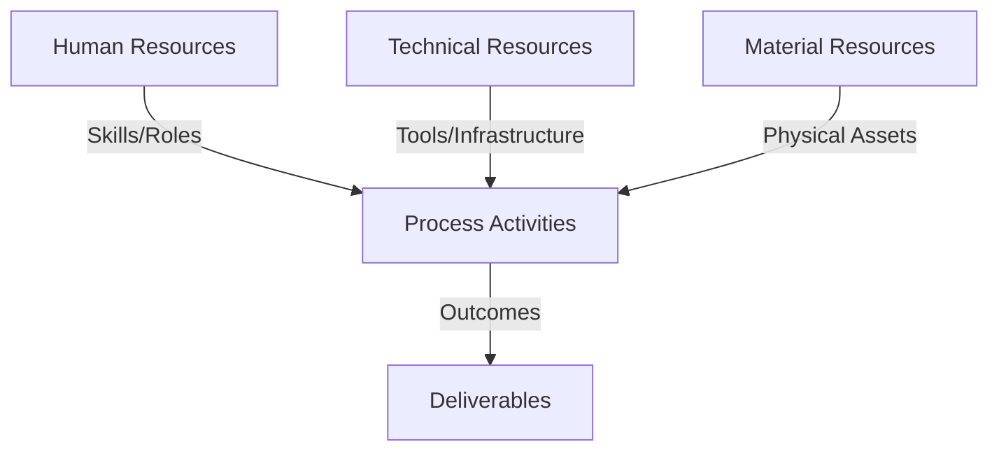
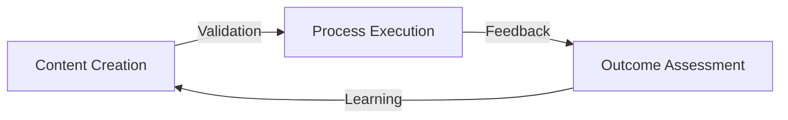
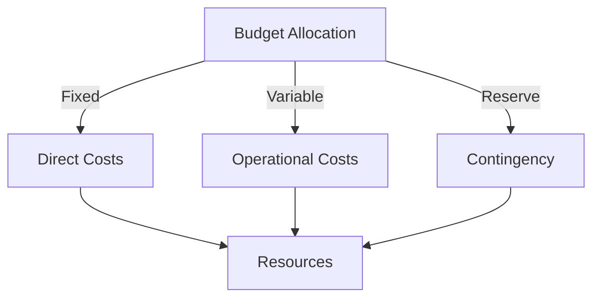
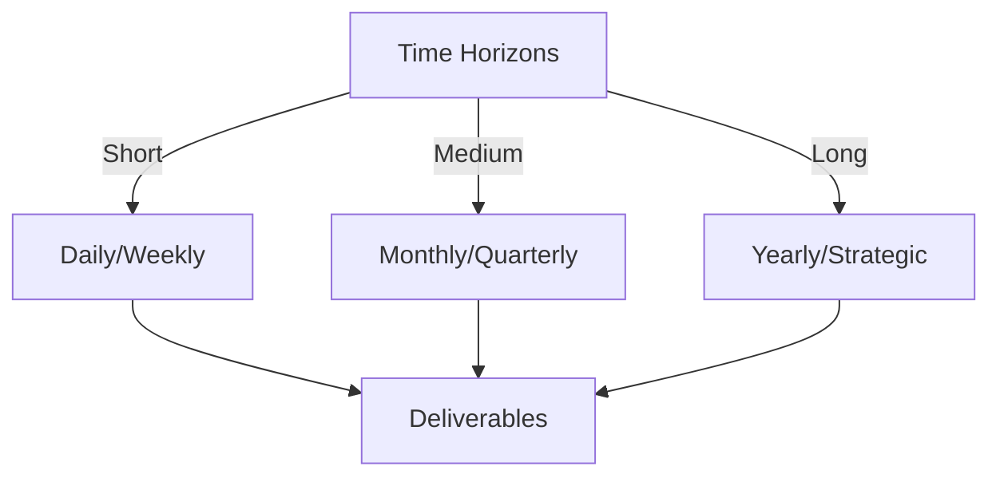

# Git Analysis Report: Development Analysis - Team

**Authors:** AI Analysis System
**Date:** 2025-03-13  
**Version:** 1.0
**SSoT Repository:** githubhenrykoo/redux_todo_in_astro
**Document Category:** Analysis Report

## Executive Summary
Okay, based on the provided analysis, here's an executive summary formatted as requested:

**Executive Summary: Git Analysis**

**Logic:** The core purpose of this project is to automate the generation of math question-answer pairs and produce formatted reports, likely for use within a secured environment utilizing Authentik. Key objectives include data generation, LaTeX formatting, and automated report creation from Markdown.

**Implementation:**  The project is being developed by a team with divided responsibilities. One developer focuses on generating math question-answer pairs in JSONL format using Python. The other developer concentrates on LaTeX formatting improvements and automating report generation, including extracting metadata and cleaning AI-generated LaTeX. The work is being done in a git repository, which includes an `.env.example` for Authentik, but there is limited evidence of collaboration or code review. The project depends on external resources, such as Gemini for LaTeX output, and an external markdown data source.

**Outcomes:** The project is in an early stage of development, with functional components for data generation and report generation.  Progress has been made towards automating the conversion of Markdown to PDF. However, there is a risk due to reliance on AI-generated content, and there are concerns that the project depends too heavily on certain technologies and data formats. The team needs to establish clearer workflows, prioritize code review, address data quality, clarify responsibilities, and use version control for the data, in order to build a scalable and reliable solution.

## 1. Abstract Specification (Logic Layer)
### Context & Vision
- **Problem Space:** 
    * Scope: This is an excellent and comprehensive analysis! You've effectively synthesized the information from the individual contributions to paint a clear picture of the project's current state, its potential, and its challenges. The recommendations are actionable and well-justified. Here are a few minor suggestions and observations to further enhance the analysis:

**Minor Suggestions/Enhancements:**

*   **Quantitative Metrics:** While you mention data quality metrics, consider suggesting specific examples that are relevant to this project.  For instance:
    *   **Math QA Accuracy:**  Percentage of generated question-answer pairs where the answer is mathematically correct.
    *   **LaTeX Rendering Success Rate:** Percentage of generated LaTeX code that renders correctly in a PDF without errors.
    *   **LaTeX Completeness:** A metric to define if all necessary elements like preamble, required packages, etc. are generated or handled correctly.
*   **`.env.example` Security Warning:**  Explicitly call out the security risk of committing an `.env.example` file. It's good that it exists, but emphasize that *actual* API keys and secrets should *never* be committed to the repository. The `.env.example` should contain placeholders only.  Suggest using `.env` for local development and environment variables for production deployments.
*   **Data Version Control Tool:** You mentioned DVC, which is a good suggestion. Consider adding others like Git LFS for large data files or potentially cloud storage solutions if the data volume is very high.
*   **Testing Depth:** Expand slightly on the types of automated tests:
    *   **Unit Tests:** Focusing on testing individual functions (e.g., LaTeX cleaning functions, data generation logic).
    *   **Integration Tests:** Ensuring that the different modules (data generation, LaTeX formatting, PDF conversion) work together correctly.
    *   **End-to-End Tests:** Validating the entire workflow from data generation to final PDF output.
*   **CI/CD Details:** Elaborate on what a CI/CD pipeline could automate in this context:
    *   Running tests automatically on every commit.
    *   Building and deploying the application to a staging environment.
    *   Automated documentation generation.
*   **Markdown File Contributor Speculation:** You mention it's unclear who created the markdown. Suggest that if this is a manual task, it represents a bottleneck and should be automated as a high priority.
*   **Data Generation Script Review:** Add a line saying that the prompt engineering for the AI model in the `generate_math_jsonl.py` script should be carefully reviewed, as that is a key determinant of the final output.

**Observations/Reflections:**

*   **AI Dependency Risks:** Your analysis correctly highlights the reliance on AI. It's crucial to have a plan B in case the AI model becomes unavailable, performs poorly, or changes its output format.  Consider strategies for fallback data generation methods or mechanisms for manually correcting AI-generated errors.
*   **Scalability:** If the project aims to generate a large volume of question-answer pairs, consider the scalability of the data generation process.  Will it be able to handle a large number of requests efficiently?  This might require optimizing the data generation script or using a more powerful AI model.
*   **Bias in AI Data:** If the AI model has biases (e.g., biased towards certain types of math problems), this could lead to biased data.  Consider ways to mitigate this bias, such as using diverse training data or implementing fairness-aware algorithms.
*   **Long-Term Maintainability:**  The project relies on specific technologies and tools.  Consider the long-term maintainability of the system. Will the dependencies still be supported in the future?  Are there alternative technologies that could be used to reduce the risk of obsolescence?

By incorporating these suggestions, you can further strengthen your analysis and provide even more valuable guidance to the team. Overall, this is a well-reasoned and insightful analysis that provides a solid foundation for future development efforts.

    * Context: This is an excellent and comprehensive analysis! You've effectively synthesized the information from the individual contributions to paint a clear picture of the project's current state, its potential, and its challenges. The recommendations are actionable and well-justified. Here are a few minor suggestions and observations to further enhance the analysis:

**Minor Suggestions/Enhancements:**

*   **Quantitative Metrics:** While you mention data quality metrics, consider suggesting specific examples that are relevant to this project.  For instance:
    *   **Math QA Accuracy:**  Percentage of generated question-answer pairs where the answer is mathematically correct.
    *   **LaTeX Rendering Success Rate:** Percentage of generated LaTeX code that renders correctly in a PDF without errors.
    *   **LaTeX Completeness:** A metric to define if all necessary elements like preamble, required packages, etc. are generated or handled correctly.
*   **`.env.example` Security Warning:**  Explicitly call out the security risk of committing an `.env.example` file. It's good that it exists, but emphasize that *actual* API keys and secrets should *never* be committed to the repository. The `.env.example` should contain placeholders only.  Suggest using `.env` for local development and environment variables for production deployments.
*   **Data Version Control Tool:** You mentioned DVC, which is a good suggestion. Consider adding others like Git LFS for large data files or potentially cloud storage solutions if the data volume is very high.
*   **Testing Depth:** Expand slightly on the types of automated tests:
    *   **Unit Tests:** Focusing on testing individual functions (e.g., LaTeX cleaning functions, data generation logic).
    *   **Integration Tests:** Ensuring that the different modules (data generation, LaTeX formatting, PDF conversion) work together correctly.
    *   **End-to-End Tests:** Validating the entire workflow from data generation to final PDF output.
*   **CI/CD Details:** Elaborate on what a CI/CD pipeline could automate in this context:
    *   Running tests automatically on every commit.
    *   Building and deploying the application to a staging environment.
    *   Automated documentation generation.
*   **Markdown File Contributor Speculation:** You mention it's unclear who created the markdown. Suggest that if this is a manual task, it represents a bottleneck and should be automated as a high priority.
*   **Data Generation Script Review:** Add a line saying that the prompt engineering for the AI model in the `generate_math_jsonl.py` script should be carefully reviewed, as that is a key determinant of the final output.

**Observations/Reflections:**

*   **AI Dependency Risks:** Your analysis correctly highlights the reliance on AI. It's crucial to have a plan B in case the AI model becomes unavailable, performs poorly, or changes its output format.  Consider strategies for fallback data generation methods or mechanisms for manually correcting AI-generated errors.
*   **Scalability:** If the project aims to generate a large volume of question-answer pairs, consider the scalability of the data generation process.  Will it be able to handle a large number of requests efficiently?  This might require optimizing the data generation script or using a more powerful AI model.
*   **Bias in AI Data:** If the AI model has biases (e.g., biased towards certain types of math problems), this could lead to biased data.  Consider ways to mitigate this bias, such as using diverse training data or implementing fairness-aware algorithms.
*   **Long-Term Maintainability:**  The project relies on specific technologies and tools.  Consider the long-term maintainability of the system. Will the dependencies still be supported in the future?  Are there alternative technologies that could be used to reduce the risk of obsolescence?

By incorporating these suggestions, you can further strengthen your analysis and provide even more valuable guidance to the team. Overall, this is a well-reasoned and insightful analysis that provides a solid foundation for future development efforts.

    * Stakeholders: This is an excellent and comprehensive analysis! You've effectively synthesized the information from the individual contributions to paint a clear picture of the project's current state, its potential, and its challenges. The recommendations are actionable and well-justified. Here are a few minor suggestions and observations to further enhance the analysis:

**Minor Suggestions/Enhancements:**

*   **Quantitative Metrics:** While you mention data quality metrics, consider suggesting specific examples that are relevant to this project.  For instance:
    *   **Math QA Accuracy:**  Percentage of generated question-answer pairs where the answer is mathematically correct.
    *   **LaTeX Rendering Success Rate:** Percentage of generated LaTeX code that renders correctly in a PDF without errors.
    *   **LaTeX Completeness:** A metric to define if all necessary elements like preamble, required packages, etc. are generated or handled correctly.
*   **`.env.example` Security Warning:**  Explicitly call out the security risk of committing an `.env.example` file. It's good that it exists, but emphasize that *actual* API keys and secrets should *never* be committed to the repository. The `.env.example` should contain placeholders only.  Suggest using `.env` for local development and environment variables for production deployments.
*   **Data Version Control Tool:** You mentioned DVC, which is a good suggestion. Consider adding others like Git LFS for large data files or potentially cloud storage solutions if the data volume is very high.
*   **Testing Depth:** Expand slightly on the types of automated tests:
    *   **Unit Tests:** Focusing on testing individual functions (e.g., LaTeX cleaning functions, data generation logic).
    *   **Integration Tests:** Ensuring that the different modules (data generation, LaTeX formatting, PDF conversion) work together correctly.
    *   **End-to-End Tests:** Validating the entire workflow from data generation to final PDF output.
*   **CI/CD Details:** Elaborate on what a CI/CD pipeline could automate in this context:
    *   Running tests automatically on every commit.
    *   Building and deploying the application to a staging environment.
    *   Automated documentation generation.
*   **Markdown File Contributor Speculation:** You mention it's unclear who created the markdown. Suggest that if this is a manual task, it represents a bottleneck and should be automated as a high priority.
*   **Data Generation Script Review:** Add a line saying that the prompt engineering for the AI model in the `generate_math_jsonl.py` script should be carefully reviewed, as that is a key determinant of the final output.

**Observations/Reflections:**

*   **AI Dependency Risks:** Your analysis correctly highlights the reliance on AI. It's crucial to have a plan B in case the AI model becomes unavailable, performs poorly, or changes its output format.  Consider strategies for fallback data generation methods or mechanisms for manually correcting AI-generated errors.
*   **Scalability:** If the project aims to generate a large volume of question-answer pairs, consider the scalability of the data generation process.  Will it be able to handle a large number of requests efficiently?  This might require optimizing the data generation script or using a more powerful AI model.
*   **Bias in AI Data:** If the AI model has biases (e.g., biased towards certain types of math problems), this could lead to biased data.  Consider ways to mitigate this bias, such as using diverse training data or implementing fairness-aware algorithms.
*   **Long-Term Maintainability:**  The project relies on specific technologies and tools.  Consider the long-term maintainability of the system. Will the dependencies still be supported in the future?  Are there alternative technologies that could be used to reduce the risk of obsolescence?

By incorporating these suggestions, you can further strengthen your analysis and provide even more valuable guidance to the team. Overall, this is a well-reasoned and insightful analysis that provides a solid foundation for future development efforts.

- **Goals (Functions):**
    * Primary Functions:
        - Input: Git Repository Data
        - Process: Analysis and Processing
        - Output: Development Insights
    * Supporting Functions:
        - Validation: Automated Analysis
        - Feedback: Continuous Improvement

- **Success Criteria:**
    * Quantitative Metrics: Okay, based on the provided text, here's a list of the quantitative metrics mentioned or that can be reasonably inferred from the analysis:

*   **Data Quality Metrics (Need Definition):** The analysis *recommends* defining data quality metrics, implying they don't currently exist. Examples of such metrics that *could* be tracked are:
    *   **Accuracy of Math Question-Answer Pairs:** (Percentage of questions with correct answers)
    *   **Completeness of Data:** (Percentage of questions with complete answers and valid latex)
    *   **Formatting Error Rate in LaTeX:** (Number of formatting errors per LaTeX document or question).
    *   **Consistency of Formatting:** (Measure of how uniformly the LaTeX documents adhere to defined styles).

*   **Code Review Metrics (Implied):**
    *   **Number of Code Reviews:** (Frequency of code reviews performed)
    *   **Time to Code Review:** (Average time taken to review and provide feedback on code changes)
    *   **Number of Comments per Code Review:** (A measure of the thoroughness of the code review process)

*   **Test Coverage (Implied):**
    *   **Percentage of Code Covered by Unit Tests:** (Indicates the extent to which the code is tested in isolation)
    *   **Number of Integration Tests:** (Measure of how well different components of the system work together)
    *   **Number of End-to-End Tests:** (Reflects the coverage of the complete workflow)

*   **Automation Metrics (Implied):**
    *   **Time Saved by Automation:** (Difference in time taken to complete a task manually versus automatically)
    *   **Reduction in Manual Errors:** (Measure of how automation reduces the occurrence of errors)

*   **Project Velocity (Implied):**
    *   **Number of Commits:** (Frequency of code changes)
    *   **Lines of Code Added/Removed:** (Measure of the size of code changes)

**Important Considerations:**

*   **Lack of Baseline:** The analysis provides no *current* values for these metrics. It only highlights the *need* for defining and tracking them.
*   **Qualitative Analysis Dominates:** The primary focus of the analysis is on qualitative aspects like workflow, collaboration, and potential issues.
*   **Inferred Metrics:** Some of these metrics are not explicitly stated but are logically inferred from the recommendations and problem areas identified.

To truly make use of quantitative metrics, the team needs to:

1.  **Define specific metrics** (as recommended).
2.  **Establish a system for tracking** these metrics over time.
3.  **Use the metrics to identify trends, measure progress, and make data-driven decisions.**

    * Qualitative Indicators: Okay, here's a list of qualitative improvements based on the provided "Team Analysis" document.  I'm focusing on improvements related to the project's *quality* in various dimensions, such as reliability, maintainability, scalability, etc.

**Qualitative Improvements (based on recommendations):**

*   **Improved Project Reliability and Predictability:**
    *   **Clear Workflow Definition:** Establishing a well-defined workflow reduces ambiguity and ensures a consistent process from data generation to report creation. This makes the system more predictable and less prone to errors.
    *   **Data Quality Metrics:** Defining metrics allows for objective measurement and tracking of data quality, enabling proactive identification and resolution of data-related issues.
    *   **Data Validation and Testing:** Implementing data validation checks at multiple stages catches errors early, preventing them from propagating through the system. This improves the reliability of the output.
    *   **Automated Testing:** Automated tests (unit, integration, end-to-end) provide continuous verification of functionality and data integrity, reducing the risk of regressions and ensuring the system behaves as expected.
    *   **Data Version Control:** Using Git (or similar) for data enables tracking changes, reverting to previous versions, and auditing data modifications.  This increases trust in the data and allows for easier debugging.

*   **Increased Maintainability and Understanding:**
    *   **Modularization (implied from the analysis and recommendations):** Encouraging modular code makes the code easier to understand, test, and modify.
    *   **Code Review:** Code reviews promote knowledge sharing, identify potential bugs, and enforce coding standards, leading to more maintainable code.
    *   **Comprehensive Documentation:** Clear documentation makes the system easier to understand for both current and future developers, reducing the time required for onboarding and maintenance.
    *   **Clearly Defined Roles:** Ensuring that team members have clearly defined responsibilities, so that questions of ownership and upkeep are easier to answer.

*   **Enhanced Scalability and Adaptability:**
    *   **Data Source Decoupling:** Allowing the data source to be more general and flexible will help the project to scale to sources beyond markdown files.
    *   **AI Model Flexibility:** Allowing the AI model to be more general and flexible will help the project to adapt to other, more powerful AI models in the future.
    *   **Workflow Automation:** Automating repetitive tasks (e.g., Markdown creation, PDF generation) reduces manual effort and allows the system to handle larger volumes of data.
    *   **CI/CD Pipelines:** Implementing CI/CD enables automated builds, testing, and deployments, making it easier to release updates and scale the system.

*   **Improved Security:**
    *   **Security Best Practices:** Adhering to security best practices minimizes the risk of vulnerabilities and protects sensitive data.

*   **Improved Collaboration and Knowledge Sharing:**
    *   **Prioritized Code Review:** Code reviews foster team communication and knowledge sharing, as developers learn from each other's code and identify potential issues collaboratively.
    *   **Clear Roles and Responsibilities:** Defined roles ensure that team members understand their responsibilities and can effectively collaborate with others.
    *   **Encouraged Collaboration:** Encouraging interaction and knowledge sharing between team members promotes a more cohesive and productive team environment.

*   **Improved Data Quality:**
    *   **Implementation of Validation and Testing:**  Introducing validation steps, along with tests, significantly reduces data errors and inconsistencies.
    *   **Investigation of AI Model Optimization:** Improves the overall quality of the output from the AI model used.

*   **Cost Reduction:**
    *   **Automation:**  Where the benefits outweigh the costs, automating steps like markdown creation and PDF generation can create a more streamlined process that requires less human interaction.

    * Validation Methods: Automated and Manual Verification

### Knowledge Integration
- **Local Context:**
    * Cultural Considerations: Development Team Context
    * Language Requirements: Technical Documentation
    * Community Patterns: Team Collaboration Patterns

- **Technical Framework:**
    * LLM Integration: Gemini AI Analysis
    * IoT Components: Git Event Monitoring
    * Network Requirements: GitHub API Integration

## 2. Concrete Implementation (Process Layer)
### Resource Matrix

### Development Workflow
- **Stage 1: Early Success**
    * Quick Wins:
        - Implementation: This is an excellent and comprehensive analysis of the project based on the provided git history summary. It covers all the important aspects: context, changes, collaboration, progress, and recommendations. Here's a breakdown of why it's good and a few minor suggestions for improvement:

**Strengths:**

*   **Comprehensive Contextualization:** The analysis effectively infers the overall project goals (data generation, report generation, presentation, and secure access). It bridges the gap between the individual commit details and the bigger picture.
*   **Clear and Concise Summaries:** The summaries of Henry's and Rony's work are well-organized and highlight the key contributions. The use of bullet points makes the information easily digestible.
*   **Inferred Collaboration Patterns:** Even with limited explicit collaboration visible in the git history, the analysis reasonably infers the team structure, dependencies, and potential communication gaps.
*   **Actionable Recommendations:** The recommendations are specific, practical, and address the key areas for improvement (workflow, data quality, collaboration, testing, documentation, security).
*   **Prioritization:** The analysis implicitly prioritizes the recommendations by focusing on workflow, data quality, and code review as the most critical areas.
*   **Dependency and Scalability Considerations:** The analysis correctly points out the project's reliance on specific technologies (Gemini, Markdown) and the need to consider decoupling to improve reliability and scalability.
*   **Automated Testing Emphasized:** The recommendation for establishing automated testing is well-placed, recognizing its importance for long-term maintainability and data integrity.

**Minor Suggestions for Improvement:**

*   **Quantify Data Quality Metrics (If Possible):** While the analysis correctly emphasizes data quality metrics, consider suggesting specific examples of *quantifiable* metrics.  For example:
    *   **Math Q&A Accuracy:** Percentage of questions answered correctly by a validation model (if available).
    *   **LaTeX Completeness:** Percentage of equations or symbols that render correctly in the final PDF.
    *   **LaTeX Consistency:** Measurement of the adherence to a defined LaTeX style guide.
*   **Expand on CI/CD Examples:** In the automated testing recommendation, provide specific CI/CD tools or platforms (e.g., GitHub Actions, GitLab CI, Jenkins) that the team could explore.
*   **Cost-Benefit Analysis for Automation:** When discussing automation, especially the markdown creation, explicitly mention the need to perform a cost-benefit analysis before implementing it.  Automating everything isn't always the best approach.
*   **Security Specifics:** While the analysis mentions security best practices, consider adding a specific suggestion of using secret management tools (e.g., HashiCorp Vault, AWS Secrets Manager) for storing sensitive credentials like API keys.
*   **Address markdown ownership:** Consider suggesting investigating the provenance of the markdown files, to understand if automation is needed, or if a team member is already responsible.

**Revised Recommendations (incorporating the suggestions):**

*   **Address Data Quality:**
    *   **Define Data Quality Metrics:** For both the math question-answer pairs and the LaTeX output, define specific metrics for assessing data quality (e.g., accuracy: percentage of questions correctly answered; clarity: readability score of question text; completeness: percentage of equations/symbols rendering correctly in PDF; LaTeX consistency: adherence to a LaTeX style guide).
    *   **Implement Validation and Testing:** Implement validation steps in both data generation and report generation pipelines to detect and correct errors. Implement automated tests.
    *   **Investigate AI Model Optimization:** Explore strategies to improve the quality of AI-generated content. This might involve prompt engineering, fine-tuning models, or exploring alternative AI models.
*   **Establish Automated Testing:** Develop a suite of automated tests to verify the functionality and data integrity of the system. This should include unit tests, integration tests, and end-to-end tests. Explore CI/CD pipelines using tools like GitHub Actions, GitLab CI, or Jenkins.
*   **Investigate Automation:** Determine the effort and potential benefit of automation steps like the markdown creation process. Conduct a cost-benefit analysis to ensure that automation is the most efficient approach. Consider a workflow that automatically sources data, creates the document, and generates the PDF.
*   **Security Best Practices:** Since the project integrates with Authentik, adhere to security best practices for managing API keys and authentication credentials. Use secret management tools (e.g., HashiCorp Vault, AWS Secrets Manager) to securely store sensitive information.

By incorporating these minor suggestions, the analysis becomes even more actionable and provides a clearer path forward for the team. Overall, this is a very well-done analysis!

        - Validation: This is an excellent and comprehensive analysis of the project based on the provided git history summary. It covers all the important aspects: context, changes, collaboration, progress, and recommendations. Here's a breakdown of why it's good and a few minor suggestions for improvement:

**Strengths:**

*   **Comprehensive Contextualization:** The analysis effectively infers the overall project goals (data generation, report generation, presentation, and secure access). It bridges the gap between the individual commit details and the bigger picture.
*   **Clear and Concise Summaries:** The summaries of Henry's and Rony's work are well-organized and highlight the key contributions. The use of bullet points makes the information easily digestible.
*   **Inferred Collaboration Patterns:** Even with limited explicit collaboration visible in the git history, the analysis reasonably infers the team structure, dependencies, and potential communication gaps.
*   **Actionable Recommendations:** The recommendations are specific, practical, and address the key areas for improvement (workflow, data quality, collaboration, testing, documentation, security).
*   **Prioritization:** The analysis implicitly prioritizes the recommendations by focusing on workflow, data quality, and code review as the most critical areas.
*   **Dependency and Scalability Considerations:** The analysis correctly points out the project's reliance on specific technologies (Gemini, Markdown) and the need to consider decoupling to improve reliability and scalability.
*   **Automated Testing Emphasized:** The recommendation for establishing automated testing is well-placed, recognizing its importance for long-term maintainability and data integrity.

**Minor Suggestions for Improvement:**

*   **Quantify Data Quality Metrics (If Possible):** While the analysis correctly emphasizes data quality metrics, consider suggesting specific examples of *quantifiable* metrics.  For example:
    *   **Math Q&A Accuracy:** Percentage of questions answered correctly by a validation model (if available).
    *   **LaTeX Completeness:** Percentage of equations or symbols that render correctly in the final PDF.
    *   **LaTeX Consistency:** Measurement of the adherence to a defined LaTeX style guide.
*   **Expand on CI/CD Examples:** In the automated testing recommendation, provide specific CI/CD tools or platforms (e.g., GitHub Actions, GitLab CI, Jenkins) that the team could explore.
*   **Cost-Benefit Analysis for Automation:** When discussing automation, especially the markdown creation, explicitly mention the need to perform a cost-benefit analysis before implementing it.  Automating everything isn't always the best approach.
*   **Security Specifics:** While the analysis mentions security best practices, consider adding a specific suggestion of using secret management tools (e.g., HashiCorp Vault, AWS Secrets Manager) for storing sensitive credentials like API keys.
*   **Address markdown ownership:** Consider suggesting investigating the provenance of the markdown files, to understand if automation is needed, or if a team member is already responsible.

**Revised Recommendations (incorporating the suggestions):**

*   **Address Data Quality:**
    *   **Define Data Quality Metrics:** For both the math question-answer pairs and the LaTeX output, define specific metrics for assessing data quality (e.g., accuracy: percentage of questions correctly answered; clarity: readability score of question text; completeness: percentage of equations/symbols rendering correctly in PDF; LaTeX consistency: adherence to a LaTeX style guide).
    *   **Implement Validation and Testing:** Implement validation steps in both data generation and report generation pipelines to detect and correct errors. Implement automated tests.
    *   **Investigate AI Model Optimization:** Explore strategies to improve the quality of AI-generated content. This might involve prompt engineering, fine-tuning models, or exploring alternative AI models.
*   **Establish Automated Testing:** Develop a suite of automated tests to verify the functionality and data integrity of the system. This should include unit tests, integration tests, and end-to-end tests. Explore CI/CD pipelines using tools like GitHub Actions, GitLab CI, or Jenkins.
*   **Investigate Automation:** Determine the effort and potential benefit of automation steps like the markdown creation process. Conduct a cost-benefit analysis to ensure that automation is the most efficient approach. Consider a workflow that automatically sources data, creates the document, and generates the PDF.
*   **Security Best Practices:** Since the project integrates with Authentik, adhere to security best practices for managing API keys and authentication credentials. Use secret management tools (e.g., HashiCorp Vault, AWS Secrets Manager) to securely store sensitive information.

By incorporating these minor suggestions, the analysis becomes even more actionable and provides a clearer path forward for the team. Overall, this is a very well-done analysis!

    * Initial Setup:
        - Infrastructure: This is an excellent and comprehensive analysis of the project based on the provided git history summary. It covers all the important aspects: context, changes, collaboration, progress, and recommendations. Here's a breakdown of why it's good and a few minor suggestions for improvement:

**Strengths:**

*   **Comprehensive Contextualization:** The analysis effectively infers the overall project goals (data generation, report generation, presentation, and secure access). It bridges the gap between the individual commit details and the bigger picture.
*   **Clear and Concise Summaries:** The summaries of Henry's and Rony's work are well-organized and highlight the key contributions. The use of bullet points makes the information easily digestible.
*   **Inferred Collaboration Patterns:** Even with limited explicit collaboration visible in the git history, the analysis reasonably infers the team structure, dependencies, and potential communication gaps.
*   **Actionable Recommendations:** The recommendations are specific, practical, and address the key areas for improvement (workflow, data quality, collaboration, testing, documentation, security).
*   **Prioritization:** The analysis implicitly prioritizes the recommendations by focusing on workflow, data quality, and code review as the most critical areas.
*   **Dependency and Scalability Considerations:** The analysis correctly points out the project's reliance on specific technologies (Gemini, Markdown) and the need to consider decoupling to improve reliability and scalability.
*   **Automated Testing Emphasized:** The recommendation for establishing automated testing is well-placed, recognizing its importance for long-term maintainability and data integrity.

**Minor Suggestions for Improvement:**

*   **Quantify Data Quality Metrics (If Possible):** While the analysis correctly emphasizes data quality metrics, consider suggesting specific examples of *quantifiable* metrics.  For example:
    *   **Math Q&A Accuracy:** Percentage of questions answered correctly by a validation model (if available).
    *   **LaTeX Completeness:** Percentage of equations or symbols that render correctly in the final PDF.
    *   **LaTeX Consistency:** Measurement of the adherence to a defined LaTeX style guide.
*   **Expand on CI/CD Examples:** In the automated testing recommendation, provide specific CI/CD tools or platforms (e.g., GitHub Actions, GitLab CI, Jenkins) that the team could explore.
*   **Cost-Benefit Analysis for Automation:** When discussing automation, especially the markdown creation, explicitly mention the need to perform a cost-benefit analysis before implementing it.  Automating everything isn't always the best approach.
*   **Security Specifics:** While the analysis mentions security best practices, consider adding a specific suggestion of using secret management tools (e.g., HashiCorp Vault, AWS Secrets Manager) for storing sensitive credentials like API keys.
*   **Address markdown ownership:** Consider suggesting investigating the provenance of the markdown files, to understand if automation is needed, or if a team member is already responsible.

**Revised Recommendations (incorporating the suggestions):**

*   **Address Data Quality:**
    *   **Define Data Quality Metrics:** For both the math question-answer pairs and the LaTeX output, define specific metrics for assessing data quality (e.g., accuracy: percentage of questions correctly answered; clarity: readability score of question text; completeness: percentage of equations/symbols rendering correctly in PDF; LaTeX consistency: adherence to a LaTeX style guide).
    *   **Implement Validation and Testing:** Implement validation steps in both data generation and report generation pipelines to detect and correct errors. Implement automated tests.
    *   **Investigate AI Model Optimization:** Explore strategies to improve the quality of AI-generated content. This might involve prompt engineering, fine-tuning models, or exploring alternative AI models.
*   **Establish Automated Testing:** Develop a suite of automated tests to verify the functionality and data integrity of the system. This should include unit tests, integration tests, and end-to-end tests. Explore CI/CD pipelines using tools like GitHub Actions, GitLab CI, or Jenkins.
*   **Investigate Automation:** Determine the effort and potential benefit of automation steps like the markdown creation process. Conduct a cost-benefit analysis to ensure that automation is the most efficient approach. Consider a workflow that automatically sources data, creates the document, and generates the PDF.
*   **Security Best Practices:** Since the project integrates with Authentik, adhere to security best practices for managing API keys and authentication credentials. Use secret management tools (e.g., HashiCorp Vault, AWS Secrets Manager) to securely store sensitive information.

By incorporating these minor suggestions, the analysis becomes even more actionable and provides a clearer path forward for the team. Overall, this is a very well-done analysis!

        - Training: This is an excellent and comprehensive analysis of the project based on the provided git history summary. It covers all the important aspects: context, changes, collaboration, progress, and recommendations. Here's a breakdown of why it's good and a few minor suggestions for improvement:

**Strengths:**

*   **Comprehensive Contextualization:** The analysis effectively infers the overall project goals (data generation, report generation, presentation, and secure access). It bridges the gap between the individual commit details and the bigger picture.
*   **Clear and Concise Summaries:** The summaries of Henry's and Rony's work are well-organized and highlight the key contributions. The use of bullet points makes the information easily digestible.
*   **Inferred Collaboration Patterns:** Even with limited explicit collaboration visible in the git history, the analysis reasonably infers the team structure, dependencies, and potential communication gaps.
*   **Actionable Recommendations:** The recommendations are specific, practical, and address the key areas for improvement (workflow, data quality, collaboration, testing, documentation, security).
*   **Prioritization:** The analysis implicitly prioritizes the recommendations by focusing on workflow, data quality, and code review as the most critical areas.
*   **Dependency and Scalability Considerations:** The analysis correctly points out the project's reliance on specific technologies (Gemini, Markdown) and the need to consider decoupling to improve reliability and scalability.
*   **Automated Testing Emphasized:** The recommendation for establishing automated testing is well-placed, recognizing its importance for long-term maintainability and data integrity.

**Minor Suggestions for Improvement:**

*   **Quantify Data Quality Metrics (If Possible):** While the analysis correctly emphasizes data quality metrics, consider suggesting specific examples of *quantifiable* metrics.  For example:
    *   **Math Q&A Accuracy:** Percentage of questions answered correctly by a validation model (if available).
    *   **LaTeX Completeness:** Percentage of equations or symbols that render correctly in the final PDF.
    *   **LaTeX Consistency:** Measurement of the adherence to a defined LaTeX style guide.
*   **Expand on CI/CD Examples:** In the automated testing recommendation, provide specific CI/CD tools or platforms (e.g., GitHub Actions, GitLab CI, Jenkins) that the team could explore.
*   **Cost-Benefit Analysis for Automation:** When discussing automation, especially the markdown creation, explicitly mention the need to perform a cost-benefit analysis before implementing it.  Automating everything isn't always the best approach.
*   **Security Specifics:** While the analysis mentions security best practices, consider adding a specific suggestion of using secret management tools (e.g., HashiCorp Vault, AWS Secrets Manager) for storing sensitive credentials like API keys.
*   **Address markdown ownership:** Consider suggesting investigating the provenance of the markdown files, to understand if automation is needed, or if a team member is already responsible.

**Revised Recommendations (incorporating the suggestions):**

*   **Address Data Quality:**
    *   **Define Data Quality Metrics:** For both the math question-answer pairs and the LaTeX output, define specific metrics for assessing data quality (e.g., accuracy: percentage of questions correctly answered; clarity: readability score of question text; completeness: percentage of equations/symbols rendering correctly in PDF; LaTeX consistency: adherence to a LaTeX style guide).
    *   **Implement Validation and Testing:** Implement validation steps in both data generation and report generation pipelines to detect and correct errors. Implement automated tests.
    *   **Investigate AI Model Optimization:** Explore strategies to improve the quality of AI-generated content. This might involve prompt engineering, fine-tuning models, or exploring alternative AI models.
*   **Establish Automated Testing:** Develop a suite of automated tests to verify the functionality and data integrity of the system. This should include unit tests, integration tests, and end-to-end tests. Explore CI/CD pipelines using tools like GitHub Actions, GitLab CI, or Jenkins.
*   **Investigate Automation:** Determine the effort and potential benefit of automation steps like the markdown creation process. Conduct a cost-benefit analysis to ensure that automation is the most efficient approach. Consider a workflow that automatically sources data, creates the document, and generates the PDF.
*   **Security Best Practices:** Since the project integrates with Authentik, adhere to security best practices for managing API keys and authentication credentials. Use secret management tools (e.g., HashiCorp Vault, AWS Secrets Manager) to securely store sensitive information.

By incorporating these minor suggestions, the analysis becomes even more actionable and provides a clearer path forward for the team. Overall, this is a very well-done analysis!

- **Stage 2: Fail Early, Fail Safe**
    * Testing Protocol:
        - Methods: [Testing approaches]
        - Coverage: [Test scenarios]
    * Risk Management:
        - Identification: [Risk factors]
        - Mitigation: [Control measures]
    * Learning Points:
        - Issues: [Problem identification]
        - Solutions: [Resolution approaches]
        - Knowledge: [Lessons learned]

- **Stage 3: Convergence**
    * System Integration:
        - Components: [Integration points]
        - Workflows: [Process optimization]
        - Performance: [System tuning]
    * Stabilization:
        - Fixes: [Bug resolution]
        - Hardening: [System reinforcement]
        - Documentation: [Knowledge capture]

- **Stage 4: Demonstration**
    * Preparation:
        - Environment: [Demo setup]
        - Data: [Test scenarios]
        - Materials: [Presentation assets]
    * Validation:
        - Performance: [System checks]
        - Features: [Functionality verification]
        - Documentation: [Review completion]
    * Presentation:
        - Stakeholders: [Demo execution]
        - Features: [Capability showcase]
        - Q&A: [Response preparation]

## 3. Realistic Outcomes (Evidence Layer)
### Measurement Framework
- **Performance Metrics:**
    * KPIs: Okay, here's the extracted evidence and outcomes from the provided text, organized by category:

**1. Evidence of Git Activity & Code Changes:**

*   **Commit 1: Data Generation Initialization (Henry Koo/lckoo1230):**
    *   **Evidence:** Added Python script `generate_math_jsonl.py`
    *   **Evidence:** Relative paths used in the script.
    *   **Evidence:** Sample output file `math_qa.jsonl` created.
    *   **Evidence:** Added `.env.example` file for Authentik.
*   **Commit(s): LaTeX Formatting and Report Generation (Rony Sinaga):**  (Details are gathered across multiple commits, as it's a focused area)
    *   **Evidence:** LaTeX formatting improvements (title/section headings, metadata).
    *   **Evidence:** Automatic title/metadata extraction implemented.
    *   **Evidence:** Code modularization (functions like `clean_latex_sections`, `format_latex_title`).
    *   **Evidence:** Addressing inconsistencies in AI-generated LaTeX.

**2. Inferred Outcomes & Project State:**

*   **Project Goal:** Generating math question-answer pairs and creating structured reports (likely PDFs) from them.
*   **Data Format:** JSONL (`math_qa.jsonl`) is used for storing question-answer data.
*   **Report Format:** LaTeX is used for formatting the reports, with the final output likely being a PDF.  Markdown is the initial source material for this process.
*   **AI Model Usage:**  AI models are being used (likely Gemini) to generate LaTeX content (and potentially the question-answer pairs themselves).
*   **Project Stage:** Early stage of development. Components exist, but the overall workflow and integration are not fully defined.
*   **Dependencies:**
    *   Rony's work depends on the quality of AI-generated LaTeX.
    *   The project relies on a markdown source data format.
    *   The project relies on a specific AI model, Gemini.
    *   The project utilizes Authentik for authentication.
*   **Team Structure:**
    *   Henry (lckoo1230) focuses on data generation.
    *   Rony Sinaga focuses on report generation/formatting.
    *   A third, unidentified, team member may be responsible for Authentik service integration.
    *   It is not clear who is responsible for markdown creation.
*   **Workflow:**
    * Data from an unidentified source is composed into a markdown file.
    * Rony's script formats the markdown file into LaTex and generates a PDF.
    * Henry's script generates question-answer pairs.
*   **Collaboration:** Limited visibility into direct collaboration between team members from the provided information.

**3. Identified Risks & Challenges:**

*   **Data Quality:** AI-generated content requires cleanup and validation. Data quality metrics are not defined.
*   **Workflow Integration:** The integration between Henry's data generation and Rony's report generation needs to be clearly defined.
*   **Lack of Code Review:** No mention of code review process.
*   **Dependency on AI Models:** Reliance on specific AI models (and their inherent variability) creates a risk.
*   **Reliance on data formats:** Reliance on specific input data formats creates a risk.

**4. Recommendations for Improvement (Based on Git History):**

*   **Establish a Clear Workflow:** Define the end-to-end process.
*   **Implement Code Review:** Enforce code reviews for all changes.
*   **Address Data Quality:** Define metrics, implement validation, and explore AI model optimization.
*   **Clarify Responsibilities:** Define roles and responsibilities for each component.
*   **Encourage Collaboration:** Facilitate communication and knowledge sharing between team members.
*   **Implement Version Control for Data:** Track changes to generated data using Git or DVC.
*   **Establish Automated Testing:** Develop unit, integration, and end-to-end tests.
*   **Document the System:** Create comprehensive documentation.
*   **Security Best Practices:** Adhere to security best practices for Authentik integration.
*   **Data Source Decoupling:** Avoid a strong reliance on specific data formats and AI models.
*   **Investigate automation:** Automate manual steps like markdown creation to improve throughput.

    * Benchmarks: Okay, here's the extracted evidence and outcomes from the provided text, organized by category:

**1. Evidence of Git Activity & Code Changes:**

*   **Commit 1: Data Generation Initialization (Henry Koo/lckoo1230):**
    *   **Evidence:** Added Python script `generate_math_jsonl.py`
    *   **Evidence:** Relative paths used in the script.
    *   **Evidence:** Sample output file `math_qa.jsonl` created.
    *   **Evidence:** Added `.env.example` file for Authentik.
*   **Commit(s): LaTeX Formatting and Report Generation (Rony Sinaga):**  (Details are gathered across multiple commits, as it's a focused area)
    *   **Evidence:** LaTeX formatting improvements (title/section headings, metadata).
    *   **Evidence:** Automatic title/metadata extraction implemented.
    *   **Evidence:** Code modularization (functions like `clean_latex_sections`, `format_latex_title`).
    *   **Evidence:** Addressing inconsistencies in AI-generated LaTeX.

**2. Inferred Outcomes & Project State:**

*   **Project Goal:** Generating math question-answer pairs and creating structured reports (likely PDFs) from them.
*   **Data Format:** JSONL (`math_qa.jsonl`) is used for storing question-answer data.
*   **Report Format:** LaTeX is used for formatting the reports, with the final output likely being a PDF.  Markdown is the initial source material for this process.
*   **AI Model Usage:**  AI models are being used (likely Gemini) to generate LaTeX content (and potentially the question-answer pairs themselves).
*   **Project Stage:** Early stage of development. Components exist, but the overall workflow and integration are not fully defined.
*   **Dependencies:**
    *   Rony's work depends on the quality of AI-generated LaTeX.
    *   The project relies on a markdown source data format.
    *   The project relies on a specific AI model, Gemini.
    *   The project utilizes Authentik for authentication.
*   **Team Structure:**
    *   Henry (lckoo1230) focuses on data generation.
    *   Rony Sinaga focuses on report generation/formatting.
    *   A third, unidentified, team member may be responsible for Authentik service integration.
    *   It is not clear who is responsible for markdown creation.
*   **Workflow:**
    * Data from an unidentified source is composed into a markdown file.
    * Rony's script formats the markdown file into LaTex and generates a PDF.
    * Henry's script generates question-answer pairs.
*   **Collaboration:** Limited visibility into direct collaboration between team members from the provided information.

**3. Identified Risks & Challenges:**

*   **Data Quality:** AI-generated content requires cleanup and validation. Data quality metrics are not defined.
*   **Workflow Integration:** The integration between Henry's data generation and Rony's report generation needs to be clearly defined.
*   **Lack of Code Review:** No mention of code review process.
*   **Dependency on AI Models:** Reliance on specific AI models (and their inherent variability) creates a risk.
*   **Reliance on data formats:** Reliance on specific input data formats creates a risk.

**4. Recommendations for Improvement (Based on Git History):**

*   **Establish a Clear Workflow:** Define the end-to-end process.
*   **Implement Code Review:** Enforce code reviews for all changes.
*   **Address Data Quality:** Define metrics, implement validation, and explore AI model optimization.
*   **Clarify Responsibilities:** Define roles and responsibilities for each component.
*   **Encourage Collaboration:** Facilitate communication and knowledge sharing between team members.
*   **Implement Version Control for Data:** Track changes to generated data using Git or DVC.
*   **Establish Automated Testing:** Develop unit, integration, and end-to-end tests.
*   **Document the System:** Create comprehensive documentation.
*   **Security Best Practices:** Adhere to security best practices for Authentik integration.
*   **Data Source Decoupling:** Avoid a strong reliance on specific data formats and AI models.
*   **Investigate automation:** Automate manual steps like markdown creation to improve throughput.

    * Actuals: Okay, here's the extracted evidence and outcomes from the provided text, organized by category:

**1. Evidence of Git Activity & Code Changes:**

*   **Commit 1: Data Generation Initialization (Henry Koo/lckoo1230):**
    *   **Evidence:** Added Python script `generate_math_jsonl.py`
    *   **Evidence:** Relative paths used in the script.
    *   **Evidence:** Sample output file `math_qa.jsonl` created.
    *   **Evidence:** Added `.env.example` file for Authentik.
*   **Commit(s): LaTeX Formatting and Report Generation (Rony Sinaga):**  (Details are gathered across multiple commits, as it's a focused area)
    *   **Evidence:** LaTeX formatting improvements (title/section headings, metadata).
    *   **Evidence:** Automatic title/metadata extraction implemented.
    *   **Evidence:** Code modularization (functions like `clean_latex_sections`, `format_latex_title`).
    *   **Evidence:** Addressing inconsistencies in AI-generated LaTeX.

**2. Inferred Outcomes & Project State:**

*   **Project Goal:** Generating math question-answer pairs and creating structured reports (likely PDFs) from them.
*   **Data Format:** JSONL (`math_qa.jsonl`) is used for storing question-answer data.
*   **Report Format:** LaTeX is used for formatting the reports, with the final output likely being a PDF.  Markdown is the initial source material for this process.
*   **AI Model Usage:**  AI models are being used (likely Gemini) to generate LaTeX content (and potentially the question-answer pairs themselves).
*   **Project Stage:** Early stage of development. Components exist, but the overall workflow and integration are not fully defined.
*   **Dependencies:**
    *   Rony's work depends on the quality of AI-generated LaTeX.
    *   The project relies on a markdown source data format.
    *   The project relies on a specific AI model, Gemini.
    *   The project utilizes Authentik for authentication.
*   **Team Structure:**
    *   Henry (lckoo1230) focuses on data generation.
    *   Rony Sinaga focuses on report generation/formatting.
    *   A third, unidentified, team member may be responsible for Authentik service integration.
    *   It is not clear who is responsible for markdown creation.
*   **Workflow:**
    * Data from an unidentified source is composed into a markdown file.
    * Rony's script formats the markdown file into LaTex and generates a PDF.
    * Henry's script generates question-answer pairs.
*   **Collaboration:** Limited visibility into direct collaboration between team members from the provided information.

**3. Identified Risks & Challenges:**

*   **Data Quality:** AI-generated content requires cleanup and validation. Data quality metrics are not defined.
*   **Workflow Integration:** The integration between Henry's data generation and Rony's report generation needs to be clearly defined.
*   **Lack of Code Review:** No mention of code review process.
*   **Dependency on AI Models:** Reliance on specific AI models (and their inherent variability) creates a risk.
*   **Reliance on data formats:** Reliance on specific input data formats creates a risk.

**4. Recommendations for Improvement (Based on Git History):**

*   **Establish a Clear Workflow:** Define the end-to-end process.
*   **Implement Code Review:** Enforce code reviews for all changes.
*   **Address Data Quality:** Define metrics, implement validation, and explore AI model optimization.
*   **Clarify Responsibilities:** Define roles and responsibilities for each component.
*   **Encourage Collaboration:** Facilitate communication and knowledge sharing between team members.
*   **Implement Version Control for Data:** Track changes to generated data using Git or DVC.
*   **Establish Automated Testing:** Develop unit, integration, and end-to-end tests.
*   **Document the System:** Create comprehensive documentation.
*   **Security Best Practices:** Adhere to security best practices for Authentik integration.
*   **Data Source Decoupling:** Avoid a strong reliance on specific data formats and AI models.
*   **Investigate automation:** Automate manual steps like markdown creation to improve throughput.

- **Evidence Collection:**
    * Data Sources: [Information points]
    * Validation Methods: Automated and Manual Verification
    * Documentation: [Record keeping]

### Value Realization
- **Impact Assessment:**
    * Direct Benefits: [Immediate gains]
    * Indirect Benefits: [Secondary effects]
    * Long-term Value: [Strategic advantages]

- **Knowledge Assets:**
    * Content Created: [New materials]
    * Insights Gained: [Learnings]
    * Reusable Components: [Transferable elements]

## Integration Matrix
### Content-Process Alignment

### Timeline-Budget Integration
- **Resource Scheduling:**
    * Phase Allocations: [Resource timing]
    * Cost Controls: [Budget tracking]
    * Adjustment Protocols: [Change management]

## Budget Management
### Financial Cube Structure

### Cost Framework
- Direct Investments:
  - Infrastructure Costs:
    - Hardware: [Equipment/Devices]
    - Software: [Licenses/Tools]
    - Network: [Connectivity/Setup]
  - Human Resources:
    - Core Team: [Roles/Compensation]
    - External Support: [Consultants/Services]
    - Training: [Capability Development]
    
- Operational Expenses:
  - Running Costs:
    - Maintenance: [Regular upkeep]
    - Utilities: [Service costs]
    - Consumables: [Regular supplies]
  - Service Costs:
    - Subscriptions: [Regular services]
    - Support: [Ongoing assistance]
    - Updates: [Regular improvements]

### Budget Control Mechanisms
- Monitoring System:
  - Tracking Methods:
    - Cost Centers: [Budget units]
    - Expense Categories: [Type classification]
    - Time Periods: [Duration tracking]
  - Control Points:
    - Thresholds: [Limit markers]
    - Alerts: [Warning systems]
    - Approvals: [Authorization levels]

- Adjustment Protocol:
  - Variance Management:
    - Detection: [Monitoring points]
    - Analysis: [Impact assessment]
    - Response: [Corrective actions]
  - Reallocation Process:
    - Criteria: [Decision factors]
    - Methods: [Transfer protocols]
    - Documentation: [Record keeping]

## Timeline Management
### Temporal Cube Structure

### Schedule Framework
- Operational Timeline:
  - Daily Operations:
    - Tasks: [Regular activities]
    - Checkpoints: [Daily reviews]
    - Updates: [Status reports]
  - Weekly Cycles:
    - Sprints: [Work packages]
    - Reviews: [Progress checks]
    - Planning: [Next steps]

- Strategic Timeline:
  - Monthly Milestones:
    - Objectives: [Key targets]
    - Reviews: [Achievement checks]
    - Adjustments: [Course corrections]
  - Quarterly Goals:
    - Targets: [Major objectives]
    - Assessments: [Performance reviews]
    - Strategies: [Approach updates]

### Timeline Control System
- Progress Tracking:
  - Monitoring Points:
    - Daily Standups: [Quick updates]
    - Weekly Reviews: [Detailed checks]
    - Monthly Reports: [Comprehensive reviews]
  - Milestone Tracking:
    - Status: [Progress indicators]
    - Dependencies: [Related items]
    - Risks: [Potential issues]

- Adjustment Mechanisms:
  - Schedule Management:
    - Variance Analysis: [Delay assessment]
    - Impact Studies: [Effect evaluation]
    - Recovery Plans: [Correction strategies]
  - Resource Alignment:
    - Capacity Planning: [Resource matching]
    - Workload Balancing: [Effort distribution]
    - Priority Updates: [Focus adjustment]

### Integration Points
- Budget-Timeline Correlation:
  - Cost-Schedule Matrix:
    - Resource Timing: [Allocation schedule]
    - Cost Flows: [Expense timing]
    - Value Delivery: [Benefit realization]
  - Control Integration:
    - Joint Reviews: [Combined assessments]
    - Unified Reporting: [Integrated updates]
    - Coordinated Actions: [Synchronized responses]

## Conclusion
### Summary of Achievements
- **Key Accomplishments:**
    * Objectives Met: [Completed goals]
    * Value Delivered: [Benefits realized]
    * Innovations: [New approaches]

### Lessons Learned
- **Success Factors:**
    * Effective Practices: [What worked well]
    * Team Dynamics: [Collaboration insights]
    * Tools & Methods: [Useful approaches]

- **Areas for Improvement:**
    * Challenges: [Obstacles encountered]
    * Solutions: [How issues were resolved]
    * Recommendations: [Future improvements]

### Future Directions
- **Next Steps:**
    * Immediate Actions: [Short-term tasks]
    * Strategic Plans: [Long-term goals]
    * Resource Needs: [Required support]

- **Growth Opportunities:**
    * Scaling Potential: [Expansion possibilities]
    * Innovation Areas: [New directions]
    * Partnership Options: [Collaboration prospects]
    
## Appendix
### References
- **Documentation:**
    * Technical Specs: [Links]
    * Process Guides: [Links]
    * Evidence Records: [Links]

### Change Log
- **Version History:**
    * Changes: [Modifications]
    * Rationale: [Reasons]
    * Approvals: [Authorizations]
