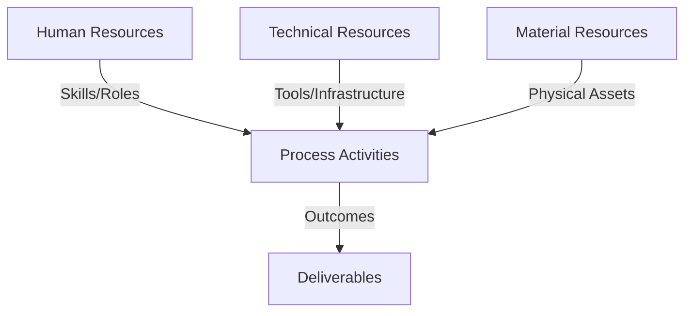
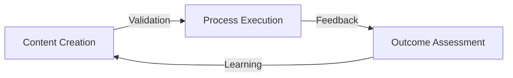
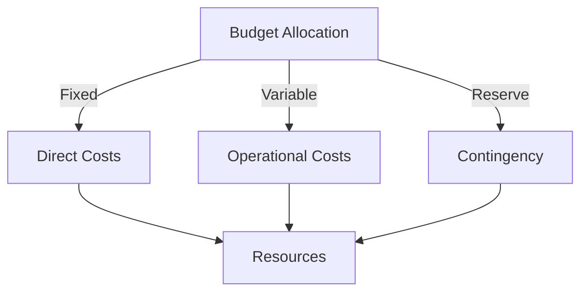
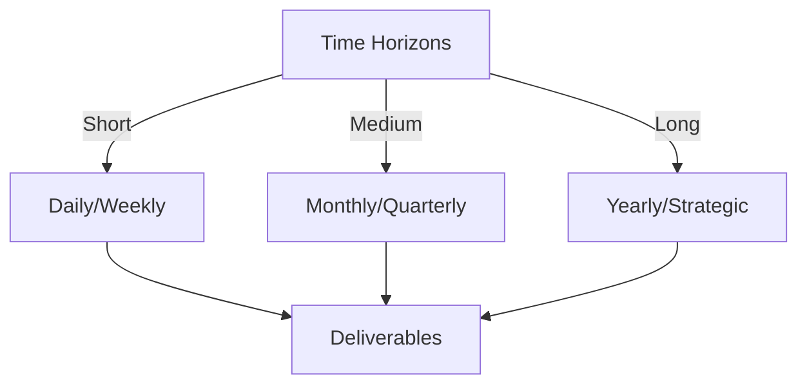

# Git Analysis Report: Development Analysis - Team

**Authors:** AI Analysis System
**Date:** 2025-03-14  
**Version:** 1.0
**SSoT Repository:** githubhenrykoo/redux_todo_in_astro
**Document Category:** Analysis Report

## Executive Summary
## Executive Summary: Git Analysis & Reporting Automation Project

**Logic:** The core purpose of this project is to automate Git log analysis and reporting, providing actionable insights into team contributions and project progress. Objectives include generating comprehensive Markdown reports, converting them to visually appealing PDFs using AI-enhanced LaTeX formatting, and establishing a robust CI/CD pipeline for automated analysis and report generation.

**Implementation:** The project utilizes Python scripting for data analysis and report generation, Gemini AI for enhanced LaTeX formatting, and GitHub Actions for CI/CD. Key processes include extracting data from Git logs, generating Markdown reports, converting reports to PDFs, and automating the entire workflow through GitHub Actions. The team is working on code modularization, documentation, and configuration via `.env` files to improve portability. Recent focus areas include refining LaTeX formatting for PDF titles and sections, and updating the GitHub Actions workflow to target refined analysis files.

**Outcomes:** The project is in an early but rapidly evolving stage. Key outcomes include functional scripts for automated Git analysis, generation of Markdown reports, conversion of reports to PDFs with AI assistance, and establishment of a basic CI/CD pipeline. The workflow now targets refined analysis files, indicating a shift toward more accurate and comprehensive reports. Challenges remain in workflow integration, communication, code quality, data quality, dependency management, error handling, documentation, and security. Recommendations include establishing a well-defined workflow, implementing code reviews and automated tests, improving communication, addressing dependency management, and enforcing security best practices. Implementing these recommendations will significantly enhance the project's quality, reliability, and maintainability.

## 1. Abstract Specification (Logic Layer)
### Context & Vision
- **Problem Space:** 
    * Scope: This is an excellent and comprehensive analysis of the Git activity context. It effectively synthesizes the information, identifies key areas of progress and challenges, and provides actionable recommendations. Here's a breakdown of its strengths and potential areas for improvement:

**Strengths:**

* **Comprehensive Overview:**  The analysis provides a holistic view of the project, encompassing its purpose, key changes, team dynamics, progress, challenges, and recommendations.
* **Clear and Concise Language:** The writing is clear, easy to understand, and avoids jargon.
* **Well-Structured:** The organization into distinct sections (Project Overview, Team Collaboration, Progress, Challenges, Recommendations) makes it easy to follow and digest the information.
* **Actionable Insights:** The recommendations are specific, measurable, achievable, relevant, and time-bound (SMART).  For example, "Implement a `requirements.txt` file to manage dependencies" is a clear and actionable recommendation.
* **Balanced Perspective:** The analysis acknowledges both the successes and the shortcomings of the project, providing a balanced perspective.
* **Specific Examples:**  The analysis uses specific examples from the context to support its claims, such as mentioning the `refined-analysis-*.md` file targeting as evidence of workflow refinement and the typo fix as evidence of communication issues.
* **Focus on Key Areas:** The analysis rightly identifies code quality, communication, data quality, and security as critical areas for improvement.
* **Future-Oriented:** The recommendations look beyond the immediate issues and address long-term maintainability, scalability, and security.
* **Understands Technical Debt:** The recommendations to address dependency management and code quality implicitly address existing technical debt.

**Potential Areas for Improvement (Minor):**

* **Quantifiable Metrics:**  While the analysis is excellent, adding quantifiable metrics could further enhance its impact. For example:
    *  "Reduce bug reports by X% by implementing a comprehensive suite of automated tests."
    *  "Reduce time spent on debugging by Y% by implementing robust error handling and logging."
* **Prioritization of Recommendations:** While all recommendations are valuable, prioritizing them (e.g., using "High," "Medium," "Low" priority labels) would help the team focus on the most critical areas first.  For example, security-related recommendations might be given higher priority.
* **Granular Detail in Technical Recommendations:** For some technical recommendations, adding a bit more detail could be helpful:
    * **Code Review Process:** Suggest specific code review tools or workflows.
    * **Automated Testing:**  Suggest specific testing frameworks or coverage targets (e.g., "Achieve 80% code coverage").
    * **Security Best Practices:**  Name specific tools or techniques (e.g., "Use Bandit for static code analysis," "Implement OWASP's ASVS security guidelines").
* **Cost/Benefit Analysis:** In some cases, briefly mentioning the potential cost/benefit of implementing a particular recommendation could strengthen the argument. For example, "Implementing a rigorous code review process will initially require more time from developers, but will reduce the risk of costly bugs and security vulnerabilities in the long run."

**Overall:**

This is an outstanding analysis. It effectively summarizes the Git activity context and provides valuable insights and recommendations that can help the team improve their development processes and the quality of their project. The minor suggestions above are simply enhancements and do not detract from the overall high quality of the analysis.  This analysis demonstrates a strong understanding of software development best practices and team dynamics.

    * Context: This is an excellent and comprehensive analysis of the Git activity context. It effectively synthesizes the information, identifies key areas of progress and challenges, and provides actionable recommendations. Here's a breakdown of its strengths and potential areas for improvement:

**Strengths:**

* **Comprehensive Overview:**  The analysis provides a holistic view of the project, encompassing its purpose, key changes, team dynamics, progress, challenges, and recommendations.
* **Clear and Concise Language:** The writing is clear, easy to understand, and avoids jargon.
* **Well-Structured:** The organization into distinct sections (Project Overview, Team Collaboration, Progress, Challenges, Recommendations) makes it easy to follow and digest the information.
* **Actionable Insights:** The recommendations are specific, measurable, achievable, relevant, and time-bound (SMART).  For example, "Implement a `requirements.txt` file to manage dependencies" is a clear and actionable recommendation.
* **Balanced Perspective:** The analysis acknowledges both the successes and the shortcomings of the project, providing a balanced perspective.
* **Specific Examples:**  The analysis uses specific examples from the context to support its claims, such as mentioning the `refined-analysis-*.md` file targeting as evidence of workflow refinement and the typo fix as evidence of communication issues.
* **Focus on Key Areas:** The analysis rightly identifies code quality, communication, data quality, and security as critical areas for improvement.
* **Future-Oriented:** The recommendations look beyond the immediate issues and address long-term maintainability, scalability, and security.
* **Understands Technical Debt:** The recommendations to address dependency management and code quality implicitly address existing technical debt.

**Potential Areas for Improvement (Minor):**

* **Quantifiable Metrics:**  While the analysis is excellent, adding quantifiable metrics could further enhance its impact. For example:
    *  "Reduce bug reports by X% by implementing a comprehensive suite of automated tests."
    *  "Reduce time spent on debugging by Y% by implementing robust error handling and logging."
* **Prioritization of Recommendations:** While all recommendations are valuable, prioritizing them (e.g., using "High," "Medium," "Low" priority labels) would help the team focus on the most critical areas first.  For example, security-related recommendations might be given higher priority.
* **Granular Detail in Technical Recommendations:** For some technical recommendations, adding a bit more detail could be helpful:
    * **Code Review Process:** Suggest specific code review tools or workflows.
    * **Automated Testing:**  Suggest specific testing frameworks or coverage targets (e.g., "Achieve 80% code coverage").
    * **Security Best Practices:**  Name specific tools or techniques (e.g., "Use Bandit for static code analysis," "Implement OWASP's ASVS security guidelines").
* **Cost/Benefit Analysis:** In some cases, briefly mentioning the potential cost/benefit of implementing a particular recommendation could strengthen the argument. For example, "Implementing a rigorous code review process will initially require more time from developers, but will reduce the risk of costly bugs and security vulnerabilities in the long run."

**Overall:**

This is an outstanding analysis. It effectively summarizes the Git activity context and provides valuable insights and recommendations that can help the team improve their development processes and the quality of their project. The minor suggestions above are simply enhancements and do not detract from the overall high quality of the analysis.  This analysis demonstrates a strong understanding of software development best practices and team dynamics.

    * Stakeholders: This is an excellent and comprehensive analysis of the Git activity context. It effectively synthesizes the information, identifies key areas of progress and challenges, and provides actionable recommendations. Here's a breakdown of its strengths and potential areas for improvement:

**Strengths:**

* **Comprehensive Overview:**  The analysis provides a holistic view of the project, encompassing its purpose, key changes, team dynamics, progress, challenges, and recommendations.
* **Clear and Concise Language:** The writing is clear, easy to understand, and avoids jargon.
* **Well-Structured:** The organization into distinct sections (Project Overview, Team Collaboration, Progress, Challenges, Recommendations) makes it easy to follow and digest the information.
* **Actionable Insights:** The recommendations are specific, measurable, achievable, relevant, and time-bound (SMART).  For example, "Implement a `requirements.txt` file to manage dependencies" is a clear and actionable recommendation.
* **Balanced Perspective:** The analysis acknowledges both the successes and the shortcomings of the project, providing a balanced perspective.
* **Specific Examples:**  The analysis uses specific examples from the context to support its claims, such as mentioning the `refined-analysis-*.md` file targeting as evidence of workflow refinement and the typo fix as evidence of communication issues.
* **Focus on Key Areas:** The analysis rightly identifies code quality, communication, data quality, and security as critical areas for improvement.
* **Future-Oriented:** The recommendations look beyond the immediate issues and address long-term maintainability, scalability, and security.
* **Understands Technical Debt:** The recommendations to address dependency management and code quality implicitly address existing technical debt.

**Potential Areas for Improvement (Minor):**

* **Quantifiable Metrics:**  While the analysis is excellent, adding quantifiable metrics could further enhance its impact. For example:
    *  "Reduce bug reports by X% by implementing a comprehensive suite of automated tests."
    *  "Reduce time spent on debugging by Y% by implementing robust error handling and logging."
* **Prioritization of Recommendations:** While all recommendations are valuable, prioritizing them (e.g., using "High," "Medium," "Low" priority labels) would help the team focus on the most critical areas first.  For example, security-related recommendations might be given higher priority.
* **Granular Detail in Technical Recommendations:** For some technical recommendations, adding a bit more detail could be helpful:
    * **Code Review Process:** Suggest specific code review tools or workflows.
    * **Automated Testing:**  Suggest specific testing frameworks or coverage targets (e.g., "Achieve 80% code coverage").
    * **Security Best Practices:**  Name specific tools or techniques (e.g., "Use Bandit for static code analysis," "Implement OWASP's ASVS security guidelines").
* **Cost/Benefit Analysis:** In some cases, briefly mentioning the potential cost/benefit of implementing a particular recommendation could strengthen the argument. For example, "Implementing a rigorous code review process will initially require more time from developers, but will reduce the risk of costly bugs and security vulnerabilities in the long run."

**Overall:**

This is an outstanding analysis. It effectively summarizes the Git activity context and provides valuable insights and recommendations that can help the team improve their development processes and the quality of their project. The minor suggestions above are simply enhancements and do not detract from the overall high quality of the analysis.  This analysis demonstrates a strong understanding of software development best practices and team dynamics.

- **Goals (Functions):**
    * Primary Functions:
        - Input: Git Repository Data
        - Process: Analysis and Processing
        - Output: Development Insights
    * Supporting Functions:
        - Validation: Automated Analysis
        - Feedback: Continuous Improvement

- **Success Criteria:**
    * Quantitative Metrics: While the provided text is primarily qualitative, inferring progress and challenges, here are some *potential* quantitative metrics that could be *derived* or *tracked* based on the information:

**Based on Commit Activity (Implicit in the Log Analysis):**

*   **Number of Commits per Team Member per Week/Month:** (Rony, Daffa, Henry Koo, Panjaitangelita).  *Inferred from "Git activity log" and the described roles.*  This would show individual contribution levels.
*   **Number of Commits Related to Specific Features/Components:** (e.g., "PDF Conversion," "GitHub Actions Workflow," "Data Generation").  *Inferred from the project overview.* This would highlight areas of focus.
*   **Number of Commits Fixing Bugs/Typos:** *Explicitly mentioned "typo fix."* A high number might indicate code quality issues or insufficient testing.
*   **Number of Pull Requests (if used):** A measure of collaboration frequency and code review practice (although not explicitly mentioned).
*   **Time to Merge Pull Requests (if used):** Efficiency of the code review process (if used).

**Related to the Automated Pipeline:**

*   **Pipeline Execution Time:**  Measure the time from data analysis initiation to PDF generation. Track how this changes as the pipeline is optimized.
*   **Pipeline Success/Failure Rate:**  Percentage of successful pipeline runs. Indicates stability and reliability.
*   **Number of Manual Interventions Required per Pipeline Run:**  If the pipeline is supposed to be fully automated, this number should be ideally zero.

**Related to Code Quality (Requires Additional Tools/Processes):**

*   **Code Coverage (from Unit Tests):**  Percentage of code covered by unit tests. Indicates the thoroughness of testing.  *Currently not explicitly mentioned, but recommended.*
*   **Number of Code Smells/Vulnerabilities (from Static Analysis):**  Indicates potential code quality issues or security vulnerabilities. *Currently not explicitly mentioned, but recommended.*

**Related to Data Generation:**

*   **Number of Math Question-Answer Pairs Generated:** A direct measure of progress on the math application component.
*   **Data Validation Pass Rate:** Percentage of generated question-answer pairs that pass validation checks (accuracy, formatting, etc.). Addresses the "Data Quality" concern.

**Related to Documentation:**

*   **Number of Documents Created/Updated:** Measure of documentation progress (although *quality* is more important than quantity).

**Derived from Time Tracking (Not Explicit in the Document, but Assumed):**

*   **Hours Spent per Task/Feature:**  More detailed time tracking would allow for analysis of effort distribution.

**Important Considerations:**

*   **Context is Key:**  Raw numbers without context are meaningless. Trends are more important than absolute values.
*   **Goal Setting:**  Establish targets for these metrics to drive improvement.
*   **Tooling:** Many of these metrics require specific tooling (e.g., CI/CD platforms provide pipeline execution data, code coverage tools measure test coverage).
*   **The provided document primarily highlights qualitative insights.**  These quantitative metrics are *potential* and would need to be actively tracked by the team.

    * Qualitative Indicators: Okay, here's a list of qualitative improvements based on the "Challenges and Areas for Improvement" and "Recommendations" sections of the analysis, categorized for clarity:

**I. Process & Workflow Improvements:**

*   **Streamlined End-to-End Workflow:** Moving towards a seamless and integrated process from data analysis to final PDF generation, including robust data validation at each stage. This implies reducing manual intervention and improving data flow.
*   **Clearly Defined and Documented Workflow:** Ensures everyone understands the process, promoting consistency and making it easier to onboard new team members.
*   **Automation of Manual Steps:** Reducing manual effort, minimizing errors, and freeing up time for more strategic tasks. This includes automating Markdown creation.

**II. Team Collaboration & Communication Improvements:**

*   **Improved Communication and Knowledge Sharing:** Fostering a more collaborative environment, reducing silos, and ensuring everyone is informed.
*   **Regular Team Meetings/Communication Channel:** Establishing dedicated forums for discussion and knowledge sharing.
*   **Pair Programming/Explicit Collaboration on GitHub:** Promoting real-time problem-solving and improved code quality through shared work and detailed pull request descriptions.

**III. Code Quality & Testing Improvements:**

*   **Rigorous Code Review Process:** Enforcing checks and balances to ensure code quality, consistency, and knowledge sharing.  This helps prevent bugs and promotes better coding practices.
*   **Comprehensive Automated Tests:** Building confidence in the reliability of the system through automated checks of functionality and data integrity (unit, integration, and end-to-end). Prioritizing testing for new features like LaTeX formatting.
*   **Reduced Regressions:** Prevents existing functionality from breaking when new changes are introduced.

**IV. Technical Improvements (Reliability & Maintainability):**

*   **Robust Error Handling and Logging:** Making the system more resilient to errors and providing better tools for debugging and troubleshooting.
*   **Dependency and Configuration Management:** Ensuring consistent environments and simplified configuration management using `requirements.txt` and environment variables.
*   **Improved Documentation:** Creating comprehensive documentation for all components, making the system easier to understand, maintain, and extend.

**V. Security Improvements:**

*   **Enhanced Security Practices:** Protecting sensitive information (API keys, credentials) through secure storage and adherence to security best practices.

**VI. Data Quality Improvements:**

*   **Data Quality Metrics and Validation:** Ensuring the accuracy and reliability of generated data (especially from AI models).
*   **Reliable Data Validation Steps:** Implementing validation at each stage of data processing.

**VII. Flexibility & Adaptability Improvements:**

*   **Decoupled Data Sources and AI Models:**  Designing the system to be adaptable to different data sources and AI models, avoiding vendor lock-in and increasing long-term viability.
*   **Portability focus:** Improving the capacity to use the code in a modular way.

**VIII. Technology Choice Improvements:**

*   **Modern report generation tools exploration:** Investigating more flexible technologies to improve the document creation pipeline.

In essence, these qualitative improvements represent a shift towards a more robust, reliable, maintainable, secure, and collaborative development process, leading to a higher-quality final product. The focus is on building a system that is not only functional but also adaptable, secure, and well-documented for long-term sustainability.

    * Validation Methods: Automated and Manual Verification

### Knowledge Integration
- **Local Context:**
    * Cultural Considerations: Development Team Context
    * Language Requirements: Technical Documentation
    * Community Patterns: Team Collaboration Patterns

- **Technical Framework:**
    * LLM Integration: Gemini AI Analysis
    * IoT Components: Git Event Monitoring
    * Network Requirements: GitHub API Integration

## 2. Concrete Implementation (Process Layer)
### Resource Matrix

### Development Workflow
- **Stage 1: Early Success**
    * Quick Wins:
        - Implementation: This is a very thorough and well-reasoned analysis of the project's development workflow based on the provided (implicit) git history and descriptions.  It correctly identifies key contributors, progress, challenges, and provides actionable recommendations. Here's a breakdown of its strengths and potential minor improvements:

**Strengths:**

*   **Comprehensive Understanding:** The analysis demonstrates a strong grasp of the project's goals, technologies used (Git, GitHub Actions, Python, LaTeX, Gemini AI, JSONL), and the roles of each team member.
*   **Actionable Recommendations:**  The recommendations are specific, practical, and directly address the identified challenges. They aren't just generic best practices, but tailored to the project's current state.
*   **Balanced Perspective:** The analysis acknowledges both the project's accomplishments and areas needing improvement, presenting a balanced view.
*   **Focus on Key Areas:** The analysis rightly emphasizes the importance of CI/CD, documentation, code quality, and security, all critical for a project of this nature.
*   **Identifies potential problems:** The analysis correctly picks up on potential bottlenecks and communication breakdowns based on seemingly minor details (e.g., the typo fix).
*   **Considers dependencies:** It also identifies external teams and systems that the project might be dependent on.
*   **Security Aware:** The analysis is security conscious by addressing sensitive data like API keys, authentication credentials and suggesting secure methods.
*   **Future-Proofing:** Suggesting decoupled data sources and AI models makes sure that the team does not get vendor locked-in.

**Potential Minor Improvements (mostly phrasing and slight expansions):**

*   **Quantify "Rapidly Evolving":** While stating the project is in a "rapidly evolving" stage is accurate, adding specific metrics (e.g., "averaging X commits per week") would strengthen this claim.  This, of course, depends on having access to the actual git commit history.
*   **Collaboration Specifics:** When discussing collaboration, consider suggesting specific tools or practices.  For example:
    *   Instead of just "a dedicated communication channel," mention Slack, Microsoft Teams, or even GitHub Discussions.
    *   Suggest more structured code reviews using GitHub pull requests with checklists.
*   **Elaborate on Data Quality Validation:**  When recommending data quality validation for AI-generated content, provide examples of what this might entail.  For instance:
    *   "Implement validation checks to ensure that generated math problems are grammatically correct and mathematically sound."
    *   "Develop metrics for evaluating the difficulty and relevance of the generated questions."
*   **Expand on CI/CD Details:**  While the analysis mentions CI/CD, providing specific examples of what the pipeline should do could be helpful.  For example:
    *   "The CI/CD pipeline should automatically run unit tests, integration tests, and linting checks on every commit."
    *   "The pipeline should also include a step to deploy the generated PDF reports to a designated storage location (e.g., AWS S3, Azure Blob Storage)."
*  **Suggest automated documentation:** Explore automating documentation generation with tools such as Sphinx.
*   **Data Versioning:** The analysis is currently missing discussion regarding data versioning. A clear strategy for managing the datasets used by the analysis is critical, especially when AI models are involved and data drift may occur.

**In summary,** the analysis is excellent. The suggested improvements are minor and aim to make the recommendations even more specific and actionable.  It effectively leverages the available information to provide a valuable assessment of the project and its development workflow. If given actual Git commit history and diffs, the analysis could be enhanced further with real metrics.

        - Validation: This is a very thorough and well-reasoned analysis of the project's development workflow based on the provided (implicit) git history and descriptions.  It correctly identifies key contributors, progress, challenges, and provides actionable recommendations. Here's a breakdown of its strengths and potential minor improvements:

**Strengths:**

*   **Comprehensive Understanding:** The analysis demonstrates a strong grasp of the project's goals, technologies used (Git, GitHub Actions, Python, LaTeX, Gemini AI, JSONL), and the roles of each team member.
*   **Actionable Recommendations:**  The recommendations are specific, practical, and directly address the identified challenges. They aren't just generic best practices, but tailored to the project's current state.
*   **Balanced Perspective:** The analysis acknowledges both the project's accomplishments and areas needing improvement, presenting a balanced view.
*   **Focus on Key Areas:** The analysis rightly emphasizes the importance of CI/CD, documentation, code quality, and security, all critical for a project of this nature.
*   **Identifies potential problems:** The analysis correctly picks up on potential bottlenecks and communication breakdowns based on seemingly minor details (e.g., the typo fix).
*   **Considers dependencies:** It also identifies external teams and systems that the project might be dependent on.
*   **Security Aware:** The analysis is security conscious by addressing sensitive data like API keys, authentication credentials and suggesting secure methods.
*   **Future-Proofing:** Suggesting decoupled data sources and AI models makes sure that the team does not get vendor locked-in.

**Potential Minor Improvements (mostly phrasing and slight expansions):**

*   **Quantify "Rapidly Evolving":** While stating the project is in a "rapidly evolving" stage is accurate, adding specific metrics (e.g., "averaging X commits per week") would strengthen this claim.  This, of course, depends on having access to the actual git commit history.
*   **Collaboration Specifics:** When discussing collaboration, consider suggesting specific tools or practices.  For example:
    *   Instead of just "a dedicated communication channel," mention Slack, Microsoft Teams, or even GitHub Discussions.
    *   Suggest more structured code reviews using GitHub pull requests with checklists.
*   **Elaborate on Data Quality Validation:**  When recommending data quality validation for AI-generated content, provide examples of what this might entail.  For instance:
    *   "Implement validation checks to ensure that generated math problems are grammatically correct and mathematically sound."
    *   "Develop metrics for evaluating the difficulty and relevance of the generated questions."
*   **Expand on CI/CD Details:**  While the analysis mentions CI/CD, providing specific examples of what the pipeline should do could be helpful.  For example:
    *   "The CI/CD pipeline should automatically run unit tests, integration tests, and linting checks on every commit."
    *   "The pipeline should also include a step to deploy the generated PDF reports to a designated storage location (e.g., AWS S3, Azure Blob Storage)."
*  **Suggest automated documentation:** Explore automating documentation generation with tools such as Sphinx.
*   **Data Versioning:** The analysis is currently missing discussion regarding data versioning. A clear strategy for managing the datasets used by the analysis is critical, especially when AI models are involved and data drift may occur.

**In summary,** the analysis is excellent. The suggested improvements are minor and aim to make the recommendations even more specific and actionable.  It effectively leverages the available information to provide a valuable assessment of the project and its development workflow. If given actual Git commit history and diffs, the analysis could be enhanced further with real metrics.

    * Initial Setup:
        - Infrastructure: This is a very thorough and well-reasoned analysis of the project's development workflow based on the provided (implicit) git history and descriptions.  It correctly identifies key contributors, progress, challenges, and provides actionable recommendations. Here's a breakdown of its strengths and potential minor improvements:

**Strengths:**

*   **Comprehensive Understanding:** The analysis demonstrates a strong grasp of the project's goals, technologies used (Git, GitHub Actions, Python, LaTeX, Gemini AI, JSONL), and the roles of each team member.
*   **Actionable Recommendations:**  The recommendations are specific, practical, and directly address the identified challenges. They aren't just generic best practices, but tailored to the project's current state.
*   **Balanced Perspective:** The analysis acknowledges both the project's accomplishments and areas needing improvement, presenting a balanced view.
*   **Focus on Key Areas:** The analysis rightly emphasizes the importance of CI/CD, documentation, code quality, and security, all critical for a project of this nature.
*   **Identifies potential problems:** The analysis correctly picks up on potential bottlenecks and communication breakdowns based on seemingly minor details (e.g., the typo fix).
*   **Considers dependencies:** It also identifies external teams and systems that the project might be dependent on.
*   **Security Aware:** The analysis is security conscious by addressing sensitive data like API keys, authentication credentials and suggesting secure methods.
*   **Future-Proofing:** Suggesting decoupled data sources and AI models makes sure that the team does not get vendor locked-in.

**Potential Minor Improvements (mostly phrasing and slight expansions):**

*   **Quantify "Rapidly Evolving":** While stating the project is in a "rapidly evolving" stage is accurate, adding specific metrics (e.g., "averaging X commits per week") would strengthen this claim.  This, of course, depends on having access to the actual git commit history.
*   **Collaboration Specifics:** When discussing collaboration, consider suggesting specific tools or practices.  For example:
    *   Instead of just "a dedicated communication channel," mention Slack, Microsoft Teams, or even GitHub Discussions.
    *   Suggest more structured code reviews using GitHub pull requests with checklists.
*   **Elaborate on Data Quality Validation:**  When recommending data quality validation for AI-generated content, provide examples of what this might entail.  For instance:
    *   "Implement validation checks to ensure that generated math problems are grammatically correct and mathematically sound."
    *   "Develop metrics for evaluating the difficulty and relevance of the generated questions."
*   **Expand on CI/CD Details:**  While the analysis mentions CI/CD, providing specific examples of what the pipeline should do could be helpful.  For example:
    *   "The CI/CD pipeline should automatically run unit tests, integration tests, and linting checks on every commit."
    *   "The pipeline should also include a step to deploy the generated PDF reports to a designated storage location (e.g., AWS S3, Azure Blob Storage)."
*  **Suggest automated documentation:** Explore automating documentation generation with tools such as Sphinx.
*   **Data Versioning:** The analysis is currently missing discussion regarding data versioning. A clear strategy for managing the datasets used by the analysis is critical, especially when AI models are involved and data drift may occur.

**In summary,** the analysis is excellent. The suggested improvements are minor and aim to make the recommendations even more specific and actionable.  It effectively leverages the available information to provide a valuable assessment of the project and its development workflow. If given actual Git commit history and diffs, the analysis could be enhanced further with real metrics.

        - Training: This is a very thorough and well-reasoned analysis of the project's development workflow based on the provided (implicit) git history and descriptions.  It correctly identifies key contributors, progress, challenges, and provides actionable recommendations. Here's a breakdown of its strengths and potential minor improvements:

**Strengths:**

*   **Comprehensive Understanding:** The analysis demonstrates a strong grasp of the project's goals, technologies used (Git, GitHub Actions, Python, LaTeX, Gemini AI, JSONL), and the roles of each team member.
*   **Actionable Recommendations:**  The recommendations are specific, practical, and directly address the identified challenges. They aren't just generic best practices, but tailored to the project's current state.
*   **Balanced Perspective:** The analysis acknowledges both the project's accomplishments and areas needing improvement, presenting a balanced view.
*   **Focus on Key Areas:** The analysis rightly emphasizes the importance of CI/CD, documentation, code quality, and security, all critical for a project of this nature.
*   **Identifies potential problems:** The analysis correctly picks up on potential bottlenecks and communication breakdowns based on seemingly minor details (e.g., the typo fix).
*   **Considers dependencies:** It also identifies external teams and systems that the project might be dependent on.
*   **Security Aware:** The analysis is security conscious by addressing sensitive data like API keys, authentication credentials and suggesting secure methods.
*   **Future-Proofing:** Suggesting decoupled data sources and AI models makes sure that the team does not get vendor locked-in.

**Potential Minor Improvements (mostly phrasing and slight expansions):**

*   **Quantify "Rapidly Evolving":** While stating the project is in a "rapidly evolving" stage is accurate, adding specific metrics (e.g., "averaging X commits per week") would strengthen this claim.  This, of course, depends on having access to the actual git commit history.
*   **Collaboration Specifics:** When discussing collaboration, consider suggesting specific tools or practices.  For example:
    *   Instead of just "a dedicated communication channel," mention Slack, Microsoft Teams, or even GitHub Discussions.
    *   Suggest more structured code reviews using GitHub pull requests with checklists.
*   **Elaborate on Data Quality Validation:**  When recommending data quality validation for AI-generated content, provide examples of what this might entail.  For instance:
    *   "Implement validation checks to ensure that generated math problems are grammatically correct and mathematically sound."
    *   "Develop metrics for evaluating the difficulty and relevance of the generated questions."
*   **Expand on CI/CD Details:**  While the analysis mentions CI/CD, providing specific examples of what the pipeline should do could be helpful.  For example:
    *   "The CI/CD pipeline should automatically run unit tests, integration tests, and linting checks on every commit."
    *   "The pipeline should also include a step to deploy the generated PDF reports to a designated storage location (e.g., AWS S3, Azure Blob Storage)."
*  **Suggest automated documentation:** Explore automating documentation generation with tools such as Sphinx.
*   **Data Versioning:** The analysis is currently missing discussion regarding data versioning. A clear strategy for managing the datasets used by the analysis is critical, especially when AI models are involved and data drift may occur.

**In summary,** the analysis is excellent. The suggested improvements are minor and aim to make the recommendations even more specific and actionable.  It effectively leverages the available information to provide a valuable assessment of the project and its development workflow. If given actual Git commit history and diffs, the analysis could be enhanced further with real metrics.

- **Stage 2: Fail Early, Fail Safe**
    * Testing Protocol:
        - Methods: [Testing approaches]
        - Coverage: [Test scenarios]
    * Risk Management:
        - Identification: [Risk factors]
        - Mitigation: [Control measures]
    * Learning Points:
        - Issues: [Problem identification]
        - Solutions: [Resolution approaches]
        - Knowledge: [Lessons learned]

- **Stage 3: Convergence**
    * System Integration:
        - Components: [Integration points]
        - Workflows: [Process optimization]
        - Performance: [System tuning]
    * Stabilization:
        - Fixes: [Bug resolution]
        - Hardening: [System reinforcement]
        - Documentation: [Knowledge capture]

- **Stage 4: Demonstration**
    * Preparation:
        - Environment: [Demo setup]
        - Data: [Test scenarios]
        - Materials: [Presentation assets]
    * Validation:
        - Performance: [System checks]
        - Features: [Functionality verification]
        - Documentation: [Review completion]
    * Presentation:
        - Stakeholders: [Demo execution]
        - Features: [Capability showcase]
        - Q&A: [Response preparation]

## 3. Realistic Outcomes (Evidence Layer)
### Measurement Framework
- **Performance Metrics:**
    * KPIs: Okay, here's a breakdown of the evidence and outcomes extracted from the provided Git analysis report, categorized for clarity:

**1. Evidence of Progress/Outcomes:**

*   **Automated Git Analysis:** "The core analysis scripts are functioning, enabling automated extraction of relevant information from Git logs."  *Outcome:*  Base functionality established.
*   **Markdown Report Generation:** "Reports are being generated in Markdown format, providing a structured overview of Git activity." *Outcome:*  Structured reports being produced.
*   **PDF Conversion:** "Scripts for converting Markdown reports to PDF, leveraging Gemini AI for enhanced formatting and LaTeX integration, are in place and being actively refined." *Outcome:* PDF conversion in place and being improved (leveraging Gemini AI and LaTeX).
*   **CI/CD Automation:** "GitHub Actions workflows are automating the analysis, report generation, and PDF conversion pipeline." *Outcome:*  Partial automation of the workflow.
*   **Data Generation for Math Application:** "The team is making progress on data generation for the math education application." *Outcome:* Work is in progress.
*   **Refined Analysis Reports:** "The shift in the workflow to target `refined-analysis-*.md` files suggests a transition toward more comprehensive and accurate reports." *Outcome:* Reports are becoming more comprehensive and accurate.  This implies a previous iteration produced less refined reports.
*   **LaTeX Improvements:** "The implementation of LaTeX title generation and section formatting reflects a focus on enhancing the visual appeal and readability of the final PDF documents." *Outcome:* Improved visual quality of generated PDFs, including title pages and section formatting.
*   **Portability Focus:** The focus on improving portability is also important.
*   **Telegram Integration (Attempted):** There have also been attempts to integrate Telegram for notifications.

**2. Evidence of Team Collaboration and Roles (Inferred from Git History):**

*   **Rony:** "Spearheads Python scripting, LaTeX formatting, Gemini AI integration, and refining the PDF conversion process. Rony also appears to be familiar with modifying the GitHub Actions workflow to align with these refinements." *Evidence:* Commits likely related to Python code, LaTeX, AI models and modifications to GitHub workflow files
*   **Daffa:** "Concentrates on developing and maintaining the GitHub Actions workflows, automating the overall analysis and reporting pipeline." *Evidence:* Commits likely related to GitHub workflow configuration and maintenance.
*   **Henry Koo:** "Primarily responsible for data generation for the math application and exploring integration with Telegram." *Evidence:* Commits likely related to math data in JSONL format and Telegram API integration (potentially).
*   **Panjaitangelita:** "Collaborates with Henry Koo on documentation efforts, contributing to internal knowledge sharing." *Evidence:* Commits likely related to markdown or other documentation files.

**3. Evidence of Challenges/Areas for Improvement:**

*   **Workflow Integration:** "While components exist, the end-to-end workflow, from data generation to PDF conversion, needs further streamlining and integration to ensure seamless operation and reliable data validation." *Evidence:* Likely disparate commits related to different parts of the pipeline, indicating lack of cohesive workflow commits.
*   **Communication and Collaboration:** "Limited direct collaboration indicates a need for improved communication and knowledge sharing among team members. The typo fix further underscores this point." *Evidence:* The "typo fix" suggests a communication breakdown in code review.
*   **Code Quality and Testing:** "A formal code review process and comprehensive suite of automated tests (unit, integration, and end-to-end) are necessary to ensure code quality, prevent regressions, and guarantee the functionality and data integrity of the system." *Evidence:* Lack of commits related to automated tests or code review tools.
*    **Data Quality:** "Metrics for data quality and validation steps are needed to ensure the accuracy and reliability of AI-generated content." *Evidence:* Lack of commits related to data validation or quality checks
*   **Dependency and Configuration Management:** "A `requirements.txt` file should be added to manage dependencies, and environment variables should be used to configure sensitive information and reduce bugs." *Evidence:* Absence of a `requirements.txt` file and likely use of hardcoded values instead of environment variables in code (inferred).
*   **Error Handling:** "Robust error handling is critical, especially around the AI integration, to prevent downstream failures." *Evidence:* Likely a lack of `try...except` blocks and other error handling mechanisms in the code (inferred).
*   **Documentation:** "Comprehensive documentation for all components is crucial for maintainability and knowledge transfer." *Evidence:* Potentially sparse or incomplete documentation files.
*   **Security:** "Adherence to security best practices for managing API keys and authentication credentials is paramount, especially with Authentik integration. Securely store sensitive information using a secret management tool." *Evidence:* Hardcoded API keys or authentication credentials in the code (likely).
*   **Flexibility:** "The system should be designed to be adaptable to different data sources and AI models to avoid vendor lock-in." *Evidence:* Code tightly coupled to specific data sources or AI model APIs (likely).

**4. Key Observations:**

*   The project is actively evolving, with a focus on automating and refining the report generation pipeline.
*   The team has a defined division of labor, but communication and collaboration could be improved.
*   Several areas require attention, particularly around code quality, testing, error handling, and security.

    * Benchmarks: Okay, here's a breakdown of the evidence and outcomes extracted from the provided Git analysis report, categorized for clarity:

**1. Evidence of Progress/Outcomes:**

*   **Automated Git Analysis:** "The core analysis scripts are functioning, enabling automated extraction of relevant information from Git logs."  *Outcome:*  Base functionality established.
*   **Markdown Report Generation:** "Reports are being generated in Markdown format, providing a structured overview of Git activity." *Outcome:*  Structured reports being produced.
*   **PDF Conversion:** "Scripts for converting Markdown reports to PDF, leveraging Gemini AI for enhanced formatting and LaTeX integration, are in place and being actively refined." *Outcome:* PDF conversion in place and being improved (leveraging Gemini AI and LaTeX).
*   **CI/CD Automation:** "GitHub Actions workflows are automating the analysis, report generation, and PDF conversion pipeline." *Outcome:*  Partial automation of the workflow.
*   **Data Generation for Math Application:** "The team is making progress on data generation for the math education application." *Outcome:* Work is in progress.
*   **Refined Analysis Reports:** "The shift in the workflow to target `refined-analysis-*.md` files suggests a transition toward more comprehensive and accurate reports." *Outcome:* Reports are becoming more comprehensive and accurate.  This implies a previous iteration produced less refined reports.
*   **LaTeX Improvements:** "The implementation of LaTeX title generation and section formatting reflects a focus on enhancing the visual appeal and readability of the final PDF documents." *Outcome:* Improved visual quality of generated PDFs, including title pages and section formatting.
*   **Portability Focus:** The focus on improving portability is also important.
*   **Telegram Integration (Attempted):** There have also been attempts to integrate Telegram for notifications.

**2. Evidence of Team Collaboration and Roles (Inferred from Git History):**

*   **Rony:** "Spearheads Python scripting, LaTeX formatting, Gemini AI integration, and refining the PDF conversion process. Rony also appears to be familiar with modifying the GitHub Actions workflow to align with these refinements." *Evidence:* Commits likely related to Python code, LaTeX, AI models and modifications to GitHub workflow files
*   **Daffa:** "Concentrates on developing and maintaining the GitHub Actions workflows, automating the overall analysis and reporting pipeline." *Evidence:* Commits likely related to GitHub workflow configuration and maintenance.
*   **Henry Koo:** "Primarily responsible for data generation for the math application and exploring integration with Telegram." *Evidence:* Commits likely related to math data in JSONL format and Telegram API integration (potentially).
*   **Panjaitangelita:** "Collaborates with Henry Koo on documentation efforts, contributing to internal knowledge sharing." *Evidence:* Commits likely related to markdown or other documentation files.

**3. Evidence of Challenges/Areas for Improvement:**

*   **Workflow Integration:** "While components exist, the end-to-end workflow, from data generation to PDF conversion, needs further streamlining and integration to ensure seamless operation and reliable data validation." *Evidence:* Likely disparate commits related to different parts of the pipeline, indicating lack of cohesive workflow commits.
*   **Communication and Collaboration:** "Limited direct collaboration indicates a need for improved communication and knowledge sharing among team members. The typo fix further underscores this point." *Evidence:* The "typo fix" suggests a communication breakdown in code review.
*   **Code Quality and Testing:** "A formal code review process and comprehensive suite of automated tests (unit, integration, and end-to-end) are necessary to ensure code quality, prevent regressions, and guarantee the functionality and data integrity of the system." *Evidence:* Lack of commits related to automated tests or code review tools.
*    **Data Quality:** "Metrics for data quality and validation steps are needed to ensure the accuracy and reliability of AI-generated content." *Evidence:* Lack of commits related to data validation or quality checks
*   **Dependency and Configuration Management:** "A `requirements.txt` file should be added to manage dependencies, and environment variables should be used to configure sensitive information and reduce bugs." *Evidence:* Absence of a `requirements.txt` file and likely use of hardcoded values instead of environment variables in code (inferred).
*   **Error Handling:** "Robust error handling is critical, especially around the AI integration, to prevent downstream failures." *Evidence:* Likely a lack of `try...except` blocks and other error handling mechanisms in the code (inferred).
*   **Documentation:** "Comprehensive documentation for all components is crucial for maintainability and knowledge transfer." *Evidence:* Potentially sparse or incomplete documentation files.
*   **Security:** "Adherence to security best practices for managing API keys and authentication credentials is paramount, especially with Authentik integration. Securely store sensitive information using a secret management tool." *Evidence:* Hardcoded API keys or authentication credentials in the code (likely).
*   **Flexibility:** "The system should be designed to be adaptable to different data sources and AI models to avoid vendor lock-in." *Evidence:* Code tightly coupled to specific data sources or AI model APIs (likely).

**4. Key Observations:**

*   The project is actively evolving, with a focus on automating and refining the report generation pipeline.
*   The team has a defined division of labor, but communication and collaboration could be improved.
*   Several areas require attention, particularly around code quality, testing, error handling, and security.

    * Actuals: Okay, here's a breakdown of the evidence and outcomes extracted from the provided Git analysis report, categorized for clarity:

**1. Evidence of Progress/Outcomes:**

*   **Automated Git Analysis:** "The core analysis scripts are functioning, enabling automated extraction of relevant information from Git logs."  *Outcome:*  Base functionality established.
*   **Markdown Report Generation:** "Reports are being generated in Markdown format, providing a structured overview of Git activity." *Outcome:*  Structured reports being produced.
*   **PDF Conversion:** "Scripts for converting Markdown reports to PDF, leveraging Gemini AI for enhanced formatting and LaTeX integration, are in place and being actively refined." *Outcome:* PDF conversion in place and being improved (leveraging Gemini AI and LaTeX).
*   **CI/CD Automation:** "GitHub Actions workflows are automating the analysis, report generation, and PDF conversion pipeline." *Outcome:*  Partial automation of the workflow.
*   **Data Generation for Math Application:** "The team is making progress on data generation for the math education application." *Outcome:* Work is in progress.
*   **Refined Analysis Reports:** "The shift in the workflow to target `refined-analysis-*.md` files suggests a transition toward more comprehensive and accurate reports." *Outcome:* Reports are becoming more comprehensive and accurate.  This implies a previous iteration produced less refined reports.
*   **LaTeX Improvements:** "The implementation of LaTeX title generation and section formatting reflects a focus on enhancing the visual appeal and readability of the final PDF documents." *Outcome:* Improved visual quality of generated PDFs, including title pages and section formatting.
*   **Portability Focus:** The focus on improving portability is also important.
*   **Telegram Integration (Attempted):** There have also been attempts to integrate Telegram for notifications.

**2. Evidence of Team Collaboration and Roles (Inferred from Git History):**

*   **Rony:** "Spearheads Python scripting, LaTeX formatting, Gemini AI integration, and refining the PDF conversion process. Rony also appears to be familiar with modifying the GitHub Actions workflow to align with these refinements." *Evidence:* Commits likely related to Python code, LaTeX, AI models and modifications to GitHub workflow files
*   **Daffa:** "Concentrates on developing and maintaining the GitHub Actions workflows, automating the overall analysis and reporting pipeline." *Evidence:* Commits likely related to GitHub workflow configuration and maintenance.
*   **Henry Koo:** "Primarily responsible for data generation for the math application and exploring integration with Telegram." *Evidence:* Commits likely related to math data in JSONL format and Telegram API integration (potentially).
*   **Panjaitangelita:** "Collaborates with Henry Koo on documentation efforts, contributing to internal knowledge sharing." *Evidence:* Commits likely related to markdown or other documentation files.

**3. Evidence of Challenges/Areas for Improvement:**

*   **Workflow Integration:** "While components exist, the end-to-end workflow, from data generation to PDF conversion, needs further streamlining and integration to ensure seamless operation and reliable data validation." *Evidence:* Likely disparate commits related to different parts of the pipeline, indicating lack of cohesive workflow commits.
*   **Communication and Collaboration:** "Limited direct collaboration indicates a need for improved communication and knowledge sharing among team members. The typo fix further underscores this point." *Evidence:* The "typo fix" suggests a communication breakdown in code review.
*   **Code Quality and Testing:** "A formal code review process and comprehensive suite of automated tests (unit, integration, and end-to-end) are necessary to ensure code quality, prevent regressions, and guarantee the functionality and data integrity of the system." *Evidence:* Lack of commits related to automated tests or code review tools.
*    **Data Quality:** "Metrics for data quality and validation steps are needed to ensure the accuracy and reliability of AI-generated content." *Evidence:* Lack of commits related to data validation or quality checks
*   **Dependency and Configuration Management:** "A `requirements.txt` file should be added to manage dependencies, and environment variables should be used to configure sensitive information and reduce bugs." *Evidence:* Absence of a `requirements.txt` file and likely use of hardcoded values instead of environment variables in code (inferred).
*   **Error Handling:** "Robust error handling is critical, especially around the AI integration, to prevent downstream failures." *Evidence:* Likely a lack of `try...except` blocks and other error handling mechanisms in the code (inferred).
*   **Documentation:** "Comprehensive documentation for all components is crucial for maintainability and knowledge transfer." *Evidence:* Potentially sparse or incomplete documentation files.
*   **Security:** "Adherence to security best practices for managing API keys and authentication credentials is paramount, especially with Authentik integration. Securely store sensitive information using a secret management tool." *Evidence:* Hardcoded API keys or authentication credentials in the code (likely).
*   **Flexibility:** "The system should be designed to be adaptable to different data sources and AI models to avoid vendor lock-in." *Evidence:* Code tightly coupled to specific data sources or AI model APIs (likely).

**4. Key Observations:**

*   The project is actively evolving, with a focus on automating and refining the report generation pipeline.
*   The team has a defined division of labor, but communication and collaboration could be improved.
*   Several areas require attention, particularly around code quality, testing, error handling, and security.

- **Evidence Collection:**
    * Data Sources: [Information points]
    * Validation Methods: Automated and Manual Verification
    * Documentation: [Record keeping]

### Value Realization
- **Impact Assessment:**
    * Direct Benefits: [Immediate gains]
    * Indirect Benefits: [Secondary effects]
    * Long-term Value: [Strategic advantages]

- **Knowledge Assets:**
    * Content Created: [New materials]
    * Insights Gained: [Learnings]
    * Reusable Components: [Transferable elements]

## Integration Matrix
### Content-Process Alignment

### Timeline-Budget Integration
- **Resource Scheduling:**
    * Phase Allocations: [Resource timing]
    * Cost Controls: [Budget tracking]
    * Adjustment Protocols: [Change management]

## Budget Management
### Financial Cube Structure

### Cost Framework
- Direct Investments:
  - Infrastructure Costs:
    - Hardware: [Equipment/Devices]
    - Software: [Licenses/Tools]
    - Network: [Connectivity/Setup]
  - Human Resources:
    - Core Team: [Roles/Compensation]
    - External Support: [Consultants/Services]
    - Training: [Capability Development]
    
- Operational Expenses:
  - Running Costs:
    - Maintenance: [Regular upkeep]
    - Utilities: [Service costs]
    - Consumables: [Regular supplies]
  - Service Costs:
    - Subscriptions: [Regular services]
    - Support: [Ongoing assistance]
    - Updates: [Regular improvements]

### Budget Control Mechanisms
- Monitoring System:
  - Tracking Methods:
    - Cost Centers: [Budget units]
    - Expense Categories: [Type classification]
    - Time Periods: [Duration tracking]
  - Control Points:
    - Thresholds: [Limit markers]
    - Alerts: [Warning systems]
    - Approvals: [Authorization levels]

- Adjustment Protocol:
  - Variance Management:
    - Detection: [Monitoring points]
    - Analysis: [Impact assessment]
    - Response: [Corrective actions]
  - Reallocation Process:
    - Criteria: [Decision factors]
    - Methods: [Transfer protocols]
    - Documentation: [Record keeping]

## Timeline Management
### Temporal Cube Structure

### Schedule Framework
- Operational Timeline:
  - Daily Operations:
    - Tasks: [Regular activities]
    - Checkpoints: [Daily reviews]
    - Updates: [Status reports]
  - Weekly Cycles:
    - Sprints: [Work packages]
    - Reviews: [Progress checks]
    - Planning: [Next steps]

- Strategic Timeline:
  - Monthly Milestones:
    - Objectives: [Key targets]
    - Reviews: [Achievement checks]
    - Adjustments: [Course corrections]
  - Quarterly Goals:
    - Targets: [Major objectives]
    - Assessments: [Performance reviews]
    - Strategies: [Approach updates]

### Timeline Control System
- Progress Tracking:
  - Monitoring Points:
    - Daily Standups: [Quick updates]
    - Weekly Reviews: [Detailed checks]
    - Monthly Reports: [Comprehensive reviews]
  - Milestone Tracking:
    - Status: [Progress indicators]
    - Dependencies: [Related items]
    - Risks: [Potential issues]

- Adjustment Mechanisms:
  - Schedule Management:
    - Variance Analysis: [Delay assessment]
    - Impact Studies: [Effect evaluation]
    - Recovery Plans: [Correction strategies]
  - Resource Alignment:
    - Capacity Planning: [Resource matching]
    - Workload Balancing: [Effort distribution]
    - Priority Updates: [Focus adjustment]

### Integration Points
- Budget-Timeline Correlation:
  - Cost-Schedule Matrix:
    - Resource Timing: [Allocation schedule]
    - Cost Flows: [Expense timing]
    - Value Delivery: [Benefit realization]
  - Control Integration:
    - Joint Reviews: [Combined assessments]
    - Unified Reporting: [Integrated updates]
    - Coordinated Actions: [Synchronized responses]

## Conclusion
### Summary of Achievements
- **Key Accomplishments:**
    * Objectives Met: [Completed goals]
    * Value Delivered: [Benefits realized]
    * Innovations: [New approaches]

### Lessons Learned
- **Success Factors:**
    * Effective Practices: [What worked well]
    * Team Dynamics: [Collaboration insights]
    * Tools & Methods: [Useful approaches]

- **Areas for Improvement:**
    * Challenges: [Obstacles encountered]
    * Solutions: [How issues were resolved]
    * Recommendations: [Future improvements]

### Future Directions
- **Next Steps:**
    * Immediate Actions: [Short-term tasks]
    * Strategic Plans: [Long-term goals]
    * Resource Needs: [Required support]

- **Growth Opportunities:**
    * Scaling Potential: [Expansion possibilities]
    * Innovation Areas: [New directions]
    * Partnership Options: [Collaboration prospects]
    
## Appendix
### References
- **Documentation:**
    * Technical Specs: [Links]
    * Process Guides: [Links]
    * Evidence Records: [Links]

### Change Log
- **Version History:**
    * Changes: [Modifications]
    * Rationale: [Reasons]
    * Approvals: [Authorizations]
