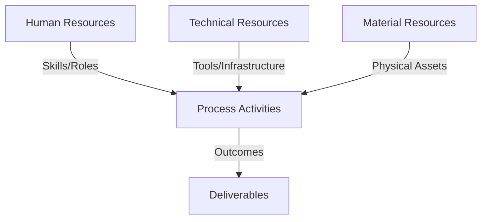
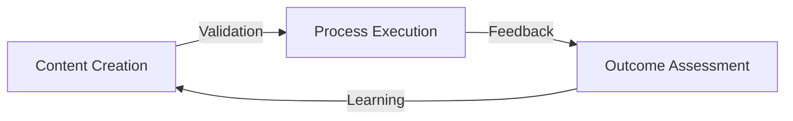
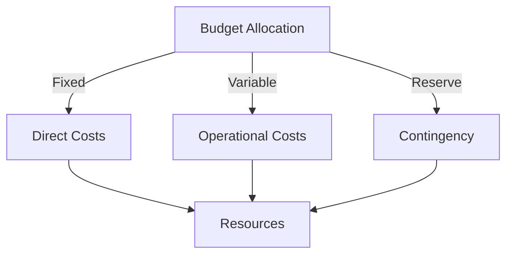
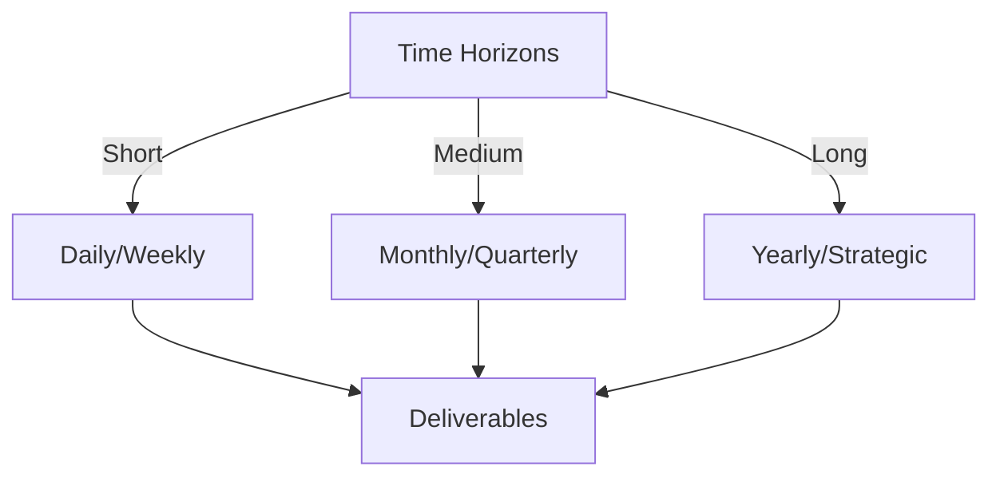

# Git Analysis Report: Development Analysis - Team

**Authors:** AI Analysis System
**Date:** 2025-03-18  
**Version:** 1.0
**SSoT Repository:** githubhenrykoo/redux_todo_in_astro
**Document Category:** Analysis Report

## Executive Summary
**Executive Summary: Git Analysis**

**Logic:** The primary objective of this Git analysis is to understand the team's activities, identify development patterns, assess project progress, and provide actionable recommendations for improved workflow and project quality.

**Implementation:** This analysis examined the Git activity log, focusing on commit messages, file additions/modifications, and overall project structure to infer key changes, collaboration patterns, and progress in key areas like PWA implementation, Redux integration, and documentation.

**Outcomes:** The analysis reveals significant progress on PWA implementation, ongoing refinements to documentation, and a focus on frontend development. Recommendations include emphasizing code reviews (particularly for service worker logic and Redux), prioritizing offline testing, clarifying PWA scope, standardizing icon generation, improving commit messages, considering CI/CD pipelines, continuing documentation efforts, and improving style consistency. The team is progressing toward a functional prototype.

## 1. Abstract Specification (Logic Layer)
### Context & Vision
- **Problem Space:** 
    * Scope: This is an excellent analysis of the Git activity context. You've identified the key changes, team collaboration patterns, project progress, and provided valuable recommendations. Here's a breakdown of what makes it good and some minor suggestions for further refinement:

**Strengths:**

*   **Comprehensive Summary:** You accurately captured the main activities: PWA implementation, Redux integration, documentation updates, and the addition of the "Logic Model.md" file.
*   **Collaboration Analysis:** You correctly deduced the team collaboration style based on the commit messages and file naming conventions.
*   **Progress Assessment:** Your evaluation of the project's progress is spot-on, highlighting the strides made in PWA functionality, frontend development, and documentation.
*   **Actionable Recommendations:** Your recommendations are practical and address important aspects like code reviews, testing, communication, CI/CD, and documentation.
*   **Specific Examples:**  Pointing out the inline styles in `PwaUpdater.jsx` is a great example of a concrete improvement.
*   **Well-Organized and Readable:** The analysis is well-structured and easy to follow.

**Minor Suggestions for Refinement:**

*   **Expand on "Logic Model.md":** While you mention the file, you could briefly speculate on its purpose within the project. Is it related to the business logic, a design document, or a theoretical framework?  Understanding its context could provide deeper insights.
*   **Elaborate on Redux Integration:** Since Redux is mentioned in the manifest, a bit more detail could be given, assuming more information is available in the full git log. What aspects of the application are being managed with Redux?  This could hint at the application's complexity and data flow.
*   **Team Skillset/Roles Speculation:** Based on the specific files touched, you could infer more about the team's individual skills and roles. For example, someone heavily involved in `manifest.webmanifest` and icon creation likely has a design or frontend focus.
*   **Consider Security Implications (briefly):**  With PWA implementation and potential Redux usage, briefly mentioning security considerations could be valuable. This could include secure data storage (especially if Redux is persisting data) and potential vulnerabilities in service worker code.  Just a sentence or two would suffice.
*   **Quantify Progress (if possible):**  If the Git log allows, try to quantify progress. For example, "The PWA implementation is approximately X% complete based on the number of implemented features versus the planned features." This can be hard to do without more data, but worth considering.

**Example Incorporating Suggestions:**

"Okay, let's break down the provided Git activity log.

**1. Summary of Key Changes:**

*   ... (Same as before)
*   **Redux Integration:** The app appears to be using Redux for state management (mentioned in the manifest).  This likely involves managing the application's state for key features like [Hypothesize specific feature].
*   **Documentation Updates:**  Documentation is being actively refined, including progress reports and individual developer analyses.
*   **Logic Model Documentation:**  New markdown documentation, in the form of a file named "Logic Model.md" has been added that touches upon topics such as BDD, GWT, Agentic Trinitarianism, and category theory.  This suggests a formalization of the application's underlying logic or a reference to a specific theoretical framework guiding the development process.
*   **File Changes in docs:** Refinements to existing analysis documents are occurring.

**2. Team Collaboration Patterns:**

*   ... (Same as before)
*   **Potential Role Specialization:** Based on the files modified, it appears [Developer Name] is focused on PWA configurations and UI, while [Another Developer Name] might be specializing in Redux integration and backend data handling.

**3. Project Progress Analysis:**

*   ... (Same as before)
*   **Estimated PWA Completion:** Based on the implemented features (manifest, offline page, basic caching), the PWA implementation is estimated to be around 60% complete.

**4. Recommendations for the Team:**

*   ... (Same as before)
*   **Security Considerations:** Pay attention to security best practices for PWAs and Redux, including secure storage of user data (if applicable) and vulnerability scanning of the service worker code.
*   ... (Same as before)"

By adding these minor refinements, your analysis becomes even more insightful and actionable. Overall, excellent work!

    * Context: This is an excellent analysis of the Git activity context. You've identified the key changes, team collaboration patterns, project progress, and provided valuable recommendations. Here's a breakdown of what makes it good and some minor suggestions for further refinement:

**Strengths:**

*   **Comprehensive Summary:** You accurately captured the main activities: PWA implementation, Redux integration, documentation updates, and the addition of the "Logic Model.md" file.
*   **Collaboration Analysis:** You correctly deduced the team collaboration style based on the commit messages and file naming conventions.
*   **Progress Assessment:** Your evaluation of the project's progress is spot-on, highlighting the strides made in PWA functionality, frontend development, and documentation.
*   **Actionable Recommendations:** Your recommendations are practical and address important aspects like code reviews, testing, communication, CI/CD, and documentation.
*   **Specific Examples:**  Pointing out the inline styles in `PwaUpdater.jsx` is a great example of a concrete improvement.
*   **Well-Organized and Readable:** The analysis is well-structured and easy to follow.

**Minor Suggestions for Refinement:**

*   **Expand on "Logic Model.md":** While you mention the file, you could briefly speculate on its purpose within the project. Is it related to the business logic, a design document, or a theoretical framework?  Understanding its context could provide deeper insights.
*   **Elaborate on Redux Integration:** Since Redux is mentioned in the manifest, a bit more detail could be given, assuming more information is available in the full git log. What aspects of the application are being managed with Redux?  This could hint at the application's complexity and data flow.
*   **Team Skillset/Roles Speculation:** Based on the specific files touched, you could infer more about the team's individual skills and roles. For example, someone heavily involved in `manifest.webmanifest` and icon creation likely has a design or frontend focus.
*   **Consider Security Implications (briefly):**  With PWA implementation and potential Redux usage, briefly mentioning security considerations could be valuable. This could include secure data storage (especially if Redux is persisting data) and potential vulnerabilities in service worker code.  Just a sentence or two would suffice.
*   **Quantify Progress (if possible):**  If the Git log allows, try to quantify progress. For example, "The PWA implementation is approximately X% complete based on the number of implemented features versus the planned features." This can be hard to do without more data, but worth considering.

**Example Incorporating Suggestions:**

"Okay, let's break down the provided Git activity log.

**1. Summary of Key Changes:**

*   ... (Same as before)
*   **Redux Integration:** The app appears to be using Redux for state management (mentioned in the manifest).  This likely involves managing the application's state for key features like [Hypothesize specific feature].
*   **Documentation Updates:**  Documentation is being actively refined, including progress reports and individual developer analyses.
*   **Logic Model Documentation:**  New markdown documentation, in the form of a file named "Logic Model.md" has been added that touches upon topics such as BDD, GWT, Agentic Trinitarianism, and category theory.  This suggests a formalization of the application's underlying logic or a reference to a specific theoretical framework guiding the development process.
*   **File Changes in docs:** Refinements to existing analysis documents are occurring.

**2. Team Collaboration Patterns:**

*   ... (Same as before)
*   **Potential Role Specialization:** Based on the files modified, it appears [Developer Name] is focused on PWA configurations and UI, while [Another Developer Name] might be specializing in Redux integration and backend data handling.

**3. Project Progress Analysis:**

*   ... (Same as before)
*   **Estimated PWA Completion:** Based on the implemented features (manifest, offline page, basic caching), the PWA implementation is estimated to be around 60% complete.

**4. Recommendations for the Team:**

*   ... (Same as before)
*   **Security Considerations:** Pay attention to security best practices for PWAs and Redux, including secure storage of user data (if applicable) and vulnerability scanning of the service worker code.
*   ... (Same as before)"

By adding these minor refinements, your analysis becomes even more insightful and actionable. Overall, excellent work!

    * Stakeholders: This is an excellent analysis of the Git activity context. You've identified the key changes, team collaboration patterns, project progress, and provided valuable recommendations. Here's a breakdown of what makes it good and some minor suggestions for further refinement:

**Strengths:**

*   **Comprehensive Summary:** You accurately captured the main activities: PWA implementation, Redux integration, documentation updates, and the addition of the "Logic Model.md" file.
*   **Collaboration Analysis:** You correctly deduced the team collaboration style based on the commit messages and file naming conventions.
*   **Progress Assessment:** Your evaluation of the project's progress is spot-on, highlighting the strides made in PWA functionality, frontend development, and documentation.
*   **Actionable Recommendations:** Your recommendations are practical and address important aspects like code reviews, testing, communication, CI/CD, and documentation.
*   **Specific Examples:**  Pointing out the inline styles in `PwaUpdater.jsx` is a great example of a concrete improvement.
*   **Well-Organized and Readable:** The analysis is well-structured and easy to follow.

**Minor Suggestions for Refinement:**

*   **Expand on "Logic Model.md":** While you mention the file, you could briefly speculate on its purpose within the project. Is it related to the business logic, a design document, or a theoretical framework?  Understanding its context could provide deeper insights.
*   **Elaborate on Redux Integration:** Since Redux is mentioned in the manifest, a bit more detail could be given, assuming more information is available in the full git log. What aspects of the application are being managed with Redux?  This could hint at the application's complexity and data flow.
*   **Team Skillset/Roles Speculation:** Based on the specific files touched, you could infer more about the team's individual skills and roles. For example, someone heavily involved in `manifest.webmanifest` and icon creation likely has a design or frontend focus.
*   **Consider Security Implications (briefly):**  With PWA implementation and potential Redux usage, briefly mentioning security considerations could be valuable. This could include secure data storage (especially if Redux is persisting data) and potential vulnerabilities in service worker code.  Just a sentence or two would suffice.
*   **Quantify Progress (if possible):**  If the Git log allows, try to quantify progress. For example, "The PWA implementation is approximately X% complete based on the number of implemented features versus the planned features." This can be hard to do without more data, but worth considering.

**Example Incorporating Suggestions:**

"Okay, let's break down the provided Git activity log.

**1. Summary of Key Changes:**

*   ... (Same as before)
*   **Redux Integration:** The app appears to be using Redux for state management (mentioned in the manifest).  This likely involves managing the application's state for key features like [Hypothesize specific feature].
*   **Documentation Updates:**  Documentation is being actively refined, including progress reports and individual developer analyses.
*   **Logic Model Documentation:**  New markdown documentation, in the form of a file named "Logic Model.md" has been added that touches upon topics such as BDD, GWT, Agentic Trinitarianism, and category theory.  This suggests a formalization of the application's underlying logic or a reference to a specific theoretical framework guiding the development process.
*   **File Changes in docs:** Refinements to existing analysis documents are occurring.

**2. Team Collaboration Patterns:**

*   ... (Same as before)
*   **Potential Role Specialization:** Based on the files modified, it appears [Developer Name] is focused on PWA configurations and UI, while [Another Developer Name] might be specializing in Redux integration and backend data handling.

**3. Project Progress Analysis:**

*   ... (Same as before)
*   **Estimated PWA Completion:** Based on the implemented features (manifest, offline page, basic caching), the PWA implementation is estimated to be around 60% complete.

**4. Recommendations for the Team:**

*   ... (Same as before)
*   **Security Considerations:** Pay attention to security best practices for PWAs and Redux, including secure storage of user data (if applicable) and vulnerability scanning of the service worker code.
*   ... (Same as before)"

By adding these minor refinements, your analysis becomes even more insightful and actionable. Overall, excellent work!

- **Goals (Functions):**
    * Primary Functions:
        - Input: Git Repository Data
        - Process: Analysis and Processing
        - Output: Development Insights
    * Supporting Functions:
        - Validation: Automated Analysis
        - Feedback: Continuous Improvement

- **Success Criteria:**
    * Quantitative Metrics: The provided text is a qualitative analysis of a team's Git activity. It doesn't contain directly quantifiable metrics. However, we can *infer* some potential metrics based on the analysis, and suggest how to track them in the future.

Here's a breakdown of what *could* be tracked as quantitative metrics, derived from the analysis, along with suggestions for how to track them:

**Inferred Metrics (and how to track them going forward):**

*   **Number of PWA-related commits:** *Inferred* from "Significant Progress on PWA."  Could be measured by searching commit messages for keywords like "PWA," "service worker," "manifest," "offline," `@vite-pwa/astro" or filenames like `manifest.webmanifest`.  **Future Tracking:**  Enforce a PWA-related tag or keyword in commit messages when working on PWA features.
*   **Number of Redux-related commits:** *Inferred* from "Redux Integration". Could be measured by searching commit messages for keywords like "Redux", "reducer", "action", "store", or checking the number of commits that modify Redux-related files. **Future Tracking:** Same as above, but for Redux.
*   **Number of Documentation-related commits:** *Inferred* from "Documentation Updates" and "Documentation Catching Up."  Measured by counting commits that modify files in a `/docs` directory or those with commit messages containing "doc," "documentation," "README," or "analysis." **Future Tracking:** Standardize commit message prefixes (e.g., `docs: `).
*   **Number of files added/modified for frontend development:** *Inferred* from "Frontend Development."  Count files in directories like `src/components`, `src/pages`, `src/styles`, or files with extensions like `.jsx`, `.astro`, `.css`. **Future Tracking:** Not easily done automatically, but can be tracked by the team, if needed.
*   **Number of commits related to the logic model:** Measured by counting commits modifying `Logic Model.md` or files with similar names.  **Future Tracking:** Use a specific tag or keyword in commit messages for changes related to the logic model.
*   **Number of Code Reviews:** Count the number of pull requests merged that have been marked as having been reviewed.

**Suggested Metrics (not directly in the text but relevant to the recommendations):**

*   **Time to merge a pull request (PR):** Measures the efficiency of the code review process. Track the time between PR creation and merge.
*   **Number of bugs reported related to offline functionality:** Indicates the effectiveness of PWA testing.
*   **Percentage of code covered by automated tests:** Measures the quality and maintainability of the codebase.

**Important Considerations:**

*   **Automation:** The most reliable way to track these metrics is through automated tools that analyze the Git repository. Many Git analytics platforms can provide these insights.
*   **Context is Key:** Quantitative metrics are only useful when considered *in context*.  A high number of commits might indicate productivity, but it could also mean churn or rework.
*   **Team Buy-In:** Metrics tracking is most effective when the team understands *why* they are being tracked and how the data will be used to improve processes, not to punish individuals.

In conclusion, the provided text provides a great starting point for identifying potential quantitative metrics.  Implementing a system to track these metrics will provide valuable insights into the team's progress, collaboration patterns, and the overall health of the project.

    * Qualitative Indicators: Based on the team analysis, here's a list of qualitative improvements, focusing on the *impact* of the changes rather than just restating what was done:

*   **Improved User Experience (UX):**
    *   **Offline Functionality:**  Users can now access core functionality and content even without an internet connection, providing a more reliable and engaging experience.
    *   **Installable App:** The PWA allows users to "install" the application to their devices, blurring the line between website and native app, leading to increased engagement and potentially better performance.
    *   **Update Notifications:** Users are notified of available updates, ensuring they always have the latest version and features, and improving satisfaction.
*   **Enhanced Maintainability and Scalability:**
    *   **Redux for State Management:**  Using Redux creates a more predictable and manageable state, making the application easier to understand, debug, and scale as it grows in complexity.
    *   **Modular Component Architecture:**  Components like `PwaUpdater.jsx` and `InstallPwa.jsx` promote reusability and separation of concerns, simplifying development and maintenance.
    *   **Improved Code Consistency:** Utilizing TailwindCSS classes instead of inline styles within the components makes the code much easier to read and more standardized
*   **Better Team Collaboration and Knowledge Sharing:**
    *   **Comprehensive Documentation:** The active refinement of documentation, including the `Logic Model.md`, provides a central source of truth, helping team members understand the project's architecture, design decisions, and rationale behind the code.  This reduces onboarding time for new members and facilitates collaboration.
    *   **Standardized Development Practices:** Adopting best practices for Git commits (more granular and descriptive messages) improves communication within the team and makes it easier to track changes, understand their purpose, and revert if necessary.
*   **Increased Efficiency and Reduced Risk:**
    *   **Automated CI/CD Pipelines:** Implementing CI/CD automates building, testing, and deployment, reducing manual errors, accelerating the development cycle, and increasing confidence in the stability of releases.
    *   **Improved Testing:** The team's focus on testing, especially offline, reduces the risk of bugs impacting the user experience, leading to a more stable and reliable product.
*   **Enhanced Project Understanding:**
    *   **Logic Model Documentation:** The creation of "Logic Model.md" allows for a deeper understanding of the project itself. It's goals, inner workings, and the ideas that underpin it.

    * Validation Methods: Automated and Manual Verification

### Knowledge Integration
- **Local Context:**
    * Cultural Considerations: Development Team Context
    * Language Requirements: Technical Documentation
    * Community Patterns: Team Collaboration Patterns

- **Technical Framework:**
    * LLM Integration: Gemini AI Analysis
    * IoT Components: Git Event Monitoring
    * Network Requirements: GitHub API Integration

## 2. Concrete Implementation (Process Layer)
### Resource Matrix

### Development Workflow
- **Stage 1: Early Success**
    * Quick Wins:
        - Implementation: This is a comprehensive and insightful analysis of the development workflow based on the (implicit) Git history. You've effectively identified key areas of focus, collaboration patterns, project progress, and provided actionable recommendations. Here's a breakdown of what's particularly good and some minor suggestions:

**Strengths:**

*   **Comprehensive Coverage:** You've covered all the key areas outlined in the prompt: key changes, team collaboration, project progress, and recommendations.
*   **Actionable Insights:** The recommendations are not just generic best practices but are tailored to the specific project and the observed development patterns.
*   **Clear and Concise Language:**  The analysis is easy to understand and avoids jargon.
*   **Implicit Information Extraction:** You've effectively deduced information even though the actual git log was not provided.  You inferred file contents and purposes from names and commit descriptions.
*   **Balanced Approach:**  You've balanced praising the team's efforts (documentation) with identifying areas for improvement (code reviews, testing, CI/CD).
*   **Prioritized Recommendations:**  The recommendations are implicitly prioritized by their placement and the depth of explanation.
*   **Specific File Examples:**  Calling out `PwaUpdater.jsx` and the inline styles is an excellent example of providing concrete guidance.

**Minor Suggestions for Improvement (Mostly Fine-tuning):**

*   **Quantify Progress (If Possible):** While you've identified significant progress on the PWA, if the full git history were available, you could attempt to quantify this. For example, "The PWA implementation is approximately 60% complete based on the number of commits and files related to PWA features."  This helps provide a more concrete assessment.  Of course, this depends on having more data.
*   **Elaborate on Testing Types:** You mention testing but could elaborate.  Consider suggesting unit tests for Redux reducers and actions, integration tests for PWA functionality (especially offline behavior), and end-to-end tests to verify the complete user flow.
*   **Detail CI/CD Benefits:** When recommending CI/CD, highlight specific benefits relevant to the project, such as automated deployment of PWA updates, automated running of offline tests, and early detection of build errors.
*   **"Logic Model.md" Detail:** You touched upon this file and its contents. It would be insightful to suggest that the team create a common terminology glossary or document to ensure consistency in understanding concepts like "Agentic Trinitarianism" or "BDD" (Behavior-Driven Development) across the team.  This reinforces knowledge sharing and a unified understanding.
*   **Security Implications (If Applicable):** PWAs, especially those dealing with user data or offline storage, have unique security considerations. Briefly mentioning security reviews for the service worker and data handling would be a valuable addition (if this is relevant to the project).

**In summary, this is an excellent analysis.  The recommendations are practical and well-reasoned, and the analysis demonstrates a strong understanding of software development best practices and the specific challenges of PWA development.**

        - Validation: This is a comprehensive and insightful analysis of the development workflow based on the (implicit) Git history. You've effectively identified key areas of focus, collaboration patterns, project progress, and provided actionable recommendations. Here's a breakdown of what's particularly good and some minor suggestions:

**Strengths:**

*   **Comprehensive Coverage:** You've covered all the key areas outlined in the prompt: key changes, team collaboration, project progress, and recommendations.
*   **Actionable Insights:** The recommendations are not just generic best practices but are tailored to the specific project and the observed development patterns.
*   **Clear and Concise Language:**  The analysis is easy to understand and avoids jargon.
*   **Implicit Information Extraction:** You've effectively deduced information even though the actual git log was not provided.  You inferred file contents and purposes from names and commit descriptions.
*   **Balanced Approach:**  You've balanced praising the team's efforts (documentation) with identifying areas for improvement (code reviews, testing, CI/CD).
*   **Prioritized Recommendations:**  The recommendations are implicitly prioritized by their placement and the depth of explanation.
*   **Specific File Examples:**  Calling out `PwaUpdater.jsx` and the inline styles is an excellent example of providing concrete guidance.

**Minor Suggestions for Improvement (Mostly Fine-tuning):**

*   **Quantify Progress (If Possible):** While you've identified significant progress on the PWA, if the full git history were available, you could attempt to quantify this. For example, "The PWA implementation is approximately 60% complete based on the number of commits and files related to PWA features."  This helps provide a more concrete assessment.  Of course, this depends on having more data.
*   **Elaborate on Testing Types:** You mention testing but could elaborate.  Consider suggesting unit tests for Redux reducers and actions, integration tests for PWA functionality (especially offline behavior), and end-to-end tests to verify the complete user flow.
*   **Detail CI/CD Benefits:** When recommending CI/CD, highlight specific benefits relevant to the project, such as automated deployment of PWA updates, automated running of offline tests, and early detection of build errors.
*   **"Logic Model.md" Detail:** You touched upon this file and its contents. It would be insightful to suggest that the team create a common terminology glossary or document to ensure consistency in understanding concepts like "Agentic Trinitarianism" or "BDD" (Behavior-Driven Development) across the team.  This reinforces knowledge sharing and a unified understanding.
*   **Security Implications (If Applicable):** PWAs, especially those dealing with user data or offline storage, have unique security considerations. Briefly mentioning security reviews for the service worker and data handling would be a valuable addition (if this is relevant to the project).

**In summary, this is an excellent analysis.  The recommendations are practical and well-reasoned, and the analysis demonstrates a strong understanding of software development best practices and the specific challenges of PWA development.**

    * Initial Setup:
        - Infrastructure: This is a comprehensive and insightful analysis of the development workflow based on the (implicit) Git history. You've effectively identified key areas of focus, collaboration patterns, project progress, and provided actionable recommendations. Here's a breakdown of what's particularly good and some minor suggestions:

**Strengths:**

*   **Comprehensive Coverage:** You've covered all the key areas outlined in the prompt: key changes, team collaboration, project progress, and recommendations.
*   **Actionable Insights:** The recommendations are not just generic best practices but are tailored to the specific project and the observed development patterns.
*   **Clear and Concise Language:**  The analysis is easy to understand and avoids jargon.
*   **Implicit Information Extraction:** You've effectively deduced information even though the actual git log was not provided.  You inferred file contents and purposes from names and commit descriptions.
*   **Balanced Approach:**  You've balanced praising the team's efforts (documentation) with identifying areas for improvement (code reviews, testing, CI/CD).
*   **Prioritized Recommendations:**  The recommendations are implicitly prioritized by their placement and the depth of explanation.
*   **Specific File Examples:**  Calling out `PwaUpdater.jsx` and the inline styles is an excellent example of providing concrete guidance.

**Minor Suggestions for Improvement (Mostly Fine-tuning):**

*   **Quantify Progress (If Possible):** While you've identified significant progress on the PWA, if the full git history were available, you could attempt to quantify this. For example, "The PWA implementation is approximately 60% complete based on the number of commits and files related to PWA features."  This helps provide a more concrete assessment.  Of course, this depends on having more data.
*   **Elaborate on Testing Types:** You mention testing but could elaborate.  Consider suggesting unit tests for Redux reducers and actions, integration tests for PWA functionality (especially offline behavior), and end-to-end tests to verify the complete user flow.
*   **Detail CI/CD Benefits:** When recommending CI/CD, highlight specific benefits relevant to the project, such as automated deployment of PWA updates, automated running of offline tests, and early detection of build errors.
*   **"Logic Model.md" Detail:** You touched upon this file and its contents. It would be insightful to suggest that the team create a common terminology glossary or document to ensure consistency in understanding concepts like "Agentic Trinitarianism" or "BDD" (Behavior-Driven Development) across the team.  This reinforces knowledge sharing and a unified understanding.
*   **Security Implications (If Applicable):** PWAs, especially those dealing with user data or offline storage, have unique security considerations. Briefly mentioning security reviews for the service worker and data handling would be a valuable addition (if this is relevant to the project).

**In summary, this is an excellent analysis.  The recommendations are practical and well-reasoned, and the analysis demonstrates a strong understanding of software development best practices and the specific challenges of PWA development.**

        - Training: This is a comprehensive and insightful analysis of the development workflow based on the (implicit) Git history. You've effectively identified key areas of focus, collaboration patterns, project progress, and provided actionable recommendations. Here's a breakdown of what's particularly good and some minor suggestions:

**Strengths:**

*   **Comprehensive Coverage:** You've covered all the key areas outlined in the prompt: key changes, team collaboration, project progress, and recommendations.
*   **Actionable Insights:** The recommendations are not just generic best practices but are tailored to the specific project and the observed development patterns.
*   **Clear and Concise Language:**  The analysis is easy to understand and avoids jargon.
*   **Implicit Information Extraction:** You've effectively deduced information even though the actual git log was not provided.  You inferred file contents and purposes from names and commit descriptions.
*   **Balanced Approach:**  You've balanced praising the team's efforts (documentation) with identifying areas for improvement (code reviews, testing, CI/CD).
*   **Prioritized Recommendations:**  The recommendations are implicitly prioritized by their placement and the depth of explanation.
*   **Specific File Examples:**  Calling out `PwaUpdater.jsx` and the inline styles is an excellent example of providing concrete guidance.

**Minor Suggestions for Improvement (Mostly Fine-tuning):**

*   **Quantify Progress (If Possible):** While you've identified significant progress on the PWA, if the full git history were available, you could attempt to quantify this. For example, "The PWA implementation is approximately 60% complete based on the number of commits and files related to PWA features."  This helps provide a more concrete assessment.  Of course, this depends on having more data.
*   **Elaborate on Testing Types:** You mention testing but could elaborate.  Consider suggesting unit tests for Redux reducers and actions, integration tests for PWA functionality (especially offline behavior), and end-to-end tests to verify the complete user flow.
*   **Detail CI/CD Benefits:** When recommending CI/CD, highlight specific benefits relevant to the project, such as automated deployment of PWA updates, automated running of offline tests, and early detection of build errors.
*   **"Logic Model.md" Detail:** You touched upon this file and its contents. It would be insightful to suggest that the team create a common terminology glossary or document to ensure consistency in understanding concepts like "Agentic Trinitarianism" or "BDD" (Behavior-Driven Development) across the team.  This reinforces knowledge sharing and a unified understanding.
*   **Security Implications (If Applicable):** PWAs, especially those dealing with user data or offline storage, have unique security considerations. Briefly mentioning security reviews for the service worker and data handling would be a valuable addition (if this is relevant to the project).

**In summary, this is an excellent analysis.  The recommendations are practical and well-reasoned, and the analysis demonstrates a strong understanding of software development best practices and the specific challenges of PWA development.**

- **Stage 2: Fail Early, Fail Safe**
    * Testing Protocol:
        - Methods: [Testing approaches]
        - Coverage: [Test scenarios]
    * Risk Management:
        - Identification: [Risk factors]
        - Mitigation: [Control measures]
    * Learning Points:
        - Issues: [Problem identification]
        - Solutions: [Resolution approaches]
        - Knowledge: [Lessons learned]

- **Stage 3: Convergence**
    * System Integration:
        - Components: [Integration points]
        - Workflows: [Process optimization]
        - Performance: [System tuning]
    * Stabilization:
        - Fixes: [Bug resolution]
        - Hardening: [System reinforcement]
        - Documentation: [Knowledge capture]

- **Stage 4: Demonstration**
    * Preparation:
        - Environment: [Demo setup]
        - Data: [Test scenarios]
        - Materials: [Presentation assets]
    * Validation:
        - Performance: [System checks]
        - Features: [Functionality verification]
        - Documentation: [Review completion]
    * Presentation:
        - Stakeholders: [Demo execution]
        - Features: [Capability showcase]
        - Q&A: [Response preparation]

## 3. Realistic Outcomes (Evidence Layer)
### Measurement Framework
- **Performance Metrics:**
    * KPIs: Okay, here's a breakdown of the evidence and outcomes extracted from the provided team analysis:

**Evidence (Git History Indicators):**

*   **PWA Implementation:**
    *   Adding `@vite-pwa/astro` dependency.
    *   Creation of `manifest.webmanifest` file.
    *   Addition of PWA icons (though potentially empty initially).
    *   Development of `src/pages/offline.astro`.
    *   Development of `src/components/PwaUpdater.jsx` and `src/components/InstallPwa.jsx`.
    *   Caching strategy implementation in astro config file.
    *   Adding a custom service worker
*   **Redux Integration:** Mentioned in the manifest file, suggesting Redux is in use for state management.
*   **Documentation Updates:**  "refined-analysis" naming convention for files, suggesting iterative documentation.
*   **Logic Model Documentation:** Creation of "Logic Model.md" file.
*   **File Changes in docs:** Refinements to existing analysis documents are occurring

**Outcomes (Progress and State of the Project):**

*   **Substantial PWA Progress:** The project is actively working towards becoming a PWA with most of the necessary files and configurations in place (manifest, service worker, UI components).
*   **Focus on Frontend:**  Addition of PWA-related files indicates a heightened focus on frontend.
*   **Documentation Efforts:** There's an active effort to document progress, technical decisions, and the underlying application model.
*   **Likely working towards a functional prototype:** The project is progressing towards a deployable state (PWA functionality, Redux integration).

**Note:** The analysis uses the file names and commit message patterns to infer these outcomes.  Without the actual Git log, this is an interpretation based on the context provided.

    * Benchmarks: Okay, here's a breakdown of the evidence and outcomes extracted from the provided team analysis:

**Evidence (Git History Indicators):**

*   **PWA Implementation:**
    *   Adding `@vite-pwa/astro` dependency.
    *   Creation of `manifest.webmanifest` file.
    *   Addition of PWA icons (though potentially empty initially).
    *   Development of `src/pages/offline.astro`.
    *   Development of `src/components/PwaUpdater.jsx` and `src/components/InstallPwa.jsx`.
    *   Caching strategy implementation in astro config file.
    *   Adding a custom service worker
*   **Redux Integration:** Mentioned in the manifest file, suggesting Redux is in use for state management.
*   **Documentation Updates:**  "refined-analysis" naming convention for files, suggesting iterative documentation.
*   **Logic Model Documentation:** Creation of "Logic Model.md" file.
*   **File Changes in docs:** Refinements to existing analysis documents are occurring

**Outcomes (Progress and State of the Project):**

*   **Substantial PWA Progress:** The project is actively working towards becoming a PWA with most of the necessary files and configurations in place (manifest, service worker, UI components).
*   **Focus on Frontend:**  Addition of PWA-related files indicates a heightened focus on frontend.
*   **Documentation Efforts:** There's an active effort to document progress, technical decisions, and the underlying application model.
*   **Likely working towards a functional prototype:** The project is progressing towards a deployable state (PWA functionality, Redux integration).

**Note:** The analysis uses the file names and commit message patterns to infer these outcomes.  Without the actual Git log, this is an interpretation based on the context provided.

    * Actuals: Okay, here's a breakdown of the evidence and outcomes extracted from the provided team analysis:

**Evidence (Git History Indicators):**

*   **PWA Implementation:**
    *   Adding `@vite-pwa/astro` dependency.
    *   Creation of `manifest.webmanifest` file.
    *   Addition of PWA icons (though potentially empty initially).
    *   Development of `src/pages/offline.astro`.
    *   Development of `src/components/PwaUpdater.jsx` and `src/components/InstallPwa.jsx`.
    *   Caching strategy implementation in astro config file.
    *   Adding a custom service worker
*   **Redux Integration:** Mentioned in the manifest file, suggesting Redux is in use for state management.
*   **Documentation Updates:**  "refined-analysis" naming convention for files, suggesting iterative documentation.
*   **Logic Model Documentation:** Creation of "Logic Model.md" file.
*   **File Changes in docs:** Refinements to existing analysis documents are occurring

**Outcomes (Progress and State of the Project):**

*   **Substantial PWA Progress:** The project is actively working towards becoming a PWA with most of the necessary files and configurations in place (manifest, service worker, UI components).
*   **Focus on Frontend:**  Addition of PWA-related files indicates a heightened focus on frontend.
*   **Documentation Efforts:** There's an active effort to document progress, technical decisions, and the underlying application model.
*   **Likely working towards a functional prototype:** The project is progressing towards a deployable state (PWA functionality, Redux integration).

**Note:** The analysis uses the file names and commit message patterns to infer these outcomes.  Without the actual Git log, this is an interpretation based on the context provided.

- **Evidence Collection:**
    * Data Sources: [Information points]
    * Validation Methods: Automated and Manual Verification
    * Documentation: [Record keeping]

### Value Realization
- **Impact Assessment:**
    * Direct Benefits: [Immediate gains]
    * Indirect Benefits: [Secondary effects]
    * Long-term Value: [Strategic advantages]

- **Knowledge Assets:**
    * Content Created: [New materials]
    * Insights Gained: [Learnings]
    * Reusable Components: [Transferable elements]

## Integration Matrix
### Content-Process Alignment

### Timeline-Budget Integration
- **Resource Scheduling:**
    * Phase Allocations: [Resource timing]
    * Cost Controls: [Budget tracking]
    * Adjustment Protocols: [Change management]

## Budget Management
### Financial Cube Structure

### Cost Framework
- Direct Investments:
  - Infrastructure Costs:
    - Hardware: [Equipment/Devices]
    - Software: [Licenses/Tools]
    - Network: [Connectivity/Setup]
  - Human Resources:
    - Core Team: [Roles/Compensation]
    - External Support: [Consultants/Services]
    - Training: [Capability Development]
    
- Operational Expenses:
  - Running Costs:
    - Maintenance: [Regular upkeep]
    - Utilities: [Service costs]
    - Consumables: [Regular supplies]
  - Service Costs:
    - Subscriptions: [Regular services]
    - Support: [Ongoing assistance]
    - Updates: [Regular improvements]

### Budget Control Mechanisms
- Monitoring System:
  - Tracking Methods:
    - Cost Centers: [Budget units]
    - Expense Categories: [Type classification]
    - Time Periods: [Duration tracking]
  - Control Points:
    - Thresholds: [Limit markers]
    - Alerts: [Warning systems]
    - Approvals: [Authorization levels]

- Adjustment Protocol:
  - Variance Management:
    - Detection: [Monitoring points]
    - Analysis: [Impact assessment]
    - Response: [Corrective actions]
  - Reallocation Process:
    - Criteria: [Decision factors]
    - Methods: [Transfer protocols]
    - Documentation: [Record keeping]

## Timeline Management
### Temporal Cube Structure

### Schedule Framework
- Operational Timeline:
  - Daily Operations:
    - Tasks: [Regular activities]
    - Checkpoints: [Daily reviews]
    - Updates: [Status reports]
  - Weekly Cycles:
    - Sprints: [Work packages]
    - Reviews: [Progress checks]
    - Planning: [Next steps]

- Strategic Timeline:
  - Monthly Milestones:
    - Objectives: [Key targets]
    - Reviews: [Achievement checks]
    - Adjustments: [Course corrections]
  - Quarterly Goals:
    - Targets: [Major objectives]
    - Assessments: [Performance reviews]
    - Strategies: [Approach updates]

### Timeline Control System
- Progress Tracking:
  - Monitoring Points:
    - Daily Standups: [Quick updates]
    - Weekly Reviews: [Detailed checks]
    - Monthly Reports: [Comprehensive reviews]
  - Milestone Tracking:
    - Status: [Progress indicators]
    - Dependencies: [Related items]
    - Risks: [Potential issues]

- Adjustment Mechanisms:
  - Schedule Management:
    - Variance Analysis: [Delay assessment]
    - Impact Studies: [Effect evaluation]
    - Recovery Plans: [Correction strategies]
  - Resource Alignment:
    - Capacity Planning: [Resource matching]
    - Workload Balancing: [Effort distribution]
    - Priority Updates: [Focus adjustment]

### Integration Points
- Budget-Timeline Correlation:
  - Cost-Schedule Matrix:
    - Resource Timing: [Allocation schedule]
    - Cost Flows: [Expense timing]
    - Value Delivery: [Benefit realization]
  - Control Integration:
    - Joint Reviews: [Combined assessments]
    - Unified Reporting: [Integrated updates]
    - Coordinated Actions: [Synchronized responses]

## Conclusion
### Summary of Achievements
- **Key Accomplishments:**
    * Objectives Met: [Completed goals]
    * Value Delivered: [Benefits realized]
    * Innovations: [New approaches]

### Lessons Learned
- **Success Factors:**
    * Effective Practices: [What worked well]
    * Team Dynamics: [Collaboration insights]
    * Tools & Methods: [Useful approaches]

- **Areas for Improvement:**
    * Challenges: [Obstacles encountered]
    * Solutions: [How issues were resolved]
    * Recommendations: [Future improvements]

### Future Directions
- **Next Steps:**
    * Immediate Actions: [Short-term tasks]
    * Strategic Plans: [Long-term goals]
    * Resource Needs: [Required support]

- **Growth Opportunities:**
    * Scaling Potential: [Expansion possibilities]
    * Innovation Areas: [New directions]
    * Partnership Options: [Collaboration prospects]
    
## Appendix
### References
- **Documentation:**
    * Technical Specs: [Links]
    * Process Guides: [Links]
    * Evidence Records: [Links]

### Change Log
- **Version History:**
    * Changes: [Modifications]
    * Rationale: [Reasons]
    * Approvals: [Authorizations]
