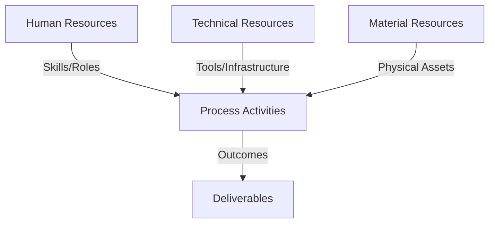
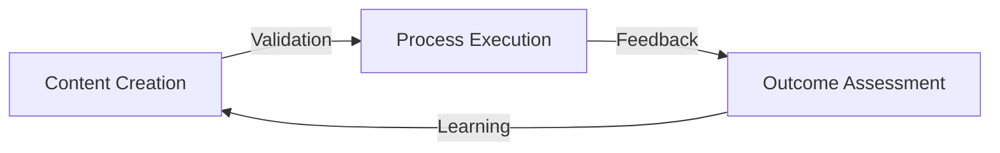
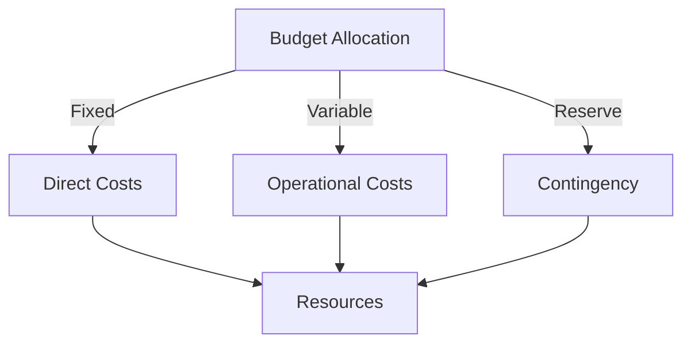
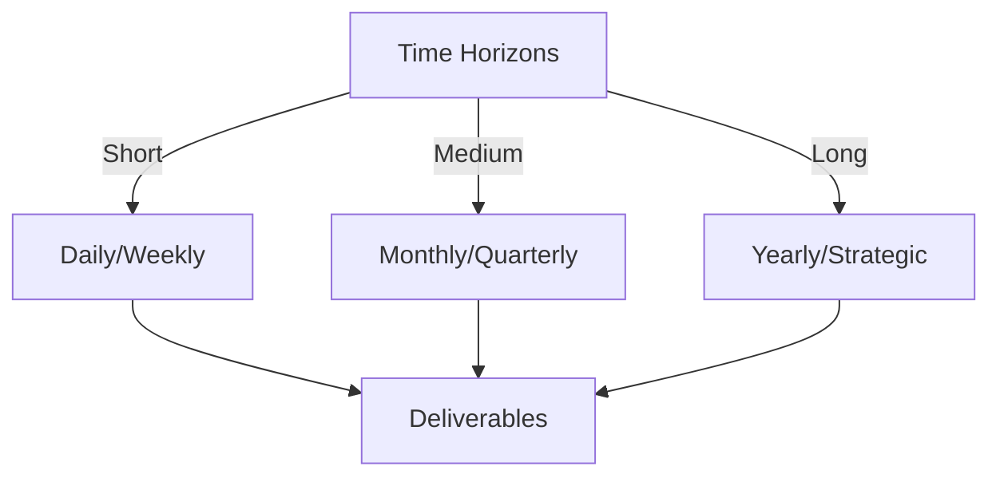

# Git Analysis Report: Development Analysis - Team

**Authors:** AI Analysis System
**Date:** 2025-03-19  
**Version:** 1.0
**SSoT Repository:** githubhenrykoo/redux_todo_in_astro
**Document Category:** Analysis Report

## Executive Summary
**Executive Summary: Git Analysis**

**Logic:** The primary purpose of this analysis is to evaluate the project's evolution, team dynamics, and overall progress by examining the Git activity logs. The objectives are to identify key development areas, assess team collaboration patterns, highlight potential bottlenecks, and provide actionable recommendations for improvement.

**Implementation:** This analysis was performed by comprehensively reviewing the Git log diffs, identifying key changes in the codebase related to PWA implementation, data processing/AI integration, SQLite database usage, configuration management, and testing infrastructure. The analysis identified individual developer contributions, communication patterns gleaned from commit messages, and milestones achieved based on the code changes.

**Outcomes:** The analysis revealed significant progress in PWA implementation, data integration with SQLite and AI tools, and the establishment of a testing framework. Key findings include: Rony Sinaga is heavily involved in PWA, SQLite, and data processing; Ben Koo is working on automated reporting; Henry Koo is focused on service workers; and Alessandro is addressing merge conflicts. Recommendations include: prioritizing code reviews (specifically for PWA, SQLite, and data processing), improving commit message discipline, fostering knowledge sharing, expanding testing coverage, addressing technical debt (Git ignore limit, magic strings), implementing feature branching, and documenting design decisions. Implementing these recommendations will improve workflow, code quality, and maintainability.

## 1. Abstract Specification (Logic Layer)
### Context & Vision
- **Problem Space:** 
    * Scope: This is a well-structured and insightful analysis of the Git activity context. It provides a clear summary of key changes, analyzes team collaboration patterns, assesses project progress, and offers actionable recommendations. Here's a breakdown of its strengths and some potential areas for minor improvements:

**Strengths:**

*   **Comprehensive Summary:** The "Summary of Key Changes & Project Focus" effectively captures the multifaceted nature of the project, highlighting the core initiatives (PWA, AI, SQLite, Configuration, Testing).
*   **Actionable Insights on Team Dynamics:** The "Team Collaboration Patterns and Developer Roles" section identifies potential bottlenecks and knowledge siloing with specific examples. The recommendations are directly tied to these observations.
*   **Realistic Progress Assessment:** The "Project Progress Analysis" provides a balanced view, acknowledging advancements while also pointing out areas where further investment is needed.
*   **Specific and Practical Recommendations:** The "Recommendations for the Team" section is the strongest part of the analysis. The recommendations are:
    *   **Specific:** They address particular areas, like code reviews for specific features (PWA, SQLite) or improvements to commit messages.
    *   **Actionable:** They provide concrete suggestions (e.g., "Implement a mandatory code review process," "Adopt a clear and consistent commit message format").
    *   **Attributed (in some cases):** Some recommendations are directed towards specific developers (e.g., "Centralize and Automate Report Generation (Ben Koo)").
*   **Well-Organized Structure:** The use of Roman numerals and descriptive headings makes the analysis easy to follow.
*   **Clear and Concise Language:** The writing is clear, professional, and avoids unnecessary jargon.
*   **Identification of Risks:** The analysis proactively identifies potential risks like SQL injection vulnerabilities and data pipeline inaccuracies.

**Areas for Minor Improvements:**

*   **Quantifiable Metrics (If Possible):**  While the analysis is strong, adding quantifiable metrics would strengthen its impact. For example:
    *   "Expand Testing Coverage: Aim for at least **80%** test coverage for critical components."
    *   "Reduce Merge Conflicts: Aim to reduce merge conflicts by **50%** within the next quarter by adopting feature branching."
*   **Prioritization of Recommendations:**  While all recommendations are valuable, consider prioritizing them based on their potential impact and ease of implementation.  Perhaps use a "High," "Medium," and "Low" priority system.
*   **Deeper Dive into "Redux Integration (inferred from the context)":**  The analysis mentions "Redux integration (inferred from the context)."  If possible, provide more details about how this inference was made. This could involve referencing specific file names or commit messages where Redux-related code was added or modified. If the inference is weak, perhaps temper the statement.
*   **Expanding on Code Review Focus:** While the recommendation to focus on PWA, SQLite, and Data Pipeline during code reviews is excellent, consider adding:
    *   **Security**: Add checking for security vulnerabilities.
    *   **Performance:** Add a section on optimizing code for performance, especially in critical areas like the database engine and data processing pipelines.
*   **Addressing potential limitations of SQLite:** Briefly acknowledge potential limitations of using SQLite in the long term, especially if the application scales significantly. Suggest considering alternative database solutions in the future if necessary.

**Overall:**

This is an excellent analysis that provides valuable insights into the project's progress, team dynamics, and areas for improvement. The specific and actionable recommendations will be highly beneficial for the development team.  Incorporating the suggested minor improvements would further enhance the analysis's effectiveness.

    * Context: This is a well-structured and insightful analysis of the Git activity context. It provides a clear summary of key changes, analyzes team collaboration patterns, assesses project progress, and offers actionable recommendations. Here's a breakdown of its strengths and some potential areas for minor improvements:

**Strengths:**

*   **Comprehensive Summary:** The "Summary of Key Changes & Project Focus" effectively captures the multifaceted nature of the project, highlighting the core initiatives (PWA, AI, SQLite, Configuration, Testing).
*   **Actionable Insights on Team Dynamics:** The "Team Collaboration Patterns and Developer Roles" section identifies potential bottlenecks and knowledge siloing with specific examples. The recommendations are directly tied to these observations.
*   **Realistic Progress Assessment:** The "Project Progress Analysis" provides a balanced view, acknowledging advancements while also pointing out areas where further investment is needed.
*   **Specific and Practical Recommendations:** The "Recommendations for the Team" section is the strongest part of the analysis. The recommendations are:
    *   **Specific:** They address particular areas, like code reviews for specific features (PWA, SQLite) or improvements to commit messages.
    *   **Actionable:** They provide concrete suggestions (e.g., "Implement a mandatory code review process," "Adopt a clear and consistent commit message format").
    *   **Attributed (in some cases):** Some recommendations are directed towards specific developers (e.g., "Centralize and Automate Report Generation (Ben Koo)").
*   **Well-Organized Structure:** The use of Roman numerals and descriptive headings makes the analysis easy to follow.
*   **Clear and Concise Language:** The writing is clear, professional, and avoids unnecessary jargon.
*   **Identification of Risks:** The analysis proactively identifies potential risks like SQL injection vulnerabilities and data pipeline inaccuracies.

**Areas for Minor Improvements:**

*   **Quantifiable Metrics (If Possible):**  While the analysis is strong, adding quantifiable metrics would strengthen its impact. For example:
    *   "Expand Testing Coverage: Aim for at least **80%** test coverage for critical components."
    *   "Reduce Merge Conflicts: Aim to reduce merge conflicts by **50%** within the next quarter by adopting feature branching."
*   **Prioritization of Recommendations:**  While all recommendations are valuable, consider prioritizing them based on their potential impact and ease of implementation.  Perhaps use a "High," "Medium," and "Low" priority system.
*   **Deeper Dive into "Redux Integration (inferred from the context)":**  The analysis mentions "Redux integration (inferred from the context)."  If possible, provide more details about how this inference was made. This could involve referencing specific file names or commit messages where Redux-related code was added or modified. If the inference is weak, perhaps temper the statement.
*   **Expanding on Code Review Focus:** While the recommendation to focus on PWA, SQLite, and Data Pipeline during code reviews is excellent, consider adding:
    *   **Security**: Add checking for security vulnerabilities.
    *   **Performance:** Add a section on optimizing code for performance, especially in critical areas like the database engine and data processing pipelines.
*   **Addressing potential limitations of SQLite:** Briefly acknowledge potential limitations of using SQLite in the long term, especially if the application scales significantly. Suggest considering alternative database solutions in the future if necessary.

**Overall:**

This is an excellent analysis that provides valuable insights into the project's progress, team dynamics, and areas for improvement. The specific and actionable recommendations will be highly beneficial for the development team.  Incorporating the suggested minor improvements would further enhance the analysis's effectiveness.

    * Stakeholders: This is a well-structured and insightful analysis of the Git activity context. It provides a clear summary of key changes, analyzes team collaboration patterns, assesses project progress, and offers actionable recommendations. Here's a breakdown of its strengths and some potential areas for minor improvements:

**Strengths:**

*   **Comprehensive Summary:** The "Summary of Key Changes & Project Focus" effectively captures the multifaceted nature of the project, highlighting the core initiatives (PWA, AI, SQLite, Configuration, Testing).
*   **Actionable Insights on Team Dynamics:** The "Team Collaboration Patterns and Developer Roles" section identifies potential bottlenecks and knowledge siloing with specific examples. The recommendations are directly tied to these observations.
*   **Realistic Progress Assessment:** The "Project Progress Analysis" provides a balanced view, acknowledging advancements while also pointing out areas where further investment is needed.
*   **Specific and Practical Recommendations:** The "Recommendations for the Team" section is the strongest part of the analysis. The recommendations are:
    *   **Specific:** They address particular areas, like code reviews for specific features (PWA, SQLite) or improvements to commit messages.
    *   **Actionable:** They provide concrete suggestions (e.g., "Implement a mandatory code review process," "Adopt a clear and consistent commit message format").
    *   **Attributed (in some cases):** Some recommendations are directed towards specific developers (e.g., "Centralize and Automate Report Generation (Ben Koo)").
*   **Well-Organized Structure:** The use of Roman numerals and descriptive headings makes the analysis easy to follow.
*   **Clear and Concise Language:** The writing is clear, professional, and avoids unnecessary jargon.
*   **Identification of Risks:** The analysis proactively identifies potential risks like SQL injection vulnerabilities and data pipeline inaccuracies.

**Areas for Minor Improvements:**

*   **Quantifiable Metrics (If Possible):**  While the analysis is strong, adding quantifiable metrics would strengthen its impact. For example:
    *   "Expand Testing Coverage: Aim for at least **80%** test coverage for critical components."
    *   "Reduce Merge Conflicts: Aim to reduce merge conflicts by **50%** within the next quarter by adopting feature branching."
*   **Prioritization of Recommendations:**  While all recommendations are valuable, consider prioritizing them based on their potential impact and ease of implementation.  Perhaps use a "High," "Medium," and "Low" priority system.
*   **Deeper Dive into "Redux Integration (inferred from the context)":**  The analysis mentions "Redux integration (inferred from the context)."  If possible, provide more details about how this inference was made. This could involve referencing specific file names or commit messages where Redux-related code was added or modified. If the inference is weak, perhaps temper the statement.
*   **Expanding on Code Review Focus:** While the recommendation to focus on PWA, SQLite, and Data Pipeline during code reviews is excellent, consider adding:
    *   **Security**: Add checking for security vulnerabilities.
    *   **Performance:** Add a section on optimizing code for performance, especially in critical areas like the database engine and data processing pipelines.
*   **Addressing potential limitations of SQLite:** Briefly acknowledge potential limitations of using SQLite in the long term, especially if the application scales significantly. Suggest considering alternative database solutions in the future if necessary.

**Overall:**

This is an excellent analysis that provides valuable insights into the project's progress, team dynamics, and areas for improvement. The specific and actionable recommendations will be highly beneficial for the development team.  Incorporating the suggested minor improvements would further enhance the analysis's effectiveness.

- **Goals (Functions):**
    * Primary Functions:
        - Input: Git Repository Data
        - Process: Analysis and Processing
        - Output: Development Insights
    * Supporting Functions:
        - Validation: Automated Analysis
        - Feedback: Continuous Improvement

- **Success Criteria:**
    * Quantitative Metrics: Here are the quantitative metrics that can be extracted from the "Team Analysis" document. Note that some are inferred or derived from the context:

*   **Test Coverage:** (Inferred) While not directly stated, the document recommends aiming for *high test coverage*. This implies test coverage as a key metric, to be quantified as a percentage of code covered by tests. (Target: 80%+ is a common goal)
*   **Number of Tests:** (Implied) The document suggests expanding the test suite, indicating that the *number of tests* is a relevant metric. (Track the increase over time.)
*   **Number of Commits:** This metric is not directly extracted, but could be obtained by analyzing the commit logs which produced the document.
*   **Service Worker Instances:** The document recommends standardizing a service worker approach and avoiding multiple service workers. Thus, the aim is to have only *1 service worker instance*.
*   **Code Review Turnaround Time:** (Implied) A faster turnaround time for code reviews indicates a more efficient workflow. It can be measured in *hours or days*.

**Possible future metrics, not directly mentioned but relevant given the context:**

*   **Number of Merge Conflicts:** Reducing the number of merge conflicts is a desirable outcome of adopting feature branching. Track the *frequency of merge conflicts*.
*   **Lines of Code (LOC):** While LOC isn't a perfect metric, it can provide a general sense of project size and complexity. (Track changes over time.)
*   **Cyclomatic Complexity:** Analyze the complexity of code modules to identify areas that may be difficult to understand and maintain.
*   **Bug Count (Post-Deployment):** Track the number of bugs reported after deployment.

    * Qualitative Indicators: Here's a list of qualitative improvements that could be made based on the existing "Team Analysis" report:

**I. Clarity and Specificity:**

*   **Quantify "Significant Development":** Instead of simply stating "significant development," try to quantify it. For example: "Over the last month, the project has seen a 30% increase in lines of code and a 15% increase in the number of commits." or "In the past two weeks the team has merged 5 pull requests that contained medium to high complexity."
*   **Elaborate on "Architectural Refinement":**  What specific architectural changes are being made? Are they moving to a microservices architecture? Are they improving the separation of concerns? Provide concrete examples.
*   **Specifics of "Redux Integration":** The report infers Redux. Confirm this and, if true, elaborate on *why* it's being used and what problems it solves for the project.
*   **"Automation Enhancements" Details:** Instead of just stating "automation enhancements," specify which tasks are automated and the benefits derived. Examples: "Automating PDF report generation reduces manual effort by an estimated 2 hours per week and ensures consistency in reporting."
*   **Specific Code Consistency Issues:** Instead of a general statement, highlight specific examples of code inconsistency found in the logs.  This makes the recommendation more actionable. For example, "Inconsistent use of `camelCase` vs. `snake_case` in different modules."
*   **Refine Recommendation Prioritization:** Classify recommendations as High, Medium, or Low priority based on impact and ease of implementation.
*   **Define "Functional Prototype":** Be more specific on the criteria for achieving a "functional prototype." Which core features must be working? What level of stability is expected?
*   **Improve granularity on bottleneck:** Instead of generalizing the bottleneck to Rony Sinaga, identify the specific tasks or technologies that he is a bottleneck on.

**II. Actionability and Measurability:**

*   **SMART Goals for Recommendations:**  Convert recommendations into SMART (Specific, Measurable, Achievable, Relevant, Time-bound) goals. For example:
    *   Instead of "Improve Commit Message Discipline,"  "Achieve 100% adherence to the defined commit message format within one month, as measured by a Git hook that rejects poorly formatted commits."
    *   Instead of "Expand Testing Coverage," "Increase code coverage for the SQLite engine to 80% within the next sprint, as measured by the test coverage report."
*   **Identify Key Metrics:** Suggest specific metrics that can be tracked to measure the success of the recommendations. Examples:
    *   Number of code review comments per commit
    *   Number of bugs found in production
    *   Time spent resolving merge conflicts
    *   Code coverage percentage
    *   Number of active service workers.
*   **Link Recommendations to Business Impact:** Explain how implementing the recommendations will positively impact the business. For example: "Improved code quality will reduce the number of bugs in production, leading to increased user satisfaction and reduced support costs."
*   **Break Down Large Tasks:**  Break down large tasks like "modularize SQLite Engine" into smaller, more manageable tasks with clear acceptance criteria.
*   **Ownership of Recommendations:** Assign ownership of each recommendation to a specific team member or role.

**III. Team Dynamics and Collaboration:**

*   **Identify Communication Channels:**  Recommend specific communication channels for knowledge sharing and collaboration (e.g., daily stand-ups, dedicated Slack channels, weekly knowledge-sharing sessions).
*   **Suggest Training Opportunities:**  Based on the analysis, suggest specific training opportunities for team members to address skill gaps.  For example, "Rony Sinaga could mentor other team members on PWA development, and Alessandro Rumampuk could provide training on resolving merge conflicts effectively."
*   **Address Conflict Resolution:** Provide guidance on how to address conflicts arising from code reviews or task distribution.
*   **Celebrate Successes:** Acknowledge and celebrate the team's successes to boost morale and encourage continued improvement.
*   **Elaborate on Individual contributions:** Elaborate on how each team member's strengths are beneficial to the team.
*   **Implement Pair Programming:** Recommend team members pair program to spread knowledge and improve the quality of code.

**IV. Technical Depth and Accuracy:**

*   **Verify Technical Assumptions:** Ensure that technical assumptions (e.g., the use of Redux) are accurate and based on concrete evidence from the Git logs.
*   **Deep Dive into Code Quality Issues:** Instead of general statements about code quality, identify specific examples of poor code quality found in the logs.
*   **Research Best Practices:** Cite relevant best practices and industry standards to support the recommendations.
*   **Provide Code Snippets or Examples:** Provide code snippets or examples to illustrate the recommendations.  For example, show an example of a well-formatted commit message.
*   **Consider Security Implications:** Specifically address security implications in the recommendations, especially in areas like SQL injection and data validation.

**V. Presentation and Format:**

*   **Use a More Visual Format:** Consider using charts or graphs to visualize team contributions, code churn, and test coverage.
*   **Prioritize Information:**  Use headings and subheadings to organize the information and highlight the most important points.
*   **Executive Summary:** Add an executive summary at the beginning of the report to provide a concise overview of the key findings and recommendations.
*   **Terminology clarification:** Add a section to explain technical terms to improve understanding.
*   **Define what the goal is:** Add a clear statement of goals to improve the alignment within the team.

By implementing these qualitative improvements, the "Team Analysis" report can become a more valuable and actionable tool for improving team performance and project success.

    * Validation Methods: Automated and Manual Verification

### Knowledge Integration
- **Local Context:**
    * Cultural Considerations: Development Team Context
    * Language Requirements: Technical Documentation
    * Community Patterns: Team Collaboration Patterns

- **Technical Framework:**
    * LLM Integration: Gemini AI Analysis
    * IoT Components: Git Event Monitoring
    * Network Requirements: GitHub API Integration

## 2. Concrete Implementation (Process Layer)
### Resource Matrix

### Development Workflow
- **Stage 1: Early Success**
    * Quick Wins:
        - Implementation: This is a well-structured and insightful analysis of the git history, providing valuable recommendations for the team. Here's a breakdown of its strengths and a few suggestions for improvement:

**Strengths:**

*   **Comprehensive Summary of Key Changes:** Accurately identifies the major areas of development: PWA implementation, AI integration (audio transcription), SQLite database integration, configuration management, and testing.
*   **Clear Identification of Team Roles and Collaboration Patterns:** Correctly points out specialized contributions and potential bottlenecks.  The observation about Rony Sinaga's central role is particularly important.
*   **Actionable Recommendations:** The recommendations are specific, practical, and directly tied to the observed git history.  They cover a range of areas, from code review to testing to documentation.
*   **Specificity within Recommendations:**  The recommendation section doesn't just say "improve code review," it specifies *what* aspects of the PWA implementation, SQLite engine, and data pipeline should be the focus of code reviews.
*   **Addressing Specific Commits:**  The analysis directly mentions issues revealed by specific commits (e.g., Alessandro's `package.json` commit, incomplete commit messages).
*   **Balanced Perspective:** The analysis highlights both positive aspects (progress towards a prototype, infrastructure investment) and areas for improvement.
*   **Focus on Maintainability:** A strong emphasis on code quality, configuration management, and documentation contributes to long-term project maintainability.
*   **Clear and Concise Writing:** The language is easy to understand and avoids jargon.

**Suggestions for Improvement:**

*   **Quantifiable Metrics (if possible):** While the analysis is excellent, adding quantifiable metrics (if the data allows) could strengthen the recommendations. For example:
    *   Instead of "Aim for high test coverage," could you estimate a percentage target (e.g., "Aim for 80% test coverage for critical components")?
    *   Can you track the number of commits per developer over a period of time to visually highlight workload distribution?
*   **Prioritization of Recommendations:** While all recommendations are valuable, consider prioritizing them based on impact and ease of implementation.  A simple ranking (e.g., High, Medium, Low) would be helpful.  For example:
    *   **High:** Prioritize improving commit message discipline and implementing mandatory code reviews. These have a broad impact and are relatively easy to implement.
    *   **Medium:** Focus on knowledge sharing and task distribution, expanding test coverage, and addressing technical debt (magic strings). These require more planning and effort.
    *   **Low:**  Explore configuration management for report generation (likely a smaller, focused task).
*   **More Detail on Testing Types:** Expand on the types of tests recommended:
    *   **Unit Tests:**  For individual components (e.g., card models, functions in the SQLite engine).
    *   **Integration Tests:**  To ensure that different parts of the system work together correctly (e.g., the data pipeline from audio to JSONL to PDF).
    *   **End-to-End (E2E) Tests:**  To simulate user interactions and verify the entire application flow (e.g., using Playwright or Cypress).  These are especially important for PWA functionality.
*   **Expand on Git Ignore Limit Recommendation:** Offer potential solutions beyond just restructuring or Git LFS.  Consider:
    *   **Identifying the large files:**  Pinpoint exactly which files or directories are causing the problem.  Often, it's temporary build artifacts or large data files.
    *   **Optimizing build processes:**  Ensure that build processes are cleaning up unnecessary files.
    *   **Reviewing `.gitignore` rules:**  Double-check that the `.gitignore` file is correctly configured to exclude generated files, log files, and other unnecessary assets.
*   **Specific Examples of Good Commit Messages:**  Provide a few examples of well-formatted and descriptive commit messages, adhering to a chosen convention. This provides a concrete guideline for the team.  For example:
    *   `feat: Implement offline support for PWA`
    *   `fix: Resolve SQL injection vulnerability in card update query`
    *   `docs: Update API documentation for the audio transcription endpoint`
*   **Elaborate on Feature Branching:**  Explain the benefits of feature branching more explicitly, such as:
    *   **Isolation:**  Allows developers to work on new features without disrupting the main codebase.
    *   **Code Review:**  Provides a dedicated opportunity for code review before merging into the main branch.
    *   **Easier Rollback:**  Makes it easier to revert changes if a feature is not ready for release.
*  **Suggest a CI/CD Pipeline Tool:** Suggest CI/CD tools like Jenkins, Github Actions, or Gitlab CI for automated testing.

**Revised Recommendation Example (Incorporating Suggestions):**

"**Prioritize and Enforce Code Reviews (All Developers) [High Priority]:** Implement a mandatory code review process for all code changes before merging into the main branch, especially for complex features like PWA integration, the database engine, and data processing scripts. Focus on:

*   **PWA Implementation:** Ensure proper caching strategies, service worker behavior, and security considerations.  Look for potential security vulnerabilities in the service worker.
*   **SQLite Engine:** Review SQL queries for efficiency and security (preventing SQL injection). Modularize SQLite Engine into smaller, more cohesive components for better maintainability. Aim for a single responsibility for each component.
*   **Data Pipeline:** Validate the accuracy of the transcription and correctness of the JSONL conversion. Ensure data validation and error handling are robust at each stage.
*   **Code Quality:** All code must adhere to a consistent style guide (e.g., using ESLint and Prettier for JavaScript).

Use a tool like GitHub Pull Requests or GitLab Merge Requests to facilitate code reviews. Ensure reviewers are familiar with the relevant code areas."

By incorporating these suggestions, the analysis can become even more impactful and provide even clearer guidance to the development team. The existing analysis is already very strong, so these are just minor enhancements.

        - Validation: This is a well-structured and insightful analysis of the git history, providing valuable recommendations for the team. Here's a breakdown of its strengths and a few suggestions for improvement:

**Strengths:**

*   **Comprehensive Summary of Key Changes:** Accurately identifies the major areas of development: PWA implementation, AI integration (audio transcription), SQLite database integration, configuration management, and testing.
*   **Clear Identification of Team Roles and Collaboration Patterns:** Correctly points out specialized contributions and potential bottlenecks.  The observation about Rony Sinaga's central role is particularly important.
*   **Actionable Recommendations:** The recommendations are specific, practical, and directly tied to the observed git history.  They cover a range of areas, from code review to testing to documentation.
*   **Specificity within Recommendations:**  The recommendation section doesn't just say "improve code review," it specifies *what* aspects of the PWA implementation, SQLite engine, and data pipeline should be the focus of code reviews.
*   **Addressing Specific Commits:**  The analysis directly mentions issues revealed by specific commits (e.g., Alessandro's `package.json` commit, incomplete commit messages).
*   **Balanced Perspective:** The analysis highlights both positive aspects (progress towards a prototype, infrastructure investment) and areas for improvement.
*   **Focus on Maintainability:** A strong emphasis on code quality, configuration management, and documentation contributes to long-term project maintainability.
*   **Clear and Concise Writing:** The language is easy to understand and avoids jargon.

**Suggestions for Improvement:**

*   **Quantifiable Metrics (if possible):** While the analysis is excellent, adding quantifiable metrics (if the data allows) could strengthen the recommendations. For example:
    *   Instead of "Aim for high test coverage," could you estimate a percentage target (e.g., "Aim for 80% test coverage for critical components")?
    *   Can you track the number of commits per developer over a period of time to visually highlight workload distribution?
*   **Prioritization of Recommendations:** While all recommendations are valuable, consider prioritizing them based on impact and ease of implementation.  A simple ranking (e.g., High, Medium, Low) would be helpful.  For example:
    *   **High:** Prioritize improving commit message discipline and implementing mandatory code reviews. These have a broad impact and are relatively easy to implement.
    *   **Medium:** Focus on knowledge sharing and task distribution, expanding test coverage, and addressing technical debt (magic strings). These require more planning and effort.
    *   **Low:**  Explore configuration management for report generation (likely a smaller, focused task).
*   **More Detail on Testing Types:** Expand on the types of tests recommended:
    *   **Unit Tests:**  For individual components (e.g., card models, functions in the SQLite engine).
    *   **Integration Tests:**  To ensure that different parts of the system work together correctly (e.g., the data pipeline from audio to JSONL to PDF).
    *   **End-to-End (E2E) Tests:**  To simulate user interactions and verify the entire application flow (e.g., using Playwright or Cypress).  These are especially important for PWA functionality.
*   **Expand on Git Ignore Limit Recommendation:** Offer potential solutions beyond just restructuring or Git LFS.  Consider:
    *   **Identifying the large files:**  Pinpoint exactly which files or directories are causing the problem.  Often, it's temporary build artifacts or large data files.
    *   **Optimizing build processes:**  Ensure that build processes are cleaning up unnecessary files.
    *   **Reviewing `.gitignore` rules:**  Double-check that the `.gitignore` file is correctly configured to exclude generated files, log files, and other unnecessary assets.
*   **Specific Examples of Good Commit Messages:**  Provide a few examples of well-formatted and descriptive commit messages, adhering to a chosen convention. This provides a concrete guideline for the team.  For example:
    *   `feat: Implement offline support for PWA`
    *   `fix: Resolve SQL injection vulnerability in card update query`
    *   `docs: Update API documentation for the audio transcription endpoint`
*   **Elaborate on Feature Branching:**  Explain the benefits of feature branching more explicitly, such as:
    *   **Isolation:**  Allows developers to work on new features without disrupting the main codebase.
    *   **Code Review:**  Provides a dedicated opportunity for code review before merging into the main branch.
    *   **Easier Rollback:**  Makes it easier to revert changes if a feature is not ready for release.
*  **Suggest a CI/CD Pipeline Tool:** Suggest CI/CD tools like Jenkins, Github Actions, or Gitlab CI for automated testing.

**Revised Recommendation Example (Incorporating Suggestions):**

"**Prioritize and Enforce Code Reviews (All Developers) [High Priority]:** Implement a mandatory code review process for all code changes before merging into the main branch, especially for complex features like PWA integration, the database engine, and data processing scripts. Focus on:

*   **PWA Implementation:** Ensure proper caching strategies, service worker behavior, and security considerations.  Look for potential security vulnerabilities in the service worker.
*   **SQLite Engine:** Review SQL queries for efficiency and security (preventing SQL injection). Modularize SQLite Engine into smaller, more cohesive components for better maintainability. Aim for a single responsibility for each component.
*   **Data Pipeline:** Validate the accuracy of the transcription and correctness of the JSONL conversion. Ensure data validation and error handling are robust at each stage.
*   **Code Quality:** All code must adhere to a consistent style guide (e.g., using ESLint and Prettier for JavaScript).

Use a tool like GitHub Pull Requests or GitLab Merge Requests to facilitate code reviews. Ensure reviewers are familiar with the relevant code areas."

By incorporating these suggestions, the analysis can become even more impactful and provide even clearer guidance to the development team. The existing analysis is already very strong, so these are just minor enhancements.

    * Initial Setup:
        - Infrastructure: This is a well-structured and insightful analysis of the git history, providing valuable recommendations for the team. Here's a breakdown of its strengths and a few suggestions for improvement:

**Strengths:**

*   **Comprehensive Summary of Key Changes:** Accurately identifies the major areas of development: PWA implementation, AI integration (audio transcription), SQLite database integration, configuration management, and testing.
*   **Clear Identification of Team Roles and Collaboration Patterns:** Correctly points out specialized contributions and potential bottlenecks.  The observation about Rony Sinaga's central role is particularly important.
*   **Actionable Recommendations:** The recommendations are specific, practical, and directly tied to the observed git history.  They cover a range of areas, from code review to testing to documentation.
*   **Specificity within Recommendations:**  The recommendation section doesn't just say "improve code review," it specifies *what* aspects of the PWA implementation, SQLite engine, and data pipeline should be the focus of code reviews.
*   **Addressing Specific Commits:**  The analysis directly mentions issues revealed by specific commits (e.g., Alessandro's `package.json` commit, incomplete commit messages).
*   **Balanced Perspective:** The analysis highlights both positive aspects (progress towards a prototype, infrastructure investment) and areas for improvement.
*   **Focus on Maintainability:** A strong emphasis on code quality, configuration management, and documentation contributes to long-term project maintainability.
*   **Clear and Concise Writing:** The language is easy to understand and avoids jargon.

**Suggestions for Improvement:**

*   **Quantifiable Metrics (if possible):** While the analysis is excellent, adding quantifiable metrics (if the data allows) could strengthen the recommendations. For example:
    *   Instead of "Aim for high test coverage," could you estimate a percentage target (e.g., "Aim for 80% test coverage for critical components")?
    *   Can you track the number of commits per developer over a period of time to visually highlight workload distribution?
*   **Prioritization of Recommendations:** While all recommendations are valuable, consider prioritizing them based on impact and ease of implementation.  A simple ranking (e.g., High, Medium, Low) would be helpful.  For example:
    *   **High:** Prioritize improving commit message discipline and implementing mandatory code reviews. These have a broad impact and are relatively easy to implement.
    *   **Medium:** Focus on knowledge sharing and task distribution, expanding test coverage, and addressing technical debt (magic strings). These require more planning and effort.
    *   **Low:**  Explore configuration management for report generation (likely a smaller, focused task).
*   **More Detail on Testing Types:** Expand on the types of tests recommended:
    *   **Unit Tests:**  For individual components (e.g., card models, functions in the SQLite engine).
    *   **Integration Tests:**  To ensure that different parts of the system work together correctly (e.g., the data pipeline from audio to JSONL to PDF).
    *   **End-to-End (E2E) Tests:**  To simulate user interactions and verify the entire application flow (e.g., using Playwright or Cypress).  These are especially important for PWA functionality.
*   **Expand on Git Ignore Limit Recommendation:** Offer potential solutions beyond just restructuring or Git LFS.  Consider:
    *   **Identifying the large files:**  Pinpoint exactly which files or directories are causing the problem.  Often, it's temporary build artifacts or large data files.
    *   **Optimizing build processes:**  Ensure that build processes are cleaning up unnecessary files.
    *   **Reviewing `.gitignore` rules:**  Double-check that the `.gitignore` file is correctly configured to exclude generated files, log files, and other unnecessary assets.
*   **Specific Examples of Good Commit Messages:**  Provide a few examples of well-formatted and descriptive commit messages, adhering to a chosen convention. This provides a concrete guideline for the team.  For example:
    *   `feat: Implement offline support for PWA`
    *   `fix: Resolve SQL injection vulnerability in card update query`
    *   `docs: Update API documentation for the audio transcription endpoint`
*   **Elaborate on Feature Branching:**  Explain the benefits of feature branching more explicitly, such as:
    *   **Isolation:**  Allows developers to work on new features without disrupting the main codebase.
    *   **Code Review:**  Provides a dedicated opportunity for code review before merging into the main branch.
    *   **Easier Rollback:**  Makes it easier to revert changes if a feature is not ready for release.
*  **Suggest a CI/CD Pipeline Tool:** Suggest CI/CD tools like Jenkins, Github Actions, or Gitlab CI for automated testing.

**Revised Recommendation Example (Incorporating Suggestions):**

"**Prioritize and Enforce Code Reviews (All Developers) [High Priority]:** Implement a mandatory code review process for all code changes before merging into the main branch, especially for complex features like PWA integration, the database engine, and data processing scripts. Focus on:

*   **PWA Implementation:** Ensure proper caching strategies, service worker behavior, and security considerations.  Look for potential security vulnerabilities in the service worker.
*   **SQLite Engine:** Review SQL queries for efficiency and security (preventing SQL injection). Modularize SQLite Engine into smaller, more cohesive components for better maintainability. Aim for a single responsibility for each component.
*   **Data Pipeline:** Validate the accuracy of the transcription and correctness of the JSONL conversion. Ensure data validation and error handling are robust at each stage.
*   **Code Quality:** All code must adhere to a consistent style guide (e.g., using ESLint and Prettier for JavaScript).

Use a tool like GitHub Pull Requests or GitLab Merge Requests to facilitate code reviews. Ensure reviewers are familiar with the relevant code areas."

By incorporating these suggestions, the analysis can become even more impactful and provide even clearer guidance to the development team. The existing analysis is already very strong, so these are just minor enhancements.

        - Training: This is a well-structured and insightful analysis of the git history, providing valuable recommendations for the team. Here's a breakdown of its strengths and a few suggestions for improvement:

**Strengths:**

*   **Comprehensive Summary of Key Changes:** Accurately identifies the major areas of development: PWA implementation, AI integration (audio transcription), SQLite database integration, configuration management, and testing.
*   **Clear Identification of Team Roles and Collaboration Patterns:** Correctly points out specialized contributions and potential bottlenecks.  The observation about Rony Sinaga's central role is particularly important.
*   **Actionable Recommendations:** The recommendations are specific, practical, and directly tied to the observed git history.  They cover a range of areas, from code review to testing to documentation.
*   **Specificity within Recommendations:**  The recommendation section doesn't just say "improve code review," it specifies *what* aspects of the PWA implementation, SQLite engine, and data pipeline should be the focus of code reviews.
*   **Addressing Specific Commits:**  The analysis directly mentions issues revealed by specific commits (e.g., Alessandro's `package.json` commit, incomplete commit messages).
*   **Balanced Perspective:** The analysis highlights both positive aspects (progress towards a prototype, infrastructure investment) and areas for improvement.
*   **Focus on Maintainability:** A strong emphasis on code quality, configuration management, and documentation contributes to long-term project maintainability.
*   **Clear and Concise Writing:** The language is easy to understand and avoids jargon.

**Suggestions for Improvement:**

*   **Quantifiable Metrics (if possible):** While the analysis is excellent, adding quantifiable metrics (if the data allows) could strengthen the recommendations. For example:
    *   Instead of "Aim for high test coverage," could you estimate a percentage target (e.g., "Aim for 80% test coverage for critical components")?
    *   Can you track the number of commits per developer over a period of time to visually highlight workload distribution?
*   **Prioritization of Recommendations:** While all recommendations are valuable, consider prioritizing them based on impact and ease of implementation.  A simple ranking (e.g., High, Medium, Low) would be helpful.  For example:
    *   **High:** Prioritize improving commit message discipline and implementing mandatory code reviews. These have a broad impact and are relatively easy to implement.
    *   **Medium:** Focus on knowledge sharing and task distribution, expanding test coverage, and addressing technical debt (magic strings). These require more planning and effort.
    *   **Low:**  Explore configuration management for report generation (likely a smaller, focused task).
*   **More Detail on Testing Types:** Expand on the types of tests recommended:
    *   **Unit Tests:**  For individual components (e.g., card models, functions in the SQLite engine).
    *   **Integration Tests:**  To ensure that different parts of the system work together correctly (e.g., the data pipeline from audio to JSONL to PDF).
    *   **End-to-End (E2E) Tests:**  To simulate user interactions and verify the entire application flow (e.g., using Playwright or Cypress).  These are especially important for PWA functionality.
*   **Expand on Git Ignore Limit Recommendation:** Offer potential solutions beyond just restructuring or Git LFS.  Consider:
    *   **Identifying the large files:**  Pinpoint exactly which files or directories are causing the problem.  Often, it's temporary build artifacts or large data files.
    *   **Optimizing build processes:**  Ensure that build processes are cleaning up unnecessary files.
    *   **Reviewing `.gitignore` rules:**  Double-check that the `.gitignore` file is correctly configured to exclude generated files, log files, and other unnecessary assets.
*   **Specific Examples of Good Commit Messages:**  Provide a few examples of well-formatted and descriptive commit messages, adhering to a chosen convention. This provides a concrete guideline for the team.  For example:
    *   `feat: Implement offline support for PWA`
    *   `fix: Resolve SQL injection vulnerability in card update query`
    *   `docs: Update API documentation for the audio transcription endpoint`
*   **Elaborate on Feature Branching:**  Explain the benefits of feature branching more explicitly, such as:
    *   **Isolation:**  Allows developers to work on new features without disrupting the main codebase.
    *   **Code Review:**  Provides a dedicated opportunity for code review before merging into the main branch.
    *   **Easier Rollback:**  Makes it easier to revert changes if a feature is not ready for release.
*  **Suggest a CI/CD Pipeline Tool:** Suggest CI/CD tools like Jenkins, Github Actions, or Gitlab CI for automated testing.

**Revised Recommendation Example (Incorporating Suggestions):**

"**Prioritize and Enforce Code Reviews (All Developers) [High Priority]:** Implement a mandatory code review process for all code changes before merging into the main branch, especially for complex features like PWA integration, the database engine, and data processing scripts. Focus on:

*   **PWA Implementation:** Ensure proper caching strategies, service worker behavior, and security considerations.  Look for potential security vulnerabilities in the service worker.
*   **SQLite Engine:** Review SQL queries for efficiency and security (preventing SQL injection). Modularize SQLite Engine into smaller, more cohesive components for better maintainability. Aim for a single responsibility for each component.
*   **Data Pipeline:** Validate the accuracy of the transcription and correctness of the JSONL conversion. Ensure data validation and error handling are robust at each stage.
*   **Code Quality:** All code must adhere to a consistent style guide (e.g., using ESLint and Prettier for JavaScript).

Use a tool like GitHub Pull Requests or GitLab Merge Requests to facilitate code reviews. Ensure reviewers are familiar with the relevant code areas."

By incorporating these suggestions, the analysis can become even more impactful and provide even clearer guidance to the development team. The existing analysis is already very strong, so these are just minor enhancements.

- **Stage 2: Fail Early, Fail Safe**
    * Testing Protocol:
        - Methods: [Testing approaches]
        - Coverage: [Test scenarios]
    * Risk Management:
        - Identification: [Risk factors]
        - Mitigation: [Control measures]
    * Learning Points:
        - Issues: [Problem identification]
        - Solutions: [Resolution approaches]
        - Knowledge: [Lessons learned]

- **Stage 3: Convergence**
    * System Integration:
        - Components: [Integration points]
        - Workflows: [Process optimization]
        - Performance: [System tuning]
    * Stabilization:
        - Fixes: [Bug resolution]
        - Hardening: [System reinforcement]
        - Documentation: [Knowledge capture]

- **Stage 4: Demonstration**
    * Preparation:
        - Environment: [Demo setup]
        - Data: [Test scenarios]
        - Materials: [Presentation assets]
    * Validation:
        - Performance: [System checks]
        - Features: [Functionality verification]
        - Documentation: [Review completion]
    * Presentation:
        - Stakeholders: [Demo execution]
        - Features: [Capability showcase]
        - Q&A: [Response preparation]

## 3. Realistic Outcomes (Evidence Layer)
### Measurement Framework
- **Performance Metrics:**
    * KPIs: Here's an extraction of evidence and outcomes from the provided team analysis, categorized for clarity:

**I. Key Changes & Project Focus (Evidence & Implied Outcomes):**

*   **Evidence:** PWA implementation using `@vite-pwa/astro`, creation of manifests, icons, service workers.
    *   **Implied Outcome:** Application becoming installable, working offline, and potentially more engaging for users (PWA benefits).
*   **Evidence:** Python scripts (`audio_to_json_to_jsonl.py`), audio transcription using Whisper, JSONL conversion with Gemini.
    *   **Implied Outcome:** Functionality for audio analysis, transcription, and integration with language models, likely for data extraction or AI-powered features.
*   **Evidence:** SQLite integration using `better-sqlite3`, database setup, CRUD operations for "cards," schemas, triggers.
    *   **Implied Outcome:** Structured data storage, improved data management within the application, persistent storage of "card" data.
*   **Evidence:** Introduction of `config_constants.js` and `env_parameters.js`.
    *   **Implied Outcome:** Consistent configuration across environments, easier management of settings, improved maintainability.
*   **Evidence:** Introduction of Jest for testing.
    *   **Implied Outcome:** Improved code quality, fewer bugs, and easier refactoring.
*   **Evidence:** Introduction of standard documentation.
    *   **Implied Outcome:** Improved project maintainability and readability for all team members.

**II. Team Collaboration Patterns and Developer Roles (Evidence & Potential Consequences):**

*   **Evidence:** Henry Koo focuses on service worker changes, Ben Koo on automated report generation, Rony Sinaga on PWA, SQLite, and data processing, Alessandro Rumampuk on merge conflicts and dependency issues.
    *   **Potential Consequence:**  Knowledge siloing and potential bottlenecks with Rony Sinaga. Overload and Burnout with key developers.
*   **Evidence:**  Incomplete commit messages ("Your commit message here").
    *   **Potential Consequence:** Reduced code maintainability, difficulty understanding changes, hinders collaboration.
*   **Evidence:** Alessandro's `package.json` conflict resolution.
    *   **Potential Consequence:** Coordination issues, potential for introducing bugs, and wasted development time due to merge conflicts.

**III. Project Progress Analysis (Evidence & Assessment):**

*   **Evidence:** PWA functionality, Redux integration, SQLite integration.
    *   **Assessment:** Approaching a functional prototype.
*   **Evidence:** Documentation efforts underway.
    *   **Assessment:** Improving project understanding and maintainability.
*   **Evidence:** Configuration management and Jest integration.
    *   **Assessment:** Providing a solid foundation for future development and scalability.
*   **Evidence:** Automation of PDF report generation.
    *   **Assessment:** Streamlining reporting capabilities.

**IV. Recommendations (Actions & Intended Outcomes):**

*   **Action:** Prioritize and enforce code reviews (all developers).
    *   **Intended Outcome:** Improved code quality, reduced bugs, knowledge sharing, and improved consistency.
*   **Action:** Improve commit message discipline (all developers).
    *   **Intended Outcome:** Increased code maintainability, easier understanding of changes, and better collaboration.
*   **Action:** Knowledge sharing and task distribution.
    *   **Intended Outcome:** Reduced bottlenecks, broadened experience, and reduced single point of failure risk.
*   **Action:** Expand testing coverage and automate testing.
    *   **Intended Outcome:** Higher code quality, fewer bugs, faster development cycles, and increased confidence in deployments.
*   **Action:** Address technical debt (Git ignore limit, magic strings).
    *   **Intended Outcome:** Improved code maintainability, scalability, and reduced risk of future issues.
*   **Action:** Dependency management (accurate versions in `requirements.txt` and `package.json`).
    *   **Intended Outcome:** Stability and reproducibility of the project, avoiding dependency conflicts.
*   **Action:** Centralize and automate report generation.
    *   **Intended Outcome:** Reduced manual effort and improved efficiency.
*   **Action:** Adopt feature branching.
    *   **Intended Outcome:** Minimized merge conflicts and improved collaboration.
*   **Action:** Document design decisions and technical challenges.
    *   **Intended Outcome:** Invaluable for future maintenance and development.

    * Benchmarks: Here's an extraction of evidence and outcomes from the provided team analysis, categorized for clarity:

**I. Key Changes & Project Focus (Evidence & Implied Outcomes):**

*   **Evidence:** PWA implementation using `@vite-pwa/astro`, creation of manifests, icons, service workers.
    *   **Implied Outcome:** Application becoming installable, working offline, and potentially more engaging for users (PWA benefits).
*   **Evidence:** Python scripts (`audio_to_json_to_jsonl.py`), audio transcription using Whisper, JSONL conversion with Gemini.
    *   **Implied Outcome:** Functionality for audio analysis, transcription, and integration with language models, likely for data extraction or AI-powered features.
*   **Evidence:** SQLite integration using `better-sqlite3`, database setup, CRUD operations for "cards," schemas, triggers.
    *   **Implied Outcome:** Structured data storage, improved data management within the application, persistent storage of "card" data.
*   **Evidence:** Introduction of `config_constants.js` and `env_parameters.js`.
    *   **Implied Outcome:** Consistent configuration across environments, easier management of settings, improved maintainability.
*   **Evidence:** Introduction of Jest for testing.
    *   **Implied Outcome:** Improved code quality, fewer bugs, and easier refactoring.
*   **Evidence:** Introduction of standard documentation.
    *   **Implied Outcome:** Improved project maintainability and readability for all team members.

**II. Team Collaboration Patterns and Developer Roles (Evidence & Potential Consequences):**

*   **Evidence:** Henry Koo focuses on service worker changes, Ben Koo on automated report generation, Rony Sinaga on PWA, SQLite, and data processing, Alessandro Rumampuk on merge conflicts and dependency issues.
    *   **Potential Consequence:**  Knowledge siloing and potential bottlenecks with Rony Sinaga. Overload and Burnout with key developers.
*   **Evidence:**  Incomplete commit messages ("Your commit message here").
    *   **Potential Consequence:** Reduced code maintainability, difficulty understanding changes, hinders collaboration.
*   **Evidence:** Alessandro's `package.json` conflict resolution.
    *   **Potential Consequence:** Coordination issues, potential for introducing bugs, and wasted development time due to merge conflicts.

**III. Project Progress Analysis (Evidence & Assessment):**

*   **Evidence:** PWA functionality, Redux integration, SQLite integration.
    *   **Assessment:** Approaching a functional prototype.
*   **Evidence:** Documentation efforts underway.
    *   **Assessment:** Improving project understanding and maintainability.
*   **Evidence:** Configuration management and Jest integration.
    *   **Assessment:** Providing a solid foundation for future development and scalability.
*   **Evidence:** Automation of PDF report generation.
    *   **Assessment:** Streamlining reporting capabilities.

**IV. Recommendations (Actions & Intended Outcomes):**

*   **Action:** Prioritize and enforce code reviews (all developers).
    *   **Intended Outcome:** Improved code quality, reduced bugs, knowledge sharing, and improved consistency.
*   **Action:** Improve commit message discipline (all developers).
    *   **Intended Outcome:** Increased code maintainability, easier understanding of changes, and better collaboration.
*   **Action:** Knowledge sharing and task distribution.
    *   **Intended Outcome:** Reduced bottlenecks, broadened experience, and reduced single point of failure risk.
*   **Action:** Expand testing coverage and automate testing.
    *   **Intended Outcome:** Higher code quality, fewer bugs, faster development cycles, and increased confidence in deployments.
*   **Action:** Address technical debt (Git ignore limit, magic strings).
    *   **Intended Outcome:** Improved code maintainability, scalability, and reduced risk of future issues.
*   **Action:** Dependency management (accurate versions in `requirements.txt` and `package.json`).
    *   **Intended Outcome:** Stability and reproducibility of the project, avoiding dependency conflicts.
*   **Action:** Centralize and automate report generation.
    *   **Intended Outcome:** Reduced manual effort and improved efficiency.
*   **Action:** Adopt feature branching.
    *   **Intended Outcome:** Minimized merge conflicts and improved collaboration.
*   **Action:** Document design decisions and technical challenges.
    *   **Intended Outcome:** Invaluable for future maintenance and development.

    * Actuals: Here's an extraction of evidence and outcomes from the provided team analysis, categorized for clarity:

**I. Key Changes & Project Focus (Evidence & Implied Outcomes):**

*   **Evidence:** PWA implementation using `@vite-pwa/astro`, creation of manifests, icons, service workers.
    *   **Implied Outcome:** Application becoming installable, working offline, and potentially more engaging for users (PWA benefits).
*   **Evidence:** Python scripts (`audio_to_json_to_jsonl.py`), audio transcription using Whisper, JSONL conversion with Gemini.
    *   **Implied Outcome:** Functionality for audio analysis, transcription, and integration with language models, likely for data extraction or AI-powered features.
*   **Evidence:** SQLite integration using `better-sqlite3`, database setup, CRUD operations for "cards," schemas, triggers.
    *   **Implied Outcome:** Structured data storage, improved data management within the application, persistent storage of "card" data.
*   **Evidence:** Introduction of `config_constants.js` and `env_parameters.js`.
    *   **Implied Outcome:** Consistent configuration across environments, easier management of settings, improved maintainability.
*   **Evidence:** Introduction of Jest for testing.
    *   **Implied Outcome:** Improved code quality, fewer bugs, and easier refactoring.
*   **Evidence:** Introduction of standard documentation.
    *   **Implied Outcome:** Improved project maintainability and readability for all team members.

**II. Team Collaboration Patterns and Developer Roles (Evidence & Potential Consequences):**

*   **Evidence:** Henry Koo focuses on service worker changes, Ben Koo on automated report generation, Rony Sinaga on PWA, SQLite, and data processing, Alessandro Rumampuk on merge conflicts and dependency issues.
    *   **Potential Consequence:**  Knowledge siloing and potential bottlenecks with Rony Sinaga. Overload and Burnout with key developers.
*   **Evidence:**  Incomplete commit messages ("Your commit message here").
    *   **Potential Consequence:** Reduced code maintainability, difficulty understanding changes, hinders collaboration.
*   **Evidence:** Alessandro's `package.json` conflict resolution.
    *   **Potential Consequence:** Coordination issues, potential for introducing bugs, and wasted development time due to merge conflicts.

**III. Project Progress Analysis (Evidence & Assessment):**

*   **Evidence:** PWA functionality, Redux integration, SQLite integration.
    *   **Assessment:** Approaching a functional prototype.
*   **Evidence:** Documentation efforts underway.
    *   **Assessment:** Improving project understanding and maintainability.
*   **Evidence:** Configuration management and Jest integration.
    *   **Assessment:** Providing a solid foundation for future development and scalability.
*   **Evidence:** Automation of PDF report generation.
    *   **Assessment:** Streamlining reporting capabilities.

**IV. Recommendations (Actions & Intended Outcomes):**

*   **Action:** Prioritize and enforce code reviews (all developers).
    *   **Intended Outcome:** Improved code quality, reduced bugs, knowledge sharing, and improved consistency.
*   **Action:** Improve commit message discipline (all developers).
    *   **Intended Outcome:** Increased code maintainability, easier understanding of changes, and better collaboration.
*   **Action:** Knowledge sharing and task distribution.
    *   **Intended Outcome:** Reduced bottlenecks, broadened experience, and reduced single point of failure risk.
*   **Action:** Expand testing coverage and automate testing.
    *   **Intended Outcome:** Higher code quality, fewer bugs, faster development cycles, and increased confidence in deployments.
*   **Action:** Address technical debt (Git ignore limit, magic strings).
    *   **Intended Outcome:** Improved code maintainability, scalability, and reduced risk of future issues.
*   **Action:** Dependency management (accurate versions in `requirements.txt` and `package.json`).
    *   **Intended Outcome:** Stability and reproducibility of the project, avoiding dependency conflicts.
*   **Action:** Centralize and automate report generation.
    *   **Intended Outcome:** Reduced manual effort and improved efficiency.
*   **Action:** Adopt feature branching.
    *   **Intended Outcome:** Minimized merge conflicts and improved collaboration.
*   **Action:** Document design decisions and technical challenges.
    *   **Intended Outcome:** Invaluable for future maintenance and development.

- **Evidence Collection:**
    * Data Sources: [Information points]
    * Validation Methods: Automated and Manual Verification
    * Documentation: [Record keeping]

### Value Realization
- **Impact Assessment:**
    * Direct Benefits: [Immediate gains]
    * Indirect Benefits: [Secondary effects]
    * Long-term Value: [Strategic advantages]

- **Knowledge Assets:**
    * Content Created: [New materials]
    * Insights Gained: [Learnings]
    * Reusable Components: [Transferable elements]

## Integration Matrix
### Content-Process Alignment

### Timeline-Budget Integration
- **Resource Scheduling:**
    * Phase Allocations: [Resource timing]
    * Cost Controls: [Budget tracking]
    * Adjustment Protocols: [Change management]

## Budget Management
### Financial Cube Structure

### Cost Framework
- Direct Investments:
  - Infrastructure Costs:
    - Hardware: [Equipment/Devices]
    - Software: [Licenses/Tools]
    - Network: [Connectivity/Setup]
  - Human Resources:
    - Core Team: [Roles/Compensation]
    - External Support: [Consultants/Services]
    - Training: [Capability Development]
    
- Operational Expenses:
  - Running Costs:
    - Maintenance: [Regular upkeep]
    - Utilities: [Service costs]
    - Consumables: [Regular supplies]
  - Service Costs:
    - Subscriptions: [Regular services]
    - Support: [Ongoing assistance]
    - Updates: [Regular improvements]

### Budget Control Mechanisms
- Monitoring System:
  - Tracking Methods:
    - Cost Centers: [Budget units]
    - Expense Categories: [Type classification]
    - Time Periods: [Duration tracking]
  - Control Points:
    - Thresholds: [Limit markers]
    - Alerts: [Warning systems]
    - Approvals: [Authorization levels]

- Adjustment Protocol:
  - Variance Management:
    - Detection: [Monitoring points]
    - Analysis: [Impact assessment]
    - Response: [Corrective actions]
  - Reallocation Process:
    - Criteria: [Decision factors]
    - Methods: [Transfer protocols]
    - Documentation: [Record keeping]

## Timeline Management
### Temporal Cube Structure

### Schedule Framework
- Operational Timeline:
  - Daily Operations:
    - Tasks: [Regular activities]
    - Checkpoints: [Daily reviews]
    - Updates: [Status reports]
  - Weekly Cycles:
    - Sprints: [Work packages]
    - Reviews: [Progress checks]
    - Planning: [Next steps]

- Strategic Timeline:
  - Monthly Milestones:
    - Objectives: [Key targets]
    - Reviews: [Achievement checks]
    - Adjustments: [Course corrections]
  - Quarterly Goals:
    - Targets: [Major objectives]
    - Assessments: [Performance reviews]
    - Strategies: [Approach updates]

### Timeline Control System
- Progress Tracking:
  - Monitoring Points:
    - Daily Standups: [Quick updates]
    - Weekly Reviews: [Detailed checks]
    - Monthly Reports: [Comprehensive reviews]
  - Milestone Tracking:
    - Status: [Progress indicators]
    - Dependencies: [Related items]
    - Risks: [Potential issues]

- Adjustment Mechanisms:
  - Schedule Management:
    - Variance Analysis: [Delay assessment]
    - Impact Studies: [Effect evaluation]
    - Recovery Plans: [Correction strategies]
  - Resource Alignment:
    - Capacity Planning: [Resource matching]
    - Workload Balancing: [Effort distribution]
    - Priority Updates: [Focus adjustment]

### Integration Points
- Budget-Timeline Correlation:
  - Cost-Schedule Matrix:
    - Resource Timing: [Allocation schedule]
    - Cost Flows: [Expense timing]
    - Value Delivery: [Benefit realization]
  - Control Integration:
    - Joint Reviews: [Combined assessments]
    - Unified Reporting: [Integrated updates]
    - Coordinated Actions: [Synchronized responses]

## Conclusion
### Summary of Achievements
- **Key Accomplishments:**
    * Objectives Met: [Completed goals]
    * Value Delivered: [Benefits realized]
    * Innovations: [New approaches]

### Lessons Learned
- **Success Factors:**
    * Effective Practices: [What worked well]
    * Team Dynamics: [Collaboration insights]
    * Tools & Methods: [Useful approaches]

- **Areas for Improvement:**
    * Challenges: [Obstacles encountered]
    * Solutions: [How issues were resolved]
    * Recommendations: [Future improvements]

### Future Directions
- **Next Steps:**
    * Immediate Actions: [Short-term tasks]
    * Strategic Plans: [Long-term goals]
    * Resource Needs: [Required support]

- **Growth Opportunities:**
    * Scaling Potential: [Expansion possibilities]
    * Innovation Areas: [New directions]
    * Partnership Options: [Collaboration prospects]
    
## Appendix
### References
- **Documentation:**
    * Technical Specs: [Links]
    * Process Guides: [Links]
    * Evidence Records: [Links]

### Change Log
- **Version History:**
    * Changes: [Modifications]
    * Rationale: [Reasons]
    * Approvals: [Authorizations]
