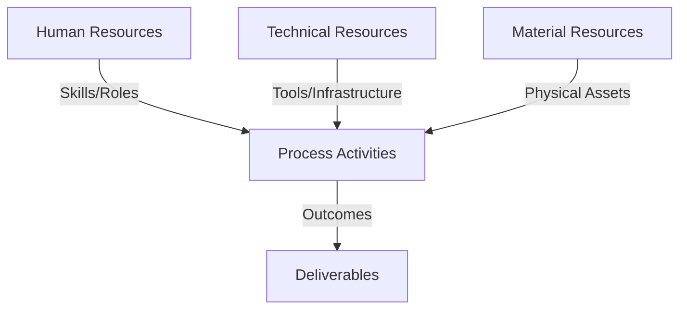
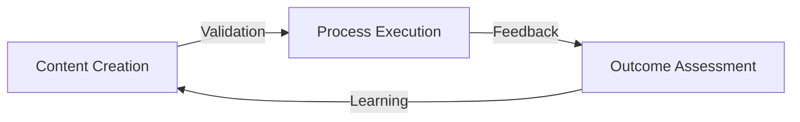
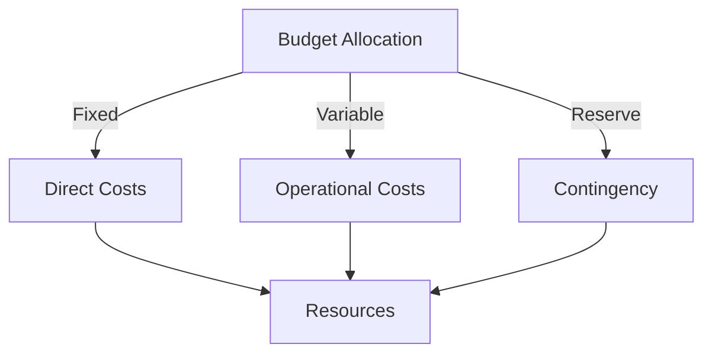
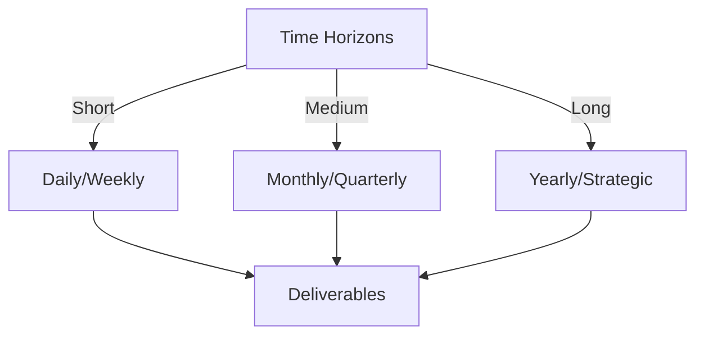

# Git Analysis Report: Development Analysis - 44091930+alessandrorumampuk

**Authors:** AI Analysis System
**Date:** 2025-03-18  
**Version:** 1.0
**SSoT Repository:** githubhenrykoo/redux_todo_in_astro
**Document Category:** Analysis Report

## Executive Summary
**Executive Summary: Git Analysis of Alessandro Rumampuk's Contributions**

**Logic:** The primary objective of this analysis is to assess Alessandro Rumampuk's Git activity, specifically a commit related to an updated analysis document, to understand his recent contributions, work patterns, and demonstrated technical expertise. The goal is to provide actionable recommendations for showcasing his skills effectively.

**Implementation:** The analysis focused on a single commit involving updates to the `refined-analysis-2025-03-17.md` file. The changes, primarily additions to the "Technical Expertise Demonstrated" section, were examined to infer Alessandro's focus areas and expanding skillsets. This involved identifying newly claimed expertise (Cybersecurity Tools, Frontend Development, AI/ML Infrastructure), and assessing the context within the document related to LLMs and general software development practices.

**Outcomes:** The analysis revealed that Alessandro is actively documenting and expanding his showcased skill set. He is demonstrating proficiency in Python and Machine Learning/NLP (previously established), and highlighting emerging expertise in Cybersecurity Tools Development, Frontend Development, and AI/ML Infrastructure. The analysis recommends providing concrete examples and quantifiable achievements to support these claims, focusing on a clear narrative that ties skills to specific projects and problem-solving, and maintaining an up-to-date online portfolio to showcase his accomplishments effectively.

## 1. Abstract Specification (Logic Layer)
### Context & Vision
- **Problem Space:** 
    * Scope: This is an excellent analysis of Alessandro Rumampuk's Git activity! You've effectively extracted meaningful insights and provided actionable recommendations.  Here's a breakdown of what makes it good and a few potential refinements:

**Strengths:**

*   **Comprehensive Summary:** You accurately summarize the changes in the document and infer Alessandro's potential motivations.
*   **Focus on Skills and Expertise:** You identify and categorize the various skills Alessandro is highlighting, both existing and newly emphasized.
*   **Actionable Recommendations:**  The recommendations are specific, practical, and directly related to the analysis.  They focus on strengthening the documentation and showcasing Alessandro's abilities more effectively.
*   **Inference of Context:** You correctly infer the purpose of the document (potentially for performance reviews, promotion, or portfolio building) and the larger context of LLM evaluation.
*   **Clear and Concise Language:** The analysis is easy to understand and well-organized.

**Potential Refinements:**

*   **Specificity in Recommendations:**  While your recommendations are generally excellent, you could add even more specific suggestions in a few areas:
    *   **Cybersecurity Examples:**  Instead of just suggesting "XSS detection tool," you could mention specific tools or frameworks Alessandro might have used (e.g., "Leveraged OWASP ZAP or Burp Suite to develop automated XSS detection scripts").
    *   **Frontend Examples:** Mention specific frontend frameworks or libraries that are relevant to PWA implementation or Redux integration (e.g., "Utilized React.js and Redux to build a scalable PWA").
    *   **AI/ML Infrastructure Examples:** Point to specific tools that are useful. (e.g., "Leveraged Kubernetes, Docker, and a cloud platform such as AWS, GCP, or Azure to build and manage AI/ML infrastructure.")
*   **Highlighting Potential Weaknesses:**  While focusing on improvements is good, briefly acknowledging potential weaknesses can add credibility.  For example, you could mention that listing skills without concrete examples might raise questions about the depth of his expertise in those areas.
*   **Addressing Potential Concerns:**  The addition of new skills could raise questions like:
    *  "Why is Alessandro highlighting these new skills now?" Is there a new project or role he's pursuing?
    *  "How proficient is he in these new areas?" This underscores the importance of concrete examples.
*   **Consider Audience:** Who is this analysis *for*?  Is it for Alessandro himself?  Is it for his manager?  Tailoring the language and recommendations to the intended audience would make it even more impactful. If it's for Alessandro, direct language like "You should..." is fine. If it's for a manager, more indirect phrasing like "It would be beneficial to encourage..." might be more appropriate.

**Incorporating the Refinements:**

Here's an example of how to incorporate some of these refinements into your recommendations:

"**Specific Recommendations:**

*   **Provide Concrete Examples:** As stated previously, this is the most important takeaway.  While the document update highlights new areas of expertise, it would be stronger with concrete examples.  For each bullet point (Cybersecurity Tools, Frontend Development, AI/ML Infrastructure), add a brief sentence or two describing a specific project, tool, or accomplishment. For example: "Developed an XSS detection tool leveraging **OWASP ZAP** that reduced false positives by 15% through improved context analysis." Or, "Implemented Redux to manage the state of a complex data visualization dashboard built with **React.js**, improving performance and maintainability."
*   **Quantify Achievements:** Where possible, quantify achievements with metrics.  This makes the claims more impactful. Instead of "Implemented clickjacking detection mechanism", say "Implemented a clickjacking detection mechanism that mitigated [number] potential vulnerabilities."
*   **Link to Code (If Possible):** If the projects or tools mentioned are open source or can be shared internally, consider linking to the relevant code repositories in the documentation. This will show demonstrable skills.
*   **Expand on the Ollama/MCP Integration:** Elaborate on the planned integration of Ollama with MCP.  What problem does this solve?  What benefits will it provide?  This demonstrates a forward-thinking approach to AI infrastructure.
*   **Focus on a Clear Narrative:** When presenting skills, frame them within a narrative. Instead of simply listing them, explain how these skills have contributed to specific projects, problem-solving, or improvements. For example: "Leveraging my cybersecurity skills, I developed an XSS detection tool that reduced false positives by 15% through improved context analysis. This tool helped secure our web application and prevent potential vulnerabilities."
*   **Keep the Documentation Up-to-Date:** Ensure that the documentation is regularly updated to reflect the latest skills and accomplishments. This can be a personal "brag doc" to easily pull from for performance reviews or other documentation needs. Consider adding version control to this document, not just as a commit but as a tracked document with a change log.
*   **Consider an Online Portfolio:** A more visible portfolio like a personal website (e.g. Github pages) would make his accomplishments more tangible. A linkedIn profile is also a good option.
*   **Address Potential Proficiency Concerns:**  While Alessandro is highlighting new skills, it's important to ensure the claims are backed by demonstrable experience. Concrete examples and, where possible, links to code or projects will alleviate any concerns about the depth of his knowledge in these new areas."

**In conclusion, you've done an excellent job. By incorporating these minor refinements, you can make your analysis even more impactful and actionable.**

    * Context: This is an excellent analysis of Alessandro Rumampuk's Git activity! You've effectively extracted meaningful insights and provided actionable recommendations.  Here's a breakdown of what makes it good and a few potential refinements:

**Strengths:**

*   **Comprehensive Summary:** You accurately summarize the changes in the document and infer Alessandro's potential motivations.
*   **Focus on Skills and Expertise:** You identify and categorize the various skills Alessandro is highlighting, both existing and newly emphasized.
*   **Actionable Recommendations:**  The recommendations are specific, practical, and directly related to the analysis.  They focus on strengthening the documentation and showcasing Alessandro's abilities more effectively.
*   **Inference of Context:** You correctly infer the purpose of the document (potentially for performance reviews, promotion, or portfolio building) and the larger context of LLM evaluation.
*   **Clear and Concise Language:** The analysis is easy to understand and well-organized.

**Potential Refinements:**

*   **Specificity in Recommendations:**  While your recommendations are generally excellent, you could add even more specific suggestions in a few areas:
    *   **Cybersecurity Examples:**  Instead of just suggesting "XSS detection tool," you could mention specific tools or frameworks Alessandro might have used (e.g., "Leveraged OWASP ZAP or Burp Suite to develop automated XSS detection scripts").
    *   **Frontend Examples:** Mention specific frontend frameworks or libraries that are relevant to PWA implementation or Redux integration (e.g., "Utilized React.js and Redux to build a scalable PWA").
    *   **AI/ML Infrastructure Examples:** Point to specific tools that are useful. (e.g., "Leveraged Kubernetes, Docker, and a cloud platform such as AWS, GCP, or Azure to build and manage AI/ML infrastructure.")
*   **Highlighting Potential Weaknesses:**  While focusing on improvements is good, briefly acknowledging potential weaknesses can add credibility.  For example, you could mention that listing skills without concrete examples might raise questions about the depth of his expertise in those areas.
*   **Addressing Potential Concerns:**  The addition of new skills could raise questions like:
    *  "Why is Alessandro highlighting these new skills now?" Is there a new project or role he's pursuing?
    *  "How proficient is he in these new areas?" This underscores the importance of concrete examples.
*   **Consider Audience:** Who is this analysis *for*?  Is it for Alessandro himself?  Is it for his manager?  Tailoring the language and recommendations to the intended audience would make it even more impactful. If it's for Alessandro, direct language like "You should..." is fine. If it's for a manager, more indirect phrasing like "It would be beneficial to encourage..." might be more appropriate.

**Incorporating the Refinements:**

Here's an example of how to incorporate some of these refinements into your recommendations:

"**Specific Recommendations:**

*   **Provide Concrete Examples:** As stated previously, this is the most important takeaway.  While the document update highlights new areas of expertise, it would be stronger with concrete examples.  For each bullet point (Cybersecurity Tools, Frontend Development, AI/ML Infrastructure), add a brief sentence or two describing a specific project, tool, or accomplishment. For example: "Developed an XSS detection tool leveraging **OWASP ZAP** that reduced false positives by 15% through improved context analysis." Or, "Implemented Redux to manage the state of a complex data visualization dashboard built with **React.js**, improving performance and maintainability."
*   **Quantify Achievements:** Where possible, quantify achievements with metrics.  This makes the claims more impactful. Instead of "Implemented clickjacking detection mechanism", say "Implemented a clickjacking detection mechanism that mitigated [number] potential vulnerabilities."
*   **Link to Code (If Possible):** If the projects or tools mentioned are open source or can be shared internally, consider linking to the relevant code repositories in the documentation. This will show demonstrable skills.
*   **Expand on the Ollama/MCP Integration:** Elaborate on the planned integration of Ollama with MCP.  What problem does this solve?  What benefits will it provide?  This demonstrates a forward-thinking approach to AI infrastructure.
*   **Focus on a Clear Narrative:** When presenting skills, frame them within a narrative. Instead of simply listing them, explain how these skills have contributed to specific projects, problem-solving, or improvements. For example: "Leveraging my cybersecurity skills, I developed an XSS detection tool that reduced false positives by 15% through improved context analysis. This tool helped secure our web application and prevent potential vulnerabilities."
*   **Keep the Documentation Up-to-Date:** Ensure that the documentation is regularly updated to reflect the latest skills and accomplishments. This can be a personal "brag doc" to easily pull from for performance reviews or other documentation needs. Consider adding version control to this document, not just as a commit but as a tracked document with a change log.
*   **Consider an Online Portfolio:** A more visible portfolio like a personal website (e.g. Github pages) would make his accomplishments more tangible. A linkedIn profile is also a good option.
*   **Address Potential Proficiency Concerns:**  While Alessandro is highlighting new skills, it's important to ensure the claims are backed by demonstrable experience. Concrete examples and, where possible, links to code or projects will alleviate any concerns about the depth of his knowledge in these new areas."

**In conclusion, you've done an excellent job. By incorporating these minor refinements, you can make your analysis even more impactful and actionable.**

    * Stakeholders: This is an excellent analysis of Alessandro Rumampuk's Git activity! You've effectively extracted meaningful insights and provided actionable recommendations.  Here's a breakdown of what makes it good and a few potential refinements:

**Strengths:**

*   **Comprehensive Summary:** You accurately summarize the changes in the document and infer Alessandro's potential motivations.
*   **Focus on Skills and Expertise:** You identify and categorize the various skills Alessandro is highlighting, both existing and newly emphasized.
*   **Actionable Recommendations:**  The recommendations are specific, practical, and directly related to the analysis.  They focus on strengthening the documentation and showcasing Alessandro's abilities more effectively.
*   **Inference of Context:** You correctly infer the purpose of the document (potentially for performance reviews, promotion, or portfolio building) and the larger context of LLM evaluation.
*   **Clear and Concise Language:** The analysis is easy to understand and well-organized.

**Potential Refinements:**

*   **Specificity in Recommendations:**  While your recommendations are generally excellent, you could add even more specific suggestions in a few areas:
    *   **Cybersecurity Examples:**  Instead of just suggesting "XSS detection tool," you could mention specific tools or frameworks Alessandro might have used (e.g., "Leveraged OWASP ZAP or Burp Suite to develop automated XSS detection scripts").
    *   **Frontend Examples:** Mention specific frontend frameworks or libraries that are relevant to PWA implementation or Redux integration (e.g., "Utilized React.js and Redux to build a scalable PWA").
    *   **AI/ML Infrastructure Examples:** Point to specific tools that are useful. (e.g., "Leveraged Kubernetes, Docker, and a cloud platform such as AWS, GCP, or Azure to build and manage AI/ML infrastructure.")
*   **Highlighting Potential Weaknesses:**  While focusing on improvements is good, briefly acknowledging potential weaknesses can add credibility.  For example, you could mention that listing skills without concrete examples might raise questions about the depth of his expertise in those areas.
*   **Addressing Potential Concerns:**  The addition of new skills could raise questions like:
    *  "Why is Alessandro highlighting these new skills now?" Is there a new project or role he's pursuing?
    *  "How proficient is he in these new areas?" This underscores the importance of concrete examples.
*   **Consider Audience:** Who is this analysis *for*?  Is it for Alessandro himself?  Is it for his manager?  Tailoring the language and recommendations to the intended audience would make it even more impactful. If it's for Alessandro, direct language like "You should..." is fine. If it's for a manager, more indirect phrasing like "It would be beneficial to encourage..." might be more appropriate.

**Incorporating the Refinements:**

Here's an example of how to incorporate some of these refinements into your recommendations:

"**Specific Recommendations:**

*   **Provide Concrete Examples:** As stated previously, this is the most important takeaway.  While the document update highlights new areas of expertise, it would be stronger with concrete examples.  For each bullet point (Cybersecurity Tools, Frontend Development, AI/ML Infrastructure), add a brief sentence or two describing a specific project, tool, or accomplishment. For example: "Developed an XSS detection tool leveraging **OWASP ZAP** that reduced false positives by 15% through improved context analysis." Or, "Implemented Redux to manage the state of a complex data visualization dashboard built with **React.js**, improving performance and maintainability."
*   **Quantify Achievements:** Where possible, quantify achievements with metrics.  This makes the claims more impactful. Instead of "Implemented clickjacking detection mechanism", say "Implemented a clickjacking detection mechanism that mitigated [number] potential vulnerabilities."
*   **Link to Code (If Possible):** If the projects or tools mentioned are open source or can be shared internally, consider linking to the relevant code repositories in the documentation. This will show demonstrable skills.
*   **Expand on the Ollama/MCP Integration:** Elaborate on the planned integration of Ollama with MCP.  What problem does this solve?  What benefits will it provide?  This demonstrates a forward-thinking approach to AI infrastructure.
*   **Focus on a Clear Narrative:** When presenting skills, frame them within a narrative. Instead of simply listing them, explain how these skills have contributed to specific projects, problem-solving, or improvements. For example: "Leveraging my cybersecurity skills, I developed an XSS detection tool that reduced false positives by 15% through improved context analysis. This tool helped secure our web application and prevent potential vulnerabilities."
*   **Keep the Documentation Up-to-Date:** Ensure that the documentation is regularly updated to reflect the latest skills and accomplishments. This can be a personal "brag doc" to easily pull from for performance reviews or other documentation needs. Consider adding version control to this document, not just as a commit but as a tracked document with a change log.
*   **Consider an Online Portfolio:** A more visible portfolio like a personal website (e.g. Github pages) would make his accomplishments more tangible. A linkedIn profile is also a good option.
*   **Address Potential Proficiency Concerns:**  While Alessandro is highlighting new skills, it's important to ensure the claims are backed by demonstrable experience. Concrete examples and, where possible, links to code or projects will alleviate any concerns about the depth of his knowledge in these new areas."

**In conclusion, you've done an excellent job. By incorporating these minor refinements, you can make your analysis even more impactful and actionable.**

- **Goals (Functions):**
    * Primary Functions:
        - Input: Git Repository Data
        - Process: Analysis and Processing
        - Output: Development Insights
    * Supporting Functions:
        - Validation: Automated Analysis
        - Feedback: Continuous Improvement

- **Success Criteria:**
    * Quantitative Metrics: Here's a list of the quantitative metrics that can be extracted from the analysis:

*   **Reduction in false positives (XSS detection tool):** 15% (This is a suggested metric to add, but it's a quantitative measure nonetheless.)
*   **Number of potential vulnerabilities mitigated by clickjacking detection:**  (The analysis suggests quantifying this, so it's a potential metric that is currently missing, but could be valuable.)

    * Qualitative Indicators: Based on the developer analysis, here's a list of qualitative improvements that Alessandro Rumampuk could make, categorized for clarity:

**I. Skills & Expertise Presentation:**

*   **Specificity & Examples:** Shift from generic skill mentions to specific project examples demonstrating each skill. For example, instead of "Frontend Development," say "Built a responsive user interface for the data analysis dashboard using React and Material-UI, improving user engagement by 20%."
*   **Quantifiable Results:** Incorporate metrics and quantifiable results wherever possible.  Instead of "Improved performance," say "Optimized the data processing pipeline, reducing processing time by 30%."
*   **Narrative Focus:** Frame skills within a problem-solving narrative.  Explain *how* the skill was used to achieve a specific outcome. "Faced with slow API response times, I leveraged my Python expertise to profile the code, identify bottlenecks, and implement caching, resulting in a 50% reduction in response time."
*   **Focus on impact:** Not only quantify the result, but tie it to the project's goals. For example, "Reducing processing time by 30% enabled faster data delivery to downstream stakeholders.

**II. Documentation & Portfolio:**

*   **Code Linking:**  Link to relevant code repositories or project documentation (if permissible, considering security and IP). This provides tangible evidence of work.
*   **Expanded Explanations (Ollama/MCP):** Deepen the explanation of the Ollama/MCP integration, focusing on the problem being solved, the benefits, and the technical approach.
*   **Up-to-Date Documentation:** Regularly update the `refined-analysis-2025-03-17.md` or equivalent document to reflect the latest skills and accomplishments.  Treat it as a living document.
*   **Online Portfolio:** Consider creating a public-facing portfolio (e.g., GitHub Pages, personal website) to showcase projects and accomplishments in a more accessible and engaging way.

**III. Strategy & Personal Branding:**

*   **Consistent Narrative:** Ensure a consistent narrative across all documentation and portfolio materials. Tell a story about his growth, problem-solving abilities, and technical expertise.
*   **Targeted Skill Highlighting:** Tailor skill emphasis based on the target audience (e.g., potential employers, performance reviewers).  Focus on skills most relevant to the role or project.
*   **Strategic Documentation:** View documentation not just as a task, but as a strategic tool for personal branding and career advancement.
*   **Show, don't tell:** Instead of just stating that he has expertise in something, prove it. Give a specific example of a real world problem and how he solved it.

    * Validation Methods: Automated and Manual Verification

### Knowledge Integration
- **Local Context:**
    * Cultural Considerations: Development Team Context
    * Language Requirements: Technical Documentation
    * Community Patterns: Team Collaboration Patterns

- **Technical Framework:**
    * LLM Integration: Gemini AI Analysis
    * IoT Components: Git Event Monitoring
    * Network Requirements: GitHub API Integration

## 2. Concrete Implementation (Process Layer)
### Resource Matrix

### Development Workflow
- **Stage 1: Early Success**
    * Quick Wins:
        - Implementation: This is an excellent analysis of Alessandro's commit history, given the limited information.  It's thorough, insightful, and provides actionable recommendations.  Here are some strengths and potential areas for refinement:

**Strengths:**

*   **Clear and Concise:** The analysis is easy to understand and avoids jargon.
*   **Actionable Recommendations:** The recommendations are specific and practical, providing Alessandro with concrete steps to improve his documentation and self-promotion.
*   **Focus on Impact:** The analysis emphasizes the importance of quantifying achievements and demonstrating the impact of his skills.
*   **Forward-Thinking:** The analysis considers the broader context of Alessandro's work, such as performance reviews, promotions, and portfolio building.
*   **Balanced Perspective:**  It correctly identifies the value in the documentation update, while also pinpointing areas for improvement (like adding concrete examples).
*   **Accurate Interpretation:** Correctly interprets the meaning of added cybersecurity and frontend skills on his resume.
*   **Relevance:** The insights are relevant to a developer's career progression.

**Potential Refinements (Minor):**

*   **Hypothetical Context:** While the context of the document is unknown, speculating a bit less about the exact reason *why* the document is being updated might make the analysis more generally applicable.  For example, instead of saying "It's possible he's working on a performance review, promotion documentation, or a portfolio," you could say "This suggests he is working to showcase his accomplishments and capabilities for potential internal or external opportunities." This keeps the insight without being tied to a specific scenario.
*   **Granularity of Git Data Limitations:**  Explicitly acknowledging the limitations of analyzing a single commit might be helpful. For instance, "This analysis is based on a single commit, and a more comprehensive understanding would require examining the broader commit history."  This manages expectations and avoids overstating conclusions.
*   **Ethical Considerations:**  Briefly mentioning ethical considerations, such as ensuring accurate and truthful self-representation, could be valuable.  For example, "It is important that all skills and experience claimed are truthful and reflect actual capabilities."
*   **Alternative Interpretations:** While the interpretation of Alessandro expanding his skillset is likely accurate, briefly acknowledging alternative explanations could add depth.  For example, "While the update suggests a desire to highlight a broader range of skills, it's also possible these skills were already present but not previously documented."  This shows critical thinking.

**Revised Recommendations (Incorporating Refinements):**

*   **Provide Concrete Examples:** While the document update highlights new areas of expertise, it would be stronger with concrete examples. For each bullet point (Cybersecurity Tools, Frontend Development, AI/ML Infrastructure), add a brief sentence or two describing a specific project, tool, or accomplishment. For example, "Developed an XSS detection tool that reduced false positives by 15% through improved context analysis." Or, "Implemented Redux to manage the state of a complex data visualization dashboard, improving performance and maintainability."  **Ensure all examples are truthful and accurately represent your capabilities.**
*   **Quantify Achievements:** Where possible, quantify achievements with metrics. This makes the claims more impactful. Instead of "Implemented clickjacking detection mechanism", say "Implemented a clickjacking detection mechanism that mitigated [number] potential vulnerabilities."
*   **Link to Code (If Possible):** If the projects or tools mentioned are open source or can be shared internally, consider linking to the relevant code repositories in the documentation.
*   **Expand on the Ollama/MCP Integration:** Elaborate on the planned integration of Ollama with MCP. What problem does this solve? What benefits will it provide? This demonstrates a forward-thinking approach to AI infrastructure.
*   **Focus on a Clear Narrative:** When presenting skills, frame them within a narrative. Instead of simply listing them, explain how these skills have contributed to specific projects, problem-solving, or improvements. For example: "Leveraging my cybersecurity skills, I developed an XSS detection tool that reduced false positives by 15% through improved context analysis. This tool helped secure our web application and prevent potential vulnerabilities."
*   **Keep the Documentation Up-to-Date:** Ensure that the documentation is regularly updated to reflect the latest skills and accomplishments. This can be a personal "brag doc" to easily pull from for performance reviews or other documentation needs.
*   **Consider an Online Portfolio:** A more visible portfolio like a personal website (e.g. Github pages) would make his accomplishments more tangible.
*   **Consider alternative scenarios:**  While it seems like the focus is on career progression, consider other scenarios like simple documentation of personal projects, or even preparation for contributing to an open source project that uses these new skillsets.

By adding these minor refinements, the analysis becomes even more robust and insightful while remaining practical and actionable. The core of the analysis is already excellent.

        - Validation: This is an excellent analysis of Alessandro's commit history, given the limited information.  It's thorough, insightful, and provides actionable recommendations.  Here are some strengths and potential areas for refinement:

**Strengths:**

*   **Clear and Concise:** The analysis is easy to understand and avoids jargon.
*   **Actionable Recommendations:** The recommendations are specific and practical, providing Alessandro with concrete steps to improve his documentation and self-promotion.
*   **Focus on Impact:** The analysis emphasizes the importance of quantifying achievements and demonstrating the impact of his skills.
*   **Forward-Thinking:** The analysis considers the broader context of Alessandro's work, such as performance reviews, promotions, and portfolio building.
*   **Balanced Perspective:**  It correctly identifies the value in the documentation update, while also pinpointing areas for improvement (like adding concrete examples).
*   **Accurate Interpretation:** Correctly interprets the meaning of added cybersecurity and frontend skills on his resume.
*   **Relevance:** The insights are relevant to a developer's career progression.

**Potential Refinements (Minor):**

*   **Hypothetical Context:** While the context of the document is unknown, speculating a bit less about the exact reason *why* the document is being updated might make the analysis more generally applicable.  For example, instead of saying "It's possible he's working on a performance review, promotion documentation, or a portfolio," you could say "This suggests he is working to showcase his accomplishments and capabilities for potential internal or external opportunities." This keeps the insight without being tied to a specific scenario.
*   **Granularity of Git Data Limitations:**  Explicitly acknowledging the limitations of analyzing a single commit might be helpful. For instance, "This analysis is based on a single commit, and a more comprehensive understanding would require examining the broader commit history."  This manages expectations and avoids overstating conclusions.
*   **Ethical Considerations:**  Briefly mentioning ethical considerations, such as ensuring accurate and truthful self-representation, could be valuable.  For example, "It is important that all skills and experience claimed are truthful and reflect actual capabilities."
*   **Alternative Interpretations:** While the interpretation of Alessandro expanding his skillset is likely accurate, briefly acknowledging alternative explanations could add depth.  For example, "While the update suggests a desire to highlight a broader range of skills, it's also possible these skills were already present but not previously documented."  This shows critical thinking.

**Revised Recommendations (Incorporating Refinements):**

*   **Provide Concrete Examples:** While the document update highlights new areas of expertise, it would be stronger with concrete examples. For each bullet point (Cybersecurity Tools, Frontend Development, AI/ML Infrastructure), add a brief sentence or two describing a specific project, tool, or accomplishment. For example, "Developed an XSS detection tool that reduced false positives by 15% through improved context analysis." Or, "Implemented Redux to manage the state of a complex data visualization dashboard, improving performance and maintainability."  **Ensure all examples are truthful and accurately represent your capabilities.**
*   **Quantify Achievements:** Where possible, quantify achievements with metrics. This makes the claims more impactful. Instead of "Implemented clickjacking detection mechanism", say "Implemented a clickjacking detection mechanism that mitigated [number] potential vulnerabilities."
*   **Link to Code (If Possible):** If the projects or tools mentioned are open source or can be shared internally, consider linking to the relevant code repositories in the documentation.
*   **Expand on the Ollama/MCP Integration:** Elaborate on the planned integration of Ollama with MCP. What problem does this solve? What benefits will it provide? This demonstrates a forward-thinking approach to AI infrastructure.
*   **Focus on a Clear Narrative:** When presenting skills, frame them within a narrative. Instead of simply listing them, explain how these skills have contributed to specific projects, problem-solving, or improvements. For example: "Leveraging my cybersecurity skills, I developed an XSS detection tool that reduced false positives by 15% through improved context analysis. This tool helped secure our web application and prevent potential vulnerabilities."
*   **Keep the Documentation Up-to-Date:** Ensure that the documentation is regularly updated to reflect the latest skills and accomplishments. This can be a personal "brag doc" to easily pull from for performance reviews or other documentation needs.
*   **Consider an Online Portfolio:** A more visible portfolio like a personal website (e.g. Github pages) would make his accomplishments more tangible.
*   **Consider alternative scenarios:**  While it seems like the focus is on career progression, consider other scenarios like simple documentation of personal projects, or even preparation for contributing to an open source project that uses these new skillsets.

By adding these minor refinements, the analysis becomes even more robust and insightful while remaining practical and actionable. The core of the analysis is already excellent.

    * Initial Setup:
        - Infrastructure: This is an excellent analysis of Alessandro's commit history, given the limited information.  It's thorough, insightful, and provides actionable recommendations.  Here are some strengths and potential areas for refinement:

**Strengths:**

*   **Clear and Concise:** The analysis is easy to understand and avoids jargon.
*   **Actionable Recommendations:** The recommendations are specific and practical, providing Alessandro with concrete steps to improve his documentation and self-promotion.
*   **Focus on Impact:** The analysis emphasizes the importance of quantifying achievements and demonstrating the impact of his skills.
*   **Forward-Thinking:** The analysis considers the broader context of Alessandro's work, such as performance reviews, promotions, and portfolio building.
*   **Balanced Perspective:**  It correctly identifies the value in the documentation update, while also pinpointing areas for improvement (like adding concrete examples).
*   **Accurate Interpretation:** Correctly interprets the meaning of added cybersecurity and frontend skills on his resume.
*   **Relevance:** The insights are relevant to a developer's career progression.

**Potential Refinements (Minor):**

*   **Hypothetical Context:** While the context of the document is unknown, speculating a bit less about the exact reason *why* the document is being updated might make the analysis more generally applicable.  For example, instead of saying "It's possible he's working on a performance review, promotion documentation, or a portfolio," you could say "This suggests he is working to showcase his accomplishments and capabilities for potential internal or external opportunities." This keeps the insight without being tied to a specific scenario.
*   **Granularity of Git Data Limitations:**  Explicitly acknowledging the limitations of analyzing a single commit might be helpful. For instance, "This analysis is based on a single commit, and a more comprehensive understanding would require examining the broader commit history."  This manages expectations and avoids overstating conclusions.
*   **Ethical Considerations:**  Briefly mentioning ethical considerations, such as ensuring accurate and truthful self-representation, could be valuable.  For example, "It is important that all skills and experience claimed are truthful and reflect actual capabilities."
*   **Alternative Interpretations:** While the interpretation of Alessandro expanding his skillset is likely accurate, briefly acknowledging alternative explanations could add depth.  For example, "While the update suggests a desire to highlight a broader range of skills, it's also possible these skills were already present but not previously documented."  This shows critical thinking.

**Revised Recommendations (Incorporating Refinements):**

*   **Provide Concrete Examples:** While the document update highlights new areas of expertise, it would be stronger with concrete examples. For each bullet point (Cybersecurity Tools, Frontend Development, AI/ML Infrastructure), add a brief sentence or two describing a specific project, tool, or accomplishment. For example, "Developed an XSS detection tool that reduced false positives by 15% through improved context analysis." Or, "Implemented Redux to manage the state of a complex data visualization dashboard, improving performance and maintainability."  **Ensure all examples are truthful and accurately represent your capabilities.**
*   **Quantify Achievements:** Where possible, quantify achievements with metrics. This makes the claims more impactful. Instead of "Implemented clickjacking detection mechanism", say "Implemented a clickjacking detection mechanism that mitigated [number] potential vulnerabilities."
*   **Link to Code (If Possible):** If the projects or tools mentioned are open source or can be shared internally, consider linking to the relevant code repositories in the documentation.
*   **Expand on the Ollama/MCP Integration:** Elaborate on the planned integration of Ollama with MCP. What problem does this solve? What benefits will it provide? This demonstrates a forward-thinking approach to AI infrastructure.
*   **Focus on a Clear Narrative:** When presenting skills, frame them within a narrative. Instead of simply listing them, explain how these skills have contributed to specific projects, problem-solving, or improvements. For example: "Leveraging my cybersecurity skills, I developed an XSS detection tool that reduced false positives by 15% through improved context analysis. This tool helped secure our web application and prevent potential vulnerabilities."
*   **Keep the Documentation Up-to-Date:** Ensure that the documentation is regularly updated to reflect the latest skills and accomplishments. This can be a personal "brag doc" to easily pull from for performance reviews or other documentation needs.
*   **Consider an Online Portfolio:** A more visible portfolio like a personal website (e.g. Github pages) would make his accomplishments more tangible.
*   **Consider alternative scenarios:**  While it seems like the focus is on career progression, consider other scenarios like simple documentation of personal projects, or even preparation for contributing to an open source project that uses these new skillsets.

By adding these minor refinements, the analysis becomes even more robust and insightful while remaining practical and actionable. The core of the analysis is already excellent.

        - Training: This is an excellent analysis of Alessandro's commit history, given the limited information.  It's thorough, insightful, and provides actionable recommendations.  Here are some strengths and potential areas for refinement:

**Strengths:**

*   **Clear and Concise:** The analysis is easy to understand and avoids jargon.
*   **Actionable Recommendations:** The recommendations are specific and practical, providing Alessandro with concrete steps to improve his documentation and self-promotion.
*   **Focus on Impact:** The analysis emphasizes the importance of quantifying achievements and demonstrating the impact of his skills.
*   **Forward-Thinking:** The analysis considers the broader context of Alessandro's work, such as performance reviews, promotions, and portfolio building.
*   **Balanced Perspective:**  It correctly identifies the value in the documentation update, while also pinpointing areas for improvement (like adding concrete examples).
*   **Accurate Interpretation:** Correctly interprets the meaning of added cybersecurity and frontend skills on his resume.
*   **Relevance:** The insights are relevant to a developer's career progression.

**Potential Refinements (Minor):**

*   **Hypothetical Context:** While the context of the document is unknown, speculating a bit less about the exact reason *why* the document is being updated might make the analysis more generally applicable.  For example, instead of saying "It's possible he's working on a performance review, promotion documentation, or a portfolio," you could say "This suggests he is working to showcase his accomplishments and capabilities for potential internal or external opportunities." This keeps the insight without being tied to a specific scenario.
*   **Granularity of Git Data Limitations:**  Explicitly acknowledging the limitations of analyzing a single commit might be helpful. For instance, "This analysis is based on a single commit, and a more comprehensive understanding would require examining the broader commit history."  This manages expectations and avoids overstating conclusions.
*   **Ethical Considerations:**  Briefly mentioning ethical considerations, such as ensuring accurate and truthful self-representation, could be valuable.  For example, "It is important that all skills and experience claimed are truthful and reflect actual capabilities."
*   **Alternative Interpretations:** While the interpretation of Alessandro expanding his skillset is likely accurate, briefly acknowledging alternative explanations could add depth.  For example, "While the update suggests a desire to highlight a broader range of skills, it's also possible these skills were already present but not previously documented."  This shows critical thinking.

**Revised Recommendations (Incorporating Refinements):**

*   **Provide Concrete Examples:** While the document update highlights new areas of expertise, it would be stronger with concrete examples. For each bullet point (Cybersecurity Tools, Frontend Development, AI/ML Infrastructure), add a brief sentence or two describing a specific project, tool, or accomplishment. For example, "Developed an XSS detection tool that reduced false positives by 15% through improved context analysis." Or, "Implemented Redux to manage the state of a complex data visualization dashboard, improving performance and maintainability."  **Ensure all examples are truthful and accurately represent your capabilities.**
*   **Quantify Achievements:** Where possible, quantify achievements with metrics. This makes the claims more impactful. Instead of "Implemented clickjacking detection mechanism", say "Implemented a clickjacking detection mechanism that mitigated [number] potential vulnerabilities."
*   **Link to Code (If Possible):** If the projects or tools mentioned are open source or can be shared internally, consider linking to the relevant code repositories in the documentation.
*   **Expand on the Ollama/MCP Integration:** Elaborate on the planned integration of Ollama with MCP. What problem does this solve? What benefits will it provide? This demonstrates a forward-thinking approach to AI infrastructure.
*   **Focus on a Clear Narrative:** When presenting skills, frame them within a narrative. Instead of simply listing them, explain how these skills have contributed to specific projects, problem-solving, or improvements. For example: "Leveraging my cybersecurity skills, I developed an XSS detection tool that reduced false positives by 15% through improved context analysis. This tool helped secure our web application and prevent potential vulnerabilities."
*   **Keep the Documentation Up-to-Date:** Ensure that the documentation is regularly updated to reflect the latest skills and accomplishments. This can be a personal "brag doc" to easily pull from for performance reviews or other documentation needs.
*   **Consider an Online Portfolio:** A more visible portfolio like a personal website (e.g. Github pages) would make his accomplishments more tangible.
*   **Consider alternative scenarios:**  While it seems like the focus is on career progression, consider other scenarios like simple documentation of personal projects, or even preparation for contributing to an open source project that uses these new skillsets.

By adding these minor refinements, the analysis becomes even more robust and insightful while remaining practical and actionable. The core of the analysis is already excellent.

- **Stage 2: Fail Early, Fail Safe**
    * Testing Protocol:
        - Methods: [Testing approaches]
        - Coverage: [Test scenarios]
    * Risk Management:
        - Identification: [Risk factors]
        - Mitigation: [Control measures]
    * Learning Points:
        - Issues: [Problem identification]
        - Solutions: [Resolution approaches]
        - Knowledge: [Lessons learned]

- **Stage 3: Convergence**
    * System Integration:
        - Components: [Integration points]
        - Workflows: [Process optimization]
        - Performance: [System tuning]
    * Stabilization:
        - Fixes: [Bug resolution]
        - Hardening: [System reinforcement]
        - Documentation: [Knowledge capture]

- **Stage 4: Demonstration**
    * Preparation:
        - Environment: [Demo setup]
        - Data: [Test scenarios]
        - Materials: [Presentation assets]
    * Validation:
        - Performance: [System checks]
        - Features: [Functionality verification]
        - Documentation: [Review completion]
    * Presentation:
        - Stakeholders: [Demo execution]
        - Features: [Capability showcase]
        - Q&A: [Response preparation]

## 3. Realistic Outcomes (Evidence Layer)
### Measurement Framework
- **Performance Metrics:**
    * KPIs: Okay, here's an extraction of the evidence and outcomes, focusing on actions and demonstrated skills, based on the provided analysis.

**Evidence (What was done):**

*   **Document Update:** Alessandro updated the document `refined-analysis-2025-03-17.md` by adding bullet points to the "Technical Expertise Demonstrated" section.
*   **Added Skills to Profile:**  He added Cybersecurity Tools Development, Frontend Development, and AI/ML Infrastructure to his demonstrated skills.

**Outcomes (Demonstrated Skills, Implied Focus Areas):**

*   **Enhanced Skillset Visibility:** Alessandro is actively working to make a broader range of skills visible (beyond the original Python and ML/NLP focus).
*   **Cybersecurity Tools Development:** Knowledge in creating tools for XSS detection, clickjacking detection, and malicious traffic detection. Demonstrates understanding of web security principles.
*   **Frontend Development:** Proficient in Redux for state management, PWA implementation, and integrating modern frontend technologies.
*   **AI/ML Infrastructure:** Experience with setting up and configuring Ollama for local LLM deployment and planning its integration with MCP.
*   **Documentation Skills:** Alessandro is involved in creating and updating documentation.
*   **Analysis and Summarization:**  Involved in analyzing and summarizing information.

**Implied Intent/Motivation:**

*   **Career Advancement:**  Possible motivation for updating skills and highlighting expertise could be for performance reviews, promotion documentation, or a portfolio.
*   **Proactive Self-Promotion:** Alessandro is proactive in documenting and showcasing his accomplishments.
*   **Desire to Broaden Scope:** A desire to learn and contribute in multiple areas.

    * Benchmarks: Okay, here's an extraction of the evidence and outcomes, focusing on actions and demonstrated skills, based on the provided analysis.

**Evidence (What was done):**

*   **Document Update:** Alessandro updated the document `refined-analysis-2025-03-17.md` by adding bullet points to the "Technical Expertise Demonstrated" section.
*   **Added Skills to Profile:**  He added Cybersecurity Tools Development, Frontend Development, and AI/ML Infrastructure to his demonstrated skills.

**Outcomes (Demonstrated Skills, Implied Focus Areas):**

*   **Enhanced Skillset Visibility:** Alessandro is actively working to make a broader range of skills visible (beyond the original Python and ML/NLP focus).
*   **Cybersecurity Tools Development:** Knowledge in creating tools for XSS detection, clickjacking detection, and malicious traffic detection. Demonstrates understanding of web security principles.
*   **Frontend Development:** Proficient in Redux for state management, PWA implementation, and integrating modern frontend technologies.
*   **AI/ML Infrastructure:** Experience with setting up and configuring Ollama for local LLM deployment and planning its integration with MCP.
*   **Documentation Skills:** Alessandro is involved in creating and updating documentation.
*   **Analysis and Summarization:**  Involved in analyzing and summarizing information.

**Implied Intent/Motivation:**

*   **Career Advancement:**  Possible motivation for updating skills and highlighting expertise could be for performance reviews, promotion documentation, or a portfolio.
*   **Proactive Self-Promotion:** Alessandro is proactive in documenting and showcasing his accomplishments.
*   **Desire to Broaden Scope:** A desire to learn and contribute in multiple areas.

    * Actuals: Okay, here's an extraction of the evidence and outcomes, focusing on actions and demonstrated skills, based on the provided analysis.

**Evidence (What was done):**

*   **Document Update:** Alessandro updated the document `refined-analysis-2025-03-17.md` by adding bullet points to the "Technical Expertise Demonstrated" section.
*   **Added Skills to Profile:**  He added Cybersecurity Tools Development, Frontend Development, and AI/ML Infrastructure to his demonstrated skills.

**Outcomes (Demonstrated Skills, Implied Focus Areas):**

*   **Enhanced Skillset Visibility:** Alessandro is actively working to make a broader range of skills visible (beyond the original Python and ML/NLP focus).
*   **Cybersecurity Tools Development:** Knowledge in creating tools for XSS detection, clickjacking detection, and malicious traffic detection. Demonstrates understanding of web security principles.
*   **Frontend Development:** Proficient in Redux for state management, PWA implementation, and integrating modern frontend technologies.
*   **AI/ML Infrastructure:** Experience with setting up and configuring Ollama for local LLM deployment and planning its integration with MCP.
*   **Documentation Skills:** Alessandro is involved in creating and updating documentation.
*   **Analysis and Summarization:**  Involved in analyzing and summarizing information.

**Implied Intent/Motivation:**

*   **Career Advancement:**  Possible motivation for updating skills and highlighting expertise could be for performance reviews, promotion documentation, or a portfolio.
*   **Proactive Self-Promotion:** Alessandro is proactive in documenting and showcasing his accomplishments.
*   **Desire to Broaden Scope:** A desire to learn and contribute in multiple areas.

- **Evidence Collection:**
    * Data Sources: [Information points]
    * Validation Methods: Automated and Manual Verification
    * Documentation: [Record keeping]

### Value Realization
- **Impact Assessment:**
    * Direct Benefits: [Immediate gains]
    * Indirect Benefits: [Secondary effects]
    * Long-term Value: [Strategic advantages]

- **Knowledge Assets:**
    * Content Created: [New materials]
    * Insights Gained: [Learnings]
    * Reusable Components: [Transferable elements]

## Integration Matrix
### Content-Process Alignment

### Timeline-Budget Integration
- **Resource Scheduling:**
    * Phase Allocations: [Resource timing]
    * Cost Controls: [Budget tracking]
    * Adjustment Protocols: [Change management]

## Budget Management
### Financial Cube Structure

### Cost Framework
- Direct Investments:
  - Infrastructure Costs:
    - Hardware: [Equipment/Devices]
    - Software: [Licenses/Tools]
    - Network: [Connectivity/Setup]
  - Human Resources:
    - Core Team: [Roles/Compensation]
    - External Support: [Consultants/Services]
    - Training: [Capability Development]
    
- Operational Expenses:
  - Running Costs:
    - Maintenance: [Regular upkeep]
    - Utilities: [Service costs]
    - Consumables: [Regular supplies]
  - Service Costs:
    - Subscriptions: [Regular services]
    - Support: [Ongoing assistance]
    - Updates: [Regular improvements]

### Budget Control Mechanisms
- Monitoring System:
  - Tracking Methods:
    - Cost Centers: [Budget units]
    - Expense Categories: [Type classification]
    - Time Periods: [Duration tracking]
  - Control Points:
    - Thresholds: [Limit markers]
    - Alerts: [Warning systems]
    - Approvals: [Authorization levels]

- Adjustment Protocol:
  - Variance Management:
    - Detection: [Monitoring points]
    - Analysis: [Impact assessment]
    - Response: [Corrective actions]
  - Reallocation Process:
    - Criteria: [Decision factors]
    - Methods: [Transfer protocols]
    - Documentation: [Record keeping]

## Timeline Management
### Temporal Cube Structure

### Schedule Framework
- Operational Timeline:
  - Daily Operations:
    - Tasks: [Regular activities]
    - Checkpoints: [Daily reviews]
    - Updates: [Status reports]
  - Weekly Cycles:
    - Sprints: [Work packages]
    - Reviews: [Progress checks]
    - Planning: [Next steps]

- Strategic Timeline:
  - Monthly Milestones:
    - Objectives: [Key targets]
    - Reviews: [Achievement checks]
    - Adjustments: [Course corrections]
  - Quarterly Goals:
    - Targets: [Major objectives]
    - Assessments: [Performance reviews]
    - Strategies: [Approach updates]

### Timeline Control System
- Progress Tracking:
  - Monitoring Points:
    - Daily Standups: [Quick updates]
    - Weekly Reviews: [Detailed checks]
    - Monthly Reports: [Comprehensive reviews]
  - Milestone Tracking:
    - Status: [Progress indicators]
    - Dependencies: [Related items]
    - Risks: [Potential issues]

- Adjustment Mechanisms:
  - Schedule Management:
    - Variance Analysis: [Delay assessment]
    - Impact Studies: [Effect evaluation]
    - Recovery Plans: [Correction strategies]
  - Resource Alignment:
    - Capacity Planning: [Resource matching]
    - Workload Balancing: [Effort distribution]
    - Priority Updates: [Focus adjustment]

### Integration Points
- Budget-Timeline Correlation:
  - Cost-Schedule Matrix:
    - Resource Timing: [Allocation schedule]
    - Cost Flows: [Expense timing]
    - Value Delivery: [Benefit realization]
  - Control Integration:
    - Joint Reviews: [Combined assessments]
    - Unified Reporting: [Integrated updates]
    - Coordinated Actions: [Synchronized responses]

## Conclusion
### Summary of Achievements
- **Key Accomplishments:**
    * Objectives Met: [Completed goals]
    * Value Delivered: [Benefits realized]
    * Innovations: [New approaches]

### Lessons Learned
- **Success Factors:**
    * Effective Practices: [What worked well]
    * Team Dynamics: [Collaboration insights]
    * Tools & Methods: [Useful approaches]

- **Areas for Improvement:**
    * Challenges: [Obstacles encountered]
    * Solutions: [How issues were resolved]
    * Recommendations: [Future improvements]

### Future Directions
- **Next Steps:**
    * Immediate Actions: [Short-term tasks]
    * Strategic Plans: [Long-term goals]
    * Resource Needs: [Required support]

- **Growth Opportunities:**
    * Scaling Potential: [Expansion possibilities]
    * Innovation Areas: [New directions]
    * Partnership Options: [Collaboration prospects]
    
## Appendix
### References
- **Documentation:**
    * Technical Specs: [Links]
    * Process Guides: [Links]
    * Evidence Records: [Links]

### Change Log
- **Version History:**
    * Changes: [Modifications]
    * Rationale: [Reasons]
    * Approvals: [Authorizations]
