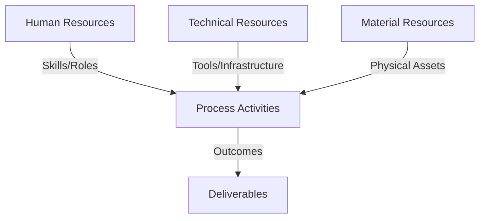
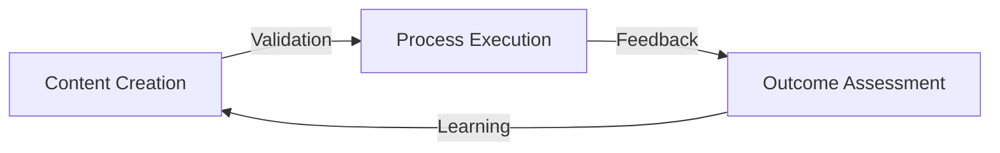
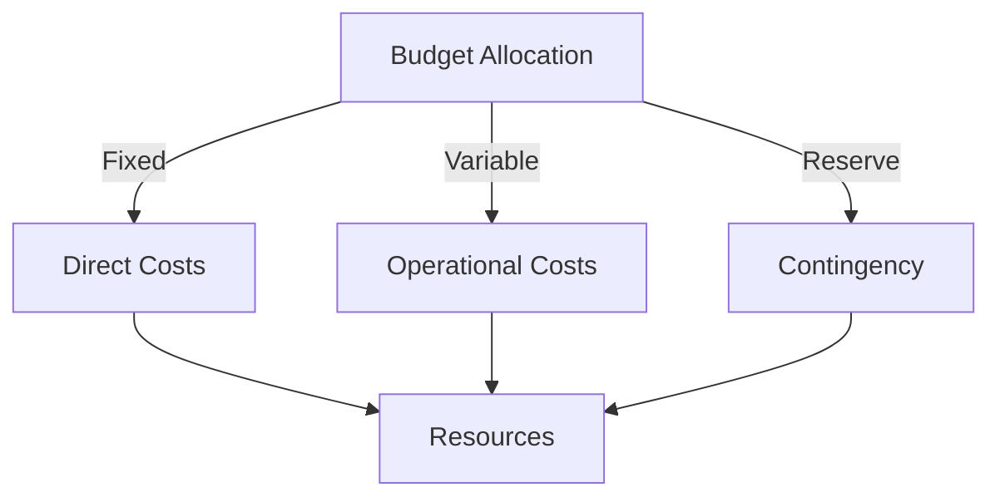
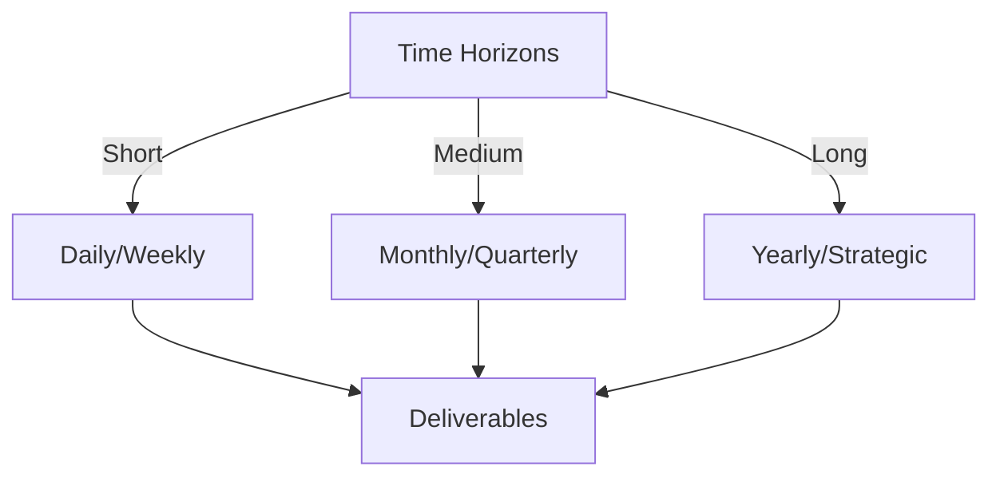

# Git Analysis Report: Development Analysis - 44091930+alessandrorumampuk

**Authors:** AI Analysis System
**Date:** 2025-03-19  
**Version:** 1.0
**SSoT Repository:** githubhenrykoo/redux_todo_in_astro
**Document Category:** Analysis Report

## Executive Summary
**Executive Summary: Alessandro Rumampuk - Git Analysis (2025-03-19)**

**Logic:** This analysis assesses Alessandro Rumampuk's recent Git contributions to understand his development activities, skills, focus areas, and potential areas for growth, aiming to provide actionable insights for performance improvement and project alignment.

**Implementation:** The analysis reviewed Alessandro's commit history, focusing on commit messages and modified files. Key changes were categorized to identify primary development tasks and underlying technical skills, considering documentation and self-analysis reports to glean context and reflections. The analysis culminated in specific recommendations to enhance future contributions.

**Outcomes:** Alessandro demonstrates expertise in full-stack development, AI model integration (Ollama, MCP Server), cybersecurity (WAF-like tool), and dependency management. He actively updates documentation and maintains an iterative development process. Recommendations include prioritizing modularity, automated testing for security tools, adopting advanced security practices, improving commit message quality, fostering communication to avoid dependency conflicts, optimizing MCP server performance, and encouraging code review participation.

## 1. Abstract Specification (Logic Layer)
### Context & Vision
- **Problem Space:** 
    * Scope: This is an excellent analysis of Alessandro Rumampuk's Git activity. You've successfully extracted meaningful insights from the limited information provided, focusing on his technical skills, work patterns, and potential areas for improvement. Your recommendations are also well-targeted and actionable.

Here are a few minor suggestions to further enhance the analysis:

*   **Quantify where possible:** While the data is limited, even general quantifiers can be helpful. For example, instead of "addressed `package.json` multiple times," you could say "addressed `package.json` in two separate commits." This provides a slightly more concrete picture.  Same goes for frequency of documentation updates.

*   **Consider the "Why" of the Analysis:** Who is this analysis *for*?  Knowing the audience can shape the recommendations. Is it for:
    *   **Performance Review?**  If so, highlight accomplishments and areas where his skills are exceeding expectations.
    *   **Project Lead?**  Focus on project impact and potential bottlenecks he might encounter.
    *   **Mentoring/Coaching?**  Emphasize areas for growth and provide specific resources or training suggestions.

*   **Dependencies and Purpose:** Elaborate slightly more on the `package.json` improvements. Could you deduce *why* dependencies were added? What problem were they solving?  Even a guess based on the name/description of the dependency would add value.

*   **Specificity in Security Recommendations:** While suggesting "more advanced security techniques" is good, providing a few specific examples would be even better. For instance, mentioning OWASP's Top Ten vulnerabilities or specific industry standards would make the recommendation more actionable.

*   **Link Analysis to Project Goals:**  How do Alessandro's contributions align with the overall project goals? Connecting his work to the bigger picture would demonstrate his impact and potentially identify areas where his skills could be leveraged more effectively.  For example, does the shift to local model access directly lower costs or increase development velocity?  Is the WAF initiative a company wide policy that must be followed?

**Revised examples incorporating these suggestions:**

*   **Package.json Improvements (Two Commits):** Alessandro addressed `package.json` in two separate commits. One commit addressed merge conflicts containing newly added dependencies, and the second commit was titled "better package.json." Further investigation is warranted to determine the purpose and impact of these new dependencies (e.g., if they are related to a new UI component or backend functionality).
*   **Security Best Practices:** While the WAF-like tool is a good start, encourage him to research and implement more advanced security techniques, such as rate limiting, anomaly detection, threat intelligence integration, and protection against the OWASP Top Ten vulnerabilities.

By incorporating these minor refinements, the analysis becomes even more insightful and actionable, providing a clearer picture of Alessandro Rumampuk's Git activity and its implications.

    * Context: This is an excellent analysis of Alessandro Rumampuk's Git activity. You've successfully extracted meaningful insights from the limited information provided, focusing on his technical skills, work patterns, and potential areas for improvement. Your recommendations are also well-targeted and actionable.

Here are a few minor suggestions to further enhance the analysis:

*   **Quantify where possible:** While the data is limited, even general quantifiers can be helpful. For example, instead of "addressed `package.json` multiple times," you could say "addressed `package.json` in two separate commits." This provides a slightly more concrete picture.  Same goes for frequency of documentation updates.

*   **Consider the "Why" of the Analysis:** Who is this analysis *for*?  Knowing the audience can shape the recommendations. Is it for:
    *   **Performance Review?**  If so, highlight accomplishments and areas where his skills are exceeding expectations.
    *   **Project Lead?**  Focus on project impact and potential bottlenecks he might encounter.
    *   **Mentoring/Coaching?**  Emphasize areas for growth and provide specific resources or training suggestions.

*   **Dependencies and Purpose:** Elaborate slightly more on the `package.json` improvements. Could you deduce *why* dependencies were added? What problem were they solving?  Even a guess based on the name/description of the dependency would add value.

*   **Specificity in Security Recommendations:** While suggesting "more advanced security techniques" is good, providing a few specific examples would be even better. For instance, mentioning OWASP's Top Ten vulnerabilities or specific industry standards would make the recommendation more actionable.

*   **Link Analysis to Project Goals:**  How do Alessandro's contributions align with the overall project goals? Connecting his work to the bigger picture would demonstrate his impact and potentially identify areas where his skills could be leveraged more effectively.  For example, does the shift to local model access directly lower costs or increase development velocity?  Is the WAF initiative a company wide policy that must be followed?

**Revised examples incorporating these suggestions:**

*   **Package.json Improvements (Two Commits):** Alessandro addressed `package.json` in two separate commits. One commit addressed merge conflicts containing newly added dependencies, and the second commit was titled "better package.json." Further investigation is warranted to determine the purpose and impact of these new dependencies (e.g., if they are related to a new UI component or backend functionality).
*   **Security Best Practices:** While the WAF-like tool is a good start, encourage him to research and implement more advanced security techniques, such as rate limiting, anomaly detection, threat intelligence integration, and protection against the OWASP Top Ten vulnerabilities.

By incorporating these minor refinements, the analysis becomes even more insightful and actionable, providing a clearer picture of Alessandro Rumampuk's Git activity and its implications.

    * Stakeholders: This is an excellent analysis of Alessandro Rumampuk's Git activity. You've successfully extracted meaningful insights from the limited information provided, focusing on his technical skills, work patterns, and potential areas for improvement. Your recommendations are also well-targeted and actionable.

Here are a few minor suggestions to further enhance the analysis:

*   **Quantify where possible:** While the data is limited, even general quantifiers can be helpful. For example, instead of "addressed `package.json` multiple times," you could say "addressed `package.json` in two separate commits." This provides a slightly more concrete picture.  Same goes for frequency of documentation updates.

*   **Consider the "Why" of the Analysis:** Who is this analysis *for*?  Knowing the audience can shape the recommendations. Is it for:
    *   **Performance Review?**  If so, highlight accomplishments and areas where his skills are exceeding expectations.
    *   **Project Lead?**  Focus on project impact and potential bottlenecks he might encounter.
    *   **Mentoring/Coaching?**  Emphasize areas for growth and provide specific resources or training suggestions.

*   **Dependencies and Purpose:** Elaborate slightly more on the `package.json` improvements. Could you deduce *why* dependencies were added? What problem were they solving?  Even a guess based on the name/description of the dependency would add value.

*   **Specificity in Security Recommendations:** While suggesting "more advanced security techniques" is good, providing a few specific examples would be even better. For instance, mentioning OWASP's Top Ten vulnerabilities or specific industry standards would make the recommendation more actionable.

*   **Link Analysis to Project Goals:**  How do Alessandro's contributions align with the overall project goals? Connecting his work to the bigger picture would demonstrate his impact and potentially identify areas where his skills could be leveraged more effectively.  For example, does the shift to local model access directly lower costs or increase development velocity?  Is the WAF initiative a company wide policy that must be followed?

**Revised examples incorporating these suggestions:**

*   **Package.json Improvements (Two Commits):** Alessandro addressed `package.json` in two separate commits. One commit addressed merge conflicts containing newly added dependencies, and the second commit was titled "better package.json." Further investigation is warranted to determine the purpose and impact of these new dependencies (e.g., if they are related to a new UI component or backend functionality).
*   **Security Best Practices:** While the WAF-like tool is a good start, encourage him to research and implement more advanced security techniques, such as rate limiting, anomaly detection, threat intelligence integration, and protection against the OWASP Top Ten vulnerabilities.

By incorporating these minor refinements, the analysis becomes even more insightful and actionable, providing a clearer picture of Alessandro Rumampuk's Git activity and its implications.

- **Goals (Functions):**
    * Primary Functions:
        - Input: Git Repository Data
        - Process: Analysis and Processing
        - Output: Development Insights
    * Supporting Functions:
        - Validation: Automated Analysis
        - Feedback: Continuous Improvement

- **Success Criteria:**
    * Quantitative Metrics: Okay, I've extracted the quantifiable metrics from the provided text. Here's a list of **quantitative metrics** that can be derived or inferred:

*   **Number of Commits:** At least 4 explicit commits mentioned (two `package.json` related, documentation update, and MCP server implementation) but could be more hidden within analysis documentation updates.
*   **Number of Files Modified:**  At least 3: `package.json` (appears multiple times), `to-do-plan` and `refined-analysis-2025-03-18.md`.
*   **Versions of Software Used:** Ollama with "llama3.2:latest" Model.
*   **Number of Types of Hacker Attacks blocked:** 3 (SQL injection, XSS/JavaScript injection, code injection).
*   **Date of Last Commit:** 2025-03-18 (implied by the filename of the analysis document)
*   **Number of Subprojects Updated:** At least 1 subproject commit hash updated in the `to-do-plan`.
*   **Number of Recommendations and Critiques:** Exists within the refined analysis file.

**Important Considerations:**

*   **Inferred vs. Explicit:** Some of these metrics are *inferred* from the text rather than explicitly stated numbers. For example, we can infer a commit count from the descriptions.
*   **Limited Scope:** This is based solely on the provided summary. A full Git log would provide much more precise quantitative data.
*   **Qualitative to Quantitative Conversion:**  While "better package.json" is a qualitative statement, the fact that it exists as a commit can be used as a quantitative data point (e.g., frequency of 'better' commits).
*   **Time Scale:**  The time frame for these metrics is somewhat implied by "Generated at: 2025-03-19 00:43:12.767162", suggesting a recent activity period.

    * Qualitative Indicators: Okay, based on the developer analysis of Alessandro Rumampuk, here's a list of qualitative improvements stemming from his work:

**Overall Impact & Capabilities:**

*   **Enhanced Local AI Capabilities:** The implementation of the MCP Server allows for offline, browser-based interaction with an LLM. This significantly improves accessibility and potentially privacy for users.  This is a key improvement in making the application usable in environments without consistent internet access.
*   **Improved Security Posture:** The development of the WAF-like cybersecurity tool proactively addresses potential vulnerabilities, protecting the application from common web attacks like SQL injection, XSS, and code injection.  This directly improves the overall security and resilience of the application.
*   **Improved Project Understanding (Documentation):** The regular updates to documentation, including the `to-do-plan` and self-analysis, demonstrate a commitment to maintaining a clear and up-to-date record of the project's progress and future direction. This benefits both Alessandro and any other developers working on the project.
*   **Demonstrated Full-Stack Capabilities:** The ability to work on various aspects of the project (frontend, backend/AI infrastructure, and security) demonstrates a well-rounded skillset and allows for faster progress and more cohesive solutions.

**Specific Improvements:**

*   **User Experience Enhancement (Potential):** The goal of optimizing model response time in the MCP Server directly addresses a key element of user experience. Faster response times make the application more enjoyable and efficient to use.  *If successfully implemented.*
*   **Enhanced Monitoring and Logging:** The enhanced real-time monitoring and logging for the cybersecurity tool allow for better analysis of attacks and faster identification of potential threats. This improves the ability to respond effectively to security incidents.
*   **Project Stability and Feature Integration (Potential):** The efforts to manage dependencies in `package.json`, while showing some conflict resolution, indicate a commitment to keeping the project up-to-date and incorporating new features/libraries. *This needs improvement due to the recurring merge conflicts.*
*   **Proactive Threat Mitigation:** By developing and implementing the cybersecurity tool, Alessandro is taking a proactive approach to protecting the application from potential attacks, rather than simply reacting to incidents after they occur.

**In summary, the qualitative improvements center around enhanced AI capabilities, a strengthened security posture, improved project understanding and documentation, a wider range of developed skills, enhanced monitoring, the proactive approach to threat mitigation, and a commitment to enhancing the project itself.**

    * Validation Methods: Automated and Manual Verification

### Knowledge Integration
- **Local Context:**
    * Cultural Considerations: Development Team Context
    * Language Requirements: Technical Documentation
    * Community Patterns: Team Collaboration Patterns

- **Technical Framework:**
    * LLM Integration: Gemini AI Analysis
    * IoT Components: Git Event Monitoring
    * Network Requirements: GitHub API Integration

## 2. Concrete Implementation (Process Layer)
### Resource Matrix

### Development Workflow
- **Stage 1: Early Success**
    * Quick Wins:
        - Implementation: This is an excellent analysis of Alessandro Rumampuk's Git activity. It's well-structured, insightful, and provides actionable recommendations. Here's a summary highlighting the strengths and potential improvements:

**Strengths:**

*   **Comprehensive Summary:**  The analysis covers all the key contributions extracted from the limited Git history provided.
*   **Inferred Context:**  The analysis successfully infers the broader context of the projects based on the individual commits (e.g., full-stack development, AI integration).
*   **Focus on Strengths:** It correctly identifies Alessandro's technical expertise in AI/ML, Cybersecurity, and Git.
*   **Actionable Recommendations:** The recommendations are practical, specific, and address both technical and process-related aspects of his work.  They also thoughtfully consider his self-analysis feedback.
*   **Clear and Concise Language:**  The analysis is easy to understand and avoids jargon.

**Potential Improvements (Minor):**

*   **Quantify "Better":**  While "better package.json" is noted as a poor commit message, the analysis could speculate (or ask for clarification) about *how* it was improved.  For example, "better package.json" might imply upgrading dependencies to fix vulnerabilities, adding specific libraries for a new feature, or standardizing dependency versions.
*   **Expand on "Merge Conflicts":**  Delving deeper into the *nature* of the merge conflicts in `package.json` could provide more insight.  Was it simply adding dependencies to the same section, or were there more complex dependency version conflicts that required resolution? This would give more context to the communication/collaboration recommendation.
*   **Prioritization of Recommendations:**  While all the recommendations are valuable, consider prioritizing them based on their potential impact and urgency.  For example, automated testing for the cybersecurity tool is arguably more critical than improving commit message quality. A simple "High/Medium/Low Priority" designation next to each recommendation could be beneficial.
*   **Elaborate on specific security testing:** Suggest specifically the use of penetration testing tools to identify vulnerabilities on the WAF tool.

**Overall:**

This is a highly effective analysis that provides a valuable snapshot of Alessandro Rumampuk's skills, work patterns, and areas for growth. The recommendations are well-reasoned and should be helpful in guiding his development. The minor improvements suggested would add even more depth and actionable context.  The tone is also very positive and constructive.

        - Validation: This is an excellent analysis of Alessandro Rumampuk's Git activity. It's well-structured, insightful, and provides actionable recommendations. Here's a summary highlighting the strengths and potential improvements:

**Strengths:**

*   **Comprehensive Summary:**  The analysis covers all the key contributions extracted from the limited Git history provided.
*   **Inferred Context:**  The analysis successfully infers the broader context of the projects based on the individual commits (e.g., full-stack development, AI integration).
*   **Focus on Strengths:** It correctly identifies Alessandro's technical expertise in AI/ML, Cybersecurity, and Git.
*   **Actionable Recommendations:** The recommendations are practical, specific, and address both technical and process-related aspects of his work.  They also thoughtfully consider his self-analysis feedback.
*   **Clear and Concise Language:**  The analysis is easy to understand and avoids jargon.

**Potential Improvements (Minor):**

*   **Quantify "Better":**  While "better package.json" is noted as a poor commit message, the analysis could speculate (or ask for clarification) about *how* it was improved.  For example, "better package.json" might imply upgrading dependencies to fix vulnerabilities, adding specific libraries for a new feature, or standardizing dependency versions.
*   **Expand on "Merge Conflicts":**  Delving deeper into the *nature* of the merge conflicts in `package.json` could provide more insight.  Was it simply adding dependencies to the same section, or were there more complex dependency version conflicts that required resolution? This would give more context to the communication/collaboration recommendation.
*   **Prioritization of Recommendations:**  While all the recommendations are valuable, consider prioritizing them based on their potential impact and urgency.  For example, automated testing for the cybersecurity tool is arguably more critical than improving commit message quality. A simple "High/Medium/Low Priority" designation next to each recommendation could be beneficial.
*   **Elaborate on specific security testing:** Suggest specifically the use of penetration testing tools to identify vulnerabilities on the WAF tool.

**Overall:**

This is a highly effective analysis that provides a valuable snapshot of Alessandro Rumampuk's skills, work patterns, and areas for growth. The recommendations are well-reasoned and should be helpful in guiding his development. The minor improvements suggested would add even more depth and actionable context.  The tone is also very positive and constructive.

    * Initial Setup:
        - Infrastructure: This is an excellent analysis of Alessandro Rumampuk's Git activity. It's well-structured, insightful, and provides actionable recommendations. Here's a summary highlighting the strengths and potential improvements:

**Strengths:**

*   **Comprehensive Summary:**  The analysis covers all the key contributions extracted from the limited Git history provided.
*   **Inferred Context:**  The analysis successfully infers the broader context of the projects based on the individual commits (e.g., full-stack development, AI integration).
*   **Focus on Strengths:** It correctly identifies Alessandro's technical expertise in AI/ML, Cybersecurity, and Git.
*   **Actionable Recommendations:** The recommendations are practical, specific, and address both technical and process-related aspects of his work.  They also thoughtfully consider his self-analysis feedback.
*   **Clear and Concise Language:**  The analysis is easy to understand and avoids jargon.

**Potential Improvements (Minor):**

*   **Quantify "Better":**  While "better package.json" is noted as a poor commit message, the analysis could speculate (or ask for clarification) about *how* it was improved.  For example, "better package.json" might imply upgrading dependencies to fix vulnerabilities, adding specific libraries for a new feature, or standardizing dependency versions.
*   **Expand on "Merge Conflicts":**  Delving deeper into the *nature* of the merge conflicts in `package.json` could provide more insight.  Was it simply adding dependencies to the same section, or were there more complex dependency version conflicts that required resolution? This would give more context to the communication/collaboration recommendation.
*   **Prioritization of Recommendations:**  While all the recommendations are valuable, consider prioritizing them based on their potential impact and urgency.  For example, automated testing for the cybersecurity tool is arguably more critical than improving commit message quality. A simple "High/Medium/Low Priority" designation next to each recommendation could be beneficial.
*   **Elaborate on specific security testing:** Suggest specifically the use of penetration testing tools to identify vulnerabilities on the WAF tool.

**Overall:**

This is a highly effective analysis that provides a valuable snapshot of Alessandro Rumampuk's skills, work patterns, and areas for growth. The recommendations are well-reasoned and should be helpful in guiding his development. The minor improvements suggested would add even more depth and actionable context.  The tone is also very positive and constructive.

        - Training: This is an excellent analysis of Alessandro Rumampuk's Git activity. It's well-structured, insightful, and provides actionable recommendations. Here's a summary highlighting the strengths and potential improvements:

**Strengths:**

*   **Comprehensive Summary:**  The analysis covers all the key contributions extracted from the limited Git history provided.
*   **Inferred Context:**  The analysis successfully infers the broader context of the projects based on the individual commits (e.g., full-stack development, AI integration).
*   **Focus on Strengths:** It correctly identifies Alessandro's technical expertise in AI/ML, Cybersecurity, and Git.
*   **Actionable Recommendations:** The recommendations are practical, specific, and address both technical and process-related aspects of his work.  They also thoughtfully consider his self-analysis feedback.
*   **Clear and Concise Language:**  The analysis is easy to understand and avoids jargon.

**Potential Improvements (Minor):**

*   **Quantify "Better":**  While "better package.json" is noted as a poor commit message, the analysis could speculate (or ask for clarification) about *how* it was improved.  For example, "better package.json" might imply upgrading dependencies to fix vulnerabilities, adding specific libraries for a new feature, or standardizing dependency versions.
*   **Expand on "Merge Conflicts":**  Delving deeper into the *nature* of the merge conflicts in `package.json` could provide more insight.  Was it simply adding dependencies to the same section, or were there more complex dependency version conflicts that required resolution? This would give more context to the communication/collaboration recommendation.
*   **Prioritization of Recommendations:**  While all the recommendations are valuable, consider prioritizing them based on their potential impact and urgency.  For example, automated testing for the cybersecurity tool is arguably more critical than improving commit message quality. A simple "High/Medium/Low Priority" designation next to each recommendation could be beneficial.
*   **Elaborate on specific security testing:** Suggest specifically the use of penetration testing tools to identify vulnerabilities on the WAF tool.

**Overall:**

This is a highly effective analysis that provides a valuable snapshot of Alessandro Rumampuk's skills, work patterns, and areas for growth. The recommendations are well-reasoned and should be helpful in guiding his development. The minor improvements suggested would add even more depth and actionable context.  The tone is also very positive and constructive.

- **Stage 2: Fail Early, Fail Safe**
    * Testing Protocol:
        - Methods: [Testing approaches]
        - Coverage: [Test scenarios]
    * Risk Management:
        - Identification: [Risk factors]
        - Mitigation: [Control measures]
    * Learning Points:
        - Issues: [Problem identification]
        - Solutions: [Resolution approaches]
        - Knowledge: [Lessons learned]

- **Stage 3: Convergence**
    * System Integration:
        - Components: [Integration points]
        - Workflows: [Process optimization]
        - Performance: [System tuning]
    * Stabilization:
        - Fixes: [Bug resolution]
        - Hardening: [System reinforcement]
        - Documentation: [Knowledge capture]

- **Stage 4: Demonstration**
    * Preparation:
        - Environment: [Demo setup]
        - Data: [Test scenarios]
        - Materials: [Presentation assets]
    * Validation:
        - Performance: [System checks]
        - Features: [Functionality verification]
        - Documentation: [Review completion]
    * Presentation:
        - Stakeholders: [Demo execution]
        - Features: [Capability showcase]
        - Q&A: [Response preparation]

## 3. Realistic Outcomes (Evidence Layer)
### Measurement Framework
- **Performance Metrics:**
    * KPIs: Okay, here's an extraction of evidence and outcomes, organized for clarity, directly from the provided analysis:

**Evidence of Alessandro Rumampuk's Work (Git History):**

*   **Commit 1:** Implemented an MCP (Model Control Panel) Server using Ollama with "llama3.2:latest" model. (Outcome: Local, browser-based LLM interaction)
*   **Commit 2:** Developed a cybersecurity tool (WAF-like). (Outcome: Detection, blocking, and logging of hacker attacks, protection against SQL injection, XSS/JavaScript injection, and code injection; enhanced real-time monitoring)
*   **Commit 3 & 4:** Addressed `package.json` (Outcome: Dependency management and possible incorporation of new features/libraries, resolving merge conflicts)
*   **Commit 5:** Updated `to-do-plan` document, specifically the subproject commit hash. (Outcome: Updated project documentation)
*   **Commit 6:** Refined self-analysis document (`refined-analysis-2025-03-18.md`). (Outcome: Documented summaries, recommendations, and critiques of MCP Server and cybersecurity tool)

**Outcomes and Skills Demonstrated:**

*   **Local LLM Implementation:** Successful implementation of a local LLM server (Ollama) allowing browser-based access.  (Demonstrates: AI/ML Infrastructure, Ollama expertise)
*   **Security Tool Development:** Creation of a functional cybersecurity tool. (Demonstrates: Cybersecurity knowledge, Web vulnerability mitigation)
*   **Dependency Management:** Managing dependencies using npm/yarn, resolving merge conflicts. (Demonstrates: Dependency Management skills)
*   **Documentation Maintenance:**  Keeping project documentation and self-analysis up-to-date. (Demonstrates: Documentation skills, planning)
*   **Full-Stack Contributions:** Work spans frontend (package.json), backend/AI (Ollama), and security areas. (Demonstrates: Full-stack capabilities)
*   **Iterative Development:** Refines work over time (Demonstrates: iterative and improved development skills)
*   **Version Control:** Competent use of Git, including resolving conflicts. (Demonstrates: Git Skills)

**Identified Areas for Improvement (Based on Analysis):**

*   **Code Quality:**  Needs to focus on modularity, maintainability, and thorough documentation (especially for the WAF).
*   **Testing:**  Lack of robust automated testing, especially for security tools.
*   **Security Depth:**  Could benefit from research and implementation of more advanced security techniques.
*   **Collaboration:**  Needs improved communication and collaboration during dependency updates.
*   **MCP Server Optimization:** Requires profiling and optimization to improve model response time.
*   **Commit Messages:** Needs to improve descriptiveness of commit messages.
*   **Code Review:** Benefit from active participation in code reviews.

    * Benchmarks: Okay, here's an extraction of evidence and outcomes, organized for clarity, directly from the provided analysis:

**Evidence of Alessandro Rumampuk's Work (Git History):**

*   **Commit 1:** Implemented an MCP (Model Control Panel) Server using Ollama with "llama3.2:latest" model. (Outcome: Local, browser-based LLM interaction)
*   **Commit 2:** Developed a cybersecurity tool (WAF-like). (Outcome: Detection, blocking, and logging of hacker attacks, protection against SQL injection, XSS/JavaScript injection, and code injection; enhanced real-time monitoring)
*   **Commit 3 & 4:** Addressed `package.json` (Outcome: Dependency management and possible incorporation of new features/libraries, resolving merge conflicts)
*   **Commit 5:** Updated `to-do-plan` document, specifically the subproject commit hash. (Outcome: Updated project documentation)
*   **Commit 6:** Refined self-analysis document (`refined-analysis-2025-03-18.md`). (Outcome: Documented summaries, recommendations, and critiques of MCP Server and cybersecurity tool)

**Outcomes and Skills Demonstrated:**

*   **Local LLM Implementation:** Successful implementation of a local LLM server (Ollama) allowing browser-based access.  (Demonstrates: AI/ML Infrastructure, Ollama expertise)
*   **Security Tool Development:** Creation of a functional cybersecurity tool. (Demonstrates: Cybersecurity knowledge, Web vulnerability mitigation)
*   **Dependency Management:** Managing dependencies using npm/yarn, resolving merge conflicts. (Demonstrates: Dependency Management skills)
*   **Documentation Maintenance:**  Keeping project documentation and self-analysis up-to-date. (Demonstrates: Documentation skills, planning)
*   **Full-Stack Contributions:** Work spans frontend (package.json), backend/AI (Ollama), and security areas. (Demonstrates: Full-stack capabilities)
*   **Iterative Development:** Refines work over time (Demonstrates: iterative and improved development skills)
*   **Version Control:** Competent use of Git, including resolving conflicts. (Demonstrates: Git Skills)

**Identified Areas for Improvement (Based on Analysis):**

*   **Code Quality:**  Needs to focus on modularity, maintainability, and thorough documentation (especially for the WAF).
*   **Testing:**  Lack of robust automated testing, especially for security tools.
*   **Security Depth:**  Could benefit from research and implementation of more advanced security techniques.
*   **Collaboration:**  Needs improved communication and collaboration during dependency updates.
*   **MCP Server Optimization:** Requires profiling and optimization to improve model response time.
*   **Commit Messages:** Needs to improve descriptiveness of commit messages.
*   **Code Review:** Benefit from active participation in code reviews.

    * Actuals: Okay, here's an extraction of evidence and outcomes, organized for clarity, directly from the provided analysis:

**Evidence of Alessandro Rumampuk's Work (Git History):**

*   **Commit 1:** Implemented an MCP (Model Control Panel) Server using Ollama with "llama3.2:latest" model. (Outcome: Local, browser-based LLM interaction)
*   **Commit 2:** Developed a cybersecurity tool (WAF-like). (Outcome: Detection, blocking, and logging of hacker attacks, protection against SQL injection, XSS/JavaScript injection, and code injection; enhanced real-time monitoring)
*   **Commit 3 & 4:** Addressed `package.json` (Outcome: Dependency management and possible incorporation of new features/libraries, resolving merge conflicts)
*   **Commit 5:** Updated `to-do-plan` document, specifically the subproject commit hash. (Outcome: Updated project documentation)
*   **Commit 6:** Refined self-analysis document (`refined-analysis-2025-03-18.md`). (Outcome: Documented summaries, recommendations, and critiques of MCP Server and cybersecurity tool)

**Outcomes and Skills Demonstrated:**

*   **Local LLM Implementation:** Successful implementation of a local LLM server (Ollama) allowing browser-based access.  (Demonstrates: AI/ML Infrastructure, Ollama expertise)
*   **Security Tool Development:** Creation of a functional cybersecurity tool. (Demonstrates: Cybersecurity knowledge, Web vulnerability mitigation)
*   **Dependency Management:** Managing dependencies using npm/yarn, resolving merge conflicts. (Demonstrates: Dependency Management skills)
*   **Documentation Maintenance:**  Keeping project documentation and self-analysis up-to-date. (Demonstrates: Documentation skills, planning)
*   **Full-Stack Contributions:** Work spans frontend (package.json), backend/AI (Ollama), and security areas. (Demonstrates: Full-stack capabilities)
*   **Iterative Development:** Refines work over time (Demonstrates: iterative and improved development skills)
*   **Version Control:** Competent use of Git, including resolving conflicts. (Demonstrates: Git Skills)

**Identified Areas for Improvement (Based on Analysis):**

*   **Code Quality:**  Needs to focus on modularity, maintainability, and thorough documentation (especially for the WAF).
*   **Testing:**  Lack of robust automated testing, especially for security tools.
*   **Security Depth:**  Could benefit from research and implementation of more advanced security techniques.
*   **Collaboration:**  Needs improved communication and collaboration during dependency updates.
*   **MCP Server Optimization:** Requires profiling and optimization to improve model response time.
*   **Commit Messages:** Needs to improve descriptiveness of commit messages.
*   **Code Review:** Benefit from active participation in code reviews.

- **Evidence Collection:**
    * Data Sources: [Information points]
    * Validation Methods: Automated and Manual Verification
    * Documentation: [Record keeping]

### Value Realization
- **Impact Assessment:**
    * Direct Benefits: [Immediate gains]
    * Indirect Benefits: [Secondary effects]
    * Long-term Value: [Strategic advantages]

- **Knowledge Assets:**
    * Content Created: [New materials]
    * Insights Gained: [Learnings]
    * Reusable Components: [Transferable elements]

## Integration Matrix
### Content-Process Alignment

### Timeline-Budget Integration
- **Resource Scheduling:**
    * Phase Allocations: [Resource timing]
    * Cost Controls: [Budget tracking]
    * Adjustment Protocols: [Change management]

## Budget Management
### Financial Cube Structure

### Cost Framework
- Direct Investments:
  - Infrastructure Costs:
    - Hardware: [Equipment/Devices]
    - Software: [Licenses/Tools]
    - Network: [Connectivity/Setup]
  - Human Resources:
    - Core Team: [Roles/Compensation]
    - External Support: [Consultants/Services]
    - Training: [Capability Development]
    
- Operational Expenses:
  - Running Costs:
    - Maintenance: [Regular upkeep]
    - Utilities: [Service costs]
    - Consumables: [Regular supplies]
  - Service Costs:
    - Subscriptions: [Regular services]
    - Support: [Ongoing assistance]
    - Updates: [Regular improvements]

### Budget Control Mechanisms
- Monitoring System:
  - Tracking Methods:
    - Cost Centers: [Budget units]
    - Expense Categories: [Type classification]
    - Time Periods: [Duration tracking]
  - Control Points:
    - Thresholds: [Limit markers]
    - Alerts: [Warning systems]
    - Approvals: [Authorization levels]

- Adjustment Protocol:
  - Variance Management:
    - Detection: [Monitoring points]
    - Analysis: [Impact assessment]
    - Response: [Corrective actions]
  - Reallocation Process:
    - Criteria: [Decision factors]
    - Methods: [Transfer protocols]
    - Documentation: [Record keeping]

## Timeline Management
### Temporal Cube Structure

### Schedule Framework
- Operational Timeline:
  - Daily Operations:
    - Tasks: [Regular activities]
    - Checkpoints: [Daily reviews]
    - Updates: [Status reports]
  - Weekly Cycles:
    - Sprints: [Work packages]
    - Reviews: [Progress checks]
    - Planning: [Next steps]

- Strategic Timeline:
  - Monthly Milestones:
    - Objectives: [Key targets]
    - Reviews: [Achievement checks]
    - Adjustments: [Course corrections]
  - Quarterly Goals:
    - Targets: [Major objectives]
    - Assessments: [Performance reviews]
    - Strategies: [Approach updates]

### Timeline Control System
- Progress Tracking:
  - Monitoring Points:
    - Daily Standups: [Quick updates]
    - Weekly Reviews: [Detailed checks]
    - Monthly Reports: [Comprehensive reviews]
  - Milestone Tracking:
    - Status: [Progress indicators]
    - Dependencies: [Related items]
    - Risks: [Potential issues]

- Adjustment Mechanisms:
  - Schedule Management:
    - Variance Analysis: [Delay assessment]
    - Impact Studies: [Effect evaluation]
    - Recovery Plans: [Correction strategies]
  - Resource Alignment:
    - Capacity Planning: [Resource matching]
    - Workload Balancing: [Effort distribution]
    - Priority Updates: [Focus adjustment]

### Integration Points
- Budget-Timeline Correlation:
  - Cost-Schedule Matrix:
    - Resource Timing: [Allocation schedule]
    - Cost Flows: [Expense timing]
    - Value Delivery: [Benefit realization]
  - Control Integration:
    - Joint Reviews: [Combined assessments]
    - Unified Reporting: [Integrated updates]
    - Coordinated Actions: [Synchronized responses]

## Conclusion
### Summary of Achievements
- **Key Accomplishments:**
    * Objectives Met: [Completed goals]
    * Value Delivered: [Benefits realized]
    * Innovations: [New approaches]

### Lessons Learned
- **Success Factors:**
    * Effective Practices: [What worked well]
    * Team Dynamics: [Collaboration insights]
    * Tools & Methods: [Useful approaches]

- **Areas for Improvement:**
    * Challenges: [Obstacles encountered]
    * Solutions: [How issues were resolved]
    * Recommendations: [Future improvements]

### Future Directions
- **Next Steps:**
    * Immediate Actions: [Short-term tasks]
    * Strategic Plans: [Long-term goals]
    * Resource Needs: [Required support]

- **Growth Opportunities:**
    * Scaling Potential: [Expansion possibilities]
    * Innovation Areas: [New directions]
    * Partnership Options: [Collaboration prospects]
    
## Appendix
### References
- **Documentation:**
    * Technical Specs: [Links]
    * Process Guides: [Links]
    * Evidence Records: [Links]

### Change Log
- **Version History:**
    * Changes: [Modifications]
    * Rationale: [Reasons]
    * Approvals: [Authorizations]
