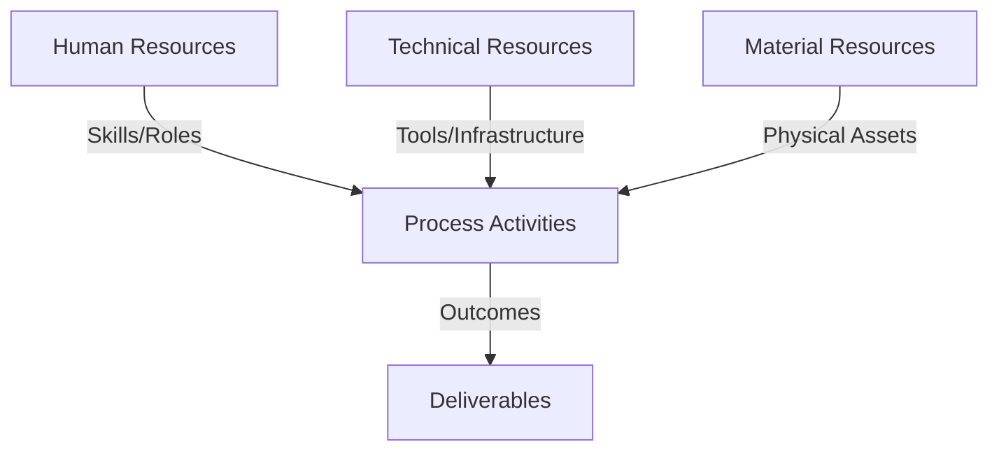
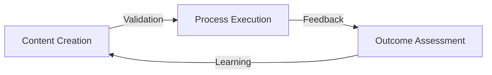
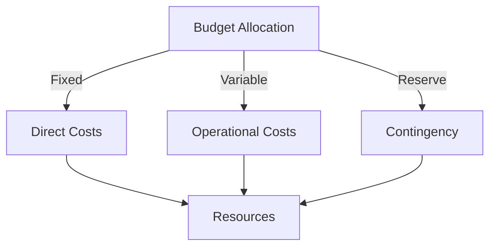
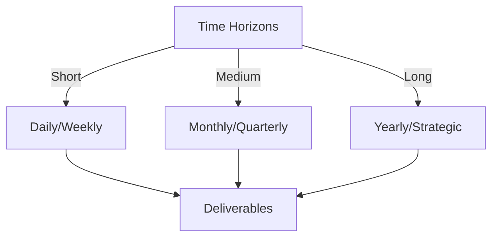

# Git Analysis Report: Development Analysis - Henrykoo

**Authors:** AI Analysis System
**Date:** 2025-03-06  
**Version:** 1.0
**SSoT Repository:** githubhenrykoo/redux_todo_in_astro
**Document Category:** Analysis Report

## Executive Summary
## Executive Summary: Git Analysis of Henrykoo

**Logic:** The core purpose of this analysis is to evaluate Henrykoo's Git contributions, identify work patterns, assess technical expertise, and provide actionable recommendations for improvement. The objective is to understand Henrykoo's role in the project, the areas of focus, and areas where contributions can be enhanced.

**Implementation:** The analysis was conducted by examining Henrykoo's commit history, focusing on changes to workflow files (`.yml`) and the overall flow of commits. The analysis considered the creation, modification, and removal of files related to repository analysis and Telegram notifications. This review revealed patterns in automation, notification integration, and the iterative nature of development. Key Git commands, shell scripting, and workflow configurations were examined to assess technical capabilities.

**Outcomes:** The analysis revealed a focus on automating repository analysis and integrating Telegram notifications. Henrykoo demonstrates proficiency in GitHub Actions, Git, and basic shell scripting. The report identifies a pattern of iterative development and experimentation. Key recommendations include investigating the reasons for removing the analysis workflow, considering alternative methods for sharing analysis reports via Telegram (e.g., summarized notifications, web hosting), breaking down large workflows into modular components, implementing robust error handling and logging, and exploring data visualization techniques to improve report accessibility. Furthermore, it is recommended that best practices of version control and documentation be emphasized.

## 1. Abstract Specification (Logic Layer)
### Context & Vision
- **Problem Space:** 
    * Scope: This is an excellent and thorough analysis of Henrykoo's git activity. It effectively breaks down the provided information into the requested sections and offers insightful recommendations. Here's a breakdown of its strengths and possible minor improvements:

**Strengths:**

*   **Comprehensive Summary:**  The individual contribution summary accurately captures the essence of Henrykoo's work and identifies the overall trends.
*   **Insightful Work Patterns and Focus Areas:** The analysis goes beyond simply stating what Henrykoo did and infers their intentions and potential challenges.  The "Possible Experimentation" point is particularly insightful.
*   **Well-Defined Technical Expertise:**  The analysis accurately identifies the technical skills demonstrated, linking them directly to the commit history. The "implicit" understanding of the Telegram API is a nice touch.
*   **Actionable Recommendations:** The recommendations are practical and address potential issues or areas for improvement. They're also well-justified with clear explanations of *why* each recommendation is being made.
*   **Clear and Concise Language:** The analysis is easy to understand and avoids technical jargon where possible.
*   **Logical Structure:** The report follows a clear and logical structure, making it easy to follow.

**Possible Minor Improvements:**

*   **Quantify Impact (If Possible):** While difficult with limited information, attempting to quantify the impact of the changes would be valuable. For example, "By automating the analysis workflow, Henrykoo potentially saved X hours per week of manual effort." This might require further investigation of the project's context.
*   **Elaborate on Data Visualization:** The recommendation to explore data visualization is good, but you could briefly mention *where* visualizations would be most beneficial. For instance, "Visualize commit activity over time to identify peak periods and potential bottlenecks."
*   **Security Considerations (If Applicable):** If the `TELEGRAM_BOT_TOKEN` is stored as a secret in GitHub Actions, you might briefly mention the importance of secure storage and access control for sensitive credentials. This is especially important if the repository is public.

**Overall:**

This is a well-written and insightful analysis. The recommendations are practical and show a strong understanding of software development and DevOps principles. The minor suggestions above are simply to make it even more comprehensive; the analysis is already excellent as is.  The ability to infer motivations and potential challenges from commit history is a key strength.

    * Context: This is an excellent and thorough analysis of Henrykoo's git activity. It effectively breaks down the provided information into the requested sections and offers insightful recommendations. Here's a breakdown of its strengths and possible minor improvements:

**Strengths:**

*   **Comprehensive Summary:**  The individual contribution summary accurately captures the essence of Henrykoo's work and identifies the overall trends.
*   **Insightful Work Patterns and Focus Areas:** The analysis goes beyond simply stating what Henrykoo did and infers their intentions and potential challenges.  The "Possible Experimentation" point is particularly insightful.
*   **Well-Defined Technical Expertise:**  The analysis accurately identifies the technical skills demonstrated, linking them directly to the commit history. The "implicit" understanding of the Telegram API is a nice touch.
*   **Actionable Recommendations:** The recommendations are practical and address potential issues or areas for improvement. They're also well-justified with clear explanations of *why* each recommendation is being made.
*   **Clear and Concise Language:** The analysis is easy to understand and avoids technical jargon where possible.
*   **Logical Structure:** The report follows a clear and logical structure, making it easy to follow.

**Possible Minor Improvements:**

*   **Quantify Impact (If Possible):** While difficult with limited information, attempting to quantify the impact of the changes would be valuable. For example, "By automating the analysis workflow, Henrykoo potentially saved X hours per week of manual effort." This might require further investigation of the project's context.
*   **Elaborate on Data Visualization:** The recommendation to explore data visualization is good, but you could briefly mention *where* visualizations would be most beneficial. For instance, "Visualize commit activity over time to identify peak periods and potential bottlenecks."
*   **Security Considerations (If Applicable):** If the `TELEGRAM_BOT_TOKEN` is stored as a secret in GitHub Actions, you might briefly mention the importance of secure storage and access control for sensitive credentials. This is especially important if the repository is public.

**Overall:**

This is a well-written and insightful analysis. The recommendations are practical and show a strong understanding of software development and DevOps principles. The minor suggestions above are simply to make it even more comprehensive; the analysis is already excellent as is.  The ability to infer motivations and potential challenges from commit history is a key strength.

    * Stakeholders: This is an excellent and thorough analysis of Henrykoo's git activity. It effectively breaks down the provided information into the requested sections and offers insightful recommendations. Here's a breakdown of its strengths and possible minor improvements:

**Strengths:**

*   **Comprehensive Summary:**  The individual contribution summary accurately captures the essence of Henrykoo's work and identifies the overall trends.
*   **Insightful Work Patterns and Focus Areas:** The analysis goes beyond simply stating what Henrykoo did and infers their intentions and potential challenges.  The "Possible Experimentation" point is particularly insightful.
*   **Well-Defined Technical Expertise:**  The analysis accurately identifies the technical skills demonstrated, linking them directly to the commit history. The "implicit" understanding of the Telegram API is a nice touch.
*   **Actionable Recommendations:** The recommendations are practical and address potential issues or areas for improvement. They're also well-justified with clear explanations of *why* each recommendation is being made.
*   **Clear and Concise Language:** The analysis is easy to understand and avoids technical jargon where possible.
*   **Logical Structure:** The report follows a clear and logical structure, making it easy to follow.

**Possible Minor Improvements:**

*   **Quantify Impact (If Possible):** While difficult with limited information, attempting to quantify the impact of the changes would be valuable. For example, "By automating the analysis workflow, Henrykoo potentially saved X hours per week of manual effort." This might require further investigation of the project's context.
*   **Elaborate on Data Visualization:** The recommendation to explore data visualization is good, but you could briefly mention *where* visualizations would be most beneficial. For instance, "Visualize commit activity over time to identify peak periods and potential bottlenecks."
*   **Security Considerations (If Applicable):** If the `TELEGRAM_BOT_TOKEN` is stored as a secret in GitHub Actions, you might briefly mention the importance of secure storage and access control for sensitive credentials. This is especially important if the repository is public.

**Overall:**

This is a well-written and insightful analysis. The recommendations are practical and show a strong understanding of software development and DevOps principles. The minor suggestions above are simply to make it even more comprehensive; the analysis is already excellent as is.  The ability to infer motivations and potential challenges from commit history is a key strength.

- **Goals (Functions):**
    * Primary Functions:
        - Input: Git Repository Data
        - Process: Analysis and Processing
        - Output: Development Insights
    * Supporting Functions:
        - Validation: Automated Analysis
        - Feedback: Continuous Improvement

- **Success Criteria:**
    * Quantitative Metrics: Here's a list of the quantitative metrics mentioned or implied in the provided developer analysis:

*   **Frequency of Commits:**  Implied through the analysis of git activity over time. We could count the number of commits Henrykoo made within the analyzed period if commit history was included.
*   **Number of Files Modified:**  Implied within the description of the `repo_analysis.yml` workflow; the analysis generated information about files.  We could count the number of files changed in each commit.
*   **Number of Top Contributors:** The repo analysis workflow was designed to gather statistics on top contributors.
*   **Daily Schedule:** The `repo_analysis.yml` workflow was configured to run on a "daily schedule". (Frequency)
*   **Telegram Chat ID:**  A specific identification number for the telegram chat.
*   **Run ID:** A unique numerical identifier for each action run.

    * Qualitative Indicators: Okay, here's a list of the qualitative improvements that Henrykoo could make, based on the analysis provided:

*   **Increased Clarity on Workflow Purpose:** The reason for removing the analysis workflow (`repo_analysis.yml`) should be investigated and understood. Knowing *why* this was removed will prevent repeating mistakes and guide future efforts.

*   **Improved Telegram Notifications:**
    *   **Actionable Insights in Notifications:** Rather than just attaching files or providing a link, the Telegram notifications should provide *key insights* from the analysis directly in the message. This makes the information more immediately accessible and actionable.
    *   **Alternative Delivery Methods:** Instead of file attachments, explore alternative ways to deliver the report (summarized metrics, web hosting).

*   **Workflow Modularity:**  Break down complex workflows (like the original `repo_analysis.yml`) into smaller, more manageable, and reusable components. This will improve maintainability, debuggability, and reusability.

*   **Robust Error Handling and Logging:** Implement better error handling and more detailed logging within the workflows. This allows for quicker diagnosis and resolution of issues.  Specifically, include error checks after critical commands (e.g., Git commands).

*   **Enhanced Data Presentation:**  Go beyond simple text-based reports and incorporate data visualization techniques (charts, graphs) to make the analysis more engaging and easier to understand.

*   **Code Management:** Use appropriate branching strategies for new features and bug fixes in order to preserve code integrity.

*   **Documentation Practices:** Document workflow configurations to clarify purpose, expected inputs, and outputs to improve collaboration.
    * Validation Methods: Automated and Manual Verification

### Knowledge Integration
- **Local Context:**
    * Cultural Considerations: Development Team Context
    * Language Requirements: Technical Documentation
    * Community Patterns: Team Collaboration Patterns

- **Technical Framework:**
    * LLM Integration: Gemini AI Analysis
    * IoT Components: Git Event Monitoring
    * Network Requirements: GitHub API Integration

## 2. Concrete Implementation (Process Layer)
### Resource Matrix

### Development Workflow
- **Stage 1: Early Success**
    * Quick Wins:
        - Implementation: This is an excellent analysis of Henrykoo's development workflow based on the provided git history summary.  It's thorough, well-organized, and provides insightful recommendations. Here's a breakdown of why it's good and suggestions for minor improvements:

**Strengths:**

*   **Comprehensive Coverage:** It covers all the key areas: Individual Contribution Summary, Work Patterns and Focus Areas, Technical Expertise Demonstrated, and Specific Recommendations.
*   **Logical Organization:** The structure is clear and easy to follow. Each section addresses the specific aspects it promises to.
*   **Detailed Insights:** The analysis goes beyond simply listing what Henrykoo did. It provides *interpretations* of the actions, inferring motivations and potential challenges. For example, the observation about iterative development based on the reverted Telegram notification changes is astute.
*   **Actionable Recommendations:** The recommendations are practical and specific. They offer concrete suggestions for improvement based on the observed patterns.
*   **Well-Justified:** The conclusions are supported by evidence from the git history. The analysis consistently links actions to the resulting inferences.
*   **Technical Accuracy:** The analysis demonstrates a good understanding of Git, GitHub Actions, and associated technologies like shell scripting and the Telegram API.

**Minor Improvements:**

*   **Granularity of Contribution Summary:**  While the contribution summary is good, it could be slightly more granular. Instead of grouping all changes to `telegram-notification.yml`, consider listing them as separate points. For example:
    *   "Modified `telegram-notification.yml` to include repository name, event, branch, and commit hash in the notification."
    *   "Modified `telegram-notification.yml` to attach the Gemini analysis file to the notification."
    *   "Reverted `telegram-notification.yml` to remove Gemini analysis file attachment, replacing it with the action run URL."

    This finer-grained approach makes the progression of changes clearer.
*   **Specificity of "Shell Scripting" in Expertise:** In the Technical Expertise section, specifying *which* commands were used in the shell scripts within `repo_analysis.yml` would add more weight to the expertise claim.  For example: "Git commands like `add`, `commit`, `push`, `log`, `rev-list`, `ls-files`, `shortlog` and basic shell commands like `date`, `echo`, `>` (redirection)."
*   **Emphasis on the Downside of Removing the Analysis:** While the analysis mentions the removal of the workflow, it could be slightly more forceful in highlighting the *potential* loss of value.  Perhaps suggest: "The removal of the `repo_analysis.yml` workflow means that automated repository analysis is no longer occurring.  It's important to understand the cost-benefit trade-off of losing this automated insight versus the resources saved."
*   **Suggestion for workflow creation:** Create a suggested workflow to demonstrate how to create a data visualization.

**Example Incorporating the Improvements:**

Here's how the contribution summary and technical expertise could be tweaked:

**1. Individual Contribution Summary (Revised):**

Henrykoo's contributions focus on automating repository analysis and integrating it with Telegram notifications.  The overall trend involves:

*   **Adding a Repository Analysis Workflow:** Initial effort to create a GitHub Actions workflow (`repo_analysis.yml`) to automatically generate and commit a repository analysis report on a daily schedule...
*   **Modified `telegram-notification.yml`:** Included repository name, event, branch, and commit hash in the Telegram notification.
*   **Modified `telegram-notification.yml`:** Attempted to attach the Gemini analysis file to the Telegram notification.
*   **Reverted `telegram-notification.yml`:** Removed the Gemini analysis file attachment, replacing it with the action run URL.
*   **Removing the Repository Analysis Workflow:** The `repo_analysis.yml` workflow was completely removed.

**3. Technical Expertise Demonstrated (Revised):**

*   **GitHub Actions:**  Proficiency in creating and modifying GitHub Actions workflows is demonstrated through the commits involving `.yml` files...
*   **Git:** Competent with basic Git commands like `add`, `commit`, `push`, `log`, `rev-list`, `ls-files`, `shortlog`, and understanding of `.gitignore`.
*   **Shell Scripting:** The `repo_analysis.yml` workflow contains shell scripting for generating the repository analysis report, utilizing Git commands like `git log`, `git rev-list`, `git ls-files`, `git shortlog` along with basic shell commands like `date`, `echo`, and redirection (`>`).
*   **Telegram API (Implicit):** ...

These are minor suggestions, however. The initial analysis is already very strong and provides a valuable overview of Henrykoo's development activity.  The attention to detail and insightful interpretations make it a useful tool for understanding the developer's work patterns and technical capabilities.

        - Validation: This is an excellent analysis of Henrykoo's development workflow based on the provided git history summary.  It's thorough, well-organized, and provides insightful recommendations. Here's a breakdown of why it's good and suggestions for minor improvements:

**Strengths:**

*   **Comprehensive Coverage:** It covers all the key areas: Individual Contribution Summary, Work Patterns and Focus Areas, Technical Expertise Demonstrated, and Specific Recommendations.
*   **Logical Organization:** The structure is clear and easy to follow. Each section addresses the specific aspects it promises to.
*   **Detailed Insights:** The analysis goes beyond simply listing what Henrykoo did. It provides *interpretations* of the actions, inferring motivations and potential challenges. For example, the observation about iterative development based on the reverted Telegram notification changes is astute.
*   **Actionable Recommendations:** The recommendations are practical and specific. They offer concrete suggestions for improvement based on the observed patterns.
*   **Well-Justified:** The conclusions are supported by evidence from the git history. The analysis consistently links actions to the resulting inferences.
*   **Technical Accuracy:** The analysis demonstrates a good understanding of Git, GitHub Actions, and associated technologies like shell scripting and the Telegram API.

**Minor Improvements:**

*   **Granularity of Contribution Summary:**  While the contribution summary is good, it could be slightly more granular. Instead of grouping all changes to `telegram-notification.yml`, consider listing them as separate points. For example:
    *   "Modified `telegram-notification.yml` to include repository name, event, branch, and commit hash in the notification."
    *   "Modified `telegram-notification.yml` to attach the Gemini analysis file to the notification."
    *   "Reverted `telegram-notification.yml` to remove Gemini analysis file attachment, replacing it with the action run URL."

    This finer-grained approach makes the progression of changes clearer.
*   **Specificity of "Shell Scripting" in Expertise:** In the Technical Expertise section, specifying *which* commands were used in the shell scripts within `repo_analysis.yml` would add more weight to the expertise claim.  For example: "Git commands like `add`, `commit`, `push`, `log`, `rev-list`, `ls-files`, `shortlog` and basic shell commands like `date`, `echo`, `>` (redirection)."
*   **Emphasis on the Downside of Removing the Analysis:** While the analysis mentions the removal of the workflow, it could be slightly more forceful in highlighting the *potential* loss of value.  Perhaps suggest: "The removal of the `repo_analysis.yml` workflow means that automated repository analysis is no longer occurring.  It's important to understand the cost-benefit trade-off of losing this automated insight versus the resources saved."
*   **Suggestion for workflow creation:** Create a suggested workflow to demonstrate how to create a data visualization.

**Example Incorporating the Improvements:**

Here's how the contribution summary and technical expertise could be tweaked:

**1. Individual Contribution Summary (Revised):**

Henrykoo's contributions focus on automating repository analysis and integrating it with Telegram notifications.  The overall trend involves:

*   **Adding a Repository Analysis Workflow:** Initial effort to create a GitHub Actions workflow (`repo_analysis.yml`) to automatically generate and commit a repository analysis report on a daily schedule...
*   **Modified `telegram-notification.yml`:** Included repository name, event, branch, and commit hash in the Telegram notification.
*   **Modified `telegram-notification.yml`:** Attempted to attach the Gemini analysis file to the Telegram notification.
*   **Reverted `telegram-notification.yml`:** Removed the Gemini analysis file attachment, replacing it with the action run URL.
*   **Removing the Repository Analysis Workflow:** The `repo_analysis.yml` workflow was completely removed.

**3. Technical Expertise Demonstrated (Revised):**

*   **GitHub Actions:**  Proficiency in creating and modifying GitHub Actions workflows is demonstrated through the commits involving `.yml` files...
*   **Git:** Competent with basic Git commands like `add`, `commit`, `push`, `log`, `rev-list`, `ls-files`, `shortlog`, and understanding of `.gitignore`.
*   **Shell Scripting:** The `repo_analysis.yml` workflow contains shell scripting for generating the repository analysis report, utilizing Git commands like `git log`, `git rev-list`, `git ls-files`, `git shortlog` along with basic shell commands like `date`, `echo`, and redirection (`>`).
*   **Telegram API (Implicit):** ...

These are minor suggestions, however. The initial analysis is already very strong and provides a valuable overview of Henrykoo's development activity.  The attention to detail and insightful interpretations make it a useful tool for understanding the developer's work patterns and technical capabilities.

    * Initial Setup:
        - Infrastructure: This is an excellent analysis of Henrykoo's development workflow based on the provided git history summary.  It's thorough, well-organized, and provides insightful recommendations. Here's a breakdown of why it's good and suggestions for minor improvements:

**Strengths:**

*   **Comprehensive Coverage:** It covers all the key areas: Individual Contribution Summary, Work Patterns and Focus Areas, Technical Expertise Demonstrated, and Specific Recommendations.
*   **Logical Organization:** The structure is clear and easy to follow. Each section addresses the specific aspects it promises to.
*   **Detailed Insights:** The analysis goes beyond simply listing what Henrykoo did. It provides *interpretations* of the actions, inferring motivations and potential challenges. For example, the observation about iterative development based on the reverted Telegram notification changes is astute.
*   **Actionable Recommendations:** The recommendations are practical and specific. They offer concrete suggestions for improvement based on the observed patterns.
*   **Well-Justified:** The conclusions are supported by evidence from the git history. The analysis consistently links actions to the resulting inferences.
*   **Technical Accuracy:** The analysis demonstrates a good understanding of Git, GitHub Actions, and associated technologies like shell scripting and the Telegram API.

**Minor Improvements:**

*   **Granularity of Contribution Summary:**  While the contribution summary is good, it could be slightly more granular. Instead of grouping all changes to `telegram-notification.yml`, consider listing them as separate points. For example:
    *   "Modified `telegram-notification.yml` to include repository name, event, branch, and commit hash in the notification."
    *   "Modified `telegram-notification.yml` to attach the Gemini analysis file to the notification."
    *   "Reverted `telegram-notification.yml` to remove Gemini analysis file attachment, replacing it with the action run URL."

    This finer-grained approach makes the progression of changes clearer.
*   **Specificity of "Shell Scripting" in Expertise:** In the Technical Expertise section, specifying *which* commands were used in the shell scripts within `repo_analysis.yml` would add more weight to the expertise claim.  For example: "Git commands like `add`, `commit`, `push`, `log`, `rev-list`, `ls-files`, `shortlog` and basic shell commands like `date`, `echo`, `>` (redirection)."
*   **Emphasis on the Downside of Removing the Analysis:** While the analysis mentions the removal of the workflow, it could be slightly more forceful in highlighting the *potential* loss of value.  Perhaps suggest: "The removal of the `repo_analysis.yml` workflow means that automated repository analysis is no longer occurring.  It's important to understand the cost-benefit trade-off of losing this automated insight versus the resources saved."
*   **Suggestion for workflow creation:** Create a suggested workflow to demonstrate how to create a data visualization.

**Example Incorporating the Improvements:**

Here's how the contribution summary and technical expertise could be tweaked:

**1. Individual Contribution Summary (Revised):**

Henrykoo's contributions focus on automating repository analysis and integrating it with Telegram notifications.  The overall trend involves:

*   **Adding a Repository Analysis Workflow:** Initial effort to create a GitHub Actions workflow (`repo_analysis.yml`) to automatically generate and commit a repository analysis report on a daily schedule...
*   **Modified `telegram-notification.yml`:** Included repository name, event, branch, and commit hash in the Telegram notification.
*   **Modified `telegram-notification.yml`:** Attempted to attach the Gemini analysis file to the Telegram notification.
*   **Reverted `telegram-notification.yml`:** Removed the Gemini analysis file attachment, replacing it with the action run URL.
*   **Removing the Repository Analysis Workflow:** The `repo_analysis.yml` workflow was completely removed.

**3. Technical Expertise Demonstrated (Revised):**

*   **GitHub Actions:**  Proficiency in creating and modifying GitHub Actions workflows is demonstrated through the commits involving `.yml` files...
*   **Git:** Competent with basic Git commands like `add`, `commit`, `push`, `log`, `rev-list`, `ls-files`, `shortlog`, and understanding of `.gitignore`.
*   **Shell Scripting:** The `repo_analysis.yml` workflow contains shell scripting for generating the repository analysis report, utilizing Git commands like `git log`, `git rev-list`, `git ls-files`, `git shortlog` along with basic shell commands like `date`, `echo`, and redirection (`>`).
*   **Telegram API (Implicit):** ...

These are minor suggestions, however. The initial analysis is already very strong and provides a valuable overview of Henrykoo's development activity.  The attention to detail and insightful interpretations make it a useful tool for understanding the developer's work patterns and technical capabilities.

        - Training: This is an excellent analysis of Henrykoo's development workflow based on the provided git history summary.  It's thorough, well-organized, and provides insightful recommendations. Here's a breakdown of why it's good and suggestions for minor improvements:

**Strengths:**

*   **Comprehensive Coverage:** It covers all the key areas: Individual Contribution Summary, Work Patterns and Focus Areas, Technical Expertise Demonstrated, and Specific Recommendations.
*   **Logical Organization:** The structure is clear and easy to follow. Each section addresses the specific aspects it promises to.
*   **Detailed Insights:** The analysis goes beyond simply listing what Henrykoo did. It provides *interpretations* of the actions, inferring motivations and potential challenges. For example, the observation about iterative development based on the reverted Telegram notification changes is astute.
*   **Actionable Recommendations:** The recommendations are practical and specific. They offer concrete suggestions for improvement based on the observed patterns.
*   **Well-Justified:** The conclusions are supported by evidence from the git history. The analysis consistently links actions to the resulting inferences.
*   **Technical Accuracy:** The analysis demonstrates a good understanding of Git, GitHub Actions, and associated technologies like shell scripting and the Telegram API.

**Minor Improvements:**

*   **Granularity of Contribution Summary:**  While the contribution summary is good, it could be slightly more granular. Instead of grouping all changes to `telegram-notification.yml`, consider listing them as separate points. For example:
    *   "Modified `telegram-notification.yml` to include repository name, event, branch, and commit hash in the notification."
    *   "Modified `telegram-notification.yml` to attach the Gemini analysis file to the notification."
    *   "Reverted `telegram-notification.yml` to remove Gemini analysis file attachment, replacing it with the action run URL."

    This finer-grained approach makes the progression of changes clearer.
*   **Specificity of "Shell Scripting" in Expertise:** In the Technical Expertise section, specifying *which* commands were used in the shell scripts within `repo_analysis.yml` would add more weight to the expertise claim.  For example: "Git commands like `add`, `commit`, `push`, `log`, `rev-list`, `ls-files`, `shortlog` and basic shell commands like `date`, `echo`, `>` (redirection)."
*   **Emphasis on the Downside of Removing the Analysis:** While the analysis mentions the removal of the workflow, it could be slightly more forceful in highlighting the *potential* loss of value.  Perhaps suggest: "The removal of the `repo_analysis.yml` workflow means that automated repository analysis is no longer occurring.  It's important to understand the cost-benefit trade-off of losing this automated insight versus the resources saved."
*   **Suggestion for workflow creation:** Create a suggested workflow to demonstrate how to create a data visualization.

**Example Incorporating the Improvements:**

Here's how the contribution summary and technical expertise could be tweaked:

**1. Individual Contribution Summary (Revised):**

Henrykoo's contributions focus on automating repository analysis and integrating it with Telegram notifications.  The overall trend involves:

*   **Adding a Repository Analysis Workflow:** Initial effort to create a GitHub Actions workflow (`repo_analysis.yml`) to automatically generate and commit a repository analysis report on a daily schedule...
*   **Modified `telegram-notification.yml`:** Included repository name, event, branch, and commit hash in the Telegram notification.
*   **Modified `telegram-notification.yml`:** Attempted to attach the Gemini analysis file to the Telegram notification.
*   **Reverted `telegram-notification.yml`:** Removed the Gemini analysis file attachment, replacing it with the action run URL.
*   **Removing the Repository Analysis Workflow:** The `repo_analysis.yml` workflow was completely removed.

**3. Technical Expertise Demonstrated (Revised):**

*   **GitHub Actions:**  Proficiency in creating and modifying GitHub Actions workflows is demonstrated through the commits involving `.yml` files...
*   **Git:** Competent with basic Git commands like `add`, `commit`, `push`, `log`, `rev-list`, `ls-files`, `shortlog`, and understanding of `.gitignore`.
*   **Shell Scripting:** The `repo_analysis.yml` workflow contains shell scripting for generating the repository analysis report, utilizing Git commands like `git log`, `git rev-list`, `git ls-files`, `git shortlog` along with basic shell commands like `date`, `echo`, and redirection (`>`).
*   **Telegram API (Implicit):** ...

These are minor suggestions, however. The initial analysis is already very strong and provides a valuable overview of Henrykoo's development activity.  The attention to detail and insightful interpretations make it a useful tool for understanding the developer's work patterns and technical capabilities.

- **Stage 2: Fail Early, Fail Safe**
    * Testing Protocol:
        - Methods: [Testing approaches]
        - Coverage: [Test scenarios]
    * Risk Management:
        - Identification: [Risk factors]
        - Mitigation: [Control measures]
    * Learning Points:
        - Issues: [Problem identification]
        - Solutions: [Resolution approaches]
        - Knowledge: [Lessons learned]

- **Stage 3: Convergence**
    * System Integration:
        - Components: [Integration points]
        - Workflows: [Process optimization]
        - Performance: [System tuning]
    * Stabilization:
        - Fixes: [Bug resolution]
        - Hardening: [System reinforcement]
        - Documentation: [Knowledge capture]

- **Stage 4: Demonstration**
    * Preparation:
        - Environment: [Demo setup]
        - Data: [Test scenarios]
        - Materials: [Presentation assets]
    * Validation:
        - Performance: [System checks]
        - Features: [Functionality verification]
        - Documentation: [Review completion]
    * Presentation:
        - Stakeholders: [Demo execution]
        - Features: [Capability showcase]
        - Q&A: [Response preparation]

## 3. Realistic Outcomes (Evidence Layer)
### Measurement Framework
- **Performance Metrics:**
    * KPIs: Okay, here's the extracted evidence and outcomes, organized for clarity:

**Evidence (Git History Actions)**

*   **Added `repo_analysis.yml`:** Created a GitHub Actions workflow to generate and commit a daily repository analysis report to the `Docs/analysis` directory and send a Telegram notification.
*   **Modified `telegram-notification.yml`:** Changed the Telegram notification workflow to include repository name, event, branch, commit hash and attempted to attach the Gemini analysis file.
*   **Modified `telegram-notification.yml` (Reverted Attachment):** Removed the attachment functionality for the Gemini analysis file in the Telegram notification workflow. Changed notification to include the action run URL.
*   **Removed `repo_analysis.yml`:** Deleted the `repo_analysis.yml` workflow.

**Outcomes/Inferred Outcomes (Based on Evidence)**

*   **Focus on Automation:**  Henrykoo attempted to automate repository analysis and reporting.
*   **Telegram Integration:** Integration with Telegram for notifications.
*   **Iterative Development:** Demonstrated by the addition and subsequent removal of the Gemini analysis file attachment.
*   **Possible Abandonment of Initial Approach:** Rapid removal of `repo_analysis.yml` suggests the chosen implementation was not successful or was deemed unsuitable.
*   **Familiarity with GitHub Actions:** Can create and modify GitHub Actions workflows.
*   **Shell Scripting Skills:** Used shell scripting in the `repo_analysis.yml` workflow.
*   **Understanding of Telegram API (Implicit):**  Understands the concepts of `TELEGRAM_CHAT_ID` and `TELEGRAM_BOT_TOKEN`.
*   **Competence in using Git commands:**  Competent with basic Git commands like `add`, `commit`, `push`, `log`, `rev-list`, `ls-files`, `shortlog`, and understanding of `.gitignore`.

**Recommendations (Based on Evidence)**

*   **Investigate Removal of Analysis Workflow:** Determine why `repo_analysis.yml` was removed.
*   **Alternative Notification Methods:** Explore alternatives to attaching the analysis file (summarized notifications or web hosting).
*   **Modular Workflows:** Break down workflows into smaller, more manageable components.
*   **Error Handling and Logging:** Implement error handling and logging in workflows.
*   **Data Visualization:** Consider using data visualization techniques in the analysis report.
*   **Version Control Best Practices:** Ensure proper branching strategies.
*   **Documentation:** Document the workflows and configurations.

    * Benchmarks: Okay, here's the extracted evidence and outcomes, organized for clarity:

**Evidence (Git History Actions)**

*   **Added `repo_analysis.yml`:** Created a GitHub Actions workflow to generate and commit a daily repository analysis report to the `Docs/analysis` directory and send a Telegram notification.
*   **Modified `telegram-notification.yml`:** Changed the Telegram notification workflow to include repository name, event, branch, commit hash and attempted to attach the Gemini analysis file.
*   **Modified `telegram-notification.yml` (Reverted Attachment):** Removed the attachment functionality for the Gemini analysis file in the Telegram notification workflow. Changed notification to include the action run URL.
*   **Removed `repo_analysis.yml`:** Deleted the `repo_analysis.yml` workflow.

**Outcomes/Inferred Outcomes (Based on Evidence)**

*   **Focus on Automation:**  Henrykoo attempted to automate repository analysis and reporting.
*   **Telegram Integration:** Integration with Telegram for notifications.
*   **Iterative Development:** Demonstrated by the addition and subsequent removal of the Gemini analysis file attachment.
*   **Possible Abandonment of Initial Approach:** Rapid removal of `repo_analysis.yml` suggests the chosen implementation was not successful or was deemed unsuitable.
*   **Familiarity with GitHub Actions:** Can create and modify GitHub Actions workflows.
*   **Shell Scripting Skills:** Used shell scripting in the `repo_analysis.yml` workflow.
*   **Understanding of Telegram API (Implicit):**  Understands the concepts of `TELEGRAM_CHAT_ID` and `TELEGRAM_BOT_TOKEN`.
*   **Competence in using Git commands:**  Competent with basic Git commands like `add`, `commit`, `push`, `log`, `rev-list`, `ls-files`, `shortlog`, and understanding of `.gitignore`.

**Recommendations (Based on Evidence)**

*   **Investigate Removal of Analysis Workflow:** Determine why `repo_analysis.yml` was removed.
*   **Alternative Notification Methods:** Explore alternatives to attaching the analysis file (summarized notifications or web hosting).
*   **Modular Workflows:** Break down workflows into smaller, more manageable components.
*   **Error Handling and Logging:** Implement error handling and logging in workflows.
*   **Data Visualization:** Consider using data visualization techniques in the analysis report.
*   **Version Control Best Practices:** Ensure proper branching strategies.
*   **Documentation:** Document the workflows and configurations.

    * Actuals: Okay, here's the extracted evidence and outcomes, organized for clarity:

**Evidence (Git History Actions)**

*   **Added `repo_analysis.yml`:** Created a GitHub Actions workflow to generate and commit a daily repository analysis report to the `Docs/analysis` directory and send a Telegram notification.
*   **Modified `telegram-notification.yml`:** Changed the Telegram notification workflow to include repository name, event, branch, commit hash and attempted to attach the Gemini analysis file.
*   **Modified `telegram-notification.yml` (Reverted Attachment):** Removed the attachment functionality for the Gemini analysis file in the Telegram notification workflow. Changed notification to include the action run URL.
*   **Removed `repo_analysis.yml`:** Deleted the `repo_analysis.yml` workflow.

**Outcomes/Inferred Outcomes (Based on Evidence)**

*   **Focus on Automation:**  Henrykoo attempted to automate repository analysis and reporting.
*   **Telegram Integration:** Integration with Telegram for notifications.
*   **Iterative Development:** Demonstrated by the addition and subsequent removal of the Gemini analysis file attachment.
*   **Possible Abandonment of Initial Approach:** Rapid removal of `repo_analysis.yml` suggests the chosen implementation was not successful or was deemed unsuitable.
*   **Familiarity with GitHub Actions:** Can create and modify GitHub Actions workflows.
*   **Shell Scripting Skills:** Used shell scripting in the `repo_analysis.yml` workflow.
*   **Understanding of Telegram API (Implicit):**  Understands the concepts of `TELEGRAM_CHAT_ID` and `TELEGRAM_BOT_TOKEN`.
*   **Competence in using Git commands:**  Competent with basic Git commands like `add`, `commit`, `push`, `log`, `rev-list`, `ls-files`, `shortlog`, and understanding of `.gitignore`.

**Recommendations (Based on Evidence)**

*   **Investigate Removal of Analysis Workflow:** Determine why `repo_analysis.yml` was removed.
*   **Alternative Notification Methods:** Explore alternatives to attaching the analysis file (summarized notifications or web hosting).
*   **Modular Workflows:** Break down workflows into smaller, more manageable components.
*   **Error Handling and Logging:** Implement error handling and logging in workflows.
*   **Data Visualization:** Consider using data visualization techniques in the analysis report.
*   **Version Control Best Practices:** Ensure proper branching strategies.
*   **Documentation:** Document the workflows and configurations.

- **Evidence Collection:**
    * Data Sources: [Information points]
    * Validation Methods: Automated and Manual Verification
    * Documentation: [Record keeping]

### Value Realization
- **Impact Assessment:**
    * Direct Benefits: [Immediate gains]
    * Indirect Benefits: [Secondary effects]
    * Long-term Value: [Strategic advantages]

- **Knowledge Assets:**
    * Content Created: [New materials]
    * Insights Gained: [Learnings]
    * Reusable Components: [Transferable elements]

## Integration Matrix
### Content-Process Alignment

### Timeline-Budget Integration
- **Resource Scheduling:**
    * Phase Allocations: [Resource timing]
    * Cost Controls: [Budget tracking]
    * Adjustment Protocols: [Change management]

## Budget Management
### Financial Cube Structure

### Cost Framework
- Direct Investments:
  - Infrastructure Costs:
    - Hardware: [Equipment/Devices]
    - Software: [Licenses/Tools]
    - Network: [Connectivity/Setup]
  - Human Resources:
    - Core Team: [Roles/Compensation]
    - External Support: [Consultants/Services]
    - Training: [Capability Development]
    
- Operational Expenses:
  - Running Costs:
    - Maintenance: [Regular upkeep]
    - Utilities: [Service costs]
    - Consumables: [Regular supplies]
  - Service Costs:
    - Subscriptions: [Regular services]
    - Support: [Ongoing assistance]
    - Updates: [Regular improvements]

### Budget Control Mechanisms
- Monitoring System:
  - Tracking Methods:
    - Cost Centers: [Budget units]
    - Expense Categories: [Type classification]
    - Time Periods: [Duration tracking]
  - Control Points:
    - Thresholds: [Limit markers]
    - Alerts: [Warning systems]
    - Approvals: [Authorization levels]

- Adjustment Protocol:
  - Variance Management:
    - Detection: [Monitoring points]
    - Analysis: [Impact assessment]
    - Response: [Corrective actions]
  - Reallocation Process:
    - Criteria: [Decision factors]
    - Methods: [Transfer protocols]
    - Documentation: [Record keeping]

## Timeline Management
### Temporal Cube Structure

### Schedule Framework
- Operational Timeline:
  - Daily Operations:
    - Tasks: [Regular activities]
    - Checkpoints: [Daily reviews]
    - Updates: [Status reports]
  - Weekly Cycles:
    - Sprints: [Work packages]
    - Reviews: [Progress checks]
    - Planning: [Next steps]

- Strategic Timeline:
  - Monthly Milestones:
    - Objectives: [Key targets]
    - Reviews: [Achievement checks]
    - Adjustments: [Course corrections]
  - Quarterly Goals:
    - Targets: [Major objectives]
    - Assessments: [Performance reviews]
    - Strategies: [Approach updates]

### Timeline Control System
- Progress Tracking:
  - Monitoring Points:
    - Daily Standups: [Quick updates]
    - Weekly Reviews: [Detailed checks]
    - Monthly Reports: [Comprehensive reviews]
  - Milestone Tracking:
    - Status: [Progress indicators]
    - Dependencies: [Related items]
    - Risks: [Potential issues]

- Adjustment Mechanisms:
  - Schedule Management:
    - Variance Analysis: [Delay assessment]
    - Impact Studies: [Effect evaluation]
    - Recovery Plans: [Correction strategies]
  - Resource Alignment:
    - Capacity Planning: [Resource matching]
    - Workload Balancing: [Effort distribution]
    - Priority Updates: [Focus adjustment]

### Integration Points
- Budget-Timeline Correlation:
  - Cost-Schedule Matrix:
    - Resource Timing: [Allocation schedule]
    - Cost Flows: [Expense timing]
    - Value Delivery: [Benefit realization]
  - Control Integration:
    - Joint Reviews: [Combined assessments]
    - Unified Reporting: [Integrated updates]
    - Coordinated Actions: [Synchronized responses]

## Conclusion
### Summary of Achievements
- **Key Accomplishments:**
    * Objectives Met: [Completed goals]
    * Value Delivered: [Benefits realized]
    * Innovations: [New approaches]

### Lessons Learned
- **Success Factors:**
    * Effective Practices: [What worked well]
    * Team Dynamics: [Collaboration insights]
    * Tools & Methods: [Useful approaches]

- **Areas for Improvement:**
    * Challenges: [Obstacles encountered]
    * Solutions: [How issues were resolved]
    * Recommendations: [Future improvements]

### Future Directions
- **Next Steps:**
    * Immediate Actions: [Short-term tasks]
    * Strategic Plans: [Long-term goals]
    * Resource Needs: [Required support]

- **Growth Opportunities:**
    * Scaling Potential: [Expansion possibilities]
    * Innovation Areas: [New directions]
    * Partnership Options: [Collaboration prospects]
    
## Appendix
### References
- **Documentation:**
    * Technical Specs: [Links]
    * Process Guides: [Links]
    * Evidence Records: [Links]

### Change Log
- **Version History:**
    * Changes: [Modifications]
    * Rationale: [Reasons]
    * Approvals: [Authorizations]
