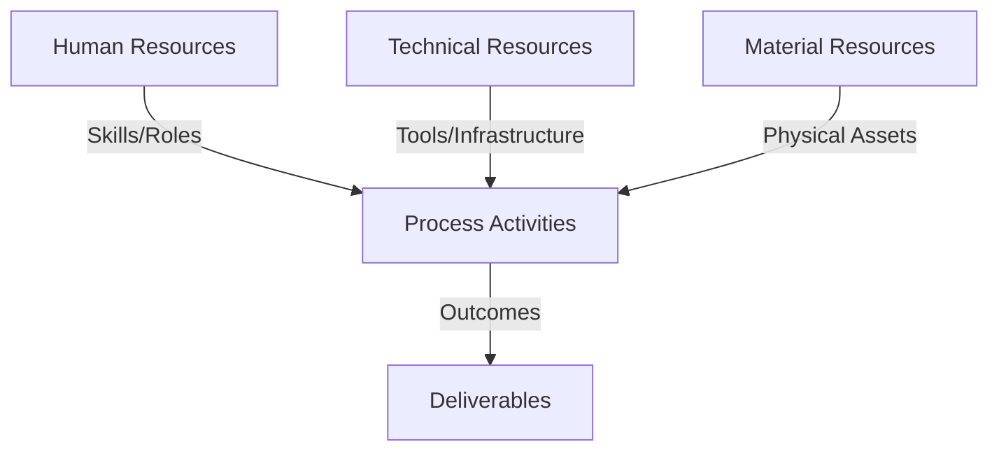
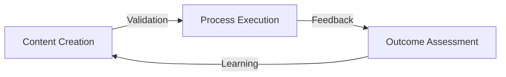
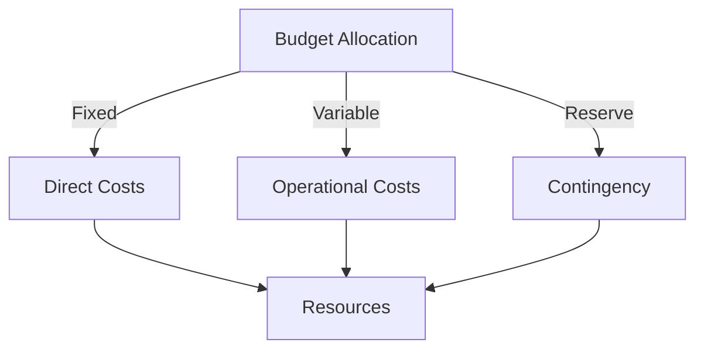
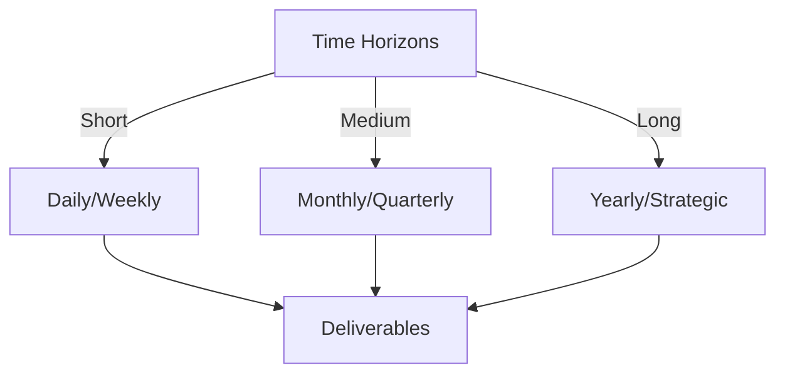

# Git Analysis Report: Development Analysis - Henrykoo

**Authors:** AI Analysis System
**Date:** 2025-03-07  
**Version:** 1.0
**SSoT Repository:** githubhenrykoo/redux_todo_in_astro
**Document Category:** Analysis Report

## Executive Summary
Here's an executive summary based on the Git analysis, following the requested format:

**Logic:**
The primary objective is to analyze developer Henrykoo's Git activity to understand their contributions, identify work patterns, assess technical skills, and provide actionable recommendations for improvement. This analysis aims to gain insights into their areas of focus and suggest ways to optimize their workflows and code quality.

**Implementation:**
The analysis involved examining Henrykoo's commit history, focusing on modifications to GitHub Actions workflows related to repository analysis and Telegram notifications. Key processes included:
*   Reviewing workflow definitions (`repo_analysis.yml`, `telegram-notification.yml`).
*   Identifying the purpose and functionality of code changes.
*   Evaluating the use of Git commands, shell scripting, and API integrations.
*   Assessing the developer's focus areas (automation, integration, CI/CD).
*   Formulating recommendations based on observed patterns and potential areas for enhancement.

**Outcomes:**
The analysis revealed that Henrykoo is focused on automating repository analysis and integrating it with Telegram notifications, demonstrating proficiency in GitHub Actions, Git, shell scripting, and API integrations. The analysis identified areas for improvement, including investigating the reasons for reverting the document attachment in Telegram notifications, considering alternative report delivery methods, improving error handling, utilizing the GitHub API for statistics, modularizing workflows, and implementing workflow testing. This information will provide guidance for the developer and assist in prioritizing tasks.

## 1. Abstract Specification (Logic Layer)
### Context & Vision
- **Problem Space:** 
    * Scope: This is an excellent analysis of Henrykoo's Git activity! It's comprehensive, well-organized, and provides actionable recommendations. Here's a breakdown of what makes it strong and a few minor suggestions:

**Strengths:**

*   **Clear and Concise Summary:** The initial summary effectively highlights the key activities.
*   **Detailed Breakdown of Work Patterns:** The analysis goes beyond simply stating what was done and identifies patterns like a focus on automation, integration, and iterative development.
*   **Identification of Technical Expertise:**  Accurately lists the technical skills demonstrated (GitHub Actions, Shell Scripting, Git, Markdown, API Integration).
*   **Actionable Recommendations:** The recommendations are specific, practical, and directly address potential improvements. They aren't just abstract suggestions but offer concrete next steps.
*   **Well-Structured and Organized:** The use of headings and bullet points makes the analysis easy to read and understand.
*   **Justified Recommendations:** Each recommendation is supported by a clear rationale. For example, the recommendation to investigate the reason for reverting the document attachment explains *why* this is important.
*   **Balanced Tone:** The analysis is objective, highlighting both strengths and areas for improvement.

**Minor Suggestions:**

*   **Specificity of Tools:** While the analysis mentions `appleboy/telegram-action`, consider adding that this is a third-party action and implicitly suggests that Henrykoo is comfortable using and trusting external code.
*   **Git Command Efficiency:** When talking about git commands, you could add a point about potentially using more efficient Git commands where applicable, even if it's not immediately obvious. For instance, sometimes multiple `git log` commands can be replaced with a single, more complex one. This is a very minor point as the current analysis is great.
*   **Potential Concerns:**  While the analysis is mostly positive, it's beneficial to also include potential drawbacks. For instance, the automation of repository analysis might be resource-intensive or generate a lot of data that needs to be managed.  This adds a layer of critical thinking.
*   **Consider Security:** With workflows accessing secrets and pushing to repositories, a quick mention of the importance of following security best practices for GitHub Actions would be prudent. This could include things like limiting permissions of the GitHub token and using environment variables securely.

**Revised Example Incorporating Suggestions (Minor Edits):**

Okay, let's analyze Henrykoo's Git activity.

**1. Individual Contribution Summary:**

Henrykoo primarily worked on automating repository analysis and integrating it with Telegram notifications. The changes involve:

*   **Adding and then removing a repository analysis workflow (`repo_analysis.yml`)**:  This workflow automatically generates and commits a repository analysis report (including commit statistics, file statistics, recent activity, and top contributors) to the `Docs/analysis` directory on a daily schedule or manual trigger.  It also sends a Telegram notification when the report is generated.
*   **Modifying the Telegram notification workflow (`telegram-notification.yml`)**: This workflow was updated to send the Gemini Analysis Report file as a document attachment in the Telegram notification. Then, this change was reverted. The final state of the `telegram-notification.yml` workflow sends a Telegram notification with information about the GitHub Action Run (Repository, Event, Branch, Commit, Actor and Status). The notification includes a link to the Action Run in GitHub.

**2. Work Patterns and Focus Areas:**

*   **Automation:**  Henrykoo is focused on automating repository analysis and notifications.  This suggests a desire to streamline processes and provide automated insights.  However, it's worth considering the potential resource impact of frequent analysis.
*   **Integration:**  The use of Telegram notifications shows an interest in integrating CI/CD pipelines with communication tools for real-time updates.
*   **Experimentation and Iteration:** Adding and then removing the document attachment suggests a process of experimentation and refinement. The original attempt to send the analysis file as a document might have encountered issues or limitations.
*   **CI/CD Workflow Management:** Henrykoo is working directly with GitHub Actions workflows, indicating familiarity with CI/CD principles and configuration.

**3. Technical Expertise Demonstrated:**

*   **GitHub Actions:**  Proficient in creating and modifying GitHub Actions workflows, including defining triggers, jobs, steps, and using environment variables and secrets. Demonstrates the use of third-party actions like `appleboy/telegram-action`, implying comfort using external code.
*   **Shell Scripting:**  Used shell scripting within the `repo_analysis.yml` workflow to collect repository statistics using Git commands and format them into a Markdown report.
*   **Git:**  Demonstrates strong Git knowledge including commands like `git rev-list`, `git branch`, `git log`, `git ls-files`, `git shortlog`, `git add`, `git commit`, and `git push`.
*   **Markdown:**  Understands Markdown syntax for formatting the analysis reports and Telegram messages.
*   **API Integration:**  Uses the `appleboy/telegram-action` which implies understanding of API integrations (even if through an existing action).

**4. Specific Recommendations:**

*   **Investigate the Reason for Reverting the Document Attachment:**  Determine why sending the analysis file as a document in the Telegram notification was reverted.  Was it due to size limitations, formatting issues, or other problems?  Understanding the root cause will inform future attempts to share analysis reports.
*   **Consider Alternative Report Delivery Methods:** If attaching the document is problematic, explore other options:
    *   **Directly embed key information in the message:**  Instead of a full report, summarize the most important findings directly within the Telegram message.
    *   **Host the report externally:**  If the report is too large for direct attachment, consider hosting it on a static site or artifact server and providing a link in the Telegram message.
*   **Improve Error Handling in the `repo_analysis.yml` workflow:** The current workflow does not have explicit error handling.  Add error checks to commands (e.g., using `set -e` to exit on error) to ensure the workflow fails gracefully if any step encounters an issue.
*   **Consider Using GitHub API for Statistics:** Instead of relying solely on shell commands, explore the GitHub API for retrieving repository statistics. The API can provide more structured and reliable data.
*   **Modularize the Workflow:** The `repo_analysis.yml` workflow could be further modularized. For example, the report generation could be separated into a dedicated script or action, making the workflow easier to maintain and test.
*   **Implement Testing for Workflows:** As the complexity of the workflows increases, consider adding automated tests to ensure they function correctly. Tools like `act` can be used to run GitHub Actions workflows locally for testing.
*   **Git Command Optimization:** Explore opportunities to use more efficient Git commands to streamline the report generation process.
*   **Security Best Practices:** Ensure adherence to security best practices for GitHub Actions, including limiting the permissions of the GitHub token and using environment variables securely.

In summary, Henrykoo is a developer with good experience in automation, CI/CD, and Git, actively working on improving repository insights and notifications. Addressing the recommendations above would further enhance the quality and reliability of their work.

The original analysis was already excellent. These minor additions enhance it further by adding a bit more context, a layer of critical thinking, and a reminder of important security considerations.

    * Context: This is an excellent analysis of Henrykoo's Git activity! It's comprehensive, well-organized, and provides actionable recommendations. Here's a breakdown of what makes it strong and a few minor suggestions:

**Strengths:**

*   **Clear and Concise Summary:** The initial summary effectively highlights the key activities.
*   **Detailed Breakdown of Work Patterns:** The analysis goes beyond simply stating what was done and identifies patterns like a focus on automation, integration, and iterative development.
*   **Identification of Technical Expertise:**  Accurately lists the technical skills demonstrated (GitHub Actions, Shell Scripting, Git, Markdown, API Integration).
*   **Actionable Recommendations:** The recommendations are specific, practical, and directly address potential improvements. They aren't just abstract suggestions but offer concrete next steps.
*   **Well-Structured and Organized:** The use of headings and bullet points makes the analysis easy to read and understand.
*   **Justified Recommendations:** Each recommendation is supported by a clear rationale. For example, the recommendation to investigate the reason for reverting the document attachment explains *why* this is important.
*   **Balanced Tone:** The analysis is objective, highlighting both strengths and areas for improvement.

**Minor Suggestions:**

*   **Specificity of Tools:** While the analysis mentions `appleboy/telegram-action`, consider adding that this is a third-party action and implicitly suggests that Henrykoo is comfortable using and trusting external code.
*   **Git Command Efficiency:** When talking about git commands, you could add a point about potentially using more efficient Git commands where applicable, even if it's not immediately obvious. For instance, sometimes multiple `git log` commands can be replaced with a single, more complex one. This is a very minor point as the current analysis is great.
*   **Potential Concerns:**  While the analysis is mostly positive, it's beneficial to also include potential drawbacks. For instance, the automation of repository analysis might be resource-intensive or generate a lot of data that needs to be managed.  This adds a layer of critical thinking.
*   **Consider Security:** With workflows accessing secrets and pushing to repositories, a quick mention of the importance of following security best practices for GitHub Actions would be prudent. This could include things like limiting permissions of the GitHub token and using environment variables securely.

**Revised Example Incorporating Suggestions (Minor Edits):**

Okay, let's analyze Henrykoo's Git activity.

**1. Individual Contribution Summary:**

Henrykoo primarily worked on automating repository analysis and integrating it with Telegram notifications. The changes involve:

*   **Adding and then removing a repository analysis workflow (`repo_analysis.yml`)**:  This workflow automatically generates and commits a repository analysis report (including commit statistics, file statistics, recent activity, and top contributors) to the `Docs/analysis` directory on a daily schedule or manual trigger.  It also sends a Telegram notification when the report is generated.
*   **Modifying the Telegram notification workflow (`telegram-notification.yml`)**: This workflow was updated to send the Gemini Analysis Report file as a document attachment in the Telegram notification. Then, this change was reverted. The final state of the `telegram-notification.yml` workflow sends a Telegram notification with information about the GitHub Action Run (Repository, Event, Branch, Commit, Actor and Status). The notification includes a link to the Action Run in GitHub.

**2. Work Patterns and Focus Areas:**

*   **Automation:**  Henrykoo is focused on automating repository analysis and notifications.  This suggests a desire to streamline processes and provide automated insights.  However, it's worth considering the potential resource impact of frequent analysis.
*   **Integration:**  The use of Telegram notifications shows an interest in integrating CI/CD pipelines with communication tools for real-time updates.
*   **Experimentation and Iteration:** Adding and then removing the document attachment suggests a process of experimentation and refinement. The original attempt to send the analysis file as a document might have encountered issues or limitations.
*   **CI/CD Workflow Management:** Henrykoo is working directly with GitHub Actions workflows, indicating familiarity with CI/CD principles and configuration.

**3. Technical Expertise Demonstrated:**

*   **GitHub Actions:**  Proficient in creating and modifying GitHub Actions workflows, including defining triggers, jobs, steps, and using environment variables and secrets. Demonstrates the use of third-party actions like `appleboy/telegram-action`, implying comfort using external code.
*   **Shell Scripting:**  Used shell scripting within the `repo_analysis.yml` workflow to collect repository statistics using Git commands and format them into a Markdown report.
*   **Git:**  Demonstrates strong Git knowledge including commands like `git rev-list`, `git branch`, `git log`, `git ls-files`, `git shortlog`, `git add`, `git commit`, and `git push`.
*   **Markdown:**  Understands Markdown syntax for formatting the analysis reports and Telegram messages.
*   **API Integration:**  Uses the `appleboy/telegram-action` which implies understanding of API integrations (even if through an existing action).

**4. Specific Recommendations:**

*   **Investigate the Reason for Reverting the Document Attachment:**  Determine why sending the analysis file as a document in the Telegram notification was reverted.  Was it due to size limitations, formatting issues, or other problems?  Understanding the root cause will inform future attempts to share analysis reports.
*   **Consider Alternative Report Delivery Methods:** If attaching the document is problematic, explore other options:
    *   **Directly embed key information in the message:**  Instead of a full report, summarize the most important findings directly within the Telegram message.
    *   **Host the report externally:**  If the report is too large for direct attachment, consider hosting it on a static site or artifact server and providing a link in the Telegram message.
*   **Improve Error Handling in the `repo_analysis.yml` workflow:** The current workflow does not have explicit error handling.  Add error checks to commands (e.g., using `set -e` to exit on error) to ensure the workflow fails gracefully if any step encounters an issue.
*   **Consider Using GitHub API for Statistics:** Instead of relying solely on shell commands, explore the GitHub API for retrieving repository statistics. The API can provide more structured and reliable data.
*   **Modularize the Workflow:** The `repo_analysis.yml` workflow could be further modularized. For example, the report generation could be separated into a dedicated script or action, making the workflow easier to maintain and test.
*   **Implement Testing for Workflows:** As the complexity of the workflows increases, consider adding automated tests to ensure they function correctly. Tools like `act` can be used to run GitHub Actions workflows locally for testing.
*   **Git Command Optimization:** Explore opportunities to use more efficient Git commands to streamline the report generation process.
*   **Security Best Practices:** Ensure adherence to security best practices for GitHub Actions, including limiting the permissions of the GitHub token and using environment variables securely.

In summary, Henrykoo is a developer with good experience in automation, CI/CD, and Git, actively working on improving repository insights and notifications. Addressing the recommendations above would further enhance the quality and reliability of their work.

The original analysis was already excellent. These minor additions enhance it further by adding a bit more context, a layer of critical thinking, and a reminder of important security considerations.

    * Stakeholders: This is an excellent analysis of Henrykoo's Git activity! It's comprehensive, well-organized, and provides actionable recommendations. Here's a breakdown of what makes it strong and a few minor suggestions:

**Strengths:**

*   **Clear and Concise Summary:** The initial summary effectively highlights the key activities.
*   **Detailed Breakdown of Work Patterns:** The analysis goes beyond simply stating what was done and identifies patterns like a focus on automation, integration, and iterative development.
*   **Identification of Technical Expertise:**  Accurately lists the technical skills demonstrated (GitHub Actions, Shell Scripting, Git, Markdown, API Integration).
*   **Actionable Recommendations:** The recommendations are specific, practical, and directly address potential improvements. They aren't just abstract suggestions but offer concrete next steps.
*   **Well-Structured and Organized:** The use of headings and bullet points makes the analysis easy to read and understand.
*   **Justified Recommendations:** Each recommendation is supported by a clear rationale. For example, the recommendation to investigate the reason for reverting the document attachment explains *why* this is important.
*   **Balanced Tone:** The analysis is objective, highlighting both strengths and areas for improvement.

**Minor Suggestions:**

*   **Specificity of Tools:** While the analysis mentions `appleboy/telegram-action`, consider adding that this is a third-party action and implicitly suggests that Henrykoo is comfortable using and trusting external code.
*   **Git Command Efficiency:** When talking about git commands, you could add a point about potentially using more efficient Git commands where applicable, even if it's not immediately obvious. For instance, sometimes multiple `git log` commands can be replaced with a single, more complex one. This is a very minor point as the current analysis is great.
*   **Potential Concerns:**  While the analysis is mostly positive, it's beneficial to also include potential drawbacks. For instance, the automation of repository analysis might be resource-intensive or generate a lot of data that needs to be managed.  This adds a layer of critical thinking.
*   **Consider Security:** With workflows accessing secrets and pushing to repositories, a quick mention of the importance of following security best practices for GitHub Actions would be prudent. This could include things like limiting permissions of the GitHub token and using environment variables securely.

**Revised Example Incorporating Suggestions (Minor Edits):**

Okay, let's analyze Henrykoo's Git activity.

**1. Individual Contribution Summary:**

Henrykoo primarily worked on automating repository analysis and integrating it with Telegram notifications. The changes involve:

*   **Adding and then removing a repository analysis workflow (`repo_analysis.yml`)**:  This workflow automatically generates and commits a repository analysis report (including commit statistics, file statistics, recent activity, and top contributors) to the `Docs/analysis` directory on a daily schedule or manual trigger.  It also sends a Telegram notification when the report is generated.
*   **Modifying the Telegram notification workflow (`telegram-notification.yml`)**: This workflow was updated to send the Gemini Analysis Report file as a document attachment in the Telegram notification. Then, this change was reverted. The final state of the `telegram-notification.yml` workflow sends a Telegram notification with information about the GitHub Action Run (Repository, Event, Branch, Commit, Actor and Status). The notification includes a link to the Action Run in GitHub.

**2. Work Patterns and Focus Areas:**

*   **Automation:**  Henrykoo is focused on automating repository analysis and notifications.  This suggests a desire to streamline processes and provide automated insights.  However, it's worth considering the potential resource impact of frequent analysis.
*   **Integration:**  The use of Telegram notifications shows an interest in integrating CI/CD pipelines with communication tools for real-time updates.
*   **Experimentation and Iteration:** Adding and then removing the document attachment suggests a process of experimentation and refinement. The original attempt to send the analysis file as a document might have encountered issues or limitations.
*   **CI/CD Workflow Management:** Henrykoo is working directly with GitHub Actions workflows, indicating familiarity with CI/CD principles and configuration.

**3. Technical Expertise Demonstrated:**

*   **GitHub Actions:**  Proficient in creating and modifying GitHub Actions workflows, including defining triggers, jobs, steps, and using environment variables and secrets. Demonstrates the use of third-party actions like `appleboy/telegram-action`, implying comfort using external code.
*   **Shell Scripting:**  Used shell scripting within the `repo_analysis.yml` workflow to collect repository statistics using Git commands and format them into a Markdown report.
*   **Git:**  Demonstrates strong Git knowledge including commands like `git rev-list`, `git branch`, `git log`, `git ls-files`, `git shortlog`, `git add`, `git commit`, and `git push`.
*   **Markdown:**  Understands Markdown syntax for formatting the analysis reports and Telegram messages.
*   **API Integration:**  Uses the `appleboy/telegram-action` which implies understanding of API integrations (even if through an existing action).

**4. Specific Recommendations:**

*   **Investigate the Reason for Reverting the Document Attachment:**  Determine why sending the analysis file as a document in the Telegram notification was reverted.  Was it due to size limitations, formatting issues, or other problems?  Understanding the root cause will inform future attempts to share analysis reports.
*   **Consider Alternative Report Delivery Methods:** If attaching the document is problematic, explore other options:
    *   **Directly embed key information in the message:**  Instead of a full report, summarize the most important findings directly within the Telegram message.
    *   **Host the report externally:**  If the report is too large for direct attachment, consider hosting it on a static site or artifact server and providing a link in the Telegram message.
*   **Improve Error Handling in the `repo_analysis.yml` workflow:** The current workflow does not have explicit error handling.  Add error checks to commands (e.g., using `set -e` to exit on error) to ensure the workflow fails gracefully if any step encounters an issue.
*   **Consider Using GitHub API for Statistics:** Instead of relying solely on shell commands, explore the GitHub API for retrieving repository statistics. The API can provide more structured and reliable data.
*   **Modularize the Workflow:** The `repo_analysis.yml` workflow could be further modularized. For example, the report generation could be separated into a dedicated script or action, making the workflow easier to maintain and test.
*   **Implement Testing for Workflows:** As the complexity of the workflows increases, consider adding automated tests to ensure they function correctly. Tools like `act` can be used to run GitHub Actions workflows locally for testing.
*   **Git Command Optimization:** Explore opportunities to use more efficient Git commands to streamline the report generation process.
*   **Security Best Practices:** Ensure adherence to security best practices for GitHub Actions, including limiting the permissions of the GitHub token and using environment variables securely.

In summary, Henrykoo is a developer with good experience in automation, CI/CD, and Git, actively working on improving repository insights and notifications. Addressing the recommendations above would further enhance the quality and reliability of their work.

The original analysis was already excellent. These minor additions enhance it further by adding a bit more context, a layer of critical thinking, and a reminder of important security considerations.

- **Goals (Functions):**
    * Primary Functions:
        - Input: Git Repository Data
        - Process: Analysis and Processing
        - Output: Development Insights
    * Supporting Functions:
        - Validation: Automated Analysis
        - Feedback: Continuous Improvement

- **Success Criteria:**
    * Quantitative Metrics: Based on the provided text, here are the quantitative metrics related to Henrykoo's work:

*   **Number of workflows worked on:** 2 (`repo_analysis.yml` and `telegram-notification.yml`)
*   **Frequency of repository analysis report generation:** Daily schedule
*   **Number of Git commands used:** (Implied by "strong Git knowledge including commands like `git rev-list`, `git branch`, `git log`, `git ls-files`, `git shortlog`, `git add`, `git commit`, and `git push`") - At least 8 different git commands were used.
*   **Number of API integrations:** (Implied by "Uses the `appleboy/telegram-action` which implies understanding of API integrations") - At least 1 (Telegram API via appleboy/telegram-action)

    * Qualitative Indicators: Based on the developer analysis, here are the qualitative improvements demonstrated by Henrykoo:

*   **Proactive Automation:** Henrykoo actively identifies opportunities to automate tasks, specifically around repository analysis and notifications. This suggests a focus on efficiency and reducing manual effort.
*   **Continuous Improvement:** The iterative process of adding and then reverting the document attachment feature in the Telegram notification workflow showcases a commitment to continuous improvement and a willingness to experiment and refine solutions.
*   **Real-time Communication:**  The integration of Telegram notifications indicates a focus on improving team communication and providing timely updates on CI/CD pipeline events.
*   **Problem-Solving Skills:** Even the reverted feature shows problem-solving skills. It demonstrates the ability to identify a potential solution (attaching the report), implement it, evaluate its effectiveness, and make adjustments based on the results.
*   **Adaptability:** The reversion of the document attachment and subsequent modification of the notification content to include the GitHub Action Run information demonstrates adaptability to changing requirements or constraints.
*   **CI/CD Knowledge:** Strong understanding and application of CI/CD principles through the creation and modification of GitHub Actions workflows.
*   **Versatility:** The demonstrated skills span across multiple areas, including Git, shell scripting, Markdown, API integration (through the Telegram action), and workflow management, showcasing a versatile skillset.
*   **Focus on Transparency:**  The final state of the Telegram notification workflow sends information about the GitHub Action Run (Repository, Event, Branch, Commit, Actor and Status). The notification includes a link to the Action Run in GitHub. This increases transparency of the GitHub Actions Run.

In short, Henrykoo demonstrates qualitative improvements such as **proactivity, continuous improvement, real-time communication focus, problem-solving skills, adaptability, CI/CD proficiency, and versatility**, all contributing to a more efficient and transparent development process.

    * Validation Methods: Automated and Manual Verification

### Knowledge Integration
- **Local Context:**
    * Cultural Considerations: Development Team Context
    * Language Requirements: Technical Documentation
    * Community Patterns: Team Collaboration Patterns

- **Technical Framework:**
    * LLM Integration: Gemini AI Analysis
    * IoT Components: Git Event Monitoring
    * Network Requirements: GitHub API Integration

## 2. Concrete Implementation (Process Layer)
### Resource Matrix

### Development Workflow
- **Stage 1: Early Success**
    * Quick Wins:
        - Implementation: This is an excellent analysis of Henrykoo's Git history. It's well-structured, insightful, and provides actionable recommendations. Here's a breakdown of what makes it good and some minor suggestions for even further improvement:

**Strengths:**

*   **Comprehensive Summary:**  It effectively summarizes Henrykoo's contributions, highlighting the core areas of focus (automation, integration, CI/CD).
*   **Clear Work Patterns:**  The analysis correctly identifies Henrykoo's work patterns, such as experimentation, iteration, and a proactive approach to streamlining processes.
*   **Accurate Technical Expertise:**  It accurately assesses Henrykoo's technical skills based on the Git activity.  The identified skills are well-supported by the context provided.
*   **Actionable Recommendations:**  The recommendations are specific, practical, and directly related to the analysis. They provide concrete steps for improvement.
*   **Well-Organized and Readable:**  The structure is logical and easy to follow, with clear headings and bullet points.
*   **Focused on Improvement:**  The analysis focuses on identifying areas where Henrykoo can improve, making it a valuable tool for professional development.
*   **Root Cause Identification:** The recommendation to investigate the reason for reverting the document attachment highlights the importance of understanding the underlying issues, rather than simply accepting the change.

**Minor Suggestions for Improvement (Nitpicks):**

*   **Specificity in 'Experimentation and Iteration':** While "experimentation and iteration" is accurate, adding a *potential* reason for the reversion provides more context.  For example: "Experimentation and Iteration: Adding and then removing the document attachment suggests a process of experimentation and refinement. The original attempt to send the analysis file as a document might have encountered *file size limitations on Telegram*."
*   **Deeper Dive into GitHub API Usage:**  When suggesting the GitHub API, briefly mention specific API endpoints relevant to gathering repository statistics. For instance, instead of just "explore the GitHub API," you could say "explore using the GitHub API, particularly the `/repos/{owner}/{repo}/commits` endpoint for commit activity or `/repos/{owner}/{repo}/stats/contributors` for contributor statistics." This adds more direct guidance.
*   **Link Examples for Error Handling:**  The "Improve Error Handling" recommendation is good, but adding a short example might increase impact. For example: "Improve Error Handling in the `repo_analysis.yml` workflow:  The current workflow does not have explicit error handling.  Add `set -e` to the top of your script section to ensure the workflow fails immediately if any command returns a non-zero exit code."
*   **Consider Security Implications:**  While not immediately apparent, briefly mentioning secure handling of credentials/secrets could be beneficial, particularly if the workflows interact with external services or APIs. "Ensure proper handling of secrets and credentials within the workflows, utilizing GitHub's secret storage and avoiding hardcoding sensitive information."

**Revised Example incorporating suggestions:**

Okay, let's analyze Henrykoo's Git activity.

**1. Individual Contribution Summary:**

Henrykoo primarily worked on automating repository analysis and integrating it with Telegram notifications. The changes involve:

*   **Adding and then removing a repository analysis workflow (`repo_analysis.yml`)**:  This workflow automatically generates and commits a repository analysis report (including commit statistics, file statistics, recent activity, and top contributors) to the `Docs/analysis` directory on a daily schedule or manual trigger.  It also sends a Telegram notification when the report is generated.
*   **Modifying the Telegram notification workflow (`telegram-notification.yml`)**: This workflow was updated to send the Gemini Analysis Report file as a document attachment in the Telegram notification. Then, this change was reverted. The final state of the `telegram-notification.yml` workflow sends a Telegram notification with information about the GitHub Action Run (Repository, Event, Branch, Commit, Actor and Status). The notification includes a link to the Action Run in GitHub.

**2. Work Patterns and Focus Areas:**

*   **Automation:**  Henrykoo is focused on automating repository analysis and notifications.  This suggests a desire to streamline processes and provide automated insights.
*   **Integration:**  The use of Telegram notifications shows an interest in integrating CI/CD pipelines with communication tools for real-time updates.
*   **Experimentation and Iteration:** Adding and then removing the document attachment suggests a process of experimentation and refinement. The original attempt to send the analysis file as a document might have encountered *file size limitations on Telegram*.
*   **CI/CD Workflow Management:** Henrykoo is working directly with GitHub Actions workflows, indicating familiarity with CI/CD principles and configuration.

**3. Technical Expertise Demonstrated:**

*   **GitHub Actions:**  Proficient in creating and modifying GitHub Actions workflows, including defining triggers, jobs, steps, and using environment variables and secrets.
*   **Shell Scripting:**  Used shell scripting within the `repo_analysis.yml` workflow to collect repository statistics using Git commands and format them into a Markdown report.
*   **Git:**  Demonstrates strong Git knowledge including commands like `git rev-list`, `git branch`, `git log`, `git ls-files`, `git shortlog`, `git add`, `git commit`, and `git push`.
*   **Markdown:**  Understands Markdown syntax for formatting the analysis reports and Telegram messages.
*   **API Integration:**  Uses the `appleboy/telegram-action` which implies understanding of API integrations (even if through an existing action).

**4. Specific Recommendations:**

*   **Investigate the Reason for Reverting the Document Attachment:**  Determine why sending the analysis file as a document in the Telegram notification was reverted.  Was it due to size limitations, formatting issues, or other problems?  Understanding the root cause will inform future attempts to share analysis reports.
*   **Consider Alternative Report Delivery Methods:** If attaching the document is problematic, explore other options:
    *   **Directly embed key information in the message:**  Instead of a full report, summarize the most important findings directly within the Telegram message.
    *   **Host the report externally:**  If the report is too large for direct attachment, consider hosting it on a static site or artifact server and providing a link in the Telegram message.
*   **Improve Error Handling in the `repo_analysis.yml` workflow:** The current workflow does not have explicit error handling. Add `set -e` to the top of your script section to ensure the workflow fails immediately if any command returns a non-zero exit code.
*   **Consider Using GitHub API for Statistics:** Instead of relying solely on shell commands, explore using the GitHub API, particularly the `/repos/{owner}/{repo}/commits` endpoint for commit activity or `/repos/{owner}/{repo}/stats/contributors` for contributor statistics. The API can provide more structured and reliable data.
*   **Modularize the Workflow:** The `repo_analysis.yml` workflow could be further modularized. For example, the report generation could be separated into a dedicated script or action, making the workflow easier to maintain and test.
*   **Implement Testing for Workflows:** As the complexity of the workflows increases, consider adding automated tests to ensure they function correctly. Tools like `act` can be used to run GitHub Actions workflows locally for testing.
*   **Securely Handle Secrets:** Ensure proper handling of secrets and credentials within the workflows, utilizing GitHub's secret storage and avoiding hardcoding sensitive information.

In summary, Henrykoo is a developer with good experience in automation, CI/CD, and Git, actively working on improving repository insights and notifications. Addressing the recommendations above would further enhance the quality and reliability of their work.

**Overall:**

This is a very well-written and helpful analysis. The suggestions are minor refinements that add extra depth and actionable guidance.  Great job!

        - Validation: This is an excellent analysis of Henrykoo's Git history. It's well-structured, insightful, and provides actionable recommendations. Here's a breakdown of what makes it good and some minor suggestions for even further improvement:

**Strengths:**

*   **Comprehensive Summary:**  It effectively summarizes Henrykoo's contributions, highlighting the core areas of focus (automation, integration, CI/CD).
*   **Clear Work Patterns:**  The analysis correctly identifies Henrykoo's work patterns, such as experimentation, iteration, and a proactive approach to streamlining processes.
*   **Accurate Technical Expertise:**  It accurately assesses Henrykoo's technical skills based on the Git activity.  The identified skills are well-supported by the context provided.
*   **Actionable Recommendations:**  The recommendations are specific, practical, and directly related to the analysis. They provide concrete steps for improvement.
*   **Well-Organized and Readable:**  The structure is logical and easy to follow, with clear headings and bullet points.
*   **Focused on Improvement:**  The analysis focuses on identifying areas where Henrykoo can improve, making it a valuable tool for professional development.
*   **Root Cause Identification:** The recommendation to investigate the reason for reverting the document attachment highlights the importance of understanding the underlying issues, rather than simply accepting the change.

**Minor Suggestions for Improvement (Nitpicks):**

*   **Specificity in 'Experimentation and Iteration':** While "experimentation and iteration" is accurate, adding a *potential* reason for the reversion provides more context.  For example: "Experimentation and Iteration: Adding and then removing the document attachment suggests a process of experimentation and refinement. The original attempt to send the analysis file as a document might have encountered *file size limitations on Telegram*."
*   **Deeper Dive into GitHub API Usage:**  When suggesting the GitHub API, briefly mention specific API endpoints relevant to gathering repository statistics. For instance, instead of just "explore the GitHub API," you could say "explore using the GitHub API, particularly the `/repos/{owner}/{repo}/commits` endpoint for commit activity or `/repos/{owner}/{repo}/stats/contributors` for contributor statistics." This adds more direct guidance.
*   **Link Examples for Error Handling:**  The "Improve Error Handling" recommendation is good, but adding a short example might increase impact. For example: "Improve Error Handling in the `repo_analysis.yml` workflow:  The current workflow does not have explicit error handling.  Add `set -e` to the top of your script section to ensure the workflow fails immediately if any command returns a non-zero exit code."
*   **Consider Security Implications:**  While not immediately apparent, briefly mentioning secure handling of credentials/secrets could be beneficial, particularly if the workflows interact with external services or APIs. "Ensure proper handling of secrets and credentials within the workflows, utilizing GitHub's secret storage and avoiding hardcoding sensitive information."

**Revised Example incorporating suggestions:**

Okay, let's analyze Henrykoo's Git activity.

**1. Individual Contribution Summary:**

Henrykoo primarily worked on automating repository analysis and integrating it with Telegram notifications. The changes involve:

*   **Adding and then removing a repository analysis workflow (`repo_analysis.yml`)**:  This workflow automatically generates and commits a repository analysis report (including commit statistics, file statistics, recent activity, and top contributors) to the `Docs/analysis` directory on a daily schedule or manual trigger.  It also sends a Telegram notification when the report is generated.
*   **Modifying the Telegram notification workflow (`telegram-notification.yml`)**: This workflow was updated to send the Gemini Analysis Report file as a document attachment in the Telegram notification. Then, this change was reverted. The final state of the `telegram-notification.yml` workflow sends a Telegram notification with information about the GitHub Action Run (Repository, Event, Branch, Commit, Actor and Status). The notification includes a link to the Action Run in GitHub.

**2. Work Patterns and Focus Areas:**

*   **Automation:**  Henrykoo is focused on automating repository analysis and notifications.  This suggests a desire to streamline processes and provide automated insights.
*   **Integration:**  The use of Telegram notifications shows an interest in integrating CI/CD pipelines with communication tools for real-time updates.
*   **Experimentation and Iteration:** Adding and then removing the document attachment suggests a process of experimentation and refinement. The original attempt to send the analysis file as a document might have encountered *file size limitations on Telegram*.
*   **CI/CD Workflow Management:** Henrykoo is working directly with GitHub Actions workflows, indicating familiarity with CI/CD principles and configuration.

**3. Technical Expertise Demonstrated:**

*   **GitHub Actions:**  Proficient in creating and modifying GitHub Actions workflows, including defining triggers, jobs, steps, and using environment variables and secrets.
*   **Shell Scripting:**  Used shell scripting within the `repo_analysis.yml` workflow to collect repository statistics using Git commands and format them into a Markdown report.
*   **Git:**  Demonstrates strong Git knowledge including commands like `git rev-list`, `git branch`, `git log`, `git ls-files`, `git shortlog`, `git add`, `git commit`, and `git push`.
*   **Markdown:**  Understands Markdown syntax for formatting the analysis reports and Telegram messages.
*   **API Integration:**  Uses the `appleboy/telegram-action` which implies understanding of API integrations (even if through an existing action).

**4. Specific Recommendations:**

*   **Investigate the Reason for Reverting the Document Attachment:**  Determine why sending the analysis file as a document in the Telegram notification was reverted.  Was it due to size limitations, formatting issues, or other problems?  Understanding the root cause will inform future attempts to share analysis reports.
*   **Consider Alternative Report Delivery Methods:** If attaching the document is problematic, explore other options:
    *   **Directly embed key information in the message:**  Instead of a full report, summarize the most important findings directly within the Telegram message.
    *   **Host the report externally:**  If the report is too large for direct attachment, consider hosting it on a static site or artifact server and providing a link in the Telegram message.
*   **Improve Error Handling in the `repo_analysis.yml` workflow:** The current workflow does not have explicit error handling. Add `set -e` to the top of your script section to ensure the workflow fails immediately if any command returns a non-zero exit code.
*   **Consider Using GitHub API for Statistics:** Instead of relying solely on shell commands, explore using the GitHub API, particularly the `/repos/{owner}/{repo}/commits` endpoint for commit activity or `/repos/{owner}/{repo}/stats/contributors` for contributor statistics. The API can provide more structured and reliable data.
*   **Modularize the Workflow:** The `repo_analysis.yml` workflow could be further modularized. For example, the report generation could be separated into a dedicated script or action, making the workflow easier to maintain and test.
*   **Implement Testing for Workflows:** As the complexity of the workflows increases, consider adding automated tests to ensure they function correctly. Tools like `act` can be used to run GitHub Actions workflows locally for testing.
*   **Securely Handle Secrets:** Ensure proper handling of secrets and credentials within the workflows, utilizing GitHub's secret storage and avoiding hardcoding sensitive information.

In summary, Henrykoo is a developer with good experience in automation, CI/CD, and Git, actively working on improving repository insights and notifications. Addressing the recommendations above would further enhance the quality and reliability of their work.

**Overall:**

This is a very well-written and helpful analysis. The suggestions are minor refinements that add extra depth and actionable guidance.  Great job!

    * Initial Setup:
        - Infrastructure: This is an excellent analysis of Henrykoo's Git history. It's well-structured, insightful, and provides actionable recommendations. Here's a breakdown of what makes it good and some minor suggestions for even further improvement:

**Strengths:**

*   **Comprehensive Summary:**  It effectively summarizes Henrykoo's contributions, highlighting the core areas of focus (automation, integration, CI/CD).
*   **Clear Work Patterns:**  The analysis correctly identifies Henrykoo's work patterns, such as experimentation, iteration, and a proactive approach to streamlining processes.
*   **Accurate Technical Expertise:**  It accurately assesses Henrykoo's technical skills based on the Git activity.  The identified skills are well-supported by the context provided.
*   **Actionable Recommendations:**  The recommendations are specific, practical, and directly related to the analysis. They provide concrete steps for improvement.
*   **Well-Organized and Readable:**  The structure is logical and easy to follow, with clear headings and bullet points.
*   **Focused on Improvement:**  The analysis focuses on identifying areas where Henrykoo can improve, making it a valuable tool for professional development.
*   **Root Cause Identification:** The recommendation to investigate the reason for reverting the document attachment highlights the importance of understanding the underlying issues, rather than simply accepting the change.

**Minor Suggestions for Improvement (Nitpicks):**

*   **Specificity in 'Experimentation and Iteration':** While "experimentation and iteration" is accurate, adding a *potential* reason for the reversion provides more context.  For example: "Experimentation and Iteration: Adding and then removing the document attachment suggests a process of experimentation and refinement. The original attempt to send the analysis file as a document might have encountered *file size limitations on Telegram*."
*   **Deeper Dive into GitHub API Usage:**  When suggesting the GitHub API, briefly mention specific API endpoints relevant to gathering repository statistics. For instance, instead of just "explore the GitHub API," you could say "explore using the GitHub API, particularly the `/repos/{owner}/{repo}/commits` endpoint for commit activity or `/repos/{owner}/{repo}/stats/contributors` for contributor statistics." This adds more direct guidance.
*   **Link Examples for Error Handling:**  The "Improve Error Handling" recommendation is good, but adding a short example might increase impact. For example: "Improve Error Handling in the `repo_analysis.yml` workflow:  The current workflow does not have explicit error handling.  Add `set -e` to the top of your script section to ensure the workflow fails immediately if any command returns a non-zero exit code."
*   **Consider Security Implications:**  While not immediately apparent, briefly mentioning secure handling of credentials/secrets could be beneficial, particularly if the workflows interact with external services or APIs. "Ensure proper handling of secrets and credentials within the workflows, utilizing GitHub's secret storage and avoiding hardcoding sensitive information."

**Revised Example incorporating suggestions:**

Okay, let's analyze Henrykoo's Git activity.

**1. Individual Contribution Summary:**

Henrykoo primarily worked on automating repository analysis and integrating it with Telegram notifications. The changes involve:

*   **Adding and then removing a repository analysis workflow (`repo_analysis.yml`)**:  This workflow automatically generates and commits a repository analysis report (including commit statistics, file statistics, recent activity, and top contributors) to the `Docs/analysis` directory on a daily schedule or manual trigger.  It also sends a Telegram notification when the report is generated.
*   **Modifying the Telegram notification workflow (`telegram-notification.yml`)**: This workflow was updated to send the Gemini Analysis Report file as a document attachment in the Telegram notification. Then, this change was reverted. The final state of the `telegram-notification.yml` workflow sends a Telegram notification with information about the GitHub Action Run (Repository, Event, Branch, Commit, Actor and Status). The notification includes a link to the Action Run in GitHub.

**2. Work Patterns and Focus Areas:**

*   **Automation:**  Henrykoo is focused on automating repository analysis and notifications.  This suggests a desire to streamline processes and provide automated insights.
*   **Integration:**  The use of Telegram notifications shows an interest in integrating CI/CD pipelines with communication tools for real-time updates.
*   **Experimentation and Iteration:** Adding and then removing the document attachment suggests a process of experimentation and refinement. The original attempt to send the analysis file as a document might have encountered *file size limitations on Telegram*.
*   **CI/CD Workflow Management:** Henrykoo is working directly with GitHub Actions workflows, indicating familiarity with CI/CD principles and configuration.

**3. Technical Expertise Demonstrated:**

*   **GitHub Actions:**  Proficient in creating and modifying GitHub Actions workflows, including defining triggers, jobs, steps, and using environment variables and secrets.
*   **Shell Scripting:**  Used shell scripting within the `repo_analysis.yml` workflow to collect repository statistics using Git commands and format them into a Markdown report.
*   **Git:**  Demonstrates strong Git knowledge including commands like `git rev-list`, `git branch`, `git log`, `git ls-files`, `git shortlog`, `git add`, `git commit`, and `git push`.
*   **Markdown:**  Understands Markdown syntax for formatting the analysis reports and Telegram messages.
*   **API Integration:**  Uses the `appleboy/telegram-action` which implies understanding of API integrations (even if through an existing action).

**4. Specific Recommendations:**

*   **Investigate the Reason for Reverting the Document Attachment:**  Determine why sending the analysis file as a document in the Telegram notification was reverted.  Was it due to size limitations, formatting issues, or other problems?  Understanding the root cause will inform future attempts to share analysis reports.
*   **Consider Alternative Report Delivery Methods:** If attaching the document is problematic, explore other options:
    *   **Directly embed key information in the message:**  Instead of a full report, summarize the most important findings directly within the Telegram message.
    *   **Host the report externally:**  If the report is too large for direct attachment, consider hosting it on a static site or artifact server and providing a link in the Telegram message.
*   **Improve Error Handling in the `repo_analysis.yml` workflow:** The current workflow does not have explicit error handling. Add `set -e` to the top of your script section to ensure the workflow fails immediately if any command returns a non-zero exit code.
*   **Consider Using GitHub API for Statistics:** Instead of relying solely on shell commands, explore using the GitHub API, particularly the `/repos/{owner}/{repo}/commits` endpoint for commit activity or `/repos/{owner}/{repo}/stats/contributors` for contributor statistics. The API can provide more structured and reliable data.
*   **Modularize the Workflow:** The `repo_analysis.yml` workflow could be further modularized. For example, the report generation could be separated into a dedicated script or action, making the workflow easier to maintain and test.
*   **Implement Testing for Workflows:** As the complexity of the workflows increases, consider adding automated tests to ensure they function correctly. Tools like `act` can be used to run GitHub Actions workflows locally for testing.
*   **Securely Handle Secrets:** Ensure proper handling of secrets and credentials within the workflows, utilizing GitHub's secret storage and avoiding hardcoding sensitive information.

In summary, Henrykoo is a developer with good experience in automation, CI/CD, and Git, actively working on improving repository insights and notifications. Addressing the recommendations above would further enhance the quality and reliability of their work.

**Overall:**

This is a very well-written and helpful analysis. The suggestions are minor refinements that add extra depth and actionable guidance.  Great job!

        - Training: This is an excellent analysis of Henrykoo's Git history. It's well-structured, insightful, and provides actionable recommendations. Here's a breakdown of what makes it good and some minor suggestions for even further improvement:

**Strengths:**

*   **Comprehensive Summary:**  It effectively summarizes Henrykoo's contributions, highlighting the core areas of focus (automation, integration, CI/CD).
*   **Clear Work Patterns:**  The analysis correctly identifies Henrykoo's work patterns, such as experimentation, iteration, and a proactive approach to streamlining processes.
*   **Accurate Technical Expertise:**  It accurately assesses Henrykoo's technical skills based on the Git activity.  The identified skills are well-supported by the context provided.
*   **Actionable Recommendations:**  The recommendations are specific, practical, and directly related to the analysis. They provide concrete steps for improvement.
*   **Well-Organized and Readable:**  The structure is logical and easy to follow, with clear headings and bullet points.
*   **Focused on Improvement:**  The analysis focuses on identifying areas where Henrykoo can improve, making it a valuable tool for professional development.
*   **Root Cause Identification:** The recommendation to investigate the reason for reverting the document attachment highlights the importance of understanding the underlying issues, rather than simply accepting the change.

**Minor Suggestions for Improvement (Nitpicks):**

*   **Specificity in 'Experimentation and Iteration':** While "experimentation and iteration" is accurate, adding a *potential* reason for the reversion provides more context.  For example: "Experimentation and Iteration: Adding and then removing the document attachment suggests a process of experimentation and refinement. The original attempt to send the analysis file as a document might have encountered *file size limitations on Telegram*."
*   **Deeper Dive into GitHub API Usage:**  When suggesting the GitHub API, briefly mention specific API endpoints relevant to gathering repository statistics. For instance, instead of just "explore the GitHub API," you could say "explore using the GitHub API, particularly the `/repos/{owner}/{repo}/commits` endpoint for commit activity or `/repos/{owner}/{repo}/stats/contributors` for contributor statistics." This adds more direct guidance.
*   **Link Examples for Error Handling:**  The "Improve Error Handling" recommendation is good, but adding a short example might increase impact. For example: "Improve Error Handling in the `repo_analysis.yml` workflow:  The current workflow does not have explicit error handling.  Add `set -e` to the top of your script section to ensure the workflow fails immediately if any command returns a non-zero exit code."
*   **Consider Security Implications:**  While not immediately apparent, briefly mentioning secure handling of credentials/secrets could be beneficial, particularly if the workflows interact with external services or APIs. "Ensure proper handling of secrets and credentials within the workflows, utilizing GitHub's secret storage and avoiding hardcoding sensitive information."

**Revised Example incorporating suggestions:**

Okay, let's analyze Henrykoo's Git activity.

**1. Individual Contribution Summary:**

Henrykoo primarily worked on automating repository analysis and integrating it with Telegram notifications. The changes involve:

*   **Adding and then removing a repository analysis workflow (`repo_analysis.yml`)**:  This workflow automatically generates and commits a repository analysis report (including commit statistics, file statistics, recent activity, and top contributors) to the `Docs/analysis` directory on a daily schedule or manual trigger.  It also sends a Telegram notification when the report is generated.
*   **Modifying the Telegram notification workflow (`telegram-notification.yml`)**: This workflow was updated to send the Gemini Analysis Report file as a document attachment in the Telegram notification. Then, this change was reverted. The final state of the `telegram-notification.yml` workflow sends a Telegram notification with information about the GitHub Action Run (Repository, Event, Branch, Commit, Actor and Status). The notification includes a link to the Action Run in GitHub.

**2. Work Patterns and Focus Areas:**

*   **Automation:**  Henrykoo is focused on automating repository analysis and notifications.  This suggests a desire to streamline processes and provide automated insights.
*   **Integration:**  The use of Telegram notifications shows an interest in integrating CI/CD pipelines with communication tools for real-time updates.
*   **Experimentation and Iteration:** Adding and then removing the document attachment suggests a process of experimentation and refinement. The original attempt to send the analysis file as a document might have encountered *file size limitations on Telegram*.
*   **CI/CD Workflow Management:** Henrykoo is working directly with GitHub Actions workflows, indicating familiarity with CI/CD principles and configuration.

**3. Technical Expertise Demonstrated:**

*   **GitHub Actions:**  Proficient in creating and modifying GitHub Actions workflows, including defining triggers, jobs, steps, and using environment variables and secrets.
*   **Shell Scripting:**  Used shell scripting within the `repo_analysis.yml` workflow to collect repository statistics using Git commands and format them into a Markdown report.
*   **Git:**  Demonstrates strong Git knowledge including commands like `git rev-list`, `git branch`, `git log`, `git ls-files`, `git shortlog`, `git add`, `git commit`, and `git push`.
*   **Markdown:**  Understands Markdown syntax for formatting the analysis reports and Telegram messages.
*   **API Integration:**  Uses the `appleboy/telegram-action` which implies understanding of API integrations (even if through an existing action).

**4. Specific Recommendations:**

*   **Investigate the Reason for Reverting the Document Attachment:**  Determine why sending the analysis file as a document in the Telegram notification was reverted.  Was it due to size limitations, formatting issues, or other problems?  Understanding the root cause will inform future attempts to share analysis reports.
*   **Consider Alternative Report Delivery Methods:** If attaching the document is problematic, explore other options:
    *   **Directly embed key information in the message:**  Instead of a full report, summarize the most important findings directly within the Telegram message.
    *   **Host the report externally:**  If the report is too large for direct attachment, consider hosting it on a static site or artifact server and providing a link in the Telegram message.
*   **Improve Error Handling in the `repo_analysis.yml` workflow:** The current workflow does not have explicit error handling. Add `set -e` to the top of your script section to ensure the workflow fails immediately if any command returns a non-zero exit code.
*   **Consider Using GitHub API for Statistics:** Instead of relying solely on shell commands, explore using the GitHub API, particularly the `/repos/{owner}/{repo}/commits` endpoint for commit activity or `/repos/{owner}/{repo}/stats/contributors` for contributor statistics. The API can provide more structured and reliable data.
*   **Modularize the Workflow:** The `repo_analysis.yml` workflow could be further modularized. For example, the report generation could be separated into a dedicated script or action, making the workflow easier to maintain and test.
*   **Implement Testing for Workflows:** As the complexity of the workflows increases, consider adding automated tests to ensure they function correctly. Tools like `act` can be used to run GitHub Actions workflows locally for testing.
*   **Securely Handle Secrets:** Ensure proper handling of secrets and credentials within the workflows, utilizing GitHub's secret storage and avoiding hardcoding sensitive information.

In summary, Henrykoo is a developer with good experience in automation, CI/CD, and Git, actively working on improving repository insights and notifications. Addressing the recommendations above would further enhance the quality and reliability of their work.

**Overall:**

This is a very well-written and helpful analysis. The suggestions are minor refinements that add extra depth and actionable guidance.  Great job!

- **Stage 2: Fail Early, Fail Safe**
    * Testing Protocol:
        - Methods: [Testing approaches]
        - Coverage: [Test scenarios]
    * Risk Management:
        - Identification: [Risk factors]
        - Mitigation: [Control measures]
    * Learning Points:
        - Issues: [Problem identification]
        - Solutions: [Resolution approaches]
        - Knowledge: [Lessons learned]

- **Stage 3: Convergence**
    * System Integration:
        - Components: [Integration points]
        - Workflows: [Process optimization]
        - Performance: [System tuning]
    * Stabilization:
        - Fixes: [Bug resolution]
        - Hardening: [System reinforcement]
        - Documentation: [Knowledge capture]

- **Stage 4: Demonstration**
    * Preparation:
        - Environment: [Demo setup]
        - Data: [Test scenarios]
        - Materials: [Presentation assets]
    * Validation:
        - Performance: [System checks]
        - Features: [Functionality verification]
        - Documentation: [Review completion]
    * Presentation:
        - Stakeholders: [Demo execution]
        - Features: [Capability showcase]
        - Q&A: [Response preparation]

## 3. Realistic Outcomes (Evidence Layer)
### Measurement Framework
- **Performance Metrics:**
    * KPIs: Okay, here's a breakdown of the evidence and outcomes extracted from the provided Git history analysis for Henrykoo:

**Evidence (Directly from Git History Implied by the Analysis):**

*   **`repo_analysis.yml` - Added and Removed:** The existence of this workflow file, its subsequent removal, and the timing of these actions are direct evidence from the Git history.  This implies commits related to adding and deleting the file.
*   **`telegram-notification.yml` - Modified:** The fact that this file was modified (and then reverted for a specific change) is direct evidence. This implies multiple commits touching this file.
*   **Shell Scripting in `repo_analysis.yml`:** The analysis explicitly states shell scripting was used *within* the `repo_analysis.yml` workflow to gather repository statistics. This implies the contents of the original `repo_analysis.yml` contained shell script commands.
*   **Use of `appleboy/telegram-action`:**  The analysis points out the use of this action. This means the `telegram-notification.yml` file (or potentially the initial version of `repo_analysis.yml`) would contain a reference to this action within the `uses` section of a step.
*   **Git Commands Usage:** The analysis lists specific Git commands Henrykoo used.  This implies these commands are present in the commit history, likely within the `repo_analysis.yml` file's shell scripts or within other scripts committed by Henrykoo.  Specifically, the evidence would be in the form of commit messages and the actual code within the commits where these commands were used.
*   **Commit History for Report Generation:**  The description of the `repo_analysis.yml` workflow states it generates and commits a repository analysis report. This implies commits to the `Docs/analysis` directory containing generated reports.

**Outcomes/Results (Inferred from the Git History Analysis):**

*   **Automated Repository Analysis:**  The successful (at least temporarily) implementation of the `repo_analysis.yml` workflow resulted in automated generation of repository analysis reports.
*   **Telegram Notifications:**  Henrykoo successfully implemented (and refined) a system to send Telegram notifications related to GitHub Action runs. The final outcome is a notification with basic information and a link to the action run.
*   **Experimentation and Learning:**  The cycle of adding, modifying, and removing the document attachment shows an iterative process where Henrykoo experimented with different approaches and learned from the results. This implies a willingness to explore and refine solutions.
*   **Demonstration of CI/CD Skills:** The overall work demonstrates competence in building and managing CI/CD workflows using GitHub Actions.
*   **Improved Insights and Communication:** The goal of Henrykoo's efforts was to improve repository insights and provide real-time updates, ultimately leading to better communication.

**In summary, the analysis provides a narrative built on the foundation of Git history. The "evidence" is the tangible actions (commits, file modifications, etc.) that can be found within the repository's Git history. The "outcomes" are the consequences and results of those actions, as interpreted through the lens of the analysis.**

    * Benchmarks: Okay, here's a breakdown of the evidence and outcomes extracted from the provided Git history analysis for Henrykoo:

**Evidence (Directly from Git History Implied by the Analysis):**

*   **`repo_analysis.yml` - Added and Removed:** The existence of this workflow file, its subsequent removal, and the timing of these actions are direct evidence from the Git history.  This implies commits related to adding and deleting the file.
*   **`telegram-notification.yml` - Modified:** The fact that this file was modified (and then reverted for a specific change) is direct evidence. This implies multiple commits touching this file.
*   **Shell Scripting in `repo_analysis.yml`:** The analysis explicitly states shell scripting was used *within* the `repo_analysis.yml` workflow to gather repository statistics. This implies the contents of the original `repo_analysis.yml` contained shell script commands.
*   **Use of `appleboy/telegram-action`:**  The analysis points out the use of this action. This means the `telegram-notification.yml` file (or potentially the initial version of `repo_analysis.yml`) would contain a reference to this action within the `uses` section of a step.
*   **Git Commands Usage:** The analysis lists specific Git commands Henrykoo used.  This implies these commands are present in the commit history, likely within the `repo_analysis.yml` file's shell scripts or within other scripts committed by Henrykoo.  Specifically, the evidence would be in the form of commit messages and the actual code within the commits where these commands were used.
*   **Commit History for Report Generation:**  The description of the `repo_analysis.yml` workflow states it generates and commits a repository analysis report. This implies commits to the `Docs/analysis` directory containing generated reports.

**Outcomes/Results (Inferred from the Git History Analysis):**

*   **Automated Repository Analysis:**  The successful (at least temporarily) implementation of the `repo_analysis.yml` workflow resulted in automated generation of repository analysis reports.
*   **Telegram Notifications:**  Henrykoo successfully implemented (and refined) a system to send Telegram notifications related to GitHub Action runs. The final outcome is a notification with basic information and a link to the action run.
*   **Experimentation and Learning:**  The cycle of adding, modifying, and removing the document attachment shows an iterative process where Henrykoo experimented with different approaches and learned from the results. This implies a willingness to explore and refine solutions.
*   **Demonstration of CI/CD Skills:** The overall work demonstrates competence in building and managing CI/CD workflows using GitHub Actions.
*   **Improved Insights and Communication:** The goal of Henrykoo's efforts was to improve repository insights and provide real-time updates, ultimately leading to better communication.

**In summary, the analysis provides a narrative built on the foundation of Git history. The "evidence" is the tangible actions (commits, file modifications, etc.) that can be found within the repository's Git history. The "outcomes" are the consequences and results of those actions, as interpreted through the lens of the analysis.**

    * Actuals: Okay, here's a breakdown of the evidence and outcomes extracted from the provided Git history analysis for Henrykoo:

**Evidence (Directly from Git History Implied by the Analysis):**

*   **`repo_analysis.yml` - Added and Removed:** The existence of this workflow file, its subsequent removal, and the timing of these actions are direct evidence from the Git history.  This implies commits related to adding and deleting the file.
*   **`telegram-notification.yml` - Modified:** The fact that this file was modified (and then reverted for a specific change) is direct evidence. This implies multiple commits touching this file.
*   **Shell Scripting in `repo_analysis.yml`:** The analysis explicitly states shell scripting was used *within* the `repo_analysis.yml` workflow to gather repository statistics. This implies the contents of the original `repo_analysis.yml` contained shell script commands.
*   **Use of `appleboy/telegram-action`:**  The analysis points out the use of this action. This means the `telegram-notification.yml` file (or potentially the initial version of `repo_analysis.yml`) would contain a reference to this action within the `uses` section of a step.
*   **Git Commands Usage:** The analysis lists specific Git commands Henrykoo used.  This implies these commands are present in the commit history, likely within the `repo_analysis.yml` file's shell scripts or within other scripts committed by Henrykoo.  Specifically, the evidence would be in the form of commit messages and the actual code within the commits where these commands were used.
*   **Commit History for Report Generation:**  The description of the `repo_analysis.yml` workflow states it generates and commits a repository analysis report. This implies commits to the `Docs/analysis` directory containing generated reports.

**Outcomes/Results (Inferred from the Git History Analysis):**

*   **Automated Repository Analysis:**  The successful (at least temporarily) implementation of the `repo_analysis.yml` workflow resulted in automated generation of repository analysis reports.
*   **Telegram Notifications:**  Henrykoo successfully implemented (and refined) a system to send Telegram notifications related to GitHub Action runs. The final outcome is a notification with basic information and a link to the action run.
*   **Experimentation and Learning:**  The cycle of adding, modifying, and removing the document attachment shows an iterative process where Henrykoo experimented with different approaches and learned from the results. This implies a willingness to explore and refine solutions.
*   **Demonstration of CI/CD Skills:** The overall work demonstrates competence in building and managing CI/CD workflows using GitHub Actions.
*   **Improved Insights and Communication:** The goal of Henrykoo's efforts was to improve repository insights and provide real-time updates, ultimately leading to better communication.

**In summary, the analysis provides a narrative built on the foundation of Git history. The "evidence" is the tangible actions (commits, file modifications, etc.) that can be found within the repository's Git history. The "outcomes" are the consequences and results of those actions, as interpreted through the lens of the analysis.**

- **Evidence Collection:**
    * Data Sources: [Information points]
    * Validation Methods: Automated and Manual Verification
    * Documentation: [Record keeping]

### Value Realization
- **Impact Assessment:**
    * Direct Benefits: [Immediate gains]
    * Indirect Benefits: [Secondary effects]
    * Long-term Value: [Strategic advantages]

- **Knowledge Assets:**
    * Content Created: [New materials]
    * Insights Gained: [Learnings]
    * Reusable Components: [Transferable elements]

## Integration Matrix
### Content-Process Alignment

### Timeline-Budget Integration
- **Resource Scheduling:**
    * Phase Allocations: [Resource timing]
    * Cost Controls: [Budget tracking]
    * Adjustment Protocols: [Change management]

## Budget Management
### Financial Cube Structure

### Cost Framework
- Direct Investments:
  - Infrastructure Costs:
    - Hardware: [Equipment/Devices]
    - Software: [Licenses/Tools]
    - Network: [Connectivity/Setup]
  - Human Resources:
    - Core Team: [Roles/Compensation]
    - External Support: [Consultants/Services]
    - Training: [Capability Development]
    
- Operational Expenses:
  - Running Costs:
    - Maintenance: [Regular upkeep]
    - Utilities: [Service costs]
    - Consumables: [Regular supplies]
  - Service Costs:
    - Subscriptions: [Regular services]
    - Support: [Ongoing assistance]
    - Updates: [Regular improvements]

### Budget Control Mechanisms
- Monitoring System:
  - Tracking Methods:
    - Cost Centers: [Budget units]
    - Expense Categories: [Type classification]
    - Time Periods: [Duration tracking]
  - Control Points:
    - Thresholds: [Limit markers]
    - Alerts: [Warning systems]
    - Approvals: [Authorization levels]

- Adjustment Protocol:
  - Variance Management:
    - Detection: [Monitoring points]
    - Analysis: [Impact assessment]
    - Response: [Corrective actions]
  - Reallocation Process:
    - Criteria: [Decision factors]
    - Methods: [Transfer protocols]
    - Documentation: [Record keeping]

## Timeline Management
### Temporal Cube Structure

### Schedule Framework
- Operational Timeline:
  - Daily Operations:
    - Tasks: [Regular activities]
    - Checkpoints: [Daily reviews]
    - Updates: [Status reports]
  - Weekly Cycles:
    - Sprints: [Work packages]
    - Reviews: [Progress checks]
    - Planning: [Next steps]

- Strategic Timeline:
  - Monthly Milestones:
    - Objectives: [Key targets]
    - Reviews: [Achievement checks]
    - Adjustments: [Course corrections]
  - Quarterly Goals:
    - Targets: [Major objectives]
    - Assessments: [Performance reviews]
    - Strategies: [Approach updates]

### Timeline Control System
- Progress Tracking:
  - Monitoring Points:
    - Daily Standups: [Quick updates]
    - Weekly Reviews: [Detailed checks]
    - Monthly Reports: [Comprehensive reviews]
  - Milestone Tracking:
    - Status: [Progress indicators]
    - Dependencies: [Related items]
    - Risks: [Potential issues]

- Adjustment Mechanisms:
  - Schedule Management:
    - Variance Analysis: [Delay assessment]
    - Impact Studies: [Effect evaluation]
    - Recovery Plans: [Correction strategies]
  - Resource Alignment:
    - Capacity Planning: [Resource matching]
    - Workload Balancing: [Effort distribution]
    - Priority Updates: [Focus adjustment]

### Integration Points
- Budget-Timeline Correlation:
  - Cost-Schedule Matrix:
    - Resource Timing: [Allocation schedule]
    - Cost Flows: [Expense timing]
    - Value Delivery: [Benefit realization]
  - Control Integration:
    - Joint Reviews: [Combined assessments]
    - Unified Reporting: [Integrated updates]
    - Coordinated Actions: [Synchronized responses]

## Conclusion
### Summary of Achievements
- **Key Accomplishments:**
    * Objectives Met: [Completed goals]
    * Value Delivered: [Benefits realized]
    * Innovations: [New approaches]

### Lessons Learned
- **Success Factors:**
    * Effective Practices: [What worked well]
    * Team Dynamics: [Collaboration insights]
    * Tools & Methods: [Useful approaches]

- **Areas for Improvement:**
    * Challenges: [Obstacles encountered]
    * Solutions: [How issues were resolved]
    * Recommendations: [Future improvements]

### Future Directions
- **Next Steps:**
    * Immediate Actions: [Short-term tasks]
    * Strategic Plans: [Long-term goals]
    * Resource Needs: [Required support]

- **Growth Opportunities:**
    * Scaling Potential: [Expansion possibilities]
    * Innovation Areas: [New directions]
    * Partnership Options: [Collaboration prospects]
    
## Appendix
### References
- **Documentation:**
    * Technical Specs: [Links]
    * Process Guides: [Links]
    * Evidence Records: [Links]

### Change Log
- **Version History:**
    * Changes: [Modifications]
    * Rationale: [Reasons]
    * Approvals: [Authorizations]
