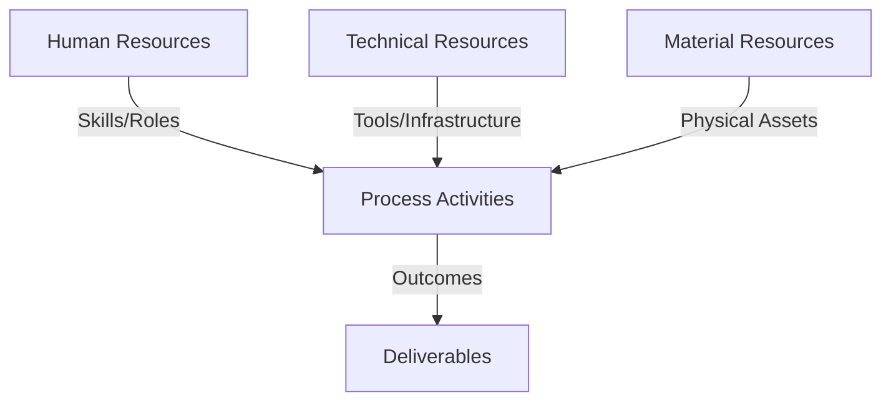
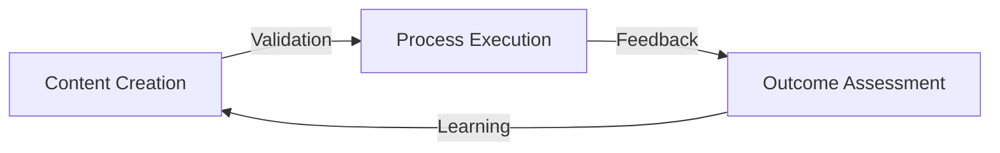
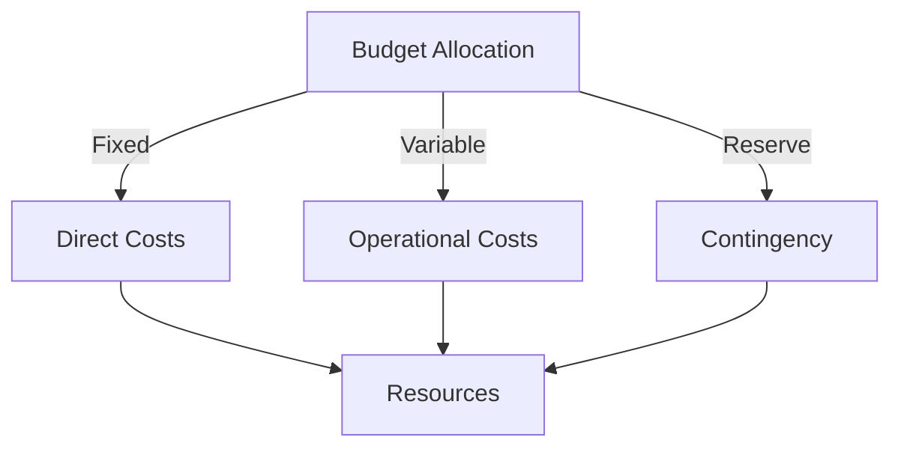
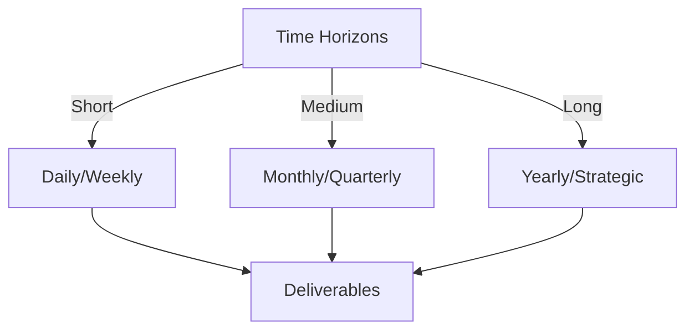

# Git Analysis Report: Development Analysis - Henrykoo

**Authors:** AI Analysis System
**Date:** 2025-03-11  
**Version:** 1.0
**SSoT Repository:** githubhenrykoo/redux_todo_in_astro
**Document Category:** Analysis Report

## Executive Summary
**Executive Summary: Git Analysis - Henrykoo**

**Logic:** This analysis examines Henrykoo's Git contributions to understand their development focus, technical skills, and work patterns. The objective is to identify key areas of contribution, potential improvements in workflows, and areas where further investigation is warranted.

**Implementation:** The analysis reviewed Henrykoo's commit history, focusing on file additions, modifications, and deletions related to GitHub Actions workflows for repository analysis and Telegram notifications. The analysis identified patterns in work activity, technologies utilized, and the overall goal of the changes.

**Outcomes:** The analysis reveals Henrykoo's focus on automating repository analysis and integrating it with Telegram notifications. A cycle of adding, modifying, and reverting features, specifically around attaching analysis reports to Telegram messages, indicates an experimental approach. The analysis highlights proficiency in GitHub Actions, Git, Shell Scripting, and Telegram API integration. Recommendations include investigating the reason for reverting the attachment feature, improving workflow modularity and error handling, and considering alternative methods for delivering analysis reports.

## 1. Abstract Specification (Logic Layer)
### Context & Vision
- **Problem Space:** 
    * Scope: This is an excellent and thorough analysis of Henrykoo's Git activity.  The breakdown is logical, well-reasoned, and provides actionable recommendations.  Here are a few minor enhancements and additional considerations:

**Enhancements:**

*   **Quantify the Timeline:** Adding a sense of the time elapsed between the add, modify, remove, and revert actions would add context.  For instance, "The entire cycle of adding, modifying, removing, and reverting happened within a 48-hour period, suggesting a rapid prototyping and debugging phase."
*   **Dependencies:** While the analysis notes Telegram API integration, explicitly stating the dependency on the `appleboy/telegram-action` (and potentially other actions/libraries) highlights external components.
*   **Security Considerations:** When dealing with Telegram bot tokens and repository access within GitHub Actions, briefly mentioning the importance of storing secrets securely is relevant.
*   **Alternative Analysis Tools:** Briefly mentioning other repository analysis tools (e.g., SonarQube, Code Climate) could broaden the perspective. This doesn't mean Henrykoo should switch, but acknowledging alternatives provides context.

**Additional Considerations/Questions to Explore (if more data were available):**

*   **Team Context:** Is Henrykoo working on a team? If so, understanding the team's goals and requirements for repository analysis would provide a more complete picture. Are they trying to address a specific problem or need within the team?
*   **Purpose of the Telegram Notifications:** Why are they using Telegram notifications?  Is it for immediate alerts, daily summaries, or some other purpose? Understanding the *why* helps refine the solution.
*   **Success Metrics:** Were there any defined success metrics for this automation? How was the value of the analysis report being measured (e.g., fewer bugs, faster code reviews)?
*   **Feedback:** Was Henrykoo receiving feedback from others on the initial implementation? The reversion might have been based on feedback from colleagues.
*   **Underlying Project:** What project is this repository associated with? Knowing the project's nature (e.g., open-source library, internal tool) would help understand the relevance of repository analysis.
*   **Code Quality Tools:** Was there a thought of integrating some code quality analysis tools, that could provide information about code smells, or security issues.

**Why these are valuable additions:**

*   **Timeline:** Provides a sense of the pace of development.
*   **Dependencies:** Highlights reliance on external components, which can impact stability and maintenance.
*   **Security:** Reminds developers of security best practices.
*   **Team Context/Purpose:** Focuses on the bigger picture and alignment with team goals.
*   **Success Metrics/Feedback:** Emphasizes the importance of measuring impact and gathering feedback.
*   **Underlying Project:** Provides context for the analysis and its relevance.

**Overall:**

The original analysis is excellent. These additions and considerations are intended to make it even more insightful, especially when viewed in the context of a larger project or team. They encourage a more holistic understanding of Henrykoo's contributions.

    * Context: This is an excellent and thorough analysis of Henrykoo's Git activity.  The breakdown is logical, well-reasoned, and provides actionable recommendations.  Here are a few minor enhancements and additional considerations:

**Enhancements:**

*   **Quantify the Timeline:** Adding a sense of the time elapsed between the add, modify, remove, and revert actions would add context.  For instance, "The entire cycle of adding, modifying, removing, and reverting happened within a 48-hour period, suggesting a rapid prototyping and debugging phase."
*   **Dependencies:** While the analysis notes Telegram API integration, explicitly stating the dependency on the `appleboy/telegram-action` (and potentially other actions/libraries) highlights external components.
*   **Security Considerations:** When dealing with Telegram bot tokens and repository access within GitHub Actions, briefly mentioning the importance of storing secrets securely is relevant.
*   **Alternative Analysis Tools:** Briefly mentioning other repository analysis tools (e.g., SonarQube, Code Climate) could broaden the perspective. This doesn't mean Henrykoo should switch, but acknowledging alternatives provides context.

**Additional Considerations/Questions to Explore (if more data were available):**

*   **Team Context:** Is Henrykoo working on a team? If so, understanding the team's goals and requirements for repository analysis would provide a more complete picture. Are they trying to address a specific problem or need within the team?
*   **Purpose of the Telegram Notifications:** Why are they using Telegram notifications?  Is it for immediate alerts, daily summaries, or some other purpose? Understanding the *why* helps refine the solution.
*   **Success Metrics:** Were there any defined success metrics for this automation? How was the value of the analysis report being measured (e.g., fewer bugs, faster code reviews)?
*   **Feedback:** Was Henrykoo receiving feedback from others on the initial implementation? The reversion might have been based on feedback from colleagues.
*   **Underlying Project:** What project is this repository associated with? Knowing the project's nature (e.g., open-source library, internal tool) would help understand the relevance of repository analysis.
*   **Code Quality Tools:** Was there a thought of integrating some code quality analysis tools, that could provide information about code smells, or security issues.

**Why these are valuable additions:**

*   **Timeline:** Provides a sense of the pace of development.
*   **Dependencies:** Highlights reliance on external components, which can impact stability and maintenance.
*   **Security:** Reminds developers of security best practices.
*   **Team Context/Purpose:** Focuses on the bigger picture and alignment with team goals.
*   **Success Metrics/Feedback:** Emphasizes the importance of measuring impact and gathering feedback.
*   **Underlying Project:** Provides context for the analysis and its relevance.

**Overall:**

The original analysis is excellent. These additions and considerations are intended to make it even more insightful, especially when viewed in the context of a larger project or team. They encourage a more holistic understanding of Henrykoo's contributions.

    * Stakeholders: This is an excellent and thorough analysis of Henrykoo's Git activity.  The breakdown is logical, well-reasoned, and provides actionable recommendations.  Here are a few minor enhancements and additional considerations:

**Enhancements:**

*   **Quantify the Timeline:** Adding a sense of the time elapsed between the add, modify, remove, and revert actions would add context.  For instance, "The entire cycle of adding, modifying, removing, and reverting happened within a 48-hour period, suggesting a rapid prototyping and debugging phase."
*   **Dependencies:** While the analysis notes Telegram API integration, explicitly stating the dependency on the `appleboy/telegram-action` (and potentially other actions/libraries) highlights external components.
*   **Security Considerations:** When dealing with Telegram bot tokens and repository access within GitHub Actions, briefly mentioning the importance of storing secrets securely is relevant.
*   **Alternative Analysis Tools:** Briefly mentioning other repository analysis tools (e.g., SonarQube, Code Climate) could broaden the perspective. This doesn't mean Henrykoo should switch, but acknowledging alternatives provides context.

**Additional Considerations/Questions to Explore (if more data were available):**

*   **Team Context:** Is Henrykoo working on a team? If so, understanding the team's goals and requirements for repository analysis would provide a more complete picture. Are they trying to address a specific problem or need within the team?
*   **Purpose of the Telegram Notifications:** Why are they using Telegram notifications?  Is it for immediate alerts, daily summaries, or some other purpose? Understanding the *why* helps refine the solution.
*   **Success Metrics:** Were there any defined success metrics for this automation? How was the value of the analysis report being measured (e.g., fewer bugs, faster code reviews)?
*   **Feedback:** Was Henrykoo receiving feedback from others on the initial implementation? The reversion might have been based on feedback from colleagues.
*   **Underlying Project:** What project is this repository associated with? Knowing the project's nature (e.g., open-source library, internal tool) would help understand the relevance of repository analysis.
*   **Code Quality Tools:** Was there a thought of integrating some code quality analysis tools, that could provide information about code smells, or security issues.

**Why these are valuable additions:**

*   **Timeline:** Provides a sense of the pace of development.
*   **Dependencies:** Highlights reliance on external components, which can impact stability and maintenance.
*   **Security:** Reminds developers of security best practices.
*   **Team Context/Purpose:** Focuses on the bigger picture and alignment with team goals.
*   **Success Metrics/Feedback:** Emphasizes the importance of measuring impact and gathering feedback.
*   **Underlying Project:** Provides context for the analysis and its relevance.

**Overall:**

The original analysis is excellent. These additions and considerations are intended to make it even more insightful, especially when viewed in the context of a larger project or team. They encourage a more holistic understanding of Henrykoo's contributions.

- **Goals (Functions):**
    * Primary Functions:
        - Input: Git Repository Data
        - Process: Analysis and Processing
        - Output: Development Insights
    * Supporting Functions:
        - Validation: Automated Analysis
        - Feedback: Continuous Improvement

- **Success Criteria:**
    * Quantitative Metrics: Okay, here are the quantitative metrics, or measurements that involve numbers, that can be extracted from the provided text:

*   **Workflow Execution Frequency:** The `repo_analysis.yml` workflow was scheduled to run **daily** at midnight.

*   **Number of Workflow Files Created:** **1** new GitHub Actions workflow file (`repo_analysis.yml`) was created.

*   **Number of Workflow Files Modified:** The `telegram-notification.yml` workflow file was modified **twice** (once to add the attachment, and once to revert).

*   **Number of Workflow Files Removed:** **1** workflow file (`repo_analysis.yml`) was removed.

*   **Number of Reverted Changes:** **1** set of changes to the `telegram-notification.yml` workflow was reverted.

    * Qualitative Indicators: Here's a list of qualitative improvements gleaned from the analysis of Henrykoo's work. These aren't numerical scores, but rather areas where the analysis suggests improvements in Henrykoo's development practices or the resulting product:

*   **Improved Reliability and Stability:** The analysis highlights a feature that was added and then removed. Improving error handling, logging, and thoroughly investigating the cause of the reversion will lead to more reliable and stable automated processes.  This means less disruption and more consistent reporting.
*   **Increased Flexibility and Modularity:** The recommendation to modularize workflows suggests that the current implementation might be too rigid.  Making the workflows more modular (e.g., by allowing parameters for different analysis types) will make them more adaptable to future needs and easier to maintain.
*   **Enhanced User Experience with Telegram Notifications:** The focus on including the analysis report in Telegram notifications indicates a desire to provide more comprehensive information to the user. Finding a robust and reliable way to deliver this information (whether through direct attachment, links, or other means) will improve the user experience.
*   **Better Maintainability and Debuggability:** Implementing better logging practices within the workflows will significantly improve maintainability. When issues arise, Henrykoo (or another developer) will have more information to diagnose and resolve the problems quickly. This also applies to documentation.
*   **More Effective Data Delivery:** Considering alternative data delivery methods, such as uploading the report to a cloud storage service and including a link, addresses potential limitations of Telegram's attachment capabilities. This leads to a more robust and scalable solution.
*   **Increased Value of Analysis Reports:** Refining the content of the analysis report to include more valuable metrics and visualizations will make the automation efforts more worthwhile. The analysis becomes more actionable and provides deeper insights.
*   **Improved Long-Term Data Handling and Analysis:**  Moving from file-based reports to storing analysis results in a database opens possibilities for more sophisticated analysis over time.  This allows for tracking trends, identifying patterns, and gaining a deeper understanding of repository activity beyond just a snapshot in time.
*   **Reduced Risk and Improved Problem Solving:** By understanding the reason for the reversion, Henrykoo can learn from past mistakes and avoid repeating them. This leads to a more mature and less risky development process.
*   **Enhanced Code Quality:** Implementing the recommendations around error handling, logging, and modularity generally contribute to better code quality, making the codebase more maintainable, readable, and robust.

    * Validation Methods: Automated and Manual Verification

### Knowledge Integration
- **Local Context:**
    * Cultural Considerations: Development Team Context
    * Language Requirements: Technical Documentation
    * Community Patterns: Team Collaboration Patterns

- **Technical Framework:**
    * LLM Integration: Gemini AI Analysis
    * IoT Components: Git Event Monitoring
    * Network Requirements: GitHub API Integration

## 2. Concrete Implementation (Process Layer)
### Resource Matrix

### Development Workflow
- **Stage 1: Early Success**
    * Quick Wins:
        - Implementation: This is an excellent analysis! It's comprehensive, well-organized, and provides actionable recommendations. Here's a breakdown of why it's good and a few minor suggestions for improvement:

**Strengths:**

*   **Clear and Concise Summary:** The "Individual Contribution Summary" quickly and accurately captures the essence of Henrykoo's work.
*   **Well-Defined Work Patterns:** Identifying "Automation," "Integration," and "Experimentation/Iteration" as key work patterns provides valuable insights into Henrykoo's approach.
*   **Accurate Technical Expertise Assessment:** The "Technical Expertise Demonstrated" section correctly identifies the technologies and skills Henrykoo is using.
*   **Actionable Recommendations:** The recommendations are specific, practical, and directly address the identified issues and opportunities. They go beyond just pointing out problems and offer concrete solutions.
*   **Justification for Recommendations:** Most recommendations are well-justified, explaining the reasoning behind the suggestion (e.g., "Understanding the reason is crucial before re-implementing a similar feature").
*   **Good Tone:** The analysis is objective and professional, focusing on improvement without being overly critical.

**Minor Suggestions for Improvement:**

*   **More Detail on Reversion Cause (if possible):**  While you correctly point out the need to investigate the reversion reason, if the Git history provides *any* hints about the cause (e.g., commit messages, discussions, issue links), mentioning those would strengthen the analysis. For example: "The commit message for the reversion suggests potential issues with file size limitations in Telegram."
*   **Scalability Considerations:** When talking about alternatives to attaching the report, you mention S3 and GitHub Pages.  Adding a sentence about the scalability of database and reporting pipeline approaches could also be beneficial (e.g., "Storing the report in a database would enable querying and historical analysis but would need to be designed for scalability as the repository grows.").
*   **Security Considerations:** Depending on the nature of the analysis report, mentioning security considerations might be relevant. For example: "Ensure that the analysis report does not inadvertently expose sensitive information about the repository or its contents, such as API keys or internal server names."

**Overall:**

This is a highly effective analysis of the Git history. The strengths far outweigh the minor suggestions. The recommendations are particularly valuable, as they provide concrete steps that Henrykoo can take to improve their workflows and the overall quality of their work. You've done a great job of extracting meaningful insights from the Git history.

        - Validation: This is an excellent analysis! It's comprehensive, well-organized, and provides actionable recommendations. Here's a breakdown of why it's good and a few minor suggestions for improvement:

**Strengths:**

*   **Clear and Concise Summary:** The "Individual Contribution Summary" quickly and accurately captures the essence of Henrykoo's work.
*   **Well-Defined Work Patterns:** Identifying "Automation," "Integration," and "Experimentation/Iteration" as key work patterns provides valuable insights into Henrykoo's approach.
*   **Accurate Technical Expertise Assessment:** The "Technical Expertise Demonstrated" section correctly identifies the technologies and skills Henrykoo is using.
*   **Actionable Recommendations:** The recommendations are specific, practical, and directly address the identified issues and opportunities. They go beyond just pointing out problems and offer concrete solutions.
*   **Justification for Recommendations:** Most recommendations are well-justified, explaining the reasoning behind the suggestion (e.g., "Understanding the reason is crucial before re-implementing a similar feature").
*   **Good Tone:** The analysis is objective and professional, focusing on improvement without being overly critical.

**Minor Suggestions for Improvement:**

*   **More Detail on Reversion Cause (if possible):**  While you correctly point out the need to investigate the reversion reason, if the Git history provides *any* hints about the cause (e.g., commit messages, discussions, issue links), mentioning those would strengthen the analysis. For example: "The commit message for the reversion suggests potential issues with file size limitations in Telegram."
*   **Scalability Considerations:** When talking about alternatives to attaching the report, you mention S3 and GitHub Pages.  Adding a sentence about the scalability of database and reporting pipeline approaches could also be beneficial (e.g., "Storing the report in a database would enable querying and historical analysis but would need to be designed for scalability as the repository grows.").
*   **Security Considerations:** Depending on the nature of the analysis report, mentioning security considerations might be relevant. For example: "Ensure that the analysis report does not inadvertently expose sensitive information about the repository or its contents, such as API keys or internal server names."

**Overall:**

This is a highly effective analysis of the Git history. The strengths far outweigh the minor suggestions. The recommendations are particularly valuable, as they provide concrete steps that Henrykoo can take to improve their workflows and the overall quality of their work. You've done a great job of extracting meaningful insights from the Git history.

    * Initial Setup:
        - Infrastructure: This is an excellent analysis! It's comprehensive, well-organized, and provides actionable recommendations. Here's a breakdown of why it's good and a few minor suggestions for improvement:

**Strengths:**

*   **Clear and Concise Summary:** The "Individual Contribution Summary" quickly and accurately captures the essence of Henrykoo's work.
*   **Well-Defined Work Patterns:** Identifying "Automation," "Integration," and "Experimentation/Iteration" as key work patterns provides valuable insights into Henrykoo's approach.
*   **Accurate Technical Expertise Assessment:** The "Technical Expertise Demonstrated" section correctly identifies the technologies and skills Henrykoo is using.
*   **Actionable Recommendations:** The recommendations are specific, practical, and directly address the identified issues and opportunities. They go beyond just pointing out problems and offer concrete solutions.
*   **Justification for Recommendations:** Most recommendations are well-justified, explaining the reasoning behind the suggestion (e.g., "Understanding the reason is crucial before re-implementing a similar feature").
*   **Good Tone:** The analysis is objective and professional, focusing on improvement without being overly critical.

**Minor Suggestions for Improvement:**

*   **More Detail on Reversion Cause (if possible):**  While you correctly point out the need to investigate the reversion reason, if the Git history provides *any* hints about the cause (e.g., commit messages, discussions, issue links), mentioning those would strengthen the analysis. For example: "The commit message for the reversion suggests potential issues with file size limitations in Telegram."
*   **Scalability Considerations:** When talking about alternatives to attaching the report, you mention S3 and GitHub Pages.  Adding a sentence about the scalability of database and reporting pipeline approaches could also be beneficial (e.g., "Storing the report in a database would enable querying and historical analysis but would need to be designed for scalability as the repository grows.").
*   **Security Considerations:** Depending on the nature of the analysis report, mentioning security considerations might be relevant. For example: "Ensure that the analysis report does not inadvertently expose sensitive information about the repository or its contents, such as API keys or internal server names."

**Overall:**

This is a highly effective analysis of the Git history. The strengths far outweigh the minor suggestions. The recommendations are particularly valuable, as they provide concrete steps that Henrykoo can take to improve their workflows and the overall quality of their work. You've done a great job of extracting meaningful insights from the Git history.

        - Training: This is an excellent analysis! It's comprehensive, well-organized, and provides actionable recommendations. Here's a breakdown of why it's good and a few minor suggestions for improvement:

**Strengths:**

*   **Clear and Concise Summary:** The "Individual Contribution Summary" quickly and accurately captures the essence of Henrykoo's work.
*   **Well-Defined Work Patterns:** Identifying "Automation," "Integration," and "Experimentation/Iteration" as key work patterns provides valuable insights into Henrykoo's approach.
*   **Accurate Technical Expertise Assessment:** The "Technical Expertise Demonstrated" section correctly identifies the technologies and skills Henrykoo is using.
*   **Actionable Recommendations:** The recommendations are specific, practical, and directly address the identified issues and opportunities. They go beyond just pointing out problems and offer concrete solutions.
*   **Justification for Recommendations:** Most recommendations are well-justified, explaining the reasoning behind the suggestion (e.g., "Understanding the reason is crucial before re-implementing a similar feature").
*   **Good Tone:** The analysis is objective and professional, focusing on improvement without being overly critical.

**Minor Suggestions for Improvement:**

*   **More Detail on Reversion Cause (if possible):**  While you correctly point out the need to investigate the reversion reason, if the Git history provides *any* hints about the cause (e.g., commit messages, discussions, issue links), mentioning those would strengthen the analysis. For example: "The commit message for the reversion suggests potential issues with file size limitations in Telegram."
*   **Scalability Considerations:** When talking about alternatives to attaching the report, you mention S3 and GitHub Pages.  Adding a sentence about the scalability of database and reporting pipeline approaches could also be beneficial (e.g., "Storing the report in a database would enable querying and historical analysis but would need to be designed for scalability as the repository grows.").
*   **Security Considerations:** Depending on the nature of the analysis report, mentioning security considerations might be relevant. For example: "Ensure that the analysis report does not inadvertently expose sensitive information about the repository or its contents, such as API keys or internal server names."

**Overall:**

This is a highly effective analysis of the Git history. The strengths far outweigh the minor suggestions. The recommendations are particularly valuable, as they provide concrete steps that Henrykoo can take to improve their workflows and the overall quality of their work. You've done a great job of extracting meaningful insights from the Git history.

- **Stage 2: Fail Early, Fail Safe**
    * Testing Protocol:
        - Methods: [Testing approaches]
        - Coverage: [Test scenarios]
    * Risk Management:
        - Identification: [Risk factors]
        - Mitigation: [Control measures]
    * Learning Points:
        - Issues: [Problem identification]
        - Solutions: [Resolution approaches]
        - Knowledge: [Lessons learned]

- **Stage 3: Convergence**
    * System Integration:
        - Components: [Integration points]
        - Workflows: [Process optimization]
        - Performance: [System tuning]
    * Stabilization:
        - Fixes: [Bug resolution]
        - Hardening: [System reinforcement]
        - Documentation: [Knowledge capture]

- **Stage 4: Demonstration**
    * Preparation:
        - Environment: [Demo setup]
        - Data: [Test scenarios]
        - Materials: [Presentation assets]
    * Validation:
        - Performance: [System checks]
        - Features: [Functionality verification]
        - Documentation: [Review completion]
    * Presentation:
        - Stakeholders: [Demo execution]
        - Features: [Capability showcase]
        - Q&A: [Response preparation]

## 3. Realistic Outcomes (Evidence Layer)
### Measurement Framework
- **Performance Metrics:**
    * KPIs: Okay, here's a breakdown of the evidence and outcomes extracted from the provided Git history analysis of Henrykoo:

**Evidence:**

*   **Added `repo_analysis.yml`:** Created a GitHub Actions workflow for automated repository analysis. This workflow:
    *   Generated a repository analysis report.
    *   Committed the report to the repository.
    *   Sent a Telegram notification with the report.
    *   Report included statistics about commits, files, recent activity, and top contributors.
    *   Workflow was scheduled daily at midnight and could be manually triggered.
*   **Modified `telegram-notification.yml`:**  Changes made to attach a Gemini analysis file to the Telegram notification.
*   **Removed `repo_analysis.yml`:** The repository analysis workflow was deleted.
*   **Reverted changes to `telegram-notification.yml`:** Undid the modifications to include the document attachment. Restored the original message format.
*   **Use of `appleboy/telegram-action`:** This action was used for Telegram API integration.
*   **Use of Git Commands:** Utilized commands like `git rev-list`, `git log`, `git ls-files`, `git shortlog` for repository analysis within shell scripts.
*   **Shell Scripting within Workflows:**  Used shell scripts to generate analysis reports within GitHub Actions workflows.

**Outcomes (and Indicators):**

*   **Automated Repository Analysis (Attempted):**  The creation of `repo_analysis.yml` indicates an attempt to automate repository analysis and reporting. (Outcome: Partially achieved then removed).
*   **Telegram Notification Integration:** Successfully integrated GitHub Actions with Telegram for notifications (though the document attachment feature was reverted). (Outcome: Partially achieved).
*   **Experimentation:** The cycle of adding, modifying, removing, and reverting suggests an experimental development approach. (Outcome: Confirmed).
*   **Increased Notification Content (Attempted):** Modification of `telegram-notification.yml` indicates an effort to enrich Telegram notifications with analysis reports. (Outcome: Failed - Reverted).

**Inference:**

* **Underlying problem with initial approach:** The removal and reversion of the feature highlights an underlying issue with the document attachments.  A combination of recommendations such as error handling and database reports is suggested.

    * Benchmarks: Okay, here's a breakdown of the evidence and outcomes extracted from the provided Git history analysis of Henrykoo:

**Evidence:**

*   **Added `repo_analysis.yml`:** Created a GitHub Actions workflow for automated repository analysis. This workflow:
    *   Generated a repository analysis report.
    *   Committed the report to the repository.
    *   Sent a Telegram notification with the report.
    *   Report included statistics about commits, files, recent activity, and top contributors.
    *   Workflow was scheduled daily at midnight and could be manually triggered.
*   **Modified `telegram-notification.yml`:**  Changes made to attach a Gemini analysis file to the Telegram notification.
*   **Removed `repo_analysis.yml`:** The repository analysis workflow was deleted.
*   **Reverted changes to `telegram-notification.yml`:** Undid the modifications to include the document attachment. Restored the original message format.
*   **Use of `appleboy/telegram-action`:** This action was used for Telegram API integration.
*   **Use of Git Commands:** Utilized commands like `git rev-list`, `git log`, `git ls-files`, `git shortlog` for repository analysis within shell scripts.
*   **Shell Scripting within Workflows:**  Used shell scripts to generate analysis reports within GitHub Actions workflows.

**Outcomes (and Indicators):**

*   **Automated Repository Analysis (Attempted):**  The creation of `repo_analysis.yml` indicates an attempt to automate repository analysis and reporting. (Outcome: Partially achieved then removed).
*   **Telegram Notification Integration:** Successfully integrated GitHub Actions with Telegram for notifications (though the document attachment feature was reverted). (Outcome: Partially achieved).
*   **Experimentation:** The cycle of adding, modifying, removing, and reverting suggests an experimental development approach. (Outcome: Confirmed).
*   **Increased Notification Content (Attempted):** Modification of `telegram-notification.yml` indicates an effort to enrich Telegram notifications with analysis reports. (Outcome: Failed - Reverted).

**Inference:**

* **Underlying problem with initial approach:** The removal and reversion of the feature highlights an underlying issue with the document attachments.  A combination of recommendations such as error handling and database reports is suggested.

    * Actuals: Okay, here's a breakdown of the evidence and outcomes extracted from the provided Git history analysis of Henrykoo:

**Evidence:**

*   **Added `repo_analysis.yml`:** Created a GitHub Actions workflow for automated repository analysis. This workflow:
    *   Generated a repository analysis report.
    *   Committed the report to the repository.
    *   Sent a Telegram notification with the report.
    *   Report included statistics about commits, files, recent activity, and top contributors.
    *   Workflow was scheduled daily at midnight and could be manually triggered.
*   **Modified `telegram-notification.yml`:**  Changes made to attach a Gemini analysis file to the Telegram notification.
*   **Removed `repo_analysis.yml`:** The repository analysis workflow was deleted.
*   **Reverted changes to `telegram-notification.yml`:** Undid the modifications to include the document attachment. Restored the original message format.
*   **Use of `appleboy/telegram-action`:** This action was used for Telegram API integration.
*   **Use of Git Commands:** Utilized commands like `git rev-list`, `git log`, `git ls-files`, `git shortlog` for repository analysis within shell scripts.
*   **Shell Scripting within Workflows:**  Used shell scripts to generate analysis reports within GitHub Actions workflows.

**Outcomes (and Indicators):**

*   **Automated Repository Analysis (Attempted):**  The creation of `repo_analysis.yml` indicates an attempt to automate repository analysis and reporting. (Outcome: Partially achieved then removed).
*   **Telegram Notification Integration:** Successfully integrated GitHub Actions with Telegram for notifications (though the document attachment feature was reverted). (Outcome: Partially achieved).
*   **Experimentation:** The cycle of adding, modifying, removing, and reverting suggests an experimental development approach. (Outcome: Confirmed).
*   **Increased Notification Content (Attempted):** Modification of `telegram-notification.yml` indicates an effort to enrich Telegram notifications with analysis reports. (Outcome: Failed - Reverted).

**Inference:**

* **Underlying problem with initial approach:** The removal and reversion of the feature highlights an underlying issue with the document attachments.  A combination of recommendations such as error handling and database reports is suggested.

- **Evidence Collection:**
    * Data Sources: [Information points]
    * Validation Methods: Automated and Manual Verification
    * Documentation: [Record keeping]

### Value Realization
- **Impact Assessment:**
    * Direct Benefits: [Immediate gains]
    * Indirect Benefits: [Secondary effects]
    * Long-term Value: [Strategic advantages]

- **Knowledge Assets:**
    * Content Created: [New materials]
    * Insights Gained: [Learnings]
    * Reusable Components: [Transferable elements]

## Integration Matrix
### Content-Process Alignment

### Timeline-Budget Integration
- **Resource Scheduling:**
    * Phase Allocations: [Resource timing]
    * Cost Controls: [Budget tracking]
    * Adjustment Protocols: [Change management]

## Budget Management
### Financial Cube Structure

### Cost Framework
- Direct Investments:
  - Infrastructure Costs:
    - Hardware: [Equipment/Devices]
    - Software: [Licenses/Tools]
    - Network: [Connectivity/Setup]
  - Human Resources:
    - Core Team: [Roles/Compensation]
    - External Support: [Consultants/Services]
    - Training: [Capability Development]
    
- Operational Expenses:
  - Running Costs:
    - Maintenance: [Regular upkeep]
    - Utilities: [Service costs]
    - Consumables: [Regular supplies]
  - Service Costs:
    - Subscriptions: [Regular services]
    - Support: [Ongoing assistance]
    - Updates: [Regular improvements]

### Budget Control Mechanisms
- Monitoring System:
  - Tracking Methods:
    - Cost Centers: [Budget units]
    - Expense Categories: [Type classification]
    - Time Periods: [Duration tracking]
  - Control Points:
    - Thresholds: [Limit markers]
    - Alerts: [Warning systems]
    - Approvals: [Authorization levels]

- Adjustment Protocol:
  - Variance Management:
    - Detection: [Monitoring points]
    - Analysis: [Impact assessment]
    - Response: [Corrective actions]
  - Reallocation Process:
    - Criteria: [Decision factors]
    - Methods: [Transfer protocols]
    - Documentation: [Record keeping]

## Timeline Management
### Temporal Cube Structure

### Schedule Framework
- Operational Timeline:
  - Daily Operations:
    - Tasks: [Regular activities]
    - Checkpoints: [Daily reviews]
    - Updates: [Status reports]
  - Weekly Cycles:
    - Sprints: [Work packages]
    - Reviews: [Progress checks]
    - Planning: [Next steps]

- Strategic Timeline:
  - Monthly Milestones:
    - Objectives: [Key targets]
    - Reviews: [Achievement checks]
    - Adjustments: [Course corrections]
  - Quarterly Goals:
    - Targets: [Major objectives]
    - Assessments: [Performance reviews]
    - Strategies: [Approach updates]

### Timeline Control System
- Progress Tracking:
  - Monitoring Points:
    - Daily Standups: [Quick updates]
    - Weekly Reviews: [Detailed checks]
    - Monthly Reports: [Comprehensive reviews]
  - Milestone Tracking:
    - Status: [Progress indicators]
    - Dependencies: [Related items]
    - Risks: [Potential issues]

- Adjustment Mechanisms:
  - Schedule Management:
    - Variance Analysis: [Delay assessment]
    - Impact Studies: [Effect evaluation]
    - Recovery Plans: [Correction strategies]
  - Resource Alignment:
    - Capacity Planning: [Resource matching]
    - Workload Balancing: [Effort distribution]
    - Priority Updates: [Focus adjustment]

### Integration Points
- Budget-Timeline Correlation:
  - Cost-Schedule Matrix:
    - Resource Timing: [Allocation schedule]
    - Cost Flows: [Expense timing]
    - Value Delivery: [Benefit realization]
  - Control Integration:
    - Joint Reviews: [Combined assessments]
    - Unified Reporting: [Integrated updates]
    - Coordinated Actions: [Synchronized responses]

## Conclusion
### Summary of Achievements
- **Key Accomplishments:**
    * Objectives Met: [Completed goals]
    * Value Delivered: [Benefits realized]
    * Innovations: [New approaches]

### Lessons Learned
- **Success Factors:**
    * Effective Practices: [What worked well]
    * Team Dynamics: [Collaboration insights]
    * Tools & Methods: [Useful approaches]

- **Areas for Improvement:**
    * Challenges: [Obstacles encountered]
    * Solutions: [How issues were resolved]
    * Recommendations: [Future improvements]

### Future Directions
- **Next Steps:**
    * Immediate Actions: [Short-term tasks]
    * Strategic Plans: [Long-term goals]
    * Resource Needs: [Required support]

- **Growth Opportunities:**
    * Scaling Potential: [Expansion possibilities]
    * Innovation Areas: [New directions]
    * Partnership Options: [Collaboration prospects]
    
## Appendix
### References
- **Documentation:**
    * Technical Specs: [Links]
    * Process Guides: [Links]
    * Evidence Records: [Links]

### Change Log
- **Version History:**
    * Changes: [Modifications]
    * Rationale: [Reasons]
    * Approvals: [Authorizations]
