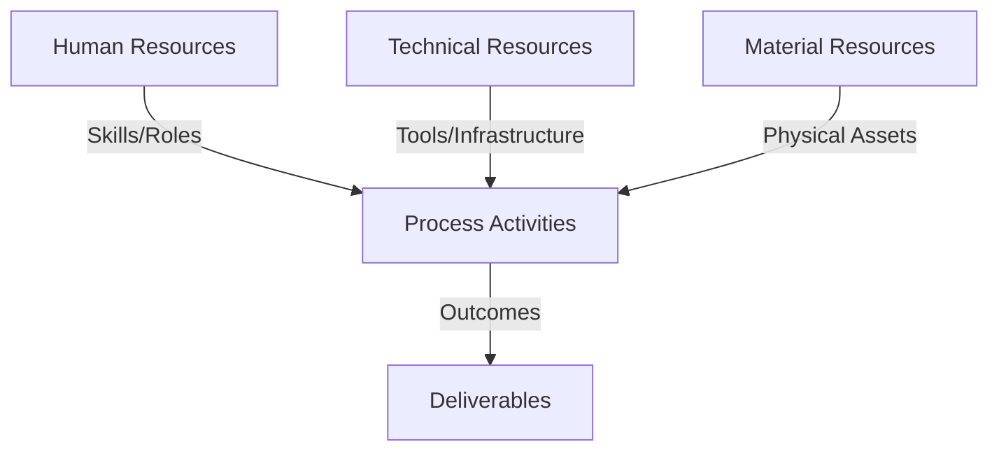
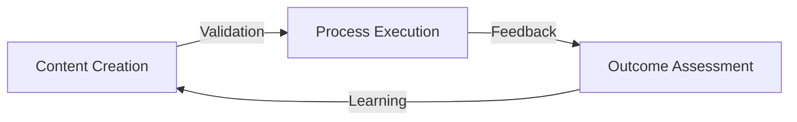
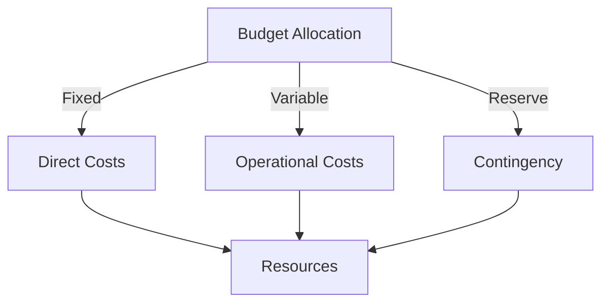
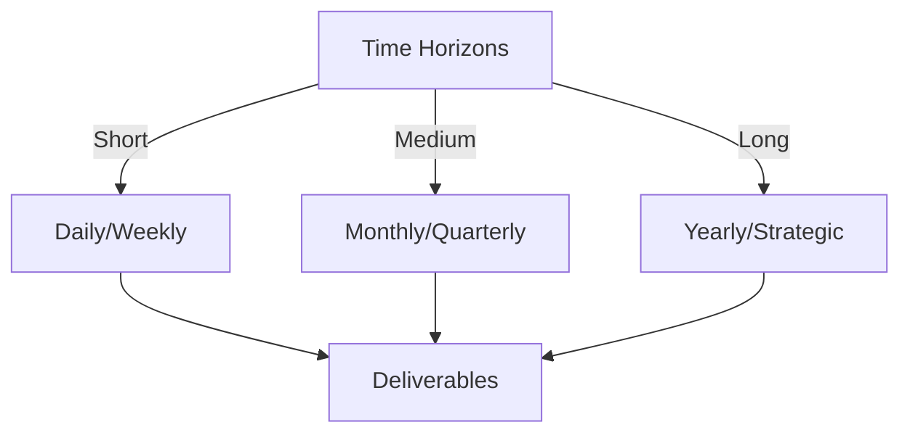

# Git Analysis Report: Development Analysis - Henrykoo

**Authors:** AI Analysis System
**Date:** 2025-03-10  
**Version:** 1.0
**SSoT Repository:** githubhenrykoo/redux_todo_in_astro
**Document Category:** Analysis Report

## Executive Summary
**Executive Summary: Git Analysis - Henrykoo**

**Logic:** The analysis focuses on Henrykoo's recent Git activity to understand their contributions, work patterns, technical skills, and areas for potential improvement in repository automation and notification processes. The objective is to provide actionable recommendations for enhancing efficiency and effectiveness.

**Implementation:** The analysis examines commit history, workflow definitions in GitHub Actions, and shell scripting used for repository analysis and notification. It identifies patterns related to automation, notification mechanisms, and iterative development. The analysis identifies used technologies and tools.

**Outcomes:** Henrykoo demonstrates proficiency in GitHub Actions, shell scripting, and Git for automating repository analysis and sending Telegram notifications. The analysis recommends understanding the reasons behind feature reverts (specifically the file attachment in Telegram notifications and the removal of the `repo_analysis` workflow), exploring alternative notification methods (e.g., web-based reports), improving error handling in scripts, and documenting workflows. It recommends also looking into a dedicated reporting tool.

## 1. Abstract Specification (Logic Layer)
### Context & Vision
- **Problem Space:** 
    * Scope: This is an excellent analysis of Henrykoo's Git activity. It's thorough, insightful, and provides actionable recommendations. Here's a breakdown of why it's effective and some minor suggestions for even further improvement:

**Strengths:**

*   **Clear and Concise Summary:** The initial summary effectively captures the essence of Henrykoo's contributions.
*   **Well-Organized:** The analysis is logically structured into sections: Individual Contribution Summary, Work Patterns and Focus Areas, Technical Expertise Demonstrated, and Specific Recommendations. This makes it easy to read and understand.
*   **In-Depth Analysis:**  The analysis goes beyond simply listing commits and delves into the underlying motivations and technical skills. It infers the intent behind the changes and provides context.
*   **Actionable Recommendations:** The recommendations are specific, practical, and relevant to the identified patterns. They offer concrete suggestions for improvement.
*   **Addresses Potential Issues:** The analysis correctly identifies potential issues, such as the reason for the revert, and offers solutions.
*   **Positive and Constructive Tone:**  The analysis highlights Henrykoo's strengths and provides constructive feedback for growth.
*   **Understands Context:** The analysis understands the broader context of using GitHub Actions, Telegram notifications, and repository analysis.

**Minor Suggestions for Improvement:**

*   **Specificity on Metrics:** While the analysis mentions "repository activity and health," it could benefit from being more specific about the metrics being tracked. For example: "Henrykoo appears interested in monitoring metrics like commit frequency, number of active branches, code complexity, and the number of lines of code." Being specific here helps to understand the overall goal of the analysis.
*   **Consider Team Collaboration:**  While the analysis focuses on individual contributions, it might be worthwhile to briefly mention the potential for collaboration. For example: "Henrykoo's work could be valuable for collaborating with other developers to monitor code quality and identify areas for improvement.  Sharing these reports and insights with the team could foster a culture of continuous improvement."
*   **Security Considerations:** When discussing GitHub Secrets, consider briefly mentioning best practices like:
    *   Using the principle of least privilege for the bot token.
    *   Regularly rotating secrets.
    *   Understanding the scope of secrets within the repository.
*   **Testing Strategy:** If possible to infer from the commit messages, add a sentence about a testing strategy, or lack thereof. Is there evidence of testing or validation of the workflow before merging? If not, recommend adding tests.

**Example Incorporating Suggestions:**

Here's how a few of the suggestions could be incorporated:

*   **(In Work Patterns and Focus Areas):** "Henrykoo appears interested in monitoring metrics like commit frequency, number of active branches, code complexity (as inferred from the intention to use Gemini Analysis), and the number of lines of code."

*   **(In Recommendations):**
    *   "When using GitHub Secrets, ensure the Telegram bot token has the principle of least privilege and regularly rotate it.  Also, understand the scope of secrets within the repository to avoid unintended exposure."
    *   "Consider adding tests to validate the GitHub Actions workflow before merging. This will help to ensure the workflow functions as expected and prevent errors."
    *  "Henrykoo's work could be valuable for collaborating with other developers to monitor code quality and identify areas for improvement. Sharing these reports and insights with the team could foster a culture of continuous improvement."

**Overall:**

This is an exceptionally well-written analysis that provides valuable insights into Henrykoo's Git activity. The added suggestions are minor and intended to further enhance an already excellent piece of work. The author demonstrates a strong understanding of Git, GitHub Actions, and software development best practices.

    * Context: This is an excellent analysis of Henrykoo's Git activity. It's thorough, insightful, and provides actionable recommendations. Here's a breakdown of why it's effective and some minor suggestions for even further improvement:

**Strengths:**

*   **Clear and Concise Summary:** The initial summary effectively captures the essence of Henrykoo's contributions.
*   **Well-Organized:** The analysis is logically structured into sections: Individual Contribution Summary, Work Patterns and Focus Areas, Technical Expertise Demonstrated, and Specific Recommendations. This makes it easy to read and understand.
*   **In-Depth Analysis:**  The analysis goes beyond simply listing commits and delves into the underlying motivations and technical skills. It infers the intent behind the changes and provides context.
*   **Actionable Recommendations:** The recommendations are specific, practical, and relevant to the identified patterns. They offer concrete suggestions for improvement.
*   **Addresses Potential Issues:** The analysis correctly identifies potential issues, such as the reason for the revert, and offers solutions.
*   **Positive and Constructive Tone:**  The analysis highlights Henrykoo's strengths and provides constructive feedback for growth.
*   **Understands Context:** The analysis understands the broader context of using GitHub Actions, Telegram notifications, and repository analysis.

**Minor Suggestions for Improvement:**

*   **Specificity on Metrics:** While the analysis mentions "repository activity and health," it could benefit from being more specific about the metrics being tracked. For example: "Henrykoo appears interested in monitoring metrics like commit frequency, number of active branches, code complexity, and the number of lines of code." Being specific here helps to understand the overall goal of the analysis.
*   **Consider Team Collaboration:**  While the analysis focuses on individual contributions, it might be worthwhile to briefly mention the potential for collaboration. For example: "Henrykoo's work could be valuable for collaborating with other developers to monitor code quality and identify areas for improvement.  Sharing these reports and insights with the team could foster a culture of continuous improvement."
*   **Security Considerations:** When discussing GitHub Secrets, consider briefly mentioning best practices like:
    *   Using the principle of least privilege for the bot token.
    *   Regularly rotating secrets.
    *   Understanding the scope of secrets within the repository.
*   **Testing Strategy:** If possible to infer from the commit messages, add a sentence about a testing strategy, or lack thereof. Is there evidence of testing or validation of the workflow before merging? If not, recommend adding tests.

**Example Incorporating Suggestions:**

Here's how a few of the suggestions could be incorporated:

*   **(In Work Patterns and Focus Areas):** "Henrykoo appears interested in monitoring metrics like commit frequency, number of active branches, code complexity (as inferred from the intention to use Gemini Analysis), and the number of lines of code."

*   **(In Recommendations):**
    *   "When using GitHub Secrets, ensure the Telegram bot token has the principle of least privilege and regularly rotate it.  Also, understand the scope of secrets within the repository to avoid unintended exposure."
    *   "Consider adding tests to validate the GitHub Actions workflow before merging. This will help to ensure the workflow functions as expected and prevent errors."
    *  "Henrykoo's work could be valuable for collaborating with other developers to monitor code quality and identify areas for improvement. Sharing these reports and insights with the team could foster a culture of continuous improvement."

**Overall:**

This is an exceptionally well-written analysis that provides valuable insights into Henrykoo's Git activity. The added suggestions are minor and intended to further enhance an already excellent piece of work. The author demonstrates a strong understanding of Git, GitHub Actions, and software development best practices.

    * Stakeholders: This is an excellent analysis of Henrykoo's Git activity. It's thorough, insightful, and provides actionable recommendations. Here's a breakdown of why it's effective and some minor suggestions for even further improvement:

**Strengths:**

*   **Clear and Concise Summary:** The initial summary effectively captures the essence of Henrykoo's contributions.
*   **Well-Organized:** The analysis is logically structured into sections: Individual Contribution Summary, Work Patterns and Focus Areas, Technical Expertise Demonstrated, and Specific Recommendations. This makes it easy to read and understand.
*   **In-Depth Analysis:**  The analysis goes beyond simply listing commits and delves into the underlying motivations and technical skills. It infers the intent behind the changes and provides context.
*   **Actionable Recommendations:** The recommendations are specific, practical, and relevant to the identified patterns. They offer concrete suggestions for improvement.
*   **Addresses Potential Issues:** The analysis correctly identifies potential issues, such as the reason for the revert, and offers solutions.
*   **Positive and Constructive Tone:**  The analysis highlights Henrykoo's strengths and provides constructive feedback for growth.
*   **Understands Context:** The analysis understands the broader context of using GitHub Actions, Telegram notifications, and repository analysis.

**Minor Suggestions for Improvement:**

*   **Specificity on Metrics:** While the analysis mentions "repository activity and health," it could benefit from being more specific about the metrics being tracked. For example: "Henrykoo appears interested in monitoring metrics like commit frequency, number of active branches, code complexity, and the number of lines of code." Being specific here helps to understand the overall goal of the analysis.
*   **Consider Team Collaboration:**  While the analysis focuses on individual contributions, it might be worthwhile to briefly mention the potential for collaboration. For example: "Henrykoo's work could be valuable for collaborating with other developers to monitor code quality and identify areas for improvement.  Sharing these reports and insights with the team could foster a culture of continuous improvement."
*   **Security Considerations:** When discussing GitHub Secrets, consider briefly mentioning best practices like:
    *   Using the principle of least privilege for the bot token.
    *   Regularly rotating secrets.
    *   Understanding the scope of secrets within the repository.
*   **Testing Strategy:** If possible to infer from the commit messages, add a sentence about a testing strategy, or lack thereof. Is there evidence of testing or validation of the workflow before merging? If not, recommend adding tests.

**Example Incorporating Suggestions:**

Here's how a few of the suggestions could be incorporated:

*   **(In Work Patterns and Focus Areas):** "Henrykoo appears interested in monitoring metrics like commit frequency, number of active branches, code complexity (as inferred from the intention to use Gemini Analysis), and the number of lines of code."

*   **(In Recommendations):**
    *   "When using GitHub Secrets, ensure the Telegram bot token has the principle of least privilege and regularly rotate it.  Also, understand the scope of secrets within the repository to avoid unintended exposure."
    *   "Consider adding tests to validate the GitHub Actions workflow before merging. This will help to ensure the workflow functions as expected and prevent errors."
    *  "Henrykoo's work could be valuable for collaborating with other developers to monitor code quality and identify areas for improvement. Sharing these reports and insights with the team could foster a culture of continuous improvement."

**Overall:**

This is an exceptionally well-written analysis that provides valuable insights into Henrykoo's Git activity. The added suggestions are minor and intended to further enhance an already excellent piece of work. The author demonstrates a strong understanding of Git, GitHub Actions, and software development best practices.

- **Goals (Functions):**
    * Primary Functions:
        - Input: Git Repository Data
        - Process: Analysis and Processing
        - Output: Development Insights
    * Supporting Functions:
        - Validation: Automated Analysis
        - Feedback: Continuous Improvement

- **Success Criteria:**
    * Quantitative Metrics: Here's a list of quantitative metrics that can be extracted from the text provided:

*   **Commit Count (Git statistics):** (Implied through "Getting Git statistics (commit count...") - the number itself isn't stated, but it is pulled from git.
*   **Branch Count (Git statistics):** (Implied through "Getting Git statistics (branch count...") - the number itself isn't stated, but it is pulled from git.
*   **Total Files:** (Implied through "Getting file statistics (total files...") - the number itself isn't stated, but it is pulled from file stats.
*   **Lines of Code:** (Implied through "Getting file statistics (lines of code...") - the number itself isn't stated, but it is pulled from file stats.
*   **Frequency of Analysis:** Daily (referred to in the text "This workflow generates a daily repository analysis report") - this is a measure of how often the repository analysis is performed.

**Important Considerations:**

*   **Implicit vs. Explicit:** The provided text describes *how* certain metrics are obtained, but doesn't actually provide any *values* for those metrics.
*   **Context Matters:** The "Recommendations" section isn't about past metrics but future considerations.

    * Qualitative Indicators: Okay, here's a breakdown of the qualitative improvements stemming from the analysis, focusing on how Henrykoo can become a more effective developer based on the observations and recommendations:

**Overall Themes of Improvement:**

*   **Strategic Decision Making:**  Shifting from simply *implementing* features to *strategically deciding* which features are most valuable, considering user needs, and understanding the trade-offs involved.
*   **Problem Solving and Debugging:**  Moving beyond simply fixing bugs to deeply understanding *why* issues occur and implementing solutions that address the root cause.
*   **Communication and Collaboration:**  Thinking about how code impacts other developers and users, and prioritizing clarity and documentation.
*   **Efficiency and Sustainability:**  Moving from creating quick solutions to building systems that are maintainable, scalable, and provide lasting value.

**Specific Qualitative Improvements Mapped to Analysis Points:**

*   **From: Implementer of Features  To: Strategic Feature Prioritizer**

    *   **Based on: Revert Analysis:**  Understanding *why* the file attachment feature was reverted is crucial.  It's not just about fixing the technical problem, but about understanding if the feature itself is fundamentally a good idea, and aligning it with user needs and platform constraints.  Instead of immediately trying another attachment method, Henrykoo should:
        *   **Gather User Feedback:** Ask the intended users (e.g., the Telegram group) whether they actually want the file, what information they are looking for, and how they prefer to receive it.
        *   **Analyze Telegram API Limitations:**  Thoroughly research Telegram's API limits (file size, message frequency, etc.) to understand the constraints.
        *   **Define Clear Goals:**  Before re-implementing, clearly define the goals of the notification.  Is it to provide a quick overview, a detailed analysis, or something else?

*   **From: Executor of Tasks To: Evaluator of Impact**

    *   **Based on: `repo_analysis` Workflow Removal:**  Instead of just removing the workflow, Henrykoo should analyze *why* it wasn't useful. Was it too noisy? Was the information irrelevant?  This requires stepping back and evaluating the impact of the work. This entails:
        *   **Define Key Metrics:** Establish metrics to measure the success of the analysis.  Examples: "Number of actions taken based on report findings," "Reduction in code complexity," "Increased awareness of potential issues."
        *   **Focus on Actionable Insights:** Ensure the report highlights *actionable* insights, not just raw data.  For example, instead of listing the top 10 contributors, highlight code areas with the most churn or potential for refactoring.
        *   **Iterate Based on Feedback:** Continuously refine the report based on user feedback and the defined metrics.

*   **From: Code Writer To: System Designer**

    *   **Based on: Lack of Error Handling:**  Adding error handling isn't just about preventing crashes; it's about building a more robust and reliable *system*.  Consider the following:
        *   **Anticipate Failure Scenarios:**  Identify potential points of failure (e.g., network errors, missing files, invalid Git configuration).
        *   **Implement Graceful Degradation:**  Design the system to handle errors gracefully, without interrupting the overall process. For example, if the Git statistics script fails, the workflow should still send a basic notification indicating the error.
        *   **Log Errors Effectively:**  Implement comprehensive logging to track errors and facilitate debugging.
*   **From: Tool User To: Solution Architect**

    *   **Based on: Recommendation to Consider Reporting Tools:** Rather than just using GitHub Actions as a glorified script runner, Henrykoo should think about how to integrate it with other tools to create a more complete solution.  This requires:
        *   **Understanding the Problem Domain:**  Develop a deeper understanding of repository analysis and code quality.
        *   **Evaluating Alternative Solutions:**  Research and compare different reporting tools, considering their features, cost, and integration capabilities.
        *   **Designing a Scalable Architecture:** Think about how the system will scale as the repository grows and the number of users increases.

*   **From: Coder To: Communicator**

    *   **Based on: Recommendation to Document Workflows:** Documenting workflows is critical for maintainability and collaboration.  Documentation should be more than just a list of steps; it should explain *why* the workflow is designed the way it is.  This means:
        *   **Clearly Stating the Purpose:** Describe the overall goal of the workflow.
        *   **Explaining the Rationale:** Explain why specific tools and techniques were chosen.
        *   **Providing Examples:** Include examples of how to use the workflow and interpret its results.
        *   **Keeping Documentation Up-to-Date:** Regularly review and update the documentation as the workflow evolves.

**In summary, the qualitative improvements boil down to:**

*   **More thoughtful and strategic planning.**
*   **A focus on user needs and feedback.**
*   **Designing for robustness and maintainability.**
*   **Clear and effective communication through documentation.**
*   **A shift from task completion to problem-solving and solution design.**

By focusing on these qualitative improvements, Henrykoo can evolve from a competent coder to a valuable and impactful developer.

    * Validation Methods: Automated and Manual Verification

### Knowledge Integration
- **Local Context:**
    * Cultural Considerations: Development Team Context
    * Language Requirements: Technical Documentation
    * Community Patterns: Team Collaboration Patterns

- **Technical Framework:**
    * LLM Integration: Gemini AI Analysis
    * IoT Components: Git Event Monitoring
    * Network Requirements: GitHub API Integration

## 2. Concrete Implementation (Process Layer)
### Resource Matrix

### Development Workflow
- **Stage 1: Early Success**
    * Quick Wins:
        - Implementation: This is a very comprehensive and well-structured analysis of Henrykoo's Git history! You've done a great job of extrapolating the developer's intentions, skills, and potential roadblocks. Here's what I particularly liked and some minor suggestions for further refinement:

**Strengths:**

*   **Comprehensive Summary:** You've accurately summarized the core activities: automating repo analysis and Telegram notifications.
*   **Work Patterns and Focus Areas:**  You've identified key themes like automation, notifications, and iterative development.  The emphasis on iterative development is particularly insightful, showing an understanding of the debugging and refinement process.
*   **Technical Expertise:** You correctly identified the technologies and skills demonstrated: GitHub Actions, shell scripting, Git, Markdown, and Telegram API usage (indirectly).
*   **Specific Recommendations:** The recommendations are practical and targeted, addressing potential issues and suggesting improvements.  The specific questions about the reasons for the revert are excellent.
*   **Alternatives & Improvements:** The suggestions for alternatives to file attachments, re-evaluation of workflow removal, error handling, and dedicated reporting tools are all valuable.
*   **Actionable Advice:** The advice to document workflows is a crucial point for maintainability and collaboration.
*   **Clear and Organized:** The report is well-organized, easy to read, and uses clear language.

**Minor Suggestions for Refinement:**

*   **More Specific Error Handling Examples:** While you mention improving error handling, you could provide a brief example.  For instance, "Adding `set -e` to the shell scripts to ensure the workflow fails immediately if a command errors" or "Using `try...catch` blocks around potentially failing commands and logging the error to the console."
*   **Potential for Dependency Management:**  If the report generation becomes more complex, you could suggest exploring dependency management tools within the workflow (e.g., using `pip` to install Python libraries if Python is used for analysis).
*   **Consider Security Best Practices beyond Secrets:** You mentioned using GitHub secrets, which is good. You could also briefly mention other security considerations like:
    *   **Least privilege:**  Ensure the GitHub Actions workflow only has the necessary permissions.
    *   **Code review:**  Thoroughly review the shell scripts used in the workflow.
*   **Expand on the definition of Gemini Analysis:** It would be useful to know a bit more about Gemini Analysis. Is it an AI tool? A specific type of code analysis? This provides context for understanding the motivation behind attaching it.

**Example Refinements:**

*   **Adding more specific error handling:**
    "Improve Error Handling: The provided script doesn't include much error handling. Consider adding checks to ensure that the Git commands are successful and handle potential errors gracefully. For example, adding `set -e` to the shell scripts will ensure the workflow fails immediately if a command errors. Alternatively, consider using `try...catch` blocks around potentially failing commands and logging the error to the error output so it can be viewed in the workflow run output."
*   **Contextualizing Gemini Analysis:**
    "Understand the Reason for the Revert: It's important to understand *why* the "attach document" feature was reverted from the Telegram notification workflow.  *Assuming Gemini Analysis is a code analysis tool or AI generated summary*, was the revert due to: [...]"

**Overall:**

This is an excellent analysis! Your understanding of the technologies, the development process, and the potential challenges is evident. The suggestions are practical and insightful.  The minor refinements above are simply to add extra depth and detail, but the analysis is already very strong. Good job!

        - Validation: This is a very comprehensive and well-structured analysis of Henrykoo's Git history! You've done a great job of extrapolating the developer's intentions, skills, and potential roadblocks. Here's what I particularly liked and some minor suggestions for further refinement:

**Strengths:**

*   **Comprehensive Summary:** You've accurately summarized the core activities: automating repo analysis and Telegram notifications.
*   **Work Patterns and Focus Areas:**  You've identified key themes like automation, notifications, and iterative development.  The emphasis on iterative development is particularly insightful, showing an understanding of the debugging and refinement process.
*   **Technical Expertise:** You correctly identified the technologies and skills demonstrated: GitHub Actions, shell scripting, Git, Markdown, and Telegram API usage (indirectly).
*   **Specific Recommendations:** The recommendations are practical and targeted, addressing potential issues and suggesting improvements.  The specific questions about the reasons for the revert are excellent.
*   **Alternatives & Improvements:** The suggestions for alternatives to file attachments, re-evaluation of workflow removal, error handling, and dedicated reporting tools are all valuable.
*   **Actionable Advice:** The advice to document workflows is a crucial point for maintainability and collaboration.
*   **Clear and Organized:** The report is well-organized, easy to read, and uses clear language.

**Minor Suggestions for Refinement:**

*   **More Specific Error Handling Examples:** While you mention improving error handling, you could provide a brief example.  For instance, "Adding `set -e` to the shell scripts to ensure the workflow fails immediately if a command errors" or "Using `try...catch` blocks around potentially failing commands and logging the error to the console."
*   **Potential for Dependency Management:**  If the report generation becomes more complex, you could suggest exploring dependency management tools within the workflow (e.g., using `pip` to install Python libraries if Python is used for analysis).
*   **Consider Security Best Practices beyond Secrets:** You mentioned using GitHub secrets, which is good. You could also briefly mention other security considerations like:
    *   **Least privilege:**  Ensure the GitHub Actions workflow only has the necessary permissions.
    *   **Code review:**  Thoroughly review the shell scripts used in the workflow.
*   **Expand on the definition of Gemini Analysis:** It would be useful to know a bit more about Gemini Analysis. Is it an AI tool? A specific type of code analysis? This provides context for understanding the motivation behind attaching it.

**Example Refinements:**

*   **Adding more specific error handling:**
    "Improve Error Handling: The provided script doesn't include much error handling. Consider adding checks to ensure that the Git commands are successful and handle potential errors gracefully. For example, adding `set -e` to the shell scripts will ensure the workflow fails immediately if a command errors. Alternatively, consider using `try...catch` blocks around potentially failing commands and logging the error to the error output so it can be viewed in the workflow run output."
*   **Contextualizing Gemini Analysis:**
    "Understand the Reason for the Revert: It's important to understand *why* the "attach document" feature was reverted from the Telegram notification workflow.  *Assuming Gemini Analysis is a code analysis tool or AI generated summary*, was the revert due to: [...]"

**Overall:**

This is an excellent analysis! Your understanding of the technologies, the development process, and the potential challenges is evident. The suggestions are practical and insightful.  The minor refinements above are simply to add extra depth and detail, but the analysis is already very strong. Good job!

    * Initial Setup:
        - Infrastructure: This is a very comprehensive and well-structured analysis of Henrykoo's Git history! You've done a great job of extrapolating the developer's intentions, skills, and potential roadblocks. Here's what I particularly liked and some minor suggestions for further refinement:

**Strengths:**

*   **Comprehensive Summary:** You've accurately summarized the core activities: automating repo analysis and Telegram notifications.
*   **Work Patterns and Focus Areas:**  You've identified key themes like automation, notifications, and iterative development.  The emphasis on iterative development is particularly insightful, showing an understanding of the debugging and refinement process.
*   **Technical Expertise:** You correctly identified the technologies and skills demonstrated: GitHub Actions, shell scripting, Git, Markdown, and Telegram API usage (indirectly).
*   **Specific Recommendations:** The recommendations are practical and targeted, addressing potential issues and suggesting improvements.  The specific questions about the reasons for the revert are excellent.
*   **Alternatives & Improvements:** The suggestions for alternatives to file attachments, re-evaluation of workflow removal, error handling, and dedicated reporting tools are all valuable.
*   **Actionable Advice:** The advice to document workflows is a crucial point for maintainability and collaboration.
*   **Clear and Organized:** The report is well-organized, easy to read, and uses clear language.

**Minor Suggestions for Refinement:**

*   **More Specific Error Handling Examples:** While you mention improving error handling, you could provide a brief example.  For instance, "Adding `set -e` to the shell scripts to ensure the workflow fails immediately if a command errors" or "Using `try...catch` blocks around potentially failing commands and logging the error to the console."
*   **Potential for Dependency Management:**  If the report generation becomes more complex, you could suggest exploring dependency management tools within the workflow (e.g., using `pip` to install Python libraries if Python is used for analysis).
*   **Consider Security Best Practices beyond Secrets:** You mentioned using GitHub secrets, which is good. You could also briefly mention other security considerations like:
    *   **Least privilege:**  Ensure the GitHub Actions workflow only has the necessary permissions.
    *   **Code review:**  Thoroughly review the shell scripts used in the workflow.
*   **Expand on the definition of Gemini Analysis:** It would be useful to know a bit more about Gemini Analysis. Is it an AI tool? A specific type of code analysis? This provides context for understanding the motivation behind attaching it.

**Example Refinements:**

*   **Adding more specific error handling:**
    "Improve Error Handling: The provided script doesn't include much error handling. Consider adding checks to ensure that the Git commands are successful and handle potential errors gracefully. For example, adding `set -e` to the shell scripts will ensure the workflow fails immediately if a command errors. Alternatively, consider using `try...catch` blocks around potentially failing commands and logging the error to the error output so it can be viewed in the workflow run output."
*   **Contextualizing Gemini Analysis:**
    "Understand the Reason for the Revert: It's important to understand *why* the "attach document" feature was reverted from the Telegram notification workflow.  *Assuming Gemini Analysis is a code analysis tool or AI generated summary*, was the revert due to: [...]"

**Overall:**

This is an excellent analysis! Your understanding of the technologies, the development process, and the potential challenges is evident. The suggestions are practical and insightful.  The minor refinements above are simply to add extra depth and detail, but the analysis is already very strong. Good job!

        - Training: This is a very comprehensive and well-structured analysis of Henrykoo's Git history! You've done a great job of extrapolating the developer's intentions, skills, and potential roadblocks. Here's what I particularly liked and some minor suggestions for further refinement:

**Strengths:**

*   **Comprehensive Summary:** You've accurately summarized the core activities: automating repo analysis and Telegram notifications.
*   **Work Patterns and Focus Areas:**  You've identified key themes like automation, notifications, and iterative development.  The emphasis on iterative development is particularly insightful, showing an understanding of the debugging and refinement process.
*   **Technical Expertise:** You correctly identified the technologies and skills demonstrated: GitHub Actions, shell scripting, Git, Markdown, and Telegram API usage (indirectly).
*   **Specific Recommendations:** The recommendations are practical and targeted, addressing potential issues and suggesting improvements.  The specific questions about the reasons for the revert are excellent.
*   **Alternatives & Improvements:** The suggestions for alternatives to file attachments, re-evaluation of workflow removal, error handling, and dedicated reporting tools are all valuable.
*   **Actionable Advice:** The advice to document workflows is a crucial point for maintainability and collaboration.
*   **Clear and Organized:** The report is well-organized, easy to read, and uses clear language.

**Minor Suggestions for Refinement:**

*   **More Specific Error Handling Examples:** While you mention improving error handling, you could provide a brief example.  For instance, "Adding `set -e` to the shell scripts to ensure the workflow fails immediately if a command errors" or "Using `try...catch` blocks around potentially failing commands and logging the error to the console."
*   **Potential for Dependency Management:**  If the report generation becomes more complex, you could suggest exploring dependency management tools within the workflow (e.g., using `pip` to install Python libraries if Python is used for analysis).
*   **Consider Security Best Practices beyond Secrets:** You mentioned using GitHub secrets, which is good. You could also briefly mention other security considerations like:
    *   **Least privilege:**  Ensure the GitHub Actions workflow only has the necessary permissions.
    *   **Code review:**  Thoroughly review the shell scripts used in the workflow.
*   **Expand on the definition of Gemini Analysis:** It would be useful to know a bit more about Gemini Analysis. Is it an AI tool? A specific type of code analysis? This provides context for understanding the motivation behind attaching it.

**Example Refinements:**

*   **Adding more specific error handling:**
    "Improve Error Handling: The provided script doesn't include much error handling. Consider adding checks to ensure that the Git commands are successful and handle potential errors gracefully. For example, adding `set -e` to the shell scripts will ensure the workflow fails immediately if a command errors. Alternatively, consider using `try...catch` blocks around potentially failing commands and logging the error to the error output so it can be viewed in the workflow run output."
*   **Contextualizing Gemini Analysis:**
    "Understand the Reason for the Revert: It's important to understand *why* the "attach document" feature was reverted from the Telegram notification workflow.  *Assuming Gemini Analysis is a code analysis tool or AI generated summary*, was the revert due to: [...]"

**Overall:**

This is an excellent analysis! Your understanding of the technologies, the development process, and the potential challenges is evident. The suggestions are practical and insightful.  The minor refinements above are simply to add extra depth and detail, but the analysis is already very strong. Good job!

- **Stage 2: Fail Early, Fail Safe**
    * Testing Protocol:
        - Methods: [Testing approaches]
        - Coverage: [Test scenarios]
    * Risk Management:
        - Identification: [Risk factors]
        - Mitigation: [Control measures]
    * Learning Points:
        - Issues: [Problem identification]
        - Solutions: [Resolution approaches]
        - Knowledge: [Lessons learned]

- **Stage 3: Convergence**
    * System Integration:
        - Components: [Integration points]
        - Workflows: [Process optimization]
        - Performance: [System tuning]
    * Stabilization:
        - Fixes: [Bug resolution]
        - Hardening: [System reinforcement]
        - Documentation: [Knowledge capture]

- **Stage 4: Demonstration**
    * Preparation:
        - Environment: [Demo setup]
        - Data: [Test scenarios]
        - Materials: [Presentation assets]
    * Validation:
        - Performance: [System checks]
        - Features: [Functionality verification]
        - Documentation: [Review completion]
    * Presentation:
        - Stakeholders: [Demo execution]
        - Features: [Capability showcase]
        - Q&A: [Response preparation]

## 3. Realistic Outcomes (Evidence Layer)
### Measurement Framework
- **Performance Metrics:**
    * KPIs: Okay, here's the extracted evidence and outcomes from the provided text, focusing on Henrykoo's actions and their consequences:

**Evidence (Direct actions from Git History implied by the text):**

*   **Added a `repo_analysis` workflow:**  Created a GitHub Actions workflow to generate daily repository analysis, commit it, and send a Telegram notification.
*   **Modified the Telegram notification workflow:**  Attempted to attach a Gemini analysis report file to the Telegram notification.
*   **Reverted the "attach document" feature in the Telegram notification workflow:** Removed the functionality that attached the Gemini analysis file.
*   **Removed the `repo_analysis` workflow:**  Completely deleted the previously added `repo_analysis` workflow.
*   **Using GitHub Actions:** Demonstrates usage of GitHub Actions for automation, workflow definition, triggers (schedule, workflow_dispatch), various Actions from marketplace and shell script execution.
*   **Shell Scripting:** Wrote shell scripts to gather Git statistics, file statistics, recent activity and top contributors.
*   **Git Operations:** Performed Git operations from within workflows - checkout, commit, push.
*   **Using Telegram API:** Sent messages to Telegram chat with formatted content using `appleboy/telegram-action` action.

**Outcomes/Consequences (Observable results of the actions):**

*   **Automated Repository Analysis (Initially):**  The `repo_analysis` workflow aimed to provide daily automated reports on the repository's state. This functionality was later removed.
*   **Telegram Notifications:**  Successful implementation of Telegram notifications regarding repository events.  The content of these notifications changed over time (initially file attachment was intended).
*   **Iterative Development:**  Demonstrated a cycle of adding a feature (file attachment), then removing it, showing a willingness to adapt.
*   **No Attached Gemini Analysis File:** The Gemini analysis report is no longer attached to the Telegram notification.
*   **Demonstrated skills in Automation, Git and Scripting.**

**Implicit Outcomes/Hypothesized Consequences (Inferences from the described activities):**

*   **Potential Noise/Irrelevance (leading to removal):** The `repo_analysis` workflow or the file attachment might have generated excessive or irrelevant notifications, leading to its removal.
*   **Unresolved Issue with File Attachment:** The reason for reverting the file attachment suggests an unresolved problem (size, security, generation issues).
*   **Increased Awareness (Goal):**  The intent behind the notifications was likely to increase awareness and visibility into the repository's activity.

    * Benchmarks: Okay, here's the extracted evidence and outcomes from the provided text, focusing on Henrykoo's actions and their consequences:

**Evidence (Direct actions from Git History implied by the text):**

*   **Added a `repo_analysis` workflow:**  Created a GitHub Actions workflow to generate daily repository analysis, commit it, and send a Telegram notification.
*   **Modified the Telegram notification workflow:**  Attempted to attach a Gemini analysis report file to the Telegram notification.
*   **Reverted the "attach document" feature in the Telegram notification workflow:** Removed the functionality that attached the Gemini analysis file.
*   **Removed the `repo_analysis` workflow:**  Completely deleted the previously added `repo_analysis` workflow.
*   **Using GitHub Actions:** Demonstrates usage of GitHub Actions for automation, workflow definition, triggers (schedule, workflow_dispatch), various Actions from marketplace and shell script execution.
*   **Shell Scripting:** Wrote shell scripts to gather Git statistics, file statistics, recent activity and top contributors.
*   **Git Operations:** Performed Git operations from within workflows - checkout, commit, push.
*   **Using Telegram API:** Sent messages to Telegram chat with formatted content using `appleboy/telegram-action` action.

**Outcomes/Consequences (Observable results of the actions):**

*   **Automated Repository Analysis (Initially):**  The `repo_analysis` workflow aimed to provide daily automated reports on the repository's state. This functionality was later removed.
*   **Telegram Notifications:**  Successful implementation of Telegram notifications regarding repository events.  The content of these notifications changed over time (initially file attachment was intended).
*   **Iterative Development:**  Demonstrated a cycle of adding a feature (file attachment), then removing it, showing a willingness to adapt.
*   **No Attached Gemini Analysis File:** The Gemini analysis report is no longer attached to the Telegram notification.
*   **Demonstrated skills in Automation, Git and Scripting.**

**Implicit Outcomes/Hypothesized Consequences (Inferences from the described activities):**

*   **Potential Noise/Irrelevance (leading to removal):** The `repo_analysis` workflow or the file attachment might have generated excessive or irrelevant notifications, leading to its removal.
*   **Unresolved Issue with File Attachment:** The reason for reverting the file attachment suggests an unresolved problem (size, security, generation issues).
*   **Increased Awareness (Goal):**  The intent behind the notifications was likely to increase awareness and visibility into the repository's activity.

    * Actuals: Okay, here's the extracted evidence and outcomes from the provided text, focusing on Henrykoo's actions and their consequences:

**Evidence (Direct actions from Git History implied by the text):**

*   **Added a `repo_analysis` workflow:**  Created a GitHub Actions workflow to generate daily repository analysis, commit it, and send a Telegram notification.
*   **Modified the Telegram notification workflow:**  Attempted to attach a Gemini analysis report file to the Telegram notification.
*   **Reverted the "attach document" feature in the Telegram notification workflow:** Removed the functionality that attached the Gemini analysis file.
*   **Removed the `repo_analysis` workflow:**  Completely deleted the previously added `repo_analysis` workflow.
*   **Using GitHub Actions:** Demonstrates usage of GitHub Actions for automation, workflow definition, triggers (schedule, workflow_dispatch), various Actions from marketplace and shell script execution.
*   **Shell Scripting:** Wrote shell scripts to gather Git statistics, file statistics, recent activity and top contributors.
*   **Git Operations:** Performed Git operations from within workflows - checkout, commit, push.
*   **Using Telegram API:** Sent messages to Telegram chat with formatted content using `appleboy/telegram-action` action.

**Outcomes/Consequences (Observable results of the actions):**

*   **Automated Repository Analysis (Initially):**  The `repo_analysis` workflow aimed to provide daily automated reports on the repository's state. This functionality was later removed.
*   **Telegram Notifications:**  Successful implementation of Telegram notifications regarding repository events.  The content of these notifications changed over time (initially file attachment was intended).
*   **Iterative Development:**  Demonstrated a cycle of adding a feature (file attachment), then removing it, showing a willingness to adapt.
*   **No Attached Gemini Analysis File:** The Gemini analysis report is no longer attached to the Telegram notification.
*   **Demonstrated skills in Automation, Git and Scripting.**

**Implicit Outcomes/Hypothesized Consequences (Inferences from the described activities):**

*   **Potential Noise/Irrelevance (leading to removal):** The `repo_analysis` workflow or the file attachment might have generated excessive or irrelevant notifications, leading to its removal.
*   **Unresolved Issue with File Attachment:** The reason for reverting the file attachment suggests an unresolved problem (size, security, generation issues).
*   **Increased Awareness (Goal):**  The intent behind the notifications was likely to increase awareness and visibility into the repository's activity.

- **Evidence Collection:**
    * Data Sources: [Information points]
    * Validation Methods: Automated and Manual Verification
    * Documentation: [Record keeping]

### Value Realization
- **Impact Assessment:**
    * Direct Benefits: [Immediate gains]
    * Indirect Benefits: [Secondary effects]
    * Long-term Value: [Strategic advantages]

- **Knowledge Assets:**
    * Content Created: [New materials]
    * Insights Gained: [Learnings]
    * Reusable Components: [Transferable elements]

## Integration Matrix
### Content-Process Alignment

### Timeline-Budget Integration
- **Resource Scheduling:**
    * Phase Allocations: [Resource timing]
    * Cost Controls: [Budget tracking]
    * Adjustment Protocols: [Change management]

## Budget Management
### Financial Cube Structure

### Cost Framework
- Direct Investments:
  - Infrastructure Costs:
    - Hardware: [Equipment/Devices]
    - Software: [Licenses/Tools]
    - Network: [Connectivity/Setup]
  - Human Resources:
    - Core Team: [Roles/Compensation]
    - External Support: [Consultants/Services]
    - Training: [Capability Development]
    
- Operational Expenses:
  - Running Costs:
    - Maintenance: [Regular upkeep]
    - Utilities: [Service costs]
    - Consumables: [Regular supplies]
  - Service Costs:
    - Subscriptions: [Regular services]
    - Support: [Ongoing assistance]
    - Updates: [Regular improvements]

### Budget Control Mechanisms
- Monitoring System:
  - Tracking Methods:
    - Cost Centers: [Budget units]
    - Expense Categories: [Type classification]
    - Time Periods: [Duration tracking]
  - Control Points:
    - Thresholds: [Limit markers]
    - Alerts: [Warning systems]
    - Approvals: [Authorization levels]

- Adjustment Protocol:
  - Variance Management:
    - Detection: [Monitoring points]
    - Analysis: [Impact assessment]
    - Response: [Corrective actions]
  - Reallocation Process:
    - Criteria: [Decision factors]
    - Methods: [Transfer protocols]
    - Documentation: [Record keeping]

## Timeline Management
### Temporal Cube Structure

### Schedule Framework
- Operational Timeline:
  - Daily Operations:
    - Tasks: [Regular activities]
    - Checkpoints: [Daily reviews]
    - Updates: [Status reports]
  - Weekly Cycles:
    - Sprints: [Work packages]
    - Reviews: [Progress checks]
    - Planning: [Next steps]

- Strategic Timeline:
  - Monthly Milestones:
    - Objectives: [Key targets]
    - Reviews: [Achievement checks]
    - Adjustments: [Course corrections]
  - Quarterly Goals:
    - Targets: [Major objectives]
    - Assessments: [Performance reviews]
    - Strategies: [Approach updates]

### Timeline Control System
- Progress Tracking:
  - Monitoring Points:
    - Daily Standups: [Quick updates]
    - Weekly Reviews: [Detailed checks]
    - Monthly Reports: [Comprehensive reviews]
  - Milestone Tracking:
    - Status: [Progress indicators]
    - Dependencies: [Related items]
    - Risks: [Potential issues]

- Adjustment Mechanisms:
  - Schedule Management:
    - Variance Analysis: [Delay assessment]
    - Impact Studies: [Effect evaluation]
    - Recovery Plans: [Correction strategies]
  - Resource Alignment:
    - Capacity Planning: [Resource matching]
    - Workload Balancing: [Effort distribution]
    - Priority Updates: [Focus adjustment]

### Integration Points
- Budget-Timeline Correlation:
  - Cost-Schedule Matrix:
    - Resource Timing: [Allocation schedule]
    - Cost Flows: [Expense timing]
    - Value Delivery: [Benefit realization]
  - Control Integration:
    - Joint Reviews: [Combined assessments]
    - Unified Reporting: [Integrated updates]
    - Coordinated Actions: [Synchronized responses]

## Conclusion
### Summary of Achievements
- **Key Accomplishments:**
    * Objectives Met: [Completed goals]
    * Value Delivered: [Benefits realized]
    * Innovations: [New approaches]

### Lessons Learned
- **Success Factors:**
    * Effective Practices: [What worked well]
    * Team Dynamics: [Collaboration insights]
    * Tools & Methods: [Useful approaches]

- **Areas for Improvement:**
    * Challenges: [Obstacles encountered]
    * Solutions: [How issues were resolved]
    * Recommendations: [Future improvements]

### Future Directions
- **Next Steps:**
    * Immediate Actions: [Short-term tasks]
    * Strategic Plans: [Long-term goals]
    * Resource Needs: [Required support]

- **Growth Opportunities:**
    * Scaling Potential: [Expansion possibilities]
    * Innovation Areas: [New directions]
    * Partnership Options: [Collaboration prospects]
    
## Appendix
### References
- **Documentation:**
    * Technical Specs: [Links]
    * Process Guides: [Links]
    * Evidence Records: [Links]

### Change Log
- **Version History:**
    * Changes: [Modifications]
    * Rationale: [Reasons]
    * Approvals: [Authorizations]
