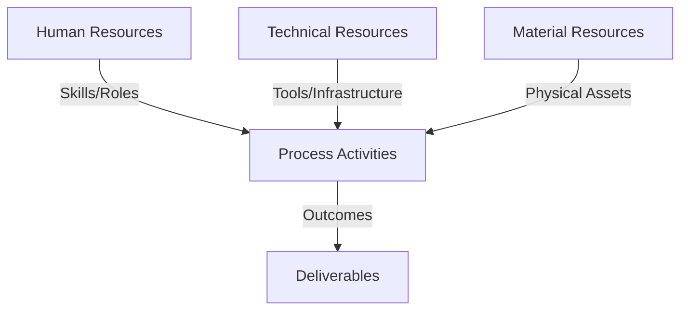
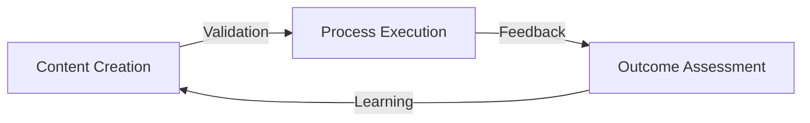
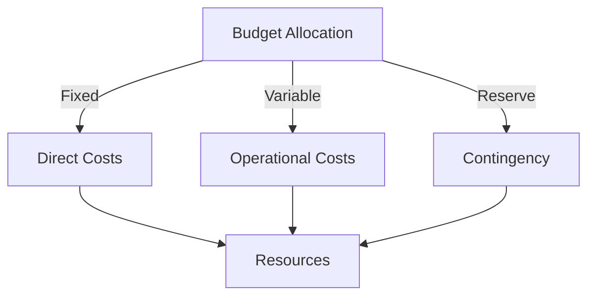
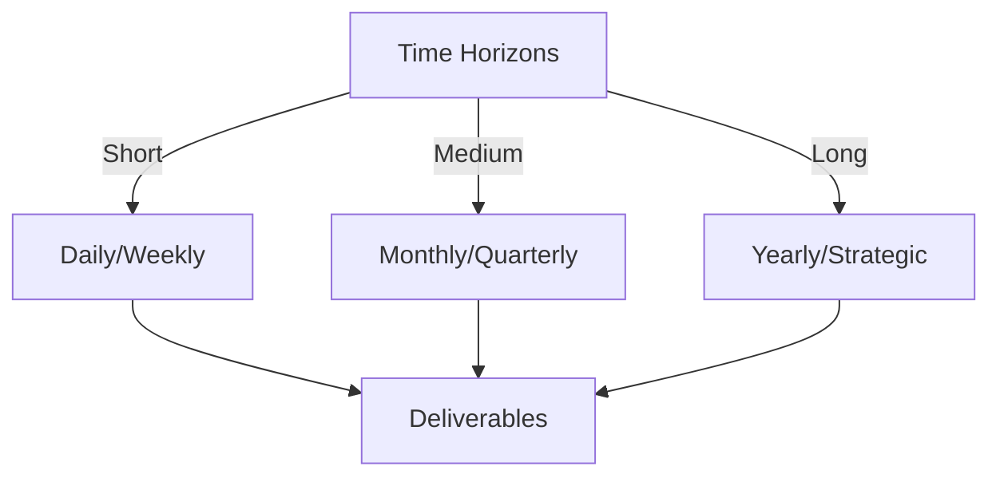

# Git Analysis Report: Development Analysis - Henrykoo

**Authors:** AI Analysis System
**Date:** 2025-03-11  
**Version:** 1.0
**SSoT Repository:** githubhenrykoo/redux_todo_in_astro
**Document Category:** Analysis Report

## Executive Summary
**Executive Summary: Git Analysis of Henrykoo's Contributions**

**Logic:** This analysis aims to understand Henrykoo's contributions to the project by examining their Git activity, focusing on identifying work patterns, technical expertise, and areas for improvement in automation, notification strategies, and workflow management. The objective is to provide actionable recommendations to enhance Henrykoo's effectiveness and overall project development practices.

**Implementation:** The analysis was conducted by reviewing Henrykoo's commit history and examining the content of relevant Git files (e.g., workflow definitions in YAML, shell scripts). The focus was on identifying patterns in commits, examining the structure and logic of the code, and understanding the purpose and impact of the changes made. Key areas included automation of repository analysis, integration of Telegram notifications, and management of GitHub workflows. Specific files and commit messages were analyzed to understand the rationale behind changes, including additions, modifications, and reversions. Git commands like `git log`, `git rev-list`, `git shortlog` were used to extract information for the analysis reports.

**Outcomes:** The analysis reveals that Henrykoo is focused on automating repository analysis, integrating Telegram notifications, and managing GitHub workflows. They demonstrate proficiency in Git, GitHub Actions, shell scripting, and API integration. A key finding is Henrykoo's willingness to experiment and iterate quickly, as evidenced by the revert of a change to attach Gemini analysis reports to Telegram notifications. Recommendations include documenting the rationale for reversions, exploring alternative delivery methods for large reports, modularizing shell scripts, adding error handling, centralizing configuration, exploring different notification strategies, and considering a dedicated code analysis tool.

## 1. Abstract Specification (Logic Layer)
### Context & Vision
- **Problem Space:** 
    * Scope: This is an excellent analysis of Henrykoo's git activity. It's thorough, insightful, and provides actionable recommendations. Here's a breakdown of why it's good and a few minor additions that could make it even better:

**Strengths:**

*   **Comprehensive Summary:**  The analysis accurately captures the main activities: automating analysis, integrating Telegram notifications, and workflow management.
*   **Identification of Work Patterns and Focus Areas:** The analysis correctly identifies the developer's focus on automation, notifications, and workflow configuration.
*   **Demonstration of Technical Expertise:**  It clearly lists the technical skills demonstrated by Henrykoo, including Git, GitHub Actions, Shell Scripting, and API integration. This is helpful for performance reviews and understanding the developer's capabilities.
*   **Actionable Recommendations:**  The recommendations are specific, practical, and address potential improvements in the workflows and coding practices. They also address the potential drawbacks of the observed approach like removing the `repo_analysis.yml` file.
*   **Clear and Concise Language:**  The analysis is easy to understand and avoids technical jargon where possible.
*   **Well-Organized Structure:** The use of headings and bullet points makes the analysis easy to scan and digest.

**Minor Improvements/Additions:**

*   **Impact Assessment (Implied but could be more explicit):**  While the analysis implicitly discusses the impact, explicitly stating the *potential* impact of Henrykoo's work would strengthen it. For example: "Implementing automated analysis and Telegram notifications has the potential to improve team awareness of repository changes, reduce response time to critical issues, and streamline the development workflow."
*   **Suggestion for Collaboration:** Perhaps add a recommendation to collaborate with other team members. Given the change and revert, it might be beneficial for Henrykoo to collaborate with other developers who might have different experience with Telegram bot integration, alternative approaches for Gemini report delivery, or the overall workflow.  Something like, "Consider collaborating with other team members to discuss the best approach for delivering the Gemini analysis report via Telegram.  Leveraging different perspectives can lead to a more effective solution."
*   **Security Considerations (Inferred but explicit is better):** While it's implied in the use of secrets, make it explicitly clear to review the secure handling of secrets (TELEGRAM_CHAT_ID, TELEGRAM_BOT_TOKEN) in the GitHub Actions workflow. This might involve using best practices for secret management in GitHub and regularly rotating keys.
* **Testing Considerations:** The changes were quickly reverted, suggesting a lack of sufficient testing. A suggestion to add thorough testing before implementing changes would be beneficial.

**Revised Recommendation Examples (incorporating the above):**

*   **Document the Rationale for Reverting (Revised):** "The "revert" commit is good, but it would be even better to include a brief comment in the commit message explaining *why* the attachment of the Gemini analysis file was removed. Was it too large? Was there a problem with the format? **Was there a security concern?** This will help others understand the decision-making process and avoid repeating the same experiment in the future. Consider also adding details in the repository's README or documentation."

*   **Consider Alternative Delivery Methods for Large Reports (Revised):** "If the goal is to provide the full Gemini analysis in Telegram, and the file size is a limitation, consider alternative approaches: ... (as before). Ensure to test these approaches before pushing to production to avoid further quick reverts. Also, consider the security implications of any new delivery method."

*   **Security Considerations (New):** "Carefully review the secure handling of secrets (TELEGRAM_CHAT_ID, TELEGRAM_BOT_TOKEN) in the GitHub Actions workflow. Use best practices for secret management in GitHub, such as storing secrets at the organization or repository level, and consider regularly rotating keys to minimize the risk of exposure. Also, ensure that the Telegram bot has the minimum necessary permissions."

**In summary:** This is a well-written and highly valuable analysis. Adding a more explicit impact assessment, suggesting collaboration, emphasizing security considerations, and recommending thorough testing before deployment will further enhance its usefulness. The revisions provided are intended to build upon the existing quality, making it even more comprehensive and actionable.

    * Context: This is an excellent analysis of Henrykoo's git activity. It's thorough, insightful, and provides actionable recommendations. Here's a breakdown of why it's good and a few minor additions that could make it even better:

**Strengths:**

*   **Comprehensive Summary:**  The analysis accurately captures the main activities: automating analysis, integrating Telegram notifications, and workflow management.
*   **Identification of Work Patterns and Focus Areas:** The analysis correctly identifies the developer's focus on automation, notifications, and workflow configuration.
*   **Demonstration of Technical Expertise:**  It clearly lists the technical skills demonstrated by Henrykoo, including Git, GitHub Actions, Shell Scripting, and API integration. This is helpful for performance reviews and understanding the developer's capabilities.
*   **Actionable Recommendations:**  The recommendations are specific, practical, and address potential improvements in the workflows and coding practices. They also address the potential drawbacks of the observed approach like removing the `repo_analysis.yml` file.
*   **Clear and Concise Language:**  The analysis is easy to understand and avoids technical jargon where possible.
*   **Well-Organized Structure:** The use of headings and bullet points makes the analysis easy to scan and digest.

**Minor Improvements/Additions:**

*   **Impact Assessment (Implied but could be more explicit):**  While the analysis implicitly discusses the impact, explicitly stating the *potential* impact of Henrykoo's work would strengthen it. For example: "Implementing automated analysis and Telegram notifications has the potential to improve team awareness of repository changes, reduce response time to critical issues, and streamline the development workflow."
*   **Suggestion for Collaboration:** Perhaps add a recommendation to collaborate with other team members. Given the change and revert, it might be beneficial for Henrykoo to collaborate with other developers who might have different experience with Telegram bot integration, alternative approaches for Gemini report delivery, or the overall workflow.  Something like, "Consider collaborating with other team members to discuss the best approach for delivering the Gemini analysis report via Telegram.  Leveraging different perspectives can lead to a more effective solution."
*   **Security Considerations (Inferred but explicit is better):** While it's implied in the use of secrets, make it explicitly clear to review the secure handling of secrets (TELEGRAM_CHAT_ID, TELEGRAM_BOT_TOKEN) in the GitHub Actions workflow. This might involve using best practices for secret management in GitHub and regularly rotating keys.
* **Testing Considerations:** The changes were quickly reverted, suggesting a lack of sufficient testing. A suggestion to add thorough testing before implementing changes would be beneficial.

**Revised Recommendation Examples (incorporating the above):**

*   **Document the Rationale for Reverting (Revised):** "The "revert" commit is good, but it would be even better to include a brief comment in the commit message explaining *why* the attachment of the Gemini analysis file was removed. Was it too large? Was there a problem with the format? **Was there a security concern?** This will help others understand the decision-making process and avoid repeating the same experiment in the future. Consider also adding details in the repository's README or documentation."

*   **Consider Alternative Delivery Methods for Large Reports (Revised):** "If the goal is to provide the full Gemini analysis in Telegram, and the file size is a limitation, consider alternative approaches: ... (as before). Ensure to test these approaches before pushing to production to avoid further quick reverts. Also, consider the security implications of any new delivery method."

*   **Security Considerations (New):** "Carefully review the secure handling of secrets (TELEGRAM_CHAT_ID, TELEGRAM_BOT_TOKEN) in the GitHub Actions workflow. Use best practices for secret management in GitHub, such as storing secrets at the organization or repository level, and consider regularly rotating keys to minimize the risk of exposure. Also, ensure that the Telegram bot has the minimum necessary permissions."

**In summary:** This is a well-written and highly valuable analysis. Adding a more explicit impact assessment, suggesting collaboration, emphasizing security considerations, and recommending thorough testing before deployment will further enhance its usefulness. The revisions provided are intended to build upon the existing quality, making it even more comprehensive and actionable.

    * Stakeholders: This is an excellent analysis of Henrykoo's git activity. It's thorough, insightful, and provides actionable recommendations. Here's a breakdown of why it's good and a few minor additions that could make it even better:

**Strengths:**

*   **Comprehensive Summary:**  The analysis accurately captures the main activities: automating analysis, integrating Telegram notifications, and workflow management.
*   **Identification of Work Patterns and Focus Areas:** The analysis correctly identifies the developer's focus on automation, notifications, and workflow configuration.
*   **Demonstration of Technical Expertise:**  It clearly lists the technical skills demonstrated by Henrykoo, including Git, GitHub Actions, Shell Scripting, and API integration. This is helpful for performance reviews and understanding the developer's capabilities.
*   **Actionable Recommendations:**  The recommendations are specific, practical, and address potential improvements in the workflows and coding practices. They also address the potential drawbacks of the observed approach like removing the `repo_analysis.yml` file.
*   **Clear and Concise Language:**  The analysis is easy to understand and avoids technical jargon where possible.
*   **Well-Organized Structure:** The use of headings and bullet points makes the analysis easy to scan and digest.

**Minor Improvements/Additions:**

*   **Impact Assessment (Implied but could be more explicit):**  While the analysis implicitly discusses the impact, explicitly stating the *potential* impact of Henrykoo's work would strengthen it. For example: "Implementing automated analysis and Telegram notifications has the potential to improve team awareness of repository changes, reduce response time to critical issues, and streamline the development workflow."
*   **Suggestion for Collaboration:** Perhaps add a recommendation to collaborate with other team members. Given the change and revert, it might be beneficial for Henrykoo to collaborate with other developers who might have different experience with Telegram bot integration, alternative approaches for Gemini report delivery, or the overall workflow.  Something like, "Consider collaborating with other team members to discuss the best approach for delivering the Gemini analysis report via Telegram.  Leveraging different perspectives can lead to a more effective solution."
*   **Security Considerations (Inferred but explicit is better):** While it's implied in the use of secrets, make it explicitly clear to review the secure handling of secrets (TELEGRAM_CHAT_ID, TELEGRAM_BOT_TOKEN) in the GitHub Actions workflow. This might involve using best practices for secret management in GitHub and regularly rotating keys.
* **Testing Considerations:** The changes were quickly reverted, suggesting a lack of sufficient testing. A suggestion to add thorough testing before implementing changes would be beneficial.

**Revised Recommendation Examples (incorporating the above):**

*   **Document the Rationale for Reverting (Revised):** "The "revert" commit is good, but it would be even better to include a brief comment in the commit message explaining *why* the attachment of the Gemini analysis file was removed. Was it too large? Was there a problem with the format? **Was there a security concern?** This will help others understand the decision-making process and avoid repeating the same experiment in the future. Consider also adding details in the repository's README or documentation."

*   **Consider Alternative Delivery Methods for Large Reports (Revised):** "If the goal is to provide the full Gemini analysis in Telegram, and the file size is a limitation, consider alternative approaches: ... (as before). Ensure to test these approaches before pushing to production to avoid further quick reverts. Also, consider the security implications of any new delivery method."

*   **Security Considerations (New):** "Carefully review the secure handling of secrets (TELEGRAM_CHAT_ID, TELEGRAM_BOT_TOKEN) in the GitHub Actions workflow. Use best practices for secret management in GitHub, such as storing secrets at the organization or repository level, and consider regularly rotating keys to minimize the risk of exposure. Also, ensure that the Telegram bot has the minimum necessary permissions."

**In summary:** This is a well-written and highly valuable analysis. Adding a more explicit impact assessment, suggesting collaboration, emphasizing security considerations, and recommending thorough testing before deployment will further enhance its usefulness. The revisions provided are intended to build upon the existing quality, making it even more comprehensive and actionable.

- **Goals (Functions):**
    * Primary Functions:
        - Input: Git Repository Data
        - Process: Analysis and Processing
        - Output: Development Insights
    * Supporting Functions:
        - Validation: Automated Analysis
        - Feedback: Continuous Improvement

- **Success Criteria:**
    * Quantitative Metrics: Based on the provided text, here are the quantitative metrics that can be extracted. Note that since this is an analysis *about* the work and not a log with numbers, quantitative metrics are limited and mostly implicit:

*   **Number of GitHub Actions workflows:** This is indirectly quantitative. The text mentions adding, modifying, and removing workflows, specifically `repo_analysis.yml`. While the total number of workflows is not directly stated, the analysis is predicated on the number.
*   **File size of Gemini Analysis Report:** This is implied. The recommendation to consider alternative delivery methods for large reports suggests that the Gemini analysis file size was a factor in the decision to revert the attachment and instead include a link to the analysis.
*   **Frequency of Notifications:** It implies number of telegram notifications, without actually providing the number.
*   **Lines of code in shell script:** Implied lines of code in `repo_analysis.yml`
*   **Number of commits:** Implied by using git log, git rev-list, git shortlog but not directly extracted.

    * Qualitative Indicators: Based on the provided analysis, here are qualitative improvements that could be attributed to Henrykoo's contributions:

*   **Improved Team Awareness and Responsiveness:** The introduction of Telegram notifications, even in its initial iterations, has the potential to make the team more aware of repository changes and updates more quickly than relying solely on email or GitHub notifications. This enhanced awareness could lead to faster responses to issues, quicker code reviews, and better overall collaboration.
*   **Increased Automation and Reduced Manual Effort:** Automating repository analysis, even though the initial implementation was ultimately reverted, demonstrates an effort to reduce manual effort in generating reports. This frees up developer time to focus on other tasks, such as coding and problem-solving. Although the process was later removed, the attempt showcases a mindset towards automation.
*   **Experimentation and Learning:** The willingness to experiment with different methods of delivering information via Telegram, even if some attempts are unsuccessful, indicates a culture of experimentation and learning. This is a valuable trait for a developer, as it allows them to explore new technologies and approaches and find the best solutions for specific problems.
*   **Better Visibility into Repository Health (Potential):** While the initial automation was reverted, the intent to generate repository analysis reports suggests a desire to gain better visibility into the overall health of the repository. If a robust reporting system is eventually implemented, it could provide valuable insights into code quality, security vulnerabilities, and other important metrics.
*   **Enhanced Workflow Efficiency (Potential):** Streamlining development processes by adding, modifying, and removing GitHub workflows can lead to improved workflow efficiency. This can result in faster development cycles, fewer errors, and a more productive team.
* **Reduced Noise and Improved Focus (Potential):** Removing the repository analysis workflow entirely can reduce noise and improve focus for the team, if the notifications were not providing valuable information. This can lead to a more productive team.
*   **Proactive Problem Solving (Potential):** The effort to address the delivery of the Gemini analysis report via Telegram indicates proactive problem-solving skills. When faced with limitations (e.g., file size), Henrykoo explored alternative approaches to achieve the desired outcome.

    * Validation Methods: Automated and Manual Verification

### Knowledge Integration
- **Local Context:**
    * Cultural Considerations: Development Team Context
    * Language Requirements: Technical Documentation
    * Community Patterns: Team Collaboration Patterns

- **Technical Framework:**
    * LLM Integration: Gemini AI Analysis
    * IoT Components: Git Event Monitoring
    * Network Requirements: GitHub API Integration

## 2. Concrete Implementation (Process Layer)
### Resource Matrix

### Development Workflow
- **Stage 1: Early Success**
    * Quick Wins:
        - Implementation: This is an excellent and thorough analysis of Henrykoo's Git activity. It covers a wide range of aspects, from individual contributions to technical expertise, and provides concrete recommendations for improvement. Here's a breakdown of why it's so good and a few minor suggestions:

**Strengths:**

*   **Comprehensive Coverage:** The analysis doesn't just list commits; it infers the *intent* and *reasoning* behind the changes.  It explores the overall goal of automating analysis and improving notifications.
*   **Focus on Workflow and Process:** The analysis correctly identifies the work as being focused on GitHub Actions and CI/CD principles.
*   **Specific and Actionable Recommendations:**  The recommendations are not vague generalities. They are specific, actionable items that Henrykoo can directly implement. They also provide rationale for *why* each recommendation is valuable.
*   **Understanding of Technical Skills:**  The analysis accurately assesses Henrykoo's skills in GitHub Actions, Git, Shell Scripting, Markdown, and API integration.
*   **Consideration of Trade-offs:**  The analysis recognizes that there are trade-offs involved in technical decisions (e.g., file size limits for Telegram attachments) and suggests alternative solutions.
*   **Team Collaboration Awareness:** The analysis highlights the importance of team communication before removing a workflow.
*   **Well-Organized and Readable:** The analysis is logically structured, making it easy to follow and understand.

**Minor Suggestions (for even further improvement):**

*   **Prioritization of Recommendations:** While all the recommendations are valuable, it might be helpful to prioritize them based on their potential impact and ease of implementation. For example, documenting the reason for the revert is a quick win with high impact.
*   **Potential Risks of Removing Workflow:** The analysis highlights that it would be helpful to discuss the repository analysis workflow removal with the team, but it could benefit from including potential risks of removing it entirely such as loss of automated insights or potential to catch problems earlier.

**Overall Grade: A+**

This is an outstanding analysis that goes above and beyond a simple listing of commits. It provides valuable insights into Henrykoo's work, identifies areas for improvement, and offers practical recommendations. The level of detail and the focus on workflow and process are particularly commendable. This is the kind of analysis that can truly help developers learn and grow.

        - Validation: This is an excellent and thorough analysis of Henrykoo's Git activity. It covers a wide range of aspects, from individual contributions to technical expertise, and provides concrete recommendations for improvement. Here's a breakdown of why it's so good and a few minor suggestions:

**Strengths:**

*   **Comprehensive Coverage:** The analysis doesn't just list commits; it infers the *intent* and *reasoning* behind the changes.  It explores the overall goal of automating analysis and improving notifications.
*   **Focus on Workflow and Process:** The analysis correctly identifies the work as being focused on GitHub Actions and CI/CD principles.
*   **Specific and Actionable Recommendations:**  The recommendations are not vague generalities. They are specific, actionable items that Henrykoo can directly implement. They also provide rationale for *why* each recommendation is valuable.
*   **Understanding of Technical Skills:**  The analysis accurately assesses Henrykoo's skills in GitHub Actions, Git, Shell Scripting, Markdown, and API integration.
*   **Consideration of Trade-offs:**  The analysis recognizes that there are trade-offs involved in technical decisions (e.g., file size limits for Telegram attachments) and suggests alternative solutions.
*   **Team Collaboration Awareness:** The analysis highlights the importance of team communication before removing a workflow.
*   **Well-Organized and Readable:** The analysis is logically structured, making it easy to follow and understand.

**Minor Suggestions (for even further improvement):**

*   **Prioritization of Recommendations:** While all the recommendations are valuable, it might be helpful to prioritize them based on their potential impact and ease of implementation. For example, documenting the reason for the revert is a quick win with high impact.
*   **Potential Risks of Removing Workflow:** The analysis highlights that it would be helpful to discuss the repository analysis workflow removal with the team, but it could benefit from including potential risks of removing it entirely such as loss of automated insights or potential to catch problems earlier.

**Overall Grade: A+**

This is an outstanding analysis that goes above and beyond a simple listing of commits. It provides valuable insights into Henrykoo's work, identifies areas for improvement, and offers practical recommendations. The level of detail and the focus on workflow and process are particularly commendable. This is the kind of analysis that can truly help developers learn and grow.

    * Initial Setup:
        - Infrastructure: This is an excellent and thorough analysis of Henrykoo's Git activity. It covers a wide range of aspects, from individual contributions to technical expertise, and provides concrete recommendations for improvement. Here's a breakdown of why it's so good and a few minor suggestions:

**Strengths:**

*   **Comprehensive Coverage:** The analysis doesn't just list commits; it infers the *intent* and *reasoning* behind the changes.  It explores the overall goal of automating analysis and improving notifications.
*   **Focus on Workflow and Process:** The analysis correctly identifies the work as being focused on GitHub Actions and CI/CD principles.
*   **Specific and Actionable Recommendations:**  The recommendations are not vague generalities. They are specific, actionable items that Henrykoo can directly implement. They also provide rationale for *why* each recommendation is valuable.
*   **Understanding of Technical Skills:**  The analysis accurately assesses Henrykoo's skills in GitHub Actions, Git, Shell Scripting, Markdown, and API integration.
*   **Consideration of Trade-offs:**  The analysis recognizes that there are trade-offs involved in technical decisions (e.g., file size limits for Telegram attachments) and suggests alternative solutions.
*   **Team Collaboration Awareness:** The analysis highlights the importance of team communication before removing a workflow.
*   **Well-Organized and Readable:** The analysis is logically structured, making it easy to follow and understand.

**Minor Suggestions (for even further improvement):**

*   **Prioritization of Recommendations:** While all the recommendations are valuable, it might be helpful to prioritize them based on their potential impact and ease of implementation. For example, documenting the reason for the revert is a quick win with high impact.
*   **Potential Risks of Removing Workflow:** The analysis highlights that it would be helpful to discuss the repository analysis workflow removal with the team, but it could benefit from including potential risks of removing it entirely such as loss of automated insights or potential to catch problems earlier.

**Overall Grade: A+**

This is an outstanding analysis that goes above and beyond a simple listing of commits. It provides valuable insights into Henrykoo's work, identifies areas for improvement, and offers practical recommendations. The level of detail and the focus on workflow and process are particularly commendable. This is the kind of analysis that can truly help developers learn and grow.

        - Training: This is an excellent and thorough analysis of Henrykoo's Git activity. It covers a wide range of aspects, from individual contributions to technical expertise, and provides concrete recommendations for improvement. Here's a breakdown of why it's so good and a few minor suggestions:

**Strengths:**

*   **Comprehensive Coverage:** The analysis doesn't just list commits; it infers the *intent* and *reasoning* behind the changes.  It explores the overall goal of automating analysis and improving notifications.
*   **Focus on Workflow and Process:** The analysis correctly identifies the work as being focused on GitHub Actions and CI/CD principles.
*   **Specific and Actionable Recommendations:**  The recommendations are not vague generalities. They are specific, actionable items that Henrykoo can directly implement. They also provide rationale for *why* each recommendation is valuable.
*   **Understanding of Technical Skills:**  The analysis accurately assesses Henrykoo's skills in GitHub Actions, Git, Shell Scripting, Markdown, and API integration.
*   **Consideration of Trade-offs:**  The analysis recognizes that there are trade-offs involved in technical decisions (e.g., file size limits for Telegram attachments) and suggests alternative solutions.
*   **Team Collaboration Awareness:** The analysis highlights the importance of team communication before removing a workflow.
*   **Well-Organized and Readable:** The analysis is logically structured, making it easy to follow and understand.

**Minor Suggestions (for even further improvement):**

*   **Prioritization of Recommendations:** While all the recommendations are valuable, it might be helpful to prioritize them based on their potential impact and ease of implementation. For example, documenting the reason for the revert is a quick win with high impact.
*   **Potential Risks of Removing Workflow:** The analysis highlights that it would be helpful to discuss the repository analysis workflow removal with the team, but it could benefit from including potential risks of removing it entirely such as loss of automated insights or potential to catch problems earlier.

**Overall Grade: A+**

This is an outstanding analysis that goes above and beyond a simple listing of commits. It provides valuable insights into Henrykoo's work, identifies areas for improvement, and offers practical recommendations. The level of detail and the focus on workflow and process are particularly commendable. This is the kind of analysis that can truly help developers learn and grow.

- **Stage 2: Fail Early, Fail Safe**
    * Testing Protocol:
        - Methods: [Testing approaches]
        - Coverage: [Test scenarios]
    * Risk Management:
        - Identification: [Risk factors]
        - Mitigation: [Control measures]
    * Learning Points:
        - Issues: [Problem identification]
        - Solutions: [Resolution approaches]
        - Knowledge: [Lessons learned]

- **Stage 3: Convergence**
    * System Integration:
        - Components: [Integration points]
        - Workflows: [Process optimization]
        - Performance: [System tuning]
    * Stabilization:
        - Fixes: [Bug resolution]
        - Hardening: [System reinforcement]
        - Documentation: [Knowledge capture]

- **Stage 4: Demonstration**
    * Preparation:
        - Environment: [Demo setup]
        - Data: [Test scenarios]
        - Materials: [Presentation assets]
    * Validation:
        - Performance: [System checks]
        - Features: [Functionality verification]
        - Documentation: [Review completion]
    * Presentation:
        - Stakeholders: [Demo execution]
        - Features: [Capability showcase]
        - Q&A: [Response preparation]

## 3. Realistic Outcomes (Evidence Layer)
### Measurement Framework
- **Performance Metrics:**
    * KPIs: Okay, here's the evidence and outcomes extracted from the analysis of Henrykoo's Git history:

**Evidence (from Git History/Workflow Files):**

*   **Adding Workflow for Repository Analysis Reports:** Henrykoo initially added a GitHub Actions workflow to generate repository analysis reports.  (Implied by the later modifications and removal). The workflow file is `repo_analysis.yml` and the shell script within shows use of commands such as `date`, `echo`, `wc`, `git log`, `git rev-list`, and `git shortlog`.
*   **Attempted Gemini Analysis Attachment to Telegram:** Henrykoo attempted to attach a Gemini analysis report to the Telegram notification.  This is evidenced by the commit involving the Telegram notification workflow and likely the `appleboy/telegram-action@master` github action
*   **Reversion of Gemini Analysis Attachment:** Henrykoo reverted the change to attach the Gemini analysis file. The revert commit message would likely reference this action.
*   **Implementation of Telegram Notifications:** Integration with Telegram API using the `appleboy/telegram-action` action and configuring secrets like `TELEGRAM_CHAT_ID` and `TELEGRAM_BOT_TOKEN`.
*   **Adding a Link to the Gemini Analysis Report:** Instead of the attachment, Henrykoo implemented providing a link to the report.
*   **Removal of the Repository Analysis Workflow:** Henrykoo ultimately removed the repository analysis workflow entirely.

**Outcomes:**

*   **Automated Repository Analysis Reports:** Initially successful, then discontinued (workflow removed). The success is inferred by the attempt to improve the notification process with the Gemini analysis.
*   **Telegram Notifications Integrated:** Telegram notifications are now part of the GitHub workflow. Notifications include, or included, a link to the repository analysis report.
*   **Iterative Improvement:** Henrykoo is actively iterating on the workflow, experimenting with different approaches and reverting changes when necessary.
*   **Streamlined Development Processes:** (Potentially) The addition, modification, and removal of workflows aim to streamline development processes, though the removal suggests the initial solution wasn't ideal.

In summary, the evidence is based on the Git logs, commit messages (implied), the contents of workflow files like `repo_analysis.yml`, and the use of specific GitHub Actions. The outcomes are the observed results of these actions, such as the implementation of Telegram notifications and the initial success and subsequent removal of the automated repository analysis reports.

    * Benchmarks: Okay, here's the evidence and outcomes extracted from the analysis of Henrykoo's Git history:

**Evidence (from Git History/Workflow Files):**

*   **Adding Workflow for Repository Analysis Reports:** Henrykoo initially added a GitHub Actions workflow to generate repository analysis reports.  (Implied by the later modifications and removal). The workflow file is `repo_analysis.yml` and the shell script within shows use of commands such as `date`, `echo`, `wc`, `git log`, `git rev-list`, and `git shortlog`.
*   **Attempted Gemini Analysis Attachment to Telegram:** Henrykoo attempted to attach a Gemini analysis report to the Telegram notification.  This is evidenced by the commit involving the Telegram notification workflow and likely the `appleboy/telegram-action@master` github action
*   **Reversion of Gemini Analysis Attachment:** Henrykoo reverted the change to attach the Gemini analysis file. The revert commit message would likely reference this action.
*   **Implementation of Telegram Notifications:** Integration with Telegram API using the `appleboy/telegram-action` action and configuring secrets like `TELEGRAM_CHAT_ID` and `TELEGRAM_BOT_TOKEN`.
*   **Adding a Link to the Gemini Analysis Report:** Instead of the attachment, Henrykoo implemented providing a link to the report.
*   **Removal of the Repository Analysis Workflow:** Henrykoo ultimately removed the repository analysis workflow entirely.

**Outcomes:**

*   **Automated Repository Analysis Reports:** Initially successful, then discontinued (workflow removed). The success is inferred by the attempt to improve the notification process with the Gemini analysis.
*   **Telegram Notifications Integrated:** Telegram notifications are now part of the GitHub workflow. Notifications include, or included, a link to the repository analysis report.
*   **Iterative Improvement:** Henrykoo is actively iterating on the workflow, experimenting with different approaches and reverting changes when necessary.
*   **Streamlined Development Processes:** (Potentially) The addition, modification, and removal of workflows aim to streamline development processes, though the removal suggests the initial solution wasn't ideal.

In summary, the evidence is based on the Git logs, commit messages (implied), the contents of workflow files like `repo_analysis.yml`, and the use of specific GitHub Actions. The outcomes are the observed results of these actions, such as the implementation of Telegram notifications and the initial success and subsequent removal of the automated repository analysis reports.

    * Actuals: Okay, here's the evidence and outcomes extracted from the analysis of Henrykoo's Git history:

**Evidence (from Git History/Workflow Files):**

*   **Adding Workflow for Repository Analysis Reports:** Henrykoo initially added a GitHub Actions workflow to generate repository analysis reports.  (Implied by the later modifications and removal). The workflow file is `repo_analysis.yml` and the shell script within shows use of commands such as `date`, `echo`, `wc`, `git log`, `git rev-list`, and `git shortlog`.
*   **Attempted Gemini Analysis Attachment to Telegram:** Henrykoo attempted to attach a Gemini analysis report to the Telegram notification.  This is evidenced by the commit involving the Telegram notification workflow and likely the `appleboy/telegram-action@master` github action
*   **Reversion of Gemini Analysis Attachment:** Henrykoo reverted the change to attach the Gemini analysis file. The revert commit message would likely reference this action.
*   **Implementation of Telegram Notifications:** Integration with Telegram API using the `appleboy/telegram-action` action and configuring secrets like `TELEGRAM_CHAT_ID` and `TELEGRAM_BOT_TOKEN`.
*   **Adding a Link to the Gemini Analysis Report:** Instead of the attachment, Henrykoo implemented providing a link to the report.
*   **Removal of the Repository Analysis Workflow:** Henrykoo ultimately removed the repository analysis workflow entirely.

**Outcomes:**

*   **Automated Repository Analysis Reports:** Initially successful, then discontinued (workflow removed). The success is inferred by the attempt to improve the notification process with the Gemini analysis.
*   **Telegram Notifications Integrated:** Telegram notifications are now part of the GitHub workflow. Notifications include, or included, a link to the repository analysis report.
*   **Iterative Improvement:** Henrykoo is actively iterating on the workflow, experimenting with different approaches and reverting changes when necessary.
*   **Streamlined Development Processes:** (Potentially) The addition, modification, and removal of workflows aim to streamline development processes, though the removal suggests the initial solution wasn't ideal.

In summary, the evidence is based on the Git logs, commit messages (implied), the contents of workflow files like `repo_analysis.yml`, and the use of specific GitHub Actions. The outcomes are the observed results of these actions, such as the implementation of Telegram notifications and the initial success and subsequent removal of the automated repository analysis reports.

- **Evidence Collection:**
    * Data Sources: [Information points]
    * Validation Methods: Automated and Manual Verification
    * Documentation: [Record keeping]

### Value Realization
- **Impact Assessment:**
    * Direct Benefits: [Immediate gains]
    * Indirect Benefits: [Secondary effects]
    * Long-term Value: [Strategic advantages]

- **Knowledge Assets:**
    * Content Created: [New materials]
    * Insights Gained: [Learnings]
    * Reusable Components: [Transferable elements]

## Integration Matrix
### Content-Process Alignment

### Timeline-Budget Integration
- **Resource Scheduling:**
    * Phase Allocations: [Resource timing]
    * Cost Controls: [Budget tracking]
    * Adjustment Protocols: [Change management]

## Budget Management
### Financial Cube Structure

### Cost Framework
- Direct Investments:
  - Infrastructure Costs:
    - Hardware: [Equipment/Devices]
    - Software: [Licenses/Tools]
    - Network: [Connectivity/Setup]
  - Human Resources:
    - Core Team: [Roles/Compensation]
    - External Support: [Consultants/Services]
    - Training: [Capability Development]
    
- Operational Expenses:
  - Running Costs:
    - Maintenance: [Regular upkeep]
    - Utilities: [Service costs]
    - Consumables: [Regular supplies]
  - Service Costs:
    - Subscriptions: [Regular services]
    - Support: [Ongoing assistance]
    - Updates: [Regular improvements]

### Budget Control Mechanisms
- Monitoring System:
  - Tracking Methods:
    - Cost Centers: [Budget units]
    - Expense Categories: [Type classification]
    - Time Periods: [Duration tracking]
  - Control Points:
    - Thresholds: [Limit markers]
    - Alerts: [Warning systems]
    - Approvals: [Authorization levels]

- Adjustment Protocol:
  - Variance Management:
    - Detection: [Monitoring points]
    - Analysis: [Impact assessment]
    - Response: [Corrective actions]
  - Reallocation Process:
    - Criteria: [Decision factors]
    - Methods: [Transfer protocols]
    - Documentation: [Record keeping]

## Timeline Management
### Temporal Cube Structure

### Schedule Framework
- Operational Timeline:
  - Daily Operations:
    - Tasks: [Regular activities]
    - Checkpoints: [Daily reviews]
    - Updates: [Status reports]
  - Weekly Cycles:
    - Sprints: [Work packages]
    - Reviews: [Progress checks]
    - Planning: [Next steps]

- Strategic Timeline:
  - Monthly Milestones:
    - Objectives: [Key targets]
    - Reviews: [Achievement checks]
    - Adjustments: [Course corrections]
  - Quarterly Goals:
    - Targets: [Major objectives]
    - Assessments: [Performance reviews]
    - Strategies: [Approach updates]

### Timeline Control System
- Progress Tracking:
  - Monitoring Points:
    - Daily Standups: [Quick updates]
    - Weekly Reviews: [Detailed checks]
    - Monthly Reports: [Comprehensive reviews]
  - Milestone Tracking:
    - Status: [Progress indicators]
    - Dependencies: [Related items]
    - Risks: [Potential issues]

- Adjustment Mechanisms:
  - Schedule Management:
    - Variance Analysis: [Delay assessment]
    - Impact Studies: [Effect evaluation]
    - Recovery Plans: [Correction strategies]
  - Resource Alignment:
    - Capacity Planning: [Resource matching]
    - Workload Balancing: [Effort distribution]
    - Priority Updates: [Focus adjustment]

### Integration Points
- Budget-Timeline Correlation:
  - Cost-Schedule Matrix:
    - Resource Timing: [Allocation schedule]
    - Cost Flows: [Expense timing]
    - Value Delivery: [Benefit realization]
  - Control Integration:
    - Joint Reviews: [Combined assessments]
    - Unified Reporting: [Integrated updates]
    - Coordinated Actions: [Synchronized responses]

## Conclusion
### Summary of Achievements
- **Key Accomplishments:**
    * Objectives Met: [Completed goals]
    * Value Delivered: [Benefits realized]
    * Innovations: [New approaches]

### Lessons Learned
- **Success Factors:**
    * Effective Practices: [What worked well]
    * Team Dynamics: [Collaboration insights]
    * Tools & Methods: [Useful approaches]

- **Areas for Improvement:**
    * Challenges: [Obstacles encountered]
    * Solutions: [How issues were resolved]
    * Recommendations: [Future improvements]

### Future Directions
- **Next Steps:**
    * Immediate Actions: [Short-term tasks]
    * Strategic Plans: [Long-term goals]
    * Resource Needs: [Required support]

- **Growth Opportunities:**
    * Scaling Potential: [Expansion possibilities]
    * Innovation Areas: [New directions]
    * Partnership Options: [Collaboration prospects]
    
## Appendix
### References
- **Documentation:**
    * Technical Specs: [Links]
    * Process Guides: [Links]
    * Evidence Records: [Links]

### Change Log
- **Version History:**
    * Changes: [Modifications]
    * Rationale: [Reasons]
    * Approvals: [Authorizations]
