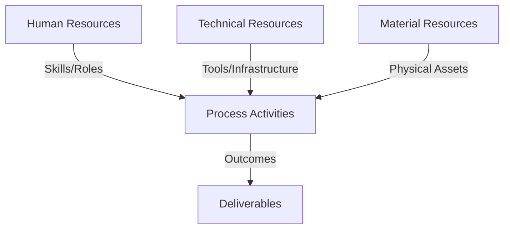
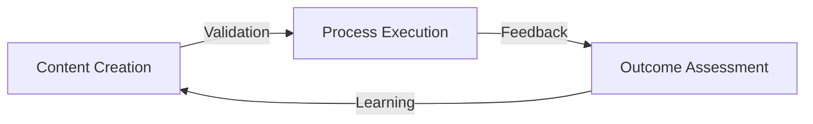
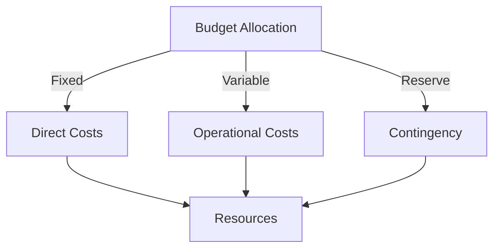
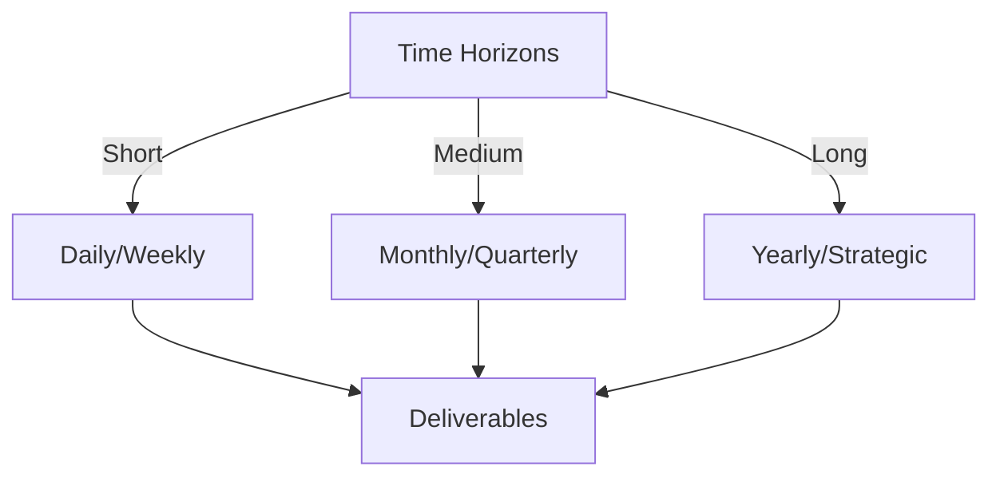

# Git Analysis Report: Development Analysis - Henrykoo

**Authors:** AI Analysis System
**Date:** 2025-03-11  
**Version:** 1.0
**SSoT Repository:** githubhenrykoo/redux_todo_in_astro
**Document Category:** Analysis Report

## Executive Summary
**Executive Summary: Git Analysis - Henrykoo**

**Logic:** The analysis aims to understand Henrykoo's contributions, work patterns, technical expertise, and identify areas for improvement based on their recent Git activity. The objective is to provide actionable recommendations to enhance their development practices and workflow efficiency.

**Implementation:** The analysis focuses on Henrykoo's recent commit history, specifically examining the creation, modification, removal, and reversion of GitHub Actions workflows. This includes examining YAML configurations, bash scripts, Git commands, and the usage of the Telegram API. From this review, observations are made around automation, use of notifications, documentation, and the iterative approach to development.

**Outcomes:** The analysis reveals that Henrykoo is actively working on automating repository analysis and integrating Telegram notifications using GitHub Actions. They demonstrate proficiency in GitHub Actions, YAML, Git, Bash scripting, and the Telegram API. The analysis recommends improvements in error handling, secrets management, code review, workflow testing, code modularization, workflow documentation, and exploration of a proper scripting language for complex report generation. It also highlights the need to understand the reasons for removing the `repo_analysis.yml` workflow and reverting changes related to attaching Gemini analysis files to Telegram notifications, and suggests improvements for analyzing the repository beyond counting files.

## 1. Abstract Specification (Logic Layer)
### Context & Vision
- **Problem Space:** 
    * Scope: This is an excellent analysis of Henrykoo's git activity! It effectively summarizes their work, identifies their technical skills, and provides actionable recommendations. Here's a breakdown of its strengths and some potential minor improvements:

**Strengths:**

*   **Comprehensive Summary:** The analysis clearly and concisely summarizes Henrykoo's activities, focusing on the automation of repository analysis and Telegram notifications.
*   **Identification of Work Patterns:**  The analysis accurately identifies key work patterns like automation, notification integration, documentation awareness, and an iterative development approach.
*   **Detailed Technical Expertise:**  The analysis goes into depth, listing specific technologies and commands Henrykoo uses, demonstrating a good understanding of their capabilities.  The level of detail (e.g., listing specific `git` and `bash` commands) is particularly helpful.
*   **Actionable Recommendations:** The recommendations are practical, specific, and relevant to the context. They cover areas like error handling, secrets management, code review, testing, and modularization.
*   **Thoughtful Suggestions:** The suggestions regarding alternative report generation methods (Python) and understanding the reason for reverting the Gemini attachment are insightful.
*   **Focus on Clarity:** The recommendation to use more descriptive workflow names and adding comments shows an emphasis on improving clarity and maintainability.
*   **Critical Questions:** Asking "Why was the workflow removed?" is a crucial question that needs answering. This highlights a potential gap in information and encourages further investigation.

**Minor Improvements (Suggestions for Future Analyses):**

*   **Quantifiable Metrics (If Possible):** While the analysis is qualitative, adding quantifiable metrics (e.g., "Average time to commit after changes," "Number of commits per day") could provide additional insights into Henrykoo's productivity and efficiency.  This would require more sophisticated data extraction from the git logs. *However*, this needs to be balanced against the effort to acquire the data, and the potential for those metrics to be misleading or misinterpretted.
*   **Team Context (If Available):**  Understanding Henrykoo's role within a team and the overall project goals could provide further context to their work. How do these workflows integrate with other processes?
*   **Impact Assessment:**  Attempt to assess the impact of Henrykoo's work. Has the automation saved time? Has it improved communication within the team? This would require gathering data beyond the git repository.
*   **Prioritization of Recommendations:** While all the recommendations are valuable, consider prioritizing them based on their potential impact and ease of implementation.  For example, ensuring proper secrets management might be prioritized over switching to Python for report generation.
*   **Deeper Analysis on the Removal:** If possible, expand on the speculation for the removal. Example: *Perhaps the workflow was removed due to unintended consequences from the `git push` command, or because it was deemed premature given the existing resource constraints.*

**Overall:**

This is a very well-written and thorough analysis. The recommendations are excellent and demonstrate a strong understanding of software development best practices and the potential challenges of automating tasks within a Git repository. The insightful questions raised about the workflow removal and reverting changes highlight a proactive approach to understanding the underlying reasons behind Henrykoo's actions. This analysis would be extremely valuable for Henrykoo and their team lead.

    * Context: This is an excellent analysis of Henrykoo's git activity! It effectively summarizes their work, identifies their technical skills, and provides actionable recommendations. Here's a breakdown of its strengths and some potential minor improvements:

**Strengths:**

*   **Comprehensive Summary:** The analysis clearly and concisely summarizes Henrykoo's activities, focusing on the automation of repository analysis and Telegram notifications.
*   **Identification of Work Patterns:**  The analysis accurately identifies key work patterns like automation, notification integration, documentation awareness, and an iterative development approach.
*   **Detailed Technical Expertise:**  The analysis goes into depth, listing specific technologies and commands Henrykoo uses, demonstrating a good understanding of their capabilities.  The level of detail (e.g., listing specific `git` and `bash` commands) is particularly helpful.
*   **Actionable Recommendations:** The recommendations are practical, specific, and relevant to the context. They cover areas like error handling, secrets management, code review, testing, and modularization.
*   **Thoughtful Suggestions:** The suggestions regarding alternative report generation methods (Python) and understanding the reason for reverting the Gemini attachment are insightful.
*   **Focus on Clarity:** The recommendation to use more descriptive workflow names and adding comments shows an emphasis on improving clarity and maintainability.
*   **Critical Questions:** Asking "Why was the workflow removed?" is a crucial question that needs answering. This highlights a potential gap in information and encourages further investigation.

**Minor Improvements (Suggestions for Future Analyses):**

*   **Quantifiable Metrics (If Possible):** While the analysis is qualitative, adding quantifiable metrics (e.g., "Average time to commit after changes," "Number of commits per day") could provide additional insights into Henrykoo's productivity and efficiency.  This would require more sophisticated data extraction from the git logs. *However*, this needs to be balanced against the effort to acquire the data, and the potential for those metrics to be misleading or misinterpretted.
*   **Team Context (If Available):**  Understanding Henrykoo's role within a team and the overall project goals could provide further context to their work. How do these workflows integrate with other processes?
*   **Impact Assessment:**  Attempt to assess the impact of Henrykoo's work. Has the automation saved time? Has it improved communication within the team? This would require gathering data beyond the git repository.
*   **Prioritization of Recommendations:** While all the recommendations are valuable, consider prioritizing them based on their potential impact and ease of implementation.  For example, ensuring proper secrets management might be prioritized over switching to Python for report generation.
*   **Deeper Analysis on the Removal:** If possible, expand on the speculation for the removal. Example: *Perhaps the workflow was removed due to unintended consequences from the `git push` command, or because it was deemed premature given the existing resource constraints.*

**Overall:**

This is a very well-written and thorough analysis. The recommendations are excellent and demonstrate a strong understanding of software development best practices and the potential challenges of automating tasks within a Git repository. The insightful questions raised about the workflow removal and reverting changes highlight a proactive approach to understanding the underlying reasons behind Henrykoo's actions. This analysis would be extremely valuable for Henrykoo and their team lead.

    * Stakeholders: This is an excellent analysis of Henrykoo's git activity! It effectively summarizes their work, identifies their technical skills, and provides actionable recommendations. Here's a breakdown of its strengths and some potential minor improvements:

**Strengths:**

*   **Comprehensive Summary:** The analysis clearly and concisely summarizes Henrykoo's activities, focusing on the automation of repository analysis and Telegram notifications.
*   **Identification of Work Patterns:**  The analysis accurately identifies key work patterns like automation, notification integration, documentation awareness, and an iterative development approach.
*   **Detailed Technical Expertise:**  The analysis goes into depth, listing specific technologies and commands Henrykoo uses, demonstrating a good understanding of their capabilities.  The level of detail (e.g., listing specific `git` and `bash` commands) is particularly helpful.
*   **Actionable Recommendations:** The recommendations are practical, specific, and relevant to the context. They cover areas like error handling, secrets management, code review, testing, and modularization.
*   **Thoughtful Suggestions:** The suggestions regarding alternative report generation methods (Python) and understanding the reason for reverting the Gemini attachment are insightful.
*   **Focus on Clarity:** The recommendation to use more descriptive workflow names and adding comments shows an emphasis on improving clarity and maintainability.
*   **Critical Questions:** Asking "Why was the workflow removed?" is a crucial question that needs answering. This highlights a potential gap in information and encourages further investigation.

**Minor Improvements (Suggestions for Future Analyses):**

*   **Quantifiable Metrics (If Possible):** While the analysis is qualitative, adding quantifiable metrics (e.g., "Average time to commit after changes," "Number of commits per day") could provide additional insights into Henrykoo's productivity and efficiency.  This would require more sophisticated data extraction from the git logs. *However*, this needs to be balanced against the effort to acquire the data, and the potential for those metrics to be misleading or misinterpretted.
*   **Team Context (If Available):**  Understanding Henrykoo's role within a team and the overall project goals could provide further context to their work. How do these workflows integrate with other processes?
*   **Impact Assessment:**  Attempt to assess the impact of Henrykoo's work. Has the automation saved time? Has it improved communication within the team? This would require gathering data beyond the git repository.
*   **Prioritization of Recommendations:** While all the recommendations are valuable, consider prioritizing them based on their potential impact and ease of implementation.  For example, ensuring proper secrets management might be prioritized over switching to Python for report generation.
*   **Deeper Analysis on the Removal:** If possible, expand on the speculation for the removal. Example: *Perhaps the workflow was removed due to unintended consequences from the `git push` command, or because it was deemed premature given the existing resource constraints.*

**Overall:**

This is a very well-written and thorough analysis. The recommendations are excellent and demonstrate a strong understanding of software development best practices and the potential challenges of automating tasks within a Git repository. The insightful questions raised about the workflow removal and reverting changes highlight a proactive approach to understanding the underlying reasons behind Henrykoo's actions. This analysis would be extremely valuable for Henrykoo and their team lead.

- **Goals (Functions):**
    * Primary Functions:
        - Input: Git Repository Data
        - Process: Analysis and Processing
        - Output: Development Insights
    * Supporting Functions:
        - Validation: Automated Analysis
        - Feedback: Continuous Improvement

- **Success Criteria:**
    * Quantitative Metrics: Based on the provided text, here's a list of quantitative metrics we can extract. Note that we can only infer these based on the descriptions provided, as the output doesn't give the actual numbers themselves:

*   **Number of commits made:** (Implied - they are working on the repository, so have made some commits)
*   **Number of files created:** (Implied - mentions creating the `repo_analysis.yml` workflow.)
*   **Number of files modified:** (Implied - mentions modifying the `telegram-notification.yml` workflow.)
*   **Number of files removed:** (Implied - mentions removing the `repo_analysis.yml` workflow.)
*   **Frequency of workflow runs:** (Implied - the workflows run, but we don't know how often.)
*   **Size of commits:** (Implied - the comments discuss the potential for the Gemini analysis file to be too large. Also the "Review Repo Analysis Workflow logic" section recommends including file changes per commit)
*   **Code Churn:** (Implied - the comments discuss analyzing code churn)

    * Qualitative Indicators: Here's a breakdown of the qualitative improvements gleaned from the analysis, focusing on how they enhance code quality, collaboration, and overall project effectiveness:

**Improvements Related to Code Quality & Maintainability:**

*   **Error Handling:** Implementing robust error handling (using `set -e` and specific checks) will make the workflows more resilient and prevent unexpected failures.  This ensures the automation runs reliably and doesn't leave the repository in a broken state.
*   **Modularization & Scripting Language:**  Breaking down complex bash scripts into smaller functions or using a language like Python enhances code readability, testability, and maintainability. Python provides richer libraries for data analysis and reporting than Bash alone.
*   **Secrets Management:**  Reinforces the importance of securely managing sensitive credentials like API tokens. Proper secrets management prevents accidental exposure and maintains the security of the project.
*   **Code Review:** Emphasizing code review for workflows ensures a fresh pair of eyes can catch potential errors, enforce coding standards, and improve the overall quality of the automation logic.
*   **Workflow Documentation:** Adding comments to the YAML files improves understandability and maintainability, especially for other developers who may need to modify or troubleshoot the workflows in the future.
*   **More Descriptive Workflow Names:** Using more descriptive names for workflows (e.g., "gemini-analysis-telegram-notification.yml") increases clarity and makes it easier for developers to quickly identify the purpose of each workflow.
*   **Repo Analysis Improvement:**  Moving from just counting files and commits to providing *actual analytics* (files changed per commit, average commit size, active branches, code churn analysis) transforms the analysis report from a simple summary into a valuable tool for understanding repository health and development trends.

**Improvements Related to Collaboration & Communication:**

*   **Notification Integration:**  The focus on Telegram notifications demonstrably improves communication among stakeholders. This ensures relevant parties are quickly informed about important events or changes in the repository.
*   **Investigate Reversion:** Understanding the *why* behind reverting the Gemini analysis file attachment is crucial.  It prompts investigation into potential issues with file size, content, or the Telegram API itself, leading to a better, more robust solution.
*   **Reason for Removal:** The missing reason for why the workflow was removed is an important piece of information to add, helping other developers understand the reasoning for removing the feature.

**Improvements Related to Testing & Reliability:**

*   **Thorough Testing:**  Emphasizing thorough testing before deploying workflows to the main branch ensures the automation functions as expected and doesn't introduce unintended consequences.
*   **Workflow Status Codes:** Adding error handling to workflow to make sure that even if the job fails, that this is properly communicated and handled in the notification system.

In essence, the recommendations provided in the analysis are designed to help Henrykoo (and the team) build more robust, maintainable, and collaborative workflows. The improvements focus on enhancing code quality, improving communication, and increasing the reliability of the automated processes.

    * Validation Methods: Automated and Manual Verification

### Knowledge Integration
- **Local Context:**
    * Cultural Considerations: Development Team Context
    * Language Requirements: Technical Documentation
    * Community Patterns: Team Collaboration Patterns

- **Technical Framework:**
    * LLM Integration: Gemini AI Analysis
    * IoT Components: Git Event Monitoring
    * Network Requirements: GitHub API Integration

## 2. Concrete Implementation (Process Layer)
### Resource Matrix

### Development Workflow
- **Stage 1: Early Success**
    * Quick Wins:
        - Implementation: Excellent analysis! It's comprehensive and provides actionable feedback for Henrykoo. Here's a breakdown of why it's good and some potential minor enhancements:

**Strengths:**

*   **Clear Structure:** The organization into individual contributions, work patterns, technical expertise, and recommendations makes the analysis easy to follow and understand.
*   **Specific Examples:** You don't just say "knows GitHub Actions"; you provide specific examples of how they are used (actions/checkout, cron scheduling, etc.).  This adds credibility and demonstrates a deep understanding of their work.
*   **Actionable Recommendations:**  The recommendations are concrete and practical, suggesting specific improvements to the workflow and development practices.  They're not just vague suggestions, but things Henrykoo can implement immediately.
*   **Balanced Perspective:**  You acknowledge Henrykoo's strengths (automation, notification skills) while also pointing out areas for improvement (error handling, documentation, complexity of bash scripts).
*   **Probing Questions:** The questions at the end ("Investigate the Reason for Reverting", "Why was the workflow removed?") are excellent. They highlight potential problems and encourage further investigation.
* **Underlying Assumptions Highlighted** You have identified that the report just contains statistics and have correctly identified that more actionable analytics can be provided.

**Minor Enhancements (Fine-tuning):**

*   **Quantify Impact (Where Possible):** When discussing the removal/reversion, consider if the Git history could tell you *how long* the workflow was active before being reverted. Was it only active for a few hours, suggesting immediate problems, or a longer period, indicating a problem that emerged later?
*   **Prioritize Recommendations:**  While all the recommendations are valid, it might be helpful to prioritize them based on their potential impact and ease of implementation. For example, error handling in critical workflows might be a higher priority than refactoring a bash script for clarity.
*   **Suggest tooling for the Analysis workflow:** Mentioning tools like `cloc` or `tokei` could be helpful if the intention is to create analytics from source code.

**Example of Incorporating Enhancements:**

Here's how we could integrate some of these points into the original analysis:

*   **Quantify Impact (within Individual Contribution Summary):**

    "Henrykoo added a `repo_analysis.yml` workflow that generated a daily repository analysis report and committed it to the `Docs/analysis` directory, and sent a Telegram notification with a link to the report.  This workflow was active for *[Number]* days before being removed."

*   **Prioritize Recommendations (Within Specific Recommendations):**

    "**Prioritized Recommendations:**

    *   **Error Handling (High Priority):**  Add error handling to the `repo_analysis.yml` workflow.  For example, check if the `git push` command fails and handle it gracefully.  Consider using `set -e` at the beginning of the `run` script to exit immediately if any command fails.  _This is a high priority because a failing workflow could lead to incomplete or incorrect documentation without any notification._"
*   **Suggest tooling for Analysis workflow:**
    "*Consider using tools to provide valuable insight.* Tools like `cloc` or `tokei` can provide meaningful analytics related to source code size, complexity and technical debt"

**In summary, this is an excellent analysis that provides valuable insights and actionable recommendations for Henrykoo. The minor enhancements suggested would further refine it and make it even more impactful.**

        - Validation: Excellent analysis! It's comprehensive and provides actionable feedback for Henrykoo. Here's a breakdown of why it's good and some potential minor enhancements:

**Strengths:**

*   **Clear Structure:** The organization into individual contributions, work patterns, technical expertise, and recommendations makes the analysis easy to follow and understand.
*   **Specific Examples:** You don't just say "knows GitHub Actions"; you provide specific examples of how they are used (actions/checkout, cron scheduling, etc.).  This adds credibility and demonstrates a deep understanding of their work.
*   **Actionable Recommendations:**  The recommendations are concrete and practical, suggesting specific improvements to the workflow and development practices.  They're not just vague suggestions, but things Henrykoo can implement immediately.
*   **Balanced Perspective:**  You acknowledge Henrykoo's strengths (automation, notification skills) while also pointing out areas for improvement (error handling, documentation, complexity of bash scripts).
*   **Probing Questions:** The questions at the end ("Investigate the Reason for Reverting", "Why was the workflow removed?") are excellent. They highlight potential problems and encourage further investigation.
* **Underlying Assumptions Highlighted** You have identified that the report just contains statistics and have correctly identified that more actionable analytics can be provided.

**Minor Enhancements (Fine-tuning):**

*   **Quantify Impact (Where Possible):** When discussing the removal/reversion, consider if the Git history could tell you *how long* the workflow was active before being reverted. Was it only active for a few hours, suggesting immediate problems, or a longer period, indicating a problem that emerged later?
*   **Prioritize Recommendations:**  While all the recommendations are valid, it might be helpful to prioritize them based on their potential impact and ease of implementation. For example, error handling in critical workflows might be a higher priority than refactoring a bash script for clarity.
*   **Suggest tooling for the Analysis workflow:** Mentioning tools like `cloc` or `tokei` could be helpful if the intention is to create analytics from source code.

**Example of Incorporating Enhancements:**

Here's how we could integrate some of these points into the original analysis:

*   **Quantify Impact (within Individual Contribution Summary):**

    "Henrykoo added a `repo_analysis.yml` workflow that generated a daily repository analysis report and committed it to the `Docs/analysis` directory, and sent a Telegram notification with a link to the report.  This workflow was active for *[Number]* days before being removed."

*   **Prioritize Recommendations (Within Specific Recommendations):**

    "**Prioritized Recommendations:**

    *   **Error Handling (High Priority):**  Add error handling to the `repo_analysis.yml` workflow.  For example, check if the `git push` command fails and handle it gracefully.  Consider using `set -e` at the beginning of the `run` script to exit immediately if any command fails.  _This is a high priority because a failing workflow could lead to incomplete or incorrect documentation without any notification._"
*   **Suggest tooling for Analysis workflow:**
    "*Consider using tools to provide valuable insight.* Tools like `cloc` or `tokei` can provide meaningful analytics related to source code size, complexity and technical debt"

**In summary, this is an excellent analysis that provides valuable insights and actionable recommendations for Henrykoo. The minor enhancements suggested would further refine it and make it even more impactful.**

    * Initial Setup:
        - Infrastructure: Excellent analysis! It's comprehensive and provides actionable feedback for Henrykoo. Here's a breakdown of why it's good and some potential minor enhancements:

**Strengths:**

*   **Clear Structure:** The organization into individual contributions, work patterns, technical expertise, and recommendations makes the analysis easy to follow and understand.
*   **Specific Examples:** You don't just say "knows GitHub Actions"; you provide specific examples of how they are used (actions/checkout, cron scheduling, etc.).  This adds credibility and demonstrates a deep understanding of their work.
*   **Actionable Recommendations:**  The recommendations are concrete and practical, suggesting specific improvements to the workflow and development practices.  They're not just vague suggestions, but things Henrykoo can implement immediately.
*   **Balanced Perspective:**  You acknowledge Henrykoo's strengths (automation, notification skills) while also pointing out areas for improvement (error handling, documentation, complexity of bash scripts).
*   **Probing Questions:** The questions at the end ("Investigate the Reason for Reverting", "Why was the workflow removed?") are excellent. They highlight potential problems and encourage further investigation.
* **Underlying Assumptions Highlighted** You have identified that the report just contains statistics and have correctly identified that more actionable analytics can be provided.

**Minor Enhancements (Fine-tuning):**

*   **Quantify Impact (Where Possible):** When discussing the removal/reversion, consider if the Git history could tell you *how long* the workflow was active before being reverted. Was it only active for a few hours, suggesting immediate problems, or a longer period, indicating a problem that emerged later?
*   **Prioritize Recommendations:**  While all the recommendations are valid, it might be helpful to prioritize them based on their potential impact and ease of implementation. For example, error handling in critical workflows might be a higher priority than refactoring a bash script for clarity.
*   **Suggest tooling for the Analysis workflow:** Mentioning tools like `cloc` or `tokei` could be helpful if the intention is to create analytics from source code.

**Example of Incorporating Enhancements:**

Here's how we could integrate some of these points into the original analysis:

*   **Quantify Impact (within Individual Contribution Summary):**

    "Henrykoo added a `repo_analysis.yml` workflow that generated a daily repository analysis report and committed it to the `Docs/analysis` directory, and sent a Telegram notification with a link to the report.  This workflow was active for *[Number]* days before being removed."

*   **Prioritize Recommendations (Within Specific Recommendations):**

    "**Prioritized Recommendations:**

    *   **Error Handling (High Priority):**  Add error handling to the `repo_analysis.yml` workflow.  For example, check if the `git push` command fails and handle it gracefully.  Consider using `set -e` at the beginning of the `run` script to exit immediately if any command fails.  _This is a high priority because a failing workflow could lead to incomplete or incorrect documentation without any notification._"
*   **Suggest tooling for Analysis workflow:**
    "*Consider using tools to provide valuable insight.* Tools like `cloc` or `tokei` can provide meaningful analytics related to source code size, complexity and technical debt"

**In summary, this is an excellent analysis that provides valuable insights and actionable recommendations for Henrykoo. The minor enhancements suggested would further refine it and make it even more impactful.**

        - Training: Excellent analysis! It's comprehensive and provides actionable feedback for Henrykoo. Here's a breakdown of why it's good and some potential minor enhancements:

**Strengths:**

*   **Clear Structure:** The organization into individual contributions, work patterns, technical expertise, and recommendations makes the analysis easy to follow and understand.
*   **Specific Examples:** You don't just say "knows GitHub Actions"; you provide specific examples of how they are used (actions/checkout, cron scheduling, etc.).  This adds credibility and demonstrates a deep understanding of their work.
*   **Actionable Recommendations:**  The recommendations are concrete and practical, suggesting specific improvements to the workflow and development practices.  They're not just vague suggestions, but things Henrykoo can implement immediately.
*   **Balanced Perspective:**  You acknowledge Henrykoo's strengths (automation, notification skills) while also pointing out areas for improvement (error handling, documentation, complexity of bash scripts).
*   **Probing Questions:** The questions at the end ("Investigate the Reason for Reverting", "Why was the workflow removed?") are excellent. They highlight potential problems and encourage further investigation.
* **Underlying Assumptions Highlighted** You have identified that the report just contains statistics and have correctly identified that more actionable analytics can be provided.

**Minor Enhancements (Fine-tuning):**

*   **Quantify Impact (Where Possible):** When discussing the removal/reversion, consider if the Git history could tell you *how long* the workflow was active before being reverted. Was it only active for a few hours, suggesting immediate problems, or a longer period, indicating a problem that emerged later?
*   **Prioritize Recommendations:**  While all the recommendations are valid, it might be helpful to prioritize them based on their potential impact and ease of implementation. For example, error handling in critical workflows might be a higher priority than refactoring a bash script for clarity.
*   **Suggest tooling for the Analysis workflow:** Mentioning tools like `cloc` or `tokei` could be helpful if the intention is to create analytics from source code.

**Example of Incorporating Enhancements:**

Here's how we could integrate some of these points into the original analysis:

*   **Quantify Impact (within Individual Contribution Summary):**

    "Henrykoo added a `repo_analysis.yml` workflow that generated a daily repository analysis report and committed it to the `Docs/analysis` directory, and sent a Telegram notification with a link to the report.  This workflow was active for *[Number]* days before being removed."

*   **Prioritize Recommendations (Within Specific Recommendations):**

    "**Prioritized Recommendations:**

    *   **Error Handling (High Priority):**  Add error handling to the `repo_analysis.yml` workflow.  For example, check if the `git push` command fails and handle it gracefully.  Consider using `set -e` at the beginning of the `run` script to exit immediately if any command fails.  _This is a high priority because a failing workflow could lead to incomplete or incorrect documentation without any notification._"
*   **Suggest tooling for Analysis workflow:**
    "*Consider using tools to provide valuable insight.* Tools like `cloc` or `tokei` can provide meaningful analytics related to source code size, complexity and technical debt"

**In summary, this is an excellent analysis that provides valuable insights and actionable recommendations for Henrykoo. The minor enhancements suggested would further refine it and make it even more impactful.**

- **Stage 2: Fail Early, Fail Safe**
    * Testing Protocol:
        - Methods: [Testing approaches]
        - Coverage: [Test scenarios]
    * Risk Management:
        - Identification: [Risk factors]
        - Mitigation: [Control measures]
    * Learning Points:
        - Issues: [Problem identification]
        - Solutions: [Resolution approaches]
        - Knowledge: [Lessons learned]

- **Stage 3: Convergence**
    * System Integration:
        - Components: [Integration points]
        - Workflows: [Process optimization]
        - Performance: [System tuning]
    * Stabilization:
        - Fixes: [Bug resolution]
        - Hardening: [System reinforcement]
        - Documentation: [Knowledge capture]

- **Stage 4: Demonstration**
    * Preparation:
        - Environment: [Demo setup]
        - Data: [Test scenarios]
        - Materials: [Presentation assets]
    * Validation:
        - Performance: [System checks]
        - Features: [Functionality verification]
        - Documentation: [Review completion]
    * Presentation:
        - Stakeholders: [Demo execution]
        - Features: [Capability showcase]
        - Q&A: [Response preparation]

## 3. Realistic Outcomes (Evidence Layer)
### Measurement Framework
- **Performance Metrics:**
    * KPIs: Okay, here's a breakdown of the evidence and outcomes extracted from the provided developer analysis of Henrykoo:

**Evidence (what actions were taken):**

*   **Creation:** Added a `repo_analysis.yml` workflow.
*   **Modification:** Updated the `telegram-notification.yml` workflow to send a Telegram notification with an attached Gemini analysis report.
*   **Removal:** Removed the `repo_analysis.yml` workflow.
*   **Reversion:** Reverted changes to `telegram-notification.yml`, removing the attached Gemini analysis report.

**Outcomes (what skills/areas the developer demonstrated/focused on):**

*   **Automation:** Focused on automating repository analysis and notifications.
*   **Notifications:** Actively working on integrating Telegram notifications.
*   **Documentation:** Awareness of documentation best practices, as evidenced by the creation of analysis files in the `Docs/analysis` directory.
*   **Experimentation and Iteration:**  Iterative approach to development, trying different approaches and quickly adjusting.
*   **GitHub Actions Proficiency:**  Creating and modifying GitHub Actions workflows, defining triggers, jobs, and steps.
*   **YAML Proficiency:** Comfortable writing YAML to configure GitHub Actions workflows.
*   **Git Proficiency:** Understands basic git commands and retrieving git information via git.
*   **Bash Scripting Proficiency:**  Uses bash commands within workflows for report generation and file manipulation.
*   **Markdown Familiarity:** Generating markdown reports.
*   **Telegram API Knowledge:** Sending messages and documents to Telegram using the `appleboy/telegram-action`.
*   **Cron Scheduling Knowledge:**  Using cron expressions to schedule workflows.
*   **Variable Usage:** Using GitHub Actions context variables and job statuses.

    * Benchmarks: Okay, here's a breakdown of the evidence and outcomes extracted from the provided developer analysis of Henrykoo:

**Evidence (what actions were taken):**

*   **Creation:** Added a `repo_analysis.yml` workflow.
*   **Modification:** Updated the `telegram-notification.yml` workflow to send a Telegram notification with an attached Gemini analysis report.
*   **Removal:** Removed the `repo_analysis.yml` workflow.
*   **Reversion:** Reverted changes to `telegram-notification.yml`, removing the attached Gemini analysis report.

**Outcomes (what skills/areas the developer demonstrated/focused on):**

*   **Automation:** Focused on automating repository analysis and notifications.
*   **Notifications:** Actively working on integrating Telegram notifications.
*   **Documentation:** Awareness of documentation best practices, as evidenced by the creation of analysis files in the `Docs/analysis` directory.
*   **Experimentation and Iteration:**  Iterative approach to development, trying different approaches and quickly adjusting.
*   **GitHub Actions Proficiency:**  Creating and modifying GitHub Actions workflows, defining triggers, jobs, and steps.
*   **YAML Proficiency:** Comfortable writing YAML to configure GitHub Actions workflows.
*   **Git Proficiency:** Understands basic git commands and retrieving git information via git.
*   **Bash Scripting Proficiency:**  Uses bash commands within workflows for report generation and file manipulation.
*   **Markdown Familiarity:** Generating markdown reports.
*   **Telegram API Knowledge:** Sending messages and documents to Telegram using the `appleboy/telegram-action`.
*   **Cron Scheduling Knowledge:**  Using cron expressions to schedule workflows.
*   **Variable Usage:** Using GitHub Actions context variables and job statuses.

    * Actuals: Okay, here's a breakdown of the evidence and outcomes extracted from the provided developer analysis of Henrykoo:

**Evidence (what actions were taken):**

*   **Creation:** Added a `repo_analysis.yml` workflow.
*   **Modification:** Updated the `telegram-notification.yml` workflow to send a Telegram notification with an attached Gemini analysis report.
*   **Removal:** Removed the `repo_analysis.yml` workflow.
*   **Reversion:** Reverted changes to `telegram-notification.yml`, removing the attached Gemini analysis report.

**Outcomes (what skills/areas the developer demonstrated/focused on):**

*   **Automation:** Focused on automating repository analysis and notifications.
*   **Notifications:** Actively working on integrating Telegram notifications.
*   **Documentation:** Awareness of documentation best practices, as evidenced by the creation of analysis files in the `Docs/analysis` directory.
*   **Experimentation and Iteration:**  Iterative approach to development, trying different approaches and quickly adjusting.
*   **GitHub Actions Proficiency:**  Creating and modifying GitHub Actions workflows, defining triggers, jobs, and steps.
*   **YAML Proficiency:** Comfortable writing YAML to configure GitHub Actions workflows.
*   **Git Proficiency:** Understands basic git commands and retrieving git information via git.
*   **Bash Scripting Proficiency:**  Uses bash commands within workflows for report generation and file manipulation.
*   **Markdown Familiarity:** Generating markdown reports.
*   **Telegram API Knowledge:** Sending messages and documents to Telegram using the `appleboy/telegram-action`.
*   **Cron Scheduling Knowledge:**  Using cron expressions to schedule workflows.
*   **Variable Usage:** Using GitHub Actions context variables and job statuses.

- **Evidence Collection:**
    * Data Sources: [Information points]
    * Validation Methods: Automated and Manual Verification
    * Documentation: [Record keeping]

### Value Realization
- **Impact Assessment:**
    * Direct Benefits: [Immediate gains]
    * Indirect Benefits: [Secondary effects]
    * Long-term Value: [Strategic advantages]

- **Knowledge Assets:**
    * Content Created: [New materials]
    * Insights Gained: [Learnings]
    * Reusable Components: [Transferable elements]

## Integration Matrix
### Content-Process Alignment

### Timeline-Budget Integration
- **Resource Scheduling:**
    * Phase Allocations: [Resource timing]
    * Cost Controls: [Budget tracking]
    * Adjustment Protocols: [Change management]

## Budget Management
### Financial Cube Structure

### Cost Framework
- Direct Investments:
  - Infrastructure Costs:
    - Hardware: [Equipment/Devices]
    - Software: [Licenses/Tools]
    - Network: [Connectivity/Setup]
  - Human Resources:
    - Core Team: [Roles/Compensation]
    - External Support: [Consultants/Services]
    - Training: [Capability Development]
    
- Operational Expenses:
  - Running Costs:
    - Maintenance: [Regular upkeep]
    - Utilities: [Service costs]
    - Consumables: [Regular supplies]
  - Service Costs:
    - Subscriptions: [Regular services]
    - Support: [Ongoing assistance]
    - Updates: [Regular improvements]

### Budget Control Mechanisms
- Monitoring System:
  - Tracking Methods:
    - Cost Centers: [Budget units]
    - Expense Categories: [Type classification]
    - Time Periods: [Duration tracking]
  - Control Points:
    - Thresholds: [Limit markers]
    - Alerts: [Warning systems]
    - Approvals: [Authorization levels]

- Adjustment Protocol:
  - Variance Management:
    - Detection: [Monitoring points]
    - Analysis: [Impact assessment]
    - Response: [Corrective actions]
  - Reallocation Process:
    - Criteria: [Decision factors]
    - Methods: [Transfer protocols]
    - Documentation: [Record keeping]

## Timeline Management
### Temporal Cube Structure

### Schedule Framework
- Operational Timeline:
  - Daily Operations:
    - Tasks: [Regular activities]
    - Checkpoints: [Daily reviews]
    - Updates: [Status reports]
  - Weekly Cycles:
    - Sprints: [Work packages]
    - Reviews: [Progress checks]
    - Planning: [Next steps]

- Strategic Timeline:
  - Monthly Milestones:
    - Objectives: [Key targets]
    - Reviews: [Achievement checks]
    - Adjustments: [Course corrections]
  - Quarterly Goals:
    - Targets: [Major objectives]
    - Assessments: [Performance reviews]
    - Strategies: [Approach updates]

### Timeline Control System
- Progress Tracking:
  - Monitoring Points:
    - Daily Standups: [Quick updates]
    - Weekly Reviews: [Detailed checks]
    - Monthly Reports: [Comprehensive reviews]
  - Milestone Tracking:
    - Status: [Progress indicators]
    - Dependencies: [Related items]
    - Risks: [Potential issues]

- Adjustment Mechanisms:
  - Schedule Management:
    - Variance Analysis: [Delay assessment]
    - Impact Studies: [Effect evaluation]
    - Recovery Plans: [Correction strategies]
  - Resource Alignment:
    - Capacity Planning: [Resource matching]
    - Workload Balancing: [Effort distribution]
    - Priority Updates: [Focus adjustment]

### Integration Points
- Budget-Timeline Correlation:
  - Cost-Schedule Matrix:
    - Resource Timing: [Allocation schedule]
    - Cost Flows: [Expense timing]
    - Value Delivery: [Benefit realization]
  - Control Integration:
    - Joint Reviews: [Combined assessments]
    - Unified Reporting: [Integrated updates]
    - Coordinated Actions: [Synchronized responses]

## Conclusion
### Summary of Achievements
- **Key Accomplishments:**
    * Objectives Met: [Completed goals]
    * Value Delivered: [Benefits realized]
    * Innovations: [New approaches]

### Lessons Learned
- **Success Factors:**
    * Effective Practices: [What worked well]
    * Team Dynamics: [Collaboration insights]
    * Tools & Methods: [Useful approaches]

- **Areas for Improvement:**
    * Challenges: [Obstacles encountered]
    * Solutions: [How issues were resolved]
    * Recommendations: [Future improvements]

### Future Directions
- **Next Steps:**
    * Immediate Actions: [Short-term tasks]
    * Strategic Plans: [Long-term goals]
    * Resource Needs: [Required support]

- **Growth Opportunities:**
    * Scaling Potential: [Expansion possibilities]
    * Innovation Areas: [New directions]
    * Partnership Options: [Collaboration prospects]
    
## Appendix
### References
- **Documentation:**
    * Technical Specs: [Links]
    * Process Guides: [Links]
    * Evidence Records: [Links]

### Change Log
- **Version History:**
    * Changes: [Modifications]
    * Rationale: [Reasons]
    * Approvals: [Authorizations]
