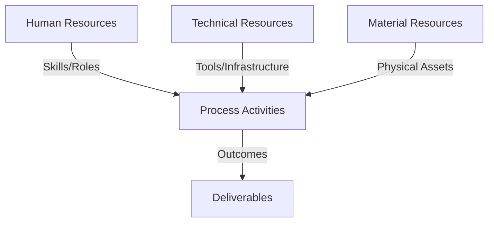
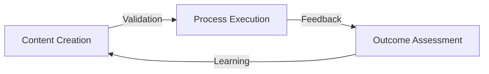
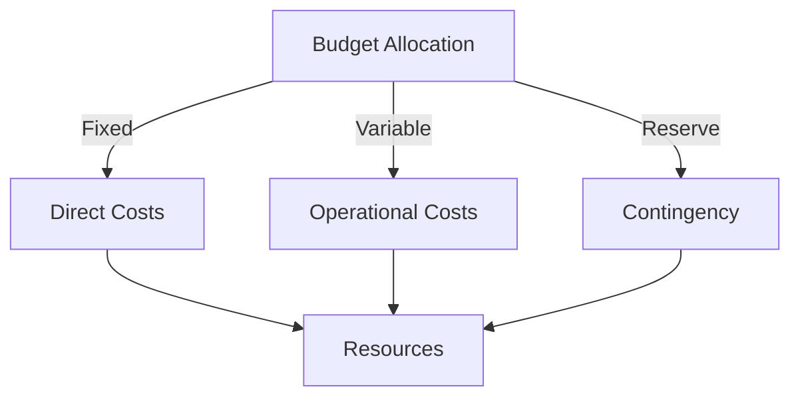
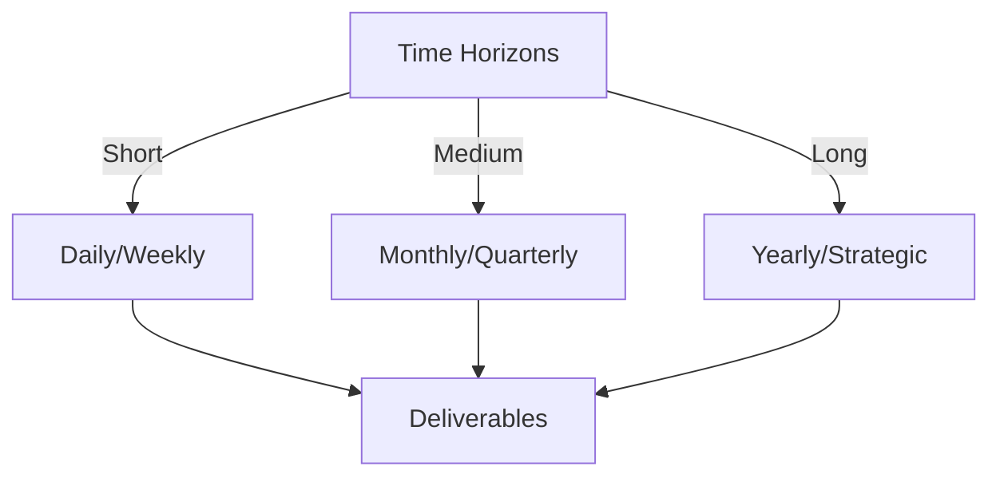

# Git Analysis Report: Development Analysis - Henrykoo

**Authors:** AI Analysis System
**Date:** 2025-03-12  
**Version:** 1.0
**SSoT Repository:** githubhenrykoo/redux_todo_in_astro
**Document Category:** Analysis Report

## Executive Summary
**Executive Summary: Git Analysis of Henrykoo**

**Logic:** The core purpose of this analysis is to assess Henrykoo's contributions and technical skills based on their Git activity within a specific GitHub repository, focusing on automation workflows and Telegram integration. The objectives are to identify areas of expertise, patterns of work, and offer recommendations for improvement.

**Implementation:** The analysis was conducted by examining Henrykoo's commit history, specifically focusing on modifications to YAML configuration files for GitHub Actions workflows (repo_analysis.yml, telegram-notification.yml). The commit messages, file additions, deletions, and modifications were reviewed to understand the implemented features, integration approaches, and any subsequent reversions or removals.

**Outcomes:** The analysis reveals that Henrykoo is actively developing automated repository analysis and Telegram notification features using GitHub Actions. They demonstrate proficiency in GitHub Actions configuration, bash scripting, and Git. The rapid iterations suggest an experimental approach. However, improvements can be made regarding error handling, documentation of design choices, modularizing analysis scripts, and pinning dependency versions. The recommendations provided are intended to increase the robustness, maintainability, and understandability of their contributions.

## 1. Abstract Specification (Logic Layer)
### Context & Vision
- **Problem Space:** 
    * Scope: This is a very comprehensive and insightful analysis of Henrykoo's Git activity.  It effectively captures the essence of their contributions, skills, and potential areas for improvement. Here's a breakdown of why it's good and a few minor suggestions for even better analysis:

**Strengths:**

*   **Clear and Concise Summary:** The "Individual Contribution Summary" provides a clear and easy-to-understand overview of Henrykoo's work.
*   **Identifies Work Patterns and Focus Areas:**  The analysis goes beyond just listing commits and delves into the patterns and motivations behind the work.  The recognition of "Experimentation & Iteration" is particularly insightful.
*   **Detailed Technical Expertise Assessment:** The analysis accurately identifies the technical skills demonstrated by Henrykoo, especially in GitHub Actions, Bash scripting, and Git.  It correctly highlights the different aspects of GitHub Actions usage.
*   **Actionable Recommendations:** The recommendations are specific, practical, and well-justified. They focus on improving the quality, maintainability, and robustness of Henrykoo's work.
*   **Well-Organized:** The use of numbered sections and bullet points makes the analysis easy to read and digest.
*   **Balanced Perspective:** The analysis highlights both Henrykoo's strengths and areas for improvement, providing a balanced and constructive evaluation.

**Minor Suggestions for Improvement:**

*   **Quantify Impact (If Possible):**  While difficult without further context, if there's a way to quantify the impact of Henrykoo's work (e.g., reduced manual effort, improved notification speed), that could be added to the analysis. For example, "The automation of repository analysis is estimated to save X hours per week of manual effort."
*   **Consider Security Implications:** While not explicitly mentioned, if the `repo_analysis.yml` workflow involved running arbitrary code on the repository, there might be security considerations to address.  If that was the case, even a brief mention of best practices for securing GitHub Actions workflows (e.g., avoiding running untrusted code, using permissions wisely) could be beneficial.  This is context-dependent.
*   **Tailor Recommendations to Team/Project Context:**  If there's a specific team or project context (e.g., team coding standards, project architecture), the recommendations could be tailored to align with those.  For example, "Consider aligning the commit message style with the team's existing convention of using Conventional Commits."
*   **More Specificity on Telegram Notification Improvements:** Expand on *why* sending the Gemini report as a Telegram document might be undesirable. This could include:
    *   Size limitations on Telegram message/document sizes.
    *   Impact on the user experience (e.g., users needing to download a large file to view the analysis).
    *   Alternative approaches such as using a link to a hosted report are often more user-friendly.

**Overall:**

This is an excellent analysis that provides valuable insights into Henrykoo's Git activity and potential areas for growth.  The recommendations are practical and should help improve the quality and maintainability of their contributions. It demonstrates a good understanding of software development principles and best practices.

    * Context: This is a very comprehensive and insightful analysis of Henrykoo's Git activity.  It effectively captures the essence of their contributions, skills, and potential areas for improvement. Here's a breakdown of why it's good and a few minor suggestions for even better analysis:

**Strengths:**

*   **Clear and Concise Summary:** The "Individual Contribution Summary" provides a clear and easy-to-understand overview of Henrykoo's work.
*   **Identifies Work Patterns and Focus Areas:**  The analysis goes beyond just listing commits and delves into the patterns and motivations behind the work.  The recognition of "Experimentation & Iteration" is particularly insightful.
*   **Detailed Technical Expertise Assessment:** The analysis accurately identifies the technical skills demonstrated by Henrykoo, especially in GitHub Actions, Bash scripting, and Git.  It correctly highlights the different aspects of GitHub Actions usage.
*   **Actionable Recommendations:** The recommendations are specific, practical, and well-justified. They focus on improving the quality, maintainability, and robustness of Henrykoo's work.
*   **Well-Organized:** The use of numbered sections and bullet points makes the analysis easy to read and digest.
*   **Balanced Perspective:** The analysis highlights both Henrykoo's strengths and areas for improvement, providing a balanced and constructive evaluation.

**Minor Suggestions for Improvement:**

*   **Quantify Impact (If Possible):**  While difficult without further context, if there's a way to quantify the impact of Henrykoo's work (e.g., reduced manual effort, improved notification speed), that could be added to the analysis. For example, "The automation of repository analysis is estimated to save X hours per week of manual effort."
*   **Consider Security Implications:** While not explicitly mentioned, if the `repo_analysis.yml` workflow involved running arbitrary code on the repository, there might be security considerations to address.  If that was the case, even a brief mention of best practices for securing GitHub Actions workflows (e.g., avoiding running untrusted code, using permissions wisely) could be beneficial.  This is context-dependent.
*   **Tailor Recommendations to Team/Project Context:**  If there's a specific team or project context (e.g., team coding standards, project architecture), the recommendations could be tailored to align with those.  For example, "Consider aligning the commit message style with the team's existing convention of using Conventional Commits."
*   **More Specificity on Telegram Notification Improvements:** Expand on *why* sending the Gemini report as a Telegram document might be undesirable. This could include:
    *   Size limitations on Telegram message/document sizes.
    *   Impact on the user experience (e.g., users needing to download a large file to view the analysis).
    *   Alternative approaches such as using a link to a hosted report are often more user-friendly.

**Overall:**

This is an excellent analysis that provides valuable insights into Henrykoo's Git activity and potential areas for growth.  The recommendations are practical and should help improve the quality and maintainability of their contributions. It demonstrates a good understanding of software development principles and best practices.

    * Stakeholders: This is a very comprehensive and insightful analysis of Henrykoo's Git activity.  It effectively captures the essence of their contributions, skills, and potential areas for improvement. Here's a breakdown of why it's good and a few minor suggestions for even better analysis:

**Strengths:**

*   **Clear and Concise Summary:** The "Individual Contribution Summary" provides a clear and easy-to-understand overview of Henrykoo's work.
*   **Identifies Work Patterns and Focus Areas:**  The analysis goes beyond just listing commits and delves into the patterns and motivations behind the work.  The recognition of "Experimentation & Iteration" is particularly insightful.
*   **Detailed Technical Expertise Assessment:** The analysis accurately identifies the technical skills demonstrated by Henrykoo, especially in GitHub Actions, Bash scripting, and Git.  It correctly highlights the different aspects of GitHub Actions usage.
*   **Actionable Recommendations:** The recommendations are specific, practical, and well-justified. They focus on improving the quality, maintainability, and robustness of Henrykoo's work.
*   **Well-Organized:** The use of numbered sections and bullet points makes the analysis easy to read and digest.
*   **Balanced Perspective:** The analysis highlights both Henrykoo's strengths and areas for improvement, providing a balanced and constructive evaluation.

**Minor Suggestions for Improvement:**

*   **Quantify Impact (If Possible):**  While difficult without further context, if there's a way to quantify the impact of Henrykoo's work (e.g., reduced manual effort, improved notification speed), that could be added to the analysis. For example, "The automation of repository analysis is estimated to save X hours per week of manual effort."
*   **Consider Security Implications:** While not explicitly mentioned, if the `repo_analysis.yml` workflow involved running arbitrary code on the repository, there might be security considerations to address.  If that was the case, even a brief mention of best practices for securing GitHub Actions workflows (e.g., avoiding running untrusted code, using permissions wisely) could be beneficial.  This is context-dependent.
*   **Tailor Recommendations to Team/Project Context:**  If there's a specific team or project context (e.g., team coding standards, project architecture), the recommendations could be tailored to align with those.  For example, "Consider aligning the commit message style with the team's existing convention of using Conventional Commits."
*   **More Specificity on Telegram Notification Improvements:** Expand on *why* sending the Gemini report as a Telegram document might be undesirable. This could include:
    *   Size limitations on Telegram message/document sizes.
    *   Impact on the user experience (e.g., users needing to download a large file to view the analysis).
    *   Alternative approaches such as using a link to a hosted report are often more user-friendly.

**Overall:**

This is an excellent analysis that provides valuable insights into Henrykoo's Git activity and potential areas for growth.  The recommendations are practical and should help improve the quality and maintainability of their contributions. It demonstrates a good understanding of software development principles and best practices.

- **Goals (Functions):**
    * Primary Functions:
        - Input: Git Repository Data
        - Process: Analysis and Processing
        - Output: Development Insights
    * Supporting Functions:
        - Validation: Automated Analysis
        - Feedback: Continuous Improvement

- **Success Criteria:**
    * Quantitative Metrics: Here's a list of the quantitative metrics that can be derived from the provided developer analysis:

*   **Number of workflows added:** 1 (`repo_analysis.yml`)
*   **Number of workflows modified:** 1 (`telegram-notification.yml`)
*   **Number of workflows removed:** 1 (`repo_analysis.yml`)
*   **Number of commits involving file creation:** At least 1 (for the initial `repo_analysis.yml`)
*   **Number of commits involving file deletion:** At least 1 (for removing `repo_analysis.yml`)
*   **Frequency of commits:** (Implied to be relatively rapid due to the iterative nature and adding/removing/reverting features).  *Needs more data on the exact commit times to be specific.*
*   **Number of GitHub Actions used:** At least 2 (`actions/checkout@v4`, `appleboy/telegram-action@master`)
*   **Number of secrets used:** At least 2 (`TELEGRAM_CHAT_ID`, `TELEGRAM_BOT_TOKEN`)
*   **Number of different Git commands used:**  At least 7 (`git rev-list`, `git branch`, `git log`, `git ls-files`, `git shortlog`, `git add`, `git commit`, and `git push`)

    * Qualitative Indicators: Here's a breakdown of the qualitative improvements identified in the developer analysis, focusing on what makes them "qualitative":

**Qualitative Improvements (Focusing on Soft Skills & Project Health):**

*   **Improved Communication & Documentation:**
    *   **"Clarify the Rationale for Reversions/Removals: ...Adding commit messages explaining these decisions would improve the project's maintainability and understanding."**
        *   **Qualitative Aspect:** This goes beyond just functional code. It addresses the need for *shared understanding* and *knowledge transfer* within a team. Good commit messages act as documentation and help others understand the *why* behind changes, not just the *what*. This directly impacts maintainability and collaboration.
    *   **"Standardize Commit Messages: Encouraging a consistent commit message style...can improve the clarity and organization of the commit history."**
        *   **Qualitative Aspect:** This isn't about making the code work better. It's about improving *communication and organization*. Standardized commit messages make the history easier to search, understand, and use for generating release notes. This improves team efficiency and project clarity.

*   **Enhanced Project Maintainability & Robustness:**
    *   **"Modularize the Analysis Script: In `repo_analysis.yml`, the shell script generating the analysis could be extracted into a separate script file. This would improve readability and maintainability."**
        *   **Qualitative Aspect:**  While functional, a large script embedded in a YAML file is hard to read and debug.  Modularizing improves *code organization, readability, and testability*. This makes the code easier to maintain and less prone to errors in the future.
    *   **"Improve Error Handling: Add error handling to the bash scripts within the workflows.  For example, check the exit codes of commands and take appropriate actions if they fail."**
        *   **Qualitative Aspect:**  Without error handling, a workflow can fail silently or produce incorrect results. This improvement addresses *code robustness and reliability*.  It ensures the workflow behaves predictably, even in unexpected situations, improving the *user experience* of the workflow.
    *   **"Consider Logging and Monitoring: ... implement logging and monitoring to track their execution, identify errors, and measure their effectiveness."**
        *   **Qualitative Aspect:** This is about *proactive problem detection and understanding system behavior*. Logging allows for debugging and auditing. Monitoring allows for identifying bottlenecks and assessing workflow effectiveness, improving overall system health.
    *   **"Investigate alternative methods for delivering large analysis reports...It may be preferable to store it in an artifact and provide a link."**
        *   **Qualitative Aspect:** This isn't about making *more* analysis available, it's about making it available in a way that *minimizes disruption* to the Telegram notification itself and makes for a *better user experience*. This is about usability and the effect it has on the recipients of the notification.
    *   **"Version Pinning: Using fixed versions of actions is better than using `@master` or `@v4`....This will prevent unexpected breaking changes in the long term."**
        *   **Qualitative Aspect:** It improves the *stability and predictability* of the build process. By explicitly versioning dependencies, the project becomes less susceptible to unexpected breakage due to changes in external libraries or tools. This increases *confidence* in the build process.

*   **Improved Workflow & Risk Mitigation:**
    *   **"Consider a Staging Environment: When making significant changes to workflows, consider using a staging environment to test the changes before deploying them to the main branch. This can help prevent unexpected issues in production."**
        *   **Qualitative Aspect:** This reduces the *risk of introducing bugs or breaking changes* to the production environment. It's about adopting a more *cautious and controlled development process*.  This increases the team's confidence in deployments and reduces the need for emergency fixes.

In summary, the qualitative improvements focus on aspects like:

*   **Communication & Collaboration:**  Making the project easier for others to understand and contribute to.
*   **Reliability & Robustness:**  Ensuring the code works predictably and handles errors gracefully.
*   **Maintainability:**  Making the code easier to modify and extend in the future.
*   **Risk Mitigation:**  Reducing the chance of introducing bugs or breaking changes.
*   **User Experience:** Reducing the impact of a large report on the notification itself.

These improvements, while not directly related to adding new features, are crucial for the long-term success and health of the project. They represent a shift towards a more mature and professional software development approach.

    * Validation Methods: Automated and Manual Verification

### Knowledge Integration
- **Local Context:**
    * Cultural Considerations: Development Team Context
    * Language Requirements: Technical Documentation
    * Community Patterns: Team Collaboration Patterns

- **Technical Framework:**
    * LLM Integration: Gemini AI Analysis
    * IoT Components: Git Event Monitoring
    * Network Requirements: GitHub API Integration

## 2. Concrete Implementation (Process Layer)
### Resource Matrix

### Development Workflow
- **Stage 1: Early Success**
    * Quick Wins:
        - Implementation: This is a very thorough and well-structured analysis of Henrykoo's development workflow. Here's a breakdown of what makes it good and a few potential enhancements:

**Strengths:**

*   **Comprehensive Summary:** The "Individual Contribution Summary" effectively captures the core activities undertaken by Henrykoo.
*   **Pattern Identification:** The "Work Patterns and Focus Areas" section goes beyond just listing commits and starts to identify higher-level themes and approaches.
*   **Technical Skill Assessment:** The "Technical Expertise Demonstrated" is excellent. It doesn't just list technologies but demonstrates *how* Henrykoo is using them. This is much more valuable.  The detail on GitHub Actions, including specific aspects of workflow configuration and usage, is particularly strong.
*   **Actionable Recommendations:** The "Specific Recommendations" section provides concrete, practical suggestions for improvement.  They are well-justified and directly relate to the observed work patterns.
*   **Clear and Concise Language:** The analysis is written in clear, easy-to-understand language, avoiding jargon where possible.
*   **Positive and Constructive Tone:**  The analysis is generally positive, highlighting strengths while also pointing out areas for improvement in a constructive manner.

**Potential Enhancements (Small):**

*   **Prioritization of Recommendations:**  While all the recommendations are good, consider prioritizing them based on impact.  For example, addressing the rationale for reversions (via commit messages) and error handling might be considered higher priority than standardizing commit messages.  You could categorize recommendations by importance (e.g., "High," "Medium," "Low") or explicitly state which ones would have the biggest immediate impact.
*   **Cost Considerations (Implicit in Reversions?):**  While not explicitly stated, the reversion of Gemini analysis attachment might be influenced by cost implications.  Running larger analyses and attaching them to Telegram messages could increase costs (computation, storage, bandwidth). If there is a way to infer or inquire about potential cost considerations, the analysis would be even richer.
*   **Consider Security Aspects:**
    *   **Secret Management:** Mention that Henrykoo is correctly using GitHub Secrets, this is a good thing to emphasize for security conscious development.
    *   **Code Scanning:** Although not directly related to this git activity, you could suggest enabling GitHub Code Scanning to automatically identify potential security vulnerabilities in the repository.
*   **Add context to the Gemini integration:** Was Gemini a custom action that was created, or an API interaction? Providing context on the technology that was being integrated might help to provide a more clear understanding.
*   **Elaborate on the iterative approach** Suggest that Henrykoo create issues to track the experimentation process or use a feature branch to isolate changes. This may improve project management.

**Overall:**

This is an excellent analysis. It goes beyond a simple listing of commits and provides valuable insights into Henrykoo's work style, skills, and areas for improvement. The recommendations are practical and actionable, making this a useful piece of feedback for the developer.  The suggestions for enhancement are minor and are just aimed at making a very good analysis even better.

        - Validation: This is a very thorough and well-structured analysis of Henrykoo's development workflow. Here's a breakdown of what makes it good and a few potential enhancements:

**Strengths:**

*   **Comprehensive Summary:** The "Individual Contribution Summary" effectively captures the core activities undertaken by Henrykoo.
*   **Pattern Identification:** The "Work Patterns and Focus Areas" section goes beyond just listing commits and starts to identify higher-level themes and approaches.
*   **Technical Skill Assessment:** The "Technical Expertise Demonstrated" is excellent. It doesn't just list technologies but demonstrates *how* Henrykoo is using them. This is much more valuable.  The detail on GitHub Actions, including specific aspects of workflow configuration and usage, is particularly strong.
*   **Actionable Recommendations:** The "Specific Recommendations" section provides concrete, practical suggestions for improvement.  They are well-justified and directly relate to the observed work patterns.
*   **Clear and Concise Language:** The analysis is written in clear, easy-to-understand language, avoiding jargon where possible.
*   **Positive and Constructive Tone:**  The analysis is generally positive, highlighting strengths while also pointing out areas for improvement in a constructive manner.

**Potential Enhancements (Small):**

*   **Prioritization of Recommendations:**  While all the recommendations are good, consider prioritizing them based on impact.  For example, addressing the rationale for reversions (via commit messages) and error handling might be considered higher priority than standardizing commit messages.  You could categorize recommendations by importance (e.g., "High," "Medium," "Low") or explicitly state which ones would have the biggest immediate impact.
*   **Cost Considerations (Implicit in Reversions?):**  While not explicitly stated, the reversion of Gemini analysis attachment might be influenced by cost implications.  Running larger analyses and attaching them to Telegram messages could increase costs (computation, storage, bandwidth). If there is a way to infer or inquire about potential cost considerations, the analysis would be even richer.
*   **Consider Security Aspects:**
    *   **Secret Management:** Mention that Henrykoo is correctly using GitHub Secrets, this is a good thing to emphasize for security conscious development.
    *   **Code Scanning:** Although not directly related to this git activity, you could suggest enabling GitHub Code Scanning to automatically identify potential security vulnerabilities in the repository.
*   **Add context to the Gemini integration:** Was Gemini a custom action that was created, or an API interaction? Providing context on the technology that was being integrated might help to provide a more clear understanding.
*   **Elaborate on the iterative approach** Suggest that Henrykoo create issues to track the experimentation process or use a feature branch to isolate changes. This may improve project management.

**Overall:**

This is an excellent analysis. It goes beyond a simple listing of commits and provides valuable insights into Henrykoo's work style, skills, and areas for improvement. The recommendations are practical and actionable, making this a useful piece of feedback for the developer.  The suggestions for enhancement are minor and are just aimed at making a very good analysis even better.

    * Initial Setup:
        - Infrastructure: This is a very thorough and well-structured analysis of Henrykoo's development workflow. Here's a breakdown of what makes it good and a few potential enhancements:

**Strengths:**

*   **Comprehensive Summary:** The "Individual Contribution Summary" effectively captures the core activities undertaken by Henrykoo.
*   **Pattern Identification:** The "Work Patterns and Focus Areas" section goes beyond just listing commits and starts to identify higher-level themes and approaches.
*   **Technical Skill Assessment:** The "Technical Expertise Demonstrated" is excellent. It doesn't just list technologies but demonstrates *how* Henrykoo is using them. This is much more valuable.  The detail on GitHub Actions, including specific aspects of workflow configuration and usage, is particularly strong.
*   **Actionable Recommendations:** The "Specific Recommendations" section provides concrete, practical suggestions for improvement.  They are well-justified and directly relate to the observed work patterns.
*   **Clear and Concise Language:** The analysis is written in clear, easy-to-understand language, avoiding jargon where possible.
*   **Positive and Constructive Tone:**  The analysis is generally positive, highlighting strengths while also pointing out areas for improvement in a constructive manner.

**Potential Enhancements (Small):**

*   **Prioritization of Recommendations:**  While all the recommendations are good, consider prioritizing them based on impact.  For example, addressing the rationale for reversions (via commit messages) and error handling might be considered higher priority than standardizing commit messages.  You could categorize recommendations by importance (e.g., "High," "Medium," "Low") or explicitly state which ones would have the biggest immediate impact.
*   **Cost Considerations (Implicit in Reversions?):**  While not explicitly stated, the reversion of Gemini analysis attachment might be influenced by cost implications.  Running larger analyses and attaching them to Telegram messages could increase costs (computation, storage, bandwidth). If there is a way to infer or inquire about potential cost considerations, the analysis would be even richer.
*   **Consider Security Aspects:**
    *   **Secret Management:** Mention that Henrykoo is correctly using GitHub Secrets, this is a good thing to emphasize for security conscious development.
    *   **Code Scanning:** Although not directly related to this git activity, you could suggest enabling GitHub Code Scanning to automatically identify potential security vulnerabilities in the repository.
*   **Add context to the Gemini integration:** Was Gemini a custom action that was created, or an API interaction? Providing context on the technology that was being integrated might help to provide a more clear understanding.
*   **Elaborate on the iterative approach** Suggest that Henrykoo create issues to track the experimentation process or use a feature branch to isolate changes. This may improve project management.

**Overall:**

This is an excellent analysis. It goes beyond a simple listing of commits and provides valuable insights into Henrykoo's work style, skills, and areas for improvement. The recommendations are practical and actionable, making this a useful piece of feedback for the developer.  The suggestions for enhancement are minor and are just aimed at making a very good analysis even better.

        - Training: This is a very thorough and well-structured analysis of Henrykoo's development workflow. Here's a breakdown of what makes it good and a few potential enhancements:

**Strengths:**

*   **Comprehensive Summary:** The "Individual Contribution Summary" effectively captures the core activities undertaken by Henrykoo.
*   **Pattern Identification:** The "Work Patterns and Focus Areas" section goes beyond just listing commits and starts to identify higher-level themes and approaches.
*   **Technical Skill Assessment:** The "Technical Expertise Demonstrated" is excellent. It doesn't just list technologies but demonstrates *how* Henrykoo is using them. This is much more valuable.  The detail on GitHub Actions, including specific aspects of workflow configuration and usage, is particularly strong.
*   **Actionable Recommendations:** The "Specific Recommendations" section provides concrete, practical suggestions for improvement.  They are well-justified and directly relate to the observed work patterns.
*   **Clear and Concise Language:** The analysis is written in clear, easy-to-understand language, avoiding jargon where possible.
*   **Positive and Constructive Tone:**  The analysis is generally positive, highlighting strengths while also pointing out areas for improvement in a constructive manner.

**Potential Enhancements (Small):**

*   **Prioritization of Recommendations:**  While all the recommendations are good, consider prioritizing them based on impact.  For example, addressing the rationale for reversions (via commit messages) and error handling might be considered higher priority than standardizing commit messages.  You could categorize recommendations by importance (e.g., "High," "Medium," "Low") or explicitly state which ones would have the biggest immediate impact.
*   **Cost Considerations (Implicit in Reversions?):**  While not explicitly stated, the reversion of Gemini analysis attachment might be influenced by cost implications.  Running larger analyses and attaching them to Telegram messages could increase costs (computation, storage, bandwidth). If there is a way to infer or inquire about potential cost considerations, the analysis would be even richer.
*   **Consider Security Aspects:**
    *   **Secret Management:** Mention that Henrykoo is correctly using GitHub Secrets, this is a good thing to emphasize for security conscious development.
    *   **Code Scanning:** Although not directly related to this git activity, you could suggest enabling GitHub Code Scanning to automatically identify potential security vulnerabilities in the repository.
*   **Add context to the Gemini integration:** Was Gemini a custom action that was created, or an API interaction? Providing context on the technology that was being integrated might help to provide a more clear understanding.
*   **Elaborate on the iterative approach** Suggest that Henrykoo create issues to track the experimentation process or use a feature branch to isolate changes. This may improve project management.

**Overall:**

This is an excellent analysis. It goes beyond a simple listing of commits and provides valuable insights into Henrykoo's work style, skills, and areas for improvement. The recommendations are practical and actionable, making this a useful piece of feedback for the developer.  The suggestions for enhancement are minor and are just aimed at making a very good analysis even better.

- **Stage 2: Fail Early, Fail Safe**
    * Testing Protocol:
        - Methods: [Testing approaches]
        - Coverage: [Test scenarios]
    * Risk Management:
        - Identification: [Risk factors]
        - Mitigation: [Control measures]
    * Learning Points:
        - Issues: [Problem identification]
        - Solutions: [Resolution approaches]
        - Knowledge: [Lessons learned]

- **Stage 3: Convergence**
    * System Integration:
        - Components: [Integration points]
        - Workflows: [Process optimization]
        - Performance: [System tuning]
    * Stabilization:
        - Fixes: [Bug resolution]
        - Hardening: [System reinforcement]
        - Documentation: [Knowledge capture]

- **Stage 4: Demonstration**
    * Preparation:
        - Environment: [Demo setup]
        - Data: [Test scenarios]
        - Materials: [Presentation assets]
    * Validation:
        - Performance: [System checks]
        - Features: [Functionality verification]
        - Documentation: [Review completion]
    * Presentation:
        - Stakeholders: [Demo execution]
        - Features: [Capability showcase]
        - Q&A: [Response preparation]

## 3. Realistic Outcomes (Evidence Layer)
### Measurement Framework
- **Performance Metrics:**
    * KPIs: Okay, here's a breakdown of the evidence and outcomes from the provided Git history analysis:

**Evidence (based on Git activity):**

*   **Workflow Creation & Modification:**
    *   Creation of `repo_analysis.yml`:  Initial implementation of a repository analysis workflow triggered daily or manually. It included commit statistics, file statistics, recent activity, and top contributors. The workflow committed the report and sent a Telegram notification.
    *   Modification of `telegram-notification.yml`: Integrated Gemini Analysis report as an attachment to Telegram messages.
    *   Removal of `repo_analysis.yml`: Deletion of the repository analysis workflow file.
    *   Reversion of `telegram-notification.yml`:  Reverted to the previous version, removing the Gemini Analysis report attachment from the Telegram notification.
*   **Specific Technologies Used (demonstrated in workflows):**
    *   GitHub Actions: Use of various actions, triggers, jobs, steps, context variables, and secrets.
    *   Bash Scripting: Generating repository analysis reports.
    *   Git: Using basic Git commands.
    *   Markdown: Using for report formatting.
    *   YAML: Creating YAML config files.

**Outcomes and Observations (based on the evidence):**

*   **Focus on Automation & Integration:**  Henrykoo is working to automate repository analysis and integrate Telegram notifications with GitHub Actions.
*   **Iterative Development:**  The frequent creation, modification, and removal of features (workflows, attachments) indicate an iterative development approach, likely involving experimentation and testing.
*   **Skillset:** Demonstrates proficiency in GitHub Actions, Bash scripting, Git, Markdown, and YAML.
*   **Possible Issues:** The removal of the `repo_analysis.yml` workflow and the reversion of the Telegram notification attachment suggest potential issues with the initial implementations.
*   **Areas for Improvement:**  The report suggests improvements in error handling, maintainability, documentation, and logging.

**Implicit Outcomes:**

*   **Learning and Development:** The experimentation and iteration suggest a continuous learning process.
*   **Contribution to Project Goals:**  The aim is to improve project monitoring and communication.

In summary, the Git history reveals an active developer who is focused on automation and integration. The rapid changes suggest a willingness to experiment, but also highlight the need for better documentation, error handling, and a more systematic approach to workflow development.

    * Benchmarks: Okay, here's a breakdown of the evidence and outcomes from the provided Git history analysis:

**Evidence (based on Git activity):**

*   **Workflow Creation & Modification:**
    *   Creation of `repo_analysis.yml`:  Initial implementation of a repository analysis workflow triggered daily or manually. It included commit statistics, file statistics, recent activity, and top contributors. The workflow committed the report and sent a Telegram notification.
    *   Modification of `telegram-notification.yml`: Integrated Gemini Analysis report as an attachment to Telegram messages.
    *   Removal of `repo_analysis.yml`: Deletion of the repository analysis workflow file.
    *   Reversion of `telegram-notification.yml`:  Reverted to the previous version, removing the Gemini Analysis report attachment from the Telegram notification.
*   **Specific Technologies Used (demonstrated in workflows):**
    *   GitHub Actions: Use of various actions, triggers, jobs, steps, context variables, and secrets.
    *   Bash Scripting: Generating repository analysis reports.
    *   Git: Using basic Git commands.
    *   Markdown: Using for report formatting.
    *   YAML: Creating YAML config files.

**Outcomes and Observations (based on the evidence):**

*   **Focus on Automation & Integration:**  Henrykoo is working to automate repository analysis and integrate Telegram notifications with GitHub Actions.
*   **Iterative Development:**  The frequent creation, modification, and removal of features (workflows, attachments) indicate an iterative development approach, likely involving experimentation and testing.
*   **Skillset:** Demonstrates proficiency in GitHub Actions, Bash scripting, Git, Markdown, and YAML.
*   **Possible Issues:** The removal of the `repo_analysis.yml` workflow and the reversion of the Telegram notification attachment suggest potential issues with the initial implementations.
*   **Areas for Improvement:**  The report suggests improvements in error handling, maintainability, documentation, and logging.

**Implicit Outcomes:**

*   **Learning and Development:** The experimentation and iteration suggest a continuous learning process.
*   **Contribution to Project Goals:**  The aim is to improve project monitoring and communication.

In summary, the Git history reveals an active developer who is focused on automation and integration. The rapid changes suggest a willingness to experiment, but also highlight the need for better documentation, error handling, and a more systematic approach to workflow development.

    * Actuals: Okay, here's a breakdown of the evidence and outcomes from the provided Git history analysis:

**Evidence (based on Git activity):**

*   **Workflow Creation & Modification:**
    *   Creation of `repo_analysis.yml`:  Initial implementation of a repository analysis workflow triggered daily or manually. It included commit statistics, file statistics, recent activity, and top contributors. The workflow committed the report and sent a Telegram notification.
    *   Modification of `telegram-notification.yml`: Integrated Gemini Analysis report as an attachment to Telegram messages.
    *   Removal of `repo_analysis.yml`: Deletion of the repository analysis workflow file.
    *   Reversion of `telegram-notification.yml`:  Reverted to the previous version, removing the Gemini Analysis report attachment from the Telegram notification.
*   **Specific Technologies Used (demonstrated in workflows):**
    *   GitHub Actions: Use of various actions, triggers, jobs, steps, context variables, and secrets.
    *   Bash Scripting: Generating repository analysis reports.
    *   Git: Using basic Git commands.
    *   Markdown: Using for report formatting.
    *   YAML: Creating YAML config files.

**Outcomes and Observations (based on the evidence):**

*   **Focus on Automation & Integration:**  Henrykoo is working to automate repository analysis and integrate Telegram notifications with GitHub Actions.
*   **Iterative Development:**  The frequent creation, modification, and removal of features (workflows, attachments) indicate an iterative development approach, likely involving experimentation and testing.
*   **Skillset:** Demonstrates proficiency in GitHub Actions, Bash scripting, Git, Markdown, and YAML.
*   **Possible Issues:** The removal of the `repo_analysis.yml` workflow and the reversion of the Telegram notification attachment suggest potential issues with the initial implementations.
*   **Areas for Improvement:**  The report suggests improvements in error handling, maintainability, documentation, and logging.

**Implicit Outcomes:**

*   **Learning and Development:** The experimentation and iteration suggest a continuous learning process.
*   **Contribution to Project Goals:**  The aim is to improve project monitoring and communication.

In summary, the Git history reveals an active developer who is focused on automation and integration. The rapid changes suggest a willingness to experiment, but also highlight the need for better documentation, error handling, and a more systematic approach to workflow development.

- **Evidence Collection:**
    * Data Sources: [Information points]
    * Validation Methods: Automated and Manual Verification
    * Documentation: [Record keeping]

### Value Realization
- **Impact Assessment:**
    * Direct Benefits: [Immediate gains]
    * Indirect Benefits: [Secondary effects]
    * Long-term Value: [Strategic advantages]

- **Knowledge Assets:**
    * Content Created: [New materials]
    * Insights Gained: [Learnings]
    * Reusable Components: [Transferable elements]

## Integration Matrix
### Content-Process Alignment

### Timeline-Budget Integration
- **Resource Scheduling:**
    * Phase Allocations: [Resource timing]
    * Cost Controls: [Budget tracking]
    * Adjustment Protocols: [Change management]

## Budget Management
### Financial Cube Structure

### Cost Framework
- Direct Investments:
  - Infrastructure Costs:
    - Hardware: [Equipment/Devices]
    - Software: [Licenses/Tools]
    - Network: [Connectivity/Setup]
  - Human Resources:
    - Core Team: [Roles/Compensation]
    - External Support: [Consultants/Services]
    - Training: [Capability Development]
    
- Operational Expenses:
  - Running Costs:
    - Maintenance: [Regular upkeep]
    - Utilities: [Service costs]
    - Consumables: [Regular supplies]
  - Service Costs:
    - Subscriptions: [Regular services]
    - Support: [Ongoing assistance]
    - Updates: [Regular improvements]

### Budget Control Mechanisms
- Monitoring System:
  - Tracking Methods:
    - Cost Centers: [Budget units]
    - Expense Categories: [Type classification]
    - Time Periods: [Duration tracking]
  - Control Points:
    - Thresholds: [Limit markers]
    - Alerts: [Warning systems]
    - Approvals: [Authorization levels]

- Adjustment Protocol:
  - Variance Management:
    - Detection: [Monitoring points]
    - Analysis: [Impact assessment]
    - Response: [Corrective actions]
  - Reallocation Process:
    - Criteria: [Decision factors]
    - Methods: [Transfer protocols]
    - Documentation: [Record keeping]

## Timeline Management
### Temporal Cube Structure

### Schedule Framework
- Operational Timeline:
  - Daily Operations:
    - Tasks: [Regular activities]
    - Checkpoints: [Daily reviews]
    - Updates: [Status reports]
  - Weekly Cycles:
    - Sprints: [Work packages]
    - Reviews: [Progress checks]
    - Planning: [Next steps]

- Strategic Timeline:
  - Monthly Milestones:
    - Objectives: [Key targets]
    - Reviews: [Achievement checks]
    - Adjustments: [Course corrections]
  - Quarterly Goals:
    - Targets: [Major objectives]
    - Assessments: [Performance reviews]
    - Strategies: [Approach updates]

### Timeline Control System
- Progress Tracking:
  - Monitoring Points:
    - Daily Standups: [Quick updates]
    - Weekly Reviews: [Detailed checks]
    - Monthly Reports: [Comprehensive reviews]
  - Milestone Tracking:
    - Status: [Progress indicators]
    - Dependencies: [Related items]
    - Risks: [Potential issues]

- Adjustment Mechanisms:
  - Schedule Management:
    - Variance Analysis: [Delay assessment]
    - Impact Studies: [Effect evaluation]
    - Recovery Plans: [Correction strategies]
  - Resource Alignment:
    - Capacity Planning: [Resource matching]
    - Workload Balancing: [Effort distribution]
    - Priority Updates: [Focus adjustment]

### Integration Points
- Budget-Timeline Correlation:
  - Cost-Schedule Matrix:
    - Resource Timing: [Allocation schedule]
    - Cost Flows: [Expense timing]
    - Value Delivery: [Benefit realization]
  - Control Integration:
    - Joint Reviews: [Combined assessments]
    - Unified Reporting: [Integrated updates]
    - Coordinated Actions: [Synchronized responses]

## Conclusion
### Summary of Achievements
- **Key Accomplishments:**
    * Objectives Met: [Completed goals]
    * Value Delivered: [Benefits realized]
    * Innovations: [New approaches]

### Lessons Learned
- **Success Factors:**
    * Effective Practices: [What worked well]
    * Team Dynamics: [Collaboration insights]
    * Tools & Methods: [Useful approaches]

- **Areas for Improvement:**
    * Challenges: [Obstacles encountered]
    * Solutions: [How issues were resolved]
    * Recommendations: [Future improvements]

### Future Directions
- **Next Steps:**
    * Immediate Actions: [Short-term tasks]
    * Strategic Plans: [Long-term goals]
    * Resource Needs: [Required support]

- **Growth Opportunities:**
    * Scaling Potential: [Expansion possibilities]
    * Innovation Areas: [New directions]
    * Partnership Options: [Collaboration prospects]
    
## Appendix
### References
- **Documentation:**
    * Technical Specs: [Links]
    * Process Guides: [Links]
    * Evidence Records: [Links]

### Change Log
- **Version History:**
    * Changes: [Modifications]
    * Rationale: [Reasons]
    * Approvals: [Authorizations]
