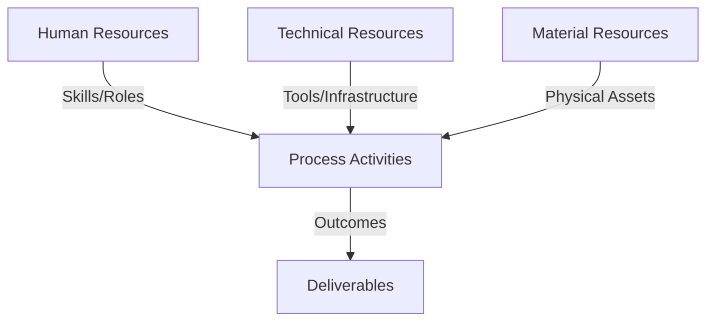
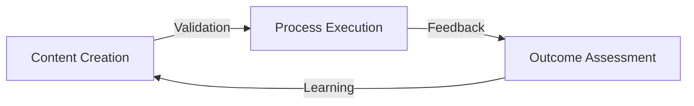
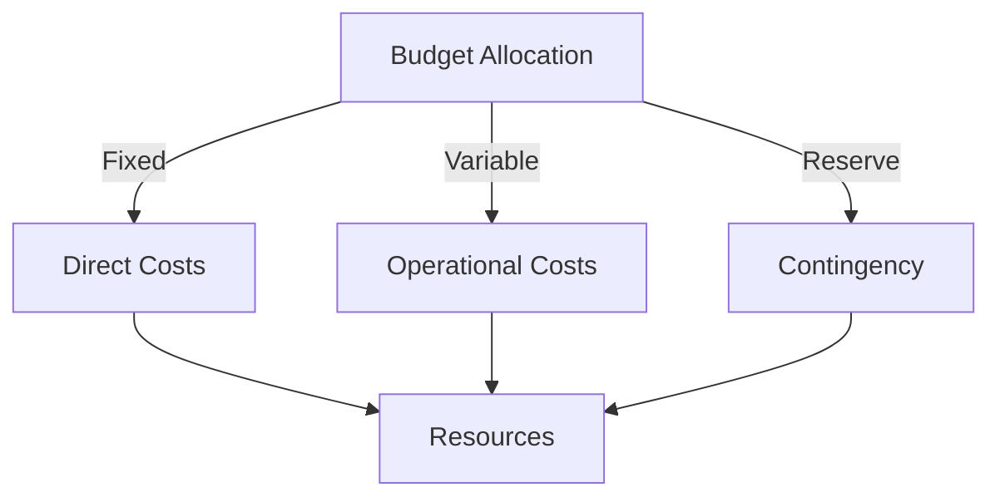
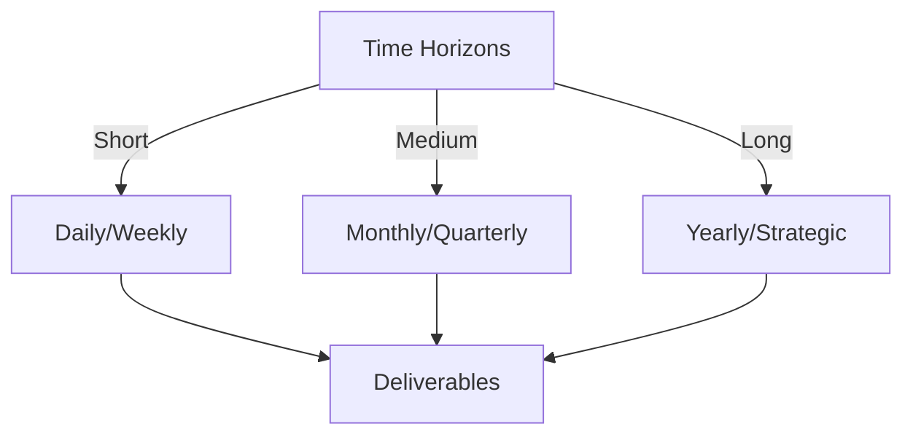

# Git Analysis Report: Development Analysis - Henrykoo

**Authors:** AI Analysis System
**Date:** 2025-03-13  
**Version:** 1.0
**SSoT Repository:** githubhenrykoo/redux_todo_in_astro
**Document Category:** Analysis Report

## Executive Summary
**Executive Summary of Henrykoo's Git Activity Analysis**

**Logic:** The core purpose of this analysis is to evaluate Henrykoo's git activity, understand their contributions, identify work patterns, and assess their technical expertise. The objectives are to provide insights into their development workflow and offer recommendations for improvement.

**Implementation:** This analysis was conducted by examining Henrykoo's commit history within a specific repository. The analysis focused on identifying the changes introduced by each commit, grouping related commits, identifying work patterns, assessing demonstrated technical skills, and formulating recommendations. Key commits related to repository analysis automation and Telegram notifications were scrutinized.

**Outcomes:** Henrykoo demonstrated proficiency in GitHub Actions, shell scripting, Git, and (indirectly) the Telegram API. They actively experimented with automating repository analysis and enhancing Telegram notifications. The analysis revealed a pattern of iterative development, including rapid additions, modifications, and removals of features, suggesting a willingness to experiment and refine. The primary recommendation is to investigate the rationale behind the removal/reversion of certain features to avoid future repetition and to refine existing workflows with incremental changes and thorough testing.

## 1. Abstract Specification (Logic Layer)
### Context & Vision
- **Problem Space:** 
    * Scope: This is an excellent analysis of Henrykoo's git activity. It's thorough, insightful, and provides actionable recommendations. Here's a breakdown of its strengths and a few minor suggestions:

**Strengths:**

*   **Comprehensive Coverage:** The analysis covers various aspects, including individual contributions, work patterns, technical expertise, and specific recommendations.
*   **Contextual Understanding:** The analysis demonstrates a good understanding of the context behind the commits. It recognizes the experimentation and refinement cycle.
*   **Actionable Recommendations:** The recommendations are specific and practical, guiding Henrykoo towards improvements.
*   **Balanced Tone:** The analysis maintains a neutral and constructive tone, focusing on improvement rather than criticism.
*   **Clear and Concise Language:** The writing is easy to understand and avoids jargon.
*   **Well-Organized Structure:** The use of headings and bullet points makes the analysis easy to read and digest.
*   **Recognition of Positive Traits:** Highlights Henrykoo's capabilities of revising implementation quickly.

**Minor Suggestions:**

*   **Potential Root Cause Speculation (with caveats):** While the analysis appropriately suggests investigating the rationale for reverting, it could briefly speculate on potential reasons *without* presenting them as facts. For example: "It's possible the `repo_analysis.yml` workflow was removed due to performance concerns (e.g., excessive build times) or because the generated reports were not providing useful information."  Adding these speculations, qualified as such, can help kickstart the investigation.
*   **Security Considerations (if applicable):** Depending on the specifics of the `repo_analysis.yml` workflow, consider adding a brief mention of security considerations, especially if the workflow interacts with sensitive data or credentials. Remind the developer to follow security best practices in their workflow (avoiding storing secrets in the YAML file directly, using least privilege access).
*   **Consider CI feedback:** A CI (continuous integration) can give much better information and feedback to the code implemented by the developer. Maybe this should be integrated in the workflow.

**Why this analysis is effective:**

*   **It's not just a list of commits:** It interprets the commits as actions within a broader workflow and tries to understand the developer's intent.
*   **It focuses on learning and improvement:**  The analysis is designed to help Henrykoo learn from their experiences and improve their future development practices.
*   **It bridges the gap between code and understanding:** It translates technical actions (commits) into meaningful insights about the developer's skills, interests, and areas for growth.

**In conclusion, this is a very strong and valuable analysis of Henrykoo's git activity. The suggestions are relatively minor and depend on the specific details of the project. This type of analysis can be extremely helpful for code reviews, performance evaluations, and identifying areas for training and development.**

    * Context: This is an excellent analysis of Henrykoo's git activity. It's thorough, insightful, and provides actionable recommendations. Here's a breakdown of its strengths and a few minor suggestions:

**Strengths:**

*   **Comprehensive Coverage:** The analysis covers various aspects, including individual contributions, work patterns, technical expertise, and specific recommendations.
*   **Contextual Understanding:** The analysis demonstrates a good understanding of the context behind the commits. It recognizes the experimentation and refinement cycle.
*   **Actionable Recommendations:** The recommendations are specific and practical, guiding Henrykoo towards improvements.
*   **Balanced Tone:** The analysis maintains a neutral and constructive tone, focusing on improvement rather than criticism.
*   **Clear and Concise Language:** The writing is easy to understand and avoids jargon.
*   **Well-Organized Structure:** The use of headings and bullet points makes the analysis easy to read and digest.
*   **Recognition of Positive Traits:** Highlights Henrykoo's capabilities of revising implementation quickly.

**Minor Suggestions:**

*   **Potential Root Cause Speculation (with caveats):** While the analysis appropriately suggests investigating the rationale for reverting, it could briefly speculate on potential reasons *without* presenting them as facts. For example: "It's possible the `repo_analysis.yml` workflow was removed due to performance concerns (e.g., excessive build times) or because the generated reports were not providing useful information."  Adding these speculations, qualified as such, can help kickstart the investigation.
*   **Security Considerations (if applicable):** Depending on the specifics of the `repo_analysis.yml` workflow, consider adding a brief mention of security considerations, especially if the workflow interacts with sensitive data or credentials. Remind the developer to follow security best practices in their workflow (avoiding storing secrets in the YAML file directly, using least privilege access).
*   **Consider CI feedback:** A CI (continuous integration) can give much better information and feedback to the code implemented by the developer. Maybe this should be integrated in the workflow.

**Why this analysis is effective:**

*   **It's not just a list of commits:** It interprets the commits as actions within a broader workflow and tries to understand the developer's intent.
*   **It focuses on learning and improvement:**  The analysis is designed to help Henrykoo learn from their experiences and improve their future development practices.
*   **It bridges the gap between code and understanding:** It translates technical actions (commits) into meaningful insights about the developer's skills, interests, and areas for growth.

**In conclusion, this is a very strong and valuable analysis of Henrykoo's git activity. The suggestions are relatively minor and depend on the specific details of the project. This type of analysis can be extremely helpful for code reviews, performance evaluations, and identifying areas for training and development.**

    * Stakeholders: This is an excellent analysis of Henrykoo's git activity. It's thorough, insightful, and provides actionable recommendations. Here's a breakdown of its strengths and a few minor suggestions:

**Strengths:**

*   **Comprehensive Coverage:** The analysis covers various aspects, including individual contributions, work patterns, technical expertise, and specific recommendations.
*   **Contextual Understanding:** The analysis demonstrates a good understanding of the context behind the commits. It recognizes the experimentation and refinement cycle.
*   **Actionable Recommendations:** The recommendations are specific and practical, guiding Henrykoo towards improvements.
*   **Balanced Tone:** The analysis maintains a neutral and constructive tone, focusing on improvement rather than criticism.
*   **Clear and Concise Language:** The writing is easy to understand and avoids jargon.
*   **Well-Organized Structure:** The use of headings and bullet points makes the analysis easy to read and digest.
*   **Recognition of Positive Traits:** Highlights Henrykoo's capabilities of revising implementation quickly.

**Minor Suggestions:**

*   **Potential Root Cause Speculation (with caveats):** While the analysis appropriately suggests investigating the rationale for reverting, it could briefly speculate on potential reasons *without* presenting them as facts. For example: "It's possible the `repo_analysis.yml` workflow was removed due to performance concerns (e.g., excessive build times) or because the generated reports were not providing useful information."  Adding these speculations, qualified as such, can help kickstart the investigation.
*   **Security Considerations (if applicable):** Depending on the specifics of the `repo_analysis.yml` workflow, consider adding a brief mention of security considerations, especially if the workflow interacts with sensitive data or credentials. Remind the developer to follow security best practices in their workflow (avoiding storing secrets in the YAML file directly, using least privilege access).
*   **Consider CI feedback:** A CI (continuous integration) can give much better information and feedback to the code implemented by the developer. Maybe this should be integrated in the workflow.

**Why this analysis is effective:**

*   **It's not just a list of commits:** It interprets the commits as actions within a broader workflow and tries to understand the developer's intent.
*   **It focuses on learning and improvement:**  The analysis is designed to help Henrykoo learn from their experiences and improve their future development practices.
*   **It bridges the gap between code and understanding:** It translates technical actions (commits) into meaningful insights about the developer's skills, interests, and areas for growth.

**In conclusion, this is a very strong and valuable analysis of Henrykoo's git activity. The suggestions are relatively minor and depend on the specific details of the project. This type of analysis can be extremely helpful for code reviews, performance evaluations, and identifying areas for training and development.**

- **Goals (Functions):**
    * Primary Functions:
        - Input: Git Repository Data
        - Process: Analysis and Processing
        - Output: Development Insights
    * Supporting Functions:
        - Validation: Automated Analysis
        - Feedback: Continuous Improvement

- **Success Criteria:**
    * Quantitative Metrics: Based on the provided analysis, here are the quantitative metrics we can extract:

*   **Number of Commits:** 4
*   **Number of GitHub Actions workflows created:** 1
*   **Number of GitHub Actions workflows modified:** 1
*   **Number of GitHub Actions workflows removed:** 1
*   **Number of GitHub Actions workflows reverted:** 1

It's important to note that the analysis doesn't provide direct numbers for lines of code added/removed, files changed, or specific performance metrics of the GitHub Actions workflows. Therefore, the above metrics focus on the *number* of actions taken by the developer.

    * Qualitative Indicators: Based on the developer analysis, here's a list of qualitative improvements Henrykoo could make:

**General Development Practices:**

*   **Increased Clarity of Purpose:** Improve documentation (commit messages, workflow descriptions) to clearly explain the goals behind each change and the reasons for reverting changes.  This makes it easier for others (and future Henrykoo) to understand the development process and reasoning.
*   **Root Cause Analysis:**  Before discarding or reverting changes, fully investigate *why* they didn't work as expected.  Document the findings of this analysis.  This prevents repeating mistakes and allows for more informed decision-making.
*   **Collaboration and Communication:**  Discuss the challenges and results of experiments with the team.  This can help identify potential problems early and leverage the collective knowledge of the team.  Consider using code reviews even for "experimental" workflows.
*   **Embrace Smaller, Incremental Changes:** Break down complex tasks into smaller, manageable steps.  This reduces the risk of introducing significant problems and makes debugging easier.
*   **Thorough Testing:** Implement a robust testing strategy, especially for critical features like notifications. Test with various file types, sizes, and scenarios to identify potential issues before deployment.
*   **Proactive Consideration of Limitations:** Before implementing features leveraging external services (like Telegram API), proactively research and understand the service's limitations (e.g., file size limits, API rate limits).

**Specific to Workflow Improvements:**

*   **Report Refinement:** If the repository analysis workflow is valuable, focus on refining the report's content and presentation to make it more useful and digestible for the team. Consider focusing on key metrics and trends rather than dumping raw data.
*   **Alternative Notification Strategies:** Explore alternative ways to convey important information from the analysis report in notifications, such as summaries, key insights, or links to dashboards.
*   **Performance Optimization:**  Optimize the repository analysis workflow for performance to avoid slowing down the repository.
*   **Error Handling and Logging:**  Improve error handling and logging in the workflows to make it easier to diagnose problems and track the execution of the workflows.

    * Validation Methods: Automated and Manual Verification

### Knowledge Integration
- **Local Context:**
    * Cultural Considerations: Development Team Context
    * Language Requirements: Technical Documentation
    * Community Patterns: Team Collaboration Patterns

- **Technical Framework:**
    * LLM Integration: Gemini AI Analysis
    * IoT Components: Git Event Monitoring
    * Network Requirements: GitHub API Integration

## 2. Concrete Implementation (Process Layer)
### Resource Matrix

### Development Workflow
- **Stage 1: Early Success**
    * Quick Wins:
        - Implementation: This is an excellent and comprehensive analysis of Henrykoo's git activity! It covers several key areas and offers valuable insights and recommendations. Here's a breakdown of its strengths and potential improvements:

**Strengths:**

*   **Thoroughness:**  The analysis covers individual contributions, work patterns, technical expertise, and specific recommendations.  It doesn't just list commits; it interprets them to understand the developer's intent and capabilities.
*   **Contextualization:** The analysis doesn't just say "added a workflow." It describes the *purpose* of the workflow and what it does.
*   **Actionable Recommendations:** The recommendations are practical and directly address potential areas for improvement in Henrykoo's workflow and the team's development processes.  They aren't generic; they're specific to the observed activity.
*   **Focus on Learning and Improvement:** The analysis is framed positively, focusing on how Henrykoo can learn from these experiences and improve their development practices.
*   **Well-Structured:** The use of headings, bullet points, and clear language makes the analysis easy to read and understand.
*   **Good Understanding of Git and GitHub Actions:**  The analysis demonstrates a strong understanding of Git commands, GitHub Actions features (scheduling, event triggers, jobs, steps), and their application in automation.
*   **Attention to Detail:** The analysis mentions details like the use of `appleboy/telegram-action`, demonstrating a keen eye for the specifics of the implementation.

**Potential Improvements:**

*   **Deeper Dive into Report Content (Hypothetical):**  If the actual content of the repository analysis report was available (e.g., example output), the analysis could be even more specific. For example:
    *   "The commit statistics might have been too verbose, leading to excessive notification size."
    *   "The file statistics might have included unnecessary temporary files, skewing the overall picture."
*   **Consider Henrykoo's Role in the Team:** Is Henrykoo a junior, mid-level, or senior developer? The recommendations can be tailored to their experience level.  For instance, a junior developer might benefit from more specific guidance on Git best practices, while a senior developer could be encouraged to mentor others.
*   **Explore Potential Communication Bottlenecks:**  The rapid revert suggests there may not have been sufficient communication or discussion before the changes were implemented. Adding a suggestion to create a pull request with a description of the intended changes can give the team a chance to review and make suggestions to the changes, prior to pushing them.

**Overall:**

This is a very well-done analysis. It provides valuable insights into Henrykoo's development workflow and offers concrete recommendations for improvement.  The level of detail and the focus on learning and growth make it a highly effective tool for developer assessment and coaching.  The suggested improvements are minor and would only further enhance an already excellent analysis.

        - Validation: This is an excellent and comprehensive analysis of Henrykoo's git activity! It covers several key areas and offers valuable insights and recommendations. Here's a breakdown of its strengths and potential improvements:

**Strengths:**

*   **Thoroughness:**  The analysis covers individual contributions, work patterns, technical expertise, and specific recommendations.  It doesn't just list commits; it interprets them to understand the developer's intent and capabilities.
*   **Contextualization:** The analysis doesn't just say "added a workflow." It describes the *purpose* of the workflow and what it does.
*   **Actionable Recommendations:** The recommendations are practical and directly address potential areas for improvement in Henrykoo's workflow and the team's development processes.  They aren't generic; they're specific to the observed activity.
*   **Focus on Learning and Improvement:** The analysis is framed positively, focusing on how Henrykoo can learn from these experiences and improve their development practices.
*   **Well-Structured:** The use of headings, bullet points, and clear language makes the analysis easy to read and understand.
*   **Good Understanding of Git and GitHub Actions:**  The analysis demonstrates a strong understanding of Git commands, GitHub Actions features (scheduling, event triggers, jobs, steps), and their application in automation.
*   **Attention to Detail:** The analysis mentions details like the use of `appleboy/telegram-action`, demonstrating a keen eye for the specifics of the implementation.

**Potential Improvements:**

*   **Deeper Dive into Report Content (Hypothetical):**  If the actual content of the repository analysis report was available (e.g., example output), the analysis could be even more specific. For example:
    *   "The commit statistics might have been too verbose, leading to excessive notification size."
    *   "The file statistics might have included unnecessary temporary files, skewing the overall picture."
*   **Consider Henrykoo's Role in the Team:** Is Henrykoo a junior, mid-level, or senior developer? The recommendations can be tailored to their experience level.  For instance, a junior developer might benefit from more specific guidance on Git best practices, while a senior developer could be encouraged to mentor others.
*   **Explore Potential Communication Bottlenecks:**  The rapid revert suggests there may not have been sufficient communication or discussion before the changes were implemented. Adding a suggestion to create a pull request with a description of the intended changes can give the team a chance to review and make suggestions to the changes, prior to pushing them.

**Overall:**

This is a very well-done analysis. It provides valuable insights into Henrykoo's development workflow and offers concrete recommendations for improvement.  The level of detail and the focus on learning and growth make it a highly effective tool for developer assessment and coaching.  The suggested improvements are minor and would only further enhance an already excellent analysis.

    * Initial Setup:
        - Infrastructure: This is an excellent and comprehensive analysis of Henrykoo's git activity! It covers several key areas and offers valuable insights and recommendations. Here's a breakdown of its strengths and potential improvements:

**Strengths:**

*   **Thoroughness:**  The analysis covers individual contributions, work patterns, technical expertise, and specific recommendations.  It doesn't just list commits; it interprets them to understand the developer's intent and capabilities.
*   **Contextualization:** The analysis doesn't just say "added a workflow." It describes the *purpose* of the workflow and what it does.
*   **Actionable Recommendations:** The recommendations are practical and directly address potential areas for improvement in Henrykoo's workflow and the team's development processes.  They aren't generic; they're specific to the observed activity.
*   **Focus on Learning and Improvement:** The analysis is framed positively, focusing on how Henrykoo can learn from these experiences and improve their development practices.
*   **Well-Structured:** The use of headings, bullet points, and clear language makes the analysis easy to read and understand.
*   **Good Understanding of Git and GitHub Actions:**  The analysis demonstrates a strong understanding of Git commands, GitHub Actions features (scheduling, event triggers, jobs, steps), and their application in automation.
*   **Attention to Detail:** The analysis mentions details like the use of `appleboy/telegram-action`, demonstrating a keen eye for the specifics of the implementation.

**Potential Improvements:**

*   **Deeper Dive into Report Content (Hypothetical):**  If the actual content of the repository analysis report was available (e.g., example output), the analysis could be even more specific. For example:
    *   "The commit statistics might have been too verbose, leading to excessive notification size."
    *   "The file statistics might have included unnecessary temporary files, skewing the overall picture."
*   **Consider Henrykoo's Role in the Team:** Is Henrykoo a junior, mid-level, or senior developer? The recommendations can be tailored to their experience level.  For instance, a junior developer might benefit from more specific guidance on Git best practices, while a senior developer could be encouraged to mentor others.
*   **Explore Potential Communication Bottlenecks:**  The rapid revert suggests there may not have been sufficient communication or discussion before the changes were implemented. Adding a suggestion to create a pull request with a description of the intended changes can give the team a chance to review and make suggestions to the changes, prior to pushing them.

**Overall:**

This is a very well-done analysis. It provides valuable insights into Henrykoo's development workflow and offers concrete recommendations for improvement.  The level of detail and the focus on learning and growth make it a highly effective tool for developer assessment and coaching.  The suggested improvements are minor and would only further enhance an already excellent analysis.

        - Training: This is an excellent and comprehensive analysis of Henrykoo's git activity! It covers several key areas and offers valuable insights and recommendations. Here's a breakdown of its strengths and potential improvements:

**Strengths:**

*   **Thoroughness:**  The analysis covers individual contributions, work patterns, technical expertise, and specific recommendations.  It doesn't just list commits; it interprets them to understand the developer's intent and capabilities.
*   **Contextualization:** The analysis doesn't just say "added a workflow." It describes the *purpose* of the workflow and what it does.
*   **Actionable Recommendations:** The recommendations are practical and directly address potential areas for improvement in Henrykoo's workflow and the team's development processes.  They aren't generic; they're specific to the observed activity.
*   **Focus on Learning and Improvement:** The analysis is framed positively, focusing on how Henrykoo can learn from these experiences and improve their development practices.
*   **Well-Structured:** The use of headings, bullet points, and clear language makes the analysis easy to read and understand.
*   **Good Understanding of Git and GitHub Actions:**  The analysis demonstrates a strong understanding of Git commands, GitHub Actions features (scheduling, event triggers, jobs, steps), and their application in automation.
*   **Attention to Detail:** The analysis mentions details like the use of `appleboy/telegram-action`, demonstrating a keen eye for the specifics of the implementation.

**Potential Improvements:**

*   **Deeper Dive into Report Content (Hypothetical):**  If the actual content of the repository analysis report was available (e.g., example output), the analysis could be even more specific. For example:
    *   "The commit statistics might have been too verbose, leading to excessive notification size."
    *   "The file statistics might have included unnecessary temporary files, skewing the overall picture."
*   **Consider Henrykoo's Role in the Team:** Is Henrykoo a junior, mid-level, or senior developer? The recommendations can be tailored to their experience level.  For instance, a junior developer might benefit from more specific guidance on Git best practices, while a senior developer could be encouraged to mentor others.
*   **Explore Potential Communication Bottlenecks:**  The rapid revert suggests there may not have been sufficient communication or discussion before the changes were implemented. Adding a suggestion to create a pull request with a description of the intended changes can give the team a chance to review and make suggestions to the changes, prior to pushing them.

**Overall:**

This is a very well-done analysis. It provides valuable insights into Henrykoo's development workflow and offers concrete recommendations for improvement.  The level of detail and the focus on learning and growth make it a highly effective tool for developer assessment and coaching.  The suggested improvements are minor and would only further enhance an already excellent analysis.

- **Stage 2: Fail Early, Fail Safe**
    * Testing Protocol:
        - Methods: [Testing approaches]
        - Coverage: [Test scenarios]
    * Risk Management:
        - Identification: [Risk factors]
        - Mitigation: [Control measures]
    * Learning Points:
        - Issues: [Problem identification]
        - Solutions: [Resolution approaches]
        - Knowledge: [Lessons learned]

- **Stage 3: Convergence**
    * System Integration:
        - Components: [Integration points]
        - Workflows: [Process optimization]
        - Performance: [System tuning]
    * Stabilization:
        - Fixes: [Bug resolution]
        - Hardening: [System reinforcement]
        - Documentation: [Knowledge capture]

- **Stage 4: Demonstration**
    * Preparation:
        - Environment: [Demo setup]
        - Data: [Test scenarios]
        - Materials: [Presentation assets]
    * Validation:
        - Performance: [System checks]
        - Features: [Functionality verification]
        - Documentation: [Review completion]
    * Presentation:
        - Stakeholders: [Demo execution]
        - Features: [Capability showcase]
        - Q&A: [Response preparation]

## 3. Realistic Outcomes (Evidence Layer)
### Measurement Framework
- **Performance Metrics:**
    * KPIs: Okay, here's the extracted evidence and outcomes from the provided git history analysis of developer Henrykoo:

**Evidence:**

*   **Commit d2c1739:** Added `repo_analysis.yml` (Repository Analysis Workflow)
    *   Functionality: Generates repository analysis reports (commit stats, file stats, recent activity, top contributors) daily/manually.
    *   Includes Telegram notification upon completion.
*   **Commit b99b493:** Modified `telegram-notification.yml`
    *   Functionality:  Added Gemini Analysis file as a document attachment to the Telegram notification.
*   **Commit 557542b:** Removed `repo_analysis.yml`
    *   Functionality: Stopped automated generation and committing of repository analysis reports.
*   **Commit 2804ac2:** Reverted changes to `telegram-notification.yml`
    *   Functionality: Removed document attachment (Gemini Analysis File) and restored original notification message. Original notification contains run information.
*   **Technical Expertise:** The analysis infers technical expertise based on the content of the commits:
    *   GitHub Actions
    *   Shell Scripting (within the workflow)
    *   Git (usage of specific commands like `git rev-list`, etc.)
    *   Telegram API (indirectly through `appleboy/telegram-action`)
    *   Markdown

**Outcomes & Inferred Insights:**

*   **Experimentation and Refinement:** The sequence of commits suggests an iterative approach to development. Henrykoo appears to be willing to try new features but also readily reverts them if they don't function as expected. This includes attempting to automate repository analysis and attaching files to Telegram notifications.
*   **Focus on Automation and Notification:** Henrykoo is working on automating repository analysis and integrating Telegram notifications, indicating an interest in improving development visibility and team communication.
*   **Possible Issues (Inferred):** The removal and reversion actions suggest that the initial implementations of the repository analysis and Telegram attachment features might have had issues. The analysis suggests further investigation is needed to understand why these changes were rolled back.
*   **Quick Revision Capability:** The developer demonstrates the ability to quickly revise and revert implementation.

In essence, the analysis points to a developer who is proactive in exploring automation and notification solutions, is comfortable with Git and GitHub Actions, but also needs to refine their approach to ensure changes are stable and effective.

    * Benchmarks: Okay, here's the extracted evidence and outcomes from the provided git history analysis of developer Henrykoo:

**Evidence:**

*   **Commit d2c1739:** Added `repo_analysis.yml` (Repository Analysis Workflow)
    *   Functionality: Generates repository analysis reports (commit stats, file stats, recent activity, top contributors) daily/manually.
    *   Includes Telegram notification upon completion.
*   **Commit b99b493:** Modified `telegram-notification.yml`
    *   Functionality:  Added Gemini Analysis file as a document attachment to the Telegram notification.
*   **Commit 557542b:** Removed `repo_analysis.yml`
    *   Functionality: Stopped automated generation and committing of repository analysis reports.
*   **Commit 2804ac2:** Reverted changes to `telegram-notification.yml`
    *   Functionality: Removed document attachment (Gemini Analysis File) and restored original notification message. Original notification contains run information.
*   **Technical Expertise:** The analysis infers technical expertise based on the content of the commits:
    *   GitHub Actions
    *   Shell Scripting (within the workflow)
    *   Git (usage of specific commands like `git rev-list`, etc.)
    *   Telegram API (indirectly through `appleboy/telegram-action`)
    *   Markdown

**Outcomes & Inferred Insights:**

*   **Experimentation and Refinement:** The sequence of commits suggests an iterative approach to development. Henrykoo appears to be willing to try new features but also readily reverts them if they don't function as expected. This includes attempting to automate repository analysis and attaching files to Telegram notifications.
*   **Focus on Automation and Notification:** Henrykoo is working on automating repository analysis and integrating Telegram notifications, indicating an interest in improving development visibility and team communication.
*   **Possible Issues (Inferred):** The removal and reversion actions suggest that the initial implementations of the repository analysis and Telegram attachment features might have had issues. The analysis suggests further investigation is needed to understand why these changes were rolled back.
*   **Quick Revision Capability:** The developer demonstrates the ability to quickly revise and revert implementation.

In essence, the analysis points to a developer who is proactive in exploring automation and notification solutions, is comfortable with Git and GitHub Actions, but also needs to refine their approach to ensure changes are stable and effective.

    * Actuals: Okay, here's the extracted evidence and outcomes from the provided git history analysis of developer Henrykoo:

**Evidence:**

*   **Commit d2c1739:** Added `repo_analysis.yml` (Repository Analysis Workflow)
    *   Functionality: Generates repository analysis reports (commit stats, file stats, recent activity, top contributors) daily/manually.
    *   Includes Telegram notification upon completion.
*   **Commit b99b493:** Modified `telegram-notification.yml`
    *   Functionality:  Added Gemini Analysis file as a document attachment to the Telegram notification.
*   **Commit 557542b:** Removed `repo_analysis.yml`
    *   Functionality: Stopped automated generation and committing of repository analysis reports.
*   **Commit 2804ac2:** Reverted changes to `telegram-notification.yml`
    *   Functionality: Removed document attachment (Gemini Analysis File) and restored original notification message. Original notification contains run information.
*   **Technical Expertise:** The analysis infers technical expertise based on the content of the commits:
    *   GitHub Actions
    *   Shell Scripting (within the workflow)
    *   Git (usage of specific commands like `git rev-list`, etc.)
    *   Telegram API (indirectly through `appleboy/telegram-action`)
    *   Markdown

**Outcomes & Inferred Insights:**

*   **Experimentation and Refinement:** The sequence of commits suggests an iterative approach to development. Henrykoo appears to be willing to try new features but also readily reverts them if they don't function as expected. This includes attempting to automate repository analysis and attaching files to Telegram notifications.
*   **Focus on Automation and Notification:** Henrykoo is working on automating repository analysis and integrating Telegram notifications, indicating an interest in improving development visibility and team communication.
*   **Possible Issues (Inferred):** The removal and reversion actions suggest that the initial implementations of the repository analysis and Telegram attachment features might have had issues. The analysis suggests further investigation is needed to understand why these changes were rolled back.
*   **Quick Revision Capability:** The developer demonstrates the ability to quickly revise and revert implementation.

In essence, the analysis points to a developer who is proactive in exploring automation and notification solutions, is comfortable with Git and GitHub Actions, but also needs to refine their approach to ensure changes are stable and effective.

- **Evidence Collection:**
    * Data Sources: [Information points]
    * Validation Methods: Automated and Manual Verification
    * Documentation: [Record keeping]

### Value Realization
- **Impact Assessment:**
    * Direct Benefits: [Immediate gains]
    * Indirect Benefits: [Secondary effects]
    * Long-term Value: [Strategic advantages]

- **Knowledge Assets:**
    * Content Created: [New materials]
    * Insights Gained: [Learnings]
    * Reusable Components: [Transferable elements]

## Integration Matrix
### Content-Process Alignment

### Timeline-Budget Integration
- **Resource Scheduling:**
    * Phase Allocations: [Resource timing]
    * Cost Controls: [Budget tracking]
    * Adjustment Protocols: [Change management]

## Budget Management
### Financial Cube Structure

### Cost Framework
- Direct Investments:
  - Infrastructure Costs:
    - Hardware: [Equipment/Devices]
    - Software: [Licenses/Tools]
    - Network: [Connectivity/Setup]
  - Human Resources:
    - Core Team: [Roles/Compensation]
    - External Support: [Consultants/Services]
    - Training: [Capability Development]
    
- Operational Expenses:
  - Running Costs:
    - Maintenance: [Regular upkeep]
    - Utilities: [Service costs]
    - Consumables: [Regular supplies]
  - Service Costs:
    - Subscriptions: [Regular services]
    - Support: [Ongoing assistance]
    - Updates: [Regular improvements]

### Budget Control Mechanisms
- Monitoring System:
  - Tracking Methods:
    - Cost Centers: [Budget units]
    - Expense Categories: [Type classification]
    - Time Periods: [Duration tracking]
  - Control Points:
    - Thresholds: [Limit markers]
    - Alerts: [Warning systems]
    - Approvals: [Authorization levels]

- Adjustment Protocol:
  - Variance Management:
    - Detection: [Monitoring points]
    - Analysis: [Impact assessment]
    - Response: [Corrective actions]
  - Reallocation Process:
    - Criteria: [Decision factors]
    - Methods: [Transfer protocols]
    - Documentation: [Record keeping]

## Timeline Management
### Temporal Cube Structure

### Schedule Framework
- Operational Timeline:
  - Daily Operations:
    - Tasks: [Regular activities]
    - Checkpoints: [Daily reviews]
    - Updates: [Status reports]
  - Weekly Cycles:
    - Sprints: [Work packages]
    - Reviews: [Progress checks]
    - Planning: [Next steps]

- Strategic Timeline:
  - Monthly Milestones:
    - Objectives: [Key targets]
    - Reviews: [Achievement checks]
    - Adjustments: [Course corrections]
  - Quarterly Goals:
    - Targets: [Major objectives]
    - Assessments: [Performance reviews]
    - Strategies: [Approach updates]

### Timeline Control System
- Progress Tracking:
  - Monitoring Points:
    - Daily Standups: [Quick updates]
    - Weekly Reviews: [Detailed checks]
    - Monthly Reports: [Comprehensive reviews]
  - Milestone Tracking:
    - Status: [Progress indicators]
    - Dependencies: [Related items]
    - Risks: [Potential issues]

- Adjustment Mechanisms:
  - Schedule Management:
    - Variance Analysis: [Delay assessment]
    - Impact Studies: [Effect evaluation]
    - Recovery Plans: [Correction strategies]
  - Resource Alignment:
    - Capacity Planning: [Resource matching]
    - Workload Balancing: [Effort distribution]
    - Priority Updates: [Focus adjustment]

### Integration Points
- Budget-Timeline Correlation:
  - Cost-Schedule Matrix:
    - Resource Timing: [Allocation schedule]
    - Cost Flows: [Expense timing]
    - Value Delivery: [Benefit realization]
  - Control Integration:
    - Joint Reviews: [Combined assessments]
    - Unified Reporting: [Integrated updates]
    - Coordinated Actions: [Synchronized responses]

## Conclusion
### Summary of Achievements
- **Key Accomplishments:**
    * Objectives Met: [Completed goals]
    * Value Delivered: [Benefits realized]
    * Innovations: [New approaches]

### Lessons Learned
- **Success Factors:**
    * Effective Practices: [What worked well]
    * Team Dynamics: [Collaboration insights]
    * Tools & Methods: [Useful approaches]

- **Areas for Improvement:**
    * Challenges: [Obstacles encountered]
    * Solutions: [How issues were resolved]
    * Recommendations: [Future improvements]

### Future Directions
- **Next Steps:**
    * Immediate Actions: [Short-term tasks]
    * Strategic Plans: [Long-term goals]
    * Resource Needs: [Required support]

- **Growth Opportunities:**
    * Scaling Potential: [Expansion possibilities]
    * Innovation Areas: [New directions]
    * Partnership Options: [Collaboration prospects]
    
## Appendix
### References
- **Documentation:**
    * Technical Specs: [Links]
    * Process Guides: [Links]
    * Evidence Records: [Links]

### Change Log
- **Version History:**
    * Changes: [Modifications]
    * Rationale: [Reasons]
    * Approvals: [Authorizations]
