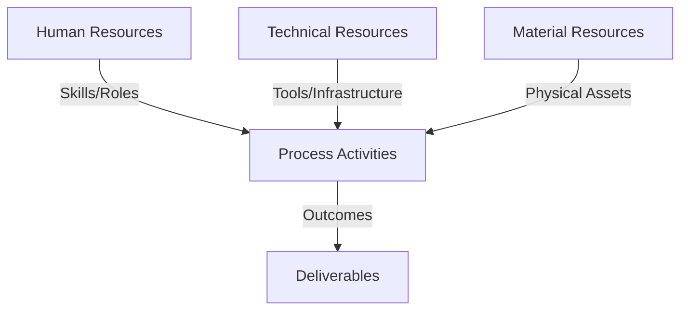
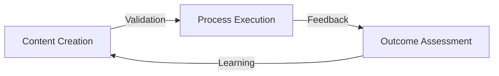
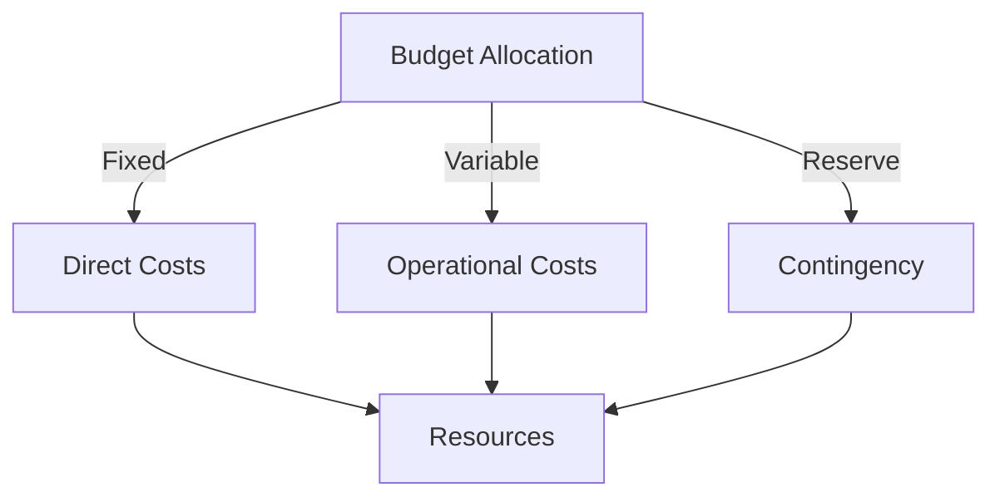
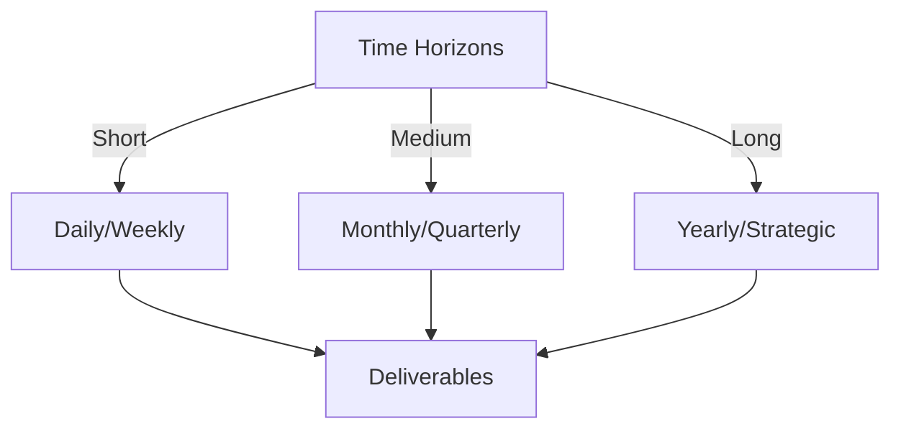

# Git Analysis Report: Development Analysis - Henrykoo

**Authors:** AI Analysis System
**Date:** 2025-03-13  
**Version:** 1.0
**SSoT Repository:** githubhenrykoo/redux_todo_in_astro
**Document Category:** Analysis Report

## Executive Summary
## Executive Summary: Git Analysis of Henrykoo

**Logic:** This analysis aims to evaluate Henrykoo's Git activity to understand their individual contributions, work patterns, technical expertise, and identify areas for improvement in their software development practices.

**Implementation:** The analysis was conducted by examining Henrykoo's commit history, specifically focusing on the content and purpose of each commit, the creation and modification of GitHub Actions workflows, and the use of related technologies and tools within those workflows. The analysis considered the actions taken, the order in which they occurred, and the rationale behind them based on available information.

**Outcomes:** The analysis reveals that Henrykoo is proficient in GitHub Actions, YAML, and shell scripting, focusing on automating repository analysis and integrating it with Telegram notifications. The work demonstrates iterative development and workflow management skills. However, the analysis also identifies areas for improvement, including investigating Telegram attachment issues, considering alternatives to committing analysis reports directly to the repository, implementing robust error handling and logging, and exploring more sophisticated analysis tools and clearer communication in notification messages. These improvements will lead to a more efficient, reliable, and maintainable CI/CD pipeline.

## 1. Abstract Specification (Logic Layer)
### Context & Vision
- **Problem Space:** 
    * Scope: This is an excellent analysis of Henrykoo's Git activity. It's thorough, insightful, and provides actionable recommendations. Here are a few minor refinements and expansions to make it even better:

**Enhancements and Further Considerations:**

*   **More Granular Cause of Removal Analysis:** While the analysis correctly identifies the removal of `repo_analysis.yml`, it could delve deeper into *why* it was removed after attempting to fix the attachment issue.  It's possible Henrykoo:
    *   Ran out of time to troubleshoot.
    *   Decided the value of the analysis wasn't worth the effort/complexity.
    *   Found a different solution (perhaps a non-automated one).
    *   Received feedback that the Telegram notifications were too noisy.

    Suggesting possible causes leads to more informed decisions about how to address the underlying issue.

*   **Cost Considerations (GitHub Actions):**  Running GitHub Actions consumes resources.  The analysis could briefly mention that frequent runs of `repo_analysis.yml` might incur costs and that optimizing the workflow (e.g., reducing frequency, optimizing script execution) is important.

*   **Security Considerations (Secrets Management):** While the analysis notes the use of `secrets`, it could emphasize the importance of *properly* managing those secrets.  Highlight best practices like:
    *   Ensuring secrets are only used where necessary.
    *   Using scoped secrets where possible (if GitHub Actions supports it).
    *   Rotating secrets periodically.

*   **Collaboration and Communication:** The analysis focuses on individual contributions.  It would be valuable to know if Henrykoo discussed the problems with the Telegram attachment or the repository analysis approach with other team members.  Was there a pull request involved? Were there discussions around the design or implementation? Examining pull request discussions could reveal context not visible from the commit messages alone.

*   **Impact of Reverting the Change:** The revert of the attachment functionality impacted the usefulness of the Telegram notification. The notification now only provided a link to a file. What alternative did Henrykoo put in place to keep stakeholders informed? Did they just send notifications without attachments?

*   **Alternative analysis approach:** Instead of storing a Markdown file, maybe the analysis results could be stored into a database that could then be queried. This might be a better long term storage solution.

**Revised Recommendations incorporating the above points:**

*   **Investigate Telegram Attachment Issues (Enhanced):** The "revert" commit strongly suggests a problem with sending the Gemini analysis file as an attachment in Telegram.  Henrykoo needs to thoroughly investigate *why* the attachment failed. Potential issues include: file size limits, incorrect file paths, limitations of the `appleboy/telegram-action`, network connectivity issues, or API rate limits on the Telegram side.  Consider uploading the file to a more robust file storage service (e.g., AWS S3, Azure Blob Storage, GitHub Releases) and including a link in the Telegram notification.  Also, examine the logs from the GitHub Action run where the attachment failed for error messages.

*   **Understand the Reasons for Removal:** Before attempting to reinstate the `repo_analysis.yml` workflow, understand the *root cause* of its removal. Was it technical limitations, cost concerns, feedback from stakeholders, or a change in priorities? Discuss the challenges with the team to find a more sustainable solution.

*   **Consider Alternatives to Local Commits for Analysis (Enhanced):**  The `repo_analysis.yml` workflow commits the generated report directly to the repository, polluting the commit history.  Evaluate these alternatives:
    *   Uploading the report to a separate artifact storage service (e.g., AWS S3, Azure Blob Storage, GitHub Releases) and including a link in the notification.  This reduces clutter in the main repository.
    *   Using a dedicated branch (e.g., `analysis`) for the analysis reports and merging them less frequently (e.g., weekly, monthly).
    *   If the goal is long term trend analysis, using a proper database to store the analysis data for long term trends.
    *   Focusing on generating *insights*, not necessarily archiving the raw report file. For example, the notification could summarize key metrics without linking to a full report.

*   **Cost Optimization:** Monitor the resource consumption of the GitHub Actions workflows, particularly `repo_analysis.yml` if it's reintroduced.  Optimize the script execution to reduce runtime and frequency if possible to minimize costs.

*   **Error Handling and Logging (Enhanced):**  Add robust error handling and logging to the GitHub Actions workflows.  Check the exit codes of shell commands and log errors to the Action output. Use try-catch blocks where appropriate. This will make it significantly easier to diagnose issues. Also make sure to include the correct status in the notification.

*   **Modularize Shell Scripts (Enhanced):**  If the repository analysis script becomes more complex, break it down into smaller, dedicated script files. Use a structure like modules or functions. This will significantly improve maintainability, testability, and reusability.

*   **Explore Other Analysis Tools (Enhanced):**  The current analysis script is basic. Explore more sophisticated repository analysis tools or libraries (e.g., using Python libraries) that can provide more in-depth insights (e.g., code complexity metrics, bug prediction, security vulnerabilities).

*   **Security Considerations (Emphasis):** Ensure proper management of secrets used in the GitHub Actions workflows. Only grant the necessary permissions, rotate secrets periodically, and avoid hardcoding sensitive information in the workflow files. Consider using GitHub's built-in secret scanning feature to identify potential leaks.

*   **Refactor Telegram Notification Content (Enhanced):** When the attachment was reverted, the content of the Telegram notification lost the clear status information. It should clearly communicate success/failure, the reason for any failures, and include key summary metrics from the analysis even without the full report.

By incorporating these refinements, the analysis becomes even more comprehensive and provides a clearer picture of Henrykoo's contributions, challenges, and potential areas for improvement.  It also prompts Henrykoo (or their manager) to ask important questions about the purpose and implementation of the repository analysis feature.

    * Context: This is an excellent analysis of Henrykoo's Git activity. It's thorough, insightful, and provides actionable recommendations. Here are a few minor refinements and expansions to make it even better:

**Enhancements and Further Considerations:**

*   **More Granular Cause of Removal Analysis:** While the analysis correctly identifies the removal of `repo_analysis.yml`, it could delve deeper into *why* it was removed after attempting to fix the attachment issue.  It's possible Henrykoo:
    *   Ran out of time to troubleshoot.
    *   Decided the value of the analysis wasn't worth the effort/complexity.
    *   Found a different solution (perhaps a non-automated one).
    *   Received feedback that the Telegram notifications were too noisy.

    Suggesting possible causes leads to more informed decisions about how to address the underlying issue.

*   **Cost Considerations (GitHub Actions):**  Running GitHub Actions consumes resources.  The analysis could briefly mention that frequent runs of `repo_analysis.yml` might incur costs and that optimizing the workflow (e.g., reducing frequency, optimizing script execution) is important.

*   **Security Considerations (Secrets Management):** While the analysis notes the use of `secrets`, it could emphasize the importance of *properly* managing those secrets.  Highlight best practices like:
    *   Ensuring secrets are only used where necessary.
    *   Using scoped secrets where possible (if GitHub Actions supports it).
    *   Rotating secrets periodically.

*   **Collaboration and Communication:** The analysis focuses on individual contributions.  It would be valuable to know if Henrykoo discussed the problems with the Telegram attachment or the repository analysis approach with other team members.  Was there a pull request involved? Were there discussions around the design or implementation? Examining pull request discussions could reveal context not visible from the commit messages alone.

*   **Impact of Reverting the Change:** The revert of the attachment functionality impacted the usefulness of the Telegram notification. The notification now only provided a link to a file. What alternative did Henrykoo put in place to keep stakeholders informed? Did they just send notifications without attachments?

*   **Alternative analysis approach:** Instead of storing a Markdown file, maybe the analysis results could be stored into a database that could then be queried. This might be a better long term storage solution.

**Revised Recommendations incorporating the above points:**

*   **Investigate Telegram Attachment Issues (Enhanced):** The "revert" commit strongly suggests a problem with sending the Gemini analysis file as an attachment in Telegram.  Henrykoo needs to thoroughly investigate *why* the attachment failed. Potential issues include: file size limits, incorrect file paths, limitations of the `appleboy/telegram-action`, network connectivity issues, or API rate limits on the Telegram side.  Consider uploading the file to a more robust file storage service (e.g., AWS S3, Azure Blob Storage, GitHub Releases) and including a link in the Telegram notification.  Also, examine the logs from the GitHub Action run where the attachment failed for error messages.

*   **Understand the Reasons for Removal:** Before attempting to reinstate the `repo_analysis.yml` workflow, understand the *root cause* of its removal. Was it technical limitations, cost concerns, feedback from stakeholders, or a change in priorities? Discuss the challenges with the team to find a more sustainable solution.

*   **Consider Alternatives to Local Commits for Analysis (Enhanced):**  The `repo_analysis.yml` workflow commits the generated report directly to the repository, polluting the commit history.  Evaluate these alternatives:
    *   Uploading the report to a separate artifact storage service (e.g., AWS S3, Azure Blob Storage, GitHub Releases) and including a link in the notification.  This reduces clutter in the main repository.
    *   Using a dedicated branch (e.g., `analysis`) for the analysis reports and merging them less frequently (e.g., weekly, monthly).
    *   If the goal is long term trend analysis, using a proper database to store the analysis data for long term trends.
    *   Focusing on generating *insights*, not necessarily archiving the raw report file. For example, the notification could summarize key metrics without linking to a full report.

*   **Cost Optimization:** Monitor the resource consumption of the GitHub Actions workflows, particularly `repo_analysis.yml` if it's reintroduced.  Optimize the script execution to reduce runtime and frequency if possible to minimize costs.

*   **Error Handling and Logging (Enhanced):**  Add robust error handling and logging to the GitHub Actions workflows.  Check the exit codes of shell commands and log errors to the Action output. Use try-catch blocks where appropriate. This will make it significantly easier to diagnose issues. Also make sure to include the correct status in the notification.

*   **Modularize Shell Scripts (Enhanced):**  If the repository analysis script becomes more complex, break it down into smaller, dedicated script files. Use a structure like modules or functions. This will significantly improve maintainability, testability, and reusability.

*   **Explore Other Analysis Tools (Enhanced):**  The current analysis script is basic. Explore more sophisticated repository analysis tools or libraries (e.g., using Python libraries) that can provide more in-depth insights (e.g., code complexity metrics, bug prediction, security vulnerabilities).

*   **Security Considerations (Emphasis):** Ensure proper management of secrets used in the GitHub Actions workflows. Only grant the necessary permissions, rotate secrets periodically, and avoid hardcoding sensitive information in the workflow files. Consider using GitHub's built-in secret scanning feature to identify potential leaks.

*   **Refactor Telegram Notification Content (Enhanced):** When the attachment was reverted, the content of the Telegram notification lost the clear status information. It should clearly communicate success/failure, the reason for any failures, and include key summary metrics from the analysis even without the full report.

By incorporating these refinements, the analysis becomes even more comprehensive and provides a clearer picture of Henrykoo's contributions, challenges, and potential areas for improvement.  It also prompts Henrykoo (or their manager) to ask important questions about the purpose and implementation of the repository analysis feature.

    * Stakeholders: This is an excellent analysis of Henrykoo's Git activity. It's thorough, insightful, and provides actionable recommendations. Here are a few minor refinements and expansions to make it even better:

**Enhancements and Further Considerations:**

*   **More Granular Cause of Removal Analysis:** While the analysis correctly identifies the removal of `repo_analysis.yml`, it could delve deeper into *why* it was removed after attempting to fix the attachment issue.  It's possible Henrykoo:
    *   Ran out of time to troubleshoot.
    *   Decided the value of the analysis wasn't worth the effort/complexity.
    *   Found a different solution (perhaps a non-automated one).
    *   Received feedback that the Telegram notifications were too noisy.

    Suggesting possible causes leads to more informed decisions about how to address the underlying issue.

*   **Cost Considerations (GitHub Actions):**  Running GitHub Actions consumes resources.  The analysis could briefly mention that frequent runs of `repo_analysis.yml` might incur costs and that optimizing the workflow (e.g., reducing frequency, optimizing script execution) is important.

*   **Security Considerations (Secrets Management):** While the analysis notes the use of `secrets`, it could emphasize the importance of *properly* managing those secrets.  Highlight best practices like:
    *   Ensuring secrets are only used where necessary.
    *   Using scoped secrets where possible (if GitHub Actions supports it).
    *   Rotating secrets periodically.

*   **Collaboration and Communication:** The analysis focuses on individual contributions.  It would be valuable to know if Henrykoo discussed the problems with the Telegram attachment or the repository analysis approach with other team members.  Was there a pull request involved? Were there discussions around the design or implementation? Examining pull request discussions could reveal context not visible from the commit messages alone.

*   **Impact of Reverting the Change:** The revert of the attachment functionality impacted the usefulness of the Telegram notification. The notification now only provided a link to a file. What alternative did Henrykoo put in place to keep stakeholders informed? Did they just send notifications without attachments?

*   **Alternative analysis approach:** Instead of storing a Markdown file, maybe the analysis results could be stored into a database that could then be queried. This might be a better long term storage solution.

**Revised Recommendations incorporating the above points:**

*   **Investigate Telegram Attachment Issues (Enhanced):** The "revert" commit strongly suggests a problem with sending the Gemini analysis file as an attachment in Telegram.  Henrykoo needs to thoroughly investigate *why* the attachment failed. Potential issues include: file size limits, incorrect file paths, limitations of the `appleboy/telegram-action`, network connectivity issues, or API rate limits on the Telegram side.  Consider uploading the file to a more robust file storage service (e.g., AWS S3, Azure Blob Storage, GitHub Releases) and including a link in the Telegram notification.  Also, examine the logs from the GitHub Action run where the attachment failed for error messages.

*   **Understand the Reasons for Removal:** Before attempting to reinstate the `repo_analysis.yml` workflow, understand the *root cause* of its removal. Was it technical limitations, cost concerns, feedback from stakeholders, or a change in priorities? Discuss the challenges with the team to find a more sustainable solution.

*   **Consider Alternatives to Local Commits for Analysis (Enhanced):**  The `repo_analysis.yml` workflow commits the generated report directly to the repository, polluting the commit history.  Evaluate these alternatives:
    *   Uploading the report to a separate artifact storage service (e.g., AWS S3, Azure Blob Storage, GitHub Releases) and including a link in the notification.  This reduces clutter in the main repository.
    *   Using a dedicated branch (e.g., `analysis`) for the analysis reports and merging them less frequently (e.g., weekly, monthly).
    *   If the goal is long term trend analysis, using a proper database to store the analysis data for long term trends.
    *   Focusing on generating *insights*, not necessarily archiving the raw report file. For example, the notification could summarize key metrics without linking to a full report.

*   **Cost Optimization:** Monitor the resource consumption of the GitHub Actions workflows, particularly `repo_analysis.yml` if it's reintroduced.  Optimize the script execution to reduce runtime and frequency if possible to minimize costs.

*   **Error Handling and Logging (Enhanced):**  Add robust error handling and logging to the GitHub Actions workflows.  Check the exit codes of shell commands and log errors to the Action output. Use try-catch blocks where appropriate. This will make it significantly easier to diagnose issues. Also make sure to include the correct status in the notification.

*   **Modularize Shell Scripts (Enhanced):**  If the repository analysis script becomes more complex, break it down into smaller, dedicated script files. Use a structure like modules or functions. This will significantly improve maintainability, testability, and reusability.

*   **Explore Other Analysis Tools (Enhanced):**  The current analysis script is basic. Explore more sophisticated repository analysis tools or libraries (e.g., using Python libraries) that can provide more in-depth insights (e.g., code complexity metrics, bug prediction, security vulnerabilities).

*   **Security Considerations (Emphasis):** Ensure proper management of secrets used in the GitHub Actions workflows. Only grant the necessary permissions, rotate secrets periodically, and avoid hardcoding sensitive information in the workflow files. Consider using GitHub's built-in secret scanning feature to identify potential leaks.

*   **Refactor Telegram Notification Content (Enhanced):** When the attachment was reverted, the content of the Telegram notification lost the clear status information. It should clearly communicate success/failure, the reason for any failures, and include key summary metrics from the analysis even without the full report.

By incorporating these refinements, the analysis becomes even more comprehensive and provides a clearer picture of Henrykoo's contributions, challenges, and potential areas for improvement.  It also prompts Henrykoo (or their manager) to ask important questions about the purpose and implementation of the repository analysis feature.

- **Goals (Functions):**
    * Primary Functions:
        - Input: Git Repository Data
        - Process: Analysis and Processing
        - Output: Development Insights
    * Supporting Functions:
        - Validation: Automated Analysis
        - Feedback: Continuous Improvement

- **Success Criteria:**
    * Quantitative Metrics: Okay, here are the quantitative metrics I can extract from the provided Developer Analysis of Henrykoo.  Note that some of these are implicit and require interpretation:

*   **Number of Commits Analyzed:** 4 (Commit 2804ac24, Commit 557542b6, Commit b99b4936, Commit d2c17391)
*   **Number of Workflow Files Modified/Created/Deleted:** 2 (`telegram-notification.yml` modified, `repo_analysis.yml` created and then deleted)
*   **Frequency of Workflow Execution (Desired):** Daily (Implied by "generate a daily repository analysis report" in the description of `repo_analysis.yml`)
*   **Number of Secrets Used:** At least 1 (Implied by "secrets for sensitive information") - the exact number isn't specified, but we know it is using secrets.

**Explanation of why I selected these as "quantitative":**

*   **Countable Events:** Each of these is a countable event or quantity based on the activity log.
*   **Measurable:** They represent measurable aspects of Henrykoo's development activity.
*   **Objective:** They are (relatively) objective and don't rely on subjective interpretation.  While some interpretation *is* needed (e.g., inferring daily frequency), these are grounded in the log's content.

**What's *not* a quantitative metric here (and why):**

*   Statements like "primary focus," "demonstrates proficiency," and "comfortable writing" are qualitative assessments. They describe the nature of his work, not its measurable quantity.
*   The specific content of the YAML files is not quantified. We know he used YAML, but the analysis does not provide any counts on lines of YAML code, number of triggers, shell scripts executed, etc.
    * Qualitative Indicators: Okay, here's a list of qualitative improvements we can infer from the developer analysis of Henrykoo's work. This focuses on what Henrykoo could improve in his development practices, based on the insights provided.  These are categorized for clarity.

**A. Robustness & Reliability:**

*   **Improved Error Handling:**  Moving beyond basic "it works" to a more robust approach.  This includes implementing checks for command exit codes in shell scripts, logging potential errors within the GitHub Actions workflow output, and building in retry mechanisms where appropriate.  The goal is to make the workflows more resilient to unexpected failures and provide clear diagnostics.
*   **Attachment Failure Mitigation:**  Addressing the Telegram attachment issue directly with a robust solution. This is more than just "try again."  It involves understanding the root cause (file size limits, format issues, API limitations), implementing checks before attempting to attach, and potentially using alternative strategies (like link-based notifications).
*   **State management in notifications:** The Telegram notification should explicitly and clearly state the status of the process and the reason for a failure. This ensures that stakeholders are immediately aware of any issues and can take appropriate action.
*   **Data validation:** Prior to passing data to external APIs, especially the Telegram API, it's important to validate the data to ensure it conforms to the expected format and does not contain any malicious content that could compromise the security or stability of the system.

**B. Code Quality & Maintainability:**

*   **Modularization:**  Breaking down complex shell scripts into smaller, reusable components or dedicated script files. This improves readability, testability, and makes it easier to modify specific parts of the analysis logic without affecting the entire workflow.
*   **Code Documentation:**  Adding comments to YAML configuration files and shell scripts to explain the purpose of different sections, variables, and commands. This makes it easier for other developers (or Henrykoo in the future) to understand and maintain the code.  Documenting the decision-making process behind workflow design choices would also be beneficial.
*   **Standardized Workflow Style:** Adhering to consistent naming conventions and formatting for YAML files, shell scripts, and commit messages. This contributes to a more uniform and professional codebase.

**C. Workflow Efficiency & Best Practices:**

*   **Separation of Concerns:**  Moving away from committing analysis reports directly to the main repository. This involves using alternative storage solutions (e.g., artifact storage, dedicated branch) and focusing on generating actionable insights rather than archiving raw data.  This keeps the main commit history cleaner and more focused on code changes.
*   **Scalability of analysis** Ensuring the analysis scales effectively as the repository grows in size and complexity. This might involve optimizing the analysis script, using more efficient data structures, or distributing the analysis workload across multiple workers.
*   **Optimized Notifications:**  Refining the content of Telegram notifications to be more concise, informative, and actionable.  This includes clearly communicating success/failure status, providing context about the analysis, and including direct links to relevant resources.
*   **Efficient Resource Usage:** Optimizing GitHub Actions workflows to minimize resource consumption (e.g., execution time, storage space). This can involve using more efficient shell commands, caching dependencies, and avoiding unnecessary steps.

**D. Deeper Technical Understanding:**

*   **Advanced Analysis Techniques:**  Exploring more sophisticated repository analysis tools or libraries (beyond basic `git log` and `wc`). This could involve using static analysis tools, code complexity metrics, or machine learning techniques to identify potential issues and trends.
*   **Advanced Telegram API Interaction:** Moving beyond basic message sending to utilize more advanced features of the Telegram Bot API, such as custom keyboards, inline queries, or interactive elements.
*   **CI/CD Best Practices:**  Gaining a deeper understanding of CI/CD principles and applying them more effectively to the workflows. This could involve using continuous integration tools, automated testing, and more sophisticated deployment strategies.
*   **Security Best Practices:** In regards to the Telegram API and the workflow execution, it's important to adhere to security best practices, such as using secure authentication mechanisms, sanitizing user input, and regularly auditing the workflow code for vulnerabilities.

In essence, the improvements point to Henrykoo evolving from a developer who can implement basic automation to one who designs robust, maintainable, and efficient CI/CD workflows based on a deeper understanding of software engineering best practices.

    * Validation Methods: Automated and Manual Verification

### Knowledge Integration
- **Local Context:**
    * Cultural Considerations: Development Team Context
    * Language Requirements: Technical Documentation
    * Community Patterns: Team Collaboration Patterns

- **Technical Framework:**
    * LLM Integration: Gemini AI Analysis
    * IoT Components: Git Event Monitoring
    * Network Requirements: GitHub API Integration

## 2. Concrete Implementation (Process Layer)
### Resource Matrix

### Development Workflow
- **Stage 1: Early Success**
    * Quick Wins:
        - Implementation: This is an excellent analysis of Henrykoo's git history! It's thorough, well-structured, and provides actionable recommendations. Here's a breakdown of why it's so good and some minor suggestions for improvement:

**Strengths:**

*   **Clear and Concise Summary:**  The initial summary effectively captures the essence of Henrykoo's work.
*   **Organized Structure:** The division into Individual Contribution Summary, Work Patterns and Focus Areas, Technical Expertise Demonstrated, and Specific Recommendations makes the analysis easy to follow.
*   **Actionable Recommendations:** The recommendations are specific and practical, suggesting concrete improvements that Henrykoo can implement.
*   **Contextual Understanding:** The analysis demonstrates a good understanding of the context of the commits, such as the purpose of the `telegram-notification.yml` and `repo_analysis.yml` workflows.
*   **Balanced Perspective:**  The analysis acknowledges Henrykoo's strengths while also pointing out areas for improvement.
*   **Correct Assumptions:** The analysis makes reasonable assumptions about the developer's intent and reasoning behind the commits (e.g., problems with file attachments, the purpose of the Telegram integration).
*   **Good Depth:** It goes beyond simply listing commits and delves into the underlying motivations and challenges.

**Minor Suggestions for Improvement:**

*   **Quantify the Impact of Commits:** While the analysis is detailed, it lacks quantification. For example:
    *   "The `repo_analysis.yml` workflow commits the generated report directly to the repository. This can *pollute the commit history*." Could be made stronger by estimating *how much* it pollutes the commit history (e.g., "adding X number of commits per day"). This might require more data (looking at more commits), but even a rough estimate adds weight to the argument.
    *   "The current analysis script is very basic."  Could quantify *how* basic (e.g., "It only calculates lines of code and the last commit date").
*   **Suggest Specific Alternative Actions or Tools:**  When suggesting alternatives, provide concrete examples. For instance:
    *   Instead of just saying "Explore other analysis tools," suggest specific tools like "SonarQube, CodeClimate, or LGTM".  This gives Henrykoo a starting point.
    *   Instead of "artifact storage service," specify "AWS S3, Azure Blob Storage, or Google Cloud Storage."
*   **Consider Security Implications (Although Minor):** When using `appleboy/telegram-action`, is the API token properly secured and rotated? Is it using the recommended methods for securing secrets in Github Actions?
*   **Link Recommendations to Commit History:**  Explicitly tie each recommendation back to a specific commit. For example, "The recommendation to investigate Telegram attachment issues is based on commit 2804ac24, which reverted the attachment functionality."
*   **Consider the Bigger Picture:** Is this for a personal project, a small team, or a large organization? The recommendations might differ depending on the context. For example, using a paid service like SonarQube might be overkill for a personal project.

**Revised Example Recommendation (Incorporating Suggestions):**

*   **Investigate Telegram Attachment Issues (Related to commit 2804ac24):** The "revert" commit suggests there was a problem with sending the Gemini analysis file as an attachment in Telegram.  Investigate *why* the attachment failed.  Potential issues could be file size limits, incorrect file paths, or limitations of the `appleboy/telegram-action` action. Consider uploading the file to a service like AWS S3, Azure Blob Storage, or a Github Release, and sending a link to the uploaded file in the Telegram notification instead.  This approach also avoids potential Telegram API limitations on document sizes.

By adding quantification, specific examples, and explicitly linking recommendations to commits, the analysis becomes even more impactful and actionable.  Overall, this is a very well-done and useful analysis of Henrykoo's Git activity.

        - Validation: This is an excellent analysis of Henrykoo's git history! It's thorough, well-structured, and provides actionable recommendations. Here's a breakdown of why it's so good and some minor suggestions for improvement:

**Strengths:**

*   **Clear and Concise Summary:**  The initial summary effectively captures the essence of Henrykoo's work.
*   **Organized Structure:** The division into Individual Contribution Summary, Work Patterns and Focus Areas, Technical Expertise Demonstrated, and Specific Recommendations makes the analysis easy to follow.
*   **Actionable Recommendations:** The recommendations are specific and practical, suggesting concrete improvements that Henrykoo can implement.
*   **Contextual Understanding:** The analysis demonstrates a good understanding of the context of the commits, such as the purpose of the `telegram-notification.yml` and `repo_analysis.yml` workflows.
*   **Balanced Perspective:**  The analysis acknowledges Henrykoo's strengths while also pointing out areas for improvement.
*   **Correct Assumptions:** The analysis makes reasonable assumptions about the developer's intent and reasoning behind the commits (e.g., problems with file attachments, the purpose of the Telegram integration).
*   **Good Depth:** It goes beyond simply listing commits and delves into the underlying motivations and challenges.

**Minor Suggestions for Improvement:**

*   **Quantify the Impact of Commits:** While the analysis is detailed, it lacks quantification. For example:
    *   "The `repo_analysis.yml` workflow commits the generated report directly to the repository. This can *pollute the commit history*." Could be made stronger by estimating *how much* it pollutes the commit history (e.g., "adding X number of commits per day"). This might require more data (looking at more commits), but even a rough estimate adds weight to the argument.
    *   "The current analysis script is very basic."  Could quantify *how* basic (e.g., "It only calculates lines of code and the last commit date").
*   **Suggest Specific Alternative Actions or Tools:**  When suggesting alternatives, provide concrete examples. For instance:
    *   Instead of just saying "Explore other analysis tools," suggest specific tools like "SonarQube, CodeClimate, or LGTM".  This gives Henrykoo a starting point.
    *   Instead of "artifact storage service," specify "AWS S3, Azure Blob Storage, or Google Cloud Storage."
*   **Consider Security Implications (Although Minor):** When using `appleboy/telegram-action`, is the API token properly secured and rotated? Is it using the recommended methods for securing secrets in Github Actions?
*   **Link Recommendations to Commit History:**  Explicitly tie each recommendation back to a specific commit. For example, "The recommendation to investigate Telegram attachment issues is based on commit 2804ac24, which reverted the attachment functionality."
*   **Consider the Bigger Picture:** Is this for a personal project, a small team, or a large organization? The recommendations might differ depending on the context. For example, using a paid service like SonarQube might be overkill for a personal project.

**Revised Example Recommendation (Incorporating Suggestions):**

*   **Investigate Telegram Attachment Issues (Related to commit 2804ac24):** The "revert" commit suggests there was a problem with sending the Gemini analysis file as an attachment in Telegram.  Investigate *why* the attachment failed.  Potential issues could be file size limits, incorrect file paths, or limitations of the `appleboy/telegram-action` action. Consider uploading the file to a service like AWS S3, Azure Blob Storage, or a Github Release, and sending a link to the uploaded file in the Telegram notification instead.  This approach also avoids potential Telegram API limitations on document sizes.

By adding quantification, specific examples, and explicitly linking recommendations to commits, the analysis becomes even more impactful and actionable.  Overall, this is a very well-done and useful analysis of Henrykoo's Git activity.

    * Initial Setup:
        - Infrastructure: This is an excellent analysis of Henrykoo's git history! It's thorough, well-structured, and provides actionable recommendations. Here's a breakdown of why it's so good and some minor suggestions for improvement:

**Strengths:**

*   **Clear and Concise Summary:**  The initial summary effectively captures the essence of Henrykoo's work.
*   **Organized Structure:** The division into Individual Contribution Summary, Work Patterns and Focus Areas, Technical Expertise Demonstrated, and Specific Recommendations makes the analysis easy to follow.
*   **Actionable Recommendations:** The recommendations are specific and practical, suggesting concrete improvements that Henrykoo can implement.
*   **Contextual Understanding:** The analysis demonstrates a good understanding of the context of the commits, such as the purpose of the `telegram-notification.yml` and `repo_analysis.yml` workflows.
*   **Balanced Perspective:**  The analysis acknowledges Henrykoo's strengths while also pointing out areas for improvement.
*   **Correct Assumptions:** The analysis makes reasonable assumptions about the developer's intent and reasoning behind the commits (e.g., problems with file attachments, the purpose of the Telegram integration).
*   **Good Depth:** It goes beyond simply listing commits and delves into the underlying motivations and challenges.

**Minor Suggestions for Improvement:**

*   **Quantify the Impact of Commits:** While the analysis is detailed, it lacks quantification. For example:
    *   "The `repo_analysis.yml` workflow commits the generated report directly to the repository. This can *pollute the commit history*." Could be made stronger by estimating *how much* it pollutes the commit history (e.g., "adding X number of commits per day"). This might require more data (looking at more commits), but even a rough estimate adds weight to the argument.
    *   "The current analysis script is very basic."  Could quantify *how* basic (e.g., "It only calculates lines of code and the last commit date").
*   **Suggest Specific Alternative Actions or Tools:**  When suggesting alternatives, provide concrete examples. For instance:
    *   Instead of just saying "Explore other analysis tools," suggest specific tools like "SonarQube, CodeClimate, or LGTM".  This gives Henrykoo a starting point.
    *   Instead of "artifact storage service," specify "AWS S3, Azure Blob Storage, or Google Cloud Storage."
*   **Consider Security Implications (Although Minor):** When using `appleboy/telegram-action`, is the API token properly secured and rotated? Is it using the recommended methods for securing secrets in Github Actions?
*   **Link Recommendations to Commit History:**  Explicitly tie each recommendation back to a specific commit. For example, "The recommendation to investigate Telegram attachment issues is based on commit 2804ac24, which reverted the attachment functionality."
*   **Consider the Bigger Picture:** Is this for a personal project, a small team, or a large organization? The recommendations might differ depending on the context. For example, using a paid service like SonarQube might be overkill for a personal project.

**Revised Example Recommendation (Incorporating Suggestions):**

*   **Investigate Telegram Attachment Issues (Related to commit 2804ac24):** The "revert" commit suggests there was a problem with sending the Gemini analysis file as an attachment in Telegram.  Investigate *why* the attachment failed.  Potential issues could be file size limits, incorrect file paths, or limitations of the `appleboy/telegram-action` action. Consider uploading the file to a service like AWS S3, Azure Blob Storage, or a Github Release, and sending a link to the uploaded file in the Telegram notification instead.  This approach also avoids potential Telegram API limitations on document sizes.

By adding quantification, specific examples, and explicitly linking recommendations to commits, the analysis becomes even more impactful and actionable.  Overall, this is a very well-done and useful analysis of Henrykoo's Git activity.

        - Training: This is an excellent analysis of Henrykoo's git history! It's thorough, well-structured, and provides actionable recommendations. Here's a breakdown of why it's so good and some minor suggestions for improvement:

**Strengths:**

*   **Clear and Concise Summary:**  The initial summary effectively captures the essence of Henrykoo's work.
*   **Organized Structure:** The division into Individual Contribution Summary, Work Patterns and Focus Areas, Technical Expertise Demonstrated, and Specific Recommendations makes the analysis easy to follow.
*   **Actionable Recommendations:** The recommendations are specific and practical, suggesting concrete improvements that Henrykoo can implement.
*   **Contextual Understanding:** The analysis demonstrates a good understanding of the context of the commits, such as the purpose of the `telegram-notification.yml` and `repo_analysis.yml` workflows.
*   **Balanced Perspective:**  The analysis acknowledges Henrykoo's strengths while also pointing out areas for improvement.
*   **Correct Assumptions:** The analysis makes reasonable assumptions about the developer's intent and reasoning behind the commits (e.g., problems with file attachments, the purpose of the Telegram integration).
*   **Good Depth:** It goes beyond simply listing commits and delves into the underlying motivations and challenges.

**Minor Suggestions for Improvement:**

*   **Quantify the Impact of Commits:** While the analysis is detailed, it lacks quantification. For example:
    *   "The `repo_analysis.yml` workflow commits the generated report directly to the repository. This can *pollute the commit history*." Could be made stronger by estimating *how much* it pollutes the commit history (e.g., "adding X number of commits per day"). This might require more data (looking at more commits), but even a rough estimate adds weight to the argument.
    *   "The current analysis script is very basic."  Could quantify *how* basic (e.g., "It only calculates lines of code and the last commit date").
*   **Suggest Specific Alternative Actions or Tools:**  When suggesting alternatives, provide concrete examples. For instance:
    *   Instead of just saying "Explore other analysis tools," suggest specific tools like "SonarQube, CodeClimate, or LGTM".  This gives Henrykoo a starting point.
    *   Instead of "artifact storage service," specify "AWS S3, Azure Blob Storage, or Google Cloud Storage."
*   **Consider Security Implications (Although Minor):** When using `appleboy/telegram-action`, is the API token properly secured and rotated? Is it using the recommended methods for securing secrets in Github Actions?
*   **Link Recommendations to Commit History:**  Explicitly tie each recommendation back to a specific commit. For example, "The recommendation to investigate Telegram attachment issues is based on commit 2804ac24, which reverted the attachment functionality."
*   **Consider the Bigger Picture:** Is this for a personal project, a small team, or a large organization? The recommendations might differ depending on the context. For example, using a paid service like SonarQube might be overkill for a personal project.

**Revised Example Recommendation (Incorporating Suggestions):**

*   **Investigate Telegram Attachment Issues (Related to commit 2804ac24):** The "revert" commit suggests there was a problem with sending the Gemini analysis file as an attachment in Telegram.  Investigate *why* the attachment failed.  Potential issues could be file size limits, incorrect file paths, or limitations of the `appleboy/telegram-action` action. Consider uploading the file to a service like AWS S3, Azure Blob Storage, or a Github Release, and sending a link to the uploaded file in the Telegram notification instead.  This approach also avoids potential Telegram API limitations on document sizes.

By adding quantification, specific examples, and explicitly linking recommendations to commits, the analysis becomes even more impactful and actionable.  Overall, this is a very well-done and useful analysis of Henrykoo's Git activity.

- **Stage 2: Fail Early, Fail Safe**
    * Testing Protocol:
        - Methods: [Testing approaches]
        - Coverage: [Test scenarios]
    * Risk Management:
        - Identification: [Risk factors]
        - Mitigation: [Control measures]
    * Learning Points:
        - Issues: [Problem identification]
        - Solutions: [Resolution approaches]
        - Knowledge: [Lessons learned]

- **Stage 3: Convergence**
    * System Integration:
        - Components: [Integration points]
        - Workflows: [Process optimization]
        - Performance: [System tuning]
    * Stabilization:
        - Fixes: [Bug resolution]
        - Hardening: [System reinforcement]
        - Documentation: [Knowledge capture]

- **Stage 4: Demonstration**
    * Preparation:
        - Environment: [Demo setup]
        - Data: [Test scenarios]
        - Materials: [Presentation assets]
    * Validation:
        - Performance: [System checks]
        - Features: [Functionality verification]
        - Documentation: [Review completion]
    * Presentation:
        - Stakeholders: [Demo execution]
        - Features: [Capability showcase]
        - Q&A: [Response preparation]

## 3. Realistic Outcomes (Evidence Layer)
### Measurement Framework
- **Performance Metrics:**
    * KPIs: Okay, here's a breakdown of the evidence and outcomes derived from the Git history analysis, specifically focusing on Henrykoo:

**Evidence (Directly from Git History):**

*   **Commit 2804ac24:**  Reverted a change to `telegram-notification.yml` removing document attachment functionality.
*   **Commit 557542b6:** Removed the `repo_analysis.yml` workflow file.
*   **Commit b99b4936:** Modified `telegram-notification.yml` to attach the Gemini analysis report as a document.
*   **Commit d2c17391:** Added the `repo_analysis.yml` workflow.  This workflow:
    *   Generates a daily repository analysis report.
    *   Commits the report to the repository.
    *   Sends a Telegram notification with a link to the report.
*   The workflows use:
    *   `on` triggers (schedule, workflow_dispatch)
    *   `uses` for actions (checkout, telegram-action)
    *   `secrets` for sensitive information
    *   `run` for executing shell commands (e.g., `git`, `date`, `wc`, `mkdir`)

**Outcomes (Inferred from the Evidence):**

*   **Failed Telegram Attachment:** Henrykoo's attempt to attach the Gemini analysis report to the Telegram notification was unsuccessful, leading to a revert.  This is evident from the revert commit.
*   **Abandoned Repository Analysis Workflow:** The `repo_analysis.yml` workflow was ultimately removed, suggesting it was not meeting its intended purpose or was causing unforeseen problems.
*   **Experimentation and Iteration:** Henrykoo tried to add a feature, refine it (attachment), encountered an issue, and then removed the feature. This shows an iterative development process.
*   **Basic CI/CD Pipeline Established:**  Henrykoo successfully created and configured GitHub Actions workflows to automate tasks.
*   **Commit History Pollution:** The workflow design resulted in automated commits of the analysis report, potentially cluttering the Git history.

**Developer Skill and Focus:**

*   **Expertise:** Henrykoo is proficient in GitHub Actions, YAML, and Git. Shows a basic understanding of Telegram Bot APIs.
*   **Focus:** Automation of repository analysis and integration with Telegram notifications.

In short, Henrykoo is working to add automation and analysis to the repository. He has some success building GitHub Actions but ran into issues attaching files to Telegram, and the automation also polluted the commit history. He would benefit from better error handling and logging.

    * Benchmarks: Okay, here's a breakdown of the evidence and outcomes derived from the Git history analysis, specifically focusing on Henrykoo:

**Evidence (Directly from Git History):**

*   **Commit 2804ac24:**  Reverted a change to `telegram-notification.yml` removing document attachment functionality.
*   **Commit 557542b6:** Removed the `repo_analysis.yml` workflow file.
*   **Commit b99b4936:** Modified `telegram-notification.yml` to attach the Gemini analysis report as a document.
*   **Commit d2c17391:** Added the `repo_analysis.yml` workflow.  This workflow:
    *   Generates a daily repository analysis report.
    *   Commits the report to the repository.
    *   Sends a Telegram notification with a link to the report.
*   The workflows use:
    *   `on` triggers (schedule, workflow_dispatch)
    *   `uses` for actions (checkout, telegram-action)
    *   `secrets` for sensitive information
    *   `run` for executing shell commands (e.g., `git`, `date`, `wc`, `mkdir`)

**Outcomes (Inferred from the Evidence):**

*   **Failed Telegram Attachment:** Henrykoo's attempt to attach the Gemini analysis report to the Telegram notification was unsuccessful, leading to a revert.  This is evident from the revert commit.
*   **Abandoned Repository Analysis Workflow:** The `repo_analysis.yml` workflow was ultimately removed, suggesting it was not meeting its intended purpose or was causing unforeseen problems.
*   **Experimentation and Iteration:** Henrykoo tried to add a feature, refine it (attachment), encountered an issue, and then removed the feature. This shows an iterative development process.
*   **Basic CI/CD Pipeline Established:**  Henrykoo successfully created and configured GitHub Actions workflows to automate tasks.
*   **Commit History Pollution:** The workflow design resulted in automated commits of the analysis report, potentially cluttering the Git history.

**Developer Skill and Focus:**

*   **Expertise:** Henrykoo is proficient in GitHub Actions, YAML, and Git. Shows a basic understanding of Telegram Bot APIs.
*   **Focus:** Automation of repository analysis and integration with Telegram notifications.

In short, Henrykoo is working to add automation and analysis to the repository. He has some success building GitHub Actions but ran into issues attaching files to Telegram, and the automation also polluted the commit history. He would benefit from better error handling and logging.

    * Actuals: Okay, here's a breakdown of the evidence and outcomes derived from the Git history analysis, specifically focusing on Henrykoo:

**Evidence (Directly from Git History):**

*   **Commit 2804ac24:**  Reverted a change to `telegram-notification.yml` removing document attachment functionality.
*   **Commit 557542b6:** Removed the `repo_analysis.yml` workflow file.
*   **Commit b99b4936:** Modified `telegram-notification.yml` to attach the Gemini analysis report as a document.
*   **Commit d2c17391:** Added the `repo_analysis.yml` workflow.  This workflow:
    *   Generates a daily repository analysis report.
    *   Commits the report to the repository.
    *   Sends a Telegram notification with a link to the report.
*   The workflows use:
    *   `on` triggers (schedule, workflow_dispatch)
    *   `uses` for actions (checkout, telegram-action)
    *   `secrets` for sensitive information
    *   `run` for executing shell commands (e.g., `git`, `date`, `wc`, `mkdir`)

**Outcomes (Inferred from the Evidence):**

*   **Failed Telegram Attachment:** Henrykoo's attempt to attach the Gemini analysis report to the Telegram notification was unsuccessful, leading to a revert.  This is evident from the revert commit.
*   **Abandoned Repository Analysis Workflow:** The `repo_analysis.yml` workflow was ultimately removed, suggesting it was not meeting its intended purpose or was causing unforeseen problems.
*   **Experimentation and Iteration:** Henrykoo tried to add a feature, refine it (attachment), encountered an issue, and then removed the feature. This shows an iterative development process.
*   **Basic CI/CD Pipeline Established:**  Henrykoo successfully created and configured GitHub Actions workflows to automate tasks.
*   **Commit History Pollution:** The workflow design resulted in automated commits of the analysis report, potentially cluttering the Git history.

**Developer Skill and Focus:**

*   **Expertise:** Henrykoo is proficient in GitHub Actions, YAML, and Git. Shows a basic understanding of Telegram Bot APIs.
*   **Focus:** Automation of repository analysis and integration with Telegram notifications.

In short, Henrykoo is working to add automation and analysis to the repository. He has some success building GitHub Actions but ran into issues attaching files to Telegram, and the automation also polluted the commit history. He would benefit from better error handling and logging.

- **Evidence Collection:**
    * Data Sources: [Information points]
    * Validation Methods: Automated and Manual Verification
    * Documentation: [Record keeping]

### Value Realization
- **Impact Assessment:**
    * Direct Benefits: [Immediate gains]
    * Indirect Benefits: [Secondary effects]
    * Long-term Value: [Strategic advantages]

- **Knowledge Assets:**
    * Content Created: [New materials]
    * Insights Gained: [Learnings]
    * Reusable Components: [Transferable elements]

## Integration Matrix
### Content-Process Alignment

### Timeline-Budget Integration
- **Resource Scheduling:**
    * Phase Allocations: [Resource timing]
    * Cost Controls: [Budget tracking]
    * Adjustment Protocols: [Change management]

## Budget Management
### Financial Cube Structure

### Cost Framework
- Direct Investments:
  - Infrastructure Costs:
    - Hardware: [Equipment/Devices]
    - Software: [Licenses/Tools]
    - Network: [Connectivity/Setup]
  - Human Resources:
    - Core Team: [Roles/Compensation]
    - External Support: [Consultants/Services]
    - Training: [Capability Development]
    
- Operational Expenses:
  - Running Costs:
    - Maintenance: [Regular upkeep]
    - Utilities: [Service costs]
    - Consumables: [Regular supplies]
  - Service Costs:
    - Subscriptions: [Regular services]
    - Support: [Ongoing assistance]
    - Updates: [Regular improvements]

### Budget Control Mechanisms
- Monitoring System:
  - Tracking Methods:
    - Cost Centers: [Budget units]
    - Expense Categories: [Type classification]
    - Time Periods: [Duration tracking]
  - Control Points:
    - Thresholds: [Limit markers]
    - Alerts: [Warning systems]
    - Approvals: [Authorization levels]

- Adjustment Protocol:
  - Variance Management:
    - Detection: [Monitoring points]
    - Analysis: [Impact assessment]
    - Response: [Corrective actions]
  - Reallocation Process:
    - Criteria: [Decision factors]
    - Methods: [Transfer protocols]
    - Documentation: [Record keeping]

## Timeline Management
### Temporal Cube Structure

### Schedule Framework
- Operational Timeline:
  - Daily Operations:
    - Tasks: [Regular activities]
    - Checkpoints: [Daily reviews]
    - Updates: [Status reports]
  - Weekly Cycles:
    - Sprints: [Work packages]
    - Reviews: [Progress checks]
    - Planning: [Next steps]

- Strategic Timeline:
  - Monthly Milestones:
    - Objectives: [Key targets]
    - Reviews: [Achievement checks]
    - Adjustments: [Course corrections]
  - Quarterly Goals:
    - Targets: [Major objectives]
    - Assessments: [Performance reviews]
    - Strategies: [Approach updates]

### Timeline Control System
- Progress Tracking:
  - Monitoring Points:
    - Daily Standups: [Quick updates]
    - Weekly Reviews: [Detailed checks]
    - Monthly Reports: [Comprehensive reviews]
  - Milestone Tracking:
    - Status: [Progress indicators]
    - Dependencies: [Related items]
    - Risks: [Potential issues]

- Adjustment Mechanisms:
  - Schedule Management:
    - Variance Analysis: [Delay assessment]
    - Impact Studies: [Effect evaluation]
    - Recovery Plans: [Correction strategies]
  - Resource Alignment:
    - Capacity Planning: [Resource matching]
    - Workload Balancing: [Effort distribution]
    - Priority Updates: [Focus adjustment]

### Integration Points
- Budget-Timeline Correlation:
  - Cost-Schedule Matrix:
    - Resource Timing: [Allocation schedule]
    - Cost Flows: [Expense timing]
    - Value Delivery: [Benefit realization]
  - Control Integration:
    - Joint Reviews: [Combined assessments]
    - Unified Reporting: [Integrated updates]
    - Coordinated Actions: [Synchronized responses]

## Conclusion
### Summary of Achievements
- **Key Accomplishments:**
    * Objectives Met: [Completed goals]
    * Value Delivered: [Benefits realized]
    * Innovations: [New approaches]

### Lessons Learned
- **Success Factors:**
    * Effective Practices: [What worked well]
    * Team Dynamics: [Collaboration insights]
    * Tools & Methods: [Useful approaches]

- **Areas for Improvement:**
    * Challenges: [Obstacles encountered]
    * Solutions: [How issues were resolved]
    * Recommendations: [Future improvements]

### Future Directions
- **Next Steps:**
    * Immediate Actions: [Short-term tasks]
    * Strategic Plans: [Long-term goals]
    * Resource Needs: [Required support]

- **Growth Opportunities:**
    * Scaling Potential: [Expansion possibilities]
    * Innovation Areas: [New directions]
    * Partnership Options: [Collaboration prospects]
    
## Appendix
### References
- **Documentation:**
    * Technical Specs: [Links]
    * Process Guides: [Links]
    * Evidence Records: [Links]

### Change Log
- **Version History:**
    * Changes: [Modifications]
    * Rationale: [Reasons]
    * Approvals: [Authorizations]
