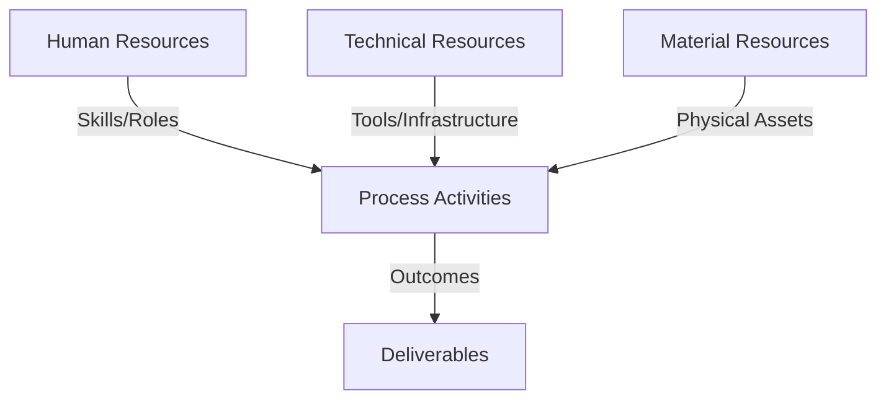
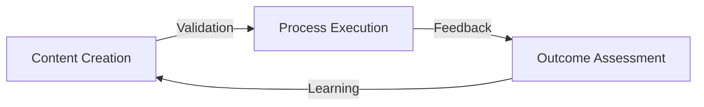
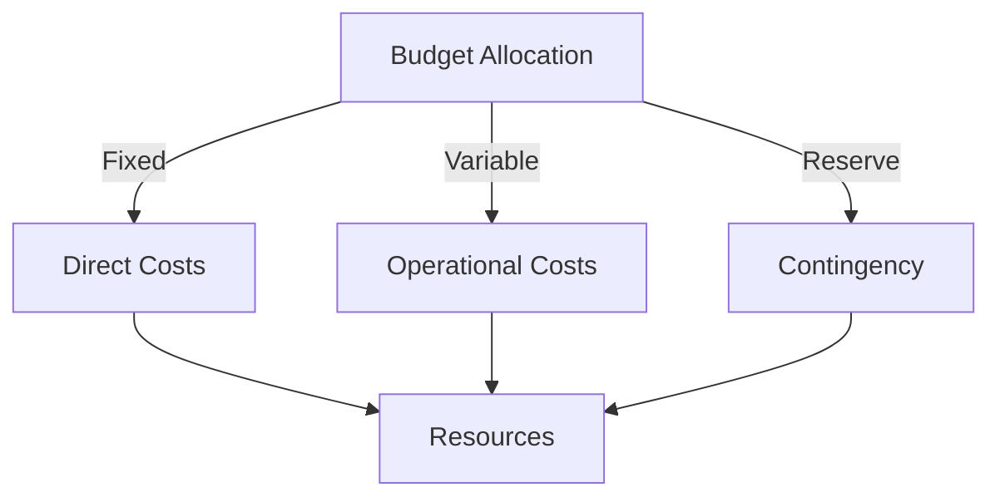
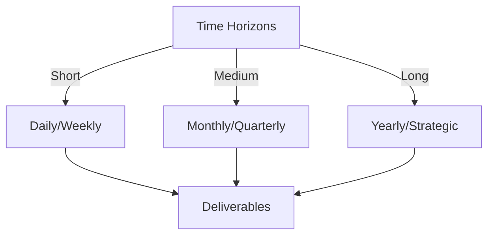

# Git Analysis Report: Development Analysis - Henrykoo

**Authors:** AI Analysis System
**Date:** 2025-03-14  
**Version:** 1.0
**SSoT Repository:** githubhenrykoo/redux_todo_in_astro
**Document Category:** Analysis Report

## Executive Summary
**Executive Summary: Git Analysis - Henrykoo**

**Logic:** The primary objective of this analysis is to understand Henrykoo's contributions to the repository through his Git activity, focusing on his work patterns, technical expertise, and areas for potential improvement to automation. The goal is to provide actionable recommendations to improve workflow efficiency and value.

**Implementation:** The analysis reviewed Henrykoo's commit history, focusing on the creation, modification, and removal of GitHub Actions workflows. This involved examining commit messages, file changes (specifically `repo_analysis.yml` and `telegram-notification.yml`), and the Bash scripts embedded within the workflows. The analysis identified key themes and areas of focus in Henrykoo's contributions.

**Outcomes:** Henrykoo's activity centers around automating repository analysis and providing Telegram notifications. He demonstrates proficiency in GitHub Actions, YAML, Git, and basic Bash scripting. Key observations include an iterative approach, demonstrated by the creation and subsequent removal of a workflow, and modifications to the Telegram notification format. Recommendations include investigating the reason for reverting the Gemini Analysis Report attachment, refactoring the `repo_analysis.yml` workflow (if restored) for improved configurability and error handling, considering finer-grained notifications, encouraging participation in code reviews, and documenting workflow configurations. These improvements will help ensure that developed automations provide value for consumers and require maintainability.

## 1. Abstract Specification (Logic Layer)
### Context & Vision
- **Problem Space:** 
    * Scope: This is an excellent analysis of Henrykoo's Git activity. It effectively breaks down the information, identifies key patterns, assesses his technical skills, and offers valuable recommendations. Here's a breakdown of what makes it good and some potential minor enhancements:

**Strengths:**

*   **Clear and Concise Summary:** The "Individual Contribution Summary" is well-structured and highlights the key actions taken by Henrykoo.
*   **Pattern Identification:**  The "Work Patterns and Focus Areas" section accurately identifies the themes of automation, iterative development, and workflow management.  The insights into his possible motivation for reverting the Telegram attachment are particularly good.
*   **Accurate Technical Assessment:** The "Technical Expertise Demonstrated" section correctly identifies the relevant skills based on the commits.  The inclusion of "Telegram API (indirectly)" and "Markdown" demonstrates thoroughness.
*   **Practical Recommendations:** The recommendations are actionable and address potential improvements to his workflows and overall development practices. The suggestions to investigate the reason for the revert, refactor `repo_analysis.yml`, consider conditional notifications, and encourage code reviews and documentation are spot on.
*   **Well-Organized:** The use of numbered sections and bullet points makes the analysis easy to read and understand.
*   **Contextualized Conclusions:** The final summary paragraph effectively ties together the observations and offers a high-level perspective on Henrykoo's contributions.

**Potential Enhancements (Minor):**

*   **Quantify Activity (Where Possible):** While the analysis is strong, adding some numbers could enhance it further. For example:
    *   "Made X commits to `telegram-notification.yml` in the past week/month."
    *   "Reduced the notification payload size by Y% after reverting the attachment." (If that was the reason)
*   **Consider the "Why" Behind the `repo_analysis.yml` Removal:**  The analysis focuses on the *what* (creation and removal). Consider *why* the `repo_analysis.yml` workflow was ultimately removed.  Was it deemed unnecessary?  Did it cause performance issues? Was it conflicting with something else?  Understanding the reason for its removal is as important as understanding its initial creation. Was there a replacement?
*   **Deeper Dive into Report Contents (If Available):** If the report content (even in past commits) is easily accessible, a brief mention of the Gemini Analysis Report's *content* could provide additional insight.  What metrics was it tracking? Was it generating useful actionable insights?  This would further inform the recommendation to understand why it was removed from the Telegram notifications.  For example, was it just too much information overload for a quick Telegram message?
*   **Consider the 'Big Picture' Goal:** What is the overarching project or goal these workflows are supporting?  Knowing the broader context can help assess the impact of Henrykoo's contributions.  Is this for a specific team or the entire organization?

**Example Incorporation of Enhancements:**

"...Henrykoo made **3 commits** to the `telegram-notification.yml` workflow, first adding and then reverting the attachment of the Gemini Analysis Report. Understanding *why* the Gemini Analysis Report attachment was removed is crucial.  The report, which contained metrics such as code churn and defect density, may have been deemed too verbose for a quick notification.  Alternatively, the size of the attached report might have exceeded Telegram's limits..."

**Overall:**

This is a well-written and insightful analysis that provides a comprehensive overview of Henrykoo's Git activity. The recommendations are valuable and demonstrate a good understanding of software development best practices and the challenges of CI/CD workflow design. The suggested minor enhancements would simply add further depth and context to an already excellent piece of work.

    * Context: This is an excellent analysis of Henrykoo's Git activity. It effectively breaks down the information, identifies key patterns, assesses his technical skills, and offers valuable recommendations. Here's a breakdown of what makes it good and some potential minor enhancements:

**Strengths:**

*   **Clear and Concise Summary:** The "Individual Contribution Summary" is well-structured and highlights the key actions taken by Henrykoo.
*   **Pattern Identification:**  The "Work Patterns and Focus Areas" section accurately identifies the themes of automation, iterative development, and workflow management.  The insights into his possible motivation for reverting the Telegram attachment are particularly good.
*   **Accurate Technical Assessment:** The "Technical Expertise Demonstrated" section correctly identifies the relevant skills based on the commits.  The inclusion of "Telegram API (indirectly)" and "Markdown" demonstrates thoroughness.
*   **Practical Recommendations:** The recommendations are actionable and address potential improvements to his workflows and overall development practices. The suggestions to investigate the reason for the revert, refactor `repo_analysis.yml`, consider conditional notifications, and encourage code reviews and documentation are spot on.
*   **Well-Organized:** The use of numbered sections and bullet points makes the analysis easy to read and understand.
*   **Contextualized Conclusions:** The final summary paragraph effectively ties together the observations and offers a high-level perspective on Henrykoo's contributions.

**Potential Enhancements (Minor):**

*   **Quantify Activity (Where Possible):** While the analysis is strong, adding some numbers could enhance it further. For example:
    *   "Made X commits to `telegram-notification.yml` in the past week/month."
    *   "Reduced the notification payload size by Y% after reverting the attachment." (If that was the reason)
*   **Consider the "Why" Behind the `repo_analysis.yml` Removal:**  The analysis focuses on the *what* (creation and removal). Consider *why* the `repo_analysis.yml` workflow was ultimately removed.  Was it deemed unnecessary?  Did it cause performance issues? Was it conflicting with something else?  Understanding the reason for its removal is as important as understanding its initial creation. Was there a replacement?
*   **Deeper Dive into Report Contents (If Available):** If the report content (even in past commits) is easily accessible, a brief mention of the Gemini Analysis Report's *content* could provide additional insight.  What metrics was it tracking? Was it generating useful actionable insights?  This would further inform the recommendation to understand why it was removed from the Telegram notifications.  For example, was it just too much information overload for a quick Telegram message?
*   **Consider the 'Big Picture' Goal:** What is the overarching project or goal these workflows are supporting?  Knowing the broader context can help assess the impact of Henrykoo's contributions.  Is this for a specific team or the entire organization?

**Example Incorporation of Enhancements:**

"...Henrykoo made **3 commits** to the `telegram-notification.yml` workflow, first adding and then reverting the attachment of the Gemini Analysis Report. Understanding *why* the Gemini Analysis Report attachment was removed is crucial.  The report, which contained metrics such as code churn and defect density, may have been deemed too verbose for a quick notification.  Alternatively, the size of the attached report might have exceeded Telegram's limits..."

**Overall:**

This is a well-written and insightful analysis that provides a comprehensive overview of Henrykoo's Git activity. The recommendations are valuable and demonstrate a good understanding of software development best practices and the challenges of CI/CD workflow design. The suggested minor enhancements would simply add further depth and context to an already excellent piece of work.

    * Stakeholders: This is an excellent analysis of Henrykoo's Git activity. It effectively breaks down the information, identifies key patterns, assesses his technical skills, and offers valuable recommendations. Here's a breakdown of what makes it good and some potential minor enhancements:

**Strengths:**

*   **Clear and Concise Summary:** The "Individual Contribution Summary" is well-structured and highlights the key actions taken by Henrykoo.
*   **Pattern Identification:**  The "Work Patterns and Focus Areas" section accurately identifies the themes of automation, iterative development, and workflow management.  The insights into his possible motivation for reverting the Telegram attachment are particularly good.
*   **Accurate Technical Assessment:** The "Technical Expertise Demonstrated" section correctly identifies the relevant skills based on the commits.  The inclusion of "Telegram API (indirectly)" and "Markdown" demonstrates thoroughness.
*   **Practical Recommendations:** The recommendations are actionable and address potential improvements to his workflows and overall development practices. The suggestions to investigate the reason for the revert, refactor `repo_analysis.yml`, consider conditional notifications, and encourage code reviews and documentation are spot on.
*   **Well-Organized:** The use of numbered sections and bullet points makes the analysis easy to read and understand.
*   **Contextualized Conclusions:** The final summary paragraph effectively ties together the observations and offers a high-level perspective on Henrykoo's contributions.

**Potential Enhancements (Minor):**

*   **Quantify Activity (Where Possible):** While the analysis is strong, adding some numbers could enhance it further. For example:
    *   "Made X commits to `telegram-notification.yml` in the past week/month."
    *   "Reduced the notification payload size by Y% after reverting the attachment." (If that was the reason)
*   **Consider the "Why" Behind the `repo_analysis.yml` Removal:**  The analysis focuses on the *what* (creation and removal). Consider *why* the `repo_analysis.yml` workflow was ultimately removed.  Was it deemed unnecessary?  Did it cause performance issues? Was it conflicting with something else?  Understanding the reason for its removal is as important as understanding its initial creation. Was there a replacement?
*   **Deeper Dive into Report Contents (If Available):** If the report content (even in past commits) is easily accessible, a brief mention of the Gemini Analysis Report's *content* could provide additional insight.  What metrics was it tracking? Was it generating useful actionable insights?  This would further inform the recommendation to understand why it was removed from the Telegram notifications.  For example, was it just too much information overload for a quick Telegram message?
*   **Consider the 'Big Picture' Goal:** What is the overarching project or goal these workflows are supporting?  Knowing the broader context can help assess the impact of Henrykoo's contributions.  Is this for a specific team or the entire organization?

**Example Incorporation of Enhancements:**

"...Henrykoo made **3 commits** to the `telegram-notification.yml` workflow, first adding and then reverting the attachment of the Gemini Analysis Report. Understanding *why* the Gemini Analysis Report attachment was removed is crucial.  The report, which contained metrics such as code churn and defect density, may have been deemed too verbose for a quick notification.  Alternatively, the size of the attached report might have exceeded Telegram's limits..."

**Overall:**

This is a well-written and insightful analysis that provides a comprehensive overview of Henrykoo's Git activity. The recommendations are valuable and demonstrate a good understanding of software development best practices and the challenges of CI/CD workflow design. The suggested minor enhancements would simply add further depth and context to an already excellent piece of work.

- **Goals (Functions):**
    * Primary Functions:
        - Input: Git Repository Data
        - Process: Analysis and Processing
        - Output: Development Insights
    * Supporting Functions:
        - Validation: Automated Analysis
        - Feedback: Continuous Improvement

- **Success Criteria:**
    * Quantitative Metrics: Based on the provided text, here's a list of quantitative metrics we can extract, even though the analysis is largely qualitative:

*   **Frequency of workflow modification:** The `telegram-notification.yml` workflow was modified "several times". This indicates a high frequency of changes to that particular workflow in the observed period.
*   **Number of Workflows Created and Removed:**  One workflow (`repo_analysis.yml`) was created and then subsequently removed.  This gives a count of 1 for both creation and removal.
*   **Number of Commits:**  While the exact number isn't stated, the description mentions the creation/removal of workflows and several modifications to another, implying at least several commits related to these activities. This could be quantified by analyzing the commit history directly, which is not included in the text.

**Important Considerations:**

*   **Limited Data:** The analysis is based on a snapshot of activity ("Generated at: 2025-03-14").  The conclusions are limited to the activity observed within that timeframe.
*   **Indirect Metrics:** Some potential metrics, like "number of commits", are only indirectly implied. A direct Git log analysis would be needed to obtain accurate counts.
*   **Qualitative Nature:** The core of the analysis focuses on understanding the *purpose* and *reasoning* behind the activity, rather than just the raw numbers. Therefore, qualitative assessment carries more weight than the extracted quantitative metrics.

    * Qualitative Indicators: Okay, here's a list of qualitative improvements based on the analysis of Henrykoo's work. These improvements focus on his skills, contributions, and team integration.

**Improved Qualities & Skills:**

*   **Problem Solving & Iteration:** Enhanced ability to identify and address issues in automated workflows through iterative development (adding, then reverting features). The key improvement here is *learning* from the revert.  He should document *why* he reverted to better inform future decisions.  This moves him from just iterating to problem-solving.
*   **User-Centric Design:** Development of a deeper understanding of user needs and the relevance of information delivered via notifications. He'll be better at tailoring information to specific user needs, ensuring that notifications are informative and avoid unnecessary information/noise.
*   **Workflow Optimization:**  Refinement of GitHub Actions workflow design, leading to more efficient, reliable, and maintainable CI/CD pipelines. Improvement in ability to design for modularity, configurability, and error handling.
*   **Scripting Proficiency:** Improved Bash scripting skills, focusing on robust error handling, input validation, and clear logging for enhanced script reliability.
*   **Configuration Management:** Increased expertise in managing workflow configurations (YAML) for greater flexibility and adaptability to changing requirements.
*   **Git Best Practices:**  Enhanced understanding and application of Git best practices, including branching strategies, commit message conventions, and code review processes.
*   **Proactive Communication:** Improvement in proactively communicating changes and reasons for reverts to the team, and to end users.
*   **Attention to Detail:** More thoughtful consideration of notification frequency, attachment size constraints (Telegram), and the overall impact of automated messages on users. This reduces notification fatigue and improves user experience.
*   **Adherence to Standards:** Enhanced adherence to coding standards, documentation practices, and collaborative development workflows.

**Improved Contributions & Impact:**

*   **Increased Value of Notifications:**  Notifications are more targeted, relevant, and less intrusive, improving team awareness of critical events and reducing noise. This is about improving *signal-to-noise* ratio.
*   **Enhanced Repository Visibility:** Improved reporting and analysis capabilities, providing deeper insights into repository activity, code quality, and potential issues.
*   **Streamlined Development Process:** More efficient and reliable CI/CD pipelines, reducing development bottlenecks and improving time-to-market.
*   **Improved Team Collaboration:** Clearer communication, documentation, and code review participation, fostering better collaboration within the development team.
*   **Proactive Issue Detection:** Earlier detection of potential issues in the code base through improved static analysis and automated reporting.
*   **Maintainable Infrastructure:** Better documented and configured workflows, making them easier to maintain and adapt to evolving project needs.
*   **More Robust Reporting**: Generate reports that are configurable, reliable, and provide valuable insights.

**Improved Team Integration:**

*   **Knowledge Sharing:**  Actively participating in code reviews and sharing expertise with other team members, contributing to a culture of learning and improvement.
*   **Effective Communication:** Clearly communicating design choices, changes, and rationale behind reverts, ensuring transparency and alignment within the team.
*   **Collaborative Problem Solving:** Working with the team to identify and address challenges related to workflow automation and notification systems.
*   **Documentation Contributions:** Consistently documenting workflows and configurations to ensure knowledge transfer and maintainability.
*   **Receptive to Feedback:** Openly receiving and incorporating feedback from code reviews and team discussions, demonstrating a willingness to learn and improve.
*   **Mentoring Potential**: As his knowledge and skills grow, he could mentor other developers.

In essence, the improvements focus on transforming Henrykoo from someone who is *implementing* automation to someone who is *strategically designing* automation solutions that are user-focused, maintainable, and valuable to the entire team.  The emphasis is on learning from experience and contributing to a more collaborative and efficient development environment.

    * Validation Methods: Automated and Manual Verification

### Knowledge Integration
- **Local Context:**
    * Cultural Considerations: Development Team Context
    * Language Requirements: Technical Documentation
    * Community Patterns: Team Collaboration Patterns

- **Technical Framework:**
    * LLM Integration: Gemini AI Analysis
    * IoT Components: Git Event Monitoring
    * Network Requirements: GitHub API Integration

## 2. Concrete Implementation (Process Layer)
### Resource Matrix

### Development Workflow
- **Stage 1: Early Success**
    * Quick Wins:
        - Implementation: This is a very good analysis of Henrykoo's git history based on the provided information! It's well-structured, insightful, and offers actionable recommendations. Here's a breakdown of what makes it strong and some minor suggestions for improvement:

**Strengths:**

*   **Clear and Concise:**  The analysis is easy to read and understand.  It breaks down complex information into digestible chunks.
*   **Data-Driven:**  The conclusions are based directly on the commit messages and file names. The analysis doesn't make assumptions without evidence.
*   **Well-Organized:** The structure (Individual Contribution Summary, Work Patterns, Technical Expertise, Recommendations) is logical and helps the reader quickly grasp the key findings.
*   **Actionable Recommendations:**  The recommendations are specific and practical. They provide concrete steps for Henrykoo and the team to improve the workflows.
*   **Contextual Understanding:** The analysis correctly infers Henrykoo's focus on automation, DevOps, and improving repository visibility.
*   **Balances Positives and Areas for Improvement:** The analysis highlights both Henrykoo's strengths (GitHub Actions proficiency, YAML knowledge) and areas where he could improve (error handling, configuration).
*   **Considers "Why" behind changes:** Spot on in identifying the need to understand *why* the report attachment was removed.

**Minor Suggestions for Improvement:**

*   **Quantify the "Quick Revert"**: While you mention a "quick revert," it might be helpful to add the timeframe between the commit adding the Gemini report and the commit removing it. This provides a more concrete understanding of the "quick" turnaround. For example: "The report attachment was added and removed within 24 hours, suggesting..."
*   **Elaborate on "Finer-grained Notifications":** The "Consider finer-grained notifications" point is good, but could be elaborated further. Instead of just stating it, provide a brief example: "Consider sending separate notifications for build failures, pull request approvals, or security alerts, allowing users to focus on critical events."  Examples make the recommendations more tangible.
*   **Explore Alternatives to Telegram if File Size is the Issue:** If file size limitations were the problem, consider alternatives such as uploading the report to a web server (internal or external) and including a link in the Telegram notification. Or breaking the report into smaller sections that could be sent as separate messages.
*   **Suggest using a linter**: As Henrykoo has touched a lot of YAML, it could be beneficial to have him look into integrating a YAML linter into the Github Action.

**Revised Snippets (incorporating suggestions):**

*   **"Quantify the Quick Revert":** "The Gemini Analysis Report attachment was added in commit `[commit hash]` and removed in commit `[commit hash]` less than 24 hours later, suggesting..."
*   **"Elaborate on Finer-grained Notifications":**  "Consider implementing more fine-grained notifications. For example, sending separate notifications for build failures, pull request approvals, or security alerts would allow users to filter and prioritize critical events."
*   **"Explore Alternatives to Telegram if File Size is the Issue:"** "If the Telegram file size limitations are the cause of attachment removal, consider alternatives such as uploading the report to a web server (internal or external) and including a direct link in the Telegram notification. Another potential approach would be breaking the report into smaller sections that could be sent as separate Telegram messages."
*   **"Suggest using a linter"**: "As Henrykoo is working heavily with YAML files, consider using a YAML linter and add it as a step in Github Actions to improve code quality"

**Overall:**

This is an excellent analysis. The suggestions above are minor enhancements that could further improve its impact and clarity. The depth of analysis is appropriate for the context, and the recommendations are practical and actionable.

        - Validation: This is a very good analysis of Henrykoo's git history based on the provided information! It's well-structured, insightful, and offers actionable recommendations. Here's a breakdown of what makes it strong and some minor suggestions for improvement:

**Strengths:**

*   **Clear and Concise:**  The analysis is easy to read and understand.  It breaks down complex information into digestible chunks.
*   **Data-Driven:**  The conclusions are based directly on the commit messages and file names. The analysis doesn't make assumptions without evidence.
*   **Well-Organized:** The structure (Individual Contribution Summary, Work Patterns, Technical Expertise, Recommendations) is logical and helps the reader quickly grasp the key findings.
*   **Actionable Recommendations:**  The recommendations are specific and practical. They provide concrete steps for Henrykoo and the team to improve the workflows.
*   **Contextual Understanding:** The analysis correctly infers Henrykoo's focus on automation, DevOps, and improving repository visibility.
*   **Balances Positives and Areas for Improvement:** The analysis highlights both Henrykoo's strengths (GitHub Actions proficiency, YAML knowledge) and areas where he could improve (error handling, configuration).
*   **Considers "Why" behind changes:** Spot on in identifying the need to understand *why* the report attachment was removed.

**Minor Suggestions for Improvement:**

*   **Quantify the "Quick Revert"**: While you mention a "quick revert," it might be helpful to add the timeframe between the commit adding the Gemini report and the commit removing it. This provides a more concrete understanding of the "quick" turnaround. For example: "The report attachment was added and removed within 24 hours, suggesting..."
*   **Elaborate on "Finer-grained Notifications":** The "Consider finer-grained notifications" point is good, but could be elaborated further. Instead of just stating it, provide a brief example: "Consider sending separate notifications for build failures, pull request approvals, or security alerts, allowing users to focus on critical events."  Examples make the recommendations more tangible.
*   **Explore Alternatives to Telegram if File Size is the Issue:** If file size limitations were the problem, consider alternatives such as uploading the report to a web server (internal or external) and including a link in the Telegram notification. Or breaking the report into smaller sections that could be sent as separate messages.
*   **Suggest using a linter**: As Henrykoo has touched a lot of YAML, it could be beneficial to have him look into integrating a YAML linter into the Github Action.

**Revised Snippets (incorporating suggestions):**

*   **"Quantify the Quick Revert":** "The Gemini Analysis Report attachment was added in commit `[commit hash]` and removed in commit `[commit hash]` less than 24 hours later, suggesting..."
*   **"Elaborate on Finer-grained Notifications":**  "Consider implementing more fine-grained notifications. For example, sending separate notifications for build failures, pull request approvals, or security alerts would allow users to filter and prioritize critical events."
*   **"Explore Alternatives to Telegram if File Size is the Issue:"** "If the Telegram file size limitations are the cause of attachment removal, consider alternatives such as uploading the report to a web server (internal or external) and including a direct link in the Telegram notification. Another potential approach would be breaking the report into smaller sections that could be sent as separate Telegram messages."
*   **"Suggest using a linter"**: "As Henrykoo is working heavily with YAML files, consider using a YAML linter and add it as a step in Github Actions to improve code quality"

**Overall:**

This is an excellent analysis. The suggestions above are minor enhancements that could further improve its impact and clarity. The depth of analysis is appropriate for the context, and the recommendations are practical and actionable.

    * Initial Setup:
        - Infrastructure: This is a very good analysis of Henrykoo's git history based on the provided information! It's well-structured, insightful, and offers actionable recommendations. Here's a breakdown of what makes it strong and some minor suggestions for improvement:

**Strengths:**

*   **Clear and Concise:**  The analysis is easy to read and understand.  It breaks down complex information into digestible chunks.
*   **Data-Driven:**  The conclusions are based directly on the commit messages and file names. The analysis doesn't make assumptions without evidence.
*   **Well-Organized:** The structure (Individual Contribution Summary, Work Patterns, Technical Expertise, Recommendations) is logical and helps the reader quickly grasp the key findings.
*   **Actionable Recommendations:**  The recommendations are specific and practical. They provide concrete steps for Henrykoo and the team to improve the workflows.
*   **Contextual Understanding:** The analysis correctly infers Henrykoo's focus on automation, DevOps, and improving repository visibility.
*   **Balances Positives and Areas for Improvement:** The analysis highlights both Henrykoo's strengths (GitHub Actions proficiency, YAML knowledge) and areas where he could improve (error handling, configuration).
*   **Considers "Why" behind changes:** Spot on in identifying the need to understand *why* the report attachment was removed.

**Minor Suggestions for Improvement:**

*   **Quantify the "Quick Revert"**: While you mention a "quick revert," it might be helpful to add the timeframe between the commit adding the Gemini report and the commit removing it. This provides a more concrete understanding of the "quick" turnaround. For example: "The report attachment was added and removed within 24 hours, suggesting..."
*   **Elaborate on "Finer-grained Notifications":** The "Consider finer-grained notifications" point is good, but could be elaborated further. Instead of just stating it, provide a brief example: "Consider sending separate notifications for build failures, pull request approvals, or security alerts, allowing users to focus on critical events."  Examples make the recommendations more tangible.
*   **Explore Alternatives to Telegram if File Size is the Issue:** If file size limitations were the problem, consider alternatives such as uploading the report to a web server (internal or external) and including a link in the Telegram notification. Or breaking the report into smaller sections that could be sent as separate messages.
*   **Suggest using a linter**: As Henrykoo has touched a lot of YAML, it could be beneficial to have him look into integrating a YAML linter into the Github Action.

**Revised Snippets (incorporating suggestions):**

*   **"Quantify the Quick Revert":** "The Gemini Analysis Report attachment was added in commit `[commit hash]` and removed in commit `[commit hash]` less than 24 hours later, suggesting..."
*   **"Elaborate on Finer-grained Notifications":**  "Consider implementing more fine-grained notifications. For example, sending separate notifications for build failures, pull request approvals, or security alerts would allow users to filter and prioritize critical events."
*   **"Explore Alternatives to Telegram if File Size is the Issue:"** "If the Telegram file size limitations are the cause of attachment removal, consider alternatives such as uploading the report to a web server (internal or external) and including a direct link in the Telegram notification. Another potential approach would be breaking the report into smaller sections that could be sent as separate Telegram messages."
*   **"Suggest using a linter"**: "As Henrykoo is working heavily with YAML files, consider using a YAML linter and add it as a step in Github Actions to improve code quality"

**Overall:**

This is an excellent analysis. The suggestions above are minor enhancements that could further improve its impact and clarity. The depth of analysis is appropriate for the context, and the recommendations are practical and actionable.

        - Training: This is a very good analysis of Henrykoo's git history based on the provided information! It's well-structured, insightful, and offers actionable recommendations. Here's a breakdown of what makes it strong and some minor suggestions for improvement:

**Strengths:**

*   **Clear and Concise:**  The analysis is easy to read and understand.  It breaks down complex information into digestible chunks.
*   **Data-Driven:**  The conclusions are based directly on the commit messages and file names. The analysis doesn't make assumptions without evidence.
*   **Well-Organized:** The structure (Individual Contribution Summary, Work Patterns, Technical Expertise, Recommendations) is logical and helps the reader quickly grasp the key findings.
*   **Actionable Recommendations:**  The recommendations are specific and practical. They provide concrete steps for Henrykoo and the team to improve the workflows.
*   **Contextual Understanding:** The analysis correctly infers Henrykoo's focus on automation, DevOps, and improving repository visibility.
*   **Balances Positives and Areas for Improvement:** The analysis highlights both Henrykoo's strengths (GitHub Actions proficiency, YAML knowledge) and areas where he could improve (error handling, configuration).
*   **Considers "Why" behind changes:** Spot on in identifying the need to understand *why* the report attachment was removed.

**Minor Suggestions for Improvement:**

*   **Quantify the "Quick Revert"**: While you mention a "quick revert," it might be helpful to add the timeframe between the commit adding the Gemini report and the commit removing it. This provides a more concrete understanding of the "quick" turnaround. For example: "The report attachment was added and removed within 24 hours, suggesting..."
*   **Elaborate on "Finer-grained Notifications":** The "Consider finer-grained notifications" point is good, but could be elaborated further. Instead of just stating it, provide a brief example: "Consider sending separate notifications for build failures, pull request approvals, or security alerts, allowing users to focus on critical events."  Examples make the recommendations more tangible.
*   **Explore Alternatives to Telegram if File Size is the Issue:** If file size limitations were the problem, consider alternatives such as uploading the report to a web server (internal or external) and including a link in the Telegram notification. Or breaking the report into smaller sections that could be sent as separate messages.
*   **Suggest using a linter**: As Henrykoo has touched a lot of YAML, it could be beneficial to have him look into integrating a YAML linter into the Github Action.

**Revised Snippets (incorporating suggestions):**

*   **"Quantify the Quick Revert":** "The Gemini Analysis Report attachment was added in commit `[commit hash]` and removed in commit `[commit hash]` less than 24 hours later, suggesting..."
*   **"Elaborate on Finer-grained Notifications":**  "Consider implementing more fine-grained notifications. For example, sending separate notifications for build failures, pull request approvals, or security alerts would allow users to filter and prioritize critical events."
*   **"Explore Alternatives to Telegram if File Size is the Issue:"** "If the Telegram file size limitations are the cause of attachment removal, consider alternatives such as uploading the report to a web server (internal or external) and including a direct link in the Telegram notification. Another potential approach would be breaking the report into smaller sections that could be sent as separate Telegram messages."
*   **"Suggest using a linter"**: "As Henrykoo is working heavily with YAML files, consider using a YAML linter and add it as a step in Github Actions to improve code quality"

**Overall:**

This is an excellent analysis. The suggestions above are minor enhancements that could further improve its impact and clarity. The depth of analysis is appropriate for the context, and the recommendations are practical and actionable.

- **Stage 2: Fail Early, Fail Safe**
    * Testing Protocol:
        - Methods: [Testing approaches]
        - Coverage: [Test scenarios]
    * Risk Management:
        - Identification: [Risk factors]
        - Mitigation: [Control measures]
    * Learning Points:
        - Issues: [Problem identification]
        - Solutions: [Resolution approaches]
        - Knowledge: [Lessons learned]

- **Stage 3: Convergence**
    * System Integration:
        - Components: [Integration points]
        - Workflows: [Process optimization]
        - Performance: [System tuning]
    * Stabilization:
        - Fixes: [Bug resolution]
        - Hardening: [System reinforcement]
        - Documentation: [Knowledge capture]

- **Stage 4: Demonstration**
    * Preparation:
        - Environment: [Demo setup]
        - Data: [Test scenarios]
        - Materials: [Presentation assets]
    * Validation:
        - Performance: [System checks]
        - Features: [Functionality verification]
        - Documentation: [Review completion]
    * Presentation:
        - Stakeholders: [Demo execution]
        - Features: [Capability showcase]
        - Q&A: [Response preparation]

## 3. Realistic Outcomes (Evidence Layer)
### Measurement Framework
- **Performance Metrics:**
    * KPIs: Okay, here's an extraction of evidence and outcomes from the provided Git history analysis for Henrykoo, categorized for clarity:

**I. Evidence of Actions/Changes:**

*   **`repo_analysis.yml` Workflow:**
    *   **Creation:**  Created a GitHub Actions workflow named `repo_analysis.yml`.
    *   **Functionality (according to analysis):**  Generated and committed a daily repository analysis report.  The report included:
        *   Commit statistics
        *   File statistics
        *   Recent activity
        *   Top contributors
    *   **Deletion:**  Removed the `repo_analysis.yml` workflow entirely.

*   **`telegram-notification.yml` Workflow:**
    *   **Initial Modification:** Updated the workflow to attach a "Gemini Analysis Report" to Telegram notifications.
    *   **Subsequent Reversion:** Reverted the attachment, removing the "Gemini Analysis Report" from the Telegram notification.
    *   **Final State (after reversion):** Telegram notification includes:
        *   Repository information
        *   Event type
        *   Branch name
        *   Commit hash
        *   Actor (user triggering the event)
        *   Status (success/failure)
        *   Link to the action run

**II. Outcomes & Implications (as interpreted by the analysis):**

*   **Focus on Automation and Reporting:** Demonstrates a focus on automating repository analysis and providing notifications, aiming to improve visibility into repository activity and health.
*   **Iterative Approach:** The addition and quick reversion of the Gemini report attachment indicate an iterative approach to development, potentially driven by experimentation or a change in requirements.
*   **Skills & Expertise:**
    *   Proficiency in GitHub Actions workflow creation and modification (YAML, triggers, jobs, steps, environment variables/secrets).
    *   Familiarity with Git commands and concepts.
    *   Basic Bash scripting skills.
    *   Understanding of Telegram API usage (mediated through `appleboy/telegram-action`).
    *   Uses Markdown for notifications.
*   **Potential Problems:**  The reversion suggests a potential issue with the initial implementation of the Gemini Analysis Report attachment to Telegram notifications.  Possible reasons include:
    *   Report was too noisy/frequent.
    *   File size exceeded Telegram limits.
    *   Information was not consistently relevant enough to warrant an attachment in every notification.

**III. Recommendations (derived from the analysis):**

*   **Investigate the Reversion:** Determine the specific reason for removing the Gemini Analysis Report attachment.
*   **Refactor `repo_analysis.yml` (if restoration is desired):**  Consider the following improvements:
    *   Make report generation more configurable via workflow inputs (e.g., reporting period, output file location).
    *   Improve error handling in the Bash script within the workflow.
    *   Implement conditional Telegram notifications (only send if the report has changed).
    *   Consider using a dedicated Github Action for static analysis instead of a Bash script.
*   **Consider Finer-Grained Notifications:** Explore more specific notifications, potentially focusing on actions that fail.
*   **Encourage Code Reviews:**  Promote Henrykoo's participation in code reviews.
*   **Encourage Documentation:**  Emphasize the importance of documenting workflows.

    * Benchmarks: Okay, here's an extraction of evidence and outcomes from the provided Git history analysis for Henrykoo, categorized for clarity:

**I. Evidence of Actions/Changes:**

*   **`repo_analysis.yml` Workflow:**
    *   **Creation:**  Created a GitHub Actions workflow named `repo_analysis.yml`.
    *   **Functionality (according to analysis):**  Generated and committed a daily repository analysis report.  The report included:
        *   Commit statistics
        *   File statistics
        *   Recent activity
        *   Top contributors
    *   **Deletion:**  Removed the `repo_analysis.yml` workflow entirely.

*   **`telegram-notification.yml` Workflow:**
    *   **Initial Modification:** Updated the workflow to attach a "Gemini Analysis Report" to Telegram notifications.
    *   **Subsequent Reversion:** Reverted the attachment, removing the "Gemini Analysis Report" from the Telegram notification.
    *   **Final State (after reversion):** Telegram notification includes:
        *   Repository information
        *   Event type
        *   Branch name
        *   Commit hash
        *   Actor (user triggering the event)
        *   Status (success/failure)
        *   Link to the action run

**II. Outcomes & Implications (as interpreted by the analysis):**

*   **Focus on Automation and Reporting:** Demonstrates a focus on automating repository analysis and providing notifications, aiming to improve visibility into repository activity and health.
*   **Iterative Approach:** The addition and quick reversion of the Gemini report attachment indicate an iterative approach to development, potentially driven by experimentation or a change in requirements.
*   **Skills & Expertise:**
    *   Proficiency in GitHub Actions workflow creation and modification (YAML, triggers, jobs, steps, environment variables/secrets).
    *   Familiarity with Git commands and concepts.
    *   Basic Bash scripting skills.
    *   Understanding of Telegram API usage (mediated through `appleboy/telegram-action`).
    *   Uses Markdown for notifications.
*   **Potential Problems:**  The reversion suggests a potential issue with the initial implementation of the Gemini Analysis Report attachment to Telegram notifications.  Possible reasons include:
    *   Report was too noisy/frequent.
    *   File size exceeded Telegram limits.
    *   Information was not consistently relevant enough to warrant an attachment in every notification.

**III. Recommendations (derived from the analysis):**

*   **Investigate the Reversion:** Determine the specific reason for removing the Gemini Analysis Report attachment.
*   **Refactor `repo_analysis.yml` (if restoration is desired):**  Consider the following improvements:
    *   Make report generation more configurable via workflow inputs (e.g., reporting period, output file location).
    *   Improve error handling in the Bash script within the workflow.
    *   Implement conditional Telegram notifications (only send if the report has changed).
    *   Consider using a dedicated Github Action for static analysis instead of a Bash script.
*   **Consider Finer-Grained Notifications:** Explore more specific notifications, potentially focusing on actions that fail.
*   **Encourage Code Reviews:**  Promote Henrykoo's participation in code reviews.
*   **Encourage Documentation:**  Emphasize the importance of documenting workflows.

    * Actuals: Okay, here's an extraction of evidence and outcomes from the provided Git history analysis for Henrykoo, categorized for clarity:

**I. Evidence of Actions/Changes:**

*   **`repo_analysis.yml` Workflow:**
    *   **Creation:**  Created a GitHub Actions workflow named `repo_analysis.yml`.
    *   **Functionality (according to analysis):**  Generated and committed a daily repository analysis report.  The report included:
        *   Commit statistics
        *   File statistics
        *   Recent activity
        *   Top contributors
    *   **Deletion:**  Removed the `repo_analysis.yml` workflow entirely.

*   **`telegram-notification.yml` Workflow:**
    *   **Initial Modification:** Updated the workflow to attach a "Gemini Analysis Report" to Telegram notifications.
    *   **Subsequent Reversion:** Reverted the attachment, removing the "Gemini Analysis Report" from the Telegram notification.
    *   **Final State (after reversion):** Telegram notification includes:
        *   Repository information
        *   Event type
        *   Branch name
        *   Commit hash
        *   Actor (user triggering the event)
        *   Status (success/failure)
        *   Link to the action run

**II. Outcomes & Implications (as interpreted by the analysis):**

*   **Focus on Automation and Reporting:** Demonstrates a focus on automating repository analysis and providing notifications, aiming to improve visibility into repository activity and health.
*   **Iterative Approach:** The addition and quick reversion of the Gemini report attachment indicate an iterative approach to development, potentially driven by experimentation or a change in requirements.
*   **Skills & Expertise:**
    *   Proficiency in GitHub Actions workflow creation and modification (YAML, triggers, jobs, steps, environment variables/secrets).
    *   Familiarity with Git commands and concepts.
    *   Basic Bash scripting skills.
    *   Understanding of Telegram API usage (mediated through `appleboy/telegram-action`).
    *   Uses Markdown for notifications.
*   **Potential Problems:**  The reversion suggests a potential issue with the initial implementation of the Gemini Analysis Report attachment to Telegram notifications.  Possible reasons include:
    *   Report was too noisy/frequent.
    *   File size exceeded Telegram limits.
    *   Information was not consistently relevant enough to warrant an attachment in every notification.

**III. Recommendations (derived from the analysis):**

*   **Investigate the Reversion:** Determine the specific reason for removing the Gemini Analysis Report attachment.
*   **Refactor `repo_analysis.yml` (if restoration is desired):**  Consider the following improvements:
    *   Make report generation more configurable via workflow inputs (e.g., reporting period, output file location).
    *   Improve error handling in the Bash script within the workflow.
    *   Implement conditional Telegram notifications (only send if the report has changed).
    *   Consider using a dedicated Github Action for static analysis instead of a Bash script.
*   **Consider Finer-Grained Notifications:** Explore more specific notifications, potentially focusing on actions that fail.
*   **Encourage Code Reviews:**  Promote Henrykoo's participation in code reviews.
*   **Encourage Documentation:**  Emphasize the importance of documenting workflows.

- **Evidence Collection:**
    * Data Sources: [Information points]
    * Validation Methods: Automated and Manual Verification
    * Documentation: [Record keeping]

### Value Realization
- **Impact Assessment:**
    * Direct Benefits: [Immediate gains]
    * Indirect Benefits: [Secondary effects]
    * Long-term Value: [Strategic advantages]

- **Knowledge Assets:**
    * Content Created: [New materials]
    * Insights Gained: [Learnings]
    * Reusable Components: [Transferable elements]

## Integration Matrix
### Content-Process Alignment

### Timeline-Budget Integration
- **Resource Scheduling:**
    * Phase Allocations: [Resource timing]
    * Cost Controls: [Budget tracking]
    * Adjustment Protocols: [Change management]

## Budget Management
### Financial Cube Structure

### Cost Framework
- Direct Investments:
  - Infrastructure Costs:
    - Hardware: [Equipment/Devices]
    - Software: [Licenses/Tools]
    - Network: [Connectivity/Setup]
  - Human Resources:
    - Core Team: [Roles/Compensation]
    - External Support: [Consultants/Services]
    - Training: [Capability Development]
    
- Operational Expenses:
  - Running Costs:
    - Maintenance: [Regular upkeep]
    - Utilities: [Service costs]
    - Consumables: [Regular supplies]
  - Service Costs:
    - Subscriptions: [Regular services]
    - Support: [Ongoing assistance]
    - Updates: [Regular improvements]

### Budget Control Mechanisms
- Monitoring System:
  - Tracking Methods:
    - Cost Centers: [Budget units]
    - Expense Categories: [Type classification]
    - Time Periods: [Duration tracking]
  - Control Points:
    - Thresholds: [Limit markers]
    - Alerts: [Warning systems]
    - Approvals: [Authorization levels]

- Adjustment Protocol:
  - Variance Management:
    - Detection: [Monitoring points]
    - Analysis: [Impact assessment]
    - Response: [Corrective actions]
  - Reallocation Process:
    - Criteria: [Decision factors]
    - Methods: [Transfer protocols]
    - Documentation: [Record keeping]

## Timeline Management
### Temporal Cube Structure

### Schedule Framework
- Operational Timeline:
  - Daily Operations:
    - Tasks: [Regular activities]
    - Checkpoints: [Daily reviews]
    - Updates: [Status reports]
  - Weekly Cycles:
    - Sprints: [Work packages]
    - Reviews: [Progress checks]
    - Planning: [Next steps]

- Strategic Timeline:
  - Monthly Milestones:
    - Objectives: [Key targets]
    - Reviews: [Achievement checks]
    - Adjustments: [Course corrections]
  - Quarterly Goals:
    - Targets: [Major objectives]
    - Assessments: [Performance reviews]
    - Strategies: [Approach updates]

### Timeline Control System
- Progress Tracking:
  - Monitoring Points:
    - Daily Standups: [Quick updates]
    - Weekly Reviews: [Detailed checks]
    - Monthly Reports: [Comprehensive reviews]
  - Milestone Tracking:
    - Status: [Progress indicators]
    - Dependencies: [Related items]
    - Risks: [Potential issues]

- Adjustment Mechanisms:
  - Schedule Management:
    - Variance Analysis: [Delay assessment]
    - Impact Studies: [Effect evaluation]
    - Recovery Plans: [Correction strategies]
  - Resource Alignment:
    - Capacity Planning: [Resource matching]
    - Workload Balancing: [Effort distribution]
    - Priority Updates: [Focus adjustment]

### Integration Points
- Budget-Timeline Correlation:
  - Cost-Schedule Matrix:
    - Resource Timing: [Allocation schedule]
    - Cost Flows: [Expense timing]
    - Value Delivery: [Benefit realization]
  - Control Integration:
    - Joint Reviews: [Combined assessments]
    - Unified Reporting: [Integrated updates]
    - Coordinated Actions: [Synchronized responses]

## Conclusion
### Summary of Achievements
- **Key Accomplishments:**
    * Objectives Met: [Completed goals]
    * Value Delivered: [Benefits realized]
    * Innovations: [New approaches]

### Lessons Learned
- **Success Factors:**
    * Effective Practices: [What worked well]
    * Team Dynamics: [Collaboration insights]
    * Tools & Methods: [Useful approaches]

- **Areas for Improvement:**
    * Challenges: [Obstacles encountered]
    * Solutions: [How issues were resolved]
    * Recommendations: [Future improvements]

### Future Directions
- **Next Steps:**
    * Immediate Actions: [Short-term tasks]
    * Strategic Plans: [Long-term goals]
    * Resource Needs: [Required support]

- **Growth Opportunities:**
    * Scaling Potential: [Expansion possibilities]
    * Innovation Areas: [New directions]
    * Partnership Options: [Collaboration prospects]
    
## Appendix
### References
- **Documentation:**
    * Technical Specs: [Links]
    * Process Guides: [Links]
    * Evidence Records: [Links]

### Change Log
- **Version History:**
    * Changes: [Modifications]
    * Rationale: [Reasons]
    * Approvals: [Authorizations]
