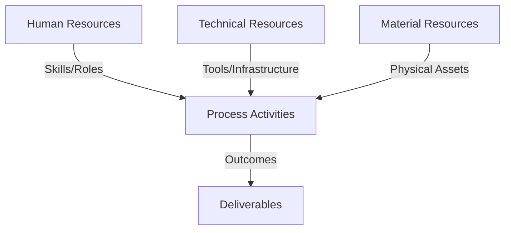
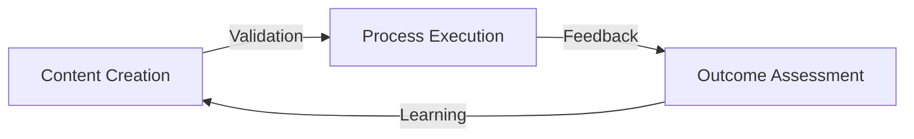
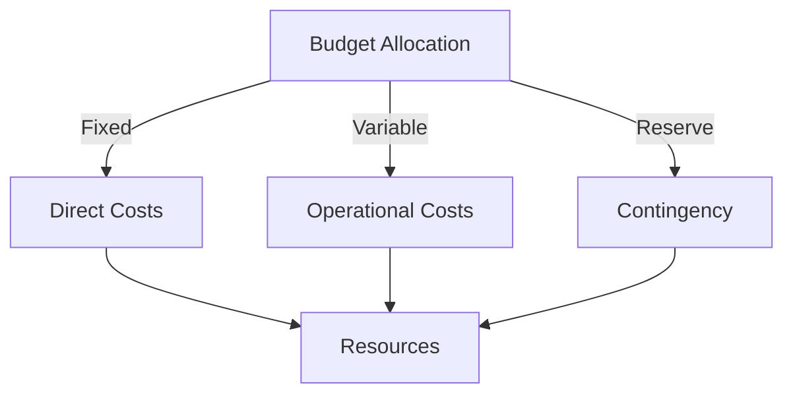
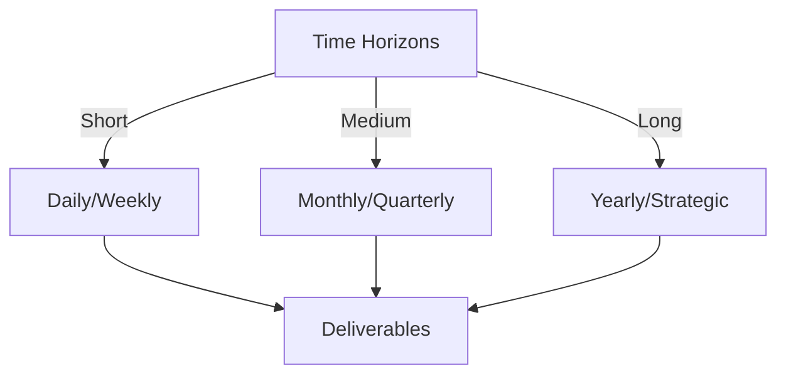

# Git Analysis Report: Development Analysis - Henrykoo

**Authors:** AI Analysis System
**Date:** 2025-03-18  
**Version:** 1.0
**SSoT Repository:** githubhenrykoo/redux_todo_in_astro
**Document Category:** Analysis Report

## Executive Summary
## Executive Summary: Git Analysis - Henrykoo

**Logic:** The purpose of this analysis is to evaluate Henrykoo's contributions to the repository, focusing on his work patterns, technical skills, and areas for improvement within the context of Git activity and GitHub Actions. The objective is to provide actionable insights for optimizing his workflow and enhancing the repository's automation processes.

**Implementation:** The analysis was conducted by examining Henrykoo's commit history, specifically focusing on changes to YAML workflow files within the `.github/workflows` directory. Key aspects reviewed included the creation and modification of workflows for repository analysis and Telegram notifications, as well as the subsequent removal and reversion of certain features.  The commit messages provide context for the changes.

**Outcomes:** Henrykoo demonstrates proficiency in GitHub Actions, YAML, Git, and basic scripting. His contributions center around automating repository analysis and integrating it with Telegram notifications. The analysis revealed a focus on automation, integration, and iterative development. Key recommendations include investigating the reasons for reverting the Gemini Analysis Report attachment, exploring alternative notification methods, improving error handling in workflows, documenting workflows, and considering the granularity of notifications and investigate the reasons for removing the `repo_analysis.yml` workflow.

## 1. Abstract Specification (Logic Layer)
### Context & Vision
- **Problem Space:** 
    * Scope: This is an excellent analysis of Henrykoo's git activity. You've effectively extracted key information, identified patterns, and provided actionable recommendations. Here are some of the strengths and minor improvements:

**Strengths:**

*   **Comprehensive Summary:** You've accurately summarized Henrykoo's contributions, focusing on automation and integration.
*   **Clear and Concise Language:** The analysis is easy to understand and avoids jargon.
*   **Identified Work Patterns and Focus:** You correctly identified Henrykoo's focus areas, such as automation, integration, and notifications.
*   **Assessed Technical Expertise:**  You accurately assessed Henrykoo's technical skills based on the commits.
*   **Actionable Recommendations:**  The recommendations are specific, practical, and directly related to Henrykoo's work. You've addressed potential issues and suggested alternative solutions.
*   **Emphasis on Understanding Reversals:** Highlighting the importance of understanding *why* the Gemini Analysis attachment was removed is crucial.
*   **Consideration of Notification Fatigue:** Bringing up the potential for excessive notifications is a valuable point.
*   **Well-Organized and Structured:** The analysis is well-structured and easy to follow.

**Minor Improvements/Refinements:**

*   **More Specific Error Handling Examples:** While you mentioned error handling, providing specific examples within the context of the `repo_analysis.yml` file would strengthen the recommendation. For example:

    > "The `repo_analysis.yml` workflow should include more robust error handling. For example, check the exit code of the `git push` command and, if it's non-zero, send a Telegram notification indicating a failure. You could do this by wrapping the `git push` command in a conditional statement: `if git push origin main; then echo "Push successful"; else echo "Push failed!" | tee error.log; appleboy/telegram-action -t "${{ secrets.TELEGRAM_TOKEN }}" -u "${{ secrets.TELEGRAM_CHAT_ID }}" -m "Repository analysis push failed! See error.log"; exit 1; fi`"
*   **Clarify Context of "Gemini Analysis":**  The analysis refers to "Gemini Analysis Report" without explaining what "Gemini Analysis" is.  While not necessarily *required*, adding a sentence or parenthetical phrase to clarify its purpose would improve clarity, especially for someone unfamiliar with the project.  For example: "Gemini Analysis Report (presumably a report generated by an AI analysis tool)..."
*   **Reiteration of Removal Reasons:** When discussing the removal of the `repo_analysis.yml` you point out the need to investigate *why* the workflow was entirely removed, and rightly mention whether disabling may have been a better option. This could be even further emphasized by exploring the potential reasons for removing the workflow. Perhaps the analysis reports were inaccurate, too costly to produce, not used, or the wrong form of communication.

**Revised Recommendation Example (incorporating the above suggestions):**

> **Understand Why Gemini Analysis Attachment Was Removed and the repo_analysis.yml file:** The revert commit suggests that attaching the Gemini Analysis Report (presumably a report generated by an AI analysis tool analyzing code quality or vulnerabilities) to the Telegram notification might have caused issues. It's important to understand *why* it was removed. Was it too large a file? Did it not render properly?  Did it contain sensitive information? Knowing the reason would inform future improvements. Also understanding why the `repo_analysis.yml` was removed is vital. Perhaps the resulting data was inaccurate and not reliable? or the information was not useful for the users? If the tool had inherent issues or the data was not useful, the correct decision would have been to remove it.

**Overall:**

This is a very well-written and thorough analysis. The suggestions are relatively minor, and the analysis is already of high quality. It provides valuable insights into Henrykoo's contributions and offers concrete recommendations for improvement.

    * Context: This is an excellent analysis of Henrykoo's git activity. You've effectively extracted key information, identified patterns, and provided actionable recommendations. Here are some of the strengths and minor improvements:

**Strengths:**

*   **Comprehensive Summary:** You've accurately summarized Henrykoo's contributions, focusing on automation and integration.
*   **Clear and Concise Language:** The analysis is easy to understand and avoids jargon.
*   **Identified Work Patterns and Focus:** You correctly identified Henrykoo's focus areas, such as automation, integration, and notifications.
*   **Assessed Technical Expertise:**  You accurately assessed Henrykoo's technical skills based on the commits.
*   **Actionable Recommendations:**  The recommendations are specific, practical, and directly related to Henrykoo's work. You've addressed potential issues and suggested alternative solutions.
*   **Emphasis on Understanding Reversals:** Highlighting the importance of understanding *why* the Gemini Analysis attachment was removed is crucial.
*   **Consideration of Notification Fatigue:** Bringing up the potential for excessive notifications is a valuable point.
*   **Well-Organized and Structured:** The analysis is well-structured and easy to follow.

**Minor Improvements/Refinements:**

*   **More Specific Error Handling Examples:** While you mentioned error handling, providing specific examples within the context of the `repo_analysis.yml` file would strengthen the recommendation. For example:

    > "The `repo_analysis.yml` workflow should include more robust error handling. For example, check the exit code of the `git push` command and, if it's non-zero, send a Telegram notification indicating a failure. You could do this by wrapping the `git push` command in a conditional statement: `if git push origin main; then echo "Push successful"; else echo "Push failed!" | tee error.log; appleboy/telegram-action -t "${{ secrets.TELEGRAM_TOKEN }}" -u "${{ secrets.TELEGRAM_CHAT_ID }}" -m "Repository analysis push failed! See error.log"; exit 1; fi`"
*   **Clarify Context of "Gemini Analysis":**  The analysis refers to "Gemini Analysis Report" without explaining what "Gemini Analysis" is.  While not necessarily *required*, adding a sentence or parenthetical phrase to clarify its purpose would improve clarity, especially for someone unfamiliar with the project.  For example: "Gemini Analysis Report (presumably a report generated by an AI analysis tool)..."
*   **Reiteration of Removal Reasons:** When discussing the removal of the `repo_analysis.yml` you point out the need to investigate *why* the workflow was entirely removed, and rightly mention whether disabling may have been a better option. This could be even further emphasized by exploring the potential reasons for removing the workflow. Perhaps the analysis reports were inaccurate, too costly to produce, not used, or the wrong form of communication.

**Revised Recommendation Example (incorporating the above suggestions):**

> **Understand Why Gemini Analysis Attachment Was Removed and the repo_analysis.yml file:** The revert commit suggests that attaching the Gemini Analysis Report (presumably a report generated by an AI analysis tool analyzing code quality or vulnerabilities) to the Telegram notification might have caused issues. It's important to understand *why* it was removed. Was it too large a file? Did it not render properly?  Did it contain sensitive information? Knowing the reason would inform future improvements. Also understanding why the `repo_analysis.yml` was removed is vital. Perhaps the resulting data was inaccurate and not reliable? or the information was not useful for the users? If the tool had inherent issues or the data was not useful, the correct decision would have been to remove it.

**Overall:**

This is a very well-written and thorough analysis. The suggestions are relatively minor, and the analysis is already of high quality. It provides valuable insights into Henrykoo's contributions and offers concrete recommendations for improvement.

    * Stakeholders: This is an excellent analysis of Henrykoo's git activity. You've effectively extracted key information, identified patterns, and provided actionable recommendations. Here are some of the strengths and minor improvements:

**Strengths:**

*   **Comprehensive Summary:** You've accurately summarized Henrykoo's contributions, focusing on automation and integration.
*   **Clear and Concise Language:** The analysis is easy to understand and avoids jargon.
*   **Identified Work Patterns and Focus:** You correctly identified Henrykoo's focus areas, such as automation, integration, and notifications.
*   **Assessed Technical Expertise:**  You accurately assessed Henrykoo's technical skills based on the commits.
*   **Actionable Recommendations:**  The recommendations are specific, practical, and directly related to Henrykoo's work. You've addressed potential issues and suggested alternative solutions.
*   **Emphasis on Understanding Reversals:** Highlighting the importance of understanding *why* the Gemini Analysis attachment was removed is crucial.
*   **Consideration of Notification Fatigue:** Bringing up the potential for excessive notifications is a valuable point.
*   **Well-Organized and Structured:** The analysis is well-structured and easy to follow.

**Minor Improvements/Refinements:**

*   **More Specific Error Handling Examples:** While you mentioned error handling, providing specific examples within the context of the `repo_analysis.yml` file would strengthen the recommendation. For example:

    > "The `repo_analysis.yml` workflow should include more robust error handling. For example, check the exit code of the `git push` command and, if it's non-zero, send a Telegram notification indicating a failure. You could do this by wrapping the `git push` command in a conditional statement: `if git push origin main; then echo "Push successful"; else echo "Push failed!" | tee error.log; appleboy/telegram-action -t "${{ secrets.TELEGRAM_TOKEN }}" -u "${{ secrets.TELEGRAM_CHAT_ID }}" -m "Repository analysis push failed! See error.log"; exit 1; fi`"
*   **Clarify Context of "Gemini Analysis":**  The analysis refers to "Gemini Analysis Report" without explaining what "Gemini Analysis" is.  While not necessarily *required*, adding a sentence or parenthetical phrase to clarify its purpose would improve clarity, especially for someone unfamiliar with the project.  For example: "Gemini Analysis Report (presumably a report generated by an AI analysis tool)..."
*   **Reiteration of Removal Reasons:** When discussing the removal of the `repo_analysis.yml` you point out the need to investigate *why* the workflow was entirely removed, and rightly mention whether disabling may have been a better option. This could be even further emphasized by exploring the potential reasons for removing the workflow. Perhaps the analysis reports were inaccurate, too costly to produce, not used, or the wrong form of communication.

**Revised Recommendation Example (incorporating the above suggestions):**

> **Understand Why Gemini Analysis Attachment Was Removed and the repo_analysis.yml file:** The revert commit suggests that attaching the Gemini Analysis Report (presumably a report generated by an AI analysis tool analyzing code quality or vulnerabilities) to the Telegram notification might have caused issues. It's important to understand *why* it was removed. Was it too large a file? Did it not render properly?  Did it contain sensitive information? Knowing the reason would inform future improvements. Also understanding why the `repo_analysis.yml` was removed is vital. Perhaps the resulting data was inaccurate and not reliable? or the information was not useful for the users? If the tool had inherent issues or the data was not useful, the correct decision would have been to remove it.

**Overall:**

This is a very well-written and thorough analysis. The suggestions are relatively minor, and the analysis is already of high quality. It provides valuable insights into Henrykoo's contributions and offers concrete recommendations for improvement.

- **Goals (Functions):**
    * Primary Functions:
        - Input: Git Repository Data
        - Process: Analysis and Processing
        - Output: Development Insights
    * Supporting Functions:
        - Validation: Automated Analysis
        - Feedback: Continuous Improvement

- **Success Criteria:**
    * Quantitative Metrics: Okay, here's a list of the **quantitative metrics** that can be derived from the provided Developer Analysis for Henrykoo. Note that some of these are implied or based on the *actions* described, not explicitly stated numbers.

**Code Activity:**

*   **Number of files modified/created:**
    *   `repo_analysis.yml`: Created (1)
    *   `telegram-notification.yml`: Modified (2 - one update, one revert)
*   **Number of workflows files removed:** `repo_analysis.yml` (1)
*   **Number of commits:** 4 (Implied - based on the description of each action.)

**Workflow & Automation:**

*   **Workflow Execution Frequency** Daily (based on the description of the report being generated daily)

**Notifications:**

*   **Number of Notification Integrations**: 1 (Telegram)
*   **Notification method modifications:** Attachment added then removed

    * Qualitative Indicators: Okay, here's a list of qualitative improvements based on the developer analysis, focusing on actionable improvements in Henrykoo's skills, code quality, and overall contribution effectiveness:

**Improvements in Skills & Knowledge:**

*   **Deeper Understanding of Telegram API Limitations:**  Move beyond simply *using* the `appleboy/telegram-action` to understanding its limitations, particularly regarding file size and rendering of complex content. Research ways to optimize content for Telegram or alternative libraries with more robust file handling.
*   **Advanced Error Handling in Bash:**  Move beyond `set -e` and explore more sophisticated error handling techniques in Bash, such as trapping signals (`trap`), logging errors to files, and implementing retry mechanisms for flaky operations (like network requests to the Telegram API).
*   **GitHub Actions Best Practices Mastery:**  Deepen knowledge of GitHub Actions best practices, including secrets management (minimizing exposure), using reusable workflows, implementing dependency caching, and writing idempotent scripts (scripts that produce the same result even if run multiple times).
*   **Data Summarization and Visualization:**  Develop skills in summarizing data from the analysis reports and presenting it visually.  Learn techniques for extracting key metrics and creating charts or graphs that can be easily understood in a Telegram message or web-based dashboard.
*   **CI/CD Pipeline Design Principles:** Explore CI/CD principles more broadly, understanding different pipeline stages (build, test, deploy), branching strategies (Gitflow, trunk-based development), and strategies for managing dependencies and artifacts.
*   **Investigation & Root Cause Analysis:** Develop stronger investigative skills, as showcased by the recommendation to analyze the reason for the failure of the Gemini attachment.

**Improvements in Code Quality & Maintainability:**

*   **Code Modularity & Reusability:**  Instead of having monolithic YAML files, break down workflows into smaller, more manageable, and reusable components. Explore using reusable workflows within GitHub Actions to avoid code duplication.
*   **Enhanced Documentation:**  Go beyond basic comments and create more comprehensive documentation that explains the *why* behind decisions, the expected inputs and outputs of scripts, and potential troubleshooting steps.  Consider using tools like `mkdocs` or `sphinx` to generate documentation from the code.
*   **Configuration Management:**  Avoid hardcoding values in the workflows. Instead, use environment variables, secrets, or configuration files to make the workflows more flexible and adaptable to different environments.
*   **Improved Code Formatting & Linting:**  Enforce consistent code formatting and style using linters for YAML, Bash, and any other languages used in the workflows.  Integrate linting into the CI/CD pipeline to automatically catch style and syntax errors.
*   **Testing & Validation:** Implement robust testing strategies for the workflows. Use mocking and stubbing techniques to isolate components and test them in isolation.  Consider using tools like `bats` for testing Bash scripts.
*   **Robust Error Handling & Logging:** Improve error handling by adding retries, fallbacks, and detailed logging to facilitate debugging and troubleshooting.

**Improvements in Contribution Effectiveness:**

*   **Proactive Communication:** Communicate proactively with stakeholders about changes to the CI/CD pipeline and notification system. Explain the rationale behind changes and solicit feedback.
*   **Requirement Gathering & Analysis:** Before implementing changes, take the time to thoroughly understand the requirements and constraints. Consider the impact of changes on different stakeholders.
*   **Collaboration & Knowledge Sharing:** Share knowledge and expertise with other developers on the team. Mentor junior developers and contribute to internal documentation.
*   **Effective Problem Solving:** As demonstrated by the revert and the need to analyze the reason, he needs to improve at problem solving; consider different solutions for the problem at hand.
*   **Prioritization & Time Management:** Learn to prioritize tasks and manage time effectively. Focus on the most important and impactful tasks first.
*   **Understanding Impact of Changes:**  Before implementing a change, consider its potential impact on other parts of the system and on other users.

In summary, the qualitative improvements focus on transforming Henrykoo from a skilled executor to a more strategic, collaborative, and impactful contributor. By focusing on deeper understanding, code quality, and communication, he can significantly enhance the value of his contributions to the team and the project.

    * Validation Methods: Automated and Manual Verification

### Knowledge Integration
- **Local Context:**
    * Cultural Considerations: Development Team Context
    * Language Requirements: Technical Documentation
    * Community Patterns: Team Collaboration Patterns

- **Technical Framework:**
    * LLM Integration: Gemini AI Analysis
    * IoT Components: Git Event Monitoring
    * Network Requirements: GitHub API Integration

## 2. Concrete Implementation (Process Layer)
### Resource Matrix

### Development Workflow
- **Stage 1: Early Success**
    * Quick Wins:
        - Implementation: This is an excellent analysis of Henrykoo's git history!  It's thorough, well-organized, and provides actionable recommendations. Here are a few minor additions or clarifications to further enhance the analysis:

*   **Specificity on Metric Gathering:**  Mention *which* git commands he's likely using (e.g., `git log`, `git ls-files`, `git shortlog -sn`, `git blame`).  While "Git commands for collecting repository statistics" is accurate, being more specific adds credibility.

*   **Possible Reasons for the Revert:** The analysis mentions needing to understand *why* the Gemini attachment was removed. Adding a few more *hypotheses* could be useful.  Besides the ones mentioned:
    *   **Cost:**  High volume of Telegram message sending could be exceeding limits or incurring costs.
    *   **API Limitations:** Telegram API might have limitations on file size or type, or the `appleboy/telegram-action` action might have bugs or limitations in how it handles attachments.
    *   **Security Concerns:**  The Gemini Analysis Report might accidentally contain sensitive information (API keys, passwords, etc.) that shouldn't be sent via Telegram.

*   **Suggest Re-Introducing Analysis in a Different Format** Instead of removing the analysis entirely, perhaps change the analysis that's performed, or just provide a summary.

*   **Consider Using an Automation API instead of a Document Attachment**: Perhaps the use of Gemini's API or similar, and then adding the output of that directly into the message would be a more effective solution than uploading an entire document.

*   **Link Recommendations to Specific Commits:** While the recommendations are general, slightly tying them back to specific commits would improve clarity.  For example, "In the `repo_analysis.yml` creation commit, error handling is missing. Consider adding `set -e`...".

*   **Consider branching strategy in the recommendations:** Depending on the project branching strategy, automated reports and analysis should be made for the production branch to allow the production analysis to be the one sent to users.

**Revised Example Incorporation:**

>  "...The revert commit suggests that attaching the Gemini Analysis Report to the Telegram notification might have caused issues. It's important to understand *why* it was removed. Was it too large a file? Did it not render properly? Did it contain sensitive info? Did sending a large attachment cause issues with the `appleboy/telegram-action`?  Did the increased volume of messages exceed Telegram API limits or incur costs? Perhaps there's a better alternative such as directly inputting Gemini Analysis API output into the telegram message..."

By adding these minor points, the analysis becomes even more insightful and actionable.

        - Validation: This is an excellent analysis of Henrykoo's git history!  It's thorough, well-organized, and provides actionable recommendations. Here are a few minor additions or clarifications to further enhance the analysis:

*   **Specificity on Metric Gathering:**  Mention *which* git commands he's likely using (e.g., `git log`, `git ls-files`, `git shortlog -sn`, `git blame`).  While "Git commands for collecting repository statistics" is accurate, being more specific adds credibility.

*   **Possible Reasons for the Revert:** The analysis mentions needing to understand *why* the Gemini attachment was removed. Adding a few more *hypotheses* could be useful.  Besides the ones mentioned:
    *   **Cost:**  High volume of Telegram message sending could be exceeding limits or incurring costs.
    *   **API Limitations:** Telegram API might have limitations on file size or type, or the `appleboy/telegram-action` action might have bugs or limitations in how it handles attachments.
    *   **Security Concerns:**  The Gemini Analysis Report might accidentally contain sensitive information (API keys, passwords, etc.) that shouldn't be sent via Telegram.

*   **Suggest Re-Introducing Analysis in a Different Format** Instead of removing the analysis entirely, perhaps change the analysis that's performed, or just provide a summary.

*   **Consider Using an Automation API instead of a Document Attachment**: Perhaps the use of Gemini's API or similar, and then adding the output of that directly into the message would be a more effective solution than uploading an entire document.

*   **Link Recommendations to Specific Commits:** While the recommendations are general, slightly tying them back to specific commits would improve clarity.  For example, "In the `repo_analysis.yml` creation commit, error handling is missing. Consider adding `set -e`...".

*   **Consider branching strategy in the recommendations:** Depending on the project branching strategy, automated reports and analysis should be made for the production branch to allow the production analysis to be the one sent to users.

**Revised Example Incorporation:**

>  "...The revert commit suggests that attaching the Gemini Analysis Report to the Telegram notification might have caused issues. It's important to understand *why* it was removed. Was it too large a file? Did it not render properly? Did it contain sensitive info? Did sending a large attachment cause issues with the `appleboy/telegram-action`?  Did the increased volume of messages exceed Telegram API limits or incur costs? Perhaps there's a better alternative such as directly inputting Gemini Analysis API output into the telegram message..."

By adding these minor points, the analysis becomes even more insightful and actionable.

    * Initial Setup:
        - Infrastructure: This is an excellent analysis of Henrykoo's git history!  It's thorough, well-organized, and provides actionable recommendations. Here are a few minor additions or clarifications to further enhance the analysis:

*   **Specificity on Metric Gathering:**  Mention *which* git commands he's likely using (e.g., `git log`, `git ls-files`, `git shortlog -sn`, `git blame`).  While "Git commands for collecting repository statistics" is accurate, being more specific adds credibility.

*   **Possible Reasons for the Revert:** The analysis mentions needing to understand *why* the Gemini attachment was removed. Adding a few more *hypotheses* could be useful.  Besides the ones mentioned:
    *   **Cost:**  High volume of Telegram message sending could be exceeding limits or incurring costs.
    *   **API Limitations:** Telegram API might have limitations on file size or type, or the `appleboy/telegram-action` action might have bugs or limitations in how it handles attachments.
    *   **Security Concerns:**  The Gemini Analysis Report might accidentally contain sensitive information (API keys, passwords, etc.) that shouldn't be sent via Telegram.

*   **Suggest Re-Introducing Analysis in a Different Format** Instead of removing the analysis entirely, perhaps change the analysis that's performed, or just provide a summary.

*   **Consider Using an Automation API instead of a Document Attachment**: Perhaps the use of Gemini's API or similar, and then adding the output of that directly into the message would be a more effective solution than uploading an entire document.

*   **Link Recommendations to Specific Commits:** While the recommendations are general, slightly tying them back to specific commits would improve clarity.  For example, "In the `repo_analysis.yml` creation commit, error handling is missing. Consider adding `set -e`...".

*   **Consider branching strategy in the recommendations:** Depending on the project branching strategy, automated reports and analysis should be made for the production branch to allow the production analysis to be the one sent to users.

**Revised Example Incorporation:**

>  "...The revert commit suggests that attaching the Gemini Analysis Report to the Telegram notification might have caused issues. It's important to understand *why* it was removed. Was it too large a file? Did it not render properly? Did it contain sensitive info? Did sending a large attachment cause issues with the `appleboy/telegram-action`?  Did the increased volume of messages exceed Telegram API limits or incur costs? Perhaps there's a better alternative such as directly inputting Gemini Analysis API output into the telegram message..."

By adding these minor points, the analysis becomes even more insightful and actionable.

        - Training: This is an excellent analysis of Henrykoo's git history!  It's thorough, well-organized, and provides actionable recommendations. Here are a few minor additions or clarifications to further enhance the analysis:

*   **Specificity on Metric Gathering:**  Mention *which* git commands he's likely using (e.g., `git log`, `git ls-files`, `git shortlog -sn`, `git blame`).  While "Git commands for collecting repository statistics" is accurate, being more specific adds credibility.

*   **Possible Reasons for the Revert:** The analysis mentions needing to understand *why* the Gemini attachment was removed. Adding a few more *hypotheses* could be useful.  Besides the ones mentioned:
    *   **Cost:**  High volume of Telegram message sending could be exceeding limits or incurring costs.
    *   **API Limitations:** Telegram API might have limitations on file size or type, or the `appleboy/telegram-action` action might have bugs or limitations in how it handles attachments.
    *   **Security Concerns:**  The Gemini Analysis Report might accidentally contain sensitive information (API keys, passwords, etc.) that shouldn't be sent via Telegram.

*   **Suggest Re-Introducing Analysis in a Different Format** Instead of removing the analysis entirely, perhaps change the analysis that's performed, or just provide a summary.

*   **Consider Using an Automation API instead of a Document Attachment**: Perhaps the use of Gemini's API or similar, and then adding the output of that directly into the message would be a more effective solution than uploading an entire document.

*   **Link Recommendations to Specific Commits:** While the recommendations are general, slightly tying them back to specific commits would improve clarity.  For example, "In the `repo_analysis.yml` creation commit, error handling is missing. Consider adding `set -e`...".

*   **Consider branching strategy in the recommendations:** Depending on the project branching strategy, automated reports and analysis should be made for the production branch to allow the production analysis to be the one sent to users.

**Revised Example Incorporation:**

>  "...The revert commit suggests that attaching the Gemini Analysis Report to the Telegram notification might have caused issues. It's important to understand *why* it was removed. Was it too large a file? Did it not render properly? Did it contain sensitive info? Did sending a large attachment cause issues with the `appleboy/telegram-action`?  Did the increased volume of messages exceed Telegram API limits or incur costs? Perhaps there's a better alternative such as directly inputting Gemini Analysis API output into the telegram message..."

By adding these minor points, the analysis becomes even more insightful and actionable.

- **Stage 2: Fail Early, Fail Safe**
    * Testing Protocol:
        - Methods: [Testing approaches]
        - Coverage: [Test scenarios]
    * Risk Management:
        - Identification: [Risk factors]
        - Mitigation: [Control measures]
    * Learning Points:
        - Issues: [Problem identification]
        - Solutions: [Resolution approaches]
        - Knowledge: [Lessons learned]

- **Stage 3: Convergence**
    * System Integration:
        - Components: [Integration points]
        - Workflows: [Process optimization]
        - Performance: [System tuning]
    * Stabilization:
        - Fixes: [Bug resolution]
        - Hardening: [System reinforcement]
        - Documentation: [Knowledge capture]

- **Stage 4: Demonstration**
    * Preparation:
        - Environment: [Demo setup]
        - Data: [Test scenarios]
        - Materials: [Presentation assets]
    * Validation:
        - Performance: [System checks]
        - Features: [Functionality verification]
        - Documentation: [Review completion]
    * Presentation:
        - Stakeholders: [Demo execution]
        - Features: [Capability showcase]
        - Q&A: [Response preparation]

## 3. Realistic Outcomes (Evidence Layer)
### Measurement Framework
- **Performance Metrics:**
    * KPIs: Okay, here's a breakdown of the evidence (directly from the text) and the outcomes/inferences drawn from that evidence, focusing on Henrykoo's actions and their potential implications:

**Evidence (Direct Quotes from the Text):**

*   "Created `repo_analysis.yml` (feat: add repository analysis workflow): Implemented a scheduled and manually triggerable workflow to create a repository analysis report. The report included commit statistics, file statistics, recent activity, and top contributors. The workflow committed the report to the `Docs/analysis` directory and notified users via Telegram."
*   "Modified `telegram-notification.yml` (update: telegram notification to send gemini analysis file): Updated the Telegram notification workflow to include a link to a Gemini Analysis Report and to send the file as a document attachment."
*   "Removed `repo_analysis.yml` (remove: repo_analysis workflow file): Removed the complete repository analysis workflow file."
*   "Reverted `telegram-notification.yml` (revert: remove document attachment from telegram notification): Reverted the change that added the Gemini Analysis Report attachment to the Telegram notification, removing the attachment and reverting the message format."
*   "All commits are related to `.github/workflows`"

**Outcomes/Inferences:**

*   **Outcome of `repo_analysis.yml` Creation:** Initially successfully created an automated repo analysis workflow. Likely initially functional and met initial requirements. Outcome - Initial creation of an automated process
*   **Outcome of `telegram-notification.yml` Modification:** Successfully integrated a link and file attachment of Gemini Analysis report to telegram notifications. Outcome - Initial integration and enhancement of notification system.
*   **Outcome of `repo_analysis.yml` Removal:** The entire automated workflow was eliminated.  This suggests a significant change in priorities or a problem with the overall approach. Outcome - Removal of the automated workflow, potential loss of functionality.
*   **Outcome of `telegram-notification.yml` Reversion:** The attachment of the Gemini Analysis Report was deemed problematic and removed.  This implies the attachment caused issues (size, rendering, content, etc.). Outcome - Reduction in notification functionality, indicating a problem with the attachment approach.
*   **Outcome of Focus on `.github/workflows`:** Demonstrates a deliberate and focused effort on automating processes within the repository, indicating a strong understanding of CI/CD and DevOps principles. Outcome - Enhanced automation capabilities within the repository.

**Combined Evidence and Potential Problems/Questions:**

*   The initial addition and subsequent removal of the Gemini Analysis attachment, coupled with the removal of the whole `repo_analysis.yml` workflow, raises questions.  **Why was the attachment removed? Why was the workflow completely removed as opposed to disabled?** Understanding the specific reasons is crucial to determining the long-term success of the notification system and analysis automation.

In summary, the git history paints a picture of a developer (Henrykoo) who is actively engaged in automating repository analysis and improving notification systems.  However, the reversal of the Gemini Analysis attachment and the removal of the `repo_analysis.yml` workflow highlights potential problems or changing requirements that need further investigation.

    * Benchmarks: Okay, here's a breakdown of the evidence (directly from the text) and the outcomes/inferences drawn from that evidence, focusing on Henrykoo's actions and their potential implications:

**Evidence (Direct Quotes from the Text):**

*   "Created `repo_analysis.yml` (feat: add repository analysis workflow): Implemented a scheduled and manually triggerable workflow to create a repository analysis report. The report included commit statistics, file statistics, recent activity, and top contributors. The workflow committed the report to the `Docs/analysis` directory and notified users via Telegram."
*   "Modified `telegram-notification.yml` (update: telegram notification to send gemini analysis file): Updated the Telegram notification workflow to include a link to a Gemini Analysis Report and to send the file as a document attachment."
*   "Removed `repo_analysis.yml` (remove: repo_analysis workflow file): Removed the complete repository analysis workflow file."
*   "Reverted `telegram-notification.yml` (revert: remove document attachment from telegram notification): Reverted the change that added the Gemini Analysis Report attachment to the Telegram notification, removing the attachment and reverting the message format."
*   "All commits are related to `.github/workflows`"

**Outcomes/Inferences:**

*   **Outcome of `repo_analysis.yml` Creation:** Initially successfully created an automated repo analysis workflow. Likely initially functional and met initial requirements. Outcome - Initial creation of an automated process
*   **Outcome of `telegram-notification.yml` Modification:** Successfully integrated a link and file attachment of Gemini Analysis report to telegram notifications. Outcome - Initial integration and enhancement of notification system.
*   **Outcome of `repo_analysis.yml` Removal:** The entire automated workflow was eliminated.  This suggests a significant change in priorities or a problem with the overall approach. Outcome - Removal of the automated workflow, potential loss of functionality.
*   **Outcome of `telegram-notification.yml` Reversion:** The attachment of the Gemini Analysis Report was deemed problematic and removed.  This implies the attachment caused issues (size, rendering, content, etc.). Outcome - Reduction in notification functionality, indicating a problem with the attachment approach.
*   **Outcome of Focus on `.github/workflows`:** Demonstrates a deliberate and focused effort on automating processes within the repository, indicating a strong understanding of CI/CD and DevOps principles. Outcome - Enhanced automation capabilities within the repository.

**Combined Evidence and Potential Problems/Questions:**

*   The initial addition and subsequent removal of the Gemini Analysis attachment, coupled with the removal of the whole `repo_analysis.yml` workflow, raises questions.  **Why was the attachment removed? Why was the workflow completely removed as opposed to disabled?** Understanding the specific reasons is crucial to determining the long-term success of the notification system and analysis automation.

In summary, the git history paints a picture of a developer (Henrykoo) who is actively engaged in automating repository analysis and improving notification systems.  However, the reversal of the Gemini Analysis attachment and the removal of the `repo_analysis.yml` workflow highlights potential problems or changing requirements that need further investigation.

    * Actuals: Okay, here's a breakdown of the evidence (directly from the text) and the outcomes/inferences drawn from that evidence, focusing on Henrykoo's actions and their potential implications:

**Evidence (Direct Quotes from the Text):**

*   "Created `repo_analysis.yml` (feat: add repository analysis workflow): Implemented a scheduled and manually triggerable workflow to create a repository analysis report. The report included commit statistics, file statistics, recent activity, and top contributors. The workflow committed the report to the `Docs/analysis` directory and notified users via Telegram."
*   "Modified `telegram-notification.yml` (update: telegram notification to send gemini analysis file): Updated the Telegram notification workflow to include a link to a Gemini Analysis Report and to send the file as a document attachment."
*   "Removed `repo_analysis.yml` (remove: repo_analysis workflow file): Removed the complete repository analysis workflow file."
*   "Reverted `telegram-notification.yml` (revert: remove document attachment from telegram notification): Reverted the change that added the Gemini Analysis Report attachment to the Telegram notification, removing the attachment and reverting the message format."
*   "All commits are related to `.github/workflows`"

**Outcomes/Inferences:**

*   **Outcome of `repo_analysis.yml` Creation:** Initially successfully created an automated repo analysis workflow. Likely initially functional and met initial requirements. Outcome - Initial creation of an automated process
*   **Outcome of `telegram-notification.yml` Modification:** Successfully integrated a link and file attachment of Gemini Analysis report to telegram notifications. Outcome - Initial integration and enhancement of notification system.
*   **Outcome of `repo_analysis.yml` Removal:** The entire automated workflow was eliminated.  This suggests a significant change in priorities or a problem with the overall approach. Outcome - Removal of the automated workflow, potential loss of functionality.
*   **Outcome of `telegram-notification.yml` Reversion:** The attachment of the Gemini Analysis Report was deemed problematic and removed.  This implies the attachment caused issues (size, rendering, content, etc.). Outcome - Reduction in notification functionality, indicating a problem with the attachment approach.
*   **Outcome of Focus on `.github/workflows`:** Demonstrates a deliberate and focused effort on automating processes within the repository, indicating a strong understanding of CI/CD and DevOps principles. Outcome - Enhanced automation capabilities within the repository.

**Combined Evidence and Potential Problems/Questions:**

*   The initial addition and subsequent removal of the Gemini Analysis attachment, coupled with the removal of the whole `repo_analysis.yml` workflow, raises questions.  **Why was the attachment removed? Why was the workflow completely removed as opposed to disabled?** Understanding the specific reasons is crucial to determining the long-term success of the notification system and analysis automation.

In summary, the git history paints a picture of a developer (Henrykoo) who is actively engaged in automating repository analysis and improving notification systems.  However, the reversal of the Gemini Analysis attachment and the removal of the `repo_analysis.yml` workflow highlights potential problems or changing requirements that need further investigation.

- **Evidence Collection:**
    * Data Sources: [Information points]
    * Validation Methods: Automated and Manual Verification
    * Documentation: [Record keeping]

### Value Realization
- **Impact Assessment:**
    * Direct Benefits: [Immediate gains]
    * Indirect Benefits: [Secondary effects]
    * Long-term Value: [Strategic advantages]

- **Knowledge Assets:**
    * Content Created: [New materials]
    * Insights Gained: [Learnings]
    * Reusable Components: [Transferable elements]

## Integration Matrix
### Content-Process Alignment

### Timeline-Budget Integration
- **Resource Scheduling:**
    * Phase Allocations: [Resource timing]
    * Cost Controls: [Budget tracking]
    * Adjustment Protocols: [Change management]

## Budget Management
### Financial Cube Structure

### Cost Framework
- Direct Investments:
  - Infrastructure Costs:
    - Hardware: [Equipment/Devices]
    - Software: [Licenses/Tools]
    - Network: [Connectivity/Setup]
  - Human Resources:
    - Core Team: [Roles/Compensation]
    - External Support: [Consultants/Services]
    - Training: [Capability Development]
    
- Operational Expenses:
  - Running Costs:
    - Maintenance: [Regular upkeep]
    - Utilities: [Service costs]
    - Consumables: [Regular supplies]
  - Service Costs:
    - Subscriptions: [Regular services]
    - Support: [Ongoing assistance]
    - Updates: [Regular improvements]

### Budget Control Mechanisms
- Monitoring System:
  - Tracking Methods:
    - Cost Centers: [Budget units]
    - Expense Categories: [Type classification]
    - Time Periods: [Duration tracking]
  - Control Points:
    - Thresholds: [Limit markers]
    - Alerts: [Warning systems]
    - Approvals: [Authorization levels]

- Adjustment Protocol:
  - Variance Management:
    - Detection: [Monitoring points]
    - Analysis: [Impact assessment]
    - Response: [Corrective actions]
  - Reallocation Process:
    - Criteria: [Decision factors]
    - Methods: [Transfer protocols]
    - Documentation: [Record keeping]

## Timeline Management
### Temporal Cube Structure

### Schedule Framework
- Operational Timeline:
  - Daily Operations:
    - Tasks: [Regular activities]
    - Checkpoints: [Daily reviews]
    - Updates: [Status reports]
  - Weekly Cycles:
    - Sprints: [Work packages]
    - Reviews: [Progress checks]
    - Planning: [Next steps]

- Strategic Timeline:
  - Monthly Milestones:
    - Objectives: [Key targets]
    - Reviews: [Achievement checks]
    - Adjustments: [Course corrections]
  - Quarterly Goals:
    - Targets: [Major objectives]
    - Assessments: [Performance reviews]
    - Strategies: [Approach updates]

### Timeline Control System
- Progress Tracking:
  - Monitoring Points:
    - Daily Standups: [Quick updates]
    - Weekly Reviews: [Detailed checks]
    - Monthly Reports: [Comprehensive reviews]
  - Milestone Tracking:
    - Status: [Progress indicators]
    - Dependencies: [Related items]
    - Risks: [Potential issues]

- Adjustment Mechanisms:
  - Schedule Management:
    - Variance Analysis: [Delay assessment]
    - Impact Studies: [Effect evaluation]
    - Recovery Plans: [Correction strategies]
  - Resource Alignment:
    - Capacity Planning: [Resource matching]
    - Workload Balancing: [Effort distribution]
    - Priority Updates: [Focus adjustment]

### Integration Points
- Budget-Timeline Correlation:
  - Cost-Schedule Matrix:
    - Resource Timing: [Allocation schedule]
    - Cost Flows: [Expense timing]
    - Value Delivery: [Benefit realization]
  - Control Integration:
    - Joint Reviews: [Combined assessments]
    - Unified Reporting: [Integrated updates]
    - Coordinated Actions: [Synchronized responses]

## Conclusion
### Summary of Achievements
- **Key Accomplishments:**
    * Objectives Met: [Completed goals]
    * Value Delivered: [Benefits realized]
    * Innovations: [New approaches]

### Lessons Learned
- **Success Factors:**
    * Effective Practices: [What worked well]
    * Team Dynamics: [Collaboration insights]
    * Tools & Methods: [Useful approaches]

- **Areas for Improvement:**
    * Challenges: [Obstacles encountered]
    * Solutions: [How issues were resolved]
    * Recommendations: [Future improvements]

### Future Directions
- **Next Steps:**
    * Immediate Actions: [Short-term tasks]
    * Strategic Plans: [Long-term goals]
    * Resource Needs: [Required support]

- **Growth Opportunities:**
    * Scaling Potential: [Expansion possibilities]
    * Innovation Areas: [New directions]
    * Partnership Options: [Collaboration prospects]
    
## Appendix
### References
- **Documentation:**
    * Technical Specs: [Links]
    * Process Guides: [Links]
    * Evidence Records: [Links]

### Change Log
- **Version History:**
    * Changes: [Modifications]
    * Rationale: [Reasons]
    * Approvals: [Authorizations]
