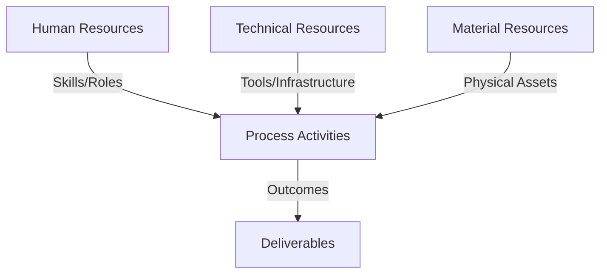
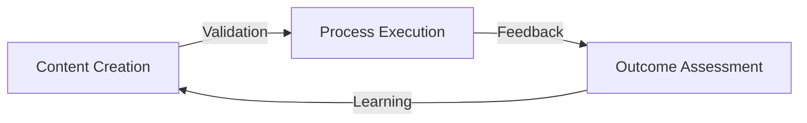
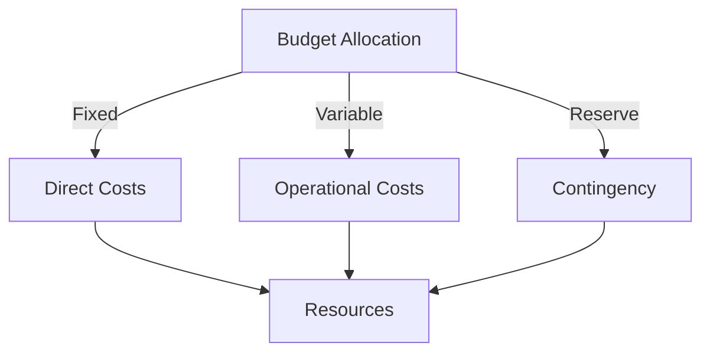
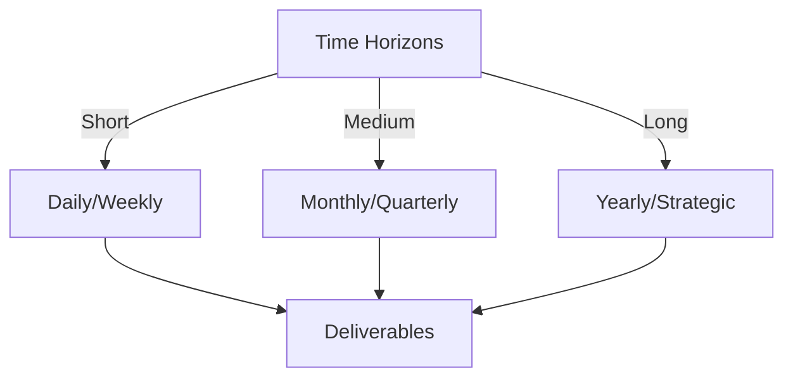

# Git Analysis Report: Development Analysis - Henrykoo

**Authors:** AI Analysis System
**Date:** 2025-03-19  
**Version:** 1.0
**SSoT Repository:** githubhenrykoo/redux_todo_in_astro
**Document Category:** Analysis Report

## Executive Summary
**Executive Summary: Git Analysis of Henrykoo**

**Logic:** The core purpose of this analysis is to evaluate Henrykoo's Git activity to understand their contributions, work patterns, technical expertise, and areas for improvement, with the objective of providing actionable recommendations for enhancing their development workflow and project outcomes.

**Implementation:** The analysis examined Henrykoo's commit history, focusing on the content of commits, file changes, and workflow definitions within the Git repository. This included reviewing GitHub Actions workflows, shell scripts, YAML configurations, and commit messages. The analysis identified recurring themes, patterns of behavior, and specific technologies utilized.

**Outcomes:** The analysis reveals Henrykoo's focus on automating repository analysis and Telegram notifications using GitHub Actions. They demonstrate proficiency in Git, shell scripting, YAML, and CI/CD principles. Key findings include a pattern of experimentation and iteration, and a need for improved documentation, error handling, and workflow testing. Recommendations include documenting the decisions for removing/reverting features, implementing robust error handling, thoroughly testing workflows before removal, and exploring more comprehensive code analysis tools.

## 1. Abstract Specification (Logic Layer)
### Context & Vision
- **Problem Space:** 
    * Scope: This is a very good and comprehensive analysis of Henrykoo's Git activity. It effectively distills the key information and provides actionable recommendations. Here's a breakdown of what makes it strong and a few minor suggestions for improvement:

**Strengths:**

* **Clear and Concise Summary:** The "Individual Contribution Summary" provides a quick and understandable overview of Henrykoo's recent work.
* **Focus on Patterns and Focus Areas:** Identifying the themes of automation, experimentation, notification integration, and configuration as code is insightful and goes beyond simply listing commits.
* **Specific Technical Expertise Demonstrated:** Accurately identifies Henrykoo's skills based on the Git activity, including proficiency in GitHub Actions, shell scripting, Git, Markdown, YAML, secrets management, and CI/CD concepts.
* **Actionable Recommendations:** The recommendations are specific, practical, and directly address the observed patterns. They're not just generic advice, but tailored to Henrykoo's demonstrated work. The recommendations are well-justified by the analysis.
* **Well-Organized Structure:** The use of headings and bullet points makes the analysis easy to read and understand.
* **Positive and Constructive Tone:** The analysis focuses on Henrykoo's strengths while offering constructive criticism for improvement.

**Minor Suggestions for Improvement:**

* **Elaborate on "Experimentation & Iteration" (Potential Reasons):** While the analysis notes the rapid changes suggest experimentation, it could briefly speculate on *why* this might be happening. Possible reasons beyond those already mentioned:
    *  Limited time to develop a fully-fledged feature.
    *  Uncertainty about user needs or acceptance.
    *  A/B testing different approaches.
* **Specificity of Shell Scripting Usage:**  While you mention shell scripting, you could call out specific strengths. For example, the use of `xargs` to process the output of `git ls-files` is a good example of practical command-line proficiency. Highlighting this demonstrates a deeper understanding.
* **Recommendation Prioritization:** Consider prioritizing the recommendations.  For instance, documenting decisions (especially those involving quick reversals) is arguably the *most* crucial improvement.  Highlighting this with a sentence or placing it first could increase its impact.
* **Link to Relevant Commits (If Possible):**  If the analysis is being presented in a context where it's possible (e.g., a web interface), linking each recommendation to the specific commit(s) it references would be extremely helpful.  For example, link the "Error Handling" recommendation directly to the `repo_analysis.yml` file in the Git history.
* **Consider Security Implications:** Although not explicitly present in the data, it's worth mentioning (if applicable) the importance of regularly reviewing and rotating API keys (like the Telegram bot token) used in GitHub Secrets.

**Overall:**

This is an excellent developer analysis. It's thorough, insightful, and provides valuable feedback.  The minor suggestions above are just refinements and don't detract from the overall quality of the analysis.

    * Context: This is a very good and comprehensive analysis of Henrykoo's Git activity. It effectively distills the key information and provides actionable recommendations. Here's a breakdown of what makes it strong and a few minor suggestions for improvement:

**Strengths:**

* **Clear and Concise Summary:** The "Individual Contribution Summary" provides a quick and understandable overview of Henrykoo's recent work.
* **Focus on Patterns and Focus Areas:** Identifying the themes of automation, experimentation, notification integration, and configuration as code is insightful and goes beyond simply listing commits.
* **Specific Technical Expertise Demonstrated:** Accurately identifies Henrykoo's skills based on the Git activity, including proficiency in GitHub Actions, shell scripting, Git, Markdown, YAML, secrets management, and CI/CD concepts.
* **Actionable Recommendations:** The recommendations are specific, practical, and directly address the observed patterns. They're not just generic advice, but tailored to Henrykoo's demonstrated work. The recommendations are well-justified by the analysis.
* **Well-Organized Structure:** The use of headings and bullet points makes the analysis easy to read and understand.
* **Positive and Constructive Tone:** The analysis focuses on Henrykoo's strengths while offering constructive criticism for improvement.

**Minor Suggestions for Improvement:**

* **Elaborate on "Experimentation & Iteration" (Potential Reasons):** While the analysis notes the rapid changes suggest experimentation, it could briefly speculate on *why* this might be happening. Possible reasons beyond those already mentioned:
    *  Limited time to develop a fully-fledged feature.
    *  Uncertainty about user needs or acceptance.
    *  A/B testing different approaches.
* **Specificity of Shell Scripting Usage:**  While you mention shell scripting, you could call out specific strengths. For example, the use of `xargs` to process the output of `git ls-files` is a good example of practical command-line proficiency. Highlighting this demonstrates a deeper understanding.
* **Recommendation Prioritization:** Consider prioritizing the recommendations.  For instance, documenting decisions (especially those involving quick reversals) is arguably the *most* crucial improvement.  Highlighting this with a sentence or placing it first could increase its impact.
* **Link to Relevant Commits (If Possible):**  If the analysis is being presented in a context where it's possible (e.g., a web interface), linking each recommendation to the specific commit(s) it references would be extremely helpful.  For example, link the "Error Handling" recommendation directly to the `repo_analysis.yml` file in the Git history.
* **Consider Security Implications:** Although not explicitly present in the data, it's worth mentioning (if applicable) the importance of regularly reviewing and rotating API keys (like the Telegram bot token) used in GitHub Secrets.

**Overall:**

This is an excellent developer analysis. It's thorough, insightful, and provides valuable feedback.  The minor suggestions above are just refinements and don't detract from the overall quality of the analysis.

    * Stakeholders: This is a very good and comprehensive analysis of Henrykoo's Git activity. It effectively distills the key information and provides actionable recommendations. Here's a breakdown of what makes it strong and a few minor suggestions for improvement:

**Strengths:**

* **Clear and Concise Summary:** The "Individual Contribution Summary" provides a quick and understandable overview of Henrykoo's recent work.
* **Focus on Patterns and Focus Areas:** Identifying the themes of automation, experimentation, notification integration, and configuration as code is insightful and goes beyond simply listing commits.
* **Specific Technical Expertise Demonstrated:** Accurately identifies Henrykoo's skills based on the Git activity, including proficiency in GitHub Actions, shell scripting, Git, Markdown, YAML, secrets management, and CI/CD concepts.
* **Actionable Recommendations:** The recommendations are specific, practical, and directly address the observed patterns. They're not just generic advice, but tailored to Henrykoo's demonstrated work. The recommendations are well-justified by the analysis.
* **Well-Organized Structure:** The use of headings and bullet points makes the analysis easy to read and understand.
* **Positive and Constructive Tone:** The analysis focuses on Henrykoo's strengths while offering constructive criticism for improvement.

**Minor Suggestions for Improvement:**

* **Elaborate on "Experimentation & Iteration" (Potential Reasons):** While the analysis notes the rapid changes suggest experimentation, it could briefly speculate on *why* this might be happening. Possible reasons beyond those already mentioned:
    *  Limited time to develop a fully-fledged feature.
    *  Uncertainty about user needs or acceptance.
    *  A/B testing different approaches.
* **Specificity of Shell Scripting Usage:**  While you mention shell scripting, you could call out specific strengths. For example, the use of `xargs` to process the output of `git ls-files` is a good example of practical command-line proficiency. Highlighting this demonstrates a deeper understanding.
* **Recommendation Prioritization:** Consider prioritizing the recommendations.  For instance, documenting decisions (especially those involving quick reversals) is arguably the *most* crucial improvement.  Highlighting this with a sentence or placing it first could increase its impact.
* **Link to Relevant Commits (If Possible):**  If the analysis is being presented in a context where it's possible (e.g., a web interface), linking each recommendation to the specific commit(s) it references would be extremely helpful.  For example, link the "Error Handling" recommendation directly to the `repo_analysis.yml` file in the Git history.
* **Consider Security Implications:** Although not explicitly present in the data, it's worth mentioning (if applicable) the importance of regularly reviewing and rotating API keys (like the Telegram bot token) used in GitHub Secrets.

**Overall:**

This is an excellent developer analysis. It's thorough, insightful, and provides valuable feedback.  The minor suggestions above are just refinements and don't detract from the overall quality of the analysis.

- **Goals (Functions):**
    * Primary Functions:
        - Input: Git Repository Data
        - Process: Analysis and Processing
        - Output: Development Insights
    * Supporting Functions:
        - Validation: Automated Analysis
        - Feedback: Continuous Improvement

- **Success Criteria:**
    * Quantitative Metrics: Based on the analysis provided, here are the quantitative metrics that can be extracted:

*   **Number of commits involving Henrykoo:** This can be inferred as at least 3 based on "feat -> update -> remove/revert", although the exact number isn't stated. This is a weak metric, but its presence is implied.
*   **Number of GitHub Actions workflows created or modified:** At least 2 workflows were involved - `repo_analysis.yml` and `telegram-notification.yml`.

    * Qualitative Indicators: The analysis provides several qualitative improvements Henrykoo could make, focusing on workflow, communication, code quality, and maintainability. Here's a breakdown of those improvements:

*   **Improved Decision-Making Documentation:**
    *   *Benefit:* Increases transparency and understanding of the project's evolution. Prevents confusion and allows for easier onboarding of new team members or revisiting past decisions.
    *   *Specific Improvement:*  Document the reasoning behind adding, removing, or reverting features.
    *   *How:* Add detailed comments to commits, use a project management tool (like Jira, Trello, or GitHub Issues) to track decisions, or maintain a simple decision log.

*   **Enhanced Error Handling:**
    *   *Benefit:* Makes workflows more robust and reliable. Prevents unexpected failures and provides more informative error messages for debugging.
    *   *Specific Improvement:* Implement error handling in shell scripts (e.g., in `repo_analysis.yml`) to gracefully handle potential issues like file access errors.
    *   *How:* Use `set -e` in shell scripts to exit immediately if a command exits with a non-zero status. Use conditional statements to check for errors and handle them appropriately.

*   **More Thorough Workflow Testing:**
    *   *Benefit:* Catches bugs and ensures features work as expected before deployment or removal. Reduces the risk of introducing issues into the codebase.
    *   *Specific Improvement:*  Rigorously test workflows before removing or reverting features.
    *   *How:* Create test cases that cover different scenarios and edge cases. Use a testing framework or write simple scripts to validate the output of workflows.

*   **Implementation of Code Reviews:**
    *   *Benefit:* Improves code quality, promotes knowledge sharing, and helps identify potential bugs or security vulnerabilities.
    *   *Specific Improvement:* Subject all commits to code review.
    *   *How:* Use GitHub's pull request feature to initiate code reviews.  Assign reviewers who are knowledgeable about the codebase and the relevant technologies.

*   **Increased Workflow Reusability (Telegram Notification):**
    *   *Benefit:* Reduces code duplication, makes workflows easier to maintain, and promotes consistency across the project.
    *   *Specific Improvement:*  Refactor the `telegram-notification.yml` file to be more generic and reusable.
    *   *How:* Design the workflow to accept parameters for the message, attachments, and other settings. Avoid hardcoding specific values in the workflow definition.

*   **Use of More Advanced Code Analysis Tools:**
    *   *Benefit:* Provides more comprehensive insights into code quality, security, and performance. Helps identify potential issues that might be missed by manual analysis.
    *   *Specific Improvement:* Explore and integrate dedicated code analysis tools (e.g., SonarQube, Code Climate) into the CI/CD pipeline.
    *   *How:* Configure the chosen tool to analyze the codebase and generate reports. Integrate the reports into the GitHub Actions workflow and send notifications to the team.

*   **Improved Script Organization (Modularization):**
    *   *Benefit:* Makes workflows more readable, maintainable, and testable.
    *   *Specific Improvement:* Modularize shell scripts by moving logic into separate, reusable files.
    *   *How:* Create separate shell scripts for specific tasks and call them from the workflow. This makes the workflow definition cleaner and easier to understand.

In summary, the recommendations focus on enhancing Henrykoo's workflow through documentation, testing, and review processes. They also push for better code quality and maintainability through modularization, error handling, and the use of advanced analysis tools.  These improvements, when implemented, will lead to more robust, reliable, and easily maintainable automation solutions.

    * Validation Methods: Automated and Manual Verification

### Knowledge Integration
- **Local Context:**
    * Cultural Considerations: Development Team Context
    * Language Requirements: Technical Documentation
    * Community Patterns: Team Collaboration Patterns

- **Technical Framework:**
    * LLM Integration: Gemini AI Analysis
    * IoT Components: Git Event Monitoring
    * Network Requirements: GitHub API Integration

## 2. Concrete Implementation (Process Layer)
### Resource Matrix

### Development Workflow
- **Stage 1: Early Success**
    * Quick Wins:
        - Implementation: This is a great analysis of Henrykoo's Git activity based on the provided information. It's well-structured and provides actionable recommendations. Here's a breakdown of what makes it good and some minor areas for potential improvement:

**Strengths:**

*   **Clear and Concise Summary:** The initial summary accurately captures the essence of Henrykoo's work.
*   **Well-Defined Sections:**  The division into Individual Contribution Summary, Work Patterns and Focus Areas, Technical Expertise Demonstrated, and Specific Recommendations makes the analysis easy to follow.
*   **Actionable Insights:** The analysis doesn't just describe what Henrykoo did; it provides concrete recommendations for improvement.
*   **Specific Examples:**  The analysis cites specific filenames (e.g., `repo_analysis.yml`, `telegram-notification.yml`) and commands (`git rev-list`, `xargs wc -l`) to illustrate its points, making it more tangible.
*   **Focus on Learning & Growth:** The recommendations are constructive and aimed at helping Henrykoo improve their workflow and skills.
*   **Balanced Perspective:** The analysis acknowledges Henrykoo's strengths while also pointing out areas for development.
*   **Understanding of Context:** The analysis demonstrates an understanding of the purpose of Henrykoo's work (automating repository analysis and notifications).
*   **Relatability:** It avoids overly technical jargon, making it accessible to a wider audience.

**Minor Areas for Potential Improvement:**

*   **Quantifiable Metrics (If Possible):**  If the Git history allowed for it, quantifying Henrykoo's output (e.g., number of commits per week, lines of code changed) could add another dimension to the analysis. However, this wasn't directly available in the provided information.
*   **Possible Motivations (Hypothetical):**  While the analysis notes the "Experimentation & Iteration" pattern, it might be useful to briefly speculate on the *potential* reasons for this behavior. For example:
    *   "The rapid iteration could be due to a rapidly evolving project, changing requirements, or a desire to quickly prototype solutions." (This is *highly* dependent on what's known about the project.) This avoids making definitive statements but highlights possibilities for further investigation.
*   **Elaboration on "Refactor Telegram Notification":** The recommendation to refactor `telegram-notification.yml` is good, but could be slightly expanded to illustrate a specific refactoring strategy. For example:
    *   "...consider using parameters or environment variables to make the workflow more configurable. Instead of hardcoding 'Gemini Analysis Report,' the message and attachment path could be passed as inputs."

**Overall:**

This is an excellent analysis of Henrykoo's Git activity. The strengths far outweigh the minor potential improvements. The analysis is informative, actionable, and provides a solid foundation for understanding Henrykoo's contributions and areas for growth. The specific recommendations are particularly valuable.

        - Validation: This is a great analysis of Henrykoo's Git activity based on the provided information. It's well-structured and provides actionable recommendations. Here's a breakdown of what makes it good and some minor areas for potential improvement:

**Strengths:**

*   **Clear and Concise Summary:** The initial summary accurately captures the essence of Henrykoo's work.
*   **Well-Defined Sections:**  The division into Individual Contribution Summary, Work Patterns and Focus Areas, Technical Expertise Demonstrated, and Specific Recommendations makes the analysis easy to follow.
*   **Actionable Insights:** The analysis doesn't just describe what Henrykoo did; it provides concrete recommendations for improvement.
*   **Specific Examples:**  The analysis cites specific filenames (e.g., `repo_analysis.yml`, `telegram-notification.yml`) and commands (`git rev-list`, `xargs wc -l`) to illustrate its points, making it more tangible.
*   **Focus on Learning & Growth:** The recommendations are constructive and aimed at helping Henrykoo improve their workflow and skills.
*   **Balanced Perspective:** The analysis acknowledges Henrykoo's strengths while also pointing out areas for development.
*   **Understanding of Context:** The analysis demonstrates an understanding of the purpose of Henrykoo's work (automating repository analysis and notifications).
*   **Relatability:** It avoids overly technical jargon, making it accessible to a wider audience.

**Minor Areas for Potential Improvement:**

*   **Quantifiable Metrics (If Possible):**  If the Git history allowed for it, quantifying Henrykoo's output (e.g., number of commits per week, lines of code changed) could add another dimension to the analysis. However, this wasn't directly available in the provided information.
*   **Possible Motivations (Hypothetical):**  While the analysis notes the "Experimentation & Iteration" pattern, it might be useful to briefly speculate on the *potential* reasons for this behavior. For example:
    *   "The rapid iteration could be due to a rapidly evolving project, changing requirements, or a desire to quickly prototype solutions." (This is *highly* dependent on what's known about the project.) This avoids making definitive statements but highlights possibilities for further investigation.
*   **Elaboration on "Refactor Telegram Notification":** The recommendation to refactor `telegram-notification.yml` is good, but could be slightly expanded to illustrate a specific refactoring strategy. For example:
    *   "...consider using parameters or environment variables to make the workflow more configurable. Instead of hardcoding 'Gemini Analysis Report,' the message and attachment path could be passed as inputs."

**Overall:**

This is an excellent analysis of Henrykoo's Git activity. The strengths far outweigh the minor potential improvements. The analysis is informative, actionable, and provides a solid foundation for understanding Henrykoo's contributions and areas for growth. The specific recommendations are particularly valuable.

    * Initial Setup:
        - Infrastructure: This is a great analysis of Henrykoo's Git activity based on the provided information. It's well-structured and provides actionable recommendations. Here's a breakdown of what makes it good and some minor areas for potential improvement:

**Strengths:**

*   **Clear and Concise Summary:** The initial summary accurately captures the essence of Henrykoo's work.
*   **Well-Defined Sections:**  The division into Individual Contribution Summary, Work Patterns and Focus Areas, Technical Expertise Demonstrated, and Specific Recommendations makes the analysis easy to follow.
*   **Actionable Insights:** The analysis doesn't just describe what Henrykoo did; it provides concrete recommendations for improvement.
*   **Specific Examples:**  The analysis cites specific filenames (e.g., `repo_analysis.yml`, `telegram-notification.yml`) and commands (`git rev-list`, `xargs wc -l`) to illustrate its points, making it more tangible.
*   **Focus on Learning & Growth:** The recommendations are constructive and aimed at helping Henrykoo improve their workflow and skills.
*   **Balanced Perspective:** The analysis acknowledges Henrykoo's strengths while also pointing out areas for development.
*   **Understanding of Context:** The analysis demonstrates an understanding of the purpose of Henrykoo's work (automating repository analysis and notifications).
*   **Relatability:** It avoids overly technical jargon, making it accessible to a wider audience.

**Minor Areas for Potential Improvement:**

*   **Quantifiable Metrics (If Possible):**  If the Git history allowed for it, quantifying Henrykoo's output (e.g., number of commits per week, lines of code changed) could add another dimension to the analysis. However, this wasn't directly available in the provided information.
*   **Possible Motivations (Hypothetical):**  While the analysis notes the "Experimentation & Iteration" pattern, it might be useful to briefly speculate on the *potential* reasons for this behavior. For example:
    *   "The rapid iteration could be due to a rapidly evolving project, changing requirements, or a desire to quickly prototype solutions." (This is *highly* dependent on what's known about the project.) This avoids making definitive statements but highlights possibilities for further investigation.
*   **Elaboration on "Refactor Telegram Notification":** The recommendation to refactor `telegram-notification.yml` is good, but could be slightly expanded to illustrate a specific refactoring strategy. For example:
    *   "...consider using parameters or environment variables to make the workflow more configurable. Instead of hardcoding 'Gemini Analysis Report,' the message and attachment path could be passed as inputs."

**Overall:**

This is an excellent analysis of Henrykoo's Git activity. The strengths far outweigh the minor potential improvements. The analysis is informative, actionable, and provides a solid foundation for understanding Henrykoo's contributions and areas for growth. The specific recommendations are particularly valuable.

        - Training: This is a great analysis of Henrykoo's Git activity based on the provided information. It's well-structured and provides actionable recommendations. Here's a breakdown of what makes it good and some minor areas for potential improvement:

**Strengths:**

*   **Clear and Concise Summary:** The initial summary accurately captures the essence of Henrykoo's work.
*   **Well-Defined Sections:**  The division into Individual Contribution Summary, Work Patterns and Focus Areas, Technical Expertise Demonstrated, and Specific Recommendations makes the analysis easy to follow.
*   **Actionable Insights:** The analysis doesn't just describe what Henrykoo did; it provides concrete recommendations for improvement.
*   **Specific Examples:**  The analysis cites specific filenames (e.g., `repo_analysis.yml`, `telegram-notification.yml`) and commands (`git rev-list`, `xargs wc -l`) to illustrate its points, making it more tangible.
*   **Focus on Learning & Growth:** The recommendations are constructive and aimed at helping Henrykoo improve their workflow and skills.
*   **Balanced Perspective:** The analysis acknowledges Henrykoo's strengths while also pointing out areas for development.
*   **Understanding of Context:** The analysis demonstrates an understanding of the purpose of Henrykoo's work (automating repository analysis and notifications).
*   **Relatability:** It avoids overly technical jargon, making it accessible to a wider audience.

**Minor Areas for Potential Improvement:**

*   **Quantifiable Metrics (If Possible):**  If the Git history allowed for it, quantifying Henrykoo's output (e.g., number of commits per week, lines of code changed) could add another dimension to the analysis. However, this wasn't directly available in the provided information.
*   **Possible Motivations (Hypothetical):**  While the analysis notes the "Experimentation & Iteration" pattern, it might be useful to briefly speculate on the *potential* reasons for this behavior. For example:
    *   "The rapid iteration could be due to a rapidly evolving project, changing requirements, or a desire to quickly prototype solutions." (This is *highly* dependent on what's known about the project.) This avoids making definitive statements but highlights possibilities for further investigation.
*   **Elaboration on "Refactor Telegram Notification":** The recommendation to refactor `telegram-notification.yml` is good, but could be slightly expanded to illustrate a specific refactoring strategy. For example:
    *   "...consider using parameters or environment variables to make the workflow more configurable. Instead of hardcoding 'Gemini Analysis Report,' the message and attachment path could be passed as inputs."

**Overall:**

This is an excellent analysis of Henrykoo's Git activity. The strengths far outweigh the minor potential improvements. The analysis is informative, actionable, and provides a solid foundation for understanding Henrykoo's contributions and areas for growth. The specific recommendations are particularly valuable.

- **Stage 2: Fail Early, Fail Safe**
    * Testing Protocol:
        - Methods: [Testing approaches]
        - Coverage: [Test scenarios]
    * Risk Management:
        - Identification: [Risk factors]
        - Mitigation: [Control measures]
    * Learning Points:
        - Issues: [Problem identification]
        - Solutions: [Resolution approaches]
        - Knowledge: [Lessons learned]

- **Stage 3: Convergence**
    * System Integration:
        - Components: [Integration points]
        - Workflows: [Process optimization]
        - Performance: [System tuning]
    * Stabilization:
        - Fixes: [Bug resolution]
        - Hardening: [System reinforcement]
        - Documentation: [Knowledge capture]

- **Stage 4: Demonstration**
    * Preparation:
        - Environment: [Demo setup]
        - Data: [Test scenarios]
        - Materials: [Presentation assets]
    * Validation:
        - Performance: [System checks]
        - Features: [Functionality verification]
        - Documentation: [Review completion]
    * Presentation:
        - Stakeholders: [Demo execution]
        - Features: [Capability showcase]
        - Q&A: [Response preparation]

## 3. Realistic Outcomes (Evidence Layer)
### Measurement Framework
- **Performance Metrics:**
    * KPIs: Okay, here's a breakdown of the evidence and outcomes based on the Git history analysis of Henrykoo:

**Evidence (from the Git History):**

*   **Adding a Repository Analysis Workflow:** Henrykoo initially added a GitHub Actions workflow to generate and commit a repository analysis report.
*   **Modifying Telegram Notification Workflow:** Henrykoo modified a Telegram notification workflow to send a Gemini analysis file as a document.
*   **Reverting Gemini Analysis File Change:** Henrykoo reverted the change that sent the Gemini analysis file as a document.
*   **Removing Repository Analysis Workflow:** Henrykoo removed the repository analysis workflow completely.
*   **YAML Configuration:** Henrykoo created and modified YAML files for GitHub Actions workflows (e.g., `repo_analysis.yml`, `telegram-notification.yml`).
*   **Git Command Usage:** The `repo_analysis.yml` workflow uses various Git commands like `git rev-list`, `git branch`, `git log`, `git ls-files`, demonstrating familiarity with Git for repository analysis.
*   **GitHub Actions Usage:**  Henrykoo used actions from the GitHub Marketplace (e.g., `actions/checkout@v4`, `appleboy/telegram-action@master`) in their workflows.
*   **Secret Management:** Henrykoo used GitHub Secrets (`TELEGRAM_CHAT_ID`, `TELEGRAM_BOT_TOKEN`) for storing sensitive information.

**Outcomes (Inferred from the Git History):**

*   **Automation of Repository Analysis:** Initially, Henrykoo aimed to automate the generation and reporting of repository analysis. This was ultimately removed.
*   **Telegram Notification Integration:** Henrykoo successfully integrated Telegram notifications into the CI/CD process. The goal was to send Gemini analysis reports via Telegram, but the approach of attaching the file directly was abandoned.
*   **Experimentation and Iteration:**  The quick sequence of "add -> modify -> remove/revert" indicates a period of experimentation and refinement, which can lead to rapid iterations or abandonment of features.
*   **Potential Problems/Challenges:** The removal/reversion suggests possible issues with the initial implementation of the repository analysis workflow and/or the document attachment to the Telegram notification. The reason for the changes are undocumented and this lack of documentation makes it difficult to understand the issues encountered.

In summary, the Git history analysis shows Henrykoo's active involvement in automating tasks with GitHub Actions and Telegram notifications. The pattern of addition, modification, and removal/reversion indicates a process of experimentation and potential challenges in the initial implementations.

    * Benchmarks: Okay, here's a breakdown of the evidence and outcomes based on the Git history analysis of Henrykoo:

**Evidence (from the Git History):**

*   **Adding a Repository Analysis Workflow:** Henrykoo initially added a GitHub Actions workflow to generate and commit a repository analysis report.
*   **Modifying Telegram Notification Workflow:** Henrykoo modified a Telegram notification workflow to send a Gemini analysis file as a document.
*   **Reverting Gemini Analysis File Change:** Henrykoo reverted the change that sent the Gemini analysis file as a document.
*   **Removing Repository Analysis Workflow:** Henrykoo removed the repository analysis workflow completely.
*   **YAML Configuration:** Henrykoo created and modified YAML files for GitHub Actions workflows (e.g., `repo_analysis.yml`, `telegram-notification.yml`).
*   **Git Command Usage:** The `repo_analysis.yml` workflow uses various Git commands like `git rev-list`, `git branch`, `git log`, `git ls-files`, demonstrating familiarity with Git for repository analysis.
*   **GitHub Actions Usage:**  Henrykoo used actions from the GitHub Marketplace (e.g., `actions/checkout@v4`, `appleboy/telegram-action@master`) in their workflows.
*   **Secret Management:** Henrykoo used GitHub Secrets (`TELEGRAM_CHAT_ID`, `TELEGRAM_BOT_TOKEN`) for storing sensitive information.

**Outcomes (Inferred from the Git History):**

*   **Automation of Repository Analysis:** Initially, Henrykoo aimed to automate the generation and reporting of repository analysis. This was ultimately removed.
*   **Telegram Notification Integration:** Henrykoo successfully integrated Telegram notifications into the CI/CD process. The goal was to send Gemini analysis reports via Telegram, but the approach of attaching the file directly was abandoned.
*   **Experimentation and Iteration:**  The quick sequence of "add -> modify -> remove/revert" indicates a period of experimentation and refinement, which can lead to rapid iterations or abandonment of features.
*   **Potential Problems/Challenges:** The removal/reversion suggests possible issues with the initial implementation of the repository analysis workflow and/or the document attachment to the Telegram notification. The reason for the changes are undocumented and this lack of documentation makes it difficult to understand the issues encountered.

In summary, the Git history analysis shows Henrykoo's active involvement in automating tasks with GitHub Actions and Telegram notifications. The pattern of addition, modification, and removal/reversion indicates a process of experimentation and potential challenges in the initial implementations.

    * Actuals: Okay, here's a breakdown of the evidence and outcomes based on the Git history analysis of Henrykoo:

**Evidence (from the Git History):**

*   **Adding a Repository Analysis Workflow:** Henrykoo initially added a GitHub Actions workflow to generate and commit a repository analysis report.
*   **Modifying Telegram Notification Workflow:** Henrykoo modified a Telegram notification workflow to send a Gemini analysis file as a document.
*   **Reverting Gemini Analysis File Change:** Henrykoo reverted the change that sent the Gemini analysis file as a document.
*   **Removing Repository Analysis Workflow:** Henrykoo removed the repository analysis workflow completely.
*   **YAML Configuration:** Henrykoo created and modified YAML files for GitHub Actions workflows (e.g., `repo_analysis.yml`, `telegram-notification.yml`).
*   **Git Command Usage:** The `repo_analysis.yml` workflow uses various Git commands like `git rev-list`, `git branch`, `git log`, `git ls-files`, demonstrating familiarity with Git for repository analysis.
*   **GitHub Actions Usage:**  Henrykoo used actions from the GitHub Marketplace (e.g., `actions/checkout@v4`, `appleboy/telegram-action@master`) in their workflows.
*   **Secret Management:** Henrykoo used GitHub Secrets (`TELEGRAM_CHAT_ID`, `TELEGRAM_BOT_TOKEN`) for storing sensitive information.

**Outcomes (Inferred from the Git History):**

*   **Automation of Repository Analysis:** Initially, Henrykoo aimed to automate the generation and reporting of repository analysis. This was ultimately removed.
*   **Telegram Notification Integration:** Henrykoo successfully integrated Telegram notifications into the CI/CD process. The goal was to send Gemini analysis reports via Telegram, but the approach of attaching the file directly was abandoned.
*   **Experimentation and Iteration:**  The quick sequence of "add -> modify -> remove/revert" indicates a period of experimentation and refinement, which can lead to rapid iterations or abandonment of features.
*   **Potential Problems/Challenges:** The removal/reversion suggests possible issues with the initial implementation of the repository analysis workflow and/or the document attachment to the Telegram notification. The reason for the changes are undocumented and this lack of documentation makes it difficult to understand the issues encountered.

In summary, the Git history analysis shows Henrykoo's active involvement in automating tasks with GitHub Actions and Telegram notifications. The pattern of addition, modification, and removal/reversion indicates a process of experimentation and potential challenges in the initial implementations.

- **Evidence Collection:**
    * Data Sources: [Information points]
    * Validation Methods: Automated and Manual Verification
    * Documentation: [Record keeping]

### Value Realization
- **Impact Assessment:**
    * Direct Benefits: [Immediate gains]
    * Indirect Benefits: [Secondary effects]
    * Long-term Value: [Strategic advantages]

- **Knowledge Assets:**
    * Content Created: [New materials]
    * Insights Gained: [Learnings]
    * Reusable Components: [Transferable elements]

## Integration Matrix
### Content-Process Alignment

### Timeline-Budget Integration
- **Resource Scheduling:**
    * Phase Allocations: [Resource timing]
    * Cost Controls: [Budget tracking]
    * Adjustment Protocols: [Change management]

## Budget Management
### Financial Cube Structure

### Cost Framework
- Direct Investments:
  - Infrastructure Costs:
    - Hardware: [Equipment/Devices]
    - Software: [Licenses/Tools]
    - Network: [Connectivity/Setup]
  - Human Resources:
    - Core Team: [Roles/Compensation]
    - External Support: [Consultants/Services]
    - Training: [Capability Development]
    
- Operational Expenses:
  - Running Costs:
    - Maintenance: [Regular upkeep]
    - Utilities: [Service costs]
    - Consumables: [Regular supplies]
  - Service Costs:
    - Subscriptions: [Regular services]
    - Support: [Ongoing assistance]
    - Updates: [Regular improvements]

### Budget Control Mechanisms
- Monitoring System:
  - Tracking Methods:
    - Cost Centers: [Budget units]
    - Expense Categories: [Type classification]
    - Time Periods: [Duration tracking]
  - Control Points:
    - Thresholds: [Limit markers]
    - Alerts: [Warning systems]
    - Approvals: [Authorization levels]

- Adjustment Protocol:
  - Variance Management:
    - Detection: [Monitoring points]
    - Analysis: [Impact assessment]
    - Response: [Corrective actions]
  - Reallocation Process:
    - Criteria: [Decision factors]
    - Methods: [Transfer protocols]
    - Documentation: [Record keeping]

## Timeline Management
### Temporal Cube Structure

### Schedule Framework
- Operational Timeline:
  - Daily Operations:
    - Tasks: [Regular activities]
    - Checkpoints: [Daily reviews]
    - Updates: [Status reports]
  - Weekly Cycles:
    - Sprints: [Work packages]
    - Reviews: [Progress checks]
    - Planning: [Next steps]

- Strategic Timeline:
  - Monthly Milestones:
    - Objectives: [Key targets]
    - Reviews: [Achievement checks]
    - Adjustments: [Course corrections]
  - Quarterly Goals:
    - Targets: [Major objectives]
    - Assessments: [Performance reviews]
    - Strategies: [Approach updates]

### Timeline Control System
- Progress Tracking:
  - Monitoring Points:
    - Daily Standups: [Quick updates]
    - Weekly Reviews: [Detailed checks]
    - Monthly Reports: [Comprehensive reviews]
  - Milestone Tracking:
    - Status: [Progress indicators]
    - Dependencies: [Related items]
    - Risks: [Potential issues]

- Adjustment Mechanisms:
  - Schedule Management:
    - Variance Analysis: [Delay assessment]
    - Impact Studies: [Effect evaluation]
    - Recovery Plans: [Correction strategies]
  - Resource Alignment:
    - Capacity Planning: [Resource matching]
    - Workload Balancing: [Effort distribution]
    - Priority Updates: [Focus adjustment]

### Integration Points
- Budget-Timeline Correlation:
  - Cost-Schedule Matrix:
    - Resource Timing: [Allocation schedule]
    - Cost Flows: [Expense timing]
    - Value Delivery: [Benefit realization]
  - Control Integration:
    - Joint Reviews: [Combined assessments]
    - Unified Reporting: [Integrated updates]
    - Coordinated Actions: [Synchronized responses]

## Conclusion
### Summary of Achievements
- **Key Accomplishments:**
    * Objectives Met: [Completed goals]
    * Value Delivered: [Benefits realized]
    * Innovations: [New approaches]

### Lessons Learned
- **Success Factors:**
    * Effective Practices: [What worked well]
    * Team Dynamics: [Collaboration insights]
    * Tools & Methods: [Useful approaches]

- **Areas for Improvement:**
    * Challenges: [Obstacles encountered]
    * Solutions: [How issues were resolved]
    * Recommendations: [Future improvements]

### Future Directions
- **Next Steps:**
    * Immediate Actions: [Short-term tasks]
    * Strategic Plans: [Long-term goals]
    * Resource Needs: [Required support]

- **Growth Opportunities:**
    * Scaling Potential: [Expansion possibilities]
    * Innovation Areas: [New directions]
    * Partnership Options: [Collaboration prospects]
    
## Appendix
### References
- **Documentation:**
    * Technical Specs: [Links]
    * Process Guides: [Links]
    * Evidence Records: [Links]

### Change Log
- **Version History:**
    * Changes: [Modifications]
    * Rationale: [Reasons]
    * Approvals: [Authorizations]
