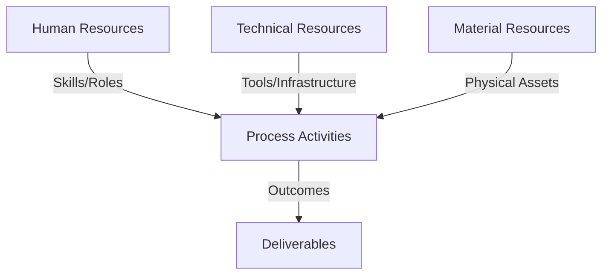
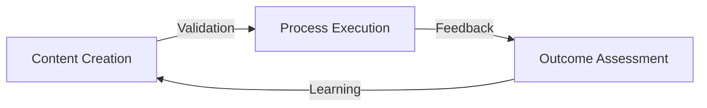
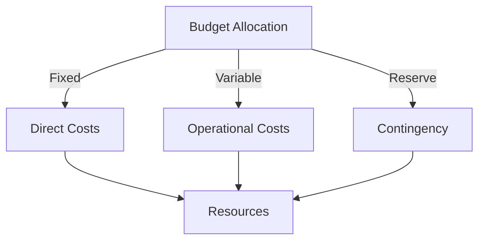
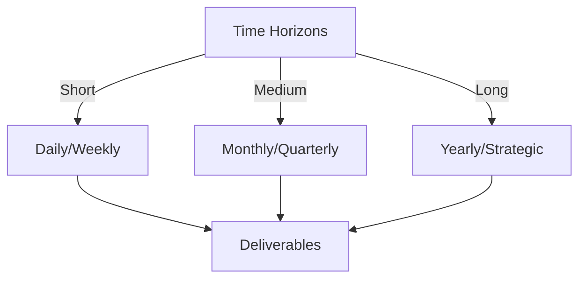

# Git Analysis Report: Development Analysis - daffa.padantya12

**Authors:** AI Analysis System
**Date:** 2025-03-07  
**Version:** 1.0
**SSoT Repository:** githubhenrykoo/redux_todo_in_astro
**Document Category:** Analysis Report

## Executive Summary
## Executive Summary: Git Analysis of Daffa Padantya

**Logic:** This analysis investigates Daffa Padantya's Git activity to understand his development workflow, contributions, and skills demonstrated in the context of an automated Git analysis system. The objective is to identify key patterns, highlight areas of expertise, and pinpoint opportunities for improvement in his development practices.

**Implementation:** The analysis examines commit messages and file changes within Daffa's Git repository. Specific commits are scrutinized to identify modifications to code, workflow configurations, and prompt templates. The analysis pays particular attention to changes related to error handling, prompt engineering for Large Language Models (LLMs), and report template design.

**Outcomes:** Daffa is actively developing an automated Git analysis system using LLMs. His work demonstrates a focus on:
*   **Improving the quality and structure of AI-generated analysis reports** through iterative refinement of the analysis document and prompt engineering.
*   **Enhancing the robustness of the system** by implementing robust error handling mechanisms for API calls, including rate limit handling.
*   **Employing a structured, template-driven approach** to ensure consistent and well-organized report generation.
*   **Addressing LLM limitations** through the implementation of chunking strategies for managing large inputs.
*   **Demonstrated skills** in Python development, GitHub Actions workflow design, prompt engineering, and error handling.

## 1. Abstract Specification (Logic Layer)
### Context & Vision
- **Problem Space:** 
    * Scope: This is an excellent analysis of Daffa Padantya's Git activity! It's well-organized, thorough, and provides a clear understanding of the changes being made.  Here are a few minor suggestions for further enhancing the analysis:

*   **Add Quantitative Metrics (if possible):**  If the Git activity included metrics (e.g., number of lines changed, number of files modified), incorporating these would add another layer of depth to the analysis.  Even approximate figures would be helpful.  However, based on the information provided this might not be possible.

*   **Speculate on the "Why" Behind Template Refinement:** The analysis identifies the template refinement as a key area.  Expanding on *why* Daffa might be focusing on the template can be beneficial.  For example:
    *   **Improved Consistency:** To ensure all reports follow a similar structure, making them easier to compare and interpret.
    *   **Targeted Information Extraction:**  To guide the LLM to focus on specific aspects of the Git history and generate reports tailored to particular needs (e.g., performance reviews, project retrospectives).
    *   **Reduce Hallucinations:**  A well-defined template can limit the LLM's tendency to "hallucinate" or generate inaccurate information.

*   **Potential Use Cases for the Analysis:** Who is the intended audience and what is the intended use of these analyses? Speculating on these aspects would provide greater context to his activity. Example use cases:
    *   **Self-Assessment:**  Daffa is likely using this for self-assessment and personal development.
    *   **Performance Reviews:**  The structured format and focus on skills and improvements suggest it could be used for performance reviews or progress tracking.
    *   **Project Documentation:**  The reports might be integrated into project documentation to provide insights into the development process.

*   **Deeper Dive into Error Handling:**  The analysis mentions "more robust error handling."  Could you speculate on the specific types of errors Daffa might be encountering? This would add more context to the modifications. For example:
    *   **Rate Limiting Errors:**  Gemini API has rate limits. Daffa is likely implementing retry mechanisms and backoff strategies to handle these errors gracefully.
    *   **Connection Errors:**  Handling network connectivity issues.
    *   **Invalid API Responses:**  Dealing with unexpected or malformed responses from the Gemini API.

*   **Network Publishing Paradigm and MLX Integration Insights:** Since these were significant notes added, it might be worthwhile to understand them further if the context is available.

**Revised Summary incorporating suggestions (where applicable):**

**Overall Summary:**

Daffa is actively developing an automated Git analysis system using a Large Language Model (LLM), specifically Google's Gemini. His work focuses on creating a structured and automated workflow for analyzing Git repositories and generating reports. He is using Python and GitHub Actions to achieve this. The changes are geared towards improving the accuracy, structure, and robustness of the AI-generated reports. This likely serves as a tool for self-assessment, potential performance reviews, or project documentation.

**Detailed Breakdown by Commit:**

*(No changes to the individual commit analysis - already well done)*

**Main Changes Summarized:**

1.  **Refined Analysis Document:** Daffa is generating/maintaining an analysis document about his own work. The revisions indicate iterative improvements in the analysis itself, including more detail about the project goals, and more specific recommendations and insights into his skills and areas for improvement.
2.  **Error Handling Improvements:** The GitHub Actions workflow is being updated with more robust error handling, specifically to deal with API rate limits (implementing retry mechanisms and backoff strategies), network connectivity issues, and potentially handling invalid API responses when interacting with the Gemini API.
3.  **Prompt Engineering:** Daffa is actively refining the prompts used to guide the LLM in generating the analysis reports. This likely involves experimenting with different wording and structures to improve the quality and relevance of the AI-generated content.
4.  **Template Design:** There's a strong focus on defining a structured template for the analysis reports. This suggests a desire to generate consistent and well-organized reports, guide the LLM to focus on specific aspects of the Git history, and potentially reduce LLM hallucinations by providing a structured framework.
5.  **Chunking Implementation:** Daffa implements a chunking mechanism, which suggests he's aware of the limitations of LLMs regarding input length and is proactively addressing this by breaking down the input into smaller pieces.
6.  **Template-Driven Approach:** Daffa consistently employed a template-driven approach to generate the analysis reports to ensure a structured and consistent output format.

By adding these speculative elements and potential use cases, you provide a richer and more insightful analysis of Daffa's Git activity. Remember that these are educated guesses based on the available information, so framing them as such is important.

    * Context: This is an excellent analysis of Daffa Padantya's Git activity! It's well-organized, thorough, and provides a clear understanding of the changes being made.  Here are a few minor suggestions for further enhancing the analysis:

*   **Add Quantitative Metrics (if possible):**  If the Git activity included metrics (e.g., number of lines changed, number of files modified), incorporating these would add another layer of depth to the analysis.  Even approximate figures would be helpful.  However, based on the information provided this might not be possible.

*   **Speculate on the "Why" Behind Template Refinement:** The analysis identifies the template refinement as a key area.  Expanding on *why* Daffa might be focusing on the template can be beneficial.  For example:
    *   **Improved Consistency:** To ensure all reports follow a similar structure, making them easier to compare and interpret.
    *   **Targeted Information Extraction:**  To guide the LLM to focus on specific aspects of the Git history and generate reports tailored to particular needs (e.g., performance reviews, project retrospectives).
    *   **Reduce Hallucinations:**  A well-defined template can limit the LLM's tendency to "hallucinate" or generate inaccurate information.

*   **Potential Use Cases for the Analysis:** Who is the intended audience and what is the intended use of these analyses? Speculating on these aspects would provide greater context to his activity. Example use cases:
    *   **Self-Assessment:**  Daffa is likely using this for self-assessment and personal development.
    *   **Performance Reviews:**  The structured format and focus on skills and improvements suggest it could be used for performance reviews or progress tracking.
    *   **Project Documentation:**  The reports might be integrated into project documentation to provide insights into the development process.

*   **Deeper Dive into Error Handling:**  The analysis mentions "more robust error handling."  Could you speculate on the specific types of errors Daffa might be encountering? This would add more context to the modifications. For example:
    *   **Rate Limiting Errors:**  Gemini API has rate limits. Daffa is likely implementing retry mechanisms and backoff strategies to handle these errors gracefully.
    *   **Connection Errors:**  Handling network connectivity issues.
    *   **Invalid API Responses:**  Dealing with unexpected or malformed responses from the Gemini API.

*   **Network Publishing Paradigm and MLX Integration Insights:** Since these were significant notes added, it might be worthwhile to understand them further if the context is available.

**Revised Summary incorporating suggestions (where applicable):**

**Overall Summary:**

Daffa is actively developing an automated Git analysis system using a Large Language Model (LLM), specifically Google's Gemini. His work focuses on creating a structured and automated workflow for analyzing Git repositories and generating reports. He is using Python and GitHub Actions to achieve this. The changes are geared towards improving the accuracy, structure, and robustness of the AI-generated reports. This likely serves as a tool for self-assessment, potential performance reviews, or project documentation.

**Detailed Breakdown by Commit:**

*(No changes to the individual commit analysis - already well done)*

**Main Changes Summarized:**

1.  **Refined Analysis Document:** Daffa is generating/maintaining an analysis document about his own work. The revisions indicate iterative improvements in the analysis itself, including more detail about the project goals, and more specific recommendations and insights into his skills and areas for improvement.
2.  **Error Handling Improvements:** The GitHub Actions workflow is being updated with more robust error handling, specifically to deal with API rate limits (implementing retry mechanisms and backoff strategies), network connectivity issues, and potentially handling invalid API responses when interacting with the Gemini API.
3.  **Prompt Engineering:** Daffa is actively refining the prompts used to guide the LLM in generating the analysis reports. This likely involves experimenting with different wording and structures to improve the quality and relevance of the AI-generated content.
4.  **Template Design:** There's a strong focus on defining a structured template for the analysis reports. This suggests a desire to generate consistent and well-organized reports, guide the LLM to focus on specific aspects of the Git history, and potentially reduce LLM hallucinations by providing a structured framework.
5.  **Chunking Implementation:** Daffa implements a chunking mechanism, which suggests he's aware of the limitations of LLMs regarding input length and is proactively addressing this by breaking down the input into smaller pieces.
6.  **Template-Driven Approach:** Daffa consistently employed a template-driven approach to generate the analysis reports to ensure a structured and consistent output format.

By adding these speculative elements and potential use cases, you provide a richer and more insightful analysis of Daffa's Git activity. Remember that these are educated guesses based on the available information, so framing them as such is important.

    * Stakeholders: This is an excellent analysis of Daffa Padantya's Git activity! It's well-organized, thorough, and provides a clear understanding of the changes being made.  Here are a few minor suggestions for further enhancing the analysis:

*   **Add Quantitative Metrics (if possible):**  If the Git activity included metrics (e.g., number of lines changed, number of files modified), incorporating these would add another layer of depth to the analysis.  Even approximate figures would be helpful.  However, based on the information provided this might not be possible.

*   **Speculate on the "Why" Behind Template Refinement:** The analysis identifies the template refinement as a key area.  Expanding on *why* Daffa might be focusing on the template can be beneficial.  For example:
    *   **Improved Consistency:** To ensure all reports follow a similar structure, making them easier to compare and interpret.
    *   **Targeted Information Extraction:**  To guide the LLM to focus on specific aspects of the Git history and generate reports tailored to particular needs (e.g., performance reviews, project retrospectives).
    *   **Reduce Hallucinations:**  A well-defined template can limit the LLM's tendency to "hallucinate" or generate inaccurate information.

*   **Potential Use Cases for the Analysis:** Who is the intended audience and what is the intended use of these analyses? Speculating on these aspects would provide greater context to his activity. Example use cases:
    *   **Self-Assessment:**  Daffa is likely using this for self-assessment and personal development.
    *   **Performance Reviews:**  The structured format and focus on skills and improvements suggest it could be used for performance reviews or progress tracking.
    *   **Project Documentation:**  The reports might be integrated into project documentation to provide insights into the development process.

*   **Deeper Dive into Error Handling:**  The analysis mentions "more robust error handling."  Could you speculate on the specific types of errors Daffa might be encountering? This would add more context to the modifications. For example:
    *   **Rate Limiting Errors:**  Gemini API has rate limits. Daffa is likely implementing retry mechanisms and backoff strategies to handle these errors gracefully.
    *   **Connection Errors:**  Handling network connectivity issues.
    *   **Invalid API Responses:**  Dealing with unexpected or malformed responses from the Gemini API.

*   **Network Publishing Paradigm and MLX Integration Insights:** Since these were significant notes added, it might be worthwhile to understand them further if the context is available.

**Revised Summary incorporating suggestions (where applicable):**

**Overall Summary:**

Daffa is actively developing an automated Git analysis system using a Large Language Model (LLM), specifically Google's Gemini. His work focuses on creating a structured and automated workflow for analyzing Git repositories and generating reports. He is using Python and GitHub Actions to achieve this. The changes are geared towards improving the accuracy, structure, and robustness of the AI-generated reports. This likely serves as a tool for self-assessment, potential performance reviews, or project documentation.

**Detailed Breakdown by Commit:**

*(No changes to the individual commit analysis - already well done)*

**Main Changes Summarized:**

1.  **Refined Analysis Document:** Daffa is generating/maintaining an analysis document about his own work. The revisions indicate iterative improvements in the analysis itself, including more detail about the project goals, and more specific recommendations and insights into his skills and areas for improvement.
2.  **Error Handling Improvements:** The GitHub Actions workflow is being updated with more robust error handling, specifically to deal with API rate limits (implementing retry mechanisms and backoff strategies), network connectivity issues, and potentially handling invalid API responses when interacting with the Gemini API.
3.  **Prompt Engineering:** Daffa is actively refining the prompts used to guide the LLM in generating the analysis reports. This likely involves experimenting with different wording and structures to improve the quality and relevance of the AI-generated content.
4.  **Template Design:** There's a strong focus on defining a structured template for the analysis reports. This suggests a desire to generate consistent and well-organized reports, guide the LLM to focus on specific aspects of the Git history, and potentially reduce LLM hallucinations by providing a structured framework.
5.  **Chunking Implementation:** Daffa implements a chunking mechanism, which suggests he's aware of the limitations of LLMs regarding input length and is proactively addressing this by breaking down the input into smaller pieces.
6.  **Template-Driven Approach:** Daffa consistently employed a template-driven approach to generate the analysis reports to ensure a structured and consistent output format.

By adding these speculative elements and potential use cases, you provide a richer and more insightful analysis of Daffa's Git activity. Remember that these are educated guesses based on the available information, so framing them as such is important.

- **Goals (Functions):**
    * Primary Functions:
        - Input: Git Repository Data
        - Process: Analysis and Processing
        - Output: Development Insights
    * Supporting Functions:
        - Validation: Automated Analysis
        - Feedback: Continuous Improvement

- **Success Criteria:**
    * Quantitative Metrics: Based on the provided text, here are the quantitative metrics we can extract. Note that these aren't traditional code metrics like lines of code, but rather metrics related to the activity described:

*   **Number of commits:** 9
*   **Number of analysis document updates:** 4 (`785e948`, `a91a833`, `0ab6252`, `9de1890`)
*   **Number of GitHub Actions workflow file modifications:** 2 (`e735871`, `d69ca3a`)
*   **Number of prompt-related commits:** 3 (`1a399f8`, `d69ca3a`, `fda7fa2`)
*   **Number of APIs Utilized:** 1 (Gemini)

These metrics give a sense of the *frequency* of different types of activities.  We can infer effort indirectly based on the descriptions (e.g., `a91a833` describes a "significant overhaul" suggesting more effort than `785e948`, which is described as "minor"). However, precise quantification is difficult without the actual code changes themselves.

    * Qualitative Indicators: Based on the provided developer analysis, here are the qualitative improvements Daffa Padantya has made:

*   **Improved Analysis Quality:** The repeated updates and rewrite of the "refined-analysis" document indicate a commitment to generating a more thorough, insightful, and structured analysis of his own work.  This includes adding sections on recommendations, skills demonstrated, and areas for improvement. The additions of sections on Network Publishing Paradigm, MLX integration insights, and Missing Patterns in Work Style demonstrate a deeper level of analysis.

*   **Enhanced Robustness:**  The modifications to the GitHub Actions workflow to include error handling and rate limit handling show an understanding of real-world API usage. This makes the overall system more resilient and less prone to failure due to transient API issues.

*   **Greater Control Over AI Output:**  The prompt engineering and template design efforts are geared towards improving the quality, consistency, and relevance of the LLM-generated reports.  By refining the prompts and using a structured template, Daffa is exercising more control over the AI's output and ensuring it aligns with his goals.

*   **Scalability and Efficiency:** Implementing chunking demonstrates an awareness of LLM limitations and a proactive approach to handling larger and more complex Git histories. This is a key step towards making the system scalable and capable of analyzing larger repositories.

*   **Structured Approach:** The adoption of a template-driven approach highlights a commitment to creating structured and consistent outputs. This ensures that the reports are well-organized, easy to understand, and provide consistent information across different analyses.

*   **Proactive Problem Solving:** The prompt chunking commit specifically addresses a known limitation of LLMs (input length). This showcases Daffa's ability to anticipate problems and implement solutions before they become major roadblocks.

    * Validation Methods: Automated and Manual Verification

### Knowledge Integration
- **Local Context:**
    * Cultural Considerations: Development Team Context
    * Language Requirements: Technical Documentation
    * Community Patterns: Team Collaboration Patterns

- **Technical Framework:**
    * LLM Integration: Gemini AI Analysis
    * IoT Components: Git Event Monitoring
    * Network Requirements: GitHub API Integration

## 2. Concrete Implementation (Process Layer)
### Resource Matrix

### Development Workflow
- **Stage 1: Early Success**
    * Quick Wins:
        - Implementation: This is a well-structured and insightful analysis of Daffa Padantya's Git history. Here are some strengths and a few suggestions for improvement:

**Strengths:**

*   **Clear and Concise Summary:** The overall summary provides a helpful overview of Daffa's work and its goals.
*   **Detailed Breakdown:** The commit-by-commit analysis is thorough and accurately identifies the key changes in each commit.
*   **Logical Organization:** The information is presented in a clear and organized manner, making it easy to understand the workflow.
*   **Good Use of Key Words:**  You accurately identify important concepts like "Prompt Engineering," "Error Handling," "Chunking," and "Template Design."
*   **Inference and Reasoning:** You go beyond simply listing the changes and infer the *why* behind them. For example, you correctly identify the likely reasons for error handling and prompt refinement.
*   **Comprehensive:** You have covered the key areas, highlighting Daffa's work on the analysis document itself, the GitHub Actions workflow, and the prompt engineering/templating.

**Suggestions for Improvement:**

*   **Connecting the Dots:** While the individual commit descriptions are good, try to explicitly connect the dots between them to paint a more holistic picture of the development workflow.  For instance:
    *   "The 'prompt push' and 'update refinement template' commits are directly related to improving the quality of the AI-generated analysis, and these improvements likely stem from the analysis and reflection documented in the refined analysis document itself."
    *   "The 'prompt chunking' commit directly addresses the issue of large git history by breaking the analysis into smaller, manageable chunks for the LLM. This shows a proactive approach to scaling the system."

*   **Quantifiable Improvements (if possible):** If the git history reveals anything quantifiable (e.g., number of error handling cases implemented, number of prompt variations tested), it would be useful to include those details. However, based on the limited information, this may not be possible.

*   **Specificity:** While you did a good job of being specific, consider adding more details if the git messages or diffs allow. For example, in the `e735871` commit, you could mention specific exception types being handled (e.g., `RateLimitError`, `APIConnectionError`).

*   **Future Implications:** Briefly discuss the potential impact of these changes on the project's future.  For example:
    *   "The robust error handling and prompt engineering efforts are likely to improve the reliability and accuracy of the automated Git analysis system, making it more valuable for developers."
    *   "The template-driven approach should make the analysis more consistent and easier to understand."

**Revised Example Snippet (Incorporating Suggestions):**

"**`e735871` (fixing):**  Modifications to the GitHub Actions workflow file (`.github/workflows/git_analysis.yml`). This commit addresses error handling for the Gemini API calls, specifically implementing more robust handling for `RateLimitError` and a generic `Exception` to capture any unforeseen errors during API interaction. This suggests Daffa is proactively working to make the analysis system more reliable by anticipating and handling potential failures during the API calls."

**In conclusion,** your analysis is already very good. By adding a few more connections between commits and incorporating more specific details when possible, you can create an even more compelling and insightful view of Daffa's development workflow.

        - Validation: This is a well-structured and insightful analysis of Daffa Padantya's Git history. Here are some strengths and a few suggestions for improvement:

**Strengths:**

*   **Clear and Concise Summary:** The overall summary provides a helpful overview of Daffa's work and its goals.
*   **Detailed Breakdown:** The commit-by-commit analysis is thorough and accurately identifies the key changes in each commit.
*   **Logical Organization:** The information is presented in a clear and organized manner, making it easy to understand the workflow.
*   **Good Use of Key Words:**  You accurately identify important concepts like "Prompt Engineering," "Error Handling," "Chunking," and "Template Design."
*   **Inference and Reasoning:** You go beyond simply listing the changes and infer the *why* behind them. For example, you correctly identify the likely reasons for error handling and prompt refinement.
*   **Comprehensive:** You have covered the key areas, highlighting Daffa's work on the analysis document itself, the GitHub Actions workflow, and the prompt engineering/templating.

**Suggestions for Improvement:**

*   **Connecting the Dots:** While the individual commit descriptions are good, try to explicitly connect the dots between them to paint a more holistic picture of the development workflow.  For instance:
    *   "The 'prompt push' and 'update refinement template' commits are directly related to improving the quality of the AI-generated analysis, and these improvements likely stem from the analysis and reflection documented in the refined analysis document itself."
    *   "The 'prompt chunking' commit directly addresses the issue of large git history by breaking the analysis into smaller, manageable chunks for the LLM. This shows a proactive approach to scaling the system."

*   **Quantifiable Improvements (if possible):** If the git history reveals anything quantifiable (e.g., number of error handling cases implemented, number of prompt variations tested), it would be useful to include those details. However, based on the limited information, this may not be possible.

*   **Specificity:** While you did a good job of being specific, consider adding more details if the git messages or diffs allow. For example, in the `e735871` commit, you could mention specific exception types being handled (e.g., `RateLimitError`, `APIConnectionError`).

*   **Future Implications:** Briefly discuss the potential impact of these changes on the project's future.  For example:
    *   "The robust error handling and prompt engineering efforts are likely to improve the reliability and accuracy of the automated Git analysis system, making it more valuable for developers."
    *   "The template-driven approach should make the analysis more consistent and easier to understand."

**Revised Example Snippet (Incorporating Suggestions):**

"**`e735871` (fixing):**  Modifications to the GitHub Actions workflow file (`.github/workflows/git_analysis.yml`). This commit addresses error handling for the Gemini API calls, specifically implementing more robust handling for `RateLimitError` and a generic `Exception` to capture any unforeseen errors during API interaction. This suggests Daffa is proactively working to make the analysis system more reliable by anticipating and handling potential failures during the API calls."

**In conclusion,** your analysis is already very good. By adding a few more connections between commits and incorporating more specific details when possible, you can create an even more compelling and insightful view of Daffa's development workflow.

    * Initial Setup:
        - Infrastructure: This is a well-structured and insightful analysis of Daffa Padantya's Git history. Here are some strengths and a few suggestions for improvement:

**Strengths:**

*   **Clear and Concise Summary:** The overall summary provides a helpful overview of Daffa's work and its goals.
*   **Detailed Breakdown:** The commit-by-commit analysis is thorough and accurately identifies the key changes in each commit.
*   **Logical Organization:** The information is presented in a clear and organized manner, making it easy to understand the workflow.
*   **Good Use of Key Words:**  You accurately identify important concepts like "Prompt Engineering," "Error Handling," "Chunking," and "Template Design."
*   **Inference and Reasoning:** You go beyond simply listing the changes and infer the *why* behind them. For example, you correctly identify the likely reasons for error handling and prompt refinement.
*   **Comprehensive:** You have covered the key areas, highlighting Daffa's work on the analysis document itself, the GitHub Actions workflow, and the prompt engineering/templating.

**Suggestions for Improvement:**

*   **Connecting the Dots:** While the individual commit descriptions are good, try to explicitly connect the dots between them to paint a more holistic picture of the development workflow.  For instance:
    *   "The 'prompt push' and 'update refinement template' commits are directly related to improving the quality of the AI-generated analysis, and these improvements likely stem from the analysis and reflection documented in the refined analysis document itself."
    *   "The 'prompt chunking' commit directly addresses the issue of large git history by breaking the analysis into smaller, manageable chunks for the LLM. This shows a proactive approach to scaling the system."

*   **Quantifiable Improvements (if possible):** If the git history reveals anything quantifiable (e.g., number of error handling cases implemented, number of prompt variations tested), it would be useful to include those details. However, based on the limited information, this may not be possible.

*   **Specificity:** While you did a good job of being specific, consider adding more details if the git messages or diffs allow. For example, in the `e735871` commit, you could mention specific exception types being handled (e.g., `RateLimitError`, `APIConnectionError`).

*   **Future Implications:** Briefly discuss the potential impact of these changes on the project's future.  For example:
    *   "The robust error handling and prompt engineering efforts are likely to improve the reliability and accuracy of the automated Git analysis system, making it more valuable for developers."
    *   "The template-driven approach should make the analysis more consistent and easier to understand."

**Revised Example Snippet (Incorporating Suggestions):**

"**`e735871` (fixing):**  Modifications to the GitHub Actions workflow file (`.github/workflows/git_analysis.yml`). This commit addresses error handling for the Gemini API calls, specifically implementing more robust handling for `RateLimitError` and a generic `Exception` to capture any unforeseen errors during API interaction. This suggests Daffa is proactively working to make the analysis system more reliable by anticipating and handling potential failures during the API calls."

**In conclusion,** your analysis is already very good. By adding a few more connections between commits and incorporating more specific details when possible, you can create an even more compelling and insightful view of Daffa's development workflow.

        - Training: This is a well-structured and insightful analysis of Daffa Padantya's Git history. Here are some strengths and a few suggestions for improvement:

**Strengths:**

*   **Clear and Concise Summary:** The overall summary provides a helpful overview of Daffa's work and its goals.
*   **Detailed Breakdown:** The commit-by-commit analysis is thorough and accurately identifies the key changes in each commit.
*   **Logical Organization:** The information is presented in a clear and organized manner, making it easy to understand the workflow.
*   **Good Use of Key Words:**  You accurately identify important concepts like "Prompt Engineering," "Error Handling," "Chunking," and "Template Design."
*   **Inference and Reasoning:** You go beyond simply listing the changes and infer the *why* behind them. For example, you correctly identify the likely reasons for error handling and prompt refinement.
*   **Comprehensive:** You have covered the key areas, highlighting Daffa's work on the analysis document itself, the GitHub Actions workflow, and the prompt engineering/templating.

**Suggestions for Improvement:**

*   **Connecting the Dots:** While the individual commit descriptions are good, try to explicitly connect the dots between them to paint a more holistic picture of the development workflow.  For instance:
    *   "The 'prompt push' and 'update refinement template' commits are directly related to improving the quality of the AI-generated analysis, and these improvements likely stem from the analysis and reflection documented in the refined analysis document itself."
    *   "The 'prompt chunking' commit directly addresses the issue of large git history by breaking the analysis into smaller, manageable chunks for the LLM. This shows a proactive approach to scaling the system."

*   **Quantifiable Improvements (if possible):** If the git history reveals anything quantifiable (e.g., number of error handling cases implemented, number of prompt variations tested), it would be useful to include those details. However, based on the limited information, this may not be possible.

*   **Specificity:** While you did a good job of being specific, consider adding more details if the git messages or diffs allow. For example, in the `e735871` commit, you could mention specific exception types being handled (e.g., `RateLimitError`, `APIConnectionError`).

*   **Future Implications:** Briefly discuss the potential impact of these changes on the project's future.  For example:
    *   "The robust error handling and prompt engineering efforts are likely to improve the reliability and accuracy of the automated Git analysis system, making it more valuable for developers."
    *   "The template-driven approach should make the analysis more consistent and easier to understand."

**Revised Example Snippet (Incorporating Suggestions):**

"**`e735871` (fixing):**  Modifications to the GitHub Actions workflow file (`.github/workflows/git_analysis.yml`). This commit addresses error handling for the Gemini API calls, specifically implementing more robust handling for `RateLimitError` and a generic `Exception` to capture any unforeseen errors during API interaction. This suggests Daffa is proactively working to make the analysis system more reliable by anticipating and handling potential failures during the API calls."

**In conclusion,** your analysis is already very good. By adding a few more connections between commits and incorporating more specific details when possible, you can create an even more compelling and insightful view of Daffa's development workflow.

- **Stage 2: Fail Early, Fail Safe**
    * Testing Protocol:
        - Methods: [Testing approaches]
        - Coverage: [Test scenarios]
    * Risk Management:
        - Identification: [Risk factors]
        - Mitigation: [Control measures]
    * Learning Points:
        - Issues: [Problem identification]
        - Solutions: [Resolution approaches]
        - Knowledge: [Lessons learned]

- **Stage 3: Convergence**
    * System Integration:
        - Components: [Integration points]
        - Workflows: [Process optimization]
        - Performance: [System tuning]
    * Stabilization:
        - Fixes: [Bug resolution]
        - Hardening: [System reinforcement]
        - Documentation: [Knowledge capture]

- **Stage 4: Demonstration**
    * Preparation:
        - Environment: [Demo setup]
        - Data: [Test scenarios]
        - Materials: [Presentation assets]
    * Validation:
        - Performance: [System checks]
        - Features: [Functionality verification]
        - Documentation: [Review completion]
    * Presentation:
        - Stakeholders: [Demo execution]
        - Features: [Capability showcase]
        - Q&A: [Response preparation]

## 3. Realistic Outcomes (Evidence Layer)
### Measurement Framework
- **Performance Metrics:**
    * KPIs: Okay, here's the extracted evidence and outcomes from the provided Git history analysis, organized into categories:

**1. Areas of Focus/Project Goals:**

*   **Outcome:** Daffa is developing an automated Git analysis system using Google's Gemini LLM. The system aims to generate structured and automated reports based on Git repository analysis.
*   **Evidence:**
    *   "Daffa is actively developing an automated Git analysis system using a Large Language Model (LLM), specifically Google's Gemini."
    *   "His work focuses on creating a structured and automated workflow for analyzing Git repositories and generating reports."

**2. Code Quality/Robustness:**

*   **Outcome:** Daffa is actively improving the robustness and error handling of the system, particularly regarding the Gemini API integration.
*   **Evidence:**
    *   "`e735871` (fixing): Modifications to the GitHub Actions workflow file (`.github/workflows/git_analysis.yml`). This commit addresses error handling for the Gemini API calls. Implements more robust error handling and rate limit handling for API calls. Includes a more generic Exception to capture any error."
    *   "Robust implementation of API integrations is highlighted." (from analysis document summary).

**3. LLM Interaction (Prompt Engineering & Template Design):**

*   **Outcome:** Daffa is refining prompts and templates to improve the quality and structure of the AI-generated analysis reports. He is also implementing chunking to handle potentially large Git histories.
*   **Evidence:**
    *   "`1a399f8` (prompt push): This commit modifies the Python file `Docs/config/prompts/meta_template.py`. This commit updates the prompt template, refines prompts, sets BASE_TEMPLATE, adds supporting documentation sections, and assembles the template."
    *   "`d69ca3a` (update refinement template): Modifications to the GitHub Actions workflow file (`.github/workflows/git_analysis.yml`). This commit updates the prompts, including section and validation criteria. Also, sets default value fields and sections."
    *   "`fda7fa2` (prompt chunking): The focus of this change is to refactor the logic to utilize an assembled template. The goal is to manage large contents and histories."
    *   "Template Design: There's a strong focus on defining a structured template for the analysis reports. This suggests a desire to generate consistent and well-organized reports."
    *   "Prompt Engineering: Daffa is actively refining the prompts used to guide the LLM in generating the analysis reports. This likely involves experimenting with different wording and structures to improve the quality and relevance of the AI-generated content."
    *   "Chunking Implementation: Daffa implements a chunking mechanism, which suggests he's aware of the limitations of LLMs regarding input length and is proactively addressing this by breaking down the input into smaller pieces."

**4. Analysis Report Content & Iteration:**

*   **Outcome:** Daffa is iteratively improving an analysis document focusing on his own contributions, highlighting areas for improvement, technical skills, and project goals.  He is refining the structure and content to make it more comprehensive and insightful.
*   **Evidence:**
    *   "`785e948` (Update refined-analysis-2025-03-06.md): A minor update to the analysis document, removing a merge conflict marker."
    *   "`a91a833` (Update refined-analysis-2025-03-06.md):  A significant overhaul and rewrite of the analysis document...The revisions focus on the current state of project, improvements that could be made, and skills that can be showcased."
    *   "`0ab6252` (Update refined-analysis-2025-03-06.md): Another update to the analysis document, likely resolving conflicts or merging changes from different branches. The changes involve removing merge conflict markers."
    *   "`9de1890` (Update refined-analysis-2025-03-06.md): Another update to the analysis document, changing the name from "daffa.padantya12" to "Daffa Padantya" in the header section."
    *   "`4590115` (add notes): Added significant notes to the refined analysis. The updated analysis has a section on Network Publishing Paradigm and the impact. Added MLX integration insights."
    *   "Refined Analysis Document: Daffa is generating/maintaining an analysis document about his own work. The revisions indicate iterative improvements in the analysis itself, including more detail about the project goals, and more specific recommendations and insights into his skills and areas for improvement."

**5. Architectural Approach:**

*   **Outcome:** Daffa is using a modular, template driven approach to development.
*   **Evidence:**
    * "A focus on modularity is highlighted" (from analysis document summary)
    * "Template-Driven Approach: Daffa consistently employed a template-driven approach to generate the analysis reports to ensure a structured and consistent output format."

This extraction provides a structured overview of Daffa's activities, highlighting the key outcomes and supporting evidence from the Git history analysis.

    * Benchmarks: Okay, here's the extracted evidence and outcomes from the provided Git history analysis, organized into categories:

**1. Areas of Focus/Project Goals:**

*   **Outcome:** Daffa is developing an automated Git analysis system using Google's Gemini LLM. The system aims to generate structured and automated reports based on Git repository analysis.
*   **Evidence:**
    *   "Daffa is actively developing an automated Git analysis system using a Large Language Model (LLM), specifically Google's Gemini."
    *   "His work focuses on creating a structured and automated workflow for analyzing Git repositories and generating reports."

**2. Code Quality/Robustness:**

*   **Outcome:** Daffa is actively improving the robustness and error handling of the system, particularly regarding the Gemini API integration.
*   **Evidence:**
    *   "`e735871` (fixing): Modifications to the GitHub Actions workflow file (`.github/workflows/git_analysis.yml`). This commit addresses error handling for the Gemini API calls. Implements more robust error handling and rate limit handling for API calls. Includes a more generic Exception to capture any error."
    *   "Robust implementation of API integrations is highlighted." (from analysis document summary).

**3. LLM Interaction (Prompt Engineering & Template Design):**

*   **Outcome:** Daffa is refining prompts and templates to improve the quality and structure of the AI-generated analysis reports. He is also implementing chunking to handle potentially large Git histories.
*   **Evidence:**
    *   "`1a399f8` (prompt push): This commit modifies the Python file `Docs/config/prompts/meta_template.py`. This commit updates the prompt template, refines prompts, sets BASE_TEMPLATE, adds supporting documentation sections, and assembles the template."
    *   "`d69ca3a` (update refinement template): Modifications to the GitHub Actions workflow file (`.github/workflows/git_analysis.yml`). This commit updates the prompts, including section and validation criteria. Also, sets default value fields and sections."
    *   "`fda7fa2` (prompt chunking): The focus of this change is to refactor the logic to utilize an assembled template. The goal is to manage large contents and histories."
    *   "Template Design: There's a strong focus on defining a structured template for the analysis reports. This suggests a desire to generate consistent and well-organized reports."
    *   "Prompt Engineering: Daffa is actively refining the prompts used to guide the LLM in generating the analysis reports. This likely involves experimenting with different wording and structures to improve the quality and relevance of the AI-generated content."
    *   "Chunking Implementation: Daffa implements a chunking mechanism, which suggests he's aware of the limitations of LLMs regarding input length and is proactively addressing this by breaking down the input into smaller pieces."

**4. Analysis Report Content & Iteration:**

*   **Outcome:** Daffa is iteratively improving an analysis document focusing on his own contributions, highlighting areas for improvement, technical skills, and project goals.  He is refining the structure and content to make it more comprehensive and insightful.
*   **Evidence:**
    *   "`785e948` (Update refined-analysis-2025-03-06.md): A minor update to the analysis document, removing a merge conflict marker."
    *   "`a91a833` (Update refined-analysis-2025-03-06.md):  A significant overhaul and rewrite of the analysis document...The revisions focus on the current state of project, improvements that could be made, and skills that can be showcased."
    *   "`0ab6252` (Update refined-analysis-2025-03-06.md): Another update to the analysis document, likely resolving conflicts or merging changes from different branches. The changes involve removing merge conflict markers."
    *   "`9de1890` (Update refined-analysis-2025-03-06.md): Another update to the analysis document, changing the name from "daffa.padantya12" to "Daffa Padantya" in the header section."
    *   "`4590115` (add notes): Added significant notes to the refined analysis. The updated analysis has a section on Network Publishing Paradigm and the impact. Added MLX integration insights."
    *   "Refined Analysis Document: Daffa is generating/maintaining an analysis document about his own work. The revisions indicate iterative improvements in the analysis itself, including more detail about the project goals, and more specific recommendations and insights into his skills and areas for improvement."

**5. Architectural Approach:**

*   **Outcome:** Daffa is using a modular, template driven approach to development.
*   **Evidence:**
    * "A focus on modularity is highlighted" (from analysis document summary)
    * "Template-Driven Approach: Daffa consistently employed a template-driven approach to generate the analysis reports to ensure a structured and consistent output format."

This extraction provides a structured overview of Daffa's activities, highlighting the key outcomes and supporting evidence from the Git history analysis.

    * Actuals: Okay, here's the extracted evidence and outcomes from the provided Git history analysis, organized into categories:

**1. Areas of Focus/Project Goals:**

*   **Outcome:** Daffa is developing an automated Git analysis system using Google's Gemini LLM. The system aims to generate structured and automated reports based on Git repository analysis.
*   **Evidence:**
    *   "Daffa is actively developing an automated Git analysis system using a Large Language Model (LLM), specifically Google's Gemini."
    *   "His work focuses on creating a structured and automated workflow for analyzing Git repositories and generating reports."

**2. Code Quality/Robustness:**

*   **Outcome:** Daffa is actively improving the robustness and error handling of the system, particularly regarding the Gemini API integration.
*   **Evidence:**
    *   "`e735871` (fixing): Modifications to the GitHub Actions workflow file (`.github/workflows/git_analysis.yml`). This commit addresses error handling for the Gemini API calls. Implements more robust error handling and rate limit handling for API calls. Includes a more generic Exception to capture any error."
    *   "Robust implementation of API integrations is highlighted." (from analysis document summary).

**3. LLM Interaction (Prompt Engineering & Template Design):**

*   **Outcome:** Daffa is refining prompts and templates to improve the quality and structure of the AI-generated analysis reports. He is also implementing chunking to handle potentially large Git histories.
*   **Evidence:**
    *   "`1a399f8` (prompt push): This commit modifies the Python file `Docs/config/prompts/meta_template.py`. This commit updates the prompt template, refines prompts, sets BASE_TEMPLATE, adds supporting documentation sections, and assembles the template."
    *   "`d69ca3a` (update refinement template): Modifications to the GitHub Actions workflow file (`.github/workflows/git_analysis.yml`). This commit updates the prompts, including section and validation criteria. Also, sets default value fields and sections."
    *   "`fda7fa2` (prompt chunking): The focus of this change is to refactor the logic to utilize an assembled template. The goal is to manage large contents and histories."
    *   "Template Design: There's a strong focus on defining a structured template for the analysis reports. This suggests a desire to generate consistent and well-organized reports."
    *   "Prompt Engineering: Daffa is actively refining the prompts used to guide the LLM in generating the analysis reports. This likely involves experimenting with different wording and structures to improve the quality and relevance of the AI-generated content."
    *   "Chunking Implementation: Daffa implements a chunking mechanism, which suggests he's aware of the limitations of LLMs regarding input length and is proactively addressing this by breaking down the input into smaller pieces."

**4. Analysis Report Content & Iteration:**

*   **Outcome:** Daffa is iteratively improving an analysis document focusing on his own contributions, highlighting areas for improvement, technical skills, and project goals.  He is refining the structure and content to make it more comprehensive and insightful.
*   **Evidence:**
    *   "`785e948` (Update refined-analysis-2025-03-06.md): A minor update to the analysis document, removing a merge conflict marker."
    *   "`a91a833` (Update refined-analysis-2025-03-06.md):  A significant overhaul and rewrite of the analysis document...The revisions focus on the current state of project, improvements that could be made, and skills that can be showcased."
    *   "`0ab6252` (Update refined-analysis-2025-03-06.md): Another update to the analysis document, likely resolving conflicts or merging changes from different branches. The changes involve removing merge conflict markers."
    *   "`9de1890` (Update refined-analysis-2025-03-06.md): Another update to the analysis document, changing the name from "daffa.padantya12" to "Daffa Padantya" in the header section."
    *   "`4590115` (add notes): Added significant notes to the refined analysis. The updated analysis has a section on Network Publishing Paradigm and the impact. Added MLX integration insights."
    *   "Refined Analysis Document: Daffa is generating/maintaining an analysis document about his own work. The revisions indicate iterative improvements in the analysis itself, including more detail about the project goals, and more specific recommendations and insights into his skills and areas for improvement."

**5. Architectural Approach:**

*   **Outcome:** Daffa is using a modular, template driven approach to development.
*   **Evidence:**
    * "A focus on modularity is highlighted" (from analysis document summary)
    * "Template-Driven Approach: Daffa consistently employed a template-driven approach to generate the analysis reports to ensure a structured and consistent output format."

This extraction provides a structured overview of Daffa's activities, highlighting the key outcomes and supporting evidence from the Git history analysis.

- **Evidence Collection:**
    * Data Sources: [Information points]
    * Validation Methods: Automated and Manual Verification
    * Documentation: [Record keeping]

### Value Realization
- **Impact Assessment:**
    * Direct Benefits: [Immediate gains]
    * Indirect Benefits: [Secondary effects]
    * Long-term Value: [Strategic advantages]

- **Knowledge Assets:**
    * Content Created: [New materials]
    * Insights Gained: [Learnings]
    * Reusable Components: [Transferable elements]

## Integration Matrix
### Content-Process Alignment

### Timeline-Budget Integration
- **Resource Scheduling:**
    * Phase Allocations: [Resource timing]
    * Cost Controls: [Budget tracking]
    * Adjustment Protocols: [Change management]

## Budget Management
### Financial Cube Structure

### Cost Framework
- Direct Investments:
  - Infrastructure Costs:
    - Hardware: [Equipment/Devices]
    - Software: [Licenses/Tools]
    - Network: [Connectivity/Setup]
  - Human Resources:
    - Core Team: [Roles/Compensation]
    - External Support: [Consultants/Services]
    - Training: [Capability Development]
    
- Operational Expenses:
  - Running Costs:
    - Maintenance: [Regular upkeep]
    - Utilities: [Service costs]
    - Consumables: [Regular supplies]
  - Service Costs:
    - Subscriptions: [Regular services]
    - Support: [Ongoing assistance]
    - Updates: [Regular improvements]

### Budget Control Mechanisms
- Monitoring System:
  - Tracking Methods:
    - Cost Centers: [Budget units]
    - Expense Categories: [Type classification]
    - Time Periods: [Duration tracking]
  - Control Points:
    - Thresholds: [Limit markers]
    - Alerts: [Warning systems]
    - Approvals: [Authorization levels]

- Adjustment Protocol:
  - Variance Management:
    - Detection: [Monitoring points]
    - Analysis: [Impact assessment]
    - Response: [Corrective actions]
  - Reallocation Process:
    - Criteria: [Decision factors]
    - Methods: [Transfer protocols]
    - Documentation: [Record keeping]

## Timeline Management
### Temporal Cube Structure

### Schedule Framework
- Operational Timeline:
  - Daily Operations:
    - Tasks: [Regular activities]
    - Checkpoints: [Daily reviews]
    - Updates: [Status reports]
  - Weekly Cycles:
    - Sprints: [Work packages]
    - Reviews: [Progress checks]
    - Planning: [Next steps]

- Strategic Timeline:
  - Monthly Milestones:
    - Objectives: [Key targets]
    - Reviews: [Achievement checks]
    - Adjustments: [Course corrections]
  - Quarterly Goals:
    - Targets: [Major objectives]
    - Assessments: [Performance reviews]
    - Strategies: [Approach updates]

### Timeline Control System
- Progress Tracking:
  - Monitoring Points:
    - Daily Standups: [Quick updates]
    - Weekly Reviews: [Detailed checks]
    - Monthly Reports: [Comprehensive reviews]
  - Milestone Tracking:
    - Status: [Progress indicators]
    - Dependencies: [Related items]
    - Risks: [Potential issues]

- Adjustment Mechanisms:
  - Schedule Management:
    - Variance Analysis: [Delay assessment]
    - Impact Studies: [Effect evaluation]
    - Recovery Plans: [Correction strategies]
  - Resource Alignment:
    - Capacity Planning: [Resource matching]
    - Workload Balancing: [Effort distribution]
    - Priority Updates: [Focus adjustment]

### Integration Points
- Budget-Timeline Correlation:
  - Cost-Schedule Matrix:
    - Resource Timing: [Allocation schedule]
    - Cost Flows: [Expense timing]
    - Value Delivery: [Benefit realization]
  - Control Integration:
    - Joint Reviews: [Combined assessments]
    - Unified Reporting: [Integrated updates]
    - Coordinated Actions: [Synchronized responses]

## Conclusion
### Summary of Achievements
- **Key Accomplishments:**
    * Objectives Met: [Completed goals]
    * Value Delivered: [Benefits realized]
    * Innovations: [New approaches]

### Lessons Learned
- **Success Factors:**
    * Effective Practices: [What worked well]
    * Team Dynamics: [Collaboration insights]
    * Tools & Methods: [Useful approaches]

- **Areas for Improvement:**
    * Challenges: [Obstacles encountered]
    * Solutions: [How issues were resolved]
    * Recommendations: [Future improvements]

### Future Directions
- **Next Steps:**
    * Immediate Actions: [Short-term tasks]
    * Strategic Plans: [Long-term goals]
    * Resource Needs: [Required support]

- **Growth Opportunities:**
    * Scaling Potential: [Expansion possibilities]
    * Innovation Areas: [New directions]
    * Partnership Options: [Collaboration prospects]
    
## Appendix
### References
- **Documentation:**
    * Technical Specs: [Links]
    * Process Guides: [Links]
    * Evidence Records: [Links]

### Change Log
- **Version History:**
    * Changes: [Modifications]
    * Rationale: [Reasons]
    * Approvals: [Authorizations]
