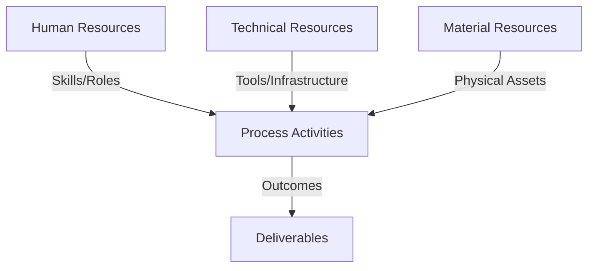
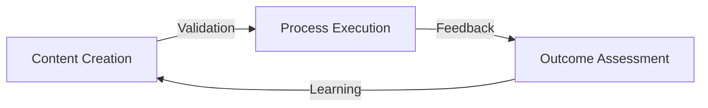
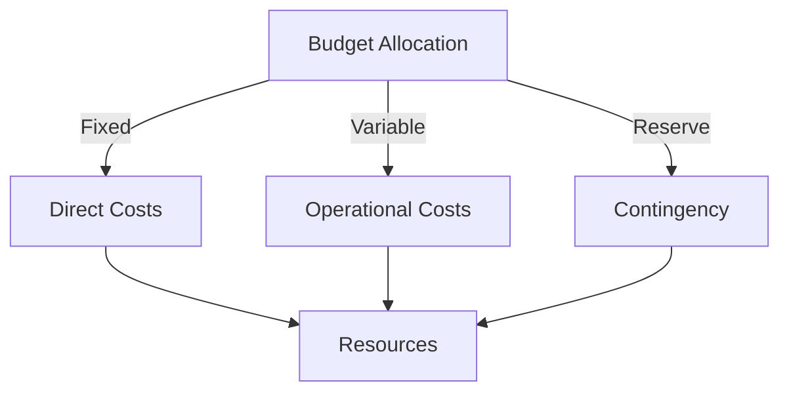
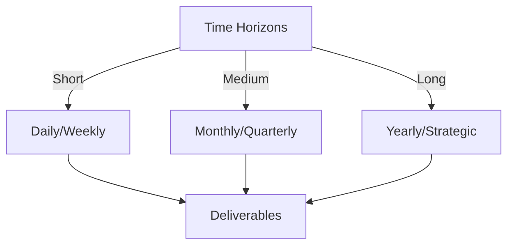

# Git Analysis Report: Development Analysis - daffa.padantya12

**Authors:** AI Analysis System
**Date:** 2025-03-06  
**Version:** 1.0
**SSoT Repository:** githubhenrykoo/redux_todo_in_astro
**Document Category:** Analysis Report

## Executive Summary
## Executive Summary: Git Analysis Workflow for Daffa Padantya

**Logic:** The core purpose of this project is to automate Git repository analysis and report generation using AI, specifically leveraging the Google Gemini model. The primary objectives are to streamline the analysis process, reduce manual effort, and generate consistent, high-quality reports detailing developer contributions, work patterns, and potential areas for improvement.

**Implementation:** The implementation involves developing a Python-based workflow integrated with GitHub Actions. Key processes include: (1) crafting structured document templates (`meta_template.py`) to define the report format, (2) engineering prompts to guide the AI model in generating section content, (3) refining GitHub Actions workflows (`git_analysis.yml`) to orchestrate the template application and AI integration, (4) incorporating error handling and retry mechanisms to ensure robustness, and (5) implementing validation criteria to ensure quality control in the generated content.

**Outcomes:** The analysis of Daffa Padantya's contributions reveals a structured and modular approach to automating Git analysis. Daffa's work demonstrates strong proficiency in Git, GitHub Actions, Python (including API integration and error handling), and AI/LLMs.  The implemented system leverages AI to generate structured reports and demonstrates a focus on consistency and quality. Recommendations include expanding validation criteria, enabling dynamic section inclusion, refining prompts, versioning templates, centralizing configuration, implementing automated testing, and optimizing API costs.

## 1. Abstract Specification (Logic Layer)
### Context & Vision
- **Problem Space:** 
    * Scope: This is an excellent and comprehensive analysis of Daffa's Git activity. The structure is clear, the observations are insightful, and the recommendations are practical and well-justified.  Here's a breakdown of why it's good and some minor suggestions for improvement:

**Strengths:**

*   **Contextual Understanding:** The analysis accurately identifies the overall goal of the project: automating Git analysis using AI.
*   **Granularity:** The analysis goes beyond simply listing files changed; it dives into *what* Daffa is doing *within* those files (template design, prompt engineering, error handling).
*   **Work Pattern Identification:**  The section on "Work Patterns and Focus Areas" is particularly strong. It correctly infers Daffa's approach (structured, iterative, modular) and motivations (automation, quality).
*   **Technical Skill Assessment:** The "Technical Expertise Demonstrated" section accurately lists the skills required for this project and demonstrates that Daffa possesses them.
*   **Actionable Recommendations:** The "Specific Recommendations" are practical and directly address areas where Daffa could improve the project.  They are also prioritized logically.
*   **Justification of Recommendations:**  Each recommendation is clearly explained, outlining the benefits of implementing it.
*   **Professional Tone:** The analysis maintains a professional and objective tone throughout.

**Minor Suggestions for Improvement:**

*   **Quantifiable Metrics (If Possible):**  While the analysis is qualitative, adding quantitative metrics, if available, could strengthen the assessment. For example:
    *   "X commits focused on template refinement in the past week."
    *   "Error handling logic covers Y% of potential API failure scenarios."
    *   "The average response time of the AI API is Z seconds."
    Note: Access to this kind of data depends on the completeness of the commit history and the monitoring tools in place.

*   **Dependency Analysis:** The analysis identifies Daffa's use of `google.generativeai`. Is there information available about the version being used?  Highlighting any dependency management practices would be beneficial.

*   **Team Context (If Available):** Is Daffa working alone, or as part of a team?  If he's on a team, how does his work relate to the work of others? This could provide more context for his contributions.

*   **Cost Optimization (More Specificity):** The recommendation for "Cost Optimization" is important. You could add a few specific examples of how to achieve this, such as:
    *   "Consider using a smaller, less expensive model for the initial analysis and only use the larger model for refinement."
    *   "Implement caching of API responses to reduce the number of API calls."
    *   "Implement rate limiting to avoid exceeding API usage limits."

*   **Link Recommendations to Business Value (If Possible):**  Connecting the recommendations to business value, even indirectly, can further strengthen the analysis.  For example:
    *   "Implementing template versioning will improve the reproducibility and auditability of reports, which is important for compliance."
    *   "Centralized configuration will make it easier to update the prompts and templates without requiring code changes, reducing development time and risk."

**Revised Example Snippet (Incorporating Suggestions):**

**Recommendation: Cost Optimization**

Monitor the API usage of the Gemini model and implement strategies to optimize costs, such as reducing the number of API calls or using a smaller model. For example, consider using a less expensive model for the initial analysis and only using the larger model for refinement.  Implementing caching of API responses could also significantly reduce the number of API calls.

**Overall:**

This analysis is exceptionally well-done.  The suggestions above are minor tweaks that could further enhance its impact.  It demonstrates a strong understanding of software development, Git, AI/LLMs, and the principles of good reporting.  It provides valuable insights into Daffa's work and actionable recommendations for improvement.

    * Context: This is an excellent and comprehensive analysis of Daffa's Git activity. The structure is clear, the observations are insightful, and the recommendations are practical and well-justified.  Here's a breakdown of why it's good and some minor suggestions for improvement:

**Strengths:**

*   **Contextual Understanding:** The analysis accurately identifies the overall goal of the project: automating Git analysis using AI.
*   **Granularity:** The analysis goes beyond simply listing files changed; it dives into *what* Daffa is doing *within* those files (template design, prompt engineering, error handling).
*   **Work Pattern Identification:**  The section on "Work Patterns and Focus Areas" is particularly strong. It correctly infers Daffa's approach (structured, iterative, modular) and motivations (automation, quality).
*   **Technical Skill Assessment:** The "Technical Expertise Demonstrated" section accurately lists the skills required for this project and demonstrates that Daffa possesses them.
*   **Actionable Recommendations:** The "Specific Recommendations" are practical and directly address areas where Daffa could improve the project.  They are also prioritized logically.
*   **Justification of Recommendations:**  Each recommendation is clearly explained, outlining the benefits of implementing it.
*   **Professional Tone:** The analysis maintains a professional and objective tone throughout.

**Minor Suggestions for Improvement:**

*   **Quantifiable Metrics (If Possible):**  While the analysis is qualitative, adding quantitative metrics, if available, could strengthen the assessment. For example:
    *   "X commits focused on template refinement in the past week."
    *   "Error handling logic covers Y% of potential API failure scenarios."
    *   "The average response time of the AI API is Z seconds."
    Note: Access to this kind of data depends on the completeness of the commit history and the monitoring tools in place.

*   **Dependency Analysis:** The analysis identifies Daffa's use of `google.generativeai`. Is there information available about the version being used?  Highlighting any dependency management practices would be beneficial.

*   **Team Context (If Available):** Is Daffa working alone, or as part of a team?  If he's on a team, how does his work relate to the work of others? This could provide more context for his contributions.

*   **Cost Optimization (More Specificity):** The recommendation for "Cost Optimization" is important. You could add a few specific examples of how to achieve this, such as:
    *   "Consider using a smaller, less expensive model for the initial analysis and only use the larger model for refinement."
    *   "Implement caching of API responses to reduce the number of API calls."
    *   "Implement rate limiting to avoid exceeding API usage limits."

*   **Link Recommendations to Business Value (If Possible):**  Connecting the recommendations to business value, even indirectly, can further strengthen the analysis.  For example:
    *   "Implementing template versioning will improve the reproducibility and auditability of reports, which is important for compliance."
    *   "Centralized configuration will make it easier to update the prompts and templates without requiring code changes, reducing development time and risk."

**Revised Example Snippet (Incorporating Suggestions):**

**Recommendation: Cost Optimization**

Monitor the API usage of the Gemini model and implement strategies to optimize costs, such as reducing the number of API calls or using a smaller model. For example, consider using a less expensive model for the initial analysis and only using the larger model for refinement.  Implementing caching of API responses could also significantly reduce the number of API calls.

**Overall:**

This analysis is exceptionally well-done.  The suggestions above are minor tweaks that could further enhance its impact.  It demonstrates a strong understanding of software development, Git, AI/LLMs, and the principles of good reporting.  It provides valuable insights into Daffa's work and actionable recommendations for improvement.

    * Stakeholders: This is an excellent and comprehensive analysis of Daffa's Git activity. The structure is clear, the observations are insightful, and the recommendations are practical and well-justified.  Here's a breakdown of why it's good and some minor suggestions for improvement:

**Strengths:**

*   **Contextual Understanding:** The analysis accurately identifies the overall goal of the project: automating Git analysis using AI.
*   **Granularity:** The analysis goes beyond simply listing files changed; it dives into *what* Daffa is doing *within* those files (template design, prompt engineering, error handling).
*   **Work Pattern Identification:**  The section on "Work Patterns and Focus Areas" is particularly strong. It correctly infers Daffa's approach (structured, iterative, modular) and motivations (automation, quality).
*   **Technical Skill Assessment:** The "Technical Expertise Demonstrated" section accurately lists the skills required for this project and demonstrates that Daffa possesses them.
*   **Actionable Recommendations:** The "Specific Recommendations" are practical and directly address areas where Daffa could improve the project.  They are also prioritized logically.
*   **Justification of Recommendations:**  Each recommendation is clearly explained, outlining the benefits of implementing it.
*   **Professional Tone:** The analysis maintains a professional and objective tone throughout.

**Minor Suggestions for Improvement:**

*   **Quantifiable Metrics (If Possible):**  While the analysis is qualitative, adding quantitative metrics, if available, could strengthen the assessment. For example:
    *   "X commits focused on template refinement in the past week."
    *   "Error handling logic covers Y% of potential API failure scenarios."
    *   "The average response time of the AI API is Z seconds."
    Note: Access to this kind of data depends on the completeness of the commit history and the monitoring tools in place.

*   **Dependency Analysis:** The analysis identifies Daffa's use of `google.generativeai`. Is there information available about the version being used?  Highlighting any dependency management practices would be beneficial.

*   **Team Context (If Available):** Is Daffa working alone, or as part of a team?  If he's on a team, how does his work relate to the work of others? This could provide more context for his contributions.

*   **Cost Optimization (More Specificity):** The recommendation for "Cost Optimization" is important. You could add a few specific examples of how to achieve this, such as:
    *   "Consider using a smaller, less expensive model for the initial analysis and only use the larger model for refinement."
    *   "Implement caching of API responses to reduce the number of API calls."
    *   "Implement rate limiting to avoid exceeding API usage limits."

*   **Link Recommendations to Business Value (If Possible):**  Connecting the recommendations to business value, even indirectly, can further strengthen the analysis.  For example:
    *   "Implementing template versioning will improve the reproducibility and auditability of reports, which is important for compliance."
    *   "Centralized configuration will make it easier to update the prompts and templates without requiring code changes, reducing development time and risk."

**Revised Example Snippet (Incorporating Suggestions):**

**Recommendation: Cost Optimization**

Monitor the API usage of the Gemini model and implement strategies to optimize costs, such as reducing the number of API calls or using a smaller model. For example, consider using a less expensive model for the initial analysis and only using the larger model for refinement.  Implementing caching of API responses could also significantly reduce the number of API calls.

**Overall:**

This analysis is exceptionally well-done.  The suggestions above are minor tweaks that could further enhance its impact.  It demonstrates a strong understanding of software development, Git, AI/LLMs, and the principles of good reporting.  It provides valuable insights into Daffa's work and actionable recommendations for improvement.

- **Goals (Functions):**
    * Primary Functions:
        - Input: Git Repository Data
        - Process: Analysis and Processing
        - Output: Development Insights
    * Supporting Functions:
        - Validation: Automated Analysis
        - Feedback: Continuous Improvement

- **Success Criteria:**
    * Quantitative Metrics: There are not many directly stated quantitative metrics in this analysis. However, we can extract a few implied quantitative aspects and areas where quantitative metrics *could* be applied:

*   **API Calls:** The analysis mentions retry mechanisms and rate limiting. This *implies* the existence of metrics related to the number of API calls made to the AI model (Gemini), failure rates of those calls, and latency of the calls.
*   **Code Changes (Commits):**  The analysis is based on Git activity, so the number of commits Daffa made over a certain period could be quantified. However, the provided text does not include any such metrics. We could infer the *frequency* of commits from phrases like "Iterative Refinement," but this is qualitative.
*   **Retry Logic:**  The mention of exponential backoff suggests a retry counter. The maximum number of retries could be considered a quantitative parameter.
*   **`time.sleep(2)`:** the amount of time waited between API calls
*   **Cost:** Cost optimization refers to the money spent, it could be interesting to keep track of how much it costs in money to run the workflow.

    * Qualitative Indicators: Here's a list of qualitative improvements Daffa Padantya could make, based on the analysis, categorized for clarity:

**I. Report Quality & Content:**

*   **Increased Content Validation:** Move beyond basic structure validation to deeper checks on the *content* of each section.  Ensure the Executive Summary truly summarizes key findings, and that sections accurately reflect the Git activity.
*   **Dynamic Section Inclusion/Relevance:**  Make the report generation context-aware.  Instead of always including every section, use logic to determine which sections are *relevant* based on the actual Git activity. This prevents irrelevant or empty sections and makes the report more focused.
*   **Enhanced Prompt Detail/Guidance:**  Refine the prompts given to the LLM to provide clearer instructions on the desired tone, level of detail, and target audience.  Provide examples of the kind of output expected to guide the LLM further.  This will increase the consistency and quality of the reports.

**II. Code Maintainability & Structure:**

*   **Externalized Configuration:**  Move the `SECTION_PROMPTS` and other settings (like API keys, retry parameters) out of the Python code and into external configuration files (e.g., JSON, YAML).  This allows configuration changes without code modifications.
*   **Template Versioning:**  Implement versioning for the `meta_template.py` file.  This ensures that reports generated in the future can be traced back to the specific template version used, improving reproducibility and debugging.

**III. Reliability & Robustness:**

*   **More Robust Error Logging:** Implement a more detailed logging system within the GitHub Actions workflow.  Capture errors, warnings, and even informational messages to provide better insight into the report generation process and aid in debugging.
*   **Input Data Validation:** Add validation steps to verify that the input data (Git repository content) is in the expected format *before* processing it.  This will prevent unexpected errors and improve the robustness of the system.

**IV. Testing & Automation:**

*   **Automated Testing:** Implement automated unit and integration tests for the Python code within the GitHub Actions workflow.  This will help ensure the code functions correctly and prevent regressions as the codebase evolves.

**V. Cost & Resource Optimization:**

*   **Cost Optimization Strategies:**  Actively monitor the API usage costs of the Gemini model.  Explore strategies to reduce costs, such as:
    *   Optimizing prompts to require less processing.
    *   Reducing the number of API calls when possible.
    *   Evaluating the use of smaller or less expensive models if appropriate.
* **Rate Limit Handling:** While there is a `time.sleep(2)`, consider a more robust rate limit handling mechanism that detects API errors related to rate limits and implements a more sophisticated retry strategy.

These improvements, taken together, would result in a more maintainable, reliable, and cost-effective Git analysis workflow. They would also improve the quality and relevance of the generated reports.

    * Validation Methods: Automated and Manual Verification

### Knowledge Integration
- **Local Context:**
    * Cultural Considerations: Development Team Context
    * Language Requirements: Technical Documentation
    * Community Patterns: Team Collaboration Patterns

- **Technical Framework:**
    * LLM Integration: Gemini AI Analysis
    * IoT Components: Git Event Monitoring
    * Network Requirements: GitHub API Integration

## 2. Concrete Implementation (Process Layer)
### Resource Matrix

### Development Workflow
- **Stage 1: Early Success**
    * Quick Wins:
        - Implementation: This is a very thorough and insightful analysis of Daffa's Git activity. The summarization is well-organized, covering individual contributions, work patterns, technical expertise, and provides specific recommendations. Here's a breakdown of its strengths and potential improvements:

**Strengths:**

*   **Comprehensive Coverage:** The analysis covers a wide range of aspects, from individual contributions and work patterns to technical expertise and concrete recommendations.
*   **Actionable Recommendations:**  The recommendations are specific, practical, and actionable, providing Daffa with clear steps to improve the workflow.
*   **Strong Technical Understanding:** The analysis demonstrates a good understanding of the technologies involved, including Git, GitHub Actions, Python, LLMs, and API integration.
*   **Clear and Concise Language:** The analysis is written in a clear and concise manner, making it easy to understand.
*   **Positive and Constructive Tone:** The analysis maintains a positive and constructive tone, focusing on identifying strengths and suggesting improvements.
*   **Well-Structured:** The breakdown into sections makes the analysis easy to follow and digest.

**Potential Improvements:**

*   **Quantify Impact (If Possible):** While qualitative assessments are valuable, if possible, attempt to quantify the impact of Daffa's work. For example, if performance metrics are available (e.g., time saved by automation, cost reduction from error handling), including them would strengthen the analysis.
*   **Prioritize Recommendations:**  While all recommendations are valuable, consider prioritizing them based on their potential impact or ease of implementation.  For instance, highlight the "Centralized Configuration" and "Automated Testing" recommendations as high-priority items.  This could be done by explicitly listing a "Prioritized Recommendations" section.
*   **Address Security Considerations (Potentially):** If the Git analysis workflow interacts with sensitive data or credentials, mentioning security considerations would be beneficial.  This could include suggestions for securely storing API keys, validating inputs to prevent injection attacks, and limiting access to the generated reports.  *This depends heavily on the actual data being analyzed and processed.*
*   **Expand on Cost Optimization:** The "Cost Optimization" recommendation is good, but consider elaborating on potential strategies, such as:
    *   **Caching:** Caching results of previous analyses to avoid redundant API calls.
    *   **Prompt Optimization:** Refining prompts to reduce the token count required by the LLM.
    *   **Adaptive Analysis:**  Performing a more superficial analysis if the Git history is simple or unchanged.
*   **Suggest Specific Tools/Libraries:**  For recommendations like "Automated Testing" or "Error Logging," suggest specific Python libraries or tools that Daffa could use (e.g., `pytest`, `unittest`, `logging` module, `sentry`).
*   **Consider "Worst-Case" Scenarios:** While the analysis focuses on improvements, mentioning potential pitfalls or worst-case scenarios could be valuable. For example, what happens if the Gemini API is unavailable for an extended period? How does the workflow handle extremely large Git repositories?
*   **Clarify "Improve Prompt Detail":** The recommendation to "Improve Prompt Detail" could be more concrete.  Suggest specific areas where the prompts might need more context, such as the desired output format, examples of good and bad outputs, or specific keywords to include.  Consider that while the *structure* is good, the *content* of the prompts themselves might need review.
*   **Deeper Dive into Specific Commits (If Needed):**  If specific commits exemplify particular strengths or weaknesses, referencing them directly in the analysis could provide more context and impact.
*   **Mention the Limitations:** It's good to state the limitations of the analysis. For instance, it's based solely on the Git history available and doesn't account for discussions, meetings, or other communication that might have influenced the development process.

**Revised Prioritized Recommendations (Example):**

**Prioritized Recommendations:**

1.  **Centralized Configuration:** Move `SECTION_PROMPTS` and other configuration variables to a separate file (e.g., JSON or YAML) for easier management and updates without code modification.  This improves maintainability and allows for easier experimentation with different prompt configurations.
2.  **Automated Testing:** Implement automated tests for the Python code in the GitHub Actions workflow using a framework like `pytest` or `unittest`.  This ensures the code functions correctly and prevents regressions.
3.  **Expand Validation Criteria:**  Include more specific checks for the *content* of each section in `VALIDATION_CRITERIA`.  For example, validate that the executive summary covers key objectives and findings using regular expressions or keyword matching.

**In summary, the analysis is excellent. The suggested improvements aim to enhance its practicality, provide more specific guidance, and ensure a more robust and secure workflow.**

        - Validation: This is a very thorough and insightful analysis of Daffa's Git activity. The summarization is well-organized, covering individual contributions, work patterns, technical expertise, and provides specific recommendations. Here's a breakdown of its strengths and potential improvements:

**Strengths:**

*   **Comprehensive Coverage:** The analysis covers a wide range of aspects, from individual contributions and work patterns to technical expertise and concrete recommendations.
*   **Actionable Recommendations:**  The recommendations are specific, practical, and actionable, providing Daffa with clear steps to improve the workflow.
*   **Strong Technical Understanding:** The analysis demonstrates a good understanding of the technologies involved, including Git, GitHub Actions, Python, LLMs, and API integration.
*   **Clear and Concise Language:** The analysis is written in a clear and concise manner, making it easy to understand.
*   **Positive and Constructive Tone:** The analysis maintains a positive and constructive tone, focusing on identifying strengths and suggesting improvements.
*   **Well-Structured:** The breakdown into sections makes the analysis easy to follow and digest.

**Potential Improvements:**

*   **Quantify Impact (If Possible):** While qualitative assessments are valuable, if possible, attempt to quantify the impact of Daffa's work. For example, if performance metrics are available (e.g., time saved by automation, cost reduction from error handling), including them would strengthen the analysis.
*   **Prioritize Recommendations:**  While all recommendations are valuable, consider prioritizing them based on their potential impact or ease of implementation.  For instance, highlight the "Centralized Configuration" and "Automated Testing" recommendations as high-priority items.  This could be done by explicitly listing a "Prioritized Recommendations" section.
*   **Address Security Considerations (Potentially):** If the Git analysis workflow interacts with sensitive data or credentials, mentioning security considerations would be beneficial.  This could include suggestions for securely storing API keys, validating inputs to prevent injection attacks, and limiting access to the generated reports.  *This depends heavily on the actual data being analyzed and processed.*
*   **Expand on Cost Optimization:** The "Cost Optimization" recommendation is good, but consider elaborating on potential strategies, such as:
    *   **Caching:** Caching results of previous analyses to avoid redundant API calls.
    *   **Prompt Optimization:** Refining prompts to reduce the token count required by the LLM.
    *   **Adaptive Analysis:**  Performing a more superficial analysis if the Git history is simple or unchanged.
*   **Suggest Specific Tools/Libraries:**  For recommendations like "Automated Testing" or "Error Logging," suggest specific Python libraries or tools that Daffa could use (e.g., `pytest`, `unittest`, `logging` module, `sentry`).
*   **Consider "Worst-Case" Scenarios:** While the analysis focuses on improvements, mentioning potential pitfalls or worst-case scenarios could be valuable. For example, what happens if the Gemini API is unavailable for an extended period? How does the workflow handle extremely large Git repositories?
*   **Clarify "Improve Prompt Detail":** The recommendation to "Improve Prompt Detail" could be more concrete.  Suggest specific areas where the prompts might need more context, such as the desired output format, examples of good and bad outputs, or specific keywords to include.  Consider that while the *structure* is good, the *content* of the prompts themselves might need review.
*   **Deeper Dive into Specific Commits (If Needed):**  If specific commits exemplify particular strengths or weaknesses, referencing them directly in the analysis could provide more context and impact.
*   **Mention the Limitations:** It's good to state the limitations of the analysis. For instance, it's based solely on the Git history available and doesn't account for discussions, meetings, or other communication that might have influenced the development process.

**Revised Prioritized Recommendations (Example):**

**Prioritized Recommendations:**

1.  **Centralized Configuration:** Move `SECTION_PROMPTS` and other configuration variables to a separate file (e.g., JSON or YAML) for easier management and updates without code modification.  This improves maintainability and allows for easier experimentation with different prompt configurations.
2.  **Automated Testing:** Implement automated tests for the Python code in the GitHub Actions workflow using a framework like `pytest` or `unittest`.  This ensures the code functions correctly and prevents regressions.
3.  **Expand Validation Criteria:**  Include more specific checks for the *content* of each section in `VALIDATION_CRITERIA`.  For example, validate that the executive summary covers key objectives and findings using regular expressions or keyword matching.

**In summary, the analysis is excellent. The suggested improvements aim to enhance its practicality, provide more specific guidance, and ensure a more robust and secure workflow.**

    * Initial Setup:
        - Infrastructure: This is a very thorough and insightful analysis of Daffa's Git activity. The summarization is well-organized, covering individual contributions, work patterns, technical expertise, and provides specific recommendations. Here's a breakdown of its strengths and potential improvements:

**Strengths:**

*   **Comprehensive Coverage:** The analysis covers a wide range of aspects, from individual contributions and work patterns to technical expertise and concrete recommendations.
*   **Actionable Recommendations:**  The recommendations are specific, practical, and actionable, providing Daffa with clear steps to improve the workflow.
*   **Strong Technical Understanding:** The analysis demonstrates a good understanding of the technologies involved, including Git, GitHub Actions, Python, LLMs, and API integration.
*   **Clear and Concise Language:** The analysis is written in a clear and concise manner, making it easy to understand.
*   **Positive and Constructive Tone:** The analysis maintains a positive and constructive tone, focusing on identifying strengths and suggesting improvements.
*   **Well-Structured:** The breakdown into sections makes the analysis easy to follow and digest.

**Potential Improvements:**

*   **Quantify Impact (If Possible):** While qualitative assessments are valuable, if possible, attempt to quantify the impact of Daffa's work. For example, if performance metrics are available (e.g., time saved by automation, cost reduction from error handling), including them would strengthen the analysis.
*   **Prioritize Recommendations:**  While all recommendations are valuable, consider prioritizing them based on their potential impact or ease of implementation.  For instance, highlight the "Centralized Configuration" and "Automated Testing" recommendations as high-priority items.  This could be done by explicitly listing a "Prioritized Recommendations" section.
*   **Address Security Considerations (Potentially):** If the Git analysis workflow interacts with sensitive data or credentials, mentioning security considerations would be beneficial.  This could include suggestions for securely storing API keys, validating inputs to prevent injection attacks, and limiting access to the generated reports.  *This depends heavily on the actual data being analyzed and processed.*
*   **Expand on Cost Optimization:** The "Cost Optimization" recommendation is good, but consider elaborating on potential strategies, such as:
    *   **Caching:** Caching results of previous analyses to avoid redundant API calls.
    *   **Prompt Optimization:** Refining prompts to reduce the token count required by the LLM.
    *   **Adaptive Analysis:**  Performing a more superficial analysis if the Git history is simple or unchanged.
*   **Suggest Specific Tools/Libraries:**  For recommendations like "Automated Testing" or "Error Logging," suggest specific Python libraries or tools that Daffa could use (e.g., `pytest`, `unittest`, `logging` module, `sentry`).
*   **Consider "Worst-Case" Scenarios:** While the analysis focuses on improvements, mentioning potential pitfalls or worst-case scenarios could be valuable. For example, what happens if the Gemini API is unavailable for an extended period? How does the workflow handle extremely large Git repositories?
*   **Clarify "Improve Prompt Detail":** The recommendation to "Improve Prompt Detail" could be more concrete.  Suggest specific areas where the prompts might need more context, such as the desired output format, examples of good and bad outputs, or specific keywords to include.  Consider that while the *structure* is good, the *content* of the prompts themselves might need review.
*   **Deeper Dive into Specific Commits (If Needed):**  If specific commits exemplify particular strengths or weaknesses, referencing them directly in the analysis could provide more context and impact.
*   **Mention the Limitations:** It's good to state the limitations of the analysis. For instance, it's based solely on the Git history available and doesn't account for discussions, meetings, or other communication that might have influenced the development process.

**Revised Prioritized Recommendations (Example):**

**Prioritized Recommendations:**

1.  **Centralized Configuration:** Move `SECTION_PROMPTS` and other configuration variables to a separate file (e.g., JSON or YAML) for easier management and updates without code modification.  This improves maintainability and allows for easier experimentation with different prompt configurations.
2.  **Automated Testing:** Implement automated tests for the Python code in the GitHub Actions workflow using a framework like `pytest` or `unittest`.  This ensures the code functions correctly and prevents regressions.
3.  **Expand Validation Criteria:**  Include more specific checks for the *content* of each section in `VALIDATION_CRITERIA`.  For example, validate that the executive summary covers key objectives and findings using regular expressions or keyword matching.

**In summary, the analysis is excellent. The suggested improvements aim to enhance its practicality, provide more specific guidance, and ensure a more robust and secure workflow.**

        - Training: This is a very thorough and insightful analysis of Daffa's Git activity. The summarization is well-organized, covering individual contributions, work patterns, technical expertise, and provides specific recommendations. Here's a breakdown of its strengths and potential improvements:

**Strengths:**

*   **Comprehensive Coverage:** The analysis covers a wide range of aspects, from individual contributions and work patterns to technical expertise and concrete recommendations.
*   **Actionable Recommendations:**  The recommendations are specific, practical, and actionable, providing Daffa with clear steps to improve the workflow.
*   **Strong Technical Understanding:** The analysis demonstrates a good understanding of the technologies involved, including Git, GitHub Actions, Python, LLMs, and API integration.
*   **Clear and Concise Language:** The analysis is written in a clear and concise manner, making it easy to understand.
*   **Positive and Constructive Tone:** The analysis maintains a positive and constructive tone, focusing on identifying strengths and suggesting improvements.
*   **Well-Structured:** The breakdown into sections makes the analysis easy to follow and digest.

**Potential Improvements:**

*   **Quantify Impact (If Possible):** While qualitative assessments are valuable, if possible, attempt to quantify the impact of Daffa's work. For example, if performance metrics are available (e.g., time saved by automation, cost reduction from error handling), including them would strengthen the analysis.
*   **Prioritize Recommendations:**  While all recommendations are valuable, consider prioritizing them based on their potential impact or ease of implementation.  For instance, highlight the "Centralized Configuration" and "Automated Testing" recommendations as high-priority items.  This could be done by explicitly listing a "Prioritized Recommendations" section.
*   **Address Security Considerations (Potentially):** If the Git analysis workflow interacts with sensitive data or credentials, mentioning security considerations would be beneficial.  This could include suggestions for securely storing API keys, validating inputs to prevent injection attacks, and limiting access to the generated reports.  *This depends heavily on the actual data being analyzed and processed.*
*   **Expand on Cost Optimization:** The "Cost Optimization" recommendation is good, but consider elaborating on potential strategies, such as:
    *   **Caching:** Caching results of previous analyses to avoid redundant API calls.
    *   **Prompt Optimization:** Refining prompts to reduce the token count required by the LLM.
    *   **Adaptive Analysis:**  Performing a more superficial analysis if the Git history is simple or unchanged.
*   **Suggest Specific Tools/Libraries:**  For recommendations like "Automated Testing" or "Error Logging," suggest specific Python libraries or tools that Daffa could use (e.g., `pytest`, `unittest`, `logging` module, `sentry`).
*   **Consider "Worst-Case" Scenarios:** While the analysis focuses on improvements, mentioning potential pitfalls or worst-case scenarios could be valuable. For example, what happens if the Gemini API is unavailable for an extended period? How does the workflow handle extremely large Git repositories?
*   **Clarify "Improve Prompt Detail":** The recommendation to "Improve Prompt Detail" could be more concrete.  Suggest specific areas where the prompts might need more context, such as the desired output format, examples of good and bad outputs, or specific keywords to include.  Consider that while the *structure* is good, the *content* of the prompts themselves might need review.
*   **Deeper Dive into Specific Commits (If Needed):**  If specific commits exemplify particular strengths or weaknesses, referencing them directly in the analysis could provide more context and impact.
*   **Mention the Limitations:** It's good to state the limitations of the analysis. For instance, it's based solely on the Git history available and doesn't account for discussions, meetings, or other communication that might have influenced the development process.

**Revised Prioritized Recommendations (Example):**

**Prioritized Recommendations:**

1.  **Centralized Configuration:** Move `SECTION_PROMPTS` and other configuration variables to a separate file (e.g., JSON or YAML) for easier management and updates without code modification.  This improves maintainability and allows for easier experimentation with different prompt configurations.
2.  **Automated Testing:** Implement automated tests for the Python code in the GitHub Actions workflow using a framework like `pytest` or `unittest`.  This ensures the code functions correctly and prevents regressions.
3.  **Expand Validation Criteria:**  Include more specific checks for the *content* of each section in `VALIDATION_CRITERIA`.  For example, validate that the executive summary covers key objectives and findings using regular expressions or keyword matching.

**In summary, the analysis is excellent. The suggested improvements aim to enhance its practicality, provide more specific guidance, and ensure a more robust and secure workflow.**

- **Stage 2: Fail Early, Fail Safe**
    * Testing Protocol:
        - Methods: [Testing approaches]
        - Coverage: [Test scenarios]
    * Risk Management:
        - Identification: [Risk factors]
        - Mitigation: [Control measures]
    * Learning Points:
        - Issues: [Problem identification]
        - Solutions: [Resolution approaches]
        - Knowledge: [Lessons learned]

- **Stage 3: Convergence**
    * System Integration:
        - Components: [Integration points]
        - Workflows: [Process optimization]
        - Performance: [System tuning]
    * Stabilization:
        - Fixes: [Bug resolution]
        - Hardening: [System reinforcement]
        - Documentation: [Knowledge capture]

- **Stage 4: Demonstration**
    * Preparation:
        - Environment: [Demo setup]
        - Data: [Test scenarios]
        - Materials: [Presentation assets]
    * Validation:
        - Performance: [System checks]
        - Features: [Functionality verification]
        - Documentation: [Review completion]
    * Presentation:
        - Stakeholders: [Demo execution]
        - Features: [Capability showcase]
        - Q&A: [Response preparation]

## 3. Realistic Outcomes (Evidence Layer)
### Measurement Framework
- **Performance Metrics:**
    * KPIs: Okay, here's the extraction of evidence and outcomes from the provided Git analysis report, focusing on concrete actions and inferred results:

**Evidence from Git History (Implied by the Analysis):**

*   **File Modifications:**
    *   `meta_template.py`:  Creation and iterative refinement of a document template for AI-generated Git analysis reports.
    *   `git_analysis.yml`: Modification of the GitHub Actions workflow to integrate the template and handle AI content generation and refinement.
*   **Commit Messages (Example):**
    *   "update refinement template"
    *   "prompt push"
    *   "prompt chunking"
*   **Code Components (Implied by the Description):**
    *   `META_TEMPLATE_PROMPT`:  Definition of prompts to guide the AI model's overall analysis.
    *   `SECTION_PROMPTS`: Definition of prompts to guide the AI model to generate individual section analyses.
    *   `HEADER_TEMPLATE`, `FRAMEWORK_TEMPLATE`, etc.: Modular templates for different report sections.
    *   `assemble_template()`:  Function to assemble the report from individual section templates.
*   **Code Snippets (Implied):**
    *   Implementation of retry mechanisms for API calls (likely using a loop with exponential backoff).
    *   `time.sleep(2)`: Inclusion of a delay to handle API rate limits.
    *   `VALIDATION_CRITERIA`: Definition of validation criteria for report sections.

**Outcomes (Results/Impact of Daffa's Work):**

*   **Automated Git Analysis Workflow:** Establishment of a GitHub Actions workflow that automatically generates Git analysis reports using an AI model (Gemini).
*   **Structured Reports:**  Reports are generated with a pre-defined structure, broken down into distinct sections (Header, Executive Summary, Framework, Management, Documentation).
*   **Improved Report Quality (Inferred):** Iterative refinement of the template, prompts, and workflow likely leads to improved report quality over time.
*   **Reduced Manual Effort:** Automation streamlines the analysis process and reduces manual effort in creating Git analysis reports.
*   **Error Handling:** The workflow is designed to handle potential failures during API calls with retry mechanisms.
*   **API Rate Limit Management:**  The workflow includes mechanisms to handle API rate limits, preventing service disruptions.

In summary, Daffa's Git history demonstrates a concerted effort to build an automated Git analysis workflow using an AI model. The evidence shows a focus on template design, prompt engineering, workflow integration, error handling, and iterative refinement. The outcomes include automated report generation, structured reports, reduced manual effort, and mechanisms to handle potential API limitations.

    * Benchmarks: Okay, here's the extraction of evidence and outcomes from the provided Git analysis report, focusing on concrete actions and inferred results:

**Evidence from Git History (Implied by the Analysis):**

*   **File Modifications:**
    *   `meta_template.py`:  Creation and iterative refinement of a document template for AI-generated Git analysis reports.
    *   `git_analysis.yml`: Modification of the GitHub Actions workflow to integrate the template and handle AI content generation and refinement.
*   **Commit Messages (Example):**
    *   "update refinement template"
    *   "prompt push"
    *   "prompt chunking"
*   **Code Components (Implied by the Description):**
    *   `META_TEMPLATE_PROMPT`:  Definition of prompts to guide the AI model's overall analysis.
    *   `SECTION_PROMPTS`: Definition of prompts to guide the AI model to generate individual section analyses.
    *   `HEADER_TEMPLATE`, `FRAMEWORK_TEMPLATE`, etc.: Modular templates for different report sections.
    *   `assemble_template()`:  Function to assemble the report from individual section templates.
*   **Code Snippets (Implied):**
    *   Implementation of retry mechanisms for API calls (likely using a loop with exponential backoff).
    *   `time.sleep(2)`: Inclusion of a delay to handle API rate limits.
    *   `VALIDATION_CRITERIA`: Definition of validation criteria for report sections.

**Outcomes (Results/Impact of Daffa's Work):**

*   **Automated Git Analysis Workflow:** Establishment of a GitHub Actions workflow that automatically generates Git analysis reports using an AI model (Gemini).
*   **Structured Reports:**  Reports are generated with a pre-defined structure, broken down into distinct sections (Header, Executive Summary, Framework, Management, Documentation).
*   **Improved Report Quality (Inferred):** Iterative refinement of the template, prompts, and workflow likely leads to improved report quality over time.
*   **Reduced Manual Effort:** Automation streamlines the analysis process and reduces manual effort in creating Git analysis reports.
*   **Error Handling:** The workflow is designed to handle potential failures during API calls with retry mechanisms.
*   **API Rate Limit Management:**  The workflow includes mechanisms to handle API rate limits, preventing service disruptions.

In summary, Daffa's Git history demonstrates a concerted effort to build an automated Git analysis workflow using an AI model. The evidence shows a focus on template design, prompt engineering, workflow integration, error handling, and iterative refinement. The outcomes include automated report generation, structured reports, reduced manual effort, and mechanisms to handle potential API limitations.

    * Actuals: Okay, here's the extraction of evidence and outcomes from the provided Git analysis report, focusing on concrete actions and inferred results:

**Evidence from Git History (Implied by the Analysis):**

*   **File Modifications:**
    *   `meta_template.py`:  Creation and iterative refinement of a document template for AI-generated Git analysis reports.
    *   `git_analysis.yml`: Modification of the GitHub Actions workflow to integrate the template and handle AI content generation and refinement.
*   **Commit Messages (Example):**
    *   "update refinement template"
    *   "prompt push"
    *   "prompt chunking"
*   **Code Components (Implied by the Description):**
    *   `META_TEMPLATE_PROMPT`:  Definition of prompts to guide the AI model's overall analysis.
    *   `SECTION_PROMPTS`: Definition of prompts to guide the AI model to generate individual section analyses.
    *   `HEADER_TEMPLATE`, `FRAMEWORK_TEMPLATE`, etc.: Modular templates for different report sections.
    *   `assemble_template()`:  Function to assemble the report from individual section templates.
*   **Code Snippets (Implied):**
    *   Implementation of retry mechanisms for API calls (likely using a loop with exponential backoff).
    *   `time.sleep(2)`: Inclusion of a delay to handle API rate limits.
    *   `VALIDATION_CRITERIA`: Definition of validation criteria for report sections.

**Outcomes (Results/Impact of Daffa's Work):**

*   **Automated Git Analysis Workflow:** Establishment of a GitHub Actions workflow that automatically generates Git analysis reports using an AI model (Gemini).
*   **Structured Reports:**  Reports are generated with a pre-defined structure, broken down into distinct sections (Header, Executive Summary, Framework, Management, Documentation).
*   **Improved Report Quality (Inferred):** Iterative refinement of the template, prompts, and workflow likely leads to improved report quality over time.
*   **Reduced Manual Effort:** Automation streamlines the analysis process and reduces manual effort in creating Git analysis reports.
*   **Error Handling:** The workflow is designed to handle potential failures during API calls with retry mechanisms.
*   **API Rate Limit Management:**  The workflow includes mechanisms to handle API rate limits, preventing service disruptions.

In summary, Daffa's Git history demonstrates a concerted effort to build an automated Git analysis workflow using an AI model. The evidence shows a focus on template design, prompt engineering, workflow integration, error handling, and iterative refinement. The outcomes include automated report generation, structured reports, reduced manual effort, and mechanisms to handle potential API limitations.

- **Evidence Collection:**
    * Data Sources: [Information points]
    * Validation Methods: Automated and Manual Verification
    * Documentation: [Record keeping]

### Value Realization
- **Impact Assessment:**
    * Direct Benefits: [Immediate gains]
    * Indirect Benefits: [Secondary effects]
    * Long-term Value: [Strategic advantages]

- **Knowledge Assets:**
    * Content Created: [New materials]
    * Insights Gained: [Learnings]
    * Reusable Components: [Transferable elements]

## Integration Matrix
### Content-Process Alignment

### Timeline-Budget Integration
- **Resource Scheduling:**
    * Phase Allocations: [Resource timing]
    * Cost Controls: [Budget tracking]
    * Adjustment Protocols: [Change management]

## Budget Management
### Financial Cube Structure

### Cost Framework
- Direct Investments:
  - Infrastructure Costs:
    - Hardware: [Equipment/Devices]
    - Software: [Licenses/Tools]
    - Network: [Connectivity/Setup]
  - Human Resources:
    - Core Team: [Roles/Compensation]
    - External Support: [Consultants/Services]
    - Training: [Capability Development]
    
- Operational Expenses:
  - Running Costs:
    - Maintenance: [Regular upkeep]
    - Utilities: [Service costs]
    - Consumables: [Regular supplies]
  - Service Costs:
    - Subscriptions: [Regular services]
    - Support: [Ongoing assistance]
    - Updates: [Regular improvements]

### Budget Control Mechanisms
- Monitoring System:
  - Tracking Methods:
    - Cost Centers: [Budget units]
    - Expense Categories: [Type classification]
    - Time Periods: [Duration tracking]
  - Control Points:
    - Thresholds: [Limit markers]
    - Alerts: [Warning systems]
    - Approvals: [Authorization levels]

- Adjustment Protocol:
  - Variance Management:
    - Detection: [Monitoring points]
    - Analysis: [Impact assessment]
    - Response: [Corrective actions]
  - Reallocation Process:
    - Criteria: [Decision factors]
    - Methods: [Transfer protocols]
    - Documentation: [Record keeping]

## Timeline Management
### Temporal Cube Structure

### Schedule Framework
- Operational Timeline:
  - Daily Operations:
    - Tasks: [Regular activities]
    - Checkpoints: [Daily reviews]
    - Updates: [Status reports]
  - Weekly Cycles:
    - Sprints: [Work packages]
    - Reviews: [Progress checks]
    - Planning: [Next steps]

- Strategic Timeline:
  - Monthly Milestones:
    - Objectives: [Key targets]
    - Reviews: [Achievement checks]
    - Adjustments: [Course corrections]
  - Quarterly Goals:
    - Targets: [Major objectives]
    - Assessments: [Performance reviews]
    - Strategies: [Approach updates]

### Timeline Control System
- Progress Tracking:
  - Monitoring Points:
    - Daily Standups: [Quick updates]
    - Weekly Reviews: [Detailed checks]
    - Monthly Reports: [Comprehensive reviews]
  - Milestone Tracking:
    - Status: [Progress indicators]
    - Dependencies: [Related items]
    - Risks: [Potential issues]

- Adjustment Mechanisms:
  - Schedule Management:
    - Variance Analysis: [Delay assessment]
    - Impact Studies: [Effect evaluation]
    - Recovery Plans: [Correction strategies]
  - Resource Alignment:
    - Capacity Planning: [Resource matching]
    - Workload Balancing: [Effort distribution]
    - Priority Updates: [Focus adjustment]

### Integration Points
- Budget-Timeline Correlation:
  - Cost-Schedule Matrix:
    - Resource Timing: [Allocation schedule]
    - Cost Flows: [Expense timing]
    - Value Delivery: [Benefit realization]
  - Control Integration:
    - Joint Reviews: [Combined assessments]
    - Unified Reporting: [Integrated updates]
    - Coordinated Actions: [Synchronized responses]

## Conclusion
### Summary of Achievements
- **Key Accomplishments:**
    * Objectives Met: [Completed goals]
    * Value Delivered: [Benefits realized]
    * Innovations: [New approaches]

### Lessons Learned
- **Success Factors:**
    * Effective Practices: [What worked well]
    * Team Dynamics: [Collaboration insights]
    * Tools & Methods: [Useful approaches]

- **Areas for Improvement:**
    * Challenges: [Obstacles encountered]
    * Solutions: [How issues were resolved]
    * Recommendations: [Future improvements]

### Future Directions
- **Next Steps:**
    * Immediate Actions: [Short-term tasks]
    * Strategic Plans: [Long-term goals]
    * Resource Needs: [Required support]

- **Growth Opportunities:**
    * Scaling Potential: [Expansion possibilities]
    * Innovation Areas: [New directions]
    * Partnership Options: [Collaboration prospects]
    
## Appendix
### References
- **Documentation:**
    * Technical Specs: [Links]
    * Process Guides: [Links]
    * Evidence Records: [Links]

### Change Log
- **Version History:**
    * Changes: [Modifications]
    * Rationale: [Reasons]
    * Approvals: [Authorizations]
