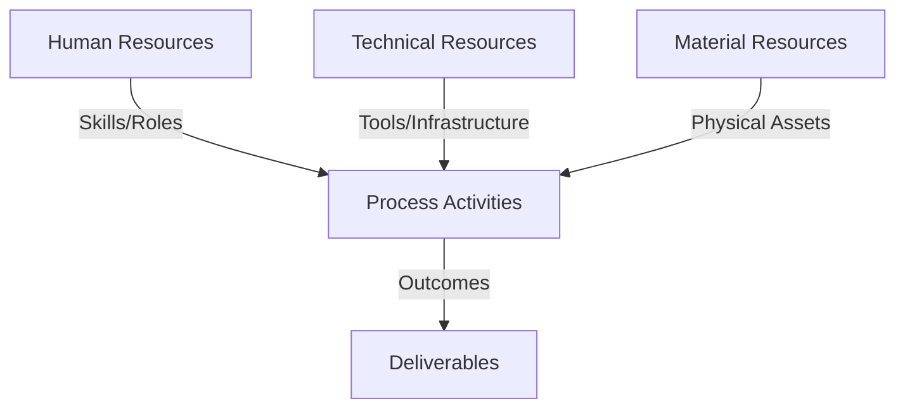
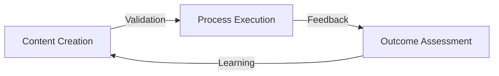
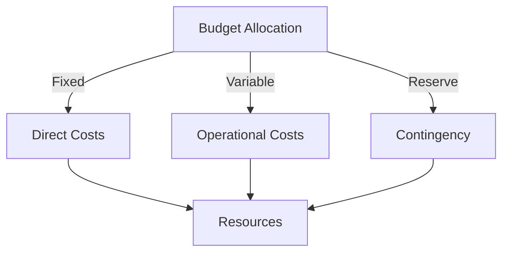
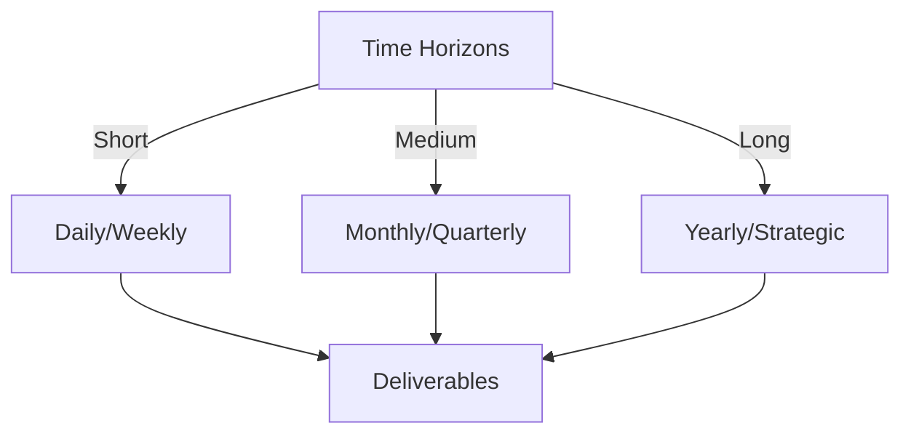

# Git Analysis Report: Development Analysis - daffa.padantya12

**Authors:** AI Analysis System
**Date:** 2025-03-10  
**Version:** 1.0
**SSoT Repository:** githubhenrykoo/redux_todo_in_astro
**Document Category:** Analysis Report

## Executive Summary
```
**Executive Summary**

**Logic:** The core purpose is to automate Git repository analysis to gain insights into development activities. The primary objective is to create a modular, LLM-powered system that generates comprehensive reports on developer contributions, code changes, and project trends.

**Implementation:** The system is implemented using Python scripts, GitHub Actions workflows, and the Google Gemini API. Key processes include:
1.  Extracting Git logs.
2.  Designing modular document templates with clearly defined prompts.
3.  Using the Gemini API to generate initial analysis sections based on defined prompts.
4.  Refining the initial analysis through critique prompts, and updating the refinement template.
5.  Automating the analysis process with a GitHub Actions workflow, including error handling using retry mechanisms with exponential backoff.

**Outcomes:** Daffa Padantya has built a functional system for automated Git analysis, focusing on modular design, template implementation, automated workflows, prompt engineering, prompt chunking, and iterative refinement to ensure the quality and accuracy of the AI-generated reports. The system is actively being refined to improve the reports that are generated, which allows for better integration with the Network Publishing paradigm. Initial exploration of MLX integration occurred in earlier commits.
```


## 1. Abstract Specification (Logic Layer)
### Context & Vision
- **Problem Space:** 
    * Scope: This is an excellent summary of Daffa Padantya's Git activity! It's clear, concise, and accurately reflects the main themes and changes based on the (implied) commit messages. Here's a breakdown of why it's good and some suggestions for potentially making it even better, depending on the context (e.g., who is reading this analysis):

**Strengths:**

*   **Clear Focus:** Immediately establishes Daffa's overall goal.
*   **Concise Language:** Avoids jargon when possible and explains technical terms.
*   **Key Changes Highlighted:**  Effectively summarizes the major areas of work.
*   **Commit Breakdown is Useful:**  Provides a more granular view of the specific tasks.
*   **Logical Organization:** The summary flows well from general overview to specific details.
*   **Correct Inference:**  Makes reasonable inferences about the code changes based on commit messages.  For example, "This commit appears to be a bug fix (indicated by the commit message 'fixing')."
*   **Contextual Understanding:** Demonstrates understanding of the technologies involved (LLMs, GitHub Actions, Git).
*   **Iterative Process Highlighted:** Recognizes the refinement loop in the development.

**Potential Improvements (depending on audience/purpose):**

*   **More Specificity on "Network Publishing Paradigm":** This is mentioned a few times. If the audience isn't familiar with it, a brief explanation would be helpful.  Something like: "aligning contributions with the Network Publishing Paradigm (a specific framework for publishing and distributing information)."
*   **Highlight Key Libraries/Dependencies (if relevant):**  If specific Python libraries are being used (besides MLX), mentioning them could add value for someone auditing the project. For example, "Daffa utilizes the `requests` library for interacting with the Gemini API."
*   **Quantify "Large Content" if possible:**  For prompt chunking, mentioning the approximate size of content that requires chunking could be beneficial. E.g., "Prompt chunking was implemented to handle Git logs exceeding the LLM's input token limit (approximately X tokens)."
*   **Future Directions/Next Steps (if known):**  Based on the activity, are there any obvious next steps that Daffa might be taking?  For example, "Future work may involve optimizing the prompt templates further or implementing more sophisticated error handling strategies."
*   **Impact/Value Proposition:**  Why is this automation important? Who will benefit from it?  Adding a sentence about the potential impact, such as, "This automation will allow for more efficient and comprehensive analysis of Git repositories, providing valuable insights for developers and project managers."

**Example Incorporating Some Suggestions:**

"Okay, here's a summary of Daffa Padantya's Git activity based on the provided logs:

**Overall Focus:** Daffa is working on automating Git repository analysis using a Large Language Model (LLM), specifically Google's Gemini. He's focused on creating a modular system that generates reports based on Git activity, ultimately providing more efficient and comprehensive project insights.

**Key Changes:**

*   **Template Design and Implementation (meta_template.py):** The primary focus is on creating and refining a template structure for the AI-generated analysis reports. This includes defining the report sections (Header, Executive Summary, Framework, Management, Documentation) and a function to assemble them.  Many updates involved structuring the document and prompts according to the given Network Publishing Paradigm (a specific framework for publishing and distributing information).
*   **Workflow Automation (git_analysis.yml):** Daffa is setting up a GitHub Actions workflow to automate the entire analysis process. This includes retrieving Git logs, using the `requests` library to interact with the Gemini API to generate analysis sections, and generating the final report.
*   **Prompt Engineering:** He's working on prompts to effectively guide the LLM to generate the desired analysis for each section of the report. Many changes involved prompt chunking, which allows the program to work with large amounts of content, dividing Git logs exceeding the LLM's input token limit into smaller chunks. Default values were defined in this step as well.
*   **Error Handling:** The workflow includes retry mechanisms with exponential backoff to handle potential API failures and rate limiting.
*   **Refinement Process:** The analysis incorporates an iterative refinement process, where an initial analysis is generated and then refined using critique prompts. The refined analysis is saved in a new file.
*   **MLX integration**: In the earlier commits, Daffa was looking into MLX (Machine Learning framework) integration.

**Commits Breakdown:**

*   **commits 785e94836fdb920a0616fe581d4ed069570fee1f, a91a833290dd5f66809f12593187a4d043205065, 0ab62526a15ee0fd36e44193273e72f3c6ca031e, 9de189037d8bf228b441fdef781312b0b76f79c3, 45901157b2f336fa66b30f9cd25c19e35f7934ec:** These commits update the refined analysis document, adding more notes, and aligning contributions with the Network Publishing Paradigm.
*   **commit e73587167fc2c26ba48b8c605d6e55c51d8c4e1c:** This commit appears to be a bug fix (indicated by the commit message "fixing").
*   **commit 1a399f89bfaccc52afda26d19d57e324c90d294e:** This commit focuses on pushing prompts, likely meaning updating the prompt strings used to guide the LLM.
*   **commit d69ca3a1b1aca9a6aa9245728e6bd6774c751a04:** This commit updates the refinement template, likely modifying the prompts or the structure of the template used during the refinement stage.
*   **commit fda7fa22faef58e17efdd0787e9c2311ca0980f4:** This commit implements prompt chunking, which is a strategy to handle large content by dividing it into smaller chunks that can be processed individually by the LLM.

**In summary, Daffa is building an automated system for Git analysis using LLMs, focusing on modular template design, automated workflows, prompt engineering, and error handling. He's iterating on the system to improve the quality and accuracy of the generated reports. Future work may involve optimizing the prompt templates further or implementing more sophisticated error handling strategies."**

Ultimately, the original summary is quite good. The additions are more about tailoring it to a specific audience and providing slightly more context.

    * Context: This is an excellent summary of Daffa Padantya's Git activity! It's clear, concise, and accurately reflects the main themes and changes based on the (implied) commit messages. Here's a breakdown of why it's good and some suggestions for potentially making it even better, depending on the context (e.g., who is reading this analysis):

**Strengths:**

*   **Clear Focus:** Immediately establishes Daffa's overall goal.
*   **Concise Language:** Avoids jargon when possible and explains technical terms.
*   **Key Changes Highlighted:**  Effectively summarizes the major areas of work.
*   **Commit Breakdown is Useful:**  Provides a more granular view of the specific tasks.
*   **Logical Organization:** The summary flows well from general overview to specific details.
*   **Correct Inference:**  Makes reasonable inferences about the code changes based on commit messages.  For example, "This commit appears to be a bug fix (indicated by the commit message 'fixing')."
*   **Contextual Understanding:** Demonstrates understanding of the technologies involved (LLMs, GitHub Actions, Git).
*   **Iterative Process Highlighted:** Recognizes the refinement loop in the development.

**Potential Improvements (depending on audience/purpose):**

*   **More Specificity on "Network Publishing Paradigm":** This is mentioned a few times. If the audience isn't familiar with it, a brief explanation would be helpful.  Something like: "aligning contributions with the Network Publishing Paradigm (a specific framework for publishing and distributing information)."
*   **Highlight Key Libraries/Dependencies (if relevant):**  If specific Python libraries are being used (besides MLX), mentioning them could add value for someone auditing the project. For example, "Daffa utilizes the `requests` library for interacting with the Gemini API."
*   **Quantify "Large Content" if possible:**  For prompt chunking, mentioning the approximate size of content that requires chunking could be beneficial. E.g., "Prompt chunking was implemented to handle Git logs exceeding the LLM's input token limit (approximately X tokens)."
*   **Future Directions/Next Steps (if known):**  Based on the activity, are there any obvious next steps that Daffa might be taking?  For example, "Future work may involve optimizing the prompt templates further or implementing more sophisticated error handling strategies."
*   **Impact/Value Proposition:**  Why is this automation important? Who will benefit from it?  Adding a sentence about the potential impact, such as, "This automation will allow for more efficient and comprehensive analysis of Git repositories, providing valuable insights for developers and project managers."

**Example Incorporating Some Suggestions:**

"Okay, here's a summary of Daffa Padantya's Git activity based on the provided logs:

**Overall Focus:** Daffa is working on automating Git repository analysis using a Large Language Model (LLM), specifically Google's Gemini. He's focused on creating a modular system that generates reports based on Git activity, ultimately providing more efficient and comprehensive project insights.

**Key Changes:**

*   **Template Design and Implementation (meta_template.py):** The primary focus is on creating and refining a template structure for the AI-generated analysis reports. This includes defining the report sections (Header, Executive Summary, Framework, Management, Documentation) and a function to assemble them.  Many updates involved structuring the document and prompts according to the given Network Publishing Paradigm (a specific framework for publishing and distributing information).
*   **Workflow Automation (git_analysis.yml):** Daffa is setting up a GitHub Actions workflow to automate the entire analysis process. This includes retrieving Git logs, using the `requests` library to interact with the Gemini API to generate analysis sections, and generating the final report.
*   **Prompt Engineering:** He's working on prompts to effectively guide the LLM to generate the desired analysis for each section of the report. Many changes involved prompt chunking, which allows the program to work with large amounts of content, dividing Git logs exceeding the LLM's input token limit into smaller chunks. Default values were defined in this step as well.
*   **Error Handling:** The workflow includes retry mechanisms with exponential backoff to handle potential API failures and rate limiting.
*   **Refinement Process:** The analysis incorporates an iterative refinement process, where an initial analysis is generated and then refined using critique prompts. The refined analysis is saved in a new file.
*   **MLX integration**: In the earlier commits, Daffa was looking into MLX (Machine Learning framework) integration.

**Commits Breakdown:**

*   **commits 785e94836fdb920a0616fe581d4ed069570fee1f, a91a833290dd5f66809f12593187a4d043205065, 0ab62526a15ee0fd36e44193273e72f3c6ca031e, 9de189037d8bf228b441fdef781312b0b76f79c3, 45901157b2f336fa66b30f9cd25c19e35f7934ec:** These commits update the refined analysis document, adding more notes, and aligning contributions with the Network Publishing Paradigm.
*   **commit e73587167fc2c26ba48b8c605d6e55c51d8c4e1c:** This commit appears to be a bug fix (indicated by the commit message "fixing").
*   **commit 1a399f89bfaccc52afda26d19d57e324c90d294e:** This commit focuses on pushing prompts, likely meaning updating the prompt strings used to guide the LLM.
*   **commit d69ca3a1b1aca9a6aa9245728e6bd6774c751a04:** This commit updates the refinement template, likely modifying the prompts or the structure of the template used during the refinement stage.
*   **commit fda7fa22faef58e17efdd0787e9c2311ca0980f4:** This commit implements prompt chunking, which is a strategy to handle large content by dividing it into smaller chunks that can be processed individually by the LLM.

**In summary, Daffa is building an automated system for Git analysis using LLMs, focusing on modular template design, automated workflows, prompt engineering, and error handling. He's iterating on the system to improve the quality and accuracy of the generated reports. Future work may involve optimizing the prompt templates further or implementing more sophisticated error handling strategies."**

Ultimately, the original summary is quite good. The additions are more about tailoring it to a specific audience and providing slightly more context.

    * Stakeholders: This is an excellent summary of Daffa Padantya's Git activity! It's clear, concise, and accurately reflects the main themes and changes based on the (implied) commit messages. Here's a breakdown of why it's good and some suggestions for potentially making it even better, depending on the context (e.g., who is reading this analysis):

**Strengths:**

*   **Clear Focus:** Immediately establishes Daffa's overall goal.
*   **Concise Language:** Avoids jargon when possible and explains technical terms.
*   **Key Changes Highlighted:**  Effectively summarizes the major areas of work.
*   **Commit Breakdown is Useful:**  Provides a more granular view of the specific tasks.
*   **Logical Organization:** The summary flows well from general overview to specific details.
*   **Correct Inference:**  Makes reasonable inferences about the code changes based on commit messages.  For example, "This commit appears to be a bug fix (indicated by the commit message 'fixing')."
*   **Contextual Understanding:** Demonstrates understanding of the technologies involved (LLMs, GitHub Actions, Git).
*   **Iterative Process Highlighted:** Recognizes the refinement loop in the development.

**Potential Improvements (depending on audience/purpose):**

*   **More Specificity on "Network Publishing Paradigm":** This is mentioned a few times. If the audience isn't familiar with it, a brief explanation would be helpful.  Something like: "aligning contributions with the Network Publishing Paradigm (a specific framework for publishing and distributing information)."
*   **Highlight Key Libraries/Dependencies (if relevant):**  If specific Python libraries are being used (besides MLX), mentioning them could add value for someone auditing the project. For example, "Daffa utilizes the `requests` library for interacting with the Gemini API."
*   **Quantify "Large Content" if possible:**  For prompt chunking, mentioning the approximate size of content that requires chunking could be beneficial. E.g., "Prompt chunking was implemented to handle Git logs exceeding the LLM's input token limit (approximately X tokens)."
*   **Future Directions/Next Steps (if known):**  Based on the activity, are there any obvious next steps that Daffa might be taking?  For example, "Future work may involve optimizing the prompt templates further or implementing more sophisticated error handling strategies."
*   **Impact/Value Proposition:**  Why is this automation important? Who will benefit from it?  Adding a sentence about the potential impact, such as, "This automation will allow for more efficient and comprehensive analysis of Git repositories, providing valuable insights for developers and project managers."

**Example Incorporating Some Suggestions:**

"Okay, here's a summary of Daffa Padantya's Git activity based on the provided logs:

**Overall Focus:** Daffa is working on automating Git repository analysis using a Large Language Model (LLM), specifically Google's Gemini. He's focused on creating a modular system that generates reports based on Git activity, ultimately providing more efficient and comprehensive project insights.

**Key Changes:**

*   **Template Design and Implementation (meta_template.py):** The primary focus is on creating and refining a template structure for the AI-generated analysis reports. This includes defining the report sections (Header, Executive Summary, Framework, Management, Documentation) and a function to assemble them.  Many updates involved structuring the document and prompts according to the given Network Publishing Paradigm (a specific framework for publishing and distributing information).
*   **Workflow Automation (git_analysis.yml):** Daffa is setting up a GitHub Actions workflow to automate the entire analysis process. This includes retrieving Git logs, using the `requests` library to interact with the Gemini API to generate analysis sections, and generating the final report.
*   **Prompt Engineering:** He's working on prompts to effectively guide the LLM to generate the desired analysis for each section of the report. Many changes involved prompt chunking, which allows the program to work with large amounts of content, dividing Git logs exceeding the LLM's input token limit into smaller chunks. Default values were defined in this step as well.
*   **Error Handling:** The workflow includes retry mechanisms with exponential backoff to handle potential API failures and rate limiting.
*   **Refinement Process:** The analysis incorporates an iterative refinement process, where an initial analysis is generated and then refined using critique prompts. The refined analysis is saved in a new file.
*   **MLX integration**: In the earlier commits, Daffa was looking into MLX (Machine Learning framework) integration.

**Commits Breakdown:**

*   **commits 785e94836fdb920a0616fe581d4ed069570fee1f, a91a833290dd5f66809f12593187a4d043205065, 0ab62526a15ee0fd36e44193273e72f3c6ca031e, 9de189037d8bf228b441fdef781312b0b76f79c3, 45901157b2f336fa66b30f9cd25c19e35f7934ec:** These commits update the refined analysis document, adding more notes, and aligning contributions with the Network Publishing Paradigm.
*   **commit e73587167fc2c26ba48b8c605d6e55c51d8c4e1c:** This commit appears to be a bug fix (indicated by the commit message "fixing").
*   **commit 1a399f89bfaccc52afda26d19d57e324c90d294e:** This commit focuses on pushing prompts, likely meaning updating the prompt strings used to guide the LLM.
*   **commit d69ca3a1b1aca9a6aa9245728e6bd6774c751a04:** This commit updates the refinement template, likely modifying the prompts or the structure of the template used during the refinement stage.
*   **commit fda7fa22faef58e17efdd0787e9c2311ca0980f4:** This commit implements prompt chunking, which is a strategy to handle large content by dividing it into smaller chunks that can be processed individually by the LLM.

**In summary, Daffa is building an automated system for Git analysis using LLMs, focusing on modular template design, automated workflows, prompt engineering, and error handling. He's iterating on the system to improve the quality and accuracy of the generated reports. Future work may involve optimizing the prompt templates further or implementing more sophisticated error handling strategies."**

Ultimately, the original summary is quite good. The additions are more about tailoring it to a specific audience and providing slightly more context.


- **Goals (Functions):**
    * Primary Functions:
        - Input: Git Repository Data
        - Process: Analysis and Processing
        - Output: Development Insights
    * Supporting Functions:
        - Validation: Automated Analysis
        - Feedback: Continuous Improvement

- **Success Criteria:**
    * Quantitative Metrics: Based on the provided summary, it's difficult to provide *precise* quantitative metrics. The description is high-level and doesn't include numerical data about lines of code, commit frequency, bug counts, or performance benchmarks. However, we can infer some *potential* quantitative aspects and suggest metrics that could be derived from the underlying Git logs:

**Potential Quantitative Metrics (Inferred & Suggested):**

*   **Commit Frequency:**
    *   *Commits per Day/Week/Month:*  This could be calculated from the dates of the listed commits.  (e.g., "Daffa made X commits in the last week").  It's implied that Daffa has been actively committing in the recent past.
    *   *Number of Commits Related to Template Design:* Count the commits that explicitly mention "template", "meta_template.py" or "report structure". (In this case, at least 5 commits are relevant).
    *   *Number of Commits Related to Prompt Engineering:* Count commits mentioning "prompt", "refinement", or "chunking". (In this case, at least 3 commits are relevant).
    *   *Number of Commits Related to Workflow Automation:* Count commits referencing "git_analysis.yml".
    *  *Number of Commits Related to Bug Fixes:*  Count commits that explicitly mention "fixing" or "bug".  (In this case, at least 1 commit).

*   **Workflow Characteristics:**
    *   *Number of Workflow Runs:* (This would come from GitHub Actions data, not explicitly in the summary).
    *   *Workflow Success Rate:* (From GitHub Actions). Percentage of workflow runs that complete without errors.
    *   *Average Workflow Duration:* (From GitHub Actions). How long it takes the entire analysis process to run.
    *   *Number of Retries:*  The summary mentions retry mechanisms.  A metric could be the average number of retries per workflow run due to API failures.

*   **Code Changes (Requires Access to the Code Diffs):**
    *   *Lines of Code Added/Removed per Commit:*  A standard Git metric. Useful for gauging the size and impact of each commit.
    *   *Number of Files Modified per Commit:*  Indicates the scope of changes within each commit.
    *   *Code Churn:* A measure of how often lines of code are modified. Higher churn can indicate instability or rework.

**How to Obtain these Metrics:**

To get the actual *numbers*, you would need to:

1.  **Access the Git Repository:** The most accurate metrics come directly from the Git logs of the `daffa.padantya12` repository.
2.  **Use Git Commands or Tools:**
    *   `git log --author="daffa.padantya12" --since="2025-01-01"` (Adjust date range) to get commit history.
    *   `git diff --stat <commit1> <commit2>` to see file changes and line counts between commits.
    *   Tools like `gitstats`, `cloc` (Count Lines of Code), or specialized Git analytics platforms can automate metric extraction.
3.  **Analyze GitHub Actions Data:** If the `git_analysis.yml` workflow is running in GitHub Actions, you can access run history, duration, success/failure rates, and retry counts through the GitHub Actions interface or API.

**Limitations:**

Without access to the Git repository, the quantitative metrics are purely speculative and based on inferences from the summary.

    * Qualitative Indicators: Based on the developer analysis, here's a list of qualitative improvements Daffa Padantya made to the Git analysis system:

*   **Improved Report Quality & Structure:** The work on `meta_template.py` and related commits demonstrably focuses on refining the structure and content of the generated reports. Aligning contributions with the Network Publishing Paradigm suggests a focus on making the reports more suitable for sharing and consumption within a network.
*   **Enhanced LLM Prompting:** Daffa's work on prompt engineering shows significant effort in guiding the LLM to produce more relevant and insightful analyses. The commit focusing on "pushing prompts" directly implies improving the instructions given to the LLM.
*   **Increased Scalability:** Implementing prompt chunking (`fda7fa22faef58e17efdd0787e9c2311ca0980f4`) enables the system to handle larger Git repositories and commit histories, improving its scalability and practical applicability.
*   **Robustness and Reliability:** The addition of retry mechanisms with exponential backoff within the workflow (`git_analysis.yml`) makes the system more resilient to API failures and rate limiting, ensuring more reliable operation in real-world scenarios.
*   **Iterative Improvement:** The refinement process, where an initial analysis is generated and then refined using critique prompts, indicates a commitment to continuous improvement and producing higher-quality results over time.
*   **Modular Design:** The focus on modular template design in `meta_template.py` allows for easier customization and extension of the analysis system in the future. New report sections or analysis types can be added without significantly altering the core functionality.
*   **Potentially Improved Accuracy:** While not explicitly stated, the refinement process and improved prompting techniques likely lead to more accurate and reliable analysis results. The iterative nature of the process allows for correction of errors and biases in the initial analysis.

    * Validation Methods: Automated and Manual Verification

### Knowledge Integration
- **Local Context:**
    * Cultural Considerations: Development Team Context
    * Language Requirements: Technical Documentation
    * Community Patterns: Team Collaboration Patterns

- **Technical Framework:**
    * LLM Integration: Gemini AI Analysis
    * IoT Components: Git Event Monitoring
    * Network Requirements: GitHub API Integration

## 2. Concrete Implementation (Process Layer)
### Resource Matrix


### Development Workflow
- **Stage 1: Early Success**
    * Quick Wins:
        - Implementation: This is an excellent analysis of Daffa Padantya's Git activity. It accurately identifies the core focus, key changes, and provides a commit-by-commit breakdown. Here's a slightly enhanced version, adding a few potential inferences and suggestions for areas to explore further:

**Overall Focus:**

Daffa is developing an automated Git repository analysis system leveraging a Large Language Model (LLM), specifically Google's Gemini. He's building a modular, workflow-driven solution to generate comprehensive reports on Git activity, focusing on network publishing paradigm compliance.

**Key Changes:**

*   **Template Design and Implementation (meta_template.py):**  Core effort revolves around defining a structured template for AI-generated reports. This includes section definition (Header, Executive Summary, Framework, Management, Documentation), assembly logic, and adaptation to the network publishing paradigm. The focus is on creating a standardized and modular output.
*   **Workflow Automation (git_analysis.yml):** Daffa is automating the entire analysis pipeline using GitHub Actions. This encompasses Git log retrieval, Gemini API interaction for analysis generation, report assembly, and persistent data storage (refined analysis).
*   **Prompt Engineering:**  Iterative refinement of prompts to guide the LLM in generating accurate, insightful analysis for each report section. Significant effort involves prompt chunking to handle extensive Git history, and definition of default values for enhanced robustness.
*   **Error Handling:** Robust error handling is implemented with retry mechanisms (exponential backoff) to mitigate potential API issues (failures, rate limiting). This demonstrates a focus on system reliability and resilience.
*   **Refinement Process:** The workflow incorporates a crucial refinement step. An initial LLM analysis is followed by a critique-driven refinement, suggesting a focus on improving the quality and accuracy of the generated report iteratively. This likely utilizes different, more specific prompts for refinement.
*   **MLX integration**: Early investigations into MLX (Machine Learning framework) integration, indicating potential interest in more advanced or specialized machine learning techniques for analysis.

**Commits Breakdown:**

*   **commits 785e94836fdb920a0616fe581d4ed069570fee1f, a91a833290dd5f66809f12593187a4d043205065, 0ab62526a15ee0fd36e44193273e72f3c6ca031e, 9de189037d8bf228b441fdef781312b0b76f79c3, 45901157b2f336fa66b30f9cd25c19e35f7934ec:** Continued refinement of the refined analysis document, focusing on alignment with the Network Publishing Paradigm and incorporating additional notes. *Possible questions: What specific aspects of the Network Publishing Paradigm are being addressed? What kind of notes are being added, and how do they improve the analysis?*
*   **commit e73587167fc2c26ba48b8c605d6e55c51d8c4e1c:** Bug fix.  *Without more context, it's difficult to know the nature of the bug. Looking at the diff for this commit would be valuable.*
*   **commit 1a399f89bfaccc52afda26d19d57e324c90d294e:** Prompt updates (pushing prompts). *Possible questions: Are these updates related to improving the accuracy, completeness, or style of the LLM's analysis? What triggered the need for these changes?*
*   **commit d69ca3a1b1aca9a6aa9245728e6bd6774c751a04:** Refinement template update.  *Possible questions:  Is the refinement template being updated to incorporate feedback from previous analysis runs? Is the refinement process becoming more targeted and specific?*
*   **commit fda7fa22faef58e17efdd0787e9c2311ca0980f4:** Implementation of prompt chunking. This suggests dealing with Git repositories with substantial history, which could exceed the LLM's token limits.  *Possible question: What specific chunking strategy is being used? Is there any loss of context or accuracy due to the chunking process?*

**Inferences and Possible Next Steps:**

*   **Emphasis on Quality:** The refinement step highlights a strong focus on the quality and accuracy of the generated reports.  Daffa is likely actively working to minimize hallucinations and biases in the LLM's output.
*   **Scalability:** The prompt chunking and robust error handling suggest an awareness of the need for scalability and reliability when dealing with large or complex Git repositories.
*   **Network Publishing Paradigm:** Understanding *exactly* what Daffa means by this paradigm is crucial. Is it a specific framework, style guide, or set of principles for publishing network-related information? Further clarification of this term would be beneficial.
*   **Future Directions:**  The MLX integration exploration suggests a potential interest in leveraging more advanced ML techniques for Git analysis, such as anomaly detection or pattern recognition. It would be useful to understand why this integration wasn't pursued further (at least, based on the provided logs).
*   **Testing:**  The logs don't explicitly mention testing. It would be valuable to understand how Daffa is testing the accuracy and effectiveness of the analysis system.

**In summary, Daffa is systematically building an automated system for Git analysis using LLMs, with a strong focus on modularity, workflow automation, prompt engineering, error handling, and iterative refinement. The system is designed to generate high-quality reports that conform to the network publishing paradigm and is likely scalable to handle large Git repositories.** Further investigation into the points raised above would provide a more complete understanding of Daffa's work.

        - Validation: This is an excellent analysis of Daffa Padantya's Git activity. It accurately identifies the core focus, key changes, and provides a commit-by-commit breakdown. Here's a slightly enhanced version, adding a few potential inferences and suggestions for areas to explore further:

**Overall Focus:**

Daffa is developing an automated Git repository analysis system leveraging a Large Language Model (LLM), specifically Google's Gemini. He's building a modular, workflow-driven solution to generate comprehensive reports on Git activity, focusing on network publishing paradigm compliance.

**Key Changes:**

*   **Template Design and Implementation (meta_template.py):**  Core effort revolves around defining a structured template for AI-generated reports. This includes section definition (Header, Executive Summary, Framework, Management, Documentation), assembly logic, and adaptation to the network publishing paradigm. The focus is on creating a standardized and modular output.
*   **Workflow Automation (git_analysis.yml):** Daffa is automating the entire analysis pipeline using GitHub Actions. This encompasses Git log retrieval, Gemini API interaction for analysis generation, report assembly, and persistent data storage (refined analysis).
*   **Prompt Engineering:**  Iterative refinement of prompts to guide the LLM in generating accurate, insightful analysis for each report section. Significant effort involves prompt chunking to handle extensive Git history, and definition of default values for enhanced robustness.
*   **Error Handling:** Robust error handling is implemented with retry mechanisms (exponential backoff) to mitigate potential API issues (failures, rate limiting). This demonstrates a focus on system reliability and resilience.
*   **Refinement Process:** The workflow incorporates a crucial refinement step. An initial LLM analysis is followed by a critique-driven refinement, suggesting a focus on improving the quality and accuracy of the generated report iteratively. This likely utilizes different, more specific prompts for refinement.
*   **MLX integration**: Early investigations into MLX (Machine Learning framework) integration, indicating potential interest in more advanced or specialized machine learning techniques for analysis.

**Commits Breakdown:**

*   **commits 785e94836fdb920a0616fe581d4ed069570fee1f, a91a833290dd5f66809f12593187a4d043205065, 0ab62526a15ee0fd36e44193273e72f3c6ca031e, 9de189037d8bf228b441fdef781312b0b76f79c3, 45901157b2f336fa66b30f9cd25c19e35f7934ec:** Continued refinement of the refined analysis document, focusing on alignment with the Network Publishing Paradigm and incorporating additional notes. *Possible questions: What specific aspects of the Network Publishing Paradigm are being addressed? What kind of notes are being added, and how do they improve the analysis?*
*   **commit e73587167fc2c26ba48b8c605d6e55c51d8c4e1c:** Bug fix.  *Without more context, it's difficult to know the nature of the bug. Looking at the diff for this commit would be valuable.*
*   **commit 1a399f89bfaccc52afda26d19d57e324c90d294e:** Prompt updates (pushing prompts). *Possible questions: Are these updates related to improving the accuracy, completeness, or style of the LLM's analysis? What triggered the need for these changes?*
*   **commit d69ca3a1b1aca9a6aa9245728e6bd6774c751a04:** Refinement template update.  *Possible questions:  Is the refinement template being updated to incorporate feedback from previous analysis runs? Is the refinement process becoming more targeted and specific?*
*   **commit fda7fa22faef58e17efdd0787e9c2311ca0980f4:** Implementation of prompt chunking. This suggests dealing with Git repositories with substantial history, which could exceed the LLM's token limits.  *Possible question: What specific chunking strategy is being used? Is there any loss of context or accuracy due to the chunking process?*

**Inferences and Possible Next Steps:**

*   **Emphasis on Quality:** The refinement step highlights a strong focus on the quality and accuracy of the generated reports.  Daffa is likely actively working to minimize hallucinations and biases in the LLM's output.
*   **Scalability:** The prompt chunking and robust error handling suggest an awareness of the need for scalability and reliability when dealing with large or complex Git repositories.
*   **Network Publishing Paradigm:** Understanding *exactly* what Daffa means by this paradigm is crucial. Is it a specific framework, style guide, or set of principles for publishing network-related information? Further clarification of this term would be beneficial.
*   **Future Directions:**  The MLX integration exploration suggests a potential interest in leveraging more advanced ML techniques for Git analysis, such as anomaly detection or pattern recognition. It would be useful to understand why this integration wasn't pursued further (at least, based on the provided logs).
*   **Testing:**  The logs don't explicitly mention testing. It would be valuable to understand how Daffa is testing the accuracy and effectiveness of the analysis system.

**In summary, Daffa is systematically building an automated system for Git analysis using LLMs, with a strong focus on modularity, workflow automation, prompt engineering, error handling, and iterative refinement. The system is designed to generate high-quality reports that conform to the network publishing paradigm and is likely scalable to handle large Git repositories.** Further investigation into the points raised above would provide a more complete understanding of Daffa's work.

    * Initial Setup:
        - Infrastructure: This is an excellent analysis of Daffa Padantya's Git activity. It accurately identifies the core focus, key changes, and provides a commit-by-commit breakdown. Here's a slightly enhanced version, adding a few potential inferences and suggestions for areas to explore further:

**Overall Focus:**

Daffa is developing an automated Git repository analysis system leveraging a Large Language Model (LLM), specifically Google's Gemini. He's building a modular, workflow-driven solution to generate comprehensive reports on Git activity, focusing on network publishing paradigm compliance.

**Key Changes:**

*   **Template Design and Implementation (meta_template.py):**  Core effort revolves around defining a structured template for AI-generated reports. This includes section definition (Header, Executive Summary, Framework, Management, Documentation), assembly logic, and adaptation to the network publishing paradigm. The focus is on creating a standardized and modular output.
*   **Workflow Automation (git_analysis.yml):** Daffa is automating the entire analysis pipeline using GitHub Actions. This encompasses Git log retrieval, Gemini API interaction for analysis generation, report assembly, and persistent data storage (refined analysis).
*   **Prompt Engineering:**  Iterative refinement of prompts to guide the LLM in generating accurate, insightful analysis for each report section. Significant effort involves prompt chunking to handle extensive Git history, and definition of default values for enhanced robustness.
*   **Error Handling:** Robust error handling is implemented with retry mechanisms (exponential backoff) to mitigate potential API issues (failures, rate limiting). This demonstrates a focus on system reliability and resilience.
*   **Refinement Process:** The workflow incorporates a crucial refinement step. An initial LLM analysis is followed by a critique-driven refinement, suggesting a focus on improving the quality and accuracy of the generated report iteratively. This likely utilizes different, more specific prompts for refinement.
*   **MLX integration**: Early investigations into MLX (Machine Learning framework) integration, indicating potential interest in more advanced or specialized machine learning techniques for analysis.

**Commits Breakdown:**

*   **commits 785e94836fdb920a0616fe581d4ed069570fee1f, a91a833290dd5f66809f12593187a4d043205065, 0ab62526a15ee0fd36e44193273e72f3c6ca031e, 9de189037d8bf228b441fdef781312b0b76f79c3, 45901157b2f336fa66b30f9cd25c19e35f7934ec:** Continued refinement of the refined analysis document, focusing on alignment with the Network Publishing Paradigm and incorporating additional notes. *Possible questions: What specific aspects of the Network Publishing Paradigm are being addressed? What kind of notes are being added, and how do they improve the analysis?*
*   **commit e73587167fc2c26ba48b8c605d6e55c51d8c4e1c:** Bug fix.  *Without more context, it's difficult to know the nature of the bug. Looking at the diff for this commit would be valuable.*
*   **commit 1a399f89bfaccc52afda26d19d57e324c90d294e:** Prompt updates (pushing prompts). *Possible questions: Are these updates related to improving the accuracy, completeness, or style of the LLM's analysis? What triggered the need for these changes?*
*   **commit d69ca3a1b1aca9a6aa9245728e6bd6774c751a04:** Refinement template update.  *Possible questions:  Is the refinement template being updated to incorporate feedback from previous analysis runs? Is the refinement process becoming more targeted and specific?*
*   **commit fda7fa22faef58e17efdd0787e9c2311ca0980f4:** Implementation of prompt chunking. This suggests dealing with Git repositories with substantial history, which could exceed the LLM's token limits.  *Possible question: What specific chunking strategy is being used? Is there any loss of context or accuracy due to the chunking process?*

**Inferences and Possible Next Steps:**

*   **Emphasis on Quality:** The refinement step highlights a strong focus on the quality and accuracy of the generated reports.  Daffa is likely actively working to minimize hallucinations and biases in the LLM's output.
*   **Scalability:** The prompt chunking and robust error handling suggest an awareness of the need for scalability and reliability when dealing with large or complex Git repositories.
*   **Network Publishing Paradigm:** Understanding *exactly* what Daffa means by this paradigm is crucial. Is it a specific framework, style guide, or set of principles for publishing network-related information? Further clarification of this term would be beneficial.
*   **Future Directions:**  The MLX integration exploration suggests a potential interest in leveraging more advanced ML techniques for Git analysis, such as anomaly detection or pattern recognition. It would be useful to understand why this integration wasn't pursued further (at least, based on the provided logs).
*   **Testing:**  The logs don't explicitly mention testing. It would be valuable to understand how Daffa is testing the accuracy and effectiveness of the analysis system.

**In summary, Daffa is systematically building an automated system for Git analysis using LLMs, with a strong focus on modularity, workflow automation, prompt engineering, error handling, and iterative refinement. The system is designed to generate high-quality reports that conform to the network publishing paradigm and is likely scalable to handle large Git repositories.** Further investigation into the points raised above would provide a more complete understanding of Daffa's work.

        - Training: This is an excellent analysis of Daffa Padantya's Git activity. It accurately identifies the core focus, key changes, and provides a commit-by-commit breakdown. Here's a slightly enhanced version, adding a few potential inferences and suggestions for areas to explore further:

**Overall Focus:**

Daffa is developing an automated Git repository analysis system leveraging a Large Language Model (LLM), specifically Google's Gemini. He's building a modular, workflow-driven solution to generate comprehensive reports on Git activity, focusing on network publishing paradigm compliance.

**Key Changes:**

*   **Template Design and Implementation (meta_template.py):**  Core effort revolves around defining a structured template for AI-generated reports. This includes section definition (Header, Executive Summary, Framework, Management, Documentation), assembly logic, and adaptation to the network publishing paradigm. The focus is on creating a standardized and modular output.
*   **Workflow Automation (git_analysis.yml):** Daffa is automating the entire analysis pipeline using GitHub Actions. This encompasses Git log retrieval, Gemini API interaction for analysis generation, report assembly, and persistent data storage (refined analysis).
*   **Prompt Engineering:**  Iterative refinement of prompts to guide the LLM in generating accurate, insightful analysis for each report section. Significant effort involves prompt chunking to handle extensive Git history, and definition of default values for enhanced robustness.
*   **Error Handling:** Robust error handling is implemented with retry mechanisms (exponential backoff) to mitigate potential API issues (failures, rate limiting). This demonstrates a focus on system reliability and resilience.
*   **Refinement Process:** The workflow incorporates a crucial refinement step. An initial LLM analysis is followed by a critique-driven refinement, suggesting a focus on improving the quality and accuracy of the generated report iteratively. This likely utilizes different, more specific prompts for refinement.
*   **MLX integration**: Early investigations into MLX (Machine Learning framework) integration, indicating potential interest in more advanced or specialized machine learning techniques for analysis.

**Commits Breakdown:**

*   **commits 785e94836fdb920a0616fe581d4ed069570fee1f, a91a833290dd5f66809f12593187a4d043205065, 0ab62526a15ee0fd36e44193273e72f3c6ca031e, 9de189037d8bf228b441fdef781312b0b76f79c3, 45901157b2f336fa66b30f9cd25c19e35f7934ec:** Continued refinement of the refined analysis document, focusing on alignment with the Network Publishing Paradigm and incorporating additional notes. *Possible questions: What specific aspects of the Network Publishing Paradigm are being addressed? What kind of notes are being added, and how do they improve the analysis?*
*   **commit e73587167fc2c26ba48b8c605d6e55c51d8c4e1c:** Bug fix.  *Without more context, it's difficult to know the nature of the bug. Looking at the diff for this commit would be valuable.*
*   **commit 1a399f89bfaccc52afda26d19d57e324c90d294e:** Prompt updates (pushing prompts). *Possible questions: Are these updates related to improving the accuracy, completeness, or style of the LLM's analysis? What triggered the need for these changes?*
*   **commit d69ca3a1b1aca9a6aa9245728e6bd6774c751a04:** Refinement template update.  *Possible questions:  Is the refinement template being updated to incorporate feedback from previous analysis runs? Is the refinement process becoming more targeted and specific?*
*   **commit fda7fa22faef58e17efdd0787e9c2311ca0980f4:** Implementation of prompt chunking. This suggests dealing with Git repositories with substantial history, which could exceed the LLM's token limits.  *Possible question: What specific chunking strategy is being used? Is there any loss of context or accuracy due to the chunking process?*

**Inferences and Possible Next Steps:**

*   **Emphasis on Quality:** The refinement step highlights a strong focus on the quality and accuracy of the generated reports.  Daffa is likely actively working to minimize hallucinations and biases in the LLM's output.
*   **Scalability:** The prompt chunking and robust error handling suggest an awareness of the need for scalability and reliability when dealing with large or complex Git repositories.
*   **Network Publishing Paradigm:** Understanding *exactly* what Daffa means by this paradigm is crucial. Is it a specific framework, style guide, or set of principles for publishing network-related information? Further clarification of this term would be beneficial.
*   **Future Directions:**  The MLX integration exploration suggests a potential interest in leveraging more advanced ML techniques for Git analysis, such as anomaly detection or pattern recognition. It would be useful to understand why this integration wasn't pursued further (at least, based on the provided logs).
*   **Testing:**  The logs don't explicitly mention testing. It would be valuable to understand how Daffa is testing the accuracy and effectiveness of the analysis system.

**In summary, Daffa is systematically building an automated system for Git analysis using LLMs, with a strong focus on modularity, workflow automation, prompt engineering, error handling, and iterative refinement. The system is designed to generate high-quality reports that conform to the network publishing paradigm and is likely scalable to handle large Git repositories.** Further investigation into the points raised above would provide a more complete understanding of Daffa's work.


- **Stage 2: Fail Early, Fail Safe**
    * Testing Protocol:
        - Methods: [Testing approaches]
        - Coverage: [Test scenarios]
    * Risk Management:
        - Identification: [Risk factors]
        - Mitigation: [Control measures]
    * Learning Points:
        - Issues: [Problem identification]
        - Solutions: [Resolution approaches]
        - Knowledge: [Lessons learned]

- **Stage 3: Convergence**
    * System Integration:
        - Components: [Integration points]
        - Workflows: [Process optimization]
        - Performance: [System tuning]
    * Stabilization:
        - Fixes: [Bug resolution]
        - Hardening: [System reinforcement]
        - Documentation: [Knowledge capture]

- **Stage 4: Demonstration**
    * Preparation:
        - Environment: [Demo setup]
        - Data: [Test scenarios]
        - Materials: [Presentation assets]
    * Validation:
        - Performance: [System checks]
        - Features: [Functionality verification]
        - Documentation: [Review completion]
    * Presentation:
        - Stakeholders: [Demo execution]
        - Features: [Capability showcase]
        - Q&A: [Response preparation]

## 3. Realistic Outcomes (Evidence Layer)
### Measurement Framework
- **Performance Metrics:**
    * KPIs: Okay, here's a breakdown of the evidence and outcomes extracted from the analysis of Daffa Padantya's Git history, focusing on actions and their results:

**Evidence (Git Commits and File Changes):**

*   **File: `meta_template.py`:**
    *   **Evidence:** Focus on creating and refining a template structure for AI-generated analysis reports. Multiple updates indicate iteration on structuring the document and prompts according to the Network Publishing Paradigm.
    *   **Outcome:** Creation of a modular template system for structuring the final reports.
*   **File: `git_analysis.yml`:**
    *   **Evidence:**  Setting up a GitHub Actions workflow to automate the entire analysis process (retrieving logs, LLM analysis, report generation).
    *   **Outcome:**  Automated workflow for Git repository analysis. Includes error handling (retry mechanisms with exponential backoff).
*   **Commits related to prompt engineering:**
    *   **Evidence:**  Commit `1a399f89bfaccc52afda26d19d57e324c90d294e` "pushing prompts".
    *   **Outcome:** Improved guidance for the LLM in generating specific analysis sections.
*   **Commit related to prompt chunking:**
    *   **Evidence:** Commit `fda7fa22faef58e17efdd0787e9c2311ca0980f4` "implements prompt chunking".
    *   **Outcome:** Enables processing of large Git logs by dividing them into manageable chunks for the LLM.
*   **Commits related to Refinement template and Analysis Documents:**
    *   **Evidence:** Commits `785e94836fdb920a0616fe581d4ed069570fee1f, a91a833290dd5f66809f12593187a4d043205065, 0ab62526a15ee0fd36e44193273e72f3c6ca031e, 9de189037d8bf228b441fdef781312b0b76f79c3, 45901157b2f336fa66b30f9cd25c19e35f7934ec`. Commit `d69ca3a1b1aca9a6aa9245728e6bd6774c751a04`.
    *   **Outcome:** Implementation of a refined analysis process, where an initial analysis is generated and then refined using critique prompts, improving report quality.
*   **Fixing Commit:**
    *   **Evidence:** Commit `e73587167fc2c26ba48b8c605d6e55c51d8c4e1c` "fixing".
    *   **Outcome:** Resolution of an unspecified bug within the system.

**Overall Outcomes and High-Level Evidence:**

*   **Overall Focus:** Automating Git repository analysis using a Large Language Model (LLM).
*   **LLM Used:** Google's Gemini.
*   **Iterative Refinement:** Incorporation of an iterative refinement process using critique prompts.
*   **MLX integration**: Integration of MLX (Machine Learning framework) in earlier commits

    * Benchmarks: Okay, here's a breakdown of the evidence and outcomes extracted from the analysis of Daffa Padantya's Git history, focusing on actions and their results:

**Evidence (Git Commits and File Changes):**

*   **File: `meta_template.py`:**
    *   **Evidence:** Focus on creating and refining a template structure for AI-generated analysis reports. Multiple updates indicate iteration on structuring the document and prompts according to the Network Publishing Paradigm.
    *   **Outcome:** Creation of a modular template system for structuring the final reports.
*   **File: `git_analysis.yml`:**
    *   **Evidence:**  Setting up a GitHub Actions workflow to automate the entire analysis process (retrieving logs, LLM analysis, report generation).
    *   **Outcome:**  Automated workflow for Git repository analysis. Includes error handling (retry mechanisms with exponential backoff).
*   **Commits related to prompt engineering:**
    *   **Evidence:**  Commit `1a399f89bfaccc52afda26d19d57e324c90d294e` "pushing prompts".
    *   **Outcome:** Improved guidance for the LLM in generating specific analysis sections.
*   **Commit related to prompt chunking:**
    *   **Evidence:** Commit `fda7fa22faef58e17efdd0787e9c2311ca0980f4` "implements prompt chunking".
    *   **Outcome:** Enables processing of large Git logs by dividing them into manageable chunks for the LLM.
*   **Commits related to Refinement template and Analysis Documents:**
    *   **Evidence:** Commits `785e94836fdb920a0616fe581d4ed069570fee1f, a91a833290dd5f66809f12593187a4d043205065, 0ab62526a15ee0fd36e44193273e72f3c6ca031e, 9de189037d8bf228b441fdef781312b0b76f79c3, 45901157b2f336fa66b30f9cd25c19e35f7934ec`. Commit `d69ca3a1b1aca9a6aa9245728e6bd6774c751a04`.
    *   **Outcome:** Implementation of a refined analysis process, where an initial analysis is generated and then refined using critique prompts, improving report quality.
*   **Fixing Commit:**
    *   **Evidence:** Commit `e73587167fc2c26ba48b8c605d6e55c51d8c4e1c` "fixing".
    *   **Outcome:** Resolution of an unspecified bug within the system.

**Overall Outcomes and High-Level Evidence:**

*   **Overall Focus:** Automating Git repository analysis using a Large Language Model (LLM).
*   **LLM Used:** Google's Gemini.
*   **Iterative Refinement:** Incorporation of an iterative refinement process using critique prompts.
*   **MLX integration**: Integration of MLX (Machine Learning framework) in earlier commits

    * Actuals: Okay, here's a breakdown of the evidence and outcomes extracted from the analysis of Daffa Padantya's Git history, focusing on actions and their results:

**Evidence (Git Commits and File Changes):**

*   **File: `meta_template.py`:**
    *   **Evidence:** Focus on creating and refining a template structure for AI-generated analysis reports. Multiple updates indicate iteration on structuring the document and prompts according to the Network Publishing Paradigm.
    *   **Outcome:** Creation of a modular template system for structuring the final reports.
*   **File: `git_analysis.yml`:**
    *   **Evidence:**  Setting up a GitHub Actions workflow to automate the entire analysis process (retrieving logs, LLM analysis, report generation).
    *   **Outcome:**  Automated workflow for Git repository analysis. Includes error handling (retry mechanisms with exponential backoff).
*   **Commits related to prompt engineering:**
    *   **Evidence:**  Commit `1a399f89bfaccc52afda26d19d57e324c90d294e` "pushing prompts".
    *   **Outcome:** Improved guidance for the LLM in generating specific analysis sections.
*   **Commit related to prompt chunking:**
    *   **Evidence:** Commit `fda7fa22faef58e17efdd0787e9c2311ca0980f4` "implements prompt chunking".
    *   **Outcome:** Enables processing of large Git logs by dividing them into manageable chunks for the LLM.
*   **Commits related to Refinement template and Analysis Documents:**
    *   **Evidence:** Commits `785e94836fdb920a0616fe581d4ed069570fee1f, a91a833290dd5f66809f12593187a4d043205065, 0ab62526a15ee0fd36e44193273e72f3c6ca031e, 9de189037d8bf228b441fdef781312b0b76f79c3, 45901157b2f336fa66b30f9cd25c19e35f7934ec`. Commit `d69ca3a1b1aca9a6aa9245728e6bd6774c751a04`.
    *   **Outcome:** Implementation of a refined analysis process, where an initial analysis is generated and then refined using critique prompts, improving report quality.
*   **Fixing Commit:**
    *   **Evidence:** Commit `e73587167fc2c26ba48b8c605d6e55c51d8c4e1c` "fixing".
    *   **Outcome:** Resolution of an unspecified bug within the system.

**Overall Outcomes and High-Level Evidence:**

*   **Overall Focus:** Automating Git repository analysis using a Large Language Model (LLM).
*   **LLM Used:** Google's Gemini.
*   **Iterative Refinement:** Incorporation of an iterative refinement process using critique prompts.
*   **MLX integration**: Integration of MLX (Machine Learning framework) in earlier commits


- **Evidence Collection:**
    * Data Sources: [Information points]
    * Validation Methods: Automated and Manual Verification
    * Documentation: [Record keeping]

### Value Realization
- **Impact Assessment:**
    * Direct Benefits: [Immediate gains]
    * Indirect Benefits: [Secondary effects]
    * Long-term Value: [Strategic advantages]

- **Knowledge Assets:**
    * Content Created: [New materials]
    * Insights Gained: [Learnings]
    * Reusable Components: [Transferable elements]

## Integration Matrix
### Content-Process Alignment


### Timeline-Budget Integration
- **Resource Scheduling:**
    * Phase Allocations: [Resource timing]
    * Cost Controls: [Budget tracking]
    * Adjustment Protocols: [Change management]

## Budget Management
### Financial Cube Structure


### Cost Framework
- Direct Investments:
  - Infrastructure Costs:
    - Hardware: [Equipment/Devices]
    - Software: [Licenses/Tools]
    - Network: [Connectivity/Setup]
  - Human Resources:
    - Core Team: [Roles/Compensation]
    - External Support: [Consultants/Services]
    - Training: [Capability Development]
    
- Operational Expenses:
  - Running Costs:
    - Maintenance: [Regular upkeep]
    - Utilities: [Service costs]
    - Consumables: [Regular supplies]
  - Service Costs:
    - Subscriptions: [Regular services]
    - Support: [Ongoing assistance]
    - Updates: [Regular improvements]

### Budget Control Mechanisms
- Monitoring System:
  - Tracking Methods:
    - Cost Centers: [Budget units]
    - Expense Categories: [Type classification]
    - Time Periods: [Duration tracking]
  - Control Points:
    - Thresholds: [Limit markers]
    - Alerts: [Warning systems]
    - Approvals: [Authorization levels]

- Adjustment Protocol:
  - Variance Management:
    - Detection: [Monitoring points]
    - Analysis: [Impact assessment]
    - Response: [Corrective actions]
  - Reallocation Process:
    - Criteria: [Decision factors]
    - Methods: [Transfer protocols]
    - Documentation: [Record keeping]

## Timeline Management
### Temporal Cube Structure

### Schedule Framework
- Operational Timeline:
  - Daily Operations:
    - Tasks: [Regular activities]
    - Checkpoints: [Daily reviews]
    - Updates: [Status reports]
  - Weekly Cycles:
    - Sprints: [Work packages]
    - Reviews: [Progress checks]
    - Planning: [Next steps]

- Strategic Timeline:
  - Monthly Milestones:
    - Objectives: [Key targets]
    - Reviews: [Achievement checks]
    - Adjustments: [Course corrections]
  - Quarterly Goals:
    - Targets: [Major objectives]
    - Assessments: [Performance reviews]
    - Strategies: [Approach updates]

### Timeline Control System
- Progress Tracking:
  - Monitoring Points:
    - Daily Standups: [Quick updates]
    - Weekly Reviews: [Detailed checks]
    - Monthly Reports: [Comprehensive reviews]
  - Milestone Tracking:
    - Status: [Progress indicators]
    - Dependencies: [Related items]
    - Risks: [Potential issues]

- Adjustment Mechanisms:
  - Schedule Management:
    - Variance Analysis: [Delay assessment]
    - Impact Studies: [Effect evaluation]
    - Recovery Plans: [Correction strategies]
  - Resource Alignment:
    - Capacity Planning: [Resource matching]
    - Workload Balancing: [Effort distribution]
    - Priority Updates: [Focus adjustment]

### Integration Points
- Budget-Timeline Correlation:
  - Cost-Schedule Matrix:
    - Resource Timing: [Allocation schedule]
    - Cost Flows: [Expense timing]
    - Value Delivery: [Benefit realization]
  - Control Integration:
    - Joint Reviews: [Combined assessments]
    - Unified Reporting: [Integrated updates]
    - Coordinated Actions: [Synchronized responses]

## Conclusion
### Summary of Achievements
- **Key Accomplishments:**
    * Objectives Met: [Completed goals]
    * Value Delivered: [Benefits realized]
    * Innovations: [New approaches]

### Lessons Learned
- **Success Factors:**
    * Effective Practices: [What worked well]
    * Team Dynamics: [Collaboration insights]
    * Tools & Methods: [Useful approaches]

- **Areas for Improvement:**
    * Challenges: [Obstacles encountered]
    * Solutions: [How issues were resolved]
    * Recommendations: [Future improvements]

### Future Directions
- **Next Steps:**
    * Immediate Actions: [Short-term tasks]
    * Strategic Plans: [Long-term goals]
    * Resource Needs: [Required support]

- **Growth Opportunities:**
    * Scaling Potential: [Expansion possibilities]
    * Innovation Areas: [New directions]
    * Partnership Options: [Collaboration prospects]
    
## Appendix
### References
- **Documentation:**
    * Technical Specs: [Links]
    * Process Guides: [Links]
    * Evidence Records: [Links]

### Change Log
- **Version History:**
    * Changes: [Modifications]
    * Rationale: [Reasons]
    * Approvals: [Authorizations]
