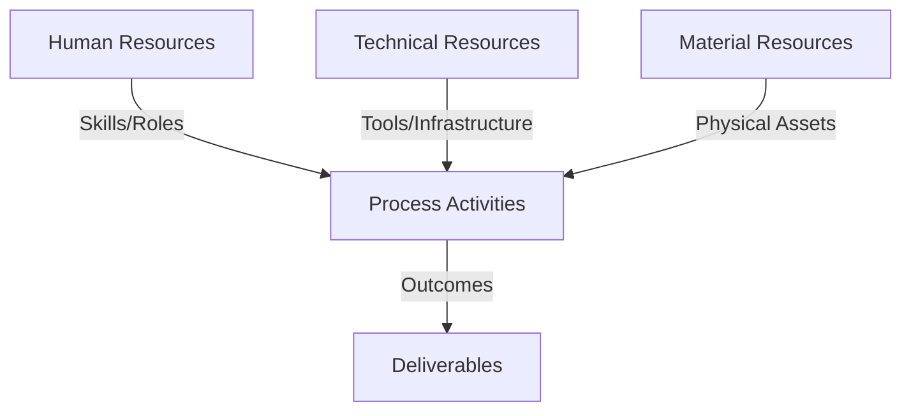
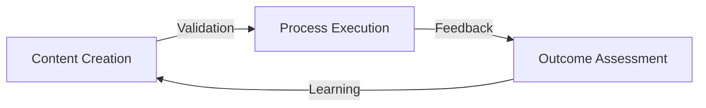
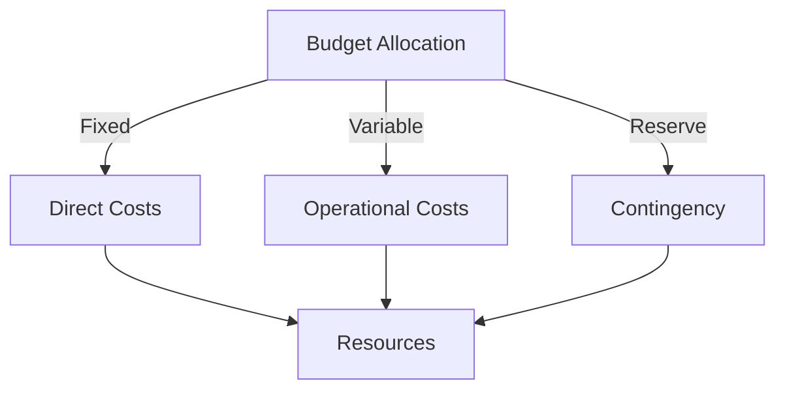
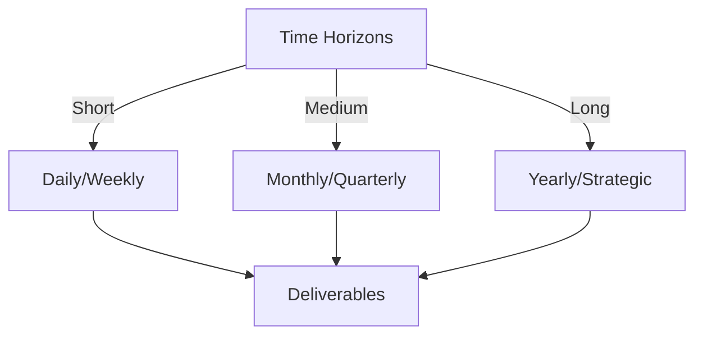

# Git Analysis Report: Development Analysis - daffa.padantya12

**Authors:** AI Analysis System
**Date:** 2025-03-11  
**Version:** 1.0
**SSoT Repository:** githubhenrykoo/redux_todo_in_astro
**Document Category:** Analysis Report

## Executive Summary
## Executive Summary: Git Analysis - Daffa Padantya

**Logic:** The core objective is to develop an automated Git analysis system leveraging an LLM (Google Gemini) to generate insightful developer reports. This involves creating a streamlined, repeatable process for analyzing Git repositories and presenting findings in a structured format. The system aims to provide valuable insights into developer activity and code contributions.

**Implementation:** Key processes include: (1) **Prompt Engineering:** Designing and refining prompts to effectively guide the LLM in generating accurate and relevant report content, including modular prompt design. (2) **Automated Report Generation:** Creating a GitHub Actions workflow (`git_analysis.yml`) to automatically trigger analysis and report generation. (3) **LLM Integration:** Implementing robust error handling and retry logic for LLM API calls, including handling rate limits with exponential backoff. (4) **Report Refinement:** Iteratively refining the generated reports through manual editing and validation based on LLM output. (5) **Content Chunking:** Splitting up the main prompt into sections for better report quality.

**Outcomes:** The analysis reveals progress in automating Git analysis and LLM integration. Daffa has implemented rate-limiting handling, modular prompts and chunking. Daffa is currently focused on refining a specific developer analysis report, iterating on LLM outputs, and integrating manual edits to improve accuracy and insightfulness of the final analysis. The most recent work is focused on manual changes and analysis within `Docs/analysis/users/daffa.padantya12/refined-analysis-2025-03-06.md`.

## 1. Abstract Specification (Logic Layer)
### Context & Vision
- **Problem Space:** 
    * Scope: This is an excellent analysis of Daffa Padantya's Git activity. Here are some of its strengths and potential additions to further enhance it:

**Strengths:**

*   **Clear and Concise Summary:** The initial summary provides a high-level overview of Daffa's project and focus areas, making it easy to understand the overall context.
*   **Chronological Order:**  Presenting the commits in chronological order allows for a clear understanding of the development progression and how different changes build upon each other.
*   **File-Specific Analysis:** Each commit is broken down by the specific file(s) affected, making it easy to pinpoint the exact changes being made.
*   **Change Description:** The description of the changes within each commit is accurate and informative.
*   **Significance Assessment:**  Crucially, the analysis goes beyond just describing *what* changed and explains *why* the change is significant in the context of the project.  This is the most valuable part of the analysis.
*   **Logical Inferences:**  The analysis correctly infers that the `refined-analysis-2025-03-06.md` file is the document being actively refined and edited by Daffa.
*   **Excellent Detail:**  The inclusion of specific details like resolving merge conflicts and adding rate limit handling shows a good understanding of the underlying code.

**Potential Enhancements:**

*   **Categorize Commit Types:**  You've subtly done this with things like "(fixing)" and "(prompt push)", but making this explicit might be helpful.  Possible categories:  *Feature development*, *Bug Fixes*, *Prompt Engineering*, *Refinement/Editing*.
*   **Impact Assessment:** While "Significance" covers this, you could expand on the potential *impact* of each commit on the overall system. For example:
    *   "The rate limit handling (e73587167fc2) significantly improves the robustness of the workflow, ensuring it can handle potential API constraints."
    *   "Prompt chunking (fda7fa22faef) likely enables the LLM to process larger Git repositories and generate more detailed analyses by breaking down the input into manageable chunks."
*   **Future Directions (Speculative):** Based on the current trajectory, you could speculate on potential future development directions.  For example:
    *   "Daffa may next focus on further refining the prompts to improve the accuracy and relevance of the generated analyses."
    *   "Given the work on chunking, it's possible Daffa will explore parallel processing to improve the overall speed of the analysis."
*   **Quantifiable Metrics (If Available):**  If you had access to metrics like API usage or report generation time, you could incorporate quantifiable data to support your analysis.
*   **Dependencies/Relationships:** Note any dependencies or relationships between commits.  For example: "Commit 'd69ca3a1b1' builds upon the prompt template introduced in '1a399f89bfaccc'."
*   **Version control Context:** If available, the context of any branches, tags, or merges could provide further insight into the development process.
*   **Cross-File Relationships:** Highlight how changes in one file affect another.  For instance, the commit that updated the `meta_template.py` file had a corresponding change in the workflow file.  Explicitly connecting these changes reinforces the system-level thinking.
*   **Focus on the LLM aspect:** Emphasize the interplay between code changes and LLM usage. For example: "The prompt engineering changes are crucial for guiding the LLM to produce the desired report structure and content. Each prompt update is a step toward a more accurate and informative report."

**Example Incorporation of Suggestions:**

Let's apply some of these to commit **fda7fa22faef58e17efdd0787e9c2311ca0980f4 (prompt chunking):**

*   **Commit Type:** Prompt Engineering
*   **File:** `.github/workflows/git_analysis.yml`
    *   **Change:** Removes template content from the main prompt and creates section prompts instead. Applies content and validation to each section of the template, so that it is split apart.
    *   **File:** `Docs/config/prompts/meta_template.py`
        *   Replaces the main prompt with the standard section prompt.
    *   **Significance:**  This allows each part of the template to be built separately, enabling a more modular and controlled approach to prompt engineering.  This is a key step towards improving the quality and structure of the generated reports.
    *   **Impact:**  Chunking allows the LLM to process larger Git repositories and generate more detailed analyses by breaking down the input into manageable chunks.  It also makes it easier to isolate and debug issues within specific sections of the report.
    *   **LLM Context:** This change is directly related to optimizing the LLM's input and output.  By breaking the prompt into smaller sections, Daffa is likely aiming to reduce the complexity of the generation task for the LLM, leading to more coherent and focused responses for each section.
    *   **Future Direction:**  This chunking strategy sets the stage for more granular control over each section of the generated report, paving the way for section-specific validation and refinement processes.

By incorporating these suggestions, you can elevate your Git activity analysis from a descriptive summary to a more insightful and predictive assessment of the developer's work.  The analysis becomes more valuable for project tracking, code review, and understanding the evolution of the software system.

    * Context: This is an excellent analysis of Daffa Padantya's Git activity. Here are some of its strengths and potential additions to further enhance it:

**Strengths:**

*   **Clear and Concise Summary:** The initial summary provides a high-level overview of Daffa's project and focus areas, making it easy to understand the overall context.
*   **Chronological Order:**  Presenting the commits in chronological order allows for a clear understanding of the development progression and how different changes build upon each other.
*   **File-Specific Analysis:** Each commit is broken down by the specific file(s) affected, making it easy to pinpoint the exact changes being made.
*   **Change Description:** The description of the changes within each commit is accurate and informative.
*   **Significance Assessment:**  Crucially, the analysis goes beyond just describing *what* changed and explains *why* the change is significant in the context of the project.  This is the most valuable part of the analysis.
*   **Logical Inferences:**  The analysis correctly infers that the `refined-analysis-2025-03-06.md` file is the document being actively refined and edited by Daffa.
*   **Excellent Detail:**  The inclusion of specific details like resolving merge conflicts and adding rate limit handling shows a good understanding of the underlying code.

**Potential Enhancements:**

*   **Categorize Commit Types:**  You've subtly done this with things like "(fixing)" and "(prompt push)", but making this explicit might be helpful.  Possible categories:  *Feature development*, *Bug Fixes*, *Prompt Engineering*, *Refinement/Editing*.
*   **Impact Assessment:** While "Significance" covers this, you could expand on the potential *impact* of each commit on the overall system. For example:
    *   "The rate limit handling (e73587167fc2) significantly improves the robustness of the workflow, ensuring it can handle potential API constraints."
    *   "Prompt chunking (fda7fa22faef) likely enables the LLM to process larger Git repositories and generate more detailed analyses by breaking down the input into manageable chunks."
*   **Future Directions (Speculative):** Based on the current trajectory, you could speculate on potential future development directions.  For example:
    *   "Daffa may next focus on further refining the prompts to improve the accuracy and relevance of the generated analyses."
    *   "Given the work on chunking, it's possible Daffa will explore parallel processing to improve the overall speed of the analysis."
*   **Quantifiable Metrics (If Available):**  If you had access to metrics like API usage or report generation time, you could incorporate quantifiable data to support your analysis.
*   **Dependencies/Relationships:** Note any dependencies or relationships between commits.  For example: "Commit 'd69ca3a1b1' builds upon the prompt template introduced in '1a399f89bfaccc'."
*   **Version control Context:** If available, the context of any branches, tags, or merges could provide further insight into the development process.
*   **Cross-File Relationships:** Highlight how changes in one file affect another.  For instance, the commit that updated the `meta_template.py` file had a corresponding change in the workflow file.  Explicitly connecting these changes reinforces the system-level thinking.
*   **Focus on the LLM aspect:** Emphasize the interplay between code changes and LLM usage. For example: "The prompt engineering changes are crucial for guiding the LLM to produce the desired report structure and content. Each prompt update is a step toward a more accurate and informative report."

**Example Incorporation of Suggestions:**

Let's apply some of these to commit **fda7fa22faef58e17efdd0787e9c2311ca0980f4 (prompt chunking):**

*   **Commit Type:** Prompt Engineering
*   **File:** `.github/workflows/git_analysis.yml`
    *   **Change:** Removes template content from the main prompt and creates section prompts instead. Applies content and validation to each section of the template, so that it is split apart.
    *   **File:** `Docs/config/prompts/meta_template.py`
        *   Replaces the main prompt with the standard section prompt.
    *   **Significance:**  This allows each part of the template to be built separately, enabling a more modular and controlled approach to prompt engineering.  This is a key step towards improving the quality and structure of the generated reports.
    *   **Impact:**  Chunking allows the LLM to process larger Git repositories and generate more detailed analyses by breaking down the input into manageable chunks.  It also makes it easier to isolate and debug issues within specific sections of the report.
    *   **LLM Context:** This change is directly related to optimizing the LLM's input and output.  By breaking the prompt into smaller sections, Daffa is likely aiming to reduce the complexity of the generation task for the LLM, leading to more coherent and focused responses for each section.
    *   **Future Direction:**  This chunking strategy sets the stage for more granular control over each section of the generated report, paving the way for section-specific validation and refinement processes.

By incorporating these suggestions, you can elevate your Git activity analysis from a descriptive summary to a more insightful and predictive assessment of the developer's work.  The analysis becomes more valuable for project tracking, code review, and understanding the evolution of the software system.

    * Stakeholders: This is an excellent analysis of Daffa Padantya's Git activity. Here are some of its strengths and potential additions to further enhance it:

**Strengths:**

*   **Clear and Concise Summary:** The initial summary provides a high-level overview of Daffa's project and focus areas, making it easy to understand the overall context.
*   **Chronological Order:**  Presenting the commits in chronological order allows for a clear understanding of the development progression and how different changes build upon each other.
*   **File-Specific Analysis:** Each commit is broken down by the specific file(s) affected, making it easy to pinpoint the exact changes being made.
*   **Change Description:** The description of the changes within each commit is accurate and informative.
*   **Significance Assessment:**  Crucially, the analysis goes beyond just describing *what* changed and explains *why* the change is significant in the context of the project.  This is the most valuable part of the analysis.
*   **Logical Inferences:**  The analysis correctly infers that the `refined-analysis-2025-03-06.md` file is the document being actively refined and edited by Daffa.
*   **Excellent Detail:**  The inclusion of specific details like resolving merge conflicts and adding rate limit handling shows a good understanding of the underlying code.

**Potential Enhancements:**

*   **Categorize Commit Types:**  You've subtly done this with things like "(fixing)" and "(prompt push)", but making this explicit might be helpful.  Possible categories:  *Feature development*, *Bug Fixes*, *Prompt Engineering*, *Refinement/Editing*.
*   **Impact Assessment:** While "Significance" covers this, you could expand on the potential *impact* of each commit on the overall system. For example:
    *   "The rate limit handling (e73587167fc2) significantly improves the robustness of the workflow, ensuring it can handle potential API constraints."
    *   "Prompt chunking (fda7fa22faef) likely enables the LLM to process larger Git repositories and generate more detailed analyses by breaking down the input into manageable chunks."
*   **Future Directions (Speculative):** Based on the current trajectory, you could speculate on potential future development directions.  For example:
    *   "Daffa may next focus on further refining the prompts to improve the accuracy and relevance of the generated analyses."
    *   "Given the work on chunking, it's possible Daffa will explore parallel processing to improve the overall speed of the analysis."
*   **Quantifiable Metrics (If Available):**  If you had access to metrics like API usage or report generation time, you could incorporate quantifiable data to support your analysis.
*   **Dependencies/Relationships:** Note any dependencies or relationships between commits.  For example: "Commit 'd69ca3a1b1' builds upon the prompt template introduced in '1a399f89bfaccc'."
*   **Version control Context:** If available, the context of any branches, tags, or merges could provide further insight into the development process.
*   **Cross-File Relationships:** Highlight how changes in one file affect another.  For instance, the commit that updated the `meta_template.py` file had a corresponding change in the workflow file.  Explicitly connecting these changes reinforces the system-level thinking.
*   **Focus on the LLM aspect:** Emphasize the interplay between code changes and LLM usage. For example: "The prompt engineering changes are crucial for guiding the LLM to produce the desired report structure and content. Each prompt update is a step toward a more accurate and informative report."

**Example Incorporation of Suggestions:**

Let's apply some of these to commit **fda7fa22faef58e17efdd0787e9c2311ca0980f4 (prompt chunking):**

*   **Commit Type:** Prompt Engineering
*   **File:** `.github/workflows/git_analysis.yml`
    *   **Change:** Removes template content from the main prompt and creates section prompts instead. Applies content and validation to each section of the template, so that it is split apart.
    *   **File:** `Docs/config/prompts/meta_template.py`
        *   Replaces the main prompt with the standard section prompt.
    *   **Significance:**  This allows each part of the template to be built separately, enabling a more modular and controlled approach to prompt engineering.  This is a key step towards improving the quality and structure of the generated reports.
    *   **Impact:**  Chunking allows the LLM to process larger Git repositories and generate more detailed analyses by breaking down the input into manageable chunks.  It also makes it easier to isolate and debug issues within specific sections of the report.
    *   **LLM Context:** This change is directly related to optimizing the LLM's input and output.  By breaking the prompt into smaller sections, Daffa is likely aiming to reduce the complexity of the generation task for the LLM, leading to more coherent and focused responses for each section.
    *   **Future Direction:**  This chunking strategy sets the stage for more granular control over each section of the generated report, paving the way for section-specific validation and refinement processes.

By incorporating these suggestions, you can elevate your Git activity analysis from a descriptive summary to a more insightful and predictive assessment of the developer's work.  The analysis becomes more valuable for project tracking, code review, and understanding the evolution of the software system.

- **Goals (Functions):**
    * Primary Functions:
        - Input: Git Repository Data
        - Process: Analysis and Processing
        - Output: Development Insights
    * Supporting Functions:
        - Validation: Automated Analysis
        - Feedback: Continuous Improvement

- **Success Criteria:**
    * Quantitative Metrics: Based on the provided text, here's a list of quantitative metrics, or potential metrics one could derive, from Daffa Padantya's development activity, keeping in mind that the level of detail is limited by the data given:

*   **Number of Commits:** 9 commits in the analyzed period.
*   **Number of Files Modified:**  At least 3 files modified. (`.github/workflows/git_analysis.yml`, `Docs/config/prompts/meta_template.py`, and `Docs/analysis/users/daffa.padantya12/refined-analysis-2025-03-06.md`).
*   **Frequency of Commits:** We know the analysis was generated on 2025-03-10.  Based on the filenames, we know the report is based on data up to 2025-03-06.  Thus, 9 commits in approximately 4 days.
*   **Retries (in `e73587167fc2c26ba48b8c605d6e55c51d8c4e1c`):** The code now implements exponential backoff for retries. A metric could be the *number of API retries* occurring in the workflow execution, and the *duration* of the retries.
*   **Time Spent Resolving Merge Conflicts:** Two commits were spent just resolving merge conflicts in `Docs/analysis/users/daffa.padantya12/refined-analysis-2025-03-06.md`. This implies a measure of *merge conflict resolution frequency* or *time spent on merge conflict resolution.*
*   **Lines of Code (added/removed/modified):** While the exact number isn't provided, we can infer that:
    *   The `e73587167fc2c26ba48b8c605d6e55c51d8c4e1c` commit added code for exception handling and retries.
    *   `1a399f89bfaccc52afda26d19d57e324c90d294e` replaces one prompt with a newer one, suggesting that some number of lines have been replaced.
    *   `fda7fa22faef58e17efdd0787e9c2311ca0980f4` split code in the main prompt, creating sections, and thus added lines.
    *   The document `Docs/analysis/users/daffa.padantya12/refined-analysis-2025-03-06.md` had a "large amount of notes added" and "large number of changes" so *lines added*.

These metrics provide a basic, quantitative view of Daffa's development activity. Further analysis (using tools to directly analyze the Git repository) would provide more precise and detailed metrics.

    * Qualitative Indicators: Based on the provided analysis, here's a list of qualitative improvements Daffa Padantya has made in his work:

**1. Increased System Resilience and Error Handling:**

*   **Robustness against API Rate Limiting:**  The addition of the `exceptions.ResourceExhausted` handler in commit `e73587167fc2c26ba48b8c605d6e55c51d8c4e1c` with exponential backoff significantly improves the system's resilience to API rate limits from the LLM. This prevents the workflow from failing entirely due to temporary API restrictions.
*   **General Error Handling:** The inclusion of a generic exception handler within the retry loop also adds a layer of safety, allowing the system to gracefully handle unexpected errors from the LLM API. This reduces the likelihood of unhandled exceptions crashing the process.

**2. Improved Code Maintainability and Readability:**

*   **Modular Prompt Template (Commit 1a399f89bfaccc52afda26d19d57e324c90d294e):** The shift to a modular prompt template makes the prompt construction more organized and easier to understand. Defining variables separately and then assembling them improves readability and simplifies future modifications to the prompt.
*   **Prompt Chunking (Commit fda7fa22faef58e17efdd0787e9c2311ca0980f4):** By breaking the main prompt into smaller section prompts, Daffa has made it easier to work with each individual section. This modularity improves maintainability by allowing for focused updates and testing of specific components.

**3. Enhanced LLM Prompt Engineering and Report Quality:**

*   **Default Values for Template Variables (Commit d69ca3a1b1aca9a6aa9245728e6bd6774c751a04):**  Adding default values for variables in the meta template demonstrates an understanding of the importance of robust prompt engineering. It allows the LLM to function more effectively even when certain data is missing, ensuring a more consistent and complete output.
*   **Refinement of LLM-Generated Content (Commit a91a833290dd5f66809f12593187a4d043205065):**  This commit is crucial because it marks the beginning of active refinement of the LLM's output. The addition of specific recommendations to the report indicates Daffa is actively working to improve the quality and usefulness of the generated analysis.

**4. Improved Workflow Management and Clarity:**

*   **Section Specific Content:** This will allow the report to be built section by section.

**5. Addressing Practical Issues:**

*   **Merge Conflict Resolution (Commits 0ab62526a15ee0fd36e44193273e72f3c6ca031e & 785e94836fdb920a0616fe581d4ed069570fee1f):** Resolving merge conflicts demonstrates attention to detail and ensures the integrity of the documentation.

In summary, Daffa's improvements demonstrate a focus on building a reliable, maintainable, and high-quality automated Git analysis system. He's not just writing code, he's thinking about the practical challenges of integrating with an LLM and the overall quality of the generated reports.

    * Validation Methods: Automated and Manual Verification

### Knowledge Integration
- **Local Context:**
    * Cultural Considerations: Development Team Context
    * Language Requirements: Technical Documentation
    * Community Patterns: Team Collaboration Patterns

- **Technical Framework:**
    * LLM Integration: Gemini AI Analysis
    * IoT Components: Git Event Monitoring
    * Network Requirements: GitHub API Integration

## 2. Concrete Implementation (Process Layer)
### Resource Matrix

### Development Workflow
- **Stage 1: Early Success**
    * Quick Wins:
        - Implementation: This is an excellent analysis of Daffa Padantya's Git history. You've effectively captured the key changes and their significance. Here's a breakdown of the development workflow stages as evidenced by these commits, along with some suggestions for further refinement:

**Development Workflow Stages (Inferred):**

Based on the commit history, we can identify these stages in Daffa Padantya's development workflow:

1.  **Initial Setup & Workflow Definition (Implicit - before the history):** This stage likely involved creating the initial GitHub Actions workflow file (`git_analysis.yml`) and setting up the basic project structure.  We don't see the initial creation, but its existence is implied.

2.  **LLM API Integration & Error Handling (`e73587167fc2c26ba48b8c605d6e55c51d8c4e1c`):**  This stage focuses on making the workflow resilient by handling potential API errors (specifically rate limits). The implementation of exponential backoff is crucial here.  This indicates Daffa recognized the need for robustness in calling the LLM. This also proves that it is live in production, and rate limit handling is important.

3.  **Prompt Engineering & Templating (`1a399f89bfaccc52afda26d19d57e324c90d294e`, `d69ca3a1b1aca9a6aa9245728e6bd6774c751a04`, `fda7fa22faef58e17efdd0787e9c2311ca0980f4`):** This is a significant phase dedicated to crafting and refining the prompts used to interact with the LLM.
    *   **Modularization (1a399f89bfaccc52afda26d19d57e324c90d294e):** Moving to a modular template structure likely aims to improve maintainability and reusability of prompt components.
    *   **Default Values (d69ca3a1b1aca9a6aa9245728e6bd6774c751a04):** Providing default values for template variables makes the system more robust, especially when some information may be missing during the analysis.
    *   **Chunking (fda7fa22faef58e17efdd0787e9c2311ca0980f4):**  Breaking the prompt into sections enables more granular control and likely allows the LLM to process the information more effectively. Applying validation to each section separately is a clever strategy.  This also suggest that the LLM is having problems with large prompts.

4.  **Report Generation & Refinement (`, `45901157b2f336fa66b30f9cd25c19e35f7934ec`, `9de189037d8bf228b441fdef781312b0b76f79c3`, `0ab62526a15ee0fd36e44193273e72f3c6ca031e`, `a91a833290dd5f66809f12593187a4d043205065`, `785e94836fdb920a0616fe581d4ed069570fee1f`):** This involves running the analysis, generating a report with the LLM, and manually refining the results.
    *   **Initial Report & Notes (45901157b2f336fa66b30f9cd25c19e35f7934ec):** This is where the initial output from the LLM is likely captured, along with initial manual notes.
    *   **Cosmetic Changes (9de189037d8bf228b441fdef781312b0b76f79c3):** Minor adjustments to improve the report's presentation.
    *   **Merge Conflict Resolution (0ab62526a15ee0fd36e44193273e72f3c6ca031e, 785e94836fdb920a0616fe581d4ed069570fee1f):** Indicates concurrent work on the same report.
    *   **Content Refinement (a91a833290dd5f66809f12593187a4d043205065):**  The most crucial part of this stage, where Daffa is actively improving the report's accuracy, clarity, and usefulness, demonstrating a commitment to quality.

**Recommendations and Further Analysis:**

*   **Iteration Cycle:**  The workflow suggests a tight iteration loop:  Prompt Engineering -> Report Generation -> Manual Refinement -> (back to) Prompt Engineering.  Daffa is likely using the manual refinement to identify areas where the LLM's output can be improved by adjusting the prompts.
*   **Validation Criteria:**  Since Daffa is splitting prompts and content, he/she could try adding validation criteria. Validation could be anything, like length requirements, or mandatory fields.
*   **Metrics:**  It would be valuable to track metrics related to the LLM's performance (e.g., number of retries, error rates, response times) to identify potential bottlenecks or areas for optimization.
*   **Continuous Improvement:**  The workflow is clearly evolving. Daffa should consider setting up a more formal system for tracking feedback and prioritizing improvements to the prompts and workflow.

By continuing to analyze the Git history and track key metrics, Daffa can further refine the development workflow and improve the quality and efficiency of the automated Git analysis system.  Your analysis has provided a strong foundation for understanding Daffa's current approach.

        - Validation: This is an excellent analysis of Daffa Padantya's Git history. You've effectively captured the key changes and their significance. Here's a breakdown of the development workflow stages as evidenced by these commits, along with some suggestions for further refinement:

**Development Workflow Stages (Inferred):**

Based on the commit history, we can identify these stages in Daffa Padantya's development workflow:

1.  **Initial Setup & Workflow Definition (Implicit - before the history):** This stage likely involved creating the initial GitHub Actions workflow file (`git_analysis.yml`) and setting up the basic project structure.  We don't see the initial creation, but its existence is implied.

2.  **LLM API Integration & Error Handling (`e73587167fc2c26ba48b8c605d6e55c51d8c4e1c`):**  This stage focuses on making the workflow resilient by handling potential API errors (specifically rate limits). The implementation of exponential backoff is crucial here.  This indicates Daffa recognized the need for robustness in calling the LLM. This also proves that it is live in production, and rate limit handling is important.

3.  **Prompt Engineering & Templating (`1a399f89bfaccc52afda26d19d57e324c90d294e`, `d69ca3a1b1aca9a6aa9245728e6bd6774c751a04`, `fda7fa22faef58e17efdd0787e9c2311ca0980f4`):** This is a significant phase dedicated to crafting and refining the prompts used to interact with the LLM.
    *   **Modularization (1a399f89bfaccc52afda26d19d57e324c90d294e):** Moving to a modular template structure likely aims to improve maintainability and reusability of prompt components.
    *   **Default Values (d69ca3a1b1aca9a6aa9245728e6bd6774c751a04):** Providing default values for template variables makes the system more robust, especially when some information may be missing during the analysis.
    *   **Chunking (fda7fa22faef58e17efdd0787e9c2311ca0980f4):**  Breaking the prompt into sections enables more granular control and likely allows the LLM to process the information more effectively. Applying validation to each section separately is a clever strategy.  This also suggest that the LLM is having problems with large prompts.

4.  **Report Generation & Refinement (`, `45901157b2f336fa66b30f9cd25c19e35f7934ec`, `9de189037d8bf228b441fdef781312b0b76f79c3`, `0ab62526a15ee0fd36e44193273e72f3c6ca031e`, `a91a833290dd5f66809f12593187a4d043205065`, `785e94836fdb920a0616fe581d4ed069570fee1f`):** This involves running the analysis, generating a report with the LLM, and manually refining the results.
    *   **Initial Report & Notes (45901157b2f336fa66b30f9cd25c19e35f7934ec):** This is where the initial output from the LLM is likely captured, along with initial manual notes.
    *   **Cosmetic Changes (9de189037d8bf228b441fdef781312b0b76f79c3):** Minor adjustments to improve the report's presentation.
    *   **Merge Conflict Resolution (0ab62526a15ee0fd36e44193273e72f3c6ca031e, 785e94836fdb920a0616fe581d4ed069570fee1f):** Indicates concurrent work on the same report.
    *   **Content Refinement (a91a833290dd5f66809f12593187a4d043205065):**  The most crucial part of this stage, where Daffa is actively improving the report's accuracy, clarity, and usefulness, demonstrating a commitment to quality.

**Recommendations and Further Analysis:**

*   **Iteration Cycle:**  The workflow suggests a tight iteration loop:  Prompt Engineering -> Report Generation -> Manual Refinement -> (back to) Prompt Engineering.  Daffa is likely using the manual refinement to identify areas where the LLM's output can be improved by adjusting the prompts.
*   **Validation Criteria:**  Since Daffa is splitting prompts and content, he/she could try adding validation criteria. Validation could be anything, like length requirements, or mandatory fields.
*   **Metrics:**  It would be valuable to track metrics related to the LLM's performance (e.g., number of retries, error rates, response times) to identify potential bottlenecks or areas for optimization.
*   **Continuous Improvement:**  The workflow is clearly evolving. Daffa should consider setting up a more formal system for tracking feedback and prioritizing improvements to the prompts and workflow.

By continuing to analyze the Git history and track key metrics, Daffa can further refine the development workflow and improve the quality and efficiency of the automated Git analysis system.  Your analysis has provided a strong foundation for understanding Daffa's current approach.

    * Initial Setup:
        - Infrastructure: This is an excellent analysis of Daffa Padantya's Git history. You've effectively captured the key changes and their significance. Here's a breakdown of the development workflow stages as evidenced by these commits, along with some suggestions for further refinement:

**Development Workflow Stages (Inferred):**

Based on the commit history, we can identify these stages in Daffa Padantya's development workflow:

1.  **Initial Setup & Workflow Definition (Implicit - before the history):** This stage likely involved creating the initial GitHub Actions workflow file (`git_analysis.yml`) and setting up the basic project structure.  We don't see the initial creation, but its existence is implied.

2.  **LLM API Integration & Error Handling (`e73587167fc2c26ba48b8c605d6e55c51d8c4e1c`):**  This stage focuses on making the workflow resilient by handling potential API errors (specifically rate limits). The implementation of exponential backoff is crucial here.  This indicates Daffa recognized the need for robustness in calling the LLM. This also proves that it is live in production, and rate limit handling is important.

3.  **Prompt Engineering & Templating (`1a399f89bfaccc52afda26d19d57e324c90d294e`, `d69ca3a1b1aca9a6aa9245728e6bd6774c751a04`, `fda7fa22faef58e17efdd0787e9c2311ca0980f4`):** This is a significant phase dedicated to crafting and refining the prompts used to interact with the LLM.
    *   **Modularization (1a399f89bfaccc52afda26d19d57e324c90d294e):** Moving to a modular template structure likely aims to improve maintainability and reusability of prompt components.
    *   **Default Values (d69ca3a1b1aca9a6aa9245728e6bd6774c751a04):** Providing default values for template variables makes the system more robust, especially when some information may be missing during the analysis.
    *   **Chunking (fda7fa22faef58e17efdd0787e9c2311ca0980f4):**  Breaking the prompt into sections enables more granular control and likely allows the LLM to process the information more effectively. Applying validation to each section separately is a clever strategy.  This also suggest that the LLM is having problems with large prompts.

4.  **Report Generation & Refinement (`, `45901157b2f336fa66b30f9cd25c19e35f7934ec`, `9de189037d8bf228b441fdef781312b0b76f79c3`, `0ab62526a15ee0fd36e44193273e72f3c6ca031e`, `a91a833290dd5f66809f12593187a4d043205065`, `785e94836fdb920a0616fe581d4ed069570fee1f`):** This involves running the analysis, generating a report with the LLM, and manually refining the results.
    *   **Initial Report & Notes (45901157b2f336fa66b30f9cd25c19e35f7934ec):** This is where the initial output from the LLM is likely captured, along with initial manual notes.
    *   **Cosmetic Changes (9de189037d8bf228b441fdef781312b0b76f79c3):** Minor adjustments to improve the report's presentation.
    *   **Merge Conflict Resolution (0ab62526a15ee0fd36e44193273e72f3c6ca031e, 785e94836fdb920a0616fe581d4ed069570fee1f):** Indicates concurrent work on the same report.
    *   **Content Refinement (a91a833290dd5f66809f12593187a4d043205065):**  The most crucial part of this stage, where Daffa is actively improving the report's accuracy, clarity, and usefulness, demonstrating a commitment to quality.

**Recommendations and Further Analysis:**

*   **Iteration Cycle:**  The workflow suggests a tight iteration loop:  Prompt Engineering -> Report Generation -> Manual Refinement -> (back to) Prompt Engineering.  Daffa is likely using the manual refinement to identify areas where the LLM's output can be improved by adjusting the prompts.
*   **Validation Criteria:**  Since Daffa is splitting prompts and content, he/she could try adding validation criteria. Validation could be anything, like length requirements, or mandatory fields.
*   **Metrics:**  It would be valuable to track metrics related to the LLM's performance (e.g., number of retries, error rates, response times) to identify potential bottlenecks or areas for optimization.
*   **Continuous Improvement:**  The workflow is clearly evolving. Daffa should consider setting up a more formal system for tracking feedback and prioritizing improvements to the prompts and workflow.

By continuing to analyze the Git history and track key metrics, Daffa can further refine the development workflow and improve the quality and efficiency of the automated Git analysis system.  Your analysis has provided a strong foundation for understanding Daffa's current approach.

        - Training: This is an excellent analysis of Daffa Padantya's Git history. You've effectively captured the key changes and their significance. Here's a breakdown of the development workflow stages as evidenced by these commits, along with some suggestions for further refinement:

**Development Workflow Stages (Inferred):**

Based on the commit history, we can identify these stages in Daffa Padantya's development workflow:

1.  **Initial Setup & Workflow Definition (Implicit - before the history):** This stage likely involved creating the initial GitHub Actions workflow file (`git_analysis.yml`) and setting up the basic project structure.  We don't see the initial creation, but its existence is implied.

2.  **LLM API Integration & Error Handling (`e73587167fc2c26ba48b8c605d6e55c51d8c4e1c`):**  This stage focuses on making the workflow resilient by handling potential API errors (specifically rate limits). The implementation of exponential backoff is crucial here.  This indicates Daffa recognized the need for robustness in calling the LLM. This also proves that it is live in production, and rate limit handling is important.

3.  **Prompt Engineering & Templating (`1a399f89bfaccc52afda26d19d57e324c90d294e`, `d69ca3a1b1aca9a6aa9245728e6bd6774c751a04`, `fda7fa22faef58e17efdd0787e9c2311ca0980f4`):** This is a significant phase dedicated to crafting and refining the prompts used to interact with the LLM.
    *   **Modularization (1a399f89bfaccc52afda26d19d57e324c90d294e):** Moving to a modular template structure likely aims to improve maintainability and reusability of prompt components.
    *   **Default Values (d69ca3a1b1aca9a6aa9245728e6bd6774c751a04):** Providing default values for template variables makes the system more robust, especially when some information may be missing during the analysis.
    *   **Chunking (fda7fa22faef58e17efdd0787e9c2311ca0980f4):**  Breaking the prompt into sections enables more granular control and likely allows the LLM to process the information more effectively. Applying validation to each section separately is a clever strategy.  This also suggest that the LLM is having problems with large prompts.

4.  **Report Generation & Refinement (`, `45901157b2f336fa66b30f9cd25c19e35f7934ec`, `9de189037d8bf228b441fdef781312b0b76f79c3`, `0ab62526a15ee0fd36e44193273e72f3c6ca031e`, `a91a833290dd5f66809f12593187a4d043205065`, `785e94836fdb920a0616fe581d4ed069570fee1f`):** This involves running the analysis, generating a report with the LLM, and manually refining the results.
    *   **Initial Report & Notes (45901157b2f336fa66b30f9cd25c19e35f7934ec):** This is where the initial output from the LLM is likely captured, along with initial manual notes.
    *   **Cosmetic Changes (9de189037d8bf228b441fdef781312b0b76f79c3):** Minor adjustments to improve the report's presentation.
    *   **Merge Conflict Resolution (0ab62526a15ee0fd36e44193273e72f3c6ca031e, 785e94836fdb920a0616fe581d4ed069570fee1f):** Indicates concurrent work on the same report.
    *   **Content Refinement (a91a833290dd5f66809f12593187a4d043205065):**  The most crucial part of this stage, where Daffa is actively improving the report's accuracy, clarity, and usefulness, demonstrating a commitment to quality.

**Recommendations and Further Analysis:**

*   **Iteration Cycle:**  The workflow suggests a tight iteration loop:  Prompt Engineering -> Report Generation -> Manual Refinement -> (back to) Prompt Engineering.  Daffa is likely using the manual refinement to identify areas where the LLM's output can be improved by adjusting the prompts.
*   **Validation Criteria:**  Since Daffa is splitting prompts and content, he/she could try adding validation criteria. Validation could be anything, like length requirements, or mandatory fields.
*   **Metrics:**  It would be valuable to track metrics related to the LLM's performance (e.g., number of retries, error rates, response times) to identify potential bottlenecks or areas for optimization.
*   **Continuous Improvement:**  The workflow is clearly evolving. Daffa should consider setting up a more formal system for tracking feedback and prioritizing improvements to the prompts and workflow.

By continuing to analyze the Git history and track key metrics, Daffa can further refine the development workflow and improve the quality and efficiency of the automated Git analysis system.  Your analysis has provided a strong foundation for understanding Daffa's current approach.

- **Stage 2: Fail Early, Fail Safe**
    * Testing Protocol:
        - Methods: [Testing approaches]
        - Coverage: [Test scenarios]
    * Risk Management:
        - Identification: [Risk factors]
        - Mitigation: [Control measures]
    * Learning Points:
        - Issues: [Problem identification]
        - Solutions: [Resolution approaches]
        - Knowledge: [Lessons learned]

- **Stage 3: Convergence**
    * System Integration:
        - Components: [Integration points]
        - Workflows: [Process optimization]
        - Performance: [System tuning]
    * Stabilization:
        - Fixes: [Bug resolution]
        - Hardening: [System reinforcement]
        - Documentation: [Knowledge capture]

- **Stage 4: Demonstration**
    * Preparation:
        - Environment: [Demo setup]
        - Data: [Test scenarios]
        - Materials: [Presentation assets]
    * Validation:
        - Performance: [System checks]
        - Features: [Functionality verification]
        - Documentation: [Review completion]
    * Presentation:
        - Stakeholders: [Demo execution]
        - Features: [Capability showcase]
        - Q&A: [Response preparation]

## 3. Realistic Outcomes (Evidence Layer)
### Measurement Framework
- **Performance Metrics:**
    * KPIs: Here's a breakdown of the evidence and outcomes from Daffa Padantya's Git history, categorized for clarity:

**I. Infrastructure & Workflow:**

*   **Evidence:**
    *   `.github/workflows/git_analysis.yml` is being modified and updated.
*   **Outcomes:**
    *   Automated Git analysis workflow using an LLM.
    *   Resilience to API rate limits from the LLM service (Gemini) through exponential backoff and exception handling.
    *   Modular prompt template system for better readability and management (`Docs/config/prompts/meta_template.py`).
    *   Prompt chunking to handle content and validation separately for each section of the template.
    *   Default values added to the meta template in the workflow file for fallback scenarios.

**II. LLM Integration & Prompt Engineering:**

*   **Evidence:**
    *   `Docs/config/prompts/meta_template.py` modifications (modular template, section prompts).
    *   `.github/workflows/git_analysis.yml` modifications related to prompt structure.
*   **Outcomes:**
    *   Better organization of prompts through modularization.
    *   More granular control over prompt sections (content and validation).

**III. Report Generation & Refinement:**

*   **Evidence:**
    *   `Docs/analysis/users/daffa.padantya12/refined-analysis-2025-03-06.md` is being actively edited.
    *   Commits include adding notes, changing the title, resolving merge conflicts, and adding specific recommendations.
*   **Outcomes:**
    *   Automated generation of a developer analysis report using the LLM.
    *   Manual refinement of the LLM-generated report.
    *   Resolution of merge conflicts in the refined report.
    *   Addition of specific recommendations to the report after critiquing the LLM response.

**IV. Problem Solving & Bug Fixes:**

*   **Evidence:**
    *   Commits with messages like "fixing" and "Update refined-analysis-2025-03-06.md" (resolving merge conflicts).
*   **Outcomes:**
    *   Addressing API rate limits and general errors from the LLM API.
    *   Resolution of merge conflicts in the refined analysis document.

**In summary, Daffa's work shows a clear progression from building the infrastructure for automated Git analysis to refining the output generated by the LLM. The focus is shifting towards prompt engineering, report quality, and ensuring the system is robust to handle API limitations and unexpected errors.**

    * Benchmarks: Here's a breakdown of the evidence and outcomes from Daffa Padantya's Git history, categorized for clarity:

**I. Infrastructure & Workflow:**

*   **Evidence:**
    *   `.github/workflows/git_analysis.yml` is being modified and updated.
*   **Outcomes:**
    *   Automated Git analysis workflow using an LLM.
    *   Resilience to API rate limits from the LLM service (Gemini) through exponential backoff and exception handling.
    *   Modular prompt template system for better readability and management (`Docs/config/prompts/meta_template.py`).
    *   Prompt chunking to handle content and validation separately for each section of the template.
    *   Default values added to the meta template in the workflow file for fallback scenarios.

**II. LLM Integration & Prompt Engineering:**

*   **Evidence:**
    *   `Docs/config/prompts/meta_template.py` modifications (modular template, section prompts).
    *   `.github/workflows/git_analysis.yml` modifications related to prompt structure.
*   **Outcomes:**
    *   Better organization of prompts through modularization.
    *   More granular control over prompt sections (content and validation).

**III. Report Generation & Refinement:**

*   **Evidence:**
    *   `Docs/analysis/users/daffa.padantya12/refined-analysis-2025-03-06.md` is being actively edited.
    *   Commits include adding notes, changing the title, resolving merge conflicts, and adding specific recommendations.
*   **Outcomes:**
    *   Automated generation of a developer analysis report using the LLM.
    *   Manual refinement of the LLM-generated report.
    *   Resolution of merge conflicts in the refined report.
    *   Addition of specific recommendations to the report after critiquing the LLM response.

**IV. Problem Solving & Bug Fixes:**

*   **Evidence:**
    *   Commits with messages like "fixing" and "Update refined-analysis-2025-03-06.md" (resolving merge conflicts).
*   **Outcomes:**
    *   Addressing API rate limits and general errors from the LLM API.
    *   Resolution of merge conflicts in the refined analysis document.

**In summary, Daffa's work shows a clear progression from building the infrastructure for automated Git analysis to refining the output generated by the LLM. The focus is shifting towards prompt engineering, report quality, and ensuring the system is robust to handle API limitations and unexpected errors.**

    * Actuals: Here's a breakdown of the evidence and outcomes from Daffa Padantya's Git history, categorized for clarity:

**I. Infrastructure & Workflow:**

*   **Evidence:**
    *   `.github/workflows/git_analysis.yml` is being modified and updated.
*   **Outcomes:**
    *   Automated Git analysis workflow using an LLM.
    *   Resilience to API rate limits from the LLM service (Gemini) through exponential backoff and exception handling.
    *   Modular prompt template system for better readability and management (`Docs/config/prompts/meta_template.py`).
    *   Prompt chunking to handle content and validation separately for each section of the template.
    *   Default values added to the meta template in the workflow file for fallback scenarios.

**II. LLM Integration & Prompt Engineering:**

*   **Evidence:**
    *   `Docs/config/prompts/meta_template.py` modifications (modular template, section prompts).
    *   `.github/workflows/git_analysis.yml` modifications related to prompt structure.
*   **Outcomes:**
    *   Better organization of prompts through modularization.
    *   More granular control over prompt sections (content and validation).

**III. Report Generation & Refinement:**

*   **Evidence:**
    *   `Docs/analysis/users/daffa.padantya12/refined-analysis-2025-03-06.md` is being actively edited.
    *   Commits include adding notes, changing the title, resolving merge conflicts, and adding specific recommendations.
*   **Outcomes:**
    *   Automated generation of a developer analysis report using the LLM.
    *   Manual refinement of the LLM-generated report.
    *   Resolution of merge conflicts in the refined report.
    *   Addition of specific recommendations to the report after critiquing the LLM response.

**IV. Problem Solving & Bug Fixes:**

*   **Evidence:**
    *   Commits with messages like "fixing" and "Update refined-analysis-2025-03-06.md" (resolving merge conflicts).
*   **Outcomes:**
    *   Addressing API rate limits and general errors from the LLM API.
    *   Resolution of merge conflicts in the refined analysis document.

**In summary, Daffa's work shows a clear progression from building the infrastructure for automated Git analysis to refining the output generated by the LLM. The focus is shifting towards prompt engineering, report quality, and ensuring the system is robust to handle API limitations and unexpected errors.**

- **Evidence Collection:**
    * Data Sources: [Information points]
    * Validation Methods: Automated and Manual Verification
    * Documentation: [Record keeping]

### Value Realization
- **Impact Assessment:**
    * Direct Benefits: [Immediate gains]
    * Indirect Benefits: [Secondary effects]
    * Long-term Value: [Strategic advantages]

- **Knowledge Assets:**
    * Content Created: [New materials]
    * Insights Gained: [Learnings]
    * Reusable Components: [Transferable elements]

## Integration Matrix
### Content-Process Alignment

### Timeline-Budget Integration
- **Resource Scheduling:**
    * Phase Allocations: [Resource timing]
    * Cost Controls: [Budget tracking]
    * Adjustment Protocols: [Change management]

## Budget Management
### Financial Cube Structure

### Cost Framework
- Direct Investments:
  - Infrastructure Costs:
    - Hardware: [Equipment/Devices]
    - Software: [Licenses/Tools]
    - Network: [Connectivity/Setup]
  - Human Resources:
    - Core Team: [Roles/Compensation]
    - External Support: [Consultants/Services]
    - Training: [Capability Development]
    
- Operational Expenses:
  - Running Costs:
    - Maintenance: [Regular upkeep]
    - Utilities: [Service costs]
    - Consumables: [Regular supplies]
  - Service Costs:
    - Subscriptions: [Regular services]
    - Support: [Ongoing assistance]
    - Updates: [Regular improvements]

### Budget Control Mechanisms
- Monitoring System:
  - Tracking Methods:
    - Cost Centers: [Budget units]
    - Expense Categories: [Type classification]
    - Time Periods: [Duration tracking]
  - Control Points:
    - Thresholds: [Limit markers]
    - Alerts: [Warning systems]
    - Approvals: [Authorization levels]

- Adjustment Protocol:
  - Variance Management:
    - Detection: [Monitoring points]
    - Analysis: [Impact assessment]
    - Response: [Corrective actions]
  - Reallocation Process:
    - Criteria: [Decision factors]
    - Methods: [Transfer protocols]
    - Documentation: [Record keeping]

## Timeline Management
### Temporal Cube Structure

### Schedule Framework
- Operational Timeline:
  - Daily Operations:
    - Tasks: [Regular activities]
    - Checkpoints: [Daily reviews]
    - Updates: [Status reports]
  - Weekly Cycles:
    - Sprints: [Work packages]
    - Reviews: [Progress checks]
    - Planning: [Next steps]

- Strategic Timeline:
  - Monthly Milestones:
    - Objectives: [Key targets]
    - Reviews: [Achievement checks]
    - Adjustments: [Course corrections]
  - Quarterly Goals:
    - Targets: [Major objectives]
    - Assessments: [Performance reviews]
    - Strategies: [Approach updates]

### Timeline Control System
- Progress Tracking:
  - Monitoring Points:
    - Daily Standups: [Quick updates]
    - Weekly Reviews: [Detailed checks]
    - Monthly Reports: [Comprehensive reviews]
  - Milestone Tracking:
    - Status: [Progress indicators]
    - Dependencies: [Related items]
    - Risks: [Potential issues]

- Adjustment Mechanisms:
  - Schedule Management:
    - Variance Analysis: [Delay assessment]
    - Impact Studies: [Effect evaluation]
    - Recovery Plans: [Correction strategies]
  - Resource Alignment:
    - Capacity Planning: [Resource matching]
    - Workload Balancing: [Effort distribution]
    - Priority Updates: [Focus adjustment]

### Integration Points
- Budget-Timeline Correlation:
  - Cost-Schedule Matrix:
    - Resource Timing: [Allocation schedule]
    - Cost Flows: [Expense timing]
    - Value Delivery: [Benefit realization]
  - Control Integration:
    - Joint Reviews: [Combined assessments]
    - Unified Reporting: [Integrated updates]
    - Coordinated Actions: [Synchronized responses]

## Conclusion
### Summary of Achievements
- **Key Accomplishments:**
    * Objectives Met: [Completed goals]
    * Value Delivered: [Benefits realized]
    * Innovations: [New approaches]

### Lessons Learned
- **Success Factors:**
    * Effective Practices: [What worked well]
    * Team Dynamics: [Collaboration insights]
    * Tools & Methods: [Useful approaches]

- **Areas for Improvement:**
    * Challenges: [Obstacles encountered]
    * Solutions: [How issues were resolved]
    * Recommendations: [Future improvements]

### Future Directions
- **Next Steps:**
    * Immediate Actions: [Short-term tasks]
    * Strategic Plans: [Long-term goals]
    * Resource Needs: [Required support]

- **Growth Opportunities:**
    * Scaling Potential: [Expansion possibilities]
    * Innovation Areas: [New directions]
    * Partnership Options: [Collaboration prospects]
    
## Appendix
### References
- **Documentation:**
    * Technical Specs: [Links]
    * Process Guides: [Links]
    * Evidence Records: [Links]

### Change Log
- **Version History:**
    * Changes: [Modifications]
    * Rationale: [Reasons]
    * Approvals: [Authorizations]
