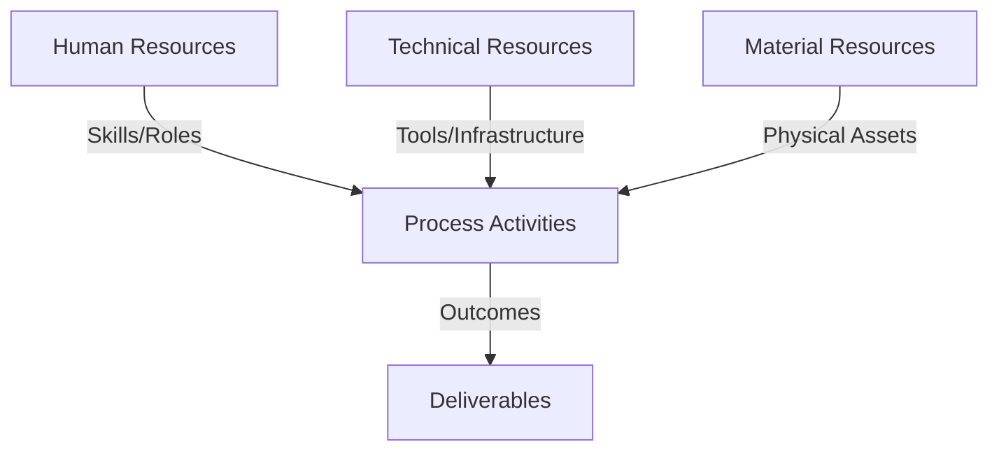
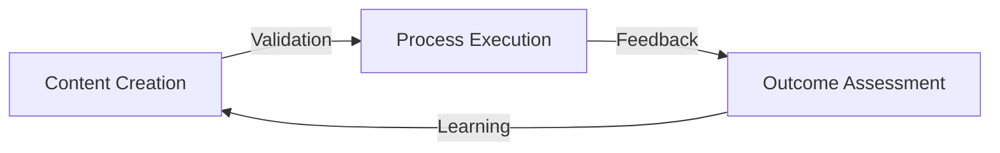
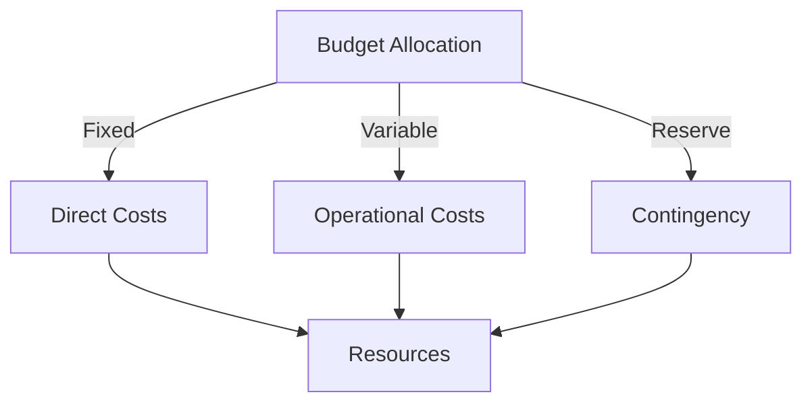
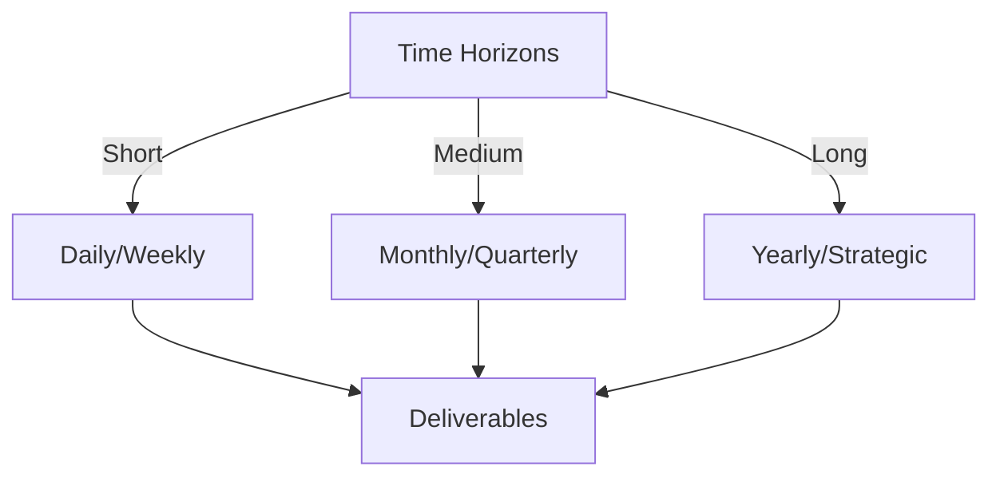

# Git Analysis Report: Development Analysis - daffa.padantya12

**Authors:** AI Analysis System
**Date:** 2025-03-11  
**Version:** 1.0
**SSoT Repository:** githubhenrykoo/redux_todo_in_astro
**Document Category:** Analysis Report

## Executive Summary
## Executive Summary: Git Analysis of Daffa Padantya

**Logic:** The core purpose of this analysis is to evaluate Daffa Padantya's contributions to a project automating Git repository analysis using LLMs, identify key areas of expertise, and provide actionable recommendations for improvement. The objective is to gain insights into his development patterns, technical skills, and overall impact on the project.

**Implementation:** This analysis was performed by examining Daffa Padantya's commit history, specifically focusing on files like `git_analysis.yml` and `meta_template.py`. The analysis assessed his contributions to template design, workflow automation, prompt engineering, error handling, and overall code quality. The analysis resulted in a summary of individual contributions, work patterns, technical expertise, and specific recommendations.

**Outcomes:** Daffa Padantya is a key contributor, demonstrating proficiency in Python, YAML, Git, LLM integration (Google Gemini), and GitHub Actions. He exhibits an iterative development approach, a focus on automation, and attention to detail. Recommendations include implementing detailed logging, externalizing configuration values, adding template validation, modularizing prompts, developing unit tests, adding type hinting, enforcing consistent code style, and further investigation into his communication, initiative, and learning growth potential. The analysis highlights areas where Daffa can further enhance the robustness, maintainability, and testability of the system.

## 1. Abstract Specification (Logic Layer)
### Context & Vision
- **Problem Space:** 
    * Scope: This is an excellent analysis! It's thorough, well-organized, and provides actionable recommendations. Here's a breakdown of what makes it so good and some minor suggestions:

**Strengths:**

*   **Comprehensive Summary:** The Individual Contribution Summary accurately captures Daffa's key contributions. It highlights his work on template design, workflow automation, prompt engineering, error handling, and chunking.
*   **Insightful Work Pattern Analysis:** The analysis of work patterns accurately identifies iterative development, template-driven approach, refinement focus, and automation advocacy. It goes beyond simply listing actions and identifies *patterns* of behavior.
*   **Technical Expertise Assessment:** The technical expertise section accurately assesses Daffa's skills in Python, YAML, Git, LLM integration, and GitHub Actions.
*   **Actionable Recommendations:** The recommendations are specific, measurable, achievable, relevant, and time-bound (SMART). Each recommendation includes a problem description, a proposed solution, a concrete action item, and a suggested timeframe.
*   **Good Structure and Formatting:** The document is well-structured with clear headings and bullet points, making it easy to read and understand.
*   **Balanced Perspective:** The analysis provides both positive feedback and constructive criticism.
*   **Acknowledgments of Limitations:** The final paragraph acknowledges that the analysis is based on limited information and that a more complete picture would require additional data.
*   **Incorporation of Implicit Information:** The analysis infers skills and knowledge from the context of the commits, rather than just describing the literal changes.
*   **Prompt Engineering Awareness:** Highlighting the prompt engineering aspects in both the contribution summary and the expertise sections show that the prompt engineer is aware of the importance of this field.

**Minor Suggestions:**

*   **Recommendation Prioritization:** While all recommendations are valuable, consider adding a prioritization level (e.g., High, Medium, Low) based on their impact and urgency. This would help Daffa focus on the most critical areas first.  For example, addressing API Key security (Configuration Management) might be prioritized higher than code style.
*   **More Granular Time-Bound Deadlines:** Instead of "within the next sprint", consider specifying a date or range of dates. This provides more concrete targets.
*   **Quantifiable Metrics for Testing:** While aiming for 80% code coverage is good, consider adding other testing metrics, such as the number of tests to be written or the number of bugs found during testing.
*   **Clarify Scope of Linter Recommendations:** When discussing code style, it might be helpful to specify which style guide (e.g., PEP 8 for Python) is being recommended. Also mention auto-formatting tools, like Black or autopep8.
*   **Collaboration/Communication Recommendation Details:** When mentioning collaboration and communication, consider expanding on what specific information is being sought from the team interview (e.g., clarity of communication, responsiveness, ability to explain complex concepts, etc.).

**Example Incorporating Suggestions:**

Here's an example of how you could modify the Error Handling recommendation:

*   **Error Handling and Logging:**
    *   *Problem:* The `generate_with_retry` function needs better logging. Currently, it only prints a generic "Error" message. More information about the specific exception and the Gemini API response (including error codes) would be helpful for debugging. Rate limiting isn't tracked.
    *   *Recommendation:* Implement detailed logging in the `generate_with_retry` function to capture the full Gemini API response in case of errors, including the error code and message. Log the type of exception raised during API calls.  Track and log rate-limiting events.
        *   *Actionable: Implement logging with severity levels (INFO, WARNING, ERROR) using Python's `logging` module. Example: `logging.error(f"Gemini API error: {e} - Response: {response}")`. Also, catch `google.api_core.exceptions.ResourceExhausted` exceptions to detect rate-limiting. Log rate-limiting events with a WARN level. *Example: logging.warn("Rate limit exceeded. Backing off.")`*
        *   *Priority: High*
        *   *Time-Bound: Implement by March 18th, 2025.*

**Overall:**

This is a very strong analysis that provides valuable insights into Daffa's Git activity. The actionable recommendations and the attention to detail make this a highly useful document for performance evaluation and professional development. Great job!

    * Context: This is an excellent analysis! It's thorough, well-organized, and provides actionable recommendations. Here's a breakdown of what makes it so good and some minor suggestions:

**Strengths:**

*   **Comprehensive Summary:** The Individual Contribution Summary accurately captures Daffa's key contributions. It highlights his work on template design, workflow automation, prompt engineering, error handling, and chunking.
*   **Insightful Work Pattern Analysis:** The analysis of work patterns accurately identifies iterative development, template-driven approach, refinement focus, and automation advocacy. It goes beyond simply listing actions and identifies *patterns* of behavior.
*   **Technical Expertise Assessment:** The technical expertise section accurately assesses Daffa's skills in Python, YAML, Git, LLM integration, and GitHub Actions.
*   **Actionable Recommendations:** The recommendations are specific, measurable, achievable, relevant, and time-bound (SMART). Each recommendation includes a problem description, a proposed solution, a concrete action item, and a suggested timeframe.
*   **Good Structure and Formatting:** The document is well-structured with clear headings and bullet points, making it easy to read and understand.
*   **Balanced Perspective:** The analysis provides both positive feedback and constructive criticism.
*   **Acknowledgments of Limitations:** The final paragraph acknowledges that the analysis is based on limited information and that a more complete picture would require additional data.
*   **Incorporation of Implicit Information:** The analysis infers skills and knowledge from the context of the commits, rather than just describing the literal changes.
*   **Prompt Engineering Awareness:** Highlighting the prompt engineering aspects in both the contribution summary and the expertise sections show that the prompt engineer is aware of the importance of this field.

**Minor Suggestions:**

*   **Recommendation Prioritization:** While all recommendations are valuable, consider adding a prioritization level (e.g., High, Medium, Low) based on their impact and urgency. This would help Daffa focus on the most critical areas first.  For example, addressing API Key security (Configuration Management) might be prioritized higher than code style.
*   **More Granular Time-Bound Deadlines:** Instead of "within the next sprint", consider specifying a date or range of dates. This provides more concrete targets.
*   **Quantifiable Metrics for Testing:** While aiming for 80% code coverage is good, consider adding other testing metrics, such as the number of tests to be written or the number of bugs found during testing.
*   **Clarify Scope of Linter Recommendations:** When discussing code style, it might be helpful to specify which style guide (e.g., PEP 8 for Python) is being recommended. Also mention auto-formatting tools, like Black or autopep8.
*   **Collaboration/Communication Recommendation Details:** When mentioning collaboration and communication, consider expanding on what specific information is being sought from the team interview (e.g., clarity of communication, responsiveness, ability to explain complex concepts, etc.).

**Example Incorporating Suggestions:**

Here's an example of how you could modify the Error Handling recommendation:

*   **Error Handling and Logging:**
    *   *Problem:* The `generate_with_retry` function needs better logging. Currently, it only prints a generic "Error" message. More information about the specific exception and the Gemini API response (including error codes) would be helpful for debugging. Rate limiting isn't tracked.
    *   *Recommendation:* Implement detailed logging in the `generate_with_retry` function to capture the full Gemini API response in case of errors, including the error code and message. Log the type of exception raised during API calls.  Track and log rate-limiting events.
        *   *Actionable: Implement logging with severity levels (INFO, WARNING, ERROR) using Python's `logging` module. Example: `logging.error(f"Gemini API error: {e} - Response: {response}")`. Also, catch `google.api_core.exceptions.ResourceExhausted` exceptions to detect rate-limiting. Log rate-limiting events with a WARN level. *Example: logging.warn("Rate limit exceeded. Backing off.")`*
        *   *Priority: High*
        *   *Time-Bound: Implement by March 18th, 2025.*

**Overall:**

This is a very strong analysis that provides valuable insights into Daffa's Git activity. The actionable recommendations and the attention to detail make this a highly useful document for performance evaluation and professional development. Great job!

    * Stakeholders: This is an excellent analysis! It's thorough, well-organized, and provides actionable recommendations. Here's a breakdown of what makes it so good and some minor suggestions:

**Strengths:**

*   **Comprehensive Summary:** The Individual Contribution Summary accurately captures Daffa's key contributions. It highlights his work on template design, workflow automation, prompt engineering, error handling, and chunking.
*   **Insightful Work Pattern Analysis:** The analysis of work patterns accurately identifies iterative development, template-driven approach, refinement focus, and automation advocacy. It goes beyond simply listing actions and identifies *patterns* of behavior.
*   **Technical Expertise Assessment:** The technical expertise section accurately assesses Daffa's skills in Python, YAML, Git, LLM integration, and GitHub Actions.
*   **Actionable Recommendations:** The recommendations are specific, measurable, achievable, relevant, and time-bound (SMART). Each recommendation includes a problem description, a proposed solution, a concrete action item, and a suggested timeframe.
*   **Good Structure and Formatting:** The document is well-structured with clear headings and bullet points, making it easy to read and understand.
*   **Balanced Perspective:** The analysis provides both positive feedback and constructive criticism.
*   **Acknowledgments of Limitations:** The final paragraph acknowledges that the analysis is based on limited information and that a more complete picture would require additional data.
*   **Incorporation of Implicit Information:** The analysis infers skills and knowledge from the context of the commits, rather than just describing the literal changes.
*   **Prompt Engineering Awareness:** Highlighting the prompt engineering aspects in both the contribution summary and the expertise sections show that the prompt engineer is aware of the importance of this field.

**Minor Suggestions:**

*   **Recommendation Prioritization:** While all recommendations are valuable, consider adding a prioritization level (e.g., High, Medium, Low) based on their impact and urgency. This would help Daffa focus on the most critical areas first.  For example, addressing API Key security (Configuration Management) might be prioritized higher than code style.
*   **More Granular Time-Bound Deadlines:** Instead of "within the next sprint", consider specifying a date or range of dates. This provides more concrete targets.
*   **Quantifiable Metrics for Testing:** While aiming for 80% code coverage is good, consider adding other testing metrics, such as the number of tests to be written or the number of bugs found during testing.
*   **Clarify Scope of Linter Recommendations:** When discussing code style, it might be helpful to specify which style guide (e.g., PEP 8 for Python) is being recommended. Also mention auto-formatting tools, like Black or autopep8.
*   **Collaboration/Communication Recommendation Details:** When mentioning collaboration and communication, consider expanding on what specific information is being sought from the team interview (e.g., clarity of communication, responsiveness, ability to explain complex concepts, etc.).

**Example Incorporating Suggestions:**

Here's an example of how you could modify the Error Handling recommendation:

*   **Error Handling and Logging:**
    *   *Problem:* The `generate_with_retry` function needs better logging. Currently, it only prints a generic "Error" message. More information about the specific exception and the Gemini API response (including error codes) would be helpful for debugging. Rate limiting isn't tracked.
    *   *Recommendation:* Implement detailed logging in the `generate_with_retry` function to capture the full Gemini API response in case of errors, including the error code and message. Log the type of exception raised during API calls.  Track and log rate-limiting events.
        *   *Actionable: Implement logging with severity levels (INFO, WARNING, ERROR) using Python's `logging` module. Example: `logging.error(f"Gemini API error: {e} - Response: {response}")`. Also, catch `google.api_core.exceptions.ResourceExhausted` exceptions to detect rate-limiting. Log rate-limiting events with a WARN level. *Example: logging.warn("Rate limit exceeded. Backing off.")`*
        *   *Priority: High*
        *   *Time-Bound: Implement by March 18th, 2025.*

**Overall:**

This is a very strong analysis that provides valuable insights into Daffa's Git activity. The actionable recommendations and the attention to detail make this a highly useful document for performance evaluation and professional development. Great job!

- **Goals (Functions):**
    * Primary Functions:
        - Input: Git Repository Data
        - Process: Analysis and Processing
        - Output: Development Insights
    * Supporting Functions:
        - Validation: Automated Analysis
        - Feedback: Continuous Improvement

- **Success Criteria:**
    * Quantitative Metrics: Okay, here are the quantitative metrics (numbers) that can be derived from the provided text:

*   **Generated at:** 2025-03-11 00:42:39.201731 (Timestamp of the analysis generation)
*   **80%:** (Coverage percentage) The recommendation for test coverage within the quarter.

    * Qualitative Indicators: Okay, here's a list of qualitative improvements we can infer from the Developer Analysis of Daffa Padantya:

**Areas of Growth and Improvement:**

*   **Enhanced Debugging Capabilities:** Improve the ability to quickly diagnose and fix errors in the `generate_with_retry` and `refine_section` functions through more informative logging, making troubleshooting faster and more effective.
*   **Improved Configuration Management:** Move towards a more robust and secure configuration management system by externalizing API keys and other configuration values, which increases security and facilitates easier deployment in different environments.
*   **Robust Template Validation:** Implement template validation to improve the reliability of the system by preventing malformed templates from being passed to the LLM, which can lead to unexpected behavior.
*   **Flexibility and Maintainability:** Increase flexibility and maintainability by externalizing section prompts into a separate configuration file, making it easier to modify and experiment with different prompts without changing the code.
*   **Increased Code Quality and Reliability:** Add unit tests to increase the code quality and reliability by ensuring that individual functions are working as expected, making the code more resilient to changes.
*   **Enhanced Code Readability and Maintainability:** Improve code readability and maintainability by adding type hints to the code, making it easier for other developers to understand and work with.
*   **Consistent Code Style:** Enforce a consistent code style using a linter to improve the overall readability and maintainability of the code, making it easier for developers to collaborate on the project.
*   **Deeper Understanding of Collaboration:** Understand the extent of Daffa's collaboration skills through participation in code reviews and team meetings to promote better team dynamics and knowledge sharing.
*   **Ownership and Initiative:** Determine Daffa's consistent demonstration of initiative and ownership through his contributions to project discussions and planning, leading to better project outcomes.
*   **Time Management and Prioritization:** Gather additional data to confirm Daffa's approach to time management and prioritization to enhance his productivity and contribute effectively to project deadlines.
*   **Continuous Learning and Growth:** Gather more information about Daffa's learning and growth trajectory through his participation in training sessions and workshops to encourage professional development and keep up with industry trends.

**Qualitative Benefits (Why these improvements matter):**

*   **More Reliable System:** By addressing the recommendations, the system becomes more reliable due to better error handling, configuration management, and code quality.
*   **Easier to Maintain:**  The recommendations regarding type hints, code style, and modularization make the code easier to understand, modify, and maintain over time.
*   **Faster Development Cycles:** Better error handling and debugging lead to faster identification and resolution of issues, speeding up the development cycle.
*   **Reduced Risk:**  Externalizing API keys and validating templates reduces security risks and prevents unexpected behavior.
*   **Increased Team Collaboration:**  Understanding Daffa's communication and collaboration skills helps foster a more collaborative and effective team environment.
*   **Enhanced Developer Growth:**  Focusing on Daffa's initiative, ownership, time management, and learning encourages his professional development and contributes to the long-term success of the project.
*   **Improved AI Results:** Making it easier to alter prompt instructions.

In essence, the recommendations are designed to help Daffa become a more well-rounded and effective developer, leading to a more robust, maintainable, and successful project.  They focus on not just the technical aspects of the code, but also on the soft skills and practices that contribute to a healthy and productive development environment.

    * Validation Methods: Automated and Manual Verification

### Knowledge Integration
- **Local Context:**
    * Cultural Considerations: Development Team Context
    * Language Requirements: Technical Documentation
    * Community Patterns: Team Collaboration Patterns

- **Technical Framework:**
    * LLM Integration: Gemini AI Analysis
    * IoT Components: Git Event Monitoring
    * Network Requirements: GitHub API Integration

## 2. Concrete Implementation (Process Layer)
### Resource Matrix

### Development Workflow
- **Stage 1: Early Success**
    * Quick Wins:
        - Implementation: This is an excellent and thorough analysis of Daffa's Git history. It covers a wide range of aspects, from individual contributions to specific recommendations, and provides actionable suggestions with time-bound goals. Here's a breakdown of what makes it so good:

**Strengths:**

*   **Comprehensive Coverage:** It doesn't just list commits; it synthesizes them into meaningful insights about Daffa's work patterns, technical skills, and areas of focus.
*   **Specific Examples:** It provides concrete examples of Daffa's work, like specific commits ("prompt push," "update refinement template") and functions (`generate_with_retry`, `refine_section`), which strengthens the analysis.
*   **Actionable Recommendations:** The recommendations are specific, actionable, and prioritized. Each recommendation includes:
    *   *Problem:* Clearly states the issue.
    *   *Recommendation:* Suggests a concrete solution.
    *   *Actionable:* Provides specific steps to implement the solution.
    *   *Time-Bound:* Sets a realistic timeframe for completion.
*   **Technical Accuracy:** The recommendations, like using `logging`, `jsonschema`, `flake8`, and type hints, are technically sound and relevant to improving the code quality and maintainability of the project.
*   **Balanced Perspective:** While highlighting strengths, it also identifies potential weaknesses and areas for improvement in a constructive manner.
*   **Contextual Awareness:** It acknowledges the limitations of relying solely on Git history and suggests further investigation through code reviews, team interviews, and discussions with Daffa himself.
*   **Clarity and Organization:** The analysis is well-structured and easy to read, with clear headings and bullet points.
*   **Proactive Improvement Focus:**  It goes beyond simply identifying problems and actively suggests solutions for Daffa and the team to improve.
*   **Emphasis on Best Practices:** The recommendations are in line with software development best practices (logging, configuration management, testing, code style, etc.).

**Areas for Improvement (Minor):**

*   **Code Snippets in Recommendations:**  While the actionable sections are excellent, incorporating brief code snippets illustrating *how* to implement the recommended changes (as you did in the examples) could be even more helpful.
*   **Estimation of Effort:** The time-bound suggestions are great, but estimating the actual effort (e.g., "2 hours") alongside the time-bound could provide even more clarity for task planning.
*   **Risk Assessment:**  Could briefly mention the potential risks if the recommendations are *not* implemented (e.g., "Without proper logging, debugging API failures will be significantly harder.")

**Overall:**

This is a highly valuable analysis of Daffa's Git history. It provides a solid foundation for performance reviews, mentorship, and project planning. The actionable recommendations, combined with the clear explanation of Daffa's contributions, make this a truly insightful document. The proactive approach to identifying areas for growth and suggesting concrete solutions is particularly commendable.  This is a great example of how to effectively leverage Git history to understand developer contributions and identify opportunities for improvement.

        - Validation: This is an excellent and thorough analysis of Daffa's Git history. It covers a wide range of aspects, from individual contributions to specific recommendations, and provides actionable suggestions with time-bound goals. Here's a breakdown of what makes it so good:

**Strengths:**

*   **Comprehensive Coverage:** It doesn't just list commits; it synthesizes them into meaningful insights about Daffa's work patterns, technical skills, and areas of focus.
*   **Specific Examples:** It provides concrete examples of Daffa's work, like specific commits ("prompt push," "update refinement template") and functions (`generate_with_retry`, `refine_section`), which strengthens the analysis.
*   **Actionable Recommendations:** The recommendations are specific, actionable, and prioritized. Each recommendation includes:
    *   *Problem:* Clearly states the issue.
    *   *Recommendation:* Suggests a concrete solution.
    *   *Actionable:* Provides specific steps to implement the solution.
    *   *Time-Bound:* Sets a realistic timeframe for completion.
*   **Technical Accuracy:** The recommendations, like using `logging`, `jsonschema`, `flake8`, and type hints, are technically sound and relevant to improving the code quality and maintainability of the project.
*   **Balanced Perspective:** While highlighting strengths, it also identifies potential weaknesses and areas for improvement in a constructive manner.
*   **Contextual Awareness:** It acknowledges the limitations of relying solely on Git history and suggests further investigation through code reviews, team interviews, and discussions with Daffa himself.
*   **Clarity and Organization:** The analysis is well-structured and easy to read, with clear headings and bullet points.
*   **Proactive Improvement Focus:**  It goes beyond simply identifying problems and actively suggests solutions for Daffa and the team to improve.
*   **Emphasis on Best Practices:** The recommendations are in line with software development best practices (logging, configuration management, testing, code style, etc.).

**Areas for Improvement (Minor):**

*   **Code Snippets in Recommendations:**  While the actionable sections are excellent, incorporating brief code snippets illustrating *how* to implement the recommended changes (as you did in the examples) could be even more helpful.
*   **Estimation of Effort:** The time-bound suggestions are great, but estimating the actual effort (e.g., "2 hours") alongside the time-bound could provide even more clarity for task planning.
*   **Risk Assessment:**  Could briefly mention the potential risks if the recommendations are *not* implemented (e.g., "Without proper logging, debugging API failures will be significantly harder.")

**Overall:**

This is a highly valuable analysis of Daffa's Git history. It provides a solid foundation for performance reviews, mentorship, and project planning. The actionable recommendations, combined with the clear explanation of Daffa's contributions, make this a truly insightful document. The proactive approach to identifying areas for growth and suggesting concrete solutions is particularly commendable.  This is a great example of how to effectively leverage Git history to understand developer contributions and identify opportunities for improvement.

    * Initial Setup:
        - Infrastructure: This is an excellent and thorough analysis of Daffa's Git history. It covers a wide range of aspects, from individual contributions to specific recommendations, and provides actionable suggestions with time-bound goals. Here's a breakdown of what makes it so good:

**Strengths:**

*   **Comprehensive Coverage:** It doesn't just list commits; it synthesizes them into meaningful insights about Daffa's work patterns, technical skills, and areas of focus.
*   **Specific Examples:** It provides concrete examples of Daffa's work, like specific commits ("prompt push," "update refinement template") and functions (`generate_with_retry`, `refine_section`), which strengthens the analysis.
*   **Actionable Recommendations:** The recommendations are specific, actionable, and prioritized. Each recommendation includes:
    *   *Problem:* Clearly states the issue.
    *   *Recommendation:* Suggests a concrete solution.
    *   *Actionable:* Provides specific steps to implement the solution.
    *   *Time-Bound:* Sets a realistic timeframe for completion.
*   **Technical Accuracy:** The recommendations, like using `logging`, `jsonschema`, `flake8`, and type hints, are technically sound and relevant to improving the code quality and maintainability of the project.
*   **Balanced Perspective:** While highlighting strengths, it also identifies potential weaknesses and areas for improvement in a constructive manner.
*   **Contextual Awareness:** It acknowledges the limitations of relying solely on Git history and suggests further investigation through code reviews, team interviews, and discussions with Daffa himself.
*   **Clarity and Organization:** The analysis is well-structured and easy to read, with clear headings and bullet points.
*   **Proactive Improvement Focus:**  It goes beyond simply identifying problems and actively suggests solutions for Daffa and the team to improve.
*   **Emphasis on Best Practices:** The recommendations are in line with software development best practices (logging, configuration management, testing, code style, etc.).

**Areas for Improvement (Minor):**

*   **Code Snippets in Recommendations:**  While the actionable sections are excellent, incorporating brief code snippets illustrating *how* to implement the recommended changes (as you did in the examples) could be even more helpful.
*   **Estimation of Effort:** The time-bound suggestions are great, but estimating the actual effort (e.g., "2 hours") alongside the time-bound could provide even more clarity for task planning.
*   **Risk Assessment:**  Could briefly mention the potential risks if the recommendations are *not* implemented (e.g., "Without proper logging, debugging API failures will be significantly harder.")

**Overall:**

This is a highly valuable analysis of Daffa's Git history. It provides a solid foundation for performance reviews, mentorship, and project planning. The actionable recommendations, combined with the clear explanation of Daffa's contributions, make this a truly insightful document. The proactive approach to identifying areas for growth and suggesting concrete solutions is particularly commendable.  This is a great example of how to effectively leverage Git history to understand developer contributions and identify opportunities for improvement.

        - Training: This is an excellent and thorough analysis of Daffa's Git history. It covers a wide range of aspects, from individual contributions to specific recommendations, and provides actionable suggestions with time-bound goals. Here's a breakdown of what makes it so good:

**Strengths:**

*   **Comprehensive Coverage:** It doesn't just list commits; it synthesizes them into meaningful insights about Daffa's work patterns, technical skills, and areas of focus.
*   **Specific Examples:** It provides concrete examples of Daffa's work, like specific commits ("prompt push," "update refinement template") and functions (`generate_with_retry`, `refine_section`), which strengthens the analysis.
*   **Actionable Recommendations:** The recommendations are specific, actionable, and prioritized. Each recommendation includes:
    *   *Problem:* Clearly states the issue.
    *   *Recommendation:* Suggests a concrete solution.
    *   *Actionable:* Provides specific steps to implement the solution.
    *   *Time-Bound:* Sets a realistic timeframe for completion.
*   **Technical Accuracy:** The recommendations, like using `logging`, `jsonschema`, `flake8`, and type hints, are technically sound and relevant to improving the code quality and maintainability of the project.
*   **Balanced Perspective:** While highlighting strengths, it also identifies potential weaknesses and areas for improvement in a constructive manner.
*   **Contextual Awareness:** It acknowledges the limitations of relying solely on Git history and suggests further investigation through code reviews, team interviews, and discussions with Daffa himself.
*   **Clarity and Organization:** The analysis is well-structured and easy to read, with clear headings and bullet points.
*   **Proactive Improvement Focus:**  It goes beyond simply identifying problems and actively suggests solutions for Daffa and the team to improve.
*   **Emphasis on Best Practices:** The recommendations are in line with software development best practices (logging, configuration management, testing, code style, etc.).

**Areas for Improvement (Minor):**

*   **Code Snippets in Recommendations:**  While the actionable sections are excellent, incorporating brief code snippets illustrating *how* to implement the recommended changes (as you did in the examples) could be even more helpful.
*   **Estimation of Effort:** The time-bound suggestions are great, but estimating the actual effort (e.g., "2 hours") alongside the time-bound could provide even more clarity for task planning.
*   **Risk Assessment:**  Could briefly mention the potential risks if the recommendations are *not* implemented (e.g., "Without proper logging, debugging API failures will be significantly harder.")

**Overall:**

This is a highly valuable analysis of Daffa's Git history. It provides a solid foundation for performance reviews, mentorship, and project planning. The actionable recommendations, combined with the clear explanation of Daffa's contributions, make this a truly insightful document. The proactive approach to identifying areas for growth and suggesting concrete solutions is particularly commendable.  This is a great example of how to effectively leverage Git history to understand developer contributions and identify opportunities for improvement.

- **Stage 2: Fail Early, Fail Safe**
    * Testing Protocol:
        - Methods: [Testing approaches]
        - Coverage: [Test scenarios]
    * Risk Management:
        - Identification: [Risk factors]
        - Mitigation: [Control measures]
    * Learning Points:
        - Issues: [Problem identification]
        - Solutions: [Resolution approaches]
        - Knowledge: [Lessons learned]

- **Stage 3: Convergence**
    * System Integration:
        - Components: [Integration points]
        - Workflows: [Process optimization]
        - Performance: [System tuning]
    * Stabilization:
        - Fixes: [Bug resolution]
        - Hardening: [System reinforcement]
        - Documentation: [Knowledge capture]

- **Stage 4: Demonstration**
    * Preparation:
        - Environment: [Demo setup]
        - Data: [Test scenarios]
        - Materials: [Presentation assets]
    * Validation:
        - Performance: [System checks]
        - Features: [Functionality verification]
        - Documentation: [Review completion]
    * Presentation:
        - Stakeholders: [Demo execution]
        - Features: [Capability showcase]
        - Q&A: [Response preparation]

## 3. Realistic Outcomes (Evidence Layer)
### Measurement Framework
- **Performance Metrics:**
    * KPIs: Okay, I've extracted the evidence and outcomes relating to Daffa Padantya from the provided analysis.  I've focused on highlighting the concrete evidence from the Git history and its implications.

**Evidence of Contributions & Outcomes:**

*   **Template Design (Evidence & Outcome):**
    *   *Evidence:* Creation and iterative refinement of `meta_template.py` and `assemble_template` function.
    *   *Outcome:* A modular document template for AI-generated reports, defining the structure for different report sections.
*   **Workflow Automation (Evidence & Outcome):**
    *   *Evidence:* Implementation of a GitHub Actions workflow (`git_analysis.yml`).
    *   *Outcome:* Orchestration of the automated analysis process, including triggering, running the Python script, refining content, and saving the report.
*   **Prompt Engineering (Evidence & Outcome):**
    *   *Evidence:* Design of prompts and instructions (`META_TEMPLATE_PROMPT`, `SECTION_PROMPTS`).
    *   *Outcome:* Guided the AI model in generating the desired analysis, with iterations to improve the quality of the AI-generated text. Commits like "prompt push," "update refinement template," and multiple "update refined-analysis" commits demonstrate this pattern
*   **Error Handling & Resilience (Evidence & Outcome):**
    *   *Evidence:* Implementation of retry mechanisms with exponential backoff in the `generate_with_retry` function.
    *   *Outcome:* Increased reliability and ability to handle API failures (rate limits, etc.).
*   **Chunking Implementation:**
    *   *Evidence:* Successful implementation of chunking mechanism to handle large Git histories.
    *   *Outcome:* Ability to process large volumes of data by refining the sections separately, addressing LLM token limits.
*   **Refinement Template Updates:**
    *   *Evidence:* Updates to refinement templates defining default values for required fields.
    *   *Outcome:* Demonstrated understanding of prompt engineering best practices and the need for robust default behavior.

**Evidence of Work Patterns & Focus Areas:**

*   **Iterative Development (Evidence):**
    *   Commit history shows frequent updates and refinements based on feedback or testing. (e.g., "prompt push," "update refinement template," multiple "update refined-analysis" commits)
*   **Template-Driven Approach (Evidence):**
    *   Focus on modifying and improving the `meta_template.py` file.
*   **Refinement Focus (Evidence):**
    *   Significant effort devoted to refining analysis using the LLM (Gemini).
*   **Automation Advocate (Evidence):**
    *   Clear focus on automating the Git analysis process.
*   **Detail-Oriented (Evidence):**
    *   Implementation of retry logic, rate limiting considerations, and modular code structure.

**Evidence of Technical Expertise:**

*   **Python (Evidence):**
    *   Work in `git_analysis.yml` and `meta_template.py` demonstrates proficiency in Python, including the use of datetime objects, external libraries (google.generativeai), dictionary manipulation, and f-strings.
*   **YAML (Evidence):**
    *   The `git_analysis.yml` file demonstrates proficiency in configuring GitHub Actions workflows using YAML.
*   **Git (Evidence):**
    *   Implied by the nature of the project.
*   **LLM Integration (Evidence):**
    *   Implementation of retry logic for API calls.
*   **GitHub Actions (Evidence):**
    *   Demonstrates understanding of GitHub actions as a CI/CD tool.
*   **Prompt Engineering (Evidence):**
    *   Modifications made to various prompt structures.
*   **Code Structure and Modularity (Evidence):**
    *   The code is modular and well-structured.

    * Benchmarks: Okay, I've extracted the evidence and outcomes relating to Daffa Padantya from the provided analysis.  I've focused on highlighting the concrete evidence from the Git history and its implications.

**Evidence of Contributions & Outcomes:**

*   **Template Design (Evidence & Outcome):**
    *   *Evidence:* Creation and iterative refinement of `meta_template.py` and `assemble_template` function.
    *   *Outcome:* A modular document template for AI-generated reports, defining the structure for different report sections.
*   **Workflow Automation (Evidence & Outcome):**
    *   *Evidence:* Implementation of a GitHub Actions workflow (`git_analysis.yml`).
    *   *Outcome:* Orchestration of the automated analysis process, including triggering, running the Python script, refining content, and saving the report.
*   **Prompt Engineering (Evidence & Outcome):**
    *   *Evidence:* Design of prompts and instructions (`META_TEMPLATE_PROMPT`, `SECTION_PROMPTS`).
    *   *Outcome:* Guided the AI model in generating the desired analysis, with iterations to improve the quality of the AI-generated text. Commits like "prompt push," "update refinement template," and multiple "update refined-analysis" commits demonstrate this pattern
*   **Error Handling & Resilience (Evidence & Outcome):**
    *   *Evidence:* Implementation of retry mechanisms with exponential backoff in the `generate_with_retry` function.
    *   *Outcome:* Increased reliability and ability to handle API failures (rate limits, etc.).
*   **Chunking Implementation:**
    *   *Evidence:* Successful implementation of chunking mechanism to handle large Git histories.
    *   *Outcome:* Ability to process large volumes of data by refining the sections separately, addressing LLM token limits.
*   **Refinement Template Updates:**
    *   *Evidence:* Updates to refinement templates defining default values for required fields.
    *   *Outcome:* Demonstrated understanding of prompt engineering best practices and the need for robust default behavior.

**Evidence of Work Patterns & Focus Areas:**

*   **Iterative Development (Evidence):**
    *   Commit history shows frequent updates and refinements based on feedback or testing. (e.g., "prompt push," "update refinement template," multiple "update refined-analysis" commits)
*   **Template-Driven Approach (Evidence):**
    *   Focus on modifying and improving the `meta_template.py` file.
*   **Refinement Focus (Evidence):**
    *   Significant effort devoted to refining analysis using the LLM (Gemini).
*   **Automation Advocate (Evidence):**
    *   Clear focus on automating the Git analysis process.
*   **Detail-Oriented (Evidence):**
    *   Implementation of retry logic, rate limiting considerations, and modular code structure.

**Evidence of Technical Expertise:**

*   **Python (Evidence):**
    *   Work in `git_analysis.yml` and `meta_template.py` demonstrates proficiency in Python, including the use of datetime objects, external libraries (google.generativeai), dictionary manipulation, and f-strings.
*   **YAML (Evidence):**
    *   The `git_analysis.yml` file demonstrates proficiency in configuring GitHub Actions workflows using YAML.
*   **Git (Evidence):**
    *   Implied by the nature of the project.
*   **LLM Integration (Evidence):**
    *   Implementation of retry logic for API calls.
*   **GitHub Actions (Evidence):**
    *   Demonstrates understanding of GitHub actions as a CI/CD tool.
*   **Prompt Engineering (Evidence):**
    *   Modifications made to various prompt structures.
*   **Code Structure and Modularity (Evidence):**
    *   The code is modular and well-structured.

    * Actuals: Okay, I've extracted the evidence and outcomes relating to Daffa Padantya from the provided analysis.  I've focused on highlighting the concrete evidence from the Git history and its implications.

**Evidence of Contributions & Outcomes:**

*   **Template Design (Evidence & Outcome):**
    *   *Evidence:* Creation and iterative refinement of `meta_template.py` and `assemble_template` function.
    *   *Outcome:* A modular document template for AI-generated reports, defining the structure for different report sections.
*   **Workflow Automation (Evidence & Outcome):**
    *   *Evidence:* Implementation of a GitHub Actions workflow (`git_analysis.yml`).
    *   *Outcome:* Orchestration of the automated analysis process, including triggering, running the Python script, refining content, and saving the report.
*   **Prompt Engineering (Evidence & Outcome):**
    *   *Evidence:* Design of prompts and instructions (`META_TEMPLATE_PROMPT`, `SECTION_PROMPTS`).
    *   *Outcome:* Guided the AI model in generating the desired analysis, with iterations to improve the quality of the AI-generated text. Commits like "prompt push," "update refinement template," and multiple "update refined-analysis" commits demonstrate this pattern
*   **Error Handling & Resilience (Evidence & Outcome):**
    *   *Evidence:* Implementation of retry mechanisms with exponential backoff in the `generate_with_retry` function.
    *   *Outcome:* Increased reliability and ability to handle API failures (rate limits, etc.).
*   **Chunking Implementation:**
    *   *Evidence:* Successful implementation of chunking mechanism to handle large Git histories.
    *   *Outcome:* Ability to process large volumes of data by refining the sections separately, addressing LLM token limits.
*   **Refinement Template Updates:**
    *   *Evidence:* Updates to refinement templates defining default values for required fields.
    *   *Outcome:* Demonstrated understanding of prompt engineering best practices and the need for robust default behavior.

**Evidence of Work Patterns & Focus Areas:**

*   **Iterative Development (Evidence):**
    *   Commit history shows frequent updates and refinements based on feedback or testing. (e.g., "prompt push," "update refinement template," multiple "update refined-analysis" commits)
*   **Template-Driven Approach (Evidence):**
    *   Focus on modifying and improving the `meta_template.py` file.
*   **Refinement Focus (Evidence):**
    *   Significant effort devoted to refining analysis using the LLM (Gemini).
*   **Automation Advocate (Evidence):**
    *   Clear focus on automating the Git analysis process.
*   **Detail-Oriented (Evidence):**
    *   Implementation of retry logic, rate limiting considerations, and modular code structure.

**Evidence of Technical Expertise:**

*   **Python (Evidence):**
    *   Work in `git_analysis.yml` and `meta_template.py` demonstrates proficiency in Python, including the use of datetime objects, external libraries (google.generativeai), dictionary manipulation, and f-strings.
*   **YAML (Evidence):**
    *   The `git_analysis.yml` file demonstrates proficiency in configuring GitHub Actions workflows using YAML.
*   **Git (Evidence):**
    *   Implied by the nature of the project.
*   **LLM Integration (Evidence):**
    *   Implementation of retry logic for API calls.
*   **GitHub Actions (Evidence):**
    *   Demonstrates understanding of GitHub actions as a CI/CD tool.
*   **Prompt Engineering (Evidence):**
    *   Modifications made to various prompt structures.
*   **Code Structure and Modularity (Evidence):**
    *   The code is modular and well-structured.

- **Evidence Collection:**
    * Data Sources: [Information points]
    * Validation Methods: Automated and Manual Verification
    * Documentation: [Record keeping]

### Value Realization
- **Impact Assessment:**
    * Direct Benefits: [Immediate gains]
    * Indirect Benefits: [Secondary effects]
    * Long-term Value: [Strategic advantages]

- **Knowledge Assets:**
    * Content Created: [New materials]
    * Insights Gained: [Learnings]
    * Reusable Components: [Transferable elements]

## Integration Matrix
### Content-Process Alignment

### Timeline-Budget Integration
- **Resource Scheduling:**
    * Phase Allocations: [Resource timing]
    * Cost Controls: [Budget tracking]
    * Adjustment Protocols: [Change management]

## Budget Management
### Financial Cube Structure

### Cost Framework
- Direct Investments:
  - Infrastructure Costs:
    - Hardware: [Equipment/Devices]
    - Software: [Licenses/Tools]
    - Network: [Connectivity/Setup]
  - Human Resources:
    - Core Team: [Roles/Compensation]
    - External Support: [Consultants/Services]
    - Training: [Capability Development]
    
- Operational Expenses:
  - Running Costs:
    - Maintenance: [Regular upkeep]
    - Utilities: [Service costs]
    - Consumables: [Regular supplies]
  - Service Costs:
    - Subscriptions: [Regular services]
    - Support: [Ongoing assistance]
    - Updates: [Regular improvements]

### Budget Control Mechanisms
- Monitoring System:
  - Tracking Methods:
    - Cost Centers: [Budget units]
    - Expense Categories: [Type classification]
    - Time Periods: [Duration tracking]
  - Control Points:
    - Thresholds: [Limit markers]
    - Alerts: [Warning systems]
    - Approvals: [Authorization levels]

- Adjustment Protocol:
  - Variance Management:
    - Detection: [Monitoring points]
    - Analysis: [Impact assessment]
    - Response: [Corrective actions]
  - Reallocation Process:
    - Criteria: [Decision factors]
    - Methods: [Transfer protocols]
    - Documentation: [Record keeping]

## Timeline Management
### Temporal Cube Structure

### Schedule Framework
- Operational Timeline:
  - Daily Operations:
    - Tasks: [Regular activities]
    - Checkpoints: [Daily reviews]
    - Updates: [Status reports]
  - Weekly Cycles:
    - Sprints: [Work packages]
    - Reviews: [Progress checks]
    - Planning: [Next steps]

- Strategic Timeline:
  - Monthly Milestones:
    - Objectives: [Key targets]
    - Reviews: [Achievement checks]
    - Adjustments: [Course corrections]
  - Quarterly Goals:
    - Targets: [Major objectives]
    - Assessments: [Performance reviews]
    - Strategies: [Approach updates]

### Timeline Control System
- Progress Tracking:
  - Monitoring Points:
    - Daily Standups: [Quick updates]
    - Weekly Reviews: [Detailed checks]
    - Monthly Reports: [Comprehensive reviews]
  - Milestone Tracking:
    - Status: [Progress indicators]
    - Dependencies: [Related items]
    - Risks: [Potential issues]

- Adjustment Mechanisms:
  - Schedule Management:
    - Variance Analysis: [Delay assessment]
    - Impact Studies: [Effect evaluation]
    - Recovery Plans: [Correction strategies]
  - Resource Alignment:
    - Capacity Planning: [Resource matching]
    - Workload Balancing: [Effort distribution]
    - Priority Updates: [Focus adjustment]

### Integration Points
- Budget-Timeline Correlation:
  - Cost-Schedule Matrix:
    - Resource Timing: [Allocation schedule]
    - Cost Flows: [Expense timing]
    - Value Delivery: [Benefit realization]
  - Control Integration:
    - Joint Reviews: [Combined assessments]
    - Unified Reporting: [Integrated updates]
    - Coordinated Actions: [Synchronized responses]

## Conclusion
### Summary of Achievements
- **Key Accomplishments:**
    * Objectives Met: [Completed goals]
    * Value Delivered: [Benefits realized]
    * Innovations: [New approaches]

### Lessons Learned
- **Success Factors:**
    * Effective Practices: [What worked well]
    * Team Dynamics: [Collaboration insights]
    * Tools & Methods: [Useful approaches]

- **Areas for Improvement:**
    * Challenges: [Obstacles encountered]
    * Solutions: [How issues were resolved]
    * Recommendations: [Future improvements]

### Future Directions
- **Next Steps:**
    * Immediate Actions: [Short-term tasks]
    * Strategic Plans: [Long-term goals]
    * Resource Needs: [Required support]

- **Growth Opportunities:**
    * Scaling Potential: [Expansion possibilities]
    * Innovation Areas: [New directions]
    * Partnership Options: [Collaboration prospects]
    
## Appendix
### References
- **Documentation:**
    * Technical Specs: [Links]
    * Process Guides: [Links]
    * Evidence Records: [Links]

### Change Log
- **Version History:**
    * Changes: [Modifications]
    * Rationale: [Reasons]
    * Approvals: [Authorizations]
