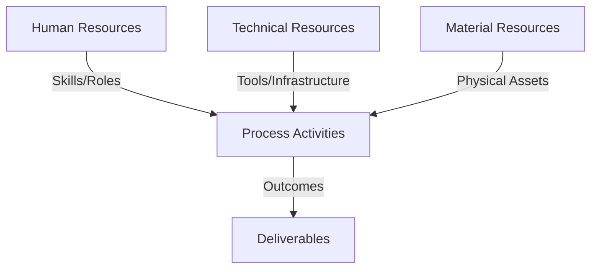
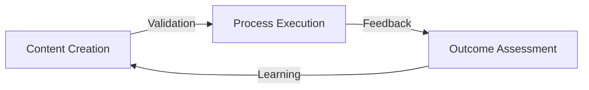
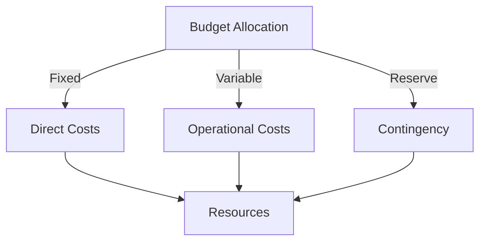
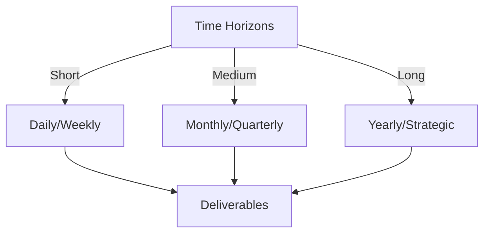

# Git Analysis Report: Development Analysis - daffa.padantya12

**Authors:** AI Analysis System
**Date:** 2025-03-11  
**Version:** 1.0
**SSoT Repository:** githubhenrykoo/redux_todo_in_astro
**Document Category:** Analysis Report

## Executive Summary
**Executive Summary: Git Analysis - Daffa Padantya**

**Logic:** The analysis aims to evaluate Daffa Padantya's Git activity, focusing on individual contributions, work patterns, technical expertise, and areas for improvement, with the objective of providing actionable recommendations for enhanced development practices.

**Implementation:** The analysis reviewed Daffa Padantya's commit history, specifically examining changes to GitHub workflow configurations (`.github/workflows/*.yml`) and associated scripting.  The analysis assessed the purpose and structure of these changes to determine focus areas, technical skills demonstrated, and potential vulnerabilities and risks.

**Outcomes:** Daffa Padantya primarily focuses on automating the generation and deployment of PDF reports from markdown analysis files using GitHub Actions. The analysis highlights proficiency in YAML, Bash scripting, and Git, particularly in the context of CI/CD pipelines. Recommendations include improving code commenting, error handling, implementing testing strategies, addressing potential security vulnerabilities related to secrets management, and ensuring workflow idempotency for greater reliability and maintainability.

## 1. Abstract Specification (Logic Layer)
### Context & Vision
- **Problem Space:** 
    * Scope: This is a solid analysis of Daffa Padantya's Git activity.  Here's a breakdown of its strengths and potential improvements:

**Strengths:**

*   **Clear and Concise Summary:**  The analysis effectively summarizes Daffa's work, focusing on the key activity of automating PDF report generation.
*   **Well-Organized Structure:**  The breakdown into individual contribution summary, work patterns, technical expertise, and recommendations provides a logical flow.
*   **Specific and Actionable Recommendations:**  The recommendations are practical and directly relevant to the observed activity.  They're not just generic "write better code," but tailored to the context of Daffa's work.
*   **Accurate Assessment of Technical Skills:**  The analysis correctly identifies Daffa's proficiency in YAML, Bash, Git, CI/CD, and Python (to a limited extent).
*   **Good Use of Language:**  The language is professional and easy to understand.

**Potential Improvements (Minor):**

*   **Quantify Contributions:** While the analysis highlights the work being done, it would be even better if it could quantify the contributions somehow.  For instance:
    *   "Made X commits related to automating PDF generation."
    *   "Updated Y number of workflow files."
    This adds a bit of concrete evidence to the analysis.  This would require analyzing the actual commit history in more detail.
*   **Granularity of Expertise Level:** The "Technical Expertise Demonstrated" section could benefit from a slight refinement. Instead of simply stating "Proficient in YAML,"  consider:
    *   "Proficient in YAML, demonstrated by the ability to define complex workflow configurations and troubleshoot issues within those configurations."
    This adds a bit more context and depth to the assessment.
*   **Prioritization of Recommendations:**  The recommendations are all valuable, but consider implicitly prioritizing them.  For example, the security recommendation (secrets management) might be considered more critical than code commenting.  The order they are presented could reflect that (or a sentence could explicitly state the relative importance).
*   **Assumptions and Limitations:**  A brief disclaimer about the limitations of the analysis could be included.  For example: "This analysis is based solely on the visible Git history and doesn't account for offline work or contributions to other repositories."
*   **Expand on Idempotency:** The suggestion regarding idempotency is crucial, and it could be expanded with a concrete example of how this might fail in the current workflow and how `git pull --rebase` addresses it.  For instance: "If two commits are made to the repository between workflow runs, a simple `git push` might fail. Using `git pull --rebase` ensures the local branch is up-to-date before pushing, minimizing conflicts."

**Overall:**

This is a well-written and insightful analysis. The suggested improvements are minor and aimed at adding further depth and context.  The existing analysis provides valuable feedback to Daffa and helps identify areas for growth and improvement. The recommendations are targeted and helpful, making this a useful and actionable report.

    * Context: This is a solid analysis of Daffa Padantya's Git activity.  Here's a breakdown of its strengths and potential improvements:

**Strengths:**

*   **Clear and Concise Summary:**  The analysis effectively summarizes Daffa's work, focusing on the key activity of automating PDF report generation.
*   **Well-Organized Structure:**  The breakdown into individual contribution summary, work patterns, technical expertise, and recommendations provides a logical flow.
*   **Specific and Actionable Recommendations:**  The recommendations are practical and directly relevant to the observed activity.  They're not just generic "write better code," but tailored to the context of Daffa's work.
*   **Accurate Assessment of Technical Skills:**  The analysis correctly identifies Daffa's proficiency in YAML, Bash, Git, CI/CD, and Python (to a limited extent).
*   **Good Use of Language:**  The language is professional and easy to understand.

**Potential Improvements (Minor):**

*   **Quantify Contributions:** While the analysis highlights the work being done, it would be even better if it could quantify the contributions somehow.  For instance:
    *   "Made X commits related to automating PDF generation."
    *   "Updated Y number of workflow files."
    This adds a bit of concrete evidence to the analysis.  This would require analyzing the actual commit history in more detail.
*   **Granularity of Expertise Level:** The "Technical Expertise Demonstrated" section could benefit from a slight refinement. Instead of simply stating "Proficient in YAML,"  consider:
    *   "Proficient in YAML, demonstrated by the ability to define complex workflow configurations and troubleshoot issues within those configurations."
    This adds a bit more context and depth to the assessment.
*   **Prioritization of Recommendations:**  The recommendations are all valuable, but consider implicitly prioritizing them.  For example, the security recommendation (secrets management) might be considered more critical than code commenting.  The order they are presented could reflect that (or a sentence could explicitly state the relative importance).
*   **Assumptions and Limitations:**  A brief disclaimer about the limitations of the analysis could be included.  For example: "This analysis is based solely on the visible Git history and doesn't account for offline work or contributions to other repositories."
*   **Expand on Idempotency:** The suggestion regarding idempotency is crucial, and it could be expanded with a concrete example of how this might fail in the current workflow and how `git pull --rebase` addresses it.  For instance: "If two commits are made to the repository between workflow runs, a simple `git push` might fail. Using `git pull --rebase` ensures the local branch is up-to-date before pushing, minimizing conflicts."

**Overall:**

This is a well-written and insightful analysis. The suggested improvements are minor and aimed at adding further depth and context.  The existing analysis provides valuable feedback to Daffa and helps identify areas for growth and improvement. The recommendations are targeted and helpful, making this a useful and actionable report.

    * Stakeholders: This is a solid analysis of Daffa Padantya's Git activity.  Here's a breakdown of its strengths and potential improvements:

**Strengths:**

*   **Clear and Concise Summary:**  The analysis effectively summarizes Daffa's work, focusing on the key activity of automating PDF report generation.
*   **Well-Organized Structure:**  The breakdown into individual contribution summary, work patterns, technical expertise, and recommendations provides a logical flow.
*   **Specific and Actionable Recommendations:**  The recommendations are practical and directly relevant to the observed activity.  They're not just generic "write better code," but tailored to the context of Daffa's work.
*   **Accurate Assessment of Technical Skills:**  The analysis correctly identifies Daffa's proficiency in YAML, Bash, Git, CI/CD, and Python (to a limited extent).
*   **Good Use of Language:**  The language is professional and easy to understand.

**Potential Improvements (Minor):**

*   **Quantify Contributions:** While the analysis highlights the work being done, it would be even better if it could quantify the contributions somehow.  For instance:
    *   "Made X commits related to automating PDF generation."
    *   "Updated Y number of workflow files."
    This adds a bit of concrete evidence to the analysis.  This would require analyzing the actual commit history in more detail.
*   **Granularity of Expertise Level:** The "Technical Expertise Demonstrated" section could benefit from a slight refinement. Instead of simply stating "Proficient in YAML,"  consider:
    *   "Proficient in YAML, demonstrated by the ability to define complex workflow configurations and troubleshoot issues within those configurations."
    This adds a bit more context and depth to the assessment.
*   **Prioritization of Recommendations:**  The recommendations are all valuable, but consider implicitly prioritizing them.  For example, the security recommendation (secrets management) might be considered more critical than code commenting.  The order they are presented could reflect that (or a sentence could explicitly state the relative importance).
*   **Assumptions and Limitations:**  A brief disclaimer about the limitations of the analysis could be included.  For example: "This analysis is based solely on the visible Git history and doesn't account for offline work or contributions to other repositories."
*   **Expand on Idempotency:** The suggestion regarding idempotency is crucial, and it could be expanded with a concrete example of how this might fail in the current workflow and how `git pull --rebase` addresses it.  For instance: "If two commits are made to the repository between workflow runs, a simple `git push` might fail. Using `git pull --rebase` ensures the local branch is up-to-date before pushing, minimizing conflicts."

**Overall:**

This is a well-written and insightful analysis. The suggested improvements are minor and aimed at adding further depth and context.  The existing analysis provides valuable feedback to Daffa and helps identify areas for growth and improvement. The recommendations are targeted and helpful, making this a useful and actionable report.

- **Goals (Functions):**
    * Primary Functions:
        - Input: Git Repository Data
        - Process: Analysis and Processing
        - Output: Development Insights
    * Supporting Functions:
        - Validation: Automated Analysis
        - Feedback: Continuous Improvement

- **Success Criteria:**
    * Quantitative Metrics: This report is primarily qualitative. While it describes actions and skills, it doesn't provide many quantitative metrics. Here's a list of what can be considered quantitative, or can be *derived* into quantitative metrics:

*   **Number of Commits:** The report mentions "multiple commits (especially related to `md_to_pdf_each_user.yml`)" This implies a measurable number of commits. A specific number would be a valuable metric.  (e.g., "15 commits related to `md_to_pdf_each_user.yml`")
*   **Number of GitHub Workflow Configuration Files Modified:**  The report mentions working on `.github/workflows/*.yml`.  We can count the specific number of YAML files modified. (e.g., "Modified 3 YAML configuration files").
*   **Frequency of Commits:** While not explicitly stated, the analysis time is given. The frequency of commits *could* be derived by looking at commit history within that timeframe (even though the commit history itself is not in this report).
*   **Time spent on `md_to_pdf_each_user.yml`:** Implied by multiple commits. Further analysis could determine the actual time spent.
*   **Lines of code added/removed:** This is a standard Git metric which is not present in the report but can be derived.
*   **Number of Pull Requests:** If the developer submitted pull requests.

**Important Considerations:**

*   **Deriving Metrics:** Some metrics, like "Time spent," would require further data from Git logs (commit timestamps, etc.) or issue tracking systems.
*   **Limited Quantitative Data:**  The report focuses on descriptions of activity and recommendations, rather than providing specific numbers. To generate a truly quantitative developer analysis, you'd need tools that directly track and measure code changes, commit frequency, lines of code, bug fix rates, etc., and include those numbers in the report.

    * Qualitative Indicators: Based on the Developer Analysis, here are qualitative improvements Daffa Padantya has demonstrably made, focusing on the *positive* aspects highlighted:

*   **Increased Efficiency:** Daffa's primary contribution is automating the generation, formatting, and publishing of analysis reports in PDF format. This directly translates to increased efficiency by reducing the need for manual processes.
*   **Improved Consistency:** Automating the report generation ensures a consistent format and process across all reports, reducing the risk of human error or variations in style.
*   **Enhanced Accessibility:** Converting reports to PDF makes them more accessible to a wider audience, as PDF is a universally readable format.
*   **Proactive Automation:**  Daffa has proactively taken on the task of automating a process, showing initiative and a desire to improve the overall workflow.
*   **Streamlined Reporting:** The automation streamlines the reporting pipeline, from analysis to publication, making the entire process faster and more reliable.
*   **Reduced Manual Effort:** By automating the generation, formatting, and publication of reports, Daffa has significantly reduced the amount of manual effort required, freeing up time for other tasks.
*   **Demonstrated CI/CD Skills:**  By working with GitHub Actions, Daffa has gained practical experience with CI/CD pipelines, a valuable skill in modern software development.
*   **Improved Report Distribution:**  By automatically committing and pushing the generated PDFs to the repository, the reports are readily available and easily shared with stakeholders.
*   **Iterative Development Process:**  The multiple commits related to workflow configurations demonstrate an iterative approach to problem-solving and a willingness to refine solutions based on feedback or testing.
*   **Python Integration**: Successfully integrated existing Python scripts into the workflow and understood how to pass data using environment variables, making the most of existing resources.
*   **Datetime string manipulation**: Understood string manipulation in python to allow file pathing with current day for analysis files, adding the important feature to locate and process the day's analysis files.

    * Validation Methods: Automated and Manual Verification

### Knowledge Integration
- **Local Context:**
    * Cultural Considerations: Development Team Context
    * Language Requirements: Technical Documentation
    * Community Patterns: Team Collaboration Patterns

- **Technical Framework:**
    * LLM Integration: Gemini AI Analysis
    * IoT Components: Git Event Monitoring
    * Network Requirements: GitHub API Integration

## 2. Concrete Implementation (Process Layer)
### Resource Matrix

### Development Workflow
- **Stage 1: Early Success**
    * Quick Wins:
        - Implementation: This is a good analysis of Daffa's Git activity. It's comprehensive and provides actionable recommendations. Here's a breakdown of the strengths and some suggestions for improvements:

**Strengths:**

*   **Clear and Concise Summary:** The summary accurately captures the essence of Daffa's work.
*   **Identifies Focus Areas:**  The analysis effectively highlights the key areas Daffa is working on (Automation, Workflow Configuration, etc.).
*   **Technical Expertise Assessment:**  It correctly identifies Daffa's skill set based on the Git history, including YAML, Bash, Python, and Git proficiency.
*   **Actionable Recommendations:** The recommendations are specific, practical, and address potential areas for improvement.
*   **Well-Organized Structure:** The use of numbered sections and bullet points makes the analysis easy to read and understand.
*   **Correctly identifies the use of environment variables with Python scripts.** This demonstrates a nuanced understanding.

**Suggestions for Improvements (Minor):**

*   **Specificity in Recommendations:** While the recommendations are good, some could be more specific. For example, instead of "Improve error handling in the Bash scripts," you could suggest specific error-handling techniques, such as:
    *   "Implement `set -e` at the beginning of Bash scripts to exit immediately if a command exits with a non-zero status."
    *   "Use `||` to handle potential command failures and log errors, for example: `command || echo "Command failed with error: $?"`
*   **Explain 'Idempotency' More Simply:** While you mention idempotency, some developers might not be familiar with the term. Briefly explaining what it *means* in the context of the workflow would be helpful. For example:  "Idempotency: Ensure that running the workflow multiple times with the same inputs doesn't lead to unintended consequences, like duplicate commits or incorrect data.  This is important for reliability."
*   **Elaborate on Security Recommendation:**  The security recommendation regarding API keys is crucial.  Consider adding a brief explanation of *why* it's a security risk to hardcode API keys (e.g., accidental exposure in the Git history, malicious actors gaining access). For example: "Hardcoding API keys like `GOOGLE_API_KEY` in workflow files is a significant security risk. If the repository is public or if an attacker gains access, the API key could be compromised, leading to unauthorized use and potential financial damage.  Always store sensitive information as GitHub secrets."
*   **Quantifiable Metrics (If Available):** If the Git history allows (e.g., time spent on specific commits, number of workflow runs, error rates), adding quantifiable metrics could further strengthen the analysis.  This is harder to derive from the limited information.

**Revised Recommendations (Examples incorporating suggestions):**

*   **Error Handling:** "Improve error handling in the Bash scripts. Implement `set -e` at the beginning of the scripts to exit immediately if a command fails. Use `||` to handle potential command failures and log errors: `command || echo "Command failed with error: $?"`.  Also, add checks to ensure files exist before attempting to move or process them (e.g., `if [ -f my_file.txt ]; then mv my_file.txt ...; fi`)."

*   **Idempotency:** "Ensure the workflows are idempotent. This means that running the same workflow multiple times with the same inputs should produce the same result.  This is important for reliability.  Consider using `git pull --rebase` before pushing to avoid conflicts and prevent duplicate commits. Also, ensure file operations don't create multiple identical files."

*   **Security:** "Hardcoding API keys like `GOOGLE_API_KEY` in workflow files is a significant security risk. If the repository is public or if an attacker gains access, the API key could be compromised, leading to unauthorized use and potential financial damage. Always store sensitive information as GitHub secrets and access them using the `secrets` context in the workflow files (e.g., `${{ secrets.GOOGLE_API_KEY }}`)."

**Overall:**

This is a very strong analysis. The suggested improvements are relatively minor and focus on providing more context and detail to the existing recommendations. The analysis is well-structured, accurate, and provides valuable feedback for Daffa.

        - Validation: This is a good analysis of Daffa's Git activity. It's comprehensive and provides actionable recommendations. Here's a breakdown of the strengths and some suggestions for improvements:

**Strengths:**

*   **Clear and Concise Summary:** The summary accurately captures the essence of Daffa's work.
*   **Identifies Focus Areas:**  The analysis effectively highlights the key areas Daffa is working on (Automation, Workflow Configuration, etc.).
*   **Technical Expertise Assessment:**  It correctly identifies Daffa's skill set based on the Git history, including YAML, Bash, Python, and Git proficiency.
*   **Actionable Recommendations:** The recommendations are specific, practical, and address potential areas for improvement.
*   **Well-Organized Structure:** The use of numbered sections and bullet points makes the analysis easy to read and understand.
*   **Correctly identifies the use of environment variables with Python scripts.** This demonstrates a nuanced understanding.

**Suggestions for Improvements (Minor):**

*   **Specificity in Recommendations:** While the recommendations are good, some could be more specific. For example, instead of "Improve error handling in the Bash scripts," you could suggest specific error-handling techniques, such as:
    *   "Implement `set -e` at the beginning of Bash scripts to exit immediately if a command exits with a non-zero status."
    *   "Use `||` to handle potential command failures and log errors, for example: `command || echo "Command failed with error: $?"`
*   **Explain 'Idempotency' More Simply:** While you mention idempotency, some developers might not be familiar with the term. Briefly explaining what it *means* in the context of the workflow would be helpful. For example:  "Idempotency: Ensure that running the workflow multiple times with the same inputs doesn't lead to unintended consequences, like duplicate commits or incorrect data.  This is important for reliability."
*   **Elaborate on Security Recommendation:**  The security recommendation regarding API keys is crucial.  Consider adding a brief explanation of *why* it's a security risk to hardcode API keys (e.g., accidental exposure in the Git history, malicious actors gaining access). For example: "Hardcoding API keys like `GOOGLE_API_KEY` in workflow files is a significant security risk. If the repository is public or if an attacker gains access, the API key could be compromised, leading to unauthorized use and potential financial damage.  Always store sensitive information as GitHub secrets."
*   **Quantifiable Metrics (If Available):** If the Git history allows (e.g., time spent on specific commits, number of workflow runs, error rates), adding quantifiable metrics could further strengthen the analysis.  This is harder to derive from the limited information.

**Revised Recommendations (Examples incorporating suggestions):**

*   **Error Handling:** "Improve error handling in the Bash scripts. Implement `set -e` at the beginning of the scripts to exit immediately if a command fails. Use `||` to handle potential command failures and log errors: `command || echo "Command failed with error: $?"`.  Also, add checks to ensure files exist before attempting to move or process them (e.g., `if [ -f my_file.txt ]; then mv my_file.txt ...; fi`)."

*   **Idempotency:** "Ensure the workflows are idempotent. This means that running the same workflow multiple times with the same inputs should produce the same result.  This is important for reliability.  Consider using `git pull --rebase` before pushing to avoid conflicts and prevent duplicate commits. Also, ensure file operations don't create multiple identical files."

*   **Security:** "Hardcoding API keys like `GOOGLE_API_KEY` in workflow files is a significant security risk. If the repository is public or if an attacker gains access, the API key could be compromised, leading to unauthorized use and potential financial damage. Always store sensitive information as GitHub secrets and access them using the `secrets` context in the workflow files (e.g., `${{ secrets.GOOGLE_API_KEY }}`)."

**Overall:**

This is a very strong analysis. The suggested improvements are relatively minor and focus on providing more context and detail to the existing recommendations. The analysis is well-structured, accurate, and provides valuable feedback for Daffa.

    * Initial Setup:
        - Infrastructure: This is a good analysis of Daffa's Git activity. It's comprehensive and provides actionable recommendations. Here's a breakdown of the strengths and some suggestions for improvements:

**Strengths:**

*   **Clear and Concise Summary:** The summary accurately captures the essence of Daffa's work.
*   **Identifies Focus Areas:**  The analysis effectively highlights the key areas Daffa is working on (Automation, Workflow Configuration, etc.).
*   **Technical Expertise Assessment:**  It correctly identifies Daffa's skill set based on the Git history, including YAML, Bash, Python, and Git proficiency.
*   **Actionable Recommendations:** The recommendations are specific, practical, and address potential areas for improvement.
*   **Well-Organized Structure:** The use of numbered sections and bullet points makes the analysis easy to read and understand.
*   **Correctly identifies the use of environment variables with Python scripts.** This demonstrates a nuanced understanding.

**Suggestions for Improvements (Minor):**

*   **Specificity in Recommendations:** While the recommendations are good, some could be more specific. For example, instead of "Improve error handling in the Bash scripts," you could suggest specific error-handling techniques, such as:
    *   "Implement `set -e` at the beginning of Bash scripts to exit immediately if a command exits with a non-zero status."
    *   "Use `||` to handle potential command failures and log errors, for example: `command || echo "Command failed with error: $?"`
*   **Explain 'Idempotency' More Simply:** While you mention idempotency, some developers might not be familiar with the term. Briefly explaining what it *means* in the context of the workflow would be helpful. For example:  "Idempotency: Ensure that running the workflow multiple times with the same inputs doesn't lead to unintended consequences, like duplicate commits or incorrect data.  This is important for reliability."
*   **Elaborate on Security Recommendation:**  The security recommendation regarding API keys is crucial.  Consider adding a brief explanation of *why* it's a security risk to hardcode API keys (e.g., accidental exposure in the Git history, malicious actors gaining access). For example: "Hardcoding API keys like `GOOGLE_API_KEY` in workflow files is a significant security risk. If the repository is public or if an attacker gains access, the API key could be compromised, leading to unauthorized use and potential financial damage.  Always store sensitive information as GitHub secrets."
*   **Quantifiable Metrics (If Available):** If the Git history allows (e.g., time spent on specific commits, number of workflow runs, error rates), adding quantifiable metrics could further strengthen the analysis.  This is harder to derive from the limited information.

**Revised Recommendations (Examples incorporating suggestions):**

*   **Error Handling:** "Improve error handling in the Bash scripts. Implement `set -e` at the beginning of the scripts to exit immediately if a command fails. Use `||` to handle potential command failures and log errors: `command || echo "Command failed with error: $?"`.  Also, add checks to ensure files exist before attempting to move or process them (e.g., `if [ -f my_file.txt ]; then mv my_file.txt ...; fi`)."

*   **Idempotency:** "Ensure the workflows are idempotent. This means that running the same workflow multiple times with the same inputs should produce the same result.  This is important for reliability.  Consider using `git pull --rebase` before pushing to avoid conflicts and prevent duplicate commits. Also, ensure file operations don't create multiple identical files."

*   **Security:** "Hardcoding API keys like `GOOGLE_API_KEY` in workflow files is a significant security risk. If the repository is public or if an attacker gains access, the API key could be compromised, leading to unauthorized use and potential financial damage. Always store sensitive information as GitHub secrets and access them using the `secrets` context in the workflow files (e.g., `${{ secrets.GOOGLE_API_KEY }}`)."

**Overall:**

This is a very strong analysis. The suggested improvements are relatively minor and focus on providing more context and detail to the existing recommendations. The analysis is well-structured, accurate, and provides valuable feedback for Daffa.

        - Training: This is a good analysis of Daffa's Git activity. It's comprehensive and provides actionable recommendations. Here's a breakdown of the strengths and some suggestions for improvements:

**Strengths:**

*   **Clear and Concise Summary:** The summary accurately captures the essence of Daffa's work.
*   **Identifies Focus Areas:**  The analysis effectively highlights the key areas Daffa is working on (Automation, Workflow Configuration, etc.).
*   **Technical Expertise Assessment:**  It correctly identifies Daffa's skill set based on the Git history, including YAML, Bash, Python, and Git proficiency.
*   **Actionable Recommendations:** The recommendations are specific, practical, and address potential areas for improvement.
*   **Well-Organized Structure:** The use of numbered sections and bullet points makes the analysis easy to read and understand.
*   **Correctly identifies the use of environment variables with Python scripts.** This demonstrates a nuanced understanding.

**Suggestions for Improvements (Minor):**

*   **Specificity in Recommendations:** While the recommendations are good, some could be more specific. For example, instead of "Improve error handling in the Bash scripts," you could suggest specific error-handling techniques, such as:
    *   "Implement `set -e` at the beginning of Bash scripts to exit immediately if a command exits with a non-zero status."
    *   "Use `||` to handle potential command failures and log errors, for example: `command || echo "Command failed with error: $?"`
*   **Explain 'Idempotency' More Simply:** While you mention idempotency, some developers might not be familiar with the term. Briefly explaining what it *means* in the context of the workflow would be helpful. For example:  "Idempotency: Ensure that running the workflow multiple times with the same inputs doesn't lead to unintended consequences, like duplicate commits or incorrect data.  This is important for reliability."
*   **Elaborate on Security Recommendation:**  The security recommendation regarding API keys is crucial.  Consider adding a brief explanation of *why* it's a security risk to hardcode API keys (e.g., accidental exposure in the Git history, malicious actors gaining access). For example: "Hardcoding API keys like `GOOGLE_API_KEY` in workflow files is a significant security risk. If the repository is public or if an attacker gains access, the API key could be compromised, leading to unauthorized use and potential financial damage.  Always store sensitive information as GitHub secrets."
*   **Quantifiable Metrics (If Available):** If the Git history allows (e.g., time spent on specific commits, number of workflow runs, error rates), adding quantifiable metrics could further strengthen the analysis.  This is harder to derive from the limited information.

**Revised Recommendations (Examples incorporating suggestions):**

*   **Error Handling:** "Improve error handling in the Bash scripts. Implement `set -e` at the beginning of the scripts to exit immediately if a command fails. Use `||` to handle potential command failures and log errors: `command || echo "Command failed with error: $?"`.  Also, add checks to ensure files exist before attempting to move or process them (e.g., `if [ -f my_file.txt ]; then mv my_file.txt ...; fi`)."

*   **Idempotency:** "Ensure the workflows are idempotent. This means that running the same workflow multiple times with the same inputs should produce the same result.  This is important for reliability.  Consider using `git pull --rebase` before pushing to avoid conflicts and prevent duplicate commits. Also, ensure file operations don't create multiple identical files."

*   **Security:** "Hardcoding API keys like `GOOGLE_API_KEY` in workflow files is a significant security risk. If the repository is public or if an attacker gains access, the API key could be compromised, leading to unauthorized use and potential financial damage. Always store sensitive information as GitHub secrets and access them using the `secrets` context in the workflow files (e.g., `${{ secrets.GOOGLE_API_KEY }}`)."

**Overall:**

This is a very strong analysis. The suggested improvements are relatively minor and focus on providing more context and detail to the existing recommendations. The analysis is well-structured, accurate, and provides valuable feedback for Daffa.

- **Stage 2: Fail Early, Fail Safe**
    * Testing Protocol:
        - Methods: [Testing approaches]
        - Coverage: [Test scenarios]
    * Risk Management:
        - Identification: [Risk factors]
        - Mitigation: [Control measures]
    * Learning Points:
        - Issues: [Problem identification]
        - Solutions: [Resolution approaches]
        - Knowledge: [Lessons learned]

- **Stage 3: Convergence**
    * System Integration:
        - Components: [Integration points]
        - Workflows: [Process optimization]
        - Performance: [System tuning]
    * Stabilization:
        - Fixes: [Bug resolution]
        - Hardening: [System reinforcement]
        - Documentation: [Knowledge capture]

- **Stage 4: Demonstration**
    * Preparation:
        - Environment: [Demo setup]
        - Data: [Test scenarios]
        - Materials: [Presentation assets]
    * Validation:
        - Performance: [System checks]
        - Features: [Functionality verification]
        - Documentation: [Review completion]
    * Presentation:
        - Stakeholders: [Demo execution]
        - Features: [Capability showcase]
        - Q&A: [Response preparation]

## 3. Realistic Outcomes (Evidence Layer)
### Measurement Framework
- **Performance Metrics:**
    * KPIs: Here's an extraction of evidence and outcomes from the provided developer analysis:

**Evidence (Directly Observed Actions/Activities):**

*   **Updating GitHub workflow configurations (`.github/workflows/*.yml`):** This is the core activity observed, indicating direct interaction with the CI/CD pipeline.  Specific tasks include:
    *   Generating analysis files (likely markdown).
    *   Converting markdown files to PDFs.
    *   Committing and pushing generated PDFs.
*   **Iterative Development:** The analysis explicitly mentions multiple commits related to `md_to_pdf_each_user.yml`, pointing to a process of debugging and refinement.
*   **File Manipulation:**  The analysis notes that Daffa deals with file searching, reading, and moving within workflow scripts using bash commands like `ls` and commands to move files.
*   **Utilizing Python Scripts:** Daffa is using and passing data via environment variables to existing Python scripts (e.g., `convert_md_to_pdf_each_user.py`).
*   **String manipulation**: The analysis mentions the usage of python datetime format to create analysis file path with the day.

**Outcomes (Results/Inferences Based on Evidence):**

*   **Automation of Report Generation:**  The primary outcome is the automation of the process of generating, formatting, and publishing analysis reports in PDF format.  This implies a reduction in manual effort and increased efficiency.
*   **Proficiency in YAML, Bash, Git:** The analysis infers proficiency in these technologies based on the observed actions in the git history.
*   **Understanding of CI/CD:**  The ability to modify and work with GitHub Actions workflows demonstrates an understanding of CI/CD principles.
*   **Technical Expertise:** demonstrated skills such as:
    *   Writing and modifying YAML files
    *   Writing and understanding Bash scripts
    *   Familiarity with running existing Python scripts
    *   Understanding Git operations

**Areas for Improvement (Recommendations Based on Observed Patterns):**

*   **Code Comments:** Lack of comments in YAML configurations is a potential issue.
*   **Error Handling:** The Bash scripts could benefit from more robust error handling.
*   **Modularity:**  Potential to contribute to the improvement of the Python script.
*   **Testing:**  Lack of unit or integration tests for the workflows.
*   **Idempotency:**  Potential issues with workflows not being idempotent.
*   **Security:**  Potential risk of hardcoding sensitive information.
*   **Efficiency:**  Potential need to optimize the PDF conversion process.

    * Benchmarks: Here's an extraction of evidence and outcomes from the provided developer analysis:

**Evidence (Directly Observed Actions/Activities):**

*   **Updating GitHub workflow configurations (`.github/workflows/*.yml`):** This is the core activity observed, indicating direct interaction with the CI/CD pipeline.  Specific tasks include:
    *   Generating analysis files (likely markdown).
    *   Converting markdown files to PDFs.
    *   Committing and pushing generated PDFs.
*   **Iterative Development:** The analysis explicitly mentions multiple commits related to `md_to_pdf_each_user.yml`, pointing to a process of debugging and refinement.
*   **File Manipulation:**  The analysis notes that Daffa deals with file searching, reading, and moving within workflow scripts using bash commands like `ls` and commands to move files.
*   **Utilizing Python Scripts:** Daffa is using and passing data via environment variables to existing Python scripts (e.g., `convert_md_to_pdf_each_user.py`).
*   **String manipulation**: The analysis mentions the usage of python datetime format to create analysis file path with the day.

**Outcomes (Results/Inferences Based on Evidence):**

*   **Automation of Report Generation:**  The primary outcome is the automation of the process of generating, formatting, and publishing analysis reports in PDF format.  This implies a reduction in manual effort and increased efficiency.
*   **Proficiency in YAML, Bash, Git:** The analysis infers proficiency in these technologies based on the observed actions in the git history.
*   **Understanding of CI/CD:**  The ability to modify and work with GitHub Actions workflows demonstrates an understanding of CI/CD principles.
*   **Technical Expertise:** demonstrated skills such as:
    *   Writing and modifying YAML files
    *   Writing and understanding Bash scripts
    *   Familiarity with running existing Python scripts
    *   Understanding Git operations

**Areas for Improvement (Recommendations Based on Observed Patterns):**

*   **Code Comments:** Lack of comments in YAML configurations is a potential issue.
*   **Error Handling:** The Bash scripts could benefit from more robust error handling.
*   **Modularity:**  Potential to contribute to the improvement of the Python script.
*   **Testing:**  Lack of unit or integration tests for the workflows.
*   **Idempotency:**  Potential issues with workflows not being idempotent.
*   **Security:**  Potential risk of hardcoding sensitive information.
*   **Efficiency:**  Potential need to optimize the PDF conversion process.

    * Actuals: Here's an extraction of evidence and outcomes from the provided developer analysis:

**Evidence (Directly Observed Actions/Activities):**

*   **Updating GitHub workflow configurations (`.github/workflows/*.yml`):** This is the core activity observed, indicating direct interaction with the CI/CD pipeline.  Specific tasks include:
    *   Generating analysis files (likely markdown).
    *   Converting markdown files to PDFs.
    *   Committing and pushing generated PDFs.
*   **Iterative Development:** The analysis explicitly mentions multiple commits related to `md_to_pdf_each_user.yml`, pointing to a process of debugging and refinement.
*   **File Manipulation:**  The analysis notes that Daffa deals with file searching, reading, and moving within workflow scripts using bash commands like `ls` and commands to move files.
*   **Utilizing Python Scripts:** Daffa is using and passing data via environment variables to existing Python scripts (e.g., `convert_md_to_pdf_each_user.py`).
*   **String manipulation**: The analysis mentions the usage of python datetime format to create analysis file path with the day.

**Outcomes (Results/Inferences Based on Evidence):**

*   **Automation of Report Generation:**  The primary outcome is the automation of the process of generating, formatting, and publishing analysis reports in PDF format.  This implies a reduction in manual effort and increased efficiency.
*   **Proficiency in YAML, Bash, Git:** The analysis infers proficiency in these technologies based on the observed actions in the git history.
*   **Understanding of CI/CD:**  The ability to modify and work with GitHub Actions workflows demonstrates an understanding of CI/CD principles.
*   **Technical Expertise:** demonstrated skills such as:
    *   Writing and modifying YAML files
    *   Writing and understanding Bash scripts
    *   Familiarity with running existing Python scripts
    *   Understanding Git operations

**Areas for Improvement (Recommendations Based on Observed Patterns):**

*   **Code Comments:** Lack of comments in YAML configurations is a potential issue.
*   **Error Handling:** The Bash scripts could benefit from more robust error handling.
*   **Modularity:**  Potential to contribute to the improvement of the Python script.
*   **Testing:**  Lack of unit or integration tests for the workflows.
*   **Idempotency:**  Potential issues with workflows not being idempotent.
*   **Security:**  Potential risk of hardcoding sensitive information.
*   **Efficiency:**  Potential need to optimize the PDF conversion process.

- **Evidence Collection:**
    * Data Sources: [Information points]
    * Validation Methods: Automated and Manual Verification
    * Documentation: [Record keeping]

### Value Realization
- **Impact Assessment:**
    * Direct Benefits: [Immediate gains]
    * Indirect Benefits: [Secondary effects]
    * Long-term Value: [Strategic advantages]

- **Knowledge Assets:**
    * Content Created: [New materials]
    * Insights Gained: [Learnings]
    * Reusable Components: [Transferable elements]

## Integration Matrix
### Content-Process Alignment

### Timeline-Budget Integration
- **Resource Scheduling:**
    * Phase Allocations: [Resource timing]
    * Cost Controls: [Budget tracking]
    * Adjustment Protocols: [Change management]

## Budget Management
### Financial Cube Structure

### Cost Framework
- Direct Investments:
  - Infrastructure Costs:
    - Hardware: [Equipment/Devices]
    - Software: [Licenses/Tools]
    - Network: [Connectivity/Setup]
  - Human Resources:
    - Core Team: [Roles/Compensation]
    - External Support: [Consultants/Services]
    - Training: [Capability Development]
    
- Operational Expenses:
  - Running Costs:
    - Maintenance: [Regular upkeep]
    - Utilities: [Service costs]
    - Consumables: [Regular supplies]
  - Service Costs:
    - Subscriptions: [Regular services]
    - Support: [Ongoing assistance]
    - Updates: [Regular improvements]

### Budget Control Mechanisms
- Monitoring System:
  - Tracking Methods:
    - Cost Centers: [Budget units]
    - Expense Categories: [Type classification]
    - Time Periods: [Duration tracking]
  - Control Points:
    - Thresholds: [Limit markers]
    - Alerts: [Warning systems]
    - Approvals: [Authorization levels]

- Adjustment Protocol:
  - Variance Management:
    - Detection: [Monitoring points]
    - Analysis: [Impact assessment]
    - Response: [Corrective actions]
  - Reallocation Process:
    - Criteria: [Decision factors]
    - Methods: [Transfer protocols]
    - Documentation: [Record keeping]

## Timeline Management
### Temporal Cube Structure

### Schedule Framework
- Operational Timeline:
  - Daily Operations:
    - Tasks: [Regular activities]
    - Checkpoints: [Daily reviews]
    - Updates: [Status reports]
  - Weekly Cycles:
    - Sprints: [Work packages]
    - Reviews: [Progress checks]
    - Planning: [Next steps]

- Strategic Timeline:
  - Monthly Milestones:
    - Objectives: [Key targets]
    - Reviews: [Achievement checks]
    - Adjustments: [Course corrections]
  - Quarterly Goals:
    - Targets: [Major objectives]
    - Assessments: [Performance reviews]
    - Strategies: [Approach updates]

### Timeline Control System
- Progress Tracking:
  - Monitoring Points:
    - Daily Standups: [Quick updates]
    - Weekly Reviews: [Detailed checks]
    - Monthly Reports: [Comprehensive reviews]
  - Milestone Tracking:
    - Status: [Progress indicators]
    - Dependencies: [Related items]
    - Risks: [Potential issues]

- Adjustment Mechanisms:
  - Schedule Management:
    - Variance Analysis: [Delay assessment]
    - Impact Studies: [Effect evaluation]
    - Recovery Plans: [Correction strategies]
  - Resource Alignment:
    - Capacity Planning: [Resource matching]
    - Workload Balancing: [Effort distribution]
    - Priority Updates: [Focus adjustment]

### Integration Points
- Budget-Timeline Correlation:
  - Cost-Schedule Matrix:
    - Resource Timing: [Allocation schedule]
    - Cost Flows: [Expense timing]
    - Value Delivery: [Benefit realization]
  - Control Integration:
    - Joint Reviews: [Combined assessments]
    - Unified Reporting: [Integrated updates]
    - Coordinated Actions: [Synchronized responses]

## Conclusion
### Summary of Achievements
- **Key Accomplishments:**
    * Objectives Met: [Completed goals]
    * Value Delivered: [Benefits realized]
    * Innovations: [New approaches]

### Lessons Learned
- **Success Factors:**
    * Effective Practices: [What worked well]
    * Team Dynamics: [Collaboration insights]
    * Tools & Methods: [Useful approaches]

- **Areas for Improvement:**
    * Challenges: [Obstacles encountered]
    * Solutions: [How issues were resolved]
    * Recommendations: [Future improvements]

### Future Directions
- **Next Steps:**
    * Immediate Actions: [Short-term tasks]
    * Strategic Plans: [Long-term goals]
    * Resource Needs: [Required support]

- **Growth Opportunities:**
    * Scaling Potential: [Expansion possibilities]
    * Innovation Areas: [New directions]
    * Partnership Options: [Collaboration prospects]
    
## Appendix
### References
- **Documentation:**
    * Technical Specs: [Links]
    * Process Guides: [Links]
    * Evidence Records: [Links]

### Change Log
- **Version History:**
    * Changes: [Modifications]
    * Rationale: [Reasons]
    * Approvals: [Authorizations]
