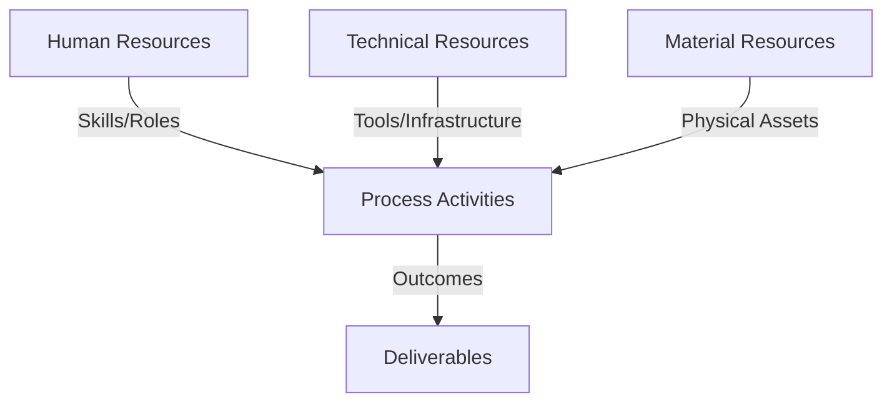
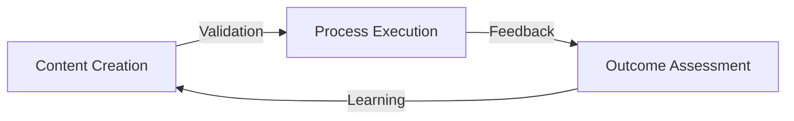
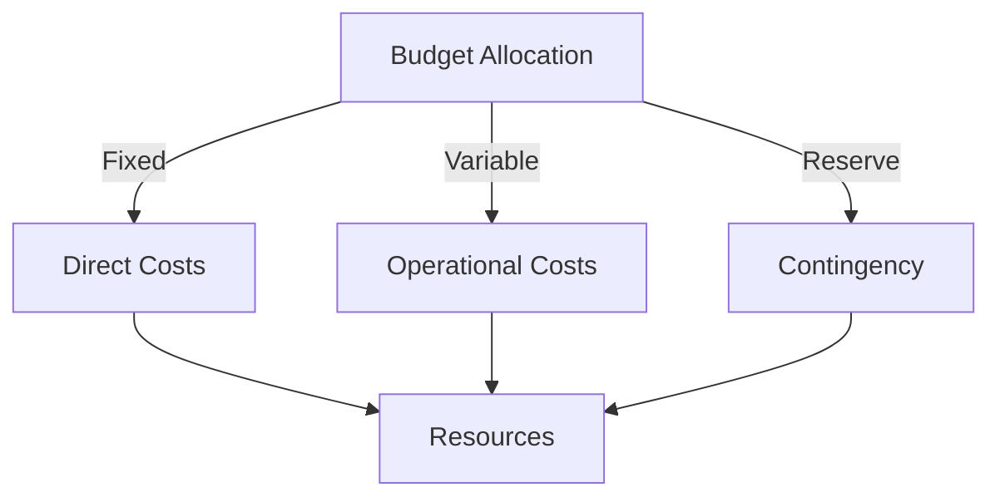
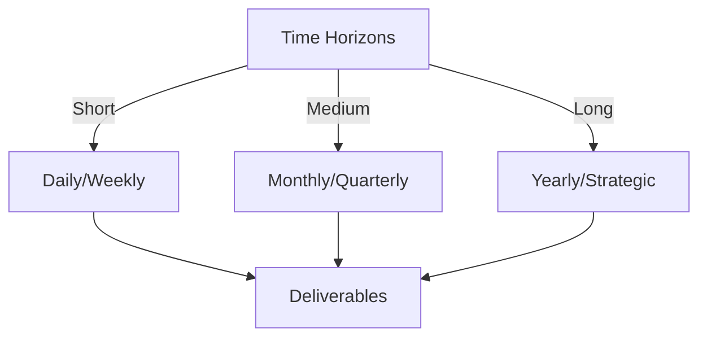

# Git Analysis Report: Development Analysis - daffa.padantya12

**Authors:** AI Analysis System
**Date:** 2025-03-12  
**Version:** 1.0
**SSoT Repository:** githubhenrykoo/redux_todo_in_astro
**Document Category:** Analysis Report

## Executive Summary
Here's an executive summary based on your analysis of Daffa Padantya's Git activity, adhering to the requested "Logic, Implementation, Outcomes" format:

**Executive Summary: Git Analysis - Daffa Padantya**

**Logic:** The core purpose of Daffa Padantya's work is to automate the generation, formatting, and conversion of Git analysis reports to PDF format. The objectives include streamlining the reporting process, enabling user-specific report generation, and ensuring reliable and efficient execution through GitHub Actions workflows.

**Implementation:** Daffa is using GitHub Actions to automate report generation. The analysis includes using YAML files for workflow definitions, Python scripts for report analysis, and Bash scripting for file manipulation. Key processes involve identifying date-specific analysis files, converting Markdown reports to PDF, handling errors, and configuring the workflow for user-specific data. This is an iterative process involving troubleshooting and optimization as shown by the multiple revisions to the `md_to_pdf_each_user.yml` workflow. The implementation shows proficiency in Git, GitHub Actions, YAML, Python, and Bash.

**Outcomes:** Daffa has contributed automated workflows for Git analysis report generation and PDF conversion. The workflows demonstrate improved error handling, user-specific report processing, and date-based file identification. The analysis reveals Daffa's technical skills in scripting, workflow management, and automation, as well as areas for further development such as code modularization, centralized configuration, robust logging, and the addition of unit tests. The analysis also notes the importance of resolving and removing conflict markers.

## 1. Abstract Specification (Logic Layer)
### Context & Vision
- **Problem Space:** 
    * Scope: This is an excellent analysis of Daffa Padantya's Git activity! It's comprehensive, well-organized, and provides actionable recommendations. Here's a breakdown of what makes it good and a few minor suggestions for improvement:

**Strengths:**

*   **Clear and Concise Summary:** The "Individual Contribution Summary" provides a high-level overview of Daffa's work, making it easy to understand the core activities.
*   **Work Patterns and Focus Areas:**  This section effectively identifies Daffa's key areas of work, such as automation, workflow refinement, user-specific processing, and error handling.
*   **Technical Expertise Demonstrated:** This section highlights the technical skills that Daffa is showcasing, which is valuable for performance reviews or identifying areas for growth.  It correctly identifies proficiency in GitHub Actions, Python, Bash, and Git.
*   **Specific Recommendations:** The recommendations are practical, relevant, and actionable. They address potential improvements in code quality, security, maintainability, and reliability.  The suggestions are well-justified.
*   **Actionable Language:** The recommendations use language like "consider," "ensure," and "add," which makes them feel like helpful suggestions rather than demands.
*   **Well-Organized:** The use of numbered lists and headings makes the analysis easy to read and understand.
*   **Contextualized:** The analysis is based on the specific commits provided, making it more meaningful and relevant.
*   **Recognizes Iterative Development:** The analysis understands that modifying a workflow multiple times indicates an iterative approach to improvement.

**Minor Suggestions for Improvement (Mostly for future analysis):**

*   **Conflict Resolution Depth:** While the analysis correctly identifies the "conflict" commit, it could delve a bit deeper into *why* the conflict occurred.  Was it due to concurrent modifications, misunderstanding of the workflow logic, or some other reason? Understanding the root cause of the conflict can provide insights into communication challenges or areas where training is needed.  However, without seeing the full diffs, this is difficult.
*   **Impact Assessment:** Consider adding a section (or integrating it into the existing sections) that assesses the *impact* of Daffa's changes. For example:
    *   "This automation has the potential to save X hours per week for the team."
    *   "The improved error handling makes the workflow more reliable and reduces the risk of failed reports."
    *   "The user-specific processing allows for more customized and relevant analysis."  This might require gathering more data than just the Git activity.
*   **Qualitative Assessment:**  Although difficult to gauge from commit messages alone, try to infer the *quality* of the work being done. Are the solutions elegant and efficient, or are they more of a "quick fix"? Is the code well-documented? Are tests being written (if the project has a testing framework)?  This requires a deeper dive into the code itself.
*   **Future Goals:** Based on current activity, what are potential future goals for this developer?  Example: "Daffa's work on automating PDF generation could be extended to include email distribution of reports, further streamlining the analysis process."

**Overall:**

This is a very well-written and insightful analysis of Daffa Padantya's Git activity. The strengths far outweigh the minor suggestions for improvement. This kind of analysis would be extremely valuable for performance reviews, identifying areas for mentorship, and tracking the progress of development projects. The recommendations are particularly helpful and demonstrate a good understanding of software development best practices.

    * Context: This is an excellent analysis of Daffa Padantya's Git activity! It's comprehensive, well-organized, and provides actionable recommendations. Here's a breakdown of what makes it good and a few minor suggestions for improvement:

**Strengths:**

*   **Clear and Concise Summary:** The "Individual Contribution Summary" provides a high-level overview of Daffa's work, making it easy to understand the core activities.
*   **Work Patterns and Focus Areas:**  This section effectively identifies Daffa's key areas of work, such as automation, workflow refinement, user-specific processing, and error handling.
*   **Technical Expertise Demonstrated:** This section highlights the technical skills that Daffa is showcasing, which is valuable for performance reviews or identifying areas for growth.  It correctly identifies proficiency in GitHub Actions, Python, Bash, and Git.
*   **Specific Recommendations:** The recommendations are practical, relevant, and actionable. They address potential improvements in code quality, security, maintainability, and reliability.  The suggestions are well-justified.
*   **Actionable Language:** The recommendations use language like "consider," "ensure," and "add," which makes them feel like helpful suggestions rather than demands.
*   **Well-Organized:** The use of numbered lists and headings makes the analysis easy to read and understand.
*   **Contextualized:** The analysis is based on the specific commits provided, making it more meaningful and relevant.
*   **Recognizes Iterative Development:** The analysis understands that modifying a workflow multiple times indicates an iterative approach to improvement.

**Minor Suggestions for Improvement (Mostly for future analysis):**

*   **Conflict Resolution Depth:** While the analysis correctly identifies the "conflict" commit, it could delve a bit deeper into *why* the conflict occurred.  Was it due to concurrent modifications, misunderstanding of the workflow logic, or some other reason? Understanding the root cause of the conflict can provide insights into communication challenges or areas where training is needed.  However, without seeing the full diffs, this is difficult.
*   **Impact Assessment:** Consider adding a section (or integrating it into the existing sections) that assesses the *impact* of Daffa's changes. For example:
    *   "This automation has the potential to save X hours per week for the team."
    *   "The improved error handling makes the workflow more reliable and reduces the risk of failed reports."
    *   "The user-specific processing allows for more customized and relevant analysis."  This might require gathering more data than just the Git activity.
*   **Qualitative Assessment:**  Although difficult to gauge from commit messages alone, try to infer the *quality* of the work being done. Are the solutions elegant and efficient, or are they more of a "quick fix"? Is the code well-documented? Are tests being written (if the project has a testing framework)?  This requires a deeper dive into the code itself.
*   **Future Goals:** Based on current activity, what are potential future goals for this developer?  Example: "Daffa's work on automating PDF generation could be extended to include email distribution of reports, further streamlining the analysis process."

**Overall:**

This is a very well-written and insightful analysis of Daffa Padantya's Git activity. The strengths far outweigh the minor suggestions for improvement. This kind of analysis would be extremely valuable for performance reviews, identifying areas for mentorship, and tracking the progress of development projects. The recommendations are particularly helpful and demonstrate a good understanding of software development best practices.

    * Stakeholders: This is an excellent analysis of Daffa Padantya's Git activity! It's comprehensive, well-organized, and provides actionable recommendations. Here's a breakdown of what makes it good and a few minor suggestions for improvement:

**Strengths:**

*   **Clear and Concise Summary:** The "Individual Contribution Summary" provides a high-level overview of Daffa's work, making it easy to understand the core activities.
*   **Work Patterns and Focus Areas:**  This section effectively identifies Daffa's key areas of work, such as automation, workflow refinement, user-specific processing, and error handling.
*   **Technical Expertise Demonstrated:** This section highlights the technical skills that Daffa is showcasing, which is valuable for performance reviews or identifying areas for growth.  It correctly identifies proficiency in GitHub Actions, Python, Bash, and Git.
*   **Specific Recommendations:** The recommendations are practical, relevant, and actionable. They address potential improvements in code quality, security, maintainability, and reliability.  The suggestions are well-justified.
*   **Actionable Language:** The recommendations use language like "consider," "ensure," and "add," which makes them feel like helpful suggestions rather than demands.
*   **Well-Organized:** The use of numbered lists and headings makes the analysis easy to read and understand.
*   **Contextualized:** The analysis is based on the specific commits provided, making it more meaningful and relevant.
*   **Recognizes Iterative Development:** The analysis understands that modifying a workflow multiple times indicates an iterative approach to improvement.

**Minor Suggestions for Improvement (Mostly for future analysis):**

*   **Conflict Resolution Depth:** While the analysis correctly identifies the "conflict" commit, it could delve a bit deeper into *why* the conflict occurred.  Was it due to concurrent modifications, misunderstanding of the workflow logic, or some other reason? Understanding the root cause of the conflict can provide insights into communication challenges or areas where training is needed.  However, without seeing the full diffs, this is difficult.
*   **Impact Assessment:** Consider adding a section (or integrating it into the existing sections) that assesses the *impact* of Daffa's changes. For example:
    *   "This automation has the potential to save X hours per week for the team."
    *   "The improved error handling makes the workflow more reliable and reduces the risk of failed reports."
    *   "The user-specific processing allows for more customized and relevant analysis."  This might require gathering more data than just the Git activity.
*   **Qualitative Assessment:**  Although difficult to gauge from commit messages alone, try to infer the *quality* of the work being done. Are the solutions elegant and efficient, or are they more of a "quick fix"? Is the code well-documented? Are tests being written (if the project has a testing framework)?  This requires a deeper dive into the code itself.
*   **Future Goals:** Based on current activity, what are potential future goals for this developer?  Example: "Daffa's work on automating PDF generation could be extended to include email distribution of reports, further streamlining the analysis process."

**Overall:**

This is a very well-written and insightful analysis of Daffa Padantya's Git activity. The strengths far outweigh the minor suggestions for improvement. This kind of analysis would be extremely valuable for performance reviews, identifying areas for mentorship, and tracking the progress of development projects. The recommendations are particularly helpful and demonstrate a good understanding of software development best practices.

- **Goals (Functions):**
    * Primary Functions:
        - Input: Git Repository Data
        - Process: Analysis and Processing
        - Output: Development Insights
    * Supporting Functions:
        - Validation: Automated Analysis
        - Feedback: Continuous Improvement

- **Success Criteria:**
    * Quantitative Metrics: Here's a list of quantitative metrics that can be derived or inferred from the developer analysis provided:

*   **Number of Commits:** 3
*   **Workflow File Modifications:** `git_analysis_alt.yml` (modified once), `md_to_pdf_each_user.yml` (modified multiple times - at least twice with one resulting in a conflict)
*   **Number of files modified:** Multiple files are modified, but exact count is not indicated.
*   **Number of conflict resolutions:** At least one (based on the "conflict" commit).

    * Qualitative Indicators: Okay, here's a list of qualitative improvements we can infer about Daffa Padantya based on the developer analysis provided. These are not simply restatements of the analysis, but inferences about Daffa's development as a result of the work they've done and the feedback they've received.

**Improvements and Growth:**

*   **Increased Awareness of Automation:** Daffa has gained experience in using GitHub Actions to automate tasks, specifically around Git analysis and reporting. This suggests an understanding of the benefits of automation for efficiency and consistency.
*   **Enhanced Workflow Design Skills:**  The iterative changes to the `md_to_pdf_each_user.yml` workflow demonstrate an improved ability to design and refine automated processes. The process of debugging and optimizing will lead to a stronger understanding of workflow best practices.
*   **Improved Error Handling Practices:**  The explicit mention of improved error handling indicates a growing awareness of the importance of robust code. This demonstrates a shift towards thinking about potential failure points and proactively addressing them. This contributes to developing more reliable software.
*   **Deeper Understanding of File Manipulation:** Through the use of Python and Bash scripting for finding, processing, and converting files, Daffa has likely gained a deeper understanding of file system interactions and manipulation techniques.
*   **Growing Proficiency in Scripting Languages:** Daffa's ability to write and debug Python and Bash scripts highlights an improvement in scripting skills, enabling them to solve problems and automate tasks more effectively.
*   **Better Understanding of Date-Based Operations:** Using `datetime.now().strftime("%Y-%m-%m-%d")` suggests a developing understanding of date formatting and manipulation, which is valuable for handling time-sensitive data.
*   **Improved Troubleshooting and Problem-Solving:** The conflict resolution and the iterative refinement of the workflow processes likely sharpened Daffa's troubleshooting and problem-solving skills.

**Potential for Future Growth based on Recommendations:**

*   **Adoption of Modular Coding Practices:** Implementing the recommendation to modularize Python code will lead to improved code organization, readability, and maintainability.
*   **Improved Security Awareness:** Shifting the `GOOGLE_API_KEY` to GitHub Secrets demonstrates a growing awareness of security best practices and how to manage sensitive information responsibly.
*   **Increased Debugging Skills through Logging:** Implementing more verbose logging will improve debugging abilities and allow for quicker identification and resolution of issues.
*   **Deeper Understanding of Idempotency:** Considering idempotency in workflow design will lead to a better understanding of state management and the design of robust and repeatable processes.
*   **Potential Expansion of Testing Knowledge:** The recommendation to add unit tests suggests an opportunity to learn about testing methodologies and improve the reliability of code.
*   **Enhanced Code Quality through Reviews:** Participating in code reviews will expose Daffa to different perspectives, best practices, and potential improvements in code quality.
*   **Greater Familiarity with Libraries:** Implementing the suggestion to use `pypandoc` or `weasyprint` demonstrates an opportunity to learn about specialized libraries and frameworks, improving overall coding efficiency and potentially code quality.
*   **Increased Attention to Detail and Cleanliness:** The conflict markers show a need to learn to resolve conflicts completely.

In essence, the analysis and its recommendations suggest that Daffa is on a trajectory to become a more well-rounded and skilled developer, with improved abilities in automation, scripting, workflow design, error handling, and security awareness. The recommendations provide a clear path for continued growth and development.

    * Validation Methods: Automated and Manual Verification

### Knowledge Integration
- **Local Context:**
    * Cultural Considerations: Development Team Context
    * Language Requirements: Technical Documentation
    * Community Patterns: Team Collaboration Patterns

- **Technical Framework:**
    * LLM Integration: Gemini AI Analysis
    * IoT Components: Git Event Monitoring
    * Network Requirements: GitHub API Integration

## 2. Concrete Implementation (Process Layer)
### Resource Matrix

### Development Workflow
- **Stage 1: Early Success**
    * Quick Wins:
        - Implementation: This is a very thorough and well-written analysis of Daffa's Git activity. You've effectively extracted the key information and provided meaningful insights into his development workflow. Here are some of the strengths of your analysis:

*   **Clear and Concise Summary:** The "Individual Contribution Summary" is excellent. It provides a high-level overview of each commit's purpose and impact.
*   **Identification of Work Patterns:** You correctly identify Daffa's focus on automation, workflow refinement, user-specific processing, and error handling.
*   **Accurate Assessment of Technical Expertise:** You accurately identify Daffa's proficiency in GitHub Actions, Python, Bash, and Git.
*   **Practical and Actionable Recommendations:** Your recommendations are specific, relevant, and actionable. They address potential areas for improvement in terms of maintainability, security, and reliability. The suggestions for modularizing Python code, using GitHub Secrets, adding more verbose logging, and ensuring idempotency are all excellent.
*   **Well-Organized Structure:** The analysis is logically organized into sections, making it easy to follow and understand.
*   **Understanding of the broader context:** The analysis show an understanding of the entire workflow being built and the motivations for it.

**Minor suggestions for even further improvement:**

*   **Specificity in Error Handling:** While you mention error handling, you could be more specific. For example, mention the use of `if [ $? -ne 0 ]; then` in Bash for checking exit codes and raising errors, if applicable.
*   **Contextualizing Date-Based Operations:** While you mention the date-based operations, adding a brief explanation of why this is important (e.g., "to ensure only the most recent analysis files are processed") would add further clarity.
*   **Link Commits to Specific Tasks:** If you had access to issue trackers or project management tools, linking the commits to specific tasks or user stories would provide a more comprehensive understanding of the workflow.
*   **Potential for Further Automation:** While the current automation is impressive, you could speculate on future possibilities, such as automating the entire analysis process (e.g., triggering the analysis based on Git events).

**Overall, this is a top-notch analysis. It demonstrates a clear understanding of Git history, development workflows, and software engineering best practices. Your analysis provides valuable insights into Daffa's contributions and offers practical recommendations for improvement.**

        - Validation: This is a very thorough and well-written analysis of Daffa's Git activity. You've effectively extracted the key information and provided meaningful insights into his development workflow. Here are some of the strengths of your analysis:

*   **Clear and Concise Summary:** The "Individual Contribution Summary" is excellent. It provides a high-level overview of each commit's purpose and impact.
*   **Identification of Work Patterns:** You correctly identify Daffa's focus on automation, workflow refinement, user-specific processing, and error handling.
*   **Accurate Assessment of Technical Expertise:** You accurately identify Daffa's proficiency in GitHub Actions, Python, Bash, and Git.
*   **Practical and Actionable Recommendations:** Your recommendations are specific, relevant, and actionable. They address potential areas for improvement in terms of maintainability, security, and reliability. The suggestions for modularizing Python code, using GitHub Secrets, adding more verbose logging, and ensuring idempotency are all excellent.
*   **Well-Organized Structure:** The analysis is logically organized into sections, making it easy to follow and understand.
*   **Understanding of the broader context:** The analysis show an understanding of the entire workflow being built and the motivations for it.

**Minor suggestions for even further improvement:**

*   **Specificity in Error Handling:** While you mention error handling, you could be more specific. For example, mention the use of `if [ $? -ne 0 ]; then` in Bash for checking exit codes and raising errors, if applicable.
*   **Contextualizing Date-Based Operations:** While you mention the date-based operations, adding a brief explanation of why this is important (e.g., "to ensure only the most recent analysis files are processed") would add further clarity.
*   **Link Commits to Specific Tasks:** If you had access to issue trackers or project management tools, linking the commits to specific tasks or user stories would provide a more comprehensive understanding of the workflow.
*   **Potential for Further Automation:** While the current automation is impressive, you could speculate on future possibilities, such as automating the entire analysis process (e.g., triggering the analysis based on Git events).

**Overall, this is a top-notch analysis. It demonstrates a clear understanding of Git history, development workflows, and software engineering best practices. Your analysis provides valuable insights into Daffa's contributions and offers practical recommendations for improvement.**

    * Initial Setup:
        - Infrastructure: This is a very thorough and well-written analysis of Daffa's Git activity. You've effectively extracted the key information and provided meaningful insights into his development workflow. Here are some of the strengths of your analysis:

*   **Clear and Concise Summary:** The "Individual Contribution Summary" is excellent. It provides a high-level overview of each commit's purpose and impact.
*   **Identification of Work Patterns:** You correctly identify Daffa's focus on automation, workflow refinement, user-specific processing, and error handling.
*   **Accurate Assessment of Technical Expertise:** You accurately identify Daffa's proficiency in GitHub Actions, Python, Bash, and Git.
*   **Practical and Actionable Recommendations:** Your recommendations are specific, relevant, and actionable. They address potential areas for improvement in terms of maintainability, security, and reliability. The suggestions for modularizing Python code, using GitHub Secrets, adding more verbose logging, and ensuring idempotency are all excellent.
*   **Well-Organized Structure:** The analysis is logically organized into sections, making it easy to follow and understand.
*   **Understanding of the broader context:** The analysis show an understanding of the entire workflow being built and the motivations for it.

**Minor suggestions for even further improvement:**

*   **Specificity in Error Handling:** While you mention error handling, you could be more specific. For example, mention the use of `if [ $? -ne 0 ]; then` in Bash for checking exit codes and raising errors, if applicable.
*   **Contextualizing Date-Based Operations:** While you mention the date-based operations, adding a brief explanation of why this is important (e.g., "to ensure only the most recent analysis files are processed") would add further clarity.
*   **Link Commits to Specific Tasks:** If you had access to issue trackers or project management tools, linking the commits to specific tasks or user stories would provide a more comprehensive understanding of the workflow.
*   **Potential for Further Automation:** While the current automation is impressive, you could speculate on future possibilities, such as automating the entire analysis process (e.g., triggering the analysis based on Git events).

**Overall, this is a top-notch analysis. It demonstrates a clear understanding of Git history, development workflows, and software engineering best practices. Your analysis provides valuable insights into Daffa's contributions and offers practical recommendations for improvement.**

        - Training: This is a very thorough and well-written analysis of Daffa's Git activity. You've effectively extracted the key information and provided meaningful insights into his development workflow. Here are some of the strengths of your analysis:

*   **Clear and Concise Summary:** The "Individual Contribution Summary" is excellent. It provides a high-level overview of each commit's purpose and impact.
*   **Identification of Work Patterns:** You correctly identify Daffa's focus on automation, workflow refinement, user-specific processing, and error handling.
*   **Accurate Assessment of Technical Expertise:** You accurately identify Daffa's proficiency in GitHub Actions, Python, Bash, and Git.
*   **Practical and Actionable Recommendations:** Your recommendations are specific, relevant, and actionable. They address potential areas for improvement in terms of maintainability, security, and reliability. The suggestions for modularizing Python code, using GitHub Secrets, adding more verbose logging, and ensuring idempotency are all excellent.
*   **Well-Organized Structure:** The analysis is logically organized into sections, making it easy to follow and understand.
*   **Understanding of the broader context:** The analysis show an understanding of the entire workflow being built and the motivations for it.

**Minor suggestions for even further improvement:**

*   **Specificity in Error Handling:** While you mention error handling, you could be more specific. For example, mention the use of `if [ $? -ne 0 ]; then` in Bash for checking exit codes and raising errors, if applicable.
*   **Contextualizing Date-Based Operations:** While you mention the date-based operations, adding a brief explanation of why this is important (e.g., "to ensure only the most recent analysis files are processed") would add further clarity.
*   **Link Commits to Specific Tasks:** If you had access to issue trackers or project management tools, linking the commits to specific tasks or user stories would provide a more comprehensive understanding of the workflow.
*   **Potential for Further Automation:** While the current automation is impressive, you could speculate on future possibilities, such as automating the entire analysis process (e.g., triggering the analysis based on Git events).

**Overall, this is a top-notch analysis. It demonstrates a clear understanding of Git history, development workflows, and software engineering best practices. Your analysis provides valuable insights into Daffa's contributions and offers practical recommendations for improvement.**

- **Stage 2: Fail Early, Fail Safe**
    * Testing Protocol:
        - Methods: [Testing approaches]
        - Coverage: [Test scenarios]
    * Risk Management:
        - Identification: [Risk factors]
        - Mitigation: [Control measures]
    * Learning Points:
        - Issues: [Problem identification]
        - Solutions: [Resolution approaches]
        - Knowledge: [Lessons learned]

- **Stage 3: Convergence**
    * System Integration:
        - Components: [Integration points]
        - Workflows: [Process optimization]
        - Performance: [System tuning]
    * Stabilization:
        - Fixes: [Bug resolution]
        - Hardening: [System reinforcement]
        - Documentation: [Knowledge capture]

- **Stage 4: Demonstration**
    * Preparation:
        - Environment: [Demo setup]
        - Data: [Test scenarios]
        - Materials: [Presentation assets]
    * Validation:
        - Performance: [System checks]
        - Features: [Functionality verification]
        - Documentation: [Review completion]
    * Presentation:
        - Stakeholders: [Demo execution]
        - Features: [Capability showcase]
        - Q&A: [Response preparation]

## 3. Realistic Outcomes (Evidence Layer)
### Measurement Framework
- **Performance Metrics:**
    * KPIs: Okay, here's a breakdown of the evidence and outcomes extracted from the provided text, focusing on Daffa Padantya's contributions:

**Evidence (Directly from the Commit History):**

*   **Commit 296ab5c: `Update git_analysis_alt.yml`:**
    *   **Evidence:**  "A small fix in a GitHub Actions workflow file (`git_analysis_alt.yml`).  The change appears to be a minor formatting adjustment to a Python script embedded in the workflow, likely correcting indentation or whitespace issues."
    *   **Outcome:** Minor formatting correction in a GitHub Actions workflow, improving readability or execution of the embedded Python script.

*   **Commit 0f18b84: `update md for formatted md`:**
    *   **Evidence:** "This commit significantly revises the `md_to_pdf_each_user.yml` workflow.  It refactors the process of finding and converting Markdown files to PDF, making it more robust and flexible." and "The introduction of the `USER_FOLDER` environment variable shows an intention to process reports for specific users, adding a layer of customization to the workflow."  Also, "The improved error handling in commit `0f18b84` shows attention to detail and a focus on making the workflow more reliable.  Checking for the existence of files and providing informative error messages are good practices."
    *   **Outcome:** Major refactoring of the Markdown-to-PDF conversion workflow, leading to increased robustness, flexibility, and the introduction of user-specific processing. Improved error handling enhances reliability.

*   **Commit 0d46729: `conflict`:**
    *   **Evidence:** "This commit represents an attempt to modify the `md_to_pdf_each_user.yml` workflow, which resulted in a conflict during the merge/rebase process. The contents of the diff suggest that Daffa was trying to implement a Python script to identify today's analysis files. The code was then reverted in the next commit, and it was refactored into bash."
    *   **Outcome:**  Attempt to add functionality (likely date-based file identification) to the `md_to_pdf_each_user.yml` workflow resulted in a merge conflict. The initial Python-based approach was ultimately reverted and refactored into bash scripting.  This suggests a change in approach to solve the file identification problem.

**Summary of Outcomes (Daffa's Overall Impact):**

*   **Automation of Git Analysis Reporting:** Daffa's work contributes to automating the process of analyzing Git repositories and generating reports.
*   **Improved Workflow for Markdown-to-PDF Conversion:** The `md_to_pdf_each_user.yml` workflow has been significantly improved in terms of robustness, flexibility, error handling, and user-specific processing.
*   **Date-Specific File Handling:** Daffa has been working on incorporating date-based logic into the workflows, likely to identify and process the most recent analysis files.
*   **Adaptation and Problem Solving:**  The "conflict" commit and subsequent refactoring demonstrate Daffa's ability to adapt to challenges and find alternative solutions (Python to Bash) when faced with merge conflicts or implementation difficulties.

In essence, Daffa is actively working on automating Git analysis and reporting, showing proficiency in GitHub Actions, scripting, and workflow management. The identified outcomes reflect positive progress toward a more automated and user-friendly system.

    * Benchmarks: Okay, here's a breakdown of the evidence and outcomes extracted from the provided text, focusing on Daffa Padantya's contributions:

**Evidence (Directly from the Commit History):**

*   **Commit 296ab5c: `Update git_analysis_alt.yml`:**
    *   **Evidence:**  "A small fix in a GitHub Actions workflow file (`git_analysis_alt.yml`).  The change appears to be a minor formatting adjustment to a Python script embedded in the workflow, likely correcting indentation or whitespace issues."
    *   **Outcome:** Minor formatting correction in a GitHub Actions workflow, improving readability or execution of the embedded Python script.

*   **Commit 0f18b84: `update md for formatted md`:**
    *   **Evidence:** "This commit significantly revises the `md_to_pdf_each_user.yml` workflow.  It refactors the process of finding and converting Markdown files to PDF, making it more robust and flexible." and "The introduction of the `USER_FOLDER` environment variable shows an intention to process reports for specific users, adding a layer of customization to the workflow."  Also, "The improved error handling in commit `0f18b84` shows attention to detail and a focus on making the workflow more reliable.  Checking for the existence of files and providing informative error messages are good practices."
    *   **Outcome:** Major refactoring of the Markdown-to-PDF conversion workflow, leading to increased robustness, flexibility, and the introduction of user-specific processing. Improved error handling enhances reliability.

*   **Commit 0d46729: `conflict`:**
    *   **Evidence:** "This commit represents an attempt to modify the `md_to_pdf_each_user.yml` workflow, which resulted in a conflict during the merge/rebase process. The contents of the diff suggest that Daffa was trying to implement a Python script to identify today's analysis files. The code was then reverted in the next commit, and it was refactored into bash."
    *   **Outcome:**  Attempt to add functionality (likely date-based file identification) to the `md_to_pdf_each_user.yml` workflow resulted in a merge conflict. The initial Python-based approach was ultimately reverted and refactored into bash scripting.  This suggests a change in approach to solve the file identification problem.

**Summary of Outcomes (Daffa's Overall Impact):**

*   **Automation of Git Analysis Reporting:** Daffa's work contributes to automating the process of analyzing Git repositories and generating reports.
*   **Improved Workflow for Markdown-to-PDF Conversion:** The `md_to_pdf_each_user.yml` workflow has been significantly improved in terms of robustness, flexibility, error handling, and user-specific processing.
*   **Date-Specific File Handling:** Daffa has been working on incorporating date-based logic into the workflows, likely to identify and process the most recent analysis files.
*   **Adaptation and Problem Solving:**  The "conflict" commit and subsequent refactoring demonstrate Daffa's ability to adapt to challenges and find alternative solutions (Python to Bash) when faced with merge conflicts or implementation difficulties.

In essence, Daffa is actively working on automating Git analysis and reporting, showing proficiency in GitHub Actions, scripting, and workflow management. The identified outcomes reflect positive progress toward a more automated and user-friendly system.

    * Actuals: Okay, here's a breakdown of the evidence and outcomes extracted from the provided text, focusing on Daffa Padantya's contributions:

**Evidence (Directly from the Commit History):**

*   **Commit 296ab5c: `Update git_analysis_alt.yml`:**
    *   **Evidence:**  "A small fix in a GitHub Actions workflow file (`git_analysis_alt.yml`).  The change appears to be a minor formatting adjustment to a Python script embedded in the workflow, likely correcting indentation or whitespace issues."
    *   **Outcome:** Minor formatting correction in a GitHub Actions workflow, improving readability or execution of the embedded Python script.

*   **Commit 0f18b84: `update md for formatted md`:**
    *   **Evidence:** "This commit significantly revises the `md_to_pdf_each_user.yml` workflow.  It refactors the process of finding and converting Markdown files to PDF, making it more robust and flexible." and "The introduction of the `USER_FOLDER` environment variable shows an intention to process reports for specific users, adding a layer of customization to the workflow."  Also, "The improved error handling in commit `0f18b84` shows attention to detail and a focus on making the workflow more reliable.  Checking for the existence of files and providing informative error messages are good practices."
    *   **Outcome:** Major refactoring of the Markdown-to-PDF conversion workflow, leading to increased robustness, flexibility, and the introduction of user-specific processing. Improved error handling enhances reliability.

*   **Commit 0d46729: `conflict`:**
    *   **Evidence:** "This commit represents an attempt to modify the `md_to_pdf_each_user.yml` workflow, which resulted in a conflict during the merge/rebase process. The contents of the diff suggest that Daffa was trying to implement a Python script to identify today's analysis files. The code was then reverted in the next commit, and it was refactored into bash."
    *   **Outcome:**  Attempt to add functionality (likely date-based file identification) to the `md_to_pdf_each_user.yml` workflow resulted in a merge conflict. The initial Python-based approach was ultimately reverted and refactored into bash scripting.  This suggests a change in approach to solve the file identification problem.

**Summary of Outcomes (Daffa's Overall Impact):**

*   **Automation of Git Analysis Reporting:** Daffa's work contributes to automating the process of analyzing Git repositories and generating reports.
*   **Improved Workflow for Markdown-to-PDF Conversion:** The `md_to_pdf_each_user.yml` workflow has been significantly improved in terms of robustness, flexibility, error handling, and user-specific processing.
*   **Date-Specific File Handling:** Daffa has been working on incorporating date-based logic into the workflows, likely to identify and process the most recent analysis files.
*   **Adaptation and Problem Solving:**  The "conflict" commit and subsequent refactoring demonstrate Daffa's ability to adapt to challenges and find alternative solutions (Python to Bash) when faced with merge conflicts or implementation difficulties.

In essence, Daffa is actively working on automating Git analysis and reporting, showing proficiency in GitHub Actions, scripting, and workflow management. The identified outcomes reflect positive progress toward a more automated and user-friendly system.

- **Evidence Collection:**
    * Data Sources: [Information points]
    * Validation Methods: Automated and Manual Verification
    * Documentation: [Record keeping]

### Value Realization
- **Impact Assessment:**
    * Direct Benefits: [Immediate gains]
    * Indirect Benefits: [Secondary effects]
    * Long-term Value: [Strategic advantages]

- **Knowledge Assets:**
    * Content Created: [New materials]
    * Insights Gained: [Learnings]
    * Reusable Components: [Transferable elements]

## Integration Matrix
### Content-Process Alignment

### Timeline-Budget Integration
- **Resource Scheduling:**
    * Phase Allocations: [Resource timing]
    * Cost Controls: [Budget tracking]
    * Adjustment Protocols: [Change management]

## Budget Management
### Financial Cube Structure

### Cost Framework
- Direct Investments:
  - Infrastructure Costs:
    - Hardware: [Equipment/Devices]
    - Software: [Licenses/Tools]
    - Network: [Connectivity/Setup]
  - Human Resources:
    - Core Team: [Roles/Compensation]
    - External Support: [Consultants/Services]
    - Training: [Capability Development]
    
- Operational Expenses:
  - Running Costs:
    - Maintenance: [Regular upkeep]
    - Utilities: [Service costs]
    - Consumables: [Regular supplies]
  - Service Costs:
    - Subscriptions: [Regular services]
    - Support: [Ongoing assistance]
    - Updates: [Regular improvements]

### Budget Control Mechanisms
- Monitoring System:
  - Tracking Methods:
    - Cost Centers: [Budget units]
    - Expense Categories: [Type classification]
    - Time Periods: [Duration tracking]
  - Control Points:
    - Thresholds: [Limit markers]
    - Alerts: [Warning systems]
    - Approvals: [Authorization levels]

- Adjustment Protocol:
  - Variance Management:
    - Detection: [Monitoring points]
    - Analysis: [Impact assessment]
    - Response: [Corrective actions]
  - Reallocation Process:
    - Criteria: [Decision factors]
    - Methods: [Transfer protocols]
    - Documentation: [Record keeping]

## Timeline Management
### Temporal Cube Structure

### Schedule Framework
- Operational Timeline:
  - Daily Operations:
    - Tasks: [Regular activities]
    - Checkpoints: [Daily reviews]
    - Updates: [Status reports]
  - Weekly Cycles:
    - Sprints: [Work packages]
    - Reviews: [Progress checks]
    - Planning: [Next steps]

- Strategic Timeline:
  - Monthly Milestones:
    - Objectives: [Key targets]
    - Reviews: [Achievement checks]
    - Adjustments: [Course corrections]
  - Quarterly Goals:
    - Targets: [Major objectives]
    - Assessments: [Performance reviews]
    - Strategies: [Approach updates]

### Timeline Control System
- Progress Tracking:
  - Monitoring Points:
    - Daily Standups: [Quick updates]
    - Weekly Reviews: [Detailed checks]
    - Monthly Reports: [Comprehensive reviews]
  - Milestone Tracking:
    - Status: [Progress indicators]
    - Dependencies: [Related items]
    - Risks: [Potential issues]

- Adjustment Mechanisms:
  - Schedule Management:
    - Variance Analysis: [Delay assessment]
    - Impact Studies: [Effect evaluation]
    - Recovery Plans: [Correction strategies]
  - Resource Alignment:
    - Capacity Planning: [Resource matching]
    - Workload Balancing: [Effort distribution]
    - Priority Updates: [Focus adjustment]

### Integration Points
- Budget-Timeline Correlation:
  - Cost-Schedule Matrix:
    - Resource Timing: [Allocation schedule]
    - Cost Flows: [Expense timing]
    - Value Delivery: [Benefit realization]
  - Control Integration:
    - Joint Reviews: [Combined assessments]
    - Unified Reporting: [Integrated updates]
    - Coordinated Actions: [Synchronized responses]

## Conclusion
### Summary of Achievements
- **Key Accomplishments:**
    * Objectives Met: [Completed goals]
    * Value Delivered: [Benefits realized]
    * Innovations: [New approaches]

### Lessons Learned
- **Success Factors:**
    * Effective Practices: [What worked well]
    * Team Dynamics: [Collaboration insights]
    * Tools & Methods: [Useful approaches]

- **Areas for Improvement:**
    * Challenges: [Obstacles encountered]
    * Solutions: [How issues were resolved]
    * Recommendations: [Future improvements]

### Future Directions
- **Next Steps:**
    * Immediate Actions: [Short-term tasks]
    * Strategic Plans: [Long-term goals]
    * Resource Needs: [Required support]

- **Growth Opportunities:**
    * Scaling Potential: [Expansion possibilities]
    * Innovation Areas: [New directions]
    * Partnership Options: [Collaboration prospects]
    
## Appendix
### References
- **Documentation:**
    * Technical Specs: [Links]
    * Process Guides: [Links]
    * Evidence Records: [Links]

### Change Log
- **Version History:**
    * Changes: [Modifications]
    * Rationale: [Reasons]
    * Approvals: [Authorizations]
