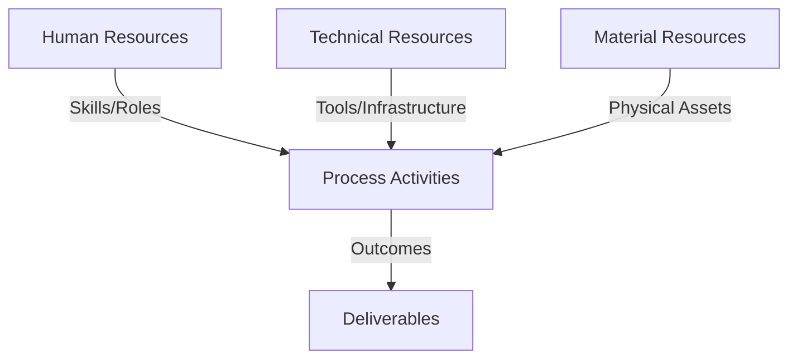
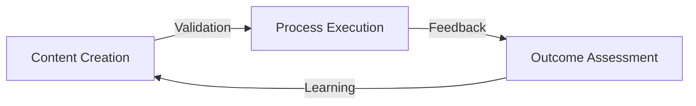
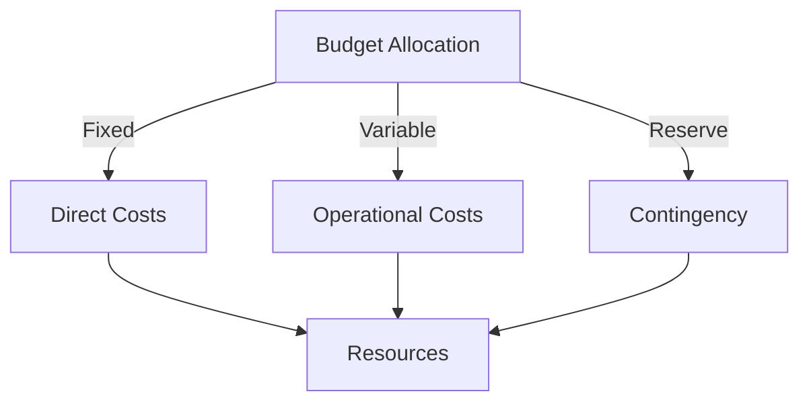
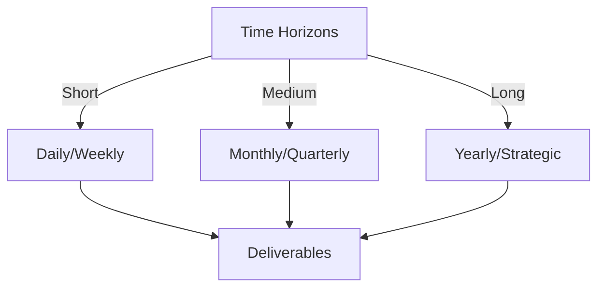

# Git Analysis Report: Development Analysis - daffa.padantya12

**Authors:** AI Analysis System
**Date:** 2025-03-13  
**Version:** 1.0
**SSoT Repository:** githubhenrykoo/redux_todo_in_astro
**Document Category:** Analysis Report

## Executive Summary
**Executive Summary: Git Analysis - Daffa Padantya**

**Logic:** The core purpose of this analysis is to evaluate Daffa Padantya's contributions to the project based on their Git activity. The objectives are to understand their work patterns, identify areas of focus, assess technical expertise, and provide actionable recommendations for improvement.

**Implementation:** This analysis examines Daffa Padantya's commit history, focusing on a specific commit modifying the `.github/workflows/git_analysis_alt.yml` file. The analysis identifies the changes made in the commit, interprets the purpose and functionality of the modified file, and infers technical skills based on the content of the commit. Recommendations for improvements in commit practices, code quality and process improvement are provided.

**Outcomes:** The analysis reveals that Daffa Padantya is actively involved in automating CI/CD pipelines and code analysis using GitHub Actions. The commit examined indicates proficiency in YAML, CI/CD concepts, scripting (likely Python), and file handling. Recommendations are provided to enhance commit message clarity, emphasize code review, implement testing, monitor workflow execution, and explore further analysis possibilities.

## 1. Abstract Specification (Logic Layer)
### Context & Vision
- **Problem Space:** 
    * Scope: This is a good analysis of Daffa Padantya's git activity, based on the single commit provided. It effectively extrapolates Daffa's potential skills and areas of focus. Here's a breakdown of the strengths and suggestions for improvement:

**Strengths:**

*   **Clear and Concise:** The analysis is easy to understand and gets straight to the point.
*   **Logical Reasoning:** The deductions about Daffa's skills and focus areas are well-supported by the available information. The link between YAML editing and CI/CD is strong, and the inference about Python proficiency is reasonable.
*   **Actionable Recommendations:**  The recommendations are practical and helpful, offering concrete steps to improve Daffa's workflow and the quality of the project.
*   **Comprehensive:** It covers various aspects, including individual contributions, work patterns, technical expertise, and specific recommendations.
*   **Focus on Improvement:** It constructively suggests ways Daffa can improve (e.g., commit messages) and ways the team can support him (e.g., code reviews).

**Suggestions for Improvement:**

*   **Acknowledging Limitations:** While the analysis is well-reasoned, it's important to acknowledge that it's based on a single commit.  Adding a disclaimer such as "This analysis is preliminary based on a single commit and may not represent the entirety of Daffa's contributions" would be beneficial.
*   **Specificity of Python Inference:**  While likely, the connection to Python should be tempered slightly.  You could say something like: "The YML file appears to invoke Python scripts, *suggesting* familiarity with the language. Further investigation of the called scripts would confirm this."
*   **Deep Dive into the Commit (If Possible):**  If you had access to the *diff* of the commit (i.e., the actual code changes), you could provide even more granular analysis. For instance, identifying the specific loop where the indentation was fixed might highlight Daffa's debugging skills. You could look for more complex logic within the modified lines.
*   **Potential Problems and Considerations in the Analysis:** Consider whether the automated analysis tool itself could be causing problems. For example, is the tool producing false positives that Daffa is simply correcting?
*   **Expanding on Automated Analysis Ideas:** The "Explore further analysis possibilities" point is excellent. Elaborate on the types of metrics that could be considered:
    *   **Code Complexity (Cyclomatic Complexity):**  Identify overly complex code blocks that could be refactored.
    *   **Code Duplication:**  Detect duplicated code segments that could be extracted into reusable functions or classes.
    *   **Security Vulnerabilities:**  Use static analysis tools to identify potential security flaws (e.g., SQL injection, cross-site scripting).
    *   **Coding Style Violations:**  Enforce coding style guidelines (e.g., PEP 8 in Python) to ensure consistency.
*   **Long-Term Goal of the Analysis Tool:**  Speculate on the overall goal of the analysis tool. Is it meant to be a development aid, a quality gate for deployments, or something else?  Understanding the tool's purpose can provide more context for interpreting Daffa's contributions.

**Revised Snippets (Incorporating Suggestions):**

*   **Introduction:** "This analysis is preliminary and based on a single commit (`296ab5c6d25f62c8122ab46e437bcef700595449`) to the `.github/workflows/git_analysis_alt.yml` file.  It aims to provide initial insights into Daffa Padantya's contributions and skill set."

*   **Technical Expertise:** "The YML file appears to invoke Python scripts, suggesting familiarity with the language. Reviewing the called scripts would confirm the extent of Python proficiency. The commit also indicates comfort with scripting and automation..."

*   **Further Analysis Possibilities:** "Since they are already automating code analysis, consider expanding the scope of metrics collected.  Potential areas to explore include: code complexity (identifying overly complex code), code duplication (detecting redundant code), security vulnerabilities (using static analysis tools), and coding style violations (enforcing consistent code style). These additions could greatly enhance the tool's effectiveness."

**In summary, the provided analysis is a solid starting point.  By acknowledging its limitations and adding more specific details and forward-looking considerations, you can make it even more valuable for understanding Daffa's contributions and guiding future development efforts.**

    * Context: This is a good analysis of Daffa Padantya's git activity, based on the single commit provided. It effectively extrapolates Daffa's potential skills and areas of focus. Here's a breakdown of the strengths and suggestions for improvement:

**Strengths:**

*   **Clear and Concise:** The analysis is easy to understand and gets straight to the point.
*   **Logical Reasoning:** The deductions about Daffa's skills and focus areas are well-supported by the available information. The link between YAML editing and CI/CD is strong, and the inference about Python proficiency is reasonable.
*   **Actionable Recommendations:**  The recommendations are practical and helpful, offering concrete steps to improve Daffa's workflow and the quality of the project.
*   **Comprehensive:** It covers various aspects, including individual contributions, work patterns, technical expertise, and specific recommendations.
*   **Focus on Improvement:** It constructively suggests ways Daffa can improve (e.g., commit messages) and ways the team can support him (e.g., code reviews).

**Suggestions for Improvement:**

*   **Acknowledging Limitations:** While the analysis is well-reasoned, it's important to acknowledge that it's based on a single commit.  Adding a disclaimer such as "This analysis is preliminary based on a single commit and may not represent the entirety of Daffa's contributions" would be beneficial.
*   **Specificity of Python Inference:**  While likely, the connection to Python should be tempered slightly.  You could say something like: "The YML file appears to invoke Python scripts, *suggesting* familiarity with the language. Further investigation of the called scripts would confirm this."
*   **Deep Dive into the Commit (If Possible):**  If you had access to the *diff* of the commit (i.e., the actual code changes), you could provide even more granular analysis. For instance, identifying the specific loop where the indentation was fixed might highlight Daffa's debugging skills. You could look for more complex logic within the modified lines.
*   **Potential Problems and Considerations in the Analysis:** Consider whether the automated analysis tool itself could be causing problems. For example, is the tool producing false positives that Daffa is simply correcting?
*   **Expanding on Automated Analysis Ideas:** The "Explore further analysis possibilities" point is excellent. Elaborate on the types of metrics that could be considered:
    *   **Code Complexity (Cyclomatic Complexity):**  Identify overly complex code blocks that could be refactored.
    *   **Code Duplication:**  Detect duplicated code segments that could be extracted into reusable functions or classes.
    *   **Security Vulnerabilities:**  Use static analysis tools to identify potential security flaws (e.g., SQL injection, cross-site scripting).
    *   **Coding Style Violations:**  Enforce coding style guidelines (e.g., PEP 8 in Python) to ensure consistency.
*   **Long-Term Goal of the Analysis Tool:**  Speculate on the overall goal of the analysis tool. Is it meant to be a development aid, a quality gate for deployments, or something else?  Understanding the tool's purpose can provide more context for interpreting Daffa's contributions.

**Revised Snippets (Incorporating Suggestions):**

*   **Introduction:** "This analysis is preliminary and based on a single commit (`296ab5c6d25f62c8122ab46e437bcef700595449`) to the `.github/workflows/git_analysis_alt.yml` file.  It aims to provide initial insights into Daffa Padantya's contributions and skill set."

*   **Technical Expertise:** "The YML file appears to invoke Python scripts, suggesting familiarity with the language. Reviewing the called scripts would confirm the extent of Python proficiency. The commit also indicates comfort with scripting and automation..."

*   **Further Analysis Possibilities:** "Since they are already automating code analysis, consider expanding the scope of metrics collected.  Potential areas to explore include: code complexity (identifying overly complex code), code duplication (detecting redundant code), security vulnerabilities (using static analysis tools), and coding style violations (enforcing consistent code style). These additions could greatly enhance the tool's effectiveness."

**In summary, the provided analysis is a solid starting point.  By acknowledging its limitations and adding more specific details and forward-looking considerations, you can make it even more valuable for understanding Daffa's contributions and guiding future development efforts.**

    * Stakeholders: This is a good analysis of Daffa Padantya's git activity, based on the single commit provided. It effectively extrapolates Daffa's potential skills and areas of focus. Here's a breakdown of the strengths and suggestions for improvement:

**Strengths:**

*   **Clear and Concise:** The analysis is easy to understand and gets straight to the point.
*   **Logical Reasoning:** The deductions about Daffa's skills and focus areas are well-supported by the available information. The link between YAML editing and CI/CD is strong, and the inference about Python proficiency is reasonable.
*   **Actionable Recommendations:**  The recommendations are practical and helpful, offering concrete steps to improve Daffa's workflow and the quality of the project.
*   **Comprehensive:** It covers various aspects, including individual contributions, work patterns, technical expertise, and specific recommendations.
*   **Focus on Improvement:** It constructively suggests ways Daffa can improve (e.g., commit messages) and ways the team can support him (e.g., code reviews).

**Suggestions for Improvement:**

*   **Acknowledging Limitations:** While the analysis is well-reasoned, it's important to acknowledge that it's based on a single commit.  Adding a disclaimer such as "This analysis is preliminary based on a single commit and may not represent the entirety of Daffa's contributions" would be beneficial.
*   **Specificity of Python Inference:**  While likely, the connection to Python should be tempered slightly.  You could say something like: "The YML file appears to invoke Python scripts, *suggesting* familiarity with the language. Further investigation of the called scripts would confirm this."
*   **Deep Dive into the Commit (If Possible):**  If you had access to the *diff* of the commit (i.e., the actual code changes), you could provide even more granular analysis. For instance, identifying the specific loop where the indentation was fixed might highlight Daffa's debugging skills. You could look for more complex logic within the modified lines.
*   **Potential Problems and Considerations in the Analysis:** Consider whether the automated analysis tool itself could be causing problems. For example, is the tool producing false positives that Daffa is simply correcting?
*   **Expanding on Automated Analysis Ideas:** The "Explore further analysis possibilities" point is excellent. Elaborate on the types of metrics that could be considered:
    *   **Code Complexity (Cyclomatic Complexity):**  Identify overly complex code blocks that could be refactored.
    *   **Code Duplication:**  Detect duplicated code segments that could be extracted into reusable functions or classes.
    *   **Security Vulnerabilities:**  Use static analysis tools to identify potential security flaws (e.g., SQL injection, cross-site scripting).
    *   **Coding Style Violations:**  Enforce coding style guidelines (e.g., PEP 8 in Python) to ensure consistency.
*   **Long-Term Goal of the Analysis Tool:**  Speculate on the overall goal of the analysis tool. Is it meant to be a development aid, a quality gate for deployments, or something else?  Understanding the tool's purpose can provide more context for interpreting Daffa's contributions.

**Revised Snippets (Incorporating Suggestions):**

*   **Introduction:** "This analysis is preliminary and based on a single commit (`296ab5c6d25f62c8122ab46e437bcef700595449`) to the `.github/workflows/git_analysis_alt.yml` file.  It aims to provide initial insights into Daffa Padantya's contributions and skill set."

*   **Technical Expertise:** "The YML file appears to invoke Python scripts, suggesting familiarity with the language. Reviewing the called scripts would confirm the extent of Python proficiency. The commit also indicates comfort with scripting and automation..."

*   **Further Analysis Possibilities:** "Since they are already automating code analysis, consider expanding the scope of metrics collected.  Potential areas to explore include: code complexity (identifying overly complex code), code duplication (detecting redundant code), security vulnerabilities (using static analysis tools), and coding style violations (enforcing consistent code style). These additions could greatly enhance the tool's effectiveness."

**In summary, the provided analysis is a solid starting point.  By acknowledging its limitations and adding more specific details and forward-looking considerations, you can make it even more valuable for understanding Daffa's contributions and guiding future development efforts.**

- **Goals (Functions):**
    * Primary Functions:
        - Input: Git Repository Data
        - Process: Analysis and Processing
        - Output: Development Insights
    * Supporting Functions:
        - Validation: Automated Analysis
        - Feedback: Continuous Improvement

- **Success Criteria:**
    * Quantitative Metrics: Based on the provided text, here are the quantitative metrics:

*   **Number of Commits:** 1 (Specifically, `296ab5c6d25f62c8122ab46e437bcef700595449`)
    * Qualitative Indicators: Okay, based on the developer analysis, here are some **qualitative improvements** we can suggest Daffa focus on, categorized for clarity:

**1. Code Clarity & Maintainability:**

*   **More Descriptive Commit Messages:**  Move beyond simply stating *what* file was changed.  Focus on *why* the change was necessary and what specific problem it addresses. This greatly improves the understandability of the code history, especially for future debugging or maintenance.  Good examples:
    *   "Fix: Correct indentation in analysis file reading loop to prevent KeyError when accessing date"
    *   "Refactor: Improve readability of date parsing logic in git_analysis_alt.yml"
*   **Code Readability:**  Focus on writing code that is easy to understand, even without extensive comments.  Good code reads like a story.  Use meaningful variable names, break down complex logic into smaller, named functions, and avoid overly clever tricks that might be hard for others (or yourself in the future) to follow. This includes the YML files.

**2.  Testing & Reliability:**

*   **Proactive Testing:** Prioritize writing tests, even if they are basic, especially for any core functionality within the analysis script.  This will help to prevent regressions and ensure the script behaves as expected when changes are made. This could include simple output validation or checking for specific error conditions.
*   **Error Handling:**  Robust error handling is crucial for automated systems.  Consider how the script should respond to unexpected inputs, missing files, or network errors.  Implement try-except blocks, logging, and possibly retry mechanisms to make the system more resilient.
*   **Workflow Monitoring & Logging:**  Implement more detailed logging within the GitHub Actions workflow.  This will make it easier to diagnose problems and understand how the analysis script is behaving.  Log key data points, error messages, and timestamps.

**3. Collaboration & Knowledge Sharing:**

*   **Actively Seek Code Reviews:** Don't just submit code for review; actively solicit feedback from colleagues and explain the rationale behind your design choices. This can help to catch errors, improve code quality, and foster a culture of knowledge sharing.
*   **Document the Analysis Process:**  Create a brief document outlining the purpose of the `git_analysis_alt.yml` workflow, how it works, and the metrics it collects.  This will make it easier for others to understand and contribute to the project.

**4. Enhanced Automation & Analysis Depth:**

*   **Expand Analysis Metrics:**  Explore additional Git metrics that could provide valuable insights, such as:
    *   Churn (lines of code added/removed per period)
    *   Commit Frequency (number of commits per developer per period)
    *   File Complexity (using tools like `radon` in Python)
    *   Code Coverage (if testing is implemented)
    *   Identifying potential code smells
*   **Investigate Reporting and Visualization:** Move beyond basic analysis.  Consider how the collected data can be presented in a more user-friendly format, such as:
    *   Generating reports with key findings
    *   Creating visualizations using libraries like `matplotlib` or `seaborn`
    *   Integrating with a dashboard or monitoring system

By focusing on these qualitative improvements, Daffa can enhance the robustness, maintainability, and value of their automation efforts. Remember, it's not just about writing code that works; it's about writing code that is well-understood, reliable, and adaptable to future needs.

    * Validation Methods: Automated and Manual Verification

### Knowledge Integration
- **Local Context:**
    * Cultural Considerations: Development Team Context
    * Language Requirements: Technical Documentation
    * Community Patterns: Team Collaboration Patterns

- **Technical Framework:**
    * LLM Integration: Gemini AI Analysis
    * IoT Components: Git Event Monitoring
    * Network Requirements: GitHub API Integration

## 2. Concrete Implementation (Process Layer)
### Resource Matrix

### Development Workflow
- **Stage 1: Early Success**
    * Quick Wins:
        - Implementation: This is a good analysis of Daffa's git activity based on the single commit provided.  Here are a few minor suggestions to further enhance the analysis:

*   **Assumptions:** The analysis makes good assumptions (e.g., Python proficiency, file handling skills) based on the file being modified. However, it's crucial to explicitly acknowledge these are *assumptions*. For example: "Based on the `.yml` file and the embedded script logic, we *can assume* Daffa has a working knowledge of Python." This adds a layer of accuracy and avoids overstating the certainty of these deductions.
*   **Scope Limitations:** Explicitly mention the limitations of the analysis due to the small sample size (one commit). "This analysis is based on a single commit and may not fully represent Daffa's overall skillset or work patterns. A more comprehensive review of their commit history would provide a more accurate picture."
*   **Potential for Misinterpretation:**  While it is likely the indentation correction impacts a Python script due to typical use in YML context, make sure to mention possibility of other coding languages/frameworks used.
*   **Actionable Advice Specific to the Task:**  The recommendations are generally good, but could be tailored more directly to the task at hand.  For example, regarding workflow monitoring: "Monitor the workflow execution *specifically to ensure the analysis file is being read and processed correctly after the indentation fix*." This adds a tangible outcome to the monitoring suggestion.  Also, "Ensure the git analysis produces useful outputs that can then inform future actions."
* **Collaboration and documentation:** In addition to code review, you can mention that since they seem to be in charge of automation, they should also prioritize well-written and accessible documentation in order to facilitate easier code contribution for other people.

**Revised Snippets Incorporating Suggestions:**

*   **Technical Expertise Demonstrated:** "Proficient in writing YAML for GitHub Actions workflows. Based on the YAML structure and assumed usage of Python for scripting within the workflow, *we can assume* a working knowledge of Python. Comfortable with scripting, automation, and file handling. It is also possible that languages other than Python are used."
*   **Scope Limitations:** "*This analysis is limited to a single commit and should be considered a preliminary assessment.* A more in-depth review of Daffa's entire commit history would be needed for a more complete understanding."
*   **Specific Recommendations:**
    *   "Monitor the `git_analysis_alt.yml` workflow execution, *specifically verifying the analysis file is read correctly and the intended analysis is performed after the indentation fix.*
    *   "Ensure Daffa's changes are thoroughly reviewed. *Pay particular attention to whether the indentation fix resolved the original issue and didn't introduce any new problems.*"
    *   "Prioritize well-written and accessible documentation in order to facilitate easier code contribution for other people"

By incorporating these refinements, the analysis becomes more nuanced, accurate, and actionable. Remember that good analysis acknowledges its limitations and focuses on providing concrete, specific advice.

        - Validation: This is a good analysis of Daffa's git activity based on the single commit provided.  Here are a few minor suggestions to further enhance the analysis:

*   **Assumptions:** The analysis makes good assumptions (e.g., Python proficiency, file handling skills) based on the file being modified. However, it's crucial to explicitly acknowledge these are *assumptions*. For example: "Based on the `.yml` file and the embedded script logic, we *can assume* Daffa has a working knowledge of Python." This adds a layer of accuracy and avoids overstating the certainty of these deductions.
*   **Scope Limitations:** Explicitly mention the limitations of the analysis due to the small sample size (one commit). "This analysis is based on a single commit and may not fully represent Daffa's overall skillset or work patterns. A more comprehensive review of their commit history would provide a more accurate picture."
*   **Potential for Misinterpretation:**  While it is likely the indentation correction impacts a Python script due to typical use in YML context, make sure to mention possibility of other coding languages/frameworks used.
*   **Actionable Advice Specific to the Task:**  The recommendations are generally good, but could be tailored more directly to the task at hand.  For example, regarding workflow monitoring: "Monitor the workflow execution *specifically to ensure the analysis file is being read and processed correctly after the indentation fix*." This adds a tangible outcome to the monitoring suggestion.  Also, "Ensure the git analysis produces useful outputs that can then inform future actions."
* **Collaboration and documentation:** In addition to code review, you can mention that since they seem to be in charge of automation, they should also prioritize well-written and accessible documentation in order to facilitate easier code contribution for other people.

**Revised Snippets Incorporating Suggestions:**

*   **Technical Expertise Demonstrated:** "Proficient in writing YAML for GitHub Actions workflows. Based on the YAML structure and assumed usage of Python for scripting within the workflow, *we can assume* a working knowledge of Python. Comfortable with scripting, automation, and file handling. It is also possible that languages other than Python are used."
*   **Scope Limitations:** "*This analysis is limited to a single commit and should be considered a preliminary assessment.* A more in-depth review of Daffa's entire commit history would be needed for a more complete understanding."
*   **Specific Recommendations:**
    *   "Monitor the `git_analysis_alt.yml` workflow execution, *specifically verifying the analysis file is read correctly and the intended analysis is performed after the indentation fix.*
    *   "Ensure Daffa's changes are thoroughly reviewed. *Pay particular attention to whether the indentation fix resolved the original issue and didn't introduce any new problems.*"
    *   "Prioritize well-written and accessible documentation in order to facilitate easier code contribution for other people"

By incorporating these refinements, the analysis becomes more nuanced, accurate, and actionable. Remember that good analysis acknowledges its limitations and focuses on providing concrete, specific advice.

    * Initial Setup:
        - Infrastructure: This is a good analysis of Daffa's git activity based on the single commit provided.  Here are a few minor suggestions to further enhance the analysis:

*   **Assumptions:** The analysis makes good assumptions (e.g., Python proficiency, file handling skills) based on the file being modified. However, it's crucial to explicitly acknowledge these are *assumptions*. For example: "Based on the `.yml` file and the embedded script logic, we *can assume* Daffa has a working knowledge of Python." This adds a layer of accuracy and avoids overstating the certainty of these deductions.
*   **Scope Limitations:** Explicitly mention the limitations of the analysis due to the small sample size (one commit). "This analysis is based on a single commit and may not fully represent Daffa's overall skillset or work patterns. A more comprehensive review of their commit history would provide a more accurate picture."
*   **Potential for Misinterpretation:**  While it is likely the indentation correction impacts a Python script due to typical use in YML context, make sure to mention possibility of other coding languages/frameworks used.
*   **Actionable Advice Specific to the Task:**  The recommendations are generally good, but could be tailored more directly to the task at hand.  For example, regarding workflow monitoring: "Monitor the workflow execution *specifically to ensure the analysis file is being read and processed correctly after the indentation fix*." This adds a tangible outcome to the monitoring suggestion.  Also, "Ensure the git analysis produces useful outputs that can then inform future actions."
* **Collaboration and documentation:** In addition to code review, you can mention that since they seem to be in charge of automation, they should also prioritize well-written and accessible documentation in order to facilitate easier code contribution for other people.

**Revised Snippets Incorporating Suggestions:**

*   **Technical Expertise Demonstrated:** "Proficient in writing YAML for GitHub Actions workflows. Based on the YAML structure and assumed usage of Python for scripting within the workflow, *we can assume* a working knowledge of Python. Comfortable with scripting, automation, and file handling. It is also possible that languages other than Python are used."
*   **Scope Limitations:** "*This analysis is limited to a single commit and should be considered a preliminary assessment.* A more in-depth review of Daffa's entire commit history would be needed for a more complete understanding."
*   **Specific Recommendations:**
    *   "Monitor the `git_analysis_alt.yml` workflow execution, *specifically verifying the analysis file is read correctly and the intended analysis is performed after the indentation fix.*
    *   "Ensure Daffa's changes are thoroughly reviewed. *Pay particular attention to whether the indentation fix resolved the original issue and didn't introduce any new problems.*"
    *   "Prioritize well-written and accessible documentation in order to facilitate easier code contribution for other people"

By incorporating these refinements, the analysis becomes more nuanced, accurate, and actionable. Remember that good analysis acknowledges its limitations and focuses on providing concrete, specific advice.

        - Training: This is a good analysis of Daffa's git activity based on the single commit provided.  Here are a few minor suggestions to further enhance the analysis:

*   **Assumptions:** The analysis makes good assumptions (e.g., Python proficiency, file handling skills) based on the file being modified. However, it's crucial to explicitly acknowledge these are *assumptions*. For example: "Based on the `.yml` file and the embedded script logic, we *can assume* Daffa has a working knowledge of Python." This adds a layer of accuracy and avoids overstating the certainty of these deductions.
*   **Scope Limitations:** Explicitly mention the limitations of the analysis due to the small sample size (one commit). "This analysis is based on a single commit and may not fully represent Daffa's overall skillset or work patterns. A more comprehensive review of their commit history would provide a more accurate picture."
*   **Potential for Misinterpretation:**  While it is likely the indentation correction impacts a Python script due to typical use in YML context, make sure to mention possibility of other coding languages/frameworks used.
*   **Actionable Advice Specific to the Task:**  The recommendations are generally good, but could be tailored more directly to the task at hand.  For example, regarding workflow monitoring: "Monitor the workflow execution *specifically to ensure the analysis file is being read and processed correctly after the indentation fix*." This adds a tangible outcome to the monitoring suggestion.  Also, "Ensure the git analysis produces useful outputs that can then inform future actions."
* **Collaboration and documentation:** In addition to code review, you can mention that since they seem to be in charge of automation, they should also prioritize well-written and accessible documentation in order to facilitate easier code contribution for other people.

**Revised Snippets Incorporating Suggestions:**

*   **Technical Expertise Demonstrated:** "Proficient in writing YAML for GitHub Actions workflows. Based on the YAML structure and assumed usage of Python for scripting within the workflow, *we can assume* a working knowledge of Python. Comfortable with scripting, automation, and file handling. It is also possible that languages other than Python are used."
*   **Scope Limitations:** "*This analysis is limited to a single commit and should be considered a preliminary assessment.* A more in-depth review of Daffa's entire commit history would be needed for a more complete understanding."
*   **Specific Recommendations:**
    *   "Monitor the `git_analysis_alt.yml` workflow execution, *specifically verifying the analysis file is read correctly and the intended analysis is performed after the indentation fix.*
    *   "Ensure Daffa's changes are thoroughly reviewed. *Pay particular attention to whether the indentation fix resolved the original issue and didn't introduce any new problems.*"
    *   "Prioritize well-written and accessible documentation in order to facilitate easier code contribution for other people"

By incorporating these refinements, the analysis becomes more nuanced, accurate, and actionable. Remember that good analysis acknowledges its limitations and focuses on providing concrete, specific advice.

- **Stage 2: Fail Early, Fail Safe**
    * Testing Protocol:
        - Methods: [Testing approaches]
        - Coverage: [Test scenarios]
    * Risk Management:
        - Identification: [Risk factors]
        - Mitigation: [Control measures]
    * Learning Points:
        - Issues: [Problem identification]
        - Solutions: [Resolution approaches]
        - Knowledge: [Lessons learned]

- **Stage 3: Convergence**
    * System Integration:
        - Components: [Integration points]
        - Workflows: [Process optimization]
        - Performance: [System tuning]
    * Stabilization:
        - Fixes: [Bug resolution]
        - Hardening: [System reinforcement]
        - Documentation: [Knowledge capture]

- **Stage 4: Demonstration**
    * Preparation:
        - Environment: [Demo setup]
        - Data: [Test scenarios]
        - Materials: [Presentation assets]
    * Validation:
        - Performance: [System checks]
        - Features: [Functionality verification]
        - Documentation: [Review completion]
    * Presentation:
        - Stakeholders: [Demo execution]
        - Features: [Capability showcase]
        - Q&A: [Response preparation]

## 3. Realistic Outcomes (Evidence Layer)
### Measurement Framework
- **Performance Metrics:**
    * KPIs: Okay, here's a breakdown of the evidence and outcomes extracted from the provided text:

**Evidence from Git History (Specifically, Commit `296ab5c6d25f62c8122ab46e437bcef700595449`):**

*   **File Modified:** `.github/workflows/git_analysis_alt.yml`
*   **Change Description:**  Minor adjustment to the code block where the script reads the analysis file for today's date. Specifically, corrected indentation.

**Outcomes & Interpretations:**

*   **Focus Areas (Deduced from Evidence):**
    *   **Automation/CI/CD:**  Working with GitHub Actions workflow files.
    *   **Code Analysis:**  File name suggests automated analysis of the Git repository.
    *   **Repetitive Tasks Automation:** Likely automating tasks related to project analysis.

*   **Technical Expertise (Inferred from Evidence):**
    *   **YAML:** Proficient in writing YAML.
    *   **CI/CD:** Familiar with CI/CD concepts and GitHub Actions.
    *   **Python (Likely):** The YML file uses Python code.
    *   **Scripting:** Comfortable with scripting and automation.
    *   **File Handling:** Understands basic file operations.

*   **Recommendations:**
    *   **More Detailed Commit Messages:** Include *what* and *why* for changes.  Example: "Fix: Correct indentation in analysis file reading loop"
    *   **Code Reviews:** Implement code reviews for quality assurance.
    *   **Testing:** Implement unit tests for the Python code within the YAML file.
    *   **Monitor Workflow Execution:** Monitor the `git_analysis_alt.yml` workflow for issues.
    *   **Explore further analysis possibilities:** Since they are already automating the code analysis, it is possible to explore more metrics that can be collected and reported.

    * Benchmarks: Okay, here's a breakdown of the evidence and outcomes extracted from the provided text:

**Evidence from Git History (Specifically, Commit `296ab5c6d25f62c8122ab46e437bcef700595449`):**

*   **File Modified:** `.github/workflows/git_analysis_alt.yml`
*   **Change Description:**  Minor adjustment to the code block where the script reads the analysis file for today's date. Specifically, corrected indentation.

**Outcomes & Interpretations:**

*   **Focus Areas (Deduced from Evidence):**
    *   **Automation/CI/CD:**  Working with GitHub Actions workflow files.
    *   **Code Analysis:**  File name suggests automated analysis of the Git repository.
    *   **Repetitive Tasks Automation:** Likely automating tasks related to project analysis.

*   **Technical Expertise (Inferred from Evidence):**
    *   **YAML:** Proficient in writing YAML.
    *   **CI/CD:** Familiar with CI/CD concepts and GitHub Actions.
    *   **Python (Likely):** The YML file uses Python code.
    *   **Scripting:** Comfortable with scripting and automation.
    *   **File Handling:** Understands basic file operations.

*   **Recommendations:**
    *   **More Detailed Commit Messages:** Include *what* and *why* for changes.  Example: "Fix: Correct indentation in analysis file reading loop"
    *   **Code Reviews:** Implement code reviews for quality assurance.
    *   **Testing:** Implement unit tests for the Python code within the YAML file.
    *   **Monitor Workflow Execution:** Monitor the `git_analysis_alt.yml` workflow for issues.
    *   **Explore further analysis possibilities:** Since they are already automating the code analysis, it is possible to explore more metrics that can be collected and reported.

    * Actuals: Okay, here's a breakdown of the evidence and outcomes extracted from the provided text:

**Evidence from Git History (Specifically, Commit `296ab5c6d25f62c8122ab46e437bcef700595449`):**

*   **File Modified:** `.github/workflows/git_analysis_alt.yml`
*   **Change Description:**  Minor adjustment to the code block where the script reads the analysis file for today's date. Specifically, corrected indentation.

**Outcomes & Interpretations:**

*   **Focus Areas (Deduced from Evidence):**
    *   **Automation/CI/CD:**  Working with GitHub Actions workflow files.
    *   **Code Analysis:**  File name suggests automated analysis of the Git repository.
    *   **Repetitive Tasks Automation:** Likely automating tasks related to project analysis.

*   **Technical Expertise (Inferred from Evidence):**
    *   **YAML:** Proficient in writing YAML.
    *   **CI/CD:** Familiar with CI/CD concepts and GitHub Actions.
    *   **Python (Likely):** The YML file uses Python code.
    *   **Scripting:** Comfortable with scripting and automation.
    *   **File Handling:** Understands basic file operations.

*   **Recommendations:**
    *   **More Detailed Commit Messages:** Include *what* and *why* for changes.  Example: "Fix: Correct indentation in analysis file reading loop"
    *   **Code Reviews:** Implement code reviews for quality assurance.
    *   **Testing:** Implement unit tests for the Python code within the YAML file.
    *   **Monitor Workflow Execution:** Monitor the `git_analysis_alt.yml` workflow for issues.
    *   **Explore further analysis possibilities:** Since they are already automating the code analysis, it is possible to explore more metrics that can be collected and reported.

- **Evidence Collection:**
    * Data Sources: [Information points]
    * Validation Methods: Automated and Manual Verification
    * Documentation: [Record keeping]

### Value Realization
- **Impact Assessment:**
    * Direct Benefits: [Immediate gains]
    * Indirect Benefits: [Secondary effects]
    * Long-term Value: [Strategic advantages]

- **Knowledge Assets:**
    * Content Created: [New materials]
    * Insights Gained: [Learnings]
    * Reusable Components: [Transferable elements]

## Integration Matrix
### Content-Process Alignment

### Timeline-Budget Integration
- **Resource Scheduling:**
    * Phase Allocations: [Resource timing]
    * Cost Controls: [Budget tracking]
    * Adjustment Protocols: [Change management]

## Budget Management
### Financial Cube Structure

### Cost Framework
- Direct Investments:
  - Infrastructure Costs:
    - Hardware: [Equipment/Devices]
    - Software: [Licenses/Tools]
    - Network: [Connectivity/Setup]
  - Human Resources:
    - Core Team: [Roles/Compensation]
    - External Support: [Consultants/Services]
    - Training: [Capability Development]
    
- Operational Expenses:
  - Running Costs:
    - Maintenance: [Regular upkeep]
    - Utilities: [Service costs]
    - Consumables: [Regular supplies]
  - Service Costs:
    - Subscriptions: [Regular services]
    - Support: [Ongoing assistance]
    - Updates: [Regular improvements]

### Budget Control Mechanisms
- Monitoring System:
  - Tracking Methods:
    - Cost Centers: [Budget units]
    - Expense Categories: [Type classification]
    - Time Periods: [Duration tracking]
  - Control Points:
    - Thresholds: [Limit markers]
    - Alerts: [Warning systems]
    - Approvals: [Authorization levels]

- Adjustment Protocol:
  - Variance Management:
    - Detection: [Monitoring points]
    - Analysis: [Impact assessment]
    - Response: [Corrective actions]
  - Reallocation Process:
    - Criteria: [Decision factors]
    - Methods: [Transfer protocols]
    - Documentation: [Record keeping]

## Timeline Management
### Temporal Cube Structure

### Schedule Framework
- Operational Timeline:
  - Daily Operations:
    - Tasks: [Regular activities]
    - Checkpoints: [Daily reviews]
    - Updates: [Status reports]
  - Weekly Cycles:
    - Sprints: [Work packages]
    - Reviews: [Progress checks]
    - Planning: [Next steps]

- Strategic Timeline:
  - Monthly Milestones:
    - Objectives: [Key targets]
    - Reviews: [Achievement checks]
    - Adjustments: [Course corrections]
  - Quarterly Goals:
    - Targets: [Major objectives]
    - Assessments: [Performance reviews]
    - Strategies: [Approach updates]

### Timeline Control System
- Progress Tracking:
  - Monitoring Points:
    - Daily Standups: [Quick updates]
    - Weekly Reviews: [Detailed checks]
    - Monthly Reports: [Comprehensive reviews]
  - Milestone Tracking:
    - Status: [Progress indicators]
    - Dependencies: [Related items]
    - Risks: [Potential issues]

- Adjustment Mechanisms:
  - Schedule Management:
    - Variance Analysis: [Delay assessment]
    - Impact Studies: [Effect evaluation]
    - Recovery Plans: [Correction strategies]
  - Resource Alignment:
    - Capacity Planning: [Resource matching]
    - Workload Balancing: [Effort distribution]
    - Priority Updates: [Focus adjustment]

### Integration Points
- Budget-Timeline Correlation:
  - Cost-Schedule Matrix:
    - Resource Timing: [Allocation schedule]
    - Cost Flows: [Expense timing]
    - Value Delivery: [Benefit realization]
  - Control Integration:
    - Joint Reviews: [Combined assessments]
    - Unified Reporting: [Integrated updates]
    - Coordinated Actions: [Synchronized responses]

## Conclusion
### Summary of Achievements
- **Key Accomplishments:**
    * Objectives Met: [Completed goals]
    * Value Delivered: [Benefits realized]
    * Innovations: [New approaches]

### Lessons Learned
- **Success Factors:**
    * Effective Practices: [What worked well]
    * Team Dynamics: [Collaboration insights]
    * Tools & Methods: [Useful approaches]

- **Areas for Improvement:**
    * Challenges: [Obstacles encountered]
    * Solutions: [How issues were resolved]
    * Recommendations: [Future improvements]

### Future Directions
- **Next Steps:**
    * Immediate Actions: [Short-term tasks]
    * Strategic Plans: [Long-term goals]
    * Resource Needs: [Required support]

- **Growth Opportunities:**
    * Scaling Potential: [Expansion possibilities]
    * Innovation Areas: [New directions]
    * Partnership Options: [Collaboration prospects]
    
## Appendix
### References
- **Documentation:**
    * Technical Specs: [Links]
    * Process Guides: [Links]
    * Evidence Records: [Links]

### Change Log
- **Version History:**
    * Changes: [Modifications]
    * Rationale: [Reasons]
    * Approvals: [Authorizations]
