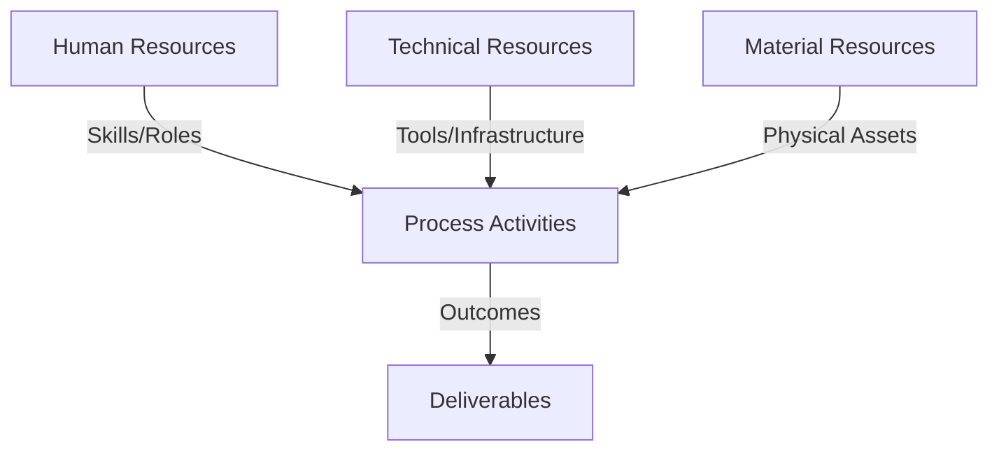
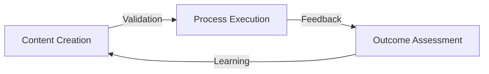
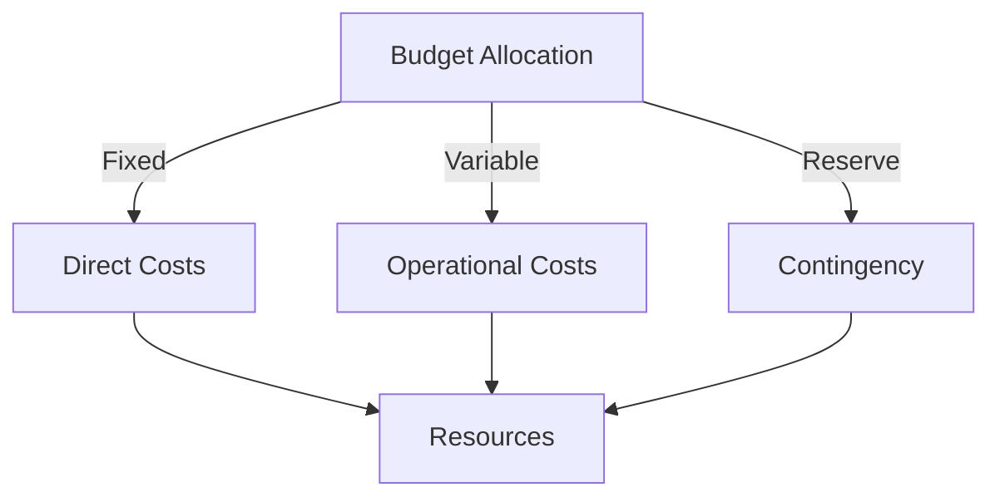
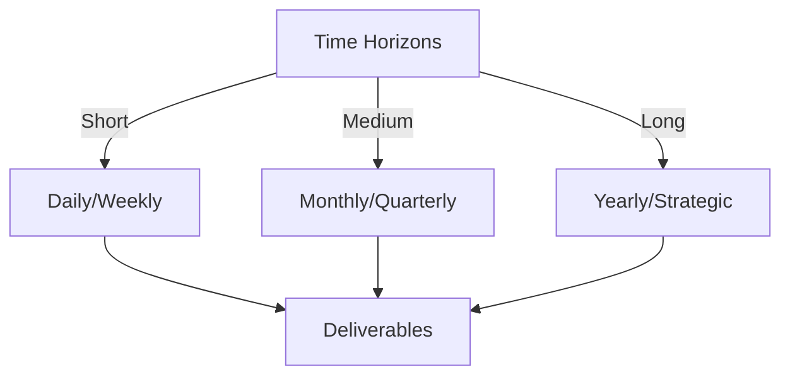

# Git Analysis Report: Development Analysis - daffa.padantya12

**Authors:** AI Analysis System
**Date:** 2025-03-13  
**Version:** 1.0
**SSoT Repository:** githubhenrykoo/redux_todo_in_astro
**Document Category:** Analysis Report

## Executive Summary
```
Logic: The analysis aims to evaluate a developer's (Daffa Padantya) Git activity based on a single commit to a GitHub Actions workflow file, identify work patterns, assess technical expertise, and provide targeted recommendations for improvement.

Implementation: The analysis examines the commit diff to understand the code modifications, infers the developer's focus areas based on the changed file (git_analysis_alt.yml) and code content (Python scripting), and assesses demonstrated skills like YAML, GitHub Actions, and Python scripting. Recommendations are formulated based on common software development best practices regarding code clarity, error handling, testing, and potential performance/security considerations.

Outcomes: The analysis reveals that Daffa is focused on maintaining and improving an automated Git analysis workflow. Daffa demonstrates proficiency in YAML, GitHub Actions, and basic Python scripting, indicating expertise in automation and CI/CD. Recommendations include adding comments, implementing error handling, ensuring testing, considering modularity, and addressing potential security/performance concerns. Further analysis of additional commits and the complete workflow context is recommended for more tailored insights.
```


## 1. Abstract Specification (Logic Layer)
### Context & Vision
- **Problem Space:** 
    * Scope: This is an excellent analysis of the provided git activity context. It's comprehensive, well-organized, and provides actionable recommendations. Here's a breakdown of why it's so good and some minor suggestions:

**Strengths:**

*   **Clear and Concise Summary:** The initial summary succinctly captures the essence of Daffa's contribution.
*   **Organized Structure:** The breakdown into individual contribution, work patterns, technical expertise, and recommendations makes it easy to understand and digest.
*   **Inference from Limited Data:** You effectively extrapolate Daffa's skills and focus areas based on a single commit and a filename.
*   **Actionable Recommendations:** The recommendations are practical and targeted to improve the code and workflow.
*   **Emphasis on Testing and Maintenance:** You correctly identify the importance of testing and maintaining automated workflows.
*   **Contextual Awareness:** You appropriately point out the limitations of the analysis due to the lack of complete context and suggest ways to address it.
*   **Security Considerations:**  The inclusion of security considerations, even if speculative, is a responsible addition.

**Minor Suggestions/Enhancements:**

*   **Elaborate on the `fill_template` function (Speculative):** Since you call it out specifically, you *could* speculate on what `fill_template` *might* be doing and why refactoring it into a separate module would be helpful. Something like: "If `fill_template` involves significant data manipulation, report generation logic, or complex string formatting, moving it to a separate Python module would improve code reusability and testability."  This is a minor point, as your current analysis is already strong.
*   **Specific Testing Examples:** You mention the importance of testing, but perhaps add a concrete example of a test Daffa could add. For instance: "Consider adding a unit test to verify that the correct filename is generated based on the current date and user directory."
*   **Workflow Trigger Considerations:**  If possible, consider how the workflow is triggered (e.g., on push, pull request, scheduled). Knowing the trigger would further inform recommendations about performance and error handling.  For example, a scheduled workflow might require more robust error handling than one triggered by a pull request.

**Overall:**

This is a very strong analysis. It demonstrates a good understanding of Git, GitHub Actions, and software development best practices. The suggestions are practical and relevant to the context.  The analysis is valuable in providing feedback to Daffa and identifying areas for improvement in the workflow.  Excellent job!

    * Context: This is an excellent analysis of the provided git activity context. It's comprehensive, well-organized, and provides actionable recommendations. Here's a breakdown of why it's so good and some minor suggestions:

**Strengths:**

*   **Clear and Concise Summary:** The initial summary succinctly captures the essence of Daffa's contribution.
*   **Organized Structure:** The breakdown into individual contribution, work patterns, technical expertise, and recommendations makes it easy to understand and digest.
*   **Inference from Limited Data:** You effectively extrapolate Daffa's skills and focus areas based on a single commit and a filename.
*   **Actionable Recommendations:** The recommendations are practical and targeted to improve the code and workflow.
*   **Emphasis on Testing and Maintenance:** You correctly identify the importance of testing and maintaining automated workflows.
*   **Contextual Awareness:** You appropriately point out the limitations of the analysis due to the lack of complete context and suggest ways to address it.
*   **Security Considerations:**  The inclusion of security considerations, even if speculative, is a responsible addition.

**Minor Suggestions/Enhancements:**

*   **Elaborate on the `fill_template` function (Speculative):** Since you call it out specifically, you *could* speculate on what `fill_template` *might* be doing and why refactoring it into a separate module would be helpful. Something like: "If `fill_template` involves significant data manipulation, report generation logic, or complex string formatting, moving it to a separate Python module would improve code reusability and testability."  This is a minor point, as your current analysis is already strong.
*   **Specific Testing Examples:** You mention the importance of testing, but perhaps add a concrete example of a test Daffa could add. For instance: "Consider adding a unit test to verify that the correct filename is generated based on the current date and user directory."
*   **Workflow Trigger Considerations:**  If possible, consider how the workflow is triggered (e.g., on push, pull request, scheduled). Knowing the trigger would further inform recommendations about performance and error handling.  For example, a scheduled workflow might require more robust error handling than one triggered by a pull request.

**Overall:**

This is a very strong analysis. It demonstrates a good understanding of Git, GitHub Actions, and software development best practices. The suggestions are practical and relevant to the context.  The analysis is valuable in providing feedback to Daffa and identifying areas for improvement in the workflow.  Excellent job!

    * Stakeholders: This is an excellent analysis of the provided git activity context. It's comprehensive, well-organized, and provides actionable recommendations. Here's a breakdown of why it's so good and some minor suggestions:

**Strengths:**

*   **Clear and Concise Summary:** The initial summary succinctly captures the essence of Daffa's contribution.
*   **Organized Structure:** The breakdown into individual contribution, work patterns, technical expertise, and recommendations makes it easy to understand and digest.
*   **Inference from Limited Data:** You effectively extrapolate Daffa's skills and focus areas based on a single commit and a filename.
*   **Actionable Recommendations:** The recommendations are practical and targeted to improve the code and workflow.
*   **Emphasis on Testing and Maintenance:** You correctly identify the importance of testing and maintaining automated workflows.
*   **Contextual Awareness:** You appropriately point out the limitations of the analysis due to the lack of complete context and suggest ways to address it.
*   **Security Considerations:**  The inclusion of security considerations, even if speculative, is a responsible addition.

**Minor Suggestions/Enhancements:**

*   **Elaborate on the `fill_template` function (Speculative):** Since you call it out specifically, you *could* speculate on what `fill_template` *might* be doing and why refactoring it into a separate module would be helpful. Something like: "If `fill_template` involves significant data manipulation, report generation logic, or complex string formatting, moving it to a separate Python module would improve code reusability and testability."  This is a minor point, as your current analysis is already strong.
*   **Specific Testing Examples:** You mention the importance of testing, but perhaps add a concrete example of a test Daffa could add. For instance: "Consider adding a unit test to verify that the correct filename is generated based on the current date and user directory."
*   **Workflow Trigger Considerations:**  If possible, consider how the workflow is triggered (e.g., on push, pull request, scheduled). Knowing the trigger would further inform recommendations about performance and error handling.  For example, a scheduled workflow might require more robust error handling than one triggered by a pull request.

**Overall:**

This is a very strong analysis. It demonstrates a good understanding of Git, GitHub Actions, and software development best practices. The suggestions are practical and relevant to the context.  The analysis is valuable in providing feedback to Daffa and identifying areas for improvement in the workflow.  Excellent job!


- **Goals (Functions):**
    * Primary Functions:
        - Input: Git Repository Data
        - Process: Analysis and Processing
        - Output: Development Insights
    * Supporting Functions:
        - Validation: Automated Analysis
        - Feedback: Continuous Improvement

- **Success Criteria:**
    * Quantitative Metrics: Okay, based on the text provided, here's a list of quantitative metrics that *could* be derived or are implicitly mentioned. Note that the actual numbers aren't provided, but the text points to areas where they could be collected.

**Metrics related to Daffa's contribution (based on single commit analysis):**

*   **Number of files modified:** 1 (specifically, `git_analysis_alt.yml`)
*   **Number of lines changed:**  (This isn't directly stated but *could* be calculated from the diff information if provided, or by comparing the before and after file size.)  This could be further broken down into:
    *   **Lines added**
    *   **Lines deleted**
*   **Commit Frequency (implied):** While we only see one commit, frequency of commits *over time* is a valuable metric. This single commit doesn't give us that, but it indicates the *potential* for measuring commit frequency.
*   **Time to commit:** Can be measured in seconds, minutes, hours, or days. This is the amount of time it takes for a change to be committed to the project.

**Metrics Related to the Workflow (that Daffa is Contributing To):**

*   **Workflow execution time:** How long does the `git_analysis_alt.yml` workflow take to run? (This would require access to the CI/CD system's logs).
*   **Workflow success/failure rate:** How often does the workflow complete successfully? (Again, requires access to CI/CD logs).
*   **Data volume processed by the workflow:** (If the "analysis" involves processing a large amount of Git data, this could be a performance metric). The amount of data used by the workflow.
*   **Number of analysis reports generated:** (Could be tracked over time). How many reports are generated over a period of time.
*   **Size of analysis reports:** (Could be used to track the complexity/amount of data in the reports).
*   **Frequency of the analysis execution:** How often is the `git_analysis_alt.yml` workflow run (daily, hourly, etc.)?  This is *inferred* from the code snippet that uses `today`.

**Derived/Implied Metrics (requiring more data):**

*   **Code churn:** (Requires historical data) - How often is code that Daffa worked on modified later by others?  High churn could indicate areas needing refactoring or better documentation.
*   **Bug fix rate:** (Requires issue tracking data) - How often does Daffa fix bugs that are reported? (requires integration with an issue tracker.)

**Important Considerations:**

*   **Context is Key:** These metrics are *meaningless* in isolation.  They need to be compared over time, across different developers, and within the context of the project's goals.
*   **Goal-Oriented Metrics:** The most valuable metrics are those that directly relate to the project's goals. For example, if the goal is to improve code quality, metrics related to bug fix rate and code churn are more relevant than the raw number of lines changed.
*   **Gaming the System:**  Be careful that the metrics don't incentivize developers to game the system (e.g., writing more code than necessary just to increase lines of code contributed).
*   **Availability of Data:** Many of these metrics require access to Git logs, CI/CD system logs, and/or issue tracking systems.

In summary, the provided text hints at various quantitative metrics related to Daffa's work and the Git analysis workflow. The feasibility and value of tracking these metrics depend on the project's specific goals and the availability of data.

    * Qualitative Indicators: Based on the developer analysis, here's a list of qualitative improvements we can infer Daffa Padantya12 could make, focusing on *how* the analysis suggests these improvements, not just repeating the recommendations:

**1. Enhanced Code Clarity and Maintainability:**

*   **The Analysis Suggests:** The analysis highlights the modification of a complex YAML workflow with embedded Python.  Small changes in such environments can have far-reaching consequences and are difficult to understand without context.
*   **Qualitative Improvement:**  Adopt a more conscious and consistent commenting style, explaining the *intent* behind code changes, the purpose of variables, and the overall logic flow. This is especially crucial in configuration-as-code scenarios where readability significantly impacts maintainability and troubleshooting. Focus on explaining *why* the code is doing something, not just *what* it's doing.

**2. Proactive Error Handling and Robustness:**

*   **The Analysis Suggests:** The analysis points out the presence of `os.path.exists()` check but the absence of handling the negative case (file doesn't exist).
*   **Qualitative Improvement:**  Develop a mindset of anticipating potential errors and implementing graceful handling mechanisms. This involves considering edge cases, unexpected inputs, and potential failure points. Instead of simply checking for existence, implement actions to either create a default file, log the error, or trigger an alert, thus preventing the workflow from crashing or producing incorrect results. This shows a greater ownership of the stability of the workflow.

**3. Comprehensive Testing and Validation:**

*   **The Analysis Suggests:** The analysis emphasizes the critical nature of testing automated workflows.
*   **Qualitative Improvement:**  Cultivate a habit of rigorous testing.  Go beyond basic "does it run?" testing and implement a systematic approach to validate the accuracy of the generated analysis and reports. This could involve comparing results to known datasets, writing unit tests for critical functions, or conducting manual validation after changes. Demonstrate a deeper understanding of the impact of code changes on the overall analysis process and a commitment to ensuring data integrity.

**4. Modularity and Code Organization:**

*   **The Analysis Suggests:** The analysis suggests moving complex functions like `fill_template` to separate Python files.
*   **Qualitative Improvement:** Embrace principles of modular design and separation of concerns.  Identify opportunities to refactor complex workflows into smaller, more manageable modules. This improves code readability, reduces coupling, and simplifies testing.  This demonstrates an understanding of good software engineering practices that promote long-term maintainability and collaboration.

**5. Security Awareness:**

*   **The Analysis Suggests:** The analysis mentions potential security implications related to environment variables and dynamic filenames.
*   **Qualitative Improvement:** Integrate security considerations into the development process from the beginning.  Be mindful of potential vulnerabilities, such as injection attacks and unauthorized access. Employ appropriate sanitization and validation techniques to mitigate risks. This shows a proactive approach to security and a commitment to building secure and reliable systems.

**6. Performance Optimization (When Applicable):**

*   **The Analysis Suggests:** The analysis mentions investigating performance if the process is time-consuming.
*   **Qualitative Improvement:**  While not always immediately necessary, develop an awareness of potential performance bottlenecks and learn to identify opportunities for optimization. This may involve using more efficient algorithms, caching frequently accessed data, or leveraging parallel processing techniques. This demonstrates a commitment to building performant and scalable systems.

**In essence, the qualitative improvements focus on Daffa adopting a more proactive, thoughtful, and mature approach to development, moving beyond simply writing code to ensuring the long-term quality, reliability, and security of the automated systems they are working on.** The analysis highlights specific areas where these improvements can be made, providing actionable guidance for professional growth.

    * Validation Methods: Automated and Manual Verification

### Knowledge Integration
- **Local Context:**
    * Cultural Considerations: Development Team Context
    * Language Requirements: Technical Documentation
    * Community Patterns: Team Collaboration Patterns

- **Technical Framework:**
    * LLM Integration: Gemini AI Analysis
    * IoT Components: Git Event Monitoring
    * Network Requirements: GitHub API Integration

## 2. Concrete Implementation (Process Layer)
### Resource Matrix


### Development Workflow
- **Stage 1: Early Success**
    * Quick Wins:
        - Implementation: This is an excellent analysis! It's thorough, well-organized, and provides actionable recommendations based on the limited information available.  Here are some of its strengths:

*   **Clear Structure:** The analysis is logically divided into sections (Individual Contribution Summary, Work Patterns, Technical Expertise, Recommendations), making it easy to follow.
*   **Actionable Insights:** The observations are insightful and connected to practical implications.  For example, recognizing the focus on automation and linking it to the importance of testing is spot on.
*   **Specific Recommendations:** The recommendations aren't just generic best practices; they are tailored to the specific changes and the identified area of work.
*   **Contextual Awareness:** The analysis correctly acknowledges the limited information and emphasizes the need for more context to provide a more accurate assessment.
*   **Balanced Perspective:** It acknowledges Daffa's skills while also pointing out areas for improvement in a constructive manner.

Here are a few very minor areas for improvement or slight additions:

*   **Dependency Management:** Since Python is involved, it might be worth mentioning dependency management (e.g., using `requirements.txt` or `poetry`) as a best practice for ensuring consistent environments across different runs and machines.  This is especially important for CI/CD pipelines.
*   **Variable Naming:**  In the code snippet, if the `analysis_file` is intended to contain the *path* to the file, it might be good practice to name it `analysis_file_path` for clarity. While this is a very small point, consistent and descriptive naming conventions are valuable in larger projects.
*   **Workflow Triggering:** The analysis doesn't mention *how* the workflow is triggered. Understanding the triggers (e.g., push to a specific branch, scheduled run, manual trigger) could provide further insights into Daffa's role.  For example, if the workflow is triggered on every push to `main`, stability and thorough testing are even more critical.

Overall, this is a high-quality analysis that demonstrates a good understanding of software development workflows, Git, and automation.  The recommendations are practical and valuable, and the analysis effectively highlights both strengths and areas for improvement.

        - Validation: This is an excellent analysis! It's thorough, well-organized, and provides actionable recommendations based on the limited information available.  Here are some of its strengths:

*   **Clear Structure:** The analysis is logically divided into sections (Individual Contribution Summary, Work Patterns, Technical Expertise, Recommendations), making it easy to follow.
*   **Actionable Insights:** The observations are insightful and connected to practical implications.  For example, recognizing the focus on automation and linking it to the importance of testing is spot on.
*   **Specific Recommendations:** The recommendations aren't just generic best practices; they are tailored to the specific changes and the identified area of work.
*   **Contextual Awareness:** The analysis correctly acknowledges the limited information and emphasizes the need for more context to provide a more accurate assessment.
*   **Balanced Perspective:** It acknowledges Daffa's skills while also pointing out areas for improvement in a constructive manner.

Here are a few very minor areas for improvement or slight additions:

*   **Dependency Management:** Since Python is involved, it might be worth mentioning dependency management (e.g., using `requirements.txt` or `poetry`) as a best practice for ensuring consistent environments across different runs and machines.  This is especially important for CI/CD pipelines.
*   **Variable Naming:**  In the code snippet, if the `analysis_file` is intended to contain the *path* to the file, it might be good practice to name it `analysis_file_path` for clarity. While this is a very small point, consistent and descriptive naming conventions are valuable in larger projects.
*   **Workflow Triggering:** The analysis doesn't mention *how* the workflow is triggered. Understanding the triggers (e.g., push to a specific branch, scheduled run, manual trigger) could provide further insights into Daffa's role.  For example, if the workflow is triggered on every push to `main`, stability and thorough testing are even more critical.

Overall, this is a high-quality analysis that demonstrates a good understanding of software development workflows, Git, and automation.  The recommendations are practical and valuable, and the analysis effectively highlights both strengths and areas for improvement.

    * Initial Setup:
        - Infrastructure: This is an excellent analysis! It's thorough, well-organized, and provides actionable recommendations based on the limited information available.  Here are some of its strengths:

*   **Clear Structure:** The analysis is logically divided into sections (Individual Contribution Summary, Work Patterns, Technical Expertise, Recommendations), making it easy to follow.
*   **Actionable Insights:** The observations are insightful and connected to practical implications.  For example, recognizing the focus on automation and linking it to the importance of testing is spot on.
*   **Specific Recommendations:** The recommendations aren't just generic best practices; they are tailored to the specific changes and the identified area of work.
*   **Contextual Awareness:** The analysis correctly acknowledges the limited information and emphasizes the need for more context to provide a more accurate assessment.
*   **Balanced Perspective:** It acknowledges Daffa's skills while also pointing out areas for improvement in a constructive manner.

Here are a few very minor areas for improvement or slight additions:

*   **Dependency Management:** Since Python is involved, it might be worth mentioning dependency management (e.g., using `requirements.txt` or `poetry`) as a best practice for ensuring consistent environments across different runs and machines.  This is especially important for CI/CD pipelines.
*   **Variable Naming:**  In the code snippet, if the `analysis_file` is intended to contain the *path* to the file, it might be good practice to name it `analysis_file_path` for clarity. While this is a very small point, consistent and descriptive naming conventions are valuable in larger projects.
*   **Workflow Triggering:** The analysis doesn't mention *how* the workflow is triggered. Understanding the triggers (e.g., push to a specific branch, scheduled run, manual trigger) could provide further insights into Daffa's role.  For example, if the workflow is triggered on every push to `main`, stability and thorough testing are even more critical.

Overall, this is a high-quality analysis that demonstrates a good understanding of software development workflows, Git, and automation.  The recommendations are practical and valuable, and the analysis effectively highlights both strengths and areas for improvement.

        - Training: This is an excellent analysis! It's thorough, well-organized, and provides actionable recommendations based on the limited information available.  Here are some of its strengths:

*   **Clear Structure:** The analysis is logically divided into sections (Individual Contribution Summary, Work Patterns, Technical Expertise, Recommendations), making it easy to follow.
*   **Actionable Insights:** The observations are insightful and connected to practical implications.  For example, recognizing the focus on automation and linking it to the importance of testing is spot on.
*   **Specific Recommendations:** The recommendations aren't just generic best practices; they are tailored to the specific changes and the identified area of work.
*   **Contextual Awareness:** The analysis correctly acknowledges the limited information and emphasizes the need for more context to provide a more accurate assessment.
*   **Balanced Perspective:** It acknowledges Daffa's skills while also pointing out areas for improvement in a constructive manner.

Here are a few very minor areas for improvement or slight additions:

*   **Dependency Management:** Since Python is involved, it might be worth mentioning dependency management (e.g., using `requirements.txt` or `poetry`) as a best practice for ensuring consistent environments across different runs and machines.  This is especially important for CI/CD pipelines.
*   **Variable Naming:**  In the code snippet, if the `analysis_file` is intended to contain the *path* to the file, it might be good practice to name it `analysis_file_path` for clarity. While this is a very small point, consistent and descriptive naming conventions are valuable in larger projects.
*   **Workflow Triggering:** The analysis doesn't mention *how* the workflow is triggered. Understanding the triggers (e.g., push to a specific branch, scheduled run, manual trigger) could provide further insights into Daffa's role.  For example, if the workflow is triggered on every push to `main`, stability and thorough testing are even more critical.

Overall, this is a high-quality analysis that demonstrates a good understanding of software development workflows, Git, and automation.  The recommendations are practical and valuable, and the analysis effectively highlights both strengths and areas for improvement.


- **Stage 2: Fail Early, Fail Safe**
    * Testing Protocol:
        - Methods: [Testing approaches]
        - Coverage: [Test scenarios]
    * Risk Management:
        - Identification: [Risk factors]
        - Mitigation: [Control measures]
    * Learning Points:
        - Issues: [Problem identification]
        - Solutions: [Resolution approaches]
        - Knowledge: [Lessons learned]

- **Stage 3: Convergence**
    * System Integration:
        - Components: [Integration points]
        - Workflows: [Process optimization]
        - Performance: [System tuning]
    * Stabilization:
        - Fixes: [Bug resolution]
        - Hardening: [System reinforcement]
        - Documentation: [Knowledge capture]

- **Stage 4: Demonstration**
    * Preparation:
        - Environment: [Demo setup]
        - Data: [Test scenarios]
        - Materials: [Presentation assets]
    * Validation:
        - Performance: [System checks]
        - Features: [Functionality verification]
        - Documentation: [Review completion]
    * Presentation:
        - Stakeholders: [Demo execution]
        - Features: [Capability showcase]
        - Q&A: [Response preparation]

## 3. Realistic Outcomes (Evidence Layer)
### Measurement Framework
- **Performance Metrics:**
    * KPIs: Okay, here's a breakdown of the evidence and outcomes extracted from the analysis:

**Developer:** daffa.padantya12

**Evidence:**

*   **Commit History:**  A single commit modifying the `git_analysis_alt.yml` file.
*   **File Type:**  `git_analysis_alt.yml` is identified as a GitHub Actions workflow definition file (YAML).
*   **Code Snippet (from diff):**  Shows code reading an existing daily analysis file (exact snippet not provided, but behavior is described).
*   **File Handling:** Code includes checks for the existence of an analysis file using `os.path.exists()`.
*   **String Formatting:** Usage of f-strings for filename creation: `f'{user_dir}analysis-{today}.md'`
*   **Date/Time Manipulation:**  Usage of `datetime.now().strftime("%Y-%m-%d")` for generating a date string.

**Outcomes (Inferred/Deduced Skills & Focus Areas):**

*   **Automation/CI/CD:**  Working with GitHub Actions workflows.
*   **Scripting/Configuration:** Proficiency in YAML and embedded Python scripting.
*   **Analysis/Reporting:** Focus on automated Git activity analysis.
*   **Maintenance/Bug Fixes:** Likely involved in maintaining or fixing existing workflows.
*   **YAML Expertise:** Ability to write and modify YAML configuration files.
*   **GitHub Actions Expertise:** Understanding of GitHub Actions concepts like jobs, steps, and environment variables.
*   **Python Scripting Skills:** Knowledge of file I/O, string formatting, date/time manipulation, and conditional logic within Python.
*   **Git Knowledge:** Implicit understanding of Git, given the workflow's purpose.

**Recommendations (Areas for Improvement/Consideration):**

*   **Need for Context:** Further analysis requires the complete `git_analysis_alt.yml` file, `fill_template` function definition, workflow purpose description, and other commits by Daffa.
*   **Code Clarity/Readability:** Add comments to explain the *why* behind the code.
*   **Error Handling:** Implement handling for cases where the analysis file doesn't exist.
*   **Testing:** Implement robust testing mechanisms (unit, integration, or manual).
*   **Modularity:** Consider moving complex functions like `fill_template` to separate Python files.
*   **Security:** Be mindful of security implications related to environment variables and dynamic filename creation.
*   **Performance:** Optimize Python code for performance if the analysis process is time-consuming.

    * Benchmarks: Okay, here's a breakdown of the evidence and outcomes extracted from the analysis:

**Developer:** daffa.padantya12

**Evidence:**

*   **Commit History:**  A single commit modifying the `git_analysis_alt.yml` file.
*   **File Type:**  `git_analysis_alt.yml` is identified as a GitHub Actions workflow definition file (YAML).
*   **Code Snippet (from diff):**  Shows code reading an existing daily analysis file (exact snippet not provided, but behavior is described).
*   **File Handling:** Code includes checks for the existence of an analysis file using `os.path.exists()`.
*   **String Formatting:** Usage of f-strings for filename creation: `f'{user_dir}analysis-{today}.md'`
*   **Date/Time Manipulation:**  Usage of `datetime.now().strftime("%Y-%m-%d")` for generating a date string.

**Outcomes (Inferred/Deduced Skills & Focus Areas):**

*   **Automation/CI/CD:**  Working with GitHub Actions workflows.
*   **Scripting/Configuration:** Proficiency in YAML and embedded Python scripting.
*   **Analysis/Reporting:** Focus on automated Git activity analysis.
*   **Maintenance/Bug Fixes:** Likely involved in maintaining or fixing existing workflows.
*   **YAML Expertise:** Ability to write and modify YAML configuration files.
*   **GitHub Actions Expertise:** Understanding of GitHub Actions concepts like jobs, steps, and environment variables.
*   **Python Scripting Skills:** Knowledge of file I/O, string formatting, date/time manipulation, and conditional logic within Python.
*   **Git Knowledge:** Implicit understanding of Git, given the workflow's purpose.

**Recommendations (Areas for Improvement/Consideration):**

*   **Need for Context:** Further analysis requires the complete `git_analysis_alt.yml` file, `fill_template` function definition, workflow purpose description, and other commits by Daffa.
*   **Code Clarity/Readability:** Add comments to explain the *why* behind the code.
*   **Error Handling:** Implement handling for cases where the analysis file doesn't exist.
*   **Testing:** Implement robust testing mechanisms (unit, integration, or manual).
*   **Modularity:** Consider moving complex functions like `fill_template` to separate Python files.
*   **Security:** Be mindful of security implications related to environment variables and dynamic filename creation.
*   **Performance:** Optimize Python code for performance if the analysis process is time-consuming.

    * Actuals: Okay, here's a breakdown of the evidence and outcomes extracted from the analysis:

**Developer:** daffa.padantya12

**Evidence:**

*   **Commit History:**  A single commit modifying the `git_analysis_alt.yml` file.
*   **File Type:**  `git_analysis_alt.yml` is identified as a GitHub Actions workflow definition file (YAML).
*   **Code Snippet (from diff):**  Shows code reading an existing daily analysis file (exact snippet not provided, but behavior is described).
*   **File Handling:** Code includes checks for the existence of an analysis file using `os.path.exists()`.
*   **String Formatting:** Usage of f-strings for filename creation: `f'{user_dir}analysis-{today}.md'`
*   **Date/Time Manipulation:**  Usage of `datetime.now().strftime("%Y-%m-%d")` for generating a date string.

**Outcomes (Inferred/Deduced Skills & Focus Areas):**

*   **Automation/CI/CD:**  Working with GitHub Actions workflows.
*   **Scripting/Configuration:** Proficiency in YAML and embedded Python scripting.
*   **Analysis/Reporting:** Focus on automated Git activity analysis.
*   **Maintenance/Bug Fixes:** Likely involved in maintaining or fixing existing workflows.
*   **YAML Expertise:** Ability to write and modify YAML configuration files.
*   **GitHub Actions Expertise:** Understanding of GitHub Actions concepts like jobs, steps, and environment variables.
*   **Python Scripting Skills:** Knowledge of file I/O, string formatting, date/time manipulation, and conditional logic within Python.
*   **Git Knowledge:** Implicit understanding of Git, given the workflow's purpose.

**Recommendations (Areas for Improvement/Consideration):**

*   **Need for Context:** Further analysis requires the complete `git_analysis_alt.yml` file, `fill_template` function definition, workflow purpose description, and other commits by Daffa.
*   **Code Clarity/Readability:** Add comments to explain the *why* behind the code.
*   **Error Handling:** Implement handling for cases where the analysis file doesn't exist.
*   **Testing:** Implement robust testing mechanisms (unit, integration, or manual).
*   **Modularity:** Consider moving complex functions like `fill_template` to separate Python files.
*   **Security:** Be mindful of security implications related to environment variables and dynamic filename creation.
*   **Performance:** Optimize Python code for performance if the analysis process is time-consuming.


- **Evidence Collection:**
    * Data Sources: [Information points]
    * Validation Methods: Automated and Manual Verification
    * Documentation: [Record keeping]

### Value Realization
- **Impact Assessment:**
    * Direct Benefits: [Immediate gains]
    * Indirect Benefits: [Secondary effects]
    * Long-term Value: [Strategic advantages]

- **Knowledge Assets:**
    * Content Created: [New materials]
    * Insights Gained: [Learnings]
    * Reusable Components: [Transferable elements]

## Integration Matrix
### Content-Process Alignment


### Timeline-Budget Integration
- **Resource Scheduling:**
    * Phase Allocations: [Resource timing]
    * Cost Controls: [Budget tracking]
    * Adjustment Protocols: [Change management]

## Budget Management
### Financial Cube Structure


### Cost Framework
- Direct Investments:
  - Infrastructure Costs:
    - Hardware: [Equipment/Devices]
    - Software: [Licenses/Tools]
    - Network: [Connectivity/Setup]
  - Human Resources:
    - Core Team: [Roles/Compensation]
    - External Support: [Consultants/Services]
    - Training: [Capability Development]
    
- Operational Expenses:
  - Running Costs:
    - Maintenance: [Regular upkeep]
    - Utilities: [Service costs]
    - Consumables: [Regular supplies]
  - Service Costs:
    - Subscriptions: [Regular services]
    - Support: [Ongoing assistance]
    - Updates: [Regular improvements]

### Budget Control Mechanisms
- Monitoring System:
  - Tracking Methods:
    - Cost Centers: [Budget units]
    - Expense Categories: [Type classification]
    - Time Periods: [Duration tracking]
  - Control Points:
    - Thresholds: [Limit markers]
    - Alerts: [Warning systems]
    - Approvals: [Authorization levels]

- Adjustment Protocol:
  - Variance Management:
    - Detection: [Monitoring points]
    - Analysis: [Impact assessment]
    - Response: [Corrective actions]
  - Reallocation Process:
    - Criteria: [Decision factors]
    - Methods: [Transfer protocols]
    - Documentation: [Record keeping]

## Timeline Management
### Temporal Cube Structure

### Schedule Framework
- Operational Timeline:
  - Daily Operations:
    - Tasks: [Regular activities]
    - Checkpoints: [Daily reviews]
    - Updates: [Status reports]
  - Weekly Cycles:
    - Sprints: [Work packages]
    - Reviews: [Progress checks]
    - Planning: [Next steps]

- Strategic Timeline:
  - Monthly Milestones:
    - Objectives: [Key targets]
    - Reviews: [Achievement checks]
    - Adjustments: [Course corrections]
  - Quarterly Goals:
    - Targets: [Major objectives]
    - Assessments: [Performance reviews]
    - Strategies: [Approach updates]

### Timeline Control System
- Progress Tracking:
  - Monitoring Points:
    - Daily Standups: [Quick updates]
    - Weekly Reviews: [Detailed checks]
    - Monthly Reports: [Comprehensive reviews]
  - Milestone Tracking:
    - Status: [Progress indicators]
    - Dependencies: [Related items]
    - Risks: [Potential issues]

- Adjustment Mechanisms:
  - Schedule Management:
    - Variance Analysis: [Delay assessment]
    - Impact Studies: [Effect evaluation]
    - Recovery Plans: [Correction strategies]
  - Resource Alignment:
    - Capacity Planning: [Resource matching]
    - Workload Balancing: [Effort distribution]
    - Priority Updates: [Focus adjustment]

### Integration Points
- Budget-Timeline Correlation:
  - Cost-Schedule Matrix:
    - Resource Timing: [Allocation schedule]
    - Cost Flows: [Expense timing]
    - Value Delivery: [Benefit realization]
  - Control Integration:
    - Joint Reviews: [Combined assessments]
    - Unified Reporting: [Integrated updates]
    - Coordinated Actions: [Synchronized responses]

## Conclusion
### Summary of Achievements
- **Key Accomplishments:**
    * Objectives Met: [Completed goals]
    * Value Delivered: [Benefits realized]
    * Innovations: [New approaches]

### Lessons Learned
- **Success Factors:**
    * Effective Practices: [What worked well]
    * Team Dynamics: [Collaboration insights]
    * Tools & Methods: [Useful approaches]

- **Areas for Improvement:**
    * Challenges: [Obstacles encountered]
    * Solutions: [How issues were resolved]
    * Recommendations: [Future improvements]

### Future Directions
- **Next Steps:**
    * Immediate Actions: [Short-term tasks]
    * Strategic Plans: [Long-term goals]
    * Resource Needs: [Required support]

- **Growth Opportunities:**
    * Scaling Potential: [Expansion possibilities]
    * Innovation Areas: [New directions]
    * Partnership Options: [Collaboration prospects]
    
## Appendix
### References
- **Documentation:**
    * Technical Specs: [Links]
    * Process Guides: [Links]
    * Evidence Records: [Links]

### Change Log
- **Version History:**
    * Changes: [Modifications]
    * Rationale: [Reasons]
    * Approvals: [Authorizations]
