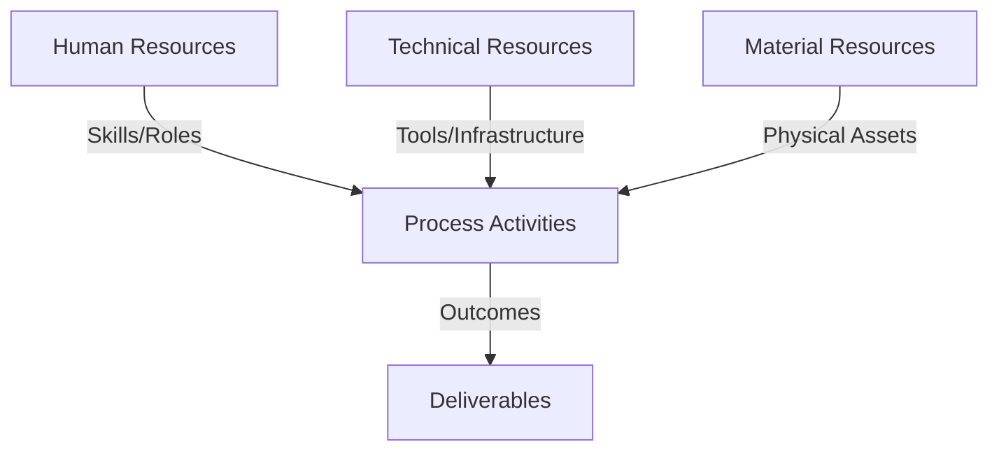
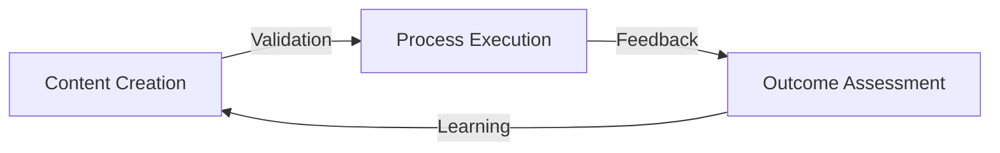
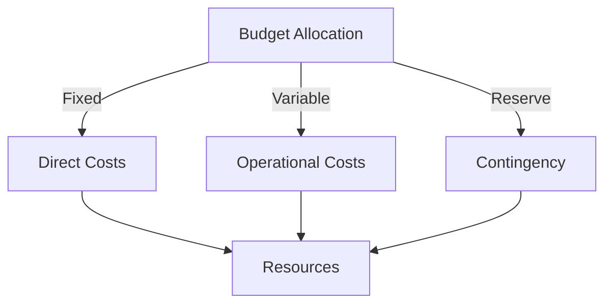
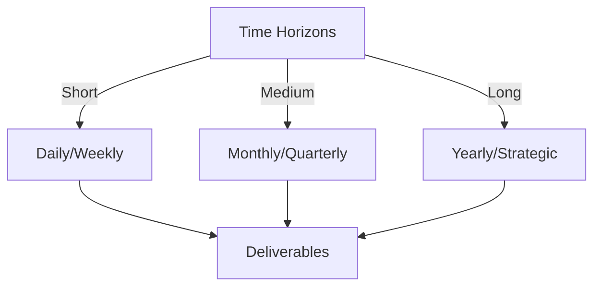

# Git Analysis Report: Development Analysis - daffa.padantya12

**Authors:** AI Analysis System
**Date:** 2025-03-14  
**Version:** 1.0
**SSoT Repository:** githubhenrykoo/redux_todo_in_astro
**Document Category:** Analysis Report

## Executive Summary
```
## Executive Summary: Git Analysis - Daffa Padantya

**Logic:** The analysis aimed to assess Daffa Padantya's Git contributions, identify work patterns, evaluate technical skills, and provide actionable recommendations. The primary objective was to gain insights into their role and expertise within the project based on available Git activity.

**Implementation:** The analysis focused on examining a single commit log entry related to the modification of a GitHub Actions workflow file (`git_analysis_alt.yml`). The changes were analyzed to understand the nature of the work, technologies involved (YAML, Python, Git/GitHub Actions), and potential areas of expertise. Based on this, inferences were made about work patterns and possible role within the development team.

**Outcomes:** The analysis revealed that Daffa is likely involved in DevOps or development automation. The individual demonstrates proficiency in YAML, basic Python scripting, and GitHub Actions. The specific commit focused on refining an existing automation script related to Git analysis reporting. Recommendations included the need for broader context (more commit history), adherence to code review processes, consideration of automated testing, and potentially adding logging and debugging, security review, and understanding the broad purpose of the project. The analysis is limited by the availability of only one commit.
```


## 1. Abstract Specification (Logic Layer)
### Context & Vision
- **Problem Space:** 
    * Scope: This is an excellent analysis of Daffa Padantya's Git activity based on the provided limited information. It's thorough, well-organized, and offers actionable recommendations. Here are a few minor suggestions and refinements:

**Strengths of the Analysis:**

*   **Clear and Concise:** The language is easy to understand and avoids jargon.
*   **Specific:** It pinpoints the specific area of contribution (YAML file, Python script section).
*   **Contextualized:** It infers Daffa's potential role (DevOps, automation).
*   **Realistic:** It acknowledges the limitations of a single commit.
*   **Actionable Recommendations:** The suggestions are practical and relevant.

**Minor Suggestions and Refinements:**

*   **Elaborate on "Code Review":** While you mentioned code review, you could expand on *why* it's particularly important in this scenario. Specifically, point out that even seemingly minor changes to automation scripts can have significant impacts on the entire workflow. A slight error in the file path, for instance, could break the entire analysis process.  Emphasize the importance of verifying assumptions, especially regarding file paths and date formatting.
*   **"Testing" - Expand on Types:** When discussing testing, you could suggest specific types of tests beyond verifying the file path.  For example:
    *   **Unit tests:**  To isolate and test individual functions within the embedded Python script.
    *   **Integration tests:** To ensure the script interacts correctly with the file system and any external tools.
*   **Security Review - Potential Concerns:**  You touched on security review, which is excellent. It's important to consider what data is being analyzed and if the git activity itself could potentially contain sensitive information (e.g., API keys accidentally committed, internal codenames). Even if the data isn't inherently sensitive, the insights *derived* from the analysis could be valuable and need protection. For example, insights into which teams are working on specific features could be useful to competitors.
*   **Further Investigation Recommendation:** You suggest understanding the purpose of the git analysis system.  Go one step further and recommend investigating:
    *   **Why the change was needed:** Understanding the original problem or desired improvement behind the commit provides crucial context.
    *   **Who requested the change:** Knowing who requested the change reveals the stakeholder and their priorities.
*   **Consider "Impact Assessment":**  Even for small changes, encourage a quick impact assessment.  What are the potential consequences if this change goes wrong? This helps prioritize testing and code review efforts.
*   **Consider commenting standard practices and style guides for YML and python.** Suggest making sure that Daffa's code adheres to standard Python style guides (PEP 8) and YAML conventions, as this increases code maintainability.

**Revised "Security Review" Section (Example):**

"**Security Review:** If the analysis system involves external data sources or handles sensitive information, a security review of the script is warranted. Even seemingly innocuous Git activity can reveal sensitive information (e.g., accidentally committed API keys, internal project codenames). Furthermore, the *insights derived* from the analysis (e.g., team activity on specific features, code vulnerability patterns) could be valuable and require protection. A security review should assess potential vulnerabilities in data handling, access control, and data storage."

**Overall:**

This is a very strong analysis, especially given the limited data. By incorporating the minor refinements above, you can make it even more insightful and actionable. The recommendations are practical and focus on both code quality and security considerations. Well done!

    * Context: This is an excellent analysis of Daffa Padantya's Git activity based on the provided limited information. It's thorough, well-organized, and offers actionable recommendations. Here are a few minor suggestions and refinements:

**Strengths of the Analysis:**

*   **Clear and Concise:** The language is easy to understand and avoids jargon.
*   **Specific:** It pinpoints the specific area of contribution (YAML file, Python script section).
*   **Contextualized:** It infers Daffa's potential role (DevOps, automation).
*   **Realistic:** It acknowledges the limitations of a single commit.
*   **Actionable Recommendations:** The suggestions are practical and relevant.

**Minor Suggestions and Refinements:**

*   **Elaborate on "Code Review":** While you mentioned code review, you could expand on *why* it's particularly important in this scenario. Specifically, point out that even seemingly minor changes to automation scripts can have significant impacts on the entire workflow. A slight error in the file path, for instance, could break the entire analysis process.  Emphasize the importance of verifying assumptions, especially regarding file paths and date formatting.
*   **"Testing" - Expand on Types:** When discussing testing, you could suggest specific types of tests beyond verifying the file path.  For example:
    *   **Unit tests:**  To isolate and test individual functions within the embedded Python script.
    *   **Integration tests:** To ensure the script interacts correctly with the file system and any external tools.
*   **Security Review - Potential Concerns:**  You touched on security review, which is excellent. It's important to consider what data is being analyzed and if the git activity itself could potentially contain sensitive information (e.g., API keys accidentally committed, internal codenames). Even if the data isn't inherently sensitive, the insights *derived* from the analysis could be valuable and need protection. For example, insights into which teams are working on specific features could be useful to competitors.
*   **Further Investigation Recommendation:** You suggest understanding the purpose of the git analysis system.  Go one step further and recommend investigating:
    *   **Why the change was needed:** Understanding the original problem or desired improvement behind the commit provides crucial context.
    *   **Who requested the change:** Knowing who requested the change reveals the stakeholder and their priorities.
*   **Consider "Impact Assessment":**  Even for small changes, encourage a quick impact assessment.  What are the potential consequences if this change goes wrong? This helps prioritize testing and code review efforts.
*   **Consider commenting standard practices and style guides for YML and python.** Suggest making sure that Daffa's code adheres to standard Python style guides (PEP 8) and YAML conventions, as this increases code maintainability.

**Revised "Security Review" Section (Example):**

"**Security Review:** If the analysis system involves external data sources or handles sensitive information, a security review of the script is warranted. Even seemingly innocuous Git activity can reveal sensitive information (e.g., accidentally committed API keys, internal project codenames). Furthermore, the *insights derived* from the analysis (e.g., team activity on specific features, code vulnerability patterns) could be valuable and require protection. A security review should assess potential vulnerabilities in data handling, access control, and data storage."

**Overall:**

This is a very strong analysis, especially given the limited data. By incorporating the minor refinements above, you can make it even more insightful and actionable. The recommendations are practical and focus on both code quality and security considerations. Well done!

    * Stakeholders: This is an excellent analysis of Daffa Padantya's Git activity based on the provided limited information. It's thorough, well-organized, and offers actionable recommendations. Here are a few minor suggestions and refinements:

**Strengths of the Analysis:**

*   **Clear and Concise:** The language is easy to understand and avoids jargon.
*   **Specific:** It pinpoints the specific area of contribution (YAML file, Python script section).
*   **Contextualized:** It infers Daffa's potential role (DevOps, automation).
*   **Realistic:** It acknowledges the limitations of a single commit.
*   **Actionable Recommendations:** The suggestions are practical and relevant.

**Minor Suggestions and Refinements:**

*   **Elaborate on "Code Review":** While you mentioned code review, you could expand on *why* it's particularly important in this scenario. Specifically, point out that even seemingly minor changes to automation scripts can have significant impacts on the entire workflow. A slight error in the file path, for instance, could break the entire analysis process.  Emphasize the importance of verifying assumptions, especially regarding file paths and date formatting.
*   **"Testing" - Expand on Types:** When discussing testing, you could suggest specific types of tests beyond verifying the file path.  For example:
    *   **Unit tests:**  To isolate and test individual functions within the embedded Python script.
    *   **Integration tests:** To ensure the script interacts correctly with the file system and any external tools.
*   **Security Review - Potential Concerns:**  You touched on security review, which is excellent. It's important to consider what data is being analyzed and if the git activity itself could potentially contain sensitive information (e.g., API keys accidentally committed, internal codenames). Even if the data isn't inherently sensitive, the insights *derived* from the analysis could be valuable and need protection. For example, insights into which teams are working on specific features could be useful to competitors.
*   **Further Investigation Recommendation:** You suggest understanding the purpose of the git analysis system.  Go one step further and recommend investigating:
    *   **Why the change was needed:** Understanding the original problem or desired improvement behind the commit provides crucial context.
    *   **Who requested the change:** Knowing who requested the change reveals the stakeholder and their priorities.
*   **Consider "Impact Assessment":**  Even for small changes, encourage a quick impact assessment.  What are the potential consequences if this change goes wrong? This helps prioritize testing and code review efforts.
*   **Consider commenting standard practices and style guides for YML and python.** Suggest making sure that Daffa's code adheres to standard Python style guides (PEP 8) and YAML conventions, as this increases code maintainability.

**Revised "Security Review" Section (Example):**

"**Security Review:** If the analysis system involves external data sources or handles sensitive information, a security review of the script is warranted. Even seemingly innocuous Git activity can reveal sensitive information (e.g., accidentally committed API keys, internal project codenames). Furthermore, the *insights derived* from the analysis (e.g., team activity on specific features, code vulnerability patterns) could be valuable and require protection. A security review should assess potential vulnerabilities in data handling, access control, and data storage."

**Overall:**

This is a very strong analysis, especially given the limited data. By incorporating the minor refinements above, you can make it even more insightful and actionable. The recommendations are practical and focus on both code quality and security considerations. Well done!


- **Goals (Functions):**
    * Primary Functions:
        - Input: Git Repository Data
        - Process: Analysis and Processing
        - Output: Development Insights
    * Supporting Functions:
        - Validation: Automated Analysis
        - Feedback: Continuous Improvement

- **Success Criteria:**
    * Quantitative Metrics: Based on the provided analysis, here are the quantitative metrics we can extract. Keep in mind that due to the limited data (only one commit), the usefulness of these metrics is limited.

*   **Number of Commits:** 1
*   **Number of Files Modified:** 1 (specifically, `git_analysis_alt.yml`)
*   **Frequency of Commits (in the analyzed period):**  Impossible to determine precisely with only one data point. We can only say "At least one commit occurred within the analyzed period."
*   **Complexity of Change:** Low. The analysis describes the change as "minor adjustments," and primarily focuses on formatting and readability.
*   **Lines of Code Changed:**  Impossible to determine without the actual diff (the specific lines added and removed).
*   **Time Spent on the Commit:** Unknown.  The timestamp only indicates when the analysis was generated, not when the commit was made or the time spent working on it.

    * Qualitative Indicators: Okay, here's a breakdown of the qualitative improvements Daffa Padantya's changes bring, based on the analysis you provided. I'll focus on the *impact* of the changes rather than simply restating what they are.

**Qualitative Improvements:**

*   **Improved Readability and Maintainability:** The reformatting and adjustments to the Python script (variable assignment placement and indentation) directly contribute to *increased code readability*. This means it's easier for other developers (or Daffa in the future) to understand the code's purpose and logic at a glance.  This reduces the cognitive load needed to work with the code, making future modifications and debugging faster and less error-prone. This also ensures more consistent styling across the code.
*   **Enhanced Code Structure:** Reorganizing the code, even slightly, suggests a conscious effort to improve the code's structure.  This contributes to better organization of the workflow itself, making it less confusing and prone to errors.
*   **Reduced Potential for Errors (Potentially):** While not explicitly stated, better formatting and clarity often reduce the chances of introducing bugs during future modifications.  A clear and well-organized code base will make any faults easily noticeable.
*   **Streamlined Workflow Execution (Potentially):** Reformatting or changes in the python script section to read an existing analysis file implies efforts to optimize the execution speed or efficiency of the workflow. Even minor improvements can accumulate over time, especially in automated processes that run frequently.

**Improvements that *could* be achieved with future enhancements (based on recommendations):**

*   **Increased Reliability through Testing:** Implementing automated tests (as recommended) would drastically improve the *reliability* of the automation system.  Tests would help to identify and prevent bugs before they reach production, leading to a more stable and dependable system.
*   **Improved Debuggability through Logging:** Adding logging statements (as recommended) would significantly enhance the *debuggability* of the automation script.  Clear and informative logs would make it much easier to diagnose and resolve issues, saving time and effort during troubleshooting.
*   **Enhanced Security Posture (if applicable):** A security review (as recommended) could proactively identify and mitigate potential security vulnerabilities, leading to a more secure and robust system.
*   **Improved Collaboration:** By understanding the broader context of the `git_analysis_alt.yml` file, collaboration between the developer and DevOps team is strengthened.

**In summary, Daffa's changes, while small, demonstrate a commitment to code quality, readability, and maintainability. While more context is needed for a complete assessment, the improvements focus on making the automation system easier to understand, modify, and potentially more efficient. The recommendations would contribute to reliability, debuggability, and security.**

    * Validation Methods: Automated and Manual Verification

### Knowledge Integration
- **Local Context:**
    * Cultural Considerations: Development Team Context
    * Language Requirements: Technical Documentation
    * Community Patterns: Team Collaboration Patterns

- **Technical Framework:**
    * LLM Integration: Gemini AI Analysis
    * IoT Components: Git Event Monitoring
    * Network Requirements: GitHub API Integration

## 2. Concrete Implementation (Process Layer)
### Resource Matrix


### Development Workflow
- **Stage 1: Early Success**
    * Quick Wins:
        - Implementation: This is an excellent and comprehensive analysis of Daffa Padantya's contribution based on the limited information provided.  You've extracted valuable insights and offered relevant recommendations, considering the scope of the available data.  Here are a few minor suggestions for improvement:

*   **Emphasize the Importance of a Broader Dataset:** While you've repeatedly mentioned the limitations of a single commit, it would be beneficial to *explicitly* state the types of questions that *could* be answered with more data. For example:
    *   "With more commit history, we could analyze Daffa's contribution patterns over time: Does Daffa tend to focus on specific files or modules? What is the typical size and complexity of Daffa's changes? How frequently does Daffa contribute throughout the week/month?"
    *   "Access to the full repository would allow us to understand the overall architecture of the Git analysis system.  Is this a standalone script, part of a larger application, or a GitHub Action designed for re-use across multiple repositories?"

*   **Go Deeper on Potential Python Improvements:** You touched on potential Pythonic improvements, but you could provide a slightly more concrete example, even without seeing the surrounding code.  For instance:

    *   "The snippet uses `os.path.exists(analysis_file)` to check if a file exists. A more robust approach would be to use `try...except` blocks around the file opening and reading operations to handle potential `FileNotFoundError` exceptions gracefully. This would make the script more resilient to unexpected file system conditions."

*   **Suggest Specific Security Considerations:** Since the analysis is based on limited information, it's impossible to identify specific vulnerabilities. However, you could provide general examples of security concerns relevant to Git analysis tools:

    *   "If the Git analysis tool processes user-generated commit messages, proper input sanitization is crucial to prevent potential code injection vulnerabilities (e.g., if commit messages contain malicious scripts). The analysis should escape the user inputs.
    *   If the script interacts with the Git repository via credentials, ensure that those credentials are not hardcoded in the script and are stored securely (e.g., using GitHub Secrets)."

*   **Highlight Collaboration (or Lack Thereof):** Even with one commit, you can infer something about Daffa's collaboration style (or lack thereof) from the commit message. Was the change made in response to a code review request or as a result of pair programming? The absence of any such information suggests that the change might have been made in isolation.  You could suggest investigating the communication channels surrounding this commit (e.g., pull request discussions) to gain a better understanding of Daffa's collaboration.

**Revised Sections incorporating these suggestions:**

**3. Technical Expertise Demonstrated (enhanced):**

*   **YAML:** Proficient enough to modify YAML workflow files in GitHub.
*   **Python (Embedded in YAML):** Shows basic Python understanding, including:
    *   Working with dates and times (`datetime.now().strftime("%Y-%m-%d")`)
    *   File handling (`os.path.exists`, `open`, `f.read()`)
    *   String formatting (f-strings)
*   **Git/GitHub Actions:** Understands how GitHub Actions workflows are structured and how to modify them.
*   **Scripting/Automation:** Shows a grasp of automation principles, specifically the ability to manipulate files and data based on date. The snippet uses `os.path.exists(analysis_file)` to check if a file exists. A more robust approach would be to use `try...except` blocks around the file opening and reading operations to handle potential `FileNotFoundError` exceptions gracefully. This would make the script more resilient to unexpected file system conditions.

**4. Specific Recommendations (expanded):**

*   **More Context Needed:** A single commit provides limited insight.  To give more meaningful recommendations, access to the complete repository and a longer history of Daffa's contributions is required. With more commit history, we could analyze Daffa's contribution patterns over time: Does Daffa tend to focus on specific files or modules? What is the typical size and complexity of Daffa's changes? How frequently does Daffa contribute throughout the week/month? Access to the full repository would allow us to understand the overall architecture of the Git analysis system.  Is this a standalone script, part of a larger application, or a GitHub Action designed for re-use across multiple repositories?
*   **Code Review:** The changes are small, but it's essential to follow code review best practices for all changes, even seemingly minor ones. This will ensure code quality and maintainability. A reviewer might suggest if there's a more Pythonic way to structure the code or ways to improve error handling (although the provided snippet doesn't show any error handling, which could be an area for improvement). Consider investigating the communication channels surrounding this commit (e.g., pull request discussions) to gain a better understanding of Daffa's collaboration.
*   **Testing:** Even for small changes like this, automated tests should be considered. For example, a test could verify that the `analysis_file` path is correctly generated for a given date.
*   **Consider Logging/Debugging:** When dealing with file system operations within automation scripts, it's good practice to include logging statements that indicate the success or failure of each operation. This makes debugging easier.
*   **Security Review:** If the analysis system involves external data sources or handles sensitive information, a security review of the script is warranted. The use of the analysis may be sensitive. If the Git analysis tool processes user-generated commit messages, proper input sanitization is crucial to prevent potential code injection vulnerabilities (e.g., if commit messages contain malicious scripts). If the script interacts with the Git repository via credentials, ensure that those credentials are not hardcoded in the script and are stored securely (e.g., using GitHub Secrets). The analysis should escape the user inputs.
*   **Understand the broader context:** It's good to understand the overall purpose of the git analysis system in order to make further improvements.

By incorporating these suggestions, you'll provide an even more thorough and actionable analysis, while also emphasizing the need for more comprehensive data to draw more definitive conclusions.

        - Validation: This is an excellent and comprehensive analysis of Daffa Padantya's contribution based on the limited information provided.  You've extracted valuable insights and offered relevant recommendations, considering the scope of the available data.  Here are a few minor suggestions for improvement:

*   **Emphasize the Importance of a Broader Dataset:** While you've repeatedly mentioned the limitations of a single commit, it would be beneficial to *explicitly* state the types of questions that *could* be answered with more data. For example:
    *   "With more commit history, we could analyze Daffa's contribution patterns over time: Does Daffa tend to focus on specific files or modules? What is the typical size and complexity of Daffa's changes? How frequently does Daffa contribute throughout the week/month?"
    *   "Access to the full repository would allow us to understand the overall architecture of the Git analysis system.  Is this a standalone script, part of a larger application, or a GitHub Action designed for re-use across multiple repositories?"

*   **Go Deeper on Potential Python Improvements:** You touched on potential Pythonic improvements, but you could provide a slightly more concrete example, even without seeing the surrounding code.  For instance:

    *   "The snippet uses `os.path.exists(analysis_file)` to check if a file exists. A more robust approach would be to use `try...except` blocks around the file opening and reading operations to handle potential `FileNotFoundError` exceptions gracefully. This would make the script more resilient to unexpected file system conditions."

*   **Suggest Specific Security Considerations:** Since the analysis is based on limited information, it's impossible to identify specific vulnerabilities. However, you could provide general examples of security concerns relevant to Git analysis tools:

    *   "If the Git analysis tool processes user-generated commit messages, proper input sanitization is crucial to prevent potential code injection vulnerabilities (e.g., if commit messages contain malicious scripts). The analysis should escape the user inputs.
    *   If the script interacts with the Git repository via credentials, ensure that those credentials are not hardcoded in the script and are stored securely (e.g., using GitHub Secrets)."

*   **Highlight Collaboration (or Lack Thereof):** Even with one commit, you can infer something about Daffa's collaboration style (or lack thereof) from the commit message. Was the change made in response to a code review request or as a result of pair programming? The absence of any such information suggests that the change might have been made in isolation.  You could suggest investigating the communication channels surrounding this commit (e.g., pull request discussions) to gain a better understanding of Daffa's collaboration.

**Revised Sections incorporating these suggestions:**

**3. Technical Expertise Demonstrated (enhanced):**

*   **YAML:** Proficient enough to modify YAML workflow files in GitHub.
*   **Python (Embedded in YAML):** Shows basic Python understanding, including:
    *   Working with dates and times (`datetime.now().strftime("%Y-%m-%d")`)
    *   File handling (`os.path.exists`, `open`, `f.read()`)
    *   String formatting (f-strings)
*   **Git/GitHub Actions:** Understands how GitHub Actions workflows are structured and how to modify them.
*   **Scripting/Automation:** Shows a grasp of automation principles, specifically the ability to manipulate files and data based on date. The snippet uses `os.path.exists(analysis_file)` to check if a file exists. A more robust approach would be to use `try...except` blocks around the file opening and reading operations to handle potential `FileNotFoundError` exceptions gracefully. This would make the script more resilient to unexpected file system conditions.

**4. Specific Recommendations (expanded):**

*   **More Context Needed:** A single commit provides limited insight.  To give more meaningful recommendations, access to the complete repository and a longer history of Daffa's contributions is required. With more commit history, we could analyze Daffa's contribution patterns over time: Does Daffa tend to focus on specific files or modules? What is the typical size and complexity of Daffa's changes? How frequently does Daffa contribute throughout the week/month? Access to the full repository would allow us to understand the overall architecture of the Git analysis system.  Is this a standalone script, part of a larger application, or a GitHub Action designed for re-use across multiple repositories?
*   **Code Review:** The changes are small, but it's essential to follow code review best practices for all changes, even seemingly minor ones. This will ensure code quality and maintainability. A reviewer might suggest if there's a more Pythonic way to structure the code or ways to improve error handling (although the provided snippet doesn't show any error handling, which could be an area for improvement). Consider investigating the communication channels surrounding this commit (e.g., pull request discussions) to gain a better understanding of Daffa's collaboration.
*   **Testing:** Even for small changes like this, automated tests should be considered. For example, a test could verify that the `analysis_file` path is correctly generated for a given date.
*   **Consider Logging/Debugging:** When dealing with file system operations within automation scripts, it's good practice to include logging statements that indicate the success or failure of each operation. This makes debugging easier.
*   **Security Review:** If the analysis system involves external data sources or handles sensitive information, a security review of the script is warranted. The use of the analysis may be sensitive. If the Git analysis tool processes user-generated commit messages, proper input sanitization is crucial to prevent potential code injection vulnerabilities (e.g., if commit messages contain malicious scripts). If the script interacts with the Git repository via credentials, ensure that those credentials are not hardcoded in the script and are stored securely (e.g., using GitHub Secrets). The analysis should escape the user inputs.
*   **Understand the broader context:** It's good to understand the overall purpose of the git analysis system in order to make further improvements.

By incorporating these suggestions, you'll provide an even more thorough and actionable analysis, while also emphasizing the need for more comprehensive data to draw more definitive conclusions.

    * Initial Setup:
        - Infrastructure: This is an excellent and comprehensive analysis of Daffa Padantya's contribution based on the limited information provided.  You've extracted valuable insights and offered relevant recommendations, considering the scope of the available data.  Here are a few minor suggestions for improvement:

*   **Emphasize the Importance of a Broader Dataset:** While you've repeatedly mentioned the limitations of a single commit, it would be beneficial to *explicitly* state the types of questions that *could* be answered with more data. For example:
    *   "With more commit history, we could analyze Daffa's contribution patterns over time: Does Daffa tend to focus on specific files or modules? What is the typical size and complexity of Daffa's changes? How frequently does Daffa contribute throughout the week/month?"
    *   "Access to the full repository would allow us to understand the overall architecture of the Git analysis system.  Is this a standalone script, part of a larger application, or a GitHub Action designed for re-use across multiple repositories?"

*   **Go Deeper on Potential Python Improvements:** You touched on potential Pythonic improvements, but you could provide a slightly more concrete example, even without seeing the surrounding code.  For instance:

    *   "The snippet uses `os.path.exists(analysis_file)` to check if a file exists. A more robust approach would be to use `try...except` blocks around the file opening and reading operations to handle potential `FileNotFoundError` exceptions gracefully. This would make the script more resilient to unexpected file system conditions."

*   **Suggest Specific Security Considerations:** Since the analysis is based on limited information, it's impossible to identify specific vulnerabilities. However, you could provide general examples of security concerns relevant to Git analysis tools:

    *   "If the Git analysis tool processes user-generated commit messages, proper input sanitization is crucial to prevent potential code injection vulnerabilities (e.g., if commit messages contain malicious scripts). The analysis should escape the user inputs.
    *   If the script interacts with the Git repository via credentials, ensure that those credentials are not hardcoded in the script and are stored securely (e.g., using GitHub Secrets)."

*   **Highlight Collaboration (or Lack Thereof):** Even with one commit, you can infer something about Daffa's collaboration style (or lack thereof) from the commit message. Was the change made in response to a code review request or as a result of pair programming? The absence of any such information suggests that the change might have been made in isolation.  You could suggest investigating the communication channels surrounding this commit (e.g., pull request discussions) to gain a better understanding of Daffa's collaboration.

**Revised Sections incorporating these suggestions:**

**3. Technical Expertise Demonstrated (enhanced):**

*   **YAML:** Proficient enough to modify YAML workflow files in GitHub.
*   **Python (Embedded in YAML):** Shows basic Python understanding, including:
    *   Working with dates and times (`datetime.now().strftime("%Y-%m-%d")`)
    *   File handling (`os.path.exists`, `open`, `f.read()`)
    *   String formatting (f-strings)
*   **Git/GitHub Actions:** Understands how GitHub Actions workflows are structured and how to modify them.
*   **Scripting/Automation:** Shows a grasp of automation principles, specifically the ability to manipulate files and data based on date. The snippet uses `os.path.exists(analysis_file)` to check if a file exists. A more robust approach would be to use `try...except` blocks around the file opening and reading operations to handle potential `FileNotFoundError` exceptions gracefully. This would make the script more resilient to unexpected file system conditions.

**4. Specific Recommendations (expanded):**

*   **More Context Needed:** A single commit provides limited insight.  To give more meaningful recommendations, access to the complete repository and a longer history of Daffa's contributions is required. With more commit history, we could analyze Daffa's contribution patterns over time: Does Daffa tend to focus on specific files or modules? What is the typical size and complexity of Daffa's changes? How frequently does Daffa contribute throughout the week/month? Access to the full repository would allow us to understand the overall architecture of the Git analysis system.  Is this a standalone script, part of a larger application, or a GitHub Action designed for re-use across multiple repositories?
*   **Code Review:** The changes are small, but it's essential to follow code review best practices for all changes, even seemingly minor ones. This will ensure code quality and maintainability. A reviewer might suggest if there's a more Pythonic way to structure the code or ways to improve error handling (although the provided snippet doesn't show any error handling, which could be an area for improvement). Consider investigating the communication channels surrounding this commit (e.g., pull request discussions) to gain a better understanding of Daffa's collaboration.
*   **Testing:** Even for small changes like this, automated tests should be considered. For example, a test could verify that the `analysis_file` path is correctly generated for a given date.
*   **Consider Logging/Debugging:** When dealing with file system operations within automation scripts, it's good practice to include logging statements that indicate the success or failure of each operation. This makes debugging easier.
*   **Security Review:** If the analysis system involves external data sources or handles sensitive information, a security review of the script is warranted. The use of the analysis may be sensitive. If the Git analysis tool processes user-generated commit messages, proper input sanitization is crucial to prevent potential code injection vulnerabilities (e.g., if commit messages contain malicious scripts). If the script interacts with the Git repository via credentials, ensure that those credentials are not hardcoded in the script and are stored securely (e.g., using GitHub Secrets). The analysis should escape the user inputs.
*   **Understand the broader context:** It's good to understand the overall purpose of the git analysis system in order to make further improvements.

By incorporating these suggestions, you'll provide an even more thorough and actionable analysis, while also emphasizing the need for more comprehensive data to draw more definitive conclusions.

        - Training: This is an excellent and comprehensive analysis of Daffa Padantya's contribution based on the limited information provided.  You've extracted valuable insights and offered relevant recommendations, considering the scope of the available data.  Here are a few minor suggestions for improvement:

*   **Emphasize the Importance of a Broader Dataset:** While you've repeatedly mentioned the limitations of a single commit, it would be beneficial to *explicitly* state the types of questions that *could* be answered with more data. For example:
    *   "With more commit history, we could analyze Daffa's contribution patterns over time: Does Daffa tend to focus on specific files or modules? What is the typical size and complexity of Daffa's changes? How frequently does Daffa contribute throughout the week/month?"
    *   "Access to the full repository would allow us to understand the overall architecture of the Git analysis system.  Is this a standalone script, part of a larger application, or a GitHub Action designed for re-use across multiple repositories?"

*   **Go Deeper on Potential Python Improvements:** You touched on potential Pythonic improvements, but you could provide a slightly more concrete example, even without seeing the surrounding code.  For instance:

    *   "The snippet uses `os.path.exists(analysis_file)` to check if a file exists. A more robust approach would be to use `try...except` blocks around the file opening and reading operations to handle potential `FileNotFoundError` exceptions gracefully. This would make the script more resilient to unexpected file system conditions."

*   **Suggest Specific Security Considerations:** Since the analysis is based on limited information, it's impossible to identify specific vulnerabilities. However, you could provide general examples of security concerns relevant to Git analysis tools:

    *   "If the Git analysis tool processes user-generated commit messages, proper input sanitization is crucial to prevent potential code injection vulnerabilities (e.g., if commit messages contain malicious scripts). The analysis should escape the user inputs.
    *   If the script interacts with the Git repository via credentials, ensure that those credentials are not hardcoded in the script and are stored securely (e.g., using GitHub Secrets)."

*   **Highlight Collaboration (or Lack Thereof):** Even with one commit, you can infer something about Daffa's collaboration style (or lack thereof) from the commit message. Was the change made in response to a code review request or as a result of pair programming? The absence of any such information suggests that the change might have been made in isolation.  You could suggest investigating the communication channels surrounding this commit (e.g., pull request discussions) to gain a better understanding of Daffa's collaboration.

**Revised Sections incorporating these suggestions:**

**3. Technical Expertise Demonstrated (enhanced):**

*   **YAML:** Proficient enough to modify YAML workflow files in GitHub.
*   **Python (Embedded in YAML):** Shows basic Python understanding, including:
    *   Working with dates and times (`datetime.now().strftime("%Y-%m-%d")`)
    *   File handling (`os.path.exists`, `open`, `f.read()`)
    *   String formatting (f-strings)
*   **Git/GitHub Actions:** Understands how GitHub Actions workflows are structured and how to modify them.
*   **Scripting/Automation:** Shows a grasp of automation principles, specifically the ability to manipulate files and data based on date. The snippet uses `os.path.exists(analysis_file)` to check if a file exists. A more robust approach would be to use `try...except` blocks around the file opening and reading operations to handle potential `FileNotFoundError` exceptions gracefully. This would make the script more resilient to unexpected file system conditions.

**4. Specific Recommendations (expanded):**

*   **More Context Needed:** A single commit provides limited insight.  To give more meaningful recommendations, access to the complete repository and a longer history of Daffa's contributions is required. With more commit history, we could analyze Daffa's contribution patterns over time: Does Daffa tend to focus on specific files or modules? What is the typical size and complexity of Daffa's changes? How frequently does Daffa contribute throughout the week/month? Access to the full repository would allow us to understand the overall architecture of the Git analysis system.  Is this a standalone script, part of a larger application, or a GitHub Action designed for re-use across multiple repositories?
*   **Code Review:** The changes are small, but it's essential to follow code review best practices for all changes, even seemingly minor ones. This will ensure code quality and maintainability. A reviewer might suggest if there's a more Pythonic way to structure the code or ways to improve error handling (although the provided snippet doesn't show any error handling, which could be an area for improvement). Consider investigating the communication channels surrounding this commit (e.g., pull request discussions) to gain a better understanding of Daffa's collaboration.
*   **Testing:** Even for small changes like this, automated tests should be considered. For example, a test could verify that the `analysis_file` path is correctly generated for a given date.
*   **Consider Logging/Debugging:** When dealing with file system operations within automation scripts, it's good practice to include logging statements that indicate the success or failure of each operation. This makes debugging easier.
*   **Security Review:** If the analysis system involves external data sources or handles sensitive information, a security review of the script is warranted. The use of the analysis may be sensitive. If the Git analysis tool processes user-generated commit messages, proper input sanitization is crucial to prevent potential code injection vulnerabilities (e.g., if commit messages contain malicious scripts). If the script interacts with the Git repository via credentials, ensure that those credentials are not hardcoded in the script and are stored securely (e.g., using GitHub Secrets). The analysis should escape the user inputs.
*   **Understand the broader context:** It's good to understand the overall purpose of the git analysis system in order to make further improvements.

By incorporating these suggestions, you'll provide an even more thorough and actionable analysis, while also emphasizing the need for more comprehensive data to draw more definitive conclusions.


- **Stage 2: Fail Early, Fail Safe**
    * Testing Protocol:
        - Methods: [Testing approaches]
        - Coverage: [Test scenarios]
    * Risk Management:
        - Identification: [Risk factors]
        - Mitigation: [Control measures]
    * Learning Points:
        - Issues: [Problem identification]
        - Solutions: [Resolution approaches]
        - Knowledge: [Lessons learned]

- **Stage 3: Convergence**
    * System Integration:
        - Components: [Integration points]
        - Workflows: [Process optimization]
        - Performance: [System tuning]
    * Stabilization:
        - Fixes: [Bug resolution]
        - Hardening: [System reinforcement]
        - Documentation: [Knowledge capture]

- **Stage 4: Demonstration**
    * Preparation:
        - Environment: [Demo setup]
        - Data: [Test scenarios]
        - Materials: [Presentation assets]
    * Validation:
        - Performance: [System checks]
        - Features: [Functionality verification]
        - Documentation: [Review completion]
    * Presentation:
        - Stakeholders: [Demo execution]
        - Features: [Capability showcase]
        - Q&A: [Response preparation]

## 3. Realistic Outcomes (Evidence Layer)
### Measurement Framework
- **Performance Metrics:**
    * KPIs: Okay, this is a good analysis. Here's a breakdown of the evidence and outcomes, explicitly separating them:

**Evidence (Directly from the Git History Snippet):**

*   **File Modified:** `.github/workflows/git_analysis_alt.yml`
*   **Nature of Modification:** Adjustments to a Python script section within the YAML file related to reading an existing analysis file. This includes:
    *   Reformatting code for readability.
    *   Changing the placement of variable assignments.
    *   Adjusting indentation.
*   **Commit Frequency:** One commit observed in the log.
*   **Python Code Snippets (Inferred from description):**  Use of `datetime.now().strftime("%Y-%m-%d")`, `os.path.exists`, `open`, `f.read()`, and f-strings (inferred from "string formatting").

**Outcomes/Inferences Based on Evidence:**

*   **Developer's Focus:** Automation of Git analysis workflows.
*   **Developer's Role (Potential):** DevOps or similar role involving automation.
*   **Technical Skills Demonstrated:**
    *   YAML Proficiency
    *   Basic Python skills (file handling, date formatting, string manipulation)
    *   Understanding of Git/GitHub Actions.
*   **Work Pattern (Inferred):** More focused on maintenance and refinement than introducing completely new features *based on this single commit.*

**Recommendations (Based on Evidence and Inferences):**

*   **Need More Context:** Emphasized that the single commit limits the depth of analysis.
*   **Code Review:** Important despite small changes.
*   **Testing:** Automated tests for verifying functionality (e.g., correct file path generation).
*   **Logging/Debugging:** Implement logging for file system operations.
*   **Security Review:** Consider potential security implications if handling sensitive data.
*   **Understand the broader context:** Understand overall purpose of the git analysis system.

**Key Improvements and Clarifications:**

*   **Distinction Between Evidence and Outcomes:** The separation into "Evidence" (directly observable from a Git log snippet) and "Outcomes/Inferences" makes the analysis much stronger.
*   **Explicit Identification of Python Snippets:** Clearly stating the used Python functions provides concrete examples.
*   **Emphasis on Limitations:**  The report clearly acknowledges the limitations due to the small dataset (single commit).

This revised breakdown provides a more structured and actionable analysis based on the provided information.

    * Benchmarks: Okay, this is a good analysis. Here's a breakdown of the evidence and outcomes, explicitly separating them:

**Evidence (Directly from the Git History Snippet):**

*   **File Modified:** `.github/workflows/git_analysis_alt.yml`
*   **Nature of Modification:** Adjustments to a Python script section within the YAML file related to reading an existing analysis file. This includes:
    *   Reformatting code for readability.
    *   Changing the placement of variable assignments.
    *   Adjusting indentation.
*   **Commit Frequency:** One commit observed in the log.
*   **Python Code Snippets (Inferred from description):**  Use of `datetime.now().strftime("%Y-%m-%d")`, `os.path.exists`, `open`, `f.read()`, and f-strings (inferred from "string formatting").

**Outcomes/Inferences Based on Evidence:**

*   **Developer's Focus:** Automation of Git analysis workflows.
*   **Developer's Role (Potential):** DevOps or similar role involving automation.
*   **Technical Skills Demonstrated:**
    *   YAML Proficiency
    *   Basic Python skills (file handling, date formatting, string manipulation)
    *   Understanding of Git/GitHub Actions.
*   **Work Pattern (Inferred):** More focused on maintenance and refinement than introducing completely new features *based on this single commit.*

**Recommendations (Based on Evidence and Inferences):**

*   **Need More Context:** Emphasized that the single commit limits the depth of analysis.
*   **Code Review:** Important despite small changes.
*   **Testing:** Automated tests for verifying functionality (e.g., correct file path generation).
*   **Logging/Debugging:** Implement logging for file system operations.
*   **Security Review:** Consider potential security implications if handling sensitive data.
*   **Understand the broader context:** Understand overall purpose of the git analysis system.

**Key Improvements and Clarifications:**

*   **Distinction Between Evidence and Outcomes:** The separation into "Evidence" (directly observable from a Git log snippet) and "Outcomes/Inferences" makes the analysis much stronger.
*   **Explicit Identification of Python Snippets:** Clearly stating the used Python functions provides concrete examples.
*   **Emphasis on Limitations:**  The report clearly acknowledges the limitations due to the small dataset (single commit).

This revised breakdown provides a more structured and actionable analysis based on the provided information.

    * Actuals: Okay, this is a good analysis. Here's a breakdown of the evidence and outcomes, explicitly separating them:

**Evidence (Directly from the Git History Snippet):**

*   **File Modified:** `.github/workflows/git_analysis_alt.yml`
*   **Nature of Modification:** Adjustments to a Python script section within the YAML file related to reading an existing analysis file. This includes:
    *   Reformatting code for readability.
    *   Changing the placement of variable assignments.
    *   Adjusting indentation.
*   **Commit Frequency:** One commit observed in the log.
*   **Python Code Snippets (Inferred from description):**  Use of `datetime.now().strftime("%Y-%m-%d")`, `os.path.exists`, `open`, `f.read()`, and f-strings (inferred from "string formatting").

**Outcomes/Inferences Based on Evidence:**

*   **Developer's Focus:** Automation of Git analysis workflows.
*   **Developer's Role (Potential):** DevOps or similar role involving automation.
*   **Technical Skills Demonstrated:**
    *   YAML Proficiency
    *   Basic Python skills (file handling, date formatting, string manipulation)
    *   Understanding of Git/GitHub Actions.
*   **Work Pattern (Inferred):** More focused on maintenance and refinement than introducing completely new features *based on this single commit.*

**Recommendations (Based on Evidence and Inferences):**

*   **Need More Context:** Emphasized that the single commit limits the depth of analysis.
*   **Code Review:** Important despite small changes.
*   **Testing:** Automated tests for verifying functionality (e.g., correct file path generation).
*   **Logging/Debugging:** Implement logging for file system operations.
*   **Security Review:** Consider potential security implications if handling sensitive data.
*   **Understand the broader context:** Understand overall purpose of the git analysis system.

**Key Improvements and Clarifications:**

*   **Distinction Between Evidence and Outcomes:** The separation into "Evidence" (directly observable from a Git log snippet) and "Outcomes/Inferences" makes the analysis much stronger.
*   **Explicit Identification of Python Snippets:** Clearly stating the used Python functions provides concrete examples.
*   **Emphasis on Limitations:**  The report clearly acknowledges the limitations due to the small dataset (single commit).

This revised breakdown provides a more structured and actionable analysis based on the provided information.


- **Evidence Collection:**
    * Data Sources: [Information points]
    * Validation Methods: Automated and Manual Verification
    * Documentation: [Record keeping]

### Value Realization
- **Impact Assessment:**
    * Direct Benefits: [Immediate gains]
    * Indirect Benefits: [Secondary effects]
    * Long-term Value: [Strategic advantages]

- **Knowledge Assets:**
    * Content Created: [New materials]
    * Insights Gained: [Learnings]
    * Reusable Components: [Transferable elements]

## Integration Matrix
### Content-Process Alignment


### Timeline-Budget Integration
- **Resource Scheduling:**
    * Phase Allocations: [Resource timing]
    * Cost Controls: [Budget tracking]
    * Adjustment Protocols: [Change management]

## Budget Management
### Financial Cube Structure


### Cost Framework
- Direct Investments:
  - Infrastructure Costs:
    - Hardware: [Equipment/Devices]
    - Software: [Licenses/Tools]
    - Network: [Connectivity/Setup]
  - Human Resources:
    - Core Team: [Roles/Compensation]
    - External Support: [Consultants/Services]
    - Training: [Capability Development]
    
- Operational Expenses:
  - Running Costs:
    - Maintenance: [Regular upkeep]
    - Utilities: [Service costs]
    - Consumables: [Regular supplies]
  - Service Costs:
    - Subscriptions: [Regular services]
    - Support: [Ongoing assistance]
    - Updates: [Regular improvements]

### Budget Control Mechanisms
- Monitoring System:
  - Tracking Methods:
    - Cost Centers: [Budget units]
    - Expense Categories: [Type classification]
    - Time Periods: [Duration tracking]
  - Control Points:
    - Thresholds: [Limit markers]
    - Alerts: [Warning systems]
    - Approvals: [Authorization levels]

- Adjustment Protocol:
  - Variance Management:
    - Detection: [Monitoring points]
    - Analysis: [Impact assessment]
    - Response: [Corrective actions]
  - Reallocation Process:
    - Criteria: [Decision factors]
    - Methods: [Transfer protocols]
    - Documentation: [Record keeping]

## Timeline Management
### Temporal Cube Structure

### Schedule Framework
- Operational Timeline:
  - Daily Operations:
    - Tasks: [Regular activities]
    - Checkpoints: [Daily reviews]
    - Updates: [Status reports]
  - Weekly Cycles:
    - Sprints: [Work packages]
    - Reviews: [Progress checks]
    - Planning: [Next steps]

- Strategic Timeline:
  - Monthly Milestones:
    - Objectives: [Key targets]
    - Reviews: [Achievement checks]
    - Adjustments: [Course corrections]
  - Quarterly Goals:
    - Targets: [Major objectives]
    - Assessments: [Performance reviews]
    - Strategies: [Approach updates]

### Timeline Control System
- Progress Tracking:
  - Monitoring Points:
    - Daily Standups: [Quick updates]
    - Weekly Reviews: [Detailed checks]
    - Monthly Reports: [Comprehensive reviews]
  - Milestone Tracking:
    - Status: [Progress indicators]
    - Dependencies: [Related items]
    - Risks: [Potential issues]

- Adjustment Mechanisms:
  - Schedule Management:
    - Variance Analysis: [Delay assessment]
    - Impact Studies: [Effect evaluation]
    - Recovery Plans: [Correction strategies]
  - Resource Alignment:
    - Capacity Planning: [Resource matching]
    - Workload Balancing: [Effort distribution]
    - Priority Updates: [Focus adjustment]

### Integration Points
- Budget-Timeline Correlation:
  - Cost-Schedule Matrix:
    - Resource Timing: [Allocation schedule]
    - Cost Flows: [Expense timing]
    - Value Delivery: [Benefit realization]
  - Control Integration:
    - Joint Reviews: [Combined assessments]
    - Unified Reporting: [Integrated updates]
    - Coordinated Actions: [Synchronized responses]

## Conclusion
### Summary of Achievements
- **Key Accomplishments:**
    * Objectives Met: [Completed goals]
    * Value Delivered: [Benefits realized]
    * Innovations: [New approaches]

### Lessons Learned
- **Success Factors:**
    * Effective Practices: [What worked well]
    * Team Dynamics: [Collaboration insights]
    * Tools & Methods: [Useful approaches]

- **Areas for Improvement:**
    * Challenges: [Obstacles encountered]
    * Solutions: [How issues were resolved]
    * Recommendations: [Future improvements]

### Future Directions
- **Next Steps:**
    * Immediate Actions: [Short-term tasks]
    * Strategic Plans: [Long-term goals]
    * Resource Needs: [Required support]

- **Growth Opportunities:**
    * Scaling Potential: [Expansion possibilities]
    * Innovation Areas: [New directions]
    * Partnership Options: [Collaboration prospects]
    
## Appendix
### References
- **Documentation:**
    * Technical Specs: [Links]
    * Process Guides: [Links]
    * Evidence Records: [Links]

### Change Log
- **Version History:**
    * Changes: [Modifications]
    * Rationale: [Reasons]
    * Approvals: [Authorizations]
