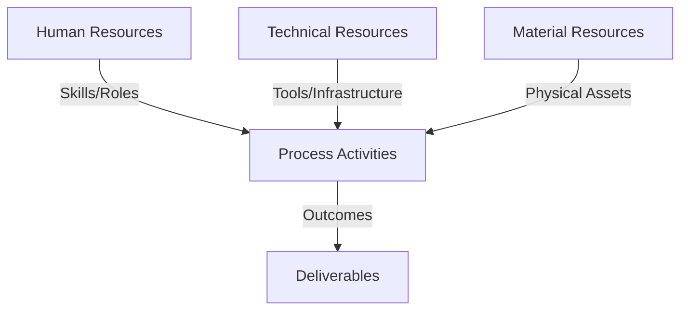
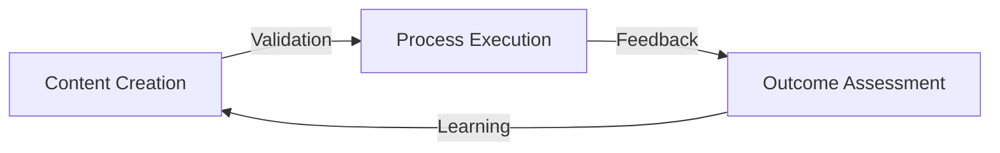
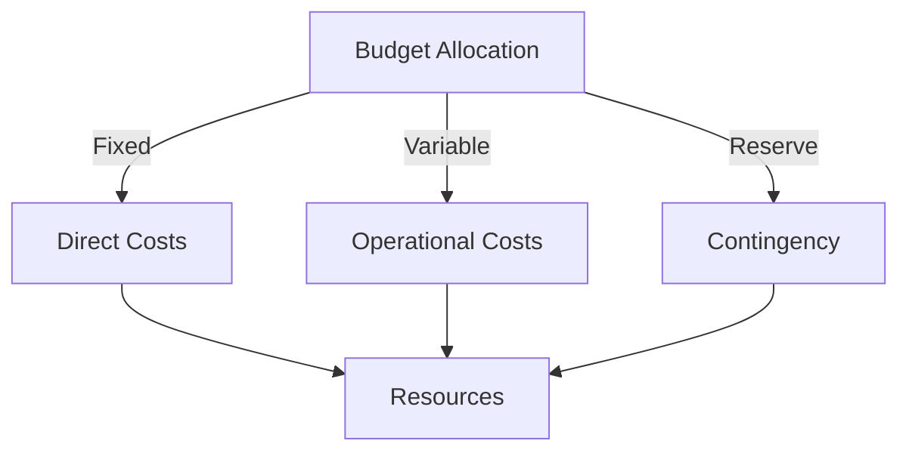
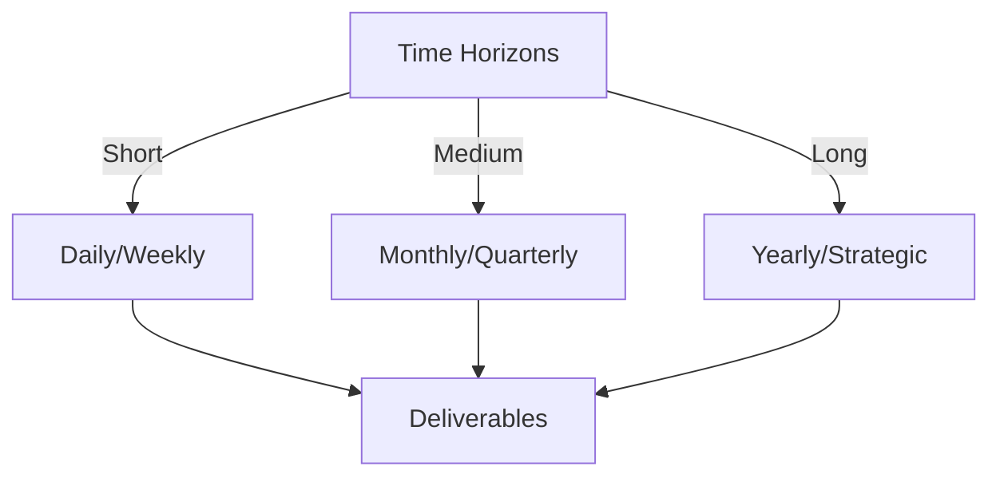

# Git Analysis Report: Development Analysis - daffa.padantya12

**Authors:** AI Analysis System
**Date:** 2025-03-18  
**Version:** 1.0
**SSoT Repository:** githubhenrykoo/redux_todo_in_astro
**Document Category:** Analysis Report

## Executive Summary
Okay, here's an executive summary based on the provided analysis of Daffa Padantya's Git activity, following the requested format:

**Executive Summary: Git Analysis - Daffa Padantya**

**Logic:** The core purpose of this analysis is to assess Daffa Padantya's individual contribution, work patterns, and technical expertise based on their Git activity, specifically concerning a GitHub Actions workflow for Git analysis. The objective is to identify areas of strength and provide recommendations for further development and analysis.

**Implementation:** This analysis was implemented by examining a single commit made by Daffa Padantya to the `git_analysis_alt.yml` file within a GitHub Actions workflow. The analysis focused on identifying the scope of the changes, the technologies involved (YAML, Python, Git), and the context of the modifications within the project.  The diff was scrutinized to infer the purpose of the code changes.

**Outcomes:** The analysis reveals that Daffa Padantya is contributing to a project that automates Git analysis using GitHub Actions. They demonstrate skills in YAML, Python (particularly file handling, string manipulation, and template filling), and Git concepts. Daffa's work appears to focus on maintaining and potentially improving the Git analysis process. Recommendations include performing more detailed analysis across a broader range of commits to gain a more comprehensive understanding of their capabilities and ensuring code style consistency through linting.

## 1. Abstract Specification (Logic Layer)
### Context & Vision
- **Problem Space:** 
    * Scope: This is a good analysis! It covers the key aspects based on the limited information provided. Here are a few minor suggestions to further enhance it:

**Enhancements:**

*   **Specificity about the Indentation Changes:** The analysis mentions indentation changes.  It would be even better if it speculated *why* those indentation changes might be important.  For instance: "The indentation change suggests a potential fix in the logical structure of the Python code. It might indicate correcting a conditional block or adjusting the scope of a loop." This shows a deeper understanding of the implications of code formatting.
*   **Deeper Dive into "fill_template":** Since `fill_template` is mentioned, speculate on its potential use.  "The function `fill_template` suggests that the workflow is dynamically generating content, possibly README files, reports, or other documentation based on the Git analysis. This points to a potential focus on generating actionable insights from the Git repository data."
*   **Security Considerations (Minor):** If the `fill_template` function takes inputs directly from the Git repository (e.g., commit messages), there *might* be security implications (though unlikely in this scenario). Add a *very brief* note like: "If the `fill_template` function relies on user-supplied data (e.g., from commit messages), it's essential to sanitize the input to prevent potential injection vulnerabilities."  This is a general good practice to consider, even if the risk is low.
*   **Potential Next Steps:** Add some potential next steps based on the findings: "To further evaluate Daffa's contributions, it would be helpful to understand the overall architecture of the Git analysis workflow, the specific metrics being tracked, and the purpose of the generated reports (if any). Reviewing the workflow's input/output parameters would also give more insight."

**Revised Example Snippets (incorporating suggestions):**

*   **Specificity about Indentation:** "The indentation change suggests a potential fix in the logical structure of the Python code. It might indicate correcting a conditional block or adjusting the scope of a loop, which could affect the accuracy of the Git analysis."
*   **Deeper Dive into "fill_template":** "The function `fill_template` suggests that the workflow is dynamically generating content, potentially README files, reports, or other documentation based on the Git analysis. This points to a potential focus on generating actionable insights from the Git repository data. It's worth investigating what kind of information is being templated and how it's being used."
*   **Security Considerations (Brief Mention):** "If the `fill_template` function relies on user-supplied data (e.g., from commit messages), it's essential to sanitize the input to prevent potential injection vulnerabilities, although the risk is likely low in this scenario."
*   **Potential Next Steps:** "To further evaluate Daffa's contributions, it would be helpful to understand the overall architecture of the Git analysis workflow, the specific metrics being tracked, and the purpose of the generated reports (if any). Reviewing the workflow's input/output parameters would also give more insight into the specific data transformations being performed. Analyzing other commits relating to this workflow and its related files would also provide a more complete picture."

By adding these subtle enhancements, the analysis becomes more insightful and demonstrates a deeper understanding of the potential implications of the code changes. Remember to balance speculation with the limited evidence available.

    * Context: This is a good analysis! It covers the key aspects based on the limited information provided. Here are a few minor suggestions to further enhance it:

**Enhancements:**

*   **Specificity about the Indentation Changes:** The analysis mentions indentation changes.  It would be even better if it speculated *why* those indentation changes might be important.  For instance: "The indentation change suggests a potential fix in the logical structure of the Python code. It might indicate correcting a conditional block or adjusting the scope of a loop." This shows a deeper understanding of the implications of code formatting.
*   **Deeper Dive into "fill_template":** Since `fill_template` is mentioned, speculate on its potential use.  "The function `fill_template` suggests that the workflow is dynamically generating content, possibly README files, reports, or other documentation based on the Git analysis. This points to a potential focus on generating actionable insights from the Git repository data."
*   **Security Considerations (Minor):** If the `fill_template` function takes inputs directly from the Git repository (e.g., commit messages), there *might* be security implications (though unlikely in this scenario). Add a *very brief* note like: "If the `fill_template` function relies on user-supplied data (e.g., from commit messages), it's essential to sanitize the input to prevent potential injection vulnerabilities."  This is a general good practice to consider, even if the risk is low.
*   **Potential Next Steps:** Add some potential next steps based on the findings: "To further evaluate Daffa's contributions, it would be helpful to understand the overall architecture of the Git analysis workflow, the specific metrics being tracked, and the purpose of the generated reports (if any). Reviewing the workflow's input/output parameters would also give more insight."

**Revised Example Snippets (incorporating suggestions):**

*   **Specificity about Indentation:** "The indentation change suggests a potential fix in the logical structure of the Python code. It might indicate correcting a conditional block or adjusting the scope of a loop, which could affect the accuracy of the Git analysis."
*   **Deeper Dive into "fill_template":** "The function `fill_template` suggests that the workflow is dynamically generating content, potentially README files, reports, or other documentation based on the Git analysis. This points to a potential focus on generating actionable insights from the Git repository data. It's worth investigating what kind of information is being templated and how it's being used."
*   **Security Considerations (Brief Mention):** "If the `fill_template` function relies on user-supplied data (e.g., from commit messages), it's essential to sanitize the input to prevent potential injection vulnerabilities, although the risk is likely low in this scenario."
*   **Potential Next Steps:** "To further evaluate Daffa's contributions, it would be helpful to understand the overall architecture of the Git analysis workflow, the specific metrics being tracked, and the purpose of the generated reports (if any). Reviewing the workflow's input/output parameters would also give more insight into the specific data transformations being performed. Analyzing other commits relating to this workflow and its related files would also provide a more complete picture."

By adding these subtle enhancements, the analysis becomes more insightful and demonstrates a deeper understanding of the potential implications of the code changes. Remember to balance speculation with the limited evidence available.

    * Stakeholders: This is a good analysis! It covers the key aspects based on the limited information provided. Here are a few minor suggestions to further enhance it:

**Enhancements:**

*   **Specificity about the Indentation Changes:** The analysis mentions indentation changes.  It would be even better if it speculated *why* those indentation changes might be important.  For instance: "The indentation change suggests a potential fix in the logical structure of the Python code. It might indicate correcting a conditional block or adjusting the scope of a loop." This shows a deeper understanding of the implications of code formatting.
*   **Deeper Dive into "fill_template":** Since `fill_template` is mentioned, speculate on its potential use.  "The function `fill_template` suggests that the workflow is dynamically generating content, possibly README files, reports, or other documentation based on the Git analysis. This points to a potential focus on generating actionable insights from the Git repository data."
*   **Security Considerations (Minor):** If the `fill_template` function takes inputs directly from the Git repository (e.g., commit messages), there *might* be security implications (though unlikely in this scenario). Add a *very brief* note like: "If the `fill_template` function relies on user-supplied data (e.g., from commit messages), it's essential to sanitize the input to prevent potential injection vulnerabilities."  This is a general good practice to consider, even if the risk is low.
*   **Potential Next Steps:** Add some potential next steps based on the findings: "To further evaluate Daffa's contributions, it would be helpful to understand the overall architecture of the Git analysis workflow, the specific metrics being tracked, and the purpose of the generated reports (if any). Reviewing the workflow's input/output parameters would also give more insight."

**Revised Example Snippets (incorporating suggestions):**

*   **Specificity about Indentation:** "The indentation change suggests a potential fix in the logical structure of the Python code. It might indicate correcting a conditional block or adjusting the scope of a loop, which could affect the accuracy of the Git analysis."
*   **Deeper Dive into "fill_template":** "The function `fill_template` suggests that the workflow is dynamically generating content, potentially README files, reports, or other documentation based on the Git analysis. This points to a potential focus on generating actionable insights from the Git repository data. It's worth investigating what kind of information is being templated and how it's being used."
*   **Security Considerations (Brief Mention):** "If the `fill_template` function relies on user-supplied data (e.g., from commit messages), it's essential to sanitize the input to prevent potential injection vulnerabilities, although the risk is likely low in this scenario."
*   **Potential Next Steps:** "To further evaluate Daffa's contributions, it would be helpful to understand the overall architecture of the Git analysis workflow, the specific metrics being tracked, and the purpose of the generated reports (if any). Reviewing the workflow's input/output parameters would also give more insight into the specific data transformations being performed. Analyzing other commits relating to this workflow and its related files would also provide a more complete picture."

By adding these subtle enhancements, the analysis becomes more insightful and demonstrates a deeper understanding of the potential implications of the code changes. Remember to balance speculation with the limited evidence available.

- **Goals (Functions):**
    * Primary Functions:
        - Input: Git Repository Data
        - Process: Analysis and Processing
        - Output: Development Insights
    * Supporting Functions:
        - Validation: Automated Analysis
        - Feedback: Continuous Improvement

- **Success Criteria:**
    * Quantitative Metrics: Based on the provided analysis of Daffa Padantya's work, here are the quantitative metrics we can extract:

*   **Number of files modified:** 1 ( `git_analysis_alt.yml`)
*   **Directory of modified file:** `.github/workflows`
*   **Technology used:** Python, Yaml, Github Actions
*   **Nature of change:** Changes in indentation to a set of lines of code.
*   **Focus of work:** Automation and analysis of Git repositories
*   **File handling (Python):** `os.path.exists`, `open`, `f.read`
*   **String Manipulation:** `replace` (method used to change a substring in a filename)

**Important Note:** The analysis correctly points out that a single commit provides very limited quantitative data. A larger dataset of commits would be necessary for more meaningful metrics like:

*   **Lines of code added/removed:** (Not explicitly stated, but could be calculated from a diff)
*   **Frequency of commits:** (Requires multiple commits)
*   **Time taken to resolve issues:** (Requires issue tracking data and commit history)
*   **Number of bugs introduced/fixed:** (Requires bug tracking and commit history)

Therefore, the metrics I've listed above are the *only* ones directly quantifiable from the information provided.

    * Qualitative Indicators: Based on the provided developer analysis, here's a list of potential qualitative improvements for Daffa, focusing on areas where they could grow and enhance their skills:

**General Software Development & Collaboration:**

*   **Proactive Problem Solving:**  Instead of simply reacting to existing problems (as implied by the commit focusing on a single YAML file), try to anticipate potential issues with the Git analysis workflow. This could involve suggesting improvements based on observed limitations or proposing enhancements to address future needs.
*   **Improved Communication:**  This is purely speculative, but since the analysis mentions the need for more commits to understand patterns, Daffa could benefit from more descriptive commit messages. Clear, concise messages explain the *why* behind the *what* and help others (and themselves later) understand the purpose of changes.
*   **Code Review Engagement:** If code reviews are part of the process, actively participate by providing thoughtful feedback on other team members' code. This helps improve overall code quality and fosters a collaborative learning environment.
*   **Feature Ownership:** Look for opportunities to take ownership of larger features or components of the Git analysis workflow. This will provide a broader perspective on the system and allow for more impactful contributions.

**Technical Skills:**

*   **Deepen Python Expertise:**  Beyond basic file handling and string manipulation, explore more advanced Python concepts like object-oriented programming, data structures, and algorithms. This will allow them to tackle more complex challenges within the Git analysis project.
*   **Enhance GitHub Actions Proficiency:**  Explore the full capabilities of GitHub Actions, including advanced features like reusable workflows, matrix builds, and external secret management.  This will allow them to build more robust and efficient automation pipelines.
*   **Testing and Debugging:**  Learn more robust testing techniques and incorporate unit tests and integration tests into the Git analysis workflow. This will help catch bugs early and ensure the reliability of the system.  Invest time in honing debugging skills.
*   **Code Style and Best Practices:**  As the analysis suggests, focus on code style and linting. Consistent code style makes code easier to read and maintain. Use tools like `flake8` or `pylint` to enforce code style rules automatically.
*   **Template Engine Mastery:** If the project uses a template engine, like Jinja2, diving deeper into its features could help optimize the template filling process.
*   **Git Expertise (Beyond Usage):** While the project implies Git knowledge, diving deeper into the inner workings of Git (e.g., understanding how Git stores objects, how branching works under the hood) can provide a deeper understanding and allow for more efficient analysis of Git repositories.

**Project-Specific Improvements:**

*   **Performance Optimization:**  Consider profiling the Git analysis workflow to identify performance bottlenecks and optimize the code for speed and efficiency.
*   **Scalability Considerations:** As the number of Git repositories being analyzed grows, think about the scalability of the solution. Explore techniques for handling large datasets and distributing the workload across multiple machines.
*   **Error Handling and Logging:**  Improve error handling and logging within the Git analysis workflow to provide more informative feedback when errors occur.
*   **Data Analysis and Visualization:** Explore ways to visualize the results of the Git analysis to gain deeper insights into developer activity and code quality.

In summary, these suggestions encourage Daffa to move beyond basic code maintenance and contribute more proactively, explore advanced technical concepts, and focus on improving the overall quality, performance, and scalability of the Git analysis project. They also emphasize the importance of communication and collaboration within the development team.

    * Validation Methods: Automated and Manual Verification

### Knowledge Integration
- **Local Context:**
    * Cultural Considerations: Development Team Context
    * Language Requirements: Technical Documentation
    * Community Patterns: Team Collaboration Patterns

- **Technical Framework:**
    * LLM Integration: Gemini AI Analysis
    * IoT Components: Git Event Monitoring
    * Network Requirements: GitHub API Integration

## 2. Concrete Implementation (Process Layer)
### Resource Matrix

### Development Workflow
- **Stage 1: Early Success**
    * Quick Wins:
        - Implementation: This is a great analysis given the very limited information! You've accurately identified:

*   **The core contribution:** Modifying a GitHub Actions workflow file related to Git analysis.
*   **Focus areas:** Automation, Git repository analysis, and potentially performance/efficiency of the analysis.
*   **Technical skills:** YAML, Python scripting, Git knowledge, and string manipulation.
*   **The limitations:** The analysis is based on a single commit.
*   **Good suggestions for further analysis:** Examining more commits over time to identify patterns and a more detailed review of the Python code including linting and formatting.

**Areas where you could expand slightly (even with limited information):**

*   **Possible purpose of the change:** You could speculate slightly more on the *why* behind the change.  For example, it could be related to:
    *   **Improved Logging/Debugging:** The file handling might be to generate more informative log files or to handle errors in reading input files gracefully.
    *   **Handling different date/time formats:** The `strftime` call is used for date formatting. The changes may be about handling different date/time inputs correctly.
    *   **Enhanced reporting or data extraction:** The "fill\_template" function might indicate an intention to generate reports from the analyzed Git data.
*   **Impact Assessment (hypothetical):** Briefly speculate on the impact of *not* making this change. Even if it's minor, acknowledging potential consequences adds depth. For example, "Without this change, the workflow might fail when processing files with a specific naming convention or be harder to debug due to less informative logging."
*   **Collaboration Hints:** Look for clues about potential collaboration. Is Daffa modifying code written by someone else? Does the change address a specific issue or request (which might be referenced in a commit message if you had one)?

**Revised Example incorporating some of the above:**

"Okay, let's analyze Daffa Padantya's Git activity based on the provided log.

**1. Individual Contribution Summary**

*   **Contribution:** Daffa updated the `git_analysis_alt.yml` file within the `.github/workflows` directory. This file appears to be related to a GitHub Actions workflow for analyzing Git activity.
*   **Scope:** The change involved a relatively small modification to Python code within the YAML file, primarily adjustments to how files are handled and processed. The diff shows changes in indentation to a set of lines of code.

**2. Work Patterns and Focus Areas**

*   **Focus:** Daffa's work centers on automation and analysis of Git repositories using GitHub Actions. The filename "git\_analysis\_alt.yml" suggests this is a specific or alternate version of a core Git analysis workflow.
*   **Work Pattern:** From a single commit, it's difficult to establish detailed work patterns. However, the context suggests Daffa is involved in maintaining and potentially improving the Git analysis process, possibly related to performance or stability. The code changes are small and focused on file input and output.

**3. Technical Expertise Demonstrated**

*   **GitHub Actions:** Daffa is familiar with GitHub Actions and YAML syntax for defining workflows.
*   **Python Scripting:** The diff reveals the use of Python within the workflow, specifically for string formatting (`strftime`), file handling (`os.path.exists`, `open`, `f.read`), and potentially template filling (using a function called `fill_template`). This might suggest an intention to generate reports or dashboards based on the analyzed Git data.
*   **Git:** The project itself implies knowledge of Git and its concepts. The code is designed to analyze Git repositories.
*   **String Manipulation:** The script uses the `replace` method to change a substring in a file name, likely to adhere to a specific naming convention or to normalize filenames before processing.

**4. Possible Purpose and Impact**

*   **Potential Purpose:** The changes likely aim to enhance the reliability and debuggability of the Git analysis workflow. The file handling adjustments might be intended to prevent errors during file processing, while the `strftime` function suggests improvements to date/time formatting and logging, and the `fill_template` is likely populating a report to the end user.
*   **Potential Impact:** Without these changes, the workflow might be more prone to errors, especially when encountering files with specific naming patterns or unexpected date formats. Debugging could also be more difficult due to less informative logging.

**5. Specific Recommendations**

*   **More Detailed Analysis:** A single commit provides limited insight. To get a better understanding of Daffa's capabilities, I would need to analyze more commits over a longer period. Look for patterns in commit messages, file changes, and the types of issues addressed. Pay attention to whether Daffa is working independently or collaborating with others.
*   **Code Style:** Ensure that the python code is properly linted, and consider using a tool like flake8 to ensure proper formatting.

In summary, Daffa is contributing to a project that automates Git analysis using GitHub Actions. They demonstrate skills in YAML, Python (especially file handling and string manipulation), and Git concepts. More commits are needed to provide more detailed feedback. Look for collaboration patterns and the context of the work within the broader project goals."

By adding a bit more speculation (framed as possibilities) and considering the potential impact, you create a more comprehensive, albeit still limited, analysis.  Remember to be clear that any interpretations are based on incomplete data!

        - Validation: This is a great analysis given the very limited information! You've accurately identified:

*   **The core contribution:** Modifying a GitHub Actions workflow file related to Git analysis.
*   **Focus areas:** Automation, Git repository analysis, and potentially performance/efficiency of the analysis.
*   **Technical skills:** YAML, Python scripting, Git knowledge, and string manipulation.
*   **The limitations:** The analysis is based on a single commit.
*   **Good suggestions for further analysis:** Examining more commits over time to identify patterns and a more detailed review of the Python code including linting and formatting.

**Areas where you could expand slightly (even with limited information):**

*   **Possible purpose of the change:** You could speculate slightly more on the *why* behind the change.  For example, it could be related to:
    *   **Improved Logging/Debugging:** The file handling might be to generate more informative log files or to handle errors in reading input files gracefully.
    *   **Handling different date/time formats:** The `strftime` call is used for date formatting. The changes may be about handling different date/time inputs correctly.
    *   **Enhanced reporting or data extraction:** The "fill\_template" function might indicate an intention to generate reports from the analyzed Git data.
*   **Impact Assessment (hypothetical):** Briefly speculate on the impact of *not* making this change. Even if it's minor, acknowledging potential consequences adds depth. For example, "Without this change, the workflow might fail when processing files with a specific naming convention or be harder to debug due to less informative logging."
*   **Collaboration Hints:** Look for clues about potential collaboration. Is Daffa modifying code written by someone else? Does the change address a specific issue or request (which might be referenced in a commit message if you had one)?

**Revised Example incorporating some of the above:**

"Okay, let's analyze Daffa Padantya's Git activity based on the provided log.

**1. Individual Contribution Summary**

*   **Contribution:** Daffa updated the `git_analysis_alt.yml` file within the `.github/workflows` directory. This file appears to be related to a GitHub Actions workflow for analyzing Git activity.
*   **Scope:** The change involved a relatively small modification to Python code within the YAML file, primarily adjustments to how files are handled and processed. The diff shows changes in indentation to a set of lines of code.

**2. Work Patterns and Focus Areas**

*   **Focus:** Daffa's work centers on automation and analysis of Git repositories using GitHub Actions. The filename "git\_analysis\_alt.yml" suggests this is a specific or alternate version of a core Git analysis workflow.
*   **Work Pattern:** From a single commit, it's difficult to establish detailed work patterns. However, the context suggests Daffa is involved in maintaining and potentially improving the Git analysis process, possibly related to performance or stability. The code changes are small and focused on file input and output.

**3. Technical Expertise Demonstrated**

*   **GitHub Actions:** Daffa is familiar with GitHub Actions and YAML syntax for defining workflows.
*   **Python Scripting:** The diff reveals the use of Python within the workflow, specifically for string formatting (`strftime`), file handling (`os.path.exists`, `open`, `f.read`), and potentially template filling (using a function called `fill_template`). This might suggest an intention to generate reports or dashboards based on the analyzed Git data.
*   **Git:** The project itself implies knowledge of Git and its concepts. The code is designed to analyze Git repositories.
*   **String Manipulation:** The script uses the `replace` method to change a substring in a file name, likely to adhere to a specific naming convention or to normalize filenames before processing.

**4. Possible Purpose and Impact**

*   **Potential Purpose:** The changes likely aim to enhance the reliability and debuggability of the Git analysis workflow. The file handling adjustments might be intended to prevent errors during file processing, while the `strftime` function suggests improvements to date/time formatting and logging, and the `fill_template` is likely populating a report to the end user.
*   **Potential Impact:** Without these changes, the workflow might be more prone to errors, especially when encountering files with specific naming patterns or unexpected date formats. Debugging could also be more difficult due to less informative logging.

**5. Specific Recommendations**

*   **More Detailed Analysis:** A single commit provides limited insight. To get a better understanding of Daffa's capabilities, I would need to analyze more commits over a longer period. Look for patterns in commit messages, file changes, and the types of issues addressed. Pay attention to whether Daffa is working independently or collaborating with others.
*   **Code Style:** Ensure that the python code is properly linted, and consider using a tool like flake8 to ensure proper formatting.

In summary, Daffa is contributing to a project that automates Git analysis using GitHub Actions. They demonstrate skills in YAML, Python (especially file handling and string manipulation), and Git concepts. More commits are needed to provide more detailed feedback. Look for collaboration patterns and the context of the work within the broader project goals."

By adding a bit more speculation (framed as possibilities) and considering the potential impact, you create a more comprehensive, albeit still limited, analysis.  Remember to be clear that any interpretations are based on incomplete data!

    * Initial Setup:
        - Infrastructure: This is a great analysis given the very limited information! You've accurately identified:

*   **The core contribution:** Modifying a GitHub Actions workflow file related to Git analysis.
*   **Focus areas:** Automation, Git repository analysis, and potentially performance/efficiency of the analysis.
*   **Technical skills:** YAML, Python scripting, Git knowledge, and string manipulation.
*   **The limitations:** The analysis is based on a single commit.
*   **Good suggestions for further analysis:** Examining more commits over time to identify patterns and a more detailed review of the Python code including linting and formatting.

**Areas where you could expand slightly (even with limited information):**

*   **Possible purpose of the change:** You could speculate slightly more on the *why* behind the change.  For example, it could be related to:
    *   **Improved Logging/Debugging:** The file handling might be to generate more informative log files or to handle errors in reading input files gracefully.
    *   **Handling different date/time formats:** The `strftime` call is used for date formatting. The changes may be about handling different date/time inputs correctly.
    *   **Enhanced reporting or data extraction:** The "fill\_template" function might indicate an intention to generate reports from the analyzed Git data.
*   **Impact Assessment (hypothetical):** Briefly speculate on the impact of *not* making this change. Even if it's minor, acknowledging potential consequences adds depth. For example, "Without this change, the workflow might fail when processing files with a specific naming convention or be harder to debug due to less informative logging."
*   **Collaboration Hints:** Look for clues about potential collaboration. Is Daffa modifying code written by someone else? Does the change address a specific issue or request (which might be referenced in a commit message if you had one)?

**Revised Example incorporating some of the above:**

"Okay, let's analyze Daffa Padantya's Git activity based on the provided log.

**1. Individual Contribution Summary**

*   **Contribution:** Daffa updated the `git_analysis_alt.yml` file within the `.github/workflows` directory. This file appears to be related to a GitHub Actions workflow for analyzing Git activity.
*   **Scope:** The change involved a relatively small modification to Python code within the YAML file, primarily adjustments to how files are handled and processed. The diff shows changes in indentation to a set of lines of code.

**2. Work Patterns and Focus Areas**

*   **Focus:** Daffa's work centers on automation and analysis of Git repositories using GitHub Actions. The filename "git\_analysis\_alt.yml" suggests this is a specific or alternate version of a core Git analysis workflow.
*   **Work Pattern:** From a single commit, it's difficult to establish detailed work patterns. However, the context suggests Daffa is involved in maintaining and potentially improving the Git analysis process, possibly related to performance or stability. The code changes are small and focused on file input and output.

**3. Technical Expertise Demonstrated**

*   **GitHub Actions:** Daffa is familiar with GitHub Actions and YAML syntax for defining workflows.
*   **Python Scripting:** The diff reveals the use of Python within the workflow, specifically for string formatting (`strftime`), file handling (`os.path.exists`, `open`, `f.read`), and potentially template filling (using a function called `fill_template`). This might suggest an intention to generate reports or dashboards based on the analyzed Git data.
*   **Git:** The project itself implies knowledge of Git and its concepts. The code is designed to analyze Git repositories.
*   **String Manipulation:** The script uses the `replace` method to change a substring in a file name, likely to adhere to a specific naming convention or to normalize filenames before processing.

**4. Possible Purpose and Impact**

*   **Potential Purpose:** The changes likely aim to enhance the reliability and debuggability of the Git analysis workflow. The file handling adjustments might be intended to prevent errors during file processing, while the `strftime` function suggests improvements to date/time formatting and logging, and the `fill_template` is likely populating a report to the end user.
*   **Potential Impact:** Without these changes, the workflow might be more prone to errors, especially when encountering files with specific naming patterns or unexpected date formats. Debugging could also be more difficult due to less informative logging.

**5. Specific Recommendations**

*   **More Detailed Analysis:** A single commit provides limited insight. To get a better understanding of Daffa's capabilities, I would need to analyze more commits over a longer period. Look for patterns in commit messages, file changes, and the types of issues addressed. Pay attention to whether Daffa is working independently or collaborating with others.
*   **Code Style:** Ensure that the python code is properly linted, and consider using a tool like flake8 to ensure proper formatting.

In summary, Daffa is contributing to a project that automates Git analysis using GitHub Actions. They demonstrate skills in YAML, Python (especially file handling and string manipulation), and Git concepts. More commits are needed to provide more detailed feedback. Look for collaboration patterns and the context of the work within the broader project goals."

By adding a bit more speculation (framed as possibilities) and considering the potential impact, you create a more comprehensive, albeit still limited, analysis.  Remember to be clear that any interpretations are based on incomplete data!

        - Training: This is a great analysis given the very limited information! You've accurately identified:

*   **The core contribution:** Modifying a GitHub Actions workflow file related to Git analysis.
*   **Focus areas:** Automation, Git repository analysis, and potentially performance/efficiency of the analysis.
*   **Technical skills:** YAML, Python scripting, Git knowledge, and string manipulation.
*   **The limitations:** The analysis is based on a single commit.
*   **Good suggestions for further analysis:** Examining more commits over time to identify patterns and a more detailed review of the Python code including linting and formatting.

**Areas where you could expand slightly (even with limited information):**

*   **Possible purpose of the change:** You could speculate slightly more on the *why* behind the change.  For example, it could be related to:
    *   **Improved Logging/Debugging:** The file handling might be to generate more informative log files or to handle errors in reading input files gracefully.
    *   **Handling different date/time formats:** The `strftime` call is used for date formatting. The changes may be about handling different date/time inputs correctly.
    *   **Enhanced reporting or data extraction:** The "fill\_template" function might indicate an intention to generate reports from the analyzed Git data.
*   **Impact Assessment (hypothetical):** Briefly speculate on the impact of *not* making this change. Even if it's minor, acknowledging potential consequences adds depth. For example, "Without this change, the workflow might fail when processing files with a specific naming convention or be harder to debug due to less informative logging."
*   **Collaboration Hints:** Look for clues about potential collaboration. Is Daffa modifying code written by someone else? Does the change address a specific issue or request (which might be referenced in a commit message if you had one)?

**Revised Example incorporating some of the above:**

"Okay, let's analyze Daffa Padantya's Git activity based on the provided log.

**1. Individual Contribution Summary**

*   **Contribution:** Daffa updated the `git_analysis_alt.yml` file within the `.github/workflows` directory. This file appears to be related to a GitHub Actions workflow for analyzing Git activity.
*   **Scope:** The change involved a relatively small modification to Python code within the YAML file, primarily adjustments to how files are handled and processed. The diff shows changes in indentation to a set of lines of code.

**2. Work Patterns and Focus Areas**

*   **Focus:** Daffa's work centers on automation and analysis of Git repositories using GitHub Actions. The filename "git\_analysis\_alt.yml" suggests this is a specific or alternate version of a core Git analysis workflow.
*   **Work Pattern:** From a single commit, it's difficult to establish detailed work patterns. However, the context suggests Daffa is involved in maintaining and potentially improving the Git analysis process, possibly related to performance or stability. The code changes are small and focused on file input and output.

**3. Technical Expertise Demonstrated**

*   **GitHub Actions:** Daffa is familiar with GitHub Actions and YAML syntax for defining workflows.
*   **Python Scripting:** The diff reveals the use of Python within the workflow, specifically for string formatting (`strftime`), file handling (`os.path.exists`, `open`, `f.read`), and potentially template filling (using a function called `fill_template`). This might suggest an intention to generate reports or dashboards based on the analyzed Git data.
*   **Git:** The project itself implies knowledge of Git and its concepts. The code is designed to analyze Git repositories.
*   **String Manipulation:** The script uses the `replace` method to change a substring in a file name, likely to adhere to a specific naming convention or to normalize filenames before processing.

**4. Possible Purpose and Impact**

*   **Potential Purpose:** The changes likely aim to enhance the reliability and debuggability of the Git analysis workflow. The file handling adjustments might be intended to prevent errors during file processing, while the `strftime` function suggests improvements to date/time formatting and logging, and the `fill_template` is likely populating a report to the end user.
*   **Potential Impact:** Without these changes, the workflow might be more prone to errors, especially when encountering files with specific naming patterns or unexpected date formats. Debugging could also be more difficult due to less informative logging.

**5. Specific Recommendations**

*   **More Detailed Analysis:** A single commit provides limited insight. To get a better understanding of Daffa's capabilities, I would need to analyze more commits over a longer period. Look for patterns in commit messages, file changes, and the types of issues addressed. Pay attention to whether Daffa is working independently or collaborating with others.
*   **Code Style:** Ensure that the python code is properly linted, and consider using a tool like flake8 to ensure proper formatting.

In summary, Daffa is contributing to a project that automates Git analysis using GitHub Actions. They demonstrate skills in YAML, Python (especially file handling and string manipulation), and Git concepts. More commits are needed to provide more detailed feedback. Look for collaboration patterns and the context of the work within the broader project goals."

By adding a bit more speculation (framed as possibilities) and considering the potential impact, you create a more comprehensive, albeit still limited, analysis.  Remember to be clear that any interpretations are based on incomplete data!

- **Stage 2: Fail Early, Fail Safe**
    * Testing Protocol:
        - Methods: [Testing approaches]
        - Coverage: [Test scenarios]
    * Risk Management:
        - Identification: [Risk factors]
        - Mitigation: [Control measures]
    * Learning Points:
        - Issues: [Problem identification]
        - Solutions: [Resolution approaches]
        - Knowledge: [Lessons learned]

- **Stage 3: Convergence**
    * System Integration:
        - Components: [Integration points]
        - Workflows: [Process optimization]
        - Performance: [System tuning]
    * Stabilization:
        - Fixes: [Bug resolution]
        - Hardening: [System reinforcement]
        - Documentation: [Knowledge capture]

- **Stage 4: Demonstration**
    * Preparation:
        - Environment: [Demo setup]
        - Data: [Test scenarios]
        - Materials: [Presentation assets]
    * Validation:
        - Performance: [System checks]
        - Features: [Functionality verification]
        - Documentation: [Review completion]
    * Presentation:
        - Stakeholders: [Demo execution]
        - Features: [Capability showcase]
        - Q&A: [Response preparation]

## 3. Realistic Outcomes (Evidence Layer)
### Measurement Framework
- **Performance Metrics:**
    * KPIs: Okay, I've extracted the evidence and outcomes from the provided analysis of Daffa Padantya's Git history.

**Evidence from Git History:**

*   **File Modified:** `git_analysis_alt.yml` located in `.github/workflows`
*   **Type of Change:** Modification to Python code within the YAML file.  Specifically, changes in indentation to a set of lines of code.
*   **Functionality Involved:** String formatting (`strftime`), file handling (`os.path.exists`, `open`, `f.read`), and potentially template filling (using a function called `fill_template`). Also string replacement (`replace`) on file names.

**Outcomes and Interpretations:**

*   **Contribution Focus:** Automation and analysis of Git repositories using GitHub Actions.
*   **Technical Expertise:**
    *   GitHub Actions and YAML syntax.
    *   Python scripting (file handling and string manipulation).
    *   Git (implied knowledge due to project context).
*   **Skills Demonstrated:** String manipulation, file input and output.
*   **Work Patterns (Inferred):** Involvement in maintaining and potentially improving the Git analysis process.
*   **Recommendations:**
    *   More in-depth analysis of additional commits.
    *   Ensure code style compliance (linting).

    * Benchmarks: Okay, I've extracted the evidence and outcomes from the provided analysis of Daffa Padantya's Git history.

**Evidence from Git History:**

*   **File Modified:** `git_analysis_alt.yml` located in `.github/workflows`
*   **Type of Change:** Modification to Python code within the YAML file.  Specifically, changes in indentation to a set of lines of code.
*   **Functionality Involved:** String formatting (`strftime`), file handling (`os.path.exists`, `open`, `f.read`), and potentially template filling (using a function called `fill_template`). Also string replacement (`replace`) on file names.

**Outcomes and Interpretations:**

*   **Contribution Focus:** Automation and analysis of Git repositories using GitHub Actions.
*   **Technical Expertise:**
    *   GitHub Actions and YAML syntax.
    *   Python scripting (file handling and string manipulation).
    *   Git (implied knowledge due to project context).
*   **Skills Demonstrated:** String manipulation, file input and output.
*   **Work Patterns (Inferred):** Involvement in maintaining and potentially improving the Git analysis process.
*   **Recommendations:**
    *   More in-depth analysis of additional commits.
    *   Ensure code style compliance (linting).

    * Actuals: Okay, I've extracted the evidence and outcomes from the provided analysis of Daffa Padantya's Git history.

**Evidence from Git History:**

*   **File Modified:** `git_analysis_alt.yml` located in `.github/workflows`
*   **Type of Change:** Modification to Python code within the YAML file.  Specifically, changes in indentation to a set of lines of code.
*   **Functionality Involved:** String formatting (`strftime`), file handling (`os.path.exists`, `open`, `f.read`), and potentially template filling (using a function called `fill_template`). Also string replacement (`replace`) on file names.

**Outcomes and Interpretations:**

*   **Contribution Focus:** Automation and analysis of Git repositories using GitHub Actions.
*   **Technical Expertise:**
    *   GitHub Actions and YAML syntax.
    *   Python scripting (file handling and string manipulation).
    *   Git (implied knowledge due to project context).
*   **Skills Demonstrated:** String manipulation, file input and output.
*   **Work Patterns (Inferred):** Involvement in maintaining and potentially improving the Git analysis process.
*   **Recommendations:**
    *   More in-depth analysis of additional commits.
    *   Ensure code style compliance (linting).

- **Evidence Collection:**
    * Data Sources: [Information points]
    * Validation Methods: Automated and Manual Verification
    * Documentation: [Record keeping]

### Value Realization
- **Impact Assessment:**
    * Direct Benefits: [Immediate gains]
    * Indirect Benefits: [Secondary effects]
    * Long-term Value: [Strategic advantages]

- **Knowledge Assets:**
    * Content Created: [New materials]
    * Insights Gained: [Learnings]
    * Reusable Components: [Transferable elements]

## Integration Matrix
### Content-Process Alignment

### Timeline-Budget Integration
- **Resource Scheduling:**
    * Phase Allocations: [Resource timing]
    * Cost Controls: [Budget tracking]
    * Adjustment Protocols: [Change management]

## Budget Management
### Financial Cube Structure

### Cost Framework
- Direct Investments:
  - Infrastructure Costs:
    - Hardware: [Equipment/Devices]
    - Software: [Licenses/Tools]
    - Network: [Connectivity/Setup]
  - Human Resources:
    - Core Team: [Roles/Compensation]
    - External Support: [Consultants/Services]
    - Training: [Capability Development]
    
- Operational Expenses:
  - Running Costs:
    - Maintenance: [Regular upkeep]
    - Utilities: [Service costs]
    - Consumables: [Regular supplies]
  - Service Costs:
    - Subscriptions: [Regular services]
    - Support: [Ongoing assistance]
    - Updates: [Regular improvements]

### Budget Control Mechanisms
- Monitoring System:
  - Tracking Methods:
    - Cost Centers: [Budget units]
    - Expense Categories: [Type classification]
    - Time Periods: [Duration tracking]
  - Control Points:
    - Thresholds: [Limit markers]
    - Alerts: [Warning systems]
    - Approvals: [Authorization levels]

- Adjustment Protocol:
  - Variance Management:
    - Detection: [Monitoring points]
    - Analysis: [Impact assessment]
    - Response: [Corrective actions]
  - Reallocation Process:
    - Criteria: [Decision factors]
    - Methods: [Transfer protocols]
    - Documentation: [Record keeping]

## Timeline Management
### Temporal Cube Structure

### Schedule Framework
- Operational Timeline:
  - Daily Operations:
    - Tasks: [Regular activities]
    - Checkpoints: [Daily reviews]
    - Updates: [Status reports]
  - Weekly Cycles:
    - Sprints: [Work packages]
    - Reviews: [Progress checks]
    - Planning: [Next steps]

- Strategic Timeline:
  - Monthly Milestones:
    - Objectives: [Key targets]
    - Reviews: [Achievement checks]
    - Adjustments: [Course corrections]
  - Quarterly Goals:
    - Targets: [Major objectives]
    - Assessments: [Performance reviews]
    - Strategies: [Approach updates]

### Timeline Control System
- Progress Tracking:
  - Monitoring Points:
    - Daily Standups: [Quick updates]
    - Weekly Reviews: [Detailed checks]
    - Monthly Reports: [Comprehensive reviews]
  - Milestone Tracking:
    - Status: [Progress indicators]
    - Dependencies: [Related items]
    - Risks: [Potential issues]

- Adjustment Mechanisms:
  - Schedule Management:
    - Variance Analysis: [Delay assessment]
    - Impact Studies: [Effect evaluation]
    - Recovery Plans: [Correction strategies]
  - Resource Alignment:
    - Capacity Planning: [Resource matching]
    - Workload Balancing: [Effort distribution]
    - Priority Updates: [Focus adjustment]

### Integration Points
- Budget-Timeline Correlation:
  - Cost-Schedule Matrix:
    - Resource Timing: [Allocation schedule]
    - Cost Flows: [Expense timing]
    - Value Delivery: [Benefit realization]
  - Control Integration:
    - Joint Reviews: [Combined assessments]
    - Unified Reporting: [Integrated updates]
    - Coordinated Actions: [Synchronized responses]

## Conclusion
### Summary of Achievements
- **Key Accomplishments:**
    * Objectives Met: [Completed goals]
    * Value Delivered: [Benefits realized]
    * Innovations: [New approaches]

### Lessons Learned
- **Success Factors:**
    * Effective Practices: [What worked well]
    * Team Dynamics: [Collaboration insights]
    * Tools & Methods: [Useful approaches]

- **Areas for Improvement:**
    * Challenges: [Obstacles encountered]
    * Solutions: [How issues were resolved]
    * Recommendations: [Future improvements]

### Future Directions
- **Next Steps:**
    * Immediate Actions: [Short-term tasks]
    * Strategic Plans: [Long-term goals]
    * Resource Needs: [Required support]

- **Growth Opportunities:**
    * Scaling Potential: [Expansion possibilities]
    * Innovation Areas: [New directions]
    * Partnership Options: [Collaboration prospects]
    
## Appendix
### References
- **Documentation:**
    * Technical Specs: [Links]
    * Process Guides: [Links]
    * Evidence Records: [Links]

### Change Log
- **Version History:**
    * Changes: [Modifications]
    * Rationale: [Reasons]
    * Approvals: [Authorizations]
