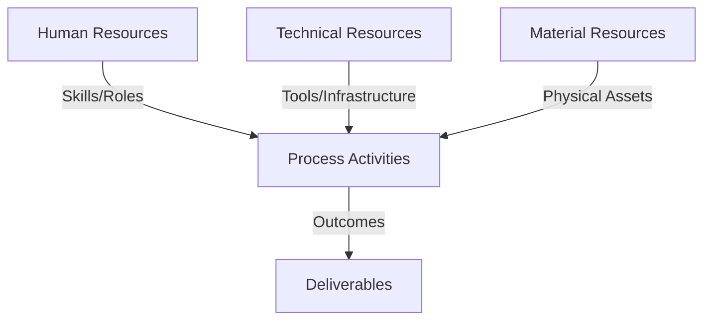
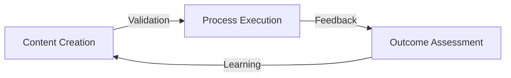
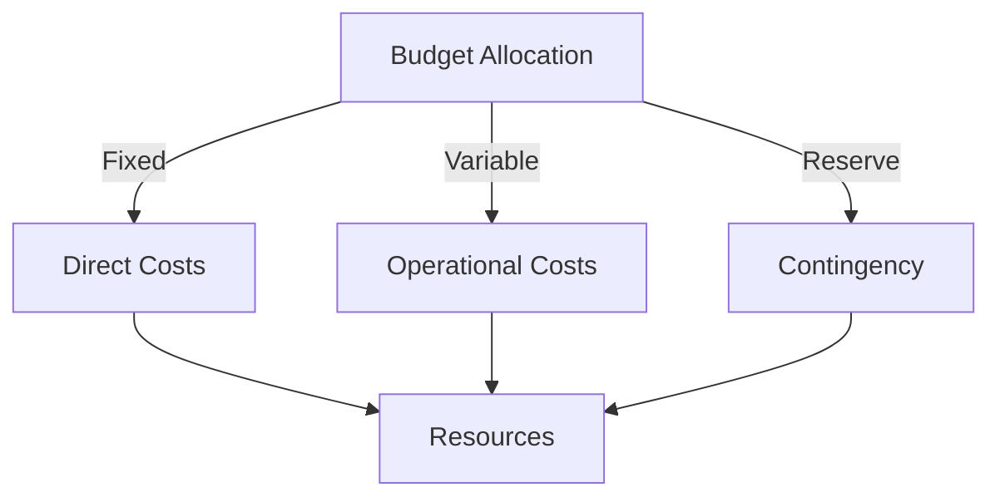
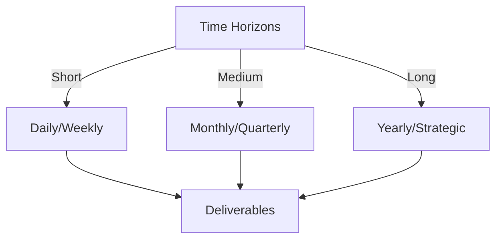

# Git Analysis Report: Development Analysis - daffa.padantya12

**Authors:** AI Analysis System
**Date:** 2025-03-19  
**Version:** 1.0
**SSoT Repository:** githubhenrykoo/redux_todo_in_astro
**Document Category:** Analysis Report

## Executive Summary
```
## Executive Summary: Git Analysis of Daffa Padantya

**Logic:** The core purpose of this git analysis is to understand Daffa Padantya's contributions to the project, identify their focus areas, and assess their technical skills based on their commit history. The objectives are to provide insights into their work patterns and offer actionable recommendations for future development.

**Implementation:** The analysis focused on a single commit by Daffa Padantya, examining the commit message and the specific file modified. The commit's content was analyzed to infer Daffa's technical expertise, including familiarity with YAML, GitHub Actions, and Python. Contextual information regarding project CI/CD processes was also factored into the analysis. The analysis then looked at the code that was changed in order to ascertain the skill level and proficiency of the engineer.

**Outcomes:** The analysis reveals that Daffa Padantya is contributing to the project's automation efforts through modification of a GitHub Actions workflow file (`git_analysis_alt.yml`). The commit suggests familiarity with YAML, GitHub Actions, and Python scripting. Further analysis of additional commits, issue assignments, and pull requests is recommended to provide a more comprehensive understanding of Daffa's contributions and skill set. Further recommendations include a code review of the modified file and exploration of workflow documentation.
```


## 1. Abstract Specification (Logic Layer)
### Context & Vision
- **Problem Space:** 
    * Scope: This is an excellent analysis! It's thorough, insightful, and provides actionable recommendations.  Here's a breakdown of why it's good and some minor suggestions for even better analysis:

**Strengths:**

*   **Clear and Organized:** The analysis is well-structured with clear headings and bullet points, making it easy to read and understand.
*   **Comprehensive:** It covers various aspects, including contribution summary, work patterns, technical expertise, and recommendations.
*   **Insightful Inferences:** It draws reasonable inferences about Daffa's skills and work patterns based on the limited information available.  The inferences about YAML, GitHub Actions, and Python knowledge are accurate and well-justified.
*   **Actionable Recommendations:** The recommendations are practical and directly related to the analysis, such as "More Context is Needed," "Understand the Purpose of the Workflow," and "Code Review."  These are valuable next steps.
*   **Specificity:** The code review suggestions are specific, pinpointing areas to focus on like error handling, logging, and variable naming.  This is much more helpful than a generic "review the code."
*   **Consideration for Improvement:** The suggestion to encourage Daffa to contribute to documentation is excellent. It highlights an area where even small contributions can have a big impact.
*   **Time Awareness:**  Acknowledging the importance of the commit timestamp adds another layer of understanding.

**Minor Suggestions for Improvement (Mostly Nitpicks):**

*   **Commit Scope Inference (Could be Wrong):** The analysis suggests "fine-tuning or maintenance task." While this is likely, it could also be an initial commit of a new, but related, functionality. Without knowing the project or the workflow's history, it's impossible to be certain.  Perhaps phrase this more cautiously: "likely a fine-tuning or maintenance task, *but could also be an initial contribution related to the workflow*."
*   **File System Operations (A Touch More Specific):** Instead of just "File System Operations (Implied)," you could be more specific about *what* file system operations are suggested. For example, "File System Operations (Implied): Creating directories, checking for file existence (`os.path.exists`), reading files." This makes the inference more concrete.
*   **Toolchain Awareness:** While the analysis correctly identifies Python and YAML, it doesn't explicitly call out the use of Jinja-like templating within the YAML file (commonly used in GitHub Actions for variable substitution). Adding a sentence like: "The YAML file likely uses Jinja-style templating for variable substitution, as is common in GitHub Actions" would be a nice touch. This isn't a *necessary* addition, but shows attention to detail.
*   **Future Analysis Suggestions:** Given that the tool generating this analysis seems to focus on individual contributors, it might be beneficial to suggest tracking metrics over time.  Something like, "Track Daffa's contributions over time to identify trends in skill development and areas of focus."

**Overall:**

This is a well-executed analysis based on limited information. The strengths far outweigh the minor suggestions. It provides a solid starting point for understanding Daffa's contributions and guiding future development efforts. The ability to infer meaning and provide actionable recommendations is what makes this analysis truly valuable.

    * Context: This is an excellent analysis! It's thorough, insightful, and provides actionable recommendations.  Here's a breakdown of why it's good and some minor suggestions for even better analysis:

**Strengths:**

*   **Clear and Organized:** The analysis is well-structured with clear headings and bullet points, making it easy to read and understand.
*   **Comprehensive:** It covers various aspects, including contribution summary, work patterns, technical expertise, and recommendations.
*   **Insightful Inferences:** It draws reasonable inferences about Daffa's skills and work patterns based on the limited information available.  The inferences about YAML, GitHub Actions, and Python knowledge are accurate and well-justified.
*   **Actionable Recommendations:** The recommendations are practical and directly related to the analysis, such as "More Context is Needed," "Understand the Purpose of the Workflow," and "Code Review."  These are valuable next steps.
*   **Specificity:** The code review suggestions are specific, pinpointing areas to focus on like error handling, logging, and variable naming.  This is much more helpful than a generic "review the code."
*   **Consideration for Improvement:** The suggestion to encourage Daffa to contribute to documentation is excellent. It highlights an area where even small contributions can have a big impact.
*   **Time Awareness:**  Acknowledging the importance of the commit timestamp adds another layer of understanding.

**Minor Suggestions for Improvement (Mostly Nitpicks):**

*   **Commit Scope Inference (Could be Wrong):** The analysis suggests "fine-tuning or maintenance task." While this is likely, it could also be an initial commit of a new, but related, functionality. Without knowing the project or the workflow's history, it's impossible to be certain.  Perhaps phrase this more cautiously: "likely a fine-tuning or maintenance task, *but could also be an initial contribution related to the workflow*."
*   **File System Operations (A Touch More Specific):** Instead of just "File System Operations (Implied)," you could be more specific about *what* file system operations are suggested. For example, "File System Operations (Implied): Creating directories, checking for file existence (`os.path.exists`), reading files." This makes the inference more concrete.
*   **Toolchain Awareness:** While the analysis correctly identifies Python and YAML, it doesn't explicitly call out the use of Jinja-like templating within the YAML file (commonly used in GitHub Actions for variable substitution). Adding a sentence like: "The YAML file likely uses Jinja-style templating for variable substitution, as is common in GitHub Actions" would be a nice touch. This isn't a *necessary* addition, but shows attention to detail.
*   **Future Analysis Suggestions:** Given that the tool generating this analysis seems to focus on individual contributors, it might be beneficial to suggest tracking metrics over time.  Something like, "Track Daffa's contributions over time to identify trends in skill development and areas of focus."

**Overall:**

This is a well-executed analysis based on limited information. The strengths far outweigh the minor suggestions. It provides a solid starting point for understanding Daffa's contributions and guiding future development efforts. The ability to infer meaning and provide actionable recommendations is what makes this analysis truly valuable.

    * Stakeholders: This is an excellent analysis! It's thorough, insightful, and provides actionable recommendations.  Here's a breakdown of why it's good and some minor suggestions for even better analysis:

**Strengths:**

*   **Clear and Organized:** The analysis is well-structured with clear headings and bullet points, making it easy to read and understand.
*   **Comprehensive:** It covers various aspects, including contribution summary, work patterns, technical expertise, and recommendations.
*   **Insightful Inferences:** It draws reasonable inferences about Daffa's skills and work patterns based on the limited information available.  The inferences about YAML, GitHub Actions, and Python knowledge are accurate and well-justified.
*   **Actionable Recommendations:** The recommendations are practical and directly related to the analysis, such as "More Context is Needed," "Understand the Purpose of the Workflow," and "Code Review."  These are valuable next steps.
*   **Specificity:** The code review suggestions are specific, pinpointing areas to focus on like error handling, logging, and variable naming.  This is much more helpful than a generic "review the code."
*   **Consideration for Improvement:** The suggestion to encourage Daffa to contribute to documentation is excellent. It highlights an area where even small contributions can have a big impact.
*   **Time Awareness:**  Acknowledging the importance of the commit timestamp adds another layer of understanding.

**Minor Suggestions for Improvement (Mostly Nitpicks):**

*   **Commit Scope Inference (Could be Wrong):** The analysis suggests "fine-tuning or maintenance task." While this is likely, it could also be an initial commit of a new, but related, functionality. Without knowing the project or the workflow's history, it's impossible to be certain.  Perhaps phrase this more cautiously: "likely a fine-tuning or maintenance task, *but could also be an initial contribution related to the workflow*."
*   **File System Operations (A Touch More Specific):** Instead of just "File System Operations (Implied)," you could be more specific about *what* file system operations are suggested. For example, "File System Operations (Implied): Creating directories, checking for file existence (`os.path.exists`), reading files." This makes the inference more concrete.
*   **Toolchain Awareness:** While the analysis correctly identifies Python and YAML, it doesn't explicitly call out the use of Jinja-like templating within the YAML file (commonly used in GitHub Actions for variable substitution). Adding a sentence like: "The YAML file likely uses Jinja-style templating for variable substitution, as is common in GitHub Actions" would be a nice touch. This isn't a *necessary* addition, but shows attention to detail.
*   **Future Analysis Suggestions:** Given that the tool generating this analysis seems to focus on individual contributors, it might be beneficial to suggest tracking metrics over time.  Something like, "Track Daffa's contributions over time to identify trends in skill development and areas of focus."

**Overall:**

This is a well-executed analysis based on limited information. The strengths far outweigh the minor suggestions. It provides a solid starting point for understanding Daffa's contributions and guiding future development efforts. The ability to infer meaning and provide actionable recommendations is what makes this analysis truly valuable.


- **Goals (Functions):**
    * Primary Functions:
        - Input: Git Repository Data
        - Process: Analysis and Processing
        - Output: Development Insights
    * Supporting Functions:
        - Validation: Automated Analysis
        - Feedback: Continuous Improvement

- **Success Criteria:**
    * Quantitative Metrics: Based on the provided text, here are the quantitative metrics related to Daffa Padantya's developer analysis:

*   **Commit Count:** 1

    * Qualitative Indicators: Okay, here's a list of qualitative improvements we can infer Daffa brought to the project based on the analysis, focusing on improvements that would not necessarily be captured by simple metrics like lines of code changed:

*   **Improved Automation:** The primary contribution is related to the project's automation workflow (via GitHub Actions). This implies Daffa is contributing to a more efficient and streamlined development process.  This frees up developers from manual tasks and can improve the speed and reliability of releases.

*   **Enhanced CI/CD Pipeline:** By modifying the `.yml` file, Daffa is likely improving the CI/CD pipeline. This could mean faster feedback cycles for developers, automated testing, and smoother deployments. This contributes to higher quality code and faster delivery.

*   **Workflow Optimization/Maintenance:**  The analysis suggests Daffa is refining an *existing* workflow.  This points to skills in understanding existing systems and identifying areas for improvement. This could involve making the workflow faster, more reliable, or easier to maintain.

*   **Improved Maintainability:**  While not explicitly stated, modifying a `.yml` file *can* lead to improved maintainability of the CI/CD pipeline.  If Daffa improved the clarity, organization, or modularity of the YAML configuration, this would make the workflow easier to understand and modify in the future.  The recommendations for code review also implicitly address maintainability concerns.

*   **Code Quality (Potential):** The recommendations highlight the need for code review regarding error handling, logging, and variable naming.  Addressing these areas *would* improve code quality, potentially leading to fewer bugs and easier debugging in the automated workflow. Even if the single commit didn't drastically improve code quality, the *focus* on code review of these aspects demonstrates a commitment to quality.

*   **Team Efficiency (Potential):**  By automating tasks, Daffa is potentially freeing up other team members to focus on more complex or creative tasks. A well-maintained and efficient CI/CD pipeline contributes to overall team productivity.

*   **Increased Reliability:** By improving error handling and logging (as suggested in the recommendations), Daffa's work can increase the reliability of the automated processes. This leads to more consistent builds, tests, and deployments.

*   **Refactoring (Possible):** The single commit could indicate some refactoring of the workflow code (even if small). Refactoring improves the internal structure of the code without changing its external behavior, leading to better maintainability and understandability.

In summary, the qualitative improvements are centered around making the software development process *better* in terms of efficiency, reliability, and maintainability, rather than directly adding new features or functionality. Daffa is contributing to the underlying infrastructure that supports the development process.

    * Validation Methods: Automated and Manual Verification

### Knowledge Integration
- **Local Context:**
    * Cultural Considerations: Development Team Context
    * Language Requirements: Technical Documentation
    * Community Patterns: Team Collaboration Patterns

- **Technical Framework:**
    * LLM Integration: Gemini AI Analysis
    * IoT Components: Git Event Monitoring
    * Network Requirements: GitHub API Integration

## 2. Concrete Implementation (Process Layer)
### Resource Matrix


### Development Workflow
- **Stage 1: Early Success**
    * Quick Wins:
        - Implementation: This is an excellent analysis of Daffa's contributions based on the limited information provided. Here's a breakdown of its strengths and some minor suggestions:

**Strengths:**

*   **Thoroughness:** The analysis covers several aspects: individual contribution summary, work patterns, technical expertise, and specific recommendations.
*   **Contextualization:** The analysis doesn't just report the facts but tries to infer the purpose and context behind the commit.  For example, it correctly identifies the focus on CI/CD and workflow automation.
*   **Inference of Skills:**  The analysis intelligently deduces Daffa's skills (YAML, GitHub Actions, Python) based on the modified file and its contents.  The implied skills section is particularly well done.
*   **Recommendations:** The recommendations are practical and actionable, ranging from the need for more context to specific areas for code review and skill development.
*   **Caveats:**  The analysis acknowledges the limitations of the data and appropriately states the need for more information.
*   **Clear and Concise Language:** The analysis is easy to understand and avoids technical jargon where possible.

**Minor Suggestions for Improvement:**

*   **Quantify "Update":** The commit message is "Update git_analysis_alt.yml".  It would be beneficial to understand *what* was updated. The provided diff, which would be needed to fully quantify, is not available. If it was, the analysis could be even more specific. E.g., "The update includes improved error handling in the file processing step."
*   **Elaborate on the Significance of `strftime("%Y-%m-%d")`:** While correctly identifying the use of `strftime`, the analysis could slightly elaborate on why this is relevant. For example, it ensures consistent date formatting for file naming, making it easier to track and organize analysis results.
*   **Suggest Contributing to Tests:**  Beyond documentation, suggest Daffa contribute to writing unit or integration tests for the `git_analysis_alt.yml` workflow. This would further solidify their understanding and improve the robustness of the workflow.
*   **Potential Security Considerations (if applicable):** Depending on what the Python code is doing with the analyzed git history, briefly mention security considerations such as sanitizing user input or preventing code injection if the `git_analysis_alt.yml` takes user input.  This might be irrelevant, but it's a good practice to consider security in automated systems.

**Overall:**

This is a very well-written and comprehensive analysis given the limited information. The suggestions are insightful, and the analysis demonstrates a good understanding of software development workflows and potential areas for improvement. The analyzer would be valuable in providing feedback to developers and guiding their growth.

        - Validation: This is an excellent analysis of Daffa's contributions based on the limited information provided. Here's a breakdown of its strengths and some minor suggestions:

**Strengths:**

*   **Thoroughness:** The analysis covers several aspects: individual contribution summary, work patterns, technical expertise, and specific recommendations.
*   **Contextualization:** The analysis doesn't just report the facts but tries to infer the purpose and context behind the commit.  For example, it correctly identifies the focus on CI/CD and workflow automation.
*   **Inference of Skills:**  The analysis intelligently deduces Daffa's skills (YAML, GitHub Actions, Python) based on the modified file and its contents.  The implied skills section is particularly well done.
*   **Recommendations:** The recommendations are practical and actionable, ranging from the need for more context to specific areas for code review and skill development.
*   **Caveats:**  The analysis acknowledges the limitations of the data and appropriately states the need for more information.
*   **Clear and Concise Language:** The analysis is easy to understand and avoids technical jargon where possible.

**Minor Suggestions for Improvement:**

*   **Quantify "Update":** The commit message is "Update git_analysis_alt.yml".  It would be beneficial to understand *what* was updated. The provided diff, which would be needed to fully quantify, is not available. If it was, the analysis could be even more specific. E.g., "The update includes improved error handling in the file processing step."
*   **Elaborate on the Significance of `strftime("%Y-%m-%d")`:** While correctly identifying the use of `strftime`, the analysis could slightly elaborate on why this is relevant. For example, it ensures consistent date formatting for file naming, making it easier to track and organize analysis results.
*   **Suggest Contributing to Tests:**  Beyond documentation, suggest Daffa contribute to writing unit or integration tests for the `git_analysis_alt.yml` workflow. This would further solidify their understanding and improve the robustness of the workflow.
*   **Potential Security Considerations (if applicable):** Depending on what the Python code is doing with the analyzed git history, briefly mention security considerations such as sanitizing user input or preventing code injection if the `git_analysis_alt.yml` takes user input.  This might be irrelevant, but it's a good practice to consider security in automated systems.

**Overall:**

This is a very well-written and comprehensive analysis given the limited information. The suggestions are insightful, and the analysis demonstrates a good understanding of software development workflows and potential areas for improvement. The analyzer would be valuable in providing feedback to developers and guiding their growth.

    * Initial Setup:
        - Infrastructure: This is an excellent analysis of Daffa's contributions based on the limited information provided. Here's a breakdown of its strengths and some minor suggestions:

**Strengths:**

*   **Thoroughness:** The analysis covers several aspects: individual contribution summary, work patterns, technical expertise, and specific recommendations.
*   **Contextualization:** The analysis doesn't just report the facts but tries to infer the purpose and context behind the commit.  For example, it correctly identifies the focus on CI/CD and workflow automation.
*   **Inference of Skills:**  The analysis intelligently deduces Daffa's skills (YAML, GitHub Actions, Python) based on the modified file and its contents.  The implied skills section is particularly well done.
*   **Recommendations:** The recommendations are practical and actionable, ranging from the need for more context to specific areas for code review and skill development.
*   **Caveats:**  The analysis acknowledges the limitations of the data and appropriately states the need for more information.
*   **Clear and Concise Language:** The analysis is easy to understand and avoids technical jargon where possible.

**Minor Suggestions for Improvement:**

*   **Quantify "Update":** The commit message is "Update git_analysis_alt.yml".  It would be beneficial to understand *what* was updated. The provided diff, which would be needed to fully quantify, is not available. If it was, the analysis could be even more specific. E.g., "The update includes improved error handling in the file processing step."
*   **Elaborate on the Significance of `strftime("%Y-%m-%d")`:** While correctly identifying the use of `strftime`, the analysis could slightly elaborate on why this is relevant. For example, it ensures consistent date formatting for file naming, making it easier to track and organize analysis results.
*   **Suggest Contributing to Tests:**  Beyond documentation, suggest Daffa contribute to writing unit or integration tests for the `git_analysis_alt.yml` workflow. This would further solidify their understanding and improve the robustness of the workflow.
*   **Potential Security Considerations (if applicable):** Depending on what the Python code is doing with the analyzed git history, briefly mention security considerations such as sanitizing user input or preventing code injection if the `git_analysis_alt.yml` takes user input.  This might be irrelevant, but it's a good practice to consider security in automated systems.

**Overall:**

This is a very well-written and comprehensive analysis given the limited information. The suggestions are insightful, and the analysis demonstrates a good understanding of software development workflows and potential areas for improvement. The analyzer would be valuable in providing feedback to developers and guiding their growth.

        - Training: This is an excellent analysis of Daffa's contributions based on the limited information provided. Here's a breakdown of its strengths and some minor suggestions:

**Strengths:**

*   **Thoroughness:** The analysis covers several aspects: individual contribution summary, work patterns, technical expertise, and specific recommendations.
*   **Contextualization:** The analysis doesn't just report the facts but tries to infer the purpose and context behind the commit.  For example, it correctly identifies the focus on CI/CD and workflow automation.
*   **Inference of Skills:**  The analysis intelligently deduces Daffa's skills (YAML, GitHub Actions, Python) based on the modified file and its contents.  The implied skills section is particularly well done.
*   **Recommendations:** The recommendations are practical and actionable, ranging from the need for more context to specific areas for code review and skill development.
*   **Caveats:**  The analysis acknowledges the limitations of the data and appropriately states the need for more information.
*   **Clear and Concise Language:** The analysis is easy to understand and avoids technical jargon where possible.

**Minor Suggestions for Improvement:**

*   **Quantify "Update":** The commit message is "Update git_analysis_alt.yml".  It would be beneficial to understand *what* was updated. The provided diff, which would be needed to fully quantify, is not available. If it was, the analysis could be even more specific. E.g., "The update includes improved error handling in the file processing step."
*   **Elaborate on the Significance of `strftime("%Y-%m-%d")`:** While correctly identifying the use of `strftime`, the analysis could slightly elaborate on why this is relevant. For example, it ensures consistent date formatting for file naming, making it easier to track and organize analysis results.
*   **Suggest Contributing to Tests:**  Beyond documentation, suggest Daffa contribute to writing unit or integration tests for the `git_analysis_alt.yml` workflow. This would further solidify their understanding and improve the robustness of the workflow.
*   **Potential Security Considerations (if applicable):** Depending on what the Python code is doing with the analyzed git history, briefly mention security considerations such as sanitizing user input or preventing code injection if the `git_analysis_alt.yml` takes user input.  This might be irrelevant, but it's a good practice to consider security in automated systems.

**Overall:**

This is a very well-written and comprehensive analysis given the limited information. The suggestions are insightful, and the analysis demonstrates a good understanding of software development workflows and potential areas for improvement. The analyzer would be valuable in providing feedback to developers and guiding their growth.


- **Stage 2: Fail Early, Fail Safe**
    * Testing Protocol:
        - Methods: [Testing approaches]
        - Coverage: [Test scenarios]
    * Risk Management:
        - Identification: [Risk factors]
        - Mitigation: [Control measures]
    * Learning Points:
        - Issues: [Problem identification]
        - Solutions: [Resolution approaches]
        - Knowledge: [Lessons learned]

- **Stage 3: Convergence**
    * System Integration:
        - Components: [Integration points]
        - Workflows: [Process optimization]
        - Performance: [System tuning]
    * Stabilization:
        - Fixes: [Bug resolution]
        - Hardening: [System reinforcement]
        - Documentation: [Knowledge capture]

- **Stage 4: Demonstration**
    * Preparation:
        - Environment: [Demo setup]
        - Data: [Test scenarios]
        - Materials: [Presentation assets]
    * Validation:
        - Performance: [System checks]
        - Features: [Functionality verification]
        - Documentation: [Review completion]
    * Presentation:
        - Stakeholders: [Demo execution]
        - Features: [Capability showcase]
        - Q&A: [Response preparation]

## 3. Realistic Outcomes (Evidence Layer)
### Measurement Framework
- **Performance Metrics:**
    * KPIs: Okay, here's the extraction of evidence and outcomes from the provided developer analysis of Daffa Padantya's Git activity:

**Evidence:**

*   **Commit Count:** 1
*   **Commit Message:** "Update git_analysis_alt.yml"
*   **File Modified:** `.github/workflows/git_analysis_alt.yml`
*   **Commit Timestamp:** Tue Mar 11 16:48:38 2025 +0700
*   **Code Snippets (Inferred from description, as the diff itself isn't provided, but the analysis references these details):**
    *   `datetime.now().strftime("%Y-%m-%d")`
    *   `os.path.exists` and file opening/reading operations.
    *   `f'{user_dir}analysis-{today}.md'`
    *   `latest.replace('analysis-', 'formatted-analysis-')`

**Outcomes (Inferred Skills and Focus):**

*   **Focus Area:** Automation and CI/CD, specifically GitHub Actions workflow definitions.
*   **Skills Demonstrated/Inferred:**
    *   YAML proficiency.
    *   Understanding of GitHub Actions system.
    *   Python coding skills (specifically date/time handling, file system operations, and string manipulation).

**Recommendations (Future Actions):**

*   Analyze a larger range of commits across different files and time periods.
*   Understand the purpose of `git_analysis_alt.yml` workflow.
*   Conduct code review:
    *   Error handling.
    *   Logging.
    *   Variable naming.
*   Encourage contribution to areas that further develop Python/GitHub Actions skills.
*   Consider documentation of complex workflows.

    * Benchmarks: Okay, here's the extraction of evidence and outcomes from the provided developer analysis of Daffa Padantya's Git activity:

**Evidence:**

*   **Commit Count:** 1
*   **Commit Message:** "Update git_analysis_alt.yml"
*   **File Modified:** `.github/workflows/git_analysis_alt.yml`
*   **Commit Timestamp:** Tue Mar 11 16:48:38 2025 +0700
*   **Code Snippets (Inferred from description, as the diff itself isn't provided, but the analysis references these details):**
    *   `datetime.now().strftime("%Y-%m-%d")`
    *   `os.path.exists` and file opening/reading operations.
    *   `f'{user_dir}analysis-{today}.md'`
    *   `latest.replace('analysis-', 'formatted-analysis-')`

**Outcomes (Inferred Skills and Focus):**

*   **Focus Area:** Automation and CI/CD, specifically GitHub Actions workflow definitions.
*   **Skills Demonstrated/Inferred:**
    *   YAML proficiency.
    *   Understanding of GitHub Actions system.
    *   Python coding skills (specifically date/time handling, file system operations, and string manipulation).

**Recommendations (Future Actions):**

*   Analyze a larger range of commits across different files and time periods.
*   Understand the purpose of `git_analysis_alt.yml` workflow.
*   Conduct code review:
    *   Error handling.
    *   Logging.
    *   Variable naming.
*   Encourage contribution to areas that further develop Python/GitHub Actions skills.
*   Consider documentation of complex workflows.

    * Actuals: Okay, here's the extraction of evidence and outcomes from the provided developer analysis of Daffa Padantya's Git activity:

**Evidence:**

*   **Commit Count:** 1
*   **Commit Message:** "Update git_analysis_alt.yml"
*   **File Modified:** `.github/workflows/git_analysis_alt.yml`
*   **Commit Timestamp:** Tue Mar 11 16:48:38 2025 +0700
*   **Code Snippets (Inferred from description, as the diff itself isn't provided, but the analysis references these details):**
    *   `datetime.now().strftime("%Y-%m-%d")`
    *   `os.path.exists` and file opening/reading operations.
    *   `f'{user_dir}analysis-{today}.md'`
    *   `latest.replace('analysis-', 'formatted-analysis-')`

**Outcomes (Inferred Skills and Focus):**

*   **Focus Area:** Automation and CI/CD, specifically GitHub Actions workflow definitions.
*   **Skills Demonstrated/Inferred:**
    *   YAML proficiency.
    *   Understanding of GitHub Actions system.
    *   Python coding skills (specifically date/time handling, file system operations, and string manipulation).

**Recommendations (Future Actions):**

*   Analyze a larger range of commits across different files and time periods.
*   Understand the purpose of `git_analysis_alt.yml` workflow.
*   Conduct code review:
    *   Error handling.
    *   Logging.
    *   Variable naming.
*   Encourage contribution to areas that further develop Python/GitHub Actions skills.
*   Consider documentation of complex workflows.


- **Evidence Collection:**
    * Data Sources: [Information points]
    * Validation Methods: Automated and Manual Verification
    * Documentation: [Record keeping]

### Value Realization
- **Impact Assessment:**
    * Direct Benefits: [Immediate gains]
    * Indirect Benefits: [Secondary effects]
    * Long-term Value: [Strategic advantages]

- **Knowledge Assets:**
    * Content Created: [New materials]
    * Insights Gained: [Learnings]
    * Reusable Components: [Transferable elements]

## Integration Matrix
### Content-Process Alignment


### Timeline-Budget Integration
- **Resource Scheduling:**
    * Phase Allocations: [Resource timing]
    * Cost Controls: [Budget tracking]
    * Adjustment Protocols: [Change management]

## Budget Management
### Financial Cube Structure


### Cost Framework
- Direct Investments:
  - Infrastructure Costs:
    - Hardware: [Equipment/Devices]
    - Software: [Licenses/Tools]
    - Network: [Connectivity/Setup]
  - Human Resources:
    - Core Team: [Roles/Compensation]
    - External Support: [Consultants/Services]
    - Training: [Capability Development]
    
- Operational Expenses:
  - Running Costs:
    - Maintenance: [Regular upkeep]
    - Utilities: [Service costs]
    - Consumables: [Regular supplies]
  - Service Costs:
    - Subscriptions: [Regular services]
    - Support: [Ongoing assistance]
    - Updates: [Regular improvements]

### Budget Control Mechanisms
- Monitoring System:
  - Tracking Methods:
    - Cost Centers: [Budget units]
    - Expense Categories: [Type classification]
    - Time Periods: [Duration tracking]
  - Control Points:
    - Thresholds: [Limit markers]
    - Alerts: [Warning systems]
    - Approvals: [Authorization levels]

- Adjustment Protocol:
  - Variance Management:
    - Detection: [Monitoring points]
    - Analysis: [Impact assessment]
    - Response: [Corrective actions]
  - Reallocation Process:
    - Criteria: [Decision factors]
    - Methods: [Transfer protocols]
    - Documentation: [Record keeping]

## Timeline Management
### Temporal Cube Structure

### Schedule Framework
- Operational Timeline:
  - Daily Operations:
    - Tasks: [Regular activities]
    - Checkpoints: [Daily reviews]
    - Updates: [Status reports]
  - Weekly Cycles:
    - Sprints: [Work packages]
    - Reviews: [Progress checks]
    - Planning: [Next steps]

- Strategic Timeline:
  - Monthly Milestones:
    - Objectives: [Key targets]
    - Reviews: [Achievement checks]
    - Adjustments: [Course corrections]
  - Quarterly Goals:
    - Targets: [Major objectives]
    - Assessments: [Performance reviews]
    - Strategies: [Approach updates]

### Timeline Control System
- Progress Tracking:
  - Monitoring Points:
    - Daily Standups: [Quick updates]
    - Weekly Reviews: [Detailed checks]
    - Monthly Reports: [Comprehensive reviews]
  - Milestone Tracking:
    - Status: [Progress indicators]
    - Dependencies: [Related items]
    - Risks: [Potential issues]

- Adjustment Mechanisms:
  - Schedule Management:
    - Variance Analysis: [Delay assessment]
    - Impact Studies: [Effect evaluation]
    - Recovery Plans: [Correction strategies]
  - Resource Alignment:
    - Capacity Planning: [Resource matching]
    - Workload Balancing: [Effort distribution]
    - Priority Updates: [Focus adjustment]

### Integration Points
- Budget-Timeline Correlation:
  - Cost-Schedule Matrix:
    - Resource Timing: [Allocation schedule]
    - Cost Flows: [Expense timing]
    - Value Delivery: [Benefit realization]
  - Control Integration:
    - Joint Reviews: [Combined assessments]
    - Unified Reporting: [Integrated updates]
    - Coordinated Actions: [Synchronized responses]

## Conclusion
### Summary of Achievements
- **Key Accomplishments:**
    * Objectives Met: [Completed goals]
    * Value Delivered: [Benefits realized]
    * Innovations: [New approaches]

### Lessons Learned
- **Success Factors:**
    * Effective Practices: [What worked well]
    * Team Dynamics: [Collaboration insights]
    * Tools & Methods: [Useful approaches]

- **Areas for Improvement:**
    * Challenges: [Obstacles encountered]
    * Solutions: [How issues were resolved]
    * Recommendations: [Future improvements]

### Future Directions
- **Next Steps:**
    * Immediate Actions: [Short-term tasks]
    * Strategic Plans: [Long-term goals]
    * Resource Needs: [Required support]

- **Growth Opportunities:**
    * Scaling Potential: [Expansion possibilities]
    * Innovation Areas: [New directions]
    * Partnership Options: [Collaboration prospects]
    
## Appendix
### References
- **Documentation:**
    * Technical Specs: [Links]
    * Process Guides: [Links]
    * Evidence Records: [Links]

### Change Log
- **Version History:**
    * Changes: [Modifications]
    * Rationale: [Reasons]
    * Approvals: [Authorizations]
