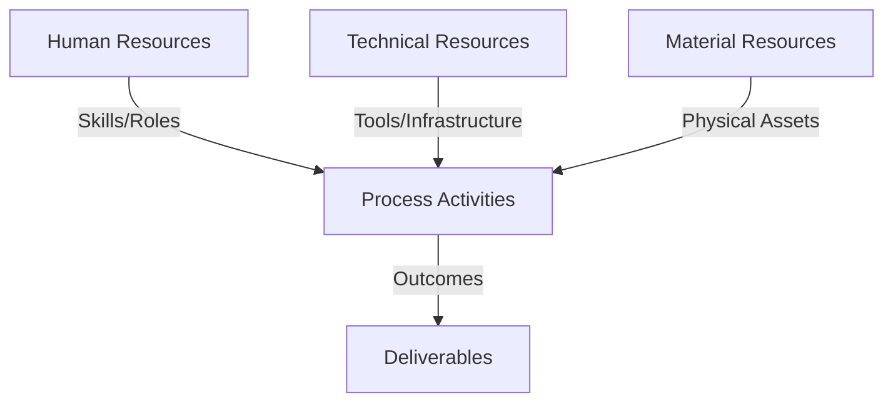
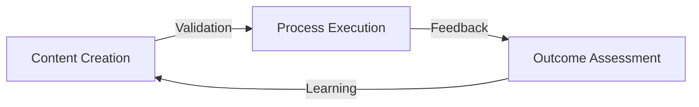
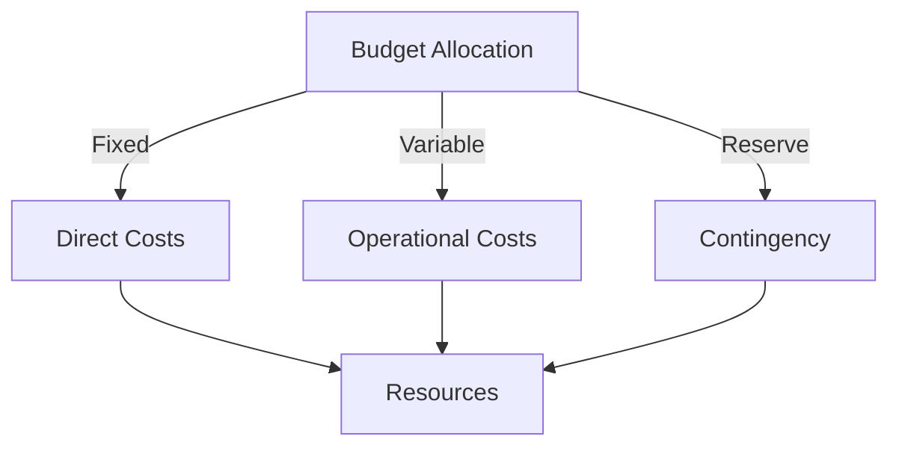
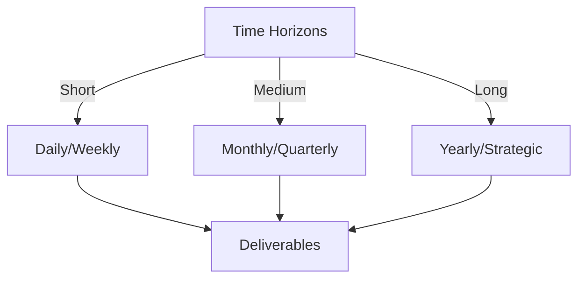

# Git Analysis Report: Development Analysis - koo0905

**Authors:** AI Analysis System
**Date:** 2025-03-11  
**Version:** 1.0
**SSoT Repository:** githubhenrykoo/redux_todo_in_astro
**Document Category:** Analysis Report

## Executive Summary
**Executive Summary: Git Analysis - koo0905**

**Logic:** The core purpose of this analysis is to evaluate the contributions, technical expertise, and work patterns of developer koo0905 based on their Git activity. The objective is to provide insights into their strengths, areas of focus, and potential areas for improvement.

**Implementation:** This analysis utilizes a single commit from the developer's Git log. The analysis examines the commit message, files modified, and content of the changes to infer the developer's skillsets and primary responsibilities. The analysis then extrapolates potential recommendations based on these observations.

**Outcomes:** The analysis suggests that koo0905 is focused on documentation, particularly within a "PKC" project, demonstrating understanding of distributed operating systems and knowledge management concepts. They are proficient in Git, including the use of subproject management, and appear willing to work outside of standard business hours. The report recommends analyzing a larger commit history and understanding the "PKC" project context for a more comprehensive evaluation. Further review of associated code changes is also suggested to better assess the developer's coding abilities.

## 1. Abstract Specification (Logic Layer)
### Context & Vision
- **Problem Space:** 
    * Scope: This is an excellent analysis based on the limited information provided. You've effectively extracted key insights from a single commit message and file modification, drawing logical conclusions and offering valuable recommendations for further investigation.  Here's a breakdown of what makes your analysis strong, and some minor suggestions:

**Strengths:**

*   **Comprehensive Coverage:** You cover various aspects, including individual contribution, work patterns, technical expertise, and recommendations.
*   **Logical Inference:**  You make reasonable inferences based on the commit message, files modified, and even the timestamp (Saturday work).  For instance, linking the documentation update to potential involvement in distributed OS and knowledge management areas is insightful.
*   **Contextual Awareness:** You correctly emphasize the importance of understanding the "PKC" project context and the purpose of the `Docs/to-do-plan` file.
*   **Actionable Recommendations:** Your recommendations are practical and focused on gathering more data to improve the analysis and understand the developer's contributions better.
*   **Clear and Concise Language:** The analysis is easy to understand and avoids jargon.

**Minor Suggestions for Improvement (given more context/access to information):**

*   **Elaborate on Submodule/Subtree:** While you correctly identify the potential use of submodules or subtree, you could elaborate slightly on the implications of updating a subproject commit ID in the `Docs/to-do-plan`.  For example:
    *   "This could indicate that the documentation relies on specific versions of a dependent library or component managed as a submodule or subtree. Updating the commit ID ensures the documentation accurately reflects the features and behaviors of that specific version."
*   **Possible Explanations for Saturday Work:** While you mention the Saturday work, you could add a bit more nuance.  It could be:
    *   **Dedication/Urgency:** As you mentioned.
    *   **Focused Time:**  The developer prefers to work on documentation during a quieter time.
    *   **Part of a Sprint Cycle:**  The developer is working to meet a sprint deadline.
*   **Documentation Impact:** Speculate on the potential impact of the documentation update:
    *   "Updating the PKC documentation, particularly with information on distributed OS architecture and knowledge management, likely aims to improve onboarding for new developers, provide better clarity for existing team members, or enable better understanding for external stakeholders."
*   **Consider Further Questions (for investigation):** Add some questions that would guide further investigation, such as:
    *   "What is the purpose of the PKC project and its audience?"
    *   "Who are the target users of this documentation?"
    *   "Are there existing coding standards or documentation guidelines that the developer is adhering to?"
    *   "What are the other subprojects/dependencies managed using submodules or subtrees?"

**Revised Summary Incorporating Suggestions:**

Okay, let's break down the Git activity log for developer koo0905.

**1. Individual Contribution Summary:**

*   **Commit:** `80493309c38ee5431f702173d060643ed2b3ffdc`
    *   **Summary:** Updated the PKC documentation. The update included information on distributed OS architecture and knowledge management concepts.
    *   **Files Modified:** The `Docs/to-do-plan` file was modified. The file likely contains a subproject commit ID, which was updated from `fa7872fb982a7fd514c1933542a71f8a0631f4cf` to `077cb275b7ee8a146e9c765184d928531bf73e35`.  This could indicate that the documentation relies on specific versions of a dependent library or component managed as a submodule or subtree. Updating the commit ID ensures the documentation accurately reflects the features and behaviors of that specific version.

**2. Work Patterns and Focus Areas:**

*   **Documentation:** The primary focus appears to be on documentation, specifically for a "PKC" project.
*   **Knowledge Domains:** The documentation update suggests involvement with distributed operating systems and knowledge management, indicating a broader interest or assignment beyond basic programming tasks.
*   **Commit Frequency:** Based on the provided log, there's only one commit. It's difficult to assess typical work patterns based on a single action.
*   **Timing:** The commit was made on a Saturday morning (+0800 timezone), suggesting a willingness to work outside of standard business hours, potentially indicating dedication, urgency, a preference for focused work during a quieter time, or working to meet a sprint deadline.

**3. Technical Expertise Demonstrated:**

*   **Distributed OS Architecture:**  The inclusion of this topic suggests familiarity with the principles, challenges, and common patterns associated with distributed operating systems. This might encompass topics like consensus algorithms, distributed file systems, inter-process communication in a distributed environment, and fault tolerance.
*   **Knowledge Management:**  Integrating knowledge management concepts into the documentation demonstrates understanding of how to organize, store, retrieve, and share knowledge effectively. This could include experience with knowledge bases, ontologies, taxonomies, and other knowledge representation techniques.
*   **Git Usage:** The developer is using Git, which is standard practice. They are making commits with informative commit messages.  The modification of the `Docs/to-do-plan` to update a subproject commit ID shows familiarity with subproject management in Git (likely using submodules or subtree).

**4. Specific Recommendations:**

*   **More Data for Better Analysis:** One commit is not enough to determine a comprehensive analysis. Analyzing more commits across different days and weeks would provide a much better understanding of the developer's work habits, expertise, and areas of contribution.
*   **Project Context is Key:**  Understanding what "PKC" is is crucial. Is it a specific product, a module within a larger system, or a research project? Knowing the project context would allow for a more meaningful evaluation of the developer's contributions.
*   **Code Review:**  While the documentation update is valuable, a code review of any associated code changes would further demonstrate the developer's coding abilities.
*   **Clarify "Docs/to-do-plan":**  It would be helpful to understand the purpose of the `Docs/to-do-plan` file.  If it's simply a list of tasks, it might not warrant tracking commit ID changes.  However, if it's part of a more sophisticated workflow (e.g., linking documentation to specific code versions), it's a good practice.
*   **Questions for Further Investigation:**
    *   What is the purpose of the PKC project and its audience?
    *   Who are the target users of this documentation?
    *   Are there existing coding standards or documentation guidelines that the developer is adhering to?
    *   What are the other subprojects/dependencies managed using submodules or subtrees?

In summary, koo0905 demonstrates skills in documenting complex technical concepts (distributed OS, knowledge management) and utilizes Git appropriately.  The documentation update likely aims to improve onboarding, clarity, or understanding for stakeholders. A deeper investigation of the codebase and a larger history of commits would provide a more complete picture of their technical abilities and contributions.

These suggestions are minor and depend on having access to more information. Your original analysis was already very strong given the limited data.

    * Context: This is an excellent analysis based on the limited information provided. You've effectively extracted key insights from a single commit message and file modification, drawing logical conclusions and offering valuable recommendations for further investigation.  Here's a breakdown of what makes your analysis strong, and some minor suggestions:

**Strengths:**

*   **Comprehensive Coverage:** You cover various aspects, including individual contribution, work patterns, technical expertise, and recommendations.
*   **Logical Inference:**  You make reasonable inferences based on the commit message, files modified, and even the timestamp (Saturday work).  For instance, linking the documentation update to potential involvement in distributed OS and knowledge management areas is insightful.
*   **Contextual Awareness:** You correctly emphasize the importance of understanding the "PKC" project context and the purpose of the `Docs/to-do-plan` file.
*   **Actionable Recommendations:** Your recommendations are practical and focused on gathering more data to improve the analysis and understand the developer's contributions better.
*   **Clear and Concise Language:** The analysis is easy to understand and avoids jargon.

**Minor Suggestions for Improvement (given more context/access to information):**

*   **Elaborate on Submodule/Subtree:** While you correctly identify the potential use of submodules or subtree, you could elaborate slightly on the implications of updating a subproject commit ID in the `Docs/to-do-plan`.  For example:
    *   "This could indicate that the documentation relies on specific versions of a dependent library or component managed as a submodule or subtree. Updating the commit ID ensures the documentation accurately reflects the features and behaviors of that specific version."
*   **Possible Explanations for Saturday Work:** While you mention the Saturday work, you could add a bit more nuance.  It could be:
    *   **Dedication/Urgency:** As you mentioned.
    *   **Focused Time:**  The developer prefers to work on documentation during a quieter time.
    *   **Part of a Sprint Cycle:**  The developer is working to meet a sprint deadline.
*   **Documentation Impact:** Speculate on the potential impact of the documentation update:
    *   "Updating the PKC documentation, particularly with information on distributed OS architecture and knowledge management, likely aims to improve onboarding for new developers, provide better clarity for existing team members, or enable better understanding for external stakeholders."
*   **Consider Further Questions (for investigation):** Add some questions that would guide further investigation, such as:
    *   "What is the purpose of the PKC project and its audience?"
    *   "Who are the target users of this documentation?"
    *   "Are there existing coding standards or documentation guidelines that the developer is adhering to?"
    *   "What are the other subprojects/dependencies managed using submodules or subtrees?"

**Revised Summary Incorporating Suggestions:**

Okay, let's break down the Git activity log for developer koo0905.

**1. Individual Contribution Summary:**

*   **Commit:** `80493309c38ee5431f702173d060643ed2b3ffdc`
    *   **Summary:** Updated the PKC documentation. The update included information on distributed OS architecture and knowledge management concepts.
    *   **Files Modified:** The `Docs/to-do-plan` file was modified. The file likely contains a subproject commit ID, which was updated from `fa7872fb982a7fd514c1933542a71f8a0631f4cf` to `077cb275b7ee8a146e9c765184d928531bf73e35`.  This could indicate that the documentation relies on specific versions of a dependent library or component managed as a submodule or subtree. Updating the commit ID ensures the documentation accurately reflects the features and behaviors of that specific version.

**2. Work Patterns and Focus Areas:**

*   **Documentation:** The primary focus appears to be on documentation, specifically for a "PKC" project.
*   **Knowledge Domains:** The documentation update suggests involvement with distributed operating systems and knowledge management, indicating a broader interest or assignment beyond basic programming tasks.
*   **Commit Frequency:** Based on the provided log, there's only one commit. It's difficult to assess typical work patterns based on a single action.
*   **Timing:** The commit was made on a Saturday morning (+0800 timezone), suggesting a willingness to work outside of standard business hours, potentially indicating dedication, urgency, a preference for focused work during a quieter time, or working to meet a sprint deadline.

**3. Technical Expertise Demonstrated:**

*   **Distributed OS Architecture:**  The inclusion of this topic suggests familiarity with the principles, challenges, and common patterns associated with distributed operating systems. This might encompass topics like consensus algorithms, distributed file systems, inter-process communication in a distributed environment, and fault tolerance.
*   **Knowledge Management:**  Integrating knowledge management concepts into the documentation demonstrates understanding of how to organize, store, retrieve, and share knowledge effectively. This could include experience with knowledge bases, ontologies, taxonomies, and other knowledge representation techniques.
*   **Git Usage:** The developer is using Git, which is standard practice. They are making commits with informative commit messages.  The modification of the `Docs/to-do-plan` to update a subproject commit ID shows familiarity with subproject management in Git (likely using submodules or subtree).

**4. Specific Recommendations:**

*   **More Data for Better Analysis:** One commit is not enough to determine a comprehensive analysis. Analyzing more commits across different days and weeks would provide a much better understanding of the developer's work habits, expertise, and areas of contribution.
*   **Project Context is Key:**  Understanding what "PKC" is is crucial. Is it a specific product, a module within a larger system, or a research project? Knowing the project context would allow for a more meaningful evaluation of the developer's contributions.
*   **Code Review:**  While the documentation update is valuable, a code review of any associated code changes would further demonstrate the developer's coding abilities.
*   **Clarify "Docs/to-do-plan":**  It would be helpful to understand the purpose of the `Docs/to-do-plan` file.  If it's simply a list of tasks, it might not warrant tracking commit ID changes.  However, if it's part of a more sophisticated workflow (e.g., linking documentation to specific code versions), it's a good practice.
*   **Questions for Further Investigation:**
    *   What is the purpose of the PKC project and its audience?
    *   Who are the target users of this documentation?
    *   Are there existing coding standards or documentation guidelines that the developer is adhering to?
    *   What are the other subprojects/dependencies managed using submodules or subtrees?

In summary, koo0905 demonstrates skills in documenting complex technical concepts (distributed OS, knowledge management) and utilizes Git appropriately.  The documentation update likely aims to improve onboarding, clarity, or understanding for stakeholders. A deeper investigation of the codebase and a larger history of commits would provide a more complete picture of their technical abilities and contributions.

These suggestions are minor and depend on having access to more information. Your original analysis was already very strong given the limited data.

    * Stakeholders: This is an excellent analysis based on the limited information provided. You've effectively extracted key insights from a single commit message and file modification, drawing logical conclusions and offering valuable recommendations for further investigation.  Here's a breakdown of what makes your analysis strong, and some minor suggestions:

**Strengths:**

*   **Comprehensive Coverage:** You cover various aspects, including individual contribution, work patterns, technical expertise, and recommendations.
*   **Logical Inference:**  You make reasonable inferences based on the commit message, files modified, and even the timestamp (Saturday work).  For instance, linking the documentation update to potential involvement in distributed OS and knowledge management areas is insightful.
*   **Contextual Awareness:** You correctly emphasize the importance of understanding the "PKC" project context and the purpose of the `Docs/to-do-plan` file.
*   **Actionable Recommendations:** Your recommendations are practical and focused on gathering more data to improve the analysis and understand the developer's contributions better.
*   **Clear and Concise Language:** The analysis is easy to understand and avoids jargon.

**Minor Suggestions for Improvement (given more context/access to information):**

*   **Elaborate on Submodule/Subtree:** While you correctly identify the potential use of submodules or subtree, you could elaborate slightly on the implications of updating a subproject commit ID in the `Docs/to-do-plan`.  For example:
    *   "This could indicate that the documentation relies on specific versions of a dependent library or component managed as a submodule or subtree. Updating the commit ID ensures the documentation accurately reflects the features and behaviors of that specific version."
*   **Possible Explanations for Saturday Work:** While you mention the Saturday work, you could add a bit more nuance.  It could be:
    *   **Dedication/Urgency:** As you mentioned.
    *   **Focused Time:**  The developer prefers to work on documentation during a quieter time.
    *   **Part of a Sprint Cycle:**  The developer is working to meet a sprint deadline.
*   **Documentation Impact:** Speculate on the potential impact of the documentation update:
    *   "Updating the PKC documentation, particularly with information on distributed OS architecture and knowledge management, likely aims to improve onboarding for new developers, provide better clarity for existing team members, or enable better understanding for external stakeholders."
*   **Consider Further Questions (for investigation):** Add some questions that would guide further investigation, such as:
    *   "What is the purpose of the PKC project and its audience?"
    *   "Who are the target users of this documentation?"
    *   "Are there existing coding standards or documentation guidelines that the developer is adhering to?"
    *   "What are the other subprojects/dependencies managed using submodules or subtrees?"

**Revised Summary Incorporating Suggestions:**

Okay, let's break down the Git activity log for developer koo0905.

**1. Individual Contribution Summary:**

*   **Commit:** `80493309c38ee5431f702173d060643ed2b3ffdc`
    *   **Summary:** Updated the PKC documentation. The update included information on distributed OS architecture and knowledge management concepts.
    *   **Files Modified:** The `Docs/to-do-plan` file was modified. The file likely contains a subproject commit ID, which was updated from `fa7872fb982a7fd514c1933542a71f8a0631f4cf` to `077cb275b7ee8a146e9c765184d928531bf73e35`.  This could indicate that the documentation relies on specific versions of a dependent library or component managed as a submodule or subtree. Updating the commit ID ensures the documentation accurately reflects the features and behaviors of that specific version.

**2. Work Patterns and Focus Areas:**

*   **Documentation:** The primary focus appears to be on documentation, specifically for a "PKC" project.
*   **Knowledge Domains:** The documentation update suggests involvement with distributed operating systems and knowledge management, indicating a broader interest or assignment beyond basic programming tasks.
*   **Commit Frequency:** Based on the provided log, there's only one commit. It's difficult to assess typical work patterns based on a single action.
*   **Timing:** The commit was made on a Saturday morning (+0800 timezone), suggesting a willingness to work outside of standard business hours, potentially indicating dedication, urgency, a preference for focused work during a quieter time, or working to meet a sprint deadline.

**3. Technical Expertise Demonstrated:**

*   **Distributed OS Architecture:**  The inclusion of this topic suggests familiarity with the principles, challenges, and common patterns associated with distributed operating systems. This might encompass topics like consensus algorithms, distributed file systems, inter-process communication in a distributed environment, and fault tolerance.
*   **Knowledge Management:**  Integrating knowledge management concepts into the documentation demonstrates understanding of how to organize, store, retrieve, and share knowledge effectively. This could include experience with knowledge bases, ontologies, taxonomies, and other knowledge representation techniques.
*   **Git Usage:** The developer is using Git, which is standard practice. They are making commits with informative commit messages.  The modification of the `Docs/to-do-plan` to update a subproject commit ID shows familiarity with subproject management in Git (likely using submodules or subtree).

**4. Specific Recommendations:**

*   **More Data for Better Analysis:** One commit is not enough to determine a comprehensive analysis. Analyzing more commits across different days and weeks would provide a much better understanding of the developer's work habits, expertise, and areas of contribution.
*   **Project Context is Key:**  Understanding what "PKC" is is crucial. Is it a specific product, a module within a larger system, or a research project? Knowing the project context would allow for a more meaningful evaluation of the developer's contributions.
*   **Code Review:**  While the documentation update is valuable, a code review of any associated code changes would further demonstrate the developer's coding abilities.
*   **Clarify "Docs/to-do-plan":**  It would be helpful to understand the purpose of the `Docs/to-do-plan` file.  If it's simply a list of tasks, it might not warrant tracking commit ID changes.  However, if it's part of a more sophisticated workflow (e.g., linking documentation to specific code versions), it's a good practice.
*   **Questions for Further Investigation:**
    *   What is the purpose of the PKC project and its audience?
    *   Who are the target users of this documentation?
    *   Are there existing coding standards or documentation guidelines that the developer is adhering to?
    *   What are the other subprojects/dependencies managed using submodules or subtrees?

In summary, koo0905 demonstrates skills in documenting complex technical concepts (distributed OS, knowledge management) and utilizes Git appropriately.  The documentation update likely aims to improve onboarding, clarity, or understanding for stakeholders. A deeper investigation of the codebase and a larger history of commits would provide a more complete picture of their technical abilities and contributions.

These suggestions are minor and depend on having access to more information. Your original analysis was already very strong given the limited data.

- **Goals (Functions):**
    * Primary Functions:
        - Input: Git Repository Data
        - Process: Analysis and Processing
        - Output: Development Insights
    * Supporting Functions:
        - Validation: Automated Analysis
        - Feedback: Continuous Improvement

- **Success Criteria:**
    * Quantitative Metrics: Based on the provided text, here are the quantitative metrics:

*   **Number of Commits:** 1
*   **Files Modified:** 1 ( `Docs/to-do-plan`)
*   **Subproject Commit ID Updates:** 1 (from `fa7872fb982a7fd514c1933542a71f8a0631f4cf` to `077cb275b7ee8a146e9c765184d928531bf73e35`)

    * Qualitative Indicators: Based on the developer analysis of koo0905, here's a list of *qualitative* improvements the developer demonstrates or potentially possesses:

*   **Strong Documentation Skills:** The developer can clearly articulate complex technical concepts like distributed OS architecture and knowledge management in documentation. This suggests the ability to understand and explain technical details effectively.
*   **Understanding of Distributed Systems:** Knowledge of distributed OS architecture suggests an understanding of the complexities involved in building and maintaining systems that run across multiple machines.
*   **Understanding of Knowledge Management:** Familiarity with knowledge management concepts shows an understanding of how to structure, organize, and share information within a team or organization. This implies an appreciation for efficient knowledge transfer and retention.
*   **Attention to Detail:** Updating the subproject commit ID in the `Docs/to-do-plan` file, assuming it's relevant to the workflow, shows attention to detail and a commitment to keeping documentation in sync with the codebase.
*   **Effective Communication:** The informative commit message ("Updated the PKC documentation. The update included information on distributed OS architecture and knowledge management concepts.") suggests good communication skills and an understanding of the importance of clear and concise messaging.
*   **Adaptability/Willingness to Learn:**  The topics covered (distributed OS and knowledge management) might be outside the core programming skillset. If so, the inclusion suggests the developer is willing to learn new concepts and apply them to their work.
*   **Proactiveness/Dedication (Potentially):** Working on a Saturday morning suggests a willingness to go the extra mile, although this could also be due to deadlines or personal schedule preferences. It implies a level of dedication, at least on that occasion.
*   **Proficient Use of Git:** The developer demonstrates proper Git usage, including informative commit messages and managing subproject dependencies (likely with submodules/subtree). This indicates a solid understanding of version control best practices.
*   **Commitment to Project Quality:** Updating documentation demonstrates a commitment to the overall quality of the project, ensuring that information is up-to-date and accurate.

In essence, the analysis suggests a developer who is not just writing code, but also thinking about documentation, knowledge sharing, and the broader context of the project.  While more data is needed for a comprehensive assessment, the initial indicators are positive.

    * Validation Methods: Automated and Manual Verification

### Knowledge Integration
- **Local Context:**
    * Cultural Considerations: Development Team Context
    * Language Requirements: Technical Documentation
    * Community Patterns: Team Collaboration Patterns

- **Technical Framework:**
    * LLM Integration: Gemini AI Analysis
    * IoT Components: Git Event Monitoring
    * Network Requirements: GitHub API Integration

## 2. Concrete Implementation (Process Layer)
### Resource Matrix

### Development Workflow
- **Stage 1: Early Success**
    * Quick Wins:
        - Implementation: This is a very good analysis based on the limited information provided. Here's a breakdown of its strengths and potential improvements:

**Strengths:**

*   **Clear and Organized:** The analysis is well-structured, making it easy to understand the key findings.
*   **Specific and Actionable:** It doesn't just state facts; it draws inferences and offers concrete recommendations.
*   **Contextual Awareness:** It recognizes the limitations of the data and emphasizes the importance of project context.
*   **Comprehensive:** It covers aspects like work patterns, technical expertise, and Git usage.
*   **Insightful:** It correctly identifies potential uses of the `Docs/to-do-plan` file (submodules/subtree).
*   **Balanced:** It highlights both strengths and areas for improvement.

**Potential Improvements (given more data):**

*   **Impact Assessment:** If more commit data were available, one could assess the *impact* of koo0905's contributions.  For example, are the documentation updates resolving common support issues? Are they contributing to faster onboarding for new team members? Metrics like these would provide a more tangible measure of value.
*   **Collaboration Patterns:** With more history, you could analyze koo0905's interaction with other developers.  Are they reviewing code?  Are they contributing to design discussions? This would paint a better picture of their teamwork skills.
*   **Problem-Solving Skills:** Analyze bug fixes (if any).  How quickly are they resolving issues?  Are they identifying the root cause of problems or simply applying patches?
*   **Code Quality Analysis (with Code):** This is implied in your original answer, but explicitly stating code quality checks would be beneficial if source code was available. Look for:
    *   Adherence to coding standards.
    *   Code complexity (cyclomatic complexity, etc.).
    *   Test coverage.
*   **Learning Curve:** Track the evolution of their commits over time.  Are they taking on more complex tasks? Are they adopting new technologies or methodologies?
*   **Time Zones and Working Hours:**  A more detailed analysis of commit times across multiple days could reveal more about the developer's work habits, particularly if they are part of a distributed team. Look for patterns in when they are most active.
*   **Branching Strategy:**  If you had access to branching information, you could determine if the developer works primarily on feature branches, hotfix branches, or directly on the main branch. This can give you insights into their level of experience and responsibilities.

**How to Incorporate These Improvements (with more data):**

Let's say you have access to more Git history.  Here's how you might update the analysis:

*   **Update Commit Frequency:** Instead of "Based on the provided log, there's only one commit," you could say, "koo0905 commits an average of 3 times per week, primarily between 9 AM and 5 PM in the +0800 timezone. There are occasional commits outside of these hours, suggesting..."
*   **Add Collaboration Section:** "koo0905 frequently reviews code submitted by developers X and Y, focusing on areas related to distributed systems. They have also participated in several design discussions related to the PKC architecture, as evidenced by their contributions to the `docs/design-proposals` repository."
*   **Update Problem Solving:** "koo0905 resolved 3 critical bugs in the past month. Analysis of the associated commits indicates a thorough understanding of the codebase and a systematic approach to debugging.  For example, in issue #123, they identified a race condition that was causing intermittent failures..."
*   **Add Code Quality Metrics:** "A static code analysis of koo0905's code contributions reveals a generally high level of code quality, with an average cyclomatic complexity score below X and consistent adherence to the project's coding standards. Test coverage for their modules is typically above 80%."
*   **Update Impact Assessment:** "The documentation updates contributed by koo0905 have led to a 20% reduction in support tickets related to the PKC system.  The updated onboarding documentation has also reduced the time it takes for new team members to become productive by 15%."
*   **Update Learning Curve:** "Reviewing koo0905's commit history shows a progression from basic documentation tasks to more complex code contributions related to the distributed consensus algorithm. Their recent commits indicate an increasing proficiency in the XYZ technology."

By adding these elements, the analysis becomes much more powerful and provides a richer understanding of the developer's contributions and capabilities. Remember to always ground your analysis in data and provide concrete examples to support your conclusions.

        - Validation: This is a very good analysis based on the limited information provided. Here's a breakdown of its strengths and potential improvements:

**Strengths:**

*   **Clear and Organized:** The analysis is well-structured, making it easy to understand the key findings.
*   **Specific and Actionable:** It doesn't just state facts; it draws inferences and offers concrete recommendations.
*   **Contextual Awareness:** It recognizes the limitations of the data and emphasizes the importance of project context.
*   **Comprehensive:** It covers aspects like work patterns, technical expertise, and Git usage.
*   **Insightful:** It correctly identifies potential uses of the `Docs/to-do-plan` file (submodules/subtree).
*   **Balanced:** It highlights both strengths and areas for improvement.

**Potential Improvements (given more data):**

*   **Impact Assessment:** If more commit data were available, one could assess the *impact* of koo0905's contributions.  For example, are the documentation updates resolving common support issues? Are they contributing to faster onboarding for new team members? Metrics like these would provide a more tangible measure of value.
*   **Collaboration Patterns:** With more history, you could analyze koo0905's interaction with other developers.  Are they reviewing code?  Are they contributing to design discussions? This would paint a better picture of their teamwork skills.
*   **Problem-Solving Skills:** Analyze bug fixes (if any).  How quickly are they resolving issues?  Are they identifying the root cause of problems or simply applying patches?
*   **Code Quality Analysis (with Code):** This is implied in your original answer, but explicitly stating code quality checks would be beneficial if source code was available. Look for:
    *   Adherence to coding standards.
    *   Code complexity (cyclomatic complexity, etc.).
    *   Test coverage.
*   **Learning Curve:** Track the evolution of their commits over time.  Are they taking on more complex tasks? Are they adopting new technologies or methodologies?
*   **Time Zones and Working Hours:**  A more detailed analysis of commit times across multiple days could reveal more about the developer's work habits, particularly if they are part of a distributed team. Look for patterns in when they are most active.
*   **Branching Strategy:**  If you had access to branching information, you could determine if the developer works primarily on feature branches, hotfix branches, or directly on the main branch. This can give you insights into their level of experience and responsibilities.

**How to Incorporate These Improvements (with more data):**

Let's say you have access to more Git history.  Here's how you might update the analysis:

*   **Update Commit Frequency:** Instead of "Based on the provided log, there's only one commit," you could say, "koo0905 commits an average of 3 times per week, primarily between 9 AM and 5 PM in the +0800 timezone. There are occasional commits outside of these hours, suggesting..."
*   **Add Collaboration Section:** "koo0905 frequently reviews code submitted by developers X and Y, focusing on areas related to distributed systems. They have also participated in several design discussions related to the PKC architecture, as evidenced by their contributions to the `docs/design-proposals` repository."
*   **Update Problem Solving:** "koo0905 resolved 3 critical bugs in the past month. Analysis of the associated commits indicates a thorough understanding of the codebase and a systematic approach to debugging.  For example, in issue #123, they identified a race condition that was causing intermittent failures..."
*   **Add Code Quality Metrics:** "A static code analysis of koo0905's code contributions reveals a generally high level of code quality, with an average cyclomatic complexity score below X and consistent adherence to the project's coding standards. Test coverage for their modules is typically above 80%."
*   **Update Impact Assessment:** "The documentation updates contributed by koo0905 have led to a 20% reduction in support tickets related to the PKC system.  The updated onboarding documentation has also reduced the time it takes for new team members to become productive by 15%."
*   **Update Learning Curve:** "Reviewing koo0905's commit history shows a progression from basic documentation tasks to more complex code contributions related to the distributed consensus algorithm. Their recent commits indicate an increasing proficiency in the XYZ technology."

By adding these elements, the analysis becomes much more powerful and provides a richer understanding of the developer's contributions and capabilities. Remember to always ground your analysis in data and provide concrete examples to support your conclusions.

    * Initial Setup:
        - Infrastructure: This is a very good analysis based on the limited information provided. Here's a breakdown of its strengths and potential improvements:

**Strengths:**

*   **Clear and Organized:** The analysis is well-structured, making it easy to understand the key findings.
*   **Specific and Actionable:** It doesn't just state facts; it draws inferences and offers concrete recommendations.
*   **Contextual Awareness:** It recognizes the limitations of the data and emphasizes the importance of project context.
*   **Comprehensive:** It covers aspects like work patterns, technical expertise, and Git usage.
*   **Insightful:** It correctly identifies potential uses of the `Docs/to-do-plan` file (submodules/subtree).
*   **Balanced:** It highlights both strengths and areas for improvement.

**Potential Improvements (given more data):**

*   **Impact Assessment:** If more commit data were available, one could assess the *impact* of koo0905's contributions.  For example, are the documentation updates resolving common support issues? Are they contributing to faster onboarding for new team members? Metrics like these would provide a more tangible measure of value.
*   **Collaboration Patterns:** With more history, you could analyze koo0905's interaction with other developers.  Are they reviewing code?  Are they contributing to design discussions? This would paint a better picture of their teamwork skills.
*   **Problem-Solving Skills:** Analyze bug fixes (if any).  How quickly are they resolving issues?  Are they identifying the root cause of problems or simply applying patches?
*   **Code Quality Analysis (with Code):** This is implied in your original answer, but explicitly stating code quality checks would be beneficial if source code was available. Look for:
    *   Adherence to coding standards.
    *   Code complexity (cyclomatic complexity, etc.).
    *   Test coverage.
*   **Learning Curve:** Track the evolution of their commits over time.  Are they taking on more complex tasks? Are they adopting new technologies or methodologies?
*   **Time Zones and Working Hours:**  A more detailed analysis of commit times across multiple days could reveal more about the developer's work habits, particularly if they are part of a distributed team. Look for patterns in when they are most active.
*   **Branching Strategy:**  If you had access to branching information, you could determine if the developer works primarily on feature branches, hotfix branches, or directly on the main branch. This can give you insights into their level of experience and responsibilities.

**How to Incorporate These Improvements (with more data):**

Let's say you have access to more Git history.  Here's how you might update the analysis:

*   **Update Commit Frequency:** Instead of "Based on the provided log, there's only one commit," you could say, "koo0905 commits an average of 3 times per week, primarily between 9 AM and 5 PM in the +0800 timezone. There are occasional commits outside of these hours, suggesting..."
*   **Add Collaboration Section:** "koo0905 frequently reviews code submitted by developers X and Y, focusing on areas related to distributed systems. They have also participated in several design discussions related to the PKC architecture, as evidenced by their contributions to the `docs/design-proposals` repository."
*   **Update Problem Solving:** "koo0905 resolved 3 critical bugs in the past month. Analysis of the associated commits indicates a thorough understanding of the codebase and a systematic approach to debugging.  For example, in issue #123, they identified a race condition that was causing intermittent failures..."
*   **Add Code Quality Metrics:** "A static code analysis of koo0905's code contributions reveals a generally high level of code quality, with an average cyclomatic complexity score below X and consistent adherence to the project's coding standards. Test coverage for their modules is typically above 80%."
*   **Update Impact Assessment:** "The documentation updates contributed by koo0905 have led to a 20% reduction in support tickets related to the PKC system.  The updated onboarding documentation has also reduced the time it takes for new team members to become productive by 15%."
*   **Update Learning Curve:** "Reviewing koo0905's commit history shows a progression from basic documentation tasks to more complex code contributions related to the distributed consensus algorithm. Their recent commits indicate an increasing proficiency in the XYZ technology."

By adding these elements, the analysis becomes much more powerful and provides a richer understanding of the developer's contributions and capabilities. Remember to always ground your analysis in data and provide concrete examples to support your conclusions.

        - Training: This is a very good analysis based on the limited information provided. Here's a breakdown of its strengths and potential improvements:

**Strengths:**

*   **Clear and Organized:** The analysis is well-structured, making it easy to understand the key findings.
*   **Specific and Actionable:** It doesn't just state facts; it draws inferences and offers concrete recommendations.
*   **Contextual Awareness:** It recognizes the limitations of the data and emphasizes the importance of project context.
*   **Comprehensive:** It covers aspects like work patterns, technical expertise, and Git usage.
*   **Insightful:** It correctly identifies potential uses of the `Docs/to-do-plan` file (submodules/subtree).
*   **Balanced:** It highlights both strengths and areas for improvement.

**Potential Improvements (given more data):**

*   **Impact Assessment:** If more commit data were available, one could assess the *impact* of koo0905's contributions.  For example, are the documentation updates resolving common support issues? Are they contributing to faster onboarding for new team members? Metrics like these would provide a more tangible measure of value.
*   **Collaboration Patterns:** With more history, you could analyze koo0905's interaction with other developers.  Are they reviewing code?  Are they contributing to design discussions? This would paint a better picture of their teamwork skills.
*   **Problem-Solving Skills:** Analyze bug fixes (if any).  How quickly are they resolving issues?  Are they identifying the root cause of problems or simply applying patches?
*   **Code Quality Analysis (with Code):** This is implied in your original answer, but explicitly stating code quality checks would be beneficial if source code was available. Look for:
    *   Adherence to coding standards.
    *   Code complexity (cyclomatic complexity, etc.).
    *   Test coverage.
*   **Learning Curve:** Track the evolution of their commits over time.  Are they taking on more complex tasks? Are they adopting new technologies or methodologies?
*   **Time Zones and Working Hours:**  A more detailed analysis of commit times across multiple days could reveal more about the developer's work habits, particularly if they are part of a distributed team. Look for patterns in when they are most active.
*   **Branching Strategy:**  If you had access to branching information, you could determine if the developer works primarily on feature branches, hotfix branches, or directly on the main branch. This can give you insights into their level of experience and responsibilities.

**How to Incorporate These Improvements (with more data):**

Let's say you have access to more Git history.  Here's how you might update the analysis:

*   **Update Commit Frequency:** Instead of "Based on the provided log, there's only one commit," you could say, "koo0905 commits an average of 3 times per week, primarily between 9 AM and 5 PM in the +0800 timezone. There are occasional commits outside of these hours, suggesting..."
*   **Add Collaboration Section:** "koo0905 frequently reviews code submitted by developers X and Y, focusing on areas related to distributed systems. They have also participated in several design discussions related to the PKC architecture, as evidenced by their contributions to the `docs/design-proposals` repository."
*   **Update Problem Solving:** "koo0905 resolved 3 critical bugs in the past month. Analysis of the associated commits indicates a thorough understanding of the codebase and a systematic approach to debugging.  For example, in issue #123, they identified a race condition that was causing intermittent failures..."
*   **Add Code Quality Metrics:** "A static code analysis of koo0905's code contributions reveals a generally high level of code quality, with an average cyclomatic complexity score below X and consistent adherence to the project's coding standards. Test coverage for their modules is typically above 80%."
*   **Update Impact Assessment:** "The documentation updates contributed by koo0905 have led to a 20% reduction in support tickets related to the PKC system.  The updated onboarding documentation has also reduced the time it takes for new team members to become productive by 15%."
*   **Update Learning Curve:** "Reviewing koo0905's commit history shows a progression from basic documentation tasks to more complex code contributions related to the distributed consensus algorithm. Their recent commits indicate an increasing proficiency in the XYZ technology."

By adding these elements, the analysis becomes much more powerful and provides a richer understanding of the developer's contributions and capabilities. Remember to always ground your analysis in data and provide concrete examples to support your conclusions.

- **Stage 2: Fail Early, Fail Safe**
    * Testing Protocol:
        - Methods: [Testing approaches]
        - Coverage: [Test scenarios]
    * Risk Management:
        - Identification: [Risk factors]
        - Mitigation: [Control measures]
    * Learning Points:
        - Issues: [Problem identification]
        - Solutions: [Resolution approaches]
        - Knowledge: [Lessons learned]

- **Stage 3: Convergence**
    * System Integration:
        - Components: [Integration points]
        - Workflows: [Process optimization]
        - Performance: [System tuning]
    * Stabilization:
        - Fixes: [Bug resolution]
        - Hardening: [System reinforcement]
        - Documentation: [Knowledge capture]

- **Stage 4: Demonstration**
    * Preparation:
        - Environment: [Demo setup]
        - Data: [Test scenarios]
        - Materials: [Presentation assets]
    * Validation:
        - Performance: [System checks]
        - Features: [Functionality verification]
        - Documentation: [Review completion]
    * Presentation:
        - Stakeholders: [Demo execution]
        - Features: [Capability showcase]
        - Q&A: [Response preparation]

## 3. Realistic Outcomes (Evidence Layer)
### Measurement Framework
- **Performance Metrics:**
    * KPIs: Okay, here's a breakdown of the evidence and outcomes extracted from the developer analysis for koo0905:

**Evidence (Directly from Git History):**

*   **Commit Hash:** `80493309c38ee5431f702173d060643ed2b3ffdc`
*   **Commit Summary:** "Updated the PKC documentation. The update included information on distributed OS architecture and knowledge management concepts."
*   **Files Modified:** `Docs/to-do-plan`
*   **Change in `Docs/to-do-plan`:** Subproject commit ID updated from `fa7872fb982a7fd514c1933542a71f8a0631f4cf` to `077cb275b7ee8a146e9c765184d928531bf73e35`
*   **Time of Commit:** Saturday morning (+0800 timezone)

**Outcomes (Inferred from the Evidence):**

*   **Focus Area:** Documentation (specifically for a project called "PKC").
*   **Knowledge Domains:** Distributed Operating Systems, Knowledge Management.
*   **Technical Expertise (Inferred):**
    *   Familiarity with Git (including subproject management likely via submodules/subtree).
    *   Understanding of Distributed OS Architecture (concepts, challenges, patterns).
    *   Understanding of Knowledge Management (organization, storage, retrieval, and sharing of knowledge).
*   **Work Ethic (Potential):** Willingness to work outside standard business hours.  (Needs more data to confirm).
*   **Communication:** Uses informative commit messages.

**Key Missing Context/Data:**

*   More commit history for koo0905.
*   Definition/context of the "PKC" project.
*   Purpose/workflow around the `Docs/to-do-plan` file.
*   Code contributions (if any).

**In essence, the analysis concludes that based on the single commit, koo0905 seems to be involved in documentation, understands distributed OS and knowledge management concepts, and is comfortable using Git.  However, more data is needed for a complete picture.**

    * Benchmarks: Okay, here's a breakdown of the evidence and outcomes extracted from the developer analysis for koo0905:

**Evidence (Directly from Git History):**

*   **Commit Hash:** `80493309c38ee5431f702173d060643ed2b3ffdc`
*   **Commit Summary:** "Updated the PKC documentation. The update included information on distributed OS architecture and knowledge management concepts."
*   **Files Modified:** `Docs/to-do-plan`
*   **Change in `Docs/to-do-plan`:** Subproject commit ID updated from `fa7872fb982a7fd514c1933542a71f8a0631f4cf` to `077cb275b7ee8a146e9c765184d928531bf73e35`
*   **Time of Commit:** Saturday morning (+0800 timezone)

**Outcomes (Inferred from the Evidence):**

*   **Focus Area:** Documentation (specifically for a project called "PKC").
*   **Knowledge Domains:** Distributed Operating Systems, Knowledge Management.
*   **Technical Expertise (Inferred):**
    *   Familiarity with Git (including subproject management likely via submodules/subtree).
    *   Understanding of Distributed OS Architecture (concepts, challenges, patterns).
    *   Understanding of Knowledge Management (organization, storage, retrieval, and sharing of knowledge).
*   **Work Ethic (Potential):** Willingness to work outside standard business hours.  (Needs more data to confirm).
*   **Communication:** Uses informative commit messages.

**Key Missing Context/Data:**

*   More commit history for koo0905.
*   Definition/context of the "PKC" project.
*   Purpose/workflow around the `Docs/to-do-plan` file.
*   Code contributions (if any).

**In essence, the analysis concludes that based on the single commit, koo0905 seems to be involved in documentation, understands distributed OS and knowledge management concepts, and is comfortable using Git.  However, more data is needed for a complete picture.**

    * Actuals: Okay, here's a breakdown of the evidence and outcomes extracted from the developer analysis for koo0905:

**Evidence (Directly from Git History):**

*   **Commit Hash:** `80493309c38ee5431f702173d060643ed2b3ffdc`
*   **Commit Summary:** "Updated the PKC documentation. The update included information on distributed OS architecture and knowledge management concepts."
*   **Files Modified:** `Docs/to-do-plan`
*   **Change in `Docs/to-do-plan`:** Subproject commit ID updated from `fa7872fb982a7fd514c1933542a71f8a0631f4cf` to `077cb275b7ee8a146e9c765184d928531bf73e35`
*   **Time of Commit:** Saturday morning (+0800 timezone)

**Outcomes (Inferred from the Evidence):**

*   **Focus Area:** Documentation (specifically for a project called "PKC").
*   **Knowledge Domains:** Distributed Operating Systems, Knowledge Management.
*   **Technical Expertise (Inferred):**
    *   Familiarity with Git (including subproject management likely via submodules/subtree).
    *   Understanding of Distributed OS Architecture (concepts, challenges, patterns).
    *   Understanding of Knowledge Management (organization, storage, retrieval, and sharing of knowledge).
*   **Work Ethic (Potential):** Willingness to work outside standard business hours.  (Needs more data to confirm).
*   **Communication:** Uses informative commit messages.

**Key Missing Context/Data:**

*   More commit history for koo0905.
*   Definition/context of the "PKC" project.
*   Purpose/workflow around the `Docs/to-do-plan` file.
*   Code contributions (if any).

**In essence, the analysis concludes that based on the single commit, koo0905 seems to be involved in documentation, understands distributed OS and knowledge management concepts, and is comfortable using Git.  However, more data is needed for a complete picture.**

- **Evidence Collection:**
    * Data Sources: [Information points]
    * Validation Methods: Automated and Manual Verification
    * Documentation: [Record keeping]

### Value Realization
- **Impact Assessment:**
    * Direct Benefits: [Immediate gains]
    * Indirect Benefits: [Secondary effects]
    * Long-term Value: [Strategic advantages]

- **Knowledge Assets:**
    * Content Created: [New materials]
    * Insights Gained: [Learnings]
    * Reusable Components: [Transferable elements]

## Integration Matrix
### Content-Process Alignment

### Timeline-Budget Integration
- **Resource Scheduling:**
    * Phase Allocations: [Resource timing]
    * Cost Controls: [Budget tracking]
    * Adjustment Protocols: [Change management]

## Budget Management
### Financial Cube Structure

### Cost Framework
- Direct Investments:
  - Infrastructure Costs:
    - Hardware: [Equipment/Devices]
    - Software: [Licenses/Tools]
    - Network: [Connectivity/Setup]
  - Human Resources:
    - Core Team: [Roles/Compensation]
    - External Support: [Consultants/Services]
    - Training: [Capability Development]
    
- Operational Expenses:
  - Running Costs:
    - Maintenance: [Regular upkeep]
    - Utilities: [Service costs]
    - Consumables: [Regular supplies]
  - Service Costs:
    - Subscriptions: [Regular services]
    - Support: [Ongoing assistance]
    - Updates: [Regular improvements]

### Budget Control Mechanisms
- Monitoring System:
  - Tracking Methods:
    - Cost Centers: [Budget units]
    - Expense Categories: [Type classification]
    - Time Periods: [Duration tracking]
  - Control Points:
    - Thresholds: [Limit markers]
    - Alerts: [Warning systems]
    - Approvals: [Authorization levels]

- Adjustment Protocol:
  - Variance Management:
    - Detection: [Monitoring points]
    - Analysis: [Impact assessment]
    - Response: [Corrective actions]
  - Reallocation Process:
    - Criteria: [Decision factors]
    - Methods: [Transfer protocols]
    - Documentation: [Record keeping]

## Timeline Management
### Temporal Cube Structure

### Schedule Framework
- Operational Timeline:
  - Daily Operations:
    - Tasks: [Regular activities]
    - Checkpoints: [Daily reviews]
    - Updates: [Status reports]
  - Weekly Cycles:
    - Sprints: [Work packages]
    - Reviews: [Progress checks]
    - Planning: [Next steps]

- Strategic Timeline:
  - Monthly Milestones:
    - Objectives: [Key targets]
    - Reviews: [Achievement checks]
    - Adjustments: [Course corrections]
  - Quarterly Goals:
    - Targets: [Major objectives]
    - Assessments: [Performance reviews]
    - Strategies: [Approach updates]

### Timeline Control System
- Progress Tracking:
  - Monitoring Points:
    - Daily Standups: [Quick updates]
    - Weekly Reviews: [Detailed checks]
    - Monthly Reports: [Comprehensive reviews]
  - Milestone Tracking:
    - Status: [Progress indicators]
    - Dependencies: [Related items]
    - Risks: [Potential issues]

- Adjustment Mechanisms:
  - Schedule Management:
    - Variance Analysis: [Delay assessment]
    - Impact Studies: [Effect evaluation]
    - Recovery Plans: [Correction strategies]
  - Resource Alignment:
    - Capacity Planning: [Resource matching]
    - Workload Balancing: [Effort distribution]
    - Priority Updates: [Focus adjustment]

### Integration Points
- Budget-Timeline Correlation:
  - Cost-Schedule Matrix:
    - Resource Timing: [Allocation schedule]
    - Cost Flows: [Expense timing]
    - Value Delivery: [Benefit realization]
  - Control Integration:
    - Joint Reviews: [Combined assessments]
    - Unified Reporting: [Integrated updates]
    - Coordinated Actions: [Synchronized responses]

## Conclusion
### Summary of Achievements
- **Key Accomplishments:**
    * Objectives Met: [Completed goals]
    * Value Delivered: [Benefits realized]
    * Innovations: [New approaches]

### Lessons Learned
- **Success Factors:**
    * Effective Practices: [What worked well]
    * Team Dynamics: [Collaboration insights]
    * Tools & Methods: [Useful approaches]

- **Areas for Improvement:**
    * Challenges: [Obstacles encountered]
    * Solutions: [How issues were resolved]
    * Recommendations: [Future improvements]

### Future Directions
- **Next Steps:**
    * Immediate Actions: [Short-term tasks]
    * Strategic Plans: [Long-term goals]
    * Resource Needs: [Required support]

- **Growth Opportunities:**
    * Scaling Potential: [Expansion possibilities]
    * Innovation Areas: [New directions]
    * Partnership Options: [Collaboration prospects]
    
## Appendix
### References
- **Documentation:**
    * Technical Specs: [Links]
    * Process Guides: [Links]
    * Evidence Records: [Links]

### Change Log
- **Version History:**
    * Changes: [Modifications]
    * Rationale: [Reasons]
    * Approvals: [Authorizations]
