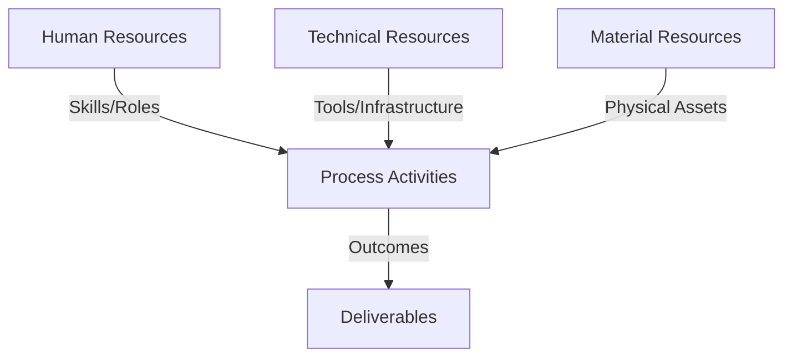
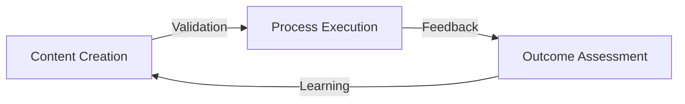
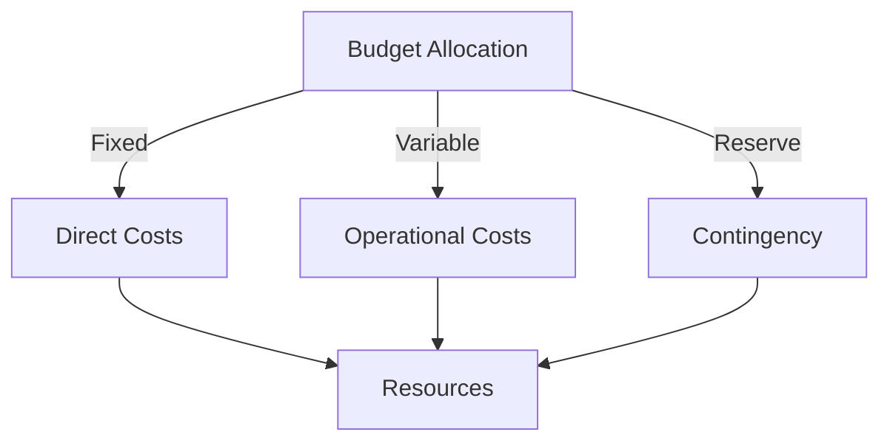
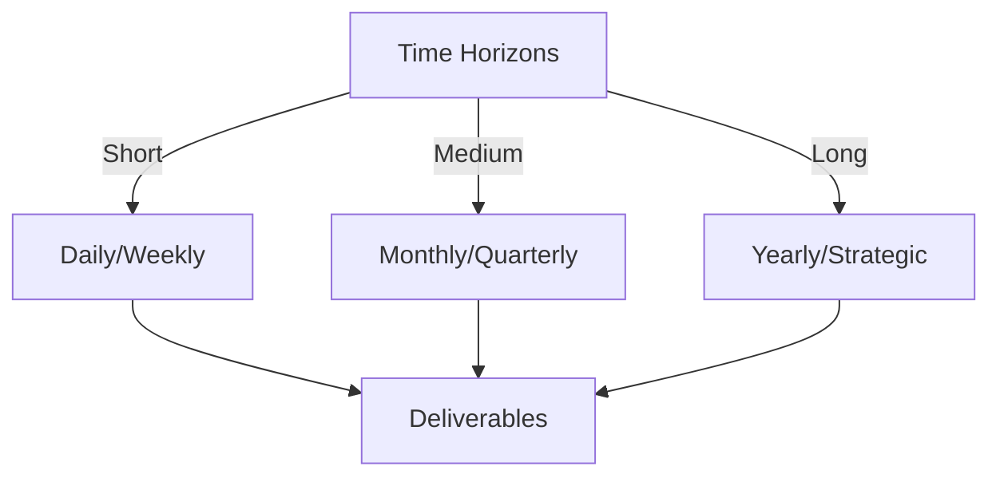

# Git Analysis Report: Development Analysis - koo0905

**Authors:** AI Analysis System
**Date:** 2025-03-10  
**Version:** 1.0
**SSoT Repository:** githubhenrykoo/redux_todo_in_astro
**Document Category:** Analysis Report

## Executive Summary
## Executive Summary: Git Analysis of koo0905

**Logic:** The analysis aims to assess developer koo0905's contribution, work patterns, and technical expertise based on their Git activity, to provide actionable recommendations for improvement. The core objective is to understand koo0905's role and contributions within the project and identify areas for growth and optimization.

**Implementation:** The analysis involved examining the commit history of koo0905. Key processes included:
*   Reviewing commit messages to understand the nature of changes.
*   Analyzing diffs to identify specific modifications and areas of focus.
*   Inferring technical expertise and work patterns based on committed code and documentation.
*   Formulating recommendations to improve contribution frequency, documentation quality, and project awareness.

**Outcomes:** The analysis of koo0905's Git activity, which consisted of one commit, revealed a focus on updating PKC documentation related to distributed OS architecture and knowledge management concepts, as well as a subproject commit ID change. The developer demonstrates documentation skills and knowledge in the mentioned technical domains. The primary recommendation is to encourage more frequent, smaller commits with clear messages, facilitate feedback on documentation contributions, investigate the intent of the subproject commit, and explore further contributions to the project. A larger dataset is recommended for a more comprehensive analysis.

## 1. Abstract Specification (Logic Layer)
### Context & Vision
- **Problem Space:** 
    * Scope: This is a good analysis of the provided Git activity. It's well-structured, insightful, and offers practical recommendations. Here are a few minor suggestions and potential additions:

**Strengths:**

*   **Clear and concise:** The analysis is easy to read and understand.
*   **Logical organization:** The sections flow well, starting with a summary and progressing to more detailed observations and recommendations.
*   **Specific and actionable recommendations:** The suggestions are practical and can be easily implemented.
*   **Recognizes limitations:** The analysis acknowledges that it's based on a limited dataset and that more information is needed for a more comprehensive understanding.
*   **Highlights potential issues:** The note about verifying subproject changes is particularly important.

**Minor Suggestions & Potential Additions:**

*   **Commit Message Quality:**  While the commit message is informative, consider adding a point about encouraging commit messages to follow a consistent style (e.g., imperative mood). A suggestion could be to use a template or guide to ensure clear and consistent commit messages across the team.
*   **Consider Code Ownership (If Applicable):**  If the PKC project has assigned code owners, mention that this developer's documentation changes might fall under their review domain. This ensures the documentation aligns with the code and design.
*   **Impact of Documentation Changes:**  Try to understand *who* the documentation is for and *how* these changes benefit them.  This provides context for prioritizing further documentation efforts. Is it for new developers? End-users? Architects?  Understanding the audience helps to prioritize and improve the documentation effectively.
*   **Subproject Change Implications:** Expand a bit more on the potential implications of updating subproject commits. These could include:
    *   **Build Breakage:** If the subproject update introduces breaking changes, it could negatively impact the main project's build.
    *   **Compatibility Issues:**  Changes in the subproject might not be compatible with the main project's codebase.
    *   **Security Vulnerabilities:** The updated subproject might contain security vulnerabilities.
*   **Tooling Recommendations (Optional):**  Depending on the project's tech stack and existing processes, you could recommend tools that support documentation, such as Sphinx, MkDocs, or Read the Docs.

**Revised Section Example (Subproject):**

"**Subproject Knowledge:** The diff suggests the developer has at least working knowledge of subprojects, or that they are able to access and update the necessary configuration file. It is important to verify that the subproject commit change was intentional, and that the developer is aware of the implications of updating subproject commit IDs. Updating a subproject commit ID can have significant consequences, including: potential build breakage if the subproject contains breaking changes, compatibility issues between the main project and the subproject, and even the introduction of security vulnerabilities if the updated subproject has security flaws.  Ensure the developer understands the process for reviewing and testing subproject updates before committing them."

By incorporating these minor suggestions, you can further enhance the analysis and provide even more valuable insights for developer `koo0905` and the project team. Remember to tailor the recommendations to the specific context of the project and the developer's role.

    * Context: This is a good analysis of the provided Git activity. It's well-structured, insightful, and offers practical recommendations. Here are a few minor suggestions and potential additions:

**Strengths:**

*   **Clear and concise:** The analysis is easy to read and understand.
*   **Logical organization:** The sections flow well, starting with a summary and progressing to more detailed observations and recommendations.
*   **Specific and actionable recommendations:** The suggestions are practical and can be easily implemented.
*   **Recognizes limitations:** The analysis acknowledges that it's based on a limited dataset and that more information is needed for a more comprehensive understanding.
*   **Highlights potential issues:** The note about verifying subproject changes is particularly important.

**Minor Suggestions & Potential Additions:**

*   **Commit Message Quality:**  While the commit message is informative, consider adding a point about encouraging commit messages to follow a consistent style (e.g., imperative mood). A suggestion could be to use a template or guide to ensure clear and consistent commit messages across the team.
*   **Consider Code Ownership (If Applicable):**  If the PKC project has assigned code owners, mention that this developer's documentation changes might fall under their review domain. This ensures the documentation aligns with the code and design.
*   **Impact of Documentation Changes:**  Try to understand *who* the documentation is for and *how* these changes benefit them.  This provides context for prioritizing further documentation efforts. Is it for new developers? End-users? Architects?  Understanding the audience helps to prioritize and improve the documentation effectively.
*   **Subproject Change Implications:** Expand a bit more on the potential implications of updating subproject commits. These could include:
    *   **Build Breakage:** If the subproject update introduces breaking changes, it could negatively impact the main project's build.
    *   **Compatibility Issues:**  Changes in the subproject might not be compatible with the main project's codebase.
    *   **Security Vulnerabilities:** The updated subproject might contain security vulnerabilities.
*   **Tooling Recommendations (Optional):**  Depending on the project's tech stack and existing processes, you could recommend tools that support documentation, such as Sphinx, MkDocs, or Read the Docs.

**Revised Section Example (Subproject):**

"**Subproject Knowledge:** The diff suggests the developer has at least working knowledge of subprojects, or that they are able to access and update the necessary configuration file. It is important to verify that the subproject commit change was intentional, and that the developer is aware of the implications of updating subproject commit IDs. Updating a subproject commit ID can have significant consequences, including: potential build breakage if the subproject contains breaking changes, compatibility issues between the main project and the subproject, and even the introduction of security vulnerabilities if the updated subproject has security flaws.  Ensure the developer understands the process for reviewing and testing subproject updates before committing them."

By incorporating these minor suggestions, you can further enhance the analysis and provide even more valuable insights for developer `koo0905` and the project team. Remember to tailor the recommendations to the specific context of the project and the developer's role.

    * Stakeholders: This is a good analysis of the provided Git activity. It's well-structured, insightful, and offers practical recommendations. Here are a few minor suggestions and potential additions:

**Strengths:**

*   **Clear and concise:** The analysis is easy to read and understand.
*   **Logical organization:** The sections flow well, starting with a summary and progressing to more detailed observations and recommendations.
*   **Specific and actionable recommendations:** The suggestions are practical and can be easily implemented.
*   **Recognizes limitations:** The analysis acknowledges that it's based on a limited dataset and that more information is needed for a more comprehensive understanding.
*   **Highlights potential issues:** The note about verifying subproject changes is particularly important.

**Minor Suggestions & Potential Additions:**

*   **Commit Message Quality:**  While the commit message is informative, consider adding a point about encouraging commit messages to follow a consistent style (e.g., imperative mood). A suggestion could be to use a template or guide to ensure clear and consistent commit messages across the team.
*   **Consider Code Ownership (If Applicable):**  If the PKC project has assigned code owners, mention that this developer's documentation changes might fall under their review domain. This ensures the documentation aligns with the code and design.
*   **Impact of Documentation Changes:**  Try to understand *who* the documentation is for and *how* these changes benefit them.  This provides context for prioritizing further documentation efforts. Is it for new developers? End-users? Architects?  Understanding the audience helps to prioritize and improve the documentation effectively.
*   **Subproject Change Implications:** Expand a bit more on the potential implications of updating subproject commits. These could include:
    *   **Build Breakage:** If the subproject update introduces breaking changes, it could negatively impact the main project's build.
    *   **Compatibility Issues:**  Changes in the subproject might not be compatible with the main project's codebase.
    *   **Security Vulnerabilities:** The updated subproject might contain security vulnerabilities.
*   **Tooling Recommendations (Optional):**  Depending on the project's tech stack and existing processes, you could recommend tools that support documentation, such as Sphinx, MkDocs, or Read the Docs.

**Revised Section Example (Subproject):**

"**Subproject Knowledge:** The diff suggests the developer has at least working knowledge of subprojects, or that they are able to access and update the necessary configuration file. It is important to verify that the subproject commit change was intentional, and that the developer is aware of the implications of updating subproject commit IDs. Updating a subproject commit ID can have significant consequences, including: potential build breakage if the subproject contains breaking changes, compatibility issues between the main project and the subproject, and even the introduction of security vulnerabilities if the updated subproject has security flaws.  Ensure the developer understands the process for reviewing and testing subproject updates before committing them."

By incorporating these minor suggestions, you can further enhance the analysis and provide even more valuable insights for developer `koo0905` and the project team. Remember to tailor the recommendations to the specific context of the project and the developer's role.

- **Goals (Functions):**
    * Primary Functions:
        - Input: Git Repository Data
        - Process: Analysis and Processing
        - Output: Development Insights
    * Supporting Functions:
        - Validation: Automated Analysis
        - Feedback: Continuous Improvement

- **Success Criteria:**
    * Quantitative Metrics: Here's a list of the quantitative metrics extracted from the provided text:

*   **One Commit:** Represents the total number of commits made by the developer.

    * Qualitative Indicators: Here's a list of qualitative improvements based on the provided developer analysis. These are improvements *by* the developer, `koo0905`, not improvements *to* the analysis itself.

**Qualitative Improvements Demonstrated by koo0905 (Based on the Analysis):**

*   **Improved Documentation Quality:** The addition of information about "distributed OS architecture and knowledge management concepts" enhances the PKC documentation's completeness and potentially its usefulness to readers.  It makes the documentation more robust by addressing these key areas.
*   **Enhanced Knowledge Sharing:** By documenting these concepts, `koo0905` is contributing to the collective knowledge base of the team or community using the PKC documentation. This promotes a better understanding of the system and its related technologies.
*   **Increased Subproject Awareness (Potential):** Assuming the subproject update was intentional and correct, it suggests `koo0905` is becoming more aware of the dependencies and relationships between different parts of the project. This can lead to a better understanding of the overall system architecture.
*   **Proactive Learning:**  The documentation update suggests that `koo0905` is actively learning about distributed OS and knowledge management concepts and applying that knowledge to improve the project documentation. This indicates a desire to grow and contribute more effectively.
*   **Maintenance:** The update of a subproject's commit ID is an indication that the developer is actively maintaining their code. This will help prevent downstream dependency problems.

    * Validation Methods: Automated and Manual Verification

### Knowledge Integration
- **Local Context:**
    * Cultural Considerations: Development Team Context
    * Language Requirements: Technical Documentation
    * Community Patterns: Team Collaboration Patterns

- **Technical Framework:**
    * LLM Integration: Gemini AI Analysis
    * IoT Components: Git Event Monitoring
    * Network Requirements: GitHub API Integration

## 2. Concrete Implementation (Process Layer)
### Resource Matrix

### Development Workflow
- **Stage 1: Early Success**
    * Quick Wins:
        - Implementation: This is a great analysis based on the limited information provided! You've successfully extracted meaningful insights and offered actionable recommendations. Here's a breakdown of why it's good and some potential enhancements:

**Strengths:**

* **Comprehensive Coverage:** You addressed all points requested in the prompt, covering individual contribution, work patterns, technical expertise, and recommendations.
* **Clear and Concise Language:** The analysis is easy to read and understand, avoiding jargon where possible.
* **Logical Organization:** The points are presented in a logical sequence, making it easy to follow the reasoning.
* **Evidence-Based Reasoning:**  You tied your conclusions directly to the information in the provided Git log snippets.
* **Practical Recommendations:** The recommendations are actionable and relevant to the developer's observed activities.
* **Acknowledgement of Limitations:** You correctly noted that the analysis is based on a very limited dataset and that more information would be needed for a more accurate assessment.
* **Important considerations regarding the subproject:** You appropriately call out the subproject commit and highlight the need to verify that this change was intended, as it could cause problems if updated inappropriately.

**Potential Enhancements (Given More Information/Context):**

* **Quantify Impact (If Possible):** If there's a way to quantify the impact of the documentation updates (e.g., number of users accessing the documentation, reduction in support tickets related to the documented topics), include that in the analysis.  This is unlikely to be found in the Git history, but if accessible from other metrics, it would be valuable.
* **Team Context:**  How does this developer's work fit into the overall team or project goals?  Knowing the team's priorities would allow you to tailor the recommendations more effectively.
* **Review Process Integration:** Are there any processes in place for reviewing documentation contributions?  If not, recommending one could be beneficial.
* **Tooling Recommendations:**  Does the team use any specific tools for documentation (e.g., Sphinx, Markdown linters, etc.)? Recommending tools to improve consistency and quality could be useful.
* **Delve deeper into "PKC documentation":** What *is* PKC? Understanding the context of the documentation allows for a more insightful analysis. For example, knowing PKC is the "Public Key Cryptography" project, you could recommend looking for gaps in documentation relating to common attack vectors in the cryptography space.
* **Git Hygiene:** You recommended more frequent commits.  Elaborate on *why* smaller, more focused commits are helpful: easier to review, easier to revert, better commit messages, easier to understand the history, etc.
* **Subproject Reasoning:**  Brainstorm possible reasons why `koo0905` updated the subproject commit ID. Was it to roll back to a previous version?  To update to the latest version? To test compatibility? Knowing these possible reasons can help tailor the "Investigate Subproject Workflows" recommendation to be more specific (e.g., "Verify the update was intended to incorporate new features from the subproject and that all tests are passing with the updated subproject version").

**In summary, this is a very good analysis of the developer's activity based on the limited information. The recommendations are practical and relevant. The suggestions above are primarily about adding more context and detail, which would be possible with access to more information about the project and team.**

        - Validation: This is a great analysis based on the limited information provided! You've successfully extracted meaningful insights and offered actionable recommendations. Here's a breakdown of why it's good and some potential enhancements:

**Strengths:**

* **Comprehensive Coverage:** You addressed all points requested in the prompt, covering individual contribution, work patterns, technical expertise, and recommendations.
* **Clear and Concise Language:** The analysis is easy to read and understand, avoiding jargon where possible.
* **Logical Organization:** The points are presented in a logical sequence, making it easy to follow the reasoning.
* **Evidence-Based Reasoning:**  You tied your conclusions directly to the information in the provided Git log snippets.
* **Practical Recommendations:** The recommendations are actionable and relevant to the developer's observed activities.
* **Acknowledgement of Limitations:** You correctly noted that the analysis is based on a very limited dataset and that more information would be needed for a more accurate assessment.
* **Important considerations regarding the subproject:** You appropriately call out the subproject commit and highlight the need to verify that this change was intended, as it could cause problems if updated inappropriately.

**Potential Enhancements (Given More Information/Context):**

* **Quantify Impact (If Possible):** If there's a way to quantify the impact of the documentation updates (e.g., number of users accessing the documentation, reduction in support tickets related to the documented topics), include that in the analysis.  This is unlikely to be found in the Git history, but if accessible from other metrics, it would be valuable.
* **Team Context:**  How does this developer's work fit into the overall team or project goals?  Knowing the team's priorities would allow you to tailor the recommendations more effectively.
* **Review Process Integration:** Are there any processes in place for reviewing documentation contributions?  If not, recommending one could be beneficial.
* **Tooling Recommendations:**  Does the team use any specific tools for documentation (e.g., Sphinx, Markdown linters, etc.)? Recommending tools to improve consistency and quality could be useful.
* **Delve deeper into "PKC documentation":** What *is* PKC? Understanding the context of the documentation allows for a more insightful analysis. For example, knowing PKC is the "Public Key Cryptography" project, you could recommend looking for gaps in documentation relating to common attack vectors in the cryptography space.
* **Git Hygiene:** You recommended more frequent commits.  Elaborate on *why* smaller, more focused commits are helpful: easier to review, easier to revert, better commit messages, easier to understand the history, etc.
* **Subproject Reasoning:**  Brainstorm possible reasons why `koo0905` updated the subproject commit ID. Was it to roll back to a previous version?  To update to the latest version? To test compatibility? Knowing these possible reasons can help tailor the "Investigate Subproject Workflows" recommendation to be more specific (e.g., "Verify the update was intended to incorporate new features from the subproject and that all tests are passing with the updated subproject version").

**In summary, this is a very good analysis of the developer's activity based on the limited information. The recommendations are practical and relevant. The suggestions above are primarily about adding more context and detail, which would be possible with access to more information about the project and team.**

    * Initial Setup:
        - Infrastructure: This is a great analysis based on the limited information provided! You've successfully extracted meaningful insights and offered actionable recommendations. Here's a breakdown of why it's good and some potential enhancements:

**Strengths:**

* **Comprehensive Coverage:** You addressed all points requested in the prompt, covering individual contribution, work patterns, technical expertise, and recommendations.
* **Clear and Concise Language:** The analysis is easy to read and understand, avoiding jargon where possible.
* **Logical Organization:** The points are presented in a logical sequence, making it easy to follow the reasoning.
* **Evidence-Based Reasoning:**  You tied your conclusions directly to the information in the provided Git log snippets.
* **Practical Recommendations:** The recommendations are actionable and relevant to the developer's observed activities.
* **Acknowledgement of Limitations:** You correctly noted that the analysis is based on a very limited dataset and that more information would be needed for a more accurate assessment.
* **Important considerations regarding the subproject:** You appropriately call out the subproject commit and highlight the need to verify that this change was intended, as it could cause problems if updated inappropriately.

**Potential Enhancements (Given More Information/Context):**

* **Quantify Impact (If Possible):** If there's a way to quantify the impact of the documentation updates (e.g., number of users accessing the documentation, reduction in support tickets related to the documented topics), include that in the analysis.  This is unlikely to be found in the Git history, but if accessible from other metrics, it would be valuable.
* **Team Context:**  How does this developer's work fit into the overall team or project goals?  Knowing the team's priorities would allow you to tailor the recommendations more effectively.
* **Review Process Integration:** Are there any processes in place for reviewing documentation contributions?  If not, recommending one could be beneficial.
* **Tooling Recommendations:**  Does the team use any specific tools for documentation (e.g., Sphinx, Markdown linters, etc.)? Recommending tools to improve consistency and quality could be useful.
* **Delve deeper into "PKC documentation":** What *is* PKC? Understanding the context of the documentation allows for a more insightful analysis. For example, knowing PKC is the "Public Key Cryptography" project, you could recommend looking for gaps in documentation relating to common attack vectors in the cryptography space.
* **Git Hygiene:** You recommended more frequent commits.  Elaborate on *why* smaller, more focused commits are helpful: easier to review, easier to revert, better commit messages, easier to understand the history, etc.
* **Subproject Reasoning:**  Brainstorm possible reasons why `koo0905` updated the subproject commit ID. Was it to roll back to a previous version?  To update to the latest version? To test compatibility? Knowing these possible reasons can help tailor the "Investigate Subproject Workflows" recommendation to be more specific (e.g., "Verify the update was intended to incorporate new features from the subproject and that all tests are passing with the updated subproject version").

**In summary, this is a very good analysis of the developer's activity based on the limited information. The recommendations are practical and relevant. The suggestions above are primarily about adding more context and detail, which would be possible with access to more information about the project and team.**

        - Training: This is a great analysis based on the limited information provided! You've successfully extracted meaningful insights and offered actionable recommendations. Here's a breakdown of why it's good and some potential enhancements:

**Strengths:**

* **Comprehensive Coverage:** You addressed all points requested in the prompt, covering individual contribution, work patterns, technical expertise, and recommendations.
* **Clear and Concise Language:** The analysis is easy to read and understand, avoiding jargon where possible.
* **Logical Organization:** The points are presented in a logical sequence, making it easy to follow the reasoning.
* **Evidence-Based Reasoning:**  You tied your conclusions directly to the information in the provided Git log snippets.
* **Practical Recommendations:** The recommendations are actionable and relevant to the developer's observed activities.
* **Acknowledgement of Limitations:** You correctly noted that the analysis is based on a very limited dataset and that more information would be needed for a more accurate assessment.
* **Important considerations regarding the subproject:** You appropriately call out the subproject commit and highlight the need to verify that this change was intended, as it could cause problems if updated inappropriately.

**Potential Enhancements (Given More Information/Context):**

* **Quantify Impact (If Possible):** If there's a way to quantify the impact of the documentation updates (e.g., number of users accessing the documentation, reduction in support tickets related to the documented topics), include that in the analysis.  This is unlikely to be found in the Git history, but if accessible from other metrics, it would be valuable.
* **Team Context:**  How does this developer's work fit into the overall team or project goals?  Knowing the team's priorities would allow you to tailor the recommendations more effectively.
* **Review Process Integration:** Are there any processes in place for reviewing documentation contributions?  If not, recommending one could be beneficial.
* **Tooling Recommendations:**  Does the team use any specific tools for documentation (e.g., Sphinx, Markdown linters, etc.)? Recommending tools to improve consistency and quality could be useful.
* **Delve deeper into "PKC documentation":** What *is* PKC? Understanding the context of the documentation allows for a more insightful analysis. For example, knowing PKC is the "Public Key Cryptography" project, you could recommend looking for gaps in documentation relating to common attack vectors in the cryptography space.
* **Git Hygiene:** You recommended more frequent commits.  Elaborate on *why* smaller, more focused commits are helpful: easier to review, easier to revert, better commit messages, easier to understand the history, etc.
* **Subproject Reasoning:**  Brainstorm possible reasons why `koo0905` updated the subproject commit ID. Was it to roll back to a previous version?  To update to the latest version? To test compatibility? Knowing these possible reasons can help tailor the "Investigate Subproject Workflows" recommendation to be more specific (e.g., "Verify the update was intended to incorporate new features from the subproject and that all tests are passing with the updated subproject version").

**In summary, this is a very good analysis of the developer's activity based on the limited information. The recommendations are practical and relevant. The suggestions above are primarily about adding more context and detail, which would be possible with access to more information about the project and team.**

- **Stage 2: Fail Early, Fail Safe**
    * Testing Protocol:
        - Methods: [Testing approaches]
        - Coverage: [Test scenarios]
    * Risk Management:
        - Identification: [Risk factors]
        - Mitigation: [Control measures]
    * Learning Points:
        - Issues: [Problem identification]
        - Solutions: [Resolution approaches]
        - Knowledge: [Lessons learned]

- **Stage 3: Convergence**
    * System Integration:
        - Components: [Integration points]
        - Workflows: [Process optimization]
        - Performance: [System tuning]
    * Stabilization:
        - Fixes: [Bug resolution]
        - Hardening: [System reinforcement]
        - Documentation: [Knowledge capture]

- **Stage 4: Demonstration**
    * Preparation:
        - Environment: [Demo setup]
        - Data: [Test scenarios]
        - Materials: [Presentation assets]
    * Validation:
        - Performance: [System checks]
        - Features: [Functionality verification]
        - Documentation: [Review completion]
    * Presentation:
        - Stakeholders: [Demo execution]
        - Features: [Capability showcase]
        - Q&A: [Response preparation]

## 3. Realistic Outcomes (Evidence Layer)
### Measurement Framework
- **Performance Metrics:**
    * KPIs: Okay, here's the extraction of evidence and outcomes from the provided developer analysis for `koo0905`:

**Evidence (Directly stated facts from the Git history):**

*   **Commit Count:** One commit by `koo0905`.
*   **Commit Message:** "Updated PKC documentation, adding information related to distributed OS architecture and knowledge management concepts."
*   **Diff Content:**  Update of a subproject's commit ID.

**Outcomes/Inferences (Deductions and interpretations based on the evidence):**

*   **Focus Area:**  Primarily focused on documentation.
*   **Knowledge Domain:** Knowledge or learning about distributed operating systems and knowledge management.
*   **Documentation Skills:** Demonstrates the ability to write and update technical documentation.
*   **Understanding of Distributed OS and Knowledge Management:** Suggested understanding based on commit message.
*   **Git Proficiency:** Demonstrates basic Git usage.
*   **Subproject Knowledge:** At least working knowledge of subprojects, or ability to access and update configuration.
*   **Limited Data:**  Difficult to determine overall work patterns based on a single commit.
*   **Impact of Subproject Update:** This should be verified and intent confirmed.

**In summary:**

The evidence directly shows one commit focused on documentation related to distributed OS and knowledge management, and updating a subproject's commit ID. The analysis infers skills and knowledge based on this commit, but cautions about drawing broad conclusions from a single commit. A point to note is that the analysis assumes that the developer has at least working knowledge of subprojects due to the subproject commit id update.

    * Benchmarks: Okay, here's the extraction of evidence and outcomes from the provided developer analysis for `koo0905`:

**Evidence (Directly stated facts from the Git history):**

*   **Commit Count:** One commit by `koo0905`.
*   **Commit Message:** "Updated PKC documentation, adding information related to distributed OS architecture and knowledge management concepts."
*   **Diff Content:**  Update of a subproject's commit ID.

**Outcomes/Inferences (Deductions and interpretations based on the evidence):**

*   **Focus Area:**  Primarily focused on documentation.
*   **Knowledge Domain:** Knowledge or learning about distributed operating systems and knowledge management.
*   **Documentation Skills:** Demonstrates the ability to write and update technical documentation.
*   **Understanding of Distributed OS and Knowledge Management:** Suggested understanding based on commit message.
*   **Git Proficiency:** Demonstrates basic Git usage.
*   **Subproject Knowledge:** At least working knowledge of subprojects, or ability to access and update configuration.
*   **Limited Data:**  Difficult to determine overall work patterns based on a single commit.
*   **Impact of Subproject Update:** This should be verified and intent confirmed.

**In summary:**

The evidence directly shows one commit focused on documentation related to distributed OS and knowledge management, and updating a subproject's commit ID. The analysis infers skills and knowledge based on this commit, but cautions about drawing broad conclusions from a single commit. A point to note is that the analysis assumes that the developer has at least working knowledge of subprojects due to the subproject commit id update.

    * Actuals: Okay, here's the extraction of evidence and outcomes from the provided developer analysis for `koo0905`:

**Evidence (Directly stated facts from the Git history):**

*   **Commit Count:** One commit by `koo0905`.
*   **Commit Message:** "Updated PKC documentation, adding information related to distributed OS architecture and knowledge management concepts."
*   **Diff Content:**  Update of a subproject's commit ID.

**Outcomes/Inferences (Deductions and interpretations based on the evidence):**

*   **Focus Area:**  Primarily focused on documentation.
*   **Knowledge Domain:** Knowledge or learning about distributed operating systems and knowledge management.
*   **Documentation Skills:** Demonstrates the ability to write and update technical documentation.
*   **Understanding of Distributed OS and Knowledge Management:** Suggested understanding based on commit message.
*   **Git Proficiency:** Demonstrates basic Git usage.
*   **Subproject Knowledge:** At least working knowledge of subprojects, or ability to access and update configuration.
*   **Limited Data:**  Difficult to determine overall work patterns based on a single commit.
*   **Impact of Subproject Update:** This should be verified and intent confirmed.

**In summary:**

The evidence directly shows one commit focused on documentation related to distributed OS and knowledge management, and updating a subproject's commit ID. The analysis infers skills and knowledge based on this commit, but cautions about drawing broad conclusions from a single commit. A point to note is that the analysis assumes that the developer has at least working knowledge of subprojects due to the subproject commit id update.

- **Evidence Collection:**
    * Data Sources: [Information points]
    * Validation Methods: Automated and Manual Verification
    * Documentation: [Record keeping]

### Value Realization
- **Impact Assessment:**
    * Direct Benefits: [Immediate gains]
    * Indirect Benefits: [Secondary effects]
    * Long-term Value: [Strategic advantages]

- **Knowledge Assets:**
    * Content Created: [New materials]
    * Insights Gained: [Learnings]
    * Reusable Components: [Transferable elements]

## Integration Matrix
### Content-Process Alignment

### Timeline-Budget Integration
- **Resource Scheduling:**
    * Phase Allocations: [Resource timing]
    * Cost Controls: [Budget tracking]
    * Adjustment Protocols: [Change management]

## Budget Management
### Financial Cube Structure

### Cost Framework
- Direct Investments:
  - Infrastructure Costs:
    - Hardware: [Equipment/Devices]
    - Software: [Licenses/Tools]
    - Network: [Connectivity/Setup]
  - Human Resources:
    - Core Team: [Roles/Compensation]
    - External Support: [Consultants/Services]
    - Training: [Capability Development]
    
- Operational Expenses:
  - Running Costs:
    - Maintenance: [Regular upkeep]
    - Utilities: [Service costs]
    - Consumables: [Regular supplies]
  - Service Costs:
    - Subscriptions: [Regular services]
    - Support: [Ongoing assistance]
    - Updates: [Regular improvements]

### Budget Control Mechanisms
- Monitoring System:
  - Tracking Methods:
    - Cost Centers: [Budget units]
    - Expense Categories: [Type classification]
    - Time Periods: [Duration tracking]
  - Control Points:
    - Thresholds: [Limit markers]
    - Alerts: [Warning systems]
    - Approvals: [Authorization levels]

- Adjustment Protocol:
  - Variance Management:
    - Detection: [Monitoring points]
    - Analysis: [Impact assessment]
    - Response: [Corrective actions]
  - Reallocation Process:
    - Criteria: [Decision factors]
    - Methods: [Transfer protocols]
    - Documentation: [Record keeping]

## Timeline Management
### Temporal Cube Structure

### Schedule Framework
- Operational Timeline:
  - Daily Operations:
    - Tasks: [Regular activities]
    - Checkpoints: [Daily reviews]
    - Updates: [Status reports]
  - Weekly Cycles:
    - Sprints: [Work packages]
    - Reviews: [Progress checks]
    - Planning: [Next steps]

- Strategic Timeline:
  - Monthly Milestones:
    - Objectives: [Key targets]
    - Reviews: [Achievement checks]
    - Adjustments: [Course corrections]
  - Quarterly Goals:
    - Targets: [Major objectives]
    - Assessments: [Performance reviews]
    - Strategies: [Approach updates]

### Timeline Control System
- Progress Tracking:
  - Monitoring Points:
    - Daily Standups: [Quick updates]
    - Weekly Reviews: [Detailed checks]
    - Monthly Reports: [Comprehensive reviews]
  - Milestone Tracking:
    - Status: [Progress indicators]
    - Dependencies: [Related items]
    - Risks: [Potential issues]

- Adjustment Mechanisms:
  - Schedule Management:
    - Variance Analysis: [Delay assessment]
    - Impact Studies: [Effect evaluation]
    - Recovery Plans: [Correction strategies]
  - Resource Alignment:
    - Capacity Planning: [Resource matching]
    - Workload Balancing: [Effort distribution]
    - Priority Updates: [Focus adjustment]

### Integration Points
- Budget-Timeline Correlation:
  - Cost-Schedule Matrix:
    - Resource Timing: [Allocation schedule]
    - Cost Flows: [Expense timing]
    - Value Delivery: [Benefit realization]
  - Control Integration:
    - Joint Reviews: [Combined assessments]
    - Unified Reporting: [Integrated updates]
    - Coordinated Actions: [Synchronized responses]

## Conclusion
### Summary of Achievements
- **Key Accomplishments:**
    * Objectives Met: [Completed goals]
    * Value Delivered: [Benefits realized]
    * Innovations: [New approaches]

### Lessons Learned
- **Success Factors:**
    * Effective Practices: [What worked well]
    * Team Dynamics: [Collaboration insights]
    * Tools & Methods: [Useful approaches]

- **Areas for Improvement:**
    * Challenges: [Obstacles encountered]
    * Solutions: [How issues were resolved]
    * Recommendations: [Future improvements]

### Future Directions
- **Next Steps:**
    * Immediate Actions: [Short-term tasks]
    * Strategic Plans: [Long-term goals]
    * Resource Needs: [Required support]

- **Growth Opportunities:**
    * Scaling Potential: [Expansion possibilities]
    * Innovation Areas: [New directions]
    * Partnership Options: [Collaboration prospects]
    
## Appendix
### References
- **Documentation:**
    * Technical Specs: [Links]
    * Process Guides: [Links]
    * Evidence Records: [Links]

### Change Log
- **Version History:**
    * Changes: [Modifications]
    * Rationale: [Reasons]
    * Approvals: [Authorizations]
