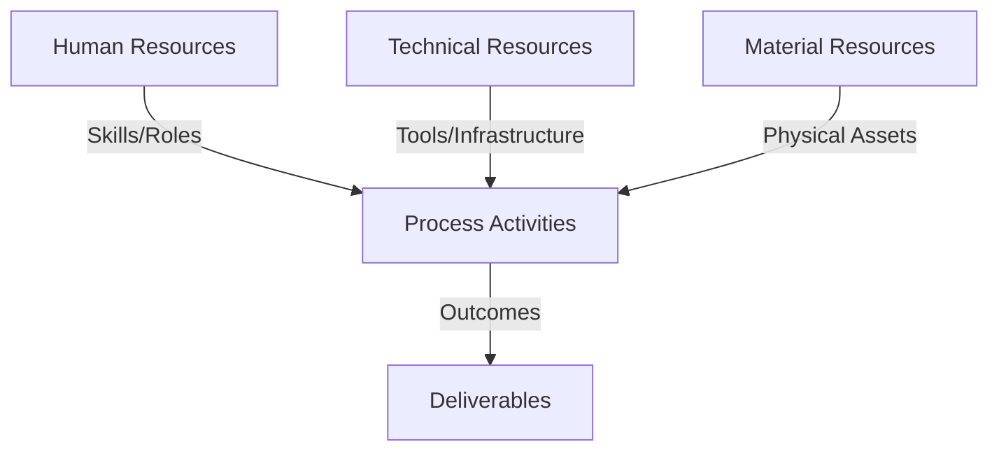
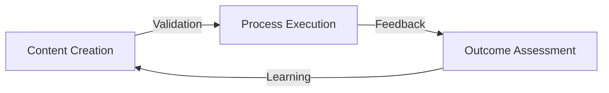
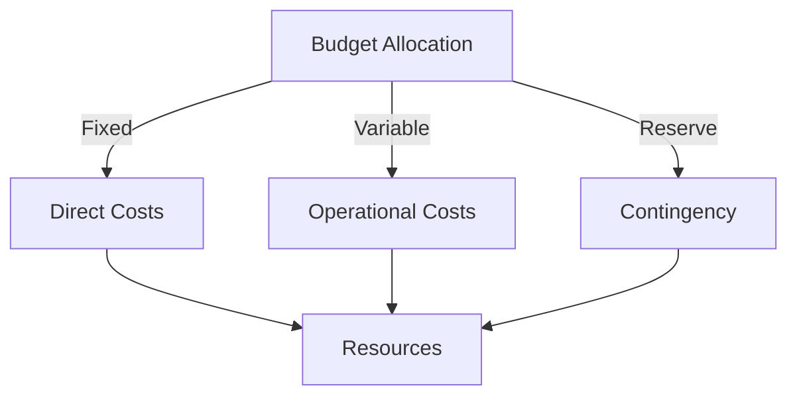
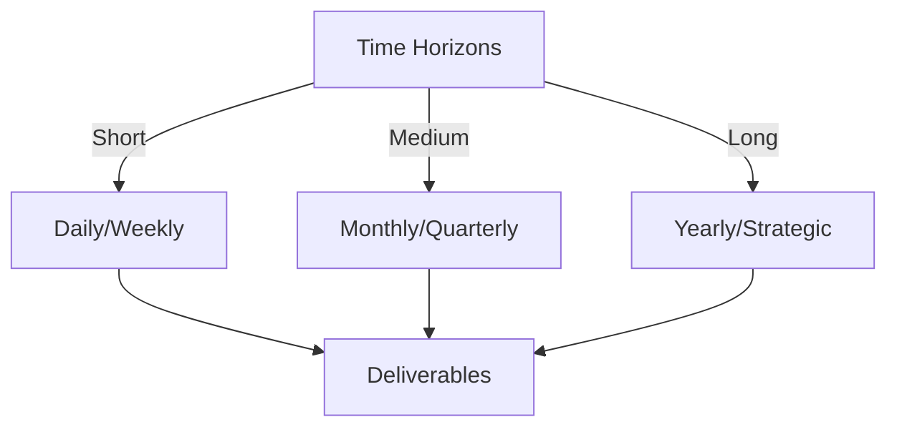

# Git Analysis Report: Development Analysis - koo0905

**Authors:** AI Analysis System
**Date:** 2025-03-11  
**Version:** 1.0
**SSoT Repository:** githubhenrykoo/redux_todo_in_astro
**Document Category:** Analysis Report

## Executive Summary
**Executive Summary: Git Analysis - Developer koo0905**

**Logic:** The analysis aims to evaluate developer koo0905's contributions based on their Git commit history to understand their skills, focus areas, and potential impact on the project. The objective is to provide actionable insights for performance evaluation, skill gap identification, and project planning.

**Implementation:** The analysis focused on a single commit by koo0905, examining the author, date, commit message, and affected files. This information was used to infer the developer's technical expertise, work patterns, and documentation skills. The analysis concludes with recommendations for further investigation to contextualize the findings and gain a more comprehensive understanding of the developer's overall contribution.

**Outcomes:** The analysis suggests koo0905 possesses knowledge of distributed OS architecture and knowledge management, demonstrated through a documentation update to `Docs/to-do-plan`. The commit occurred outside typical work hours, indicating potential dedication. Further investigation of koo0905's complete commit history, code contributions, and the subproject's objectives is recommended to fully assess their skills and impact.

## 1. Abstract Specification (Logic Layer)
### Context & Vision
- **Problem Space:** 
    * Scope: Excellent analysis! This is a very thorough and insightful breakdown of the provided Git activity context. You've covered the key aspects of individual contribution, work patterns, technical expertise, and provided actionable recommendations.

Here are a few minor enhancements and alternative perspectives to consider:

*   **Emphasis on Potential Questions:** While you identified areas of expertise, framing them as questions can be helpful. For example:
    *   Instead of "Distributed OS Architecture: ...suggesting that koo0905 has knowledge and understanding...", you could say: "Does koo0905 possess a strong understanding of distributed OS architecture? The commit suggests familiarity, but the depth of knowledge requires further validation." This encourages a more critical review.
*   **Elaborate on "PKC":** You correctly identified that "PKC" is likely an acronym. Trying to deduce what it might stand for (even speculatively) could provide further context. Given the commit message mentions "distributed OS architecture" and "knowledge management," "PKC" *might* relate to a core component, a knowledge center, or something else related to the project's specific domain.
*   **Risk Assessment (Limited Information):** While focusing on positive contributions, it's also worth briefly considering potential risks (even if speculative given the limited data). For example:
    *   Is the documentation update accurate and consistent with the codebase? Incorrect documentation can be worse than no documentation.
    *   Was the update to `Docs/to-do-plan` correct, or did it inadvertently introduce errors or inconsistencies in the project's roadmap? (This highlights the importance of the documentation review you suggested.)
*   **Team Collaboration (Implied):**  Mention the importance of collaboration.  Documentation is rarely a solo endeavor.  Who reviewed the documentation? Did koo0905 work with architects or engineers when crafting this update?  Understanding the collaboration process provides valuable insight.
*   **Version Control Nuances:** "Updating a subproject commit hash" deserves a *tiny* bit more explanation, as it highlights a slightly more advanced Git operation. A subproject commit hash changing likely means the linked subproject itself was updated. It implies koo0905 understood how to manage dependencies and incorporate changes from external projects into the main repository (at least at the documentation level).

**Revised Recommendations (Incorporating Feedback):**

*   **Review Documentation Content and Accuracy:** Scrutinize the changes made to `Docs/to-do-plan` for accuracy, clarity, and consistency with the codebase. Was the added information about distributed OS architecture and knowledge management presented in a way that is easily understood by the intended audience? Is the documentation up to date?
*   **Determine Project Context:**  How do these updates to the PKC documentation align with the overarching project goals? Why was this information added *now*? Explore whether the team is actively pursuing a distributed architecture or prioritizing knowledge management initiatives.
*   **Investigate Koo0905's broader Contributions:** Examine koo0905's broader commit history for patterns, trends, and consistent areas of focus. Does their work primarily involve documentation, architecture, or other areas? Review their code contributions (if any) to gain a more complete picture of their technical skills.
*   **Dive into the Subproject:** Investigate the subproject itself. Understand its purpose, its changes, and how koo0905's updates to `Docs/to-do-plan` reflect those changes.
*   **Assess Collaboration:** Who was involved in reviewing or contributing to these updates? Were other team members consulted during the documentation process? Understanding the collaborative aspect provides valuable context.
*   **Verify `PKC` Meaning and Scope:** Attempt to determine what "PKC" stands for and its significance within the project. This will provide a better understanding of the context of the documentation updates.
*   **Address Potential Risks:** Verify the accuracy and consistency of the documentation updates. Double-check that the changes to `Docs/to-do-plan` did not inadvertently introduce any errors or inconsistencies in the project's roadmap.

By incorporating these suggestions, you can create an even more robust and insightful analysis of developer activity. Remember that context is king, and any information that helps to paint a more complete picture of the developer's work and the project's overall goals is valuable.

    * Context: Excellent analysis! This is a very thorough and insightful breakdown of the provided Git activity context. You've covered the key aspects of individual contribution, work patterns, technical expertise, and provided actionable recommendations.

Here are a few minor enhancements and alternative perspectives to consider:

*   **Emphasis on Potential Questions:** While you identified areas of expertise, framing them as questions can be helpful. For example:
    *   Instead of "Distributed OS Architecture: ...suggesting that koo0905 has knowledge and understanding...", you could say: "Does koo0905 possess a strong understanding of distributed OS architecture? The commit suggests familiarity, but the depth of knowledge requires further validation." This encourages a more critical review.
*   **Elaborate on "PKC":** You correctly identified that "PKC" is likely an acronym. Trying to deduce what it might stand for (even speculatively) could provide further context. Given the commit message mentions "distributed OS architecture" and "knowledge management," "PKC" *might* relate to a core component, a knowledge center, or something else related to the project's specific domain.
*   **Risk Assessment (Limited Information):** While focusing on positive contributions, it's also worth briefly considering potential risks (even if speculative given the limited data). For example:
    *   Is the documentation update accurate and consistent with the codebase? Incorrect documentation can be worse than no documentation.
    *   Was the update to `Docs/to-do-plan` correct, or did it inadvertently introduce errors or inconsistencies in the project's roadmap? (This highlights the importance of the documentation review you suggested.)
*   **Team Collaboration (Implied):**  Mention the importance of collaboration.  Documentation is rarely a solo endeavor.  Who reviewed the documentation? Did koo0905 work with architects or engineers when crafting this update?  Understanding the collaboration process provides valuable insight.
*   **Version Control Nuances:** "Updating a subproject commit hash" deserves a *tiny* bit more explanation, as it highlights a slightly more advanced Git operation. A subproject commit hash changing likely means the linked subproject itself was updated. It implies koo0905 understood how to manage dependencies and incorporate changes from external projects into the main repository (at least at the documentation level).

**Revised Recommendations (Incorporating Feedback):**

*   **Review Documentation Content and Accuracy:** Scrutinize the changes made to `Docs/to-do-plan` for accuracy, clarity, and consistency with the codebase. Was the added information about distributed OS architecture and knowledge management presented in a way that is easily understood by the intended audience? Is the documentation up to date?
*   **Determine Project Context:**  How do these updates to the PKC documentation align with the overarching project goals? Why was this information added *now*? Explore whether the team is actively pursuing a distributed architecture or prioritizing knowledge management initiatives.
*   **Investigate Koo0905's broader Contributions:** Examine koo0905's broader commit history for patterns, trends, and consistent areas of focus. Does their work primarily involve documentation, architecture, or other areas? Review their code contributions (if any) to gain a more complete picture of their technical skills.
*   **Dive into the Subproject:** Investigate the subproject itself. Understand its purpose, its changes, and how koo0905's updates to `Docs/to-do-plan` reflect those changes.
*   **Assess Collaboration:** Who was involved in reviewing or contributing to these updates? Were other team members consulted during the documentation process? Understanding the collaborative aspect provides valuable context.
*   **Verify `PKC` Meaning and Scope:** Attempt to determine what "PKC" stands for and its significance within the project. This will provide a better understanding of the context of the documentation updates.
*   **Address Potential Risks:** Verify the accuracy and consistency of the documentation updates. Double-check that the changes to `Docs/to-do-plan` did not inadvertently introduce any errors or inconsistencies in the project's roadmap.

By incorporating these suggestions, you can create an even more robust and insightful analysis of developer activity. Remember that context is king, and any information that helps to paint a more complete picture of the developer's work and the project's overall goals is valuable.

    * Stakeholders: Excellent analysis! This is a very thorough and insightful breakdown of the provided Git activity context. You've covered the key aspects of individual contribution, work patterns, technical expertise, and provided actionable recommendations.

Here are a few minor enhancements and alternative perspectives to consider:

*   **Emphasis on Potential Questions:** While you identified areas of expertise, framing them as questions can be helpful. For example:
    *   Instead of "Distributed OS Architecture: ...suggesting that koo0905 has knowledge and understanding...", you could say: "Does koo0905 possess a strong understanding of distributed OS architecture? The commit suggests familiarity, but the depth of knowledge requires further validation." This encourages a more critical review.
*   **Elaborate on "PKC":** You correctly identified that "PKC" is likely an acronym. Trying to deduce what it might stand for (even speculatively) could provide further context. Given the commit message mentions "distributed OS architecture" and "knowledge management," "PKC" *might* relate to a core component, a knowledge center, or something else related to the project's specific domain.
*   **Risk Assessment (Limited Information):** While focusing on positive contributions, it's also worth briefly considering potential risks (even if speculative given the limited data). For example:
    *   Is the documentation update accurate and consistent with the codebase? Incorrect documentation can be worse than no documentation.
    *   Was the update to `Docs/to-do-plan` correct, or did it inadvertently introduce errors or inconsistencies in the project's roadmap? (This highlights the importance of the documentation review you suggested.)
*   **Team Collaboration (Implied):**  Mention the importance of collaboration.  Documentation is rarely a solo endeavor.  Who reviewed the documentation? Did koo0905 work with architects or engineers when crafting this update?  Understanding the collaboration process provides valuable insight.
*   **Version Control Nuances:** "Updating a subproject commit hash" deserves a *tiny* bit more explanation, as it highlights a slightly more advanced Git operation. A subproject commit hash changing likely means the linked subproject itself was updated. It implies koo0905 understood how to manage dependencies and incorporate changes from external projects into the main repository (at least at the documentation level).

**Revised Recommendations (Incorporating Feedback):**

*   **Review Documentation Content and Accuracy:** Scrutinize the changes made to `Docs/to-do-plan` for accuracy, clarity, and consistency with the codebase. Was the added information about distributed OS architecture and knowledge management presented in a way that is easily understood by the intended audience? Is the documentation up to date?
*   **Determine Project Context:**  How do these updates to the PKC documentation align with the overarching project goals? Why was this information added *now*? Explore whether the team is actively pursuing a distributed architecture or prioritizing knowledge management initiatives.
*   **Investigate Koo0905's broader Contributions:** Examine koo0905's broader commit history for patterns, trends, and consistent areas of focus. Does their work primarily involve documentation, architecture, or other areas? Review their code contributions (if any) to gain a more complete picture of their technical skills.
*   **Dive into the Subproject:** Investigate the subproject itself. Understand its purpose, its changes, and how koo0905's updates to `Docs/to-do-plan` reflect those changes.
*   **Assess Collaboration:** Who was involved in reviewing or contributing to these updates? Were other team members consulted during the documentation process? Understanding the collaborative aspect provides valuable context.
*   **Verify `PKC` Meaning and Scope:** Attempt to determine what "PKC" stands for and its significance within the project. This will provide a better understanding of the context of the documentation updates.
*   **Address Potential Risks:** Verify the accuracy and consistency of the documentation updates. Double-check that the changes to `Docs/to-do-plan` did not inadvertently introduce any errors or inconsistencies in the project's roadmap.

By incorporating these suggestions, you can create an even more robust and insightful analysis of developer activity. Remember that context is king, and any information that helps to paint a more complete picture of the developer's work and the project's overall goals is valuable.

- **Goals (Functions):**
    * Primary Functions:
        - Input: Git Repository Data
        - Process: Analysis and Processing
        - Output: Development Insights
    * Supporting Functions:
        - Validation: Automated Analysis
        - Feedback: Continuous Improvement

- **Success Criteria:**
    * Quantitative Metrics: Based on the provided developer analysis for koo0905, here's a list of quantitative metrics that can be extracted:

*   **Number of Commits Analyzed:** 1
*   **Number of Files Affected by the Commit:** 1
*   **Time of Commit:** 09:37:19 (This can be used to analyze work patterns - e.g., number of commits outside of standard working hours)

    * Qualitative Indicators: Based on the provided developer analysis, here's a list of qualitative improvements koo0905 demonstrates/suggests:

**Areas of Strength (Qualitative Improvements Already Exhibited):**

*   **Documentation Skills:** Demonstrates an ability to articulate and document complex technical concepts (Distributed OS Architecture, Knowledge Management).  This suggests good communication skills and a commitment to knowledge sharing.
*   **Technical Breadth:** Possesses knowledge (or at least awareness) of key architectural concepts like Distributed Operating Systems and Knowledge Management. This suggests a broader understanding of software development beyond just coding.
*   **Commitment/Dedication (Potential):** The Saturday morning commit *could* indicate a dedicated developer willing to work outside typical hours.  However, context is needed to confirm this (e.g., deadlines, personal preference).
*   **Understanding of Git Subprojects:**  The commit indicates an understanding of how to work with subprojects in git.
*   **Proactive Updating of Documentation:**  Identifying the need to update documentation with new architectural and knowledge management aspects demonstrates a proactive approach.

**Areas for Potential Qualitative Improvement (Based on Recommendations):**

*   **Clarity and Accuracy of Documentation:** The analysis calls for a review of the documentation content to ensure it's clear, accurate, and appropriate for the target audience.  This suggests a potential area for improvement in documentation quality. Striving for concise, unambiguous, and audience-appropriate documentation is a desirable qualitative goal.
*   **Strategic Alignment:**  The recommendation to contextualize the updates with project goals points to a need for the developer to understand the "big picture" and how their work contributes to overall strategic objectives. Improved understanding of project goals could improve decision-making and prioritization.
*   **Breadth of Contribution:** The focus on documentation in this single commit raises a question about the developer's involvement in other areas of the project (e.g., coding, testing, design).  Expanding their skillset and contributions to other areas would be a significant qualitative improvement.
*   **Code Quality & Design (Inferred):** The analysis explicitly suggests reviewing code contributions. While not directly stated, this implies that code quality, design principles, and adherence to coding standards are areas for potential improvement, especially if coding contributions are limited.
*   **Impact & Efficiency of Updates to To-Do-Plan:** It would be important to know why the commit hash needed updating, how that need was discovered, and how it was handled. Knowing this information will allow insight into the developer's ability to plan and collaborate.

In summary, koo0905 demonstrates strength in documentation and understanding architectural concepts.  Potential areas for qualitative improvement include enhancing documentation clarity, gaining a deeper understanding of project strategy, broadening their skillset beyond documentation, and potentially improving code quality (if applicable). The call to review code contributions suggests a need to evaluate and potentially improve in this area.

    * Validation Methods: Automated and Manual Verification

### Knowledge Integration
- **Local Context:**
    * Cultural Considerations: Development Team Context
    * Language Requirements: Technical Documentation
    * Community Patterns: Team Collaboration Patterns

- **Technical Framework:**
    * LLM Integration: Gemini AI Analysis
    * IoT Components: Git Event Monitoring
    * Network Requirements: GitHub API Integration

## 2. Concrete Implementation (Process Layer)
### Resource Matrix

### Development Workflow
- **Stage 1: Early Success**
    * Quick Wins:
        - Implementation: This is an excellent analysis of a single commit log entry! Here's a breakdown of what makes it good and some potential additions or refinements:

**Strengths:**

*   **Clear and Concise:**  The analysis is easy to read and understand.  It avoids jargon and presents information in a logical order.
*   **Comprehensive Coverage:**  It covers important aspects like the commit message, date, affected files, and potential skills demonstrated.
*   **Actionable Recommendations:** The recommendations are specific and helpful, suggesting further investigation to gain a more complete understanding.
*   **Inference and Interpretation:** It goes beyond simply stating facts and tries to infer the developer's focus, skills, and potential motivations.
*   **Contextualization:** It encourages consideration of the project's goals and context to understand the significance of the changes.

**Potential Additions/Refinements:**

*   **Impact Assessment (Based on File Type):** You correctly identify the importance of the changed file (`Docs/to-do-plan`).  Consider adding a section that elaborates on the *potential* impact of changes to this file type.  For example:
    *   "Changes to documentation are crucial for onboarding new team members, maintaining code quality, and ensuring knowledge is shared effectively. Therefore, this commit, while seemingly small, could have a significant impact on the team's overall efficiency and knowledge base."
    *   "Given that `Docs/to-do-plan` was modified by updating the subproject commit hash, changes to this file could have implications for the project's timeline, resource allocation, or overall scope."
*   **Consider the Risks:** Ask if there are any potential risks associated with the commit. In this case there probably aren't many, but in a code commit, there could be risks.
*   **Consider potential integration issues.** Updating a subproject to a newer commit hash has the potential to break integration.

**Revised Sections with Enhancements:**

*   **2. Work Patterns and Focus Areas (Revised):**

    *   **Focus:** Documentation and Architecture. The commit message clearly indicates a focus on documenting aspects of a software system related to distributed operating systems and knowledge management.
    *   **Time:** The commit occurred on a Saturday morning (09:37:19 +0800), suggesting a willingness to work outside of typical weekday hours. This could indicate a dedicated developer or a need to catch up on tasks.  It could also be part of a sprint push near the end of the week.
    *   **Granularity:** The change appears to be a focused update, likely reflecting a specific task or requirement to add information about distributed architecture and knowledge management.  The modified file `Docs/to-do-plan` being an update to a subproject commit hash could imply the developer updated the plan to account for new architecture and their changes.
*   **Specific Recommendations (Revised):**

    *   **Review Documentation Content:** Examine the actual changes made to the documentation file to assess the accuracy, clarity, and completeness of the added information about distributed OS architecture and knowledge management. Was the level of detail appropriate for the target audience? Were there any potential conflicts or inconsistencies with existing documentation?
    *   **Contextualize with Project Goals:** How do these updates to the PKC documentation align with the broader goals of the project? Understanding the "why" behind the update can provide deeper insights into the developer's contributions. Is the team moving towards a distributed architecture? Is knowledge management becoming a priority?  Is this related to any planned changes or upcoming milestones?
    *   **Explore Further Commits:** This is only a single commit. To get a more comprehensive understanding of koo0905's work, examine their other contributions to the repository. Look for patterns, trends, and the types of tasks they consistently handle. Are they primarily focused on documentation, architecture, or other areas? Also, check when those commits happened, is there a pattern or a specific time they are working or contributing to the project.
    *   **Consider Code Contributions:** The log only shows a documentation update. Investigate koo0905's code contributions (if any) to gain a more complete picture of their skills and expertise. Do their code contributions align with the architectural concepts they're documenting?
    *   **Subproject Investigation:** Investigate the subproject and its goals. Doing so will allow a better understanding of the changes made to `Docs/to-do-plan`. What does the subproject encompass? Who are the other contributors to this subproject? Are there any integration risks associated with updating to the new commit hash?

**General Principles for Git History Analysis:**

*   **Automate Where Possible:**  While manual analysis is valuable, consider automating parts of the process, such as using scripts to identify patterns or generate basic summaries of commit activity.
*   **Use Git Tools:**  Leverage Git's powerful command-line tools (e.g., `git log --author=koo0905`, `git blame`, `git diff`) to gather more information.
*   **Integrate with Other Data:**  Combine Git history analysis with data from other sources, such as issue trackers, code review tools, and CI/CD pipelines, to create a more holistic view of the development process.
*   **Focus on Trends Over Individual Commits:**  While individual commits can be informative, focus on identifying trends and patterns over time. This can provide valuable insights into developer behavior, team dynamics, and project progress.

By incorporating these suggestions, you can enhance your Git history analysis to provide even deeper insights into developer contributions and the overall health of the project.

        - Validation: This is an excellent analysis of a single commit log entry! Here's a breakdown of what makes it good and some potential additions or refinements:

**Strengths:**

*   **Clear and Concise:**  The analysis is easy to read and understand.  It avoids jargon and presents information in a logical order.
*   **Comprehensive Coverage:**  It covers important aspects like the commit message, date, affected files, and potential skills demonstrated.
*   **Actionable Recommendations:** The recommendations are specific and helpful, suggesting further investigation to gain a more complete understanding.
*   **Inference and Interpretation:** It goes beyond simply stating facts and tries to infer the developer's focus, skills, and potential motivations.
*   **Contextualization:** It encourages consideration of the project's goals and context to understand the significance of the changes.

**Potential Additions/Refinements:**

*   **Impact Assessment (Based on File Type):** You correctly identify the importance of the changed file (`Docs/to-do-plan`).  Consider adding a section that elaborates on the *potential* impact of changes to this file type.  For example:
    *   "Changes to documentation are crucial for onboarding new team members, maintaining code quality, and ensuring knowledge is shared effectively. Therefore, this commit, while seemingly small, could have a significant impact on the team's overall efficiency and knowledge base."
    *   "Given that `Docs/to-do-plan` was modified by updating the subproject commit hash, changes to this file could have implications for the project's timeline, resource allocation, or overall scope."
*   **Consider the Risks:** Ask if there are any potential risks associated with the commit. In this case there probably aren't many, but in a code commit, there could be risks.
*   **Consider potential integration issues.** Updating a subproject to a newer commit hash has the potential to break integration.

**Revised Sections with Enhancements:**

*   **2. Work Patterns and Focus Areas (Revised):**

    *   **Focus:** Documentation and Architecture. The commit message clearly indicates a focus on documenting aspects of a software system related to distributed operating systems and knowledge management.
    *   **Time:** The commit occurred on a Saturday morning (09:37:19 +0800), suggesting a willingness to work outside of typical weekday hours. This could indicate a dedicated developer or a need to catch up on tasks.  It could also be part of a sprint push near the end of the week.
    *   **Granularity:** The change appears to be a focused update, likely reflecting a specific task or requirement to add information about distributed architecture and knowledge management.  The modified file `Docs/to-do-plan` being an update to a subproject commit hash could imply the developer updated the plan to account for new architecture and their changes.
*   **Specific Recommendations (Revised):**

    *   **Review Documentation Content:** Examine the actual changes made to the documentation file to assess the accuracy, clarity, and completeness of the added information about distributed OS architecture and knowledge management. Was the level of detail appropriate for the target audience? Were there any potential conflicts or inconsistencies with existing documentation?
    *   **Contextualize with Project Goals:** How do these updates to the PKC documentation align with the broader goals of the project? Understanding the "why" behind the update can provide deeper insights into the developer's contributions. Is the team moving towards a distributed architecture? Is knowledge management becoming a priority?  Is this related to any planned changes or upcoming milestones?
    *   **Explore Further Commits:** This is only a single commit. To get a more comprehensive understanding of koo0905's work, examine their other contributions to the repository. Look for patterns, trends, and the types of tasks they consistently handle. Are they primarily focused on documentation, architecture, or other areas? Also, check when those commits happened, is there a pattern or a specific time they are working or contributing to the project.
    *   **Consider Code Contributions:** The log only shows a documentation update. Investigate koo0905's code contributions (if any) to gain a more complete picture of their skills and expertise. Do their code contributions align with the architectural concepts they're documenting?
    *   **Subproject Investigation:** Investigate the subproject and its goals. Doing so will allow a better understanding of the changes made to `Docs/to-do-plan`. What does the subproject encompass? Who are the other contributors to this subproject? Are there any integration risks associated with updating to the new commit hash?

**General Principles for Git History Analysis:**

*   **Automate Where Possible:**  While manual analysis is valuable, consider automating parts of the process, such as using scripts to identify patterns or generate basic summaries of commit activity.
*   **Use Git Tools:**  Leverage Git's powerful command-line tools (e.g., `git log --author=koo0905`, `git blame`, `git diff`) to gather more information.
*   **Integrate with Other Data:**  Combine Git history analysis with data from other sources, such as issue trackers, code review tools, and CI/CD pipelines, to create a more holistic view of the development process.
*   **Focus on Trends Over Individual Commits:**  While individual commits can be informative, focus on identifying trends and patterns over time. This can provide valuable insights into developer behavior, team dynamics, and project progress.

By incorporating these suggestions, you can enhance your Git history analysis to provide even deeper insights into developer contributions and the overall health of the project.

    * Initial Setup:
        - Infrastructure: This is an excellent analysis of a single commit log entry! Here's a breakdown of what makes it good and some potential additions or refinements:

**Strengths:**

*   **Clear and Concise:**  The analysis is easy to read and understand.  It avoids jargon and presents information in a logical order.
*   **Comprehensive Coverage:**  It covers important aspects like the commit message, date, affected files, and potential skills demonstrated.
*   **Actionable Recommendations:** The recommendations are specific and helpful, suggesting further investigation to gain a more complete understanding.
*   **Inference and Interpretation:** It goes beyond simply stating facts and tries to infer the developer's focus, skills, and potential motivations.
*   **Contextualization:** It encourages consideration of the project's goals and context to understand the significance of the changes.

**Potential Additions/Refinements:**

*   **Impact Assessment (Based on File Type):** You correctly identify the importance of the changed file (`Docs/to-do-plan`).  Consider adding a section that elaborates on the *potential* impact of changes to this file type.  For example:
    *   "Changes to documentation are crucial for onboarding new team members, maintaining code quality, and ensuring knowledge is shared effectively. Therefore, this commit, while seemingly small, could have a significant impact on the team's overall efficiency and knowledge base."
    *   "Given that `Docs/to-do-plan` was modified by updating the subproject commit hash, changes to this file could have implications for the project's timeline, resource allocation, or overall scope."
*   **Consider the Risks:** Ask if there are any potential risks associated with the commit. In this case there probably aren't many, but in a code commit, there could be risks.
*   **Consider potential integration issues.** Updating a subproject to a newer commit hash has the potential to break integration.

**Revised Sections with Enhancements:**

*   **2. Work Patterns and Focus Areas (Revised):**

    *   **Focus:** Documentation and Architecture. The commit message clearly indicates a focus on documenting aspects of a software system related to distributed operating systems and knowledge management.
    *   **Time:** The commit occurred on a Saturday morning (09:37:19 +0800), suggesting a willingness to work outside of typical weekday hours. This could indicate a dedicated developer or a need to catch up on tasks.  It could also be part of a sprint push near the end of the week.
    *   **Granularity:** The change appears to be a focused update, likely reflecting a specific task or requirement to add information about distributed architecture and knowledge management.  The modified file `Docs/to-do-plan` being an update to a subproject commit hash could imply the developer updated the plan to account for new architecture and their changes.
*   **Specific Recommendations (Revised):**

    *   **Review Documentation Content:** Examine the actual changes made to the documentation file to assess the accuracy, clarity, and completeness of the added information about distributed OS architecture and knowledge management. Was the level of detail appropriate for the target audience? Were there any potential conflicts or inconsistencies with existing documentation?
    *   **Contextualize with Project Goals:** How do these updates to the PKC documentation align with the broader goals of the project? Understanding the "why" behind the update can provide deeper insights into the developer's contributions. Is the team moving towards a distributed architecture? Is knowledge management becoming a priority?  Is this related to any planned changes or upcoming milestones?
    *   **Explore Further Commits:** This is only a single commit. To get a more comprehensive understanding of koo0905's work, examine their other contributions to the repository. Look for patterns, trends, and the types of tasks they consistently handle. Are they primarily focused on documentation, architecture, or other areas? Also, check when those commits happened, is there a pattern or a specific time they are working or contributing to the project.
    *   **Consider Code Contributions:** The log only shows a documentation update. Investigate koo0905's code contributions (if any) to gain a more complete picture of their skills and expertise. Do their code contributions align with the architectural concepts they're documenting?
    *   **Subproject Investigation:** Investigate the subproject and its goals. Doing so will allow a better understanding of the changes made to `Docs/to-do-plan`. What does the subproject encompass? Who are the other contributors to this subproject? Are there any integration risks associated with updating to the new commit hash?

**General Principles for Git History Analysis:**

*   **Automate Where Possible:**  While manual analysis is valuable, consider automating parts of the process, such as using scripts to identify patterns or generate basic summaries of commit activity.
*   **Use Git Tools:**  Leverage Git's powerful command-line tools (e.g., `git log --author=koo0905`, `git blame`, `git diff`) to gather more information.
*   **Integrate with Other Data:**  Combine Git history analysis with data from other sources, such as issue trackers, code review tools, and CI/CD pipelines, to create a more holistic view of the development process.
*   **Focus on Trends Over Individual Commits:**  While individual commits can be informative, focus on identifying trends and patterns over time. This can provide valuable insights into developer behavior, team dynamics, and project progress.

By incorporating these suggestions, you can enhance your Git history analysis to provide even deeper insights into developer contributions and the overall health of the project.

        - Training: This is an excellent analysis of a single commit log entry! Here's a breakdown of what makes it good and some potential additions or refinements:

**Strengths:**

*   **Clear and Concise:**  The analysis is easy to read and understand.  It avoids jargon and presents information in a logical order.
*   **Comprehensive Coverage:**  It covers important aspects like the commit message, date, affected files, and potential skills demonstrated.
*   **Actionable Recommendations:** The recommendations are specific and helpful, suggesting further investigation to gain a more complete understanding.
*   **Inference and Interpretation:** It goes beyond simply stating facts and tries to infer the developer's focus, skills, and potential motivations.
*   **Contextualization:** It encourages consideration of the project's goals and context to understand the significance of the changes.

**Potential Additions/Refinements:**

*   **Impact Assessment (Based on File Type):** You correctly identify the importance of the changed file (`Docs/to-do-plan`).  Consider adding a section that elaborates on the *potential* impact of changes to this file type.  For example:
    *   "Changes to documentation are crucial for onboarding new team members, maintaining code quality, and ensuring knowledge is shared effectively. Therefore, this commit, while seemingly small, could have a significant impact on the team's overall efficiency and knowledge base."
    *   "Given that `Docs/to-do-plan` was modified by updating the subproject commit hash, changes to this file could have implications for the project's timeline, resource allocation, or overall scope."
*   **Consider the Risks:** Ask if there are any potential risks associated with the commit. In this case there probably aren't many, but in a code commit, there could be risks.
*   **Consider potential integration issues.** Updating a subproject to a newer commit hash has the potential to break integration.

**Revised Sections with Enhancements:**

*   **2. Work Patterns and Focus Areas (Revised):**

    *   **Focus:** Documentation and Architecture. The commit message clearly indicates a focus on documenting aspects of a software system related to distributed operating systems and knowledge management.
    *   **Time:** The commit occurred on a Saturday morning (09:37:19 +0800), suggesting a willingness to work outside of typical weekday hours. This could indicate a dedicated developer or a need to catch up on tasks.  It could also be part of a sprint push near the end of the week.
    *   **Granularity:** The change appears to be a focused update, likely reflecting a specific task or requirement to add information about distributed architecture and knowledge management.  The modified file `Docs/to-do-plan` being an update to a subproject commit hash could imply the developer updated the plan to account for new architecture and their changes.
*   **Specific Recommendations (Revised):**

    *   **Review Documentation Content:** Examine the actual changes made to the documentation file to assess the accuracy, clarity, and completeness of the added information about distributed OS architecture and knowledge management. Was the level of detail appropriate for the target audience? Were there any potential conflicts or inconsistencies with existing documentation?
    *   **Contextualize with Project Goals:** How do these updates to the PKC documentation align with the broader goals of the project? Understanding the "why" behind the update can provide deeper insights into the developer's contributions. Is the team moving towards a distributed architecture? Is knowledge management becoming a priority?  Is this related to any planned changes or upcoming milestones?
    *   **Explore Further Commits:** This is only a single commit. To get a more comprehensive understanding of koo0905's work, examine their other contributions to the repository. Look for patterns, trends, and the types of tasks they consistently handle. Are they primarily focused on documentation, architecture, or other areas? Also, check when those commits happened, is there a pattern or a specific time they are working or contributing to the project.
    *   **Consider Code Contributions:** The log only shows a documentation update. Investigate koo0905's code contributions (if any) to gain a more complete picture of their skills and expertise. Do their code contributions align with the architectural concepts they're documenting?
    *   **Subproject Investigation:** Investigate the subproject and its goals. Doing so will allow a better understanding of the changes made to `Docs/to-do-plan`. What does the subproject encompass? Who are the other contributors to this subproject? Are there any integration risks associated with updating to the new commit hash?

**General Principles for Git History Analysis:**

*   **Automate Where Possible:**  While manual analysis is valuable, consider automating parts of the process, such as using scripts to identify patterns or generate basic summaries of commit activity.
*   **Use Git Tools:**  Leverage Git's powerful command-line tools (e.g., `git log --author=koo0905`, `git blame`, `git diff`) to gather more information.
*   **Integrate with Other Data:**  Combine Git history analysis with data from other sources, such as issue trackers, code review tools, and CI/CD pipelines, to create a more holistic view of the development process.
*   **Focus on Trends Over Individual Commits:**  While individual commits can be informative, focus on identifying trends and patterns over time. This can provide valuable insights into developer behavior, team dynamics, and project progress.

By incorporating these suggestions, you can enhance your Git history analysis to provide even deeper insights into developer contributions and the overall health of the project.

- **Stage 2: Fail Early, Fail Safe**
    * Testing Protocol:
        - Methods: [Testing approaches]
        - Coverage: [Test scenarios]
    * Risk Management:
        - Identification: [Risk factors]
        - Mitigation: [Control measures]
    * Learning Points:
        - Issues: [Problem identification]
        - Solutions: [Resolution approaches]
        - Knowledge: [Lessons learned]

- **Stage 3: Convergence**
    * System Integration:
        - Components: [Integration points]
        - Workflows: [Process optimization]
        - Performance: [System tuning]
    * Stabilization:
        - Fixes: [Bug resolution]
        - Hardening: [System reinforcement]
        - Documentation: [Knowledge capture]

- **Stage 4: Demonstration**
    * Preparation:
        - Environment: [Demo setup]
        - Data: [Test scenarios]
        - Materials: [Presentation assets]
    * Validation:
        - Performance: [System checks]
        - Features: [Functionality verification]
        - Documentation: [Review completion]
    * Presentation:
        - Stakeholders: [Demo execution]
        - Features: [Capability showcase]
        - Q&A: [Response preparation]

## 3. Realistic Outcomes (Evidence Layer)
### Measurement Framework
- **Performance Metrics:**
    * KPIs: Okay, here's the extracted evidence and outcomes from the provided text, organized for clarity:

**Evidence from Git History (koo0905):**

*   **Commit Hash:** `80493309c38ee5431f702173d060643ed2b3ffdc`
*   **Author:** Ben Koo (`koo0905@gmail.com`)
*   **Date:** Sat Mar 8 09:37:19 2025 +0800
*   **Commit Message:** "Update PKC documentation with distributed OS architecture and knowledge management concepts"
*   **Affected Files:** `Docs/to-do-plan` (specifically, the subproject commit hash within the file was updated).

**Inferred Skills and Focus Areas:**

*   **Technical Expertise:**
    *   Distributed OS Architecture
    *   Knowledge Management
    *   Documentation
    *   Git subproject management
*   **Focus:** Primarily documentation and architecture-related topics, with a likely impact on project planning.
*   **Work Habits:** Willingness to work on weekends (Saturday morning).

**Outcomes and Recommendations:**

*   **Immediate Outcomes:**
    *   Updated PKC documentation to include distributed OS architecture and knowledge management concepts.
    *   Updated subproject commit hash in `Docs/to-do-plan` to reflect updated architecture.
*   **Recommendations for Further Investigation:**
    *   **Review Documentation Content:** Assess the accuracy, clarity, and completeness of the documentation changes.
    *   **Contextualize with Project Goals:** Understand how the documentation update aligns with the overall project objectives (e.g., is the project moving towards a distributed architecture?  Is knowledge management a priority?).
    *   **Explore Further Commits:** Analyze koo0905's other contributions to identify patterns, trends, and consistent task types.
    *   **Consider Code Contributions:** Investigate code contributions (if any) to assess coding skills and overall expertise.
    *   **Subproject Investigation:** Investigate the subproject and its goals. Doing so will allow a better understanding of the changes made to `Docs/to-do-plan`.

**Summary of Assessment:**

koo0905 is a developer with demonstrable knowledge in distributed systems and knowledge management, evidenced by their documentation update. They are capable of translating technical concepts into documentation. A more complete picture of their skills requires further investigation of their overall Git history, code contributions, and the context of the project goals and the affected subproject.

    * Benchmarks: Okay, here's the extracted evidence and outcomes from the provided text, organized for clarity:

**Evidence from Git History (koo0905):**

*   **Commit Hash:** `80493309c38ee5431f702173d060643ed2b3ffdc`
*   **Author:** Ben Koo (`koo0905@gmail.com`)
*   **Date:** Sat Mar 8 09:37:19 2025 +0800
*   **Commit Message:** "Update PKC documentation with distributed OS architecture and knowledge management concepts"
*   **Affected Files:** `Docs/to-do-plan` (specifically, the subproject commit hash within the file was updated).

**Inferred Skills and Focus Areas:**

*   **Technical Expertise:**
    *   Distributed OS Architecture
    *   Knowledge Management
    *   Documentation
    *   Git subproject management
*   **Focus:** Primarily documentation and architecture-related topics, with a likely impact on project planning.
*   **Work Habits:** Willingness to work on weekends (Saturday morning).

**Outcomes and Recommendations:**

*   **Immediate Outcomes:**
    *   Updated PKC documentation to include distributed OS architecture and knowledge management concepts.
    *   Updated subproject commit hash in `Docs/to-do-plan` to reflect updated architecture.
*   **Recommendations for Further Investigation:**
    *   **Review Documentation Content:** Assess the accuracy, clarity, and completeness of the documentation changes.
    *   **Contextualize with Project Goals:** Understand how the documentation update aligns with the overall project objectives (e.g., is the project moving towards a distributed architecture?  Is knowledge management a priority?).
    *   **Explore Further Commits:** Analyze koo0905's other contributions to identify patterns, trends, and consistent task types.
    *   **Consider Code Contributions:** Investigate code contributions (if any) to assess coding skills and overall expertise.
    *   **Subproject Investigation:** Investigate the subproject and its goals. Doing so will allow a better understanding of the changes made to `Docs/to-do-plan`.

**Summary of Assessment:**

koo0905 is a developer with demonstrable knowledge in distributed systems and knowledge management, evidenced by their documentation update. They are capable of translating technical concepts into documentation. A more complete picture of their skills requires further investigation of their overall Git history, code contributions, and the context of the project goals and the affected subproject.

    * Actuals: Okay, here's the extracted evidence and outcomes from the provided text, organized for clarity:

**Evidence from Git History (koo0905):**

*   **Commit Hash:** `80493309c38ee5431f702173d060643ed2b3ffdc`
*   **Author:** Ben Koo (`koo0905@gmail.com`)
*   **Date:** Sat Mar 8 09:37:19 2025 +0800
*   **Commit Message:** "Update PKC documentation with distributed OS architecture and knowledge management concepts"
*   **Affected Files:** `Docs/to-do-plan` (specifically, the subproject commit hash within the file was updated).

**Inferred Skills and Focus Areas:**

*   **Technical Expertise:**
    *   Distributed OS Architecture
    *   Knowledge Management
    *   Documentation
    *   Git subproject management
*   **Focus:** Primarily documentation and architecture-related topics, with a likely impact on project planning.
*   **Work Habits:** Willingness to work on weekends (Saturday morning).

**Outcomes and Recommendations:**

*   **Immediate Outcomes:**
    *   Updated PKC documentation to include distributed OS architecture and knowledge management concepts.
    *   Updated subproject commit hash in `Docs/to-do-plan` to reflect updated architecture.
*   **Recommendations for Further Investigation:**
    *   **Review Documentation Content:** Assess the accuracy, clarity, and completeness of the documentation changes.
    *   **Contextualize with Project Goals:** Understand how the documentation update aligns with the overall project objectives (e.g., is the project moving towards a distributed architecture?  Is knowledge management a priority?).
    *   **Explore Further Commits:** Analyze koo0905's other contributions to identify patterns, trends, and consistent task types.
    *   **Consider Code Contributions:** Investigate code contributions (if any) to assess coding skills and overall expertise.
    *   **Subproject Investigation:** Investigate the subproject and its goals. Doing so will allow a better understanding of the changes made to `Docs/to-do-plan`.

**Summary of Assessment:**

koo0905 is a developer with demonstrable knowledge in distributed systems and knowledge management, evidenced by their documentation update. They are capable of translating technical concepts into documentation. A more complete picture of their skills requires further investigation of their overall Git history, code contributions, and the context of the project goals and the affected subproject.

- **Evidence Collection:**
    * Data Sources: [Information points]
    * Validation Methods: Automated and Manual Verification
    * Documentation: [Record keeping]

### Value Realization
- **Impact Assessment:**
    * Direct Benefits: [Immediate gains]
    * Indirect Benefits: [Secondary effects]
    * Long-term Value: [Strategic advantages]

- **Knowledge Assets:**
    * Content Created: [New materials]
    * Insights Gained: [Learnings]
    * Reusable Components: [Transferable elements]

## Integration Matrix
### Content-Process Alignment

### Timeline-Budget Integration
- **Resource Scheduling:**
    * Phase Allocations: [Resource timing]
    * Cost Controls: [Budget tracking]
    * Adjustment Protocols: [Change management]

## Budget Management
### Financial Cube Structure

### Cost Framework
- Direct Investments:
  - Infrastructure Costs:
    - Hardware: [Equipment/Devices]
    - Software: [Licenses/Tools]
    - Network: [Connectivity/Setup]
  - Human Resources:
    - Core Team: [Roles/Compensation]
    - External Support: [Consultants/Services]
    - Training: [Capability Development]
    
- Operational Expenses:
  - Running Costs:
    - Maintenance: [Regular upkeep]
    - Utilities: [Service costs]
    - Consumables: [Regular supplies]
  - Service Costs:
    - Subscriptions: [Regular services]
    - Support: [Ongoing assistance]
    - Updates: [Regular improvements]

### Budget Control Mechanisms
- Monitoring System:
  - Tracking Methods:
    - Cost Centers: [Budget units]
    - Expense Categories: [Type classification]
    - Time Periods: [Duration tracking]
  - Control Points:
    - Thresholds: [Limit markers]
    - Alerts: [Warning systems]
    - Approvals: [Authorization levels]

- Adjustment Protocol:
  - Variance Management:
    - Detection: [Monitoring points]
    - Analysis: [Impact assessment]
    - Response: [Corrective actions]
  - Reallocation Process:
    - Criteria: [Decision factors]
    - Methods: [Transfer protocols]
    - Documentation: [Record keeping]

## Timeline Management
### Temporal Cube Structure

### Schedule Framework
- Operational Timeline:
  - Daily Operations:
    - Tasks: [Regular activities]
    - Checkpoints: [Daily reviews]
    - Updates: [Status reports]
  - Weekly Cycles:
    - Sprints: [Work packages]
    - Reviews: [Progress checks]
    - Planning: [Next steps]

- Strategic Timeline:
  - Monthly Milestones:
    - Objectives: [Key targets]
    - Reviews: [Achievement checks]
    - Adjustments: [Course corrections]
  - Quarterly Goals:
    - Targets: [Major objectives]
    - Assessments: [Performance reviews]
    - Strategies: [Approach updates]

### Timeline Control System
- Progress Tracking:
  - Monitoring Points:
    - Daily Standups: [Quick updates]
    - Weekly Reviews: [Detailed checks]
    - Monthly Reports: [Comprehensive reviews]
  - Milestone Tracking:
    - Status: [Progress indicators]
    - Dependencies: [Related items]
    - Risks: [Potential issues]

- Adjustment Mechanisms:
  - Schedule Management:
    - Variance Analysis: [Delay assessment]
    - Impact Studies: [Effect evaluation]
    - Recovery Plans: [Correction strategies]
  - Resource Alignment:
    - Capacity Planning: [Resource matching]
    - Workload Balancing: [Effort distribution]
    - Priority Updates: [Focus adjustment]

### Integration Points
- Budget-Timeline Correlation:
  - Cost-Schedule Matrix:
    - Resource Timing: [Allocation schedule]
    - Cost Flows: [Expense timing]
    - Value Delivery: [Benefit realization]
  - Control Integration:
    - Joint Reviews: [Combined assessments]
    - Unified Reporting: [Integrated updates]
    - Coordinated Actions: [Synchronized responses]

## Conclusion
### Summary of Achievements
- **Key Accomplishments:**
    * Objectives Met: [Completed goals]
    * Value Delivered: [Benefits realized]
    * Innovations: [New approaches]

### Lessons Learned
- **Success Factors:**
    * Effective Practices: [What worked well]
    * Team Dynamics: [Collaboration insights]
    * Tools & Methods: [Useful approaches]

- **Areas for Improvement:**
    * Challenges: [Obstacles encountered]
    * Solutions: [How issues were resolved]
    * Recommendations: [Future improvements]

### Future Directions
- **Next Steps:**
    * Immediate Actions: [Short-term tasks]
    * Strategic Plans: [Long-term goals]
    * Resource Needs: [Required support]

- **Growth Opportunities:**
    * Scaling Potential: [Expansion possibilities]
    * Innovation Areas: [New directions]
    * Partnership Options: [Collaboration prospects]
    
## Appendix
### References
- **Documentation:**
    * Technical Specs: [Links]
    * Process Guides: [Links]
    * Evidence Records: [Links]

### Change Log
- **Version History:**
    * Changes: [Modifications]
    * Rationale: [Reasons]
    * Approvals: [Authorizations]
