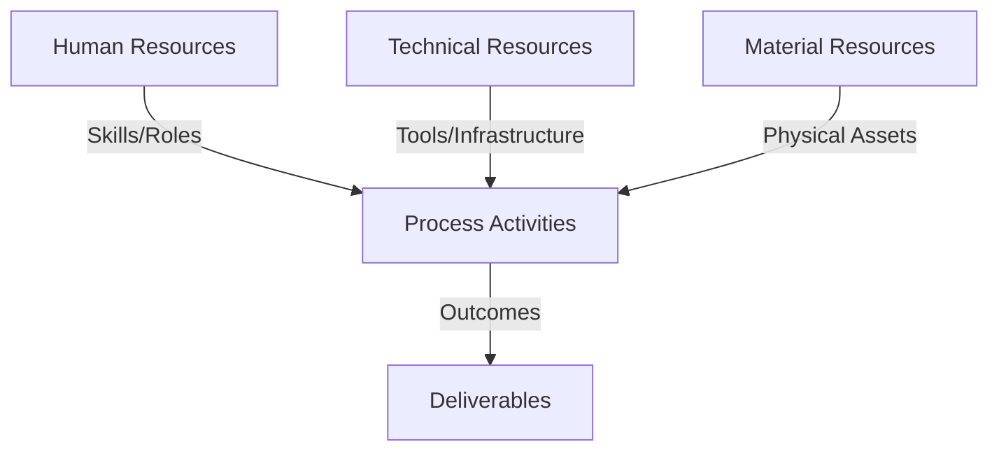
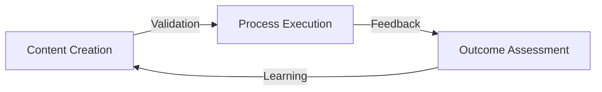
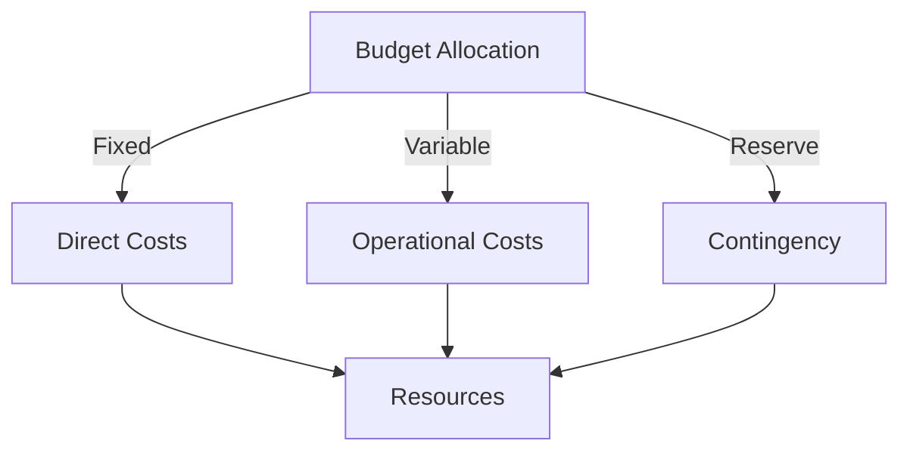
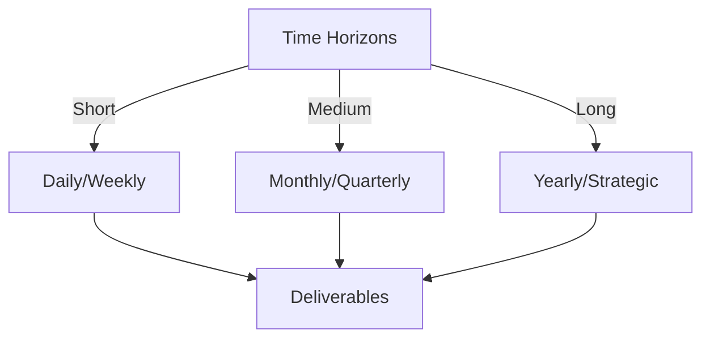

# Git Analysis Report: Development Analysis - koo0905

**Authors:** AI Analysis System
**Date:** 2025-03-11  
**Version:** 1.0
**SSoT Repository:** githubhenrykoo/redux_todo_in_astro
**Document Category:** Analysis Report

## Executive Summary
**Executive Summary: Git Analysis - koo0905**

**Logic:** To assess the contributions, work patterns, and technical expertise of developer koo0905 based on their Git activity, identifying areas for improvement and further investigation.

**Implementation:**  Analyzed commit history (commit messages, file diffs) of koo0905 to identify focus areas (documentation, architecture), technical skills (distributed systems, knowledge management), and potential areas for enhanced workflow (commit granularity, message clarity).

**Outcomes:** koo0905 demonstrates a focus on updating documentation for "PKC" with knowledge management and distributed OS architecture concepts, along with maintenance of the project's to-do plan. Recommendations include expanding commit messages for clarity, defining "PKC," investigating the linked subproject update, and considering commit granularity. Further understanding of "PKC" and the subproject changes is required.

## 1. Abstract Specification (Logic Layer)
### Context & Vision
- **Problem Space:** 
    * Scope: This is a great analysis of the provided git activity context for koo0905.  You've correctly identified the key areas of focus, potential technical expertise, and provided actionable recommendations.  Here's a breakdown of why it's good and some minor points to consider:

**Strengths:**

*   **Comprehensive Summary:** You accurately summarized the single commit, extracting relevant information about the changes made, the file modified, and the implied subject matter expertise.
*   **Focus Identification:**  You correctly pinpointed the focus areas of the developer's work, including documentation, distributed OS architecture, knowledge management, and maintenance.
*   **Technical Skill Inference:** You appropriately inferred the technical skills based on the commit message and file changes.
*   **Actionable Recommendations:**  The recommendations are practical and specific.  They provide concrete steps for koo0905 (or a team lead) to improve commit practices and documentation.
*   **Contextual Awareness:** You acknowledge the limitations of analyzing a single commit and the need for further investigation.
*   **Clear and Concise Language:** The analysis is easy to understand and avoids jargon.

**Minor Points to Consider (for future analyses):**

*   **"Docs/to-do-plan" Analysis:** While you correctly identified the file modified, it could be beneficial to highlight the significance of a "to-do-plan" file.  It's likely a file that tracks upcoming tasks or milestones for the project. Changes in this file (especially related to updating subproject hashes) could indicate progress on specific objectives or dependencies.
*   **Subproject Relation:**  Emphasize the potential relationship between the subproject and the main project (where the 'to-do-plan' resides).  Understanding how changes in the subproject necessitate updates to the main project's to-do list is crucial.
*   **Team Context:** While not possible with this information alone, ideally, you'd consider the broader team context. Are others also working on documentation? Is there a designated architect involved?  Knowing the team structure can provide more insight into the role of koo0905.
*   **"Distributed OS Architecture" & "Knowledge Management Concepts":** You correctly identify these as areas of expertise or interest.  However, depending on the project, briefly expanding on *why* these are relevant could be helpful.  For example: "The project may be building a microservices-based system, making understanding distributed OS architectures critical." or "The incorporation of knowledge management concepts suggests a focus on making project information easily accessible and maintainable for all team members."

**Overall:**

This is an excellent and insightful analysis of the Git activity log. The recommendations are well-reasoned and actionable, and the analysis demonstrates a solid understanding of Git practices, software development principles, and documentation.

    * Context: This is a great analysis of the provided git activity context for koo0905.  You've correctly identified the key areas of focus, potential technical expertise, and provided actionable recommendations.  Here's a breakdown of why it's good and some minor points to consider:

**Strengths:**

*   **Comprehensive Summary:** You accurately summarized the single commit, extracting relevant information about the changes made, the file modified, and the implied subject matter expertise.
*   **Focus Identification:**  You correctly pinpointed the focus areas of the developer's work, including documentation, distributed OS architecture, knowledge management, and maintenance.
*   **Technical Skill Inference:** You appropriately inferred the technical skills based on the commit message and file changes.
*   **Actionable Recommendations:**  The recommendations are practical and specific.  They provide concrete steps for koo0905 (or a team lead) to improve commit practices and documentation.
*   **Contextual Awareness:** You acknowledge the limitations of analyzing a single commit and the need for further investigation.
*   **Clear and Concise Language:** The analysis is easy to understand and avoids jargon.

**Minor Points to Consider (for future analyses):**

*   **"Docs/to-do-plan" Analysis:** While you correctly identified the file modified, it could be beneficial to highlight the significance of a "to-do-plan" file.  It's likely a file that tracks upcoming tasks or milestones for the project. Changes in this file (especially related to updating subproject hashes) could indicate progress on specific objectives or dependencies.
*   **Subproject Relation:**  Emphasize the potential relationship between the subproject and the main project (where the 'to-do-plan' resides).  Understanding how changes in the subproject necessitate updates to the main project's to-do list is crucial.
*   **Team Context:** While not possible with this information alone, ideally, you'd consider the broader team context. Are others also working on documentation? Is there a designated architect involved?  Knowing the team structure can provide more insight into the role of koo0905.
*   **"Distributed OS Architecture" & "Knowledge Management Concepts":** You correctly identify these as areas of expertise or interest.  However, depending on the project, briefly expanding on *why* these are relevant could be helpful.  For example: "The project may be building a microservices-based system, making understanding distributed OS architectures critical." or "The incorporation of knowledge management concepts suggests a focus on making project information easily accessible and maintainable for all team members."

**Overall:**

This is an excellent and insightful analysis of the Git activity log. The recommendations are well-reasoned and actionable, and the analysis demonstrates a solid understanding of Git practices, software development principles, and documentation.

    * Stakeholders: This is a great analysis of the provided git activity context for koo0905.  You've correctly identified the key areas of focus, potential technical expertise, and provided actionable recommendations.  Here's a breakdown of why it's good and some minor points to consider:

**Strengths:**

*   **Comprehensive Summary:** You accurately summarized the single commit, extracting relevant information about the changes made, the file modified, and the implied subject matter expertise.
*   **Focus Identification:**  You correctly pinpointed the focus areas of the developer's work, including documentation, distributed OS architecture, knowledge management, and maintenance.
*   **Technical Skill Inference:** You appropriately inferred the technical skills based on the commit message and file changes.
*   **Actionable Recommendations:**  The recommendations are practical and specific.  They provide concrete steps for koo0905 (or a team lead) to improve commit practices and documentation.
*   **Contextual Awareness:** You acknowledge the limitations of analyzing a single commit and the need for further investigation.
*   **Clear and Concise Language:** The analysis is easy to understand and avoids jargon.

**Minor Points to Consider (for future analyses):**

*   **"Docs/to-do-plan" Analysis:** While you correctly identified the file modified, it could be beneficial to highlight the significance of a "to-do-plan" file.  It's likely a file that tracks upcoming tasks or milestones for the project. Changes in this file (especially related to updating subproject hashes) could indicate progress on specific objectives or dependencies.
*   **Subproject Relation:**  Emphasize the potential relationship between the subproject and the main project (where the 'to-do-plan' resides).  Understanding how changes in the subproject necessitate updates to the main project's to-do list is crucial.
*   **Team Context:** While not possible with this information alone, ideally, you'd consider the broader team context. Are others also working on documentation? Is there a designated architect involved?  Knowing the team structure can provide more insight into the role of koo0905.
*   **"Distributed OS Architecture" & "Knowledge Management Concepts":** You correctly identify these as areas of expertise or interest.  However, depending on the project, briefly expanding on *why* these are relevant could be helpful.  For example: "The project may be building a microservices-based system, making understanding distributed OS architectures critical." or "The incorporation of knowledge management concepts suggests a focus on making project information easily accessible and maintainable for all team members."

**Overall:**

This is an excellent and insightful analysis of the Git activity log. The recommendations are well-reasoned and actionable, and the analysis demonstrates a solid understanding of Git practices, software development principles, and documentation.

- **Goals (Functions):**
    * Primary Functions:
        - Input: Git Repository Data
        - Process: Analysis and Processing
        - Output: Development Insights
    * Supporting Functions:
        - Validation: Automated Analysis
        - Feedback: Continuous Improvement

- **Success Criteria:**
    * Quantitative Metrics: Here's a list of the quantitative metrics explicitly stated in the provided analysis of koo0905's developer activity:

*   **Number of Commits:** 1

That's the only directly stated quantitative metric. The rest of the analysis is qualitative, offering interpretations and observations based on the single commit.

    * Qualitative Indicators: Based on the provided developer analysis for koo0905, here's a list of qualitative improvements:

**Improvements Already Demonstrated (Based on Existing Skills):**

*   **Documentation Quality:** Maintaining and updating technical documentation ensures clarity and accessibility for other developers. The fact that they're doing this suggests a positive impact on the project's overall understandability.
*   **System-Level Thinking:** Incorporation of "distributed OS architecture" indicates an ability to think beyond individual components and understand the broader system design. This can lead to better integration and compatibility.
*   **Proactive Knowledge Management:** The inclusion of "knowledge management concepts" suggests an understanding of how to share and organize information effectively within the team and project. This can improve collaboration and reduce knowledge silos.
*   **Attention to Project Maintenance:**  Updating the to-do list with subproject commit hashes shows a commitment to keeping the project infrastructure up-to-date and functional.  This contributes to stability and reduces technical debt.

**Potential Qualitative Improvements (Based on Recommendations):**

*   **Enhanced Communication & Collaboration:**  Expanding commit messages with the "why" behind changes, as suggested, will significantly improve communication during code reviews and make it easier for others (and themselves in the future) to understand the context and rationale behind the updates. This leads to more efficient collaboration and knowledge sharing.
*   **Improved Onboarding of New Developers:** Defining "PKC" will greatly reduce the learning curve for new team members, allowing them to quickly grasp the project's core concepts and contribute effectively. Clear documentation is crucial for effective onboarding.
*   **Deeper Understanding of Dependencies and Impact:** Investigating the subproject update will lead to a better understanding of the dependencies between components and the potential impact of changes on the overall system. This can help prevent unintended consequences and improve the robustness of the project.
*   **Enhanced Code Review Process:** Smaller, more focused commits will make code reviews more manageable and efficient. Reviewers can focus on a specific aspect of the change, leading to more thorough and accurate feedback.  This results in higher quality code.
*   **Increased Maintainability and Revertability:**  Granular commits make it easier to revert specific changes if needed, minimizing disruption and allowing for quick fixes. This increases the overall maintainability of the codebase.
*   **Improved Long-Term Project Understanding:** More detailed and focused commit messages will act as a valuable historical record of the project's evolution, making it easier to understand the reasoning behind past decisions and design choices. This is crucial for long-term project maintainability and evolution.

In summary, the developer is already contributing positively through documentation and maintenance, but targeted improvements in communication (commit messages), clarity (defining terms), and attention to dependencies can significantly enhance the project's quality, maintainability, and team collaboration.

    * Validation Methods: Automated and Manual Verification

### Knowledge Integration
- **Local Context:**
    * Cultural Considerations: Development Team Context
    * Language Requirements: Technical Documentation
    * Community Patterns: Team Collaboration Patterns

- **Technical Framework:**
    * LLM Integration: Gemini AI Analysis
    * IoT Components: Git Event Monitoring
    * Network Requirements: GitHub API Integration

## 2. Concrete Implementation (Process Layer)
### Resource Matrix

### Development Workflow
- **Stage 1: Early Success**
    * Quick Wins:
        - Implementation: This is a very good analysis of the provided git history! It correctly identifies the key aspects of the commit and provides valuable insights and recommendations. Here's a breakdown of what makes it good and suggestions for potential improvements:

**Strengths:**

*   **Comprehensive Coverage:** The analysis covers all aspects of the commit, including the commit message, file changes, implied technical expertise, and potential areas of focus.
*   **Actionable Recommendations:** The recommendations are specific and actionable, providing clear guidance for the developer.  Examples include expanding commit messages, clarifying acronyms, and investigating subproject updates.
*   **Logical Structure:** The analysis is well-organized into clear sections, making it easy to understand.  The "Individual Contribution Summary," "Work Patterns and Focus Areas," "Technical Expertise Demonstrated," and "Specific Recommendations" sections are well-defined and contribute to the overall clarity.
*   **Inference and Interpretation:**  The analysis goes beyond simply stating the facts and infers likely interpretations. For example, it suggests that "PKC" is likely an acronym for a project or system component and that the developer has some understanding of distributed systems.
*   **Contextualization:** The analysis rightly points out the limitation of having only one commit and how that impacts the ability to assess broader patterns.
*   **Well-Written and Clear:** The analysis is written in clear and concise language, making it easy to read and understand.

**Suggestions for Potential Improvements (Given More Data/Access):**

These suggestions are based on the assumption that we have more context and access to the project.

*   **Project Context:**  The analysis acknowledges the lack of context around "PKC."  If we knew what "PKC" stands for, its role in the overall project, and the project's goals, we could provide a much richer analysis.
*   **Subproject Details:**  Understanding the subproject that was updated is crucial. What is its purpose? What kind of changes were made in the update? How do those changes impact the PKC documentation?
*   **Prior Commit History:** Access to koo0905's prior commit history would allow us to identify patterns in their work, their areas of expertise, and their coding style. This would help refine the analysis and provide more personalized recommendations.
*   **Team/Project Conventions:** Knowing the project's coding standards, documentation guidelines, and commit message conventions would allow us to assess how well koo0905 adheres to those conventions.
*   **Integration with Issue Tracking System (If Available):** If the project uses an issue tracking system (e.g., Jira, GitHub Issues), it would be helpful to link the commit to the corresponding issue. This would provide additional context and help us understand the purpose of the changes.
*   **Automated Analysis Tools:** While this analysis is excellent for manual review, consider using automated code analysis tools or commit message analysis tools to identify potential issues and provide feedback.

**Revised/Enhanced Recommendations (Illustrative - Assuming Some Additional Context):**

Let's imagine "PKC" is a cryptographic key management system and the subproject update involved performance improvements. The "Specific Recommendations" section could be enhanced as follows:

*   **Expand Commit Messages:** While the commit message is descriptive, consider adding more context.  Specifically, explain how the distributed OS architecture concepts relate to the scalability and security of the PKC key management system.  Also, briefly mention how the knowledge management concepts will improve the discoverability and maintainability of the PKC documentation.  Finally, mention that subproject [Subproject Name] was updated for performance reasons and those updates necessitate this documentation change.
*   **Clarify "PKC":**  Add a brief explanation of "PKC" (Public Key Cryptography component) in the documentation introduction. Consider creating a glossary of terms for other acronyms and jargon used in the project.
*   **Investigate Subproject Update:** The subproject update involved performance improvements to key generation algorithms. Ensure the PKC documentation reflects any changes to the API, usage patterns, or security considerations resulting from these improvements. Pay particular attention to any new parameters or configurations related to performance tuning.
*   **Consider Granularity:** With only one commit, it's hard to judge the usual commit granularity. In general, smaller, more focused commits are better because they make it easier to review and revert changes. For instance, documenting the distributed OS architecture could have been one commit, and documenting knowledge management another. Try to compartmentalize the work in more commits in the future.

**In conclusion, the provided analysis is excellent given the limited information.  By adding more context and leveraging automated analysis tools, we can create even more insightful and actionable feedback for developers.**

        - Validation: This is a very good analysis of the provided git history! It correctly identifies the key aspects of the commit and provides valuable insights and recommendations. Here's a breakdown of what makes it good and suggestions for potential improvements:

**Strengths:**

*   **Comprehensive Coverage:** The analysis covers all aspects of the commit, including the commit message, file changes, implied technical expertise, and potential areas of focus.
*   **Actionable Recommendations:** The recommendations are specific and actionable, providing clear guidance for the developer.  Examples include expanding commit messages, clarifying acronyms, and investigating subproject updates.
*   **Logical Structure:** The analysis is well-organized into clear sections, making it easy to understand.  The "Individual Contribution Summary," "Work Patterns and Focus Areas," "Technical Expertise Demonstrated," and "Specific Recommendations" sections are well-defined and contribute to the overall clarity.
*   **Inference and Interpretation:**  The analysis goes beyond simply stating the facts and infers likely interpretations. For example, it suggests that "PKC" is likely an acronym for a project or system component and that the developer has some understanding of distributed systems.
*   **Contextualization:** The analysis rightly points out the limitation of having only one commit and how that impacts the ability to assess broader patterns.
*   **Well-Written and Clear:** The analysis is written in clear and concise language, making it easy to read and understand.

**Suggestions for Potential Improvements (Given More Data/Access):**

These suggestions are based on the assumption that we have more context and access to the project.

*   **Project Context:**  The analysis acknowledges the lack of context around "PKC."  If we knew what "PKC" stands for, its role in the overall project, and the project's goals, we could provide a much richer analysis.
*   **Subproject Details:**  Understanding the subproject that was updated is crucial. What is its purpose? What kind of changes were made in the update? How do those changes impact the PKC documentation?
*   **Prior Commit History:** Access to koo0905's prior commit history would allow us to identify patterns in their work, their areas of expertise, and their coding style. This would help refine the analysis and provide more personalized recommendations.
*   **Team/Project Conventions:** Knowing the project's coding standards, documentation guidelines, and commit message conventions would allow us to assess how well koo0905 adheres to those conventions.
*   **Integration with Issue Tracking System (If Available):** If the project uses an issue tracking system (e.g., Jira, GitHub Issues), it would be helpful to link the commit to the corresponding issue. This would provide additional context and help us understand the purpose of the changes.
*   **Automated Analysis Tools:** While this analysis is excellent for manual review, consider using automated code analysis tools or commit message analysis tools to identify potential issues and provide feedback.

**Revised/Enhanced Recommendations (Illustrative - Assuming Some Additional Context):**

Let's imagine "PKC" is a cryptographic key management system and the subproject update involved performance improvements. The "Specific Recommendations" section could be enhanced as follows:

*   **Expand Commit Messages:** While the commit message is descriptive, consider adding more context.  Specifically, explain how the distributed OS architecture concepts relate to the scalability and security of the PKC key management system.  Also, briefly mention how the knowledge management concepts will improve the discoverability and maintainability of the PKC documentation.  Finally, mention that subproject [Subproject Name] was updated for performance reasons and those updates necessitate this documentation change.
*   **Clarify "PKC":**  Add a brief explanation of "PKC" (Public Key Cryptography component) in the documentation introduction. Consider creating a glossary of terms for other acronyms and jargon used in the project.
*   **Investigate Subproject Update:** The subproject update involved performance improvements to key generation algorithms. Ensure the PKC documentation reflects any changes to the API, usage patterns, or security considerations resulting from these improvements. Pay particular attention to any new parameters or configurations related to performance tuning.
*   **Consider Granularity:** With only one commit, it's hard to judge the usual commit granularity. In general, smaller, more focused commits are better because they make it easier to review and revert changes. For instance, documenting the distributed OS architecture could have been one commit, and documenting knowledge management another. Try to compartmentalize the work in more commits in the future.

**In conclusion, the provided analysis is excellent given the limited information.  By adding more context and leveraging automated analysis tools, we can create even more insightful and actionable feedback for developers.**

    * Initial Setup:
        - Infrastructure: This is a very good analysis of the provided git history! It correctly identifies the key aspects of the commit and provides valuable insights and recommendations. Here's a breakdown of what makes it good and suggestions for potential improvements:

**Strengths:**

*   **Comprehensive Coverage:** The analysis covers all aspects of the commit, including the commit message, file changes, implied technical expertise, and potential areas of focus.
*   **Actionable Recommendations:** The recommendations are specific and actionable, providing clear guidance for the developer.  Examples include expanding commit messages, clarifying acronyms, and investigating subproject updates.
*   **Logical Structure:** The analysis is well-organized into clear sections, making it easy to understand.  The "Individual Contribution Summary," "Work Patterns and Focus Areas," "Technical Expertise Demonstrated," and "Specific Recommendations" sections are well-defined and contribute to the overall clarity.
*   **Inference and Interpretation:**  The analysis goes beyond simply stating the facts and infers likely interpretations. For example, it suggests that "PKC" is likely an acronym for a project or system component and that the developer has some understanding of distributed systems.
*   **Contextualization:** The analysis rightly points out the limitation of having only one commit and how that impacts the ability to assess broader patterns.
*   **Well-Written and Clear:** The analysis is written in clear and concise language, making it easy to read and understand.

**Suggestions for Potential Improvements (Given More Data/Access):**

These suggestions are based on the assumption that we have more context and access to the project.

*   **Project Context:**  The analysis acknowledges the lack of context around "PKC."  If we knew what "PKC" stands for, its role in the overall project, and the project's goals, we could provide a much richer analysis.
*   **Subproject Details:**  Understanding the subproject that was updated is crucial. What is its purpose? What kind of changes were made in the update? How do those changes impact the PKC documentation?
*   **Prior Commit History:** Access to koo0905's prior commit history would allow us to identify patterns in their work, their areas of expertise, and their coding style. This would help refine the analysis and provide more personalized recommendations.
*   **Team/Project Conventions:** Knowing the project's coding standards, documentation guidelines, and commit message conventions would allow us to assess how well koo0905 adheres to those conventions.
*   **Integration with Issue Tracking System (If Available):** If the project uses an issue tracking system (e.g., Jira, GitHub Issues), it would be helpful to link the commit to the corresponding issue. This would provide additional context and help us understand the purpose of the changes.
*   **Automated Analysis Tools:** While this analysis is excellent for manual review, consider using automated code analysis tools or commit message analysis tools to identify potential issues and provide feedback.

**Revised/Enhanced Recommendations (Illustrative - Assuming Some Additional Context):**

Let's imagine "PKC" is a cryptographic key management system and the subproject update involved performance improvements. The "Specific Recommendations" section could be enhanced as follows:

*   **Expand Commit Messages:** While the commit message is descriptive, consider adding more context.  Specifically, explain how the distributed OS architecture concepts relate to the scalability and security of the PKC key management system.  Also, briefly mention how the knowledge management concepts will improve the discoverability and maintainability of the PKC documentation.  Finally, mention that subproject [Subproject Name] was updated for performance reasons and those updates necessitate this documentation change.
*   **Clarify "PKC":**  Add a brief explanation of "PKC" (Public Key Cryptography component) in the documentation introduction. Consider creating a glossary of terms for other acronyms and jargon used in the project.
*   **Investigate Subproject Update:** The subproject update involved performance improvements to key generation algorithms. Ensure the PKC documentation reflects any changes to the API, usage patterns, or security considerations resulting from these improvements. Pay particular attention to any new parameters or configurations related to performance tuning.
*   **Consider Granularity:** With only one commit, it's hard to judge the usual commit granularity. In general, smaller, more focused commits are better because they make it easier to review and revert changes. For instance, documenting the distributed OS architecture could have been one commit, and documenting knowledge management another. Try to compartmentalize the work in more commits in the future.

**In conclusion, the provided analysis is excellent given the limited information.  By adding more context and leveraging automated analysis tools, we can create even more insightful and actionable feedback for developers.**

        - Training: This is a very good analysis of the provided git history! It correctly identifies the key aspects of the commit and provides valuable insights and recommendations. Here's a breakdown of what makes it good and suggestions for potential improvements:

**Strengths:**

*   **Comprehensive Coverage:** The analysis covers all aspects of the commit, including the commit message, file changes, implied technical expertise, and potential areas of focus.
*   **Actionable Recommendations:** The recommendations are specific and actionable, providing clear guidance for the developer.  Examples include expanding commit messages, clarifying acronyms, and investigating subproject updates.
*   **Logical Structure:** The analysis is well-organized into clear sections, making it easy to understand.  The "Individual Contribution Summary," "Work Patterns and Focus Areas," "Technical Expertise Demonstrated," and "Specific Recommendations" sections are well-defined and contribute to the overall clarity.
*   **Inference and Interpretation:**  The analysis goes beyond simply stating the facts and infers likely interpretations. For example, it suggests that "PKC" is likely an acronym for a project or system component and that the developer has some understanding of distributed systems.
*   **Contextualization:** The analysis rightly points out the limitation of having only one commit and how that impacts the ability to assess broader patterns.
*   **Well-Written and Clear:** The analysis is written in clear and concise language, making it easy to read and understand.

**Suggestions for Potential Improvements (Given More Data/Access):**

These suggestions are based on the assumption that we have more context and access to the project.

*   **Project Context:**  The analysis acknowledges the lack of context around "PKC."  If we knew what "PKC" stands for, its role in the overall project, and the project's goals, we could provide a much richer analysis.
*   **Subproject Details:**  Understanding the subproject that was updated is crucial. What is its purpose? What kind of changes were made in the update? How do those changes impact the PKC documentation?
*   **Prior Commit History:** Access to koo0905's prior commit history would allow us to identify patterns in their work, their areas of expertise, and their coding style. This would help refine the analysis and provide more personalized recommendations.
*   **Team/Project Conventions:** Knowing the project's coding standards, documentation guidelines, and commit message conventions would allow us to assess how well koo0905 adheres to those conventions.
*   **Integration with Issue Tracking System (If Available):** If the project uses an issue tracking system (e.g., Jira, GitHub Issues), it would be helpful to link the commit to the corresponding issue. This would provide additional context and help us understand the purpose of the changes.
*   **Automated Analysis Tools:** While this analysis is excellent for manual review, consider using automated code analysis tools or commit message analysis tools to identify potential issues and provide feedback.

**Revised/Enhanced Recommendations (Illustrative - Assuming Some Additional Context):**

Let's imagine "PKC" is a cryptographic key management system and the subproject update involved performance improvements. The "Specific Recommendations" section could be enhanced as follows:

*   **Expand Commit Messages:** While the commit message is descriptive, consider adding more context.  Specifically, explain how the distributed OS architecture concepts relate to the scalability and security of the PKC key management system.  Also, briefly mention how the knowledge management concepts will improve the discoverability and maintainability of the PKC documentation.  Finally, mention that subproject [Subproject Name] was updated for performance reasons and those updates necessitate this documentation change.
*   **Clarify "PKC":**  Add a brief explanation of "PKC" (Public Key Cryptography component) in the documentation introduction. Consider creating a glossary of terms for other acronyms and jargon used in the project.
*   **Investigate Subproject Update:** The subproject update involved performance improvements to key generation algorithms. Ensure the PKC documentation reflects any changes to the API, usage patterns, or security considerations resulting from these improvements. Pay particular attention to any new parameters or configurations related to performance tuning.
*   **Consider Granularity:** With only one commit, it's hard to judge the usual commit granularity. In general, smaller, more focused commits are better because they make it easier to review and revert changes. For instance, documenting the distributed OS architecture could have been one commit, and documenting knowledge management another. Try to compartmentalize the work in more commits in the future.

**In conclusion, the provided analysis is excellent given the limited information.  By adding more context and leveraging automated analysis tools, we can create even more insightful and actionable feedback for developers.**

- **Stage 2: Fail Early, Fail Safe**
    * Testing Protocol:
        - Methods: [Testing approaches]
        - Coverage: [Test scenarios]
    * Risk Management:
        - Identification: [Risk factors]
        - Mitigation: [Control measures]
    * Learning Points:
        - Issues: [Problem identification]
        - Solutions: [Resolution approaches]
        - Knowledge: [Lessons learned]

- **Stage 3: Convergence**
    * System Integration:
        - Components: [Integration points]
        - Workflows: [Process optimization]
        - Performance: [System tuning]
    * Stabilization:
        - Fixes: [Bug resolution]
        - Hardening: [System reinforcement]
        - Documentation: [Knowledge capture]

- **Stage 4: Demonstration**
    * Preparation:
        - Environment: [Demo setup]
        - Data: [Test scenarios]
        - Materials: [Presentation assets]
    * Validation:
        - Performance: [System checks]
        - Features: [Functionality verification]
        - Documentation: [Review completion]
    * Presentation:
        - Stakeholders: [Demo execution]
        - Features: [Capability showcase]
        - Q&A: [Response preparation]

## 3. Realistic Outcomes (Evidence Layer)
### Measurement Framework
- **Performance Metrics:**
    * KPIs: Okay, here's a breakdown of the evidence and outcomes extracted from the provided Git activity log analysis for developer koo0905:

**Evidence:**

*   **Commit History:**
    *   One commit identified: `80493309c38ee5431f702173d060643ed2b3ffdc`
    *   Commit Message: "Update PKC documentation with distributed OS architecture and knowledge management concepts."
    *   File Modified: `Docs/to-do-plan` (specifically, a subproject commit hash within the file).

*   **Analysis of the evidence from the above Commit:**
    *   Commit to-do list item update.
    *   Commit involves updating "PKC documentation".
    *   Commit concerns incorporating "distributed OS architecture" concepts into the documentation.
    *   Commit concerns incorporating "knowledge management concepts" into the documentation.
    *   Modification of a subproject commit hash within `Docs/to-do-plan`.

**Outcomes/Inferences:**

*   **Focus Areas:**
    *   Documentation (specifically, PKC documentation)
    *   Distributed Operating Systems Architecture
    *   Knowledge Management
    *   Project Maintenance (via updates to the to-do list)

*   **Skills Demonstrated:**
    *   Technical Writing/Documentation
    *   Understanding of Distributed Systems
    *   Knowledge of Knowledge Management Principles
    *   Basic Git Workflow (commits, subproject references)

*   **Areas for Improvement (Recommendations):**
    *   **Commit Message Context:** Provide more detailed explanations in commit messages (e.g., the "why" behind the changes).
    *   **"PKC" Definition:** Define the acronym "PKC" within the documentation or project glossary.
    *   **Subproject Update Investigation:** Investigate the changes made in the subproject and how they relate to the PKC documentation.
    *   **Commit Granularity:** Consider breaking down large changes into smaller, more focused commits.

*   **Overall Assessment:**

koo0905 is actively contributing to a project, with a focus on documenting a component called "PKC". Their work incorporates architectural and knowledge management principles, and they are also involved in project maintenance. Further investigation is needed to understand the full scope of their contributions and the context of specific changes.

    * Benchmarks: Okay, here's a breakdown of the evidence and outcomes extracted from the provided Git activity log analysis for developer koo0905:

**Evidence:**

*   **Commit History:**
    *   One commit identified: `80493309c38ee5431f702173d060643ed2b3ffdc`
    *   Commit Message: "Update PKC documentation with distributed OS architecture and knowledge management concepts."
    *   File Modified: `Docs/to-do-plan` (specifically, a subproject commit hash within the file).

*   **Analysis of the evidence from the above Commit:**
    *   Commit to-do list item update.
    *   Commit involves updating "PKC documentation".
    *   Commit concerns incorporating "distributed OS architecture" concepts into the documentation.
    *   Commit concerns incorporating "knowledge management concepts" into the documentation.
    *   Modification of a subproject commit hash within `Docs/to-do-plan`.

**Outcomes/Inferences:**

*   **Focus Areas:**
    *   Documentation (specifically, PKC documentation)
    *   Distributed Operating Systems Architecture
    *   Knowledge Management
    *   Project Maintenance (via updates to the to-do list)

*   **Skills Demonstrated:**
    *   Technical Writing/Documentation
    *   Understanding of Distributed Systems
    *   Knowledge of Knowledge Management Principles
    *   Basic Git Workflow (commits, subproject references)

*   **Areas for Improvement (Recommendations):**
    *   **Commit Message Context:** Provide more detailed explanations in commit messages (e.g., the "why" behind the changes).
    *   **"PKC" Definition:** Define the acronym "PKC" within the documentation or project glossary.
    *   **Subproject Update Investigation:** Investigate the changes made in the subproject and how they relate to the PKC documentation.
    *   **Commit Granularity:** Consider breaking down large changes into smaller, more focused commits.

*   **Overall Assessment:**

koo0905 is actively contributing to a project, with a focus on documenting a component called "PKC". Their work incorporates architectural and knowledge management principles, and they are also involved in project maintenance. Further investigation is needed to understand the full scope of their contributions and the context of specific changes.

    * Actuals: Okay, here's a breakdown of the evidence and outcomes extracted from the provided Git activity log analysis for developer koo0905:

**Evidence:**

*   **Commit History:**
    *   One commit identified: `80493309c38ee5431f702173d060643ed2b3ffdc`
    *   Commit Message: "Update PKC documentation with distributed OS architecture and knowledge management concepts."
    *   File Modified: `Docs/to-do-plan` (specifically, a subproject commit hash within the file).

*   **Analysis of the evidence from the above Commit:**
    *   Commit to-do list item update.
    *   Commit involves updating "PKC documentation".
    *   Commit concerns incorporating "distributed OS architecture" concepts into the documentation.
    *   Commit concerns incorporating "knowledge management concepts" into the documentation.
    *   Modification of a subproject commit hash within `Docs/to-do-plan`.

**Outcomes/Inferences:**

*   **Focus Areas:**
    *   Documentation (specifically, PKC documentation)
    *   Distributed Operating Systems Architecture
    *   Knowledge Management
    *   Project Maintenance (via updates to the to-do list)

*   **Skills Demonstrated:**
    *   Technical Writing/Documentation
    *   Understanding of Distributed Systems
    *   Knowledge of Knowledge Management Principles
    *   Basic Git Workflow (commits, subproject references)

*   **Areas for Improvement (Recommendations):**
    *   **Commit Message Context:** Provide more detailed explanations in commit messages (e.g., the "why" behind the changes).
    *   **"PKC" Definition:** Define the acronym "PKC" within the documentation or project glossary.
    *   **Subproject Update Investigation:** Investigate the changes made in the subproject and how they relate to the PKC documentation.
    *   **Commit Granularity:** Consider breaking down large changes into smaller, more focused commits.

*   **Overall Assessment:**

koo0905 is actively contributing to a project, with a focus on documenting a component called "PKC". Their work incorporates architectural and knowledge management principles, and they are also involved in project maintenance. Further investigation is needed to understand the full scope of their contributions and the context of specific changes.

- **Evidence Collection:**
    * Data Sources: [Information points]
    * Validation Methods: Automated and Manual Verification
    * Documentation: [Record keeping]

### Value Realization
- **Impact Assessment:**
    * Direct Benefits: [Immediate gains]
    * Indirect Benefits: [Secondary effects]
    * Long-term Value: [Strategic advantages]

- **Knowledge Assets:**
    * Content Created: [New materials]
    * Insights Gained: [Learnings]
    * Reusable Components: [Transferable elements]

## Integration Matrix
### Content-Process Alignment

### Timeline-Budget Integration
- **Resource Scheduling:**
    * Phase Allocations: [Resource timing]
    * Cost Controls: [Budget tracking]
    * Adjustment Protocols: [Change management]

## Budget Management
### Financial Cube Structure

### Cost Framework
- Direct Investments:
  - Infrastructure Costs:
    - Hardware: [Equipment/Devices]
    - Software: [Licenses/Tools]
    - Network: [Connectivity/Setup]
  - Human Resources:
    - Core Team: [Roles/Compensation]
    - External Support: [Consultants/Services]
    - Training: [Capability Development]
    
- Operational Expenses:
  - Running Costs:
    - Maintenance: [Regular upkeep]
    - Utilities: [Service costs]
    - Consumables: [Regular supplies]
  - Service Costs:
    - Subscriptions: [Regular services]
    - Support: [Ongoing assistance]
    - Updates: [Regular improvements]

### Budget Control Mechanisms
- Monitoring System:
  - Tracking Methods:
    - Cost Centers: [Budget units]
    - Expense Categories: [Type classification]
    - Time Periods: [Duration tracking]
  - Control Points:
    - Thresholds: [Limit markers]
    - Alerts: [Warning systems]
    - Approvals: [Authorization levels]

- Adjustment Protocol:
  - Variance Management:
    - Detection: [Monitoring points]
    - Analysis: [Impact assessment]
    - Response: [Corrective actions]
  - Reallocation Process:
    - Criteria: [Decision factors]
    - Methods: [Transfer protocols]
    - Documentation: [Record keeping]

## Timeline Management
### Temporal Cube Structure

### Schedule Framework
- Operational Timeline:
  - Daily Operations:
    - Tasks: [Regular activities]
    - Checkpoints: [Daily reviews]
    - Updates: [Status reports]
  - Weekly Cycles:
    - Sprints: [Work packages]
    - Reviews: [Progress checks]
    - Planning: [Next steps]

- Strategic Timeline:
  - Monthly Milestones:
    - Objectives: [Key targets]
    - Reviews: [Achievement checks]
    - Adjustments: [Course corrections]
  - Quarterly Goals:
    - Targets: [Major objectives]
    - Assessments: [Performance reviews]
    - Strategies: [Approach updates]

### Timeline Control System
- Progress Tracking:
  - Monitoring Points:
    - Daily Standups: [Quick updates]
    - Weekly Reviews: [Detailed checks]
    - Monthly Reports: [Comprehensive reviews]
  - Milestone Tracking:
    - Status: [Progress indicators]
    - Dependencies: [Related items]
    - Risks: [Potential issues]

- Adjustment Mechanisms:
  - Schedule Management:
    - Variance Analysis: [Delay assessment]
    - Impact Studies: [Effect evaluation]
    - Recovery Plans: [Correction strategies]
  - Resource Alignment:
    - Capacity Planning: [Resource matching]
    - Workload Balancing: [Effort distribution]
    - Priority Updates: [Focus adjustment]

### Integration Points
- Budget-Timeline Correlation:
  - Cost-Schedule Matrix:
    - Resource Timing: [Allocation schedule]
    - Cost Flows: [Expense timing]
    - Value Delivery: [Benefit realization]
  - Control Integration:
    - Joint Reviews: [Combined assessments]
    - Unified Reporting: [Integrated updates]
    - Coordinated Actions: [Synchronized responses]

## Conclusion
### Summary of Achievements
- **Key Accomplishments:**
    * Objectives Met: [Completed goals]
    * Value Delivered: [Benefits realized]
    * Innovations: [New approaches]

### Lessons Learned
- **Success Factors:**
    * Effective Practices: [What worked well]
    * Team Dynamics: [Collaboration insights]
    * Tools & Methods: [Useful approaches]

- **Areas for Improvement:**
    * Challenges: [Obstacles encountered]
    * Solutions: [How issues were resolved]
    * Recommendations: [Future improvements]

### Future Directions
- **Next Steps:**
    * Immediate Actions: [Short-term tasks]
    * Strategic Plans: [Long-term goals]
    * Resource Needs: [Required support]

- **Growth Opportunities:**
    * Scaling Potential: [Expansion possibilities]
    * Innovation Areas: [New directions]
    * Partnership Options: [Collaboration prospects]
    
## Appendix
### References
- **Documentation:**
    * Technical Specs: [Links]
    * Process Guides: [Links]
    * Evidence Records: [Links]

### Change Log
- **Version History:**
    * Changes: [Modifications]
    * Rationale: [Reasons]
    * Approvals: [Authorizations]
