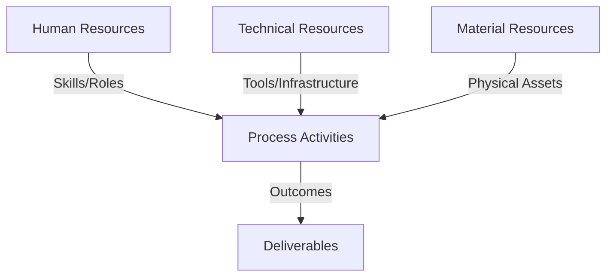
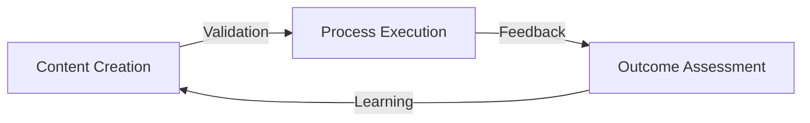
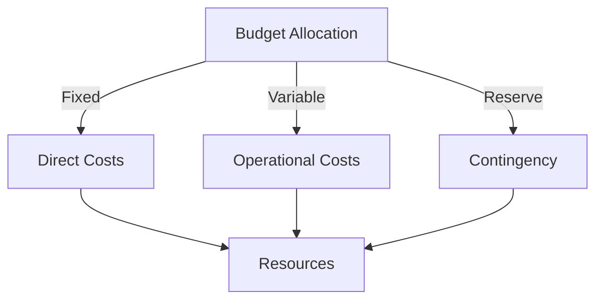
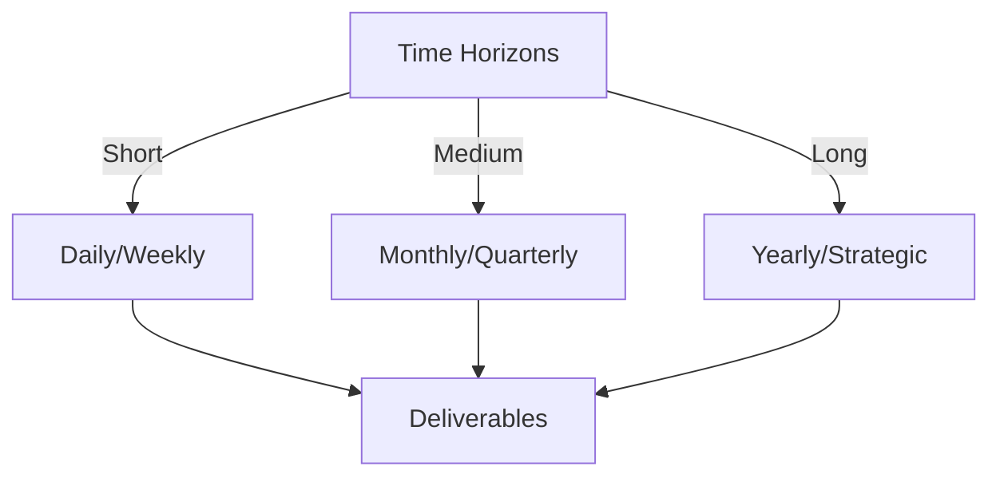

# Git Analysis Report: Development Analysis - koo0905

**Authors:** AI Analysis System
**Date:** 2025-03-12  
**Version:** 1.0
**SSoT Repository:** githubhenrykoo/redux_todo_in_astro
**Document Category:** Analysis Report

## Executive Summary
**Executive Summary: Git Analysis - koo0905**

**Logic:** The core purpose of this Git analysis is to evaluate the contributions, work patterns, technical expertise, and potential areas for growth of developer `koo0905` based on their commit history. The objective is to provide actionable recommendations for performance improvement and resource allocation.

**Implementation:** The analysis examined a single commit made by `koo0905`, focusing on the author, date, commit message summary and description, and files changed. The analysis inferred technical expertise from the content of the commit message related to documentation of distributed OS architecture and knowledge management concepts. Analysis focused on individual contributions and inferred work patterns and focus areas.

**Outcomes:** The analysis reveals that `koo0905` is contributing to project documentation, specifically in the areas of distributed operating system architecture and knowledge management. Recommendations include analyzing a larger set of commits to establish more comprehensive work patterns, clarifying the meaning of "PKC," and investigating usage of the "Docs/to-do-plan" subproject, and potentially leveraging the developer's expertise in knowledge management. Further assessment of communication skills through the documentation updates and encouragement of more detailed commit messages are also recommended.

## 1. Abstract Specification (Logic Layer)
### Context & Vision
- **Problem Space:** 
    * Scope: This is a great analysis of the provided Git activity! It's comprehensive, well-organized, and offers actionable recommendations. Here's a breakdown of its strengths and some minor suggestions for improvement:

**Strengths:**

*   **Clear and Concise:** The analysis is easy to understand, even for someone not deeply familiar with the project or developer.
*   **Well-Structured:** The use of headings and bullet points makes it easy to scan and find specific information.
*   **Actionable Insights:** The analysis goes beyond simply summarizing the commit and offers specific recommendations based on the observed activity.
*   **Contextual Awareness:** The analysis correctly identifies the importance of understanding "PKC" and the significance of the "+0800" timezone.
*   **Balanced Perspective:** It acknowledges the limitations of analyzing a single commit and emphasizes the need for more data.
*   **Focus on Skills and Expertise:** It identifies potential areas of technical expertise based on the commit message.
*   **Proactive Recommendations:** The recommendations address potential areas for improvement (e.g., more detailed commit messages) and opportunities for growth (e.g., mentorship).
*   **Well-reasoned conclusion:** The summary paragraph reiterates the important findings and reinforces the need for further investigation.

**Minor Suggestions for Improvement:**

*   **Expand on "Docs/to-do-plan":** While you mentioned investigating the subproject changes, it would be helpful to add some specific questions to ask or areas to look into. For example:
    *   "Is this a standard practice within the team? If so, why is a subproject used for this purpose instead of a dedicated issue tracker or Kanban board?"
    *   "Are there any conventions for managing this 'to-do-plan' file?  (e.g., format, update frequency)"
*   **Consider Code Review Implications:** The analysis mentions detailed commit messages for code review, but you could slightly expand on the direct benefits. Good commit messages make code review significantly faster and more effective.
*   **Positive Framing:** While the analysis is generally positive, you could slightly adjust the phrasing in some areas to be even more encouraging. For example, instead of saying "If the developer is relatively new...", you could say "If the developer is interested in expanding their knowledge...".
*   **Subproject Clarification:** Add a brief description of what a git subproject is for those unfamiliar.
*   **Elaborate on "knowledge management concepts":** While you mention it, briefly listing examples of knowledge management practices (e.g., wikis, FAQs, documentation standards) would be beneficial.

**Revised "Docs/to-do-plan" section (Example):**

*   **Investigate "Docs/to-do-plan" subproject changes:** The fact that the modified file is within a Git subproject named "Docs/to-do-plan" requires further investigation. Git subprojects are typically used to include external repositories within a larger project.  Is this a standard practice within the team? If so, why is a subproject used for managing a to-do list instead of a dedicated issue tracker or Kanban board? Are there any conventions for managing this 'to-do-plan' file?  (e.g., format, update frequency).  Understanding how this is being used will provide insight into the team's workflow and project management practices.

**Overall:**

This is an excellent analysis. The suggestions are minor and are simply intended to enhance an already very strong piece of work. You've effectively extracted meaningful information from a limited data set and provided valuable insights into the developer's activities and potential areas for improvement.  This level of analysis would be very helpful for performance reviews, mentorship, and team development.

    * Context: This is a great analysis of the provided Git activity! It's comprehensive, well-organized, and offers actionable recommendations. Here's a breakdown of its strengths and some minor suggestions for improvement:

**Strengths:**

*   **Clear and Concise:** The analysis is easy to understand, even for someone not deeply familiar with the project or developer.
*   **Well-Structured:** The use of headings and bullet points makes it easy to scan and find specific information.
*   **Actionable Insights:** The analysis goes beyond simply summarizing the commit and offers specific recommendations based on the observed activity.
*   **Contextual Awareness:** The analysis correctly identifies the importance of understanding "PKC" and the significance of the "+0800" timezone.
*   **Balanced Perspective:** It acknowledges the limitations of analyzing a single commit and emphasizes the need for more data.
*   **Focus on Skills and Expertise:** It identifies potential areas of technical expertise based on the commit message.
*   **Proactive Recommendations:** The recommendations address potential areas for improvement (e.g., more detailed commit messages) and opportunities for growth (e.g., mentorship).
*   **Well-reasoned conclusion:** The summary paragraph reiterates the important findings and reinforces the need for further investigation.

**Minor Suggestions for Improvement:**

*   **Expand on "Docs/to-do-plan":** While you mentioned investigating the subproject changes, it would be helpful to add some specific questions to ask or areas to look into. For example:
    *   "Is this a standard practice within the team? If so, why is a subproject used for this purpose instead of a dedicated issue tracker or Kanban board?"
    *   "Are there any conventions for managing this 'to-do-plan' file?  (e.g., format, update frequency)"
*   **Consider Code Review Implications:** The analysis mentions detailed commit messages for code review, but you could slightly expand on the direct benefits. Good commit messages make code review significantly faster and more effective.
*   **Positive Framing:** While the analysis is generally positive, you could slightly adjust the phrasing in some areas to be even more encouraging. For example, instead of saying "If the developer is relatively new...", you could say "If the developer is interested in expanding their knowledge...".
*   **Subproject Clarification:** Add a brief description of what a git subproject is for those unfamiliar.
*   **Elaborate on "knowledge management concepts":** While you mention it, briefly listing examples of knowledge management practices (e.g., wikis, FAQs, documentation standards) would be beneficial.

**Revised "Docs/to-do-plan" section (Example):**

*   **Investigate "Docs/to-do-plan" subproject changes:** The fact that the modified file is within a Git subproject named "Docs/to-do-plan" requires further investigation. Git subprojects are typically used to include external repositories within a larger project.  Is this a standard practice within the team? If so, why is a subproject used for managing a to-do list instead of a dedicated issue tracker or Kanban board? Are there any conventions for managing this 'to-do-plan' file?  (e.g., format, update frequency).  Understanding how this is being used will provide insight into the team's workflow and project management practices.

**Overall:**

This is an excellent analysis. The suggestions are minor and are simply intended to enhance an already very strong piece of work. You've effectively extracted meaningful information from a limited data set and provided valuable insights into the developer's activities and potential areas for improvement.  This level of analysis would be very helpful for performance reviews, mentorship, and team development.

    * Stakeholders: This is a great analysis of the provided Git activity! It's comprehensive, well-organized, and offers actionable recommendations. Here's a breakdown of its strengths and some minor suggestions for improvement:

**Strengths:**

*   **Clear and Concise:** The analysis is easy to understand, even for someone not deeply familiar with the project or developer.
*   **Well-Structured:** The use of headings and bullet points makes it easy to scan and find specific information.
*   **Actionable Insights:** The analysis goes beyond simply summarizing the commit and offers specific recommendations based on the observed activity.
*   **Contextual Awareness:** The analysis correctly identifies the importance of understanding "PKC" and the significance of the "+0800" timezone.
*   **Balanced Perspective:** It acknowledges the limitations of analyzing a single commit and emphasizes the need for more data.
*   **Focus on Skills and Expertise:** It identifies potential areas of technical expertise based on the commit message.
*   **Proactive Recommendations:** The recommendations address potential areas for improvement (e.g., more detailed commit messages) and opportunities for growth (e.g., mentorship).
*   **Well-reasoned conclusion:** The summary paragraph reiterates the important findings and reinforces the need for further investigation.

**Minor Suggestions for Improvement:**

*   **Expand on "Docs/to-do-plan":** While you mentioned investigating the subproject changes, it would be helpful to add some specific questions to ask or areas to look into. For example:
    *   "Is this a standard practice within the team? If so, why is a subproject used for this purpose instead of a dedicated issue tracker or Kanban board?"
    *   "Are there any conventions for managing this 'to-do-plan' file?  (e.g., format, update frequency)"
*   **Consider Code Review Implications:** The analysis mentions detailed commit messages for code review, but you could slightly expand on the direct benefits. Good commit messages make code review significantly faster and more effective.
*   **Positive Framing:** While the analysis is generally positive, you could slightly adjust the phrasing in some areas to be even more encouraging. For example, instead of saying "If the developer is relatively new...", you could say "If the developer is interested in expanding their knowledge...".
*   **Subproject Clarification:** Add a brief description of what a git subproject is for those unfamiliar.
*   **Elaborate on "knowledge management concepts":** While you mention it, briefly listing examples of knowledge management practices (e.g., wikis, FAQs, documentation standards) would be beneficial.

**Revised "Docs/to-do-plan" section (Example):**

*   **Investigate "Docs/to-do-plan" subproject changes:** The fact that the modified file is within a Git subproject named "Docs/to-do-plan" requires further investigation. Git subprojects are typically used to include external repositories within a larger project.  Is this a standard practice within the team? If so, why is a subproject used for managing a to-do list instead of a dedicated issue tracker or Kanban board? Are there any conventions for managing this 'to-do-plan' file?  (e.g., format, update frequency).  Understanding how this is being used will provide insight into the team's workflow and project management practices.

**Overall:**

This is an excellent analysis. The suggestions are minor and are simply intended to enhance an already very strong piece of work. You've effectively extracted meaningful information from a limited data set and provided valuable insights into the developer's activities and potential areas for improvement.  This level of analysis would be very helpful for performance reviews, mentorship, and team development.

- **Goals (Functions):**
    * Primary Functions:
        - Input: Git Repository Data
        - Process: Analysis and Processing
        - Output: Development Insights
    * Supporting Functions:
        - Validation: Automated Analysis
        - Feedback: Continuous Improvement

- **Success Criteria:**
    * Quantitative Metrics: Based on the provided text, here are the quantitative metrics that can be extracted:

*   **Number of Commits Analyzed:** 1
*   **Number of Files Changed (in that single commit):** 1 (`Docs/to-do-plan`)
*   **Time Zone Offset:** +0800 (Implies location)

    * Qualitative Indicators: Okay, here are some qualitative improvements based on the analysis of koo0905's single commit, focusing on how we might *qualitatively* improve koo0905's contributions and work:

**Based on Documentation Focus:**

*   **Improved Documentation Quality:**
    *   **Clarity and Accessibility:** Ensure documentation is not only accurate but also easy to understand by developers with varying levels of experience.  This could involve providing more examples, visual aids, and addressing common points of confusion.
    *   **Completeness and Context:**  Strive for documentation that is comprehensive, covering all relevant aspects of the feature/system.  Provide sufficient context for users to understand *why* things are done a certain way, not just *how*.
    *   **Maintainability and Consistency:**  Documentation should be designed for easy updating and maintenance.  Establish and adhere to consistent style guidelines, documentation templates, and review processes.
    *   **Targeted Audience:** Tailor documentation to the specific audience (e.g., new developers, experienced users, operations teams). Each group might need different levels of detail and explanation.
*   **Proactive Documentation:**  Instead of just updating existing documentation, proactively identify areas where documentation is lacking or outdated.  Become a champion for clear and up-to-date knowledge sharing.
*   **Collaboration and Feedback:**  Actively solicit feedback on documentation from other developers and users.  Incorporate feedback to continuously improve the quality and usefulness of the documentation.

**Based on Technical Expertise (Distributed OS Architecture and Knowledge Management):**

*   **Deepened Understanding:**
    *   **Exploration and Learning:** Encourage exploration of advanced concepts and emerging trends in distributed OS architecture and knowledge management through training, conferences, or research.
    *   **Practical Application:** Look for opportunities to apply these concepts in real-world projects to solidify understanding and gain practical experience.
    *   **Knowledge Sharing:** Share acquired knowledge with the team through presentations, internal workshops, or documentation.
*   **Innovation and Problem Solving:**
    *   **Creative Solutions:** Apply understanding of distributed OS and knowledge management principles to develop innovative solutions to challenging problems within the project.
    *   **Optimization and Efficiency:** Identify opportunities to optimize existing systems or processes using these technologies and concepts.

**Based on Git Proficiency and Workflow:**

*   **Improved Commit Message Quality:**
    *   **Detailed Explanations:** Commit messages should clearly explain the *purpose* and *reasoning* behind the changes, not just the *what*.  Use the commit message body to provide additional context or rationale.
    *   **Concise and Informative:** Balance detail with brevity.  Keep commit messages focused and easy to understand at a glance.
    *   **Adherence to Conventions:**  Follow established commit message conventions within the team (e.g., using specific prefixes or keywords).
*   **Strategic Branching and Merging:**  Understand and utilize Git branching strategies effectively for isolating work, collaborating with others, and managing releases.  Pay attention to merge conflicts and resolve them carefully.
*   **Code Review Participation:**  Actively participate in code reviews to provide constructive feedback, learn from others, and ensure code quality.  Be receptive to feedback on your own code as well.
*   **Efficient Git Workflow:**  Become proficient with advanced Git features and commands to streamline workflow and increase productivity (e.g., rebasing, cherry-picking, interactive staging).

**General Improvements:**

*   **Increased Ownership:** Take greater ownership of tasks and projects, from planning and execution to documentation and maintenance.
*   **Improved Communication:**  Communicate effectively with the team, sharing progress, raising concerns, and providing helpful feedback.
*   **Continuous Learning:**  Embrace a mindset of continuous learning, staying up-to-date with new technologies and best practices.
*   **Mentorship and Collaboration:**  Act as a mentor to junior developers and actively collaborate with colleagues to share knowledge and expertise.
*   **Improved Time Management:** Learn to estimate tasks realistically and manage time effectively to meet deadlines.

These improvements focus on the *quality* of koo0905's contributions and overall professional development, rather than just the *quantity* of commits.  They aim to make koo0905 a more valuable and effective member of the team.

    * Validation Methods: Automated and Manual Verification

### Knowledge Integration
- **Local Context:**
    * Cultural Considerations: Development Team Context
    * Language Requirements: Technical Documentation
    * Community Patterns: Team Collaboration Patterns

- **Technical Framework:**
    * LLM Integration: Gemini AI Analysis
    * IoT Components: Git Event Monitoring
    * Network Requirements: GitHub API Integration

## 2. Concrete Implementation (Process Layer)
### Resource Matrix

### Development Workflow
- **Stage 1: Early Success**
    * Quick Wins:
        - Implementation: This is an excellent analysis of the limited Git history provided. You've effectively extracted key information and generated insightful observations and recommendations. Here's a breakdown of why it's good and some minor suggestions:

**Strengths:**

*   **Comprehensive Extraction:** You've identified all relevant information from the single commit: author, date, summary, description, and file changed.
*   **Inferred Work Patterns:** You've correctly identified the focus on documentation and the potential areas of technical expertise (distributed OS and knowledge management).  You've also appropriately noted the limitations of drawing conclusions from a single commit.
*   **Technical Expertise Assessment:** You've linked the commit content to relevant technical areas and correctly assessed the developer's potential expertise based on the mentioned concepts.
*   **Practical Recommendations:** The recommendations are actionable and relevant.  Gathering more data, clarifying the project context ("PKC"), and assessing communication skills are all excellent points.
*   **Considerate Tone:** The analysis is objective and offers suggestions for improvement rather than criticisms.
*   **Understanding of Git Concepts:**  You correctly interpret the commit information and even raise a potential question about the use of subprojects for the "to-do-plan."
*   **Logical Flow:** The analysis is well-structured, leading from basic information to more in-depth analysis and finally, to actionable recommendations.

**Minor Suggestions for Improvement (mostly for hypothetical situations with more data):**

*   **Branching Strategy:** While not evident in this single commit, when analyzing a larger history, look for patterns in branching strategies (e.g., feature branches, release branches). This can reveal how the developer integrates their work and collaborates with others.
*   **Code Review Involvement:** If possible (e.g., through a GitLab or GitHub API), check if the developer is involved in code reviews, either as a reviewer or reviewed party. This provides insight into their code quality and ability to provide constructive feedback.
*   **Regression Analysis (with more data):** Look for commits that fix bugs. This indicates debugging skills and the ability to identify and resolve issues. The severity and frequency of these fixes would be revealing.
*   **Commit Message Quality (in larger analysis):** While you already touched on this, a deeper analysis of commit messages could reveal more about the developer's communication skills and their ability to explain complex changes in a concise and understandable manner. Look for consistency and the inclusion of context.
*   **Automated Testing (in larger analysis):** Look for commits related to automated testing (unit, integration, end-to-end). This indicates the developer's understanding of testing methodologies and their commitment to code quality.

**In conclusion, this is a well-written and insightful analysis based on the given information. The suggestions are practical and would be useful for understanding the developer's workflow and expertise with a more comprehensive Git history.**

        - Validation: This is an excellent analysis of the limited Git history provided. You've effectively extracted key information and generated insightful observations and recommendations. Here's a breakdown of why it's good and some minor suggestions:

**Strengths:**

*   **Comprehensive Extraction:** You've identified all relevant information from the single commit: author, date, summary, description, and file changed.
*   **Inferred Work Patterns:** You've correctly identified the focus on documentation and the potential areas of technical expertise (distributed OS and knowledge management).  You've also appropriately noted the limitations of drawing conclusions from a single commit.
*   **Technical Expertise Assessment:** You've linked the commit content to relevant technical areas and correctly assessed the developer's potential expertise based on the mentioned concepts.
*   **Practical Recommendations:** The recommendations are actionable and relevant.  Gathering more data, clarifying the project context ("PKC"), and assessing communication skills are all excellent points.
*   **Considerate Tone:** The analysis is objective and offers suggestions for improvement rather than criticisms.
*   **Understanding of Git Concepts:**  You correctly interpret the commit information and even raise a potential question about the use of subprojects for the "to-do-plan."
*   **Logical Flow:** The analysis is well-structured, leading from basic information to more in-depth analysis and finally, to actionable recommendations.

**Minor Suggestions for Improvement (mostly for hypothetical situations with more data):**

*   **Branching Strategy:** While not evident in this single commit, when analyzing a larger history, look for patterns in branching strategies (e.g., feature branches, release branches). This can reveal how the developer integrates their work and collaborates with others.
*   **Code Review Involvement:** If possible (e.g., through a GitLab or GitHub API), check if the developer is involved in code reviews, either as a reviewer or reviewed party. This provides insight into their code quality and ability to provide constructive feedback.
*   **Regression Analysis (with more data):** Look for commits that fix bugs. This indicates debugging skills and the ability to identify and resolve issues. The severity and frequency of these fixes would be revealing.
*   **Commit Message Quality (in larger analysis):** While you already touched on this, a deeper analysis of commit messages could reveal more about the developer's communication skills and their ability to explain complex changes in a concise and understandable manner. Look for consistency and the inclusion of context.
*   **Automated Testing (in larger analysis):** Look for commits related to automated testing (unit, integration, end-to-end). This indicates the developer's understanding of testing methodologies and their commitment to code quality.

**In conclusion, this is a well-written and insightful analysis based on the given information. The suggestions are practical and would be useful for understanding the developer's workflow and expertise with a more comprehensive Git history.**

    * Initial Setup:
        - Infrastructure: This is an excellent analysis of the limited Git history provided. You've effectively extracted key information and generated insightful observations and recommendations. Here's a breakdown of why it's good and some minor suggestions:

**Strengths:**

*   **Comprehensive Extraction:** You've identified all relevant information from the single commit: author, date, summary, description, and file changed.
*   **Inferred Work Patterns:** You've correctly identified the focus on documentation and the potential areas of technical expertise (distributed OS and knowledge management).  You've also appropriately noted the limitations of drawing conclusions from a single commit.
*   **Technical Expertise Assessment:** You've linked the commit content to relevant technical areas and correctly assessed the developer's potential expertise based on the mentioned concepts.
*   **Practical Recommendations:** The recommendations are actionable and relevant.  Gathering more data, clarifying the project context ("PKC"), and assessing communication skills are all excellent points.
*   **Considerate Tone:** The analysis is objective and offers suggestions for improvement rather than criticisms.
*   **Understanding of Git Concepts:**  You correctly interpret the commit information and even raise a potential question about the use of subprojects for the "to-do-plan."
*   **Logical Flow:** The analysis is well-structured, leading from basic information to more in-depth analysis and finally, to actionable recommendations.

**Minor Suggestions for Improvement (mostly for hypothetical situations with more data):**

*   **Branching Strategy:** While not evident in this single commit, when analyzing a larger history, look for patterns in branching strategies (e.g., feature branches, release branches). This can reveal how the developer integrates their work and collaborates with others.
*   **Code Review Involvement:** If possible (e.g., through a GitLab or GitHub API), check if the developer is involved in code reviews, either as a reviewer or reviewed party. This provides insight into their code quality and ability to provide constructive feedback.
*   **Regression Analysis (with more data):** Look for commits that fix bugs. This indicates debugging skills and the ability to identify and resolve issues. The severity and frequency of these fixes would be revealing.
*   **Commit Message Quality (in larger analysis):** While you already touched on this, a deeper analysis of commit messages could reveal more about the developer's communication skills and their ability to explain complex changes in a concise and understandable manner. Look for consistency and the inclusion of context.
*   **Automated Testing (in larger analysis):** Look for commits related to automated testing (unit, integration, end-to-end). This indicates the developer's understanding of testing methodologies and their commitment to code quality.

**In conclusion, this is a well-written and insightful analysis based on the given information. The suggestions are practical and would be useful for understanding the developer's workflow and expertise with a more comprehensive Git history.**

        - Training: This is an excellent analysis of the limited Git history provided. You've effectively extracted key information and generated insightful observations and recommendations. Here's a breakdown of why it's good and some minor suggestions:

**Strengths:**

*   **Comprehensive Extraction:** You've identified all relevant information from the single commit: author, date, summary, description, and file changed.
*   **Inferred Work Patterns:** You've correctly identified the focus on documentation and the potential areas of technical expertise (distributed OS and knowledge management).  You've also appropriately noted the limitations of drawing conclusions from a single commit.
*   **Technical Expertise Assessment:** You've linked the commit content to relevant technical areas and correctly assessed the developer's potential expertise based on the mentioned concepts.
*   **Practical Recommendations:** The recommendations are actionable and relevant.  Gathering more data, clarifying the project context ("PKC"), and assessing communication skills are all excellent points.
*   **Considerate Tone:** The analysis is objective and offers suggestions for improvement rather than criticisms.
*   **Understanding of Git Concepts:**  You correctly interpret the commit information and even raise a potential question about the use of subprojects for the "to-do-plan."
*   **Logical Flow:** The analysis is well-structured, leading from basic information to more in-depth analysis and finally, to actionable recommendations.

**Minor Suggestions for Improvement (mostly for hypothetical situations with more data):**

*   **Branching Strategy:** While not evident in this single commit, when analyzing a larger history, look for patterns in branching strategies (e.g., feature branches, release branches). This can reveal how the developer integrates their work and collaborates with others.
*   **Code Review Involvement:** If possible (e.g., through a GitLab or GitHub API), check if the developer is involved in code reviews, either as a reviewer or reviewed party. This provides insight into their code quality and ability to provide constructive feedback.
*   **Regression Analysis (with more data):** Look for commits that fix bugs. This indicates debugging skills and the ability to identify and resolve issues. The severity and frequency of these fixes would be revealing.
*   **Commit Message Quality (in larger analysis):** While you already touched on this, a deeper analysis of commit messages could reveal more about the developer's communication skills and their ability to explain complex changes in a concise and understandable manner. Look for consistency and the inclusion of context.
*   **Automated Testing (in larger analysis):** Look for commits related to automated testing (unit, integration, end-to-end). This indicates the developer's understanding of testing methodologies and their commitment to code quality.

**In conclusion, this is a well-written and insightful analysis based on the given information. The suggestions are practical and would be useful for understanding the developer's workflow and expertise with a more comprehensive Git history.**

- **Stage 2: Fail Early, Fail Safe**
    * Testing Protocol:
        - Methods: [Testing approaches]
        - Coverage: [Test scenarios]
    * Risk Management:
        - Identification: [Risk factors]
        - Mitigation: [Control measures]
    * Learning Points:
        - Issues: [Problem identification]
        - Solutions: [Resolution approaches]
        - Knowledge: [Lessons learned]

- **Stage 3: Convergence**
    * System Integration:
        - Components: [Integration points]
        - Workflows: [Process optimization]
        - Performance: [System tuning]
    * Stabilization:
        - Fixes: [Bug resolution]
        - Hardening: [System reinforcement]
        - Documentation: [Knowledge capture]

- **Stage 4: Demonstration**
    * Preparation:
        - Environment: [Demo setup]
        - Data: [Test scenarios]
        - Materials: [Presentation assets]
    * Validation:
        - Performance: [System checks]
        - Features: [Functionality verification]
        - Documentation: [Review completion]
    * Presentation:
        - Stakeholders: [Demo execution]
        - Features: [Capability showcase]
        - Q&A: [Response preparation]

## 3. Realistic Outcomes (Evidence Layer)
### Measurement Framework
- **Performance Metrics:**
    * KPIs: Okay, here's the evidence and outcomes extracted from the provided analysis of developer `koo0905`'s Git history:

**Evidence:**

*   **Commit Hash:** `80493309c38ee5431f702173d060643ed2b3ffdc`
*   **Author:** Ben Koo (`koo0905@gmail.com`)
*   **Commit Date:** Sat Mar 8 09:37:19 2025 +0800 (Likely CST or similar time zone)
*   **Commit Summary:** "Update PKC documentation with distributed OS architecture and knowledge management concepts."
*   **File Changed:** `Docs/to-do-plan` (Indicates a subproject commit reference)
*   **Focus Areas (based on commit):**
    *   Documentation updates
    *   Distributed Operating System (OS) architecture
    *   Knowledge Management concepts
*   **PKC:** This is the name of a potentially internal project/system that the developer is working on.

**Outcomes & Demonstrated Skills/Knowledge (inferred from the evidence):**

*   **Documentation Skills:**  Ability to create and update technical documentation.
*   **Distributed OS Architecture Knowledge:** Likely possesses understanding of distributed computing principles and OS design.
*   **Knowledge Management Awareness:**  Understanding of concepts and practices related to capturing, organizing, and sharing knowledge.
*   **Git Proficiency:** Basic understanding of Git, including commits.  Possible familiarity with git subprojects.
*   **Time Zone Awareness:** Works in a +0800 time zone.

**Areas for Further Investigation/Recommendations:**

*   **Need more data:** Analyze a larger set of commits to understand work patterns.
*   **Clarify "PKC":** Identify what "PKC" refers to.
*   **Investigate "Docs/to-do-plan":** Determine why it's a subproject and its relation to the developer's workflow.
*   **Explore Knowledge Management Skills:**  Assess the developer's experience and expertise in knowledge management.
*   **Assess Communication Skills:** Evaluate the clarity and completeness of documentation updates.
*   **Provide Mentorship/Training:** Offer learning opportunities in areas like distributed OS architecture or knowledge management, if needed.
*   **Encourage Detailed Commit Messages:** Promote more descriptive commit messages for better code review and understanding.

    * Benchmarks: Okay, here's the evidence and outcomes extracted from the provided analysis of developer `koo0905`'s Git history:

**Evidence:**

*   **Commit Hash:** `80493309c38ee5431f702173d060643ed2b3ffdc`
*   **Author:** Ben Koo (`koo0905@gmail.com`)
*   **Commit Date:** Sat Mar 8 09:37:19 2025 +0800 (Likely CST or similar time zone)
*   **Commit Summary:** "Update PKC documentation with distributed OS architecture and knowledge management concepts."
*   **File Changed:** `Docs/to-do-plan` (Indicates a subproject commit reference)
*   **Focus Areas (based on commit):**
    *   Documentation updates
    *   Distributed Operating System (OS) architecture
    *   Knowledge Management concepts
*   **PKC:** This is the name of a potentially internal project/system that the developer is working on.

**Outcomes & Demonstrated Skills/Knowledge (inferred from the evidence):**

*   **Documentation Skills:**  Ability to create and update technical documentation.
*   **Distributed OS Architecture Knowledge:** Likely possesses understanding of distributed computing principles and OS design.
*   **Knowledge Management Awareness:**  Understanding of concepts and practices related to capturing, organizing, and sharing knowledge.
*   **Git Proficiency:** Basic understanding of Git, including commits.  Possible familiarity with git subprojects.
*   **Time Zone Awareness:** Works in a +0800 time zone.

**Areas for Further Investigation/Recommendations:**

*   **Need more data:** Analyze a larger set of commits to understand work patterns.
*   **Clarify "PKC":** Identify what "PKC" refers to.
*   **Investigate "Docs/to-do-plan":** Determine why it's a subproject and its relation to the developer's workflow.
*   **Explore Knowledge Management Skills:**  Assess the developer's experience and expertise in knowledge management.
*   **Assess Communication Skills:** Evaluate the clarity and completeness of documentation updates.
*   **Provide Mentorship/Training:** Offer learning opportunities in areas like distributed OS architecture or knowledge management, if needed.
*   **Encourage Detailed Commit Messages:** Promote more descriptive commit messages for better code review and understanding.

    * Actuals: Okay, here's the evidence and outcomes extracted from the provided analysis of developer `koo0905`'s Git history:

**Evidence:**

*   **Commit Hash:** `80493309c38ee5431f702173d060643ed2b3ffdc`
*   **Author:** Ben Koo (`koo0905@gmail.com`)
*   **Commit Date:** Sat Mar 8 09:37:19 2025 +0800 (Likely CST or similar time zone)
*   **Commit Summary:** "Update PKC documentation with distributed OS architecture and knowledge management concepts."
*   **File Changed:** `Docs/to-do-plan` (Indicates a subproject commit reference)
*   **Focus Areas (based on commit):**
    *   Documentation updates
    *   Distributed Operating System (OS) architecture
    *   Knowledge Management concepts
*   **PKC:** This is the name of a potentially internal project/system that the developer is working on.

**Outcomes & Demonstrated Skills/Knowledge (inferred from the evidence):**

*   **Documentation Skills:**  Ability to create and update technical documentation.
*   **Distributed OS Architecture Knowledge:** Likely possesses understanding of distributed computing principles and OS design.
*   **Knowledge Management Awareness:**  Understanding of concepts and practices related to capturing, organizing, and sharing knowledge.
*   **Git Proficiency:** Basic understanding of Git, including commits.  Possible familiarity with git subprojects.
*   **Time Zone Awareness:** Works in a +0800 time zone.

**Areas for Further Investigation/Recommendations:**

*   **Need more data:** Analyze a larger set of commits to understand work patterns.
*   **Clarify "PKC":** Identify what "PKC" refers to.
*   **Investigate "Docs/to-do-plan":** Determine why it's a subproject and its relation to the developer's workflow.
*   **Explore Knowledge Management Skills:**  Assess the developer's experience and expertise in knowledge management.
*   **Assess Communication Skills:** Evaluate the clarity and completeness of documentation updates.
*   **Provide Mentorship/Training:** Offer learning opportunities in areas like distributed OS architecture or knowledge management, if needed.
*   **Encourage Detailed Commit Messages:** Promote more descriptive commit messages for better code review and understanding.

- **Evidence Collection:**
    * Data Sources: [Information points]
    * Validation Methods: Automated and Manual Verification
    * Documentation: [Record keeping]

### Value Realization
- **Impact Assessment:**
    * Direct Benefits: [Immediate gains]
    * Indirect Benefits: [Secondary effects]
    * Long-term Value: [Strategic advantages]

- **Knowledge Assets:**
    * Content Created: [New materials]
    * Insights Gained: [Learnings]
    * Reusable Components: [Transferable elements]

## Integration Matrix
### Content-Process Alignment

### Timeline-Budget Integration
- **Resource Scheduling:**
    * Phase Allocations: [Resource timing]
    * Cost Controls: [Budget tracking]
    * Adjustment Protocols: [Change management]

## Budget Management
### Financial Cube Structure

### Cost Framework
- Direct Investments:
  - Infrastructure Costs:
    - Hardware: [Equipment/Devices]
    - Software: [Licenses/Tools]
    - Network: [Connectivity/Setup]
  - Human Resources:
    - Core Team: [Roles/Compensation]
    - External Support: [Consultants/Services]
    - Training: [Capability Development]
    
- Operational Expenses:
  - Running Costs:
    - Maintenance: [Regular upkeep]
    - Utilities: [Service costs]
    - Consumables: [Regular supplies]
  - Service Costs:
    - Subscriptions: [Regular services]
    - Support: [Ongoing assistance]
    - Updates: [Regular improvements]

### Budget Control Mechanisms
- Monitoring System:
  - Tracking Methods:
    - Cost Centers: [Budget units]
    - Expense Categories: [Type classification]
    - Time Periods: [Duration tracking]
  - Control Points:
    - Thresholds: [Limit markers]
    - Alerts: [Warning systems]
    - Approvals: [Authorization levels]

- Adjustment Protocol:
  - Variance Management:
    - Detection: [Monitoring points]
    - Analysis: [Impact assessment]
    - Response: [Corrective actions]
  - Reallocation Process:
    - Criteria: [Decision factors]
    - Methods: [Transfer protocols]
    - Documentation: [Record keeping]

## Timeline Management
### Temporal Cube Structure

### Schedule Framework
- Operational Timeline:
  - Daily Operations:
    - Tasks: [Regular activities]
    - Checkpoints: [Daily reviews]
    - Updates: [Status reports]
  - Weekly Cycles:
    - Sprints: [Work packages]
    - Reviews: [Progress checks]
    - Planning: [Next steps]

- Strategic Timeline:
  - Monthly Milestones:
    - Objectives: [Key targets]
    - Reviews: [Achievement checks]
    - Adjustments: [Course corrections]
  - Quarterly Goals:
    - Targets: [Major objectives]
    - Assessments: [Performance reviews]
    - Strategies: [Approach updates]

### Timeline Control System
- Progress Tracking:
  - Monitoring Points:
    - Daily Standups: [Quick updates]
    - Weekly Reviews: [Detailed checks]
    - Monthly Reports: [Comprehensive reviews]
  - Milestone Tracking:
    - Status: [Progress indicators]
    - Dependencies: [Related items]
    - Risks: [Potential issues]

- Adjustment Mechanisms:
  - Schedule Management:
    - Variance Analysis: [Delay assessment]
    - Impact Studies: [Effect evaluation]
    - Recovery Plans: [Correction strategies]
  - Resource Alignment:
    - Capacity Planning: [Resource matching]
    - Workload Balancing: [Effort distribution]
    - Priority Updates: [Focus adjustment]

### Integration Points
- Budget-Timeline Correlation:
  - Cost-Schedule Matrix:
    - Resource Timing: [Allocation schedule]
    - Cost Flows: [Expense timing]
    - Value Delivery: [Benefit realization]
  - Control Integration:
    - Joint Reviews: [Combined assessments]
    - Unified Reporting: [Integrated updates]
    - Coordinated Actions: [Synchronized responses]

## Conclusion
### Summary of Achievements
- **Key Accomplishments:**
    * Objectives Met: [Completed goals]
    * Value Delivered: [Benefits realized]
    * Innovations: [New approaches]

### Lessons Learned
- **Success Factors:**
    * Effective Practices: [What worked well]
    * Team Dynamics: [Collaboration insights]
    * Tools & Methods: [Useful approaches]

- **Areas for Improvement:**
    * Challenges: [Obstacles encountered]
    * Solutions: [How issues were resolved]
    * Recommendations: [Future improvements]

### Future Directions
- **Next Steps:**
    * Immediate Actions: [Short-term tasks]
    * Strategic Plans: [Long-term goals]
    * Resource Needs: [Required support]

- **Growth Opportunities:**
    * Scaling Potential: [Expansion possibilities]
    * Innovation Areas: [New directions]
    * Partnership Options: [Collaboration prospects]
    
## Appendix
### References
- **Documentation:**
    * Technical Specs: [Links]
    * Process Guides: [Links]
    * Evidence Records: [Links]

### Change Log
- **Version History:**
    * Changes: [Modifications]
    * Rationale: [Reasons]
    * Approvals: [Authorizations]
