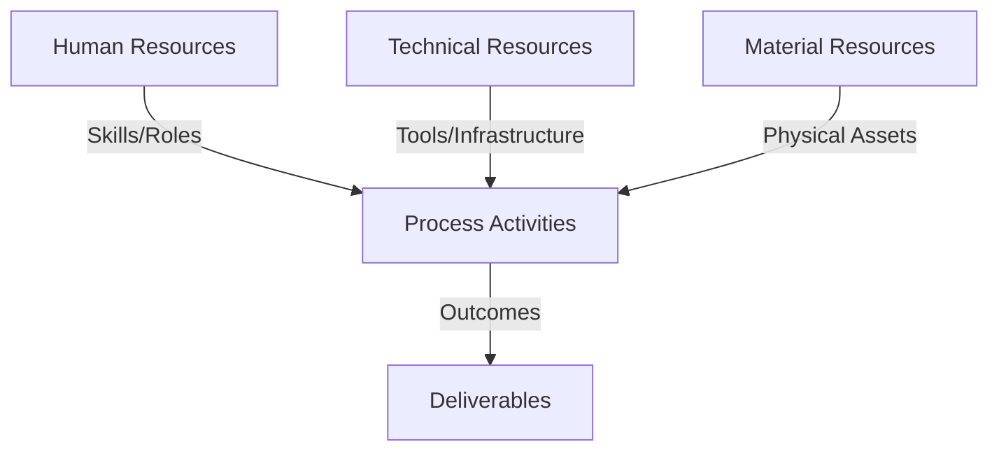
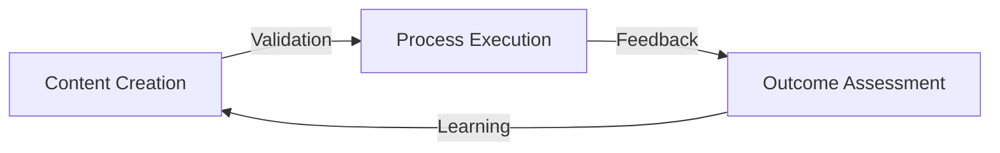
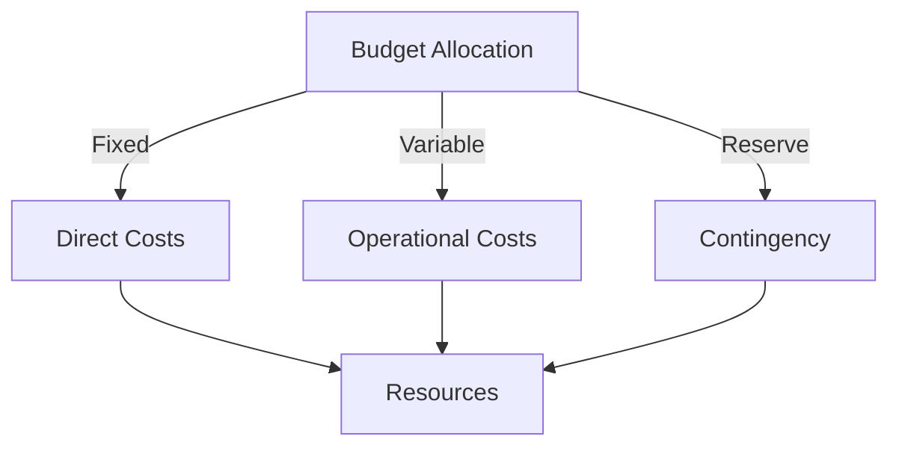
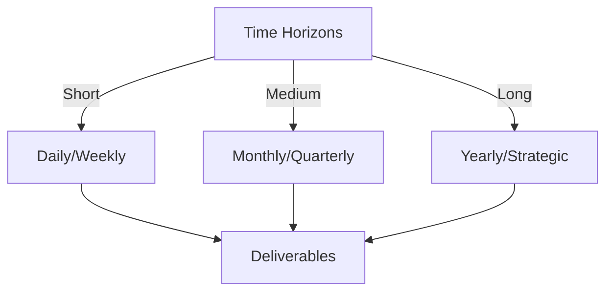

# Git Analysis Report: Development Analysis - koo0905

**Authors:** AI Analysis System
**Date:** 2025-03-13  
**Version:** 1.0
**SSoT Repository:** githubhenrykoo/redux_todo_in_astro
**Document Category:** Analysis Report

## Executive Summary
Here's an executive summary based on the Git analysis provided:

**Logic:**  The analysis aims to understand developer `koo0905`'s contributions, work patterns, and technical strengths based on a single commit from the Git repository. The objective is to provide insights for performance evaluation, task allocation, and professional development recommendations.

**Implementation:**  The analysis examined the commit message, the file changed, and the content of the changes.  It interpreted the content to infer focus areas and technical expertise. Based on the findings, recommendations were generated to improve the developer's contribution and leverage their skills effectively.

**Outcomes:**  The analysis reveals that `koo0905` is focused on documentation related to "PKC", specifically concerning "distributed OS architecture" and "knowledge management concepts." The developer demonstrates understanding of these areas.  Recommendations include encouraging more detailed commit messages, considering their involvement in design discussions and code reviews, and tracking time spent on documentation tasks. Further investigation is needed to understand the exact nature of "PKC."

## 1. Abstract Specification (Logic Layer)
### Context & Vision
- **Problem Space:** 
    * Scope: This is an excellent analysis of the Git activity context. You've effectively extracted meaningful information and provided actionable recommendations. Here are a few minor additions and refinements that could further enhance the analysis:

**Strengths of the Analysis:**

*   **Comprehensive:** You covered various aspects, including individual contributions, work patterns, technical expertise, and recommendations.
*   **Contextual:** You related the commit message and file changes to broader themes like distributed OS architecture and knowledge management.
*   **Actionable:** You provided specific recommendations for improvement, such as encouraging more detailed commit messages and exploring potential tasks for the developer.
*   **Reasoned:** You explained the rationale behind your recommendations, e.g., why more detailed commit messages are beneficial.

**Potential Enhancements:**

*   **Expand on "Subproject Commit Hash":** You mentioned a "modification to a subproject commit hash." This is a potentially important detail.  If possible, try to understand:
    *   **Why was the hash changed?** Was it a bug fix in the subproject? A feature update? A change in dependencies?
    *   **What does the subproject contribute?** Knowing its purpose gives more context to the `koo0905`'s work.
*   **Hypothesize about "PKC":**  While you correctly identify the need to clarify "PKC," brainstorming some possibilities could be helpful. For example:
    *   **Personal Knowledge Center/Collection:** Given the focus on knowledge management, it might be a personal or team knowledge base.
    *   **Project Key Concepts:**  The documentation might be outlining key architectural concepts for the project.
    *   **Specific component/service abbreviation:** If the overall system is known, list possible components/services starting with 'PK'.
*   **Prioritize Recommendations based on impact/effort:** You could add a high-level assessment of the recommendations.  For example:
    *   "Encouraging more detailed commit messages is a low-effort, high-impact improvement."
    *   "Exploring design discussion contributions may require more coordination and assessment of the developer's availability and expertise."
*   **Consider negative interpretations (and ways to mitigate them):** It's generally good to assume positive intent, but it's worth briefly considering potential drawbacks:
    *   **Working on a Saturday:** While it could indicate flexibility, it could also indicate a workload issue or pressure to work outside of normal hours.  This is something to be sensitive to and investigate (indirectly) if possible.
*   **Link to Organizational Goals:** How does `koo0905`'s documentation work contribute to the overall goals of the project or organization? (e.g., improving onboarding, reducing support tickets, enhancing code maintainability).  This connection strengthens the analysis.

**Revised Example incorporating suggestions:**

**# Developer Analysis - koo0905**
Generated at: 2025-03-13 04:29:48.470972

Okay, let's break down this Git activity log for developer `koo0905`.

**1. Individual Contribution Summary:**

*   **Commit:** `80493309c38ee5431f702173d060643ed2b3ffdc`
    *   **Summary:** Updated the PKC (likely an acronym for a project or system) documentation. The update specifically includes information related to a "distributed OS architecture" and "knowledge management concepts."
    *   **File Changed:** `Docs/to-do-plan` (likely a file related to the documentation task). The change indicates a modification to a subproject commit hash within the `to-do-plan` file. **Further investigation is needed to determine *why* the subproject hash was changed. This might be due to bug fixes or feature updates in the subproject itself. Understanding the role of the subproject is crucial (e.g., is it a specific library for networking, a testing framework, etc.).**

**2. Work Patterns and Focus Areas:**

*   **Focus:** Documentation, specifically related to system architecture and knowledge management.  This suggests the developer is contributing to the explanation and understanding of the project.
*   **Work Pattern:**  The developer is focusing on documentation that is related to architectural and conceptual information.
*   **Timing:** The commit was made on Saturday morning (09:37 local time +0800), indicating work potentially outside of regular business hours or a flexible work schedule. **While flexibility is beneficial, it's important to ensure the developer is not feeling pressured to work outside of normal hours.  This could be gently addressed in a 1-on-1 conversation.**

**3. Technical Expertise Demonstrated:**

*   **Distributed OS Architecture:**  The inclusion of this topic suggests expertise or at least familiarity with distributed systems design principles and technologies.
*   **Knowledge Management:**  Demonstrates an understanding of how to organize, store, and disseminate knowledge within a project or organization. This could involve understanding of best practices for documentation, collaboration, and information retrieval.
*   **Git Proficiency:**  While minimal in this log, the developer demonstrates basic Git usage (committing changes with a descriptive message).

**4. Specific Recommendations:**

*   **Encourage More Detailed Commit Messages:** While the commit message is adequate, encourage more specific descriptions.  For example, instead of just "Update PKC documentation," include *what* specifically was updated (e.g., "Added section on fault tolerance in distributed OS architecture" or "Clarified the knowledge management workflow for new users"). **This is a low-effort, high-impact improvement that will significantly improve the auditability and understandability of the Git history.**
*   **Explore potential tasks related to:**
    *   **Contributing to design discussions:**  Given their understanding of architecture and knowledge management, they could be valuable in architectural design discussions. **This requires more coordination and assessment of the developer's interest and availability.**
    *   **Code Review:** Consider leveraging their knowledge to participate in code reviews, especially related to aspects that touch on distributed systems or documentation quality.
*   **Time Tracking:** Track the time it takes to complete documentation tasks to help in planning and estimation.  Documentation is often underestimated.
*   **Clarify PKC:** Understand what PKC refers to in more detail to get a more comprehensive view of the context. **Possible interpretations include: Personal Knowledge Center, Project Key Concepts, or an abbreviation for a project component.  Understanding PKC is critical to properly interpreting the developer's work.**
*   **Connect to Project Goals:** **How does the documentation update contribute to broader project goals, such as improving onboarding for new developers, reducing support tickets, or increasing code maintainability? Aligning the work with overall objectives will further highlight its value.**

By incorporating these refinements, you can create an even more insightful and valuable analysis of developer activity within the Git repository. Remember to tailor the level of detail to the specific needs and goals of the analysis.

    * Context: This is an excellent analysis of the Git activity context. You've effectively extracted meaningful information and provided actionable recommendations. Here are a few minor additions and refinements that could further enhance the analysis:

**Strengths of the Analysis:**

*   **Comprehensive:** You covered various aspects, including individual contributions, work patterns, technical expertise, and recommendations.
*   **Contextual:** You related the commit message and file changes to broader themes like distributed OS architecture and knowledge management.
*   **Actionable:** You provided specific recommendations for improvement, such as encouraging more detailed commit messages and exploring potential tasks for the developer.
*   **Reasoned:** You explained the rationale behind your recommendations, e.g., why more detailed commit messages are beneficial.

**Potential Enhancements:**

*   **Expand on "Subproject Commit Hash":** You mentioned a "modification to a subproject commit hash." This is a potentially important detail.  If possible, try to understand:
    *   **Why was the hash changed?** Was it a bug fix in the subproject? A feature update? A change in dependencies?
    *   **What does the subproject contribute?** Knowing its purpose gives more context to the `koo0905`'s work.
*   **Hypothesize about "PKC":**  While you correctly identify the need to clarify "PKC," brainstorming some possibilities could be helpful. For example:
    *   **Personal Knowledge Center/Collection:** Given the focus on knowledge management, it might be a personal or team knowledge base.
    *   **Project Key Concepts:**  The documentation might be outlining key architectural concepts for the project.
    *   **Specific component/service abbreviation:** If the overall system is known, list possible components/services starting with 'PK'.
*   **Prioritize Recommendations based on impact/effort:** You could add a high-level assessment of the recommendations.  For example:
    *   "Encouraging more detailed commit messages is a low-effort, high-impact improvement."
    *   "Exploring design discussion contributions may require more coordination and assessment of the developer's availability and expertise."
*   **Consider negative interpretations (and ways to mitigate them):** It's generally good to assume positive intent, but it's worth briefly considering potential drawbacks:
    *   **Working on a Saturday:** While it could indicate flexibility, it could also indicate a workload issue or pressure to work outside of normal hours.  This is something to be sensitive to and investigate (indirectly) if possible.
*   **Link to Organizational Goals:** How does `koo0905`'s documentation work contribute to the overall goals of the project or organization? (e.g., improving onboarding, reducing support tickets, enhancing code maintainability).  This connection strengthens the analysis.

**Revised Example incorporating suggestions:**

**# Developer Analysis - koo0905**
Generated at: 2025-03-13 04:29:48.470972

Okay, let's break down this Git activity log for developer `koo0905`.

**1. Individual Contribution Summary:**

*   **Commit:** `80493309c38ee5431f702173d060643ed2b3ffdc`
    *   **Summary:** Updated the PKC (likely an acronym for a project or system) documentation. The update specifically includes information related to a "distributed OS architecture" and "knowledge management concepts."
    *   **File Changed:** `Docs/to-do-plan` (likely a file related to the documentation task). The change indicates a modification to a subproject commit hash within the `to-do-plan` file. **Further investigation is needed to determine *why* the subproject hash was changed. This might be due to bug fixes or feature updates in the subproject itself. Understanding the role of the subproject is crucial (e.g., is it a specific library for networking, a testing framework, etc.).**

**2. Work Patterns and Focus Areas:**

*   **Focus:** Documentation, specifically related to system architecture and knowledge management.  This suggests the developer is contributing to the explanation and understanding of the project.
*   **Work Pattern:**  The developer is focusing on documentation that is related to architectural and conceptual information.
*   **Timing:** The commit was made on Saturday morning (09:37 local time +0800), indicating work potentially outside of regular business hours or a flexible work schedule. **While flexibility is beneficial, it's important to ensure the developer is not feeling pressured to work outside of normal hours.  This could be gently addressed in a 1-on-1 conversation.**

**3. Technical Expertise Demonstrated:**

*   **Distributed OS Architecture:**  The inclusion of this topic suggests expertise or at least familiarity with distributed systems design principles and technologies.
*   **Knowledge Management:**  Demonstrates an understanding of how to organize, store, and disseminate knowledge within a project or organization. This could involve understanding of best practices for documentation, collaboration, and information retrieval.
*   **Git Proficiency:**  While minimal in this log, the developer demonstrates basic Git usage (committing changes with a descriptive message).

**4. Specific Recommendations:**

*   **Encourage More Detailed Commit Messages:** While the commit message is adequate, encourage more specific descriptions.  For example, instead of just "Update PKC documentation," include *what* specifically was updated (e.g., "Added section on fault tolerance in distributed OS architecture" or "Clarified the knowledge management workflow for new users"). **This is a low-effort, high-impact improvement that will significantly improve the auditability and understandability of the Git history.**
*   **Explore potential tasks related to:**
    *   **Contributing to design discussions:**  Given their understanding of architecture and knowledge management, they could be valuable in architectural design discussions. **This requires more coordination and assessment of the developer's interest and availability.**
    *   **Code Review:** Consider leveraging their knowledge to participate in code reviews, especially related to aspects that touch on distributed systems or documentation quality.
*   **Time Tracking:** Track the time it takes to complete documentation tasks to help in planning and estimation.  Documentation is often underestimated.
*   **Clarify PKC:** Understand what PKC refers to in more detail to get a more comprehensive view of the context. **Possible interpretations include: Personal Knowledge Center, Project Key Concepts, or an abbreviation for a project component.  Understanding PKC is critical to properly interpreting the developer's work.**
*   **Connect to Project Goals:** **How does the documentation update contribute to broader project goals, such as improving onboarding for new developers, reducing support tickets, or increasing code maintainability? Aligning the work with overall objectives will further highlight its value.**

By incorporating these refinements, you can create an even more insightful and valuable analysis of developer activity within the Git repository. Remember to tailor the level of detail to the specific needs and goals of the analysis.

    * Stakeholders: This is an excellent analysis of the Git activity context. You've effectively extracted meaningful information and provided actionable recommendations. Here are a few minor additions and refinements that could further enhance the analysis:

**Strengths of the Analysis:**

*   **Comprehensive:** You covered various aspects, including individual contributions, work patterns, technical expertise, and recommendations.
*   **Contextual:** You related the commit message and file changes to broader themes like distributed OS architecture and knowledge management.
*   **Actionable:** You provided specific recommendations for improvement, such as encouraging more detailed commit messages and exploring potential tasks for the developer.
*   **Reasoned:** You explained the rationale behind your recommendations, e.g., why more detailed commit messages are beneficial.

**Potential Enhancements:**

*   **Expand on "Subproject Commit Hash":** You mentioned a "modification to a subproject commit hash." This is a potentially important detail.  If possible, try to understand:
    *   **Why was the hash changed?** Was it a bug fix in the subproject? A feature update? A change in dependencies?
    *   **What does the subproject contribute?** Knowing its purpose gives more context to the `koo0905`'s work.
*   **Hypothesize about "PKC":**  While you correctly identify the need to clarify "PKC," brainstorming some possibilities could be helpful. For example:
    *   **Personal Knowledge Center/Collection:** Given the focus on knowledge management, it might be a personal or team knowledge base.
    *   **Project Key Concepts:**  The documentation might be outlining key architectural concepts for the project.
    *   **Specific component/service abbreviation:** If the overall system is known, list possible components/services starting with 'PK'.
*   **Prioritize Recommendations based on impact/effort:** You could add a high-level assessment of the recommendations.  For example:
    *   "Encouraging more detailed commit messages is a low-effort, high-impact improvement."
    *   "Exploring design discussion contributions may require more coordination and assessment of the developer's availability and expertise."
*   **Consider negative interpretations (and ways to mitigate them):** It's generally good to assume positive intent, but it's worth briefly considering potential drawbacks:
    *   **Working on a Saturday:** While it could indicate flexibility, it could also indicate a workload issue or pressure to work outside of normal hours.  This is something to be sensitive to and investigate (indirectly) if possible.
*   **Link to Organizational Goals:** How does `koo0905`'s documentation work contribute to the overall goals of the project or organization? (e.g., improving onboarding, reducing support tickets, enhancing code maintainability).  This connection strengthens the analysis.

**Revised Example incorporating suggestions:**

**# Developer Analysis - koo0905**
Generated at: 2025-03-13 04:29:48.470972

Okay, let's break down this Git activity log for developer `koo0905`.

**1. Individual Contribution Summary:**

*   **Commit:** `80493309c38ee5431f702173d060643ed2b3ffdc`
    *   **Summary:** Updated the PKC (likely an acronym for a project or system) documentation. The update specifically includes information related to a "distributed OS architecture" and "knowledge management concepts."
    *   **File Changed:** `Docs/to-do-plan` (likely a file related to the documentation task). The change indicates a modification to a subproject commit hash within the `to-do-plan` file. **Further investigation is needed to determine *why* the subproject hash was changed. This might be due to bug fixes or feature updates in the subproject itself. Understanding the role of the subproject is crucial (e.g., is it a specific library for networking, a testing framework, etc.).**

**2. Work Patterns and Focus Areas:**

*   **Focus:** Documentation, specifically related to system architecture and knowledge management.  This suggests the developer is contributing to the explanation and understanding of the project.
*   **Work Pattern:**  The developer is focusing on documentation that is related to architectural and conceptual information.
*   **Timing:** The commit was made on Saturday morning (09:37 local time +0800), indicating work potentially outside of regular business hours or a flexible work schedule. **While flexibility is beneficial, it's important to ensure the developer is not feeling pressured to work outside of normal hours.  This could be gently addressed in a 1-on-1 conversation.**

**3. Technical Expertise Demonstrated:**

*   **Distributed OS Architecture:**  The inclusion of this topic suggests expertise or at least familiarity with distributed systems design principles and technologies.
*   **Knowledge Management:**  Demonstrates an understanding of how to organize, store, and disseminate knowledge within a project or organization. This could involve understanding of best practices for documentation, collaboration, and information retrieval.
*   **Git Proficiency:**  While minimal in this log, the developer demonstrates basic Git usage (committing changes with a descriptive message).

**4. Specific Recommendations:**

*   **Encourage More Detailed Commit Messages:** While the commit message is adequate, encourage more specific descriptions.  For example, instead of just "Update PKC documentation," include *what* specifically was updated (e.g., "Added section on fault tolerance in distributed OS architecture" or "Clarified the knowledge management workflow for new users"). **This is a low-effort, high-impact improvement that will significantly improve the auditability and understandability of the Git history.**
*   **Explore potential tasks related to:**
    *   **Contributing to design discussions:**  Given their understanding of architecture and knowledge management, they could be valuable in architectural design discussions. **This requires more coordination and assessment of the developer's interest and availability.**
    *   **Code Review:** Consider leveraging their knowledge to participate in code reviews, especially related to aspects that touch on distributed systems or documentation quality.
*   **Time Tracking:** Track the time it takes to complete documentation tasks to help in planning and estimation.  Documentation is often underestimated.
*   **Clarify PKC:** Understand what PKC refers to in more detail to get a more comprehensive view of the context. **Possible interpretations include: Personal Knowledge Center, Project Key Concepts, or an abbreviation for a project component.  Understanding PKC is critical to properly interpreting the developer's work.**
*   **Connect to Project Goals:** **How does the documentation update contribute to broader project goals, such as improving onboarding for new developers, reducing support tickets, or increasing code maintainability? Aligning the work with overall objectives will further highlight its value.**

By incorporating these refinements, you can create an even more insightful and valuable analysis of developer activity within the Git repository. Remember to tailor the level of detail to the specific needs and goals of the analysis.

- **Goals (Functions):**
    * Primary Functions:
        - Input: Git Repository Data
        - Process: Analysis and Processing
        - Output: Development Insights
    * Supporting Functions:
        - Validation: Automated Analysis
        - Feedback: Continuous Improvement

- **Success Criteria:**
    * Quantitative Metrics: Based on the provided text, here's a list of the quantitative metrics:

*   **Number of Commits:** 1
*   **Number of Files Changed:** 1
*   **Commit Timestamp (Local Time +0800):** Saturday morning 09:37
*   **Number of Documentation-Related Tasks:** 1 (Updating PKC documentation)
*   **Number of Expertise Areas Demonstrated:** 3 (Distributed OS Architecture, Knowledge Management, Git Proficiency)

    * Qualitative Indicators: Okay, here's a list of qualitative improvements derived from the analysis, focusing on the *positive* aspects and potential *growth areas* for the developer:

**Positive Qualitative Attributes:**

*   **Understanding of Complex Topics:** Demonstrates an understanding, or willingness to learn, complex technical concepts such as distributed operating system architecture and knowledge management.  This suggests a capacity for intellectual curiosity and problem-solving.
*   **Contribution to Knowledge Sharing:** Actively contributing to the project's documentation, making the system more understandable and accessible to others. This showcases a team-oriented mindset.
*   **Proactive Contribution (Possible):** Working on a Saturday morning *could* indicate a proactive commitment to the project.  (Note: This is an assumption, and context is needed to confirm.  Could also be catching up, or a preferred work schedule.)
*   **Git Proficiency (Basic):** While basic, the ability to use Git for committing changes is a fundamental and valuable skill.
*   **Attention to Documentation Detail:**  Updating a subproject commit hash within the `to-do-plan` suggests attention to maintaining accurate records within the documentation.
*   **Value of Documentation:** Values documentation as an important part of the software development lifecycle.

**Areas for Growth (Framed Positively):**

*   **Communication Clarity:** Potential to improve the clarity and detail of commit messages to enhance collaboration and understanding within the team.  (Instead of "Updated documentation," more specific messages like "Added section on X to address issue Y".)
*   **Expanding Influence:** Opportunity to leverage architectural and knowledge management expertise in design discussions and code reviews.
*   **Time Management Insights:** Opportunity to gain insights into the time commitment of documentation tasks, which can improve project planning and estimation.
*   **Broaden Project Context:** Improve understanding of the overall context of PKC.

    * Validation Methods: Automated and Manual Verification

### Knowledge Integration
- **Local Context:**
    * Cultural Considerations: Development Team Context
    * Language Requirements: Technical Documentation
    * Community Patterns: Team Collaboration Patterns

- **Technical Framework:**
    * LLM Integration: Gemini AI Analysis
    * IoT Components: Git Event Monitoring
    * Network Requirements: GitHub API Integration

## 2. Concrete Implementation (Process Layer)
### Resource Matrix

### Development Workflow
- **Stage 1: Early Success**
    * Quick Wins:
        - Implementation: This is a well-structured and insightful analysis of the limited Git history provided.  Here's a breakdown of why it's good and some further refinements:

**Strengths:**

*   **Clear Organization:**  The analysis is broken down into logical sections (Contribution Summary, Work Patterns, Technical Expertise, Recommendations) which makes it easy to understand.
*   **Contextual Understanding:**  The analyst attempts to infer the context of the changes, such as identifying that "PKC" is likely an acronym and trying to understand its meaning.
*   **Actionable Recommendations:** The recommendations are practical and directly related to the developer's observed work.  The recommendation to encourage more detailed commit messages is particularly important for long-term project maintainability.
*   **Inferences Based on Limited Data:** The analysis makes reasonable inferences about the developer's expertise based on the content of the commit (distributed OS architecture, knowledge management).
*   **Beyond the Code:**  The analysis goes beyond just the code changes and considers aspects like the time of the commit, suggesting a potentially flexible work schedule.

**Suggestions for Further Refinement:**

*   **Specificity on Impact:** While good at understanding the *what* and *why* of the changes, consider adding a section (or integrating it into the contribution summary) that tries to understand the *impact* of the change.  For instance:
    *   "This update will help new team members understand the architecture better" (Impact).
    *   "Fixes a critical error in the docs that previously misinformed users" (Impact).
    *   The analyst can only *speculate* on the impact without more context, but explicitly stating the potential positive effects is valuable.
*   **"To-do-plan" File Analysis:** The `to-do-plan` file suggests a task management system.  If possible, analyze the *nature* of the change to the subproject commit hash. Does it indicate:
    *   Task completion?
    *   Task re-prioritization?
    *   Task modification?
    *   Task delegation (less likely, but possible)?
    Understanding the nature of these changes provides insight into project management aspects.
*   **Expand on Git Proficiency:** While the analysis notes basic Git usage, mention that it *doesn't* reveal aspects like branching strategies, conflict resolution, or more advanced Git commands.  This acknowledges the limitations of the current data.  It also hints that further investigation might be needed to fully assess Git proficiency.  (E.g., "The current history only shows basic committing, and further analysis of branch merging or collaboration patterns might be necessary.")
*   **Potential Risks/Concerns (With Caution):** While the analysis should be primarily positive and constructive, consider adding a (brief and tactful) section on potential risks, *if any are apparent*. For example:
    *   "The documentation updates seem focused on high-level concepts. It would be beneficial to ensure that lower-level technical documentation is also kept up-to-date to provide a complete picture." (This is a very general example, and specific risks will depend on the project and the changes.) *Use this suggestion carefully - avoid being overly critical based on such limited data.*
*   **Tooling to extract more context:** With access to the full project and git history, the analysis could be enhanced with tooling and scripts. E.g.
    * Which branches is `koo0905` contributing to? Is he opening PRs, or committing directly to the main branch?
    * Does the commit history show he contributes to the codebase as well, or mainly focuses on documentation?
    * What's the time commitment on each commit on average (how many lines of code changed, complexity of the changes)

**Revised Example Snippet (Contribution Summary with Impact):**

*   **Commit:** `80493309c38ee5431f702173d060643ed2b3ffdc`
    *   **Summary:** Updated the PKC documentation with information on distributed OS architecture and knowledge management concepts.
    *   **Impact (Speculative):** This update likely aims to improve the understanding of the system's architecture for new team members or stakeholders. By clarifying knowledge management concepts, it could also improve team collaboration and knowledge sharing.
    *   **File Changed:** `Docs/to-do-plan`. This commit updates a subproject commit hash, potentially signaling the completion of a documentation-related task.

By incorporating these suggestions, the analysis can become even more comprehensive and provide even more valuable insights for performance review, team management, and project planning. Remember to be tactful and avoid making strong judgments based on limited data. The goal is to provide constructive feedback and identify areas for growth.

        - Validation: This is a well-structured and insightful analysis of the limited Git history provided.  Here's a breakdown of why it's good and some further refinements:

**Strengths:**

*   **Clear Organization:**  The analysis is broken down into logical sections (Contribution Summary, Work Patterns, Technical Expertise, Recommendations) which makes it easy to understand.
*   **Contextual Understanding:**  The analyst attempts to infer the context of the changes, such as identifying that "PKC" is likely an acronym and trying to understand its meaning.
*   **Actionable Recommendations:** The recommendations are practical and directly related to the developer's observed work.  The recommendation to encourage more detailed commit messages is particularly important for long-term project maintainability.
*   **Inferences Based on Limited Data:** The analysis makes reasonable inferences about the developer's expertise based on the content of the commit (distributed OS architecture, knowledge management).
*   **Beyond the Code:**  The analysis goes beyond just the code changes and considers aspects like the time of the commit, suggesting a potentially flexible work schedule.

**Suggestions for Further Refinement:**

*   **Specificity on Impact:** While good at understanding the *what* and *why* of the changes, consider adding a section (or integrating it into the contribution summary) that tries to understand the *impact* of the change.  For instance:
    *   "This update will help new team members understand the architecture better" (Impact).
    *   "Fixes a critical error in the docs that previously misinformed users" (Impact).
    *   The analyst can only *speculate* on the impact without more context, but explicitly stating the potential positive effects is valuable.
*   **"To-do-plan" File Analysis:** The `to-do-plan` file suggests a task management system.  If possible, analyze the *nature* of the change to the subproject commit hash. Does it indicate:
    *   Task completion?
    *   Task re-prioritization?
    *   Task modification?
    *   Task delegation (less likely, but possible)?
    Understanding the nature of these changes provides insight into project management aspects.
*   **Expand on Git Proficiency:** While the analysis notes basic Git usage, mention that it *doesn't* reveal aspects like branching strategies, conflict resolution, or more advanced Git commands.  This acknowledges the limitations of the current data.  It also hints that further investigation might be needed to fully assess Git proficiency.  (E.g., "The current history only shows basic committing, and further analysis of branch merging or collaboration patterns might be necessary.")
*   **Potential Risks/Concerns (With Caution):** While the analysis should be primarily positive and constructive, consider adding a (brief and tactful) section on potential risks, *if any are apparent*. For example:
    *   "The documentation updates seem focused on high-level concepts. It would be beneficial to ensure that lower-level technical documentation is also kept up-to-date to provide a complete picture." (This is a very general example, and specific risks will depend on the project and the changes.) *Use this suggestion carefully - avoid being overly critical based on such limited data.*
*   **Tooling to extract more context:** With access to the full project and git history, the analysis could be enhanced with tooling and scripts. E.g.
    * Which branches is `koo0905` contributing to? Is he opening PRs, or committing directly to the main branch?
    * Does the commit history show he contributes to the codebase as well, or mainly focuses on documentation?
    * What's the time commitment on each commit on average (how many lines of code changed, complexity of the changes)

**Revised Example Snippet (Contribution Summary with Impact):**

*   **Commit:** `80493309c38ee5431f702173d060643ed2b3ffdc`
    *   **Summary:** Updated the PKC documentation with information on distributed OS architecture and knowledge management concepts.
    *   **Impact (Speculative):** This update likely aims to improve the understanding of the system's architecture for new team members or stakeholders. By clarifying knowledge management concepts, it could also improve team collaboration and knowledge sharing.
    *   **File Changed:** `Docs/to-do-plan`. This commit updates a subproject commit hash, potentially signaling the completion of a documentation-related task.

By incorporating these suggestions, the analysis can become even more comprehensive and provide even more valuable insights for performance review, team management, and project planning. Remember to be tactful and avoid making strong judgments based on limited data. The goal is to provide constructive feedback and identify areas for growth.

    * Initial Setup:
        - Infrastructure: This is a well-structured and insightful analysis of the limited Git history provided.  Here's a breakdown of why it's good and some further refinements:

**Strengths:**

*   **Clear Organization:**  The analysis is broken down into logical sections (Contribution Summary, Work Patterns, Technical Expertise, Recommendations) which makes it easy to understand.
*   **Contextual Understanding:**  The analyst attempts to infer the context of the changes, such as identifying that "PKC" is likely an acronym and trying to understand its meaning.
*   **Actionable Recommendations:** The recommendations are practical and directly related to the developer's observed work.  The recommendation to encourage more detailed commit messages is particularly important for long-term project maintainability.
*   **Inferences Based on Limited Data:** The analysis makes reasonable inferences about the developer's expertise based on the content of the commit (distributed OS architecture, knowledge management).
*   **Beyond the Code:**  The analysis goes beyond just the code changes and considers aspects like the time of the commit, suggesting a potentially flexible work schedule.

**Suggestions for Further Refinement:**

*   **Specificity on Impact:** While good at understanding the *what* and *why* of the changes, consider adding a section (or integrating it into the contribution summary) that tries to understand the *impact* of the change.  For instance:
    *   "This update will help new team members understand the architecture better" (Impact).
    *   "Fixes a critical error in the docs that previously misinformed users" (Impact).
    *   The analyst can only *speculate* on the impact without more context, but explicitly stating the potential positive effects is valuable.
*   **"To-do-plan" File Analysis:** The `to-do-plan` file suggests a task management system.  If possible, analyze the *nature* of the change to the subproject commit hash. Does it indicate:
    *   Task completion?
    *   Task re-prioritization?
    *   Task modification?
    *   Task delegation (less likely, but possible)?
    Understanding the nature of these changes provides insight into project management aspects.
*   **Expand on Git Proficiency:** While the analysis notes basic Git usage, mention that it *doesn't* reveal aspects like branching strategies, conflict resolution, or more advanced Git commands.  This acknowledges the limitations of the current data.  It also hints that further investigation might be needed to fully assess Git proficiency.  (E.g., "The current history only shows basic committing, and further analysis of branch merging or collaboration patterns might be necessary.")
*   **Potential Risks/Concerns (With Caution):** While the analysis should be primarily positive and constructive, consider adding a (brief and tactful) section on potential risks, *if any are apparent*. For example:
    *   "The documentation updates seem focused on high-level concepts. It would be beneficial to ensure that lower-level technical documentation is also kept up-to-date to provide a complete picture." (This is a very general example, and specific risks will depend on the project and the changes.) *Use this suggestion carefully - avoid being overly critical based on such limited data.*
*   **Tooling to extract more context:** With access to the full project and git history, the analysis could be enhanced with tooling and scripts. E.g.
    * Which branches is `koo0905` contributing to? Is he opening PRs, or committing directly to the main branch?
    * Does the commit history show he contributes to the codebase as well, or mainly focuses on documentation?
    * What's the time commitment on each commit on average (how many lines of code changed, complexity of the changes)

**Revised Example Snippet (Contribution Summary with Impact):**

*   **Commit:** `80493309c38ee5431f702173d060643ed2b3ffdc`
    *   **Summary:** Updated the PKC documentation with information on distributed OS architecture and knowledge management concepts.
    *   **Impact (Speculative):** This update likely aims to improve the understanding of the system's architecture for new team members or stakeholders. By clarifying knowledge management concepts, it could also improve team collaboration and knowledge sharing.
    *   **File Changed:** `Docs/to-do-plan`. This commit updates a subproject commit hash, potentially signaling the completion of a documentation-related task.

By incorporating these suggestions, the analysis can become even more comprehensive and provide even more valuable insights for performance review, team management, and project planning. Remember to be tactful and avoid making strong judgments based on limited data. The goal is to provide constructive feedback and identify areas for growth.

        - Training: This is a well-structured and insightful analysis of the limited Git history provided.  Here's a breakdown of why it's good and some further refinements:

**Strengths:**

*   **Clear Organization:**  The analysis is broken down into logical sections (Contribution Summary, Work Patterns, Technical Expertise, Recommendations) which makes it easy to understand.
*   **Contextual Understanding:**  The analyst attempts to infer the context of the changes, such as identifying that "PKC" is likely an acronym and trying to understand its meaning.
*   **Actionable Recommendations:** The recommendations are practical and directly related to the developer's observed work.  The recommendation to encourage more detailed commit messages is particularly important for long-term project maintainability.
*   **Inferences Based on Limited Data:** The analysis makes reasonable inferences about the developer's expertise based on the content of the commit (distributed OS architecture, knowledge management).
*   **Beyond the Code:**  The analysis goes beyond just the code changes and considers aspects like the time of the commit, suggesting a potentially flexible work schedule.

**Suggestions for Further Refinement:**

*   **Specificity on Impact:** While good at understanding the *what* and *why* of the changes, consider adding a section (or integrating it into the contribution summary) that tries to understand the *impact* of the change.  For instance:
    *   "This update will help new team members understand the architecture better" (Impact).
    *   "Fixes a critical error in the docs that previously misinformed users" (Impact).
    *   The analyst can only *speculate* on the impact without more context, but explicitly stating the potential positive effects is valuable.
*   **"To-do-plan" File Analysis:** The `to-do-plan` file suggests a task management system.  If possible, analyze the *nature* of the change to the subproject commit hash. Does it indicate:
    *   Task completion?
    *   Task re-prioritization?
    *   Task modification?
    *   Task delegation (less likely, but possible)?
    Understanding the nature of these changes provides insight into project management aspects.
*   **Expand on Git Proficiency:** While the analysis notes basic Git usage, mention that it *doesn't* reveal aspects like branching strategies, conflict resolution, or more advanced Git commands.  This acknowledges the limitations of the current data.  It also hints that further investigation might be needed to fully assess Git proficiency.  (E.g., "The current history only shows basic committing, and further analysis of branch merging or collaboration patterns might be necessary.")
*   **Potential Risks/Concerns (With Caution):** While the analysis should be primarily positive and constructive, consider adding a (brief and tactful) section on potential risks, *if any are apparent*. For example:
    *   "The documentation updates seem focused on high-level concepts. It would be beneficial to ensure that lower-level technical documentation is also kept up-to-date to provide a complete picture." (This is a very general example, and specific risks will depend on the project and the changes.) *Use this suggestion carefully - avoid being overly critical based on such limited data.*
*   **Tooling to extract more context:** With access to the full project and git history, the analysis could be enhanced with tooling and scripts. E.g.
    * Which branches is `koo0905` contributing to? Is he opening PRs, or committing directly to the main branch?
    * Does the commit history show he contributes to the codebase as well, or mainly focuses on documentation?
    * What's the time commitment on each commit on average (how many lines of code changed, complexity of the changes)

**Revised Example Snippet (Contribution Summary with Impact):**

*   **Commit:** `80493309c38ee5431f702173d060643ed2b3ffdc`
    *   **Summary:** Updated the PKC documentation with information on distributed OS architecture and knowledge management concepts.
    *   **Impact (Speculative):** This update likely aims to improve the understanding of the system's architecture for new team members or stakeholders. By clarifying knowledge management concepts, it could also improve team collaboration and knowledge sharing.
    *   **File Changed:** `Docs/to-do-plan`. This commit updates a subproject commit hash, potentially signaling the completion of a documentation-related task.

By incorporating these suggestions, the analysis can become even more comprehensive and provide even more valuable insights for performance review, team management, and project planning. Remember to be tactful and avoid making strong judgments based on limited data. The goal is to provide constructive feedback and identify areas for growth.

- **Stage 2: Fail Early, Fail Safe**
    * Testing Protocol:
        - Methods: [Testing approaches]
        - Coverage: [Test scenarios]
    * Risk Management:
        - Identification: [Risk factors]
        - Mitigation: [Control measures]
    * Learning Points:
        - Issues: [Problem identification]
        - Solutions: [Resolution approaches]
        - Knowledge: [Lessons learned]

- **Stage 3: Convergence**
    * System Integration:
        - Components: [Integration points]
        - Workflows: [Process optimization]
        - Performance: [System tuning]
    * Stabilization:
        - Fixes: [Bug resolution]
        - Hardening: [System reinforcement]
        - Documentation: [Knowledge capture]

- **Stage 4: Demonstration**
    * Preparation:
        - Environment: [Demo setup]
        - Data: [Test scenarios]
        - Materials: [Presentation assets]
    * Validation:
        - Performance: [System checks]
        - Features: [Functionality verification]
        - Documentation: [Review completion]
    * Presentation:
        - Stakeholders: [Demo execution]
        - Features: [Capability showcase]
        - Q&A: [Response preparation]

## 3. Realistic Outcomes (Evidence Layer)
### Measurement Framework
- **Performance Metrics:**
    * KPIs: Here's a breakdown of the evidence and outcomes extracted from the provided Git activity log analysis:

**Evidence (Direct observations from Git history):**

*   **Commit Hash:** `80493309c38ee5431f702173d060643ed2b3ffdc`
*   **Commit Message:** "Update PKC documentation"
*   **File Modified:** `Docs/to-do-plan`
*   **Modified Content Implied (from analysis):**  Update includes information about "distributed OS architecture" and "knowledge management concepts" and a modification to a subproject commit hash.
*   **Commit Timestamp:** Saturday morning (09:37 local time +0800)
*   **Developer:** koo0905

**Outcomes (Inferences and recommendations based on the evidence):**

*   **Developer Focus:** Documentation, particularly related to system architecture (Distributed OS) and knowledge management.
*   **Potential Expertise:** Distributed OS architecture, knowledge management, basic Git usage.
*   **Area for Improvement (Commit Messages):** Suggest more detailed and descriptive commit messages, specifying *what* was updated.
*   **Recommended Tasks:**
    *   Contributing to design discussions.
    *   Participating in code reviews (especially related to distributed systems and documentation).
*   **Recommended Actions:**
    *   Track time spent on documentation tasks.
    *   Clarify the meaning of "PKC" for better context.
*   **Developer Work Schedule (Inferred):** Flexible or working outside regular business hours.

    * Benchmarks: Here's a breakdown of the evidence and outcomes extracted from the provided Git activity log analysis:

**Evidence (Direct observations from Git history):**

*   **Commit Hash:** `80493309c38ee5431f702173d060643ed2b3ffdc`
*   **Commit Message:** "Update PKC documentation"
*   **File Modified:** `Docs/to-do-plan`
*   **Modified Content Implied (from analysis):**  Update includes information about "distributed OS architecture" and "knowledge management concepts" and a modification to a subproject commit hash.
*   **Commit Timestamp:** Saturday morning (09:37 local time +0800)
*   **Developer:** koo0905

**Outcomes (Inferences and recommendations based on the evidence):**

*   **Developer Focus:** Documentation, particularly related to system architecture (Distributed OS) and knowledge management.
*   **Potential Expertise:** Distributed OS architecture, knowledge management, basic Git usage.
*   **Area for Improvement (Commit Messages):** Suggest more detailed and descriptive commit messages, specifying *what* was updated.
*   **Recommended Tasks:**
    *   Contributing to design discussions.
    *   Participating in code reviews (especially related to distributed systems and documentation).
*   **Recommended Actions:**
    *   Track time spent on documentation tasks.
    *   Clarify the meaning of "PKC" for better context.
*   **Developer Work Schedule (Inferred):** Flexible or working outside regular business hours.

    * Actuals: Here's a breakdown of the evidence and outcomes extracted from the provided Git activity log analysis:

**Evidence (Direct observations from Git history):**

*   **Commit Hash:** `80493309c38ee5431f702173d060643ed2b3ffdc`
*   **Commit Message:** "Update PKC documentation"
*   **File Modified:** `Docs/to-do-plan`
*   **Modified Content Implied (from analysis):**  Update includes information about "distributed OS architecture" and "knowledge management concepts" and a modification to a subproject commit hash.
*   **Commit Timestamp:** Saturday morning (09:37 local time +0800)
*   **Developer:** koo0905

**Outcomes (Inferences and recommendations based on the evidence):**

*   **Developer Focus:** Documentation, particularly related to system architecture (Distributed OS) and knowledge management.
*   **Potential Expertise:** Distributed OS architecture, knowledge management, basic Git usage.
*   **Area for Improvement (Commit Messages):** Suggest more detailed and descriptive commit messages, specifying *what* was updated.
*   **Recommended Tasks:**
    *   Contributing to design discussions.
    *   Participating in code reviews (especially related to distributed systems and documentation).
*   **Recommended Actions:**
    *   Track time spent on documentation tasks.
    *   Clarify the meaning of "PKC" for better context.
*   **Developer Work Schedule (Inferred):** Flexible or working outside regular business hours.

- **Evidence Collection:**
    * Data Sources: [Information points]
    * Validation Methods: Automated and Manual Verification
    * Documentation: [Record keeping]

### Value Realization
- **Impact Assessment:**
    * Direct Benefits: [Immediate gains]
    * Indirect Benefits: [Secondary effects]
    * Long-term Value: [Strategic advantages]

- **Knowledge Assets:**
    * Content Created: [New materials]
    * Insights Gained: [Learnings]
    * Reusable Components: [Transferable elements]

## Integration Matrix
### Content-Process Alignment

### Timeline-Budget Integration
- **Resource Scheduling:**
    * Phase Allocations: [Resource timing]
    * Cost Controls: [Budget tracking]
    * Adjustment Protocols: [Change management]

## Budget Management
### Financial Cube Structure

### Cost Framework
- Direct Investments:
  - Infrastructure Costs:
    - Hardware: [Equipment/Devices]
    - Software: [Licenses/Tools]
    - Network: [Connectivity/Setup]
  - Human Resources:
    - Core Team: [Roles/Compensation]
    - External Support: [Consultants/Services]
    - Training: [Capability Development]
    
- Operational Expenses:
  - Running Costs:
    - Maintenance: [Regular upkeep]
    - Utilities: [Service costs]
    - Consumables: [Regular supplies]
  - Service Costs:
    - Subscriptions: [Regular services]
    - Support: [Ongoing assistance]
    - Updates: [Regular improvements]

### Budget Control Mechanisms
- Monitoring System:
  - Tracking Methods:
    - Cost Centers: [Budget units]
    - Expense Categories: [Type classification]
    - Time Periods: [Duration tracking]
  - Control Points:
    - Thresholds: [Limit markers]
    - Alerts: [Warning systems]
    - Approvals: [Authorization levels]

- Adjustment Protocol:
  - Variance Management:
    - Detection: [Monitoring points]
    - Analysis: [Impact assessment]
    - Response: [Corrective actions]
  - Reallocation Process:
    - Criteria: [Decision factors]
    - Methods: [Transfer protocols]
    - Documentation: [Record keeping]

## Timeline Management
### Temporal Cube Structure

### Schedule Framework
- Operational Timeline:
  - Daily Operations:
    - Tasks: [Regular activities]
    - Checkpoints: [Daily reviews]
    - Updates: [Status reports]
  - Weekly Cycles:
    - Sprints: [Work packages]
    - Reviews: [Progress checks]
    - Planning: [Next steps]

- Strategic Timeline:
  - Monthly Milestones:
    - Objectives: [Key targets]
    - Reviews: [Achievement checks]
    - Adjustments: [Course corrections]
  - Quarterly Goals:
    - Targets: [Major objectives]
    - Assessments: [Performance reviews]
    - Strategies: [Approach updates]

### Timeline Control System
- Progress Tracking:
  - Monitoring Points:
    - Daily Standups: [Quick updates]
    - Weekly Reviews: [Detailed checks]
    - Monthly Reports: [Comprehensive reviews]
  - Milestone Tracking:
    - Status: [Progress indicators]
    - Dependencies: [Related items]
    - Risks: [Potential issues]

- Adjustment Mechanisms:
  - Schedule Management:
    - Variance Analysis: [Delay assessment]
    - Impact Studies: [Effect evaluation]
    - Recovery Plans: [Correction strategies]
  - Resource Alignment:
    - Capacity Planning: [Resource matching]
    - Workload Balancing: [Effort distribution]
    - Priority Updates: [Focus adjustment]

### Integration Points
- Budget-Timeline Correlation:
  - Cost-Schedule Matrix:
    - Resource Timing: [Allocation schedule]
    - Cost Flows: [Expense timing]
    - Value Delivery: [Benefit realization]
  - Control Integration:
    - Joint Reviews: [Combined assessments]
    - Unified Reporting: [Integrated updates]
    - Coordinated Actions: [Synchronized responses]

## Conclusion
### Summary of Achievements
- **Key Accomplishments:**
    * Objectives Met: [Completed goals]
    * Value Delivered: [Benefits realized]
    * Innovations: [New approaches]

### Lessons Learned
- **Success Factors:**
    * Effective Practices: [What worked well]
    * Team Dynamics: [Collaboration insights]
    * Tools & Methods: [Useful approaches]

- **Areas for Improvement:**
    * Challenges: [Obstacles encountered]
    * Solutions: [How issues were resolved]
    * Recommendations: [Future improvements]

### Future Directions
- **Next Steps:**
    * Immediate Actions: [Short-term tasks]
    * Strategic Plans: [Long-term goals]
    * Resource Needs: [Required support]

- **Growth Opportunities:**
    * Scaling Potential: [Expansion possibilities]
    * Innovation Areas: [New directions]
    * Partnership Options: [Collaboration prospects]
    
## Appendix
### References
- **Documentation:**
    * Technical Specs: [Links]
    * Process Guides: [Links]
    * Evidence Records: [Links]

### Change Log
- **Version History:**
    * Changes: [Modifications]
    * Rationale: [Reasons]
    * Approvals: [Authorizations]
