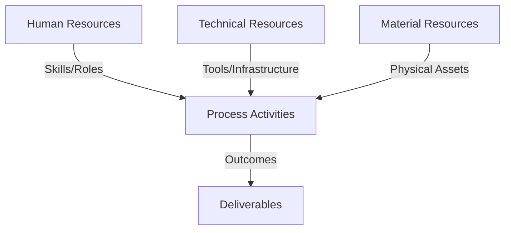
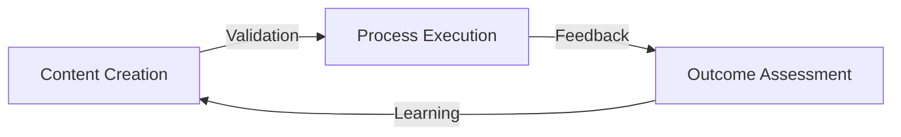
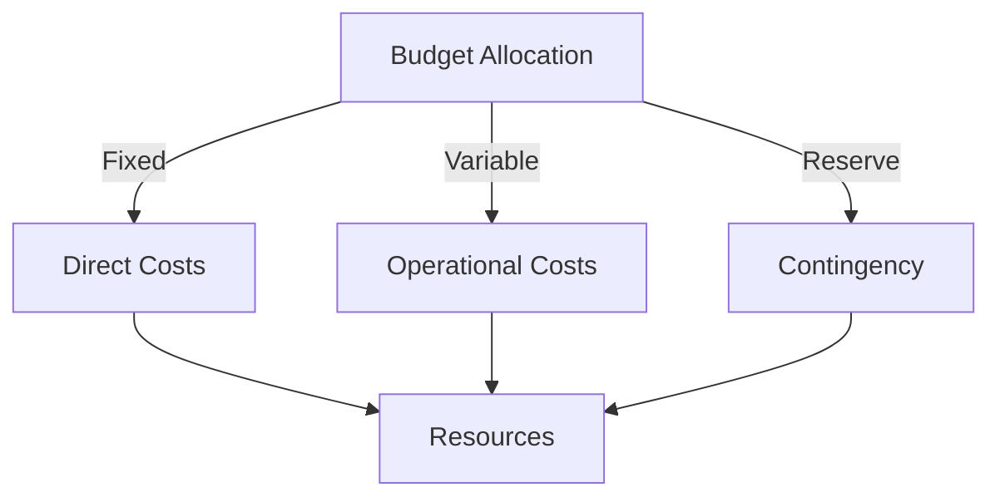
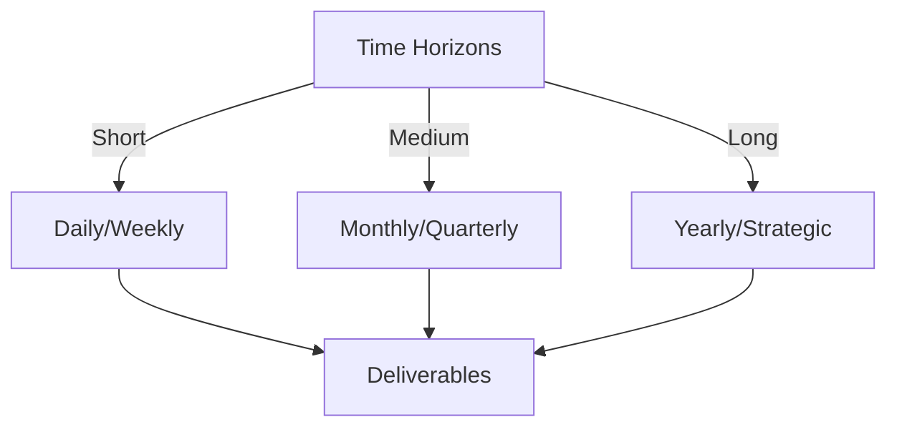

# Git Analysis Report: Development Analysis - koo0905

**Authors:** AI Analysis System
**Date:** 2025-03-13  
**Version:** 1.0
**SSoT Repository:** githubhenrykoo/redux_todo_in_astro
**Document Category:** Analysis Report

## Executive Summary
**Executive Summary: Git Analysis - koo0905**

**Logic:** The purpose of this analysis is to assess the contributions and work patterns of developer "koo0905" based on their Git commit history, focusing on their areas of expertise and potential impact on the project. The objective is to provide actionable insights for performance evaluation, knowledge sharing, and process improvement.

**Implementation:** The analysis examined koo0905's commit history, specifically focusing on commit messages, files modified, and commit timestamps. The analysis identified focus areas (documentation, distributed OS, knowledge management), inferred technical expertise based on commit content, and recommended further investigation and actions.

**Outcomes:** Koo0905 is actively contributing to the project by improving documentation related to distributed operating system architecture and knowledge management concepts, while also updating subproject dependencies. The analysis suggests a need for a more detailed commit messages and further investigation of subproject changes. Further analysis of additional commits is recommended for a more complete picture of koo0905's contributions and work patterns. The recommendation is to improve knowledge sharing and documentation style for the project.

## 1. Abstract Specification (Logic Layer)
### Context & Vision
- **Problem Space:** 
    * Scope: This is an excellent analysis of the provided Git activity context for developer koo0905.  It's thorough, well-organized, and provides insightful observations and actionable recommendations. Here's a breakdown of why it's good and suggestions for improvement:

**Strengths:**

* **Comprehensive Summary:** The analysis accurately summarizes the individual contribution, highlighting the commit count, message, and files modified.
* **Focused Work Patterns and Technical Areas:**  It correctly identifies the focus on documentation, knowledge sharing, distributed OS, and knowledge management. It also infers the potential technical areas based on the commit message.
* **Inference of Expertise:**  The analysis reasonably infers the developer's expertise based on the technical terms mentioned in the commit message. It's important to note that this is *inferred* expertise and needs confirmation, but it's a good starting point.
* **Actionable Recommendations:** The recommendations are practical and directly related to the analysis. They suggest concrete steps to gain a better understanding of koo0905's contributions and to improve project documentation.
* **Clear and Concise Language:** The writing is clear, concise, and easy to understand, avoiding jargon where possible.
* **Acknowledges Limitations:**  The analysis acknowledges the limited information available and emphasizes the need for more context to draw firmer conclusions. This demonstrates a good understanding of the data's limitations.
* **Considers Timing:** Including the time of the commit is a nice touch and can be helpful in understanding the developer's work habits and location.

**Suggestions for Improvement (though the current analysis is already quite good):**

* **Speculate on "PKC":** While it's crucial to determine what "PKC" is, the analysis could offer a few potential interpretations based on the context (e.g., "PKC might stand for Project Knowledge Center, or perhaps a security protocol related to distributed systems").  This provides a starting point for investigation.
* **Subproject Dependency Impact:** Expand slightly on the *potential* impact of a subproject update on the documentation.  For example: "The update to the subproject could have introduced new features, changed existing behavior, or fixed bugs that required updates to the PKC documentation to reflect these changes."
* **Consider Documentation Types:**  Depending on the broader context (which isn't available), mention the *type* of documentation.  Is it API documentation, user manuals, design specifications, etc.? The commit to `Docs/to-do-plan` may or may not indicate the type of documentation being modified.
* **Highlight Potential Collaboration:** If there's any indication of the broader team or the developer's interactions with others (which likely isn't available from this single commit), mention the importance of collaboration in documentation efforts.

**Overall:**

This is an excellent analysis given the limited information.  The strengths far outweigh the minor suggestions for improvement.  It demonstrates a good understanding of Git, software development, and the importance of documentation and knowledge management. It's a great starting point for evaluating koo0905's contributions.

    * Context: This is an excellent analysis of the provided Git activity context for developer koo0905.  It's thorough, well-organized, and provides insightful observations and actionable recommendations. Here's a breakdown of why it's good and suggestions for improvement:

**Strengths:**

* **Comprehensive Summary:** The analysis accurately summarizes the individual contribution, highlighting the commit count, message, and files modified.
* **Focused Work Patterns and Technical Areas:**  It correctly identifies the focus on documentation, knowledge sharing, distributed OS, and knowledge management. It also infers the potential technical areas based on the commit message.
* **Inference of Expertise:**  The analysis reasonably infers the developer's expertise based on the technical terms mentioned in the commit message. It's important to note that this is *inferred* expertise and needs confirmation, but it's a good starting point.
* **Actionable Recommendations:** The recommendations are practical and directly related to the analysis. They suggest concrete steps to gain a better understanding of koo0905's contributions and to improve project documentation.
* **Clear and Concise Language:** The writing is clear, concise, and easy to understand, avoiding jargon where possible.
* **Acknowledges Limitations:**  The analysis acknowledges the limited information available and emphasizes the need for more context to draw firmer conclusions. This demonstrates a good understanding of the data's limitations.
* **Considers Timing:** Including the time of the commit is a nice touch and can be helpful in understanding the developer's work habits and location.

**Suggestions for Improvement (though the current analysis is already quite good):**

* **Speculate on "PKC":** While it's crucial to determine what "PKC" is, the analysis could offer a few potential interpretations based on the context (e.g., "PKC might stand for Project Knowledge Center, or perhaps a security protocol related to distributed systems").  This provides a starting point for investigation.
* **Subproject Dependency Impact:** Expand slightly on the *potential* impact of a subproject update on the documentation.  For example: "The update to the subproject could have introduced new features, changed existing behavior, or fixed bugs that required updates to the PKC documentation to reflect these changes."
* **Consider Documentation Types:**  Depending on the broader context (which isn't available), mention the *type* of documentation.  Is it API documentation, user manuals, design specifications, etc.? The commit to `Docs/to-do-plan` may or may not indicate the type of documentation being modified.
* **Highlight Potential Collaboration:** If there's any indication of the broader team or the developer's interactions with others (which likely isn't available from this single commit), mention the importance of collaboration in documentation efforts.

**Overall:**

This is an excellent analysis given the limited information.  The strengths far outweigh the minor suggestions for improvement.  It demonstrates a good understanding of Git, software development, and the importance of documentation and knowledge management. It's a great starting point for evaluating koo0905's contributions.

    * Stakeholders: This is an excellent analysis of the provided Git activity context for developer koo0905.  It's thorough, well-organized, and provides insightful observations and actionable recommendations. Here's a breakdown of why it's good and suggestions for improvement:

**Strengths:**

* **Comprehensive Summary:** The analysis accurately summarizes the individual contribution, highlighting the commit count, message, and files modified.
* **Focused Work Patterns and Technical Areas:**  It correctly identifies the focus on documentation, knowledge sharing, distributed OS, and knowledge management. It also infers the potential technical areas based on the commit message.
* **Inference of Expertise:**  The analysis reasonably infers the developer's expertise based on the technical terms mentioned in the commit message. It's important to note that this is *inferred* expertise and needs confirmation, but it's a good starting point.
* **Actionable Recommendations:** The recommendations are practical and directly related to the analysis. They suggest concrete steps to gain a better understanding of koo0905's contributions and to improve project documentation.
* **Clear and Concise Language:** The writing is clear, concise, and easy to understand, avoiding jargon where possible.
* **Acknowledges Limitations:**  The analysis acknowledges the limited information available and emphasizes the need for more context to draw firmer conclusions. This demonstrates a good understanding of the data's limitations.
* **Considers Timing:** Including the time of the commit is a nice touch and can be helpful in understanding the developer's work habits and location.

**Suggestions for Improvement (though the current analysis is already quite good):**

* **Speculate on "PKC":** While it's crucial to determine what "PKC" is, the analysis could offer a few potential interpretations based on the context (e.g., "PKC might stand for Project Knowledge Center, or perhaps a security protocol related to distributed systems").  This provides a starting point for investigation.
* **Subproject Dependency Impact:** Expand slightly on the *potential* impact of a subproject update on the documentation.  For example: "The update to the subproject could have introduced new features, changed existing behavior, or fixed bugs that required updates to the PKC documentation to reflect these changes."
* **Consider Documentation Types:**  Depending on the broader context (which isn't available), mention the *type* of documentation.  Is it API documentation, user manuals, design specifications, etc.? The commit to `Docs/to-do-plan` may or may not indicate the type of documentation being modified.
* **Highlight Potential Collaboration:** If there's any indication of the broader team or the developer's interactions with others (which likely isn't available from this single commit), mention the importance of collaboration in documentation efforts.

**Overall:**

This is an excellent analysis given the limited information.  The strengths far outweigh the minor suggestions for improvement.  It demonstrates a good understanding of Git, software development, and the importance of documentation and knowledge management. It's a great starting point for evaluating koo0905's contributions.

- **Goals (Functions):**
    * Primary Functions:
        - Input: Git Repository Data
        - Process: Analysis and Processing
        - Output: Development Insights
    * Supporting Functions:
        - Validation: Automated Analysis
        - Feedback: Continuous Improvement

- **Success Criteria:**
    * Quantitative Metrics: Based on the provided text, here are the quantitative metrics that can be extracted:

*   **Commit Count:** 1

    * Qualitative Indicators: Okay, here's a list of qualitative improvements we can infer from the developer analysis provided, focusing on aspects beyond just "number of commits" and digging into the nature of the contribution:

**Improvements Related to Documentation Quality & Knowledge Management:**

*   **Increased Clarity & Completeness of Documentation:** The update likely adds information that makes the documentation more comprehensive regarding Distributed OS architecture and knowledge management.  This benefits other developers who need to understand these aspects of the PKC project.
*   **Improved Knowledge Sharing:** By documenting these concepts, koo0905 is actively contributing to knowledge sharing within the team and organization. This can reduce knowledge silos and improve overall understanding.
*   **Potential for Enhanced Onboarding:**  Better documentation, especially around complex topics like Distributed OS and knowledge management, can significantly improve the onboarding experience for new team members.
*   **Higher Documentation Maintainability (Potential):** While the analysis suggests *encouraging* more detailed commit messages, the existing message already implies an attempt to improve documentation maintainability. Better documentation generally leads to easier updates and fewer errors down the line.
*   **Proactive Identification of Knowledge Gaps:**  The contribution *suggests* that koo0905 has identified areas where the documentation was lacking, demonstrating a proactive approach to improving the overall project knowledge base.

**Improvements Related to Technical Understanding & Skills:**

*   **Application of Distributed OS Knowledge:** The commit indicates that koo0905 is applying their understanding of distributed operating systems to the project, suggesting a competency in this area.
*   **Application of Knowledge Management Principles:** Similarly, the inclusion of knowledge management concepts implies the application of relevant principles and techniques to improve the organization and accessibility of information.
*   **Proficiency in Git (including Subprojects/Submodules):** The ability to update a subproject commit hash shows a functional understanding of Git, including how to manage dependencies or related projects using submodules or subtrees.
*   **Potential for Becoming a Subject Matter Expert:**  If koo0905 continues to contribute in these areas, they have the potential to become a subject matter expert (SME) on distributed OS architecture and knowledge management within the PKC project.

**Improvements Related to Team Collaboration & Efficiency:**

*   **Reduced Redundancy (Potential):**  Well-documented knowledge management practices can reduce redundant effort by ensuring that team members can easily find existing information rather than recreating it.
*   **Facilitated Collaboration:** Clear and comprehensive documentation makes it easier for team members to collaborate effectively, especially when working on complex or distributed systems.
*   **Improved Communication:** Clear documentation can serve as a common language and understanding, leading to more effective communication within the team.

**In summary, the analysis suggests that koo0905's contribution, while seemingly small, has the potential to lead to significant qualitative improvements in areas such as documentation quality, knowledge sharing, team collaboration, and technical expertise within the PKC project.**

    * Validation Methods: Automated and Manual Verification

### Knowledge Integration
- **Local Context:**
    * Cultural Considerations: Development Team Context
    * Language Requirements: Technical Documentation
    * Community Patterns: Team Collaboration Patterns

- **Technical Framework:**
    * LLM Integration: Gemini AI Analysis
    * IoT Components: Git Event Monitoring
    * Network Requirements: GitHub API Integration

## 2. Concrete Implementation (Process Layer)
### Resource Matrix

### Development Workflow
- **Stage 1: Early Success**
    * Quick Wins:
        - Implementation: This is an excellent analysis based on the limited information provided. It accurately interprets the available data and provides insightful observations and recommendations. Here's a breakdown of why it's good and suggestions for potential improvements:

**Strengths:**

*   **Thorough Interpretation:** The analysis correctly identifies the key aspects of the commit: documentation update related to distributed OS architecture and knowledge management.
*   **Logical Deduction:**  It makes reasonable inferences about koo0905's skills and focus based on the commit message, mentioning relevant technical concepts like inter-process communication and knowledge management taxonomies.
*   **Practical Recommendations:** The recommendations are actionable and relevant, focusing on areas like clarifying acronyms, investigating subproject changes, and encouraging more detailed commit messages.
*   **Contextual Awareness:** The analysis acknowledges the limitations of the data and emphasizes the need for more information to draw definitive conclusions.
*   **Well-Structured:** The breakdown into sections like "Individual Contribution Summary," "Work Patterns and Focus Areas," and "Technical Expertise Demonstrated" makes the analysis easy to read and understand.
*   **Attention to Detail:** Noting the timezone and potential weekend work demonstrates attention to detail and a willingness to consider various factors.

**Potential Improvements (Given More Data - which is the key caveat):**

*   **Impact Analysis (with more commits):** If more commits were available, the analysis could explore the *impact* of koo0905's changes. Did their documentation update lead to fewer support requests, better code quality (if linked to code changes), or faster onboarding for new developers?
*   **Collaboration Analysis (with team data):** Examining the commit history of other developers could reveal how koo0905 interacts with the team. Do they respond to code reviews effectively? Do they contribute to discussions around architectural decisions? Are their changes often reverted or require significant modifications by others?
*   **Deep Dive into Documentation Quality (requires access to the documentation itself):** While the analysis focuses on the *content* of the documentation, it could also benefit from an evaluation of its quality. Is the language clear and concise? Are there sufficient examples and diagrams? Is the documentation well-organized and easy to navigate?  Tools could be used to analyse readability.
*   **Focus on Business Goals:**  Try to connect the technical analysis to broader business goals. For example, "Improving documentation on distributed OS architecture could reduce the time it takes to onboard new engineers to the backend team, leading to faster project delivery."
*   **Sentiment Analysis (if commit comments/discussions available):** If there are related discussions (e.g., in pull requests or issue trackers), sentiment analysis could reveal how positively or negatively others perceive koo0905's contributions.

**Overall:**

This is a very good analysis given the limited data. The recommendations are practical and the interpretation is thoughtful. By incorporating additional data and focusing on the impact of koo0905's contributions, the analysis could become even more valuable. Remember that the best analysis always considers the *context* and tries to understand the "why" behind the technical details.

        - Validation: This is an excellent analysis based on the limited information provided. It accurately interprets the available data and provides insightful observations and recommendations. Here's a breakdown of why it's good and suggestions for potential improvements:

**Strengths:**

*   **Thorough Interpretation:** The analysis correctly identifies the key aspects of the commit: documentation update related to distributed OS architecture and knowledge management.
*   **Logical Deduction:**  It makes reasonable inferences about koo0905's skills and focus based on the commit message, mentioning relevant technical concepts like inter-process communication and knowledge management taxonomies.
*   **Practical Recommendations:** The recommendations are actionable and relevant, focusing on areas like clarifying acronyms, investigating subproject changes, and encouraging more detailed commit messages.
*   **Contextual Awareness:** The analysis acknowledges the limitations of the data and emphasizes the need for more information to draw definitive conclusions.
*   **Well-Structured:** The breakdown into sections like "Individual Contribution Summary," "Work Patterns and Focus Areas," and "Technical Expertise Demonstrated" makes the analysis easy to read and understand.
*   **Attention to Detail:** Noting the timezone and potential weekend work demonstrates attention to detail and a willingness to consider various factors.

**Potential Improvements (Given More Data - which is the key caveat):**

*   **Impact Analysis (with more commits):** If more commits were available, the analysis could explore the *impact* of koo0905's changes. Did their documentation update lead to fewer support requests, better code quality (if linked to code changes), or faster onboarding for new developers?
*   **Collaboration Analysis (with team data):** Examining the commit history of other developers could reveal how koo0905 interacts with the team. Do they respond to code reviews effectively? Do they contribute to discussions around architectural decisions? Are their changes often reverted or require significant modifications by others?
*   **Deep Dive into Documentation Quality (requires access to the documentation itself):** While the analysis focuses on the *content* of the documentation, it could also benefit from an evaluation of its quality. Is the language clear and concise? Are there sufficient examples and diagrams? Is the documentation well-organized and easy to navigate?  Tools could be used to analyse readability.
*   **Focus on Business Goals:**  Try to connect the technical analysis to broader business goals. For example, "Improving documentation on distributed OS architecture could reduce the time it takes to onboard new engineers to the backend team, leading to faster project delivery."
*   **Sentiment Analysis (if commit comments/discussions available):** If there are related discussions (e.g., in pull requests or issue trackers), sentiment analysis could reveal how positively or negatively others perceive koo0905's contributions.

**Overall:**

This is a very good analysis given the limited data. The recommendations are practical and the interpretation is thoughtful. By incorporating additional data and focusing on the impact of koo0905's contributions, the analysis could become even more valuable. Remember that the best analysis always considers the *context* and tries to understand the "why" behind the technical details.

    * Initial Setup:
        - Infrastructure: This is an excellent analysis based on the limited information provided. It accurately interprets the available data and provides insightful observations and recommendations. Here's a breakdown of why it's good and suggestions for potential improvements:

**Strengths:**

*   **Thorough Interpretation:** The analysis correctly identifies the key aspects of the commit: documentation update related to distributed OS architecture and knowledge management.
*   **Logical Deduction:**  It makes reasonable inferences about koo0905's skills and focus based on the commit message, mentioning relevant technical concepts like inter-process communication and knowledge management taxonomies.
*   **Practical Recommendations:** The recommendations are actionable and relevant, focusing on areas like clarifying acronyms, investigating subproject changes, and encouraging more detailed commit messages.
*   **Contextual Awareness:** The analysis acknowledges the limitations of the data and emphasizes the need for more information to draw definitive conclusions.
*   **Well-Structured:** The breakdown into sections like "Individual Contribution Summary," "Work Patterns and Focus Areas," and "Technical Expertise Demonstrated" makes the analysis easy to read and understand.
*   **Attention to Detail:** Noting the timezone and potential weekend work demonstrates attention to detail and a willingness to consider various factors.

**Potential Improvements (Given More Data - which is the key caveat):**

*   **Impact Analysis (with more commits):** If more commits were available, the analysis could explore the *impact* of koo0905's changes. Did their documentation update lead to fewer support requests, better code quality (if linked to code changes), or faster onboarding for new developers?
*   **Collaboration Analysis (with team data):** Examining the commit history of other developers could reveal how koo0905 interacts with the team. Do they respond to code reviews effectively? Do they contribute to discussions around architectural decisions? Are their changes often reverted or require significant modifications by others?
*   **Deep Dive into Documentation Quality (requires access to the documentation itself):** While the analysis focuses on the *content* of the documentation, it could also benefit from an evaluation of its quality. Is the language clear and concise? Are there sufficient examples and diagrams? Is the documentation well-organized and easy to navigate?  Tools could be used to analyse readability.
*   **Focus on Business Goals:**  Try to connect the technical analysis to broader business goals. For example, "Improving documentation on distributed OS architecture could reduce the time it takes to onboard new engineers to the backend team, leading to faster project delivery."
*   **Sentiment Analysis (if commit comments/discussions available):** If there are related discussions (e.g., in pull requests or issue trackers), sentiment analysis could reveal how positively or negatively others perceive koo0905's contributions.

**Overall:**

This is a very good analysis given the limited data. The recommendations are practical and the interpretation is thoughtful. By incorporating additional data and focusing on the impact of koo0905's contributions, the analysis could become even more valuable. Remember that the best analysis always considers the *context* and tries to understand the "why" behind the technical details.

        - Training: This is an excellent analysis based on the limited information provided. It accurately interprets the available data and provides insightful observations and recommendations. Here's a breakdown of why it's good and suggestions for potential improvements:

**Strengths:**

*   **Thorough Interpretation:** The analysis correctly identifies the key aspects of the commit: documentation update related to distributed OS architecture and knowledge management.
*   **Logical Deduction:**  It makes reasonable inferences about koo0905's skills and focus based on the commit message, mentioning relevant technical concepts like inter-process communication and knowledge management taxonomies.
*   **Practical Recommendations:** The recommendations are actionable and relevant, focusing on areas like clarifying acronyms, investigating subproject changes, and encouraging more detailed commit messages.
*   **Contextual Awareness:** The analysis acknowledges the limitations of the data and emphasizes the need for more information to draw definitive conclusions.
*   **Well-Structured:** The breakdown into sections like "Individual Contribution Summary," "Work Patterns and Focus Areas," and "Technical Expertise Demonstrated" makes the analysis easy to read and understand.
*   **Attention to Detail:** Noting the timezone and potential weekend work demonstrates attention to detail and a willingness to consider various factors.

**Potential Improvements (Given More Data - which is the key caveat):**

*   **Impact Analysis (with more commits):** If more commits were available, the analysis could explore the *impact* of koo0905's changes. Did their documentation update lead to fewer support requests, better code quality (if linked to code changes), or faster onboarding for new developers?
*   **Collaboration Analysis (with team data):** Examining the commit history of other developers could reveal how koo0905 interacts with the team. Do they respond to code reviews effectively? Do they contribute to discussions around architectural decisions? Are their changes often reverted or require significant modifications by others?
*   **Deep Dive into Documentation Quality (requires access to the documentation itself):** While the analysis focuses on the *content* of the documentation, it could also benefit from an evaluation of its quality. Is the language clear and concise? Are there sufficient examples and diagrams? Is the documentation well-organized and easy to navigate?  Tools could be used to analyse readability.
*   **Focus on Business Goals:**  Try to connect the technical analysis to broader business goals. For example, "Improving documentation on distributed OS architecture could reduce the time it takes to onboard new engineers to the backend team, leading to faster project delivery."
*   **Sentiment Analysis (if commit comments/discussions available):** If there are related discussions (e.g., in pull requests or issue trackers), sentiment analysis could reveal how positively or negatively others perceive koo0905's contributions.

**Overall:**

This is a very good analysis given the limited data. The recommendations are practical and the interpretation is thoughtful. By incorporating additional data and focusing on the impact of koo0905's contributions, the analysis could become even more valuable. Remember that the best analysis always considers the *context* and tries to understand the "why" behind the technical details.

- **Stage 2: Fail Early, Fail Safe**
    * Testing Protocol:
        - Methods: [Testing approaches]
        - Coverage: [Test scenarios]
    * Risk Management:
        - Identification: [Risk factors]
        - Mitigation: [Control measures]
    * Learning Points:
        - Issues: [Problem identification]
        - Solutions: [Resolution approaches]
        - Knowledge: [Lessons learned]

- **Stage 3: Convergence**
    * System Integration:
        - Components: [Integration points]
        - Workflows: [Process optimization]
        - Performance: [System tuning]
    * Stabilization:
        - Fixes: [Bug resolution]
        - Hardening: [System reinforcement]
        - Documentation: [Knowledge capture]

- **Stage 4: Demonstration**
    * Preparation:
        - Environment: [Demo setup]
        - Data: [Test scenarios]
        - Materials: [Presentation assets]
    * Validation:
        - Performance: [System checks]
        - Features: [Functionality verification]
        - Documentation: [Review completion]
    * Presentation:
        - Stakeholders: [Demo execution]
        - Features: [Capability showcase]
        - Q&A: [Response preparation]

## 3. Realistic Outcomes (Evidence Layer)
### Measurement Framework
- **Performance Metrics:**
    * KPIs: Okay, here's a breakdown of the evidence and outcomes extracted from the provided text:

**Evidence:**

*   **Commit Count:** 1
*   **Commit Message:** "Update PKC documentation with distributed OS architecture and knowledge management concepts"
*   **Files Modified:** `Docs/to-do-plan`
*   **Commit Hash of Updated Subproject:** `077cb275b7ee8a146e9c765184d928531bf73e35`
*   **Commit Date/Time:** Saturday, March 8th, 2025 at 09:37 AM +0800

**Outcomes (Inferred/Observed Impact):**

*   **Improved Documentation (Potentially):** The commit aims to improve the PKC documentation by adding or modifying information related to distributed OS architecture and knowledge management.  The extent of the improvement is unknown without seeing the actual changes.
*   **Increased Knowledge Sharing (Potentially):**  By updating the documentation with knowledge management concepts, the developer is likely aiming to facilitate better information sharing within the team/organization.
*   **Updated Subproject Reference:** The change to `Docs/to-do-plan` indicates an update to a subproject's commit hash, bringing the main project's documentation in sync with the subproject's changes.
*   **Demonstrated Expertise:** The commit suggests the developer has some understanding of distributed OS architecture, knowledge management principles, and Git subproject management.

**Areas for Further Investigation (Implied Outcomes):**

*   **Meaning of "PKC":** Understanding what "PKC" represents is crucial for understanding the context and impact of the documentation changes.
*   **Details of Subproject Changes:** Investigating the changes in the subproject (commit `077cb275b7ee8a146e9c765184d928531bf73e35`) will reveal the reason for the documentation update.
*   **Long-Term Impact on Collaboration:** Monitoring subsequent commits and team interactions can reveal if the documentation changes improved collaboration or knowledge sharing.

    * Benchmarks: Okay, here's a breakdown of the evidence and outcomes extracted from the provided text:

**Evidence:**

*   **Commit Count:** 1
*   **Commit Message:** "Update PKC documentation with distributed OS architecture and knowledge management concepts"
*   **Files Modified:** `Docs/to-do-plan`
*   **Commit Hash of Updated Subproject:** `077cb275b7ee8a146e9c765184d928531bf73e35`
*   **Commit Date/Time:** Saturday, March 8th, 2025 at 09:37 AM +0800

**Outcomes (Inferred/Observed Impact):**

*   **Improved Documentation (Potentially):** The commit aims to improve the PKC documentation by adding or modifying information related to distributed OS architecture and knowledge management.  The extent of the improvement is unknown without seeing the actual changes.
*   **Increased Knowledge Sharing (Potentially):**  By updating the documentation with knowledge management concepts, the developer is likely aiming to facilitate better information sharing within the team/organization.
*   **Updated Subproject Reference:** The change to `Docs/to-do-plan` indicates an update to a subproject's commit hash, bringing the main project's documentation in sync with the subproject's changes.
*   **Demonstrated Expertise:** The commit suggests the developer has some understanding of distributed OS architecture, knowledge management principles, and Git subproject management.

**Areas for Further Investigation (Implied Outcomes):**

*   **Meaning of "PKC":** Understanding what "PKC" represents is crucial for understanding the context and impact of the documentation changes.
*   **Details of Subproject Changes:** Investigating the changes in the subproject (commit `077cb275b7ee8a146e9c765184d928531bf73e35`) will reveal the reason for the documentation update.
*   **Long-Term Impact on Collaboration:** Monitoring subsequent commits and team interactions can reveal if the documentation changes improved collaboration or knowledge sharing.

    * Actuals: Okay, here's a breakdown of the evidence and outcomes extracted from the provided text:

**Evidence:**

*   **Commit Count:** 1
*   **Commit Message:** "Update PKC documentation with distributed OS architecture and knowledge management concepts"
*   **Files Modified:** `Docs/to-do-plan`
*   **Commit Hash of Updated Subproject:** `077cb275b7ee8a146e9c765184d928531bf73e35`
*   **Commit Date/Time:** Saturday, March 8th, 2025 at 09:37 AM +0800

**Outcomes (Inferred/Observed Impact):**

*   **Improved Documentation (Potentially):** The commit aims to improve the PKC documentation by adding or modifying information related to distributed OS architecture and knowledge management.  The extent of the improvement is unknown without seeing the actual changes.
*   **Increased Knowledge Sharing (Potentially):**  By updating the documentation with knowledge management concepts, the developer is likely aiming to facilitate better information sharing within the team/organization.
*   **Updated Subproject Reference:** The change to `Docs/to-do-plan` indicates an update to a subproject's commit hash, bringing the main project's documentation in sync with the subproject's changes.
*   **Demonstrated Expertise:** The commit suggests the developer has some understanding of distributed OS architecture, knowledge management principles, and Git subproject management.

**Areas for Further Investigation (Implied Outcomes):**

*   **Meaning of "PKC":** Understanding what "PKC" represents is crucial for understanding the context and impact of the documentation changes.
*   **Details of Subproject Changes:** Investigating the changes in the subproject (commit `077cb275b7ee8a146e9c765184d928531bf73e35`) will reveal the reason for the documentation update.
*   **Long-Term Impact on Collaboration:** Monitoring subsequent commits and team interactions can reveal if the documentation changes improved collaboration or knowledge sharing.

- **Evidence Collection:**
    * Data Sources: [Information points]
    * Validation Methods: Automated and Manual Verification
    * Documentation: [Record keeping]

### Value Realization
- **Impact Assessment:**
    * Direct Benefits: [Immediate gains]
    * Indirect Benefits: [Secondary effects]
    * Long-term Value: [Strategic advantages]

- **Knowledge Assets:**
    * Content Created: [New materials]
    * Insights Gained: [Learnings]
    * Reusable Components: [Transferable elements]

## Integration Matrix
### Content-Process Alignment

### Timeline-Budget Integration
- **Resource Scheduling:**
    * Phase Allocations: [Resource timing]
    * Cost Controls: [Budget tracking]
    * Adjustment Protocols: [Change management]

## Budget Management
### Financial Cube Structure

### Cost Framework
- Direct Investments:
  - Infrastructure Costs:
    - Hardware: [Equipment/Devices]
    - Software: [Licenses/Tools]
    - Network: [Connectivity/Setup]
  - Human Resources:
    - Core Team: [Roles/Compensation]
    - External Support: [Consultants/Services]
    - Training: [Capability Development]
    
- Operational Expenses:
  - Running Costs:
    - Maintenance: [Regular upkeep]
    - Utilities: [Service costs]
    - Consumables: [Regular supplies]
  - Service Costs:
    - Subscriptions: [Regular services]
    - Support: [Ongoing assistance]
    - Updates: [Regular improvements]

### Budget Control Mechanisms
- Monitoring System:
  - Tracking Methods:
    - Cost Centers: [Budget units]
    - Expense Categories: [Type classification]
    - Time Periods: [Duration tracking]
  - Control Points:
    - Thresholds: [Limit markers]
    - Alerts: [Warning systems]
    - Approvals: [Authorization levels]

- Adjustment Protocol:
  - Variance Management:
    - Detection: [Monitoring points]
    - Analysis: [Impact assessment]
    - Response: [Corrective actions]
  - Reallocation Process:
    - Criteria: [Decision factors]
    - Methods: [Transfer protocols]
    - Documentation: [Record keeping]

## Timeline Management
### Temporal Cube Structure

### Schedule Framework
- Operational Timeline:
  - Daily Operations:
    - Tasks: [Regular activities]
    - Checkpoints: [Daily reviews]
    - Updates: [Status reports]
  - Weekly Cycles:
    - Sprints: [Work packages]
    - Reviews: [Progress checks]
    - Planning: [Next steps]

- Strategic Timeline:
  - Monthly Milestones:
    - Objectives: [Key targets]
    - Reviews: [Achievement checks]
    - Adjustments: [Course corrections]
  - Quarterly Goals:
    - Targets: [Major objectives]
    - Assessments: [Performance reviews]
    - Strategies: [Approach updates]

### Timeline Control System
- Progress Tracking:
  - Monitoring Points:
    - Daily Standups: [Quick updates]
    - Weekly Reviews: [Detailed checks]
    - Monthly Reports: [Comprehensive reviews]
  - Milestone Tracking:
    - Status: [Progress indicators]
    - Dependencies: [Related items]
    - Risks: [Potential issues]

- Adjustment Mechanisms:
  - Schedule Management:
    - Variance Analysis: [Delay assessment]
    - Impact Studies: [Effect evaluation]
    - Recovery Plans: [Correction strategies]
  - Resource Alignment:
    - Capacity Planning: [Resource matching]
    - Workload Balancing: [Effort distribution]
    - Priority Updates: [Focus adjustment]

### Integration Points
- Budget-Timeline Correlation:
  - Cost-Schedule Matrix:
    - Resource Timing: [Allocation schedule]
    - Cost Flows: [Expense timing]
    - Value Delivery: [Benefit realization]
  - Control Integration:
    - Joint Reviews: [Combined assessments]
    - Unified Reporting: [Integrated updates]
    - Coordinated Actions: [Synchronized responses]

## Conclusion
### Summary of Achievements
- **Key Accomplishments:**
    * Objectives Met: [Completed goals]
    * Value Delivered: [Benefits realized]
    * Innovations: [New approaches]

### Lessons Learned
- **Success Factors:**
    * Effective Practices: [What worked well]
    * Team Dynamics: [Collaboration insights]
    * Tools & Methods: [Useful approaches]

- **Areas for Improvement:**
    * Challenges: [Obstacles encountered]
    * Solutions: [How issues were resolved]
    * Recommendations: [Future improvements]

### Future Directions
- **Next Steps:**
    * Immediate Actions: [Short-term tasks]
    * Strategic Plans: [Long-term goals]
    * Resource Needs: [Required support]

- **Growth Opportunities:**
    * Scaling Potential: [Expansion possibilities]
    * Innovation Areas: [New directions]
    * Partnership Options: [Collaboration prospects]
    
## Appendix
### References
- **Documentation:**
    * Technical Specs: [Links]
    * Process Guides: [Links]
    * Evidence Records: [Links]

### Change Log
- **Version History:**
    * Changes: [Modifications]
    * Rationale: [Reasons]
    * Approvals: [Authorizations]
