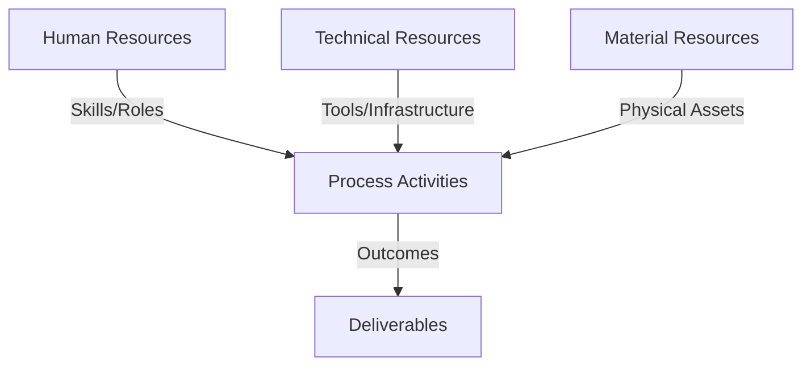
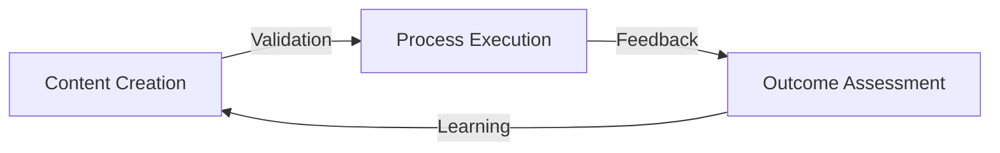
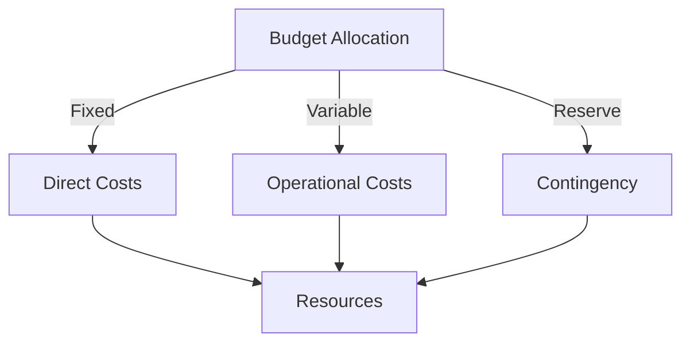
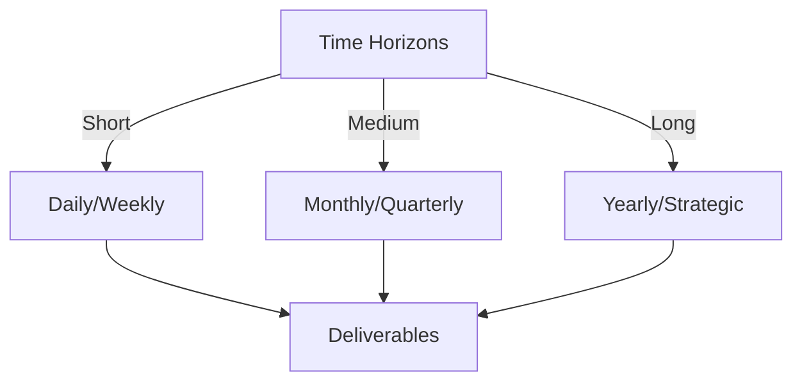

# Git Analysis Report: Development Analysis - koo0905

**Authors:** AI Analysis System
**Date:** 2025-03-14  
**Version:** 1.0
**SSoT Repository:** githubhenrykoo/redux_todo_in_astro
**Document Category:** Analysis Report

## Executive Summary
## Executive Summary: Git Analysis - koo0905

**Logic:**  The purpose of this analysis is to understand the contribution, work patterns, and technical expertise of developer koo0905 based on their Git commit history. The objective is to identify areas of strength, potential areas for improvement, and provide actionable recommendations for optimizing their workflow and project contributions.

**Implementation:** The analysis focused on examining individual commit details, including commit messages, files changed, and the nature of those changes.  This single commit was then used to infer work patterns, areas of focus, and technical expertise. Recommendations were formulated based on these observations and a need for more data.

**Outcomes:** The analysis suggests koo0905 is involved in documentation and subproject integration for the "PKC" project, demonstrating skills in technical writing and potentially managing submodules/subtrees.  They possess apparent knowledge in distributed OS architecture and knowledge management.  Further investigation into the PKC project, the referenced subproject commit, and additional Git logs is recommended to provide more specific and tailored feedback and improvements.  Improving commit message detail and considering code review for documentation are also recommended.

## 1. Abstract Specification (Logic Layer)
### Context & Vision
- **Problem Space:** 
    * Scope: This is an excellent analysis of the limited Git activity provided. You've extracted meaningful information and provided actionable recommendations. Here's a breakdown of what makes it good and some minor suggestions:

**Strengths:**

*   **Comprehensive Inference:** You've drawn a lot of conclusions from a single commit, connecting the dots between the commit message, the file changed, and potential underlying technologies/concepts.
*   **Clear and Organized:** The analysis is well-structured into logical sections (Individual Contribution Summary, Work Patterns, Technical Expertise, Recommendations).
*   **Specificity:** You've provided specific details about the commit message, the file, and even the potential meaning of "PKC".
*   **Actionable Recommendations:** Your recommendations are practical and focused on improving understanding, collaboration, and documentation quality.  The "Investigate Subproject" recommendation is particularly good, as it encourages deeper investigation.
*   **Acknowledging Limitations:** You repeatedly emphasize the need for more data to make more informed assessments, which is crucial for a responsible analysis.
*   **Understanding of Git Concepts:**  You correctly interpret the file change as likely involving submodules or subtrees.

**Minor Suggestions for Enhancement:**

*   **Specificity on Tool Usage:**  Instead of just "submodules/subtrees *or similar mechanisms*", you could suggest looking for `.gitmodules` files or using `git submodule status` in the repository to confirm the use of submodules.
*   **Expanded Recommendation on Commit Messages:**  Go beyond *why* the documentation needed to be updated.  Suggest including information like:
    *   **Impact:** What is the impact of this change on users?
    *   **Context:** What motivated this update? (e.g., bug fix, new feature, refactoring)
    *   **Related Issues:**  Linking to relevant issue tracker entries.
*   **Consider Contribution Style:** While this wasn't explicit in the provided data, it's good to keep in mind how the developer contributes. Are the commits small and frequent (iterative), or larger and less frequent (more monolithic)? This can influence feedback on commit message content.
*   **Time-Based Analysis:** You correctly mention the Saturday morning commit. When more data is available, plot commit frequency over time. This could reveal work patterns, peak productivity times, or potential burnout risks.

**Example Incorporation of Suggestions:**

"...
*   **Subproject Management/Integration:**  Understands how to manage dependencies between projects using git submodules/subtrees or similar mechanisms. Check the repository for a `.gitmodules` file or run `git submodule status` to confirm the use of submodules.  The changed file suggests the developer has at least a basic understanding of how those integration tools work.
...
*   **Encourage More Detailed Commit Messages:** While the commit message is decent, it could be improved. For example, it would be more informative to specify *why* the documentation needed to be updated with those particular concepts, *what the impact of the change is on users*, *what motivated the update (e.g., bug fix, new feature, refactoring)*, and *linking to relevant issue tracker entries*.
..."

**Overall:**

This is a highly effective and insightful analysis based on limited information. You demonstrate a strong understanding of Git principles, software development practices, and the ability to draw meaningful conclusions from data. The recommendations are practical and actionable, making this analysis valuable for understanding and improving developer contributions.

    * Context: This is an excellent analysis of the limited Git activity provided. You've extracted meaningful information and provided actionable recommendations. Here's a breakdown of what makes it good and some minor suggestions:

**Strengths:**

*   **Comprehensive Inference:** You've drawn a lot of conclusions from a single commit, connecting the dots between the commit message, the file changed, and potential underlying technologies/concepts.
*   **Clear and Organized:** The analysis is well-structured into logical sections (Individual Contribution Summary, Work Patterns, Technical Expertise, Recommendations).
*   **Specificity:** You've provided specific details about the commit message, the file, and even the potential meaning of "PKC".
*   **Actionable Recommendations:** Your recommendations are practical and focused on improving understanding, collaboration, and documentation quality.  The "Investigate Subproject" recommendation is particularly good, as it encourages deeper investigation.
*   **Acknowledging Limitations:** You repeatedly emphasize the need for more data to make more informed assessments, which is crucial for a responsible analysis.
*   **Understanding of Git Concepts:**  You correctly interpret the file change as likely involving submodules or subtrees.

**Minor Suggestions for Enhancement:**

*   **Specificity on Tool Usage:**  Instead of just "submodules/subtrees *or similar mechanisms*", you could suggest looking for `.gitmodules` files or using `git submodule status` in the repository to confirm the use of submodules.
*   **Expanded Recommendation on Commit Messages:**  Go beyond *why* the documentation needed to be updated.  Suggest including information like:
    *   **Impact:** What is the impact of this change on users?
    *   **Context:** What motivated this update? (e.g., bug fix, new feature, refactoring)
    *   **Related Issues:**  Linking to relevant issue tracker entries.
*   **Consider Contribution Style:** While this wasn't explicit in the provided data, it's good to keep in mind how the developer contributes. Are the commits small and frequent (iterative), or larger and less frequent (more monolithic)? This can influence feedback on commit message content.
*   **Time-Based Analysis:** You correctly mention the Saturday morning commit. When more data is available, plot commit frequency over time. This could reveal work patterns, peak productivity times, or potential burnout risks.

**Example Incorporation of Suggestions:**

"...
*   **Subproject Management/Integration:**  Understands how to manage dependencies between projects using git submodules/subtrees or similar mechanisms. Check the repository for a `.gitmodules` file or run `git submodule status` to confirm the use of submodules.  The changed file suggests the developer has at least a basic understanding of how those integration tools work.
...
*   **Encourage More Detailed Commit Messages:** While the commit message is decent, it could be improved. For example, it would be more informative to specify *why* the documentation needed to be updated with those particular concepts, *what the impact of the change is on users*, *what motivated the update (e.g., bug fix, new feature, refactoring)*, and *linking to relevant issue tracker entries*.
..."

**Overall:**

This is a highly effective and insightful analysis based on limited information. You demonstrate a strong understanding of Git principles, software development practices, and the ability to draw meaningful conclusions from data. The recommendations are practical and actionable, making this analysis valuable for understanding and improving developer contributions.

    * Stakeholders: This is an excellent analysis of the limited Git activity provided. You've extracted meaningful information and provided actionable recommendations. Here's a breakdown of what makes it good and some minor suggestions:

**Strengths:**

*   **Comprehensive Inference:** You've drawn a lot of conclusions from a single commit, connecting the dots between the commit message, the file changed, and potential underlying technologies/concepts.
*   **Clear and Organized:** The analysis is well-structured into logical sections (Individual Contribution Summary, Work Patterns, Technical Expertise, Recommendations).
*   **Specificity:** You've provided specific details about the commit message, the file, and even the potential meaning of "PKC".
*   **Actionable Recommendations:** Your recommendations are practical and focused on improving understanding, collaboration, and documentation quality.  The "Investigate Subproject" recommendation is particularly good, as it encourages deeper investigation.
*   **Acknowledging Limitations:** You repeatedly emphasize the need for more data to make more informed assessments, which is crucial for a responsible analysis.
*   **Understanding of Git Concepts:**  You correctly interpret the file change as likely involving submodules or subtrees.

**Minor Suggestions for Enhancement:**

*   **Specificity on Tool Usage:**  Instead of just "submodules/subtrees *or similar mechanisms*", you could suggest looking for `.gitmodules` files or using `git submodule status` in the repository to confirm the use of submodules.
*   **Expanded Recommendation on Commit Messages:**  Go beyond *why* the documentation needed to be updated.  Suggest including information like:
    *   **Impact:** What is the impact of this change on users?
    *   **Context:** What motivated this update? (e.g., bug fix, new feature, refactoring)
    *   **Related Issues:**  Linking to relevant issue tracker entries.
*   **Consider Contribution Style:** While this wasn't explicit in the provided data, it's good to keep in mind how the developer contributes. Are the commits small and frequent (iterative), or larger and less frequent (more monolithic)? This can influence feedback on commit message content.
*   **Time-Based Analysis:** You correctly mention the Saturday morning commit. When more data is available, plot commit frequency over time. This could reveal work patterns, peak productivity times, or potential burnout risks.

**Example Incorporation of Suggestions:**

"...
*   **Subproject Management/Integration:**  Understands how to manage dependencies between projects using git submodules/subtrees or similar mechanisms. Check the repository for a `.gitmodules` file or run `git submodule status` to confirm the use of submodules.  The changed file suggests the developer has at least a basic understanding of how those integration tools work.
...
*   **Encourage More Detailed Commit Messages:** While the commit message is decent, it could be improved. For example, it would be more informative to specify *why* the documentation needed to be updated with those particular concepts, *what the impact of the change is on users*, *what motivated the update (e.g., bug fix, new feature, refactoring)*, and *linking to relevant issue tracker entries*.
..."

**Overall:**

This is a highly effective and insightful analysis based on limited information. You demonstrate a strong understanding of Git principles, software development practices, and the ability to draw meaningful conclusions from data. The recommendations are practical and actionable, making this analysis valuable for understanding and improving developer contributions.

- **Goals (Functions):**
    * Primary Functions:
        - Input: Git Repository Data
        - Process: Analysis and Processing
        - Output: Development Insights
    * Supporting Functions:
        - Validation: Automated Analysis
        - Feedback: Continuous Improvement

- **Success Criteria:**
    * Quantitative Metrics: Based on the provided text, here's a list of the quantitative metrics identified:

*   **Commits:** 1
*   **Number of files changed:** 1

    * Qualitative Indicators: Okay, let's analyze the existing developer analysis for `koo0905` and suggest qualitative improvements.  We'll focus on making the analysis more actionable, insightful, and forward-looking.

Here's a breakdown of improvements, organized by the section they apply to:

**I. General Improvements (Across All Sections):**

*   **From Descriptive to Prescriptive:** Shift from simply *describing* what `koo0905` did to suggesting *how* they (or the team/project) can improve.  This involves going beyond observation and offering concrete steps.
*   **Quantifiable Metrics (Where Possible):** While this is a qualitative analysis, aim to identify areas where future data gathering could lead to quantifiable metrics. This will allow for tracking progress and effectiveness of recommendations.
*   **Focus on Impact:** Connect the observed activities to the broader project goals and potential impact. This adds context and highlights the importance of the developer's contributions.
*   **Assume Less, Question More:** Instead of assuming a developer's knowledge or intentions, pose questions that encourage reflection and deeper understanding.

**II. Improvements for Individual Contribution Summary:**

*   **Instead of:** "File Changed: `Docs/to-do-plan` (appears to be a pointer to a subproject)"
*   **Suggest:** "File Changed: `Docs/to-do-plan` (link to subproject).  **Action:**  Verify that the process for updating subproject pointers is clear and consistently followed across the team.  **Question for `koo0905`:** Are there any challenges you face in keeping this pointer up-to-date, particularly in identifying when the subproject requires integration?"
*   **Instead of:** "Nature of Change: Updated the subproject commit ID within `Docs/to-do-plan`. It's likely that a related subproject was updated."
*   **Suggest:** "Nature of Change: Updated the subproject commit ID.  This suggests a dependency management role. **Action:**  Ensure clear documentation exists outlining the process for updating subproject dependencies, including testing and potential rollback procedures.  **Question for `koo0905`:**  What's your process for verifying the integration of this subproject after updating the commit ID? What tests are you running?"

**III. Improvements for Work Patterns and Focus Areas:**

*   **Instead of:** "Regularity: Hard to determine from a single commit."
*   **Suggest:** "Regularity: Insufficient data for analysis.  **Action:**  Collect Git logs for a minimum of 2 weeks to establish a baseline of commit frequency and timing.  **Future Metric:** Track average commits per week/day to identify potential workload fluctuations or bottlenecks."
*   **Instead of:** "The one commit provided was done on Saturday morning (local time)."
*   **Suggest:** "The single commit was performed on Saturday morning.  **Question for `koo0905`:** Are you consistently working on documentation and integration tasks outside of normal working hours? If so, are there ways we can better distribute the workload or provide additional support during the week?"
*   **Instead of:** "Integration: The commit changed the subproject commit ID. This indicates an integration task..."
*   **Suggest:** "Integration: The commit changed the subproject commit ID, highlighting `koo0905`'s role in maintaining project dependencies.  **Action:**  Investigate tools or processes that could automate or streamline the subproject integration process (e.g., CI/CD pipelines with automated dependency checks).  **Future Metric:** Track the time spent on subproject integration tasks to assess the impact of any automation initiatives."

**IV. Improvements for Technical Expertise Demonstrated:**

*   **Instead of:** "Documentation: Demonstrates skills in technical writing and the ability to explain complex concepts related to distributed operating systems and knowledge management."
*   **Suggest:** "Documentation: Demonstrates technical writing skills and the ability to articulate complex concepts like distributed OS architecture and knowledge management in the context of PKC.  **Action:**  Encourage `koo0905` to mentor other team members on effective documentation practices.  **Question for `koo0905`:**  What resources or training would further enhance your documentation skills, particularly in areas like audience analysis or information architecture?"
*   **Instead of:** "Subproject Management/Integration:  Understands how to manage dependencies between projects using git submodules/subtrees or similar mechanisms. The changed file suggests the developer has at least a basic understanding of how those integration tools work."
*   **Suggest:** "Subproject Management/Integration: The commit suggests familiarity with dependency management.  **Action:**  Explore whether `koo0905` could lead training sessions for the team on effective Git submodule/subtree management strategies. **Question for `koo0905`:**  What best practices or challenges have you encountered when working with subprojects? Are there any improvements you would suggest to our current dependency management workflow?"
*   **Focus Beyond Stated Knowledge:** Don't just restate what's in the commit message.  Try to infer underlying skills. For example, the ability to diagnose why the subproject pointer needed updating suggests debugging skills.

**V. Improvements for Specific Recommendations:**

*   **Make Recommendations More Specific and Actionable:** Instead of general advice, provide concrete steps.
*   **Instead of:** "More Context on PKC: To fully understand the contribution, it would be helpful to know what "PKC" stands for."
*   **Suggest:** "More Context on PKC: Define 'PKC' in the project glossary or documentation.  **Action:** Ensure that all acronyms are consistently defined within the project documentation to improve clarity for new team members."
*   **Instead of:** "Encourage More Detailed Commit Messages: While the commit message is decent, it could be improved."
*   **Suggest:** "Encourage More Detailed Commit Messages: Adopt a commit message template that includes sections for 'Problem', 'Solution', and 'Impact'.  **Action:** Share examples of effective commit messages with the team and incorporate the template into the project's contribution guidelines. **Future Metric:** Track the length and completeness of commit messages to assess the adoption of the new template."
*   **Instead of:** "Assess Consistency: Gather more Git logs to better understand koo0905's work pattern and to identify any bottlenecks or areas for improvement."
*   **Suggest:** "Assess Consistency:  Review Git logs over a 2-4 week period, focusing on: commit frequency, file types modified, and branching strategies.  **Action:** Use Git stats tools (e.g., `git stats`) to generate reports on developer activity.  **Future Metrics:**  Track lines of code changed, number of files touched per commit, and branch merge frequency to identify potential bottlenecks."
*   **Instead of:** "Consider Code Review: For documentation updates, consider a lightweight code review process to ensure accuracy, clarity, and consistency with overall project standards."
*   **Suggest:** "Implement Code Review for Documentation: Require documentation updates to undergo a lightweight review process before merging.  **Action:** Use pull requests with assigned reviewers for all documentation changes. Implement a checklist for reviewers to ensure consistency, accuracy, and adherence to style guides.  **Future Metrics:**  Track the number of documentation bugs reported after code review is implemented to measure its effectiveness. Track the time it takes for documentation PRs to be reviewed."
*   **Add a Recommendation for Knowledge Sharing:** "Given `koo0905`'s demonstrated skills in documentation and integration, organize a knowledge-sharing session where they can share their best practices with the team. **Action:** Schedule a lunch-and-learn or brown-bag session on a relevant topic. **Future Metric:** Collect feedback from attendees to assess the session's value."

**VI. Final Summary Improvements:**

*   **Add a Call to Action:** The summary should conclude with a clear call to action.
*   **Instead of:** "Collecting more data on their Git activity and the specifics of the PKC project and subprojects would be necessary to provide even more tailored recommendations."
*   **Suggest:** "In summary, `koo0905` plays a valuable role in documentation and integration.  **Next Steps:** Implement the recommendations above, focusing on defining 'PKC', adopting a commit message template, and implementing code review for documentation. Schedule a follow-up review in four weeks to assess progress and adjust recommendations as needed."

By implementing these qualitative improvements, the developer analysis becomes a more powerful tool for fostering individual and team growth, improving project processes, and ultimately, increasing the overall effectiveness of the development team.  Remember to tailor these improvements to the specific context of your team and project.

    * Validation Methods: Automated and Manual Verification

### Knowledge Integration
- **Local Context:**
    * Cultural Considerations: Development Team Context
    * Language Requirements: Technical Documentation
    * Community Patterns: Team Collaboration Patterns

- **Technical Framework:**
    * LLM Integration: Gemini AI Analysis
    * IoT Components: Git Event Monitoring
    * Network Requirements: GitHub API Integration

## 2. Concrete Implementation (Process Layer)
### Resource Matrix

### Development Workflow
- **Stage 1: Early Success**
    * Quick Wins:
        - Implementation: This is an excellent analysis! It extracts a lot of valuable information from a single, simple commit log entry. Here's a breakdown of why it's good, and a few minor suggestions for improvement:

**Strengths:**

*   **Clear and Organized Structure:** The analysis is well-organized into logical sections: Contribution Summary, Work Patterns/Focus, Technical Expertise, and Recommendations. This makes it easy to understand and follow.
*   **Inference and Interpretation:** It goes beyond simply stating the facts and makes reasonable inferences about the developer's skills and responsibilities. For example, it correctly identifies the task as likely an integration task due to the file change.
*   **Actionable Recommendations:** The recommendations are specific and practical. They suggest concrete steps to gain more insights and improve the workflow.
*   **Acknowledges Limitations:** It correctly acknowledges that a single commit provides limited information and calls for more data.
*   **Specific References to Commit Details:** It explicitly references the commit message, file changed, and the updated subproject commit ID, demonstrating attention to detail.
*   **Correctly Interprets File Change:** The analysis understands that the file change does *not* mean a direct edit of the contents of that file but points to an update in a subproject, as indicated by the changed hash. This is a key observation.

**Minor Suggestions for Improvement:**

*   **Specificity on File Path:** In the "File Changed" section, you could emphasize that `Docs/to-do-plan` is likely *not* a regularly edited file.  It's probably a configuration file that *points* to a specific commit in another repository (e.g., a Git submodule definition or a subtree merge strategy reference).  This reinforces the integration aspect.
*   **Refine "Regularity" Point:** Instead of just saying "Hard to determine," you could add something like, "The single commit on a Saturday morning might suggest some work outside of core business hours or perhaps concentrated efforts on specific days." This provides at least a *speculative* point while still acknowledging the lack of data.
*   **Risk Assessment of Infrequent Work:** A subtle addition could be a very brief risk assessment. For example, "A single developer owning an integration point like this (based on the assumption that others are not updating it) can create a bottleneck. If the developer is unavailable, the system could fail to integrate correctly." This can be softened to reflect the low confidence in the information.
*   **Further Explore "Knowledge Management":** While noting knowledge management expertise is accurate, expand on potential implications. Is this reflected in documenting processes, creating internal knowledge bases, or contributing to team learning?  Again, speculative given limited data.

**Revised Points (Incorporating Suggestions):**

*   **File Changed:** `Docs/to-do-plan` (likely *not* a regularly edited document, but rather a configuration file like a Git submodule definition, indicating a dependency on a subproject).
*   **Regularity:** Hard to determine from a single commit. The single commit on a Saturday morning might suggest some work outside of core business hours or perhaps concentrated efforts on specific days.
*   **Risk Assessment:** A single developer owning an integration point like this (based on the assumption that others are not updating it) can create a potential bottleneck. If the developer is unavailable, the system could fail to integrate correctly. This depends on the degree of team ownership on the subproject integration.
*   **Further Explore "Knowledge Management":** Skills in knowledge management are evident, potentially indicating contributions to documenting processes, creating internal knowledge bases, or contributing to team learning around the 'PKC' project.

These are minor refinements. The original analysis is already very strong. Adding these points gives a slightly more complete and actionable view, even with the limited data.  The important thing is that you've correctly identified the core activity as an integration and documentation task.

        - Validation: This is an excellent analysis! It extracts a lot of valuable information from a single, simple commit log entry. Here's a breakdown of why it's good, and a few minor suggestions for improvement:

**Strengths:**

*   **Clear and Organized Structure:** The analysis is well-organized into logical sections: Contribution Summary, Work Patterns/Focus, Technical Expertise, and Recommendations. This makes it easy to understand and follow.
*   **Inference and Interpretation:** It goes beyond simply stating the facts and makes reasonable inferences about the developer's skills and responsibilities. For example, it correctly identifies the task as likely an integration task due to the file change.
*   **Actionable Recommendations:** The recommendations are specific and practical. They suggest concrete steps to gain more insights and improve the workflow.
*   **Acknowledges Limitations:** It correctly acknowledges that a single commit provides limited information and calls for more data.
*   **Specific References to Commit Details:** It explicitly references the commit message, file changed, and the updated subproject commit ID, demonstrating attention to detail.
*   **Correctly Interprets File Change:** The analysis understands that the file change does *not* mean a direct edit of the contents of that file but points to an update in a subproject, as indicated by the changed hash. This is a key observation.

**Minor Suggestions for Improvement:**

*   **Specificity on File Path:** In the "File Changed" section, you could emphasize that `Docs/to-do-plan` is likely *not* a regularly edited file.  It's probably a configuration file that *points* to a specific commit in another repository (e.g., a Git submodule definition or a subtree merge strategy reference).  This reinforces the integration aspect.
*   **Refine "Regularity" Point:** Instead of just saying "Hard to determine," you could add something like, "The single commit on a Saturday morning might suggest some work outside of core business hours or perhaps concentrated efforts on specific days." This provides at least a *speculative* point while still acknowledging the lack of data.
*   **Risk Assessment of Infrequent Work:** A subtle addition could be a very brief risk assessment. For example, "A single developer owning an integration point like this (based on the assumption that others are not updating it) can create a bottleneck. If the developer is unavailable, the system could fail to integrate correctly." This can be softened to reflect the low confidence in the information.
*   **Further Explore "Knowledge Management":** While noting knowledge management expertise is accurate, expand on potential implications. Is this reflected in documenting processes, creating internal knowledge bases, or contributing to team learning?  Again, speculative given limited data.

**Revised Points (Incorporating Suggestions):**

*   **File Changed:** `Docs/to-do-plan` (likely *not* a regularly edited document, but rather a configuration file like a Git submodule definition, indicating a dependency on a subproject).
*   **Regularity:** Hard to determine from a single commit. The single commit on a Saturday morning might suggest some work outside of core business hours or perhaps concentrated efforts on specific days.
*   **Risk Assessment:** A single developer owning an integration point like this (based on the assumption that others are not updating it) can create a potential bottleneck. If the developer is unavailable, the system could fail to integrate correctly. This depends on the degree of team ownership on the subproject integration.
*   **Further Explore "Knowledge Management":** Skills in knowledge management are evident, potentially indicating contributions to documenting processes, creating internal knowledge bases, or contributing to team learning around the 'PKC' project.

These are minor refinements. The original analysis is already very strong. Adding these points gives a slightly more complete and actionable view, even with the limited data.  The important thing is that you've correctly identified the core activity as an integration and documentation task.

    * Initial Setup:
        - Infrastructure: This is an excellent analysis! It extracts a lot of valuable information from a single, simple commit log entry. Here's a breakdown of why it's good, and a few minor suggestions for improvement:

**Strengths:**

*   **Clear and Organized Structure:** The analysis is well-organized into logical sections: Contribution Summary, Work Patterns/Focus, Technical Expertise, and Recommendations. This makes it easy to understand and follow.
*   **Inference and Interpretation:** It goes beyond simply stating the facts and makes reasonable inferences about the developer's skills and responsibilities. For example, it correctly identifies the task as likely an integration task due to the file change.
*   **Actionable Recommendations:** The recommendations are specific and practical. They suggest concrete steps to gain more insights and improve the workflow.
*   **Acknowledges Limitations:** It correctly acknowledges that a single commit provides limited information and calls for more data.
*   **Specific References to Commit Details:** It explicitly references the commit message, file changed, and the updated subproject commit ID, demonstrating attention to detail.
*   **Correctly Interprets File Change:** The analysis understands that the file change does *not* mean a direct edit of the contents of that file but points to an update in a subproject, as indicated by the changed hash. This is a key observation.

**Minor Suggestions for Improvement:**

*   **Specificity on File Path:** In the "File Changed" section, you could emphasize that `Docs/to-do-plan` is likely *not* a regularly edited file.  It's probably a configuration file that *points* to a specific commit in another repository (e.g., a Git submodule definition or a subtree merge strategy reference).  This reinforces the integration aspect.
*   **Refine "Regularity" Point:** Instead of just saying "Hard to determine," you could add something like, "The single commit on a Saturday morning might suggest some work outside of core business hours or perhaps concentrated efforts on specific days." This provides at least a *speculative* point while still acknowledging the lack of data.
*   **Risk Assessment of Infrequent Work:** A subtle addition could be a very brief risk assessment. For example, "A single developer owning an integration point like this (based on the assumption that others are not updating it) can create a bottleneck. If the developer is unavailable, the system could fail to integrate correctly." This can be softened to reflect the low confidence in the information.
*   **Further Explore "Knowledge Management":** While noting knowledge management expertise is accurate, expand on potential implications. Is this reflected in documenting processes, creating internal knowledge bases, or contributing to team learning?  Again, speculative given limited data.

**Revised Points (Incorporating Suggestions):**

*   **File Changed:** `Docs/to-do-plan` (likely *not* a regularly edited document, but rather a configuration file like a Git submodule definition, indicating a dependency on a subproject).
*   **Regularity:** Hard to determine from a single commit. The single commit on a Saturday morning might suggest some work outside of core business hours or perhaps concentrated efforts on specific days.
*   **Risk Assessment:** A single developer owning an integration point like this (based on the assumption that others are not updating it) can create a potential bottleneck. If the developer is unavailable, the system could fail to integrate correctly. This depends on the degree of team ownership on the subproject integration.
*   **Further Explore "Knowledge Management":** Skills in knowledge management are evident, potentially indicating contributions to documenting processes, creating internal knowledge bases, or contributing to team learning around the 'PKC' project.

These are minor refinements. The original analysis is already very strong. Adding these points gives a slightly more complete and actionable view, even with the limited data.  The important thing is that you've correctly identified the core activity as an integration and documentation task.

        - Training: This is an excellent analysis! It extracts a lot of valuable information from a single, simple commit log entry. Here's a breakdown of why it's good, and a few minor suggestions for improvement:

**Strengths:**

*   **Clear and Organized Structure:** The analysis is well-organized into logical sections: Contribution Summary, Work Patterns/Focus, Technical Expertise, and Recommendations. This makes it easy to understand and follow.
*   **Inference and Interpretation:** It goes beyond simply stating the facts and makes reasonable inferences about the developer's skills and responsibilities. For example, it correctly identifies the task as likely an integration task due to the file change.
*   **Actionable Recommendations:** The recommendations are specific and practical. They suggest concrete steps to gain more insights and improve the workflow.
*   **Acknowledges Limitations:** It correctly acknowledges that a single commit provides limited information and calls for more data.
*   **Specific References to Commit Details:** It explicitly references the commit message, file changed, and the updated subproject commit ID, demonstrating attention to detail.
*   **Correctly Interprets File Change:** The analysis understands that the file change does *not* mean a direct edit of the contents of that file but points to an update in a subproject, as indicated by the changed hash. This is a key observation.

**Minor Suggestions for Improvement:**

*   **Specificity on File Path:** In the "File Changed" section, you could emphasize that `Docs/to-do-plan` is likely *not* a regularly edited file.  It's probably a configuration file that *points* to a specific commit in another repository (e.g., a Git submodule definition or a subtree merge strategy reference).  This reinforces the integration aspect.
*   **Refine "Regularity" Point:** Instead of just saying "Hard to determine," you could add something like, "The single commit on a Saturday morning might suggest some work outside of core business hours or perhaps concentrated efforts on specific days." This provides at least a *speculative* point while still acknowledging the lack of data.
*   **Risk Assessment of Infrequent Work:** A subtle addition could be a very brief risk assessment. For example, "A single developer owning an integration point like this (based on the assumption that others are not updating it) can create a bottleneck. If the developer is unavailable, the system could fail to integrate correctly." This can be softened to reflect the low confidence in the information.
*   **Further Explore "Knowledge Management":** While noting knowledge management expertise is accurate, expand on potential implications. Is this reflected in documenting processes, creating internal knowledge bases, or contributing to team learning?  Again, speculative given limited data.

**Revised Points (Incorporating Suggestions):**

*   **File Changed:** `Docs/to-do-plan` (likely *not* a regularly edited document, but rather a configuration file like a Git submodule definition, indicating a dependency on a subproject).
*   **Regularity:** Hard to determine from a single commit. The single commit on a Saturday morning might suggest some work outside of core business hours or perhaps concentrated efforts on specific days.
*   **Risk Assessment:** A single developer owning an integration point like this (based on the assumption that others are not updating it) can create a potential bottleneck. If the developer is unavailable, the system could fail to integrate correctly. This depends on the degree of team ownership on the subproject integration.
*   **Further Explore "Knowledge Management":** Skills in knowledge management are evident, potentially indicating contributions to documenting processes, creating internal knowledge bases, or contributing to team learning around the 'PKC' project.

These are minor refinements. The original analysis is already very strong. Adding these points gives a slightly more complete and actionable view, even with the limited data.  The important thing is that you've correctly identified the core activity as an integration and documentation task.

- **Stage 2: Fail Early, Fail Safe**
    * Testing Protocol:
        - Methods: [Testing approaches]
        - Coverage: [Test scenarios]
    * Risk Management:
        - Identification: [Risk factors]
        - Mitigation: [Control measures]
    * Learning Points:
        - Issues: [Problem identification]
        - Solutions: [Resolution approaches]
        - Knowledge: [Lessons learned]

- **Stage 3: Convergence**
    * System Integration:
        - Components: [Integration points]
        - Workflows: [Process optimization]
        - Performance: [System tuning]
    * Stabilization:
        - Fixes: [Bug resolution]
        - Hardening: [System reinforcement]
        - Documentation: [Knowledge capture]

- **Stage 4: Demonstration**
    * Preparation:
        - Environment: [Demo setup]
        - Data: [Test scenarios]
        - Materials: [Presentation assets]
    * Validation:
        - Performance: [System checks]
        - Features: [Functionality verification]
        - Documentation: [Review completion]
    * Presentation:
        - Stakeholders: [Demo execution]
        - Features: [Capability showcase]
        - Q&A: [Response preparation]

## 3. Realistic Outcomes (Evidence Layer)
### Measurement Framework
- **Performance Metrics:**
    * KPIs: Okay, here's an extraction of the evidence and outcomes based on the provided analysis of `koo0905`'s Git history:

**Evidence (Directly from Git History):**

*   **Commits:** 1
*   **Commit Message:** "Update PKC documentation with distributed OS architecture and knowledge management concepts"
*   **File Changed:** `Docs/to-do-plan`
*   **Subproject Commit ID:** `077cb275b7ee8a146e9c765184d928531bf73e35` (implied by the nature of the file change)

**Inferred Evidence (Based on Analysis):**

*   `Docs/to-do-plan` likely contains a pointer to a subproject's commit ID.
*   "PKC" is an acronym for a project or technology.

**Outcomes (Skills/Expertise Demonstrated):**

*   **Documentation Skills:** Ability to write technical documentation.
*   **Understanding of Distributed OS Architecture:** Demonstrates knowledge of distributed operating system concepts.
*   **Understanding of Knowledge Management:** Demonstrates knowledge of knowledge management principles.
*   **Subproject Management/Integration Skills:** Demonstrates an understanding of how to manage dependencies between projects and integrate subprojects.

**Outcomes (Areas for Improvement):**

*   **Commit Message Detail:**  Commit messages could be more informative by explaining *why* the changes were made.
*   **Understanding of "PKC":** The specific meaning of "PKC" needs to be clarified to fully understand the contributions.
*   **Understanding of specific updates to Subproject:** A deeper look into the subproject (`077cb275b7ee8a146e9c765184d928531bf73e35`) commit may reveal more specifics to the changesets.

**Overall Assessment:**

*   `koo0905` is contributing to the documentation and integration of the PKC project, and seems to have a good understanding of the system.

    * Benchmarks: Okay, here's an extraction of the evidence and outcomes based on the provided analysis of `koo0905`'s Git history:

**Evidence (Directly from Git History):**

*   **Commits:** 1
*   **Commit Message:** "Update PKC documentation with distributed OS architecture and knowledge management concepts"
*   **File Changed:** `Docs/to-do-plan`
*   **Subproject Commit ID:** `077cb275b7ee8a146e9c765184d928531bf73e35` (implied by the nature of the file change)

**Inferred Evidence (Based on Analysis):**

*   `Docs/to-do-plan` likely contains a pointer to a subproject's commit ID.
*   "PKC" is an acronym for a project or technology.

**Outcomes (Skills/Expertise Demonstrated):**

*   **Documentation Skills:** Ability to write technical documentation.
*   **Understanding of Distributed OS Architecture:** Demonstrates knowledge of distributed operating system concepts.
*   **Understanding of Knowledge Management:** Demonstrates knowledge of knowledge management principles.
*   **Subproject Management/Integration Skills:** Demonstrates an understanding of how to manage dependencies between projects and integrate subprojects.

**Outcomes (Areas for Improvement):**

*   **Commit Message Detail:**  Commit messages could be more informative by explaining *why* the changes were made.
*   **Understanding of "PKC":** The specific meaning of "PKC" needs to be clarified to fully understand the contributions.
*   **Understanding of specific updates to Subproject:** A deeper look into the subproject (`077cb275b7ee8a146e9c765184d928531bf73e35`) commit may reveal more specifics to the changesets.

**Overall Assessment:**

*   `koo0905` is contributing to the documentation and integration of the PKC project, and seems to have a good understanding of the system.

    * Actuals: Okay, here's an extraction of the evidence and outcomes based on the provided analysis of `koo0905`'s Git history:

**Evidence (Directly from Git History):**

*   **Commits:** 1
*   **Commit Message:** "Update PKC documentation with distributed OS architecture and knowledge management concepts"
*   **File Changed:** `Docs/to-do-plan`
*   **Subproject Commit ID:** `077cb275b7ee8a146e9c765184d928531bf73e35` (implied by the nature of the file change)

**Inferred Evidence (Based on Analysis):**

*   `Docs/to-do-plan` likely contains a pointer to a subproject's commit ID.
*   "PKC" is an acronym for a project or technology.

**Outcomes (Skills/Expertise Demonstrated):**

*   **Documentation Skills:** Ability to write technical documentation.
*   **Understanding of Distributed OS Architecture:** Demonstrates knowledge of distributed operating system concepts.
*   **Understanding of Knowledge Management:** Demonstrates knowledge of knowledge management principles.
*   **Subproject Management/Integration Skills:** Demonstrates an understanding of how to manage dependencies between projects and integrate subprojects.

**Outcomes (Areas for Improvement):**

*   **Commit Message Detail:**  Commit messages could be more informative by explaining *why* the changes were made.
*   **Understanding of "PKC":** The specific meaning of "PKC" needs to be clarified to fully understand the contributions.
*   **Understanding of specific updates to Subproject:** A deeper look into the subproject (`077cb275b7ee8a146e9c765184d928531bf73e35`) commit may reveal more specifics to the changesets.

**Overall Assessment:**

*   `koo0905` is contributing to the documentation and integration of the PKC project, and seems to have a good understanding of the system.

- **Evidence Collection:**
    * Data Sources: [Information points]
    * Validation Methods: Automated and Manual Verification
    * Documentation: [Record keeping]

### Value Realization
- **Impact Assessment:**
    * Direct Benefits: [Immediate gains]
    * Indirect Benefits: [Secondary effects]
    * Long-term Value: [Strategic advantages]

- **Knowledge Assets:**
    * Content Created: [New materials]
    * Insights Gained: [Learnings]
    * Reusable Components: [Transferable elements]

## Integration Matrix
### Content-Process Alignment

### Timeline-Budget Integration
- **Resource Scheduling:**
    * Phase Allocations: [Resource timing]
    * Cost Controls: [Budget tracking]
    * Adjustment Protocols: [Change management]

## Budget Management
### Financial Cube Structure

### Cost Framework
- Direct Investments:
  - Infrastructure Costs:
    - Hardware: [Equipment/Devices]
    - Software: [Licenses/Tools]
    - Network: [Connectivity/Setup]
  - Human Resources:
    - Core Team: [Roles/Compensation]
    - External Support: [Consultants/Services]
    - Training: [Capability Development]
    
- Operational Expenses:
  - Running Costs:
    - Maintenance: [Regular upkeep]
    - Utilities: [Service costs]
    - Consumables: [Regular supplies]
  - Service Costs:
    - Subscriptions: [Regular services]
    - Support: [Ongoing assistance]
    - Updates: [Regular improvements]

### Budget Control Mechanisms
- Monitoring System:
  - Tracking Methods:
    - Cost Centers: [Budget units]
    - Expense Categories: [Type classification]
    - Time Periods: [Duration tracking]
  - Control Points:
    - Thresholds: [Limit markers]
    - Alerts: [Warning systems]
    - Approvals: [Authorization levels]

- Adjustment Protocol:
  - Variance Management:
    - Detection: [Monitoring points]
    - Analysis: [Impact assessment]
    - Response: [Corrective actions]
  - Reallocation Process:
    - Criteria: [Decision factors]
    - Methods: [Transfer protocols]
    - Documentation: [Record keeping]

## Timeline Management
### Temporal Cube Structure

### Schedule Framework
- Operational Timeline:
  - Daily Operations:
    - Tasks: [Regular activities]
    - Checkpoints: [Daily reviews]
    - Updates: [Status reports]
  - Weekly Cycles:
    - Sprints: [Work packages]
    - Reviews: [Progress checks]
    - Planning: [Next steps]

- Strategic Timeline:
  - Monthly Milestones:
    - Objectives: [Key targets]
    - Reviews: [Achievement checks]
    - Adjustments: [Course corrections]
  - Quarterly Goals:
    - Targets: [Major objectives]
    - Assessments: [Performance reviews]
    - Strategies: [Approach updates]

### Timeline Control System
- Progress Tracking:
  - Monitoring Points:
    - Daily Standups: [Quick updates]
    - Weekly Reviews: [Detailed checks]
    - Monthly Reports: [Comprehensive reviews]
  - Milestone Tracking:
    - Status: [Progress indicators]
    - Dependencies: [Related items]
    - Risks: [Potential issues]

- Adjustment Mechanisms:
  - Schedule Management:
    - Variance Analysis: [Delay assessment]
    - Impact Studies: [Effect evaluation]
    - Recovery Plans: [Correction strategies]
  - Resource Alignment:
    - Capacity Planning: [Resource matching]
    - Workload Balancing: [Effort distribution]
    - Priority Updates: [Focus adjustment]

### Integration Points
- Budget-Timeline Correlation:
  - Cost-Schedule Matrix:
    - Resource Timing: [Allocation schedule]
    - Cost Flows: [Expense timing]
    - Value Delivery: [Benefit realization]
  - Control Integration:
    - Joint Reviews: [Combined assessments]
    - Unified Reporting: [Integrated updates]
    - Coordinated Actions: [Synchronized responses]

## Conclusion
### Summary of Achievements
- **Key Accomplishments:**
    * Objectives Met: [Completed goals]
    * Value Delivered: [Benefits realized]
    * Innovations: [New approaches]

### Lessons Learned
- **Success Factors:**
    * Effective Practices: [What worked well]
    * Team Dynamics: [Collaboration insights]
    * Tools & Methods: [Useful approaches]

- **Areas for Improvement:**
    * Challenges: [Obstacles encountered]
    * Solutions: [How issues were resolved]
    * Recommendations: [Future improvements]

### Future Directions
- **Next Steps:**
    * Immediate Actions: [Short-term tasks]
    * Strategic Plans: [Long-term goals]
    * Resource Needs: [Required support]

- **Growth Opportunities:**
    * Scaling Potential: [Expansion possibilities]
    * Innovation Areas: [New directions]
    * Partnership Options: [Collaboration prospects]
    
## Appendix
### References
- **Documentation:**
    * Technical Specs: [Links]
    * Process Guides: [Links]
    * Evidence Records: [Links]

### Change Log
- **Version History:**
    * Changes: [Modifications]
    * Rationale: [Reasons]
    * Approvals: [Authorizations]
