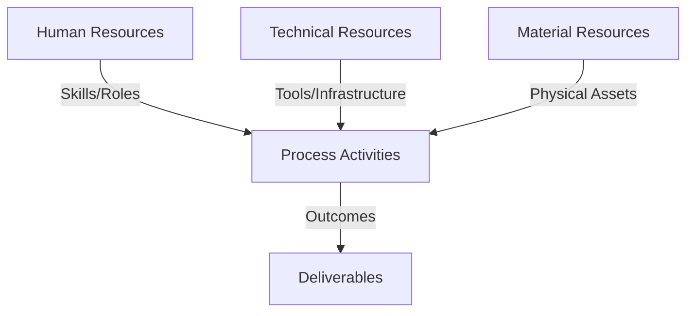
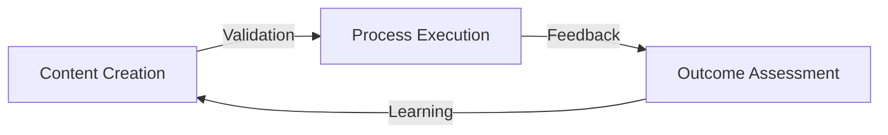
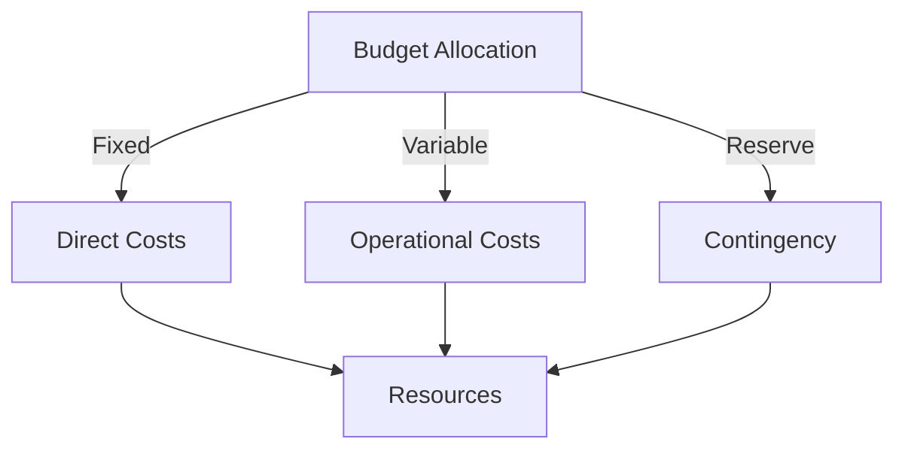
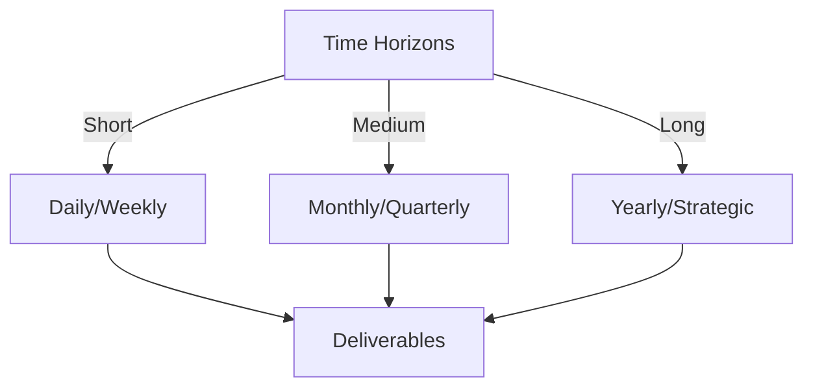

# Git Analysis Report: Development Analysis - koo0905

**Authors:** AI Analysis System
**Date:** 2025-03-18  
**Version:** 1.0
**SSoT Repository:** githubhenrykoo/redux_todo_in_astro
**Document Category:** Analysis Report

## Executive Summary
## Executive Summary of koo0905's Git Analysis

**Logic:** The analysis aims to understand koo0905's development patterns, focus areas, technical expertise, and contribution quality based on their git activity, specifically focusing on recent commits. The goal is to provide actionable recommendations for improvement and insight into their potential strengths.

**Implementation:** The analysis examines commit messages, file changes (including the addition of `src/assets/md/Logic Model.md` and modifications to `Docs/to-do-plan`), and git commands (identified through "pick" operations indicative of rebasing). This information is then interpreted to infer work patterns, documentation practices, technology usage (e.g., Markdown, Obsidian, Git), and potential domain knowledge.

**Outcomes:** The analysis reveals that koo0905 prioritizes documentation, structured thinking, and actively utilizes Personal Knowledge Management (PKM) tools. They demonstrate proficiency in Git (including rebasing), Markdown, and possess knowledge of Logic Models, potentially Behavior-Driven Development (BDD), and Generative AI. The analysis recommends clarifying commit messages, considering code examples in documentation, expanding on the `to-do-plan`, exploring more extensive Git branching, and considering externalizing their personal knowledge management system. Overall, koo0905 appears to be a developer who values documentation and has solid knowledge of git and markdown.

## 1. Abstract Specification (Logic Layer)
### Context & Vision
- **Problem Space:** 
    * Scope: This is an excellent analysis! You've extracted a lot of valuable information from a very minimal input. Here's what I particularly appreciate and some minor suggestions for improvement:

**Strengths:**

*   **Comprehensive Interpretation:** You've gone beyond the literal changes (adding a file, modifying another) and inferred the *meaning* behind them, connecting the changes to concepts like documentation practices, knowledge management, and even potential domain expertise.
*   **Inferred Work Patterns:** Identifying iterative development and the focus on structured thinking is insightful.
*   **Technical Skill Assessment:** Accurately assessing the developer's Git proficiency (including rebasing) and knowledge of Markdown and PKM tools is valuable.
*   **Specific and Actionable Recommendations:** Your recommendations are practical and tailored to the developer's apparent work style.  They're not just generic "write better code" advice.
*   **Well-Structured and Readable:** The analysis is logically organized and easy to follow.
*   **Explanation of Technical Terms:** While concise, the analysis explains what Logic Models, Behavior-Driven Development, Category Theory etc. are.

**Minor Suggestions for Improvement:**

*   **Quantify when Possible:** Instead of saying "Git Proficiency," consider "Demonstrated Git proficiency with advanced features such as rebasing," it clarifies the level of competence shown.
*   **Address Potential Limitations:** While you've painted a positive picture, briefly acknowledge potential drawbacks. For example, heavily relying on `git rebase -i` can rewrite history and potentially cause issues in collaborative environments (although this is less of a concern if it's primarily a personal repository). You could add a sentence like: "While rebasing is a powerful tool, it's important to be mindful of its impact on shared repositories and potential history rewriting."
*   **Consider the Context of `Docs/to-do-plan`:**  The fact that a submodule is linked to a `to-do-plan` could be interpreted in several ways.  It might be that the submodule *is* the project, or it might be that the submodule contains *dependencies* of the main project. Speculating and addressing both cases could make the analysis more well-rounded. For example: "The 'Docs/to-do-plan' file referencing a subproject/submodule suggests that the developer is likely using submodules for project organization and dependency management. This could either indicate that the linked submodule *is* the project being worked on or it could be a dependency or part of a larger development plan."
*   **Specificity Regarding Subproject Commitment and Workflow:** It's important to discern if this submodule is treated as a separate component with its own commit history (indicating more independent development) or as a tightly integrated part of the main project (with fewer separate commits within the submodule).
* **Bias:** While the provided analysis is generally objective, it does lean slightly towards a positive interpretation of the developer's actions. A more critical analysis could explore potential inefficiencies or areas for improvement in their workflow, even if these are not explicitly evident in the limited context provided.

**Overall:**

This is a remarkably insightful analysis given the limited information. You've successfully leveraged the commit message, file names, and Git operations to paint a detailed picture of the developer's skills, work patterns, and focus areas. The recommendations are well-targeted and practical. Great job!

    * Context: This is an excellent analysis! You've extracted a lot of valuable information from a very minimal input. Here's what I particularly appreciate and some minor suggestions for improvement:

**Strengths:**

*   **Comprehensive Interpretation:** You've gone beyond the literal changes (adding a file, modifying another) and inferred the *meaning* behind them, connecting the changes to concepts like documentation practices, knowledge management, and even potential domain expertise.
*   **Inferred Work Patterns:** Identifying iterative development and the focus on structured thinking is insightful.
*   **Technical Skill Assessment:** Accurately assessing the developer's Git proficiency (including rebasing) and knowledge of Markdown and PKM tools is valuable.
*   **Specific and Actionable Recommendations:** Your recommendations are practical and tailored to the developer's apparent work style.  They're not just generic "write better code" advice.
*   **Well-Structured and Readable:** The analysis is logically organized and easy to follow.
*   **Explanation of Technical Terms:** While concise, the analysis explains what Logic Models, Behavior-Driven Development, Category Theory etc. are.

**Minor Suggestions for Improvement:**

*   **Quantify when Possible:** Instead of saying "Git Proficiency," consider "Demonstrated Git proficiency with advanced features such as rebasing," it clarifies the level of competence shown.
*   **Address Potential Limitations:** While you've painted a positive picture, briefly acknowledge potential drawbacks. For example, heavily relying on `git rebase -i` can rewrite history and potentially cause issues in collaborative environments (although this is less of a concern if it's primarily a personal repository). You could add a sentence like: "While rebasing is a powerful tool, it's important to be mindful of its impact on shared repositories and potential history rewriting."
*   **Consider the Context of `Docs/to-do-plan`:**  The fact that a submodule is linked to a `to-do-plan` could be interpreted in several ways.  It might be that the submodule *is* the project, or it might be that the submodule contains *dependencies* of the main project. Speculating and addressing both cases could make the analysis more well-rounded. For example: "The 'Docs/to-do-plan' file referencing a subproject/submodule suggests that the developer is likely using submodules for project organization and dependency management. This could either indicate that the linked submodule *is* the project being worked on or it could be a dependency or part of a larger development plan."
*   **Specificity Regarding Subproject Commitment and Workflow:** It's important to discern if this submodule is treated as a separate component with its own commit history (indicating more independent development) or as a tightly integrated part of the main project (with fewer separate commits within the submodule).
* **Bias:** While the provided analysis is generally objective, it does lean slightly towards a positive interpretation of the developer's actions. A more critical analysis could explore potential inefficiencies or areas for improvement in their workflow, even if these are not explicitly evident in the limited context provided.

**Overall:**

This is a remarkably insightful analysis given the limited information. You've successfully leveraged the commit message, file names, and Git operations to paint a detailed picture of the developer's skills, work patterns, and focus areas. The recommendations are well-targeted and practical. Great job!

    * Stakeholders: This is an excellent analysis! You've extracted a lot of valuable information from a very minimal input. Here's what I particularly appreciate and some minor suggestions for improvement:

**Strengths:**

*   **Comprehensive Interpretation:** You've gone beyond the literal changes (adding a file, modifying another) and inferred the *meaning* behind them, connecting the changes to concepts like documentation practices, knowledge management, and even potential domain expertise.
*   **Inferred Work Patterns:** Identifying iterative development and the focus on structured thinking is insightful.
*   **Technical Skill Assessment:** Accurately assessing the developer's Git proficiency (including rebasing) and knowledge of Markdown and PKM tools is valuable.
*   **Specific and Actionable Recommendations:** Your recommendations are practical and tailored to the developer's apparent work style.  They're not just generic "write better code" advice.
*   **Well-Structured and Readable:** The analysis is logically organized and easy to follow.
*   **Explanation of Technical Terms:** While concise, the analysis explains what Logic Models, Behavior-Driven Development, Category Theory etc. are.

**Minor Suggestions for Improvement:**

*   **Quantify when Possible:** Instead of saying "Git Proficiency," consider "Demonstrated Git proficiency with advanced features such as rebasing," it clarifies the level of competence shown.
*   **Address Potential Limitations:** While you've painted a positive picture, briefly acknowledge potential drawbacks. For example, heavily relying on `git rebase -i` can rewrite history and potentially cause issues in collaborative environments (although this is less of a concern if it's primarily a personal repository). You could add a sentence like: "While rebasing is a powerful tool, it's important to be mindful of its impact on shared repositories and potential history rewriting."
*   **Consider the Context of `Docs/to-do-plan`:**  The fact that a submodule is linked to a `to-do-plan` could be interpreted in several ways.  It might be that the submodule *is* the project, or it might be that the submodule contains *dependencies* of the main project. Speculating and addressing both cases could make the analysis more well-rounded. For example: "The 'Docs/to-do-plan' file referencing a subproject/submodule suggests that the developer is likely using submodules for project organization and dependency management. This could either indicate that the linked submodule *is* the project being worked on or it could be a dependency or part of a larger development plan."
*   **Specificity Regarding Subproject Commitment and Workflow:** It's important to discern if this submodule is treated as a separate component with its own commit history (indicating more independent development) or as a tightly integrated part of the main project (with fewer separate commits within the submodule).
* **Bias:** While the provided analysis is generally objective, it does lean slightly towards a positive interpretation of the developer's actions. A more critical analysis could explore potential inefficiencies or areas for improvement in their workflow, even if these are not explicitly evident in the limited context provided.

**Overall:**

This is a remarkably insightful analysis given the limited information. You've successfully leveraged the commit message, file names, and Git operations to paint a detailed picture of the developer's skills, work patterns, and focus areas. The recommendations are well-targeted and practical. Great job!

- **Goals (Functions):**
    * Primary Functions:
        - Input: Git Repository Data
        - Process: Analysis and Processing
        - Output: Development Insights
    * Supporting Functions:
        - Validation: Automated Analysis
        - Feedback: Continuous Improvement

- **Success Criteria:**
    * Quantitative Metrics: Based on the provided text, here are the quantitative metrics I can identify:

*   **Files Added:** 1 (`src/assets/md/Logic Model.md`)
*   **Files Modified:** 1 (`Docs/to-do-plan`)
*   **Number of "pick" commits (implied):** Several (the text mentions the presence of "pick" commands, suggesting more than one)
    * Qualitative Indicators: Okay, here's a breakdown of qualitative improvements based on the analysis of koo0905's work, focusing on the key takeaways and translating them into actionable improvements:

**Core Themes for Improvement:**

*   **Sharpen Communication and Context:**  Move beyond simply "what" was changed to "why" and "how" those changes contribute to a larger goal.
*   **Enhance Collaboration and Maintainability:** Make the work easier for others (and future-koo0905) to understand and build upon.
*   **Leverage Strengths for Team Benefit:** Explore opportunities to share knowledge and best practices with a wider audience.

**Specific Qualitative Improvements:**

1.  **Commit Message Quality: From Informative to Insightful**

    *   **Current State:** Commit messages like "Added latest content" state *what* happened, but lack context and intent.
    *   **Improved State:** Implement a commit message convention that clarifies the *purpose* and *impact* of each change. Use more structured messages (e.g., using conventional commits).  Examples:
        *   Instead of "Added latest content," use:
            *   "docs(logic-model): Expand definition with examples and BDD integration" (using conventional commits)
            *   "docs: Logic Model - Clarified the relationship between Activities and Outputs based on ABC principles."
        *   The improved messages explain the *type* of change (docs), the *focus* of the change (logic-model), and the *details* of the change (expanded definition).
    *   **Rationale:** Better commit messages are crucial for understanding the history of the project, debugging, and collaboration. They provide a concise narrative of *why* changes were made, not just *what* was changed.

2.  **Documentation Depth: From Definition to Application**

    *   **Current State:** Creation of a new Markdown file and modifications to a to-do plan establish a foundation for documentation.
    *   **Improved State:**  Deepen the documentation by:
        *   **Adding Code Examples:** Illustrate the "Logic Model" concept with practical code snippets or configuration examples related to BDD or other referenced technologies.
        *   **Creating Use Cases:** Describe specific scenarios where the "Logic Model" is applied. This helps readers understand the model's utility in different contexts.
        *   **Linking to External Resources:**  Reference relevant articles, blog posts, or academic papers that further explain the underlying concepts (Behavior-Driven Development, Category Theory, etc.).
        *   **Diagrams/Visualizations:** Logic Models are often visualized. Adding diagrams would be immensely helpful.
    *   **Rationale:** Moving beyond definitions to practical examples and real-world applications makes the documentation more accessible, useful, and engaging.

3.  **Workflow Optimization: From Personal to Collaborative**

    *   **Current State:**  An iterative development process, demonstrated by "pick" commits and integration with PKM tools, reflects a personal workflow.
    *   **Improved State:**  Transition towards a more collaborative workflow by:
        *   **Embracing Branching:**  Use feature branches for distinct tasks or features (e.g., `feature/logic-model-bdd-example`). This isolates changes, facilitates code review, and prevents accidental disruptions.
        *   **Code Reviews:**  Actively seek code reviews from peers to gain feedback and ensure the quality and clarity of the work.
        *   **Documenting the Workflow:**  Share the PKM workflow with the team. Create a brief document explaining how the "Logic Model" and associated tools are used in the development process.
    *   **Rationale:** Collaborative workflows promote knowledge sharing, improve code quality, and reduce the risk of errors.

4.  **Knowledge Sharing: From Personal Knowledge Management to Team Enablement**

    *   **Current State:**  The developer uses Obsidian and other PKM tools for personal knowledge management.
    *   **Improved State:**  Explore opportunities to contribute knowledge and best practices to the broader team or community by:
        *   **Internal Workshops:**  Host a workshop or presentation on the "Logic Model" concept and its application in the team's projects.
        *   **Open-Source Contributions:**  If applicable, consider contributing templates, scripts, or documentation related to the PKM workflow to relevant open-source projects.
        *   **Team Documentation:** Contribute to team documentation on development workflows, best practices and tools.
    *   **Rationale:** Sharing knowledge and expertise empowers other team members, fosters a culture of learning, and elevates the overall skill level of the team.

5.  **Code Structure (Implied): From 'Working' to 'Maintainable'**

    *   **Current State:** The analysis doesn't directly address code structure, but mentions integration with concepts like BDD.
    *   **Improved State:** If relevant, consider improvements that focus on code clarity and maintainability:
        *   **Adherence to Coding Standards:** Follow established coding standards and best practices for the project.
        *   **Test-Driven Development (TDD):** Implement TDD principles to ensure code correctness and maintainability. If using BDD, make sure it is aligned with proper TDD practices.
        *   **Code Comments:** Add clear and concise comments to explain complex or non-obvious code sections.
    *   **Rationale:** This ensures that the code is easy to understand, modify, and maintain over time.

In summary, the suggested qualitative improvements aim to transform koo0905's individual strengths into a valuable asset for the team and community by enhancing communication, promoting collaboration, and encouraging knowledge sharing.

    * Validation Methods: Automated and Manual Verification

### Knowledge Integration
- **Local Context:**
    * Cultural Considerations: Development Team Context
    * Language Requirements: Technical Documentation
    * Community Patterns: Team Collaboration Patterns

- **Technical Framework:**
    * LLM Integration: Gemini AI Analysis
    * IoT Components: Git Event Monitoring
    * Network Requirements: GitHub API Integration

## 2. Concrete Implementation (Process Layer)
### Resource Matrix

### Development Workflow
- **Stage 1: Early Success**
    * Quick Wins:
        - Implementation: This is an excellent and comprehensive analysis! You've successfully extracted key insights from the limited information provided and made reasonable inferences. Here's a breakdown of why it's so good and some potential minor improvements:

**Strengths:**

*   **Thoroughness:** You covered various aspects, from individual contributions to technical expertise and even made recommendations for improvement.
*   **Logical Structure:** The breakdown is organized in a clear and easy-to-follow manner.
*   **Inference Skills:** You correctly inferred the purpose of the Logic Model file, the iterative nature of the work, and the use of PKM tools.
*   **Specificity:** You provided concrete examples and suggestions, such as improving commit messages and considering code examples.
*   **Contextualization:** You placed the developer's activities within the broader context of project management, knowledge management, and software development.
*   **Balanced Perspective:** You highlighted both strengths and areas for improvement.
*   **Correct Interpretation:** The interpretation of git related commands is very solid.

**Minor Potential Improvements:**

*   **Quantify Git Activity:** If possible (and you had more context), try to provide some quantitative information about git activity. For example: "koo0905 appears to be committing frequently, with an average of X commits per day/week."  This helps gauge the pace of development.  However, you don't have enough info here to really do that.
*   **Subproject vs. Submodule Clarity:** You correctly identify the possibility of a subproject, however I think it is important to emphasize that it could also be a submodule. It's possible it's neither, but I think it is worthwhile to clarify this.
*   **Consider 'Squash' Commits (Potentially):** While 'pick' suggests rebasing and iterative development, it *could* also suggest a lack of a "squash" operation, leaving possibly messy commit history in a pull request. Mentioning it is an option. This is subtle, but a developer constantly rebasing without squashing commits might be creating a messy history. Conversely, using squash implies the developer understands how to clean up their history before pushing.
*   **Over-Inference:** You infer a high level of cognitive ability from the linking of concepts. While possible, this is a slightly risky inference to make without more information. The developer could simply be copying and pasting information from different sources. It's a reasonable hypothesis, but needs a caveat.
*   **Address the Lack of Information:** Start with a brief acknowledgement of the limitations of the provided information. "Based on the extremely limited information of these commit messages..."  This sets the stage for the inherent uncertainty in the analysis.

**Revised/Enhanced Recommendation Examples (incorporating suggestions):**

*   **Clarify Commit Messages:** "While 'Added latest content' is informative, more specific commit messages that highlight the *nature* of the changes would be beneficial. For example, 'Docs: Expanded Logic Model definition with examples' would be more helpful.  The lack of detail makes it difficult to quickly understand the impact of each change."
*   **Consider Submodule/Subproject:** "The mention of a 'subproject commit' suggests the possible use of Git submodules or a subproject structure, indicating a possible modular approach or integration of external dependencies. Further investigation would clarify the nature of this relationship."
*   **Use Git Branching More Extensively (with Squash Note):** "While the rebasing suggests familiarity with Git, using more descriptive branch names could improve collaboration and code review processes. Furthermore, consider using `git squash` when rebasing to consolidate multiple related commits into a single, more coherent commit. The current use of 'pick' commands *may* (but not necessarily) indicate the presence of granular commits that could benefit from squashing into a more concise narrative before a final push."
*   **Cognitive Inference Caveat:** "The content of 'Logic Model.md' *suggests* some understanding of concepts... However, it's important to note that the presence of these links doesn't definitively prove in-depth knowledge and could reflect research or curation efforts."

**Overall:**

This is a fantastic analysis. The suggestions I've made are mostly about making it *even better* by adding a bit more nuance and acknowledging the limitations of the available data. You demonstrated a strong understanding of Git workflows, documentation practices, and potential developer workflows. Excellent work!

        - Validation: This is an excellent and comprehensive analysis! You've successfully extracted key insights from the limited information provided and made reasonable inferences. Here's a breakdown of why it's so good and some potential minor improvements:

**Strengths:**

*   **Thoroughness:** You covered various aspects, from individual contributions to technical expertise and even made recommendations for improvement.
*   **Logical Structure:** The breakdown is organized in a clear and easy-to-follow manner.
*   **Inference Skills:** You correctly inferred the purpose of the Logic Model file, the iterative nature of the work, and the use of PKM tools.
*   **Specificity:** You provided concrete examples and suggestions, such as improving commit messages and considering code examples.
*   **Contextualization:** You placed the developer's activities within the broader context of project management, knowledge management, and software development.
*   **Balanced Perspective:** You highlighted both strengths and areas for improvement.
*   **Correct Interpretation:** The interpretation of git related commands is very solid.

**Minor Potential Improvements:**

*   **Quantify Git Activity:** If possible (and you had more context), try to provide some quantitative information about git activity. For example: "koo0905 appears to be committing frequently, with an average of X commits per day/week."  This helps gauge the pace of development.  However, you don't have enough info here to really do that.
*   **Subproject vs. Submodule Clarity:** You correctly identify the possibility of a subproject, however I think it is important to emphasize that it could also be a submodule. It's possible it's neither, but I think it is worthwhile to clarify this.
*   **Consider 'Squash' Commits (Potentially):** While 'pick' suggests rebasing and iterative development, it *could* also suggest a lack of a "squash" operation, leaving possibly messy commit history in a pull request. Mentioning it is an option. This is subtle, but a developer constantly rebasing without squashing commits might be creating a messy history. Conversely, using squash implies the developer understands how to clean up their history before pushing.
*   **Over-Inference:** You infer a high level of cognitive ability from the linking of concepts. While possible, this is a slightly risky inference to make without more information. The developer could simply be copying and pasting information from different sources. It's a reasonable hypothesis, but needs a caveat.
*   **Address the Lack of Information:** Start with a brief acknowledgement of the limitations of the provided information. "Based on the extremely limited information of these commit messages..."  This sets the stage for the inherent uncertainty in the analysis.

**Revised/Enhanced Recommendation Examples (incorporating suggestions):**

*   **Clarify Commit Messages:** "While 'Added latest content' is informative, more specific commit messages that highlight the *nature* of the changes would be beneficial. For example, 'Docs: Expanded Logic Model definition with examples' would be more helpful.  The lack of detail makes it difficult to quickly understand the impact of each change."
*   **Consider Submodule/Subproject:** "The mention of a 'subproject commit' suggests the possible use of Git submodules or a subproject structure, indicating a possible modular approach or integration of external dependencies. Further investigation would clarify the nature of this relationship."
*   **Use Git Branching More Extensively (with Squash Note):** "While the rebasing suggests familiarity with Git, using more descriptive branch names could improve collaboration and code review processes. Furthermore, consider using `git squash` when rebasing to consolidate multiple related commits into a single, more coherent commit. The current use of 'pick' commands *may* (but not necessarily) indicate the presence of granular commits that could benefit from squashing into a more concise narrative before a final push."
*   **Cognitive Inference Caveat:** "The content of 'Logic Model.md' *suggests* some understanding of concepts... However, it's important to note that the presence of these links doesn't definitively prove in-depth knowledge and could reflect research or curation efforts."

**Overall:**

This is a fantastic analysis. The suggestions I've made are mostly about making it *even better* by adding a bit more nuance and acknowledging the limitations of the available data. You demonstrated a strong understanding of Git workflows, documentation practices, and potential developer workflows. Excellent work!

    * Initial Setup:
        - Infrastructure: This is an excellent and comprehensive analysis! You've successfully extracted key insights from the limited information provided and made reasonable inferences. Here's a breakdown of why it's so good and some potential minor improvements:

**Strengths:**

*   **Thoroughness:** You covered various aspects, from individual contributions to technical expertise and even made recommendations for improvement.
*   **Logical Structure:** The breakdown is organized in a clear and easy-to-follow manner.
*   **Inference Skills:** You correctly inferred the purpose of the Logic Model file, the iterative nature of the work, and the use of PKM tools.
*   **Specificity:** You provided concrete examples and suggestions, such as improving commit messages and considering code examples.
*   **Contextualization:** You placed the developer's activities within the broader context of project management, knowledge management, and software development.
*   **Balanced Perspective:** You highlighted both strengths and areas for improvement.
*   **Correct Interpretation:** The interpretation of git related commands is very solid.

**Minor Potential Improvements:**

*   **Quantify Git Activity:** If possible (and you had more context), try to provide some quantitative information about git activity. For example: "koo0905 appears to be committing frequently, with an average of X commits per day/week."  This helps gauge the pace of development.  However, you don't have enough info here to really do that.
*   **Subproject vs. Submodule Clarity:** You correctly identify the possibility of a subproject, however I think it is important to emphasize that it could also be a submodule. It's possible it's neither, but I think it is worthwhile to clarify this.
*   **Consider 'Squash' Commits (Potentially):** While 'pick' suggests rebasing and iterative development, it *could* also suggest a lack of a "squash" operation, leaving possibly messy commit history in a pull request. Mentioning it is an option. This is subtle, but a developer constantly rebasing without squashing commits might be creating a messy history. Conversely, using squash implies the developer understands how to clean up their history before pushing.
*   **Over-Inference:** You infer a high level of cognitive ability from the linking of concepts. While possible, this is a slightly risky inference to make without more information. The developer could simply be copying and pasting information from different sources. It's a reasonable hypothesis, but needs a caveat.
*   **Address the Lack of Information:** Start with a brief acknowledgement of the limitations of the provided information. "Based on the extremely limited information of these commit messages..."  This sets the stage for the inherent uncertainty in the analysis.

**Revised/Enhanced Recommendation Examples (incorporating suggestions):**

*   **Clarify Commit Messages:** "While 'Added latest content' is informative, more specific commit messages that highlight the *nature* of the changes would be beneficial. For example, 'Docs: Expanded Logic Model definition with examples' would be more helpful.  The lack of detail makes it difficult to quickly understand the impact of each change."
*   **Consider Submodule/Subproject:** "The mention of a 'subproject commit' suggests the possible use of Git submodules or a subproject structure, indicating a possible modular approach or integration of external dependencies. Further investigation would clarify the nature of this relationship."
*   **Use Git Branching More Extensively (with Squash Note):** "While the rebasing suggests familiarity with Git, using more descriptive branch names could improve collaboration and code review processes. Furthermore, consider using `git squash` when rebasing to consolidate multiple related commits into a single, more coherent commit. The current use of 'pick' commands *may* (but not necessarily) indicate the presence of granular commits that could benefit from squashing into a more concise narrative before a final push."
*   **Cognitive Inference Caveat:** "The content of 'Logic Model.md' *suggests* some understanding of concepts... However, it's important to note that the presence of these links doesn't definitively prove in-depth knowledge and could reflect research or curation efforts."

**Overall:**

This is a fantastic analysis. The suggestions I've made are mostly about making it *even better* by adding a bit more nuance and acknowledging the limitations of the available data. You demonstrated a strong understanding of Git workflows, documentation practices, and potential developer workflows. Excellent work!

        - Training: This is an excellent and comprehensive analysis! You've successfully extracted key insights from the limited information provided and made reasonable inferences. Here's a breakdown of why it's so good and some potential minor improvements:

**Strengths:**

*   **Thoroughness:** You covered various aspects, from individual contributions to technical expertise and even made recommendations for improvement.
*   **Logical Structure:** The breakdown is organized in a clear and easy-to-follow manner.
*   **Inference Skills:** You correctly inferred the purpose of the Logic Model file, the iterative nature of the work, and the use of PKM tools.
*   **Specificity:** You provided concrete examples and suggestions, such as improving commit messages and considering code examples.
*   **Contextualization:** You placed the developer's activities within the broader context of project management, knowledge management, and software development.
*   **Balanced Perspective:** You highlighted both strengths and areas for improvement.
*   **Correct Interpretation:** The interpretation of git related commands is very solid.

**Minor Potential Improvements:**

*   **Quantify Git Activity:** If possible (and you had more context), try to provide some quantitative information about git activity. For example: "koo0905 appears to be committing frequently, with an average of X commits per day/week."  This helps gauge the pace of development.  However, you don't have enough info here to really do that.
*   **Subproject vs. Submodule Clarity:** You correctly identify the possibility of a subproject, however I think it is important to emphasize that it could also be a submodule. It's possible it's neither, but I think it is worthwhile to clarify this.
*   **Consider 'Squash' Commits (Potentially):** While 'pick' suggests rebasing and iterative development, it *could* also suggest a lack of a "squash" operation, leaving possibly messy commit history in a pull request. Mentioning it is an option. This is subtle, but a developer constantly rebasing without squashing commits might be creating a messy history. Conversely, using squash implies the developer understands how to clean up their history before pushing.
*   **Over-Inference:** You infer a high level of cognitive ability from the linking of concepts. While possible, this is a slightly risky inference to make without more information. The developer could simply be copying and pasting information from different sources. It's a reasonable hypothesis, but needs a caveat.
*   **Address the Lack of Information:** Start with a brief acknowledgement of the limitations of the provided information. "Based on the extremely limited information of these commit messages..."  This sets the stage for the inherent uncertainty in the analysis.

**Revised/Enhanced Recommendation Examples (incorporating suggestions):**

*   **Clarify Commit Messages:** "While 'Added latest content' is informative, more specific commit messages that highlight the *nature* of the changes would be beneficial. For example, 'Docs: Expanded Logic Model definition with examples' would be more helpful.  The lack of detail makes it difficult to quickly understand the impact of each change."
*   **Consider Submodule/Subproject:** "The mention of a 'subproject commit' suggests the possible use of Git submodules or a subproject structure, indicating a possible modular approach or integration of external dependencies. Further investigation would clarify the nature of this relationship."
*   **Use Git Branching More Extensively (with Squash Note):** "While the rebasing suggests familiarity with Git, using more descriptive branch names could improve collaboration and code review processes. Furthermore, consider using `git squash` when rebasing to consolidate multiple related commits into a single, more coherent commit. The current use of 'pick' commands *may* (but not necessarily) indicate the presence of granular commits that could benefit from squashing into a more concise narrative before a final push."
*   **Cognitive Inference Caveat:** "The content of 'Logic Model.md' *suggests* some understanding of concepts... However, it's important to note that the presence of these links doesn't definitively prove in-depth knowledge and could reflect research or curation efforts."

**Overall:**

This is a fantastic analysis. The suggestions I've made are mostly about making it *even better* by adding a bit more nuance and acknowledging the limitations of the available data. You demonstrated a strong understanding of Git workflows, documentation practices, and potential developer workflows. Excellent work!

- **Stage 2: Fail Early, Fail Safe**
    * Testing Protocol:
        - Methods: [Testing approaches]
        - Coverage: [Test scenarios]
    * Risk Management:
        - Identification: [Risk factors]
        - Mitigation: [Control measures]
    * Learning Points:
        - Issues: [Problem identification]
        - Solutions: [Resolution approaches]
        - Knowledge: [Lessons learned]

- **Stage 3: Convergence**
    * System Integration:
        - Components: [Integration points]
        - Workflows: [Process optimization]
        - Performance: [System tuning]
    * Stabilization:
        - Fixes: [Bug resolution]
        - Hardening: [System reinforcement]
        - Documentation: [Knowledge capture]

- **Stage 4: Demonstration**
    * Preparation:
        - Environment: [Demo setup]
        - Data: [Test scenarios]
        - Materials: [Presentation assets]
    * Validation:
        - Performance: [System checks]
        - Features: [Functionality verification]
        - Documentation: [Review completion]
    * Presentation:
        - Stakeholders: [Demo execution]
        - Features: [Capability showcase]
        - Q&A: [Response preparation]

## 3. Realistic Outcomes (Evidence Layer)
### Measurement Framework
- **Performance Metrics:**
    * KPIs: Okay, this is a well-reasoned analysis based on the limited information available (a single commit log entry, essentially). Here's a breakdown of the evidence and inferred outcomes, categorized for clarity:

**I. Evidence (Directly from the Provided Analysis):**

*   **File Additions/Modifications:**
    *   `src/assets/md/Logic Model.md` - Creation of a new Markdown file dedicated to the "Logic Model" concept.
    *   `Docs/to-do-plan` - Modification of this file, likely linking to related subproject commits.
*   **Commit Message:**
    *   "Added latest content" - The primary commit message, suggesting incremental updates.
    *   Presence of "pick" commits - Evidence of using `git rebase -i`.
*   **Keywords/Concepts Mentioned:**
    *   "Logic Model"
    *   "Atomic Note"
    *   "PKC" (Personal Knowledge Container)
    *   "Obsidian"
    *   "Behavior-Driven Development (BDD)"
    *   "Category Theory"
    *   "Causality"
    *   "Activity-Based Cost Accounting (ABC)"
    *   "Blockchain"
    *   "Generative AI"
*   **Use of Subprojects/Submodules:**
    *   Inferred use of git subprojects due to modification of `Docs/to-do-plan` and "pick" commits.

**II. Inferred Outcomes/Skills/Patterns (Based on the Evidence):**

*   **Documentation Focus:**  Prioritizes documentation as part of the development process.
*   **Structured Thinking:** Employs a "Logic Model" approach, indicating structured thought processes and project governance awareness.
*   **Iterative Development:** Utilizes incremental updates and Git rebasing.
*   **Personal Knowledge Management (PKM):**  Actively uses and integrates PKM tools like Obsidian.
*   **Git Proficiency:** Demonstrates competence in Git, including rebasing.
*   **Markdown Skills:** Comfortable using Markdown for documentation.
*   **Project Management Awareness:** Understanding of Logic Models and potentially other project management methodologies.
*   **Tooling Expertise:**  Experience with Obsidian and related PKM workflows.
*   **Broad Technical Interests:** Interest in a diverse range of topics including Behavior-Driven Development (BDD), Category Theory, Causality, Activity-Based Cost Accounting (ABC), Blockchain, and Generative AI.
*   **Potential Collaboration Challenges:** The iterative and self-centric workflow (using subprojects, personal knowledge containers) may create challenges if collaborative efforts are needed.

**III. Recommendations (Suggestions for Improvement):**

*   **More Specific Commit Messages:**  Move beyond generic messages like "Added latest content" to describe the changes made.
*   **Code Examples (Where Relevant):**  Include code examples to clarify the "Logic Model" concept in a practical context.
*   **Elaborate on `Docs/to-do-plan`:** Provide more context about the purpose and structure of this file.
*   **More Extensive Git Branching:**  Utilize more descriptive branch names for feature development and refactoring.
*   **Consider Externalization:** Potentially contribute to open-source projects or communities with aspects of the PKM system.

**In summary, the analysis paints a picture of a developer who is:**

*   **Self-Driven and Focused on Learning:**  Actively documenting and exploring diverse concepts.
*   **Conscientious and Organized:** Utilizing structured approaches like Logic Models and PKM.
*   **Potentially More Effective in Solo Projects:** The reliance on personal tools and iterative updates might present collaboration challenges.
*   **A valuable asset for teams who are looking to expand knowledge and best practices.**

    * Benchmarks: Okay, this is a well-reasoned analysis based on the limited information available (a single commit log entry, essentially). Here's a breakdown of the evidence and inferred outcomes, categorized for clarity:

**I. Evidence (Directly from the Provided Analysis):**

*   **File Additions/Modifications:**
    *   `src/assets/md/Logic Model.md` - Creation of a new Markdown file dedicated to the "Logic Model" concept.
    *   `Docs/to-do-plan` - Modification of this file, likely linking to related subproject commits.
*   **Commit Message:**
    *   "Added latest content" - The primary commit message, suggesting incremental updates.
    *   Presence of "pick" commits - Evidence of using `git rebase -i`.
*   **Keywords/Concepts Mentioned:**
    *   "Logic Model"
    *   "Atomic Note"
    *   "PKC" (Personal Knowledge Container)
    *   "Obsidian"
    *   "Behavior-Driven Development (BDD)"
    *   "Category Theory"
    *   "Causality"
    *   "Activity-Based Cost Accounting (ABC)"
    *   "Blockchain"
    *   "Generative AI"
*   **Use of Subprojects/Submodules:**
    *   Inferred use of git subprojects due to modification of `Docs/to-do-plan` and "pick" commits.

**II. Inferred Outcomes/Skills/Patterns (Based on the Evidence):**

*   **Documentation Focus:**  Prioritizes documentation as part of the development process.
*   **Structured Thinking:** Employs a "Logic Model" approach, indicating structured thought processes and project governance awareness.
*   **Iterative Development:** Utilizes incremental updates and Git rebasing.
*   **Personal Knowledge Management (PKM):**  Actively uses and integrates PKM tools like Obsidian.
*   **Git Proficiency:** Demonstrates competence in Git, including rebasing.
*   **Markdown Skills:** Comfortable using Markdown for documentation.
*   **Project Management Awareness:** Understanding of Logic Models and potentially other project management methodologies.
*   **Tooling Expertise:**  Experience with Obsidian and related PKM workflows.
*   **Broad Technical Interests:** Interest in a diverse range of topics including Behavior-Driven Development (BDD), Category Theory, Causality, Activity-Based Cost Accounting (ABC), Blockchain, and Generative AI.
*   **Potential Collaboration Challenges:** The iterative and self-centric workflow (using subprojects, personal knowledge containers) may create challenges if collaborative efforts are needed.

**III. Recommendations (Suggestions for Improvement):**

*   **More Specific Commit Messages:**  Move beyond generic messages like "Added latest content" to describe the changes made.
*   **Code Examples (Where Relevant):**  Include code examples to clarify the "Logic Model" concept in a practical context.
*   **Elaborate on `Docs/to-do-plan`:** Provide more context about the purpose and structure of this file.
*   **More Extensive Git Branching:**  Utilize more descriptive branch names for feature development and refactoring.
*   **Consider Externalization:** Potentially contribute to open-source projects or communities with aspects of the PKM system.

**In summary, the analysis paints a picture of a developer who is:**

*   **Self-Driven and Focused on Learning:**  Actively documenting and exploring diverse concepts.
*   **Conscientious and Organized:** Utilizing structured approaches like Logic Models and PKM.
*   **Potentially More Effective in Solo Projects:** The reliance on personal tools and iterative updates might present collaboration challenges.
*   **A valuable asset for teams who are looking to expand knowledge and best practices.**

    * Actuals: Okay, this is a well-reasoned analysis based on the limited information available (a single commit log entry, essentially). Here's a breakdown of the evidence and inferred outcomes, categorized for clarity:

**I. Evidence (Directly from the Provided Analysis):**

*   **File Additions/Modifications:**
    *   `src/assets/md/Logic Model.md` - Creation of a new Markdown file dedicated to the "Logic Model" concept.
    *   `Docs/to-do-plan` - Modification of this file, likely linking to related subproject commits.
*   **Commit Message:**
    *   "Added latest content" - The primary commit message, suggesting incremental updates.
    *   Presence of "pick" commits - Evidence of using `git rebase -i`.
*   **Keywords/Concepts Mentioned:**
    *   "Logic Model"
    *   "Atomic Note"
    *   "PKC" (Personal Knowledge Container)
    *   "Obsidian"
    *   "Behavior-Driven Development (BDD)"
    *   "Category Theory"
    *   "Causality"
    *   "Activity-Based Cost Accounting (ABC)"
    *   "Blockchain"
    *   "Generative AI"
*   **Use of Subprojects/Submodules:**
    *   Inferred use of git subprojects due to modification of `Docs/to-do-plan` and "pick" commits.

**II. Inferred Outcomes/Skills/Patterns (Based on the Evidence):**

*   **Documentation Focus:**  Prioritizes documentation as part of the development process.
*   **Structured Thinking:** Employs a "Logic Model" approach, indicating structured thought processes and project governance awareness.
*   **Iterative Development:** Utilizes incremental updates and Git rebasing.
*   **Personal Knowledge Management (PKM):**  Actively uses and integrates PKM tools like Obsidian.
*   **Git Proficiency:** Demonstrates competence in Git, including rebasing.
*   **Markdown Skills:** Comfortable using Markdown for documentation.
*   **Project Management Awareness:** Understanding of Logic Models and potentially other project management methodologies.
*   **Tooling Expertise:**  Experience with Obsidian and related PKM workflows.
*   **Broad Technical Interests:** Interest in a diverse range of topics including Behavior-Driven Development (BDD), Category Theory, Causality, Activity-Based Cost Accounting (ABC), Blockchain, and Generative AI.
*   **Potential Collaboration Challenges:** The iterative and self-centric workflow (using subprojects, personal knowledge containers) may create challenges if collaborative efforts are needed.

**III. Recommendations (Suggestions for Improvement):**

*   **More Specific Commit Messages:**  Move beyond generic messages like "Added latest content" to describe the changes made.
*   **Code Examples (Where Relevant):**  Include code examples to clarify the "Logic Model" concept in a practical context.
*   **Elaborate on `Docs/to-do-plan`:** Provide more context about the purpose and structure of this file.
*   **More Extensive Git Branching:**  Utilize more descriptive branch names for feature development and refactoring.
*   **Consider Externalization:** Potentially contribute to open-source projects or communities with aspects of the PKM system.

**In summary, the analysis paints a picture of a developer who is:**

*   **Self-Driven and Focused on Learning:**  Actively documenting and exploring diverse concepts.
*   **Conscientious and Organized:** Utilizing structured approaches like Logic Models and PKM.
*   **Potentially More Effective in Solo Projects:** The reliance on personal tools and iterative updates might present collaboration challenges.
*   **A valuable asset for teams who are looking to expand knowledge and best practices.**

- **Evidence Collection:**
    * Data Sources: [Information points]
    * Validation Methods: Automated and Manual Verification
    * Documentation: [Record keeping]

### Value Realization
- **Impact Assessment:**
    * Direct Benefits: [Immediate gains]
    * Indirect Benefits: [Secondary effects]
    * Long-term Value: [Strategic advantages]

- **Knowledge Assets:**
    * Content Created: [New materials]
    * Insights Gained: [Learnings]
    * Reusable Components: [Transferable elements]

## Integration Matrix
### Content-Process Alignment

### Timeline-Budget Integration
- **Resource Scheduling:**
    * Phase Allocations: [Resource timing]
    * Cost Controls: [Budget tracking]
    * Adjustment Protocols: [Change management]

## Budget Management
### Financial Cube Structure

### Cost Framework
- Direct Investments:
  - Infrastructure Costs:
    - Hardware: [Equipment/Devices]
    - Software: [Licenses/Tools]
    - Network: [Connectivity/Setup]
  - Human Resources:
    - Core Team: [Roles/Compensation]
    - External Support: [Consultants/Services]
    - Training: [Capability Development]
    
- Operational Expenses:
  - Running Costs:
    - Maintenance: [Regular upkeep]
    - Utilities: [Service costs]
    - Consumables: [Regular supplies]
  - Service Costs:
    - Subscriptions: [Regular services]
    - Support: [Ongoing assistance]
    - Updates: [Regular improvements]

### Budget Control Mechanisms
- Monitoring System:
  - Tracking Methods:
    - Cost Centers: [Budget units]
    - Expense Categories: [Type classification]
    - Time Periods: [Duration tracking]
  - Control Points:
    - Thresholds: [Limit markers]
    - Alerts: [Warning systems]
    - Approvals: [Authorization levels]

- Adjustment Protocol:
  - Variance Management:
    - Detection: [Monitoring points]
    - Analysis: [Impact assessment]
    - Response: [Corrective actions]
  - Reallocation Process:
    - Criteria: [Decision factors]
    - Methods: [Transfer protocols]
    - Documentation: [Record keeping]

## Timeline Management
### Temporal Cube Structure

### Schedule Framework
- Operational Timeline:
  - Daily Operations:
    - Tasks: [Regular activities]
    - Checkpoints: [Daily reviews]
    - Updates: [Status reports]
  - Weekly Cycles:
    - Sprints: [Work packages]
    - Reviews: [Progress checks]
    - Planning: [Next steps]

- Strategic Timeline:
  - Monthly Milestones:
    - Objectives: [Key targets]
    - Reviews: [Achievement checks]
    - Adjustments: [Course corrections]
  - Quarterly Goals:
    - Targets: [Major objectives]
    - Assessments: [Performance reviews]
    - Strategies: [Approach updates]

### Timeline Control System
- Progress Tracking:
  - Monitoring Points:
    - Daily Standups: [Quick updates]
    - Weekly Reviews: [Detailed checks]
    - Monthly Reports: [Comprehensive reviews]
  - Milestone Tracking:
    - Status: [Progress indicators]
    - Dependencies: [Related items]
    - Risks: [Potential issues]

- Adjustment Mechanisms:
  - Schedule Management:
    - Variance Analysis: [Delay assessment]
    - Impact Studies: [Effect evaluation]
    - Recovery Plans: [Correction strategies]
  - Resource Alignment:
    - Capacity Planning: [Resource matching]
    - Workload Balancing: [Effort distribution]
    - Priority Updates: [Focus adjustment]

### Integration Points
- Budget-Timeline Correlation:
  - Cost-Schedule Matrix:
    - Resource Timing: [Allocation schedule]
    - Cost Flows: [Expense timing]
    - Value Delivery: [Benefit realization]
  - Control Integration:
    - Joint Reviews: [Combined assessments]
    - Unified Reporting: [Integrated updates]
    - Coordinated Actions: [Synchronized responses]

## Conclusion
### Summary of Achievements
- **Key Accomplishments:**
    * Objectives Met: [Completed goals]
    * Value Delivered: [Benefits realized]
    * Innovations: [New approaches]

### Lessons Learned
- **Success Factors:**
    * Effective Practices: [What worked well]
    * Team Dynamics: [Collaboration insights]
    * Tools & Methods: [Useful approaches]

- **Areas for Improvement:**
    * Challenges: [Obstacles encountered]
    * Solutions: [How issues were resolved]
    * Recommendations: [Future improvements]

### Future Directions
- **Next Steps:**
    * Immediate Actions: [Short-term tasks]
    * Strategic Plans: [Long-term goals]
    * Resource Needs: [Required support]

- **Growth Opportunities:**
    * Scaling Potential: [Expansion possibilities]
    * Innovation Areas: [New directions]
    * Partnership Options: [Collaboration prospects]
    
## Appendix
### References
- **Documentation:**
    * Technical Specs: [Links]
    * Process Guides: [Links]
    * Evidence Records: [Links]

### Change Log
- **Version History:**
    * Changes: [Modifications]
    * Rationale: [Reasons]
    * Approvals: [Authorizations]
