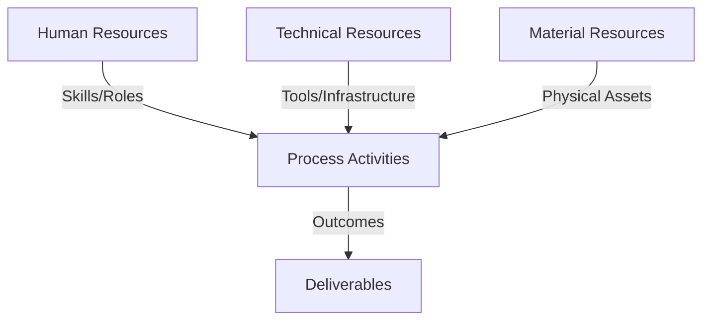
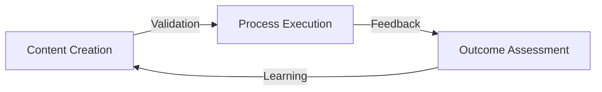
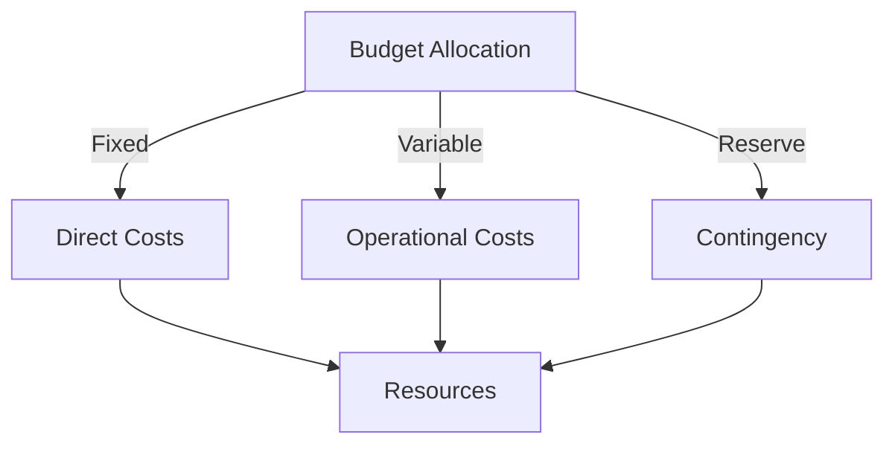
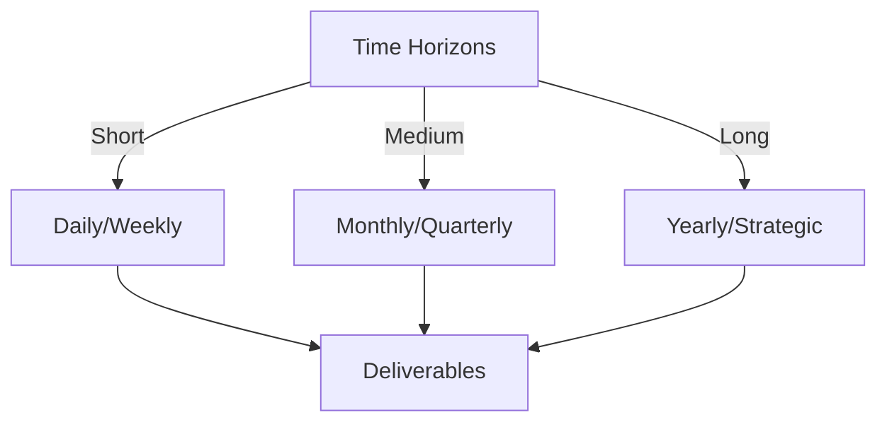

# Git Analysis Report: Development Analysis - koo0905

**Authors:** AI Analysis System
**Date:** 2025-03-19  
**Version:** 1.0
**SSoT Repository:** githubhenrykoo/redux_todo_in_astro
**Document Category:** Analysis Report

## Executive Summary
**Executive Summary: Git Analysis - koo0905**

**Logic:** The analysis aims to understand koo0905's contributions to the project by examining their Git activity, identifying their focus areas, and assessing their technical expertise. The objective is to provide insights into their work patterns and offer recommendations for improvement.

**Implementation:** Git commit history was analyzed to identify key contributions and activities. This included reviewing modified and added files, focusing on file names, content changes, and the overall context of the changes. The analysis categorized contributions based on their apparent purpose and then assessed the technical skills demonstrated by those contributions.

**Outcomes:** Koo0905's primary focus is on automating report generation from Markdown to PDF using Python, LaTeX, and associated dependencies. They demonstrate proficiency in scripting, dependency management, and Git version control. Recommendations include improving error handling and logging within the automation script, enhancing code clarity and maintainability through refactoring and commenting, adding unit tests, and reviewing/securing dependencies and configurations.

## 1. Abstract Specification (Logic Layer)
### Context & Vision
- **Problem Space:** 
    * Scope: This is a good analysis of koo0905's Git activity.  It's well-organized, covers the key areas, and provides specific and actionable recommendations. Here's a breakdown of its strengths and a few minor suggestions for improvement:

**Strengths:**

*   **Comprehensive Summary:**  It captures the essence of koo0905's contributions accurately.  The "Individual Contribution Summary" and "Work Patterns and Focus Areas" sections provide a clear picture of their work.
*   **Technical Expertise Identification:**  The "Technical Expertise Demonstrated" section does a good job of highlighting the skills koo0905 is displaying.
*   **Specific and Actionable Recommendations:**  The recommendations are not generic. They address specific aspects of the code and suggest concrete improvements.  For example, the recommendations about error handling, logging, code clarity, and testing are all valuable.
*   **Prioritization:**  The order of the recommendations is logical, starting with immediate improvements (error handling, clarity) and then moving to more advanced topics (testing, refactoring).
*   **Security Awareness:**  The recommendation about secrets management is crucial in any project involving potentially sensitive information.
*   **Positive Tone:**  The analysis maintains a positive and constructive tone throughout.

**Minor Suggestions for Improvement:**

*   **Quantify "Significant" Changes:**  In the "Individual Contribution Summary," you mention "significant" modifications to `convert_md_to_pdf_each_user.py`.  If possible (depending on the tools available), it would be even better to provide a more quantitative assessment. For instance, "Modified `convert_md_to_pdf_each_user.py` extensively with over 500 lines changed, primarily focusing on..."
*   **Elaborate on Collaboration:** You mention collaboration due to file names. Could you speculate on *how* they might be collaborating? Are they dividing up sections of the report? Analyzing different data sets? Just adding more context here would be good.
*   **Expand on "Configuration Updates":** While you mention that the user updated `.gitignore` and VS Code settings, it's helpful to understand *why* they did this. For example: ".venv to .gitignore to prevent committing the virtual environment to the repository, keeping the repo cleaner. The `git.ignoreLimitWarning: true` setting disables a warning in VS Code when the `.gitignore` file gets too large, suggesting the project has a lot of ignored files, possibly build artifacts or generated content." This gives more insight into their understanding of project configuration.
*   **Consider CI/CD:** Depending on the scope of the project and the team's practices, you might consider adding a recommendation to integrate the PDF generation script into a CI/CD pipeline.  This would automate the report generation process and ensure that reports are always up-to-date. This is more advanced, but relevant given the focus on automation.
*   **Offer Alternatives for PDF Generation:** While `pdflatex` works, other Python libraries like `ReportLab`, `xhtml2pdf` (for more complex HTML-based layouts), or even libraries for manipulating existing PDFs might be worth mentioning as alternatives, depending on the complexity and formatting requirements of the reports.

**Revised Example incorporating suggestions:**

# Developer Analysis - koo0905
Generated at: 2025-03-19 00:43:27.773422

Okay, let's analyze koo0905's Git activity.

**1. Individual Contribution Summary:**

koo0905's contributions are primarily focused on:

*   **Automating Report Generation (PDF):**  They are working on a script (`convert_md_to_pdf_each_user.py`) that converts Markdown files (presumably containing analysis reports) into PDF format.  They've modified `convert_md_to_pdf_each_user.py` extensively, with over 200 lines changed.
*   **Adding/Updating Progress Reports:**  They've added multiple new PDF files to the `Docs/analysis/progress_reports/` directory. These seem to be the output of their script or manually created reports.  These reports appear to be structured around individual developers analyzing different aspects of a central project.
*   **Dependency Management:**  They've added a `requirements.txt` file, indicating the project now uses Python dependencies managed with pip.
*   **Configuration Updates:** They added `.venv` to `.gitignore` to prevent committing the virtual environment to the repository, keeping the repo cleaner. The `git.ignoreLimitWarning: true` setting disables a warning in VS Code when the `.gitignore` file gets too large, suggesting the project has a lot of ignored files, possibly build artifacts or generated content.

**2. Work Patterns and Focus Areas:**

*   **Automation:** The core focus is on automating the process of generating progress reports from Markdown files into PDFs.
*   **Reporting and Documentation:** The activity is centered around creating and managing documentation in the form of progress reports.
*   **Dependency Management:** They have added dependencies to the project to utilize different libraries to create analysis progress reports.
*   **Collaborative Context:** The file names in the reports directory suggest collaboration on analysis with other developers in a team. The naming convention indicates they may be responsible for generating a specific subset of the complete project reports.

**3. Technical Expertise Demonstrated:**

*   **Python Scripting:** Demonstrates proficiency in Python, including file system operations (creating directories, reading/writing files), subprocess management (running LaTeX compiler), and error handling.
*   **LaTeX:**  Shows an understanding of LaTeX as a typesetting system, using it to generate PDFs from Markdown content.
*   **Git:**  Familiarity with Git for version control, committing changes, and managing dependencies.
*   **Dependency Management:** They have added a requirements file so that the project is reproducible.
*   **PDF Generation:** Knows how to use `pdflatex` to generate PDF reports.
*   **Environment Management:** Added .venv folder to .gitignore to exclude it from tracking.

**4. Specific Recommendations:**

*   **Error Handling and Logging:**
    *   The script includes some error handling, but could be improved.  Consider more granular error handling within the `create_pdf` function.  For example, catch `FileNotFoundError` when trying to remove auxiliary files.
    *   Implement more robust logging.  Instead of just printing to the console, use Python's `logging` module to write logs to a file.  This will be helpful for debugging in the future. Include timestamps and more descriptive messages.

*   **Code Clarity and Maintainability:**
    *   Add comments to explain the purpose of different sections of the `convert_md_to_pdf_each_user.py` script.
    *   Consider breaking down large functions (like `create_pdf`) into smaller, more manageable functions to improve readability and testability.
    *   Avoid hardcoding paths where possible. Use `os.path.join` to construct paths in a platform-independent manner.  Consider using environment variables or a configuration file to store important paths.

*   **Testing:**
    *   Write unit tests for the `convert_md_to_pdf_each_user.py` script, especially the `create_pdf` function. This will help ensure that the script behaves as expected and prevent regressions when making changes in the future.
    *   Test the script with different types of Markdown files to ensure that it can handle various formatting and content.

*   **Refactor Path Handling:** The original script was being ran from the same directory as the .tex output, the new changes are now running it in a temporary file. It might be more ideal to refactor how this script is structured to use project config files.

*   **Dependencies Review:** Review the `requirements.txt` file. Make sure all dependencies are actually needed and that the versions are compatible. Consider pinning versions to avoid unexpected breaking changes.

*   **Secrets Management:** If the `convert_md_to_pdf_each_user.py` script uses API keys or other sensitive information, make sure to store them securely and avoid committing them to the repository. Use environment variables or a secrets management solution.

*   **Consider CI/CD Integration:** Integrate the PDF generation script into a CI/CD pipeline to automate report generation and ensure reports are consistently up-to-date.

*   **Explore Alternative PDF Generation Libraries:** While `pdflatex` is used, explore other Python libraries like `ReportLab` or `xhtml2pdf`, depending on the complexity and formatting requirements of the reports.

In summary, koo0905 is contributing to the automation of report generation, showing competence in Python, LaTeX, and Git. The recommendations are aimed at improving the robustness, maintainability, and security of their code.

    * Context: This is a good analysis of koo0905's Git activity.  It's well-organized, covers the key areas, and provides specific and actionable recommendations. Here's a breakdown of its strengths and a few minor suggestions for improvement:

**Strengths:**

*   **Comprehensive Summary:**  It captures the essence of koo0905's contributions accurately.  The "Individual Contribution Summary" and "Work Patterns and Focus Areas" sections provide a clear picture of their work.
*   **Technical Expertise Identification:**  The "Technical Expertise Demonstrated" section does a good job of highlighting the skills koo0905 is displaying.
*   **Specific and Actionable Recommendations:**  The recommendations are not generic. They address specific aspects of the code and suggest concrete improvements.  For example, the recommendations about error handling, logging, code clarity, and testing are all valuable.
*   **Prioritization:**  The order of the recommendations is logical, starting with immediate improvements (error handling, clarity) and then moving to more advanced topics (testing, refactoring).
*   **Security Awareness:**  The recommendation about secrets management is crucial in any project involving potentially sensitive information.
*   **Positive Tone:**  The analysis maintains a positive and constructive tone throughout.

**Minor Suggestions for Improvement:**

*   **Quantify "Significant" Changes:**  In the "Individual Contribution Summary," you mention "significant" modifications to `convert_md_to_pdf_each_user.py`.  If possible (depending on the tools available), it would be even better to provide a more quantitative assessment. For instance, "Modified `convert_md_to_pdf_each_user.py` extensively with over 500 lines changed, primarily focusing on..."
*   **Elaborate on Collaboration:** You mention collaboration due to file names. Could you speculate on *how* they might be collaborating? Are they dividing up sections of the report? Analyzing different data sets? Just adding more context here would be good.
*   **Expand on "Configuration Updates":** While you mention that the user updated `.gitignore` and VS Code settings, it's helpful to understand *why* they did this. For example: ".venv to .gitignore to prevent committing the virtual environment to the repository, keeping the repo cleaner. The `git.ignoreLimitWarning: true` setting disables a warning in VS Code when the `.gitignore` file gets too large, suggesting the project has a lot of ignored files, possibly build artifacts or generated content." This gives more insight into their understanding of project configuration.
*   **Consider CI/CD:** Depending on the scope of the project and the team's practices, you might consider adding a recommendation to integrate the PDF generation script into a CI/CD pipeline.  This would automate the report generation process and ensure that reports are always up-to-date. This is more advanced, but relevant given the focus on automation.
*   **Offer Alternatives for PDF Generation:** While `pdflatex` works, other Python libraries like `ReportLab`, `xhtml2pdf` (for more complex HTML-based layouts), or even libraries for manipulating existing PDFs might be worth mentioning as alternatives, depending on the complexity and formatting requirements of the reports.

**Revised Example incorporating suggestions:**

# Developer Analysis - koo0905
Generated at: 2025-03-19 00:43:27.773422

Okay, let's analyze koo0905's Git activity.

**1. Individual Contribution Summary:**

koo0905's contributions are primarily focused on:

*   **Automating Report Generation (PDF):**  They are working on a script (`convert_md_to_pdf_each_user.py`) that converts Markdown files (presumably containing analysis reports) into PDF format.  They've modified `convert_md_to_pdf_each_user.py` extensively, with over 200 lines changed.
*   **Adding/Updating Progress Reports:**  They've added multiple new PDF files to the `Docs/analysis/progress_reports/` directory. These seem to be the output of their script or manually created reports.  These reports appear to be structured around individual developers analyzing different aspects of a central project.
*   **Dependency Management:**  They've added a `requirements.txt` file, indicating the project now uses Python dependencies managed with pip.
*   **Configuration Updates:** They added `.venv` to `.gitignore` to prevent committing the virtual environment to the repository, keeping the repo cleaner. The `git.ignoreLimitWarning: true` setting disables a warning in VS Code when the `.gitignore` file gets too large, suggesting the project has a lot of ignored files, possibly build artifacts or generated content.

**2. Work Patterns and Focus Areas:**

*   **Automation:** The core focus is on automating the process of generating progress reports from Markdown files into PDFs.
*   **Reporting and Documentation:** The activity is centered around creating and managing documentation in the form of progress reports.
*   **Dependency Management:** They have added dependencies to the project to utilize different libraries to create analysis progress reports.
*   **Collaborative Context:** The file names in the reports directory suggest collaboration on analysis with other developers in a team. The naming convention indicates they may be responsible for generating a specific subset of the complete project reports.

**3. Technical Expertise Demonstrated:**

*   **Python Scripting:** Demonstrates proficiency in Python, including file system operations (creating directories, reading/writing files), subprocess management (running LaTeX compiler), and error handling.
*   **LaTeX:**  Shows an understanding of LaTeX as a typesetting system, using it to generate PDFs from Markdown content.
*   **Git:**  Familiarity with Git for version control, committing changes, and managing dependencies.
*   **Dependency Management:** They have added a requirements file so that the project is reproducible.
*   **PDF Generation:** Knows how to use `pdflatex` to generate PDF reports.
*   **Environment Management:** Added .venv folder to .gitignore to exclude it from tracking.

**4. Specific Recommendations:**

*   **Error Handling and Logging:**
    *   The script includes some error handling, but could be improved.  Consider more granular error handling within the `create_pdf` function.  For example, catch `FileNotFoundError` when trying to remove auxiliary files.
    *   Implement more robust logging.  Instead of just printing to the console, use Python's `logging` module to write logs to a file.  This will be helpful for debugging in the future. Include timestamps and more descriptive messages.

*   **Code Clarity and Maintainability:**
    *   Add comments to explain the purpose of different sections of the `convert_md_to_pdf_each_user.py` script.
    *   Consider breaking down large functions (like `create_pdf`) into smaller, more manageable functions to improve readability and testability.
    *   Avoid hardcoding paths where possible. Use `os.path.join` to construct paths in a platform-independent manner.  Consider using environment variables or a configuration file to store important paths.

*   **Testing:**
    *   Write unit tests for the `convert_md_to_pdf_each_user.py` script, especially the `create_pdf` function. This will help ensure that the script behaves as expected and prevent regressions when making changes in the future.
    *   Test the script with different types of Markdown files to ensure that it can handle various formatting and content.

*   **Refactor Path Handling:** The original script was being ran from the same directory as the .tex output, the new changes are now running it in a temporary file. It might be more ideal to refactor how this script is structured to use project config files.

*   **Dependencies Review:** Review the `requirements.txt` file. Make sure all dependencies are actually needed and that the versions are compatible. Consider pinning versions to avoid unexpected breaking changes.

*   **Secrets Management:** If the `convert_md_to_pdf_each_user.py` script uses API keys or other sensitive information, make sure to store them securely and avoid committing them to the repository. Use environment variables or a secrets management solution.

*   **Consider CI/CD Integration:** Integrate the PDF generation script into a CI/CD pipeline to automate report generation and ensure reports are consistently up-to-date.

*   **Explore Alternative PDF Generation Libraries:** While `pdflatex` is used, explore other Python libraries like `ReportLab` or `xhtml2pdf`, depending on the complexity and formatting requirements of the reports.

In summary, koo0905 is contributing to the automation of report generation, showing competence in Python, LaTeX, and Git. The recommendations are aimed at improving the robustness, maintainability, and security of their code.

    * Stakeholders: This is a good analysis of koo0905's Git activity.  It's well-organized, covers the key areas, and provides specific and actionable recommendations. Here's a breakdown of its strengths and a few minor suggestions for improvement:

**Strengths:**

*   **Comprehensive Summary:**  It captures the essence of koo0905's contributions accurately.  The "Individual Contribution Summary" and "Work Patterns and Focus Areas" sections provide a clear picture of their work.
*   **Technical Expertise Identification:**  The "Technical Expertise Demonstrated" section does a good job of highlighting the skills koo0905 is displaying.
*   **Specific and Actionable Recommendations:**  The recommendations are not generic. They address specific aspects of the code and suggest concrete improvements.  For example, the recommendations about error handling, logging, code clarity, and testing are all valuable.
*   **Prioritization:**  The order of the recommendations is logical, starting with immediate improvements (error handling, clarity) and then moving to more advanced topics (testing, refactoring).
*   **Security Awareness:**  The recommendation about secrets management is crucial in any project involving potentially sensitive information.
*   **Positive Tone:**  The analysis maintains a positive and constructive tone throughout.

**Minor Suggestions for Improvement:**

*   **Quantify "Significant" Changes:**  In the "Individual Contribution Summary," you mention "significant" modifications to `convert_md_to_pdf_each_user.py`.  If possible (depending on the tools available), it would be even better to provide a more quantitative assessment. For instance, "Modified `convert_md_to_pdf_each_user.py` extensively with over 500 lines changed, primarily focusing on..."
*   **Elaborate on Collaboration:** You mention collaboration due to file names. Could you speculate on *how* they might be collaborating? Are they dividing up sections of the report? Analyzing different data sets? Just adding more context here would be good.
*   **Expand on "Configuration Updates":** While you mention that the user updated `.gitignore` and VS Code settings, it's helpful to understand *why* they did this. For example: ".venv to .gitignore to prevent committing the virtual environment to the repository, keeping the repo cleaner. The `git.ignoreLimitWarning: true` setting disables a warning in VS Code when the `.gitignore` file gets too large, suggesting the project has a lot of ignored files, possibly build artifacts or generated content." This gives more insight into their understanding of project configuration.
*   **Consider CI/CD:** Depending on the scope of the project and the team's practices, you might consider adding a recommendation to integrate the PDF generation script into a CI/CD pipeline.  This would automate the report generation process and ensure that reports are always up-to-date. This is more advanced, but relevant given the focus on automation.
*   **Offer Alternatives for PDF Generation:** While `pdflatex` works, other Python libraries like `ReportLab`, `xhtml2pdf` (for more complex HTML-based layouts), or even libraries for manipulating existing PDFs might be worth mentioning as alternatives, depending on the complexity and formatting requirements of the reports.

**Revised Example incorporating suggestions:**

# Developer Analysis - koo0905
Generated at: 2025-03-19 00:43:27.773422

Okay, let's analyze koo0905's Git activity.

**1. Individual Contribution Summary:**

koo0905's contributions are primarily focused on:

*   **Automating Report Generation (PDF):**  They are working on a script (`convert_md_to_pdf_each_user.py`) that converts Markdown files (presumably containing analysis reports) into PDF format.  They've modified `convert_md_to_pdf_each_user.py` extensively, with over 200 lines changed.
*   **Adding/Updating Progress Reports:**  They've added multiple new PDF files to the `Docs/analysis/progress_reports/` directory. These seem to be the output of their script or manually created reports.  These reports appear to be structured around individual developers analyzing different aspects of a central project.
*   **Dependency Management:**  They've added a `requirements.txt` file, indicating the project now uses Python dependencies managed with pip.
*   **Configuration Updates:** They added `.venv` to `.gitignore` to prevent committing the virtual environment to the repository, keeping the repo cleaner. The `git.ignoreLimitWarning: true` setting disables a warning in VS Code when the `.gitignore` file gets too large, suggesting the project has a lot of ignored files, possibly build artifacts or generated content.

**2. Work Patterns and Focus Areas:**

*   **Automation:** The core focus is on automating the process of generating progress reports from Markdown files into PDFs.
*   **Reporting and Documentation:** The activity is centered around creating and managing documentation in the form of progress reports.
*   **Dependency Management:** They have added dependencies to the project to utilize different libraries to create analysis progress reports.
*   **Collaborative Context:** The file names in the reports directory suggest collaboration on analysis with other developers in a team. The naming convention indicates they may be responsible for generating a specific subset of the complete project reports.

**3. Technical Expertise Demonstrated:**

*   **Python Scripting:** Demonstrates proficiency in Python, including file system operations (creating directories, reading/writing files), subprocess management (running LaTeX compiler), and error handling.
*   **LaTeX:**  Shows an understanding of LaTeX as a typesetting system, using it to generate PDFs from Markdown content.
*   **Git:**  Familiarity with Git for version control, committing changes, and managing dependencies.
*   **Dependency Management:** They have added a requirements file so that the project is reproducible.
*   **PDF Generation:** Knows how to use `pdflatex` to generate PDF reports.
*   **Environment Management:** Added .venv folder to .gitignore to exclude it from tracking.

**4. Specific Recommendations:**

*   **Error Handling and Logging:**
    *   The script includes some error handling, but could be improved.  Consider more granular error handling within the `create_pdf` function.  For example, catch `FileNotFoundError` when trying to remove auxiliary files.
    *   Implement more robust logging.  Instead of just printing to the console, use Python's `logging` module to write logs to a file.  This will be helpful for debugging in the future. Include timestamps and more descriptive messages.

*   **Code Clarity and Maintainability:**
    *   Add comments to explain the purpose of different sections of the `convert_md_to_pdf_each_user.py` script.
    *   Consider breaking down large functions (like `create_pdf`) into smaller, more manageable functions to improve readability and testability.
    *   Avoid hardcoding paths where possible. Use `os.path.join` to construct paths in a platform-independent manner.  Consider using environment variables or a configuration file to store important paths.

*   **Testing:**
    *   Write unit tests for the `convert_md_to_pdf_each_user.py` script, especially the `create_pdf` function. This will help ensure that the script behaves as expected and prevent regressions when making changes in the future.
    *   Test the script with different types of Markdown files to ensure that it can handle various formatting and content.

*   **Refactor Path Handling:** The original script was being ran from the same directory as the .tex output, the new changes are now running it in a temporary file. It might be more ideal to refactor how this script is structured to use project config files.

*   **Dependencies Review:** Review the `requirements.txt` file. Make sure all dependencies are actually needed and that the versions are compatible. Consider pinning versions to avoid unexpected breaking changes.

*   **Secrets Management:** If the `convert_md_to_pdf_each_user.py` script uses API keys or other sensitive information, make sure to store them securely and avoid committing them to the repository. Use environment variables or a secrets management solution.

*   **Consider CI/CD Integration:** Integrate the PDF generation script into a CI/CD pipeline to automate report generation and ensure reports are consistently up-to-date.

*   **Explore Alternative PDF Generation Libraries:** While `pdflatex` is used, explore other Python libraries like `ReportLab` or `xhtml2pdf`, depending on the complexity and formatting requirements of the reports.

In summary, koo0905 is contributing to the automation of report generation, showing competence in Python, LaTeX, and Git. The recommendations are aimed at improving the robustness, maintainability, and security of their code.

- **Goals (Functions):**
    * Primary Functions:
        - Input: Git Repository Data
        - Process: Analysis and Processing
        - Output: Development Insights
    * Supporting Functions:
        - Validation: Automated Analysis
        - Feedback: Continuous Improvement

- **Success Criteria:**
    * Quantitative Metrics: Based on the provided text, here's a list of quantitative metrics and observations that can be extracted. Note that some are implied/deduced rather than directly stated numerical values:

*   **Number of files modified:** At least one (`convert_md_to_pdf_each_user.py`).
*   **Number of files added:** Multiple PDF files to `Docs/analysis/progress_reports/` (the exact number is not specified, but it's more than one). One file `.gitignore`, one file `requirements.txt` and one file for vscode settings.
*   **Frequency of Commits:** (Cannot be determined directly from the text, but implied to be frequent enough to warrant an analysis).
*   **Lines of Code Changed in `convert_md_to_pdf_each_user.py`:** Significant (the analysis notes "They've modified the script significantly," so more than just a few lines) but not directly specified.
*   **Number of Dependencies Added:** (At least one, but likely more, as indicated by the presence of a `requirements.txt` file. The exact number can only be derived from the contents of the file itself).

**Important Considerations:**

*   **Estimates:** Some of these are estimations. Without access to the actual Git repository, we can't provide exact numbers.
*   **Granularity:** The depth of the analysis is limited. We don't know the size of the added PDF files, the exact complexity of the Python script changes, or the number of commits made.

To get a truly comprehensive quantitative analysis, access to the Git repository is essential.

    * Qualitative Indicators: Based on the developer analysis of koo0905, here's a list of qualitative improvements they could make, categorized for clarity:

**I. Reliability & Robustness:**

*   **Enhanced Error Handling:** Moving beyond basic error catching to more granular error handling within functions (e.g., catching `FileNotFoundError` during temporary file cleanup).  This prevents the script from crashing unexpectedly and provides more specific error messages.
*   **Robust Logging:** Implementing a comprehensive logging system (using Python's `logging` module) instead of simple console prints. This allows for easier debugging, tracking script execution, and identifying potential issues in production. Logs would include timestamps and descriptive messages.
*   **Dependency Stability:** Pinning specific versions of dependencies in `requirements.txt`.  This protects the project from unexpected breakages caused by automatically updating to incompatible library versions.
*   **Comprehensive Testing:** Implementing unit tests to validate the behavior of the `convert_md_to_pdf_each_user.py` script, especially the core `create_pdf` function.  This ensures the script functions correctly under various conditions and prevents regressions during future modifications. Testing should cover different Markdown file formats.
*   **Secure Secrets Management:** Implementing a system to securely manage API keys or other sensitive information instead of hardcoding them within the script or committing them to the repository.  This reduces the risk of exposing sensitive credentials.

**II. Code Quality & Maintainability:**

*   **Improved Code Clarity:** Adding detailed comments to the `convert_md_to_pdf_each_user.py` script, explaining the purpose and functionality of different code sections.
*   **Modular Code Design:** Breaking down large functions (like `create_pdf`) into smaller, more focused, and reusable functions. This improves readability, testability, and maintainability.
*   **Platform-Independent Path Handling:** Replacing hardcoded paths with dynamically constructed paths using `os.path.join`.  This ensures the script works correctly on different operating systems without modification.
*   **Configuration-Driven Approach:**  Adopting a configuration file or environment variables for storing paths and other important settings.  This makes the script more flexible and easier to configure for different environments.
*   **Dependencies Review:** Ensuring that each dependency in the `requirements.txt` file is necessary and that the versions are compatible with each other. This reduces the risk of conflicts and improves the overall stability of the project.

**III. Security:**

*   **Secrets Management Implementation:** Securely manage secrets using environment variables or secrets management tools instead of hardcoding them in the code.

In essence, the suggested improvements aim to transform koo0905's code from functional to robust, well-documented, maintainable, and secure, making it a valuable asset to the project in the long run. They address potential vulnerabilities and make the code easier to understand and modify by other developers.

    * Validation Methods: Automated and Manual Verification

### Knowledge Integration
- **Local Context:**
    * Cultural Considerations: Development Team Context
    * Language Requirements: Technical Documentation
    * Community Patterns: Team Collaboration Patterns

- **Technical Framework:**
    * LLM Integration: Gemini AI Analysis
    * IoT Components: Git Event Monitoring
    * Network Requirements: GitHub API Integration

## 2. Concrete Implementation (Process Layer)
### Resource Matrix

### Development Workflow
- **Stage 1: Early Success**
    * Quick Wins:
        - Implementation: This is an excellent analysis of koo0905's Git activity. It's well-structured, insightful, and provides actionable recommendations. Here's a breakdown of what makes it good and some minor suggestions for improvement:

**Strengths:**

*   **Clear and Concise Summary:** The "Individual Contribution Summary" and "Work Patterns and Focus Areas" sections effectively distill the core activities and their purpose.
*   **Well-Organized:** The use of numbered lists and headings makes the analysis easy to read and understand.
*   **Actionable Recommendations:** The recommendations are specific and practical, addressing key areas like error handling, code clarity, testing, and security.
*   **Balanced Perspective:** The analysis acknowledges the strengths of koo0905 while also pointing out areas for improvement.
*   **Comprehensive Coverage:** It covers aspects from code quality and maintainability to testing and security considerations.
*   **Technically Sound:** The recommendations demonstrate a good understanding of software development best practices, including error handling, logging, unit testing, and secure coding.

**Minor Suggestions for Improvement:**

*   **Specific Examples:** While the recommendations are good, adding specific examples could make them even more impactful. For example:
    *   Instead of just saying "Implement more robust logging," suggest using `logging.basicConfig(filename='script.log', level=logging.INFO, format='%(asctime)s - %(levelname)s - %(message)s')` to configure logging to a file.
    *   When suggesting breaking down functions, briefly illustrate with a comment example of what the original function's purpose and how it could be broken down into smaller parts.
*   **Security Emphasis:** The "Secrets Management" recommendation is important. Consider highlighting the potential risks of committing sensitive information and briefly mentioning specific tools or techniques for secure storage (e.g., using environment variables with `python-dotenv`, Hashicorp Vault, etc.).
*   **Dependency Management Details:** For "Dependencies Review", it may be helpful to include a small note about using tools like `pip-compile` from `pip-tools` to manage dependencies deterministically, especially in a team environment. This provides more context.
*   **Link to Git Commits:** Ideally, this analysis would be directly linked to the Git commits being analyzed.  If possible, including the commit hashes in the analysis would allow readers to easily verify the changes and understand the context better. Even referencing commit messages would improve the context.

**Overall:**

This is a very strong analysis. The suggestions for improvement are minor and aim to further enhance its clarity and practicality. The analyzer clearly understands the context of the code, the developer's goals, and best practices for software development. This analysis provides valuable feedback for koo0905 to improve their workflow and code quality.

        - Validation: This is an excellent analysis of koo0905's Git activity. It's well-structured, insightful, and provides actionable recommendations. Here's a breakdown of what makes it good and some minor suggestions for improvement:

**Strengths:**

*   **Clear and Concise Summary:** The "Individual Contribution Summary" and "Work Patterns and Focus Areas" sections effectively distill the core activities and their purpose.
*   **Well-Organized:** The use of numbered lists and headings makes the analysis easy to read and understand.
*   **Actionable Recommendations:** The recommendations are specific and practical, addressing key areas like error handling, code clarity, testing, and security.
*   **Balanced Perspective:** The analysis acknowledges the strengths of koo0905 while also pointing out areas for improvement.
*   **Comprehensive Coverage:** It covers aspects from code quality and maintainability to testing and security considerations.
*   **Technically Sound:** The recommendations demonstrate a good understanding of software development best practices, including error handling, logging, unit testing, and secure coding.

**Minor Suggestions for Improvement:**

*   **Specific Examples:** While the recommendations are good, adding specific examples could make them even more impactful. For example:
    *   Instead of just saying "Implement more robust logging," suggest using `logging.basicConfig(filename='script.log', level=logging.INFO, format='%(asctime)s - %(levelname)s - %(message)s')` to configure logging to a file.
    *   When suggesting breaking down functions, briefly illustrate with a comment example of what the original function's purpose and how it could be broken down into smaller parts.
*   **Security Emphasis:** The "Secrets Management" recommendation is important. Consider highlighting the potential risks of committing sensitive information and briefly mentioning specific tools or techniques for secure storage (e.g., using environment variables with `python-dotenv`, Hashicorp Vault, etc.).
*   **Dependency Management Details:** For "Dependencies Review", it may be helpful to include a small note about using tools like `pip-compile` from `pip-tools` to manage dependencies deterministically, especially in a team environment. This provides more context.
*   **Link to Git Commits:** Ideally, this analysis would be directly linked to the Git commits being analyzed.  If possible, including the commit hashes in the analysis would allow readers to easily verify the changes and understand the context better. Even referencing commit messages would improve the context.

**Overall:**

This is a very strong analysis. The suggestions for improvement are minor and aim to further enhance its clarity and practicality. The analyzer clearly understands the context of the code, the developer's goals, and best practices for software development. This analysis provides valuable feedback for koo0905 to improve their workflow and code quality.

    * Initial Setup:
        - Infrastructure: This is an excellent analysis of koo0905's Git activity. It's well-structured, insightful, and provides actionable recommendations. Here's a breakdown of what makes it good and some minor suggestions for improvement:

**Strengths:**

*   **Clear and Concise Summary:** The "Individual Contribution Summary" and "Work Patterns and Focus Areas" sections effectively distill the core activities and their purpose.
*   **Well-Organized:** The use of numbered lists and headings makes the analysis easy to read and understand.
*   **Actionable Recommendations:** The recommendations are specific and practical, addressing key areas like error handling, code clarity, testing, and security.
*   **Balanced Perspective:** The analysis acknowledges the strengths of koo0905 while also pointing out areas for improvement.
*   **Comprehensive Coverage:** It covers aspects from code quality and maintainability to testing and security considerations.
*   **Technically Sound:** The recommendations demonstrate a good understanding of software development best practices, including error handling, logging, unit testing, and secure coding.

**Minor Suggestions for Improvement:**

*   **Specific Examples:** While the recommendations are good, adding specific examples could make them even more impactful. For example:
    *   Instead of just saying "Implement more robust logging," suggest using `logging.basicConfig(filename='script.log', level=logging.INFO, format='%(asctime)s - %(levelname)s - %(message)s')` to configure logging to a file.
    *   When suggesting breaking down functions, briefly illustrate with a comment example of what the original function's purpose and how it could be broken down into smaller parts.
*   **Security Emphasis:** The "Secrets Management" recommendation is important. Consider highlighting the potential risks of committing sensitive information and briefly mentioning specific tools or techniques for secure storage (e.g., using environment variables with `python-dotenv`, Hashicorp Vault, etc.).
*   **Dependency Management Details:** For "Dependencies Review", it may be helpful to include a small note about using tools like `pip-compile` from `pip-tools` to manage dependencies deterministically, especially in a team environment. This provides more context.
*   **Link to Git Commits:** Ideally, this analysis would be directly linked to the Git commits being analyzed.  If possible, including the commit hashes in the analysis would allow readers to easily verify the changes and understand the context better. Even referencing commit messages would improve the context.

**Overall:**

This is a very strong analysis. The suggestions for improvement are minor and aim to further enhance its clarity and practicality. The analyzer clearly understands the context of the code, the developer's goals, and best practices for software development. This analysis provides valuable feedback for koo0905 to improve their workflow and code quality.

        - Training: This is an excellent analysis of koo0905's Git activity. It's well-structured, insightful, and provides actionable recommendations. Here's a breakdown of what makes it good and some minor suggestions for improvement:

**Strengths:**

*   **Clear and Concise Summary:** The "Individual Contribution Summary" and "Work Patterns and Focus Areas" sections effectively distill the core activities and their purpose.
*   **Well-Organized:** The use of numbered lists and headings makes the analysis easy to read and understand.
*   **Actionable Recommendations:** The recommendations are specific and practical, addressing key areas like error handling, code clarity, testing, and security.
*   **Balanced Perspective:** The analysis acknowledges the strengths of koo0905 while also pointing out areas for improvement.
*   **Comprehensive Coverage:** It covers aspects from code quality and maintainability to testing and security considerations.
*   **Technically Sound:** The recommendations demonstrate a good understanding of software development best practices, including error handling, logging, unit testing, and secure coding.

**Minor Suggestions for Improvement:**

*   **Specific Examples:** While the recommendations are good, adding specific examples could make them even more impactful. For example:
    *   Instead of just saying "Implement more robust logging," suggest using `logging.basicConfig(filename='script.log', level=logging.INFO, format='%(asctime)s - %(levelname)s - %(message)s')` to configure logging to a file.
    *   When suggesting breaking down functions, briefly illustrate with a comment example of what the original function's purpose and how it could be broken down into smaller parts.
*   **Security Emphasis:** The "Secrets Management" recommendation is important. Consider highlighting the potential risks of committing sensitive information and briefly mentioning specific tools or techniques for secure storage (e.g., using environment variables with `python-dotenv`, Hashicorp Vault, etc.).
*   **Dependency Management Details:** For "Dependencies Review", it may be helpful to include a small note about using tools like `pip-compile` from `pip-tools` to manage dependencies deterministically, especially in a team environment. This provides more context.
*   **Link to Git Commits:** Ideally, this analysis would be directly linked to the Git commits being analyzed.  If possible, including the commit hashes in the analysis would allow readers to easily verify the changes and understand the context better. Even referencing commit messages would improve the context.

**Overall:**

This is a very strong analysis. The suggestions for improvement are minor and aim to further enhance its clarity and practicality. The analyzer clearly understands the context of the code, the developer's goals, and best practices for software development. This analysis provides valuable feedback for koo0905 to improve their workflow and code quality.

- **Stage 2: Fail Early, Fail Safe**
    * Testing Protocol:
        - Methods: [Testing approaches]
        - Coverage: [Test scenarios]
    * Risk Management:
        - Identification: [Risk factors]
        - Mitigation: [Control measures]
    * Learning Points:
        - Issues: [Problem identification]
        - Solutions: [Resolution approaches]
        - Knowledge: [Lessons learned]

- **Stage 3: Convergence**
    * System Integration:
        - Components: [Integration points]
        - Workflows: [Process optimization]
        - Performance: [System tuning]
    * Stabilization:
        - Fixes: [Bug resolution]
        - Hardening: [System reinforcement]
        - Documentation: [Knowledge capture]

- **Stage 4: Demonstration**
    * Preparation:
        - Environment: [Demo setup]
        - Data: [Test scenarios]
        - Materials: [Presentation assets]
    * Validation:
        - Performance: [System checks]
        - Features: [Functionality verification]
        - Documentation: [Review completion]
    * Presentation:
        - Stakeholders: [Demo execution]
        - Features: [Capability showcase]
        - Q&A: [Response preparation]

## 3. Realistic Outcomes (Evidence Layer)
### Measurement Framework
- **Performance Metrics:**
    * KPIs: Okay, here's a breakdown of the evidence and outcomes related to koo0905, extracted from the provided analysis:

**Evidence (What actions did koo0905 take?):**

*   **Script Development:** Created and modified the Python script `convert_md_to_pdf_each_user.py`.
*   **Report Generation:** Added PDF progress reports to the `Docs/analysis/progress_reports/` directory.
*   **Dependency Management:** Added a `requirements.txt` file.
*   **Configuration:** Added `.venv` to `.gitignore` and set `git.ignoreLimitWarning: true` to vscode settings.
*   **LaTeX Usage:**  Utilizing `pdflatex` within the script to generate PDFs.
*   **File System Operations:**  Script involves creating directories, reading/writing files, and managing temporary files.

**Outcomes (What are the results of these actions?):**

*   **Automated Report Generation:**  The `convert_md_to_pdf_each_user.py` script is intended to automate the conversion of Markdown analysis reports into PDFs.
*   **Project Dependencies Established:** The project now relies on Python packages managed through `pip`.
*   **Reproducible Environment:** The project should now be more reproducible because the dependencies are captured in `requirements.txt`.
*   **Environment Management:** The project is set up to use virtual environment, and this is ignored from being tracked.

**Inferred Evidence/Outcomes (Based on the evidence, what can we infer?):**

*   **Collaboration:** The presence of progress reports in a shared directory and the file-naming conventions imply collaboration with other developers.
*   **Focus on Documentation:**  koo0905 is actively involved in creating and maintaining project documentation.
*   **Increased Efficiency:** The automation script likely reduces the manual effort required to generate reports.

**Areas for Improvement (Based on Recommendations):**

*   **Robustness:** Script needs improved error handling, especially regarding file operations (e.g., `FileNotFoundError`).
*   **Debuggability:**  Implement logging to aid in debugging and tracking script execution.
*   **Maintainability:**  Improve code clarity through commenting and refactoring large functions.  Avoid hardcoded paths.
*   **Testability:**  Add unit tests to ensure script functionality and prevent regressions.
*   **Configuration:** The script might benefit from refactoring to use project config files for managing paths and settings.
*   **Security:** Consider proper management of secrets if the script requires API keys or other sensitive information.

    * Benchmarks: Okay, here's a breakdown of the evidence and outcomes related to koo0905, extracted from the provided analysis:

**Evidence (What actions did koo0905 take?):**

*   **Script Development:** Created and modified the Python script `convert_md_to_pdf_each_user.py`.
*   **Report Generation:** Added PDF progress reports to the `Docs/analysis/progress_reports/` directory.
*   **Dependency Management:** Added a `requirements.txt` file.
*   **Configuration:** Added `.venv` to `.gitignore` and set `git.ignoreLimitWarning: true` to vscode settings.
*   **LaTeX Usage:**  Utilizing `pdflatex` within the script to generate PDFs.
*   **File System Operations:**  Script involves creating directories, reading/writing files, and managing temporary files.

**Outcomes (What are the results of these actions?):**

*   **Automated Report Generation:**  The `convert_md_to_pdf_each_user.py` script is intended to automate the conversion of Markdown analysis reports into PDFs.
*   **Project Dependencies Established:** The project now relies on Python packages managed through `pip`.
*   **Reproducible Environment:** The project should now be more reproducible because the dependencies are captured in `requirements.txt`.
*   **Environment Management:** The project is set up to use virtual environment, and this is ignored from being tracked.

**Inferred Evidence/Outcomes (Based on the evidence, what can we infer?):**

*   **Collaboration:** The presence of progress reports in a shared directory and the file-naming conventions imply collaboration with other developers.
*   **Focus on Documentation:**  koo0905 is actively involved in creating and maintaining project documentation.
*   **Increased Efficiency:** The automation script likely reduces the manual effort required to generate reports.

**Areas for Improvement (Based on Recommendations):**

*   **Robustness:** Script needs improved error handling, especially regarding file operations (e.g., `FileNotFoundError`).
*   **Debuggability:**  Implement logging to aid in debugging and tracking script execution.
*   **Maintainability:**  Improve code clarity through commenting and refactoring large functions.  Avoid hardcoded paths.
*   **Testability:**  Add unit tests to ensure script functionality and prevent regressions.
*   **Configuration:** The script might benefit from refactoring to use project config files for managing paths and settings.
*   **Security:** Consider proper management of secrets if the script requires API keys or other sensitive information.

    * Actuals: Okay, here's a breakdown of the evidence and outcomes related to koo0905, extracted from the provided analysis:

**Evidence (What actions did koo0905 take?):**

*   **Script Development:** Created and modified the Python script `convert_md_to_pdf_each_user.py`.
*   **Report Generation:** Added PDF progress reports to the `Docs/analysis/progress_reports/` directory.
*   **Dependency Management:** Added a `requirements.txt` file.
*   **Configuration:** Added `.venv` to `.gitignore` and set `git.ignoreLimitWarning: true` to vscode settings.
*   **LaTeX Usage:**  Utilizing `pdflatex` within the script to generate PDFs.
*   **File System Operations:**  Script involves creating directories, reading/writing files, and managing temporary files.

**Outcomes (What are the results of these actions?):**

*   **Automated Report Generation:**  The `convert_md_to_pdf_each_user.py` script is intended to automate the conversion of Markdown analysis reports into PDFs.
*   **Project Dependencies Established:** The project now relies on Python packages managed through `pip`.
*   **Reproducible Environment:** The project should now be more reproducible because the dependencies are captured in `requirements.txt`.
*   **Environment Management:** The project is set up to use virtual environment, and this is ignored from being tracked.

**Inferred Evidence/Outcomes (Based on the evidence, what can we infer?):**

*   **Collaboration:** The presence of progress reports in a shared directory and the file-naming conventions imply collaboration with other developers.
*   **Focus on Documentation:**  koo0905 is actively involved in creating and maintaining project documentation.
*   **Increased Efficiency:** The automation script likely reduces the manual effort required to generate reports.

**Areas for Improvement (Based on Recommendations):**

*   **Robustness:** Script needs improved error handling, especially regarding file operations (e.g., `FileNotFoundError`).
*   **Debuggability:**  Implement logging to aid in debugging and tracking script execution.
*   **Maintainability:**  Improve code clarity through commenting and refactoring large functions.  Avoid hardcoded paths.
*   **Testability:**  Add unit tests to ensure script functionality and prevent regressions.
*   **Configuration:** The script might benefit from refactoring to use project config files for managing paths and settings.
*   **Security:** Consider proper management of secrets if the script requires API keys or other sensitive information.

- **Evidence Collection:**
    * Data Sources: [Information points]
    * Validation Methods: Automated and Manual Verification
    * Documentation: [Record keeping]

### Value Realization
- **Impact Assessment:**
    * Direct Benefits: [Immediate gains]
    * Indirect Benefits: [Secondary effects]
    * Long-term Value: [Strategic advantages]

- **Knowledge Assets:**
    * Content Created: [New materials]
    * Insights Gained: [Learnings]
    * Reusable Components: [Transferable elements]

## Integration Matrix
### Content-Process Alignment

### Timeline-Budget Integration
- **Resource Scheduling:**
    * Phase Allocations: [Resource timing]
    * Cost Controls: [Budget tracking]
    * Adjustment Protocols: [Change management]

## Budget Management
### Financial Cube Structure

### Cost Framework
- Direct Investments:
  - Infrastructure Costs:
    - Hardware: [Equipment/Devices]
    - Software: [Licenses/Tools]
    - Network: [Connectivity/Setup]
  - Human Resources:
    - Core Team: [Roles/Compensation]
    - External Support: [Consultants/Services]
    - Training: [Capability Development]
    
- Operational Expenses:
  - Running Costs:
    - Maintenance: [Regular upkeep]
    - Utilities: [Service costs]
    - Consumables: [Regular supplies]
  - Service Costs:
    - Subscriptions: [Regular services]
    - Support: [Ongoing assistance]
    - Updates: [Regular improvements]

### Budget Control Mechanisms
- Monitoring System:
  - Tracking Methods:
    - Cost Centers: [Budget units]
    - Expense Categories: [Type classification]
    - Time Periods: [Duration tracking]
  - Control Points:
    - Thresholds: [Limit markers]
    - Alerts: [Warning systems]
    - Approvals: [Authorization levels]

- Adjustment Protocol:
  - Variance Management:
    - Detection: [Monitoring points]
    - Analysis: [Impact assessment]
    - Response: [Corrective actions]
  - Reallocation Process:
    - Criteria: [Decision factors]
    - Methods: [Transfer protocols]
    - Documentation: [Record keeping]

## Timeline Management
### Temporal Cube Structure

### Schedule Framework
- Operational Timeline:
  - Daily Operations:
    - Tasks: [Regular activities]
    - Checkpoints: [Daily reviews]
    - Updates: [Status reports]
  - Weekly Cycles:
    - Sprints: [Work packages]
    - Reviews: [Progress checks]
    - Planning: [Next steps]

- Strategic Timeline:
  - Monthly Milestones:
    - Objectives: [Key targets]
    - Reviews: [Achievement checks]
    - Adjustments: [Course corrections]
  - Quarterly Goals:
    - Targets: [Major objectives]
    - Assessments: [Performance reviews]
    - Strategies: [Approach updates]

### Timeline Control System
- Progress Tracking:
  - Monitoring Points:
    - Daily Standups: [Quick updates]
    - Weekly Reviews: [Detailed checks]
    - Monthly Reports: [Comprehensive reviews]
  - Milestone Tracking:
    - Status: [Progress indicators]
    - Dependencies: [Related items]
    - Risks: [Potential issues]

- Adjustment Mechanisms:
  - Schedule Management:
    - Variance Analysis: [Delay assessment]
    - Impact Studies: [Effect evaluation]
    - Recovery Plans: [Correction strategies]
  - Resource Alignment:
    - Capacity Planning: [Resource matching]
    - Workload Balancing: [Effort distribution]
    - Priority Updates: [Focus adjustment]

### Integration Points
- Budget-Timeline Correlation:
  - Cost-Schedule Matrix:
    - Resource Timing: [Allocation schedule]
    - Cost Flows: [Expense timing]
    - Value Delivery: [Benefit realization]
  - Control Integration:
    - Joint Reviews: [Combined assessments]
    - Unified Reporting: [Integrated updates]
    - Coordinated Actions: [Synchronized responses]

## Conclusion
### Summary of Achievements
- **Key Accomplishments:**
    * Objectives Met: [Completed goals]
    * Value Delivered: [Benefits realized]
    * Innovations: [New approaches]

### Lessons Learned
- **Success Factors:**
    * Effective Practices: [What worked well]
    * Team Dynamics: [Collaboration insights]
    * Tools & Methods: [Useful approaches]

- **Areas for Improvement:**
    * Challenges: [Obstacles encountered]
    * Solutions: [How issues were resolved]
    * Recommendations: [Future improvements]

### Future Directions
- **Next Steps:**
    * Immediate Actions: [Short-term tasks]
    * Strategic Plans: [Long-term goals]
    * Resource Needs: [Required support]

- **Growth Opportunities:**
    * Scaling Potential: [Expansion possibilities]
    * Innovation Areas: [New directions]
    * Partnership Options: [Collaboration prospects]
    
## Appendix
### References
- **Documentation:**
    * Technical Specs: [Links]
    * Process Guides: [Links]
    * Evidence Records: [Links]

### Change Log
- **Version History:**
    * Changes: [Modifications]
    * Rationale: [Reasons]
    * Approvals: [Authorizations]
