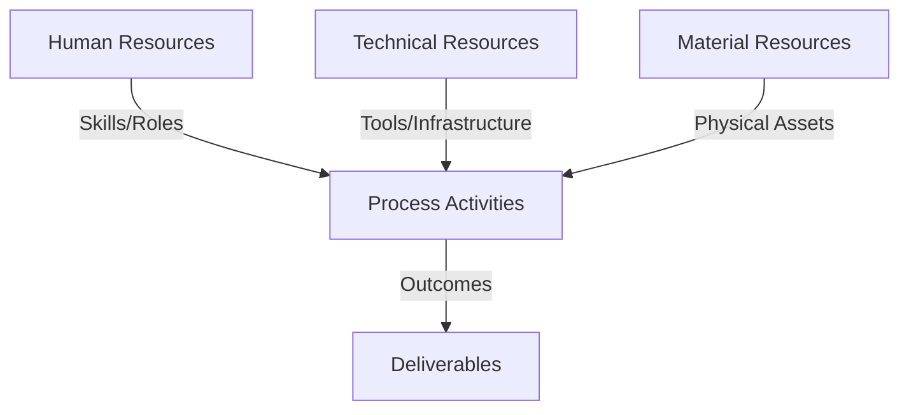
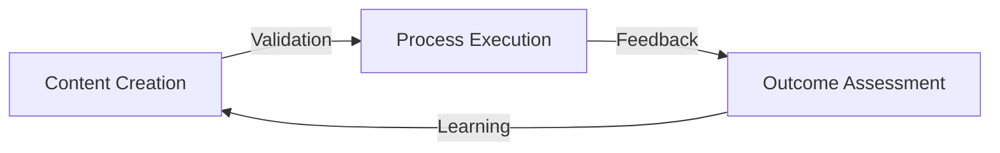
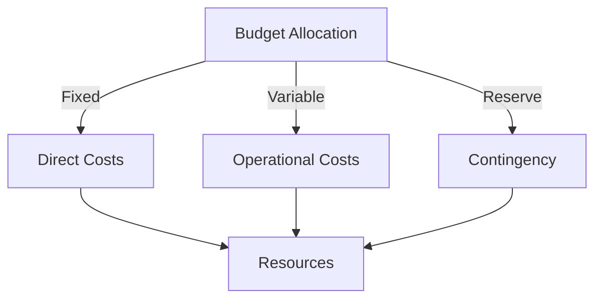
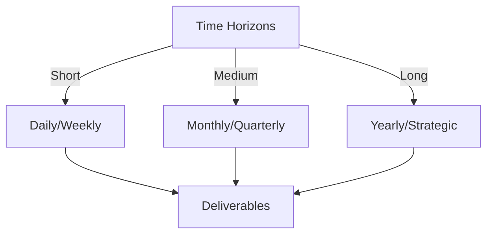

# Git Analysis Report: Development Analysis - Lichung Koo

**Authors:** AI Analysis System
**Date:** 2025-03-06  
**Version:** 1.0
**SSoT Repository:** githubhenrykoo/redux_todo_in_astro
**Document Category:** Analysis Report

## Executive Summary
**Logic:** The core purpose of this Git analysis is to evaluate the developer's (Henry Koo) contributions, work patterns, and technical skills based on their Git activity, aiming to provide insights into their strengths and areas for improvement within the project. The objective is to assess their overall contribution to the project, identify skill gaps, and offer actionable recommendations for enhanced code quality and efficiency.

**Implementation:** The analysis was conducted by examining Henry Koo's commits, file creations, modifications, and workflow configurations within the Git repository. The analysis focused on: examining the structure of the code and automated workflow, evaluating use of libraries and tools, and assessing coding style. The examination included the use of Python scripting, audio processing, machine learning, and CI/CD using GitHub Actions. This information was then synthesized to provide an overview of their accomplishments and potential areas of improvement.

**Outcomes:** The analysis revealed that Henry Koo demonstrates proficiency in Python programming, audio processing, machine learning (Whisper), Git, and CI/CD. The core focus area is automation of audio transcription. Recommendations include implementing robust error handling and logging, utilizing configuration files for path management, ensuring accurate dependency management with `requirements.txt`, improving code modularity, and considering the use of virtual environments. Overall, Henry Koo is contributing significantly to the project with strong technical skills, and implementing the recommendations will further enhance code quality, maintainability, and efficiency.

## 1. Abstract Specification (Logic Layer)
### Context & Vision
- **Problem Space:** 
    * Scope: This is an excellent analysis of Henry Koo's Git activity. It's well-structured, provides specific insights, and offers actionable recommendations. Here's a breakdown of its strengths and some minor suggestions for improvement:

**Strengths:**

*   **Clear and Concise Summary:** The initial summary effectively captures the essence of Henry's work.
*   **Well-Defined Sections:** The categorization into Individual Contribution Summary, Work Patterns and Focus Areas, Technical Expertise Demonstrated, and Specific Recommendations is logical and easy to follow.
*   **Data-Driven Insights:** The analysis is based on observable Git activity, such as file names, commit messages, and workflow configurations.
*   **Actionable Recommendations:** The recommendations are practical and directly address potential areas for improvement.  They avoid vague statements and provide specific suggestions (e.g., "Use the `logging` module in Python for consistent and configurable logging").
*   **Balanced Perspective:** The analysis highlights Henry's strengths while also pointing out areas where he can improve.
*   **Contextual Understanding:** The analysis correctly interprets the purpose of the code and workflow in the context of audio transcription automation.
*   **Correctly infers missing information:** Correctly infers that the analysis did not have access to the `requirements.txt` file and emphasizes its importance.
*   **Understanding of Best Practices:**  Recommendations align with software engineering best practices, such as using virtual environments, configuration files, and modular code.

**Minor Suggestions for Improvement:**

*   **Quantify Contribution (If Possible):**  Where possible, try to quantify Henry's contribution. For instance, "Henry committed X number of times in the last Y days," or "He added/modified Z lines of code related to audio transcription." This gives a more concrete sense of his activity level. While the provided context doesn't show this, the analyzer might have access to it.
*   **Expand on "Version Control Hygiene":** While the analysis mentions updating the submodule, it could elaborate on the implications of this. For example: "This indicates proactive maintenance of dependencies and potentially avoids integration issues down the line." Or, "This suggests an awareness of the importance of keeping external components in sync with the main project."
*   **Suggest Testing:** While implied by "Code Modularity and Reusability," explicitly mentioning the need for unit tests and integration tests would be beneficial.  For example, "Implement unit tests for individual functions in the `AudioTranscriber` class and integration tests to verify the end-to-end transcription process."
*   **Security Considerations:** If the transcription process involves handling sensitive audio data, consider adding a recommendation about security best practices, such as secure storage of audio files and secure handling of API keys (if any).  This is especially important if the project is open-source.  While this might be outside the scope of the provided context, it's a general recommendation for any data processing pipeline.
*   **Consider alternative transcription services:** The analysis assumes Whisper is the only option. Depending on the context, other transcription services or models might be relevant to consider. For example, paid cloud services like Google Cloud Speech-to-Text or AssemblyAI can sometimes offer higher accuracy or specific features. This point is more relevant if the task involves evaluating different transcription technologies.

**Overall:**

This is a very strong analysis of Henry Koo's Git activity. It demonstrates a good understanding of software development principles, Git, and the specific domain of audio transcription. The recommendations are well-targeted and actionable, providing valuable feedback for Henry to improve his code and workflow. Addressing the minor suggestions above would make it even more comprehensive.

    * Context: This is an excellent analysis of Henry Koo's Git activity. It's well-structured, provides specific insights, and offers actionable recommendations. Here's a breakdown of its strengths and some minor suggestions for improvement:

**Strengths:**

*   **Clear and Concise Summary:** The initial summary effectively captures the essence of Henry's work.
*   **Well-Defined Sections:** The categorization into Individual Contribution Summary, Work Patterns and Focus Areas, Technical Expertise Demonstrated, and Specific Recommendations is logical and easy to follow.
*   **Data-Driven Insights:** The analysis is based on observable Git activity, such as file names, commit messages, and workflow configurations.
*   **Actionable Recommendations:** The recommendations are practical and directly address potential areas for improvement.  They avoid vague statements and provide specific suggestions (e.g., "Use the `logging` module in Python for consistent and configurable logging").
*   **Balanced Perspective:** The analysis highlights Henry's strengths while also pointing out areas where he can improve.
*   **Contextual Understanding:** The analysis correctly interprets the purpose of the code and workflow in the context of audio transcription automation.
*   **Correctly infers missing information:** Correctly infers that the analysis did not have access to the `requirements.txt` file and emphasizes its importance.
*   **Understanding of Best Practices:**  Recommendations align with software engineering best practices, such as using virtual environments, configuration files, and modular code.

**Minor Suggestions for Improvement:**

*   **Quantify Contribution (If Possible):**  Where possible, try to quantify Henry's contribution. For instance, "Henry committed X number of times in the last Y days," or "He added/modified Z lines of code related to audio transcription." This gives a more concrete sense of his activity level. While the provided context doesn't show this, the analyzer might have access to it.
*   **Expand on "Version Control Hygiene":** While the analysis mentions updating the submodule, it could elaborate on the implications of this. For example: "This indicates proactive maintenance of dependencies and potentially avoids integration issues down the line." Or, "This suggests an awareness of the importance of keeping external components in sync with the main project."
*   **Suggest Testing:** While implied by "Code Modularity and Reusability," explicitly mentioning the need for unit tests and integration tests would be beneficial.  For example, "Implement unit tests for individual functions in the `AudioTranscriber` class and integration tests to verify the end-to-end transcription process."
*   **Security Considerations:** If the transcription process involves handling sensitive audio data, consider adding a recommendation about security best practices, such as secure storage of audio files and secure handling of API keys (if any).  This is especially important if the project is open-source.  While this might be outside the scope of the provided context, it's a general recommendation for any data processing pipeline.
*   **Consider alternative transcription services:** The analysis assumes Whisper is the only option. Depending on the context, other transcription services or models might be relevant to consider. For example, paid cloud services like Google Cloud Speech-to-Text or AssemblyAI can sometimes offer higher accuracy or specific features. This point is more relevant if the task involves evaluating different transcription technologies.

**Overall:**

This is a very strong analysis of Henry Koo's Git activity. It demonstrates a good understanding of software development principles, Git, and the specific domain of audio transcription. The recommendations are well-targeted and actionable, providing valuable feedback for Henry to improve his code and workflow. Addressing the minor suggestions above would make it even more comprehensive.

    * Stakeholders: This is an excellent analysis of Henry Koo's Git activity. It's well-structured, provides specific insights, and offers actionable recommendations. Here's a breakdown of its strengths and some minor suggestions for improvement:

**Strengths:**

*   **Clear and Concise Summary:** The initial summary effectively captures the essence of Henry's work.
*   **Well-Defined Sections:** The categorization into Individual Contribution Summary, Work Patterns and Focus Areas, Technical Expertise Demonstrated, and Specific Recommendations is logical and easy to follow.
*   **Data-Driven Insights:** The analysis is based on observable Git activity, such as file names, commit messages, and workflow configurations.
*   **Actionable Recommendations:** The recommendations are practical and directly address potential areas for improvement.  They avoid vague statements and provide specific suggestions (e.g., "Use the `logging` module in Python for consistent and configurable logging").
*   **Balanced Perspective:** The analysis highlights Henry's strengths while also pointing out areas where he can improve.
*   **Contextual Understanding:** The analysis correctly interprets the purpose of the code and workflow in the context of audio transcription automation.
*   **Correctly infers missing information:** Correctly infers that the analysis did not have access to the `requirements.txt` file and emphasizes its importance.
*   **Understanding of Best Practices:**  Recommendations align with software engineering best practices, such as using virtual environments, configuration files, and modular code.

**Minor Suggestions for Improvement:**

*   **Quantify Contribution (If Possible):**  Where possible, try to quantify Henry's contribution. For instance, "Henry committed X number of times in the last Y days," or "He added/modified Z lines of code related to audio transcription." This gives a more concrete sense of his activity level. While the provided context doesn't show this, the analyzer might have access to it.
*   **Expand on "Version Control Hygiene":** While the analysis mentions updating the submodule, it could elaborate on the implications of this. For example: "This indicates proactive maintenance of dependencies and potentially avoids integration issues down the line." Or, "This suggests an awareness of the importance of keeping external components in sync with the main project."
*   **Suggest Testing:** While implied by "Code Modularity and Reusability," explicitly mentioning the need for unit tests and integration tests would be beneficial.  For example, "Implement unit tests for individual functions in the `AudioTranscriber` class and integration tests to verify the end-to-end transcription process."
*   **Security Considerations:** If the transcription process involves handling sensitive audio data, consider adding a recommendation about security best practices, such as secure storage of audio files and secure handling of API keys (if any).  This is especially important if the project is open-source.  While this might be outside the scope of the provided context, it's a general recommendation for any data processing pipeline.
*   **Consider alternative transcription services:** The analysis assumes Whisper is the only option. Depending on the context, other transcription services or models might be relevant to consider. For example, paid cloud services like Google Cloud Speech-to-Text or AssemblyAI can sometimes offer higher accuracy or specific features. This point is more relevant if the task involves evaluating different transcription technologies.

**Overall:**

This is a very strong analysis of Henry Koo's Git activity. It demonstrates a good understanding of software development principles, Git, and the specific domain of audio transcription. The recommendations are well-targeted and actionable, providing valuable feedback for Henry to improve his code and workflow. Addressing the minor suggestions above would make it even more comprehensive.

- **Goals (Functions):**
    * Primary Functions:
        - Input: Git Repository Data
        - Process: Analysis and Processing
        - Output: Development Insights
    * Supporting Functions:
        - Validation: Automated Analysis
        - Feedback: Continuous Improvement

- **Success Criteria:**
    * Quantitative Metrics: While the analysis is qualitative, we can infer some quantitative metrics based on the description:

*   **Number of commits:** At least one, but likely more based on the described work (creating a Python script, setting up a GitHub Actions workflow, and updating a submodule).  We can't know the *exact* number from this text.
*   **Number of files created/modified:** At least three:
    *   Python script for audio transcription.
    *   GitHub Actions workflow file.
    *   "to-do-plan" submodule (modified).
*   **Number of lines of code written:**  Impossible to determine precisely, but we can assume it's at least several dozen lines to implement the Python script and the GitHub Actions workflow.
*   **Number of dependencies:** The script uses multiple Python libraries (`whisper`, `pydub`, `tqdm`, and `hashlib`). Thus, there are at least 4 direct Python dependencies.  Transitive dependencies would add to this number.

    * Qualitative Indicators: Based on the developer analysis, here's a list of qualitative improvements Henry Koo could make:

*   **Increased Code Robustness:** By implementing more comprehensive error handling and logging (using the `logging` module), the transcription process becomes more reliable and easier to debug.
*   **Improved Code Flexibility and Configurability:** Shifting from hardcoded paths to configuration files (e.g., `.ini`, `.yaml`) or environment variables allows for easier deployment and adaptation to different environments.
*   **Enhanced Code Maintainability and Readability:** Breaking down the `AudioTranscriber` class into smaller, more focused functions increases code modularity, reusability, and understandability.  Adding more comments throughout the code improves understandability for other developers (and Henry himself in the future).
*   **Better Dependency Management:** Ensuring a complete and accurate `requirements.txt` file and using a virtual environment guarantee consistent and isolated dependencies, preventing conflicts and improving deployment stability.
*   **Enhanced Version Control Practices:**  Maintaining up-to-date submodules demonstrates good version control hygiene, leading to a more stable and predictable development environment.
*   **Improved Audio Processing Efficiency:**  Actively utilizing `pydub` for audio conversion and potentially pre-processing audio to the optimal format for Whisper may lead to improved transcription accuracy or performance.

    * Validation Methods: Automated and Manual Verification

### Knowledge Integration
- **Local Context:**
    * Cultural Considerations: Development Team Context
    * Language Requirements: Technical Documentation
    * Community Patterns: Team Collaboration Patterns

- **Technical Framework:**
    * LLM Integration: Gemini AI Analysis
    * IoT Components: Git Event Monitoring
    * Network Requirements: GitHub API Integration

## 2. Concrete Implementation (Process Layer)
### Resource Matrix

### Development Workflow
- **Stage 1: Early Success**
    * Quick Wins:
        - Implementation: Okay, this is a good analysis of Henry Koo's (lckoo1230) Git activity, extracting useful information about their skills and areas for improvement. Based on this analysis, we can infer the likely development workflow stages Henry has gone through, even without seeing the actual commit history. Here's a breakdown:

**Inferred Development Workflow Stages:**

1.  **Initial Setup/Planning:**
    *   Likely involved initial planning and research around audio transcription using the Whisper model.  This phase would involve:
        *   Evaluating the Whisper model's capabilities and limitations.
        *   Identifying the required libraries and dependencies (Python, `whisper`, `pydub`, etc.).
        *   Designing the overall architecture of the transcription pipeline (raw audio -> processed transcripts).
        *   Setting up the Git repository and basic project structure (e.g., `Docs/analysis` directory).
        *   Creating a "to-do-plan" (submodule), likely outlining the tasks and milestones for the project.  This suggests a proactive approach to project management.
    *   **Evidence:**
        *   Creation of a "to-do-plan" submodule.
        *   Decision to use the Whisper model.
        *   Project directory structure.

2.  **Core Implementation (Transcription Script):**
    *   This is where the primary `AudioTranscriber` class and related functionality would have been developed.
    *   Steps would involve:
        *   Writing Python code to load audio files.
        *   Utilizing the `whisper` library to perform the actual transcription.
        *   Handling different audio file formats (MP3, WAV, FLAC).
        *   Saving the transcribed text to a file.
        *   Implementing basic error handling.
        *   Potentially using `pydub` for audio format conversion, although the analysis notes it's not currently used.
        *   Addressing file path management.
    *   **Evidence:**
        *   Creation of the Python script (`AudioTranscriber.py` likely) in the `Docs/analysis` directory.
        *   Use of libraries like `whisper`, `pydub`, `tqdm`, and `hashlib`.
        *   Code structure related to audio file handling and transcription.
        *   Mention of a `base_dir`, `audio_dir`, and `transcript_dir`.

3.  **Automation (GitHub Actions Workflow):**
    *   This stage focused on automating the transcription process.
    *   Steps would involve:
        *   Creating a GitHub Actions workflow file (`.github/workflows/transcribe.yml` or similar).
        *   Defining the workflow trigger (e.g., push to a specific branch when audio files are added).
        *   Setting up the workflow environment (e.g., using a Linux runner).
        *   Installing the necessary dependencies (using `apt-get` and `pip`).
        *   Running the transcription script.
        *   Potentially moving the audio files from a "raw" directory to a "processed" directory.
    *   **Evidence:**
        *   Creation of a GitHub Actions workflow file.
        *   Understanding of workflow triggers, jobs, and steps.
        *   Use of `apt-get` commands for dependency installation.

4.  **Refinement and Maintenance (Iterative):**
    *   This is an ongoing stage where the code is refined, bugs are fixed, and new features are added.
    *   Possible activities:
        *   Addressing the recommendations made in the analysis (error handling, logging, configuration management, code modularity).
        *   Adding more robust error handling.
        *   Implementing logging using the `logging` module.
        *   Moving hardcoded paths to a configuration file.
        *   Refactoring the `AudioTranscriber` class into smaller functions.
        *   Adding comments to the code.
        *   Fully implementing audio format conversion using `pydub`, if required.
        *   Updating the `requirements.txt` file to accurately reflect all dependencies.
        *   Testing the script with different audio files.
        *   Potentially adding new features, such as support for different Whisper models or different transcription languages.
        *   Fixing bugs.
    *   **Evidence:**
        *   The recommendations made in the analysis highlight areas that need improvement and would likely be addressed in this stage.
        *   Updating the submodule suggests maintenance.

5.  **Dependency Management (Ongoing):**
   * Ensuring dependencies are up-to-date and properly managed, most likely using `pip freeze > requirements.txt` and using virtual environments.

**Assumptions and Considerations:**

*   The analysis is based on a *snapshot* of Henry's Git activity.  The complete commit history might reveal more details about the specific order in which these stages were executed.
*   The workflow might have been iterative, with Henry jumping back and forth between different stages as needed.  For example, they might have started with a basic transcription script and then added automation later.
*   The analysis provides valuable insights, but it's always best to review the actual code and commit history for a more complete understanding.

**In summary, Henry's development workflow likely involved planning, implementation of the core transcription functionality, automation using GitHub Actions, and ongoing refinement and maintenance to improve code quality and robustness.** The recommendations provide a good roadmap for future development efforts.

        - Validation: Okay, this is a good analysis of Henry Koo's (lckoo1230) Git activity, extracting useful information about their skills and areas for improvement. Based on this analysis, we can infer the likely development workflow stages Henry has gone through, even without seeing the actual commit history. Here's a breakdown:

**Inferred Development Workflow Stages:**

1.  **Initial Setup/Planning:**
    *   Likely involved initial planning and research around audio transcription using the Whisper model.  This phase would involve:
        *   Evaluating the Whisper model's capabilities and limitations.
        *   Identifying the required libraries and dependencies (Python, `whisper`, `pydub`, etc.).
        *   Designing the overall architecture of the transcription pipeline (raw audio -> processed transcripts).
        *   Setting up the Git repository and basic project structure (e.g., `Docs/analysis` directory).
        *   Creating a "to-do-plan" (submodule), likely outlining the tasks and milestones for the project.  This suggests a proactive approach to project management.
    *   **Evidence:**
        *   Creation of a "to-do-plan" submodule.
        *   Decision to use the Whisper model.
        *   Project directory structure.

2.  **Core Implementation (Transcription Script):**
    *   This is where the primary `AudioTranscriber` class and related functionality would have been developed.
    *   Steps would involve:
        *   Writing Python code to load audio files.
        *   Utilizing the `whisper` library to perform the actual transcription.
        *   Handling different audio file formats (MP3, WAV, FLAC).
        *   Saving the transcribed text to a file.
        *   Implementing basic error handling.
        *   Potentially using `pydub` for audio format conversion, although the analysis notes it's not currently used.
        *   Addressing file path management.
    *   **Evidence:**
        *   Creation of the Python script (`AudioTranscriber.py` likely) in the `Docs/analysis` directory.
        *   Use of libraries like `whisper`, `pydub`, `tqdm`, and `hashlib`.
        *   Code structure related to audio file handling and transcription.
        *   Mention of a `base_dir`, `audio_dir`, and `transcript_dir`.

3.  **Automation (GitHub Actions Workflow):**
    *   This stage focused on automating the transcription process.
    *   Steps would involve:
        *   Creating a GitHub Actions workflow file (`.github/workflows/transcribe.yml` or similar).
        *   Defining the workflow trigger (e.g., push to a specific branch when audio files are added).
        *   Setting up the workflow environment (e.g., using a Linux runner).
        *   Installing the necessary dependencies (using `apt-get` and `pip`).
        *   Running the transcription script.
        *   Potentially moving the audio files from a "raw" directory to a "processed" directory.
    *   **Evidence:**
        *   Creation of a GitHub Actions workflow file.
        *   Understanding of workflow triggers, jobs, and steps.
        *   Use of `apt-get` commands for dependency installation.

4.  **Refinement and Maintenance (Iterative):**
    *   This is an ongoing stage where the code is refined, bugs are fixed, and new features are added.
    *   Possible activities:
        *   Addressing the recommendations made in the analysis (error handling, logging, configuration management, code modularity).
        *   Adding more robust error handling.
        *   Implementing logging using the `logging` module.
        *   Moving hardcoded paths to a configuration file.
        *   Refactoring the `AudioTranscriber` class into smaller functions.
        *   Adding comments to the code.
        *   Fully implementing audio format conversion using `pydub`, if required.
        *   Updating the `requirements.txt` file to accurately reflect all dependencies.
        *   Testing the script with different audio files.
        *   Potentially adding new features, such as support for different Whisper models or different transcription languages.
        *   Fixing bugs.
    *   **Evidence:**
        *   The recommendations made in the analysis highlight areas that need improvement and would likely be addressed in this stage.
        *   Updating the submodule suggests maintenance.

5.  **Dependency Management (Ongoing):**
   * Ensuring dependencies are up-to-date and properly managed, most likely using `pip freeze > requirements.txt` and using virtual environments.

**Assumptions and Considerations:**

*   The analysis is based on a *snapshot* of Henry's Git activity.  The complete commit history might reveal more details about the specific order in which these stages were executed.
*   The workflow might have been iterative, with Henry jumping back and forth between different stages as needed.  For example, they might have started with a basic transcription script and then added automation later.
*   The analysis provides valuable insights, but it's always best to review the actual code and commit history for a more complete understanding.

**In summary, Henry's development workflow likely involved planning, implementation of the core transcription functionality, automation using GitHub Actions, and ongoing refinement and maintenance to improve code quality and robustness.** The recommendations provide a good roadmap for future development efforts.

    * Initial Setup:
        - Infrastructure: Okay, this is a good analysis of Henry Koo's (lckoo1230) Git activity, extracting useful information about their skills and areas for improvement. Based on this analysis, we can infer the likely development workflow stages Henry has gone through, even without seeing the actual commit history. Here's a breakdown:

**Inferred Development Workflow Stages:**

1.  **Initial Setup/Planning:**
    *   Likely involved initial planning and research around audio transcription using the Whisper model.  This phase would involve:
        *   Evaluating the Whisper model's capabilities and limitations.
        *   Identifying the required libraries and dependencies (Python, `whisper`, `pydub`, etc.).
        *   Designing the overall architecture of the transcription pipeline (raw audio -> processed transcripts).
        *   Setting up the Git repository and basic project structure (e.g., `Docs/analysis` directory).
        *   Creating a "to-do-plan" (submodule), likely outlining the tasks and milestones for the project.  This suggests a proactive approach to project management.
    *   **Evidence:**
        *   Creation of a "to-do-plan" submodule.
        *   Decision to use the Whisper model.
        *   Project directory structure.

2.  **Core Implementation (Transcription Script):**
    *   This is where the primary `AudioTranscriber` class and related functionality would have been developed.
    *   Steps would involve:
        *   Writing Python code to load audio files.
        *   Utilizing the `whisper` library to perform the actual transcription.
        *   Handling different audio file formats (MP3, WAV, FLAC).
        *   Saving the transcribed text to a file.
        *   Implementing basic error handling.
        *   Potentially using `pydub` for audio format conversion, although the analysis notes it's not currently used.
        *   Addressing file path management.
    *   **Evidence:**
        *   Creation of the Python script (`AudioTranscriber.py` likely) in the `Docs/analysis` directory.
        *   Use of libraries like `whisper`, `pydub`, `tqdm`, and `hashlib`.
        *   Code structure related to audio file handling and transcription.
        *   Mention of a `base_dir`, `audio_dir`, and `transcript_dir`.

3.  **Automation (GitHub Actions Workflow):**
    *   This stage focused on automating the transcription process.
    *   Steps would involve:
        *   Creating a GitHub Actions workflow file (`.github/workflows/transcribe.yml` or similar).
        *   Defining the workflow trigger (e.g., push to a specific branch when audio files are added).
        *   Setting up the workflow environment (e.g., using a Linux runner).
        *   Installing the necessary dependencies (using `apt-get` and `pip`).
        *   Running the transcription script.
        *   Potentially moving the audio files from a "raw" directory to a "processed" directory.
    *   **Evidence:**
        *   Creation of a GitHub Actions workflow file.
        *   Understanding of workflow triggers, jobs, and steps.
        *   Use of `apt-get` commands for dependency installation.

4.  **Refinement and Maintenance (Iterative):**
    *   This is an ongoing stage where the code is refined, bugs are fixed, and new features are added.
    *   Possible activities:
        *   Addressing the recommendations made in the analysis (error handling, logging, configuration management, code modularity).
        *   Adding more robust error handling.
        *   Implementing logging using the `logging` module.
        *   Moving hardcoded paths to a configuration file.
        *   Refactoring the `AudioTranscriber` class into smaller functions.
        *   Adding comments to the code.
        *   Fully implementing audio format conversion using `pydub`, if required.
        *   Updating the `requirements.txt` file to accurately reflect all dependencies.
        *   Testing the script with different audio files.
        *   Potentially adding new features, such as support for different Whisper models or different transcription languages.
        *   Fixing bugs.
    *   **Evidence:**
        *   The recommendations made in the analysis highlight areas that need improvement and would likely be addressed in this stage.
        *   Updating the submodule suggests maintenance.

5.  **Dependency Management (Ongoing):**
   * Ensuring dependencies are up-to-date and properly managed, most likely using `pip freeze > requirements.txt` and using virtual environments.

**Assumptions and Considerations:**

*   The analysis is based on a *snapshot* of Henry's Git activity.  The complete commit history might reveal more details about the specific order in which these stages were executed.
*   The workflow might have been iterative, with Henry jumping back and forth between different stages as needed.  For example, they might have started with a basic transcription script and then added automation later.
*   The analysis provides valuable insights, but it's always best to review the actual code and commit history for a more complete understanding.

**In summary, Henry's development workflow likely involved planning, implementation of the core transcription functionality, automation using GitHub Actions, and ongoing refinement and maintenance to improve code quality and robustness.** The recommendations provide a good roadmap for future development efforts.

        - Training: Okay, this is a good analysis of Henry Koo's (lckoo1230) Git activity, extracting useful information about their skills and areas for improvement. Based on this analysis, we can infer the likely development workflow stages Henry has gone through, even without seeing the actual commit history. Here's a breakdown:

**Inferred Development Workflow Stages:**

1.  **Initial Setup/Planning:**
    *   Likely involved initial planning and research around audio transcription using the Whisper model.  This phase would involve:
        *   Evaluating the Whisper model's capabilities and limitations.
        *   Identifying the required libraries and dependencies (Python, `whisper`, `pydub`, etc.).
        *   Designing the overall architecture of the transcription pipeline (raw audio -> processed transcripts).
        *   Setting up the Git repository and basic project structure (e.g., `Docs/analysis` directory).
        *   Creating a "to-do-plan" (submodule), likely outlining the tasks and milestones for the project.  This suggests a proactive approach to project management.
    *   **Evidence:**
        *   Creation of a "to-do-plan" submodule.
        *   Decision to use the Whisper model.
        *   Project directory structure.

2.  **Core Implementation (Transcription Script):**
    *   This is where the primary `AudioTranscriber` class and related functionality would have been developed.
    *   Steps would involve:
        *   Writing Python code to load audio files.
        *   Utilizing the `whisper` library to perform the actual transcription.
        *   Handling different audio file formats (MP3, WAV, FLAC).
        *   Saving the transcribed text to a file.
        *   Implementing basic error handling.
        *   Potentially using `pydub` for audio format conversion, although the analysis notes it's not currently used.
        *   Addressing file path management.
    *   **Evidence:**
        *   Creation of the Python script (`AudioTranscriber.py` likely) in the `Docs/analysis` directory.
        *   Use of libraries like `whisper`, `pydub`, `tqdm`, and `hashlib`.
        *   Code structure related to audio file handling and transcription.
        *   Mention of a `base_dir`, `audio_dir`, and `transcript_dir`.

3.  **Automation (GitHub Actions Workflow):**
    *   This stage focused on automating the transcription process.
    *   Steps would involve:
        *   Creating a GitHub Actions workflow file (`.github/workflows/transcribe.yml` or similar).
        *   Defining the workflow trigger (e.g., push to a specific branch when audio files are added).
        *   Setting up the workflow environment (e.g., using a Linux runner).
        *   Installing the necessary dependencies (using `apt-get` and `pip`).
        *   Running the transcription script.
        *   Potentially moving the audio files from a "raw" directory to a "processed" directory.
    *   **Evidence:**
        *   Creation of a GitHub Actions workflow file.
        *   Understanding of workflow triggers, jobs, and steps.
        *   Use of `apt-get` commands for dependency installation.

4.  **Refinement and Maintenance (Iterative):**
    *   This is an ongoing stage where the code is refined, bugs are fixed, and new features are added.
    *   Possible activities:
        *   Addressing the recommendations made in the analysis (error handling, logging, configuration management, code modularity).
        *   Adding more robust error handling.
        *   Implementing logging using the `logging` module.
        *   Moving hardcoded paths to a configuration file.
        *   Refactoring the `AudioTranscriber` class into smaller functions.
        *   Adding comments to the code.
        *   Fully implementing audio format conversion using `pydub`, if required.
        *   Updating the `requirements.txt` file to accurately reflect all dependencies.
        *   Testing the script with different audio files.
        *   Potentially adding new features, such as support for different Whisper models or different transcription languages.
        *   Fixing bugs.
    *   **Evidence:**
        *   The recommendations made in the analysis highlight areas that need improvement and would likely be addressed in this stage.
        *   Updating the submodule suggests maintenance.

5.  **Dependency Management (Ongoing):**
   * Ensuring dependencies are up-to-date and properly managed, most likely using `pip freeze > requirements.txt` and using virtual environments.

**Assumptions and Considerations:**

*   The analysis is based on a *snapshot* of Henry's Git activity.  The complete commit history might reveal more details about the specific order in which these stages were executed.
*   The workflow might have been iterative, with Henry jumping back and forth between different stages as needed.  For example, they might have started with a basic transcription script and then added automation later.
*   The analysis provides valuable insights, but it's always best to review the actual code and commit history for a more complete understanding.

**In summary, Henry's development workflow likely involved planning, implementation of the core transcription functionality, automation using GitHub Actions, and ongoing refinement and maintenance to improve code quality and robustness.** The recommendations provide a good roadmap for future development efforts.

- **Stage 2: Fail Early, Fail Safe**
    * Testing Protocol:
        - Methods: [Testing approaches]
        - Coverage: [Test scenarios]
    * Risk Management:
        - Identification: [Risk factors]
        - Mitigation: [Control measures]
    * Learning Points:
        - Issues: [Problem identification]
        - Solutions: [Resolution approaches]
        - Knowledge: [Lessons learned]

- **Stage 3: Convergence**
    * System Integration:
        - Components: [Integration points]
        - Workflows: [Process optimization]
        - Performance: [System tuning]
    * Stabilization:
        - Fixes: [Bug resolution]
        - Hardening: [System reinforcement]
        - Documentation: [Knowledge capture]

- **Stage 4: Demonstration**
    * Preparation:
        - Environment: [Demo setup]
        - Data: [Test scenarios]
        - Materials: [Presentation assets]
    * Validation:
        - Performance: [System checks]
        - Features: [Functionality verification]
        - Documentation: [Review completion]
    * Presentation:
        - Stakeholders: [Demo execution]
        - Features: [Capability showcase]
        - Q&A: [Response preparation]

## 3. Realistic Outcomes (Evidence Layer)
### Measurement Framework
- **Performance Metrics:**
    * KPIs: Okay, here's the extracted evidence and outcomes from the provided developer analysis:

**Evidence (Actions/Commits found in Git History):**

*   **Implemented a Python script for transcribing audio files using the Whisper model.** (Implies creation/modification of Python files)
*   **Set up a GitHub Actions workflow to automatically run the transcription process whenever new audio files are added to the repository.** (Implies creation/modification of a `.github/workflows` file)
*   **Updated a submodule named "to-do-plan."** (Implies a `git submodule update` operation and a commit reflecting the submodule change)
*   **Code Structure:** Moving audio files from a "raw" directory to a "processed" directory after transcription
*   **Commit message indicates user identity configuration:** Likely includes: `git config user.email`, `git config user.name`
*   **File Storage:** The script is stored in a "Docs/analysis" directory.

**Outcomes/Demonstrated Skills:**

*   **Automation:** Automated audio transcription process.
*   **Proficient in Python:** File handling, path manipulation, JSON processing, using libraries like `whisper`, `pydub`, `tqdm`, and `hashlib`.
*   **Audio Processing:** Knowledge of audio file formats (MP3, WAV, FLAC) and experience using `pydub` (potentially for conversion).
*   **Machine Learning:** Experience using the Whisper model for audio transcription.
*   **Git and Version Control:** Familiar with Git, creating commits, adding files, configuring user identity, and updating submodules.
*   **CI/CD:** Capable of setting up GitHub Actions workflows for automated tasks, understanding triggers, jobs, steps, and conditional execution.
*   **Linux Environment:** Comfortable working in a Linux environment (`apt-get` commands in workflow).

**Areas for Improvement (Recommendations implying weaknesses):**

*   **Error Handling & Logging:** Needs more robust logging using the `logging` module.
*   **Configuration Management:** Hardcoded paths need to be replaced with configuration files or environment variables.
*   **Dependency Management:**  `requirements.txt` file needs to be present and accurate, potentially generated using `pip freeze > requirements.txt`.
*   **Code Modularity and Reusability:** `AudioTranscriber` class should be broken down into smaller functions.
*   **Virtual Environment:** Project should be using a virtual environment.
*   **Audio data handling:** `pydub` is imported, but not used. If you plan on using this, consider adding functionality to convert audio files to the optimal format for Whisper.
*   **Add comments:** Add comments to the code to explain what each section of the code does.

In essence, the analysis highlights what Henry Koo *did* (evidence from Git) and what that implies about his skills and areas where he can improve.

    * Benchmarks: Okay, here's the extracted evidence and outcomes from the provided developer analysis:

**Evidence (Actions/Commits found in Git History):**

*   **Implemented a Python script for transcribing audio files using the Whisper model.** (Implies creation/modification of Python files)
*   **Set up a GitHub Actions workflow to automatically run the transcription process whenever new audio files are added to the repository.** (Implies creation/modification of a `.github/workflows` file)
*   **Updated a submodule named "to-do-plan."** (Implies a `git submodule update` operation and a commit reflecting the submodule change)
*   **Code Structure:** Moving audio files from a "raw" directory to a "processed" directory after transcription
*   **Commit message indicates user identity configuration:** Likely includes: `git config user.email`, `git config user.name`
*   **File Storage:** The script is stored in a "Docs/analysis" directory.

**Outcomes/Demonstrated Skills:**

*   **Automation:** Automated audio transcription process.
*   **Proficient in Python:** File handling, path manipulation, JSON processing, using libraries like `whisper`, `pydub`, `tqdm`, and `hashlib`.
*   **Audio Processing:** Knowledge of audio file formats (MP3, WAV, FLAC) and experience using `pydub` (potentially for conversion).
*   **Machine Learning:** Experience using the Whisper model for audio transcription.
*   **Git and Version Control:** Familiar with Git, creating commits, adding files, configuring user identity, and updating submodules.
*   **CI/CD:** Capable of setting up GitHub Actions workflows for automated tasks, understanding triggers, jobs, steps, and conditional execution.
*   **Linux Environment:** Comfortable working in a Linux environment (`apt-get` commands in workflow).

**Areas for Improvement (Recommendations implying weaknesses):**

*   **Error Handling & Logging:** Needs more robust logging using the `logging` module.
*   **Configuration Management:** Hardcoded paths need to be replaced with configuration files or environment variables.
*   **Dependency Management:**  `requirements.txt` file needs to be present and accurate, potentially generated using `pip freeze > requirements.txt`.
*   **Code Modularity and Reusability:** `AudioTranscriber` class should be broken down into smaller functions.
*   **Virtual Environment:** Project should be using a virtual environment.
*   **Audio data handling:** `pydub` is imported, but not used. If you plan on using this, consider adding functionality to convert audio files to the optimal format for Whisper.
*   **Add comments:** Add comments to the code to explain what each section of the code does.

In essence, the analysis highlights what Henry Koo *did* (evidence from Git) and what that implies about his skills and areas where he can improve.

    * Actuals: Okay, here's the extracted evidence and outcomes from the provided developer analysis:

**Evidence (Actions/Commits found in Git History):**

*   **Implemented a Python script for transcribing audio files using the Whisper model.** (Implies creation/modification of Python files)
*   **Set up a GitHub Actions workflow to automatically run the transcription process whenever new audio files are added to the repository.** (Implies creation/modification of a `.github/workflows` file)
*   **Updated a submodule named "to-do-plan."** (Implies a `git submodule update` operation and a commit reflecting the submodule change)
*   **Code Structure:** Moving audio files from a "raw" directory to a "processed" directory after transcription
*   **Commit message indicates user identity configuration:** Likely includes: `git config user.email`, `git config user.name`
*   **File Storage:** The script is stored in a "Docs/analysis" directory.

**Outcomes/Demonstrated Skills:**

*   **Automation:** Automated audio transcription process.
*   **Proficient in Python:** File handling, path manipulation, JSON processing, using libraries like `whisper`, `pydub`, `tqdm`, and `hashlib`.
*   **Audio Processing:** Knowledge of audio file formats (MP3, WAV, FLAC) and experience using `pydub` (potentially for conversion).
*   **Machine Learning:** Experience using the Whisper model for audio transcription.
*   **Git and Version Control:** Familiar with Git, creating commits, adding files, configuring user identity, and updating submodules.
*   **CI/CD:** Capable of setting up GitHub Actions workflows for automated tasks, understanding triggers, jobs, steps, and conditional execution.
*   **Linux Environment:** Comfortable working in a Linux environment (`apt-get` commands in workflow).

**Areas for Improvement (Recommendations implying weaknesses):**

*   **Error Handling & Logging:** Needs more robust logging using the `logging` module.
*   **Configuration Management:** Hardcoded paths need to be replaced with configuration files or environment variables.
*   **Dependency Management:**  `requirements.txt` file needs to be present and accurate, potentially generated using `pip freeze > requirements.txt`.
*   **Code Modularity and Reusability:** `AudioTranscriber` class should be broken down into smaller functions.
*   **Virtual Environment:** Project should be using a virtual environment.
*   **Audio data handling:** `pydub` is imported, but not used. If you plan on using this, consider adding functionality to convert audio files to the optimal format for Whisper.
*   **Add comments:** Add comments to the code to explain what each section of the code does.

In essence, the analysis highlights what Henry Koo *did* (evidence from Git) and what that implies about his skills and areas where he can improve.

- **Evidence Collection:**
    * Data Sources: [Information points]
    * Validation Methods: Automated and Manual Verification
    * Documentation: [Record keeping]

### Value Realization
- **Impact Assessment:**
    * Direct Benefits: [Immediate gains]
    * Indirect Benefits: [Secondary effects]
    * Long-term Value: [Strategic advantages]

- **Knowledge Assets:**
    * Content Created: [New materials]
    * Insights Gained: [Learnings]
    * Reusable Components: [Transferable elements]

## Integration Matrix
### Content-Process Alignment

### Timeline-Budget Integration
- **Resource Scheduling:**
    * Phase Allocations: [Resource timing]
    * Cost Controls: [Budget tracking]
    * Adjustment Protocols: [Change management]

## Budget Management
### Financial Cube Structure

### Cost Framework
- Direct Investments:
  - Infrastructure Costs:
    - Hardware: [Equipment/Devices]
    - Software: [Licenses/Tools]
    - Network: [Connectivity/Setup]
  - Human Resources:
    - Core Team: [Roles/Compensation]
    - External Support: [Consultants/Services]
    - Training: [Capability Development]
    
- Operational Expenses:
  - Running Costs:
    - Maintenance: [Regular upkeep]
    - Utilities: [Service costs]
    - Consumables: [Regular supplies]
  - Service Costs:
    - Subscriptions: [Regular services]
    - Support: [Ongoing assistance]
    - Updates: [Regular improvements]

### Budget Control Mechanisms
- Monitoring System:
  - Tracking Methods:
    - Cost Centers: [Budget units]
    - Expense Categories: [Type classification]
    - Time Periods: [Duration tracking]
  - Control Points:
    - Thresholds: [Limit markers]
    - Alerts: [Warning systems]
    - Approvals: [Authorization levels]

- Adjustment Protocol:
  - Variance Management:
    - Detection: [Monitoring points]
    - Analysis: [Impact assessment]
    - Response: [Corrective actions]
  - Reallocation Process:
    - Criteria: [Decision factors]
    - Methods: [Transfer protocols]
    - Documentation: [Record keeping]

## Timeline Management
### Temporal Cube Structure

### Schedule Framework
- Operational Timeline:
  - Daily Operations:
    - Tasks: [Regular activities]
    - Checkpoints: [Daily reviews]
    - Updates: [Status reports]
  - Weekly Cycles:
    - Sprints: [Work packages]
    - Reviews: [Progress checks]
    - Planning: [Next steps]

- Strategic Timeline:
  - Monthly Milestones:
    - Objectives: [Key targets]
    - Reviews: [Achievement checks]
    - Adjustments: [Course corrections]
  - Quarterly Goals:
    - Targets: [Major objectives]
    - Assessments: [Performance reviews]
    - Strategies: [Approach updates]

### Timeline Control System
- Progress Tracking:
  - Monitoring Points:
    - Daily Standups: [Quick updates]
    - Weekly Reviews: [Detailed checks]
    - Monthly Reports: [Comprehensive reviews]
  - Milestone Tracking:
    - Status: [Progress indicators]
    - Dependencies: [Related items]
    - Risks: [Potential issues]

- Adjustment Mechanisms:
  - Schedule Management:
    - Variance Analysis: [Delay assessment]
    - Impact Studies: [Effect evaluation]
    - Recovery Plans: [Correction strategies]
  - Resource Alignment:
    - Capacity Planning: [Resource matching]
    - Workload Balancing: [Effort distribution]
    - Priority Updates: [Focus adjustment]

### Integration Points
- Budget-Timeline Correlation:
  - Cost-Schedule Matrix:
    - Resource Timing: [Allocation schedule]
    - Cost Flows: [Expense timing]
    - Value Delivery: [Benefit realization]
  - Control Integration:
    - Joint Reviews: [Combined assessments]
    - Unified Reporting: [Integrated updates]
    - Coordinated Actions: [Synchronized responses]

## Conclusion
### Summary of Achievements
- **Key Accomplishments:**
    * Objectives Met: [Completed goals]
    * Value Delivered: [Benefits realized]
    * Innovations: [New approaches]

### Lessons Learned
- **Success Factors:**
    * Effective Practices: [What worked well]
    * Team Dynamics: [Collaboration insights]
    * Tools & Methods: [Useful approaches]

- **Areas for Improvement:**
    * Challenges: [Obstacles encountered]
    * Solutions: [How issues were resolved]
    * Recommendations: [Future improvements]

### Future Directions
- **Next Steps:**
    * Immediate Actions: [Short-term tasks]
    * Strategic Plans: [Long-term goals]
    * Resource Needs: [Required support]

- **Growth Opportunities:**
    * Scaling Potential: [Expansion possibilities]
    * Innovation Areas: [New directions]
    * Partnership Options: [Collaboration prospects]
    
## Appendix
### References
- **Documentation:**
    * Technical Specs: [Links]
    * Process Guides: [Links]
    * Evidence Records: [Links]

### Change Log
- **Version History:**
    * Changes: [Modifications]
    * Rationale: [Reasons]
    * Approvals: [Authorizations]
